# 三、作为 Web 服务的机器学习部署

在本章中，我们将讨论如何使用不同的 web 框架来部署机器学习和深度学习模型，作为本地系统上托管的 web 服务。本章涵盖三个主要主题。

本章首先介绍了 Flask 框架以及如何使用它部署 ML 模型。然后，本章展示了如何建立一个标准的机器学习模型，并使用另一个 web 框架 Streamlit 部署它。最后，本章将介绍如何再次使用 Streamlit 平台部署经过训练的深度学习模型。如果您已经熟悉 Flask 基础知识，可以随意跳到第一部分的部署部分，了解使用 Flask 部署机器学习模型的过程。如前一章所述，我们主要使用 Jupyter 笔记本在本地开发和测试模型，但当我们想要将 ML 模型连接到应用程序或 web 服务时，我们本质上需要使用 web 服务器来部署它。这个 web 服务器可以托管在本地或云中。有许多不同的方法可以部署机器学习模型，但在本章中，我们将探索两种方法:Flask 和 Streamlit。

## 烧瓶简介

简而言之，Flask 是一个开源的轻量级 web 框架，内置于 Python 中，用于部署 web 应用程序。当我们说 *web 框架*时，我们指的是运行 web 应用程序所需的一组资源。这可能包括 web 开发人员可以用来成功构建和运行应用程序的不同模块、库和工具。不幸的是，这本书没有深入研究 Flask，但是对于那些从未使用过它的人来说，下面的代码片段给出了 Flask 的快速介绍。要使用 Flask，我们首先需要在本地机器上安装它。我们可以简单地使用`pip install flask`来安装 Flask。

```py
[In]: from flask import Flask

[In]: app = Flask(__name__)

[In]: @app.route("/")
[In]: def hello():
      return "Hello World!"

[In]: if __name__ == '__main__':
      app.run(debug=True)

```

### 路由功能

`route`函数是一个装饰器，它告诉哪个 URL 与一个特定的函数相关联。它有两个参数。

*   `rule`

*   `options`

`rule`表示 URL 路径及其与给定函数的绑定。当 URL 在浏览器中打开时，它呈现函数的当前输出。这些选项允许您传递不同的参数集。

### 运行方法

`run`方法执行在特定 web 服务器上运行的应用程序。它有四个可以在执行过程中传递的参数。所有这些都是可选参数，`app.run`也可以不传递任何参数而执行。

*   `host`

*   `port`

*   `debug`

*   `options`

默认情况下，应用程序在本地主机(127.0.0.1)上运行。默认情况下,`debug`选项设置为 false，可以设置为 true 来查看调试信息。

## 将机器学习模型部署为 REST 服务

现在我们知道了 Flask 框架是如何工作的，我们将构建一个简单的线性回归模型，并使用 Flask 服务器部署它。我们从导入所需的库开始。

```py
[In]: import pandas as pd
[In]: import numpy as np
[In]: from sklearn.linear_model import LinearRegression
[In]: import joblib

```

我们将数据集加载到 pandas 中，正如我们所看到的，我们的数据集包含五个输入列和一个目标列。

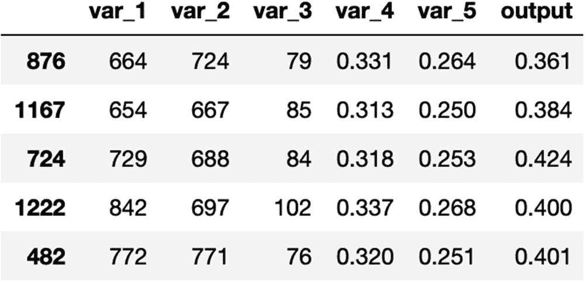

```py
[In]: df=pd.read_csv('Linear_regression_dataset.csv',header='infer')
[In]: df.sample(5)
[Out]:

```

因为我们的想法不是构建一个超级强大的模型，而是部署一个 ML 模型，所以我们不需要将这些数据分成训练集和测试集。我们拟合了一个线性回归模型，得到了一个不错的 r 平方值。

```py
[In]: X=df.loc[:,df.columns !='output']
[In]: y=df['output']
[In]: lr = LinearRegression().fit(X, y)
[In]: lr.score(X,y)
[Out]: 0.8692670151914198

```

下一步是保存训练好的模型，该模型可以在作为 web 服务提供时加载回来。我们利用了序列化模型的`joblib`库(将输入变量的系数值保存为字典)。

```py
[In]: joblib.dump(lr,'inear_regression_model.pkl')

```

现在我们已经保存了模型，我们可以创建主`app.py`文件，它将启动 Flask 服务器，将 ML 模型作为 web 应用程序运行。

```py
[In]: import pandas as pd
[In]: import numpy as np
[In]: import sklearn
[In]: import joblib
[In]: from flask import Flask,render_template,request
[In]: app=Flask(__name__)

[In]: @app.route('/')
[In]: def home():
            return render_template('home.html')

[In]: @app.route('/predict',methods=['GET','POST'])

[In]: def predict():
      if request.method =='POST':
            print(request.form.get('var_1'))
            print(request.form.get('var_2'))
            print(request.form.get('var_3'))
            print(request.form.get('var_4'))
            print(request.form.get('var_5'))
            try:

                  var_1=float(request.form['var_1'])
                  var_2=float(request.form['var_2'])
                  var_3=float(request.form['var_3'])
                  var_4=float(request.form['var_4'])
                  var_5=float(request.form['var_5'])
                  pred_args=[var_1,var_2,var_3,var_4,var_5]
                  pred_arr=np.array(pred_args)
                  preds=pred_arr.reshape(1,-1)
                  model=open("linear_regression_model.pkl","rb")
                  lr_model=joblib.load(model)
                  model_prediction=lr_model.predict(preds)
                  model_prediction=round(float(model_prediction),2)
            except ValueError:
                  return "Please Enter valid values"
      return render_template('predict.html',prediction=model_prediction)
[In]: if __name__=='__main__':
            app.run(host='0.0.0.0')

```

让我们过一遍步骤，了解一下`app.py`文件的细节。首先，我们从 Python 导入所有需要的库。接下来，我们创建第一个函数，它是呈现 HTML 模板的主页，允许用户填充输入值。下一个功能是发布模型对用户提供的输入值的预测。我们将输入值保存到来自用户的五个不同变量中，并创建一个列表(`pred_args`)。然后我们把它转换成一个 numpy 数组。我们把它重塑成想要的形式，以便能够对它做出预测。下一步是加载训练好的模型(`linear_regression_model.pkl`)并进行预测。我们将最终输出保存到一个变量中(`model_prediction`)。然后，我们通过另一个 HTML 模板`predict.html`发布这些结果。如果我们现在在终端中运行主文件(`app.py`)，我们会看到页面出现，要求用户填写值，如图 3-1 所示。

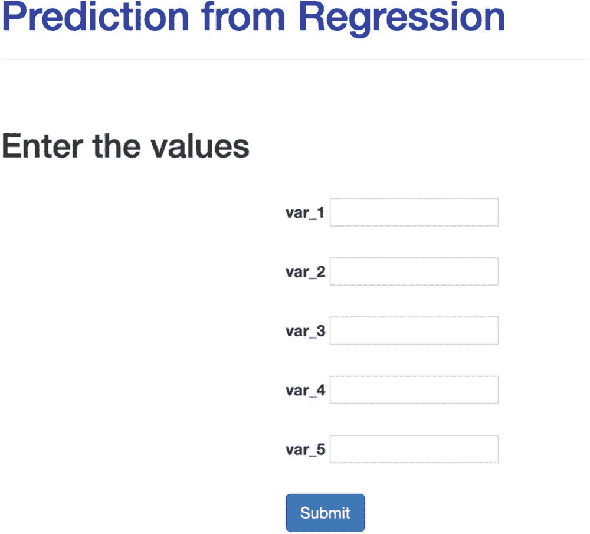

图 3-1

最大似然预测的输入

### 模板

我们必须设计两个网页，向服务器发送请求并接收响应消息，该响应消息是 ML 模型对特定请求的预测。由于本书并不关注 HTML，你可以简单地使用这些文件，不需要对它们做任何修改，如图 3-2 所示。但是对于好奇的读者来说，我们正在创建一个表单来请求五个不同变量中的五个值。我们使用一个带有一些基本字段的标准 CSS 模板。预先了解 HTML 的用户可以根据自己的需求随意重新设计主页。

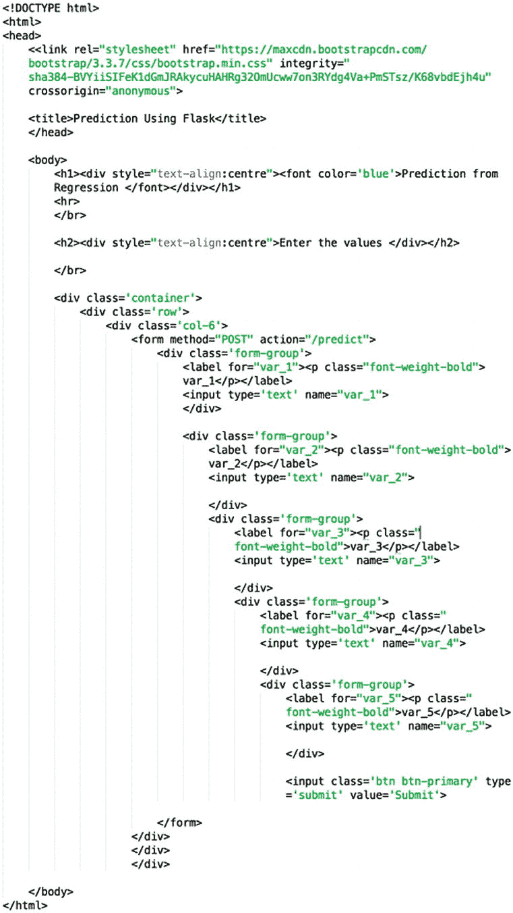

图 3-2

输入请求 HTML 表单

下一个模板是向用户发布模型预测。与第一个模板相比，这没有那么复杂，因为只有一个值需要返回给用户，如图 3-3 所示。

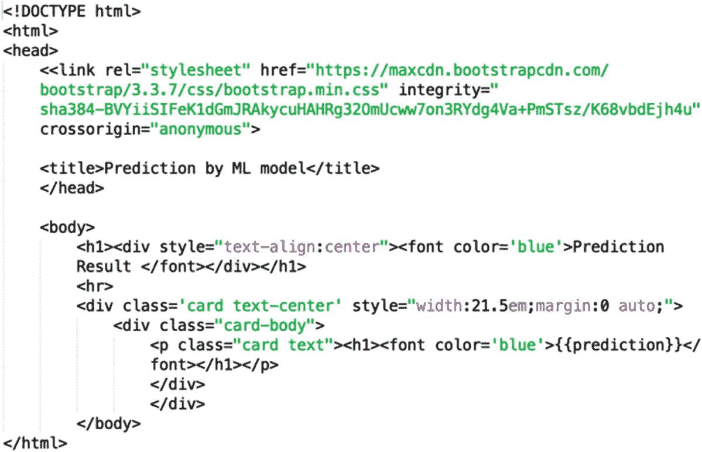

图 3-3

模型预测 HTML 表单

让我们继续输入模型预测值，如图 3-4 所示。正如我们在图 3-5 中所观察到的，模型预测结果是一个连续变量，因为我们已经训练了一个回归模型。

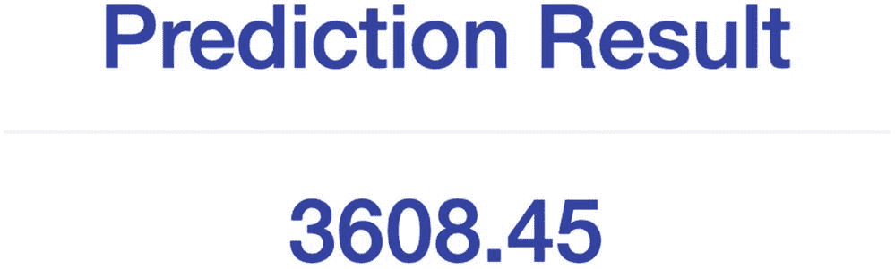

图 3-5

模型预测法

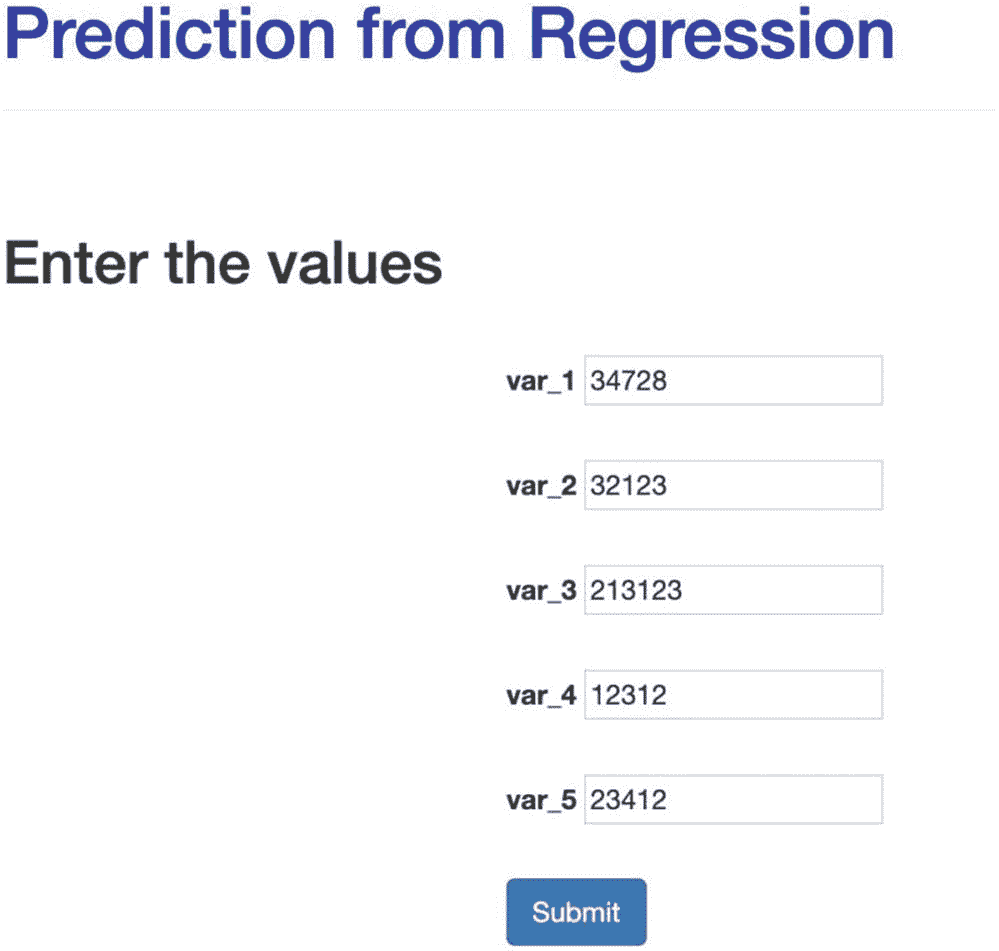

图 3-4

用户输入页面

正如我们所见，Flask 使得将机器学习应用部署为 web 服务变得很容易。使用 Flask 的一个缺点是，因为它是一个轻量级的 web 框架，所以处理复杂应用程序的能力有限。另一个缺点是，大多数数据科学家不习惯使用 HTML 和 JavaScript 来创建应用程序的前端。因此，在下一节中，我们将看看一个更简单的替代方案，使用 Streamlit 部署机器学习应用程序。与 Flask 相比，这使得为应用程序开发简单的 UI 更加容易。

## 使用细流部署机器学习模型

Streamlit 是 Flask 的替代方案，用于将机器学习模型部署为 web 服务。使用 Streamlit 的最大优势是它允许您在应用程序 Python 文件中使用 HTML 代码。它本质上不需要为前端 UI 提供单独的模板和 CSS 格式。但是，对于更复杂的应用程序，建议您为模板和样式指南创建单独的文件夹。要安装 Streamlit，我们可以简单地使用`pip`在我们的终端中安装 Streamlit。

我们将使用构建 Flask 应用程序模型时使用的相同数据集。唯一要改变的内容在`app.py`文件中。第一组命令是导入所需的库，如`joblib`和`streamlit`。

```py
[In]: import pandas as pd
[In]: import numpy as np
[In]: import joblib
[In]: import streamlit

```

在下一步中，我们导入经过训练的线性回归模型，以便能够对测试数据进行预测。

```py
[In]: model=open("linear_regression_model.pkl","rb")
[In]: lr_model=joblib.load(model)

```

下一步是定义一个函数，使用训练好的模型进行预测。我们在函数中传递五个输入参数，并做一些整形和数据转换，以确保预测的一致性。然后，我们创建一个变量来保存模型预测结果，并将其返回给用户。

```py
[In]: def lr_prediction(var_1,var_2,var_3,var_4,var_5):
      pred_arr=np.array([var_1,var_2,var_3,var_4,var_5])
      preds=pred_arr.reshape(1,-1)
      preds=preds.astype(int)
      model_prediction=lr_model.predict(preds)
          return model_prediction

```

下一步，我们创建最重要的函数。我们接受来自浏览器的用户输入，并在网页上呈现模型的最终预测。我们可以给这个函数起任何名字。比如我用过`run`(因为它和 Flask 的`app.run`做的是一样的事情)。在这个功能中，我们包括前端代码，以及如定义标题，主题，颜色，背景等。为了简单起见，我保持了它的基本性，但是它可以有多层次的增强。有关更多详情，您可以访问 Streamlit 网站。接下来，我们创建五个输入变量来接受来自浏览器的用户输入值。这是使用 Streamlit 的`text_input`功能完成的。最后一部分包含模型预测，它从前面定义的`lr_prediction`函数获得输入，并通过`streamlit.button`在浏览器中呈现。

```py
[In]: def run():
            streamlit.title("Linear Regression Model")
            html_temp="""

            """
            streamlit.markdown(html_temp)
 var_1=streamlit.text_input("Variable 1")
 var_2=streamlit.text_input("Variable 2")
 var_3=streamlit.text_input("Variable 3")
 var_4=streamlit.text_input("Variable 4")
 var_5=streamlit.text_input("Variable 5")

            prediction=""

            if streamlit.button("Predict"):
                  prediction=lr_prediction(var_1,var_2,var_3,var_4,var_5)
      streamlit.success("The prediction by Model : {}".format(prediction))

```

现在我们已经有了应用程序文件中提到的所有步骤，我们可以调用 main 函数(在我们的例子中是`run`)并使用`streamlit run`命令来运行应用程序。

```py
[In]: if __name__=='__main__':
      run()
[In]: streamlit run app.py

```

一旦我们运行前面的命令，我们将很快看到应用程序启动并在端口 8501 上运行，如图 3-6 所示。我们只需点击链接，进入应用程序。

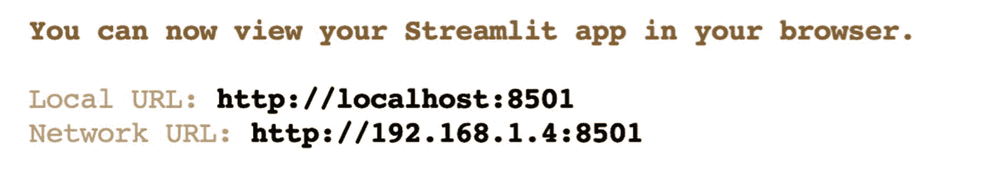

图 3-6

访问跑步应用

一旦我们到达`http://localhost:8501/`，我们将看到如图 3-7 所示的屏幕。

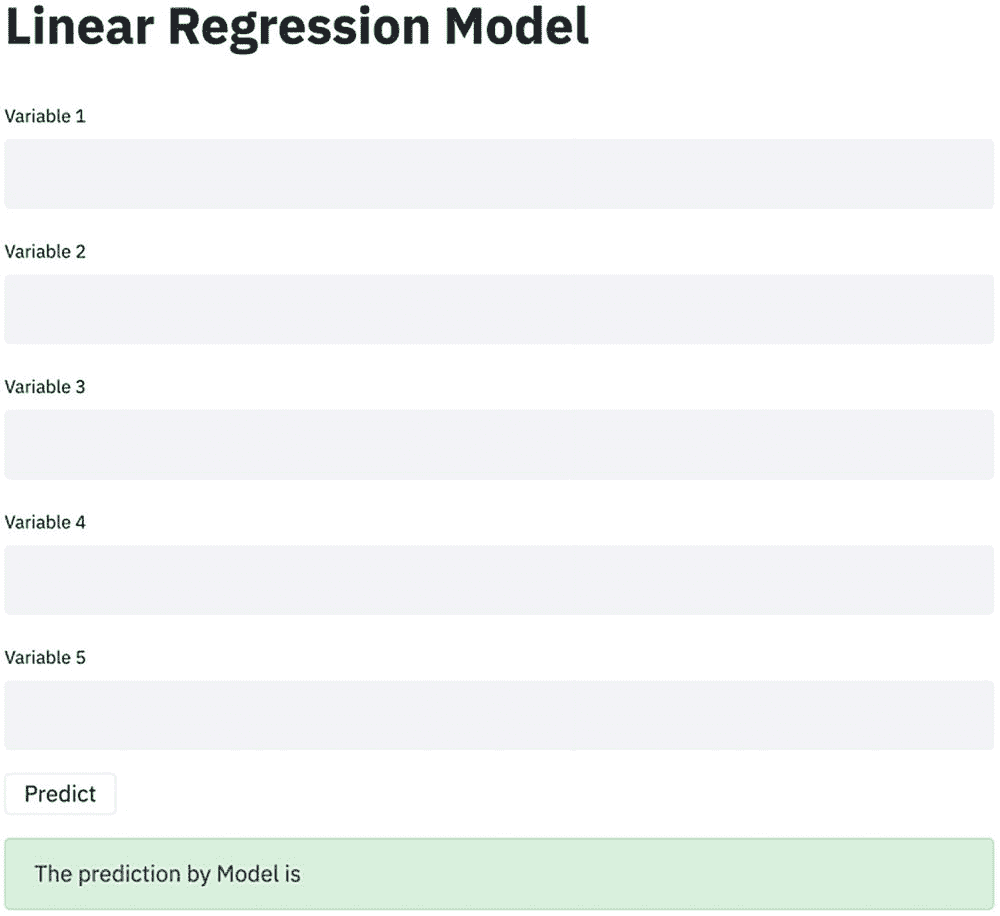

图 3-7

用户输入页面

如您所见，我们在 UI 中没有任何花哨的东西，但它服务于我们能够在幕后与模型/应用程序交互的总体目的。它类似于我们用 Flask 构建的东西，但是它需要的 HTML 和 CSS 代码要少得多。我们现在可以继续填充值，如图 3-8 所示，并获得模型预测。为了便于比较，我们填充了与基于 Flask 的应用程序中相同的值。

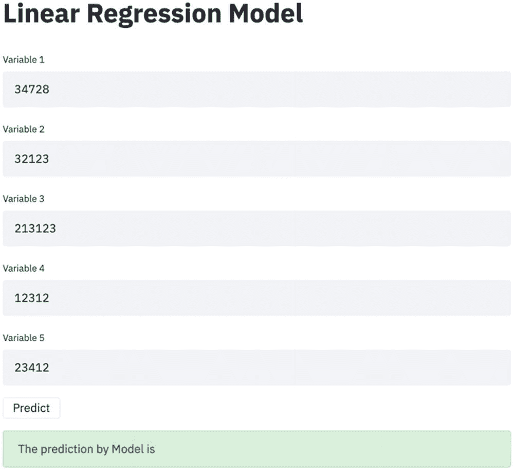

图 3-8

为模型提供输入值

填入数值后，我们需要点击预测按钮来获取模型预测结果和*voilà*——这是我们在基于烧瓶的 app 中得到的相同数字，如图 3-9 所示。

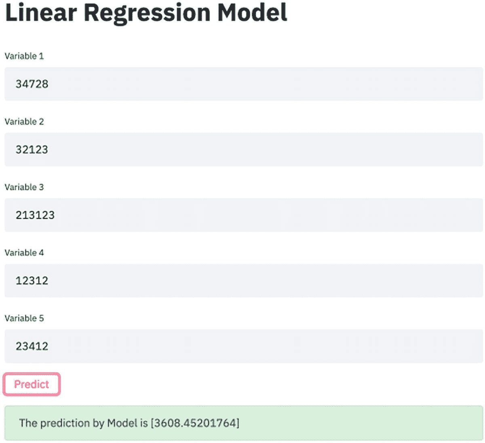

图 3-9

模型预测法

现在我们已经看到了如何使用 Flask 和 Streamlit 部署传统的机器学习模型，我们可以继续本章的最后一个主题，重点是将深度学习模型(LSTM)部署为 web 服务。

## 部署深度学习模型

在本章的前几节中，我们介绍了使用两种不同的框架构建和部署机器学习模型(线性回归)的过程。

*   瓶

*   细流

在本节中，我们将了解如何构建深度学习模型，并使用 Streamlit 部署它。特别是，我们建立了一个基于 LSTM 的神经网络来预测给定评论的情绪。众所周知，LSTM/RNNs 是建立序列模型和捕捉预测输入顺序的有效方法。我们将使用开源评论数据集，并训练一个 LSTM 模型来预测评论的情绪。然后，我们使用 Streamlit 将该模型作为 web 服务提供。同样，在前面的案例中，重点不是训练一个完美的模型，而是一个合适的模型，并部署它。除了一些额外的组件，如文本处理和处理输入数据(用户检查)的标记器之外，基本原理与以前相同。我们正在利用 Streamlit 来避免大量的模板、HTML 和 CSS 东西，并使部署深度学习模型变得容易。

## 培训 LSTM 模型

对于那些不熟悉 RNN/LSTMs 的人，我建议你们多读一些关于它们的内容，以了解它们是如何工作的，以及它们何时可以用于预测。第一步是导入所有需要的库。

```py
[In]: import numpy as np
[In]: import pandas as pd
[In]: from tensorflow.keras.models import Sequential
[In]: from tensorflow.keras.layers import LSTM,Embedding
[In]: from tensorflow.keras.layers import Dense
[In]: from tensorflow.keras.preprocessing.text import Tokenizer
[In]: from tensorflow.keras.preprocessing.sequence import pad_sequences
[In]: from sklearn.model_selection import train_test_split
[In]: from keras.utils.np_utils import to_categorical
[In]: import re
[In]: import pickle

```

下一步是加载数据并检查数据的大小。

```py
[In]: df = pd.read_csv('reviews_dataset.tsv.zip',header=0, delimiter="\t", quoting=3)

[In]: df = df[['review','sentiment']]

```

如我们所见，我们的数据集中有 25，000 条记录和两个相等的情感类别。

```py
[In]: df.shape
[Out]: (25000, 2)

[In]: df.sentiment.value_counts()
[Out]:
1    12500
0    12500

```

接下来，我们应用一些文本预处理，使用正则表达式来清理评论。

```py
[In]: df['review'] = df['review'].apply(lambda x: x.lower())
[In]: df['review'] = df['review'].apply((lambda x: re.sub('[^a-zA-z0-9\s]','',x)))

```

我们将特征的数量限制为 1000，并将评论标记化，并添加填充以使每个评论的大小相同。

```py
[In]: max_features = 1000
[In]: tokenizer = Tokenizer(num_words=max_features, split=' ')
[In]: tokenizer.fit_on_texts(df['review'].values)
[In]: X = tokenizer.texts_to_sequences(df['review'].values)
[In]: X = pad_sequences(X)
[In]: X.shape

(25000, 1473)

```

然后，我们保持嵌入层大小为 50。

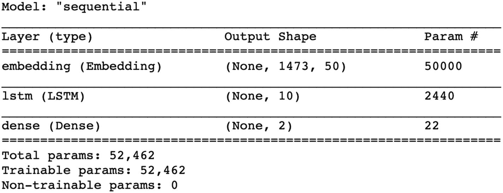

```py
[In]: embed_dim = 50

[In]: model = Sequential()
[In]: model.add(Embedding(max_features, embed_dim,input_length = X.shape[1]))
[In]: model.add(LSTM(10))
[In]: model.add(Dense(2,activation='softmax'))
[In]: model.compile(loss = 'categorical_crossentropy', optimizer="adam",metrics = ['accuracy'])
[In]: print(model.summary())
[Out]:

```

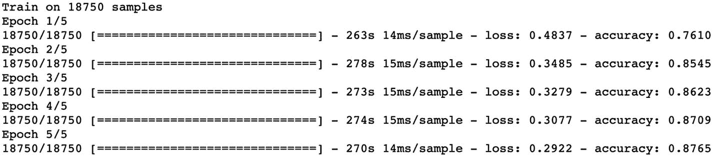

```py
[In]: y = pd.get_dummies(df['sentiment']).values
[In]: X_train, X_test, y_train, y_test = train_test_split(X,y, test_size = 0.25, random_state = 99)
[In]: print(X_train.shape,y_train.shape)
[In]: print(X_test.shape,y_test.shape)

[Out]:
(18750, 1473) (18750, 2)
(6250, 1473) (6250, 2)

[In]: model.fit(X_train, y_train, epochs = 5, verbose = 1)

```

现在我们已经训练了 LSTM 模型，让我们试着通过一个测试来查看模型的预测。

```py
[In]: test = ['Movie was pathetic']
[In]: test = tokenizer.texts_to_sequences(test)
[In]: test = pad_sequences(test, maxlen=X.shape[1], dtype="int32", value=0)
[In]: print(test.shape)
[In]: sentiment = model.predict(test)[0]
      if(np.argmax(sentiment) == 0):
          print("Negative")
      elif (np.argmax(sentiment) == 1):
          print("Positive")
[Out]: Negative

```

正如我们所看到的，该模型能够很好地预测测试评论。下一步是使用 pickle 保存模型和标记器，并在以后加载它，以便对用户输入评论进行预测。

```py
[In]: with open('tokenizer.pickle', 'wb') as tk:
      pickle.dump(tokenizer, tk, protocol=pickle.HIGHEST_PROTOCOL)

[In]: model_json = model.to_json()
      with open("model.json", "w") as js:
js.write(model_json)

[In]: model.save_weights("model.h5")

```

现在我们已经保存了训练好的模型和标记器，我们可以创建类似于前面的`app.py`脚本的应用程序脚本。

```py
[In]: import os
[In]: import numpy as np
[In]: import pandas as pd
[In]: import pickle
[In]: import tensorflow
[In]: from tensorflow.keras.preprocessing.text import Tokenizer
[In]: from tensorflow.keras.preprocessing.sequence import pad_sequences
[In]: import tensorflow.keras.models
[In]: from tensorflow.keras.models import model_from_json
[In]: import streamlit
[In]: import re
[In]: os.environ['TF_CPP_MIN_LOG_LEVEL'] = '2'

```

导入所需库后的步骤是加载记号化器和深度学习模型。

```py
[In]: with open('tokenizer.pickle', 'rb') as tk:
      tokenizer = pickle.load(tk)

[In]: json_file = open('model.json','r')
[In]: loaded_model_json = json_file.read()
[In]: json_file.close()
[In]: lstm_model = model_from_json(loaded_model_json)

[In]: lstm_model.load_weights("model.h5")

```

接下来，我们创建一个助手函数来清理输入审查，将其标记化，并填充序列。一旦它被转换成数字形式，我们将使用加载的 LSTM 模型来进行情绪预测。

```py
[In]: def sentiment_prediction(review):
    sentiment=[]
input_review = [review]
input_review = [x.lower() for x in input_review]
input_review = [re.sub('[^a-zA-z0-9\s]','',x) for x in input_review]

input_feature = tokenizer.texts_to_sequences(input_review)
input_feature = pad_sequences(input_feature,1473, padding="pre")
    sentiment = lstm_model.predict(input_feature)[0]

    if(np.argmax(sentiment) == 0):
pred="Negative"
    else:
pred= "Positive"

    return pred

```

最后，我们创建 run 函数来加载 HTML 页面，并使用 Streamlit 功能接受用户输入(类似于前面的模型部署)。唯一的区别是，这次我们只加载一个评论，而不是加载多个输入。然后，我们将这个评论传递给前面创建的情绪预测函数。

```py
[In]: def run():
streamlit.title("Sentiment Analysis - LSTM Model")
html_temp="""

    """

streamlit.markdown(html_temp)
    review=streamlit.text_input("Enter the Review ")
    prediction=""

    if streamlit.button("Predict Sentiment"):
        prediction=sentiment_prediction(review)
streamlit.success("The sentiment predicted by Model : {}".format(prediction))

[In]: if __name__=='__main__':
      run()

```

一旦我们在终端中使用`streamlit run`命令运行`app.py`文件，我们可以看到 web 服务正在本地主机端口 8501 上运行，如图 3-10 所示。

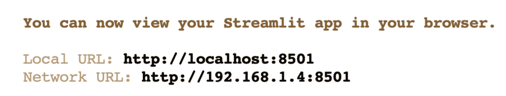

图 3-10

访问 ML 应用程序

```py
[In]: streamlit run app.py

```

我们可以在端口 8501 上访问 ML 服务，并且可以看到 ML 应用程序成功运行。该页面包含三个内容。

*   提供用户评论的占位符

*   预测情绪按钮(使用模型进行预测)

*   模型的最终结果

让我们在输入框中提供一个评论并检查模型预测，如图 3-11 所示。首先，我们提供一个正面评论，并点击预测情绪按钮，如图 3-12 所示。

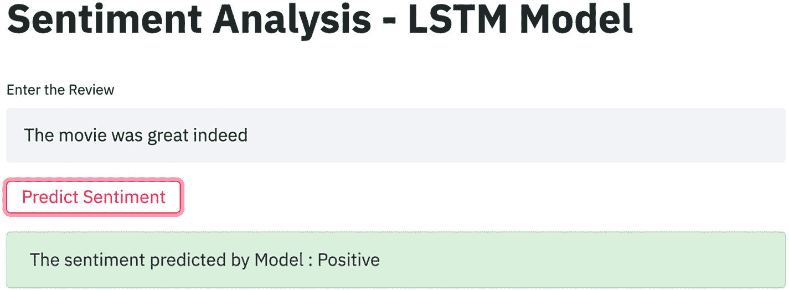

图 3-12

正面评论预测

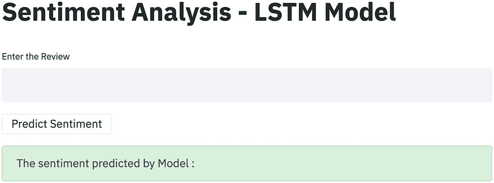

图 3-11

用户输入页面

正如我们可以观察到的，模型预测的结果似乎是正确的，因为它也预测这是一个积极的评论。我们尝试进行另一项审查——这次是否定的——并测试模型预测，如图 3-13 所示。对于第二次审查，我们也通过模型得到了正确的预测。我们可以用一个更强大、训练有素和优化的模型来取代现有的模型，以获得更好的预测。

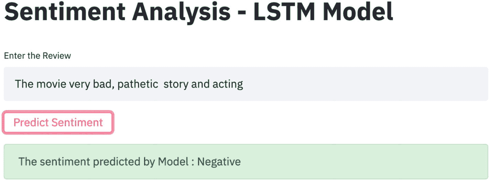

图 3-13

负面评论预测

## 结论

在这一章中，我们回顾了 Flask 及其不同组件的基础知识。我们还看到了使用 Flask 构建和部署机器学习模型的过程。最后，我们探索了另一个部署 ML 模型的平台 Streamlit 及其相对于 Flask 的优势。