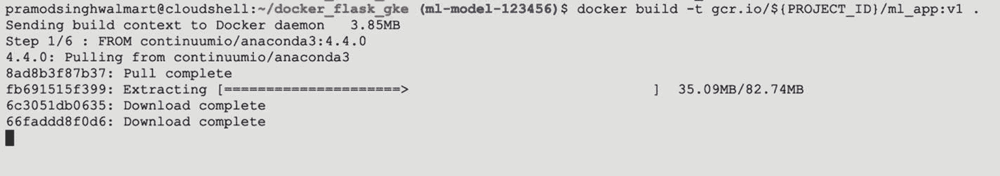

# 五、使用 Kubernetes 的机器学习部署

在前一章中，我们看到了如何使用 Flask 来封装和部署一个应用程序。在本章中，我们将使用编排平台(Kubernetes)部署相同的 ML 应用程序。本章涵盖两个主要主题。它首先介绍了 Kubernetes 平台的基础知识以及它如何处理部署。然后这一章讲述了如何使用 Kubernetes 部署 ML 应用程序。更具体地说，本章涵盖以下内容:

*   什么是 Kubernetes

*   谷歌云平台

*   使用 Kubernetes 的 ML 模型部署

Kubernetes 是一个用于部署和管理大型容器的开源容器编排引擎。它具有多种杠杆来管理调度、集群、部署和负载平衡，并且在使用容器运行微服务方面具有更多功能。Kubernetes 最初是在谷歌创建的，后来捐赠给了云本地计算基金会(CNCF)。它现在由 CNCF 管理和维护，在全球拥有强大的社区支持和用户。使用 Kubernetes 的主要优势是能够运行大量的容器，而不用担心部署和集群管理细节。举个例子，Google 使用 Kubernetes 为用户运行大约 25 亿个容器。尽管有其他容器编排平台，如 Apache Mesos 的 Docker Swarm 和 Marathon，但 Kubernetes 很快成为用户的默认 COE，原因有两个。首先，它已经在极端情况下经过了反复测试(自从它在谷歌开发以来)。第二，它有丰富的特性和复杂的底层架构，允许它运行高度可伸缩的服务。

Kubernetes 可在不同的云平台上使用，如谷歌云平台的谷歌 Kubernetes 引擎(GKE)、AWS EC2 容器服务和微软 Azure 容器。在这一章中，我们将利用 GKE 来部署 ML 应用程序。可以使用类似的方法在 AWS 和 Azure 上部署它，但 Google 为其用户提供了一些免费的积分，可以很容易地用来完成这一部署。

## 不可思议的建筑

幕后的 Kubernetes 像任何其他分布式应用程序一样工作。它的工作原理是主从节点。主节点向负责计算和执行任务的工作节点发出命令/指令。在 Kubernetes 的情况下，也可以有一个以上的主人。工作节点通常是用于计算和存储数据的虚拟机。如果我们观察 Kubernetes 的架构，如图 [5-1](#Fig1) 所示，我们可以观察到它有两个主要部分。


图 5-1

不可思议的建筑

*   掌握

*   工人

用于与 Kubernetes 对象交互的 CLI 工具称为`kubectl`。

## 忽必烈大师

Kubernetes *master* 负责运行整个集群，并确保 pods 的调度和供应(参见“Worker Nodes”一节)。像分布式应用程序的任何其他主节点一样，它负责通信和跟踪工作节点的状态，并在工作节点出现故障时提供一个健康的节点。在 Kubernetes master 中，有四个主要组件。

*   *API 服务器*:这个组件允许我们与不同的 Kubernetes 对象进行交互。它为不同的对象(如 pod、部署、负载平衡器等)验证和配置 API。它允许我们添加、删除、更新和显示关于 Kubernetes 对象的信息。如前所述，我们使用`kubectl`与 API 服务器进行交互。这有点类似于我们在 Docker 中看到的(Docker CLI 和 Docker server 之间的关系)。

*   *调度器*:master 内部的另一个重要组件是调度器。顾名思义，它负责根据声明的配置(如内存大小、CPU 内核等)调度集群内部的 pod(工作节点)。

*   *控制管理器*:该组件负责确保集群健康，并且所需数量的工作节点处于健康状态，特定的 pod 在其中运行。

*   *etcd* :该组件以键值的形式捕获集群的当前状态。它是一个分布式轻量级的键值数据库。

## 工作节点

工作节点是云中的典型虚拟机或数据中心的物理服务器。它们负责计算和存储正在运行的应用程序的数据。每个 worker 节点必须有一个容器运行时(Docker/rkt ),以便能够在其中运行容器。每个工作节点能够在其中运行一个或多个 pod。豆荚是库伯内特最基本的单位。Pods 本质上是 Kubernetes 中的调度单元，包含一个或多个容器。理想情况下，每个 pod 应该包含一个容器，但是在依赖容器的情况下，它们可以在同一个 pod 中运行。pod 就像包裹容器的包裹物，允许我们与容器内部的容器进行交互。worker 节点中有两个额外的组件帮助与 Kubernetes 主节点通信。

*   `kubelet`:这是在每个工作节点上运行的主节点代理。它确保在 pod 内部运行的容器符合提交给 API 服务器的规范。如果观察到任何更改或任何 pod 关闭，它会根据配置信息在同一节点上启动一个新的 pod，并使用新的容器。

*   `kube-proxy`:该组件负责维护集群的分布式网络配置。它管理节点、单元和单元内部运行的容器的网络配置，并确保外部世界可以访问正在运行的服务。

## ML 应用程序使用 kubernetes

现在我们对 Kubernetes 平台有了基本的了解，我们可以进入本章的第二部分，使用 Kubernetes 部署一个 ML 应用程序。要使用 Kubernetes 部署我们的应用程序，第一步是将本地代码推送到 Git repo 中，以便我们稍后可以克隆它。在理想情况下，数据通常存储在 Google 存储桶中，但是为了简单起见，我们将所有东西都打包在 Docker 映像中，因为我们没有大型数据集。如前所述，我们将使用 GCP 来利用谷歌提供的免费积分，以使用云资源，如谷歌 Kubernetes 引擎。

## 谷歌云平台

谷歌云平台是一个巨大的平台，包含许多工具和服务，可以满足各种需求。不可能涵盖 GCP 的所有方面，因此我们将重点关注某些服务来部署 ML 应用程序。我们将使用一些组件，如 GKE 和谷歌容器注册(GCR)为我们的部署。使用 GCP 的先决条件是创建一个谷歌账户，并通过访问 [`https://console.cloud.google.com/`](https://console.cloud.google.com/) 登录谷歌云平台。

Note

在 GCP 使用的每一种工具和服务都是有成本的，因此我们鼓励读者在 Google 控制台的详细页面上了解更多关于费率的信息。但是，对于这种部署，Google 提供的免费积分就足够了。

登录后，第一步是在 Google 控制台中创建新项目。这就是我们如何为这个特殊的项目分配单独的资源。我们可以根据自己的喜好给这个项目命名，如图 [5-2](#Fig2) 所示。例如，在这种情况下，我将这个新项目命名为`ml-model`，如图 [5-3](#Fig3) 所示。


图 5-3

GCP 的新项目


图 5-2

GCP 项目

新项目一旦创建，就会反映在主页的项目信息页签上，如图 [5-4](#Fig4) 所示。它将包含一个项目名称和一个项目 ID。还有一个选项，如果有更多的人在这个项目上工作，可以向这个项目添加更多的人。


图 5-4

GCP 项目信息

成功创建项目后，我们需要启用部署应用程序所需的其他服务。我们需要选择的第一个服务是容器注册 API。GCP 的容器注册中心允许我们访问 Google 项目中的 Docker 图像，并将其部署到 Kubernetes 上。为此，我们转到 GCP 菜单选项卡并选择容器注册表，如图 [5-5](#Fig5) 所示。容器注册表下有两个选项。

*   形象

*   设置

我们需要选择图像，默认情况下，如果我们查看图像内部，它应该显示一个空窗格，如图 [5-6](#Fig6) 所示。这是因为我们还没有在容器注册表中推送任何图像。如果您以前为其他应用程序使用过 Container Registry，您可能会有以前的图像，但是对于新用户，它不应该包含任何以前的图像。


图 5-5

GCP 的集装箱注册菜单项

要使用 Docker 映像并将其推送到容器注册表，我们应该通过选择 enable 选项来启用容器注册表 API，如图 [5-7](#Fig7) 所示。


图 5-7

启用容器注册 API


图 5-6

容器注册表中的图像

我们必须启用的下一个 API 是针对 Kubernetes 引擎本身的。在主菜单选项卡上选择 APIs & Services 选项，选择 Dashboard，如图 [5-8](#Fig8) 所示。


图 5-8

启用 API 和服务项目

仪表板将提供对 GCP 上整个 API 库的访问，我们现在可以搜索特定于 Kubernetes 的 API，如图 [5-9](#Fig9) 所示。


图 5-9

API 库

一旦我们搜索了 Kubernetes API，我们就可以选择启用 Kubernetes 引擎 API，如图 [5-10](#Fig10) 所示。继续并单击启用选项；完全启用它可能需要几分钟时间。


图 5-10

库柏引擎 API

现在我们已经创建了一个新项目并启用了所需的服务，我们可以开始 Google Cloudshell 中的配置步骤了。我们可以通过点击窗口右上角的终端图标来打开 Google Cloudshell，如图 [5-11](#Fig11) 所示。


图 5-11

启用 Google Cloudshell

一旦终端打开，第一步就是在源代码/数据可用的地方克隆 Git repo。在这种情况下，我们克隆了`docker_flask_gke.git`回购，如图 [5-12](#Fig12) 所示。


图 5-12

克隆应用程序文件

为了确认一切都已正确设置，我们进入新的克隆文件夹，运行一个快速的`ls`命令，看看文件和代码是否在 Google Cloudshell 文件夹中。下一步是创建一些环境变量来保持部署的一致性。我们声明项目 ID 变量，这是我们在开始时创建的项目 ID。下一步是使用目录中的 Docker 文件构建 Docker 映像。由于格式与我们在本地系统上使用的格式相同，我们可以利用相同的 Docker 文件来构建新的 Docker 映像。我们使用`docker build`命令并用包含项目 ID 的名称来标记它。构建过程需要一些时间(取决于互联网带宽)。它将运行与我们在上一章看到的相同的步骤来构建 Docker 映像，如图 [5-13](#Fig13) 所示。

```py
[In]: export PROJECT_ID=ml-model-123456
[In]: docker build -t gcr.io/${PROJECT_ID}/ml_app:v1 .

```



图 5-13

建立码头工人形象

在构建过程中，它将检查安装`requirement.txt`文件中提到的依赖项的所有必要步骤，例如设置工作目录，如图 [5-14](#Fig14) 所示。


图 5-14

执行 Dockerfile 命令

我们可以通过使用`docker images`命令列出 Docker 映像来确认映像已经成功构建；新建的图像应该显示出来，如图 [5-15](#Fig15) 所示(因为这个项目没有以前的 Docker 图像)。


图 5-15

Docker 图像

```py
[In]: docker images
[Out]:

```

下一步是通过使用`gcloudauth`命令并将之前创建的 Docker 映像推送到 Google 容器注册中心来提供 Google 身份验证。我们利用`docker push`命令并在 Google 容器注册表中提供它的位置来上传 Docker 图像，如图 [5-16](#Fig16) 所示。


图 5-16

将码头工人形象推向 GCR

```py
[In]: gcloudauth configure-docker
[In]: docker push gcr.io/${PROJECT_ID}/ml_app:v1

```

根据图片大小，推送至 Google 容器注册表可能需要一些时间。一旦完成，我们可以打开容器注册表下的图像，我们上传的 Docker 图像应该出现在`ml_app`文件夹下，如图 [5-17](#Fig17) 所示。


图 5-17

GCR 中的坞站图像

既然我们已经将 Docker 映像推送到容器注册中心，我们就可以设置其他配置了。我们将项目设置为项目 ID，将计算区域设置为 us-central1，并创建一个名为`ml-cluster`的小型双节点群集(选择更高配置的群集可能会花费更多)。

```py
[In]: gcloud config set project $PROJECT_ID
[In]: gcloud config set compute/zone us-central1
[In]: gcloud container clusters create ml-cluster --num-nodes=2

```

如果我们转到 Kubernetes 引擎选项并选择集群，我们将很快看到一个新的集群启动(`ml-cluster`)，它有一个主节点和两个工作节点，如图 [5-18](#Fig18) 所示。


图 5-18

不可思议的群集

既然集群已经启动并运行，我们可以部署 Docker 容器来使用我们之前构建的基本 Docker 映像运行 ML 应用程序。我们使用了`create deployment`命令，并将特定的图像位置作为输入进行传递。我们需要做的另一件事是在端口 5000 上公开部署的应用程序。一旦部署完成，我们就可以使用`get service`命令访问正在运行的服务，如图 [5-19](#Fig19) 所示。


图 5-19

GCR 中的坞站图像

```py
[In]: kubectl create deployment ml-app  --image=gcr.io/${PROJECT_ID}/ml_app:v1

[In]: kubectl expose deployment ml-app --type=LoadBalancer --port 80 --target-port 5000

```

Kubernetes 显示了外部 IP 地址，通过该地址可以访问正在运行的应用程序。我们可以简单地转到那个外部 IP 地址并添加`apidocs`到其中(以访问 Swagger API)，如图 [5-20](#Fig20) 所示。


图 5-20

从外部访问应用程序

我们可以通过将一些虚拟值作为输入传递给模型并单击执行按钮来测试应用程序是否正常运行，如图 [5-21](#Fig21) 所示。


图 5-21

ML 应用程序预测

正如我们所看到的，我们有模型预测，并且该应用程序使用 Kubernetes 在 Google 云平台上成功部署。在部署应用程序时，会出现各种组件，如模型管理、负载平衡、安全性和其他组件，但核心思想是提供一个框架，以便您可以了解该流程，并根据应用程序的复杂性向该方法添加更多杠杆。最后，我们还可以通过使用一些`kubectl`命令来查看部署细节。例如，我们可以通过使用`get deployment`命令来获取活动吊舱，如图 [5-22](#Fig22) 所示。同样的信息可以在 Kubernetes 引擎选项内的工作负载选项卡上查看，如图 [5-23](#Fig23) 所示。


图 5-23

已部署应用的状态


图 5-22

在库比涅斯激活 pods

如果需要，可以使用 Kubernetes 中的`scale deployment`命令增加或减少正在运行的应用程序的副本数量。但是，您还需要增加群集中的节点数量，以满足运行那么多应用程序副本的最低要求。在这种情况下，由于我们使用的是只有两个节点的小型集群，因此我们最多可以有三到四个副本。

```py
[In]: kubectl scale deployment ml-app --replicas=3

```

如前所述，所有这些资源都有相关成本，因此删除这些已用资源以避免任何成本对我们来说很重要。要删除活动集群并移除所有资源，我们需要使用以下命令:

```py
[In]: gcloud container clusters delete ml-cluster

```

建议删除项目和相关文件(图像、数据等)。)以及一旦该过程完成，以避免继续使用 GCP 资源的任何费用。

## 结论

在本章中，我们介绍了 Kubernetes 的基本架构，并使用 Kubernetes 在 Google 云平台上部署了一个机器学习应用程序。