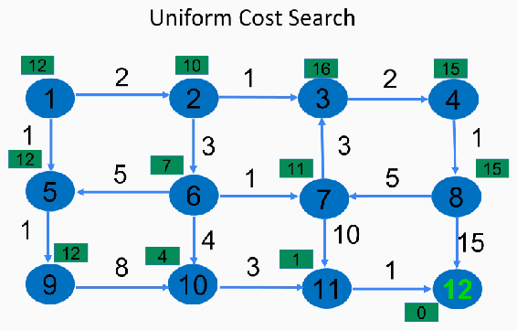
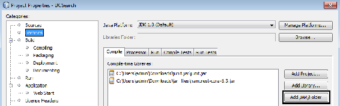
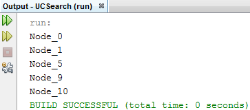
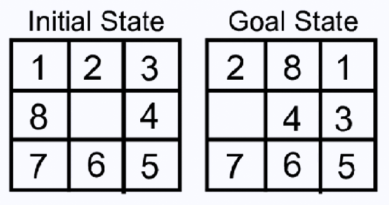
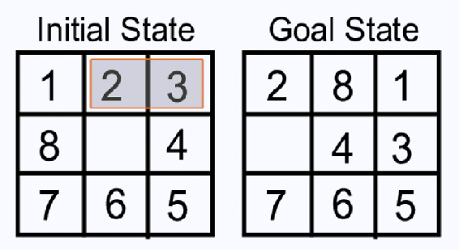
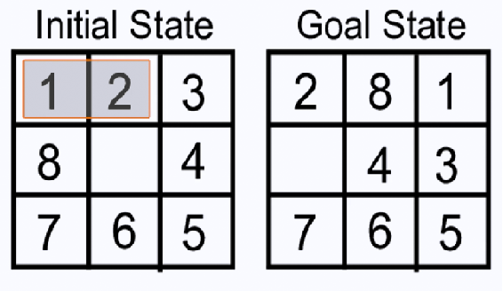
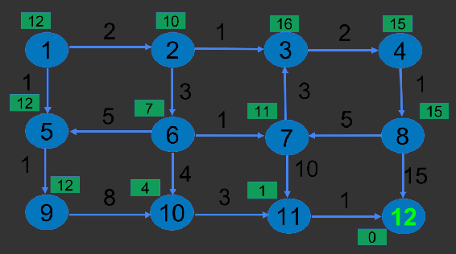
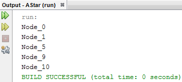

# 二、探索搜索算法

在这一章中，我们将看看如何执行搜索，我们将涵盖实现搜索算法的基本要求。然后，我们将通过实现 Dijkstra 的算法来练习，然后继续进行启发式搜索，展示如何在搜索算法中使用它们来提高搜索结果的准确性。

特别是，我们将关注以下主题:

*   搜索简介
*   实现 Dijkstra 的搜索
*   理解启发式的概念
*   A*算法简介
*   实现 A*算法


# 搜索简介

让我们看看搜索是什么意思。如果我们想对任何问题进行搜索，我们将需要四个输入，它们被称为状态空间，如下所示:

*【S，S，O，G】*

上述输入类型可描述如下:

*   一组隐式给定的状态——在搜索过程中可能被探索的所有状态。
*   **s** :开始符号——搜索的起点。
*   **O** :状态转换操作符，指示搜索应该如何从一个节点进行到下一个节点，以及什么转换可用于搜索。这是一份详尽的清单。因此，状态转换操作符跟踪这些穷举列表。
*   **G** :目标节点，指向搜索应该结束的地方。

根据前面的信息，我们可以找到以下值:

*   目标状态的最小成本事务处理
*   向最低成本目标的一系列转变
*   最低成本目标的最低成本交易

让我们考虑下面的算法，它假设所有的操作符都有一个成本:

1.  初始化:设置*打开= {s}* ，

*关闭= {}* ，设置 *C(s) = 0*

2.  失败:如果 *OPEN = {}* ，失败终止
3.  选择:选择最小成本状态， *n* ，形成*打开，*，保存*关闭*中的 *n*
4.  终止:如果 *n ∈ G* ，成功终止
5.  展开:使用 *0* 生成 *n* 的后继

对于每个后继者， *m* ，仅当 *m ∉【打开∪关闭】*时，在*打开*中插入 *m*

设置 *C(m) = C(n) + C(n，m)*

并将 *m* 插入*开口*

如果 *m ∈【开∪关】*

设置 *C(m) = min{ C(m)，C(n) + C(m，n)}*

如果 *C(m)* 已经减少并且 *m ∈关闭*移动到*打开*

6.  循环:转到步骤 2

前述算法的每个状态可以描述如下:

1.  **初始化**:我们初始化算法并创建一个名为 *OPEN* 的数据结构。我们将我们的开始状态 *s* 放入这个数据结构中，并再创建一个数据结构 *CLOSE* ，它是空的。我们将要探索的所有状态都将从*打开*进入*关闭*。我们将初始开始状态的成本设置为 *0* 。这将计算从起始状态行进到当前状态时发生的成本。从开始状态到开始状态的旅行成本是*0*；这就是我们将它设置为 *0* 的原因。
2.  **Fail** :在此步骤中，如果 *OPEN* 为空，我们将失败终止。然而，我们的*开*不是空的，因为我们有 *s* 处于我们的开始状态。因此，我们不会以失败告终。

3.  **选择状态**:这里我们将选择最小代价后继者 *n* ，从*打开*中取出，保存在*关闭*中。
4.  **终止**:在这一步，我们将检查 *n* 是否属于 *G* 。如果是，我们将成功结束。
5.  **展开**:如果我们的 *n* 不属于 *G* ，那么我们需要使用我们的状态转移运算符展开 *G* ，如下:
    *   如果它是一个新节点， *m* ，并且我们没有探索它，这意味着它在*打开*或*关闭*中都不可用，我们将简单地通过计算其前任的成本加上从 *n* 到 *m* 的旅行成本来计算新后继( *m* )的成本，并且我们将该值放入*打开*
    *   如果它是*打开*和*关闭*的一部分，我们将检查哪一个是最小成本——当前成本或先前成本(我们在先前迭代中的实际成本)——并且我们将保留该成本
    *   如果我们的 *m* 减少，并且它属于*关闭*，那么我们将把它带回*打开*
6.  **循环**:我们将继续这样做，直到我们的*开*不为空，或者直到我们的 *m* 不属于 *G* 。

考虑下图所示的示例:



最初，我们有以下算法:

*n(S) = 12 | s = 1 | G = {12}*

在前面的算法中，以下情况适用:

*   *n(S)* 是状态/节点的数量
*   *s* 是开始节点
*   *G* 是目标节点

箭头是状态转换操作符。让我们试着运行这个程序，以检查我们的算法是否有效。

该算法的迭代 1 如下:

第一步:*打开= {1}* ， *C(1) = 0* | *关闭= { }*；这里 *C(1)* 是节点 *1* 的成本

第二步:*打开≦{ }*；转到步骤 3

第三步: *n = 1* | *打开= { }* | *关闭= {1}*

第四步:自*n∉g*；展开 *n=1*

我们得到 *m = {2，5}*

*{2} ∉【开∪关】* | *{5} ∉【开∪关】*

*C(2)= 0+2 = 2*|*C(5)= 0+1 = 1*|*开= {2，5}*

循环至步骤 2

迭代 2 如下:

第二步:*打开≦{ }*所以第三步

第三步: *n = 5* 自 *min{C(2)，C(5)} = C(5)* ，即*1*|*OPEN = { 2 }*|*CLOSE = { 1，5}*

第四步: *n ∉ G* 所以展开一步

步骤展开 *n = 5* : *m = {9}*

*{9} ∉【开∪关】*

*C(9) = 1 + 1 = 2* | *开= {2，9}*

循环至步骤 2

迭代 3 如下:

第二步:*打开≦{ }*所以第三步

第三步: *n = 2* 优先于 *2(2)* 既然先来了| *OPEN = {9}* | *CLOSE = {1，5，2}*

第四步: *n ∉ G* 所以展开一步

步长展开 *n = 2 : m = {6，3}*

*{6} ∉【开∪关】* | *{3} ∉【开∪关】*

*C(6)= 2+3 = 5*|*C(3)= 2+1 = 3*|*开= {9，6，3}*

循环至步骤 2

迭代 4 如下:

第二步:*打开≦{ }*所以第三步

第三步: *n = 9* 自 *min{C(9)，C(6)，C(3)} = C(9)* ，即 *2 |* *OPEN = {6，3}* | *CLOSE = {1，5，2，9}*

第四步: *n ∉ G* 所以展开一步

步骤展开 *n = 9 : m = {10}*

*{10} ∉【开∪关】*

*C(10) = 2 + 8 = 10 | OPEN = {6，3，10}*

循环至步骤 2

迭代 5 如下:

第二步:*打开≦{ }*所以第三步

第三步: *n = 3* 自 *min{C(6)，C(3)，C(10)} = C(3)* ，即 *3 | OPEN = {6，10} | CLOSE = {1，5，2，9，3}*

第四步: *n ∉ G* 所以展开一步

步骤展开 *n = 3 : m = {4}*

*{4} ∉【开∪关】*

*C(4) = 3 + 2 = 5 | OPEN = {6，10，4}*

循环至步骤 2

迭代 6 如下:

第二步:*打开≦{ }*所以第三步

第三步: *n = 6* 优先于 *6(5)* 因为它先出现 *| OPEN = {10，4} | CLOSE = {1，5，2，9，3，6}*

第四步: *n ∉ G* 所以展开一步

步长展开 *n = 6 : m = {5，10，7}*

*{ 5 }∈[开∪闭]| { 10 }∈[开∪闭]| { 7 }∉[开∪闭]*

*C(7) = 5 + 1 = 6 | OPEN = {10，4，7}*

*C(5) = min{C(5)* ， *C(6，5)} = min{1，5 + 5 = 10} = 1*

*C(10) = min{C(10)，C(6，10)} = min{10，6 + 4 = 9} = 9 |* 由于 *C(10)* 已经减少，检查 *C* 是否是*打开*的一部分

循环至步骤 2

第 7 次迭代如下:

第二步:*打开≦{ }*所以第三步

第三步: *n = 4* 自 *min{C(10)，C(4)，C(7)} = C(4)* ，即 *5 | OPEN = {10，7} | CLOSE = {1，5，2，9，3，6，4}*

第四步: *n ∉ G* 所以展开一步

步进展开 *n = 4 : m = {8}*

*{8} ∉【开∪关】*

*C(8) = 5 + 1 = 6 | OPEN = {10，7，8}*

循环至步骤 2

迭代 8 如下:

第二步:*打开≦{ }*所以第三步

第三步: *n = 7* 自 *min{C(10)，C(7)，C(8)} = C(7)* ，即 *6 | OPEN = {10，8} | CLOSE = {1，5，2，9，3，6，4，7}*

第四步: *n ∉ G* 所以展开一步

步骤展开 *n = 7 : m = {11}*

*{11} ∉【开∪关】*

*C(11) = 6 + 10 = 16 | OPEN = {10，8，11}*

循环至步骤 2

迭代 9 如下:

第二步:*打开≦{ }*所以第三步

第三步: *n = 8* 自 *min{C(10)，C(8)，C(11)} = C(8)* ，即 *6 | OPEN = {10，11} | CLOSE = {1，5，2，9，3，6，4，7，8}*

第四步: *n ∉ G* 所以展开一步

步长展开 *n = 8 : m = {12，7}*

*{12} ∉【开∪关】| {7} ∈【开∪关】*

*C(12) = 6 + 15 = 21 | OPEN = {10，11，12}*

*C(7) = min{C(7)，C(8，7)} = min{6，6 + 5 = 11} = 6*

循环至步骤 2

第 10 次迭代如下:

第二步:*打开≦{ }*所以第三步

第三步: *n = 10* 自 *min{C(10)，C(11)，C(12)} = C(10)* ，即 *9 | OPEN = {11，12} | CLOSE = {1，5，2，9，3，6，4，7，8，10}*

第四步: *n ∉ G* 所以展开一步

步进展开 *n = 10 : m = {11}*

*{11} ∈【开∪关】*

*C(11) = min{C(11)，C(10，11)} = min{16，9 + 3 = 12} = 12*

循环至步骤 2

第 11 次迭代如下:

第二步:*打开≦{ }*所以第三步

第三步: *n = 11* 自 *min{C(11)，C(12)} = C(11)* ，即 *12 | OPEN = {12} | CLOSE = {1，5，2，9，3，6，4，7，8，10，11}*

第四步: *n ∉ G* 所以展开一步

步骤展开 *n = 11 : m = {12}*

*{12} ∈【开∪关】*

*C(12) = min{C(12)，C(11，12)} = min{21，12 + 1 = 13} = 13*

循环至步骤 2

第 12 次迭代如下:

第二步:*打开≦{ }*所以第三步

第三步: *n = 12 | OPEN = {} | CLOSE = {1，5，2，9，3，6，4，7，8，10，11，12}*

第四步: *n ∈ G* 因此成功终止

由于 *n* 属于我们的目标节点，我们将以成功结束，这将结束我们的搜索。


# 实现 Dijkstra 的搜索

现在，我们将看看 Dijkstra 搜索算法的代码，我们在*搜索简介*一节中讨论过。

让我们直接进入代码，看看它是如何工作的。在上一节中，我们首先展示的是顶点；每个顶点都有特定的属性。我们现在将创建一个`Vertex`类，如下所示:

```java
public class Vertex {
    final private String id;
    final private String name;

    public Vertex(String id, String name) {
        this.id = id;
        this.name = name;
    }

    @Override
    public int hashCode() {
        final int prime = 31;
        int result = 1;
        result = prime * result + ((id == null) ? 0 : id.hashCode());
        return result;
    }

    @Override
    public boolean equals(Object obj) {
        if (this == obj)
            return true;
        if (obj == null)
            return false;
        if (getClass() != obj.getClass())
            return false;
        Vertex other = (Vertex) obj;
        if (id == null) {
            if (other.id != null)
                return false;
        } else if (!id.equals(other.id))
            return false;
        return true;
    }
@Override
    public String toString() {
        return name;
    } 
}
```

`Vertex`类将接受两个值:`id`和`name`。然后，我们将包含一个构造函数(用来赋值)和`hashCode()`方法(用来打印值)。

然后，我们将覆盖一个`equals`对象，看看我们的两个对象是否相等。如果一个对象是`null`，我们将返回`false`；否则，我们就返回`true`。如果我们没有那个特定的类，或者如果我们没有这个类的对象，我们将返回`false`。这样做是为了检查我们的位置(我们是否在图的末端)，是否有更多的输出节点，等等。

方法将打印顶点的名称。

然后，我们将拥有`Edge`类，如下所示:

```java
public class Edge {
    private final String id;
    private final Vertex source;
    private final Vertex destination;
    private final int weight;
```

`Edge`类有一个开始顶点和一个结束顶点。因此，我们现在将有一个开始顶点(`source`)和一个结束顶点(`destination`)，并且每个`Edge`将有一个`id`。每个`Edge`也将有一个特定的值(与之相关的成本)，我们将把它存储在`weight`变量中，如下所示:

```java
    public Edge(String id, Vertex source, Vertex destination, int weight) {
        this.id = id;
        this.source = source;
        this.destination = destination;
        this.weight = weight;
    }
    public String getId() {
        return id;
    }
    public Vertex getDestination() {
        return destination;
    }

    public Vertex getSource() {
        return source;
    }
    public int getWeight() {
        return weight;
    }
    //@Override
    public String toString() {
        return source + " " + destination;
}
}
```

`Edge`类构造函数将初始化`getId()`、`getDestination()`、`getSource()`和`getWeight()`的值，它们都将打印出它们对应的值。然后我们将覆盖`toString()`方法，在这里我们将在目标`destination`中打印`source`。

完成后，我们将创建一个`Graph`类，如下所示:

```java
import java.util.List;

public class Graph {

    private final List<Vertex> vertexes;
    private final List<Edge> edges;

    public Graph(List<Vertex> vertexes, List<Edge> edges) {
        this.vertexes = vertexes;
        this.edges = edges;
    }

    public List<Vertex> getVertexes() {
        return vertexes;
    }

    public List<Edge> getEdges() {
        return edges;
    }

}
```

`Graph`类将导入`util.List`类，它将在`vertexes`和`edges`变量中分配一个`List<Vertex>`和一个`List<Edge>`。`Graph`类构造函数将初始化这些值，`getVertexes()`方法将返回`vertexes`。`getEdges()`方法将返回`edges`，它将是`List C`类型的`Vertex`类型。

我们现在准备实施我们的 Dijkstra 算法。我们将`import`下面的类:

```java
import java.util.ArrayList;
import java.util.Collections;
import java.util.HashMap;
import java.util.HashSet;
import java.util.LinkedList;
import java.util.List;
import java.util.Map;
import java.util.Set;
```

然后，我们将使用`List`和`edges`创建约束，如下所示:

```java
public class DijkstraAlgorithm {

    private final List<Vertex> nodes;
    private final List<Edge> edges;
    private Set<Vertex> close;
    private Set<Vertex> open;
    private Map<Vertex, Vertex> predecessors;
    private Map<Vertex, Integer> distance;
```

我们已经为两个数据结构`open`和`close`创建了一组顶点(`Set<Vertex>`)。然后，我们有了`Map`，在这里我们将记录当前节点的所有前任。所以我们会有`Map<Vertex, Vertex>`，会花`predecessors`，也会有成本(`distance`)。因此，我们将拥有`Vertex`和`Integer`，它们将记录特定`Vertex`的成本。

`this`构造函数将初始化`ArrayList<Vertex>(graph.getVertexes())`和`ArrayList<Edge>(graph.getEdges())`的值，并将`graph`作为一个对象。`graph`对象将返回我们的顶点和边，`getVertexes()`将返回我们的顶点和边，它们将被转换成一个`ArrayList`并被分配给`nodes`和`edges`:

```java
    public DijkstraAlgorithm(Graph graph) {
        // create a copy of the array so that we can operate on this array
        this.nodes = new ArrayList<Vertex>(graph.getVertexes());
        this.edges = new ArrayList<Edge>(graph.getEdges());
    }
```

`close`和`open`对象属于`HashSet`类型，并且`distance`被初始化为`HashMap`值。我们将初始化这些值；最初，我们将`put`的`source`值作为`0`，并且我们将把这个起始点分配给一个`open`数据结构，或者一个`open`集合。我们将这样做，直到我们的`open`集合不为空。如果我们的`open`集合不为空，我们将创建一个`Vertex`类型的`node`，我们将得到所有节点的最小值。因此，`getMinimum()`将遍历`open`中的顶点，以找到最小值。一旦我们有了来自`open`的`node`，我们将把它分配给`close`，并且我们将把它从`open`中移除。然后，我们将找到我们特定的`node`的后代，我们将找到它们的最小值，如下所示:

```java
    public void execute(Vertex source) {
        close = new HashSet<Vertex>();
        open = new HashSet<Vertex>();
        distance = new HashMap<Vertex, Integer>();
        predecessors = new HashMap<Vertex, Vertex>();
        distance.put(source, 0);
        open.add(source);
        while (open.size() > 0) {
            Vertex node = getMinimum(open);
            close.add(node);
            open.remove(node);
            findMinimalDistances(node);
        }
    }
```

以下代码将查找最小值并将这些值添加到目标中:

```java
    private void findMinimalDistances(Vertex node) {
        List<Vertex> adjacentNodes = getNeighbors(node);
        for (Vertex target : adjacentNodes) {
            if (getShortestDistance(target) > getShortestDistance(node)
                    + getDistance(node, target)) {
                distance.put(target, getShortestDistance(node)
                        + getDistance(node, target));
                predecessors.put(target, node);
                open.add(target);
            }
        }
    }
```

`getDistance()`方法获取特定`node`的距离，以及从`node`到`target`的距离。因此，我们将传递这两个值，`node`和`target`，这些值将被添加到`weight`。`getWeight()`方法将获得`weight`，并且它将被赋予相同的值。我们将它们添加到`target`，然后我们将得到`node`值加上它自己的`weight`，这将通过`getWeight()`方法获得:

```java
    private int getDistance(Vertex node, Vertex target) {
        for (Edge edge : edges) {
            if (edge.getSource().equals(node)
                    && edge.getDestination().equals(target)) {
                return edge.getWeight();
            }
        }
        throw new RuntimeException("Should not happen");
    }
```

我们还有`getNeighbors()`方法。这里，将打印所有的邻居，如下所示:

```java
    private List<Vertex> getNeighbors(Vertex node) {
        List<Vertex> neighbors = new ArrayList<Vertex>();
        for (Edge edge : edges) {
            if (edge.getSource().equals(node)
                    && !isSettled(edge.getDestination())) {
                neighbors.add(edge.getDestination());
            }
        }
        return neighbors;
    }
```

`getMinimum()`方法将检查`open`中的所有可用值，并将该值传递给`vertexes`。从`vertexes`开始，我们将检查`minimum`值，然后我们将`return`它:

```java
    private Vertex getMinimum(Set<Vertex> vertexes) {
        Vertex minimum = null;
        for (Vertex vertex : vertexes) {
            if (minimum == null) {
                minimum = vertex;
            } else {
                if (getShortestDistance(vertex) < getShortestDistance(minimum)) {
                    minimum = vertex;
                }
            }
        }
        return minimum;
    }

    private boolean isSettled(Vertex vertex) {
        return close.contains(vertex);
    }
```

我们还有`getShortestDistance`方法。这将从一个特定的节点获得最短的距离，并通过它。有了结果，我们可以检查最小距离:

```java
    private int getShortestDistance(Vertex destination) {
        Integer d = distance.get(destination);
        if (d == null) {
            return Integer.MAX_VALUE;
        } else {
            return d;
        }
    }
```

类似地，`getPath`方法将从一个节点获得最佳路径，如下所示:

```java
    public LinkedList<Vertex> getPath(Vertex target) {
        LinkedList<Vertex> path = new LinkedList<Vertex>();
        Vertex step = target;
        // check if a path exists
        if (predecessors.get(step) == null) {
            return null;
        }
        path.add(step);
        while (predecessors.get(step) != null) {
            step = predecessors.get(step);
            path.add(step);
        }
        // Put it into the correct order
        Collections.reverse(path);
        return path;
    }

}
```

现在，我们将创建我们的`Test`类，其中我们将`import`以下类:

```java
import java.util.ArrayList;
import java.util.LinkedList;
import java.util.List;

import static org.junit.Assert.assertNotNull;
import static org.junit.Assert.assertTrue;
```

为了将`junit`包中的`assertNotNull`和`assertTrue`类`import`，我们需要导入`junit.jar`和`hamcrest-core-1.3.jar`包。我们将通过进入我们的项目并右键单击它，到达属性。在“Properties”中，我们将转到“Libraries”并单击“Add JAR/Folder ”,我们将提供 JAR 文件的路径，如下面的屏幕截图所示:



首先，我们将创建`nodes`和`edges`，然后我们将初始化它们。然后，我们将提供完整的输入图，如下所示:

```java
public class Test {

    private List<Vertex> nodes;
    private List<Edge> edges;

    public void testExcute() {
        nodes = new ArrayList<Vertex>();
        edges = new ArrayList<Edge>();
        for (int i = 0; i < 12; i++) {
            Vertex location = new Vertex("Node_" + i, "Node_" + i);
            nodes.add(location);
        }
```

在前面的例子中，我们有 12 个`nodes`，所以我们将把它们从`0`初始化为`11`。我们将使用一个从`i = 0`到`i < 12`的`for`循环，我们将为`Vertex`创建一个`location`对象，并将`nodes`添加到`location`。

`addLane`方法将具有边缘，如下面的代码片段所示:

```java
        addLane("Edge_0", 0, 1, 2);
        addLane("Edge_1", 0, 4, 1);
        addLane("Edge_2", 1, 2, 1);
        addLane("Edge_3", 1, 5, 3);
        addLane("Edge_4", 2, 3, 2);
        addLane("Edge_5", 3, 7, 1);
        addLane("Edge_6", 4, 8, 1);
        addLane("Edge_7", 5, 4, 5);
        addLane("Edge_8", 5, 6, 1);
        addLane("Edge_9", 5, 9, 4);
        addLane("Edge_10", 6, 2, 3);
        addLane("Edge_11", 6, 10, 10);
        addLane("Edge_12", 7, 11, 15);
        addLane("Edge_13", 8, 9, 8);
        addLane("Edge_14", 9, 10, 3);
        addLane("Edge_15", 10, 11, 1);
        addLane("Edge_16", 7, 6, 5);
```

如你所见，在前面的代码中，我们从`0`到`11`取值；在这个例子中，我们有从`1`到`12`的边。这意味着我们拥有的第一个顶点是第 *0 ^个个*个顶点，我们拥有的第十二个顶点是前面代码中的第十一个顶点。上述代码片段包括以下内容:

```java
addLane("Edge ID", source, destination, cost) 
```

因此，从 *0 ^第个顶点到第一个顶点，代价为`2`，从 *0 ^第个顶点到第四个顶点，代价为`1`，以此类推。这就是成本的定义。**

接下来，我们将初始化一个`graph`对象，我们将把`nodes`和`edges`传递给它。然后，我们将把`graph`对象分配给我们的`dijkstra`对象，并调用`dijkstra.execute`方法，将第一个节点分配给`execute`方法。因此，`getSource`方法将拥有我们拥有的第一个值。最后，顶点`getPath`将获得整个路径，如下:

```java
        Graph graph = new Graph(nodes, edges);
        DijkstraAlgorithm dijkstra = new DijkstraAlgorithm(graph);
        dijkstra.execute(nodes.get(0));
        LinkedList<Vertex> path = dijkstra.getPath(nodes.get(10));

        assertNotNull(path);
        assertTrue(path.size() > 0);

        for (Vertex vertex : path) {
            System.out.println(vertex);
        }

    }
```

一旦我们实现了前面的代码，我们将使用`addLane`方法，如下所示:

```java
    private void addLane(String laneId, int sourceLocNo, int destLocNo,
            int duration) {
        Edge lane = new Edge(laneId,nodes.get(sourceLocNo), nodes.get(destLocNo), duration );
        edges.add(lane);
    }
}
```

`addLane`方法将接受四个值并调用`Edge`类的一个`lane`对象。它将初始化`lane`对象，并将值传递给该对象，这将创建`edges`。

现在，执行代码。您将看到以下输出:



我们得到最短路径，从`Node_0`到`Node_1`到`Node_5`到`Node_9`到`Node_10`，第 11 个是我们的目标节点。

在介绍搜索的*部分的例子中，我们有相同的路径，从顶点`1`到`2`到`6`到`10`到`11`，最后到`12`。这一节举例说明了 Dijkstra 的算法。*


# 理解启发式的概念

让我们来看看启发法；稍后，我们将看一个例子。

启发式是一种解决问题、学习和发现的方法。当我们不确定目标应该是什么时，我们应用启发式；我们可以应用某些估计，这些估计可以帮助我们优化我们的搜索过程。如果找到最优解是不可能的或不切实际的，可以使用启发式方法来加快找到满意解的过程。

所以，让我们看一个使用启发式的例子。

假设我们有一个由八块瓷砖组成的拼图，按**初始状态**立方体所示排列，我们想按它们在**目标状态**立方体中的样子排列它们:



为了使 **1** 从其**初始状态**到其**目标状态**，我们必须将 **1** 从第一行的第一个图块移动到最后一个图块。

我们还必须移动至少两条边(即 **2** 和 **3** )，这样才能让 **1** 到达它的**目标状态**位置。

可能有两种价值:高估和低估。高估是解，是机制，低估是从实际值中得到最小值的机制。因此，我们可以有把握地说，我们需要移动至少两块瓷砖才能将 **1** 移动到它的实际位置:



类似地，我们需要移动至少一个方块来使 **2** 到达其实际位置:



我们还可以得到启发值——所有牌的低估值。例如，如果我们想将 **8** 移动到它的**目标状态**，我们需要将 **1** 和 **2** 移动至少两块瓷砖。这些是我们瓷砖的启发值，这就是启发的工作方式。


# A*算法简介

我们现在来看看 A*算法是如何工作的。在这个算法中，我们将计算两个成本。我们将接受四个输入:我们的起始状态(一组隐式给定的状态)、状态转换操作符、目标状态和每个节点的启发值。基于这些，我们将计算我们的实际成本， *g(n)* (我们也在我们的 Dijkstra 算法中计算过)。除了实际成本，我们还将计算另一个成本:最终成本( *f(n)* )。最终成本将是实际成本加上启发式成本( *h(n)* )。公式如下:


在前面的公式中，以下内容适用:

*   *g(n)* 是从初始状态遍历到状态 *n* 的实际代价
*   h(n) 是从状态 *n* 到达目标的估计成本

我们得到了以下信息:

*【S，S，O，G，h】*

在前面的语句中，以下内容适用:

*   S 是一组隐式给定的状态
*   *s* 是开始状态
*   *O* 是状态转换运算符
*   G 是目标
*   h 是我们图上的启发函数

我们的目标是找到最小成本，这意味着我们的目标是找到从开始状态到目标状态的最小成本的事务序列。我们的算法将包括以下步骤:

1.  初始化:

设置*打开={s}* 、
*关闭= {}* 、*设置 f(s) = h(s)* 、 *g(s) = 0*

2.  失败:

如果 *OPEN = {}* ，以失败终止

3.  选择:

选择最小成本状态， *n* ，形成*打开*，保存*关闭*中的 *n*

4.  终止:

如果 *n* ∈ *G* ，成功终止

5.  展开:

使用 *O* 生成 *n* 的后继者。对于每个继任者， *m* ，仅在*开口*中插入 *m* :

设置 *g(m) = g(n) + C(n，m)*

设置 *f(m) = g(m) + h(m)*

将 *m* 插入*开口*

设置 *g(m) = min{g(m)，g(n) + C(m，n)}*

设置 *f(m) = g(m) + h(m)*

如果 *f(m)* 已经减少并且 *m ∈关闭*将其移动到*打开*

6.  循环:

转到步骤 2。

上述算法包括以下步骤:

1.  我们将开始状态导入到 *OPEN* 中，并创建一个名为 *CLOSE 的空白数据结构；*我们计算 *s* 的最终状态作为启发式代价，我们的初始，实际代价是 *0* 。由于我们的实际成本是 *0* ，我们的启发式成本将是最终成本。
2.  如果我们的*打开*为空，我们以失败终止搜索；如果不是，我们将从*打开*中选择最小成本状态 *n* ，并将其放入*关闭*。我们在 Dijkstra 的搜索中也执行了这个操作。
3.  如果我们的当前状态等于目标状态，我们将成功终止。
4.  如果我们没有成功终止，我们将需要生成 *n* 的继任者。我们将通过两种机制生成 *n* 的所有继任者，如下所示:

5.  我们将继续这样做，直到我们没有失败或成功。

让我们回顾一下前面的例子。下图显示了前面的示例；这一次，我们可以看到所有节点的启发式成本:



以下是对上述算法的一个基本假设:

第一步:初始化: *s=1*

*开{ 1(12)}*
关{ 1)?? g(1)= 0，h(1)=12

因此， *f(1)=12*

第二步:如果*OPEN = { }；*因失败而终止

自，*打开≦{ }；*选择最小成本继任者并将其添加到*关闭{}*

*关闭{1(12)}*

*打开{}*

第三步:如果*1(12)∈G*；成功终止

自 *1(12) ∉克*

第四步:扩展 *1(12)* 得到它的后继， *m* 。

我们得到 *m = 2，5*

*g(2)= 2；h(2)=10* 。因此， *f(2)= 2+10=12*

*g(5)= 1；h(5)=12* 。因此， *f(5)= 1+12=13*

因此， *m=2(12)* 或 *m=5(13)*

*打开{2(12)，5(13)}*

转到步骤 2

自*开启≦{ }*

将最小成本后继 *2(12)* 添加到*关闭*

因此，*关闭{1(12)，2(12)}*

*打开{5{13}}*

自 *2(12) ∉克*

展开 *2(12)* 得到它的后继， *m* 。

我们得到 *m = 3，6*

*g(3)= 3；h(3)=16* 。因此， *f(3)= 19*

*g(6)= 5；h(6)=7* 。因此， *f(6)= 12*

因此， *m=3(19)* 或 *m=6(12)*

*打开{5(13)，3(19)，6(12)}*

转到步骤 2

自*开启≦{ }*

添加最小成本后继 *6(12)* 到*关闭*

因此，*关闭{1(12)，2(12)，6(12)}*

*打开{5{13}，3(19)}*

自 *6(12) ∉克*

展开 *6(12)* 得到它的后继， *m* 。

我们得到 *m = 5，7，10*

自*7∉[open u close]:g(7)= 6；h(7)=11* 。因此， *f(7)= 17*

自*10∉[open u close]:g(10)= 9；h(10)=4* 。因此， *f(10)= 13*

对于 *m=5*

由于*5∈【OPEN U CLOSE】:g(5)= min { 1，10 } = 1；f(5)=13*

*打开{5(13)，3(19)，7(17)，10(13)}*

转到步骤 2

自*开启≦{ }*

添加最小成本后继 *5(13)* 到*收盘*(由于 *5(13)* 是在 *10(13)* 到*开盘之前添加的，*我们会将其视为最小成本后继)

因此，*关闭{1(12)，2(12)，6(12)，5(13)}*

*打开{3(19)，7(17)，10(13)}*

自 *5(13) ∉克*

展开 *5(13)* 得到它的后继， *m* 。

我们得到 *m = 9*

自*9∉[open u close]:g(9)= 2；h(9)=12* 。因此， *f(9)= 14*

*打开{5(13)，3(19)，7(17)，10(13)，9(14)}*

转到步骤 2

自*开启≦{ }*

添加最小成本后继 *10(13)* 到*关闭*

因此，*关闭{1(12)，2(12)，6(12)，5(13)，10(13)}*

*打开{5(13)，3(19)，7(17)，9(14)}*

自 *10(13) ∉克*

展开 *10(13)* 得到它的后继， *m* 。

我们得到 *m = 11*

自*11∉[open u close]:g(11)= 2+3+4+3 = 12；h(11)=1* 。因此， *f(11)= 13*

*打开{3(19)，7(17)，9(14)，11(13)}*

转到步骤 2

自*开启≦{ }*

添加最小成本后继 *11(13)* 到*关闭*

因此，*关闭{1(12)，2(12)，6(12)，5(13)，10(13)，11(13)}*

*打开{3(19)，7(17)，9(14)}*

自 *11(13) ∉克*

展开 *11(13)* 得到它的后继， *m* 。

我们得到 *m = 12*

自*12∉[open u close]:g(12)= 13；h(12)=0* 。因此， *f(12)= 13*

*打开{3(19)，7(17)，9(14)，12(13)}*

转到步骤 2

自*开启≦{ }*

添加最小成本后继 *12(13)* 到*关闭*

因此，*关闭{1(12)，2(12)，6(12)，5(13)，10(13)，11(13)，12(13)}*

*打开{3(19)，7(17)，9(14)}*

自 *12(13) ∈ G*

所以我们到了目标节点，也就是 *12* 。


# 实现 A*算法

我们现在来看看如何实现 A*算法。让我们从代码开始。我们将使用 Dijkstra 搜索算法中使用的相同代码。`Vertex.java`文件如下:

```java
public class Vertex {
    final private String id;
    final private String name;

    public Vertex(String id, String name) {
        this.id = id;
        this.name = name;
    }
// public String getId() {
// return id;
// }
//
// public String getName() {
// return name;
// }

    @Override
    public int hashCode() {
        final int prime = 31;
        int result = 1;
        result = prime * result + ((id == null) ? 0 : id.hashCode());
        return result;
    }

    @Override
    public boolean equals(Object obj) {
        if (this == obj)
            return true;
        if (obj == null)
            return false;
        if (getClass() != obj.getClass())
            return false;
        Vertex other = (Vertex) obj;
        if (id == null) {
            if (other.id != null)
                return false;
        } else if (!id.equals(other.id))
            return false;
        return true;
    }

    @Override
    public String toString() {
        return name;
    }
```

在`Edge.java`文件中，我们通过添加一个启发式变量`hval`做了一个改变；我们的构造函数将接受这个值。除此之外，以下代码没有任何变化:

```java
public class Edge {
    private final String id;
    private final Vertex source;
    private final Vertex destination;
    private final int weight;
    private final int hval;

    public Edge(String id, Vertex source, Vertex destination, int weight, int hval) {
        this.id = id;
        this.source = source;
        this.destination = destination;
        this.weight = weight;
        this.hval = hval;
    }

    public String getId() {
        return id;
    }
    public Vertex getDestination() {
        return destination;
    }

    public Vertex getSource() {
        return source;
    }
    public int getWeight() {
        return weight+hval;
    }

    //@Override
    public String toString() {
        return source + " " + destination;
    }
```

然后我们有了`Graph.java`文件，除了前面提到的启发值之外，它没有任何变化:

```java
import java.util.List;
public class Graph {

    private final List<Vertex> vertexes;
    private final List<Edge> edges;

    public Graph(List<Vertex> vertexes, List<Edge> edges) {
        this.vertexes = vertexes;
        this.edges = edges;
    }

    public List<Vertex> getVertexes() {
        return vertexes;
    }

    public List<Edge> getEdges() {
        return edges;
    }
```

我们的`astr.java`文件也不会有任何改动。它将只计算最小距离，因为最小距离是按实际成本计算的。然后，我们有一个`Test.java`文件，如下所示:

```java
import java.util.ArrayList;
import java.util.LinkedList;
import java.util.List;

import static org.junit.Assert.assertNotNull;
import static org.junit.Assert.assertTrue;

public class Test {

    private List<Vertex> nodes;
    private List<Edge> edges;

    public void testExcute() {
        nodes = new ArrayList<Vertex>();
        edges = new ArrayList<Edge>();
        for (int i = 0; i < 12; i++) {
            Vertex location = new Vertex("Node_" + i, "Node_" + i);
            nodes.add(location);
        }

        addLane("Edge_0", 0, 1, 2, 12);
        addLane("Edge_1", 0, 4, 1, 12);
        addLane("Edge_2", 1, 2, 1, 16);
        addLane("Edge_3", 1, 5, 3, 7);
        addLane("Edge_4", 2, 3, 2, 14);
        addLane("Edge_5", 3, 7, 1, 15);
        addLane("Edge_6", 4, 8, 1, 12);
        addLane("Edge_7", 5, 4, 5, 12);
        addLane("Edge_8", 5, 6, 1, 11);
        addLane("Edge_9", 5, 9, 4, 4);
        addLane("Edge_10", 6, 2, 3, 16);
        addLane("Edge_11", 6, 10, 10, 1);
        addLane("Edge_12", 7, 11, 15, 0);
        addLane("Edge_13", 8, 9, 8, 4);
        addLane("Edge_14", 9, 10, 3, 1);
        addLane("Edge_15", 10, 11, 1, 0);
        addLane("Edge_16", 7, 6, 5, 11);

        // Lets check from location Loc_1 to Loc_10
        Graph graph = new Graph(nodes, edges);
        astr ast = new astr(graph);
        ast.execute(nodes.get(0));
        LinkedList<Vertex> path = ast.getPath(nodes.get(10));

        assertNotNull(path);
        assertTrue(path.size() > 0);

        for (Vertex vertex : path) {
            System.out.println(vertex);
        }

    }

    private void addLane(String laneId, int sourceLocNo, int destLocNo,
            int cost, int hval) {
        Edge lane = new Edge(laneId,nodes.get(sourceLocNo), nodes.get(destLocNo), cost, hval );
        edges.add(lane);
    }
```

现在，我们将分配一些值进行测试。这一次，我们将创建构造函数。此外，我们必须带上我们的`junit.jar`和`hamcrest-core-1.3.jar`文件；因此，我们将导入它们，在边缘，我们将分配四个值，而不是三个。我们将有一个源节点、一个目标节点(目的地)、实际成本和启发值。

运行代码，您将看到以下输出:



请注意，这一次，我们生成了更少的节点，这意味着我们以更优化的方式执行了搜索。


# 摘要

在这一章中，你学习了试探法，也学习了统一成本和 A*算法是如何工作的。

在下一章，你将学习游戏是如何工作的(换句话说，人工智能游戏是如何工作的)。我们将介绍基于规则的系统以及它在 Java 中是如何工作的。