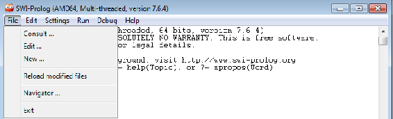

# 三、人工智能游戏和基于规则的系统

在本章中，我们将讨论以下主题:

*   人工智能游戏如何工作
*   游戏入门
*   实施基于规则的系统
*   如何在 Java 中与 Prolog 接口

我们开始吧。


# 介绍最小-最大算法

为了理解最小-最大算法，你应该熟悉游戏和博弈树。玩游戏可以被分类为游戏树。什么是博弈树？一棵树由一个**根**节点组成，一个根节点有子节点；每个子节点被细分为多个子节点。

这就形成了一棵树，终端节点称为**叶**，如下图所示:


在游戏中，我们的主要目标是赢得游戏；换句话说，我们试图通过在博弈树中向前看来找到可能的最佳解决方案。玩游戏要注意的最重要的一点是，我们实际上并没有下到一个特定的节点(或者下到一棵完整的树)，我们也没有玩完整个游戏。我们处于根本位置，我们正在寻找我们可以利用的最佳选择，以便最大化我们赢得比赛的机会。

既然我们在玩游戏，我们就轮流玩，就像在下棋或玩井字游戏一样；我们转了一圈，然后我们的对手转了一圈。这意味着我们所有的孩子，或者某个特定节点的孩子，都将是我们对手的走法。我们对手的目标是让我们输，因为无论我们要开发什么样的游戏树，都会在我们的视野中。因此，从我们的角度来看，在任何一步棋中，我们的目标是赢得比赛；一旦我们的棋走完了，这将是我们对手的棋。在我们看来，对手的行动将会使我们失败。因此，在展望未来时，我们简单地搜索博弈树。

考虑具有以下类型节点的树:

*   最小节点:这些是我们对手的节点
*   最大节点数:这些是我们的节点

在 **min** 节点中，我们选择最小成本的后继者。在特定节点的所有后继者中，我们选择最小的。在一个 **max** 节点中，我们试图找出最大的后继者，因为这些节点就是我们的棋步。

现在，我们实际上并没有移动到一个特定的点；我们只是向前看，在内存中执行某些计算，并试图找到可能的最佳移动。终端节点是输赢节点，但搜索终端节点往往不可行；因此，我们应用试探法来比较非终端节点。下图说明了我们的游戏树:


我们将从根节点开始， **A** 。我们有两个选择:要么是右边的子树，要么是左边的子树。如果我们随机选择任何一个子树，我们输掉游戏的几率会更高。为了避免这种情况，我们将应用某些启发式方法，这样我们赢得游戏的机会就会增加。因此，我们将尝试对游戏进行建模。假设我们选择**B**；我们的对手可以选择 **D** 或 **E** 。如果我们的对手选择 **D** ，我们将可以选择 **H** 或 **I** 。如果我们的对手选择 **H** ，我们将可以选择 **10** 或 **11** ，这是可以执行的最大值。我们的计算机系统没有足够的内存进行进一步的处理；因此，从这一点，我们将应用启发式。

在上图中，可以看到所有终端节点的启发式值。游戏没有结束，我们只是向前看。试探值包括我们可以向前看的最大深度；之后，我们将应用启发式。在特定的点上赢得游戏的机会是，比如说，10%，11%，9%，等等。这些是我们的终值。

现在，假设我们的对手选择了 **H** 节点。这是一个最小节点，一个最小节点将总是从它的后继节点中选择一个最小值。因此，如果在 **10** 和 **11** 之间选择，最小节点将总是选择 **10** 。如果往前走，我们有 **9** 和**11**；所以，我们的对手会选择 **9** 。同样，我们的对手将选择其余的节点。

现在，轮到我们了。 **D** 、 **E** 、 **F** 、 **G** 为最大节点。最大节点将总是从它们的后继节点中选择最大值。因此，我们将选择 **10** 、 **14** 、 **2** 和 **20** 作为我们的节点。现在又是我们对手的棋了，我们的对手永远会在后继者中选择最小的。这次他会选择 **10** 和 **2** 。终于轮到我们了，我们有了一个 max 节点。我们将选择最大价值接班人: **10** 。下图对此进行了说明:


这就是游戏的运作方式。


# 实现示例最小-最大算法

在本节中，我们将实现一个最小-最大算法(井字游戏示例)。那么，让我们来看看 NetBeans。我们将有一个`ArrayList`，我们将应用随机化并接受输入。以下是我们将使用的四个类:

```java
import java.util.ArrayList;
import java.util.List;
import java.util.Random;
import java.util.Scanner;
```

然后，我们必须定义`x`和`y`点。在井字游戏中，有九张牌，在与对手一对一的基础上，方块被填满，如下所示:

```java
class Point {

    int x, y;

    public Point(int x, int y) {
        this.x = x;
        this.y = y;
    }

    @Override
    public String toString() {
        return "[" + x + ", " + y + "]";
    }
}

class PointAndScore {

    int score;
    Point point;

    PointAndScore(int score, Point point) {
        this.score = score;
        this.point = point;
    }
}
```

因此，我们将定义`Point`，以及`x`和`y`点。这将给出`x`和`y`值，我们必须在上面输入值。`String`将返回这些值。`PointAndScore`将在每个特定的方块提供`point`值及其`score`，无论它是否被填充。

`Board`类将定义整个九个图块并接受输入；这将给我们三个状态。要么是`X`赢了，要么是有`X`的人赢了，要么是有`0`的人赢了，以及可用的州，如果可用的州是`Empty`:

```java
class Board {

    List<Point> availablePoints;
    Scanner scan = new Scanner(System.in);
    int[][] board = new int[3][3];

    public Board() {
    }

    public boolean isGameOver() {
        return (hasXWon() || hasOWon() || getAvailableStates().isEmpty());
    }

    public boolean hasXWon() {
        if ((board[0][0] == board[1][1] && board[0][0] == board[2][2] && board[0][0] == 1) || (board[0][2] == board[1][1] && board[0][2] == board[2][0] && board[0][2] == 1)) {
            return true;
        }
        for (int i = 0; i < 3; ++i) {
            if (((board[i][0] == board[i][1] && board[i][0] == board[i][2] && board[i][0] == 1)
                    || (board[0][i] == board[1][i] && board[0][i] == board[2][i] && board[0][i] == 1))) {
                return true;
            }
        }
        return false;
    }

    public boolean hasOWon() {
        if ((board[0][0] == board[1][1] && board[0][0] == board[2][2] && board[0][0] == 2) || (board[0][2] == board[1][1] && board[0][2] == board[2][0] && board[0][2] == 2)) {
            return true;
        }
        for (int i = 0; i < 3; ++i) {
            if ((board[i][0] == board[i][1] && board[i][0] == board[i][2] && board[i][0] == 2)
                    || (board[0][i] == board[1][i] && board[0][i] == board[2][i] && board[0][i] == 2)) {
                return true;
            }
        }

        return false;
    }

    public List<Point> getAvailableStates() {
        availablePoints = new ArrayList<>();
        for (int i = 0; i < 3; ++i) {
            for (int j = 0; j < 3; ++j) {
                if (board[i][j] == 0) {
                    availablePoints.add(new Point(i, j));
                }
            }
        }
        return availablePoints;
    }

    public void placeAMove(Point point, int player) {
        board[point.x][point.y] = player; //player = 1 for X, 2 for O
    } 

    void takeHumanInput() {
        System.out.println("Your move: ");
        int x = scan.nextInt();
        int y = scan.nextInt();
        Point point = new Point(x, y);
        placeAMove(point, 2); 
    }

    public void displayBoard() {
        System.out.println();

        for (int i = 0; i < 3; ++i) {
            for (int j = 0; j < 3; ++j) {
                System.out.print(board[i][j] + " ");
            }
            System.out.println();

        }
    } 

    Point computersMove; 

    public int minimax(int depth, int turn) { 
        if (hasXWon()) return +1; 
        if (hasOWon()) return -1;

        List<Point> pointsAvailable = getAvailableStates();
        if (pointsAvailable.isEmpty()) return 0; 

        int min = Integer.MAX_VALUE, max = Integer.MIN_VALUE;

        for (int i = 0; i < pointsAvailable.size(); ++i) { 
            Point point = pointsAvailable.get(i); 
            if (turn == 1) { 
                placeAMove(point, 1); 
                int currentScore = minimax(depth + 1, 2);
                max = Math.max(currentScore, max);

                if(depth == 0)System.out.println("Score for position "+(i+1)+" = "+currentScore);
                if(currentScore >= 0){ if(depth == 0) computersMove = point;} 
                if(currentScore == 1){board[point.x][point.y] = 0; break;} 
                if(i == pointsAvailable.size()-1 && max < 0){if(depth == 0)computersMove = point;}
            } else if (turn == 2) {
                placeAMove(point, 2); 
                int currentScore = minimax(depth + 1, 1);
                min = Math.min(currentScore, min); 
                if(min == -1){board[point.x][point.y] = 0; break;}
            }
            board[point.x][point.y] = 0; //Reset this point
        } 
        return turn == 1?max:min;
    } 
}
```

如果`X`赢了，我们要检查哪些值相等，比如棋盘`[0] [0]`等于`[1] [1]`，`[0] [0]`等于`[2] [2]`。这意味着对角线相等，或者`[0] [0]`等于`1`，或者板`0`等于`[1] [1]`。要么我们有所有的对角线，要么我们有任何一条水平线，要么我们有所有三个正方形在一条垂直线上。如果出现这种情况，我们将返回`true`；否则，我们将检查板上的其他值。以下代码部分将检查这些值，如果它们不符合前面的条件，将返回`false`:

```java
 public boolean hasXWon() {
    if ((board[0][0] == board[1][1] && board[0][0] == board[2][2] && board[0][0] == 1) || (board[0][2] == board[1][1] && board[0][2] == board[2][0] && board[0][2] == 1)) {
        return true;
    }
    for (int i = 0; i < 3; ++i) {
        if (((board[i][0] == board[i][1] && board[i][0] == board[i][2] && board[i][0] == 1)
                    || (board[0][i] == board[1][i] && board[0][i] == board[2][i] && board[0][i] == 1))) {
            return true;
        }
    }
    return false;
}
```

接下来我们就看`0`是否赢了；所以，我们会对`0`做同样的事情。这里，我们将检查该值是否为`2`。然后，如果没有人获胜，我们将检查用户的可用状态，并将它们打印出来。然后我们会有`placeAMove`，要么玩家`1`会移动，要么玩家`2`会移动。

接下来，我们有`takeHumanInput`；因此，我们将人为输入`x`和`y`点，我们将使用`displayBoard`方法显示棋盘；最后，我们将应用最小-最大算法。因此，我们将检查是`X`赢了还是`0`赢了；如果没有，我们将开始玩游戏，我们将打印分数位置。最后，在`main`类中，我们将从谁将采取第一步开始(计算机或用户)。如果我们的用户开始移动，我们必须提供`x`和`y`坐标中的值(在`x`和`y`平面中)；否则，计算机将开始移动，每次，我们都要检查`X`是否已经赢了。如果`X`赢了，我们将打印`Unfortunately, you lost!`如果`0`赢了，我们将打印`You won!`如果双方都赢了，那么我们将打印`It's a draw!`

运行程序以获得以下输出:


前面的输出是端口的初始位置。这已经在初始点打印了。现在，我们必须选择轮到我们了。假设我们输入`1`；我们将获得以下输出:


先轮到电脑，电脑把位置放在`[0] [0]`。现在，该我们行动了；所以，我们放置`[0] [2]`。这将在我们棋盘的最后一个位置输入`2`，如下图所示:


我们的`2`已经放在`[0] [2]`了。前面的截图显示了我们当前的位置。电脑在`[1] [0]`上做了标记。让我们在`[2] [0]`上做一个标记，如下所示:


我们现在位于`[2] [0]`上方，并封锁了电脑。现在，电脑已经在`[1] [1]`进入`1`。让我们在`[1] [2]`上做个标记，再次屏蔽电脑:


电脑已经在`[2] [2]`进入`1`，已经赢了比赛。


# 安装 Prolog

我们现在将向您展示如何在您的系统上安装 Prolog。在浏览器中，转到[`www.swi-prolog.org/download/stable`](http://www.swi-prolog.org/download/stable):


如果您使用的是 Windows 操作系统，可以根据您的 Windows 版本下载 64 位版本或 32 位版本。如果你有 Mac OS，那么你可以下载 Mac 版本。您可以按如下方式安装它:

*   对于 Windows，你必须下载并运行`.exe`文件。单击“下一步”继续安装过程，您将能够将 Prolog 安装到您的系统上。
*   对于 Mac，你必须下载`.dmg`文件并解压到你的系统中。然后，将其复制到您的应用程序中，并安装它。
*   默认情况下，SWI-Prolog 是 Linux 自带的，所以在 Linux 上，您不必安装它。


# 用 Prolog 介绍基于规则的系统

现在，我们将看看如何在 Prolog 中创建知识库和应用推理。让我们先来看看 Prolog 环境:

*   如果您使用的是 Windows，请转到程序| Prolog
*   如果您使用的是 Mac，请转到应用程序| Prolog
*   在 Linux 中，到终端键入`Prolog`，环境就会出现

以下屏幕截图显示了 Windows 中的 Prolog 环境:


`?-`对象是 Prolog 提示符，或 Prolog 解释器。我们在这里键入的任何内容都将被执行；Prolog 将被视为一个谓词，它将以`true`或`false`的形式给出结果。因此，如果我们想要创建新的规则，我们可以转到文件，或者创建一个新的知识库(使用 new...)或编辑...现有知识库，如下所示:



如果你在 Windows 或 Mac 上工作，你将不得不在文本编辑器中打开你的知识库。你可以使用 gedit，可以在 Linux 上使用宋旻浩，也可以使用 Mac 附带的文本编辑器。我们已经创建了一个知识库，所以我们不会写规则；我们只是演示一下。下面的屏幕截图显示了我们的知识库:


假设迈克尔是维托的孩子；我们将创建一个名为`child`的谓词，并向它传递两个术语:一个是`michael`，另一个是`vito`。然后，假设`sonny`是`vito`的孩子，`fredo`是`vito`的孩子。我们将创建另外两个事实，如下所示:

*   安东尼是迈克尔的孩子。
*   玛丽是迈克尔的孩子。

所以，如果某人是某人的孩子，那么那个人就是那个人的父亲:`X`是`Y`的父亲。在 Prolog 中，条件部分以相反的方式工作。`father(X, Y)`宾语是我们需要的结果，而`child(Y, Z)`是它的前提。那么，如果`Y`是`X`的孩子，`X`就是`Y`的父亲:

```java
father(X, Y) :- child(Y, X).
```

在 Prolog 中，我们将前面的代码理解为`X`是`Y`的父亲，前提是`Y`是`X`的孩子，我们使用句号作为语句结束符。

同样，我们正在创建一个新规则:`grandfather(X, Y)`。`X`是`Y`的祖父，前提是`Y`是`Z`的孩子`X`是`Z`的父亲。如果`X`是`Z`的父亲，`Y`是`Z`的孩子，那么我们就有了`X`和`Y`的关系。

让我们通过导航到 Compile | Make 来编译它:


编译完成后，我们将尝试在 Prolog 中打开知识库。为此，我们需要知道知识库存储的路径。然后，转到 Prolog 并在 path 中使用以下命令:

```java
?- consult('C:/Users/admin/Documents/Prolog/family.pl'). 
```

请注意，我们必须用正斜杠替换反斜杠。

现在，我们可以向知识库提问，例如:

```java
child(soony, vito). 
```

知识库将通过`true`或`false`做出响应:


它已经返回了`false`，也就是说我们不知道`vito`的孩子的名字。为了找到`vito`的孩子，我们使用`X`，如下所示:

```java
?- child(X, vito).
```

大写字符(`X`)将被视为变量，而小写字符(以小写字母开头的单词，如`vito`)被视为常量。

我们得到以下结果:


现在，让我们用下面的命令再问一次:

```java
?- child(sonny,vito).
```

我们得到以下输出:


之前的回答是`false`，因为我们提供了错误的`sonny`拼写。这意味着拼写应该匹配。

类似地，我们可以用下面的命令请求`father`:

```java
?- father(vito, sonny)
```

我们得到以下输出:


我们得到`true`，这意味着`vito`是`sonny`的`father`。我们可以通过键入以下命令找到`michael`的孩子:

```java
?- father(michael, X).
```

我们得到以下输出:


我们得到`anthony`是`michael`的儿子，`mary`是`michael`的女儿，也就是说`michael`是`anthony`和`mary`的父亲。

同样，我们可以要求祖父，如下:

```java
?- grandfather(vito, X).
```

我们得到`vito`是`anthony`和`mary`的`grandfather`:


正如您所看到的，我们还没有为`father`和`grandfather`创建事实，但是它们已经被 Prolog 解释器推断出来，我们能够根据谓词`father`和`grandfather`得到问题的答案。

这就是我们如何将规则和事实写入知识库，并使用 Prolog 提问。如果我们想看到所有的父子关系，我们可以问以下问题:

```java
?- father(X, Y).
```

我们将得到所有的父子对，如下所示:


我们得到`vito`是`michael`的父亲，`vito`是`sonny`的父亲，等等。

同样，我们可以使用`grandfather`关系，如下所示:

```java
?- grandfather(X, Y).
```

我们得到`vito`是`anthony`的祖父，`vito`是`mary`的祖父:


# 用 Java 设置 Prolog

现在，您将看到如何下载 JPL 库，以及如何在 Java 中使用`JPL`与 Prolog 接口。

在浏览器中，转到[`www.java2s.com/Code/Jar/j/Downloadjpljar.htm`](http://www.java2s.com/Code/Jar/j/Downloadjpljar.htm):


这是已经创建的所有已知 JAR 文件的流行存储库之一，它保存了所有这些 JAR 文件。我们将获得这个`JPL`库中可用的所有信息和所有类，并在我们的代码中使用它们。点击 jpl/jpl.jar.zip(27 k)下载库。然后，您必须提取它以获得`jpl.jar`文件。

一旦我们提取了 JAR 文件，我们就可以检查代码看它是否工作。所以，我们就去 NetBeans。在 NetBeans 中，我们将转到我们的项目，右键单击它，然后转到“属性”选项。在“属性”中，我们将转到“库”和“添加 JAR/文件夹”选项:


在 Add JAR/Folder 中，我们必须提供我们提取了`jpl.jar`文件的路径。一旦我们选择了路径，我们将点击打开:


我们将把这个文件导入到 Java 代码中，如下所示:

```java
import jpl.*;

public class JPLwJava {

    /**
     * @param args the command line arguments
     */
    public static void main(String[] args) {
        // TODO code application logic here
        System.out.println("Hello Prolog");
    }
}
```

`import jpl.*;`命令将`JPL`库导入我们的代码。现在，我们将简单地打印`Hello Prolog`。

运行代码以获得以下输出:


`Hello Prolog`消息意味着我们的`JPL`库已经合并到我们的代码中，所以我们可以在 Prolog 和 Java 之间进行接口。


# 使用 Java 执行 Prolog 查询

现在，我们将看看如何在 Java 中使用 Prolog 查询。让我们来看看 Java 代码，看看这是如何做到的。

在 NetBeans 中创建一个 Java 项目，并键入以下代码:

```java
import java.util.Map;
import jpl.Query;
import jpl.JPL;

public class ProrlogJava {

    /**
     * @param args the command line arguments
     */
    public static void main(String[] args) {
        // TODO code application logic here
        String t1 = "consult('/Users/admin/Documents/NetBeansProjects/JPLwJava/family.pl')";
        System.out.println(t1 + " " + (Query.hasSolution(t1) ? "succeeded" : "failed"));
        String t2 = "child(sonny, vito)";
        System.out.println(t2 + " " + (Query.hasSolution(t2) ? "provable" : "not provable"));
        String t3 = "grandfather(vito, anthony)";
        System.out.println(t3 + " " + (Query.hasSolution(t3) ? "provable" : "not provable"));
    }

}
```

首先，我们必须通过添加`jpl.jar`文件来调用`JPL`库，如前一节所示。一旦我们有了它们，我们将从`JPL`包中`import`出两个等级:`jpl.Query`等级和`jpl.JPL`等级。

接下来，我们必须提供一个`String`，在这里我们将输入`consult`和我们的文件名。

序言文件以`.pl`格式或文本格式保存。

然后，我们可以调用`Query.hasSolution(t1)`。如果我们的知识库在 Prolog 中打开，我们将得到一条`succeeded`消息；否则，我们会得到一条`failed`消息。这是一个简单的条件运算符。

接下来我们就要查询:`child(sonny, vito)`。这将给我们带来`provable`或`not provable`。如果是`true`，会返回消息说是`provable`；否则，我们将得到消息`not provable`。同样，我们可以问:`grandfather(vito, anthony)`。如果这是可证明的，我们将得到`provable`；不然我们就拿`not provable`。

让我们运行它，看看会发生什么，如下所示:


我们查阅了我们的数据库，`family.pl`被成功加载到内存中。然后，我们问`sonny`是不是`vito`的`child`的问题，得到的回答是`provable`；同样，我们问`vito`是不是`anthony`的`grandfather`，果然是`provable`。这就是我们如何在 Java 中使用 Prolog。


# 摘要

在本章中，您学习了游戏如何工作，如何用 Java 实现井字游戏，如何安装 Prolog，如何下载一个`JPL`库，以及如何用 Java 与 Prolog 接口。

在下一章，我们将讨论 Weka 的接口。