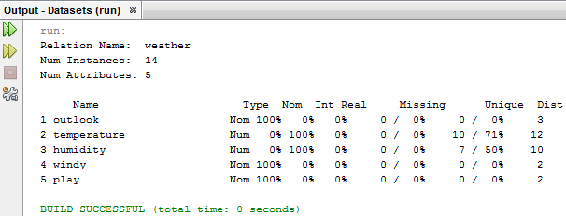

# 四、与 Weka 接口

在本章中，我们将使用数据集。数据集的一般格式是一个**逗号分隔值** ( **CSV** )文件，Weka 使用一种特殊的格式，称为**属性关系文件格式** ( **ARFF** )文件。我们将了解如何将 CSV 文件转换为 ARFF 文件，反之亦然。

在本章中，我们将讨论以下主题:

*   Weka 简介
*   安装和连接 Weka
*   读取和写入数据集
*   转换数据集

首先，我们来看一个关于 Weka 的介绍。


# Weka 简介

Weka 是一套用 Java 编写的机器学习软件。它是由新西兰怀卡托大学开发的。这是一个免费软件，在 GNU **通用公共许可证** ( **GPL** )下可用，算法可以直接应用于数据集，也可以从我们自己的 Java 代码中调用。

当我们下载 Weka 并开始使用它时，它为我们提供了自己的 GUI。我们可以使用 GUI 来处理我们自己的数据集。如果我们想增强 Weka 的功能，我们应该在 Java 代码中使用它。Weka 的官方网站位于[`www.cs.waikato.ac.nz/ml/weka/`](https://www.cs.waikato.ac.nz/ml/weka/)。它在怀卡托大学的官方网站上。它的当前版本是 3。我们可以在其网站上找到所有关于 Weka 的信息。我们将找到各种部分，如入门、更多信息和开发人员。

在“开始”中，有以下选项可用:

*   要求:使用 Weka 的要求。
*   下载:在下载页面，我们可以去快照部分，在那里我们可以下载 Weka。
*   文档:如果我们转到文档页面，它会为我们提供很多 Weka 可用的文档。还有 Weka Wiki，在那里我们可以获得我们需要的大部分信息，软件包列表和一些视频。
*   常见问题解答:这是一些常见问题。
*   寻求帮助:如果需要，这将提供进一步的帮助。

项目页面提供了机器学习组。是怀卡托的计算机科学系机器学习小组开发了这个软件。我们还可以了解他们发展 Weka 的基本目标。


# 安装和连接 Weka

我们现在将学习如何下载 Weka。要下载 Weka，请访问位于[`www.cs.waikato.ac.nz/ml/weka/downloading.html`](https://www.cs.waikato.ac.nz/ml/weka/downloading.html)的下载网站。访问该页面时，我们将获得有关下载的信息。如果我们向下滚动，我们将得到关于稳定版本的信息；根据我们拥有的机器，我们可以下载我们想要的 Weka 版本，有以下选项:

*   对于 Windows，该文件将是 EXE 文件；我们只需要点击它，它就会出现在我们的程序中。
*   对于 Mac，它将是一个 DMG 文件；我们将不得不提取它并粘贴到我们的应用程序中。
*   对于 Linux，在提取 TAR 文件后，我们将获得运行 Weka 所需的所有包，并且我们可以通过使用`java -jar weka.jar`命令使用一个`weka.jar`文件来运行它。

我们可以在我们的系统上运行下载的文件，并按照说明安装 Weka。安装完成后，打开它，我们将看到以下界面:


前面的屏幕截图显示了 Weka GUI。我们可以看到程序选项、可视化和工具。在工具中，我们将看到软件包管理器，在这里我们可以安装 Weka 上可用的任何软件包:


有一个非常大的可用包管理器列表，如下面的屏幕截图所示:


我们可以单击 Install 按钮，这些包将被安装。如果我们已经安装了某些软件包，我们可以点击它们并通过点击卸载按钮卸载它们。这就是我们如何安装和卸载软件包。

我们现在将转到 Weka Explorer。单击 Applications 下的 Explorer 按钮，我们将看到一个新窗口，如下面的屏幕截图所示:


首先，我们必须打开一个数据集，以便对数据集进行分类。点击打开文件...按钮。在`Weka`文件夹中，我们会看到一个`data`文件夹。`data`文件夹将包含可用的数据集:


如下图所示，我们可以查看数据集:


前面的数据集有五个属性。第一个属性是`outlook`,`outlook`有三个标签，在`Label`列下有三个不同的值:`sunny`，有一个`Count`为`5`；`overcast`，带一个`4`的`Count`；和`rainy`，带一个`5`的`Count`。同样，还有`windy`属性，`windy`有两种值，`TRUE`和`FALSE`，带计数，如下面截图所示:


`play`属性有两个不同的值，`yes`和`no`，以及它们的计数，如下面的屏幕截图所示:


`outlook`、`windy`和`play`对象是名义类型的数据，`temperature`和`humidity`是数值数据。

`temperature`属性有 12 个值，因为它是一个数值，我们可以从这些值中得到一些数值信息，比如最大值、最小值、平均值和标准偏差:


如果我们想要对特定的模型进行分类，请转到“分类”选项卡，然后单击“选择”;我们将获得选择分类器的选项，如下面的屏幕截图所示:


点击`trees`文件夹。假设我们想要执行一个 J48 分类:点击 J48 选项，然后点击 Start 按钮。将使用 10 重分类构建 J48 分类器，并将显示该特定数据的统计信息，如下面的屏幕截图所示:


# 将 Weka 环境调用到 Java 中

要在 Java 中调用 Weka 环境，请执行以下步骤:

1.  创建新项目。
2.  创建项目后，右键单击它并转到属性:


3.  在 Properties 选项卡中，选择 Libraries，点击 Add JAR/Folder，并给出`weka.jar`文件的路径:


4.  一旦我们有了`weka.jar`文件的路径，我们就可以使用 Weka。用以下代码替换项目中的代码:

```java
package helloworld;

/**
 *
 * @author admin
 */
import weka.*;
public class HelloWorld {

    /**
     * @param args the command line arguments
     */
    public static void main(String[] args) {
        // TODO code application logic here
        System.out.println("Hello World"); 
    }    
}
```

正如我们在前面的代码中看到的，我们用`import weka.*;`替换了`import juint.framework.*;`。

请注意，当我们编写前面的代码时，我们将获得 Weka 包的建议。这意味着我们可以在 Java 环境中访问 Weka。

从今以后，在所有的项目中，我们将使用`weka.jar`文件。因此，每次我们创建一个新的项目，我们将不得不在库窗口中`import`这个`weka.jar`文件。

现在，如果我们运行前面的代码，我们将得到以下输出:


# 读取和写入数据集

我们现在来看看如何读写数据集。让我们来看看 Java 代码。创建一个项目并将其命名为`Datasets`。现在，导入`weka.jar`文件，如前一节所述。一旦我们有了`weka.jar`文件，我们就可以读取`core`、`Instance`接口、`ArffSaver`、`DataSource`和`io.File`包，如下图所示:


我们从`DataSource`开始。`DataSource`是一个帮助我们打开 Weka 中可用的数据集文件的类。默认情况下，Weka 使用 ARFF 文件；请参见以下代码:

```java
DataSource src = new DataSource("/Users/admin/wekafiles/data/weather.numeric.arff");
Instances dt= src.getDataSet();
System.out.println(dt.toSummaryString());
ArffSaver as = new ArffSaver();
```

正如我们在前面的代码中看到的，我们为`DataSource`创建了一个对象，并提供了我们需要打开的 ARFF 文件的路径。这将只提供 ARFF 文件的路径；它不会打开它。在工作内存中，有一个名为`Instances`的类，我们为`Instances`类创建了一个对象`dt`。我们将调用带有`DataSource`和`src`对象的`getDataSet`方法。这将在内存中的`dt`对象中打开特定的数据集。我们可以通过使用`toSummaryString`方法打印特定数据集中的任何可用内容。一旦它被读取和打开，我们可以通过使用`ArffSaver`类将它写入硬盘。我们将为它创建一个对象(`as`)，如下所示:

```java
 as.setInstances(dt);
```

这将只把`dt`对象可用的所有数据分配给`as`对象。它不会保存它，目前为止。现在，我们必须给数据集起一个名字；因此，我们将调用`setFile`方法，并使用`File`对象将`weather.arff`作为文件名提供给我们的数据集:

```java
as.setFile(new File("weather.arff"));
```

现在，数据集已经有了一个名称，但是它仍然没有保存在内存中。我们现在将调用一个`writeBatch`方法，如下所示:

```java
as.writeBatch();
```

最后，所有内容都将以文件名(`weather.arff`)保存到内存中。当我们执行代码时，我们将看到以下输出:



它有作为`weather`的`Relation Name`，它有`14`实例和`5`属性。它显示属性的统计数据。如果我们转到 NetBeans 中的`Datasets`项目文件夹，我们可以检查`weather.arff`文件是否已经保存:


在文本编辑器中打开`weather.arff`文件，我们会看到数据集已经保存在文件中。下面的屏幕截图显示了 ARFF 文件的样子:


这个文件有一个`relation`，我们可以在这里给出文件名，它还有一个`@attribute`对象。`@attribute`对象告诉我们这些是文件的属性，在花括号中，我们可以指定分类值。例如，`temperature`和`humidity`属性是`numeric`值，`windy`是布尔值，`@attribute play`是可以有`yes`和`no`的类。然后，我们有`@data`，其中显示了所有带有属性值的元组。这就是 ARFF 档案的工作方式。

如果我们没有标题数据，那么它就是一个 CSV 文件。


# 转换数据集

在本节中，我们将了解如何转换数据集。我们将学习如何将 CSV 文件转换为 ARFF 文件，反之亦然。


# 将 ARFF 文件转换为 CSV 文件

首先，让我们看看代码。假设我们有一个`weather.arff`文件。我们将首先导入以下包:

```java
import weka.core.Instances;
import weka.core.converters.ArffLoader;
import weka.core.converters.CSVSaver;
import java.io.File;
```

我们从`ArffLoader`类开始，并为它创建了一个对象`loader`:

```java
ArffLoader loader = new ArffLoader();
```

然后，我们将文件名`weather.arff`分配给`ArffLoader`类，如以下代码所示:

```java
loader.setSource(new File("weather.arff")); //Use the path where your file is saved.
```

我们还调用了`loader.setSource`方法，并通过使用我们的`File`对象给它分配了一个文件名。一旦完成，我们将把这个特定的数据集加载到我们的`Instances`对象`data`的内存中，如下所示:

```java
Instances data = loader.getDataSet();
```

现在，我们需要为我们的`CSVSaver`类创建一个对象并实例化它:

```java
CSVSaver saver = new CSVSaver();
```

现在，我们需要设置实例；因此，我们需要将我们的`Instances`对象的对象提供给`setInstances`方法，如下所示:

```java
saver.setInstances(data);
```

完成此操作后，我们的 ARFF 数据集已在内存中转换为 CSV 数据集，但尚未保存到磁盘上。如果我们想把它保存到磁盘上，我们必须使用一个`setFile`方法并使用我们的`File`对象分配一个文件名:

```java
saver.setFile(new File("weather.csv"));
```

`File`对象将被传递给`setFile`方法，一旦我们完成了这一步，我们已经为数据集指定了一个名称(即`weather.csv`)，但是我们仍然没有将它保存到磁盘上。

调用`writeBatch`方法后，我们的整个数据集将被保存到磁盘上:

```java
saver.writeBatch();
```

让我们试着运行整个代码；我们应该得到以下输出:


现在，让我们转到磁盘，看看数据集是否已经创建，如下面的屏幕截图所示:


我们可以看到已经使用`weather.arff`文件创建了一个新的`weather.csv`文件。这是我们的 CSV 文件，可以在记事本或 Excel 中打开，如下所示:


通常，所有 CSV 文件都可以直接在任何电子表格应用程序中打开。因为 CSV 是一个逗号分隔的值，所以所有逗号分隔的值都被分配给一个特定的集合。因此，`outlook`、`temperature`、`humidity`、`windy`和`play`已经被分配给一个特定行中的某些单元格，并且它们的所有值已经被分配给相应的列。这就是我们的文件被转换成数据集的方式。如果我们比较 ARFF 和 CSV 文件，我们可以注意到头数据已经从 CSV 文件中删除。

如果我们想要比较这两个文件，我们可以在文本编辑器中打开这两个文件，如下面的屏幕截图所示:


在 CSV 文件中，我们只有标题值。ARFF 文件中的属性值被转换成 CSV 文件的第一行，然后，我们看到了这些值。这就是 CSV 文件的创建方式。


# 将 CSV 文件转换为 ARFF 文件

现在，让我们看看是否可以将 CSV 文件转换为 ARFF 文件。我们将做与上一节相反的事情。

首先，导入以下包:

```java
import weka.core.Instances;
import weka.core.converters.ArffSaver;
import weka.core.converters.CSVLoader;
import java.io.File;
```

注意，这一次，我们将导入`ArffSaver`和`CSVLoader`类，而不是`ArffLoader`和`CSVSaver`类。

这一次，我们做的第一件事就是使用我们的`CSVLoader`对象的`setSource`方法，为`CSVLoader`类创建一个对象，并将 CSV 文件分配给`CSVLoader`类:

```java
CSVLoader loader = new CSVLoader();
loader.setSource(new File("/Users/admin/Documents/NetBeansProjects/Arff2CSV/weather.csv"));
```

然后，我们使用一个`Instances`对象打开内存中的 CSV 数据集:

```java
Instances data = loader.getDataSet();
```

一旦我们这样做了，我们将需要以 ARFF 格式保存它。因此，我们为`ArffSaver`创建了一个`saver`对象，然后，我们将希望保存在 ARFF 文件中的数据集赋值给`Instances`:

```java
ArffSaver saver = new ArffSaver();
saver.setInstances(data);
```

然后，我们使用`saver`对象并调用`setFile`方法来为这个`ArffSaver`指定名称，如下所示:

```java
saver.setFile(new File("weather.arff"));
```

`setFile`方法将使用`File`对象，我们将为其指定名称`weather.arff`。现在，一切都已经在内存中完成了，数据集已经在内部转换成了 ARFF 格式，我们已经给它分配了一个名字(`weather.arff`)；但是，我们还没有把它保存到磁盘上。

`writeBatch()`方法将完整的数据集保存到硬盘上:

```java
saver.writeBatch();
```

运行代码以获得以下输出:


由于我们的构建已经成功，我们将我们的`weather.csv`转换为`weather.arff`。让我们去看看磁盘，看看它是否工作:


在前面的屏幕截图中，我们可以看到 ARFF 文件已经创建。我们已经展示了如何从 CSV 文件创建 ARFF 文件。我们不需要做任何手工工作来分配关系和属性，因为如果我们提供我们的 CSV 文件，它们是由 Weka 自动分配的。Weka 负责属性；它还负责处理它是什么类型的属性。例如，`outlook`是分类数据，因为它只有三种类型的值；因此，这些类别被分配给了`outlook`。由于`temperature`接受所有数值，它已经被 Weka 自动赋值为数值，并且由于`humidity`也只有数值，它也是数值。`windy`对象也是一个`TRUE` / `FALSE`值；因此，它也是一种分类类型的数据。`play`对象也只有两种类型的值，所以它也是分类数据。

这就是我们如何将数据集从 CSV 转换到 ARFF，或从 ARFF 转换到 CSV。


# 摘要

在本章中，我们介绍了 Weka 以及如何安装它。我们还学习了如何读写数据集，以及如何转换它们。

在下一章，我们将学习如何处理属性。