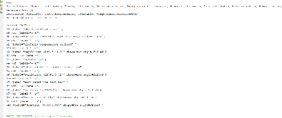
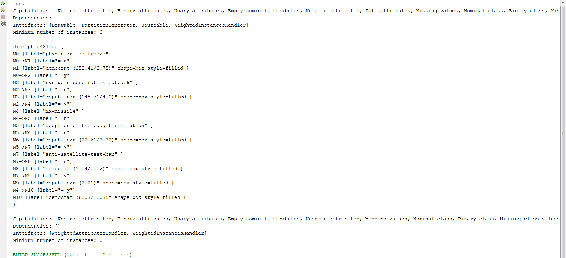
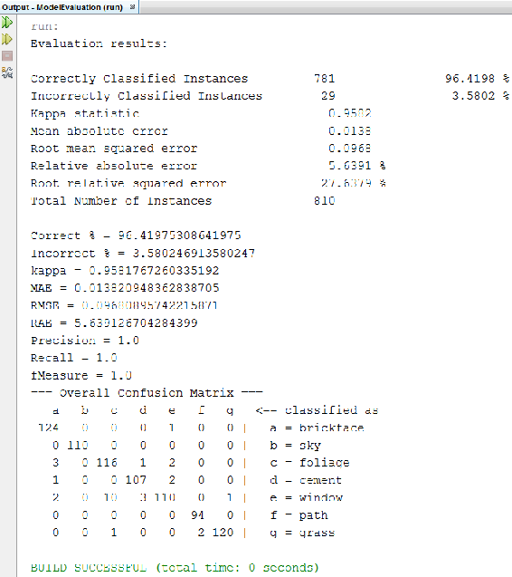
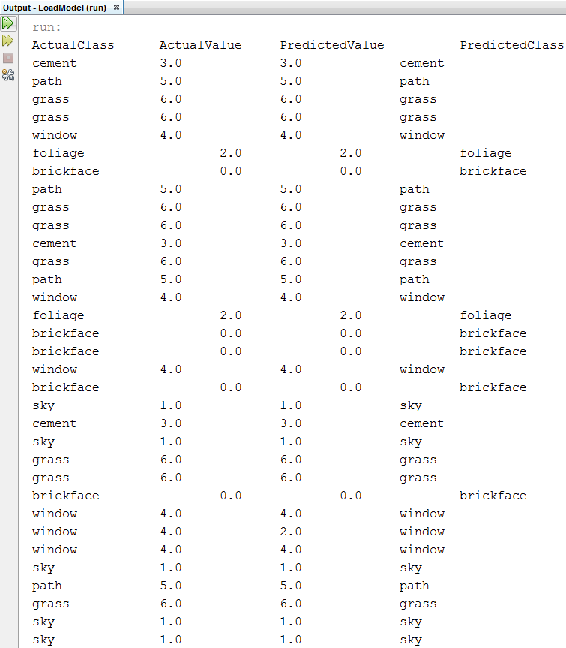

# 六、监督学习

在这一章中，我们将看看如何使用分类器来训练、开发、评估和进行预测，以及如何使用我们开发的模型来保存、加载和进行预测。

我们将在本章中讨论以下主题:

*   开发分类器
*   模型评估
*   做预测
*   加载和保存模型


# 开发分类器

我们将使用`weka.classifiers`包开发一个非常简单的基于决策树的分类器。对于决策树分类，我们将使用 J48 算法，这是一种非常流行的算法。为了开发一个分类器，我们将设置两个标志，如下所示:

*   `-C`:设置剪枝的置信度阈值。其默认值为`0.25`。
*   `-M`:设置开发决策树分类器的最大实例数。其默认值为`2`。

所有其他分类器都可以基于类似的方法开发，我们将在开发决策树分类器时合并这些方法。我们将开发另一个分类器——朴素贝叶斯分类器——基于我们将遵循的开发决策树分类器的相同机制。

让我们看看代码，看看怎么做。我们将从导入以下类开始:

```java
import weka.core.Instances;
import weka.core.converters.ConverterUtils.DataSource;
import weka.classifiers.trees.J48;
```

现在，让我们继续下面的代码:

```java
public static void main(String[] args) {
    // TODO code application logic here
    try{
        DataSource src = new DataSource("/Users/admin/Documents/NetBeansProjects/DevelopClassifier/vote.arff");
        Instances dt = src.getDataSet();
        dt.setClassIndex(dt.numAttributes()-1);

        String[] options = new String[4];
        options[0] = "-C";
        options[1] = "0.1";
        options[2] = "-M";
        options[3] = "2";
        J48 tree = new J48();
        tree.setOptions(options);
        tree.buildClassifier(dt);
        System.out.println(tree.getCapabilities().toString());
        System.out.println(tree.graph());

        //NaiveBayes nb = new NaiveBayes();

        } 
    catch(Exception e){
        System.out.println("Error!!!!\n" + e.getMessage());
    }
```

这一次，我们使用了一个`vote.arff`数据集，因为它有非常大的数据量。这是 1984 年美国国会投票记录数据库，其中有许多元组。它包括诸如成员是否残疾的属性。基于这些属性，它可以预测一个人是民主党人还是共和党人。

首先，我们将通过使用一个`DataSource`类为数据集创建一个对象。然后，我们将创建一个`Instances`对象，并将数据集放入`Instances`对象。一旦我们打开了数据集，我们就必须告诉 Weka 哪个属性是类属性(哪个属性将用于分类)。正如您在前面代码的属性列表中看到的，class 属性位于末尾。因此，我们将采取`setClassIndex`；而且，由于`-1`属性是类属性，`(dt.numAttributed()-1)`将获得该特定属性的索引。

然后我们将创建一个数组`Strings`；而且，因为我们需要设置`-C`和`-M`，我们将用四个元素初始化我们的`String`数组。第一个元素是`-C`，第二个是阈值，第三个是`-M`，第四个是迭代次数。然后，我们将为`J48`创建一个对象。一旦我们为`J48`创建了一个对象，我们将通过使用`setOptions`为`J48`分配选项。然后，我们将不得不使用数据集构建一个分类器。

因此，我们将使用我们的`J48`对象和它的`buildClassifier`方法，并且我们将为它提供我们的数据集。这将为`tree`对象创建一个分类器。

一旦我们完成了这些，我们就可以用`toString`方法打印它的功能。这将打印它可以分类的属性类型。一旦我们这样做了，我们可以打印它的图表。这将为我们提供它已经开发并训练过的精确的决策树图。

运行代码将提供以下输出:



因为第一个打印声明是`getCapabilities`，所以已经打印了。分类器已经被训练过，它可以包含`Nominal`、`Binary`、`Unary`，以及一系列它可以自我训练的属性。`digraph J48Tree`输出中是用那些属性生成的树。这就是我们如何开发一个分类器。

假设我们想使用朴素贝叶斯再训练一个分类器；首先，我们必须合并`weka.classifiers`类的`bayes`包中的`NaiveBayes`类:

```java
import weka.classifiers.bayes.NaiveBayes;
```

接下来，我们将为`NaiveBayes`创建一个对象`nb`，并将`dt`数据集传递给`nb`的`buildClassifier`方法:

```java
NaiveBayes nb = new NaiveBayes();
nb.buildClassifier(dt);
System.out.println(nb.getCapabilities().toString());
```

完成后，分类器将被训练，我们将能够打印它的能力。

再次运行代码以获得以下输出:



在前面的屏幕截图中，您可以看到 Naive Bayes 分类器已经被训练，并且它已经提供了可以用来训练分类器的属性。


# 模型评估

我们现在来看看如何评估我们已经训练好的分类器。让我们从代码开始。

我们将从导入以下类开始:

```java
import weka.core.Instances;
import weka.core.converters.ConverterUtils.DataSource;
import weka.classifiers.trees.J48;
import weka.classifiers.Evaluation;
import java.util.Random;
```

这一次，我们将使用来自`weka.classifiers`包的`Evaluation`类，以及一个用于生成随机值的`Random`类。

我们将使用的`DataSource`是`segment-challenge.arff`文件。我们使用它是因为它有一个`test`数据集，它也是 Weka 附带的数据集之一。我们将把它分配给我们的`Instances`对象，然后我们将告诉 Weka 哪个属性是类属性。我们将为决策树分类器设置标志，并为决策树分类器创建一个对象。然后，我们将设置`options`，并构建分类器。我们在上一节中执行了相同的操作:

```java
public static void main(String[] args) {
    try {
        DataSource src = new DataSource("/Users/admin/Documents/NetBeansProjects/ModelEvaluation/segment-challenge.arff");
        Instances dt = src.getDataSet();
        dt.setClassIndex(dt.numAttributes()- 1);

        String[] options = new String[4];
        options[0] = "-C";
        options[1] = "0.1";
        options[2] = "-M";
        options[3] = "2";
        J48 mytree = new J48();
        mytree.setOptions(options);
        mytree.buildClassifier(dt);
```

接下来，我们将为`Evaluation`和`Random`类创建一个对象。一旦我们完成了这些，我们将为我们的测试数据集创建一个新的`DataSource`对象`src1`，以及一个`segment-test.arff`文件。我们将把它分配给一个新的`Instances`对象，并告诉 Weka 哪个特定属性是类属性。然后，我们将使用`eval.evaluateModel`对象和一个分类器，该分类器已经用我们想要评估的新测试数据集进行了训练:

```java
        Evaluation eval = new Evaluation(dt);
        Random rand = new Random(1);

        DataSource src1 = new         DataSource("/Users/admin/Documents/NetBeansProjects/ModelEvaluation/segment-test.arff");
        Instances tdt = src1.getDataSet();
        tdt.setClassIndex(tdt.numAttributes() - 1);
        eval.evaluateModel(mytree, tdt);
```

完成后，我们可以打印`Evaluation`结果，如下所示:

```java
        System.out.println(eval.toSummaryString("Evaluation     results:\n", false));
```

正如您在前面的代码中看到的，我们通过使用`toSummaryString`方法获得了`Evaluation`结果。如果我们想单独打印它们，我们可以键入以下代码:

```java
            System.out.println("Correct % = " + eval.pctCorrect());
            System.out.println("Incorrect % = " + eval.pctIncorrect());
            System.out.println("kappa = " + eval.kappa());
            System.out.println("MAE = " + eval.meanAbsoluteError());
            System.out.println("RMSE = " + eval.rootMeanSquaredError());
            System.out.println("RAE = " + eval.relativeAbsoluteError());
            System.out.println("Precision = " + eval.precision(1));
            System.out.println("Recall = " + eval.recall(1));
            System.out.println("fMeasure = " + eval.fMeasure(1));
            System.out.println(eval.toMatrixString("=== Overall Confusion Matrix ==="));
```

最后，我们将打印混淆矩阵。运行代码以获得以下输出:



`toSummaryString`方法打印了所有的值。使用`pctCorrect`、`pctIncorrect`、`kappa`、`meanAbsoluteError`等分别打印这些值。最后，我们打印了混淆矩阵。

`a`的`124`实例已被正确分类，机器对`a`的`6`进行了更多分类，分别为`c`、`d`或`e`。同样，对于`b`，`110`实例被正确分类，只有`b`的`110`实例。有`a`的`125`个实例；其中，机器分类为`124`，以此类推。这就是我们如何创建混淆矩阵并对我们的分类器进行评估。


# 做预测

现在，我们将看看如何使用我们的测试数据集来预测一个类。让我们从代码开始。我们将使用以下软件包:

```java
import weka.core.Instances;
import weka.core.converters.ConverterUtils.DataSource;
import weka.classifiers.trees.J48;
import weka.core.Instance;
```

注意，这一次，我们将使用一个新类:来自`weka.core`包的`Instance`类。这将有助于我们使用测试数据集预测类别。然后，像往常一样，我们将把数据集读入`src`对象，并把它分配给一个`dt`对象。我们将告诉 Weka 哪个类属性将在这个数据集中为我们的决策树分类器设置属性。然后，我们将创建一个决策树分类器，为决策树分类器设置对象，并构建分类器，如下所示:

```java
public static void main(String[] args) { 
    // TODO code application logic here
    try {
        DataSource src = new DataSource("/Users/admin/Documents/NetBeansProjects/MakingPredictions/segment-challenge.arff");
        Instances dt = src.getDataSet();
        dt.setClassIndex(dt.numAttributes() - 1);

        String[] options = new String[4];
        options[0] = "-C";
        options[1] = "0.1";
        options[2] = "-M";
        options[3] = "2";
        J48 mytree = new J48();
        mytree.setOptions(options);
        mytree.buildClassifier(dt);
```

接下来，我们将为`DataSource`类创建一个新的`src1`对象，在这里我们将提供我们的`segment-test`数据集。我们将把它分配给一个新的`tdt`对象，这个对象将把它放入内存。然后，我们将不得不使用`setClassIndex`方法再次设置目标变量。一旦我们做到了这一点，我们就可以走了:

```java
DataSource src1 = new DataSource("/Users/admin/Documents/NetBeansProjects/MakingPredictions/segment-test.arff");
Instances tdt = src1.getDataSet();
tdt.setClassIndex(tdt.numAttributes()-1);

System.out.println("ActualClass \t ActualValue \t PredictedValue \t PredictedClass");
for (int i = 0; i < tdt.numInstances(); i++)
{
    String act = tdt.instance(i).stringValue(tdt.instance(i).numAttributes()-1);
    double actual = tdt.instance(i).classValue();
    Instance inst = tdt.instance(i);
    double predict = mytree.classifyInstance(inst);
    String pred = inst.toString(inst .numAttributes()-1);
    System.out.println(act + " \t\t " + actual + " \t\t " + predict + " \t\t " + pred);
}
```

现在，我们想得到实际的类和预测的类。Weka 只给实际类和预测类赋值；因此，我们将打印以下四项内容:

*   实际的类
*   实际价值
*   预测值
*   预测的类

由于我们的测试数据集中有 *n* 行，我们将一行一行地执行。因此，我们将使用一个`for`循环，从`0`到我们测试数据集中的实例数量。我们首先将实际的类分配给一个`String`对象。使用它，我们将使用我们的`tdt.instance`并设置一个值。然后，我们将获取第 *i ^(th)* 属性，并打印 class 属性。之后，我们将创建一个`actual`变量，它将是`double`类型，我们将使用`classValue`方法打印它的类值。一旦我们完成了这些，我们将为这个特定数据集的第 *i ^(th)* 实例创建一个对象。然后，我们将创建一个`predict`变量。应该是`double`型的。我们将通过使用我们的树对象和一个`classifyInstance`方法对它进行分类。我们将把`inst`对象分配给它；这将有我们的`predict`类值。现在，由于我们有了一个类值，我们可以通过使用`toString`方法将其转换成一个字符串，最后，我们可以打印所有四个值。

运行代码将提供以下输出:


正如我们所料，我们可以看到`ActualClass`、`ActualValue`、`PredictedClass`和`PredictedValue`。预测就是这样进行的。


# 加载和保存模型

现在，我们将看看如何保存我们已经训练好的模型，然后将该模型加载到硬盘上。所以，让我们快速进入代码。

在这个特殊的部分，我们将保存一个模型；因此，我们将使用以下三个类:

```java
import weka.core.Instances;
import weka.core.converters.ConverterUtils.DataSource;
import weka.classifiers.trees.J48;
```

我们将把 ARFF 文件放入我们的`src`对象(属于`DataSource`类)，并将它分配给`Instances`类的`dt`对象。然后，我们将把`src`对象分配给我们的`dt`对象；在`dt`对象中，我们将指出哪个特定属性是类属性。我们将为我们的决策树分类器设置某些`options`，并且我们将为我们的决策树分类器创建一个对象。然后，我们将为它设置选项，并构建它:

```java
    public static void main(String[] args) {
        // TODO code application logic here
        try {
            DataSource src = new DataSource("/Users/admin/Documents/NetBeansProjects/SaveModel/segment-challenge.arff");
            Instances dt = src.getDataSet();
            dt.setClassIndex(dt.numAttributes() - 1);

            String[] options = new String[4];
            options[0] = "-C";
            options[1] = "0.1";
            options[2] = "-M";
            options[3] = "2";
            J48 mytree = new J48();
            mytree.setOptions(options);
            mytree.buildClassifier(dt);
```

一旦我们建立了决策树分类器，我们将把它保存到我们的硬盘上。为此，我们将使用以下方法:

```java
            weka.core.SerializationHelper.write("/Users/admin/Documents/NetBeansProjects/SaveModel/myDT.model", mytree);
```

我们将这个模型命名为`myDT.model`，并且我们将为它提供一个对象:`mytree`。因此，我们训练过的分类器将以`myDT.model`的名字保存在我们的硬盘上。

运行代码以获得以下输出:


如果构建成功，分类器将被保存到硬盘上。如果我们想确认的话，可以在硬盘上查一下。

现在，我们想从硬盘加载分类器。分类器的名字是`myDT.model`。我们将使用前四个类，如下所示:

```java
import weka.core.Instances;
import weka.core.converters.ConverterUtils.DataSource;
import weka.classifiers.trees.J48;
import weka.core.Instance;
```

这一次，我们想通过阅读它们来做出某些预测。我们将为决策树创建一个对象，并对其进行类型转换。由于 Weka 不知道正在加载哪个分类器(哪个模型),首先，我们必须使用特定的类对其进行类型转换，如以下代码所示:

```java
public static void main(String[] args) {
    // TODO code application logic here
    try{
        J48 mytree = (J48) weka.core.SerializationHelper.read("/Users/admin/Documents/NetBeansProjects/LoadModel/myDT.model");

        DataSource src1 = new DataSource("/Users/admin/Documents/NetBeansProjects/LoadModel/segment-test.arff");
        Instances tdt = src1.getDataSet();
        tdt.setClassIndex(tdt.numAttributes() - 1);

        System.out.println("ActualClass \t ActualValue \t PredictedValue \t PredictedClass");
        for (int i = 0; i < tdt.numInstances(); i++) {
            String act = tdt.instance(i).stringValue(tdt.instance(i).numAttributes() - 1);
            double actual = tdt.instance(i).classValue();
            Instance inst = tdt.instance(i);
            double predict = mytree.classifyInstance(inst);
            String pred = inst.toString(inst.numAttributes() - 1);
            System.out.println(act + " \t\t " + actual + " \t\t " + predict + " \t\t " + pred);
        }
    }
    catch(Exception e){
        System.out.println("Error!!!!\n" + e.getMessage());
    }
}
```

那么，我们就拿`weka.core.SerializationHelper`；这一次，我们将使用一个`read`方法，并用分类器的名称来命名分类器或完整路径。然后，我们将创建一个`DataSource`对象，我们将把我们的测试数据集分配给我们的`Instances`，我们将告诉 Weka 哪个特定属性是目标属性。然后，我们将得到我们想要打印的四个值(来自上一章)。我们将对测试数据集的所有实例执行一个`for`循环，打印`ActualClass`，打印`ActualValue`，并初始化`Instance`的对象。我们将获取`Instance`对象，并为其提供测试数据集的第`i` ^个实例；我们将使用`classifyInstance`方法进行预测。一旦我们完成了这些，我们将打印它的`String`，我们将把`String`分配给`pred`，我们将打印所有的值。

运行代码将提供以下输出:




# 摘要

在本章中，你学习了如何开发和评估一个分类器。您还学习了如何使用经过训练的模型进行预测，以及如何将特定的模型保存到硬盘上。然后，您学习了如何从硬盘加载模型，以便将来使用它。

在下一章，我们将看看如何执行半监督和无监督学习。