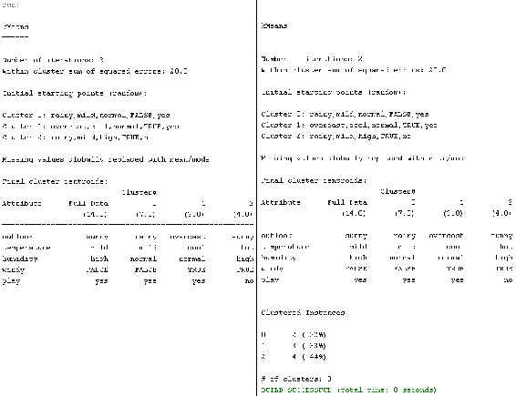
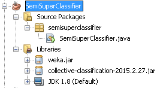
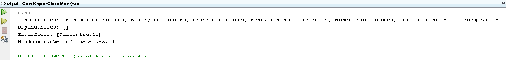
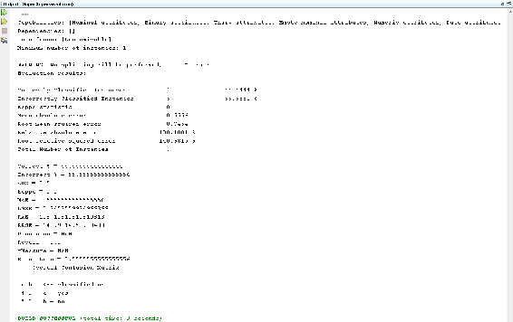

# 七、半监督和非监督学习

在这一章，我们将看看如何建立和评估一个无监督的模型。我们还将了解半监督学习、无监督学习和半监督学习之间的区别、如何构建半监督模型，以及如何使用半监督模型进行预测。

在本章中，我们将讨论以下主题:

*   使用 k 均值聚类
*   评估聚类模型
*   利用余弦相似性形成距离矩阵
*   无监督和半监督学习的区别
*   自我训练和共同训练机器学习模型
*   使用半监督机器学习模型进行预测


# 使用 k 均值聚类

让我们看看如何构建一个聚类模型。我们将使用 k-means 聚类构建一个无监督模型。

我们将使用`Instances`类和`DataSource`类，就像我们在前面的章节中所做的那样。由于我们正在使用集群，我们将使用`weka.clusterers`包来导入`SimpleKMeans`类，如下所示:

```java
import weka.core.Instances;
import weka.core.converters.ConverterUtils.DataSource;
import weka.clusterers.SimpleKMeans;
```

首先，我们将把我们的 ARFF 文件读入一个数据集对象，并将它分配给一个`Instances`对象。现在，由于这是我们必须做的全部工作(在分类中，我们还必须分配目标变量，class 属性)，我们必须告诉 Weka class 属性是什么，然后我们将为 k-means 聚类创建一个对象。首先，我们必须告诉 Weka 我们想要创建多少个集群。假设我们想要创建三个集群。我们将使用 k-means 对象，并将`setNumClusters`设置为`3`；然后，我们将使用`buildClusterer`构建我们的集群，并且我们将把集群分配到其中。然后，我们将打印我们的模型，如下所示:

```java
public static void main(String[] args) {
    // TODO code application logic here
    try{
        DataSource src = new DataSource("/Users/admin/Documents/NetBeansProjects/Datasets/weather.arff");
        Instances dt = src.getDataSet();
        SimpleKMeans model = new SimpleKMeans();
        model.setNumClusters(3);
        model.buildClusterer(dt);
        System.out.println(model);

    }
    catch(Exception e){
        System.out.println(e.getMessage());
    }
}
```

运行之后，我们将看到以下输出:


在前面的屏幕截图中，我们可以看到，最初，使用初始值创建了三个集群。在执行聚类之后，我们得到最终的三个聚类，因此`Cluster 0`具有`7.0`值，`Cluster 1`具有`3.0`值，`Cluster 2`具有`4.0`值。因为我们没有为我们的聚类算法提供一个类，所以字符串实际上试图将相似的数据分成组(我们称之为聚类)。这就是集群的工作方式。


# 评估聚类模型

现在，我们将了解如何评估已训练好的聚类分析模型。让我们看看代码，看看这是如何做到的。

我们将使用以下类:

```java
import weka.core.Instances;
import weka.core.converters.ConverterUtils.DataSource;
import weka.clusterers.SimpleKMeans;
import weka.clusterers.ClusterEvaluation;
```

我们将使用`weka.clusterers`包中的`ClusterEvaluation`类进行评估。

首先，我们将把数据集读入我们的`DataSource`对象，并把它分配给`Instances`对象。然后，我们将创建我们的 k-means 对象，并指定我们想要创建的聚类数。接下来，我们将使用`buildClusterer`方法训练我们的聚类算法；然后，我们将使用`println`打印它。这与您之前看到的类似:

```java
public static void main(String[] args) {
    // TODO code application logic here
    try{
        DataSource src = new DataSource("/Users/admin/Documents/NetBeansProjects/ClusterEval/weather.arff");
        Instances dt = src.getDataSet();
        SimpleKMeans model = new SimpleKMeans();
        model.setNumClusters(3);
        model.buildClusterer(dt);
        System.out.println(model);
```

接下来，我们将为`ClusterEvaluation`类创建一个对象。然后，我们将读入一个新的测试数据集，并将其分配给我们的`DataSource`对象。最后，我们将使用我们的`Instances`对象将它放入内存，我们将使用`setClusterer`设置`Clusterer`模型，并将训练好的`Clusterer`对象传递给`setClusterer`方法。一旦我们这样做了，我们将需要评估集群；因此，我们必须将测试数据集传递给`evaluateClusterer`方法。然后，我们将打印结果字符串，这样我们就可以得到我们已经训练的分类数:

```java
        ClusterEvaluation eval = new ClusterEvaluation();
        DataSource src1 = new DataSource("/Users/admin/Documents/NetBeansProjects/ClusterEval/weather.test.arff");
        Instances tdt = src1.getDataSet();
        eval.setClusterer(model);
        eval.evaluateClusterer(tdt);
```

运行上述代码将产生以下输出:



我们现在有了集群的数量，它们是使用我们的`eval`对象单独打印的。因此，这些分类的值如下:`22%`表示第一个分类，`33%`表示第二个分类，`44%`表示第三个分类。集群的总数是`3`。


# 半监督学习导论

半监督学习是一类考虑未标记数据的监督学习。如果我们有非常大量的数据，我们很可能希望对其进行学习。然而，用监督学习训练特定数据是一个问题，因为监督学习算法总是需要一个目标变量:一个可以分配给数据集的类。

假设我们有数百万个特定类型数据的实例。给这些实例分配一个类将是一个非常大的问题。因此，我们将从该特定数据中提取一小部分，并手动标记该数据(这意味着我们将手动为该数据提供一个类)。一旦我们做到了这一点，我们将使用它来训练我们的模型，以便我们可以使用未标记的数据(因为我们现在有一小组已标记的数据，这是我们创建的)。通常，少量的标记数据与大量的未标记数据一起使用。半监督学习介于监督学习和非监督学习之间，因为我们正在获取少量已标记的数据，并用它训练我们的模型；然后，我们试图通过使用未标记数据上的训练模型来分配类别。

许多机器学习研究人员发现，未标记数据在与少量标记数据结合使用时，可以在学习准确性方面产生相当大的提高。这是半监督学习的工作方式:监督学习和非监督学习的结合，其中我们获取非常少量的数据，对其进行标记，尝试对其进行分类，然后尝试将未标记的数据融入标记的数据中。


# 无监督和半监督学习的区别

在这一节，我们将看看无监督学习和半监督学习之间的区别。

无监督学习基于未标记的数据开发模型，而半监督学习使用标记和未标记的数据。

我们在无监督学习中使用期望最大化、层次聚类和 k-means 聚类算法，而在半监督学习中，我们应用主动学习或自举算法。

在 Weka 中，我们可以使用`collective-classification`包进行半监督学习。我们将在本章的后面看一下如何安装`collective-classification`包，您将看到如何使用集体分类来执行半监督学习。


# 自我训练和共同训练机器学习模型

您现在将学习如何开发半监督模型。

我们要做的第一件事是下载一个半监督学习包，然后我们将为半监督模型创建一个分类器。


# 下载半监督包

前往[https://github . com/frac Pete/collective-class ification-Weka-package](https://github.com/fracpete/collective-classification-weka-package)获取`collective-classification` Weka 包。这是一个半监督学习包，在 Weka 中提供。

有两种安装软件包的方法，如下所示:

*   从 GitHub 下载源代码并编译它，然后创建一个 JAR 文件
*   转到 Weka 包管理器，从那里安装集合分类

在执行上述方法之一后，您将得到一个 JAR 文件。您将需要这个 JAR 文件来训练分类器。我们将获得的源代码将为 JAR 文件提供代码。让我们看看这是如何做到的。


# 为半监督模型创建分类器

让我们从下面的代码开始:

```java
import weka.core.Instances;
import weka.core.converters.ConverterUtils.DataSource;
import weka.classifiers.collective.functions.LLGC;
```

我们首先需要的是`Instances`和`DataSource`类，我们从一开始就一直在使用它们。我们需要的第三个类是一个`LLGC`类，它可以在`collective-classification` JAR 文件的`functions`包中找到。

因此，我们需要将两个 JAR 文件导入到项目中；一个是我们已经在使用的常规`weka.jar`文件，第二个是半监督学习文件，即`collective-classification-<date>.jar`文件，如下面的截图所示:



现在，我们将创建一个`DataSource`对象，并将我们的 ARFF 文件分配给`DataSource`对象，如下所示:

```java
try{
    DataSource src = new DataSource("weather.arff");
    Instances dt = src.getDataSet();
    dt.setClassIndex(dt.numAttributes()-1);

    LLGC model = new LLGC();
    model.buildClassifier(dt);
    System.out.println(model.getCapabilities());
    }
catch(Exception e){
    System.out.println("Error!!!!\n" + e.getMessage());
    }
```

然后，我们将创建一个`Instances`对象，我们将把 ARFF 文件分配给这个`Instances`对象，并将我们的数据放入内存。一旦我们的数据集在内存中可用，我们将告诉 Weka 哪个属性是我们在分类中使用的类属性。接下来，我们将初始化`LLGC`对象。`LLGC`是用于执行半监督学习的类。我们将使用`model.buildClassifier(dt)`，并且我们将打印分类器的能力。

这些功能将被打印出来，如下面的屏幕截图所示:



正如您在前面的截图中看到的，这些是`LLGC`类可以执行半监督学习的属性，以便构建模型。这就是我们将如何建立一个半监督模型。


# 使用半监督机器学习模型进行预测

现在，我们将研究如何使用训练好的模型进行预测。考虑以下代码:

```java
import weka.core.Instances;
import weka.core.converters.ConverterUtils.DataSource;
import weka.classifiers.collective.functions.LLGC;
import weka.classifiers.collective.evaluation.Evaluation;
```

我们将导入两个 JAR 库，如下所示:

*   `weka.jar`图书馆
*   `collective-classification-<date>.jar`图书馆

因此，我们将采用两个基类，`Instances`和`DataSource`，并且我们将使用来自`collective-classifications`包的`LLGC`类(因为我们已经使用`LLGC`训练了我们的模型)，以及来自`collective-classifications`包的`Evaluation`类。

我们将首先给我们的`DataSource`对象分配一个 ARFF 文件；我们将把它读入内存，在一个`Instances`对象中。我们将为我们的`Instances`对象分配一个类属性，然后，我们将构建我们的模型:

```java
public static void main(String[] args) {
    try{
        DataSource src = new DataSource("weather.arff");
        Instances dt = src.getDataSet();
        dt.setClassIndex(dt.numAttributes()-1);

        LLGC model = new LLGC();
        model.buildClassifier(dt);
        System.out.println(model.getCapabilities());

        Evaluation eval = new Evaluation(dt);
        DataSource src1 = new DataSource("weather.test.arff");
        Instances tdt = src1.getDataSet();
        tdt.setClassIndex(tdt.numAttributes()-1);
        eval.evaluateModel(model, tdt);

        System.out.println(eval.toSummaryString("Evaluation results:\n", false));

        System.out.println("Correct % = "+eval.pctCorrect());
        System.out.println("Incorrect % = "+eval.pctIncorrect());
        System.out.println("AUC = "+eval.areaUnderROC(1));
        System.out.println("kappa = "+eval.kappa());
        System.out.println("MAE = "+eval.meanAbsoluteError());
        System.out.println("RMSE = "+eval.rootMeanSquaredError());
        System.out.println("RAE = "+eval.relativeAbsoluteError());
        System.out.println("RRSE = "+eval.rootRelativeSquaredError());
        System.out.println("Precision = "+eval.precision(1));
        System.out.println("Recall = "+eval.recall(1));
        System.out.println("fMeasure = "+eval.fMeasure(1));
        System.out.println("Error Rate = "+eval.errorRate());
        //the confusion matrix
        System.out.println(eval.toMatrixString("=== Overall Confusion Matrix ===\n"));

    }
    catch(Exception e)
    {
        System.out.println("Error!!!!\n" + e.getMessage());
    }    
}
```

一旦我们完成了这些，我们将为我们的`Evaluation`类创建一个对象，并且我们将指定我们想要在哪个数据集上执行评估。因此，我们将把数据集传递给`Evaluation`类构造函数。然后，我们将为`DataSource`类创建一个新对象，我们将带着`weather.test.arff`文件进行测试。我们将创建一个`Instances`对象`tdt`，并将数据集分配给测试数据集`tdt`。

然后，我们将需要通知 Weka,`tdt`对象中的哪个属性是我们的类属性；因此，我们将调用`setClassIndex`方法。然后，我们将使用我们的`Evaluation`类的`evaluateModel`方法，并传入`model`和我们的测试数据集。

一旦完成，我们将一次性打印出`Evaluation`结果；或者，如果您愿意，您可以单独打印结果，就像我们在半监督学习练习中所做的那样。

让我们运行代码。我们将获得以下输出:



我们的模型建造成功。一旦模型建立起来，我们打印出全部结果，然后我们分别打印出结果和混淆矩阵。这就是用半监督数据建立模型的方法。


# 摘要

在本章中，您学习了如何训练模型以及如何评估聚类分析模型。然后，我们看了半监督学习的概念，以及它与无监督学习的区别。我们的半监督模型已经训练好了，我们现在可以根据它进行预测。

由于这是本书的最后一章，我们将总结一下我们所取得的成就。你学过机器学习的基础知识；我们已经安装了 JDK、JRE 和 NetBeans。我们研究了搜索算法，研究并实现了其中的两个:一个是 Dijkstra 的算法，另一个是它的改进(A*算法)。

你学了玩游戏，我们用井字游戏实现了一个玩游戏的算法。我们介绍了什么是基于规则的系统，并且用 Prolog 实现了一个基本的基于规则的系统；然后，我们在 Java 程序中使用了这个基于规则的系统。我们安装了 Weka 并使用数据集。我们将 CSV 文件转换成 ARFF 文件，反之亦然。然后，我们将不同种类的过滤器(监督和非监督过滤器)应用于我们的数据集。我们应用了非常发达的分类模型。我们对这些模型进行评估、保存、加载和预测。我们对聚类模型做了同样的工作；我们训练了聚类模型，并对聚类模型进行了评估。然后，您学习了半监督学习的基础知识，包括如何使用半监督学习模型。

这本书就讲到这里。谢谢你。