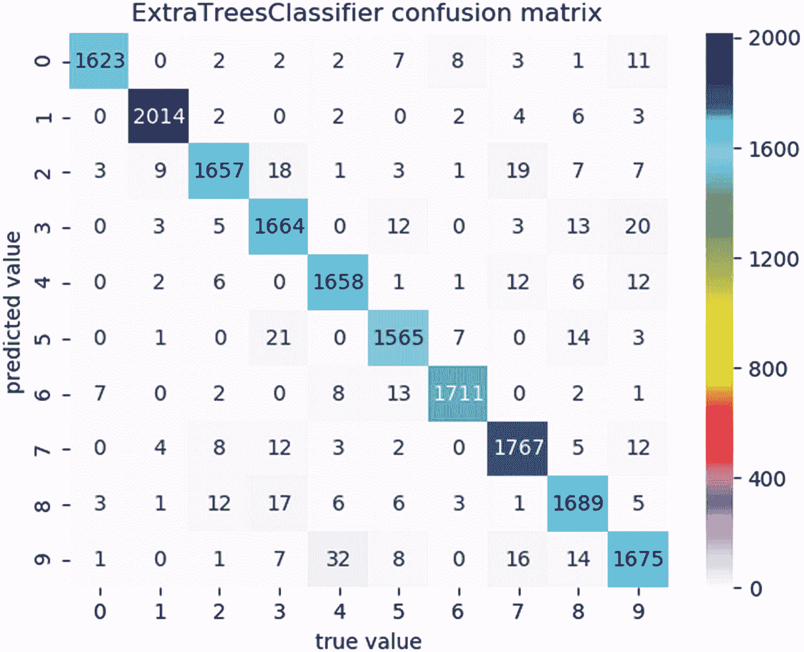

# 三、复杂训练集的分类

复杂数据的分类与简单数据完全一样。数据被加载到特征集 X 和目标 y 中。X 数据由向量矩阵组成，其中每个向量代表一个数据元素，y 数据由目标向量组成。但是，复杂数据由大量的要素组成(成百上千)。这样的数据集通常被称为具有高维特征空间的数据集。文本数据也很复杂，因为每个文档都必须转换为适合机器学习算法的数值向量。

## 复杂数据集

我们专注于三个复杂的数据集:fetch_20newsgroups、MNIST 和 fetch_lfw_people。fetch_20newsgroups 由成千上万的新闻组帖子(文档)组成。MNIST 由数千幅 28 × 28 的图像组成，每幅图像由 784 个像素表示。fetch_lfw_people 由 1288 个 50 × 37 的图像组成，其中每个图像由 1850 个像素表示。

### 分类 fetch _ 新闻组

由于 Scikit-Learn 算法不接受原始文本，我们需要将其转换为可以用作输入的特征向量。TfidfVectorizer 将文本(表示为原始文档)转换为 TF-IDF 特征的矩阵‘54321’(可用作估计器输入的特征向量)。

TF-IDF(术语频率-逆文档频率)是一种数字统计，旨在反映一个单词在文档中的重要性。TF-IDF 是最受欢迎的术语加权方案之一，在数字图书馆基于文本的推荐系统中有 83%的使用。

TF-IDF 是一个非常大的话题。我们不会涉及太多细节，因为我们只是想用它来确定单词的重要性。然而，重要的是要知道单词重要性是由 TF-IDF 权重决定的，并且重要性与单词在文档中出现的次数成比例地增加。

只看词频的问题是，一些像“The”、“is”和“of”这样的词可能并不重要。因此，我们还可以查看逆文档频率，它降低了常用词的权重，增加了不常用词的权重。幸运的是，Scikit-Learn 包括了 *TfidfVectorizer* 包，它可以有效地结合单词和逆词频来提取有意义的信息。

将文本转换为要素数据不同于图像。图像变换包括将矩阵展平成相同长度的特征向量。对于文本，每个文档的大小通常不同。因此，我们需要一种类似 TF-IDF 的技术来将文档转换成 Scikit-Learn 算法可接受的 TF-IDF 特征矩阵。文本转换也更加复杂，因为字数会影响文档中单词的重要性。

文本分类特性与字数或频率有关，所以让我们使用一个适合这个目的的分类器。多项式贝叶斯分类器是一种朴素的贝叶斯分类器，适用于具有离散特征的多项式模型分类，如文本分类的字数。

清单 3-1 中显示的第一个代码示例对 fetch_20newsgroups 数据进行分类。第一次加载这个数据集时，您可能需要等待一段时间，所以请耐心等待。第一次加载后，您不会遇到延迟。

```py
from sklearn.datasets import fetch_20newsgroups
from sklearn.feature_extraction.text import TfidfVectorizer
from sklearn.naive_bayes import MultinomialNB
from sklearn.pipeline import make_pipeline
from sklearn.metrics import confusion_matrix, f1_score
import matplotlib.pyplot as plt
import seaborn as sns

def predict_category(s, m, t):
    pred = m.predict([s])
    return t[pred[0]]

if __name__ == "__main__":
    br = '\n'
    train = fetch_20newsgroups(subset='train')
    test = fetch_20newsgroups(subset='test')
    print (train.target_names, br)
    categories = ['rec.autos', 'rec.motorcycles', 'sci.space', 'sci.med']
    train = fetch_20newsgroups(subset='train', categories=categories)
    test = fetch_20newsgroups(subset='test', categories=categories)
    print ('data subset:')
    print (train.target.shape, 'shape of train data')
    print (test.target.shape, 'shape of test data', br)
    targets = train.target_names
    mnb_clf = make_pipeline(TfidfVectorizer(), MultinomialNB())

    print ('<<' + mnb_clf.__class__.__name__ + '>>', br)
    mnb_clf.fit(train.data, train.target)
    labels = mnb_clf.predict(test.data)
    f1 = f1_score(test.target, labels, average="micro")
    print ('f1_score', f1, br)
    cm = confusion_matrix(test.target, labels)
    plt.figure('confusion matrix')

    sns.heatmap(cm.T, square=True, annot=True, fmt="d", cmap="gist_ncar_r", xticklabels=train.target_names, yticklabels=train.target_names, cbar=False)
    print ('sci.med predictions:')
    print (cm.T[2][2], 'correct predictions')
    print (cm.T[2][0], 'misclassified as rec.autos')
    print (cm.T[2][3], 'misclassified as sci.space')
    plt.xlabel('true label')
    plt.ylabel('predicted label')
    plt.tight_layout()
    print ('\n***PREDICTIONS***:')
    y_pred = predict_category('payload on the mars rover', mnb_clf, targets)
    print (y_pred)
    y_pred = predict_category('car broke down on the highway', mnb_clf, targets)
    print (y_pred)
    y_pred = predict_category('dad died of cancer', mnb_clf, targets)
    print (y_pred)

Listing 3-1Classify fetch_20newsgroups data

```

继续执行清单 3-1 中的代码。请记住，您可以从本书的示例下载中找到示例。您不需要手动键入示例。更容易访问示例下载和复制/粘贴。

执行清单 3-1 的输出应该如下所示:

```py
['alt.atheism', 'comp.graphics', 'comp.os.ms-windows.misc', 'comp.sys.ibm.pc.hardware', 'comp.sys.mac.hardware', 'comp.windows.x', 'misc.forsale', 'rec.autos', 'rec.motorcycles', 'rec.sport.baseball', 'rec.sport.hockey', 'sci.crypt', 'sci.electronics', 'sci.med', 'sci.space', 'soc.religion.christian', 'talk.politics.guns', 'talk.politics.mideast', 'talk.politics.misc', 'talk.religion.misc']

data subset:
(2379,) shape of train data
(1584,) shape of test data

<<Pipeline>>

f1_score 0.9621212121212122

sci.med predictions:
370 correct predictions
1 misclassified as rec.autos
7 misclassified as sci.space

***PREDICTIONS***:
sci.space
rec.autos
sci.med

```

列表 3-1 也显示图 3-1 。图 3-1 显示了使用 TfidfVectorizer 文本转换的多项分类的混淆矩阵。


图 3-1

分类实验的混淆矩阵

代码从导入 fetch_20newsgroups、TfidfVectorizer、MultinomialNB 和其他一些熟悉的包开始。函数 predict_category 用于根据新数据预测类别标签。主程序块首先从 fetch_20newsgroups 加载训练和测试文档。接下来，它显示数据集中的目标类别。代码继续创建一个包含四个类别的训练和测试数据的子集，我选择在这个实验中使用这四个类别。请记住，您可以创建自己的*子集。*

子集训练和测试数据集用于建模。然后显示数据形状。接下来，使用 TfidfVectorizer 和 MultinomialNB 创建管道模型。TfidfVectorizer 提取文本并将其转换为数值向量，以便 MultinomialNB 可以对其进行训练。

### 小费

为了算法处理，文本数据必须转换成数字形式。

创建标签向量来保存来自测试数据子集的预测。显示准确度分数(f1_score)。 *f1_score* 是精度和召回分数的加权平均值。因此，这是一个更保守的估计。一个 f1 _ 以上的分数真的很好！

创建混淆矩阵是为了让我们了解我们的模型对测试数据的分类有多好。我们*转置*矩阵(cm。t ),使得预测标签在垂直轴上，真实(实际)标签在水平轴上。你不用转置，但我更容易解读结果。

混淆矩阵的对角线表示正确的分类。也就是说，对于 rec.autos 我们做了 389 个正确的分类，rec.motorcycles 我们做了 383 个正确的分类，sci.med 我们做了 370 个正确的预测，sci.space 我们做了 383 个正确的分类。错误分类是那些偏离对角线的分类。例如，我们将一个 sci.med 错误分类为 rec.autos，将七个错误分类为 sci.space。

代码结束时，根据训练好的模型对全新的数据进行预测。文字“火星探测车上的有效载荷”被归类为 sci.space，正确！接下来的两个文本字符串也能正确预测。由于模型准确率超过 96%，我们可以相当肯定我们的预测是可靠的。

前面的例子有一个问题。该算法能够从页眉、页脚和引号中理解文本的含义。就是我们选择的算法相当巧妙。

为了创建一个更真实的例子，我们可以从文本文档中删除页眉、页脚和引号，如清单 3-2 中的下一个例子所示。

```py
from sklearn.datasets import fetch_20newsgroups
from sklearn.feature_extraction.text import TfidfVectorizer
from sklearn.naive_bayes import MultinomialNB
from sklearn.pipeline import make_pipeline
from sklearn.metrics import confusion_matrix, f1_score
import matplotlib.pyplot as plt
import seaborn as sns

def predict_category(s, m, t):
    pred = m.predict([s])
    return t[pred[0]]

if __name__ == "__main__":
    br = '\n'
    train = fetch_20newsgroups(subset='train')
    test = fetch_20newsgroups(subset='test')
    categories = ['rec.autos', 'rec.motorcycles', 'sci.space', 'sci.med']
    train = fetch_20newsgroups(subset='train', categories=categories, remove=('headers', 'footers', 'quotes'))
    test = fetch_20newsgroups(subset='test', categories=categories, remove=('headers', 'footers', 'quotes'))
    targets = train.target_names
    mnb_clf = make_pipeline(TfidfVectorizer(), MultinomialNB())
    print ('<<' + mnb_clf.__class__.__name__ + '>>', br)
    mnb_clf.fit(train.data, train.target)
    labels = mnb_clf.predict(test.data)
    f1 = f1_score(test.target, labels, average="micro")
    print ('f1_score', f1, br)
    cm = confusion_matrix(test.target, labels)
    plt.figure('confusion matrix')
    sns.heatmap(cm.T, square=True, annot=True, fmt="d", cmap="gist_ncar_r", xticklabels=train.target_names, yticklabels=train.target_names, cbar=False)
    plt.xlabel('true label')
    plt.ylabel('predicted label')
    plt.tight_layout()

    print ('***PREDICTIONS***:')
    y_pred = predict_category('payload on the mars rover', mnb_clf, targets)
    print (y_pred)
    y_pred = predict_category('car broke down on the highway', mnb_clf, targets)
    print (y_pred)
    y_pred = predict_category('dad died of cancer', mnb_clf, targets)
    print (y_pred)
    plt.show()

Listing 3-2Classify fetch_20newsgroups removing identifying information

```

执行清单 3-2 的输出应该如下所示:

```py
<<Pipeline>>

f1_score 0.8440656565656567

***PREDICTIONS***:
sci.space
rec.autos
sci.med

```

列表 3-2 也显示图 3-2 。图 3-2 显示了移除页眉、页脚和引号后的混淆矩阵。


图 3-2

没有页眉、页脚和引号的混淆矩阵

代码与前面的例子非常相似，只是我们从训练和测试子集中删除了页眉、页脚和引号。请注意，f1_score 下降到 84%多一点，这是一个相当大的下降！这是一个更现实的场景，因为文本数据可能不包括识别信息。

新数据的预测似乎是正确的，但是请注意，我预测的文本非常清楚。也就是说，我们训练的模型很容易做出正确的预测，因为文本中有直接指向正确类别的单词。例如，火星车上的*有效载荷肯定是*科幻空间*，因为该短语包含单词*火星*。*

在这种情况下，混淆矩阵是一个很好的视觉效果，因为它显示有许多错误分类，特别是试图区分 rec.autos 和 rec.motorcycles。当然，这很有意义，因为汽车和摩托车比我们子集中的其他两个类别更相似。

错误分类也是搜索算法和数据改进的好地方。也许需要更多的数据来提高准确性。也许该算法分类错误，因为它的一些或所有超参数需要调整。

### MNIST 分类

在第一章中介绍了 MNIST，它是一个大型手写数字数据库，通常用于机器学习社区和其他工业图像处理应用程序的训练和测试。回顾一下，MNIST 包含 70000 张手写数字图像，大小为 28 × 28，从 0 到 9。每个目标存储为一个数字值。该特征集是 70000 个 28 × 28 图像的矩阵，每个图像自动展平为 784 像素。

#### 使用整个 MNIST 数据集进行训练

接下来的两个代码示例为整个 MNIST 数据集定型。由于 MNIST 数据由高维特征空间组成，我们只使用精选分类器对其进行训练，以减少训练时间。

清单 3-3 中显示的第一个代码示例使用 RandomForestClassifier 和 ExtraTreesClassifier 训练 MNIST 数据，比较准确度得分，可视化混淆矩阵，并可视化错误分类场景。

```py
import numpy as np, humanfriendly as hf
import time
from sklearn.model_selection import train_test_split
from sklearn.ensemble import RandomForestClassifier,\
     ExtraTreesClassifier
from sklearn.metrics import accuracy_score
from sklearn.metrics import confusion_matrix
import matplotlib.pyplot as plt
import seaborn as sns

def get_time(time):
    return hf.format_timespan(time, detailed=True)

def find_misses(test, pred):
    return [i for i, row in enumerate(test) if row != pred[i]]

if __name__ == "__main__":
    br = '\n'
    X_file = 'data/X_mnist'
    y_file = 'data/y_mnist'
    X = np.load('data/X_mnist.npy')
    y = np.load('data/y_mnist.npy')
    X = X.astype(np.float32)
    X_train, X_test, y_train, y_test = train_test_split\
                                       (X, y, random_state=0)
    rf = RandomForestClassifier(random_state=0, n_estimators=100)
    rf_name = rf.__class__.__name__
    print ('<<' + rf_name + '>>')
    start = time.perf_counter()

    rf.fit(X_train, y_train)
    end = time.perf_counter()
    elapsed_ls = end - start
    timer = get_time(elapsed_ls)
    rf_name = rf.__class__.__name__
    y_pred = rf.predict(X_test)
    accuracy = accuracy_score(y_test, y_pred)
    print ('\'test\' accuracy:', accuracy)
    print (rf_name + ' timer:', timer, br)
    cm = confusion_matrix(y_test, y_pred)
    plt.figure(1)
    ax = plt.axes()
    sns.heatmap(cm.T, annot=True, fmt="d", cmap="gist_ncar_r", ax=ax)
    ax.set_title(rf_name + 'confustion matrix')
    plt.xlabel('true value')
    plt.ylabel('predicted value')

    et = ExtraTreesClassifier(random_state=0, n_estimators=100)
    et_name = et.__class__.__name__
    print ('<<' + et_name + '>>')
    start = time.perf_counter()
    et.fit(X_train, y_train)
    end = time.perf_counter()
    elapsed_ls = end - start
    timer = get_time(elapsed_ls)
    y_pred = et.predict(X_test)
    accuracy = accuracy_score(y_test, y_pred)
    print ('\'test\' accuracy:', accuracy)
    print (et_name + ' timer:', timer, br)
    cm = confusion_matrix(y_test, y_pred)
    plt.figure(2)
    ax = plt.axes()
    sns.heatmap(cm.T, annot=True, fmt="d", cmap="gist_ncar_r", ax=ax)
    ax.set_title(et_name + 'confustion matrix')
    plt.xlabel('true value')
    plt.ylabel('predicted value')
    indx = find_misses(y_test, y_pred)
    print ('pred', 'actual')
    misses = [(y_pred[row], y_test[row], i)
              for i, row in enumerate(indx)]
    [print (row[0], '  ', row[1]) for i, row in enumerate(misses)

     if i < 5]
    print()
    img_act = y_test[indx[0]]
    img_pred = y_pred[indx[0]]
    print ('actual', img_act)
    print ('pred', img_pred)
    text = str(img_pred)
    test_images = X_test.reshape(-1, 28, 28)
    plt.figure(3)
    plt.imshow(test_images[indx[0]], cmap="gray", interpolation="gaussian")
    plt.text(0, 0.05, text, color="r", bbox=dict(facecolor='white'))
    title = str(img_act) + ' misclassified as ' + text
    plt.title(title)
    plt.show()

Listing 3-3Classify MNIST data

```

执行清单 3-3 的输出应该如下所示:

```py
<<RandomForestClassifier>>
'test' accuracy: 0.9687428571428571
RandomForestClassifier timer: 29 seconds and 620.77 milliseconds

<<ExtraTreesClassifier>>
'test' accuracy: 0.9727428571428571
ExtraTreesClassifier timer: 30 seconds and 462.9 milliseconds

pred actual
3.0    9.0
7.0    3.0
4.0    9.0
2.0    3.0
3.0    9.0

actual 9.0
pred 3.0

```

列表 3-3 还显示了数字 3-3 、 3-4 和 3-5 。图 3-3 显示了 RandomForestClassifier 的混淆矩阵。图 3-4 显示了提取树分类器的混淆矩阵。图 3-5 显示了第一次错误分类。


图 3-5

第一次错误分类



图 3-4

外分类学混淆矩阵


图 3-3

随机应变分类器混淆矩阵

代码从导入必需的包开始。函数 get_time 返回训练所需的时间。函数 find_misses 返回一个错误分类列表。主程序块将 MNIST 从 NumPy 文件加载到 X 和 y 中，将 X 转换成浮点数以供算法使用，并将数据分割成训练测试子集。

代码继续使用 RandomForestClassifier 和 ExtraTreesClassifier 对数据进行定型。对于这两种算法，显示精度和训练时间，并创建和可视化混淆矩阵。接下来，显示前五个错误分类。最后，可视化第一个错误分类(预测值:3.0，实际值:9.0)。请注意，训练确实需要一些时间(每个算法大约需要 30 秒)。原因是 MNIST 数据是由高维特征空间组成的。

请注意，人类很容易看出数字是 *9* ，但对机器来说就不那么容易了，因为预测的是数字 *3* 。这种可视化以及混淆矩阵非常重要，因为它可以帮助数据科学家通过调整数据、试验不同的算法或改进算法来提高预测性能。

清单 3-4 中显示的下一个代码示例手动将数据分割成训练测试子集，以增加灵活性。也就是说，我们可以精确地调整训练测试子集的大小。

```py
import numpy as np, humanfriendly as hf
import time
from sklearn.ensemble import ExtraTreesClassifier
from sklearn.metrics import accuracy_score
from sklearn.metrics import classification_report

if __name__ == "__main__":
    br = '\n'
    X_file = 'data/X_mnist'
    y_file = 'data/y_mnist'
    X = np.load('data/X_mnist.npy')
    y = np.load('data/y_mnist.npy')
    X = X.astype(np.float32)
    X_train, X_test, y_train, y_test = X[:60000], X[60000:],\
                                       y[:60000], y[60000:]
    shuffle_index = np.random.permutation(60000)
    X_train, y_train = X_train[shuffle_index],\
                       y_train[shuffle_index]
    et = ExtraTreesClassifier(random_state=0, n_estimators=100)
    start = time.perf_counter()
    et.fit(X_train, y_train)
    end = time.perf_counter()
    elapsed_ls = end - start
    print (hf.format_timespan(elapsed_ls, detailed=True))
    et_name = et.__class__.__name__
    y_pred = et.predict(X_test)
    accuracy = accuracy_score(y_test, y_pred)
    print (et_name + ' \'test\':', end=' ')
    print ('accuracy:', accuracy, br)
    rpt = classification_report(y_test, y_pred)
    print (rpt)

Listing 3-4Classify MNIST with manual train-test shuffle

```

执行清单 3-4 的输出应该如下所示:

```py
36 seconds and 533.76 milliseconds
ExtraTreesClassifier 'test': accuracy: 0.9706

              precision    recall  f1-score   support

         0.0       0.97      0.99      0.98       980
         1.0       0.99      0.99      0.99      1135
         2.0       0.97      0.97      0.97      1032
         3.0       0.97      0.96      0.96      1010
         4.0       0.97      0.97      0.97       982
         5.0       0.97      0.97      0.97       892
         6.0       0.98      0.98      0.98       958
         7.0       0.97      0.97      0.97      1028
         8.0       0.97      0.96      0.96       974
         9.0       0.95      0.95      0.95      1009

   micro avg       0.97      0.97      0.97     10000
   macro avg       0.97      0.97      0.97     10000
weighted avg       0.97      0.97      0.97     10000

```

代码从导入 classification_report 和其他必需的包开始。分类报告显示模型的精确度、召回率、F1 和支持度分数。

*精度*是分类器不将实际上是负面的实例标记为正面的能力。*回忆*是分类器找到所有肯定实例的能力。f<sub>1</sub>_ 分数是精确度和召回率的加权调和平均值，其中最好的分数是 1.0，最差的分数是 0.0。f<sub>1</sub>_ 分数通常低于精度度量，因为它们将精度和召回嵌入到计算中。 *Support* 是指定数据集中类的实际出现次数。

主块将 MNIST 加载到 X 和 y 中，并手动将数据混洗到训练测试子集中。在这种情况下，我们使用了更多的数据进行训练。具体来说，培训 6 万，测试 1 万。我们有更多的训练数据，如果我们有足够的数据来处理，这可能是一个很好的实验。接下来，我们用 ExtraTreesClassifier 进行训练，因为它在前面的例子中在 MNIST 上的表现比 RandomForestClassifier 好。最后，给出准确度分数和分类报告。

### 小费

如果您需要更大的灵活性，可以手动将数据放入训练测试子集。

#### 训练 MNIST 样本数据

清单 3-5 中显示的第一个代码示例创建了一个来自 MNIST 的 4000 个数据元素的随机样本，以支持 svm 的高效训练。SVC 和 KNeighborsClassifier。这两种算法都是优秀的分类器，但众所周知，对于高维特征空间数据集，它们的计算开销很大。

```py
import numpy as np, random, humanfriendly as hf
import time
from sklearn.model_selection import train_test_split
from sklearn.preprocessing import StandardScaler
from sklearn import svm
from sklearn.neighbors import KNeighborsClassifier
import matplotlib.pyplot as plt

def prep_data(data, target):
    d = [data[i] for i, _ in enumerate(data)]
    t = [target[i] for i, _ in enumerate(target)]
    return list(zip(d, t))

def create_sample(d, n, replace="yes"):
    if replace == 'yes': s = random.sample(d, n)
    else: s = [random.choice(d)
               for i, _ in enumerate(d) if i < n]
    Xs = [row[0] for i, row in enumerate(s)]
    ys = [row[1] for i, row in enumerate(s)]
    return np.array(Xs), np.array(ys)

def see_time(note):
    end = time.perf_counter()

    elapsed = end - start
    print (note, hf.format_timespan(elapsed, detailed=True))

if __name__ == "__main__":
    br = '\n'
    X_file = 'data/X_mnist'
    y_file = 'data/y_mnist'
    X = np.load('data/X_mnist.npy')
    y = np.load('data/y_mnist.npy')
    X = X.astype(np.float32)
    sample_size = 4000
    data = prep_data(X, y)
    Xs, ys = create_sample(data, sample_size, replace="no")
    X_train, X_test, y_train, y_test = train_test_split(
        Xs, ys, test_size=0.10, random_state=0)
    scaler = StandardScaler().fit(X_train)
    X_train_std, X_test_std = scaler.transform(X_train),\
                              scaler.transform(X_test)
    svm = svm.SVC(random_state=0, gamma="scale")
    svm_name = svm.__class__.__name__
    print ('<<', svm_name, '>>')
    start = time.perf_counter()
    svm.fit(X_train_std, y_train)

    see_time('train:')
    start = time.perf_counter()
    y_pred = svm.predict(X_test_std)
    see_time('predict:')
    start = time.perf_counter()
    train_score = svm.score(X_train_std, y_train)
    test_score = svm.score(X_test_std, y_test)
    see_time('score:')
    print ('train score:', train_score, 'test score', test_score, br)
    knn = KNeighborsClassifier()
    knn_name = knn.__class__.__name__
    print ('<<', knn_name, '>>')
    start = time.perf_counter()
    knn.fit(X_train, y_train)
    see_time('train:')
    start = time.perf_counter()
    y_pred = knn.predict(X_test)
    see_time('predict:')
    start = time.perf_counter()
    train_score = knn.score(X_train, y_train)
    test_score = knn.score(X_test, y_test)
    see_time('score:')
    print ('train score:', train_score, 'test score:', test_score)

Listing 3-5Classify MNIST with sample data

```

执行清单 3-5 的输出应该如下所示:

```py
train: 6 seconds and 538.51 milliseconds
predict: 780.46 milliseconds
score: 7 seconds and 755.28 milliseconds
train score: 0.9802777777777778 test score 0.9075

<< KNeighborsClassifier >>
train: 116.53 milliseconds
predict: 1 second and 605.23 milliseconds
score: 15 seconds and 924.84 milliseconds
train score: 0.9519444444444445 test score: 0.91

```

代码从导入必需的包开始。函数 prep_data 将数据转换为数据元素列表，以便于采样。函数 create_sample 接受准备好的数据并创建一个随机样本而不替换。函数 see_time 返回经过的时间。

主块将数据加载到 X 和 y 中。接下来，创建 4000 个数据元素的样本，并将其分成训练测试子集。代码继续用 svm 训练样本。SVC 和 KNeighborsClassifier。

我们需要用这些算法来抽取随机样本，因为当训练大型数据集时，特别是那些具有高维特征空间的数据集时，这些算法的计算开销很大。

对于每种算法，都报告了训练、预测和评分时间。到目前为止，我们只捕获了火车时间。但是，有趣的是，我们可以看到培训过程的每个阶段占用了多少时间。对于我们的样本，KNeighborsClassifier 报告了比 svm.SVC 更少的过拟合的可观结果。

### 小费

通过调整 sample_size 变量，可以很容易地试验样本大小。

清单 3-6 中显示的下一个 MNIST 示例利用 PCA 增加了 7000 个样本，而没有增加太多的计算开销。

```py
import numpy as np, random, humanfriendly as hf
import time
from sklearn.decomposition import PCA
from sklearn.model_selection import train_test_split
from sklearn.preprocessing import StandardScaler
from sklearn import svm
from sklearn.neighbors import KNeighborsClassifier
from sklearn.metrics import f1_score
from sklearn.metrics import confusion_matrix
import matplotlib.pyplot as plt, seaborn as sns

def prep_data(data, target):
    d = [data[i] for i, _ in enumerate(data)]
    t = [target[i] for i, _ in enumerate(target)]
    return list(zip(d, t))

def create_sample(d, n, replace="yes"):
    if replace == 'yes': s = random.sample(d, n)
    else: s = [random.choice(d)
               for i, _ in enumerate(d) if i < n]
    Xs = [row[0] for i, row in enumerate(s)]
    ys = [row[1] for i, row in enumerate(s)]
    return np.array(Xs), np.array(ys)

def see_time(note):
    end = time.perf_counter()
    elapsed = end - start
    print (note, hf.format_timespan(elapsed, detailed=True))

def get_scores(model, xtrain, ytrain, xtest, ytest):
    ypred = model.predict(xtest)
    train = model.score(xtrain, ytrain)
    test = model.score(xtest, y_test)
    f1 = f1_score(ytest, ypred, average="macro")
    return (ypred, train, test, f1)

if __name__ == "__main__":
    br = '\n'
    X_file = 'data/X_mnist'
    y_file = 'data/y_mnist'
    X = np.load('data/X_mnist.npy')
    y = np.load('data/y_mnist.npy')
    X = X.astype(np.float32)
    data = prep_data(X, y)
    sample_size = 7000

    Xs, ys = create_sample(data, sample_size, replace="no")
    pca = PCA(n_components=0.95, random_state=0)
    Xs_reduced = pca.fit_transform(Xs)
    print ('sample feature shape:', Xs.shape)
    components = pca.n_components_
    print ('feature components with PCA:', components, br)
    X_train, X_test, y_train, y_test = train_test_split(
        Xs_reduced, ys, test_size=0.10, random_state=0)
    scaler = StandardScaler().fit(X_train)
    X_train_std, X_test_std = scaler.transform(X_train),\
                              scaler.transform(X_test)
    start = time.perf_counter()
    svm = svm.SVC(random_state=0).fit(X_train_std, y_train)
    svm_name = svm.__class__.__name__
    svm_scores = get_scores(svm, X_train_std, y_train, X_test_std, y_test)
    cm_svm = confusion_matrix(y_test, svm_scores[0])
    see_time(svm_name + ' total training time:')

    print (svm_name + ':', svm_scores[1], svm_scores[2], svm_scores[3], br)
    start = time.perf_counter()
    knn = KNeighborsClassifier().fit(X_train, y_train)
    knn_name = knn.__class__.__name__
    knn_scores = get_scores(knn, X_train, y_train, X_test, y_test)
    cm_knn = confusion_matrix(y_test, knn_scores[0])
    see_time(knn_name + ' total training time:')
    print (knn_name + ':', knn_scores[1], knn_scores[2], knn_scores[3])
    plt.figure(svm_name)
    ax = plt.axes()
    sns.heatmap(cm_svm.T, annot=True, fmt="d", cmap="gist_ncar_r", ax=ax)
    ax.set_title(str(svm_name) + ' confustion matrix')
    plt.xlabel('true value')
    plt.ylabel('predicted value')
    plt.figure(knn_name)
    ax = plt.axes()
    sns.heatmap(cm_knn.T, annot=True, fmt="d", cmap="gist_ncar_r", ax=ax)
    ax.set_title(str(knn_name) + ' confustion matrix')
    plt.xlabel('true value')
    plt.ylabel('predicted value')
    plt.show()

Listing 3-6Classify MNIST with sample data and PCA

```

执行清单 3-6 的输出应该如下所示:

```py
sample feature shape: (7000, 784)
feature components with PCA: 150

SVC total training time: 14 seconds and 290.91 milliseconds
SVC: 0.9955555555555555 0.9428571428571428 0.9425480948692136

KNeighborsClassifier total training time: 10 seconds and 313.37 milliseconds
KNeighborsClassifier: 0.9601587301587302 0.9371428571428572 0.9358573966927535

```

列表 3-6 还显示了数字 3-6 和 3-7 。图 3-6 显示 svm.SVC 的混淆矩阵。图 3-7 显示 KNeighborsClassifier 的混淆矩阵。


图 3-7

近邻分类器的混淆矩阵


图 3-6

svm 的混淆矩阵。交换虚拟电路

该代码示例从导入必备包开始。函数 prep_data 创建了一个数据元素列表，以便于处理。函数 create_sample 创建 7000 个数据元素的随机样本，没有替换。函数 see_time 返回经过的时间。函数 get_scores 返回分数。

主模块首先将数据加载到 X 和 y 中，然后创建 7000 个数据元素的随机样本。PCA 被用来*将 784 个特征减少*到 150 个特征，并且有 5%的信息丢失。特征集是从 PCA 模型创建的。显示原始样本形状以及 PCA 中减少的特征成分。接下来，svm。SVC 和 KNeighborsClassifier 对样本进行训练。显示每个模型的总训练时间和得分。分数分别报告为训练准确度、测试准确度和测试 f1_score。代码最后为每个模型创建并显示混淆矩阵。

请注意，使用 7000 这个较大的样本对两个模型都有更好的拟合。也就是说，我们有更少的过度拟合。

随着数据集变得越来越大，采样在行业中是非常常见的做法。采样可以极大地减少计算开销，同时提供一个即使是计算开销最大的算法的预测能力的好主意。此外，降维结合采样可以进一步降低计算开销！

### 小费

采样降维可以显著降低计算开销。

### 分类 fetch_lfw_people

fetch_lfw_people 由来自野外(lfw)标记人脸的预处理图像组成，这是一个为研究无约束人脸识别而设计的数据库。LFW 包含了从网上收集的 13000 多张人脸图像。每张照片都标有照片中人的名字。要了解更多关于 LFW 的信息，请点击此链接: [`http://vis-www.cs.umass.edu/lfw/`](http://vis-www.cs.umass.edu/lfw/) 。在我们的实验中，我们只考虑数据集中至少有 70 张照片的人。图像被调整到 0.4 的纵横比。

清单 3-7 中显示的第一个代码示例用 svm 对 fetch_lfw_people 进行分类。SVC 是人脸识别中最有用的算法之一。

```py
import numpy as np
from sklearn.decomposition import PCA
from sklearn.model_selection import train_test_split
from sklearn.svm import SVC
from sklearn.metrics import classification_report
import matplotlib.pyplot as plt

if __name__ == "__main__":
    br = '\n'
    X = np.load('data/X_faces.npy')
    y = np.load('data/y_faces.npy')
    images = np.load('data/faces_images.npy')
    targets = np.load('data/faces_targets.npy')
    _, h, w = images.shape
    n_images = X.shape[0]
    n_features = X.shape[1]
    n_classes = len(targets)
    print ('features:', n_features)
    print ('images:', n_images)
    print ('classes:', n_classes, br)
    print ('target names:')
    print (targets, br)
    X_train, X_test, y_train, y_test = train_test_split(X, y, random_state=0)
    pca = PCA(n_components=0.95, whiten=True, random_state=0)
    pca.fit(X_train)
    components = pca.n_components_
    eigenfaces = pca.components_.reshape((components, h, w))
    X_train_pca = pca.transform(X_train)
    pca_name = pca.__class__.__name__
    print ('<<' + pca_name + '>>')
    print ('features (after PCA):', components)
    print ('eigenface shape:', eigenfaces.shape, br)
    print (pca, br)
    svm = SVC(kernel='rbf', class_weight="balanced", gamma="scale", random_state=0)
    svm_name = svm.__class__.__name__
    svm.fit(X_train_pca, y_train)
    X_test_pca = pca.transform(X_test)

    y_pred = svm.predict(X_test_pca)
    cr = classification_report(y_test, y_pred)
    print ('classification report <<' + svm_name+ '>>')
    print (cr)
    ls = [np.array(eigenfaces[i].reshape(h, w))
          for i, row in enumerate(range(9))]
    fig, ax = plt.subplots(3, 3, figsize=(5, 6))
    cnt = 0
    for row in [0, 1, 2]:
        for col in [0, 1, 2]:
            ax[row, col].imshow(ls[cnt], cmap="bone", aspect="auto")
            ax[row, col].set_axis_off()
            cnt += 1
    plt.tight_layout()
    plt.show()

Listing 3-7Classify fetch_lfw_people data

```

执行清单 3-7 的输出应该如下所示:

```py
features: 1850
images: 1288
classes: 7

target names:
['Ariel Sharon' 'Colin Powell' 'Donald Rumsfeld' 'George W Bush'
 'Gerhard Schroeder' 'Hugo Chavez' 'Tony Blair']

<<PCA>>
features (after PCA): 135
eigenface shape: (135, 50, 37)

PCA(copy=True, iterated_power="auto", n_components=0.95,
  random_state=0, svd_solver="auto", tol=0.0, whiten=True)

classification report <<SVC>>
              precision    recall  f1-score   support

           0       1.00      0.61      0.76        28
           1       0.63      0.94      0.76        63
           2       0.90      0.75      0.82        24
           3       0.88      0.86      0.87       132
           4       0.75      0.75      0.75        20
           5       1.00      0.59      0.74        22
           6       0.90      0.82      0.86        33

   micro avg       0.82      0.82      0.82       322
   macro avg       0.87      0.76      0.79       322
weighted avg       0.85      0.82      0.82       322

```

列表 3-7 也显示图 3-8 。图 3-8 显示了 PCA 创建的特征脸。


图 3-8

PCA 生成的特征脸

该代码示例从加载必备包开始。主模块将图像数据加载到特征集 X、目标集 y，将图像矩阵加载到变量*图像*，将目标名称加载到变量*目标*。代码继续将数据分割成训练测试子集。接下来，创建 PCA 模型，白化设置为*真*。启用白化以减少输入数据(或 X_train)中的冗余。

因为每个图像由 1850 个像素组成，所以我们的特征集有 1850 个维度。因此，主成分分析允许我们将维数减少到 135。维度(或特征)越少，计算费用就越低。更少的特征也降低了模型的复杂性，这可以减轻过度拟合。

PCA 试图通过保留最重要的特征，用尽可能少的维度来表示训练数据方差。当 PCA 用于图像时，剩下的特征通常被称为特征脸。*特征面*表示投影到来自训练集的每个数据样本上以获得独立特征的主要图像集。也就是说，算法使用特征脸从数据中学习。

PCA 在 X_train 数据上训练，有 5%的信息丢失。接下来，确定 PCA 分量和特征面(或最佳剩余特征)。代码继续将带有 PCA 的 X_train 转换为带有 135 个特征(而不是 1850)的 X_train_pca。然后，我们用 svm 训练 X_train_pca，并创建预测集 y_pred，以便我们可以创建分类报告。代码以从特征脸的前九个数据元素创建图像结束。欲知详情，请访问: [`http://efavdb.com/machine-learning-for-facial-recognition-3/`](http://efavdb.com/machine-learning-for-facial-recognition-3/) 。

### 小费

PCA 不仅是无监督学习实验的良好模型，它还能够对训练集进行降维，从而为监督学习实验带来更快的处理和更少的过拟合。

清单 3-8 中显示的下一个代码示例与前一个示例完全一样地训练数据，但是这一次我们可视化了第一个正确的分类和第一个错误的分类。代码继续可视化四个随机预测。代码可能看起来非常复杂，但大部分工作都与使用 Matplotlib 创建漂亮的视觉效果有关。如果你还没有弄明白，Matplotlib 是*而不是*非常用户友好。

```py
import numpy as np
from random import randint
from sklearn.decomposition import PCA
from sklearn.model_selection import train_test_split
from sklearn.svm import SVC
import matplotlib.pyplot as plt

def find_misses(test, pred):
    return [i for i, row in enumerate(test) if row != pred[i]]

def find_hit(n, ls):
    return True if n in ls else False

def build_fig(indx, pos, color, one, two):
    X_i = np.array(X_test[indx]).reshape(50, 37)
    t = targets[y_test[indx]]
    p = targets[y_pred[indx]]
    ax = fig.add_subplot(pos)
    image = ax.imshow(X_i,  cmap='bone')
    ax.set_axis_off()
    ax.set_title(t)
    ax.text(one, two, p, color=color, bbox=dict(facecolor='white'))

def chk_acc(rnds):
    logic = [1 if y_test[row] == y_pred[row] else 0 for row in rnds]
    colors = ['g' if row == 1 else 'r' for row in logic]
    return colors

if __name__ == "__main__":
    br = '\n'
    X = np.load('data/X_faces.npy')
    y = np.load('data/y_faces.npy')
    images = np.load('data/faces_images.npy')
    targets = np.load('data/faces_targets.npy')
    X_train, X_test, y_train, y_test = train_test_split(X, y, random_state=0)
    pca = PCA(n_components=0.95, whiten=True, random_state=0)
    pca.fit(X_train)
    X_train_pca = pca.transform(X_train)
    pca_name = pca.__class__.__name__
    svm = SVC(kernel='rbf', class_weight="balanced", gamma="scale", random_state=0)
    svm_name = svm.__class__.__name__
    svm.fit(X_train_pca, y_train)
    X_test_pca = pca.transform(X_test)
    y_pred = svm.predict(X_test_pca)
    misses = find_misses(y_test, y_pred)
    miss = misses[0]

    hit = 1
    X_hit = np.array(X_test[hit]).reshape(50, 37)
    y_test_hit = targets[y_test[hit]]
    y_pred_hit = targets[y_pred[hit]]
    X_miss = np.array(X_test[miss]).reshape(50, 37)
    y_test_miss = targets[y_test[miss]]
    y_pred_miss = targets[y_pred[miss]]
    fig = plt.figure('1st Hit and Miss')
    fig.suptitle('Visualize 1st Hit and Miss', fontsize=18, fontweight="bold")
    build_fig(hit, 121, 'g', 0.4, 1.9)
    build_fig(miss, 122, 'r', 0.4, 1.9)
    rnd_ints = [randint(0, y_test.shape[0]-1) for row in range(4)]
    colors = chk_acc(rnd_ints)
    fig = plt.figure('Four Random Predictions')
    build_fig(rnd_ints[0], 221, colors[0], .9, 4.45)
    build_fig(rnd_ints[1], 222, colors[1], .9, 4.45)
    build_fig(rnd_ints[2], 223, colors[2], .9, 4.45)
    build_fig(rnd_ints[3], 224, colors[3], .9, 4.45)
    plt.tight_layout()
    plt.show()

Listing 3-8Classify fetch_lfw_people data and visualize

```

列表 3-8 显示数字 3-9 和 3-10 。图 3-9 是来自训练实验的首次命中(或正确分类)和首次未命中(错误分类)的可视化。图 3-10 是四个随机预测的可视化。


图 3-10

四个随机预测


图 3-9

训练实验的第一次失败

代码从导入必需的包开始。函数 find_misses 返回测试集中错误分类的索引。函数 find_hit 有助于发现所提供的索引是否被正确分类。

在提供的代码中没有实现函数 find_hit，但是您可以通过将索引和未命中列表输入到函数中来测试它。如果函数返回 *True* ，则预测是正确的；否则，预测会被错误分类。我测试了索引为 1 的函数，该函数返回 True。

函数 build_figure 使我们能够构建可视化效果。虽然代码看起来很复杂，但实际上非常细致。也就是说，正确定位文本需要时间。函数 chk_acc 为错误分类返回红色，为正确分类返回绿色。

主程序块加载数据并进行训练，与前面的例子完全一样。剩下的代码创建可视化效果。第一视觉显示测试集中的第一正确分类和第一错误分类。因此，Colin Powell 图像在索引 1 处被正确分类(测试集中的第 2 <sup>和第</sup>个数据元素)。乔治·w·布什的图像被错误地归类为科林·鲍威尔，而它恰好位于索引 0 处(测试集中的第一个数据元素)。

第二个可视化是通过生成四个随机数并使用它们作为测试集中可视化的索引来创建的。我们的可视化显示了四个正确分类中的三个。唯一的错误分类是乌戈·查韦斯被误认为科林·鲍威尔。

请记住，每次运行代码时，您都会看到不同的图像，因为我们会随机生成索引。此外，您很可能会看到四个正确的分类，因为我们的准确率是 85%。

清单 3-9 中显示的最终代码示例是为了完整性。我想告诉你如何使用 LDA 降维而不是 PCA。在这种情况下，LDA 表现不佳，但在给定不同数据集的情况下，它可能表现得更好。

```py
import numpy as np
from sklearn.decomposition import PCA
from sklearn.discriminant_analysis import\
     LinearDiscriminantAnalysis
from sklearn.model_selection import train_test_split
from sklearn.svm import SVC
from sklearn.metrics import classification_report
import warnings

if __name__ == "__main__":
    br = '\n'
    warnings.filterwarnings('ignore')
    X = np.load('data/X_faces.npy')
    y = np.load('data/y_faces.npy')
    X_train, X_test, y_train, y_test = train_test_split(X, y, random_state=0)

    pca = PCA(n_components=0.95, whiten=True, random_state=0)
    pca.fit(X_train)
    components = pca.n_components_
    lda = LinearDiscriminantAnalysis(n_components=components)
    lda.fit(X_train, y_train)
    X_train_lda = lda.transform(X_train)
    svm = SVC(kernel='rbf', class_weight="balanced", gamma="scale", random_state=0)
    svm_name = svm.__class__.__name__
    svm.fit(X_train_lda, y_train)
    X_test_lda = lda.transform(X_test)
    y_pred = svm.predict(X_test_lda)
    cr = classification_report(y_test, y_pred)
    print ('classification report <<' + svm_name+ '>>')
    print (cr)

Listing 3-9Dimensionality reduction with LDA

```

执行清单 3-9 的输出应该如下所示:

```py
classification report <<SVC>>
              precision    recall  f1-score   support

           0       1.00      0.21      0.35        28
           1       0.84      0.49      0.62        63
           2       0.69      0.38      0.49        24
           3       0.56      0.96      0.71       132
           4       0.50      0.15      0.23        20
           5       0.73      0.36      0.48        22
           6       0.67      0.42      0.52        33

   micro avg       0.61      0.61      0.61       322
   macro avg       0.71      0.43      0.49       322
weighted avg       0.68      0.61      0.58       322

```

代码很短，因为性能远低于 PCA (68%对 85%的准确率)。如果 PCA 是更好的模型，我们为什么要创建特征脸、预测和可视化？请注意，我们使用 PCA 来确定具有 5%信息丢失的最佳组件数量，然后 LDA 使用它来通过 svm.SVC 进行预测。