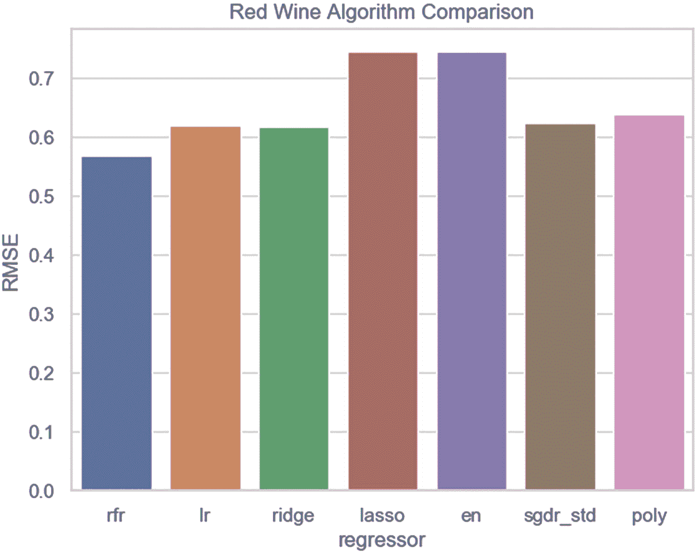
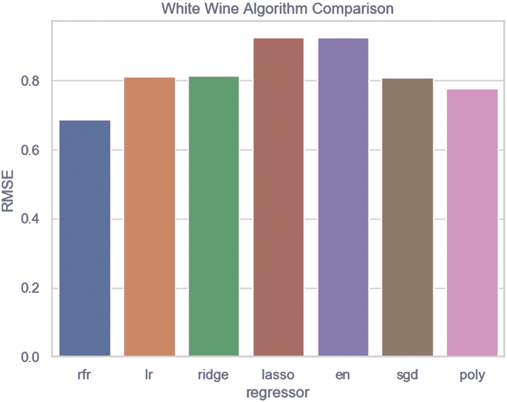

# 四、回归的预测建模

分类是预测一个实例的离散类别标签的问题，而回归预测建模(或只是*回归*)是学习自变量(或特征)和连续因变量(或结果)之间的关联强度的问题。一个*连续*输出变量是一个实值，比如一个整数或浮点值，通常被量化为数量和大小。

简单地说，回归试图了解特征和结果之间的关系有多强。从形式上讲，回归近似于从输入变量(X)到连续输出变量(y)的映射函数(f)。能够学习回归预测模型的算法称为回归算法。由于回归预测一个量，*性能必须在那些预测中作为误差*来测量。

回归的性能可以用许多方法来衡量，但最常见的是计算均方根误差(RMSE)。 *RMSE* 的一个好处是误差分数的单位与预测值相同。虽然回归预测可以使用 RMSE 进行评估，但分类预测却不能。

## 回归数据集

我们专注于四个数据集:小费、波士顿和葡萄酒(红和白)。小费数据由餐馆的服务员小费和相关因素组成，包括小费、餐费和时间。波士顿数据由波士顿不同地点的房价组成。葡萄酒数据由两个数据集(红色和白色)组成，这两个数据集由葡萄牙 Vinho Verde 葡萄酒的变体组成。

## 回归提示

清单 [4-1](#PC1) 中所示的第一个代码示例从 CSV 文件加载 tips 数据，通过将分类特征转换为虚拟特征来实现特征工程，向现有数据集中添加新数据，估算新数据，显示特征重要性，使用线性回归算法训练数据，并进行预测。在这种情况下，我们从多元线性回归中学习，因为我们正在对多个特征和一个连续相关目标进行数据训练。

```py
import numpy as np, pandas as pd
from sklearn.ensemble import RandomForestRegressor
from sklearn.impute import SimpleImputer
from sklearn.linear_model import LinearRegression
from sklearn.model_selection import train_test_split
from sklearn.metrics import mean_squared_error

if __name__ == "__main__":
    br = '\n'
    tips = pd.read_csv('data/tips.csv')
    print ('original data shape:', tips.shape, br)
    target = tips['tip']
    data = tips.drop(['tip'], axis=1)
    data = pd.get_dummies(data, columns=['sex', 'smoker','day', 'time'])
    d = {'sex_Male':'male', 'sex_Female':'female',
         'smoker_Yes':'smoker', 'smoker_No':'non-smoker',
         'day_Thur':'th', 'day_Fri':'fri', 'day_Sat':'sat',
         'day_Sun':'sun', 'time_Lunch':'lunch',
         'time_Dinner':'dinner'}
    data = data.rename(index=str, columns=d)
    X = data.values

    y = target.values
    print ('X and y shapes (post conversion):')
    print (X.shape, y.shape, br)
    X_vector = np.array([30.00, 'NaN', 1, 0, 1, 0, 0, 0, 0, 1, 1, 0])
    y_vector = np.array([4.5])
    X = np.vstack([X, X_vector])
    y = np.append(y, y_vector)
    print ('new X and y data point:')
    print (X[244], y[244], br)
    X_vectors = np.array([[24.99, 'NaN',0, 1, 0, 1, 1, 0, 0, 0, 0, 1],
                         [19.99, 'NaN',1, 0, 1, 0, 0, 0, 0, 1, 1, 0]])
    y_vectors = np.array([[3.5], [2.0]])
    X = np.vstack([X, X_vectors])
    y = np.append(y, y_vectors)
    print ('new X and y data points:')
    print (X[245], y[245])
    print (X[246], y[246], br)
    imputer = SimpleImputer()
    imputer.fit(X)
    X = imputer.transform(X)
    print ('new data shape:', X.shape, br)
    print ('new records post imputation (features and targets):')

    print (X[244], y[244])
    print (X[245], y[245])
    print (X[246], y[246], br)
    rfr = RandomForestRegressor(random_state=0, n_estimators=100)
    rfr.fit(X, y)
    print ('feature importance (first 6 features):')
    feature_importances = rfr.feature_importances_
    features = list(data.columns.values)
    importance = sorted(zip(feature_importances, features), reverse=True)
    [print (row) for i, row in enumerate(importance) if i < 6]
    print ()
    X_train, X_test, y_train, y_test = train_test_split(
        X, y, random_state=0)

    model = LinearRegression()
    model_name = model.__class__.__name__
    print ('<<' + model_name + '>>', br)
    model.fit(X_train, y_train)
    y_pred = model.predict(X_test)
    rmse = np.sqrt(mean_squared_error(y_test, y_pred))
    print (rmse, '(rmse)', br)
    print ('predict from new data:')
    p1 = [X[244]]
    p2 = [X[245], X[246]]
    y1, y2 = model.predict(p1), model.predict(p2)
    print (y[244], y1[0])
    print (y[245], y2[0])
    print (y[246], y2[1])
    X_file = 'data/X_tips'
    y_file = 'data/y_tips'
    np.save(X_file, X)
    np.save(y_file, y)

Listing 4-1Predicting from tips with get_dummies encoding

```

继续执行清单 [4-1](#PC1) 中的代码。请记住，您可以从本书的示例下载中找到示例。您不需要手动键入示例。更容易访问示例下载和复制/粘贴。

执行清单 [4-1](#PC1) 的输出应该如下所示:

```py
original data shape: (244, 7)

X and y shapes (post conversion):
(244, 12) (244,)

new X and y data point:
['30.0' 'NaN' '1' '0' '1' '0' '0' '0' '0' '1' '1' '0'] 4.5

new X and y data points:
['24.99' 'NaN' '0' '1' '0' '1' '1' '0' '0' '0' '0' '1'] 3.5
['19.99' 'NaN' '1' '0' '1' '0' '0' '0' '0' '1' '1' '0'] 2.0

new data shape: (247, 12)

new records post imputation (features and targets):
[30\.          2.56967213   1\.        0\.          1\.          0.
  0\.          0\.           0\.        1\.          1\.          0\.        ] 4.5
[24.99        2.56967213   0\.        1\.          0\.          1.
  1\.          0\.           0\.        0\.          0\.          1\.        ] 3.5
[19.99        2.56967213   1\.        0\.          1\.          0.
  0\.          0\.           0\.        1\.          1\.          0\.        ] 2.0

feature importance (first 6 features)

:
(0.7597845511444519, 'total_bill')
(0.0643775334380493, 'size')
(0.03663421916266647, 'non-smoker')
(0.033603977117169975, 'smoker')
(0.026410154999617023, 'sat')
(0.02186564474599064, 'sun')

<<LinearRegression>>

0.9474705746817206 (rmse)

predict from new data:
4.5 3.827512419066452
3.5 3.56649951075833
2.0 2.941595038244732

```

代码示例首先导入 RandomForestRegressor、SimpleImputer 和 mean_square_error 以及其他必需的包。主程序块从从 CSV 文件加载 tips 数据开始。它继续用 pandas get_dummies 函数对分类变量进行特征工程。提醒一下，*特征工程*正在使用数据集的领域知识来创建使机器学习算法更有效工作的特征。

熊猫得到 _dummies 一热默认编码。比如，性别要么是*女*要么是*男*。通过一键编码，*女*变成了【1，0】，而*男*【0，1】。在这种情况下必须进行特征工程，因为 Scikit-Learn 只处理数字数据。接下来，创建特征集 X 和目标 y。请注意，由于一次热编码，数据形状现在有 12 个特征。

代码的下一部分向数据集中添加了三条新记录。还要注意，我们添加了一个 *NaN* 特性，这意味着该特性没有可识别的值。Scikit-Learn 算法*不能*处理 *Nan* 特征，所以我们用简单估算器类估算特征平均值。*插补*是用替代值替换缺失数据的过程。我们接下来显示新记录。请注意，所有的 *Nan* 值都被替换为其特征平均值。

### 小费

插补是用替代数据替换缺失数据的常用技术。

代码的最后一部分首先在 *RandomForestRegressor* 的帮助下显示六个最重要的特性，RandomForestRegressor 是一个元估计器，适合对数据进行决策树分类，并使用平均来提高性能和减少过度拟合。接下来，数据被分成训练测试子集，并用线性回归进行训练，这样我们就可以计算 RMSE。*线性回归*模拟特征和目标之间的关系。最后，我们根据新数据进行预测，其中第一个 <sup>st</sup> 值是实际目标值，第二个是我们的预测值，并将 X 和 y 保存为 NumPy 文件以供将来处理。

### 小费

回归的目标是最小化(减少)RMSE。

清单 [4-2](#PC3) 中显示的下一个代码示例使用 DictVectorizer 而不是 get_dummies 作为一次性编码分类数据的替代选项。

```py
import pandas as pd, numpy as np
from sklearn.feature_extraction import DictVectorizer
from sklearn.linear_model import LinearRegression
from sklearn.model_selection import train_test_split
from sklearn.metrics import mean_squared_error
from random import randint

if __name__ == "__main__":
    br = '\n'
    tips = pd.read_csv('data/tips.csv')
    data = tips.drop(['tip'], axis=1)
    target = tips['tip']
    v = ['sex', 'smoker', 'day', 'time']
    ls = data[v].to_dict(orient='records')
    vector = DictVectorizer(sparse=False, dtype=int)
    d = vector.fit_transform(ls)
    print ('one hot encoding:')
    print (d[0:3], br)
    print ('encoding order:')
    encode_order = vector.get_feature_names()
    print (encode_order, br)
    data = data.drop(['sex', 'smoker', 'day', 'time'], axis=1)
    X = data.values
    print ('feature shape after removing categorical columns:')
    print (X.shape, br)
    Xls, dls = X.tolist(), d.tolist()
    X = [np.array(row + dls[i]) for i, row in enumerate(Xls)]
    X = np.array(X)
    y = target.values
    print ('feature shape after adding encoded data back:')
    print (X.shape, br)

    X_train, X_test, y_train, y_test = train_test_split(
        X, y, random_state=0)
    model = LinearRegression(fit_intercept=True)
    model_name = model.__class__.__name__
    print ('<<' + model_name  +  '>>', br)
    model.fit(X_train, y_train)
    y_pred = model.predict(X_test)
    rmse = np.sqrt(mean_squared_error(y_test, y_pred))
    print (rmse, '(rmse)', br)
    print ('predict 1st test set element (actual/prediction):')
    print (y_test[0], y_pred[0], br)
    rints = [randint(0, y.shape[0]-1) for row in range(3)]
    print ('random integers:', rints, br)
    p = [X[rints[0]], X[rints[1]], X[rints[2]]]
    y_p = model.predict(p)
    y_p = list(np.around(y_p, 2))
    print (y_p, '(predicted)')
    print ([y[rints[0]], y[rints[1]], y[rints[2]]], '(actual)')

Listing 4-2Predicting from tips with DictVectorizer encoding

```

执行清单 [4-2](#PC3) 的输出应该如下所示:

```py
One hot encoding:
[[0 0 1 0 1 0 1 0 1 0]
 [0 0 1 0 0 1 1 0 1 0]
 [0 0 1 0 0 1 1 0 1 0]]

encoding order:
['day=Fri', 'day=Sat', 'day=Sun', 'day=Thur', 'sex=Female', 'sex=Male', 'smoker=No','smoker=Yes', 'time=Dinner', 'time=Lunch']

feature shape after removing categorical columns:
(244, 2)

feature shape after adding encoded data back:
(244, 12)

<<LinearRegression>>

0.9636287548943022 (rmse)

predict 1st test set element (actual/prediction):
2.64 2.8121130438023094

random integers: [202, 13, 143]

[2.19, 3.21, 4.52] (predicted)
[2.0, 3.0, 5.0] (actual)

```

代码从导入 DictVectorizer 以及其他必备的包开始。主程序块加载 tips 数据，剥离特征 tip 并将剩余特征放入变量*数据*，并将特征 tip 放入变量*目标*。接下来，我们将需要编码的特征放入变量 *v* 中。

代码继续剥离需要编码的特性，并将结果放入变量 *ls* 中。然后创建一个 DictVectorizer 实例，并放入变量 *vector* 中。DictVectorizer 是一种 Scikit-Learn 技术，它将特征值映射列表转换为向量。

然后，*向量*中的数据被拟合(或训练)并转换为独热编码值，结果被放入变量 *d* 中。要查看编码顺序，请使用函数 get_feature_names。接下来，从变量*数据*中删除编码特征，这样我们就可以开始构建特征集 x 了。

代码继续创建一个基于 X 的列表和另一个基于 *d* 的列表，这样我们可以将 X 与包含在 *d* 中的独热码编码值连接起来。剩下的就是将 X 和 y 转换成 NumPy 值。代码结束时将 X 和 y 分成训练测试子集，用线性回归进行训练，计算 RMSE，并进行预测。RMSE 要高一点，因为我们没有像上一个例子那样添加新数据。

### 小费

在大多数情况下，使用 get_dummies 进行一键编码。

尽管 DictVectorizer 比 get_dummies 更难实现，但它具有稀疏的优势。也就是说，不存在的特征不需要被存储。此外，DictVectorizer 是一种有用的表示转换，用于在自然语言处理模型中训练序列分类器，该模型通常通过提取感兴趣的特定单词周围的特征窗口来工作。

清单 [4-3](#PC5) 中的最后一个代码示例将工程数据(来自 NumPy 文件)加载到 X 和 y 中，并为实现正则化的几个回归算法计算 RMSE。*正则化*是一种通过在给定数据集上适当拟合函数(或算法)来减少误差的技术，以减轻过度拟合。

```py
import numpy as np
from sklearn.linear_model import LinearRegression, Ridge,\
     Lasso, ElasticNet, SGDRegressor
from sklearn.model_selection import train_test_split
from sklearn.metrics import mean_squared_error
from sklearn.preprocessing import StandardScaler

def get_scores(model, Xtest, ytest):
    y_pred = model.predict(Xtest)
    return np.sqrt(mean_squared_error(ytest, y_pred)),\
           model.__class__.__name__

if __name__ == "__main__":
    br = '\n'
    X = np.load('data/X_tips.npy')
    y = np.load('data/y_tips.npy')
    X_train, X_test, y_train, y_test = train_test_split(
        X, y, random_state=0)
    print ('rmse:')
    lr = LinearRegression().fit(X_train, y_train)
    rmse, lr_name = get_scores(lr, X_test, y_test)
    print (rmse, '(' + lr_name + ')')
    rr = Ridge(random_state=0).fit(X_train, y_train)
    rmse, rr_name = get_scores(rr, X_test, y_test)
    print (rmse, '(' + rr_name + ')')

    lasso = Lasso(random_state=0).fit(X_train, y_train)
    rmse, lasso_name = get_scores(lasso, X_test, y_test)
    print (rmse, '(' + lasso_name + ')')
    en = ElasticNet(random_state=0).fit(X_train, y_train)
    rmse, en_name = get_scores(en, X_test, y_test)
    print (rmse, '(' + en_name + ')')
    sgdr = SGDRegressor(random_state=0, max_iter=1000, tol=0.001)
    sgdr.fit(X_train, y_train)
    rmse, sgdr_name = get_scores(sgdr, X_test, y_test)
    print (rmse, '(' + sgdr_name + ')', br)
    scaler = StandardScaler()
    X_train_std = scaler.fit_transform(X_train)
    X_test_std = scaler.fit_transform(X_test)
    print ('rmse std:')
    lr_std = LinearRegression().fit(X_train_std, y_train)
    rmse, lr_name = get_scores(lr_std, X_test_std, y_test)
    print (rmse, '(' + lr_name + ')')
    rr_std = Ridge(random_state=0).fit(X_train_std, y_train)
    rmse, rr_name = get_scores(rr_std, X_test_std, y_test)
    print (rmse, '(' + rr_name + ')')
    lasso_std = Lasso(random_state=0).fit(X_train_std, y_train)
    rmse, lasso_name = get_scores(lasso_std, X_test_std, y_test)

    print (rmse, '(' + lasso_name + ')')
    en_std = ElasticNet(random_state=0)
    en_std.fit(X_train_std, y_train)
    rmse, en_name = get_scores(en_std, X_test_std, y_test)
    print (rmse, '(' + en_name + ')')
    sgdr_std = SGDRegressor(random_state=0, max_iter=1000, tol=0.001)
    sgdr_std.fit(X_train_std, y_train)
    rmse, sgdr_name = get_scores(sgdr_std, X_test_std, y_test)
    print (rmse, '(' + sgdr_name + ')')

Listing 4-3Predicting from tips with regression regularization models

```

执行清单 [4-3](#PC5) 的输出应该如下所示:

```py
rmse

:
0.9474705746817206 (LinearRegression)
0.9469115898683899 (Ridge)
0.9439950256305224 (Lasso)
0.9307377813721578 (ElasticNet)
1.7005504977258326 (SGDRegressor)

rmse std:
0.9007751177881488 (LinearRegression)
0.9014055340745654 (Ridge)
1.333812899498391 (Lasso)
1.1310151423347359 (ElasticNet)
0.9021020134681715 (SGDRegressor)

```

代码示例从导入 Ridge、Lasso、ElasticNet、SGDRegressor 和其他必需的包开始。函数 get_scores 返回 RMSE。主程序块首先将 NumPy 文件中的数据加载到 X 和 y 中，然后将数据分割成训练测试子集。

代码的其余部分使用 LinearRegression 和几个实现正则化的回归模型来训练数据。Ridge、Lasso、ElasticNet 和 SGDRegressor 是流行的 Scikit-Learn 回归算法，用于调整线性回归。正则化通过在给定的训练集上适当地拟合模型来减少过度拟合，从而减少误差。也就是说，正则化不鼓励学习更复杂的模型来减轻过度拟合的风险。

### 小费

使用正则化来减少误差并最小化回归模型的过度拟合。

*岭*回归对系数的大小施加惩罚。*拉索*回归推导出具有较少参数值(或稀疏模型)的解决方案，有效减少了解决方案所依赖的变量数量。

Lasso 使用 L1 正则化，Ridge 使用 L2 正则化。

L1 和 L2 的主要区别在于刑期。Ridge 将系数的*平方值*作为惩罚添加到损失函数中，以减轻过拟合。Lasso(最小绝对收缩和选择算子)将系数的*绝对值*作为损失函数的惩罚，当我们有大量的特征时，它工作得很好。

损失(成本)函数是将一个或多个特征的事件(或值)映射到表示与该事件相关联的成本的实数上的函数。两种技术的主要区别在于，Lasso 将不太重要的特征的系数缩小到零，从而有效地将它们排除在考虑范围之外。Lasso 为密集和稀疏数据提供了相同的结果，对于稀疏数据，速度得到了提高。

回归包括 L1 和 L2 的惩罚作为正则项。结合 L1 和 L2 允许学习稀疏模型，其中很少有权重像 Lasso 一样非零，同时仍然保持岭的正则化属性。ElasticNet 最擅长的是多个相关的特性。利用 Lasso 和 Ridge 之间的权衡的一个实际优势是，它允许 ElasticNet 继承 Ridge 在旋转下的一些稳定性，同时仍然可以很好地处理稀疏模型。

*SGDRegressor* 通过最小化带有随机梯度下降(SGD)的正则化经验损失来执行。也就是说，对每个样本估计损失的梯度，然后用递减的强度时间表(或学习速率)来更新模型。正则项是添加到损失函数中的惩罚，它使用 L1(套索)或 L2(山脊)或两者的组合(弹性网)将参数向零收缩。

因此，正则化技术的选择高度依赖于数据的性质。稀疏数据表明从套索开始。创建过于复杂的模型将意味着转向 Ridge。ElasticNet 提供了一个折中方案。SGDRegressor 试图做到这一切。对于相对较小的数据集，尝试所有这些技术没有问题。但是，大型数据集是一个不同的故事，因为需要大量的处理时间(或高计算费用)。

请注意，有时扩展(或标准化)会提高性能，有时不会。例如，缩放对 LinearRegression、Ridge 和 SGDRegressor 有帮助，但对 Lasso 和 ElasticNet 不利。

### 小费

如果您有时间、耐心和计算资源，实验是提高性能的一个很好的方法。

## 回归波士顿

清单 [4-4](#PC7) 中显示的第一个代码示例显示了波士顿数据集中的要素重要性，使用 RandomForestRegressor 进行训练，并计算有噪声和无噪声情况下的 RMSE。

```py
import numpy as np, pandas as pd
from sklearn.datasets import load_boston
from sklearn.model_selection import train_test_split
from sklearn.ensemble import RandomForestRegressor
from sklearn.metrics import mean_squared_error

if __name__ == "__main__":
    br = '\n'
    boston = load_boston()
    X = boston.data
    y = boston.target
    print ('feature shape', X.shape)
    print ('target shape', y.shape, br)
    keys = boston.keys()
    rfr = RandomForestRegressor(random_state=0, n_estimators=100)
    rfr.fit(X, y)
    features = boston.feature_names
    feature_importances = rfr.feature_importances_
    importance = sorted(zip(feature_importances, features), reverse=True)
    [print (row) for row in importance]
    print ()
    X_train, X_test, y_train, y_test = train_test_split(
        X, y, random_state=0)

    rfr = RandomForestRegressor(random_state=0, n_estimators=100)
    rfr.fit(X_train, y_train)
    rfr_name = rfr.__class__.__name__
    y_pred = rfr.predict(X_test)
    rmse = np.sqrt(mean_squared_error(y_test, y_pred))
    print (rfr_name + ' (rmse):', rmse, br)
    cols = list(features) + ['target']
    data = pd.DataFrame(data=np.c_[X, y], columns=cols)
    print ('boston dataset sample:')
    print (data[['RM', 'LSTAT', 'DIS', 'CRIM', 'NOX', 'PTRATIO', 'target']].head(3), br)
    print ('data set before removing noise:', data.shape)
    noise = data.loc[data['target'] >= 50]
    data = data.drop(noise.index)
    print ('data set without noise:', data.shape, br)
    X = data.loc[:, data.columns != 'target'].values
    y = data['target'].values
    print ('cleansed feature shape:', X.shape)
    print ('cleansed target shape:', y.shape, br)
    X_train, X_test, y_train, y_test = train_test_split(
        X, y, random_state=0)
    rfr = RandomForestRegressor(random_state=0, n_estimators=100)
    rfr.fit(X_train, y_train)

    y_pred = rfr.predict(X_test)
    rmse = np.sqrt(mean_squared_error(y_test, y_pred))
    print (rfr_name + ' (rmse):', rmse)
    X_file = 'data/X_boston'
    y_file = 'data/y_boston'
    np.save(X_file, X)
    np.save(y_file, y)

Listing 4-4Exploring boston data with RandomForestRegressor

```

执行清单 [4-4](#PC7) 的输出应该如下所示:

```py
feature shape (506, 13)
target shape (506,)

(0.45730362625767496, 'RM')
(0.35008661885681375, 'LSTAT')
(0.06518862820215894, 'DIS')
(0.040989617257001, 'CRIM')
(0.02024797563034355, 'NOX')
(0.015576365835498516, 'PTRATIO')
(0.015524054184831321, 'TAX')
(0.011764308556043926, 'AGE')
(0.011324966974602932, 'B')
(0.005912139937999768, 'INDUS')
(0.003916064249793193, 'RAD')
(0.0011173446269339175, 'ZN')
(0.0010482894303040916, 'CHAS')

RandomForestRegressor (rmse): 4.091149842219918

boston dataset sample:
      RM  LSTAT     DIS     CRIM    NOX  PTRATIO  target
0  6.575   4.98  4.0900  0.00632  0.538     15.3    24.0
1  6.421   9.14  4.9671  0.02731  0.469     17.8    21.6
2  7.185   4.03  4.9671  0.02729  0.469     17.8    34.7

data set before removing noise: (506, 14)
data set without noise: (490, 14)

cleansed feature shape: (490, 13)
cleansed target shape: (490,)

RandomForestRegressor (rmse): 3.37169151536684

```

该代码示例从导入必备包开始。主块将 sklearn.datasets 中的波士顿数据加载到 X 和 y 中，并显示形状。接下来，RandomForestRegressor 对完整数据集(X 和 y)进行训练，以创建和显示特征重要性。代码继续将数据分成训练测试子集，并用 RandomForestRegressor 进行训练(X_train，y_train)。计算并显示 RMSE。

随机森林是一种集成技术，能够通过使用多个决策树和 bagging 来执行回归和分类。Bagging 包括用替换的不同数据样本训练每个决策树。这个想法是结合多个决策树来确定结果，而不是依赖单个决策树。

代码继续将 X 和 y 读入熊猫数据帧，并显示前三条记录。然后从数据帧中去除噪声，并保存到 X 和 y 中。清理后的数据被分成训练测试子集，并使用 RandomForestRegressor 进行训练。请注意，清理后的数据的 RMSE 要低得多(误差更小)。代码最后将 X 和 y 保存为 NumPy 文件。

16 个数据点的 *MEDV* 值为 50.0，这可能包含缺失值或删减值，可视为噪声。所以，我们不再考虑它们。有关波士顿数据集中噪声的更多信息，请参考以下链接: [`https://www.ritchieng.com/machine-learning-project-boston-home-prices/`](https://www.ritchieng.com/machine-learning-project-boston-home-prices/) 。

清单 [4-5](#PC9) 中显示的本节中的最后一个代码示例加载经过清理(去除噪声)的波士顿数据，并使用线性回归、正则化模型和 RandomForestRegressor 计算 RMSE。

```py
import numpy as np
from sklearn.datasets import load_boston
from sklearn.model_selection import train_test_split
from sklearn.linear_model import LinearRegression, Ridge,\
     Lasso, ElasticNet, SGDRegressor
from sklearn.ensemble import RandomForestRegressor
from sklearn.metrics import mean_squared_error
from sklearn.preprocessing import StandardScaler

def get_scores(model, Xtest, ytest):
    y_pred = model.predict(Xtest)
    return np.sqrt(mean_squared_error(ytest, y_pred)),\
           model.__class__.__name__

if __name__ == "__main__":
    br = '\n'
    X = np.load('data/X_boston.npy')

    y = np.load('data/y_boston.npy')
    print ('feature shape', X.shape)
    print ('target shape', y.shape, br)
    X_train, X_test, y_train, y_test = train_test_split( X, y, random_state=0)
    print ('rmse:')
    rfr = RandomForestRegressor(random_state=0, n_estimators=100)
    rfr.fit(X_train, y_train)
    rmse, rfr_name = get_scores(rfr, X_test, y_test)
    print (rmse, '(' + rfr_name + ')')
    lr = LinearRegression().fit(X_train, y_train)
    rmse, lr_name = get_scores(lr, X_test, y_test)
    print (rmse, '(' + lr_name + ')')
    ridge = Ridge(random_state=0).fit(X_train, y_train)
    rmse, ridge_name = get_scores(ridge, X_test, y_test)
    print (rmse, '(' + ridge_name + ')')
    lasso = Lasso(random_state=0).fit(X_train, y_train)
    rmse, lasso_name = get_scores(lasso, X_test, y_test)
    print (rmse, '(' + lasso_name + ')')
    en = ElasticNet(random_state=0).fit(X_train, y_train)
    rmse, en_name = get_scores(en, X_test, y_test)
    print (rmse, '(' + en_name + ')')
    scaler = StandardScaler()
    X_train_std = scaler.fit_transform(X_train)
    X_test_std = scaler.fit_transform(X_test)
    sgdr_std = SGDRegressor(random_state=0, max_iter=1000, tol=0.001)
    sgdr_std.fit(X_train_std, y_train)
    rmse, sgdr_name = get_scores(sgdr_std, X_test_std, y_test)
    print (rmse, '(' + sgdr_name + ' - scaled)')

Listing 4-5Exploring boston data with regression algorithms

```

执行清单 [4-5](#PC9) 的输出应该如下所示:

```py
feature shape (490, 13)
target shape (490,)

rmse:
3.37169151536684 (RandomForestRegressor)
4.236710574387242 (LinearRegression)
4.2526986026173486 (Ridge)
5.097231463859832 (Lasso)
4.88844846745213 (ElasticNet)
4.410035683951274 (SGDRegressor - scaled)

```

代码从导入必需的包开始。函数 get_scores 返回 RMSE 和算法名。主程序块从加载 NumPy 文件中的数据开始，并将其分成训练测试子集。然后用 RandomForestRegressor、LinearRegression、Ridge、Lasso、ElasticNet 和 SGDRegressor 训练数据。请注意，RandomForestRegressor 优于所有正则化算法，因为它的 RMSE 最低。

## 回归葡萄酒数据

清单 [4-6](#PC11) 中显示的第一个代码示例从 CSV 文件加载红酒数据，显示特性重要性，并将数据保存到 NumPy 文件。

```py
import numpy as np, pandas as pd
from sklearn.ensemble import RandomForestRegressor

if __name__ == "__main__":
    br = '\n'
    f = 'data/redwine.csv'
    red_wine = pd.read_csv(f)
    X = red_wine.drop(['quality'], axis=1)
    y = red_wine['quality']
    print (X.shape)
    print (y.shape, br)
    features = list(X)
    rfr = RandomForestRegressor(random_state=0, n_estimators=100)
    rfr.fit(X, y)

    feature_importances = rfr.feature_importances_
    importance = sorted(zip(feature_importances, features), reverse=True)
    for row in importance:
        print (row)
    print ()
    print (red_wine[['alcohol', 'sulphates', 'volatile acidity',
                     'total sulfur dioxide', 'quality']]. head())
    X_file = 'data/X_red'
    y_file = 'data/y_red'
    np.save(X_file, X)
    np.save(y_file, y)

Listing 4-6Exploring and saving red wine data

```

执行清单 [4-6](#PC11) 的输出应该如下所示:

```py
(1599, 11)
(1599,)

(0.27432500255956216, 'alcohol')
(0.13700073893077233, 'sulphates')
(0.13053941311188708, 'volatile acidity')
(0.08068199773601588, 'total sulfur dioxide')
(0.06294612644261727, 'chlorides')
(0.057730976351602854, 'pH')
(0.055499749756166, 'residual sugar')
(0.05198192402458334, 'density')
(0.05114079873500658, 'fixed acidity')
(0.049730883807319035, 'free sulfur dioxide')
(0.04842238854446754, 'citric acid')

   alcohol  sulphates  volatile acidity  total sulfur dioxide  quality
0      9.4       0.56              0.70                  34.0      5.0
1      9.8       0.68              0.88                  67.0      5.0
2      9.8       0.65              0.76                  54.0      5.0
3      9.8       0.58              0.28                  60.0      6.0
4      9.4       0.56              0.70                  34.0      5.0

```

代码从导入必需的包开始。主块从 CSV 文件中加载红酒数据。接下来，通过从 Pandas 数据帧中剥离目标列质量来创建特征集 X，然后从质量列中创建目标 y。然后显示 x 和 y 形状。代码最后在 RandomForestRegressor 的帮助下显示特性的重要性，并将数据保存到 NumPy 文件中。

清单 [4-7](#PC13) 中显示的下一个代码示例使用各种回归算法对红酒数据进行实验。

```py
import numpy as np, pandas as pd
from sklearn.ensemble import RandomForestRegressor
from sklearn.model_selection import train_test_split
from sklearn.linear_model import LinearRegression,\
     Ridge, Lasso, ElasticNet, SGDRegressor
from sklearn.metrics import mean_squared_error
from sklearn.preprocessing import StandardScaler
from sklearn.preprocessing import PolynomialFeatures
from sklearn.pipeline import Pipeline
import matplotlib.pyplot as plt, seaborn as sns

def get_scores(model, Xtest, ytest):
    y_pred = model.predict(Xtest)
    return np.sqrt(mean_squared_error(ytest, y_pred)),\
           model.__class__.__name__

if __name__ == "__main__":
    br = '\n'
    d = dict()

    X = np.load('data/X_red.npy')
    y = np.load('data/y_red.npy')
    X_train, X_test, y_train, y_test =  train_test_split(
        X, y, test_size=0.2, random_state=0)
    print ('rmse (unscaled):')
    rfr = RandomForestRegressor(random_state=0, n_estimators=100)
    rfr.fit(X_train, y_train)
    rmse, rfr_name = get_scores(rfr, X_test, y_test)
    d['rfr'] = [rmse]
    print (rmse, '(' + rfr_name + ')')
    lr = LinearRegression().fit(X_train, y_train)
    rmse, lr_name = get_scores(lr, X_test, y_test)
    d['lr'] = [rmse]
    print (rmse, '(' + lr_name + ')')
    ridge = Ridge(random_state=0).fit(X_train, y_train)
    rmse, ridge_name = get_scores(ridge, X_test, y_test)
    d['ridge'] = [rmse]
    print (rmse, '(' + ridge_name + ')')
    lasso = Lasso(random_state=0).fit(X_train, y_train)
    rmse, lasso_name = get_scores(lasso, X_test, y_test)
    d['lasso'] = [rmse]
    print (rmse, '(' + lasso_name + ')')
    en = ElasticNet(random_state=0).fit(X_train, y_train)
    rmse, en_name = get_scores(en, X_test, y_test)
    d['en'] = [rmse]
    print (rmse, '(' + en_name + ')')

    sgdr = SGDRegressor(random_state=0, max_iter=1000, tol=0.001)
    sgdr.fit(X_train, y_train)
    rmse, sgdr_name = get_scores(sgdr, X_test, y_test)
    print (rmse, '(' + sgdr_name + ')', br)
    scaler = StandardScaler()
    X_train_std = scaler.fit_transform(X_train)
    X_test_std = scaler.fit_transform(X_test)
    print ('rmse scaled:')
    lr_std = LinearRegression().fit(X_train_std, y_train)
    rmse, lr_std_name = get_scores(lr_std, X_test_std, y_test)
    print (rmse, '(' + lr_std_name + ')')
    rr_std = Ridge(random_state=0).fit(X_train_std, y_train)
    rmse, rr_std_name = get_scores(rr_std, X_test_std, y_test)
    print (rmse, '(' + rr_std_name + ')')
    lasso_std = Lasso(random_state=0).fit(X_train_std, y_train)

    rmse, lasso_std_name = get_scores(lasso_std, X_test_std, y_test)
    print (rmse, '(' + lasso_std_name + ')')
    en_std = ElasticNet(random_state=0).fit(X_train_std, y_train)
    rmse, en_std_name = get_scores(en_std, X_test_std, y_test)
    print (rmse, '(' + en_std_name + ')')
    sgdr_std = SGDRegressor(random_state=0, max_iter=1000, tol=0.001)
    sgdr_std.fit(X_train_std, y_train)
    rmse, sgdr_std_name = get_scores(sgdr_std, X_test_std, y_test)
    d['sgdr_std'] = [rmse]
    print (rmse, '(' + sgdr_std_name + ')', br)
    pipe = Pipeline([('poly', PolynomialFeatures(degree=2)),
                     ('linear', LinearRegression())])
    model = pipe.fit(X_train, y_train)
    rmse, poly_name = get_scores(model, X_test, y_test)
    d['poly'] = [rmse]
    print (PolynomialFeatures().__class__.__name__, '(rmse):')
    print (rmse, '(' + poly_name + ')')
    algo, rmse = [], []
    for key, value in d.items():
        algo.append(key)
        rmse.append(value[0])
    plt.figure('RMSE')
    sns.set(style="whitegrid")
    ax = sns.barplot(algo, rmse)
    plt.title('Red Wine Algorithm Comparison')
    plt.xlabel('regressor')
    plt.ylabel('RMSE')
    plt.show()

Listing 4-7Exploring red wine data with regression algorithms

```

执行清单 [4-7](#PC13) 的输出应该如下所示:

```py
rmse (unscaled):
0.5694654840286635 (RandomForestRegressor)
0.6200574149384266 (LinearRegression)
0.6185762657415644 (Ridge)
0.7455442007369433 (Lasso)
0.7450232657227877 (ElasticNet)
51120537008.37402 (SGDRegressor)

rmse scaled:
0.6216027053463463 (LinearRegression)
0.6215826846730879 (Ridge)
0.7584549718351333 (Lasso)
0.7584549718351333 (ElasticNet)
0.6234205584462227 (SGDRegressor)

PolynomialFeatures (rmse):
0.6382400985644077 (Pipeline)

```

列表 [4-7](#PC13) 也显示图 [4-1](#Fig1) 。图 [4-1](#Fig1) 显示了本实验中使用的算法的 RMSE 分数。



图 4-1

红酒 RMSE 评分对比

代码从导入多项式特性、管道、seaborn 和其他必需的包开始。函数 get_scores 返回 RMSE 和型号名称。主程序块首先创建一个字典来存储来自训练实验的最佳 RMSE 分数。算法训练数据有无缩放，最好的分数保存在字典 *d* 中。接下来，数据被分成训练测试子集。

代码继续使用 LinearRegression、Ridge、Lasso、ElasticNet、SGDRegressor 和 RandomForestRegressor 训练*未缩放的*数据。在该数据集上性能最好的算法是 RandomForestRegressor，其 RMSE 约为 0.569。然后代码用线性回归、岭、套索、弹性网和 SGDRegressor 训练*缩放的*数据。在该数据集上，性能最好的算法是 RMSE 约为 0.622 的 Ridge 算法，这并不比其未缩放的 RMSE 更好。尽管 RMSE·斯格雷索不是表现最好的，但请注意缩放对算法的影响有多大！最后，用多项式特征训练未缩放的数据。

*多项式特性*提供了一个通过转换输入而不是改进模型来提高性能的机会。多项式回归允许不同程度的输入的线性组合。在本例中，我们对输入进行平方(度数=2)以探究对性能的影响。为了训练数据，我们将多项式特征转化为线性回归。

我们可以用 degree 做实验，看看性能会发生什么变化。我们可以立方体输入(度数=3)，四倍输入(度数=4)，等等。多项式模型对于非线性机器学习实验非常有用，但要小心高阶多项式模型，因为它们通常表现不佳。也就是说，它们会产生不必要的剧烈波动。正则化可以减轻多项式的不当行为。

多项式特征的训练是通过将转换后的输入(平方数据)转化为线性回归来完成的。该代码通过基于存储在字典 *d* 中的最佳 RMSE 分数创建可视化来结束。

清单 [4-8](#PC15) 中显示的下一个代码示例用多项式拟合进行实验。在前面的示例中，我们对输入数据求平方，训练模型，并计算 RMSE。在这个模型中，我们采用输入数据的二次(平方)、三次和四次幂，训练每个模型，并计算和显示 RMSE 进行比较。与之前代码的另一个变化是，我们用多项式特征算法来转换训练和测试数据，而不是将多项式特征转化为线性回归。然后，我们用转换后的数据训练线性回归。一旦数据被训练，我们显示每个实验的 RMSE。

```py
import numpy as np, pandas as pd
from sklearn.model_selection import train_test_split
from sklearn.linear_model import LinearRegression
from sklearn.metrics import mean_squared_error
from sklearn.preprocessing import PolynomialFeatures

def get_scores(model, Xtest, ytest):
    y_pred = model.predict(Xtest)
    return np.sqrt(mean_squared_error(ytest, y_pred)),\
           model.__class__.__name__

if __name__ == "__main__":
    br = '\n'
    d = dict()
    X = np.load('data/X_red.npy')
    y = np.load('data/y_red.npy')
    X_train, X_test, y_train, y_test =  train_test_split(
        X, y, test_size=0.2, random_state=0)
    poly = PolynomialFeatures(degree=2)
    poly.fit(X_train, y_train)
    X_train_poly = poly.transform(X_train)
    lr = LinearRegression().fit(X_train_poly, y_train)
    X_test_poly = poly.transform(X_test)
    rmse, lr_name = get_scores(lr, X_test_poly, y_test)
    print (rmse, '(squared polynomial fitting)')
    poly = PolynomialFeatures(degree=3)
    poly.fit(X_train, y_train)
    X_train_poly = poly.transform(X_train)
    lr = LinearRegression().fit(X_train_poly, y_train)
    X_test_poly = poly.transform(X_test)
    rmse, lr_name = get_scores(lr, X_test_poly, y_test)
    print (rmse, '(cubic polynomial fitting)')
    poly = PolynomialFeatures(degree=4)
    poly.fit(X_train, y_train)
    X_train_poly = poly.transform(X_train)

    lr = LinearRegression().fit(X_train_poly, y_train)
    X_test_poly = poly.transform(X_test)
    rmse, lr_name = get_scores(lr, X_test_poly, y_test)
    print (rmse, '(quartic polynomial fitting)')

Listing 4-8Polynomial fitting with red wine data

```

执行清单 [4-8](#PC15) 的输出应该如下所示:

```py
0.6382400985644077 (squared polynomial fitting)
0.8284645679714848 (cubic polynomial fitting)
97.85391125320886 (quartic polynomial fitting)

```

代码导入必需的包。函数 get_scores 返回 RMSE 和型号名称。主程序块将数据加载到 X 和 y 中。它继续将数据分割成训练测试子集。接下来，用输入数据的平方(次数=2)用多项式特征拟合训练和测试数据。然后转换训练数据。线性回归对转换后的数据进行训练，并显示 RMSE。度=3 和度=4 时遵循相同的过程。对于此数据集，平方输入可提供最佳 RMSE。

### 小费

多项式特征对于非线性数据集建模是一种非常有用的技术，并且易于实现。

清单 [4-9](#PC17) 中显示的下一个代码示例从 CSV 文件中加载白酒数据，显示特性重要性，并将数据保存到 NumPy 文件中。

```py
import numpy as np, pandas as pd
from sklearn.ensemble import RandomForestRegressor

if __name__ == "__main__":
    br = '\n'
    f = 'data/whitewine.csv'
    white_wine = pd.read_csv(f)
    X = white_wine.drop(['quality'], axis=1)
    y = white_wine['quality']
    print (X.shape)
    print (y.shape, br)
    features = list(X)
    rfr = RandomForestRegressor(random_state=0, n_estimators=100)
    rfr.fit(X, y)
    feature_importances = rfr.feature_importances_
    importance = sorted(zip(feature_importances, features), reverse=True)
    for row in importance:
        print (row)
    print ()
    print (white_wine[['alcohol', 'sulphates', 'volatile acidity', 'total sulfur dioxide', 'quality']]. head())
    X_file = 'data/X_white'
    y_file = 'data/y_white'
    np.save(X_file, X)
    np.save(y_file, y)

Listing 4-9Exploring and saving white wine data

```

执行清单 [4-9](#PC17) 的输出应该如下所示:

```py
(4898, 11)
(4898,)

(0.24186185906056268, 'alcohol')
(0.1251626059551235, 'volatile acidity')
(0.11524332271725685, 'free sulfur dioxide')
(0.07170261049200727, 'pH')
(0.06940456299270928, 'total sulfur dioxide')
(0.06899334812486085, 'residual sugar')
(0.06259740092261244, 'chlorides')
(0.06227404207074219, 'sulphates')
(0.061557623671947746, 'density')
(0.060982526101159625, 'citric acid')
(0.060220097891017656, 'fixed acidity')

   alcohol  sulphates  volatile acidity  total sulfur dioxide  quality
0      8.8       0.45              0.27                 170.0      6.0
1      9.5       0.49              0.30                 132.0      6.0
2     10.1       0.44              0.28                  97.0      6.0
3      9.9       0.40              0.23                 186.0      6.0
4      9.9       0.40              0.23                 186.0      6.0

```

代码从导入必需的包开始。主程序块从 CSV 文件中加载白酒数据。接下来，通过从 Pandas 数据帧中剥离目标列质量来创建特征集 X，并且从质量列中创建目标 y。然后显示 x 和 y 形状。请注意，白葡萄酒数据集由 4898 个数据元素组成，而红葡萄酒数据集只有 1599 个。代码最后在 RandomForestRegressor 的帮助下显示特性的重要性，并将数据保存到 NumPy 文件中。

清单 [4-10](#PC19) 中显示的最终代码示例使用各种回归算法对白酒数据进行了实验。

```py
import numpy as np, pandas as pd
from sklearn.ensemble import RandomForestRegressor
from sklearn.model_selection import train_test_split
from sklearn.linear_model import LinearRegression,\
     Ridge, Lasso, ElasticNet, SGDRegressor
from sklearn.metrics import mean_squared_error
from sklearn.preprocessing import StandardScaler
from sklearn.preprocessing import PolynomialFeatures
from sklearn.pipeline import Pipeline
import matplotlib.pyplot as plt, seaborn as sns

def get_scores(model, Xtest, ytest):
    y_pred = model.predict(Xtest)
    return np.sqrt(mean_squared_error(ytest, y_pred)),\
           model.__class__.__name__

if __name__ == "__main__":
    br = '\n'
    d = dict()
    X = np.load('data/X_white.npy')
    y = np.load('data/y_white.npy')
    X_train, X_test, y_train, y_test =  train_test_split(
        X, y, test_size=0.2, random_state=0)
    print ('rmse (unscaled):')

    rfr = RandomForestRegressor(random_state=0, n_estimators=100)
    rfr.fit(X_train, y_train)
    rmse, rfr_name = get_scores(rfr, X_test, y_test)
    d['rfr'] = [rmse]
    print (rmse, '(' + rfr_name + ')')
    lr = LinearRegression().fit(X_train, y_train)
    rmse, lr_name = get_scores(lr, X_test, y_test)
    d['lr'] = [rmse]
    print (rmse, '(' + lr_name + ')')
    ridge = Ridge(random_state=0).fit(X_train, y_train)
    rmse, ridge_name = get_scores(ridge, X_test, y_test)
    d['ridge'] = [rmse]
    print (rmse, '(' + ridge_name + ')')
    lasso = Lasso(random_state=0).fit(X_train, y_train)
    rmse, lasso_name = get_scores(lasso, X_test, y_test)
    d['lasso'] = [rmse]
    print (rmse, '(' + lasso_name + ')')
    en = ElasticNet(random_state=0).fit(X_train, y_train)
    rmse, en_name = get_scores(en, X_test, y_test)
    d['en'] = [rmse]
    print (rmse, '(' + en_name + ')', br)
    scaler = StandardScaler()

    X_train_std = scaler.fit_transform(X_train)
    X_test_std = scaler.fit_transform(X_test)
    print ('rmse scaled:')
    sgd = SGDRegressor(max_iter=1000, tol=0.001, random_state=0)
    sgd.fit(X_train_std, y_train)
    rmse, sgd_name = get_scores(sgd, X_test_std, y_test)
    d['sgd'] = [rmse]
    print (rmse, '(' + sgd_name + ')', br)
    pipe = Pipeline([('poly', PolynomialFeatures(degree=2)),
                     ('linear', LinearRegression())])
    model = pipe.fit(X_train, y_train)
    rmse, pf_name = get_scores(model, X_test, y_test)
    d['poly'] = [rmse]
    print (PolynomialFeatures().__class__.__name__,'(rmse):')
    print (rmse, '(' + pf_name + ')')
    poly = PolynomialFeatures(degree=2)
    poly.fit(X_train, y_train)
    X_train_poly = poly.transform(X_train)
    lr = LinearRegression().fit(X_train_poly, y_train)
    X_test_poly = poly.transform(X_test)
    rmse, lr_name = get_scores(lr, X_test_poly, y_test)
    print (rmse, '(without Pipeline)')
    algo, rmse = [], []
    for key, value in d.items():
        algo.append(key)
        rmse.append(value[0])
    plt.figure('RMSE')
    sns.set(style="whitegrid")
    ax = sns.barplot(algo, rmse)
    plt.title('White Wine Algorithm Comparison')
    plt.xlabel('regressor')
    plt.ylabel('RMSE')
    plt.show()

Listing 4-10Exploring white wine data with regression algorithms

```

执行清单 [4-10](#PC19) 的输出应该如下所示:

```py
rmse (unscaled):
0.687111151629689 (RandomForestRegressor)
0.8123086554972433 (LinearRegression)
0.8141615403447382 (Ridge)
0.9255803421282806 (Lasso)
0.9242810596011943 (ElasticNet)

rmse scaled:
0.8092835779827245 (SGDRegressor)

PolynomialFeatures (rmse):
0.7767527802246017 (Pipeline)
0.7767527802246017 (without Pipeline)

```

列表 [4-10](#PC19) 也显示图 [4-2](#Fig2) 。图 [4-2](#Fig2) 显示了本实验中使用的算法的 RMSE 分数。



图 4-2

白葡萄酒 RMSE 评分对比

代码从导入必需的包开始。函数 get_scores 返回 RMSE 和型号名称。主程序块首先创建一个字典来存储来自训练实验的最佳 RMSE 分数。它继续将白葡萄酒数据从 NumPy 文件加载到 X 和 y 中。然后，数据被分成训练测试子集。接下来，算法在缩放和不缩放的情况下训练数据，最佳分数保存在字典 *d* 中。

代码继续使用 LinearRegression、Ridge、Lasso、ElasticNet、SGDRegressor 和 RandomForestRegressor 训练*未缩放的*数据。在该数据集上性能最好的算法是 RandomForestRegressor，其 RMSE 约为 0.687。然后代码用 SGDRegressor 训练*缩放后的*数据。我已经确定(通过此处未显示的实验)山脊、套索和弹性网的 RMSE 不会随着缩放而改进，所以我没有包含代码。最后，用有和没有流水线的多项式特征来训练未缩放的数据。因为两个 RMSE 分数是相同的，所以使用哪种技术并不重要。