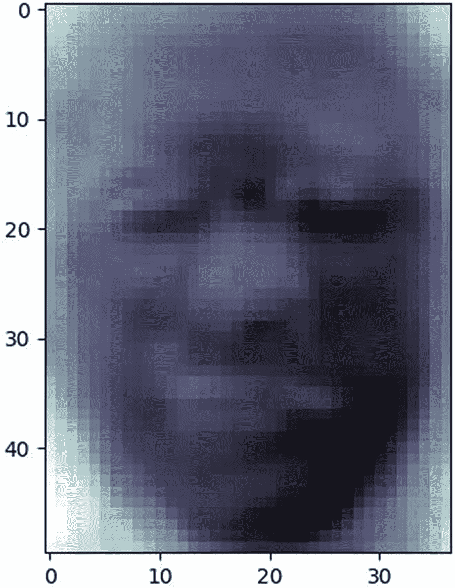

# 六、复杂训练集的分类器调优

既然我们已经练习了对低维(或简单)数据的调优，我们就可以开始实验对高维(或复杂)数据集的调优了。*低维*数据由有限数量的特征组成，而*高维*数据由非常多的特征组成。

在机器学习文献中，最常用来描述数据集维度的术语是特征空间。*特征空间*指用于表征数据集的特征集合。也就是说，特征空间指的是变量所在的 n 维空间(不包括目标变量，如果它存在的话)。

与优化低维数据一致，我们在优化高维数据时遵循一个结构化的过程:

1.  总是从使用基线算法的默认超参数开始。

2.  尝试训练和测试规模。

3.  处理高维数据时使用降维。

4.  处理大型数据集时，随机抽取样本。

5.  缩放数据(在适当的情况下)以潜在地提高性能。

6.  使用 GridSearchCV 或 RandomizedSearchCV 进行调整。

7.  一旦使用基线算法进行了调整，就可以使用复杂的算法进行实验。

## 调整数据集

我们专注于三个数据集:fetch_1fw_people、MNIST 和 fetch_20newsgroups。fetch_1fw_people 数据集包含 1288 张人脸图像和 7 个目标。每个人脸图像由一个 50 × 37 的像素矩阵表示。MNIST 数据集包含 70000 个从 0 到 9 的手写数字图像。每个数字由一个 28 × 28 的矩阵表示。fetch_20newsgroups 数据集包含大约 18000 篇关于 20 个主题的帖子。数据被分成训练集和测试集。这种拆分基于特定日期前后发布的消息。

## 调整 fetch_1fw_people

人脸识别是机器学习中一个*非常*复杂的话题。但是，Scikit-Learn 提供了 fetch_1fw_people，这是一个很好的数据集，可以在其上进行实验和学习。通过经验和实验，我确定了两种 Scikit-Learn 算法——SGD classifier 和 svm。SVC——它对数据集的处理相对较好。

清单 6-1 中显示的第一个代码示例使用 SGDClassifier 调优数据。

```py
import numpy as np, humanfriendly as hf, warnings
import time
from sklearn.decomposition import PCA
from sklearn.model_selection import train_test_split,\
     GridSearchCV, cross_val_score
from sklearn.linear_model import SGDClassifier
from sklearn.metrics import classification_report

def see_time(note):
    end = time.perf_counter()
    elapsed = end - start
    print (note, hf.format_timespan(elapsed, detailed=True))

def get_cross(model, data, target, groups=10):
    return cross_val_score(model, data, target, cv=groups)

if __name__ == "__main__":
    br = '\n'
    warnings.filterwarnings("ignore", category=DeprecationWarning)
    X = np.load('data/X_faces.npy')
    y = np.load('data/y_faces.npy')
    X_train, X_test, y_train, y_test = train_test_split(
        X, y, random_state=0)
    pca = PCA(n_components=0.95, whiten=True, random_state=1)
    pca.fit(X_train)
    X_train_pca = pca.transform(X_train)
    X_test_pca = pca.transform(X_test)
    pca_name = pca.__class__.__name__
    print ('<<' + pca_name + '>>')
    print ('features (before PCA):', X.shape[1])
    print ('features (after PCA):', pca.n_components_, br)
    sgd = SGDClassifier(max_iter=1000, tol=.001, random_state=0)
    sgd.fit(X_train_pca, y_train)
    y_pred = sgd.predict(X_test_pca)
    cr = classification_report(y_test, y_pred)
    print (cr)
    sgd_name = sgd.__class__.__name__

    param_grid = {'alpha': [1e-3, 1e-2, 1e-1, 1e0], 'max_iter': [1000], 'loss': ['log', 'perceptron'], 'penalty': ['l1'], 'tol': [.001]}
    grid = GridSearchCV(sgd, param_grid, cv=5)
    start = time.perf_counter()
    grid.fit(X_train_pca, y_train)
    see_time('training time:')
    print ()
    bp = grid.best_params_
    print ('best parameters:')
    print (bp, br)
    sgd = SGDClassifier(**bp, random_state=1)
    sgd.fit(X_train_pca, y_train)
    y_pred = sgd.predict(X_test_pca)
    cr = classification_report(y_test, y_pred)
    print (cr)
    print ('cross-validation:')
    scores = get_cross(sgd, X_train_pca, y_train)
    print (np.mean(scores))

Listing 6-1Tuning fetch_1fw_people with SGDClassifier

```

继续执行清单 6-1 中的代码。请记住，您可以从本书的示例下载中找到示例。您不需要手动键入示例。更容易访问示例下载和复制/粘贴。

执行清单 6-1 的输出应该如下所示:

```py
<<PCA>>
features (before PCA): 1850
features (after PCA): 135

              precision    recall  f1-score   support

           0       0.89      0.57      0.70        28
           1       0.80      0.78      0.79        63
           2       0.83      0.62      0.71        24
           3       0.73      0.89      0.80       132
           4       0.55      0.55      0.55        20
           5       0.88      0.32      0.47        22
           6       0.67      0.73      0.70        33

   micro avg       0.74      0.74      0.74       322
   macro avg       0.76      0.64      0.67       322
weighted avg       0.76      0.74      0.73       322

training time: 7 seconds and 745.7 milliseconds

best parameters:
{'alpha': 0.001, 'loss': 'log', 'max_iter': 1000, 'penalty': 'l1', 'tol': 0.001}

              precision    recall  f1-score   support

           0       0.91      0.71      0.80        28
           1       0.79      0.79      0.79        63
           2       0.71      0.71      0.71        24
           3       0.84      0.86      0.85       132
           4       0.48      0.75      0.59        20
           5       0.83      0.45      0.59        22
           6       0.72      0.79      0.75        33

   micro avg       0.78      0.78      0.78       322
   macro avg       0.76      0.72      0.73       322
weighted avg       0.79      0.78      0.78       322

cross-validation:
0.7808966616425951

```

第一个代码示例从导入必备包开始。函数 see_time 返回经过的时间。主块将数据加载到 X 和 y 中，将其分成训练测试子集，并进行 PCA 以降低特征空间维度。

在调整高维数据时，PCA 至关重要，因为它*极大地*减少了计算开销，同时信息损失最小。然后，代码用 SGDClassifier 训练数据(以获得基线性能度量)并显示结果。接下来，从 GridSearchCV 开始调优。

### 小费

PCA 是一个重要的调优工具，因为它以最小的信息损失降低了高维数据集的维数，从而大大减少了调优时间(或计算开销)。

我们调整 *alpha* 、 *max_iter* 、*损耗*、*惩罚*和 *tol* 超参数。超参数 *alpha* 是乘以正则项的常数。超参数 *max_iter* 设置训练数据的最大通过次数(或时期)。一个*时期*是机器要学习的数据集的一个完整呈现。

超参数*损失*是指用于实验的损失函数。机器通过*损失函数*进行学习，这是一种评估算法对给定数据集建模程度的方法。超参数*罚值*指的是模型使用的正则化项。超参数 *tol* 是停止标准。

两个*最重要的超参数*是 alpha 和 penalty，因为它们与模型采用的正则化类型和数量直接相关。

接下来构建参数网格。请注意，α是本实验中调整的临界超参数。通过反复试验，我确定 *l1* 惩罚是最佳选择，因此我将其硬编码到网格中以减少调优时间。调整后，SGDClassifier 会使用最佳参数对数据进行训练，并显示结果。最后，进行交叉验证，以确保模型以最佳状态运行(确实如此)。

### 小费

通过一次改变一个或两个超参数，并通过硬编码它们的值来保持其他参数不变，可以更容易(也更快)地进行调优实验。

清单 6-2 中显示的第二个代码示例使用 svm.SVC 调优。SVC 的性能优于 SGDClassifier，但是我想通过在本章中包含第一个代码示例来演示至少一些实验性调优过程中固有的严格性。

```py
import numpy as np, humanfriendly as hf
import time
from sklearn.decomposition import PCA
from sklearn.model_selection import train_test_split,\
     GridSearchCV, cross_val_score
from sklearn.svm import SVC
from sklearn.metrics import classification_report
import matplotlib.pyplot as plt

def see_time(note):
    end = time.perf_counter()
    elapsed = end - start
    print (note, hf.format_timespan(elapsed, detailed=True))

def get_cross(model, data, target, groups=10):
    return cross_val_score(model, data, target, cv=groups)

if __name__ == "__main__":
    br = '\n'
    X = np.load('data/X_faces.npy')
    y = np.load('data/y_faces.npy')
    images = np.load('data/faces_images.npy')
    targets = np.load('data/faces_targets.npy')
    _, h, w = images.shape
    n_images, n_features, n_classes = X.shape[0], X.shape[1],\
                                      len(targets)
    X_train, X_test, y_train, y_test = train_test_split(

        X, y, random_state=0)
    pca = PCA(n_components=0.95, whiten=True, random_state=0)
    pca.fit(X_train)
    components = pca.n_components_
    eigenfaces = pca.components_.reshape((components, h, w))
    X_train_pca = pca.transform(X_train)
    pca_name = pca.__class__.__name__
    print ('<<' + pca_name + '>>')
    print ('features (before PCA):', n_features)
    print ('features (after PCA):', components, br)
    X_i = np.array(eigenfaces[0].reshape(h, w))
    fig = plt.figure('eigenface')
    ax = fig.subplots()
    image = ax.imshow(X_i, cmap="bone")
    svm = SVC(random_state=0, gamma="scale")
    print (svm, br)
    svm.fit(X_train_pca, y_train)
    X_test_pca = pca.transform(X_test)
    y_pred = svm.predict(X_test_pca)
    cr = classification_report(y_test, y_pred)
    print (cr)
    svm_name = svm.__class__.__name__    

    param_grid = {'C': [1e2, 1e3, 5e3], 'gamma': [0.001, 0.005, 0.01, 0.1], 'kernel': ['rbf'], 'class_weight': ['balanced']}
    grid = GridSearchCV(svm, param_grid, cv=5)
    start = time.perf_counter()
    grid.fit(X_train_pca, y_train)
    see_time('training time:')
    print ()
    bp = grid.best_params_
    print ('best parameters:')
    print (bp, br)
    svm = SVC(**bp)
    svm.fit(X_train_pca, y_train)
    y_pred = svm.predict(X_test_pca)
    print ()
    cr = classification_report(y_test, y_pred)
    print (cr, br)
    print ('cross-validation:')
    scores = get_cross(svm, X_train_pca, y_train)
    print (np.mean(scores), br)
    file = 'data/bp_face'
    np.save(file, bp)
    bp = np.load('data/bp_face.npy')
    bp = bp.tolist()
    print ('best parameters:')
    print (bp)
    plt.show()

Listing 6-2Tuning fetch_1fw_people with svm.SVC

```

执行清单 6-2 的输出应该如下所示:

```py
<<PCA>>
features (before PCA): 1850
features (after PCA): 135

SVC(C=1.0, cache_size=200, class_weight=None, coef0=0.0,
  decision_function_shape='ovr', degree=3, gamma="scale",
  kernel='rbf', max_iter=-1, probability=False, random_state=0,
  shrinking=True, tol=0.001, verbose=False)

              precision    recall  f1-score   support

           0       1.00      0.43      0.60        28
           1       0.83      0.87      0.85        63
           2       0.94      0.62      0.75        24
           3       0.71      0.97      0.82       132
           4       1.00      0.70      0.82        20
           5       1.00      0.36      0.53        22
           6       0.96      0.73      0.83        33

   micro avg       0.80      0.80      0.80       322
   macro avg       0.92      0.67      0.74       322
weighted avg       0.84      0.80      0.78       322

training time: 18 seconds

and 143.89 milliseconds

best parameters:
{'C': 100.0, 'class_weight': 'balanced', 'gamma': 0.005, 'kernel': 'rbf'}

              precision    recall  f1-score   support

           0       1.00      0.64      0.78        28
           1       0.76      0.92      0.83        63
           2       0.91      0.88      0.89        24
           3       0.88      0.92      0.90       132
           4       0.74      0.85      0.79        20
           5       1.00      0.64      0.78        22
           6       0.90      0.85      0.88        33

   micro avg       0.86      0.86      0.86       322
   macro avg       0.89      0.81      0.84       322
weighted avg       0.87      0.86      0.86       322

cross-validation:
0.8393624737627647

best parameters:
{'C': 100.0, 'class_weight': 'balanced', 'gamma': 0.005, 'kernel': 'rbf'}

```

清单 6-2 还显示了图 6-1 ，这是 PCA 创建的第一个特征脸。



图 6-1

PCA 创建的第一个特征脸

代码从导入必需的包开始。函数 see_time 返回经过的时间。主模块将数据加载到 X 和 y 中，将其分成训练测试子集，并进行 PCA 降维。svm 的基准性能。显示 SVC，以便稍后与调整后的 svm 进行比较。SVC 分数。

通过用 *C* 、*伽马*、*内核*和 *class_weight* 超参数构建网格来开始调优。超参数 *C* 是误差项的惩罚参数，所以对于调优非常重要。超参数 *gamma* 是核系数。超参数*内核*指定算法使用的内核类型(如线性)。超参数 *class_weight* 用于设置每个类的权重(或强调)。通过实验，我发现 *rbf* 内核和*平衡*类权重是最好的，所以我把它们硬编码到网格里。

我的发现过程如下:首先，我保持所有其他超参数不变，并更改 kernel 以查看产生最佳性能的设置。第二，我保持内核不变，改变了类的权重。

正如您从网格中看到的，我们改变了 C 和 gamma 来提高性能。一旦确定了最佳参数，svm。SVC 用它们训练数据。结果与交叉验证度量一起显示。我们在 svm 方面做得很好。因为我们的表现明显好于交叉验证分数。为了完整性，我们显示降维后的第一个特征脸。最后，保存(并显示)最佳参数。

## 调优调优调优调优调优调优调优调优调优调优调优调优调优调优调优调优调优调优调优调优调优调优调优调优调

MNIST 不是一个拥有 70000 个样本的大型数据集，但它有一个由 784 个特征组成的高维特征空间。这种特征空间的复杂性增加了计算开销，因此我们在使用计算开销很大的算法(如 svm.SVC)进行实验时必须考虑到这一点。

清单 6-3 中的第一个代码示例使用 RandomForestClassifier 和 ExtraTreesClassifier 调优 MNIST。这些算法有许多超参数，但我们只调整了几个。根据我使用这些算法的经验，我能够极大地简化调优。您可以进一步试验，但是当您调整额外的超参数时，计算开销会大大增加。

```py
import numpy as np, humanfriendly as hf, random
import time
from sklearn.model_selection import train_test_split
from sklearn.model_selection import RandomizedSearchCV,\
     cross_val_score
from sklearn.ensemble import RandomForestClassifier,\
     ExtraTreesClassifier

def get_scores(model, xtrain, ytrain, xtest, ytest):
    ypred = model.predict(xtest)
    train = model.score(xtrain, ytrain)
    test = model.score(xtest, y_test)
    name = model.__class__.__name__
    return (name, train, test)

def get_cross(model, data, target, groups=10):
    return cross_val_score(model, data, target, cv=groups)

def prep_data(data, target):
    d = [data[i] for i, _ in enumerate(data)]
    t = [target[i] for i, _ in enumerate(target)]
    return list(zip(d, t))

def create_sample(d, n, replace="yes"):
    if replace == 'yes': s = random.sample(d, n)
    else: s = [random.choice(d) for i, _ in enumerate(d) if i < n]
    Xs = [row[0] for i, row in enumerate(s)]
    ys = [row[1] for i, row in enumerate(s)]
    return np.array(Xs), np.array(ys)

def see_time(note):
    end = time.perf_counter()
    elapsed = end - start
    print (note, hf.format_timespan(elapsed, detailed=True))

if __name__ == "__main__":
    br = '\n'
    X_file = 'data/X_mnist'
    y_file = 'data/y_mnist'
    X = np.load('data/X_mnist.npy')
    y = np.load('data/y_mnist.npy')
    X = X.astype(np.float32)
    data = prep_data(X, y)
    sample_size = 7000
    Xs, ys = create_sample(data, sample_size)
    rf = RandomForestClassifier(random_state=0, n_estimators=100)
    print (rf, br)
    params = {'class_weight': ['balanced'], 'max_depth': [10, 30]}
    random = RandomizedSearchCV(rf, param_distributions = params,
                                cv=3, n_iter=2, random_state=0)
    start = time.perf_counter()
    random.fit(Xs, ys)
    see_time('RandomizedSearchCV total tuning time:')
    bp = random.best_params_

    print (bp, br)
    X_train, X_test, y_train, y_test = train_test_split(
        X, y, random_state=0)
    rf = RandomForestClassifier(**bp, random_state=0, n_estimators=100)
    start = time.perf_counter()
    rf.fit(X_train, y_train)
    rf_scores = get_scores(rf, X_train, y_train, X_test, y_test)
    see_time('total time:')
    print (rf_scores[0] + ' (train, test):')
    print (rf_scores[1], rf_scores[2], br)
    et = ExtraTreesClassifier(random_state=0, n_estimators=200)
    print (et, br)
    params = {'class_weight': ['balanced'], 'max_depth': [10, 30]}
    random = RandomizedSearchCV(et, param_distributions = params,
                                cv=3, n_iter=2, random_state=0)
    start = time.perf_counter()
    random.fit(Xs, ys)
    see_time('RandomizedSearchCV total tuning time:')
    bp = random.best_params_
    print (bp, br)
    X_train, X_test, y_train, y_test = train_test_split(
        X, y, random_state=0)
    et = ExtraTreesClassifier(**bp, random_state=0, n_estimators=200)
    start = time.perf_counter()
    et.fit(X_train, y_train)
    et_scores = get_scores(et, X_train, y_train

, X_test, y_test)
    see_time('total time:')
    print (et_scores[0] + ' (train, test):')
    print (et_scores[1], et_scores[2], br)
    print ('cross-validation (et):')
    start = time.perf_counter()
    scores = get_cross(rf, X, y)
    see_time('total time:')
    print (np.mean(scores), br)
    file = 'data/bp_mnist_et'
    np.save(file, bp)
    bp = np.load('data/bp_mnist_et.npy')
    bp = bp.tolist()
    print ('best parameters:')
    print (bp)

Listing 6-3Tuning with RandomForestClassifier and ExtraTreesClassifier

```

执行清单 6-3 的输出应该如下所示:

```py
RandomForestClassifier(bootstrap=True, class_weight=None,
            criterion='gini', max_depth=None,
            max_features='auto', max_leaf_nodes=None,
            min_impurity_decrease=0.0, min_impurity_split=None,
            min_samples_leaf='deprecated', min_samples_split=2,
            min_weight_fraction_leaf='deprecated',
            n_estimators=100, n_jobs=None, oob_score=False,
            random_state=0, verbose=0, warm_start=False)

RandomizedSearchCV total tuning time: 13 seconds and 398.73 milliseconds
{'max_depth': 30, 'class_weight': 'balanced'}

total time: 32 seconds and 589.23 milliseconds
RandomForestClassifier (train, test):
0.9999809523809524 0.9701142857142857

ExtraTreesClassifier(bootstrap=False, class_weight=None,
           criterion='gini', max_depth=None, max_features="auto",
           max_leaf_nodes=None, min_impurity_decrease=0.0,
           min_impurity_split=None,
           min_samples_leaf='deprecated', min_samples_split=2,
           min_weight_fraction_leaf='deprecated',
           n_estimators=200, n_jobs=None, oob_score=False,
           random_state=0, verbose=0, warm_start=False)

RandomizedSearchCV total tuning time: 23 seconds and 342.93 milliseconds
{'max_depth': 30, 'class_weight': 'balanced'}

total time: 1 minute, 8 seconds and 270.59 milliseconds
ExtraTreesClassifier (train, test):
1.0 0.9732

cross-validation (et):
total time: 5 minutes, 40 seconds and 788.07 milliseconds
0.9692001937716965

best parameters:
{'max_depth': 30, 'class_weight': 'balanced'}

```

代码从导入必需的包开始。函数 get_scores 返回精确度分数和模型名称。函数 get_cross 返回交叉验证分数。函数 prep_data 为函数 create_sample 准备数据。函数 create sample 创建一个有或没有替换的随机样本。函数 see_time 返回经过的时间。主块加载数据，创建随机样本，并实例化算法 RandomForestClassifier。

通过构建具有 *class_weight* 和 *max_depth* 超参数的网格开始调整。超参数 *class_weight* 用于设置每个类的权重(或强调)。超参数 *max_depth* 用于建立树的最大深度。通过许多小时的实验，我发现这两个参数是提高性能的关键。通过利用 RandomizedSearchCV 获得最佳参数来继续调优。注意，调优时间只有 13 秒多一点，因为网格非常简单。

现在我们可以用最佳参数测试 RandomForestClassifier。请注意，我们在算法中包括了超参数 *n_estimators* 以及最佳参数。超参数 *n_estimators* 代表森林中的树木数量，可能是提高性能的最重要的超参数。

出于两个原因，我们在算法中包括了 n 个估计量(而不是把它放在网格中)。首先，它是一个如此重要的超参数，我们可以通过在调整实验之外调整它来节省时间。也就是说，我们可以非常容易地调整它，而不会给调整实验增加计算开销。然而，增加它的值确实增加了处理算法的计算费用。第二，它必须包含在这个算法中，以避免令人讨厌的警告。

优化 ExtraTreesClassifier 遵循完全相同的逻辑，只有一点不同。我们将 n 估计量增加到 200 棵树。请注意，这种增加会导致处理时间增加一倍以上，但性能会更好。

最后，我们运行交叉验证(在 extractreesclassifier 上),并保存来自 extractreesclassifier 的最佳参数以供将来处理。从交叉验证分数中，我们知道我们的准确度分数是可靠的。但是，交叉验证需要超过 5 分钟的处理时间！如果你不想等待，你可以注释掉代码的交叉验证部分。

积极的一面是，交叉验证只需要在一个算法上执行一次。我建议您在开始调优实验之前运行交叉验证。然后，您可以运行试错实验，直到达到或超过交叉验证分数。

### 小费

交叉验证只需运行一次，因为它不可调整。

总体性能良好，准确率超过 97%，没有太多的过度拟合。但是，不要被我的调优实验误导而产生错误的安全感。调优耗费大量的时间和耐心。我只能给你一些例子和提示，帮助你成为一个更有成就的数据科学家。

我强烈建议进行定时调优实验，尤其是那些计算量很大的实验(比如在各种值范围内使用大量超参数进行调优)。否则，很难知道你的实验进展如何。当我第一次开始调整机器学习算法时，我没有计算实验的时间。我的进度很慢，因为当我不能通过运行时间区分调优实验时，我变得非常沮丧。

### 小费

总是调整实验时间来衡量进展。

清单 6-4 中显示的下一个代码示例用 svm.SVC 调优 MNIST

```py
import numpy as np, humanfriendly as hf, random
import time
from sklearn.model_selection import train_test_split
from sklearn.model_selection import RandomizedSearchCV
from sklearn.decomposition import PCA
from sklearn.preprocessing import StandardScaler
from sklearn.svm import SVC

def get_scores(model, xtrain, ytrain, xtest, ytest):
    ypred = model.predict(xtest)
    train = model.score(xtrain, ytrain)
    test = model.score(xtest, y_test)
    name = model.__class__.__name__
    return (name, train, test)

def prep_data(data, target):
    d = [data[i] for i, _ in enumerate(data)]
    t = [target[i] for i, _ in enumerate(target)]
    return list(zip(d, t))

def create_sample(d, n, replace="yes"):
    if replace == 'yes': s = random.sample(d, n)
    else: s = [random.choice(d) for i, _ in enumerate(d) if i < n]
    Xs = [row[0] for i, row in enumerate(s)]
    ys = [row[1] for i, row in enumerate(s)]
    return np.array(Xs), np.array(ys)

def see_time(note):
    end = time.perf_counter()
    elapsed = end - start
    print (note, hf.format_timespan(elapsed, detailed=True))

if __name__ == "__main__":
    br = '\n'
    X_file = 'data/X_mnist'
    y_file = 'data/y_mnist'
    X = np.load('data/X_mnist.npy')
    y = np.load('data/y_mnist.npy')
    X = X.astype(np.float32)
    data = prep_data(X, y)
    sample_size = 7000
    Xs, ys = create_sample(data, sample_size)
    pca = PCA(n_components=0.95, random_state=0)
    Xs = StandardScaler().fit_transform(Xs)
    Xs_reduced = pca.fit_transform(Xs)
    X_train, X_test, y_train, y_test = train_test_split(
        Xs_reduced, ys, random_state=0)
    svm = SVC(gamma='scale', random_state=0)
    print (svm, br)
    start = time.perf_counter()
    svm.fit(X_train, y_train)
    svm_scores = get_scores(svm, X_train, y_train

, X_test, y_test)
    print (svm_scores[0] + ' (train, test):')
    print (svm_scores[1], svm_scores[2])
    see_time('time:')
    print ()
    param_grid = {'C': [30, 35, 40], 'kernel': ['poly'], 'gamma': ['scale'], 'degree': [3], 'coef0': [0.1]}
    start = time.perf_counter()
    rand = RandomizedSearchCV(svm, param_grid, cv=3, n_jobs = -1,
                              random_state=0, n_iter=3, verbose=2)
    rand.fit(X_train, y_train)
    see_time('RandomizedSearchCV total tuning time:')
    bp = rand.best_params_
    print (bp, br)
    svm = SVC(**bp, random_state=0)
    start = time.perf_counter()
    svm.fit(X_train, y_train)
    svm_scores = get_scores(svm, X_train, y_train, X_test, y_test)
    print (svm_scores[0] + ' (train, test):')
    print (svm_scores[1], svm_scores[2])
    see_time('total time:')

Listing 6-4Tuning MNIST with svm.SVC

```

执行清单 6-4 的输出应该如下所示:

```py
SVC(C=1.0, cache_size=200, class_weight=None, coef0=0.0,
  decision_function_shape='ovr', degree=3, gamma="scale",
  kernel='rbf', max_iter=-1, probability=False, random_state=0,
  shrinking=True, tol=0.001, verbose=False)

SVC (train, test):
0.9845714285714285 0.9228571428571428
time: 13 seconds and 129.03 milliseconds

Fitting 3 folds for each of 3 candidates, totalling 9 fits
[Parallel(n_jobs=-1)]: Using backend LokyBackend with 8 concurrent workers.
[Parallel(n_jobs=-1)]: Done   4 out of   9 | elapsed:   14.0s remaining:   17.6s
[Parallel(n_jobs=-1)]: Done   9 out of   9 | elapsed:   19.3s remaining:    0.0s
[Parallel(n_jobs=-1)]: Done   9 out of   9 | elapsed:   19.3s finished
RandomizedSearchCV total tuning time: 23 seconds and 824.72 milliseconds
{'kernel': 'poly', 'gamma': 'scale', 'degree': 3, 'coef0': 0.1, 'C': 30}

SVC (train, test):
1.0 0.9542857142857143
total time: 10 seconds and 810.06 milliseconds

```

像第一个 MNIST 调谐码的例子，我们采取随机抽样。但是，由于 svm.SVC 固有的巨大计算开销，我们也使用 PCA 进行降维。

### 小费

对于计算量大的算法，我们建议使用 PCA 抽取随机样本*和*进行降维，以加快处理速度。

代码从导入必需的包开始。上一个例子我们已经讲过函数了，这里就不需要讨论了。

主程序块加载数据并随机抽取 7000 个样本。PCA 用于降维，信息损失 5%。接下来，我们缩放训练数据，因为 svm。SVC 对缩放响应良好。代码继续将数据分割成训练测试子集。接下来，svm。用默认参数训练 SVC 以测量性能。

代码继续使用 RandomizedSearchCV 进行调整。我们用超参数 *C* 、*内核*、*伽马*、*度数*和 *coef0* 创建一个网格。我们已经讨论了超参数 C、kernel 和 gamma，所以我们不需要在这里重复。超参数*次数*表示多项式核函数的次数。我们包含它是因为我们选择了 *poly* 作为内核。超参数 *coef0* 与多项式内核的*度*结合使用。

通过实验，我发现超参数 C 是最需要调整的。因此，网格只改变 c 的值。

代码继续使用 svm.SVC 调优实验中的最佳参数。我们能够大幅提高测试性能，但我们仍然面临过度拟合的问题。

我们没有包括交叉验证有两个原因。第一，svm。SVC 的表现没有 ExtraTreeClassifier 好(那还有什么意义？).其次，在 svm 上运行交叉验证需要大量时间。SVC。

## 调整 fetch _ 新闻组

和人脸识别一样，文本探索是机器学习中一个*非常*复杂的课题。但是，Scikit-Learn 提供了 fetch_20newsgroups，这是一个很好的数据集，可以在其上进行实验和学习。

因为流水线模型(具有多项式 inb 和 TfidfVectorizer)包括两组超参数(每个算法一个)，所以调整复杂性大大增加。

调整多项式 lNB 本身非常容易，因为只需调整 *alpha* 超参数。超参数*阿尔法*允许我们调整平滑。然而，调整 TfidfVectorizer 要困难得多，因为它包含大量的超参数。

当用 RandomizedSearchCV 调整流水线模型时，我们会遇到更大的困难，因为超参数的名称是不同的。来自流水线模型的每个超参数必须以算法名为前缀，以便 RandomizedSearchCV 可以正确解释。这是有意义的，因为算法可以共享相同的超参数。

清单 6-5 中显示的代码示例调优了一个流水线模型。

```py
import numpy as np, humanfriendly as hf
import time
from sklearn.datasets import fetch_20newsgroups
from sklearn.feature_extraction.text import TfidfVectorizer
from sklearn.naive_bayes import MultinomialNB
from sklearn.pipeline import make_pipeline
from sklearn.metrics import f1_score
from sklearn.model_selection import RandomizedSearchCV,\
     cross_val_score

def get_cross(model, data, target, groups=10):
    return cross_val_score(model, data, target, cv=groups)

def see_time(note):
    end = time.perf_counter()
    elapsed = end - start
    print (note, hf.format_timespan(elapsed, detailed=True))

if __name__ == "__main__":
    br = '\n'
    train = fetch_20newsgroups(subset='train')
    test = fetch_20newsgroups(subset='test')
    categories = ['rec.autos', 'rec.motorcycles', 'sci.space', 'sci.med']
    train = fetch_20newsgroups(subset='train', categories=categories, remove=('headers', 'footers', 'quotes'))
    test = fetch_20newsgroups(subset='test', categories=categories, remove=('headers', 'footers', 'quotes'))
    targets = train.target_names

    mnb = MultinomialNB()
    tf = TfidfVectorizer()
    print (mnb, br)
    print (tf, br)
    pipe = make_pipeline(tf, mnb)
    pipe.fit(train.data, train.target)
    labels = pipe.predict(test.data)
    f1 = f1_score(test.target, labels, average="micro")
    print ('f1_score', f1, br)
    print (pipe.get_params().keys(), br)
    param_grid = {'tfidfvectorizer__ngram_range': [(1, 1), (1, 2)],
                  'tfidfvectorizer__use_idf': [True, False],
                  'multinomialnb__alpha': [1e-2, 1e-3],
                  'multinomialnb__fit_prior': [True, False]}
    start = time.perf_counter()
    rand = RandomizedSearchCV(pipe, param_grid, cv=3, n_jobs = -1, random_state=0, n_iter=16, verbose=2)
    rand.fit(train.data, train.target)
    see_time('RandomizedSearchCV tuning time:')
    bp = rand.best_params_
    print ()
    print ('best parameters:')
    print (bp, br)
    rbs = rand.best_score_
    mnb = MultinomialNB(alpha=0.01)
    tf = TfidfVectorizer(ngram_range=(1, 1), use_idf=False)
    pipe = make_pipeline(tf, mnb)
    pipe.fit(train.data, train.target)
    labels = pipe.predict(test.data)
    f1 = f1_score(test.target, labels, average="micro")
    print ('f1_score', f1, br)
    file = 'data/bp_news'
    np.save(file, bp)
    bp = np.load('data/bp_news.npy')
    bp = bp.tolist()
    print ('best parameters:')
    print (bp, br)
    start = time.perf_counter()
    scores = get_cross(pipe, train.data, train.target)
    see_time('cross-validation:')
    print (np.mean(scores))

Listing 6-5Tuning fetch_20newsgroups with a pipelined model

```

执行清单 6-5 的输出应该如下所示:

```py
MultinomialNB(alpha=1.0, class_prior=None, fit_prior=True)

TfidfVectorizer(analyzer='word', binary=False,
        decode_error='strict', dtype=<class 'numpy.float64'>,
        encoding='utf-8', input="content", lowercase=True,
        max_df=1.0, max_features=None, min_df=1,
        ngram_range=(1, 1), norm="l2", preprocessor=None,
        smooth_idf=True, stop_words=None, strip_accents=None,
        sublinear_tf=False, token_pattern='(?u)\\b\\w\\w+\\b',
        tokenizer=None, use_idf=True, vocabulary=None)

f1_score 0.8440656565656567

dict_keys(['memory', 'steps', 'tfidfvectorizer', 'multinomialnb', 'tfidfvectorizer__analyzer', 'tfidfvectorizer__binary', 'tfidfvectorizer__decode_error', 'tfidfvectorizer__dtype', 'tfidfvectorizer__encoding', 'tfidfvectorizer__input', 'tfidfvectorizer__lowercase', 'tfidfvectorizer__max_df', 'tfidfvectorizer__max_features', 'tfidfvectorizer__min_df', 'tfidfvectorizer__ngram_range', 'tfidfvectorizer__norm', 'tfidfvectorizer__preprocessor', 'tfidfvectorizer__smooth_idf', 'tfidfvectorizer__stop_words', 'tfidfvectorizer__strip_accents', 'tfidfvectorizer__sublinear_tf', 'tfidfvectorizer__token_pattern', 'tfidfvectorizer__tokenizer', 'tfidfvectorizer__use_idf', 'tfidfvectorizer__vocabulary', 'multinomialnb__alpha', 'multinomialnb__class_prior', 'multinomialnb__fit_prior'])

Fitting 3 folds for each of 16 candidates, totalling 48 fits
[Parallel(n_jobs=-1)]: Using backend LokyBackend with 8 concurrent workers.
[Parallel(n_jobs=-1)]: Done  25 tasks      | elapsed:    7.6s
[Parallel(n_jobs=-1)]: Done  48 out of  48 | elapsed:   12.4s finished
RandomizedSearchCV tuning time: 12 seconds and 747.04 milliseconds

best parameters:
{'tfidfvectorizer__use_idf': False, 'tfidfvectorizer__ngram_range': (1, 1), 'multinomialnb__fit_prior': False, 'multinomialnb__alpha': 0.01}

f1_score 0.8611111111111112

best parameters

:
{'tfidfvectorizer__use_idf': False, 'tfidfvectorizer__ngram_range': (1, 1), 'multinomialnb__fit_prior': False, 'multinomialnb__alpha': 0.01}

cross-validation: 2 seconds and 750.36 milliseconds
0.8735201157292913

```

代码从导入必需的包开始。接下来是函数 get_cross 和 see_time。主程序块首先从 fetch_20newsgroups 数据集创建训练集和测试集。接下来，我们创建子类别并将数据分成训练测试子集。代码继续创建一个基线管道模型，并显示 f1_score，以便稍后与调整后的模型进行比较。

流水线模型的可能超参数可以用 *pipe.get_params()显示。按键()*。这是重要的一步，因为我们必须包含 RandomizedSearchCV 调优的确切名称。

### 小费

您可以(也应该)用 *model_name.get_params()显示流水线模型的超参数。按键()*。

参数网格是用*tfidf 矢量器 __ngram_range* 、*tfidf 矢量器 __use_idf* 、*多项式 b__alpha* 和*多项式 b__fit_prior* 创建的。

超参数*多项式 inb _ _ alpha*与多项式 inb 中的 alpha 完全相同。唯一的区别是前缀 *multinomialnb* 被包含进来，以通知 RandomizedSearchCV 它所属的算法。超参数*多项式 inb _ _ fit _ prior*表示是否学习类别先验概率。

超参数*tfidf 矢量器 __ngram_range* 和*tfidf 矢量器 __use_idf* 属于算法 tfidf 矢量器，如其前缀所示。 *ngram_range* 表示要从文档中提取的不同 n 元语法的 n 值范围的上下边界。 *use_idf* 启用或禁用逆文档频率重新加权。

基于参数网格值，从 RandomizedSearchCV 开始调整。通过调整，我们能够将性能提高 86%以上。然而，交叉验证表明我们可以从我们的模型中挤出更多的性能。