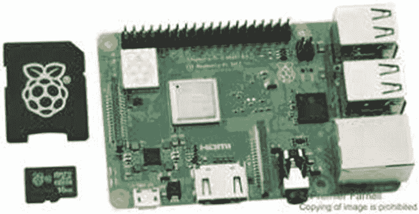
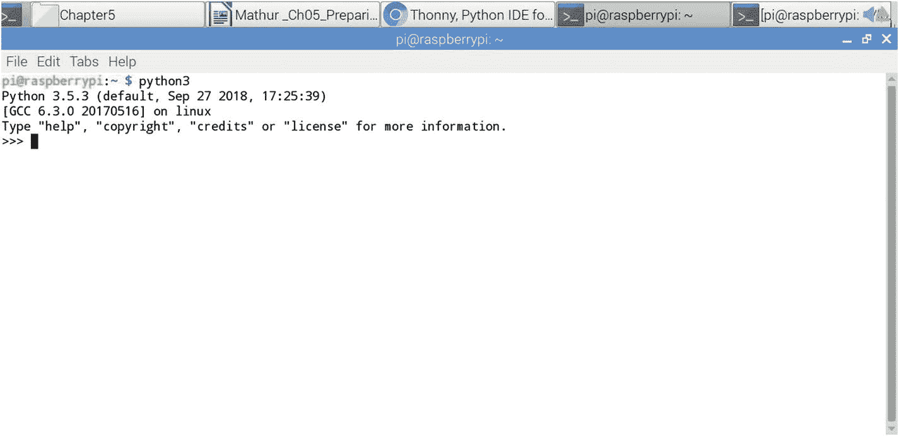
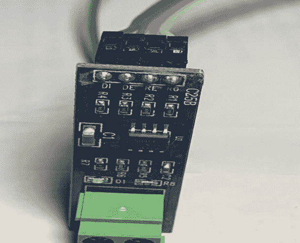
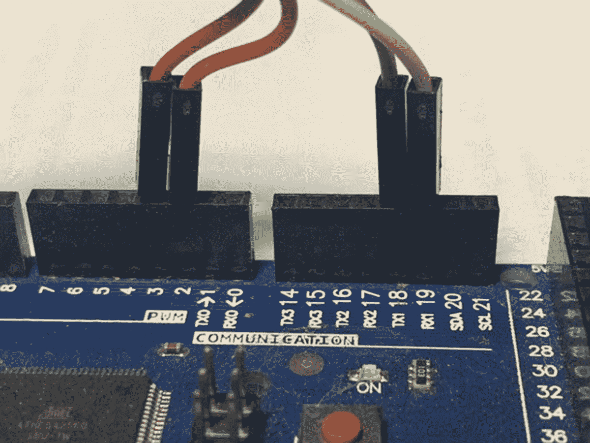

# 五、为案例研究的实现做准备

本章是关于案例研究实现的准备工作。您将首先学习如何从头开始设置您的 Raspberry Pi 3 型号及其硬件和软件。当然，您将为此安装流行的 Raspbian 操作系统。在此之后，您将为您的 Raspberry Pi 设置 Arduino Mega 2560 以及物联网传感器模块，以从中获取数据。接下来是设置在 Raspberry Pi 上运行程序所需的 Python。您还将设置启用了 Modbus 的电能表设备。之后，您将连接 Raspberry Pi 和 Arduino，并开始它们之间的通信。最后，您将测试一切。

## 设置 Raspberry Pi 3 模型 B+

请回过头来参考第 [3](3.html) 章中的图 [3-1](3.html#Fig1) 以获得案例研究中需要设置的组件的示意图。有两个软件组件，Python IDE 和 Arduino IDE，在完全设置好硬件组件后，您就可以设置它们了。那么让我们从硬件开始吧。

设置 Raspberry Pi 3 型硬件的第一步是决定运行应用程序的操作系统。有两种流行的操作系统:Raspbian 和 Noobs。Noobs 是刚接触树莓派的人用的。您将使用 Linux 版本的 Raspbian，它可以从 [`www.raspberrypi.org/downloads/`](http://www.raspberrypi.org/downloads/) 获得。在图 [5-1](#Fig1) 中可以看到，图中显示了可以从树莓派官方网站下载的操作系统镜像。


图 5-1

[www。拉斯贝里皮。org](http://www.raspberrypi.org) 下载选项

请注意，在这个阶段，您还没有启动您的 Raspberry Pi 3 B+，因为它的 microSD 卡上还没有安装操作系统。Raspberry Pi 3 B+套件附带一个 microSD 卡和 microSD 读卡器或适配器。如果您没有 microSD 卡，您可以在我的网站 [`www.pmauthor.com/raspbian/`](http://www.pmauthor.com/raspbian/) 的选项中获得一张。对于 Raspbian 的安装，建议的基本 microSD 卡大小为 8GB。对于 Raspbian Lite 镜像安装，Raspberrypi.org 建议至少 4GB。请记住，只有树莓 Pi 3A+、3B+和计算模块 3+可以从大于 256GB 的 SD 卡启动。这是因为在过去的 Pi 模型上使用的 SoC 有一个缺陷。此外，请记住您的 microSD 卡所属的 microSD 卡类别，因为这决定了它支持的写入速度；4 类卡最有可能以 4MB/s 的速度写入，而 10 类卡应该达到 10 MB/s。请注意，这并不意味着 10 类卡在一般读/写性能方面优于 4 类卡，因为这种写入速度通常是以牺牲读取速度和大幅增加 microSD 卡操作的寻道时间为代价的。你的 Raspberry Pi 3 B+套件附带的 microSD 卡应该是最新的，最有可能是 class 10，就像现在常见的那样；但是如果你得到了 4 这样的低等级，你可以在 [`www.pmauthor.com/raspbian/`](http://www.pmauthor.com/raspbian/) 点一张 10 级的更快的卡。

当然，你的笔记本电脑必须有一个插槽来直接或通过适配器读写 microSD 卡。如图 [5-2](#Fig2) 所示。此外，您需要一台运行 Windows 或 MacOS 的计算机或笔记本电脑来下载该映像，然后格式化 SD 卡并在其上安装该映像。在这一章中，我将向你展示如何在 Windows 系统上做到这一点。



图 5-2

官方套件附带的 microSD 卡和 microSD 卡适配器

暂时不要将 microSD 卡适配器插入 Raspberry Pi 3 B+板，因为它是空的，上面还没有写入任何操作系统映像。您需要首先通过点击网站的下载部分来下载 Raspbian 映像。一旦你这样做了，你将可以选择下载 Raspbian 的最新图像供你使用。截至本书撰写时，有三种可供下载的选项，如图 [5-3](#Fig3) 所示。


图 5-3

Raspbian 的下载选项

第一个选项是 Raspbian Buster，这是桌面和推荐软件可用的 Raspbian 风格的名称。第二个选项只有台式机，第三个选项是精简版，它不具备您为物联网应用程序进行大量编程所需的所有功能。因此，您将使用第一个选项，它提供了开始运行所需的所有软件组件。您可以单击 Torrent 或 zip 文件，这取决于您用来解压缩它的软件。我用的是 zip 文件版本。Raspbian 的 Buster 版本的 zip 文件大约为 2.3GB，因此根据您的互联网连接速度，下载需要一些时间。

下载完成后，您需要将 microSD 读卡器插入计算机/笔记本电脑中，以便将操作系统安装到 SD 卡插槽中。由于您使用的是 Windows，您将需要一个磁盘映像实用程序。我使用的免费工具是 Win32 Disk Imager。如果你没有，你可以从这个页面下载: [`www.pmauthor.com/raspbian/`](http://www.pmauthor.com/raspbian/) 。从网站下载 Win32 Disk Imager 实用程序并安装后，可以通过双击其图标打开它。它应该看起来像图 [5-4](#Fig4) 中的那个。


图 5-4

Win32 磁盘成像仪

单击图中所示的浏览图标，找到您下载的解压缩图像文件。选择图像文件的位置后，单击右侧的设备下拉框，并从中选择您的 microSD 卡驱动器号。对话框上的写入按钮将被启用，因此单击它来写入图像。完成后进度条会显示出来；这应该不会超过几分钟。完成后，单击退出按钮弹出 microSD 卡。现在，您的 microSD 卡上已经写有最新的 Raspbian 操作系统的映像，可以启动了。然而，在启动之前，您需要在板上设置 SBC 物理线路，然后将 microSD 卡连接到 Raspberry Pi 3 B+板上。

设置 Raspberry Pi 3 Model B+的第二步是按照第 [2 章](2.html)所示，用 GPIO 引脚和 SBC 各种组件的照片连接电路板。你需要插上最少的电源才能开始。首先，你需要一台 LED/LCD 电视或显示器。有许多可用的，但我更喜欢和在我的项目中使用的列在 [`www.pmauthor.com/raspbian/`](http://www.pmauthor.com/raspbian/) 。如果您有一台备用电视，您可以使用 HDMI-to-HDMI 电缆将其从您的电视连接到 SBC 上的 HDMI 端口。参见图 [5-5](#Fig5) 和 [5-6](#Fig6) 。


图 5-5

HDMI 至 HDMI 电缆

如果您有一个 5 英寸或 7 英寸的小显示器，那么您将有一个不同的电缆，并且您可能没有紧凑型 LCD/LED 面板上的 HDMI 插槽。


图 5-6

Raspberry Pi 3 B+上的 HDMI 端口

连接的 Raspberry Pi 将如图 [5-7](#Fig7) 所示。确保连接正确，不要让它们在两侧(电视显示器和 Raspberry Pi 3 b+)的端口上松动，否则您的显示器将不会显示。这是初学者常见的问题；当你打开 Raspberry Pi 的电源后，你看不到显示屏，你想知道发生了什么。这是一个很容易纠正的错误，因为 Raspberry Pi 上的 HDMI 端口非常大，所以你可以看到电线是否正确地固定在板上。此外，当您将 HDMI 电缆固定到树莓 Pi 3 B+上时，请确保您没有通电；作为安全预防措施和操作要求，这一点非常重要。有时，当你有一个开机的 Raspberry Pi，并且你将 HDMI 电缆固定到它的 HDMI 端口时，显示器不会显示。在这种情况下，重启 Raspberry Pi 3 B+，因为这个 SBS 上没有重启按钮。

在你最终启动你的树莓派之前，我推荐你做两件事。首先是将 USB 鼠标加密狗插入 Raspberry Pi 3 B+板上四个 USB 端口中的一个。第二种是为无线键盘添加另一个 USB 加密狗。这些是你控制你的 SBC 的基本要素。你可以在图 [5-7](#Fig7) 中看到它们连接到 SBC。如果您没有无线版本的鼠标或键盘，请不要担心；有线版本的 USB 鼠标和键盘工作得很好。只是有线设备对 SBC 来说有点太重了，SBC 非常轻，如果鼠标或键盘的电线抖动，它可以四处移动。


图 5-7

连接到 SBC 的 USB 加密狗

接下来，要让你的树莓派启动，你需要把它插上电源。这个小 SBC 的奇妙之处在于它使用 microUSB 作为电源。这意味着你可以通过一个电源库给它供电，也可以通过一根 microUSB 电源线给它供电。你为什么需要一个电力银行？它提供了备用电源，因此断电时不会关闭。如果你生活在世界上经常停电的地区，这一点很重要。如果您所在的地区有稳定的电源，那么您不需要连接到电源组，您可以通过电源适配器充电器将其连接到电源。你可以在图 [5-8](#Fig8) 中看到我与电源组的连接。


图 5-8

Raspberry Pi 3 B+电源线连接到电源组

你在图像中看到的是一个 10000 毫安的电源组。它为商业应用提供几个小时的电力。在我们的一个工厂能源审计应用程序中，我们必须创建一个电源组备份，其中一个电源组与另一个电源组串联，第一个电源组馈入另一个电源组，这样即使电源关闭几个小时，在其上运行的 Raspberry Pi 能源审计应用程序也不会受到影响。有时，您需要打破常规，构建能够从容应对断电的商业级应用。

现在，要让您的 Raspberry Pi 3 B+发挥作用，您只需将电源线的 microUSB 端插入 SBC 的电源插槽，如图 [5-9](#Fig9) 所示。请记住，如果您已经连接到电源或电源组，并且您正在将电线插入 SBC，它将在您的手中启动。为了防止这种情况，请确保在连接 microUSB 时另一端没有通电。


图 5-9

连接到 Raspberry Pi 3 B+ SBC 的 microUSB 和 HDMI 电缆

现在你已经准备好启动你的设备了，所以接下来打开你的电源适配器，它连接到 microUSB 电源线。您将看到 HDMI 端口插槽附近的绿色 LED 闪烁，连接的 LED/LCD 监视器应显示您在第 [3](3.html) 章中看到的启动图像。现在，您只需要在基本的 Raspberry Pi 上安装最新版本的 Raspbian。接下来，您需要安装软件，以便与物联网传感器和设备配合使用。

如果您运行的是 Raspbian(不是 Lite 版本)，Python 版会预装 Raspbian 发行版映像。但是，如果要使用 Python 3，需要通过下面的 Raspbian 命令行提示符进行安装。不用说，你需要通过连接的以太网电缆或 Wi-Fi 连接到你的 Raspberry Pi。

```py
pi@raspberrypi:~ $ sudo apt-get install python3

```

通过键入图 [5-10](#Fig10) 中给出的命令，在 Raspbian 上测试您的 Python 3 安装。



图 5-10

测试 Python 3 安装

现在您已经安装并测试了所需的 Python 版本，您需要一个集成开发环境(IDE)来在 Raspbian 上编程。我推荐您使用 Thonny IDE，因为它允许您编译程序并在编辑器中的一个地方运行它们。我已经在第 3 章中讨论了它的需求和特性，所以让我们直接进入在 Raspbian 上安装它的步骤。

Thonny IDE 是免费的，并且预装在大多数 Raspbian 操作系统的 Stretch 程序中。如果你在你安装的程序中找不到它，正如你在第 [3 章](3.html)中看到的，可以从它的网站: [`https://thonny.org/`](https://thonny.org/) 下载。这个网站的好处是，它的主页上有一个关于如何使用 IDE 的图片教程，非常基本和简单。使用清单 [5-1](#PC2) 中的命令可以完成安装。

```py
pi@raspberrypi:~ $ sudo apt-get install python3-thonny
Reading package lists... Done
Building dependency tree
Reading state information... Done
The following packages were automatically installed and are no longer required:
  realpath vlc-plugin-notify vlc-plugin-samba vlc-plugin-video-splitter vlc-plugin-visualization
Use 'sudo apt autoremove' to remove them.
The following additional packages will be installed:
  python3-asttokens
Suggested packages:
  python3-distro
The following NEW packages will be installed:
  python3-asttokens
The following packages will be upgraded:
  python3-thonny
1 upgraded, 1 newly installed, 0 to remove and 205 not upgraded.
Need to get 325 kB of archives.
After this operation, 146 kB of additional disk space will be used.
Do you want to continue? [Y/n]
y
0% [Connecting to archive.raspberrypi.org (2a00:1098:0:80:1000:13:0:7)]
Get:1 http://archive.raspberrypi.org/debian stretch/ui armhf python3-asttokens all 1.1.13-1+rpt1 [15.6 kB]
Get:2 http://archive.raspberrypi.org/debian stretch/ui armhf python3-thonny all 3.1.0-1+rpt2 [309 kB]
Fetched 325 kB in 2min 2s (2,643 B/s)
Reading changelogs... Done
Selecting previously unselected package python3-asttokens.
(Reading database ... 149433 files and directories currently installed.)
Preparing to unpack .../python3-asttokens_1.1.13-1+rpt1_all.deb ...
Unpacking python3-asttokens (1.1.13-1+rpt1) ...
Preparing to unpack .../python3-thonny_3.1.0-1+rpt2_all.deb ...
Unpacking python3-thonny (3.1.0-1+rpt2) over (3.0.5-1+rpt1) ...
Processing triggers for mime-support (3.60) ...
Processing triggers for desktop-file-utils (0.23-1) ...
Processing triggers for man-db (2.7.6.1-2) ...
Setting up python3-asttokens (1.1.13-1+rpt1) ...
Processing triggers for gnome-menus (3.13.3-9) ...
Processing triggers for hicolor-icon-theme (0.15-1) ...
Setting up python3-thonny (3.1.0-1+rpt2) ...
pi@raspberrypi:~ $

Listing 5-1Installing Thonny for Python 3

```

Thonny IDE 的 Raspbian 包是从 raspberry.org 官方网站的档案中下载的，然后进行处理和设置以供使用。如果安装成功，你应该看到你的 IDE 安装在开始栏的编程菜单下，如图 [5-11](#Fig11) 所示。


图 5-11

验证 Thonny Python IDE 安装

我在第 3 章[中讨论了 Thonny IDE 的验证部分，所以让我们进入下一步，安装案例研究中使用的 Python 库。以下是您将需要的 Python 库的列表。记得把 tkinter 改成 Tkinter(是的，大写 T)，如第](3.html) [3](3.html) 章所述。

*   numpy 用于 Python 中 n 数组和矩阵的操作。

*   熊猫是用来数据角力的。它是为快速简单的数据操作、聚合和可视化而设计的。

*   Seaborn 用于通过热图和聚合器实现统计模型的数据可视化。

*   scikit-learn 为程序中使用的机器学习算法提供了一致的接口。

*   Tkinter 用于为 Python 程序创建图形用户界面。

*   scipy 包含线性代数、优化、集成和统计模块。

*   matplotlib 用于通过各种图形和图表进行数据可视化。

*   NLTK 是一个自然语言工具包，用于符号和统计自然语言处理的常见任务。

*   statsmodels 用于通过使用统计模型的各种估计方法以及执行统计断言和分析来进行数据探索。

现在您已经看到了案例研究所需的 Python 库，接下来安装它们。我创建了一个脚本，在 Raspbian 命令行上完成这项工作；见图 [5-10](#Fig10) 。请记住代码是要安装在 Python 2.7 上的；如果你想在 Python 3 上安装所有的库，你需要修改脚本来添加一个`3`到`pip`，并使它成为`pip3`。

Alert

如果您使用自己的脚本来安装 Python 库，请确保在`pip install`命令之前使用`sudo`，如清单 [5-2](#PC3) 中的脚本`pipinstaller.run`所示。

```py
pi@raspberrypi:~/$ cat pipinstaller.run
sudo pip install numpy | tee /home/pi/numpy.log

sudo pip install pandas | tee /home/pi/pandas.log

sudo pip install seaborn | tee /home/pi/seaborn.log

sudo pip install sklearn | tee /home/pi/sklearn.log

sudo pip install tkinter | tee /home/pi/tkinter.log

sudo pip install scipy | tee /home/pi/scipy.log

sudo pip install nltk | tee /home/pi/nltk.log

sudo pip install statsmodels | tee /home/pi/statsmodels.log
pi@raspberrypi:~/

Listing 5-2Raspbian Command Line Script to Install the Required Python Packages

```

您会注意到，我在每个命令前添加了`sudo`,然后通过管道将输出传递给命令，以将输出记录到每个 Python 库的文件中。因此对于`sudo pip install` `scipy | tee /home/pi/scipy.log,`来说，输出存储在一个名为`scipy.log`的单独日志文件中。可以更容易地分别查看每个日志文件，调试并查看安装期间是否有任何错误。你可能会问为什么我要把所有这些输出存储在一个日志文件中，简单的答案是因为在 Raspbian 3 Model b+上，安装一个包可能需要几个小时，这取决于它的大小和你所在地区的互联网下载速度。因此，在运行脚本之前，请记住这一点，并确保为您的 Raspberry Pi 系统和显示器运行备用电源。在您尝试运行该脚本之前，一切都应该有备用电源。显示器的备用电源同样重要，因为如果您的显示器出于某种原因(如断电)关闭，Raspberry Pi 型号 3 B+有时会无法显示屏幕。该脚本的输出可能类似于清单 [5-3](#PC4) 。

```py
Requirement already satisfied: numpy in /usr/lib/python2.7/dist-packages
Requirement already satisfied: pandas in /usr/lib/python2.7/dist-packages
Requirement already satisfied: numpy>=1.7.0 in /usr/lib/python2.7/dist-packages (from pandas)
Requirement already satisfied: python-dateutil in /usr/lib/python2.7/dist-packages (from pandas)
Requirement already satisfied: pytz>=2011k in /usr/lib/python2.7/dist-packages (from pandas)
Requirement already satisfied: seaborn in /usr/lib/python2.7/dist-packages
Requirement already satisfied: sklearn in /usr/local/lib/python2.7/dist-packages
Requirement already satisfied: scikit-learn in /usr/lib/python2.7/dist-packages (from sklearn)
Collecting tkinter
  Could not find a version that satisfies the requirement tkinter (from versions: )
No matching distribution found for tkinter
Requirement already satisfied: scipy in /usr/lib/python2.7/dist-packages
Collecting nltk
  Downloading https://files.pythonhosted.org/packages/87/16/4d247e27c55a7b6412e7c4c86f2500ae61afcbf5932b9e3491f8462f8d9e/nltk-3.4.4.zip (1.5MB)
Collecting singledispatch; python_version < "3.4" (from nltk)
  Downloading https://files.pythonhosted.org/packages/c5/10/369f50bcd4621b263927b0a1519987a04383d4a98fb10438042ad410cf88/singledispatch-3.4.0.3-py2.py3-none-any.whl
Requirement already satisfied: six in /usr/lib/python2.7/dist-packages (from nltk)
Building wheels for collected packages: nltk
  Running setup.py bdist_wheel for nltk: started
  Running setup.py bdist_wheel for nltk: finished with status 'done'
  Stored in directory: /root/.cache/pip/wheels/41/c8/31/48ace4468e236e0e8435f30d33e43df48594e4d53e367cf061
Successfully built nltk
Installing collected packages: singledispatch, nltk
Successfully installed nltk-3.4.4 singledispatch-3.4.0.3
Requirement already satisfied: statsmodels in /usr/lib/python2.7/dist-packages

Listing 5-3Output of the Pip Python Package Installer Script

```

在我的例子中，正如您可以从安装程序日志输出中看到的，我有除 nltk 之外的所有必需的库，在这种情况下，它是下载并安装的。为了验证在设置 nltk 库的过程中是否有任何错误，清单 [5-4](#PC5) 中显示了`nltk.log`文件的输出。

```py
Collecting nltk
  Downloading https://files.pythonhosted.org/packages/87/16/4d247e27c55a7b6412e7c4c86f2500ae61afcbf5932b9e3491f8462f8d9e/nltk-3.4.4.zip (1.5MB)
Collecting singledispatch; python_version < "3.4" (from nltk)
  Downloading https://files.pythonhosted.org/packages/c5/10/369f50bcd4621b263927b0a1519987a04383d4a98fb10438042ad410cf88/singledispatch-3.4.0.3-py2.py3-none-any.whl
Requirement already satisfied: six in /usr/lib/python2.7/dist-packages (from nltk)
Building wheels for collected packages: nltk
  Running setup.py bdist_wheel for nltk: started
  Running setup.py bdist_wheel for nltk: finished with status 'done'
  Stored in directory: /root/.cache/pip/wheels/41/c8/31/48ace4468e236e0e8435f30d33e43df48594e4d53e367cf061
Successfully built nltk
Installing collected packages: singledispatch, nltk
Successfully installed nltk-3.4.4 singledispatch-3.4.0.3

Listing 5-4Output of the nltk.log File

```

所以在这个文件中没有发现错误，python nltk 库安装成功。您可能想要逐个检查为您安装的所有其他日志文件，如`scipy.log`、`statsmodels.log`等。现在，您已经成功安装了所有需要的 Python 库。

### 测试暂停

我在第 [3](3.html) 章的开头要求你不要执行任何代码，和 Arduino 一起享受机器学习的物联网执行。但在这里，您设置了所有的基础设施软件和硬件，您需要启动并运行这些软件和硬件以进行前面的案例研究。

然而，在进入下一章的执行之前，我强烈建议你回到第 [3](3.html) 章，执行图 [3-3](3.html#Fig3) 中给出的所有测试你的 Python 库的代码，你好世界 Python 代码测试你的 Raspbian 上安装的库。图 [3-4](3.html#Fig4) 显示了 Thonny IDE 上代码的输出，你应该也能得到类似的输出。如果没有，您可能没有正确安装 Python 库；您可能需要返回并检查图 [5-11](#Fig11) 中的安装日志，以检查错误发生的位置。然后，您应该继续执行测试图 [3-5](3.html#Fig5) 中的熊猫数据帧的代码，其输出应该类似于 Thonny IDE 上的图 [3-6](3.html#Fig6) 所示。此外，您应该为 sklearn 机器学习集成库测试图 [3-7](3.html#Fig7) 中的小代码，其输出出现在第 [3](3.html) 章的图 [3-8](3.html#Fig8) 中。这些是对基本库的测试；然而，你可以通过清单[5-5](#PC6)`iotpypkgtest.run`程序中给出的 Raspbian 命令行脚本，检查第 [3](3.html) 章的 Python 代码中使用的高级库，如 tkinter、gpiozero、smtplib、pygame、psutil、platform 和 time。我展示了一个权限被拒绝的错误，您第一次执行它时可能会在命令行上看到这个错误；可以通过使用脚本的`chmod 700`命令更改权限来解决这个问题。

```py
pi@raspberrypi:~/$ ./iotpypkgtest.run
bash: ./iotpypkgtest.run: Permission denied
pi@raspberrypi:~/$ chmod 700 iotpypkgtest.run
pi@raspberrypi:~/$./iotpypkgtest.run
pi@raspberrypi:~/$
pi@raspberrypi:~/$ ls -l ∗.out
-rw-r--r-- 1 pi pi   0 Aug 17 23:19 gpiozero.out
-rw-r--r-- 1 pi pi   0 Aug 17 23:19 platform.out
-rw-r--r-- 1 pi pi   0 Aug 17 23:19 psutil.out
-rw-r--r-- 1 pi pi   0 Aug 17 23:19 pygame.out
-rw-r--r-- 1 pi pi   0 Aug 17 23:19 smtplib.out
-rw-r--r-- 1 pi pi   0 Aug 17 23:19 time.out
-rw-r--r-- 1 pi pi 111 Aug 17 23:19 tkinter.out
pi@raspberrypi:~/$

Listing 5-5Script for Testing the Advanced Packages Installation

```

我故意在脚本中使用命令`python -c ‘import tkinter’`来创建一个错误，以便您可以在清单 [5-5](#PC6) 中看到其余的文件都是零字节的；但是，tkinter.out 文件中写入了 111 个字节，表明其中有一些错误。你在第 [3](3.html) 章看到了错误的原因；然而，要重申的是，tkinter 库用于 GUI 创建目的，如窗口屏幕和按钮，以操作物联网设备，并与 Python 3.x 而不是 Python 2.7 一起工作。在您的 Raspbian 命令行上，当您键入`python`时，您正在调用 Python 2.7 解释器；如果您想要调用 Python 版本 3 解释器，您需要在命令行中键入`python3`，就像我在清单 [5-6](#PC7) 中所做的那样。

```py
pi@raspberrypi:~/$ python3 -c "import tkinter"
pi@raspberrypi:~/$

Listing 5-6Successful Execution of tkinter on Python 3.x Intepretor

```

来自 Python 2.7 命令行的错误如清单 [5-7](#PC8) 所示。

```py
pi@raspberrypi:~/$ cat tkinter.out
Traceback (most recent call last):
  File "<string>", line 1, in <module>
ImportError: No module named tkinter
pi@raspberrypi:~/$

Listing 5-7Error from Python 2.7 Command Line

```

这个错误不是很直观，但是它确实说明了这个版本的解释器不识别名为 tkinter 的模块。如果任何其他 Python 库安装出现问题，您可能会得到不同的错误，这需要您单独进行调试。到目前为止，您已经安装了 Python 程序运行所需的基本库，包括用于机器学习算法的 sklearn。然而，要让物联网通过 Raspberry Pi 3 B+和 Arduino Mega 4560 工作，您需要以下列表中的高级库:

*   gpiozero:支持 Python 和 Raspberry Pi 3 B+上的 GPIO 端口之间通信的主库。

*   smtplib:用于从基于 Raspbian Linux 的操作系统发送电子邮件警报。

*   pygame:用于在 Python 程序中生成声音。

*   psutil(进程和系统实用程序):一个跨平台的库，用于在 Python 中检索关于**运行进程**和**系统利用率** (CPU、内存、磁盘、网络、传感器)的信息。

*   平台:用于访问底层平台的数据，如硬件、操作系统和解释器版本信息。

*   时间:Python 已经定义了一个名为 time 的包，它允许您处理关于时间及其转换和表示的各种操作，这些操作在您的应用程序中可以通过您的物联网设备存储事件的时间戳。

gpiozero 是我在 Raspberry Pi 3 B+上使用的主要 python 包，它已经在我的客户的商业应用程序上测试并成功运行，所以我推荐使用这个包来与物联网设备通信。拥有一个能够进行监控和报警但不能与所需人员实时通信的应用程序有什么用？为此，您需要 smtplib python 库。在您的 Raspberry Pi 3 B+上配置 SMTP 服务器超出了本书的范围，所以我将不讨论这一部分。然而，一旦你对它进行了配置，使用第 [3](3.html) 章中给出的 machinemon 应用程序发送电子邮件就很容易了。psutil 和 platform Python 包用于从 Raspberry Pi 3 B+的底层硬件获取 CPU 百分比、温度、内存、磁盘空间等数据。为了创建一个成功的商业应用程序，您需要存储在通过物联网设备进行监控期间发生的每个事件的时间戳，为此，Python 包就派上了用场。

您现在知道了将用于物联网的高级包，所以继续使用名为`iotpypackagesinstall.run`的脚本和名为`iotpypackages.run`的测试来安装它们，分别如清单 [5-8](#PC9) 和 [5-9](#PC10) 所示。

```py
pi@raspberrypi:~/IoTBook/Chapter5 $ cat iotpypackages.run
python -c "import tkinter" &> tkinter.out
python -c "import gpiozero" &> gpiozero.out
python -c "import smtplib" &> smtplib.out
python -c "import pygame" &> pygame.out
python -c "import psutil" &> psutil.out
python -c "import platform" &> platform.out
python -c "import time" &> time.out
pi@raspberrypi:~/IoTBook/Chapter5 $ ls -l ∗.out
-rw-r--r-- 1 pi pi   0 Aug 18 00:51 gpiozero.out
-rw-r--r-- 1 pi pi   0 Aug 18 00:51 platform.out
-rw-r--r-- 1 pi pi   0 Aug 18 00:51 psutil.out
-rw-r--r-- 1 pi pi   0 Aug 18 00:51 pygame.out
-rw-r--r-- 1 pi pi   0 Aug 18 00:51 smtplib.out
-rw-r--r-- 1 pi pi   0 Aug 18 00:51 time.out
-rw-r--r-- 1 pi pi 111 Aug 18 00:51 tkinter.out
pi@raspberrypi:~/IoTBook/Chapter5 $

Listing 5-9Output of Script iotpypackages.run

```

```py
sudo pip install gpiozero | tee gpiozero.log
sudo pip install pygame | tee  pygame.log
sudo pip install psutil | tee  psutil.log
pi@raspberrypi:~$ ./iotpypackagesinstall.run
Requirement already satisfied: gpiozero in /usr/lib/python2.7/dist-packages
Requirement already satisfied: pygame in /usr/lib/python2.7/dist-packages
Requirement already satisfied: psutil in /usr/lib/python2.7/dist-packages
#Testing installed packages using script
pi@raspberrypi:~/IoTBook/Chapter5 $ ./iotpypackages.run

Listing 5-8Code to Run iotpypackages.run Raspbian Script

```

从清单 [5-9](#PC10) 中的测试脚本输出可以看出，除了 tkinter.out，所有文件都是 0 字节，所以高级包已经安装成功。如果您在安装 Python 库的过程中发现任何问题，可以通过 [`www.pmauthor.com/raspbian/`](http://www.pmauthor.com/raspbian/) 的技术论坛给我写信，我会尽力帮助解决您的疑问。

到目前为止，你已经成功地设置了你的 Raspberry Pi 3 B+和 Python 及其所需的包，并通过本章和第 3 章 [3](3.html) 中的脚本对它们进行了测试。现在，您必须安装 Arduino IDE 来与 Arduino Mega 4560 通信，并创建一个 SQLite3 数据库，您的物联网应用程序可以在其中存储数据。安装 Arduino IDE 后，您需要使用串行电缆测试 Raspberry Pi 和 Arduino 之间的通信。在接下来的步骤中，您将看到将 Arduino Mega 4560 的硬件设置为 Raspberry Pi 3 B+的详细步骤。

### 确定位大小

在开始安装 Arduino IDE 之前，您需要知道您的 Raspberry Pi 是 32 位还是 64 位。为此，清单 [5-10](#PC11) 中给出了两个有用的命令，它们提供了 bash 位版本。

```py
> which bash
/bin/bash
> file /bin/bash
/bin/bash: ELF 32-bit LSB executable, ARM, version 1 (SYSV) ...

Listing 5-10Finding Out the Bit Version of Your Raspberry Pi

```

我的 Raspberry Pi 3 B+有一个 32 位 bash 可执行文件。这并不是确定您的位版本的非常确定的方法，但是硬件制造商在 64 位处理器上编译 32 位 bash 是最不可能的。此外，为了确认，您可以使用清单 [5-11](#PC12) 中所示的`uname`命令，它显示我正在 ARMv7 处理器上运行一个 Raspberry Pi Linux 变种。

```py
pi@raspberrypi:~/$ uname -a
Linux raspberrypi 4.14.98-v7+ #1200 SMP Tue Feb 12 20:27:48 GMT 2019 armv7l GNU/Linux

Listing 5-11Command for Confirming the Processor Information

```

即使这样也没有明确说处理器的宽度位。了解这些信息很重要，因为你不想安装错误的 Arduino 位 IDE，也不想弄乱你的 Raspbian 安装。因此，您可以使用一个名为 lshw 的程序，您可以使用清单 [5-12](#PC13) 中所示的命令来安装该程序。

```py
pi@raspberrypi:~/$ sudo apt-get install lshw
Reading package lists... Done
Building dependency tree
Reading state information... Done
The following packages were automatically installed and are no longer required:
  realpath vlc-plugin-notify vlc-plugin-samba vlc-plugin-video-splitter
  vlc-plugin-visualization
Use 'sudo apt autoremove' to remove them.
The following additional packages will be installed:
  libpci3 pciutils
The following NEW packages will be installed:
  libpci3 lshw pciutils
0 upgraded, 3 newly installed, 0 to remove and 205 not upgraded.
Need to get 525 kB of archives.
After this operation, 1,879 kB of additional disk space will be used.
Do you want to continue? [Y/n] y
Get:1 http://raspbian.mirror.net.in/raspbian/raspbian stretch/main armhf libpci3 armhf 1:3.5.2-1 [50.9 kB]
Get:2 http://raspbian.mirror.net.in/raspbian/raspbian stretch/main armhf pciutils armhf 1:3.5.2-1 [271 kB]
Get:3 http://raspbian.mirror.net.in/raspbian/raspbian stretch/main armhf lshw armhf 02.18-0.1 [203 kB]
Fetched 525 kB in 2s (188 kB/s)
Selecting previously unselected package libpci3:armhf.
(Reading database ... 149467 files and directories currently installed.)
Preparing to unpack .../libpci3_1%3a3.5.2-1_armhf.deb ...
Unpacking libpci3:armhf (1:3.5.2-1) ...
Selecting previously unselected package pciutils.
Preparing to unpack .../pciutils_1%3a3.5.2-1_armhf.deb ...
Unpacking pciutils (1:3.5.2-1) ...
Selecting previously unselected package lshw.
Preparing to unpack .../lshw_02.18-0.1_armhf.deb ...
Unpacking lshw (02.18-0.1) ...
Setting up lshw (02.18-0.1) ...
Processing triggers for libc-bin (2.24-11+deb9u3) ...
Processing triggers for man-db (2.7.6.1-2) ...
Setting up libpci3:armhf (1:3.5.2-1) ...
Setting up pciutils (1:3.5.2-1) ...
Processing triggers for libc-bin (2.24-11+deb9u3) …

Listing 5-12Installing the lshw Utility to Find Out the Processor Bit

```

现在您已经安装了这个实用程序，您可以输入命令`lshw`。清单 [5-13](#PC14) 中的输出清楚地显示了我的处理器的 32 位宽度。

```py
pi@raspberrypi:~/$ sudo lshw
USB
raspberrypi
    description: ARMv7 Processor rev 4 (v7l)
    product: Raspberry Pi 3 Model B Plus Rev 1.3
    serial: 0000000042f31c73
    width: 32 bits
    capabilities: smp
  ∗-core
       description: Motherboard
       physical id: 0
     ∗-cpu:0
          description: CPU
          product: cpu
          physical id: 0
          bus info: cpu@0
          size: 1400MHz
          capacity: 1400MHz
          capabilities: half thumb fastmult vfp edsp neon vfpv3 tls vfpv4 idiva idivt vfpd32 lpae evtstrm crc32 cpufreq
     ∗-cpu:1
          description: CPU
          product: cpu
          physical id: 1
          bus info: cpu@1
          size: 1400MHz
          capacity: 1400MHz
          capabilities: half thumb fastmult vfp edsp neon vfpv3 tls vfpv4 idiva idivt vfpd32 lpae evtstrm crc32 cpufreq
     ∗-cpu:2
          description: CPU
          product: cpu
          physical id: 2
          bus info: cpu@2
          size: 1400MHz
          capacity: 1400MHz
          capabilities: half thumb fastmult vfp edsp neon vfpv3 tls vfpv4 idiva idivt vfpd32 lpae evtstrm crc32 cpufreq
     ∗-cpu:3
          description: CPU
          product: cpu
          physical id: 3
          bus info: cpu@3
          size: 1400MHz
          capacity: 1400MHz
          capabilities: half thumb fastmult vfp edsp neon vfpv3 tls vfpv4 idiva idivt vfpd32 lpae evtstrm crc32 cpufreq
     ∗-memory
          description: System memory
          physical id: 4
          size: 927MiB
  ∗-usbhost
       product: DWC OTG Controller
       vendor: Linux 4.14.98-v7+ dwc_otg_hcd
       physical id: 1
       bus info: usb@1
       logical name: usb1
       version: 4.14
       capabilities: usb-2.00
       configuration: driver=hub slots=1 speed=480Mbit/s
     ∗-usb
          description: USB hub
          product: USB 2.0 Hub
          vendor: Standard Microsystems Corp.
          physical id: 1
          bus info: usb@1:1
          version: b.b3
          capabilities: usb-2.00
          configuration: driver=hub maxpower=2mA slots=4 speed=480Mbit/s
        ∗-usb:0
             description: USB hub
             product: USB 2.0 Hub
             vendor: Standard Microsystems Corp.
             physical id: 1
             bus info: usb@1:1.1
             version: b.b3
             capabilities: usb-2.00
             configuration: driver=hub maxpower=2mA slots=3 speed=480Mbit/s
           ∗-usb:0
                description: Generic USB device
                vendor: Standard Microsystems Corp.
                physical id: 1
                bus info: usb@1:1.1.1
                version: 3.00
                capabilities: usb-2.10
                configuration: driver=lan78xx maxpower=2mA speed=480Mbit/s
           ∗-usb:1
                description: Mouse
                product: 2.4G Mouse
                vendor: Telink
                physical id: 2
                bus info: usb@1:1.1.2
                version: 1.00
                capabilities: usb-1.10
                configuration: driver=usbhid maxpower=50mA speed=12Mbit/s
           ∗-usb:2
                description: Keyboard
                product: USB Receiver
                vendor: Logitech
                physical id: 3
                bus info: usb@1:1.1.3
                version: 24.07
                capabilities: usb-2.00
                configuration: driver=usbhid maxpower=98mA speed=12Mbit/s
        ∗-usb:1
             description: Communication device
             product: Mega 2560 R3 (CDC ACM)
             vendor: Arduino (www.arduino.cc)
             physical id: 2
             bus info: usb@1:1.2
             version: 0.01
             serial: 55739323737351F052A1
             capabilities: usb-1.10
             configuration: driver=cdc_acm maxpower=100mA speed=12Mbit/s
  ∗-network:0
       description: Wireless interface
       physical id: 2
       logical name: wlan0
       serial: b8:27:eb:a6:49:26
       capabilities: ethernet physical wireless
       configuration: broadcast=yes driver=brcmfmac driverversion=7.45.154 firmware=01-4fbe0b04 ip=172.20.10.11 multicast=yes wireless=IEEE 802.11
  ∗-network:1
       description: Ethernet interface
       physical id: 3
       logical name: eth0
       serial: b8:27:eb:f3:1c:73
       size: 10Mbit/s
       capacity: 1Gbit/s
       capabilities: ethernet physical tp mii 10bt 10bt-fd 100bt 100bt-fd 1000bt-fd autonegotiation
       configuration: autonegotiation=on broadcast=yes driver=lan78xx driverversion=1.0.6 duplex=half link=no multicast=yes port=MII speed=10Mbit/s
pi@raspberrypi:~/$

Listing 5-13Output of the lshw Command

```

虽然这个命令给出了大量关于硬件的信息，但是我们感兴趣的信息在命令输出的第六行给出: **width: 32 bits** 。这以明确的方式确认了我的 Raspberry Pi 3 B+运行在 32 位处理器上。

## 安装 Arduino IDE

因为您知道您的处理器位宽，所以您可以移动到 Arduino IDE 的实际安装，这可以通过两种方式来完成。一种方法是进入 [`www.arduino.cc`](http://www.arduino.cc/) ，点击软件➤下载，如图 [5-12](#Fig12) 。


图 5-12

从 [`www.arduino.cc`](http://www.arduino.cc) 下载 Arduino IDE

现在向下滚动到图 [5-13](#Fig13) 所示的 Arduino IDE 下载部分，并选择具有相应位(32 或 64)的操作系统进行下载。


图 5-13

下载 Arduino IDE

如您所见，页面右侧的蓝色栏中有各种选项。Linux 有四个选项:Linux 32 位、Linux 64 位、Linux ARM 32 位和 Linux ARM 64 位。`uname`和`lshw`命令显示我在一个 32 位宽度的 ARM v7 处理器上运行 Linux，所以在我的例子中，我选择下载 32 位的 Linux ARM。如果你有 64 位处理器，你需要下载 Linux ARM 64 位 IDE。如果您不想为 Arduino 开发贡献一点微薄之力，请点击下一页的“下载”按钮。

下载结束后，点击浏览器中的“在文件夹中显示”选项，遵循图 [5-14](#Fig14) 中给出的步骤。


图 5-14

单击“在文件夹中显示”选项查看下载的文件

之后，Raspbian GUI 文件浏览器将打开下载 Arduino 压缩文件的下载文件夹，如图 [5-15](#Fig15) 所示。


图 5-15

带*的下载文件夹。xz 压缩文件

您需要从∫中提取 tar 文件。xz 扩展名文件，如图 [5-16](#Fig16) 所示。右键单击要选择的文件，然后左键单击“Extract Here”菜单选项。


图 5-16

*的“在此提取”选项。xz 文件

当您单击 Extract Here 选项时，您将看到一个对话框，显示文件提取过程的进度。参见图 [5-17](#Fig17) 。


图 5-17

正在提取*。xz 文件

一旦你提取了这个文件，你将会看到在`Downloads`文件夹中创建了一个新文件，它与`∗.xz`文件同名，但是现在有了一个`∗.tar`扩展名。再次右键单击该文件，再次从下拉菜单中选择“在此提取”选项，如图 [5-18](#Fig18) 所示。


图 5-18

tar 文件的提取

提取过程完成后，您将会看到一个新的文件夹被创建，如图 [5-19](#Fig19) 所示。


图 5-19

提取后的新 Arduino 文件夹

双击即可进入该文件夹，如图 [5-20](#Fig20) 所示。您将看到一个名为`install.sh`的文件。双击这个文件，Arduino IDE 将被安装到您的系统上。


图 5-20

运行 install.sh 文件以完成安装

第二种更简单的安装 Arduino IDE 的方法只需要执行三个命令:

```py
sudo apt-get update
sudo apt-get upgrade
sudo apt-get install arduino

```

虽然安装 Arduino IDE 的命令行方法要简单得多，步骤也少得多，但是有些人更喜欢 GUI 而不是命令行，所以我已经展示了这两种方法，并让您决定如何安装它。现在您处于设置中的数据存储步骤，即在 Raspbian 上安装 SQLite3 数据库。

## 正在安装 SQLite3 数据库

SQLite3 是一个免费的数据库，您可以轻松地在应用程序中创建和使用数据库进行存储。虽然 SQLite3 不是一个全功能的数据库，但它支持大量的 SQL 标准，非常适合需要简单数据库引擎来插入应用程序的应用程序开发。SQLite3 很受智能手机开发者的欢迎。Raspberry Pi 的环境也是一个移动环境，我们将它带到田间、工厂、农田或移动塔附近，通过物联网传感器收集数据，并将其存储在这个紧凑、强大的数据库中。请记住，您不能将此数据库用于需要高安全性特性(如内置用户管理)的应用程序。所以在没有这种安全需求的地方使用它。您可以在 Raspbian 上配置 PostgreSQL 或任何其他 Linux 数据库，如 MySQL，但这超出了本书的范围，因为我们只开发 PoC 级别的代码。

使用以下脚本将 Sqlite3 安装到 Raspbian 操作系统上:

```py
sudo apt-get update
sudo apt-get upgrade
sudo apt-get install sqlite3
sqlite3 <firstdb.db>
SQLite version 3.8.7.1 2014-10-29 13:59:56

Enter ".help" for usage hints.
sqlite>

```

您也可以从 SQLite 组织的官方网站 [`www.sqlite.org/download.html`](http://www.sqlite.org/download.html) 按照我为您展示的 Arduino IDE GUI 安装方式安装 SQLite3。

现在，您已经到了在 Arduino 上安装 Modbus 接口设备(单相电表)的最后一步。

Disclaimer

在继续之前，我想提醒您使用该 Modbus 设备的相关风险。电能表是一种电器，如果连接不当，会有短路的风险。如果不按照说明书使用，它还会对人的生命造成危险。如果连接错误，它还会烧毁和损坏您的 Raspberry Pi 和 Arduino 板。因此，如果你对电气连接感到不舒服，我强烈建议你不要使用这种设备，或者从当地电气技师那里获得专业帮助，以进行正确的连接。我和出版商都不对任何形式的损害负责，无论是物质损害还是生命损害。强烈建议用户自行判断。

图 [5-21](#Fig21) 至 [5-23](#Fig23) 中显示了您将用来设置电能表的附加设备:



图 5-23

连接的 5V Modbus 转换模块


图 5-22

用于 Arduino 的 5V RS485 至 TTL 信号相互转换模块

1.  5V RS485 至 TTL 信号相互转换模块，用于带信号指示器的 Arduino 过压保护


图 5-21

Conzerv EM6400 电能表

1.  施耐德电气 Conzerv EM6400 系列功率计

现在让我们连接 Arduino Mega 256 和 5V RS485 Modbus 转换模块之间的电线。我已经展示了 Arduino Mega 2560 中连接到 Modbus 转换模块的电线。

为了将 Modbus 转换模块连接到 Arduino，首先需要了解 Arduino Mega 2560 PCB 的布局，如图 [5-24](#Fig24) 所示。请注意，图中上方的引脚与通信和 GPIO 引脚相关。电路板的右侧有数据引脚，电路板的底部有电源和模拟引脚。该板与 Arduino Uno 板非常不同，因为它用于控制多个从机，并用于工业应用。这就是 PCB 布局中有这么多数据引脚的原因。

现在将 Modbus 转换模块连接到 Arduino Mega 板上。您必须将三个引脚连接到电路板的电源区域，该区域靠近图 [5-24](#Fig24) 中布局图左下方的电源控制器。最左边的深蓝色引脚连接到下面写有 5V 的引脚。下一根绿线连接到标记为 GND 的下一个引脚。忽略图 [5-24](#Fig24) 左侧的黄线；您的设置不需要它。你可以在图 [5-24](#Fig24) 中看到这一点——连接到 Arduino Mega 板的电源部分的三个引脚。请记住，这些是您需要的公跳线，因为 Arduino Mega 板只有孔，而没有像 Raspberry Pi GPIO 设置那样的引脚。


图 5-24

Modbus 转换模块与 Arduino Mega 板的接线

另一端的电线必须是母跳线，因为 Modbus 转换模块有引脚来放置电线。因此，这种连接应该有两根公母跳线。将这两根电线的另一端连接至标有 VCC 和 GND 的 Modbus 转换模块引脚(VCC 为 5V 电源线，GND 为电路接地)。可以参考图 [5-25](#Fig25) 。


图 5-25

Modbus 转换模块的电源和接地连接

Arduino 上连接的 5V 深蓝色电线连接到标在 Modbus 转换模块上的 VCC 引脚。Arduino 板上的 GND 绿线针脚连接到 Modbus 转换模块 PCB 上的 GND。

现在，Modbus 转换模块的一部分连接到 Arduino 板上。您需要将另一端连接到 Arduino 板的 GPIO 引脚部分或通信端，总共有四个引脚。见图 [5-26](#Fig26) 在 Arduino 板上



图 5-26

连接到 Arduino Mega 板的 PWM 和通信端

如图所示，电路板左侧有两个名为 PWM 的引脚，分别连接到相邻的引脚 3 和 2。接下来的两个引脚连接到通信引脚 18 和 19，在 Arduino Mega 板上分别标记为 TX1 和 RX1。一旦你准备好了，你需要以下面的方式连接四个引脚的另一端。Arduino 板上连接到 PWM 引脚 3 的引脚 1 需要连接到 Modbus 转换模块引脚上标有 DE 的引脚。Arduino 板上连接到 PWM 引脚 2 的引脚 2 需要连接到 Modbus 转换模块中间标有 RE 的引脚。同样，Arduino 板上连接到图 [5-27](#Fig27) 中 18 号引脚的 3 号引脚需要连接到 Modbus 转换模块上标有 DI 的引脚。连接到 Arduino 板上 19 号引脚的第四个引脚应连接到 Modbus 转换模块上标有 RO 的引脚。这就完成了 Modbus 转换模块到 Arduino Mega 板的接线过程。你可以对照图 [5-27](#Fig27) 检查你的连接。


图 5-27

Modbus 转换模块通信和 PWM 引脚的接线

现在你已经为下一步做好了准备:将你的 Arduino 模块连接到 Raspberry Pi 板上。为此，您需要将一根串行 USB 线从 Raspberry Pi 3 B+板的串行 USB 端口连接到 Arduino Mega 2560 板。为清晰起见，电线如图 [5-28](#Fig28) 所示。


图 5-28

USB 串行电缆，用于连接 Arduino Mega 2560 和 Raspberry Pi 3 B+

现在，您终于可以启动整个系统了。Arduino 不需要单独的电源线，尽管它在板上有一个插槽。串行电缆在 Arduino 板上供电，因为它是 Raspberry Pi 3 B+板的从机。当您打开 Raspberry Pi 3 B+电源时，您应该会看到 Modbus 转换模块和 Arduino Mega 2560 板上的 LED 灯。这初步表明您的连接是成功的。这可以在图 [5-29](#Fig29) 中看到。


图 5-29

最终通电

如果板或模块没有亮起，您应该再次检查您的连接，尤其是为模块或 Arduino 板供电的连接。现在继续运行第 [3 章](3.html)中的 Arduino Hello world 程序，以确认 Arduino Mega 从机和 Raspberry Pi 3 B+主机之间的串行通信。

## 摘要

本章是关于为案例研究的实现做准备。现在，通过在 Raspberry Pi 3 型号 B+上设置 Raspbian 操作系统，并从 [`www.raspberrypi.org`](http://www.raspberrypi.org) 下载选项下载，您就完成了完整的配置。您使用 microSD 卡和 microSD 卡适配器来获取操作系统。然后，您使用 Win32 磁盘管理器来解包并提取包。之后，您使用 HDMI 转 HDMI 电缆将 Raspberry Pi 连接到电视显示器。您使用 USB 加密狗将键盘和鼠标连接到 SBC。在此之后，您将 Raspberry Pi 3 B+电源线连接到电源组，这样它的电源连接将在停电的情况下不会出现故障。

然后安装 Python 并在 Raspbian 上测试它。接下来，您安装并验证了 Thonny Python IDE。然后运行 Raspbian 命令行脚本来安装所需的 Python 包

您运行了一个脚本来测试 Python 高级包的安装并检查错误。您在 Python 上为 GUI 实现安装了 tkinter 包，然后在 Python 3.x 解释器上成功执行了 tkinter。在这之后，您运行了 iotpypackages.run Raspbian 脚本以在 Raspbian 上安装 IoT Python 包。

在这之后，您通过运行`install.sh`文件完成了 Arduino IDE 的安装。您安装了一个 SQLite3 数据库来存储来自物联网传感器的数据。之后，您在 Arduino 上安装了 Modbus 接口设备，即单相电表。您配置并连接了三个设备:Schneider Electric Conzerv EM6400 系列功率计、用于带信号指示器的 Arduino 过压保护的 5V RS485 至 TTL 信号相互转换模块以及 5V Modbus 转换器模块。之后，将 Modbus 转换器接线连接到 Arduino Mega 板，并连接到 Arduino Mega 板的 PWM 和通信侧。您通过 USB 串行电缆连接 Modbus 转换模块通信和 PWM 引脚，将 Arduino Mega 2560 与 Raspberry Pi 3 B+连接起来。之后，您对整个系统进行了最后一次通电。

至此，您完成了系统的设置，包括硬件和软件。您现在可以继续进行案例研究了。