# 一、机器学习回顾

近年来，人工智能 ( **AI** )尤其是机器学习在学术界和工业界都出现了复兴。在过去的十年里，人工智能已经取得了巨大的成功，但在这中间的几年里，这个领域的最初希望让位于相对衰落，直到最近几年重新出现。

在很大程度上，使这些成功成为可能的是处理数量惊人且不断增长的数据的需求所提供的动力，顽强的研究人员在深度学习方面取得的关键算法进步，以及摩尔定律推动的原始计算能力的不可阻挡的增长。在人工智能引领复兴的领域中，机器学习已经取得了惊人的发展，并继续在一系列领域中找到最广泛的适用性。使用机器学习来帮助最高级别的企业制定复杂的决策，同时，它在提高搜索、语音识别和移动电话个人助理等日常应用的准确性方面取得了巨大成功，这使得它在家庭房间和董事会会议室中的影响变得司空见惯。如今，不仅在大众科技媒体上，而且在主流媒体上，如纽约时报、T2 和赫芬顿邮报都可以找到令人屏息的文章。机器学习确实在相对较短的时间内变得无处不在。

一个普通的用户在日常活动中会以多种方式遇到机器学习。包括雅虎(Yahoo)和 Gmail 在内的大多数电子邮件提供商都让用户自动将电子邮件分类为垃圾邮件、垃圾邮件、促销邮件等标题，这是通过使用文本挖掘(机器学习的一个分支)实现的。当在电子商务网站上在线购买产品，如[【https://www.amazon.com/】](https://www.amazon.com/)，或观看内容提供商的电影，如网飞，一个人会被所谓的推荐系统提供其他产品和内容的推荐，这是机器学习的另一个分支，作为留住客户的有效方法。

预测天气，估计房地产价格，预测选民投票率，甚至选举结果——所有这些都使用某种形式的机器学习来预见未来。

不断增长的数据可用性和通过学习这些数据丰富我们生活的系统的前景，对数据科学领域有限的专业人员的技能提出了越来越高的要求。对于训练有素的专家来说，这种需求尤其迫切，他们知道如何使用更流行的语言(如 Java、Python、R，以及越来越多的 Scala)来处理机器学习技术。幸运的是，由于开源社区中成千上万的贡献者，每种语言都有一套丰富且快速增长的库、框架和教程，使得大多数情况下，任何有互联网连接和计算机的人都可以使用最先进的技术。Java 是工具和技术传播的重要载体，特别是在大规模机器学习项目中，因为它在企业级部署和可移植 JVM 平台中的成熟性和稳定性，更不用说多年来已经有大量专业程序员采用了它。因此，掌握当今劳动力中如此缺乏的技能将使任何渴望进入该领域的有抱负的专业人士在市场上处于明显的优势。

也许你已经在你的专业工作中应用了机器学习技术，或者你只是对这个主题感兴趣。如果你正在读这篇文章，很可能你已经可以随心所欲地使用 Java 了，没问题，但是现在你觉得你已经准备好更深入地学习如何在你的下一个数据科学项目中使用最好的开源 ML Java 框架了。如果那真的是你，那么这本书的章节被设计来做所有这些甚至更多，这是多么的幸运啊！

掌握一门学科，尤其是像机器学习这样具有明显适用性的学科，需要的不仅仅是理解其核心概念和熟悉其数学基础。与该主题的介绍性处理不同，一本旨在帮助你掌握该主题的书，除了介绍会扩展介绍性材料范围的更高级的主题之外，还必须重点关注实践方面。为了在我们开始提高技能之前热身，我们将在本章快速回顾一下我们已经知道的东西。对于之前很少或没有接触过该主题的雄心勃勃的新手(尽管如此，他决心从本书中获得最大的益处)，这里是我们的建议:确保你不跳过本章的其余部分；相反，把它作为一个跳板，更深入地探索不熟悉的概念。必要时寻求外部资源。维基百科。然后跳回去。

在本章的剩余部分，我们将回顾以下内容:

*   历史和定义
*   什么不是机器学习？
*   概念和术语
*   机器学习的重要分支
*   机器学习中的不同数据类型
*   机器学习的应用
*   机器学习面临的问题
*   大多数机器学习项目中使用的元过程
*   关于我们将在本书中使用的一些著名工具、API 和资源的信息

# 机器学习——历史和定义

很难给出一个准确的历史，但是我们今天使用的机器学习的定义早在 19 世纪 60 年代就有了。在勒内·笛卡尔*关于方法*的论述中，他提到*自动机*并说:

> 因为我们可以很容易地理解一台机器的构成，使它能够说话，甚至对作用于它的有形的动作发出一些反应，从而使它的器官发生变化；例如，如果触摸某个特定部位，它可能会问我们想对它说什么；如果在另一个地方，它可能会惊叫说它受到了伤害，等等。

### 注意

[`www . earlymoderntexts . com/assets/pdf/Descartes 1637 . pdf`](http://www.earlymoderntexts.com/assets/pdfs/descartes1637.pdf)

[`www . Marxists . org/reference/archive/Descartes/1635/discourse-method . htm`](https://www.marxists.org/reference/archive/descartes/1635/discourse-method.htm)

艾伦·图灵在他的著名出版物*计算机械和智能*中，通过提出“机器能思考吗？”这个问题，给出了对机器学习目标的基本见解。

### 注意

[`csmt.uchicago.edu/annotations/turing.htm`](http://csmt.uchicago.edu/annotations/turing.htm)

[`www.csee.umbc.edu/courses/471/papers/turing.pdf`](http://www.csee.umbc.edu/courses/471/papers/turing.pdf)

亚瑟·塞缪尔在 1959 年写道，“机器学习是一个研究领域，它赋予计算机学习的能力，而不需要明确的编程。”。

Tom Mitchell 最近对机器学习给出了更准确的定义:*“如果一个计算机程序在 T 上的性能(由 P 测量)随着经验 E 的增加而提高，则称该程序在某些任务 T 和某些性能测量 P 方面从经验 E 中学习。”*

机器学习与几个领域有关系:

*   **统计**:它使用数据采样、估计、假设检验、学习理论和基于统计的建模等元素
*   **算法和计算**:它使用了基础计算机科学中的搜索、遍历、并行化、分布式计算等基本概念
*   **数据库和知识发现**:以各种格式存储、检索和访问信息的能力
*   **模式识别**:对于来说，它有能力从数据中发现有趣的模式，进行探索、可视化和预测
*   人工智能:虽然它被认为是人工智能的一个分支，但是它也和其他分支有关系，比如启发式、最优化、进化计算等等


# 什么不是机器学习？

重要的是要认识到与机器学习有共同联系的领域，但它们本身不能被视为机器学习的一部分。一些学科可能会或多或少地重叠，但机器学习的基本原理是非常不同的:

*   **商业智能(BI)和报告**:报告**关键绩效指标** ( **KPI 的**)，查询 OLAP 进行切片、切块和钻取数据，仪表板等等，这些构成了 BI 的中心组件，不是机器学习。
*   **存储和 ETL** :数据存储和 ETL 是任何机器学习过程中的关键元素，但是，它们本身并不具备机器学习的资格。
*   **信息检索、搜索和查询**:基于构成信息检索基础的搜索标准或索引来检索数据或文档的能力，并不是真正的机器学习。许多形式的机器学习，如半监督学习，可以依赖于搜索相似的数据进行建模，但这并不意味着搜索是机器学习。
*   **知识表示和推理**:表示用于执行复杂任务的知识，如本体、专家系统和语义网，不符合机器学习的条件。


# 机器学习——概念和术语

在本节中，我们将描述机器学习中通常使用的不同概念和术语:

*   **数据或数据集**:机器学习的基础依赖于对数据的理解。数据或数据集通常是指用于机器学习的结构化或非结构化格式的可用内容。结构化数据集有特定的格式，非结构化数据集通常是一些自由流动的文本形式。数据可以以各种存储类型或格式提供。在结构化数据中，每个称为实例、示例或行的元素都遵循预定义的结构。数据也可以按大小分类:小型或中型数据有数百到数千个实例，而*大型*数据指的是大量数据，大多为数百万或数十亿，无法使用普通设备存储或访问，也无法放入此类设备的内存中。
*   **特性、属性、变量或维度**:如前所述，在结构化数据集中，有预定义的元素，它们有自己的语义和数据类型，这些元素被称为特性、属性、度量、指示器、变量或维度。
*   **数据类型**:早先定义的特征在很多机器学习算法或技术中需要某种形式的键入。最常用的数据类型如下:

    *   **分类或名义**:这表示数据集中存在定义明确的类别或值。比如眼睛颜色——黑色、蓝色、棕色、绿色、灰色；文档内容类型—文本、图像、视频。
    *   **连续或数值**:表示数据字段的数值性质。例如，通过浴室秤测量的一个人的体重，从传感器读取的温度，或者信用卡账户上每月的美元余额。
    *   **序数**:表示可以按某种方式排序的数据。比如服装尺码——小号、中号、大号；拳击重量级:重量级、次重量级、中量级、轻量级和次重量级。

*   **目标或标签**:数据集中的一个特征或一组特征，用于从训练数据中学习和在未知数据集中进行预测，称为目标或标签。术语“基本事实”也用于某些领域。标签可以具有前面指定的任何形式，即分类的、连续的或顺序的。
*   **机器学习模型**:每一个机器学习算法，基于它从数据集学到的东西，保持它的学习状态，用于预测或洞察未来或看不见的数据。这被称为机器学习模型。
*   **采样**:数据采样是机器学习中必不可少的一步。抽样意味着从人口中选择一个子集的例子，目的是将(较小)样本中的行为视为(较大)人口行为的代表。为了使样本能够代表总体，在选择样本时必须小心。通常，群体由共享问题域中感兴趣的属性的每个对象组成，例如，所有有资格在大选中投票的人，或未来四年中所有潜在的汽车拥有者。由于通常禁止(或不可能)收集群体中所有对象的数据，因此选择一个精心挑选的子集进行分析。抽样过程中的一个重要考虑因素是样本相对于总体是无偏的。以下是基于概率的抽样类型:

    *   **均匀随机抽样**:这是指对均匀分布的总体进行抽样，即每个对象被选中的概率相等。
    *   **分层随机抽样:这是指当数据可以分为多个类别时使用的抽样方法。在这种情况下，为了确保所有类别都在样本中得到代表，根据这些分类将总体划分为不同的阶层，并按照该阶层在总体中所占的比例对每个阶层进行抽样。当不同类别的人口密度不同时，分层抽样是常见的，用相同的统计功效比较这些类别是很重要的。当已知不同的人口统计群体以显著不同的方式投票时，政治投票通常涉及分层抽样。随机样本中每个群体的不成比例的代表性可能会导致投票结果出现较大误差。当我们控制人口统计时，我们可以避免对其他群体中的大多数进行过采样。**
    ***   **整群抽样**:在被研究的人群中有时会存在自然群体，每个群体都代表整个人群。一个例子是跨越许多地理区域的数据。在整群抽样中，您从这些组中随机抽取一个子集，然后从每个组中随机抽取一个样本来构建完整的数据样本。这种抽样可以降低数据收集的成本，而不损害总体分布的保真度。*   **系统抽样**:当抽样框架中存在某种顺序时，使用系统抽样或区间抽样(有限的一组对象被视为总体，并作为抽样的数据来源，例如维基百科文章的语料库，按标题按字典顺序排列)。如果从一个随机对象开始选择样本，在选择下一个对象之前跳过恒定数量的对象，这被称为系统抽样。 *k* 的值计算为总体与样本大小的比值。**

*   ****模型评估指标**:评估模型的性能一般基于不同类型学习的不同评估指标。在分类上，一般是基于准确度、**接收器工作特性** ( **ROC** )曲线、训练速度、内存需求、假阳性率等等，举几个例子(见第二章、*现实世界监督学习实用方法*)。在聚类中，发现的聚类的数量、内聚性、分离性等等形成了通用的度量标准(参见第三章、*无监督机器学习技术*)。在基于流的学习中，除了前面提到的标准指标，适应性、学习速度和对突然变化的鲁棒性是评估学习者表现的一些常规指标(参见第五章、*实时流机器学习*)。**

**为了说明这些概念，我们给出了一个常用的样本天气数据集形式的具体示例。该数据给出了一组天气条件和一个标签，该标签指示受试者是否决定在当天打网球:**

```java
**@relation weather**

**@attribute outlook {sunny, overcast, rainy}**
**@attribute temperature numeric**
**@attribute humidity numeric**
**@attribute windy {TRUE, FALSE}**
**@attribute play {yes, no}**

**@data**
**sunny,85,85,FALSE,no**
**sunny,80,90,TRUE,no**
**overcast,83,86,FALSE,yes**
**rainy,70,96,FALSE,yes**
**rainy,68,80,FALSE,yes**
**rainy,65,70,TRUE,no**
**overcast,64,65,TRUE,yes**
**sunny,72,95,FALSE,no**
**sunny,69,70,FALSE,yes**
**rainy,75,80,FALSE,yes**
**sunny,75,70,TRUE,yes**
**overcast,72,90,TRUE,yes**
**overcast,81,75,FALSE,yes**
**rainy,71,91,TRUE,no** 
```

**数据集的格式为 **ARFF** ( **属性关系文件格式**)文件。它由一个标题和数据标签后的实际逗号分隔数据组成，标题给出了关于特征或属性的信息及其数据类型。数据集有五个特征，分别是`outlook`、`temperature`、`humidity`、`windy`和`play`。特征`outlook`和`windy`是分类特征，而`humidity`和`temperature`是连续的。特征`play`是目标并且是明确的。**

**

# 机器学习——类型和子类型

我们现在将探索机器学习的不同子类型或分支。尽管下面的列表并不全面，但它涵盖了最常见的类型:

*   **Supervised learning**: This is the most popular branch of machine learning, which is about learning from labeled data. If the data type of the label is categorical, it becomes a classification problem, and if numeric, it is known as a regression problem. For example, if the goal of using of the dataset is the detection of fraud, which has categorical values of either true or false, we are dealing with a classification problem. If, on the other hand, the target is to predict the best price to list the sale of a home, which is a numeric dollar value, the problem is one of regression. The following figure illustrates labeled data that warrants the use of classification techniques, such as logistic regression that is suitable for linearly separable data, that is, when there exists a line that can cleanly separate the two classes. For higher dimensional data that may be linearly separable, one speaks of a separating hyperplane: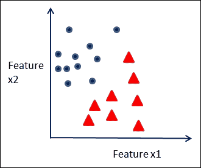

    线性可分数据

    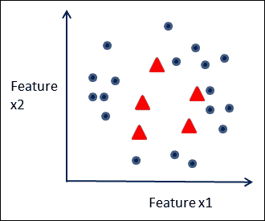

    不可线性分离的数据集示例。

    这类问题需要分类技术，如支持向量机。

*   **Unsupervised learning**: Understanding the data and exploring it for building machine learning models when the labels are not given is called unsupervised learning. Clustering, manifold learning, and outlier detection are techniques that are covered under this topic, which are dealt with in detail in Chapter 3, *Unsupervised Machine Learning Techniques*. Examples of problems that require unsupervised learning are many. Grouping customers according to their purchasing behavior is one example. In the case of biological data, tissues samples can be clustered based on similar gene expression values using unsupervised learning techniques.

    下图显示了具有固有结构的数据，使用无监督学习技术(如 k-means)可以将这些数据显示为不同的聚类:

    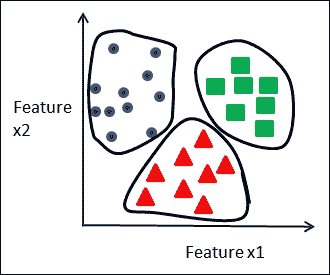

    数据中的聚类

    使用不同的技术来检测全局异常值(相对于整个数据集异常的示例)和局部异常值(与其邻域不匹配的示例)。在下图中，针对双要素数据集说明了局部异常值和全局异常值的概念:

    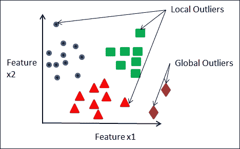

    局部和全局异常值

*   **半监督学习**:当数据集只有一些已标记的数据和大量未标记的数据时，从这样的数据集学习称为**半监督学习**。例如，当以检测欺诈为目标处理金融数据时，可能有大量未标记的数据，而只有少量已知的欺诈和非欺诈交易。在这种情况下，可以应用半监督学习。
*   **图挖掘**:挖掘以图结构表示的数据被称为**图挖掘**。它是不同生物信息学、web 挖掘和社区挖掘应用中的社会网络分析和结构分析的基础。
*   **概率图建模和推理**:学习和利用特征之间存在的条件依赖结构，表示为基于图的模型，属于**概率图建模**的分支。贝叶斯网络和马尔可夫随机场就是两类这样的模型。
*   **时间序列预测**:这是一种学习形式，其中数据具有独特的时间行为，并且与时间的关系被建模。一个常见的例子是在金融预测中，某个部门的股票表现可能是预测模型的目标。
*   **关联分析**:这是的一种学习形式，其中数据以项目集或购物篮的形式存在，并且关联规则被建模以探索和预测项目之间的关系。关联分析中的一个常见示例是了解顾客在逛杂货店时购买的最常见商品之间的关系。
*   **强化学习**:这是一种学习形式，机器根据从环境中收到的奖励或惩罚形式的反馈，学习最大化性能。最近一个著名的使用强化学习和其他技术的例子是 AlphaGo，由谷歌开发的机器在 2016 年 3 月决定性地击败了世界围棋冠军 Lee Sedol。使用奖励和惩罚方案，该模型首先在监督学习阶段对数百万个棋盘位置进行训练，然后在强化学习阶段自我发挥，最终变得足够好，以战胜最佳人类玩家。

    ### 注意

    T9[`www。大西洋。com/technology/archive/2016/03/the-invisible-opposite/475611/`](http://www.theatlantic.com/technology/archive/2016/03/the-invisible-opponent/475611/)

    [`gogameguru.com/i/2016/03/deepmind-mastering-go.pdf`](https://gogameguru.com/i/2016/03/deepmind-mastering-go.pdf)

*   **流学习或增量学习**:实时或伪实时从流数据中以有监督、无监督或半监督的方式学习称为流或增量学习。从不同类型的工业系统中学习传感器的行为以便分类为正常和异常是需要实时反馈和实时检测的应用。


# 机器学习中使用的数据集

为了从数据中学习，我们必须能够理解并管理所有形式的数据。数据来自许多不同的来源，因此，数据集在结构上可能差异很大，或者几乎没有或根本没有结构。在这一节中，我们将介绍数据集的高级分类以及常见的示例。

根据数据集的结构或缺乏结构，数据集可分为以下几类:

*   **结构化数据**:具有结构化数据的数据集更适合用作大多数机器学习算法的输入。数据是记录或行的形式，遵循众所周知的格式，其特征是表格中的列或由分隔符或标记分隔的字段。记录或实例之间没有明确的关系。数据集主要存在于平面文件或关系数据库中。下图所示的银行金融交易记录就是一个结构化数据的例子: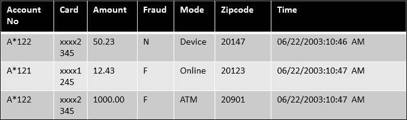

    带有欺诈标签的金融卡交易数据

*   **交易或市场数据**:这是一种特殊形式的结构化数据，其中每个条目对应一组项目。市场数据集的例子是不同客户购买的杂货物品或客户观看的电影的列表，如下表所示: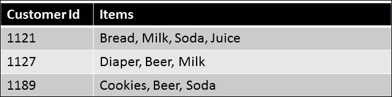

    从杂货店购买的商品的市场数据集

*   **Unstructured data** : Unstructured data is normally not available in well-known formats, unlike structured data. Text data, image, and video data are different formats of unstructured data. Usually, a transformation of some form is needed to extract features from these forms of data into a structured dataset so that traditional machine learn Ing algorithms can be applied.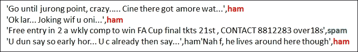

    The sample text data has no recognizable structure, so it is unstructured. Separating spam from normal mail is a binary classification problem. Here, true affirmation (spam) and true negation (ham) are distinguished by their tags, which are the second tag in each data instance. Spam SMS collection data set (UCI machine learning library), source: Tiago A. Almeida, Federal University of San Carlos.

*   **Sequential data**: Sequential data have an explicit notion of "order" to them. The order can be some relationship between features and a time variable in time series data, or it can be symbols repeating in some form in genomic datasets. Two examples of sequential data are weather data and genomic sequence data. The following figure shows the relationship between time and the sensor level for weather:

    来自传感器数据的时间序列

    考虑三个基因组序列以显示序列`CGGGT`和`TTGAAAGTGGTG`在所有三个基因组序列中的重复:

    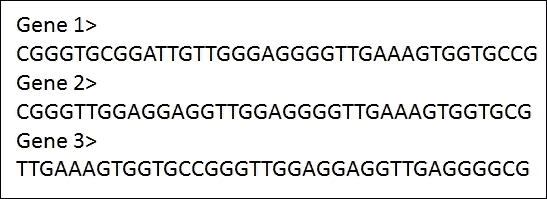

    作为符号序列的 DNA 基因组序列。

*   **图形数据**:图形数据的特点是数据中实体之间存在关系形成图形结构。图表数据集可以是结构化记录格式或非结构化格式。通常，必须从数据集中挖掘图形关系。保险领域的索赔可以被认为是结构化的记录，其中包含与索赔人通过地址、电话号码等相关的相关索赔细节。这可以在图形结构中查看。以万维网为例，我们有包含链接的非结构化数据的可用网页，以及可以使用 Web 链接构建的网页之间的关系图，产生了当今最广泛挖掘的一些图数据集: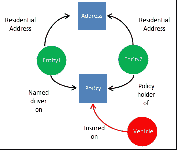

    保险索赔数据,转换成图形结构,显示车辆、司机、保单和地址之间的关系


# 机器学习应用

鉴于机器学习在人类努力的不同领域中的使用迅速增长，任何列出不同行业中使用某种形式的机器学习的典型应用的尝试必然是不完整的。然而，在本节中，我们按领域和所采用的学习类型列出了一组广泛的机器学习应用:

| 

领域/行业

 | 

应用程序

 | 

机器学习类型

 |
| --- | --- | --- |
| 金融的 | 信用风险评分、欺诈检测和反洗钱 | 监督、非监督、图形模型、时间序列和流学习 |
| 网 | 在线活动、健康监测和广告定位 | 有监督的，无监督的，半监督的 |
| 卫生保健 | 循证医学、流行病学监测、药物事件预测和索赔欺诈检测 | 监督、非监督、图形模型、时间序列和流学习 |
| **物联网** ( **物联网**) | 网络安全、智能道路和传感器健康监控 | 监督、非监督、半监督和流学习 |
| 环境 | 天气预报、污染建模和水质测量 | 时间序列、监督、非监督、半监督和流学习 |
| 零售 | 库存、客户管理和建议、布局和预测 | 时间序列、监督、非监督、半监督和流学习 |

> *机器学习的应用*


# 机器学习中的实际问题

在处理需要机器学习的问题时，有必要了解约束的性质和潜在的次优条件。对这些问题的性质、其存在的影响以及处理它们的方法的理解将在接下来的章节中的讨论中进行。在此，我们简要介绍一下我们面临的实际问题:

*   **数据质量和噪声**:缺失值、重复值、由于人为或仪器记录错误导致的不正确值以及不正确的格式是在建立机器学习模型时要考虑的一些重要问题。不解决数据质量问题会导致模型不正确或不完整。在下一章中，我们将强调其中的一些问题，以及通过数据清理来克服这些问题的一些策略。
*   **不平衡数据集**:在许多真实世界的数据集中，训练数据中的标签之间存在不平衡。数据集中的这种不平衡影响了学习的选择、选择算法的过程、模型评估和验证。如果没有采用正确的技术，模型可能会出现很大的偏差，并且学习是无效的。在接下来的几章中，我们将详细介绍使用元学习过程的各种技术，例如成本敏感学习、集成学习、异常值检测等等，这些技术都可以在这些情况下使用。
*   **数据量、速度和可扩展性**:通常，大量数据以原始形式或高速实时流数据的形式存在。从整个数据中学习变得不可行，这或者是由于算法固有的约束，或者是硬件限制，或者是它们的组合。为了减少数据集的大小以适应可用的资源，必须进行数据采样。采样有多种方式，每种采样方式都会引入偏差。针对样本偏差对模型进行验证必须采用各种技术，如分层抽样、改变样本大小和增加不同组的实验规模。使用大数据机器学习也可以克服体积和采样偏差。
*   **过拟合**:预测模型的一个核心问题是模型不够一般化，过于适合给定的训练数据*。这导致模型在应用于看不见的数据时表现不佳。在后面的章节中描述了各种技术来克服这些问题。*
*   ***维度的诅咒**:当处理高维数据，即具有大量特征的数据集时，机器学习算法的可扩展性成为一个严重的问题。向数据添加更多特征的一个问题是它引入了稀疏性，也就是说，现在平均每单位特征空间体积的数据点更少，除非特征数量的增加伴随着训练样本数量的指数增加。这可能会影响许多方法的性能，例如基于距离的算法。添加更多的功能也会降低学习者的预测能力，如下图所示。在这种情况下，需要更合适的算法，或者必须降低数据的维数。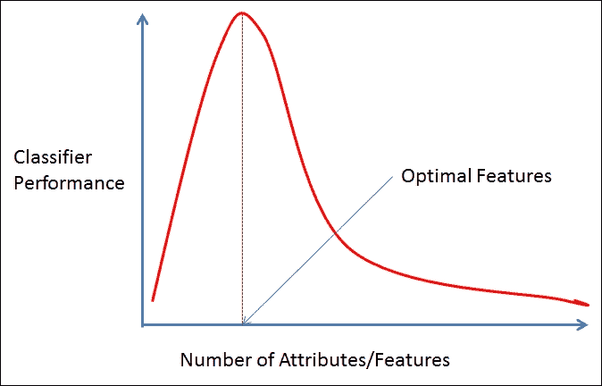分类学习中的维数灾难,增加更多的特征会降低分类器的性能*

*

# 机器学习——角色和流程

任何将机器学习应用于大型问题的努力都需要许多角色的协作，每个角色都遵循一套为严谨、高效和稳健而设计的系统流程。以下角色和流程确保从一开始就明确定义了工作目标，并在数据分析、数据采样、模型选择、部署和性能评估中采用了正确的方法，所有这些都是以一致且可重复的方式进行分析的综合框架的一部分。

## 角色

参与者在每个步骤中扮演特定的角色。这些职责包含在以下四个角色中:

*   **业务领域专家**:具有问题领域知识的主题事务专家
*   **数据工程师**:参与数据的收集、转换和清理
*   **项目经理**:过程顺利进行的监督者
*   **数据科学家或机器学习专家**:负责应用描述性或预测性分析技术

## 流程

**CRISP** ( **跨行业标准流程**)是一个众所周知的用于数据挖掘的高级流程模型，它定义了分析流程。在这一节中，我们为 CRISP 流程添加了一些我们自己的扩展，使其更加全面，更适合使用机器学习进行分析。下图展示了整个迭代过程。我们将在本节详细讨论该过程的每个步骤。

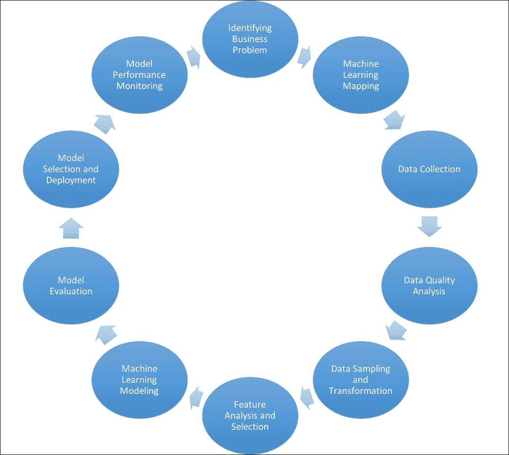

*   **识别业务问题**:理解项目或流程的目标和最终目标是第一步。这通常由业务领域专家与项目经理和机器学习专家共同完成。在数据可用性、格式、规范、收集、ROI、商业价值、可交付成果方面的最终目标是什么？所有这些问题都将在流程的这个阶段进行讨论。清楚地确定目标，并在可能的情况下用可量化的术语确定*，例如节省的金额、发现预定义数量的异常或聚类，或者预测不超过一定数量的误报，等等，这是此阶段的一个重要目标。*
*   **机器学习映射**:下一步是将业务问题映射到上一节讨论的一个或多个机器学习类型。这一步一般由机器学习专家来完成。在其中，我们决定我们是否应该只使用一种学习形式(例如，监督的、非监督的、半监督的)，或者多种形式的混合是否更适合这个项目。
*   **数据收集**:获取约定格式和规格的原始数据，然后进行处理。这一步通常由数据工程师执行，可能需要处理一些基本的 ETL 步骤。
*   **数据质量分析**:在这一步中，我们对数据进行缺失值、重复值等分析，对分类和连续类型进行基本的统计分析，以及类似的任务来评估数据的质量。数据工程师和数据科学家可以一起执行任务。
*   **数据采样和转换**:确定是否需要将数据划分成样本，并执行各种大小的数据采样，用于训练、验证或测试——这些是在该步骤中执行的任务。它包括采用不同的采样技术，例如训练数据集的过采样和随机采样，以便通过算法进行有效的学习，特别是当数据在标签中高度不平衡时。数据科学家参与了这项任务。
*   **特征分析和选择**:这是一个迭代过程，在许多任务中与建模相结合，以确保对特征的鉴别值或有效性进行分析。它可能涉及在建模过程之前查找新要素、转换现有要素、处理前面提到的数据质量问题、选择要素子集等等。数据科学家通常会被分配这项任务。
*   **机器学习建模**:这是一个基于数据特征和学习类型的不同算法的迭代过程。它涉及不同的步骤，例如生成假设、选择算法、调整参数，以及从评估中获得结果以找到满足标准的模型。数据科学家执行这项任务。
*   **模型评估**:虽然这一步在某种程度上与前面的所有步骤相关，但它与业务理解阶段和机器学习映射阶段的联系更加紧密。评估标准必须以某种方式映射到业务问题或目标。每个问题/项目都有自己的目标，无论是提高真阳性、减少假阳性、发现异常集群或行为，还是分析不同集群的数据。基于学习技术，使用不同的技术来隐式或显式地测量这些目标。数据科学家和业务领域专家通常会参与这一步。
*   **模型选择和部署**:根据评估标准，选择一个或多个模型——独立的或作为一个集合。模型的部署通常需要解决几个问题:运行时可伸缩性度量、环境的执行规范、审计信息等等。基于学习获取关键参数的审计信息是该流程的重要组成部分。它确保可以跟踪和比较模型性能，以检查模型的退化和老化。保存关键信息(如培训数据量、日期、数据质量分析等)与学习类型无关。监督学习可能涉及保存混淆矩阵、真阳性率、假阳性率、ROC 曲线下面积、精确度、召回率、错误率等等。无监督学习可能涉及聚类或离群值评估结果、聚类统计等。这是数据科学家和项目经理的领域。
*   **模型性能监控**:这个任务包括定期跟踪模型的性能，按照标准进行评估，比如真阳性率、假阳性率、性能速度、内存分配等等。必须测量这些度量相对于训练模型性能的连续评估之间的度量的偏差。随着时间的推移，偏差和偏差中的容差将给出重复该过程或重新调整模型的见解。数据科学家负责这一阶段。

从上图可以看出，整个过程是一个迭代过程。在部署了一个模型或一组模型之后，业务和环境因素可能会以影响解决方案性能的方式发生变化，这需要重新评估业务目标和成功标准。这又把我们带回到循环中。


# 机器学习——工具和数据集

掌握成功完成机器学习中任何规模或复杂程度的项目所必需的技术的一个可靠方法是，通过对广泛使用的数据集进行实验来熟悉可用的工具和框架，如下一章所示。下面列出了对最流行的 Java 框架的简短调查。后面的章节将包括您将使用以下工具进行的实验:

*   **RapidMiner** :领先的分析平台，RapidMiner 提供多种产品，包括 Studio，一个用于流程的可视化设计框架，一个通过共享数据源、流程、和实践来促进协作环境的产品，以及 Radoop，一个支持在 Hadoop 生态系统上部署和执行的翻译系统。RapidMiner Cloud 提供了基于云的存储库和按需计算能力。

    *   **许可** : GPL(社区版)和商业(企业版)
    *   **网站**:[`rapidminer.com/`](https://rapidminer.com/)

*   **Weka** :这是一个全面的开源 Java 工具集，用于数据挖掘和构建机器学习应用程序，拥有自己的公开可用数据集集合。

    *   **许可证** : GPL
    *   **网站**:[`www.cs.waikato.ac.nz/ml/weka/`](http://www.cs.waikato.ac.nz/ml/weka/)

*   **Knime** : KNIME(我们被敦促用不发音的 k 来发音，如“naime”)分析平台是用 Java 编写的，并提供一个集成的工具集、一组丰富的算法和一个可视化的工作流来进行分析，而不需要标准的编程语言，如 Java、Python 和 r。然而，人们可以用 Java 和其他语言编写脚本来实现 Knime 中本地不可用的功能。

    *   **许可证** : GNU GPL v3
    *   **网站**:[`www.knime.org/`](https://www.knime.org/)

*   这是一个用于 NLP 的 Java 库。它提供了文档分类、序列标记、主题建模和其他基于文本的机器学习应用，以及用于任务管道的 API。

    *   **许可证**:通用公共许可证版本 1.0 (CPL-1)
    *   **网站**:[`mallet.cs.umass.edu/`](http://mallet.cs.umass.edu/)

*   Elki:这款是一款面向研究的 Java 软件，主要致力于使用无监督的算法进行数据挖掘。它使用提高多维数据访问性能的数据索引结构来实现高性能和可伸缩性。

    *   **牌照** : AGPLv3
    *   **网站**:[`elki.dbs.ifi.lmu.de/`](http://elki.dbs.ifi.lmu.de/)

*   **JCLAL** :这是一个用于主动学习的 Java 类库，是一个用于开发主动学习方法的开源框架，是处理从有标签和无标签数据混合中学习预测模型的领域之一(半监督学习是另一个领域)。

    *   **许可证** : GNU 通用公共许可证版本 3.0 (GPLv3)
    *   **网站**:[`sourceforge.net/projects/jclal/`](https://sourceforge.net/projects/jclal/)

*   **KEEL** :这是一个用 Java 编写的开源软件，用于设计实验，主要是适合于实现基于进化学习和软计算的技术来解决数据挖掘问题。

    *   **牌照** : GPLv3
    *   **网站**:[`www.keel.es/`](http://www.keel.es/)

*   **DeepLearning4J** :这个是一个针对 Java 和 Scala 的分布式深度学习库。DeepLearning4J 集成了 Spark 和 Hadoop。异常检测和推荐系统是非常适合通过深度学习技术生成的模型的用例。

    *   **执照**:阿帕奇执照 2.0
    *   **网站**:[`deeplearning4j.org/`](http://deeplearning4j.org/)

*   **Spark-MLlib** :(包含在 Apache Spark 发行版中)MLlib 是 Spark 中包含的主要用 Scala 和 Java 编写的机器学习库。自从 Spark 中引入数据帧后，我们推荐使用写在数据帧之上的`spark.ml`包，而不是原来的`spark.mllib`包。MLlib 包括对分析过程所有阶段的支持，包括统计方法、分类和回归算法、聚类、降维、特征提取、模型评估和 PMML 支持等。MLlib 的另一个方面是支持使用管道或工作流。除了 Java 之外，还可以从 R、Scala 和 Python 访问 MLlib。

    *   **执照**:阿帕奇执照 v2.0
    *   **网站**:[`spark.apache.org/mllib/`](http://spark.apache.org/mllib/)

*   **H2O** : H2O 是一个基于 Java 的库，除了 Java 之外，还支持 R 和 Python 中的 API。H2O 也可以在 Spark 上运行自己的应用程序“苏打水”。H2O 流是一个基于网络的交互环境，在一个类似笔记本的文档中包含可执行单元和富媒体。

    *   **执照**:阿帕奇执照 v2.0
    *   **网站**:[`www.h2o.ai/`](http://www.h2o.ai/)

*   **MOA/SAMOA** :瞄准机器从数据流学习使用流处理平台的可插拔接口，在撰写本文时，SAMOA 是一个 Apache 孵化器项目。

    *   **执照**:阿帕奇执照 v2.0
    *   **网站**:[`samoa.incubator.apache.org/`](https://samoa.incubator.apache.org/)

*   **Neo4j** : Neo4j 是一个用 Java 和 Scala 实现的开源 NoSQL 图形数据库。正如我们将在后面的章节中看到的，图分析有各种各样的用例，包括配对、路由、社交网络、网络管理等等。Neo4j 支持完全 ACID 事务。

    *   **许可证**:社区版—GPLv3 和企业版—多种选择，包括商业和教育([`neo4j.com/licensing/`](https://neo4j.com/licensing/))
    *   **网站**:[`neo4j.com/`](https://neo4j.com/)

*   GraphX :这是包含在 Apache Spark 发行版中的。GraphX 是伴随 Spark 的图形库。该 API 广泛支持查看和操作图形结构，以及一些图形算法，如 PageRank、连接组件和三角形计数。

    *   **执照**:阿帕奇执照 v2.0
    *   **网站**:[`spark.apache.org/graphx/`](http://spark.apache.org/graphx/)

*   **OpenMarkov**:OpenMarkov 是编辑和评估**概率图形模型** ( **PGM** )的工具。它包括一个用于交互式学习的 GUI。

    *   **牌照**:EUP LV 1.1([`joinup.ec.europa.eu/community/eupl/og_page/eupl`](https://joinup.ec.europa.eu/community/eupl/og_page/eupl))
    *   **网站**:[`www.openmarkov.org/`](http://www.openmarkov.org/)

*   Smile 是 JVM 的一个机器学习平台，拥有大量的算法库。它的功能包括 NLP、流形学习、关联规则、遗传算法和一套通用的可视化工具。

    *   **执照**:阿帕奇执照 2.0
    *   **网站**:[`haifengl.github.io/smile/`](http://haifengl.github.io/smile/)

## 数据集

许多公开可用的数据集极大地帮助了数据科学的研究和学习。下一节中列出的几个方法是众所周知的，多年来被许多研究人员用来对他们的方法进行基准测试。新的数据集不断出现，为不同的建模者和用户群体提供服务。大多数是来自不同领域的真实世界数据集。本卷中的练习将使用该列表中的几个数据集。

*   **加州大学欧文分校(UCI)数据库**:由加州大学欧文分校的机器学习和智能系统中心维护，UCI 数据库是大约 350 个不同大小的数据集的目录，从十几个到四千多万个记录和多达三百万个属性，混合了多元文本、时间序列和其他数据类型。([`archive.ics.uci.edu/ml/index.html`](https://archive.ics.uci.edu/ml/index.html))
*   **Tunedit**:(【http://tunedit.org/】T2)这为 Tunedit 提供了挑战和工具来进行可重复的数据挖掘实验。它还提供了一个举办数据竞赛的平台。
*   **Mldata.org**:([`mldata.org/`](http://mldata.org/))由 PASCAL 2 组织支持，该组织汇集了欧洲和世界各地的研究人员和学生，mldata.org 主要是一个用户贡献数据集的存储库，鼓励研究人员群体之间共享数据和解决方案，以帮助实现创建可复制解决方案的目标。
*   **KDD 挑战赛数据集**:([`www.kdnuggets.com/datasets/index.html`](http://www.kdnuggets.com/datasets/index.html))KD nuggets 聚集了多个数据集存储库，跨越了各种各样的领域。
*   **ka ggle**:ka ggle 号称数据科学的*之家，是数据科学竞赛的领先平台，也是过去竞赛数据集和用户提交数据集的存储库。*


# 总结

尽管机器学习是一个相对年轻的领域，但它已经取得了令人印象深刻的成功。随着 Java 资源的无处不在、Java 的平台独立性以及 Java 中 ML 框架的选择，使用 Java 进行机器学习的高超技能在当今市场上是非常受欢迎的资产。

机器学习已经以某种形式存在了很长时间——如果只是在思想家的想象中，在开始的时候。然而，最近的发展对我们日常生活的许多领域产生了根本性的影响。机器学习与统计学、人工智能和其他几个相关领域有许多共同之处。尽管一些数据管理、商业智能和知识表示系统也可能在它们中的每一个中与数据的中心角色相关，但是它们通常不与机器学习领域中体现的从数据学习的原则相关联。

任何关于机器学习的讨论都会假设理解什么是数据，以及我们关心的是什么数据类型。它们是绝对的、连续的还是有序的？有哪些数据特征？目标是什么，哪些是预测指标？可以使用哪种抽样方法——均匀随机、分层随机、整群或系统抽样？型号是什么？我们看到了一个包含 ARFF 格式的分类和连续要素的天气数据集示例。

机器学习的类型包括监督学习，当有标签数据时最常见，当没有标签数据时无监督，当两者混合时半监督。接下来的章节将详细介绍这些，以及图挖掘、概率图建模、深度学习、流学习和大数据学习。

数据有多种形式:结构化、非结构化、事务性、顺序性和图表。我们将在本书后面的练习中使用不同结构的数据。

领域和不同种类的机器学习应用程序的列表不断增长。这篇综述介绍了最活跃的领域和应用。

理解并有效处理实际问题，如噪音数据、倾斜数据集、过度拟合、数据量和维数灾难，是项目成功的关键，也是每个项目面临独特挑战的原因。

使用机器学习进行分析是一项协作工作，涉及多个角色和明确定义的流程。为了获得一致且可重复的结果，采用本文概述的增强型 CRISP 方法至关重要—从了解业务问题到数据质量分析、建模和模型评估，最后到模型性能监控。

数据科学的从业者有幸拥有丰富且不断增长的公众可用数据集目录，以及越来越多的 Java 和其他语言的 ML 框架和工具。在接下来的章节中，你将被介绍几个数据集、API 和框架，以及先进的概念和技术，使你具备掌握机器学习所需的一切。

准备好了吗？向前冲。***