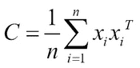
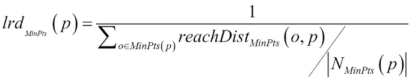
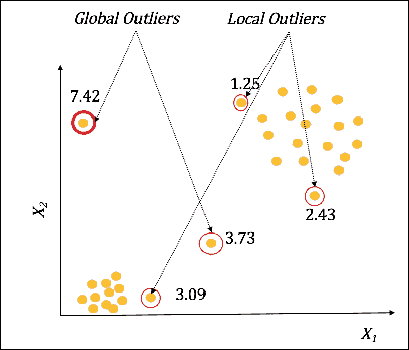

# 三、无监督机器学习技术

在上一章中，我们重点介绍了监督学习，即从已标记的训练数据集进行学习。在现实世界中，获取带有标签的数据通常很困难。在许多领域中，实际上不可能标记数据，要么是因为标记的成本，要么是因为数据生成的巨大数量或速度而难以标记。在这些情况下，各种形式的无监督学习提供了探索、可视化和执行描述性和预测性建模的正确方法。在许多应用中，无监督学习通常与监督学习相结合，作为分离感兴趣的数据元素以进行标注的第一步。

在这一章中，我们将关注各种实用的、非常适合无监督学习的方法、技术和算法。我们首先注意到在处理数据和转换时，监督学习和非监督学习之间的共同问题。然后，我们将简要介绍在无监督学习中面临的特殊挑战，由于缺乏“基础真理”和在这些条件下学习的性质。

然后，我们将讨论应用于未标记数据集的特征分析和降维技术。接下来是对广泛的聚类方法的介绍和对实际使用中各种算法的讨论，就像我们在第二章*中对监督学习所做的那样，展示了每种算法如何工作，何时使用，以及它的优点和局限性。我们将通过介绍不同的集群评估技术来结束集群部分。*

在聚类处理之后，我们将探讨离群点检测这一主题。我们将对比各种不同的技术和算法，这些技术和算法说明了在给定的数据集中是什么使得一些对象成为离群值——也称为异常。

本章将以聚类和异常值检测实验结束，这些实验是用真实世界的数据集进行的，并对获得的结果进行了分析。在本案例研究中，我们将使用 ELKI 和 SMILE Java 库来完成机器学习任务，并将展示代码和实验结果。我们希望这能让读者感受到这些工具的强大功能和易用性。

# 监督学习的共同问题

我们讨论的许多与监督学习相关的问题在无监督学习中也很常见。下面列出了其中一些:

*   **算法处理的特征类型**:大多数聚类和离群点算法需要数字表示才能有效工作。转换分类或顺序数据必须小心进行
*   **维数灾难**:拥有大量特征会导致空间稀疏，影响聚类算法的性能。必须选择一些选项来适当地降低维度——或者是仅保留最相关特征的子集的特征选择，或者是将特征空间转换成较低维度空间的一组新的主要变量的特征提取
*   **内存和训练时间的可扩展性**:由于内存或训练时间的限制，许多无监督学习算法无法扩展到几千个以上的实例
*   **数据中的异常值和噪声**:许多算法受到特征中的噪声、异常数据的存在或缺失值的影响。它们需要被适当地转换和处理


# 无监督学习特有的问题

以下是关于无监督学习技术的一些问题:

*   **参数设置**:决定特征的数量、特征的有用性、聚类的数量、聚类的形状等等，对某些无监督的方法提出了巨大的挑战
*   **评估方法**:由于缺乏基本事实，无监督学习方法是不适定的，因此对算法的评估变得非常主观。
*   **硬标签或软标签**:许多无监督学习问题需要以排他或概率的方式给数据加上标签。这给许多算法带来了问题
*   **结果和模型的可解释性**:与监督学习不同，基础事实的缺乏和一些算法的性质使得解释来自模型和标签的结果更加困难


# 特征分析和降维

在中，首先要掌握的工具是不同的特征分析和维度缩减技术。如同在监督学习中一样，降维的需要源于许多类似于前面讨论的特征选择和降维的原因。

较少的区分维度使得数据和聚类的可视化更加容易。在许多应用中，无监督的降维技术用于压缩，然后可以用于数据的传输或存储。当较大的数据有开销时，这尤其有用。此外，应用降维技术可以提高许多算法在内存和计算速度方面的可伸缩性。

## 符号

我们将使用类似于章节中关于监督学习的符号。这些示例以*维*维表示，并表示为矢量:

**x**=*(x**1**，x* *[2]* *，…x**[d]**)**^T*

包含 *n* 个示例的整个数据集可以表示为一个观察矩阵:


降维的思想是通过输入特征的变换、投影或组合来找到 k ≤ *d* 特征，使得较低维度的 *k* 捕获或保留原始数据集的有趣属性。

## 线性方法

线性维度方法是一些最古老的统计技术，用于减少特征或将数据转换到更低的维度，保留有趣的区分属性。

在数学上，我们使用线性方法执行转换，从而使用原始数据元素的线性转换创建新的数据元素:


**s = Wx**

这里， **W** [k × d] 是线性变换矩阵。变量 **s** 也被称为潜变量或隐藏变量。

在本主题中，我们将讨论两种最实用和最常用的方法。我们将列出这些技术的一些变体，以便读者可以使用这些工具进行实验。这里的主要假设——通常形成限制——是转换之间的线性关系。

### 主成分分析

PCA 是一种广泛使用的降维技术(*参考文献* 1】)。将原始坐标系旋转到新的坐标系，该坐标系利用数据中最大方差的方向，从而在低维子空间中产生不相关的变量，而这些变量在原始特征空间中是相关的。PCA 对特征的缩放很敏感。

#### 输入和输出

PCA 通常对数值数据集有效。许多工具为名义特征提供了分类到连续的转换，但这会影响性能。主成分的数量，或 *k* ，也是由用户提供的输入。

#### 它是如何工作的？

PCA 最基本的形式是试图找到数据在新轴上的投影，这被称为主成分 ??。主组件是从原始空间捕捉最大方差方向的投影。简而言之，PCA 通过在最大方差的方向上旋转数据的原始轴来找到第一主分量。该技术通过再次确定与第一个轴正交的下一个最佳轴，通过寻找第二高的方差等等，直到捕捉到大多数方差，来找到下一个主分量。一般来说，大多数工具要么选择主成分的数量，要么选择继续寻找成分，直到捕获到原始数据集中的某个百分比(例如 99%)的方差。

数学上，寻找最大方差的目标可以写成


*λ*v=**Cv**是本征分解

这相当于:


这里， **W** 是主成分， **S** 是输入数据的新变换。通常，在计算部分使用特征值分解或奇异值分解。


图 1:主成分分析

#### 优点和局限性

*   PCA 的一个优点是它是最优的，因为它最小化了数据的重构误差。
*   主成分分析假设正态分布。
*   对于具有高维度的大型数据集，方差-协方差矩阵的计算会变得很密集。或者，可以使用**奇异值分解** ( **SVD** )，因为它迭代地工作，并且不需要显式协方差矩阵。
*   当数据中有噪声时，PCA 有问题。
*   当数据位于复杂流形中时，PCA 失败，这是我们将在非线性降维部分讨论的主题。
*   PCA 假设特征之间的相关性，并且在没有这些相关性的情况下，它不能进行任何变换；相反，它只是对它们进行排名。
*   通过将原始特征空间转换成一组新的变量，PCA 导致数据可解释性的损失。
*   主成分分析还有许多其他受欢迎的变体，它们克服了主成分分析的一些偏见和假设。

**独立成分分析** ( **ICA** )假设源中存在非高斯的混合物，并使用生成技术，试图在更小的混合物或成分中找到原始数据的分解(*参考文献*【2】)。主成分分析和独立成分分析的主要区别在于，主成分分析创建的是不相关的成分，而独立成分分析创建的是独立的成分。

数学上，它假设是独立源∈ 的混合，这样每个数据元素*y*=*y**¹**，y**²**，…。y**^k***^T*而独立性是由![Advantages and limitations 所暗示的:****概率主成分分析** ( **PPCA** )基于使用混合模型寻找成分和使用**期望最大化** ( **EM** ) ( *参考文献*【3】)的最大似然公式。它克服了 PCA 面临的缺失数据和离群点影响的问题。*### *随机投影(RP)**当数据可以大幅度分离时——即使是高维数据——可以将数据随机投影到低维的空间，而不会影响可分离性，并且可以用相对少量的数据实现良好的泛化。随机投影使用这种技术，细节如下所述(*参考文献*【4】)。*#### *输入和输出**随机投影适用于数字和分类特征，但分类特征被转换为二进制。输出是输入数据元素的低维表示。投影的尺寸数量， *k* ，是用户定义输入的一部分。*#### *它是如何工作的？**这种技术使用随机投影矩阵将输入数据投影到低维空间。原始数据被转换到低维空间，其中*k<p*使用:*

**

*这里， *k* x *d* 矩阵 **R** 中的列是独立同分布的零均值正态变量，并且被缩放到单位长度。使用概率抽样构建随机矩阵 **R** 有多种方式。RP 的计算复杂度为 *O(knd)* ，比 PCA 的伸缩性好很多。在许多实际的数据集中，RP 给出了与 PCA 相当的结果，并且可以扩展到大的维度和数据集。*

#### *优点和局限性*

*   *它将扩展到数据集大小和维度的非常大的值。在大规模的文本和图像学习问题中，这种技术已经被成功地用作预处理技术。*
*   *使用 RP 时，有时会发生大量信息丢失。*

### *多维标度(MDS)*

*MDS 有很多种形式——古典的、公制的和非公制的。MDS 的主要思想是保持成对的相似性/距离值。它通常包括将高维数据转换成二维或三维数据(*参考文献* [5])。*

#### *输入和输出*

*MDS 可以根据用户选择的距离函数对数字和分类数据进行处理。要转换的维数， *k* ，是用户定义的输入。*

#### *它是如何工作的？*

*给定 *n* 数据元素，计算 *n* x *n* 相似度或距离矩阵。可以选择使用距离，如欧几里德距离、马氏距离，或相似性概念，如余弦相似性、Jaccard 系数等。MDS 在其非常基本的形式中试图找到距离矩阵在低维空间中的映射，其中变换点之间的欧几里得距离类似于亲和矩阵。*

*数学上:*

**

*这里的输入空间和映射空间。*

*如果使用核来变换输入亲和空间，那么 MDS 就成为降维的非线性方法。当输入空间中的点之间的距离是欧几里德距离时，经典 MDS 等价于 PCA。*

#### *优点和局限性*

*   *关键的缺点是解释高维数据所需的较低维度的主观选择，通常人类只限于两个或三个维度。一些数据在这个低维空间中可能不能有效地映射。*
*   *优点是您可以使用框架对最低维度执行线性和非线性映射。*

## *非线性方法*

*一般而言，非线性维度缩减涉及对 KPCA 等线性方法中的计算执行非线性变换，或者在流形学习中寻找较低维度中的非线性关系。在一些领域和数据集中，低维数据的结构是非线性的——这就是 KPCA 等技术有效的地方——而在一些领域，数据在低维中不会展开，你需要多方面的学习。*

### *核主成分分析(KPCA)*

*内核 PCA 使用在第二章、*现实世界监督学习的实用方法*中描述的内核技巧，使用 PCA 算法在高维空间中转换数据以找到有效的映射(*参考文献*【6】)。*

#### *输入和输出*

*类似于 PCA，但增加了对内核和内核参数的选择。例如，如果选择了**径向基函数** ( **RBF** )或高斯核，那么核连同伽马参数成为用户选择的值。*

#### *它是如何工作的？*

*与前一章讨论的**支持向量机** ( **SVM** )的方式相同，KPCA 使用“核技巧”将输入空间转换到高维特征空间。寻找最大方差的整个 PCA 机制然后在变换的空间中执行。*

*如五氯苯甲醚:*

****

*代替线性协方差矩阵，通过构造 *N* x *N* 矩阵，使用核方法将非线性变换应用于输入空间，而不是使用 *ϕ* *(x)* 进行实际变换。*

**k(x，y)=(***(x)，***(y)=****

**由于核变换实际上并没有将特征变换到显式特征空间，因此找到的主成分可以被解释为数据在成分上的投影。在下图中，使用圆上的 scikit-learn 示例生成的二元非线性数据集(*参考文献* [27])展示了使用 RBF 核进行 KPCA 后的线性分离，并通过逆变换返回到几乎相似的输入空间:**

**

图 2:圆形数据集上的 KPCA 和逆变换。** 

#### **优点和局限性**

*   **KPCA 克服了 PCA 提出的非线性映射。**
*   **KPCA 有与标准 PCA 相似的异常值、噪声和缺失值问题。有强大的方法和变化来克服这一点。**
*   **由于核矩阵的增加，KPCA 在空间上存在可扩展性问题，这可能成为高维大数据集的瓶颈。在这些情况下，可以使用 SVD 作为替代方案。**

### **流形学习**

**当高维数据嵌入到较低的维中，这些维是非线性的，但是具有复杂的结构，流形学习是非常有效的。**

#### **输入和输出**

**流形学习算法需要两个用户提供的参数: *k* ，代表初始搜索的邻居数量， *n* ，流形坐标的数量。**

#### **它是如何工作的？**

**如下图所示，使用 scikit-learn 实用程序绘制的三维 S 曲线(*参考文献* [27])在 2D PCA 中表示，在 2D 流形中使用 LLE 表示。有趣的是，当使用 LLE 的流形学习表示清楚地分离颜色时，观察蓝色、绿色和红色点如何在 PCA 表示中混合。还可以观察到，欧几里德距离的等级排序在流形表示中没有保持:**

**

图 PCA 和流形学习后的数据表示** 

**为了保留结构，将保留测地线距离而不是欧几里德距离。一般的方法是构建一个图结构，如邻接矩阵，然后使用不同的假设计算测地线距离。在 Isomap 算法中，全局成对距离被保留(*引用* [7])。在**局部线性嵌入** ( **LLE** )算法中，进行映射是为了照顾局部邻域，即附近的点映射到变换中的附近点(*引用*【9】)。拉普拉斯特征映射类似于 LLE，除了它试图通过使用图拉普拉斯来保持 LLE 的“局部性”而不是“局部线性”(*参考文献*【8】)。**

#### **优点和局限性**

*   **Isomap 是非参数的；它保留了全局结构，没有局部最优，但受到速度的阻碍。**
*   **LLE 和拉普拉斯特征映射是非参数的，没有局部最优，速度很快，但是不能保持全局结构。**

**

# 聚类

聚类算法可以根据技术、输出、过程和其他考虑因素以不同的方式分类。在本主题中，我们将介绍一些最广泛使用的聚类算法。

## 聚类算法

现在有一套丰富的集群技术被广泛应用。本节介绍了其中的一些，解释了它们是如何工作的，它们可以用于什么类型的数据，以及它们的优缺点。这些算法包括基于原型、基于密度、基于概率划分、基于层次、基于图论和基于神经网络的算法。

### k-Means

k-means 是一种基于质心或原型的迭代算法，采用分区和重定位方法(*参考文献* [10])。k-means 根据使用的距离度量来查找球形聚类，就像欧几里德距离的情况一样。

#### 输入和输出

k-means 可以处理大多数数字特征。许多工具为数值转换提供了分类,但是在计算中使用大量的分类会导致非最优的聚类。用户定义的 *k* 、待发现的聚类数量以及用于计算接近度的距离度量是两个基本输入。k-means 生成聚类，将数据关联到每个聚类，并将聚类的质心作为输出。

#### 它是如何工作的？

最常见的变体称为劳埃德算法，通过从数据集中随机选取数据元素来初始化给定数据集的 *k* 质心。它使用某种距离度量(如欧几里德距离)将每个数据元素分配给它最接近的质心。然后，它计算每个聚类的数据点的平均值以形成新的质心，并且重复该过程，直到达到最大迭代次数或者质心没有变化。

从数学上讲，聚类的每一步都可以看作是一个优化步骤，其中要优化的等式由下式给出:


这里，ci 是属于簇 *i* 的所有点。最小化问题被归类为 NP-hard，因此 k-Means 有陷入局部最优的趋势。

#### 优点和局限性

*   集群的数量、 *k* 的选择很难，但是通常搜索技术，例如针对不同的值改变 *k* ，以及测量度量，例如误差平方和，可以用来找到一个好的阈值。对于较小的数据集，可以尝试分层 k-Means。
*   k-means 可以比大多数算法更快地收敛于更小的值 *k* ，并且可以找到有效的全局聚类。
*   k-means 收敛会受到质心初始化的影响，因此有许多变体可以用不同的种子等执行随机重启。
*   当存在异常值和噪声数据点时，k-means 可能表现不佳。使用稳健的技术，如中位数而不是均值，k-Medoids，在一定程度上克服了这一点。
*   当它们具有任意形状或具有不同密度时，k-means 不会找到有效的聚类。

### 数据库扫描

基于密度的带噪声的应用空间聚类(DBSCAN)是一种基于密度的分区算法。它将空间中的密集区域与稀疏区域分开(*参考*【14】)。

#### 输入和输出

DBSCAN 中仅使用数字特征。用户自定义的参数是 *MinPts* 和 *ϵ* 给出的邻域因子。

#### 它是如何工作的？

算法首先求出每个点 *p* 的ϵ-neighborhood，由给出。*高密度*区域被识别为ϵ-neighborhood 中的点数大于或等于给定的 *MinPts* 的区域；这种ϵ-neighborhood 被定义的点被称为核心点。一个*核心点*的ϵ-neighborhood 内的点被称为*可直接到达*。通过从一个可直接到达的核心点跳跃到从第二个点可直接到达的另一个点*而实际上可到达的所有*核心点*被认为是在同一个集群中。此外，在其*ϵ*-邻域中具有少于 *MinPts* 的任意点，但是从核心点可直接到达的，属于与核心点相同的聚类。这些在群集边缘的点被称为*边界点*。*噪声点*是既不是核心点也不是边界点的任何点。*

#### 优点和局限性

*   DBSCAN 算法不需要指定簇的数量，可以从数据中自动找到。
*   DBSCAN 可以找到各种形状和大小的星团。
*   DBSCAN 对噪声具有内在的鲁棒性，可以从数据集中发现异常值。
*   DBSCAN 在识别点方面不是完全确定的，其边界或核心分类取决于处理数据的顺序。
*   由于维度的诅咒，选择的距离度量(如欧几里德距离)通常会影响性能。
*   当存在密度变化很大的簇时， *{MinPts，***}*的静态选择会造成很大的限制。*

### *均值漂移*

*均值偏移是许多基于图像、视频和运动检测的数据集中非常有效的聚类算法(*参考文献*【11】)。*

#### *输入和输出*

*在均值偏移算法中，仅接受数字特征作为数据输入。内核的选择和内核的带宽是影响性能的用户驱动的选择。均值漂移生成数据点的模式，并围绕这些模式对数据进行聚类。*

#### *它是如何工作的？*

*均值偏移基于**核密度估计** ( **KDE** )的统计概念，其中是一种从样本中估计底层数据分布的概率方法。*

*给定带宽 *h* 的内核 *K* ( **x** )的内核密度估计由下式给出:*

**

*对于维度为 *d* 的 *n* 个点。均值漂移算法通过在局部增加密度的方向上移动每个数据点来工作。为了估计该方向，将梯度应用于 KDE，并且梯度采用以下形式:*

****

*这里 g(**x**)=–K’(**x**)是核的导数。向量 m( **x** )被称为均值偏移向量，用于在方向上移动点*

***x**^((t+1))=**x**^t+m(**x***

*同样，当密度函数的梯度为零时，保证收敛。结束于相似位置的点被标记为属于同一区域的聚类。*

#### *优点和局限性*

*   *均值漂移是非参数的，并且对数据分布不做任何潜在假设。*
*   *它可以发现不同形状和大小的不复杂的星团。*
*   *不需要明确给出集群的数量；在估计中使用的带宽参数的选择隐含地控制了聚类。*
*   *均值漂移对于给定的带宽参数没有局部最优，因此它是确定性的。*
*   *由于 KDE 效应，均值漂移对异常值和噪声点具有很强的鲁棒性。*
*   *均值漂移算法计算速度慢，并且不能很好地适应大型数据集。*
*   *带宽选择应该是明智的；否则，它会导致合并模式，或额外的，浅模式的出现。*

### *期望最大化(EM)或高斯混合建模(GMM)*

*GMM 或 EM 是一种基于概率划分的方法，它使用基于概率分布的技术将数据划分为 *k* 簇(*引用*【13】)。*

#### *输入和输出*

*在新兴市场/GMM 中只允许使用数字特征。模型参数是混合物组分的数量，由 *k* 给出。*

#### *它是如何工作的？*

*GMM 是一种生成方法，假设有 *k* 个高斯分量，每个高斯分量有一个均值[i] 和协方差ʃ[I]。以下表达式表示给定 *k* 高斯分量的数据集的概率:*

******

*为每个 *k* 高斯分量寻找平均值{ [1] 、[2] 、… [k] }使得分配给每个分量的数据点最大化该分量的概率的两步任务是使用**期望最大化** ( **EM** )过程完成的。*

*迭代过程可以被定义为 E-step，它在迭代 *i* 中为该聚类的所有数据点计算*预期*聚类:*

**

*给定属于聚类的数据点，M 步最大化计算 t+1:*

**

*EM 过程可以导致 GMM 收敛到局部最优。*

#### *优点和局限性*

*   *适用于任何功能；对于分类数据，计算离散概率，而对于数值，估计连续概率函数。*
*   *它有计算的可扩展性问题。这会导致局部最优。*
*   *类似于 k-Means，k 高斯的值必须先验地给定*。**

### **层次聚类**

**分层聚类是一种基于连通性的聚类方法，它被广泛用于分析和探索数据，而不是用作聚类技术(*参考文献* 12】)。想法是从顶部或底部迭代地构建二叉树，使得相似的点被分组在一起。树的每一层都提供了有趣的数据摘要。**

#### **输入和输出**

**分层聚类通常基于相似性- 进行转换，因此分类数据和连续数据均可接受。层次聚类只需要相似性或距离度量来计算相似性，而不需要像 k-means 或 GMM 那样需要聚类的数目。**

#### **它是如何工作的？**

**层次聚类有许多变体，但是我们将讨论聚集聚类。聚集聚类的工作原理是首先将所有数据元素放入它们自己的组中。然后，它基于所使用的相似性度量迭代地合并这些组，直到存在单个组。树或分组的每一层都提供了数据的独特分割，由分析师选择适合问题域的正确层。凝聚聚类通常使用树状图来可视化，树状图显示了相似数据点的合并。常用的相似性方法有:**

*   ****单联动**:相似度是各组点之间的最小距离:**
*   ****平均连锁度**:各组点之间的平均相似度:**

#### **优点和局限性**

*   **分层聚类将分层结构强加到数据上，即使可能不存在这样的结构。**
*   **相似性度量的选择会导致一组非常不同的合并和树状图，因此它对用户输入有很大的依赖性。**
*   **随着数据点的增加，分层聚类的可扩展性受到影响。根据使用的距离度量，它可能对噪声和异常值很敏感。**

### **自组织地图(SOM)**

**SOM 是一种基于神经网络的方法，可以被视为降维、流形学习或聚类技术(*参考文献*【17】)。神经生物学研究表明，我们的大脑将不同的功能映射到不同的区域，称为地形图，这构成了这项技术的基础。**

#### **输入和输出**

**SOM 中仅使用数字特征。模型参数由距离函数(通常使用欧几里德距离)和以宽度和高度或网格中单元数量表示的网格参数组成。**

#### **它是如何工作的？**

**SOM，也称为 Kohonen 网络，可以被认为是一个双层神经网络，其中每个输出层是一个二维网格，以行和列的形式排列，每个神经元都完全连接到输入层。**

**像神经网络一样，权重最初是使用随机值生成的。该流程有三个不同的培训阶段:**

*   ****竞争阶段**:该阶段的神经元基于判别值进行竞争，一般基于神经元权重与输入向量之间的距离；使得两者之间的最小距离决定了输入被分配给哪个神经元。使用欧几里德距离，输入 *x* i 和网格位置(j，I)】中的神经元之间的距离由*w*[Ji]:给出**
*   ****Cooperation phase**: In this phase, the winning neurons find the best spatial location in the topological neighborhood. The topological neighborhood for the winning neuron *I*(**x**) for a given neuron *(j, i)*, at a distance *S*[ij], neighborhood of size σ, is defined by:

    使用一些众所周知的衰减函数，例如指数函数，以随时间减小的方式定义邻域大小，定义如下:

    **
*   ****Adaptive phase**: In this phase, the weights of the winning neuron and its neighborhood neurons are updated. The update to weights is generally done using:

    这里，学习率 *n(t)* 再次被定义为像邻域大小一样的指数衰减。** 

**使用统一距离矩阵(U-Matrix)的 SOM 可视化创建了神经元与其邻居的权重之间的平均距离的单一度量，然后可以用不同的颜色强度来可视化。这有助于识别邻近的*相似的*神经元。**

#### **优点和局限性**

*   **SOM 最大的优势是易于理解，使用 U 矩阵可视化对二维数据进行聚类能够非常有效地理解模式。**
*   **相似性/距离函数的选择对聚类有很大影响，用户必须仔细选择。**
*   **SOM 的计算复杂性使得它不可能用于大于几千大小的数据集。**

## **谱聚类**

**谱聚类是一种基于划分的聚类技术，使用图论作为其基础(*参考文献*【15】)。它将数据集转换成一个连通图，并进行图划分以找到聚类。这是图像处理、运动检测和一些基于非结构化数据的领域中的一种流行方法。**

#### **输入和输出**

**谱聚类中仅使用数字特征。为了获得最佳性能，必须正确定义模型参数，如选择内核、内核参数、要选择的特征值数量以及 k-Means 等分区算法。**

#### **它是如何工作的？**

**以下步骤描述了如何在实践中使用该技术:**

1.  **给定数据点，使用诸如高斯核的平滑核函数计算相似性(或邻接性)矩阵:对于较近的点，和较远的点，**
2.  **The next step is to compute the graph Laplacian matrix using various methods of normalizations. All Laplacian matrix methods use the diagonal degree matrix *D*, which measures degree at each node in the graph:

    一个简单的拉普拉斯矩阵是 *L = D(度矩阵)–A(亲和矩阵)*。** 
3.  **从特征值问题或广义特征值问题计算前 *k* 个特征值。**
4.  **使用诸如 k-Means 之类的划分算法来进一步分离 k 维子空间中的聚类。**

#### **优点和局限性**

*   **当簇形状或大小不规则且不凸时，谱聚类非常有效。谱聚类有太多的参数选择，调整以获得好的结果是一项相当复杂的任务。**
*   **理论上，谱聚类已经被证明在存在噪声数据的情况下更加稳定。当聚类没有很好地分开时，谱聚类具有良好的性能。**

## **亲和繁殖**

**相似性传播可以被视为 K-medoids 方法的扩展，因为它与从数据中挑选样本的相似性(*参考文献*【16】)。相似性传播使用具有距离或相似性矩阵的图，并挑选训练数据中的所有示例作为样本。作为数据点之间的*相似性*的迭代消息传递自动检测集群、样本，甚至数量的集群。**

#### **输入和输出**

**通常，除了最大迭代次数之外，不需要输入参数，这对于大多数算法来说是常见的。**

#### **它是如何工作的？**

**两种类型的消息在数据点之间交换，我们将首先解释:**

*   **Responsibility *r(i,k)*: This is a message from the data point to the candidate exemplar. This gives a metric of how well the exemplar is suited for that data point compared to other exemplars. The rules for updating the responsibility are as follows:  where *s(i, k)* = similarity between two data points *i* and *k*.

    *a(i，k)* =样本 *k* 对于 *i* 的可用性。** 
*   **可用性 *a(i，k)* :这是从候选样本到数据点的消息。考虑到计算中的其他数据点，这给出了指示样本对数据点的支持有多好的度量。这可以被视为软集群分配。可用性更新规则如下:

    图 4:相似性传播中使用的消息类型** 

**该算法可以总结如下:**

1.  **初始化**
2.  **对于所有增量 *i* 到*n*:**
3.  **结束。**
4.  **对于所有的 **x** [i] 使得 *(r(i，i) + a(i，I)>0)*

    1.  **x**[I]为典范。
    2.  使用相似性度量 *s(i，j)* 将所有非样本 **x** [j] 分配给最接近的样本。** 
5.  **结束。**

#### **优点和局限性**

*   **亲和度传播是一种确定性算法。k-means 或 K-medoids 对初始点的选择都很敏感，通过将每个点视为样本来克服这个问题。**
*   **不必指定聚类的数量，而是通过该过程自动确定。**
*   **它在非度量空间中工作，甚至不需要距离/相似性来具有约束性的属性，如三角形不等式或对称性。这使得该算法可用于各种具有分类和文本数据等的数据集:**
*   **该算法由于其更新方式易于并行化，且训练时间快。**

## **聚类验证和评估**

**聚类验证和评估是确定算法有效性的最重要机制之一(*参考文献* [18】)。这些主题可以大致分为两类:**

*   ****内部评估措施**:在这种情况下，这些措施使用某种形式的聚类数据本身的质量，而不涉及任何基础事实。**
*   ****外部评估措施**:在这种情况下，这些措施使用一些外部信息，如已知的基本事实或类别标签。**

### **内部评估措施**

**内部评估仅使用集群和数据信息来收集关于集群结果好坏的指标。应用程序可能会对度量的选择产生一些影响。一些算法偏向于特定的评估指标。因此，在选择正确的指标、算法和参数时，必须基于这些考虑因素。内部评估措施基于不同的质量，如下所述:**

*   ****紧密度**:使用不同策略测量的聚类的方差用于给出紧密度值；方差越低，聚类越紧密。**
*   ****分离**:星团之间的分离程度如何？**

#### **符号**

**下面是对下面使用的符号的简明解释:具有所有数据元素的数据集= *D* ，数据元素的数量= *n* ，每个数据元素的维度或特征=*D*，整个数据的中心 *D = c* ，聚类的数量= *NC* ，*I*thcluster =*C*I 数据个数在第*I*第簇=*n*I 中，*I*第簇=*C*I，方差在第*I*第簇=σ(*C*C[I]，两点间距离**

#### **R 平方**

**目标是使用聚类之间的平方和与整个数据的平方和之比来测量聚类之间的差异程度。公式如下所示:**

****

#### **邓恩指数**

**目标是识别密集且分离良好的星团。该度量由从以下公式获得的最大值给出:**

****

#### **戴维斯-波尔丁指数**

**目标是识别具有低簇内距离和高簇间距离的簇:**

****

##### **剪影索引**

**目标是测量集群间和集群内距离的成对差异。它还用于通过最大化索引来寻找最佳聚类数。公式由下式给出:**

****

**这里有和。**

### **外部评估措施**

**聚类的外部评估度量与使用来自混淆矩阵的元素或使用来自数据和标签的信息理论度量的分类度量具有相似性。一些最常用的措施如下。**

#### **兰德指数**

**Rand index 使用以下公式衡量聚类算法做出的正确决策:**

****

#### **F 值**

**F-Measure 结合了应用于聚类的精度和召回度量,如下式所示:**

********

**这里， *n* [ij] 是簇 *j* 中类 *i* 的数据元素的个数，*n*j 是簇 *j* 中的个数，*n*I 是类 *i* 中的数据个数。F 值越高，聚类质量越好。**

#### **归一化互信息指数**

**NMI 是应用于聚类的众多基于熵的度量之一。与聚类 *C* 相关联的熵是关于聚类随机选取数据元素的不确定性的度量。**

**其中是元素在集群 *C* i 中被选取的概率**

**两个集群之间的互信息由下式给出:**

****

**这里的，是该元素被两个集群 *C* 和 *C ^( ' )* 选中的概率。**

****归一化互信息** ( **NMI** )有多种形式；一个由下式给出:**

******

# 异常值或异常检测

Grubbs 在 1969 年给出了的定义，“异常值，或异常值，是指明显偏离样本中其他成员的值”。

Hawkins 在 1980 年将异常值或异常定义为“一个与其他观测值偏离如此之大的观测值，以至于让人怀疑它是由不同的机制产生的”。

Barnett 和 Lewis，1994 年将其定义为“与该组数据的其余部分不一致的观察值(或观察值的子集)”。

## 离群算法

异常值检测技术基于不同的异常值定义方法进行分类。每种方法都根据将数据集中的一些对象与其他对象区分开来的一些属性来定义离群值:

*   **基于统计的**:根据选择的分布，这是不可能的
*   **基于距离的**:这是根据选择的距离度量和阈值距离内的邻居分数从邻居中隔离出的
*   **基于密度的**:这是与其邻居更加孤立，而不是反过来与邻居更加孤立
*   **基于聚类的**:这个在相对于其他聚类的孤立的聚类中，或者不是任何聚类的成员
*   **基于高维度的**:这是在数据被投影到较低维度之后，或者通过为高维度选择适当的度量标准之后，通过通常的技术得到的异常值

### 基于统计

使用参数方法进行异常值检测的基于统计的技术假设了一些关于数据分布的知识(*参考文献*【19】)。根据观察值，估算模型参数。模型中概率低于阈值的数据点被视为异常值。当分布未知或不适合假设时，使用非参数方法。

#### 输入和输出

离群点检测的统计方法适用于实值数据集。在假设多元分布的参数方法的情况下，距离度量的选择可以是用户选择的输入。在使用基于频率的直方图的非参数方法的情况下，使用用户定义的阈值频率。在核密度估计技术中，核方法和带宽的选择也是由用户决定的。基于统计的方法的输出是一个表示异常的分数。

#### 它是如何工作的？

大多数基于统计的异常值检测要么假设一个分布，要么使数据符合一个分布，以概率方式检测从该分布生成的最不可能的数据。这些方法有两个不同的步骤:

1.  **训练步骤**:在这里，对模型进行估计以拟合数据
2.  **测试步骤**:在每个实例上，基于模型和特定实例执行拟合优度，产生分数和离群值

基于参数的方法假设一个分布模型，如多元高斯模型，训练通常涉及使用诸如**最大似然估计** ( **MLE** 等技术来估计均值和方差。测试通常包括技术，如均值方差或箱线图测试，伴随着假设，如“如果超出三个标准差，则异常值”。

正态多元分布可以估计为:


用平均值和协方差ʃ.

Mahalanobis 距离可以是由等式给出的分布中的数据点的估计值。当马氏距离受到异常值影响时，还会使用一些变量，如**最小协变行列式** ( **MCD** )。

非参数方法包括使用基于频率或宽度的方法为每个特征构建直方图等技术。当柱中的数据与直方图上的平均值的比率低于用户定义的阈值时，这样的柱被称为稀疏的。特征概率越低，异常值得分越高。总异常值分数可以计算为:


这里， *w* [f] 是赋予特征 *f* ， *p* [f] 是该特征在测试数据点的值的概率， *F* 是特征集的权重之和。内核密度估计也用于使用用户定义内核和带宽的非参数方法。

#### 优点和局限性

*   当模型拟合或数据分布已知时，这些方法非常有效，因为您不必存储整个数据，只需存储进行测试的关键统计数据。
*   然而，分布的假设在参数方法中会引起一个大问题。大多数使用核密度估计的非参数方法不能很好地适应大型数据集。

### 基于距离的方法

基于距离的算法在一般的假设下工作，即正常数据有其他更接近它的数据点，而异常数据与其邻居很好地隔离开(*参考文献*【20】)。

#### 输入和输出

基于距离的技术要求将原生数字或分类特征转换为数值。基于距离的方法的输入是所使用的距离度量(距离阈值ϵ)和π(阈值分数),它们共同确定一个点是否为异常值。对于 KNN 方法，选择 *k* 是一个输入。

#### 它是如何工作的？

基于距离的异常值有许多变体，我们将在较高层次上讨论每种变体的工作原理:

*   DB ( *ϵ* ，π )算法:给定半径 *ϵ* 和阈值π，如果π百分比的点到该点的距离小于 *ϵ* ，则该数据点被认为是离群点。关于如何完成计算，还有使用嵌套循环结构、基于网格的结构和基于索引的结构的进一步变体。
*   *基于 KNN* 的方法也很常见，通过 *KNN* 点到点的距离或 *{1NN，2NN，3NN…KNN}* 点到点的平均距离来计算异常值。

#### 优点和局限性

*   基于距离的算法的主要优势在于它们是非参数化的，并且不对分布以及如何拟合模型做出假设。
*   距离计算非常简单，并且是并行计算的，有助于算法在大型数据集上扩展。
*   基于距离的方法的主要问题是第一章中讨论的维数灾难；对于高维数据，稀疏性会导致噪声异常。

### 基于密度的方法

基于密度的方法扩展了基于距离的方法，不仅测量给定点的局部密度，还测量其邻域点的局部密度。因此，添加的相对因子使其在寻找更复杂的局部或全局异常值时具有优势，但增加了计算成本。

#### 输入和输出

必须向基于密度的算法提供输入半径 *ϵ* 附近的最小点数 *MinPts* ，该输入半径以确定其为集群中核心对象的对象为中心。

#### 它是如何工作的？

我们将首先讨论**Loca**离群因子 ( **LOF** )方法然后讨论 LOF【21】的一些变种。

给定参数 *MinPts* ，数据点的 LOF 为:


这里|*N**[min pts]**(p)*|是点 *p* 邻域内的数据点个数，*lrd**[min pts]*是该点的局部可达性密度，定义为:



这里是点的可达性，定义为:


LOF 的缺点之一是可能会遗漏邻域密度接近其邻域密度的异常值。**使用基于集合的最近路径和源自数据点的基于集合的最近轨迹的基于连通性的离群点** ( **COF** )用于改进 LOF。COF 将低密度区域与孤立区域区别对待，克服了 LOF 的缺点:


LOF 的另一个缺点是，当集群处于不同的密度并且没有被分离时，LOF 将产生与直觉相反的分数。克服这一点的一个方法是使用 KNNs 及其反向 KNNs 或 RNNs 来使用点的**影响空间** ( **是**)。rnn 将给定的点作为它们的 K 个最近邻居之一。点的异常值称为受影响的异常值或流入值，由下式给出:


这里， *den* ( *p* )是 *p* 的局部密度:



图 5:基于密度的异常值检测方法特别适合于发现局部和全局异常值

#### 优点和局限性

*   已经证明基于密度的方法比基于距离的方法更有效。
*   基于密度的离群点检测具有高计算成本，并且通常可解释性差。

### 基于聚类的方法

有些人认为，聚类技术的目标是找到位于一起的数据点组，在某种意义上，这与异常或离群点检测问题是对立的。然而，作为一种高级的无监督学习技术，聚类分析提供了几种方法来发现感兴趣的聚类组，这些聚类组要么远离其他聚类，要么根本不在任何聚类中。

#### 输入和输出

如前所述,聚类技术可以很好地处理实值数据，尽管一些分类值被转换为数值是可以接受的。在 k-均值和 k-中面的情况下，输入值包括聚类数量 *k* 和距离度量。变体可能需要阈值分数来识别异常组。对于使用 EM 的高斯混合模型，混合成分的数量必须由用户提供。使用 CBLOF 时，需要两个用户定义的参数:小集群的大小和大集群的大小。根据所使用的算法，单个或多组对象被输出为异常值。

#### 它是如何工作的？

正如我们在聚类一节中所讨论的，聚类方法有多种类型，我们将给出几个例子来说明聚类算法是如何扩展到离群点检测的。

k-Means 或 k-Medoids 及其变体通常将数据元素聚集在一起，并受到异常值或噪声的影响。不是通过移除或转换来预处理这些数据点，而是将削弱聚类“紧密度”的这些点视为异常值。通常，异常值是通过两步过程发现的，首先运行聚类算法，然后评估某种形式的异常值分数，该分数用于测量点到质心的距离。此外，许多变体将小于阈值的聚类视为异常组。

**使用**期望最大化** ( **EM** )的高斯混合建模** ( **GMM** )是另一种众所周知的基于聚类的离群点检测技术，其中具有属于聚类的低概率的数据点成为离群点，离群点分数成为 EM 概率输出分数的倒数。

**基于聚类的局部异常值因子** ( **CBLOF** )使用两阶段过程来发现异常值。首先，一个聚类算法将数据划分成不同大小的簇。使用两个用户定义的参数，大簇的大小和小簇的大小，形成两组簇:


#### 优点和局限性

*   鉴于基于聚类的技术已经被很好地理解，结果更容易解释，并且有更多的工具可用于这些技术。
*   许多聚类算法仅检测聚类，并且与给出分数或等级或以其他方式识别离群值的离群值算法相比，在无监督技术中效率较低。

### 基于高维度的方法

基于距离、密度甚至聚类的方法的一个关键问题是维数灾难。随着维度的增加，距离之间的对比变小，邻域的概念变得不那么有意义。在这种情况下，正常点看起来像异常值，假阳性会大量增加。我们将讨论解决这个问题的一些最新方法。

#### 输入和输出

将数据投影到低维子空间的算法可以很好地处理缺失数据。在这些技术中，比如 SOD、 *ϕ* ，每个维度中的范围数成为一个输入(*引用* 25】)。当使用进化算法时，具有最低稀疏系数的单元的数量是算法的另一个输入参数。

#### 它是如何工作的？

解决高维离群值问题的总体思路是:

*   或者将稳健的距离度量与所有先前的技术相结合，以便可以在整个维度上识别异常值
*   或者将数据投影到更小的子空间上，并在更小的子空间中找到离群值

基于**角度的离群度** ( **ABOD** )方法使用的基本假设是，如果高维度中的数据点是离群点，那么从该点出发朝向最接近它的数据点的所有向量将处于或多或少相同的方向。


用作 ABOD 分数的方差度量由下式给出:


ABOD 值越小，角度谱中的方差度量就越小，该点成为异常值的几率就越大。

另一种在高维数据中非常有用的方法是使用**子空间离群点检测** ( **SOD** )方法(*参考文献*【23】)。想法是划分高维度空间，使得在每个 *d* 维度中有相等数量的范围，比如说 *ϕ* 。然后，通过在每个 *d* 维度中选取一个范围而形成的单元 *C* 的稀疏系数被测量如下:


这里， *n* 是数据点的总数， *N(C)* 是单元格 *C* 中的数据点数。通常，位于具有负稀疏系数的单元中的数据点被认为是异常值。

#### 优点和局限性

*   ABOD 方法对于数据点的数量是*O(n*3T5)，对于较大的数据集变得不切实际。
*   子空间中的稀疏系数方法需要在低维中进行有效的搜索，并且该问题变得 NP 困难，并且采用了某种形式的基于进化或启发式的搜索。
*   稀疏系数法是 NP 难的，会导致局部最优。

### 一等 SVM

在许多领域中，有一个特定的感兴趣的类或类别,其他的并不重要。围绕这个兴趣类别找到一个边界是一类 SVM 背后的基本思想(*参考文献*【26】)。基本假设是正类(感兴趣的类)的所有点聚集在一起，而其他类元素分散在周围，并且我们可以在聚集的实例周围找到紧密的超球体。SVM 在二元分类中有很好的理论基础和应用，它被转化为求解一类 SVM。下图说明了如何通过使用具有松弛度的一类 SVM 来简化非线性边界，从而避免过度拟合复杂函数:


图 7:非线性边界的一类 SVM

#### 输入和输出

数据输入通常是数字特征。许多支持向量机可以采用名义特征，并对其应用二进制变换。还需要:标记感兴趣的类别、SVM 超参数，例如核选择、核参数和成本参数等。输出是一个 SVM 模型，可以预测实例是否属于感兴趣的类。这不同于我们之前看到的评分模型。

#### 它是如何工作的？

输入是训练实例{ **x** [1] ，**x**[2]…**x**[n]}其中某些实例标记为在+1 班，其余为-1 班。

SVM 的输入还需要一个内核，该内核使用以下公式进行从输入空间到特征空间的变换 *ϕ* :


使用 SVM 公式创建一个限制类的超球体:


使得 + ，

*R* 是具有中心 **c** 和*的超球体的半径，ν* ∈ (0，1)表示离群数据部分的上界。

正如在正常 SVM 中，我们使用二次规划进行优化，以获得作为决策边界的解。

#### 优点和局限性

*   使用一类 SVM 的关键优势是在误差和泛化能力上有许多理论保证，二进制 SVM 也是如此。
*   高维数据可以很容易地映射到一类 SVM 中。
*   带核的非线性 SVM 甚至可以找到非球形形状来限制数据簇。
*   随着数据量的增加，空间和内存方面的训练成本也会增加。
*   参数调整，尤其是核参数和带有未标记数据的代价参数调整是一个很大的挑战。

## 离群值评估技术

根据标签、排名和得分来衡量异常值是一个活跃的研究领域。当标签或基本事实已知时，评估的想法变得容易得多，因为离群值类是已知的，并且可以采用标准度量。但是，当地面真相未知时，评估和验证方法是非常主观的，没有明确定义的，严格的统计过程。

### 监督评估

在已知基本事实的情况下，离群值算法的评估基本上是为离群值得分(基于得分的离群值)寻找最佳阈值的任务。

减少假阳性和提高真阳性之间的平衡是关键概念，精确召回曲线(在第二章、*现实世界监督学习实用方法*中描述)用于找到最佳阈值。在监督学习中使用置信度得分、预测和实际标签来绘制 pr 曲线，并且在这里对异常值得分进行排序并使用，而不是置信度得分。ROC 曲线和曲线下面积也在许多应用中用于评估阈值。当已知基本事实时，也可以使用曲线下面积度量来比较两种或更多种算法并选择最佳算法。

### 无监督评估

在大多数真实世界的案例中，了解基本事实是非常困难的，至少在建模任务中是如此。Hawkins 在很高的层次上描述了这种情况下的评估方法，即“包含异常值的样本将显示出这样的特征，如‘外围’和‘内部’观察值之间的巨大差距，以及异常值和内部组之间的偏差，如在一些适当的标准化尺度上测量的那样”。

当基本事实未知时，用于评估异常值的一般技术是:

*   **异常值得分直方图**:一种基于可视化的方法，其中异常值得分被分组到预定义的箱中，用户可以根据异常值计数、得分和阈值来选择阈值。
*   **分数归一化和距离函数**:在这种技术中，进行某种形式的归一化，以确保所有产生分数的异常值算法具有相同的范围。使用某种形式的基于距离或相似性或相关性的方法来发现不同算法中异常值的共性。这里的一般直觉是:将数据点加权为异常值的算法越多，该点实际上是异常值的概率就越高。


# 真实案例研究

在这里，我们展示了一个案例研究，说明了如何在现实世界中使用开源 Java 框架和一个众所周知的图像数据集来应用本章中描述的聚类和离群点技术。

## 工具和软件

我们将介绍两个在本章的实验中使用的新工具:SMILE 和 Elki。SMILE 有一个 Java API，用于说明使用 PCA、随机投影和 IsoMap 的特征约简。随后，Elki 的图形界面被用来执行无监督学习——具体来说，就是聚类和离群点检测。Elki 提供了一套丰富的聚类分析和离群点检测算法，包括大量模型评估器供选择。

### 注意

点击[`haifengl.github.io/smile/`](http://haifengl.github.io/smile/)了解更多关于 SMILE 的信息，并访问[`elki.dbs.ifi.lmu.de/`](http://elki.dbs.ifi.lmu.de/)了解更多关于 Elki 的信息。

## 商业问题

字符识别是许多业务领域都会遇到的问题，例如，医疗报告和医院图表的翻译、邮政服务中的邮政编码识别、零售银行中的支票存款服务等等。人的笔迹可能因人而异。这里，我们只看手写数字，0 到 9。这个问题变得有趣是因为在某些数字组中的逼真度，例如 1/2/7 和 6/9/0。在本章的实验中，我们使用聚类和异常值分析，使用几种不同的算法来说明这些方法的相对优势和劣势。鉴于这些技术在数据挖掘应用中的广泛使用，我们的主要焦点是获得对数据、算法和评估方法的洞察；我们不应用模型来预测测试数据。

## 机器学习映射

正如本章标题所暗示的，我们的实验旨在通过忽略识别数据集中数字的标签来演示无监督学习。从数据集学习后，聚类和异常值分析可以产生描述数据模式的宝贵信息，并且通常用于探索这些模式和数据中的相互关系，而不仅仅是预测看不见的数据的类别。在这里描述的实验中，我们关心的是描述和探索，而不是预测。当外部评估措施可用时，使用标签，正如在这些实验中一样。

## 数据收集

这是已经为我们做好的。关于如何收集数据的细节，见:http://yann.lecun.com/exdb/mnist/MNIST 数据库。

## 数据质量分析

数据点中的每个特征是 784 个像素之一的灰度值。因此，所有特征的类型都是数字的；除了 class 属性之外，没有其他的分类类型，class 属性是一个范围在 0-9 之间的数字。此外，数据集中没有缺失的数据元素。下面是一个表格，其中包含一些像素的基本统计数据。图像在 28 x 28 框中预先居中，因此在大多数示例中，沿着框边界的数据为零:

| 

特征

 | 

平均的

 | 

标准发展

 | 

福建话

 | 

最大

 |
| --- | --- | --- | --- | --- |
| 像素 300 | 94.25883 | One hundred and nine point one one seven | Zero | Two hundred and fifty-five |
| 像素 301 | Seventy-two point seven seven eight | 103.0266 | Zero | Two hundred and fifty-five |
| 像素 302 | 49.06167 | 90.68359 | Zero | Two hundred and fifty-five |
| pixel303 | 28.0685 | 70.38963 | Zero | Two hundred and fifty-five |
| 像素 304 | 12.84683 | 49.01016 | Zero | Two hundred and fifty-five |
| 像素 305 | 4.0885 | 27.21033 | Zero | Two hundred and fifty-five |
| 像素 306 | One point one four seven | 14.44462 | Zero | Two hundred and fifty-four |
| 像素 307 | 0.201667 | 6.225763 | Zero | Two hundred and fifty-four |
| 像素 308 | Zero | Zero | Zero | Zero |
| 像素 309 | 0.009167 | 0.710047 | Zero | Fifty-five |
| 像素 310 | 0.102667 | 4.060198 | Zero | Two hundred and thirty-seven |

> *表 1:预处理前原始数据集中的特征汇总*

**混合国家标准与技术研究所** ( **MNIST** )数据集是一个广泛用于评估无监督学习方法的数据集。选择 MNIST 数据集主要是因为高维数据中的聚类没有很好地分离。

原始 MNIST 数据集包含来自 NIST 的黑白影像。它们被标准化以适合 20×20 像素的盒子，同时保持纵横比。通过计算质心并将其平移到 28×28 维网格的中心，图像在 28×28 图像中居中。

基于强度，每个像素在 0 到 255 的范围内。784 个像素值变平，成为每个图像的高维特征集。下图描绘了数据中的样本数字 3，它映射到网格，其中每个像素都有一个从 0 到 255 的整数值。

本节描述的实验旨在展示无监督学习技术在众所周知的数据集上的应用。正如在第二章、*中所做的那样，现实世界监督学习的实用方法*使用监督学习技术，使用几种聚类和异常值方法进行了多次实验。对于每种选择的方法，给出了具有和不具有特征减少的实验结果，随后是结果的分析。

## 数据采样和转换

由于我们的重点是使用各种无监督技术探索数据集，而不是预测方面，所以我们在这里不关心训练、验证和测试样本。相反，我们使用整个数据集来训练模型以执行聚类分析。

在异常值检测的情况下，我们只创建两类数据的缩减样本，即 1 和 7。选择具有两个相似形状数字的数据集是为了建立一个问题空间，在这个空间中，各种异常检测技术的辨别能力将更加突出。

## 特征分析和降维

我们使用 SMILE 机器学习工具包的 Java API 演示了不同的特征分析和降维方法——PCA、随机投影和 IsoMap。


图 8:显示了数字 3，其像素值分布在 28×28 的矩阵中，范围从 0 到 254。

这里给出了加载数据集的代码和读取值的代码以及行内注释:

```java
//parser to parse the tab delimited file
DelimitedTextParser parser = new DelimitedTextParser();parser.setDelimiter("[\t]+");
//parse the file from the location
parser.parse("mnistData", new File(fileLocation);
//the header data file has column names to map
parser.setColumnNames(true);
//the class attribute or the response variable index
AttributeDataSet dataset = parser.setResponseIndex(new NominalAttribute("class"), 784);

//convert the data into two-dimensional array for using various techniques 
double[][] data = dataset.toArray(new double[dataset.size()][]);
```

### 五氯苯甲醚

下面的片段说明了使用支持 PCA 的 API 实现的维度缩减:

```java
//perform PCA with double data and using covariance //matrix
PCA pca = new PCA(data, true);
//set the projection dimension as two (for plotting here)
pca.setProjection(2);
//get the new projected data in the dimension
double[][] y = pca.project(data);
```


图 9:MNIST 上的主成分分析——在左边，我们看到超过 90%的数据差异是由不到一半的原始特征数量造成的；右边是使用前两个主成分的数据表示。

表 PCA 后 11 个随机特征集合的总结

PCA 计算将特征的数量减少到 274。在下表中，您可以看到随机选择的一组功能的基本统计数据。作为 PCA 的一部分，特征数据已被标准化:

| 

特征

 | 

平均的

 | 

标准发展

 | 

福建话

 | 

最大

 |
| --- | --- | --- | --- | --- |
| one | Zero | 2.982922 | -35.0821 | 19.73339 |
| Two | Zero | 2.415088 | -32.6218 | 31.63361 |
| three | Zero | 2.165878 | -21.4073 | 16.50271 |
| four | Zero | 1.78834 | -27.537 | 31.52653 |
| five | Zero | 1.652688 | -21.4661 | 22.62837 |
| six | Zero | 1.231167 | -15.157 | 10.19708 |
| seven | Zero | 0.861705 | -6.04737 | 7.220233 |
| eight | Zero | 0.631403 | -6.80167 | 3.633182 |
| nine | Zero | 0.606252 | -5.46206 | 4.118598 |
| Ten | Zero | 0.578355 | -4.21456 | 3.621186 |
| Eleven | Zero | 0.528816 | -3.48564 | 3.896156 |

> *表 PCA 后 11 个随机特征集合的总结*

### 随机预测

这里，我们展示了使用随机投影执行数据转换的 API 的简单用法:

```java
//random projection done on the data with projection in //2 dimension
RandomProjection rp = new RandomProjection(data.length, 2, false);
//get the transformed data for plotting
double[][] projectedData = rp.project(data);
```


图 10:使用 Smile API 的二维 PCA 和随机投影表示

### ISOMAP

这段代码片段展示了如何使用 API 进行 Isomap 转换:

```java
//perform isomap transformation of data, here in 2 //dimensions with k=10
IsoMap isomap = new IsoMap(data, 2, 10);
//get the transformed data back
double[][] y = isomap.getCoordinates();
```


图 11:IsoMap——使用 Smile API 的二维表示，k = 10

### 对特征分析和降维的观察

我们可以从图中所示的结果中得出以下观察结果:

*   PCA 方差和维数图清楚地表明，大约 100 个线性组合的特征在数据中具有与 784 个原始特征相似的表示或方差(> 95%)。这是任何非监督特征约简分析的关键第一步。
*   即使是二维的 PCA，而不是前面描述的 100，在散点图可视化中也显示了一些非常好的见解。很明显，数字 2、8 和 4 彼此之间有很好的区别，这是有意义的，因为它们彼此之间写得很清楚。低维空间中的数字如{1，7}、{3，0，5}和{1，9}要么重叠，要么紧密聚集。这表明仅用两个特征是不可能有效区分的。它还表明，这些类别之间的特性或特征存在重叠。
*   下一张图比较了 PCA 和随机投影，两者都是在较低的 2 维中完成的，显示了输出之间有许多共同之处。如前所述，两者对不同类别具有相似的分离。有趣的是，PCA 在分离数字{8，9，4}方面比随机投影做得更好。
*   下一个图 Isomap 显示了良好的区分度，类似于 PCA。主观上，它似乎比随机预测更好地分离了数据。例如，视觉上，{3，0，5}在 Isomap 中比在 PCA 中更容易分离。

## 聚类模型、结果和评估

使用 MNIST-6000 数据集进行了两组实验。数据集由 6000 个例子组成，每个例子都用 28 x 28 平方像素的灰度值表示一个手写数字。

首先，我们运行一些聚类技术来识别 10 组数字。对于案例研究的这一部分的实验，我们使用软件 Elki。

在第一组实验中，没有涉及特征缩减。使用所有 28×28 像素。使用了聚类技术，包括 k-Means、EM(对角高斯模型工厂)、DBSCAN、Hierarchical (HDBSCAN 层次提取)以及相似性传播。在每种情况下，我们都使用来自两个内部评估者的指标:Davies Bouldin 和 Silhouette，以及几个外部评估者:Precision、Recall、F1 measure 和 Rand Index。


图 12:K-Means——使用误差平方和(SSE)来寻找最优的 *k* ，即聚类数。曲线中通常用于选择最佳 k 值的弯头在图中不是特别可检测的。

在 k 均值的案例中，我们使用 k 值的范围进行了几次运行。图显示误差平方和(SSE)指标随着 k 的增加而减少。

该表显示了 k=10 的结果，每个结果的等级在括号中:

| 

算法

 | 

轮廓

 | 

戴维斯-波尔丁指数

 | 

精确

 | 

回忆

 | 

子一代

 | 

兰特

 |
| --- | --- | --- | --- | --- | --- | --- |
| k-表示劳埃德 | +-0.09 0.0737 (1) | 2.8489 (3) | 0.4463 (3) | 0.47843 (3) | 0.4618 (1) | 0.8881 (3) |
| 对角高斯模型工厂 | 圆盘烤饼 | 0 (1) | 0.1002 (6) | 1 (1) | 0.1822 (4) | 0.1003 (5) |
| 基于密度的噪声应用空间聚类 | 0 (4) | 0 (1) | 0.1003 (5) | 1 (1) | 0.1823 (3) | 0.1003 (5) |
| 分级(HDBSCAN 分级提取) | +-0.05 0.0435 (3) | 2.7294 | 0.1632 (4) | 0.9151 (2) | 0.2770 (2) | 0.5211 (4) |
| 分层(简化的层次提取) | 圆盘烤饼 | 0 (1) | 1 (1) | 0.0017 (5) | 0.0033 (6) | 0.8999 (2) |
| 亲和传播 | +-0.07 0.04690 (2) | 1.7872 (2) | 0.8279 (2) | 0.0281 (4) | 0.0543 (5) | 0.9019 (1) |

> *表 3。MNIST 数据聚类算法评估*

在第二次聚类实验中，首先使用 PCA 对数据集进行预处理，并且使用与第一次实验中相同的算法来使用每个示例具有 273 个特征的结果数据。结果如表所示:

| 

算法

 | 

轮廓

 | 

戴维斯-波尔丁指数

 | 

精确

 | 

回忆

 | 

子一代

 | 

兰特

 |
| --- | --- | --- | --- | --- | --- | --- |
| k-表示劳埃德 | +-0.14 0.0119 | 3.1830 | 0.3456 | 0.4418 | 0.3878 (1) | 0.8601 |
| 对角高斯模型工厂 | +-0.16 -0.0402 | 3.5429 | 0.1808 | 0.3670 | 0.2422 | 0.7697 |
| 基于密度的噪声应用空间聚类 | +-0.13 -0.0351 | 1.3236 | 0.1078 | 0.9395 (1) | 0.1934 | 0.2143 |
| 分级(HDBSCAN 分级提取) | +-0.05 0.7920 (1) | 0.0968 | 0.1003 | 0.9996 | 0.1823 | 0.1005 |
| 亲和传播 | +-0.09 0.0575 | 1.6296 | 0.6130 (1) | 0.0311 | 0.0592 | 0.9009 (1) |
| 子空间 | +-0.00 0.0 | 0 (1) | 0.1003 | one | 0.1823 | 0.1003 |

> *表 4。PCA 后 MNIST 数据聚类算法的评价*

### 观察和聚类分析

如表 2.1 和 2.2 所示的，使用不同的评估方法对聚类章节中讨论的不同算法进行了比较。

通常，根据技术、领域和业务需求比较不同的内部和外部度量是非常重要的。当标签或结果在数据集中可用时，使用外部测量成为更容易的选择。当标记数据不可用时，规范是使用内部度量，每个内部度量都有一些排名，并查看所有度量的比较排名。重要且通常有趣的观察是在这个阶段进行的:

*   使用诸如误差平方和的度量来评估具有变化 *k* (如图所示)的 k-Means 的性能，是查看集群数量的“最优性”的基本步骤。该图清楚地显示，随着 *k* 的增加，分数随着聚类分离的改善而提高。
*   当我们分析表 2.1 时，其中使用了所有 784 个特征，并且示出了不同算法的所有评估测量，一些关键的事情突出出来:

    *   k-均值和相似性传播都分别在标准偏差和平均值方面示出了轮廓指数中的大的重叠(k-均值+-0.09±0.0737；亲和繁殖±0.07±0.04690)。因此，很难用这个标准来分析它们。
    *   在 DB 指数(极小为好)、Rand 指数(接近 1 为好)等度量中，我们看到亲和传播和层次聚类表现出非常好的结果。
    *   在考虑标签的度量中，层次聚类、DBSCAN 和 EM 具有高精度或高召回率，因此 F1 度量较低。当考虑精确度和召回率时，k-Means 给出最高的 F1 度量。

*   在表 2.2 中，具有 273 个特征的数据集(使用 PCA 减少，保留 95%的方差)通过相同的算法运行，并通过相同的测量进行评估，我们得出以下有趣的观察结果:

通过减少特征，对某些算法的每个测量都有负面影响；例如，k-Means 的所有度量都降级。当使用简化的特征时，诸如相似性传播的算法具有非常低的影响，并且在某些情况下甚至是积极的影响。当与使用所有特征的结果相比较时，AP 显示出相似的 Rand 指数和 F1，更好的回忆、DB 指数和轮廓测量，以及精度的小变化，证明了明显的鲁棒性。

分层的聚类在更好的 DB 指数和 Rand 指数以及 Rand 指数中接近 AP 的分数方面显示了与之前类似的结果。

## 异常模型、结果和评估

对于异常值检测技术，我们使用了包含数字 1 的所有示例和数字 7 示例的欠采样子集的原始数据集的子集。想法是两个数字形状的相似性将导致数字 7 的例子被发现是异常值。

使用的模型选自角度、基于距离、聚类、LOF 和一类 SVM。

评估中使用的异常值指标是 ROC AUC、平均精度、R 精度和最大 F1 值。

下表显示了获得的结果，括号中为等级:

| 

算法

 | 

ROC AUC

 | 

平均值。精确

 | 

r 精度

 | 

最大 F1

 |
| --- | --- | --- | --- | --- |
| 棱角分明(ABOD) | 0.9515 (3) | 0.1908 (4) | 0.24 (4) | 0.3298 (4) |
| 基于距离(KNN 异常值) | 0.9863 (1) | 0.4312 (3) | 0.4533 (3) | 0.4545 (3) |
| 基于距离(局部隔离系数) | 0.9863 (1) | 0.4312 (3) | 0.4533 (3) | 0.4545 (3) |
| 聚类(EM 异常值) | 0.5 (5) | 0.97823827 (1) | 0.989 (1) | 0.9945 (1) |
| 力线 | 0.4577 (6) | 0.0499 (6) | 0.08 (6) | 0.0934 (6) |
| LOF(阿洛基) | 0.5 (5) | 0.0110 (7) | 0.0110 (7) | 0.0218 (7) |
| LOF (COF) | 0.4577 (6) | 0.0499 (6) | 0.08 (6) | 0.0934 (6) |
| 一级 SVM (RBF) | 0.9820 (2) | 0.5637 (2) | 0.5333 (2) | 0.5697 (2) |
| 一级 SVM(线性) | 0.8298 (4) | 0.1137 (5) | 0.16 (5) | 0.1770 (5) |

> *表 5 异常值分析算法的评价指标*

### 观察和分析

在中，正如我们评估不同的聚类方法一样，我们使用了几个观察值来比较一些离群值算法。同样，正确的方法是根据所有指标的排名来判断一个算法，然后与其他算法相比，全面了解它的表现。这里使用的异常值度量都是用于比较异常值算法的标准外部度量:

*   有趣的是，使用正确的参数，即 *k=2* ，EM 可以找到正确的分布，并比大多数更有效地发现异常值。它排名很高，在包括最大 F1、R-Precision 和 Avg 在内的重要指标中名列第一。精准。
*   具有非线性 RBF 核的 1 类 SVM 在大多数指标上表现一致，即在 ROC 面积、R-Precision 和 Avg 方面排名第二。精度和最大 F1。线性 SVM(在大多数排名中排名第五)和 1 级 SVM(排名第二)之间的差异表明，该问题实际上是非线性的。一般来说，当维数很高(784)，离群值是非线性的和罕见的，1 类核 SVM 做得很好。
*   基于局部异常值的技术(LOF 和它的变体)在几乎所有的测量中一直排名靠后。这使我们认识到异常值问题可能不是局部的，而是全球性的。基于距离的算法(KNN 和局部隔离)在曲线下的 ROC 区域中表现最佳，并且优于基于局部异常值的算法，即使使用基于距离的度量给出了问题确实是全局的并且适合于基于距离的测量的洞察。

表 1:预处理前原始数据集中的要素汇总


# 总结

监督和非监督学习方法都有共同的关注点，即随着数据规模的增长，噪声数据、高维度以及对内存和时间的需求。由于缺乏基础事实，无监督学习特有的其他问题是与模型评估中的主观性及其可解释性、聚类边界的影响等相关的问题。

特征约简是一个重要的预处理步骤，除了呈现其他优点之外，还减轻了可伸缩性问题。线性方法，如主成分分析、随机投影和 MDS，每一种都有特定的优势和局限性，我们必须了解每种方法固有的假设。非线性特征约简方法包括 KPCA 和流形学习。

在聚类算法中，k-Means 是一种基于质心的技术，通过选择聚类数来初始化，它对质心的初始选择很敏感。DBSCAN 是一种基于密度的算法，它不需要用聚类数初始化，并且对噪声和离群点具有鲁棒性。基于概率的技术包括均值漂移和 EM/GMM，均值漂移是确定性的，对噪声具有鲁棒性，EM/对所有类型的特征都表现良好。均值漂移和 EM/GMM 都有可扩展性问题。

层次聚类是一种强大的方法，涉及构建二叉树，该二叉树迭代地将数据点分组，直到达到相似性阈值。对噪声的容忍度取决于所使用的相似性度量。SOM 是一个两层神经网络，允许在二维网格中可视化聚类。谱聚类将数据集视为一个连通图，并通过图划分来识别聚类。相似性传播是另一种基于图的技术，它使用数据点之间的消息传递作为相似性来检测聚类。

聚类算法的有效性和有用性是使用各种验证和评估措施来证明的。内部措施无法获得基本事实；当标签可用时，可以使用外部测量。内部测量的例子是剪影指数和戴维斯-波尔丁指数。Rand 指数和 F-measure 是外部评价指标。

离群点和异常检测是无监督学习的一个重要领域。技术分为基于统计的、基于距离的、基于密度的、基于聚类的、基于高维的和一类 SVM。离群值评估技术包括监督评估和非监督评估，前者是已知的，后者是未知的。

使用 SMILE Java API 和 Elki toolkit 的实验说明了在 MNIST6000 手写数字数据集上各种聚类和离群点检测技术的使用。介绍并比较了不同评估技术的结果。


# 参考文献

1.  K.皮尔逊(1901 年)。*在最接近空间点系统的直线和平面上*。哲学杂志，2:559–572。
2.  A.d .回溯(1997 年)。"*独立成分分析首次应用于从股票收益中提取结构*，《神经系统》，第 8 卷，第 4 期，第 473–484 页。
3.  给我小费，主教厘米(1999 年)。*概率主成分分析*。皇家统计学会杂志，B 辑，61(3):611–622。10.1111/1467-9868.00196
4.  桑乔伊·达斯古普塔(2000 年)。*随机投影实验*。《第十六届人工智能不确定性会议论文集》(UAI'00)，Craig Boutilier 和 moisés goldzmidt(编辑。).摩根考夫曼出版公司，美国加利福尼亚州旧金山，143-151。
5.  T.考克斯和 m .考克斯(2001)。*多维缩放*。查普曼音乐厅，博卡拉顿，第二版。
6.  伯恩哈德·朔尔科普夫、亚历山大·j·斯莫拉和克劳斯·罗伯特·穆勒(1999 年)。*核主成分分析*。《核心方法的进展》，麻省理工学院出版社，麻省剑桥，美国 327-352 页。
7.  特南鲍姆；德席尔瓦五世；和兰福德，J . C .(2000 年)。*非线性降维的全局几何框架*。科学。第 290 卷，第 5500 期，第 2319-2323 页
8.  米（meter 的缩写））Belkin 和 P. Niyogi (2003)。*用于降维和数据表示的拉普拉斯特征图*。神经计算，15(6):1373–1396。
9.  南 Roweis 和 L. Saul (2000 年)。*通过局部线性嵌入进行非线性降维*。科学，290:2323–2326。
10.  哈迪根，j .和黄，M .(1979)。*算法 AS136:一种 k 均值聚类算法*。应用统计学，28，100-108。
11.  Dorin Comaniciu 和 Peter Meer (2002 年)。*均值漂移:一种稳健的特征空间分析方法*。IEEE 模式分析与机器智能汇刊第 603-619 页。
12.  等级聚类 Jain，a .和 Dubes，R .(1988 年)。*聚类数据的算法*。新泽西州恩格尔伍德悬崖普伦蒂斯霍尔。
13.  麦克拉克伦和巴斯福德(1988 年)。*混合模型:推理及其在聚类中的应用*。纽约州纽约市 Marcel Dekker
14.  1996 年 5 月至 12 月，北京大学出版社出版。*一种基于密度的算法，用于在带有噪声的大型空间数据库中发现聚类*。俄勒冈州波特兰市 226-231 号第二届^和美国计算机学会会议录。
15.  Y.Ng、M. I. Jordan 和 Y. Weiss (2001 年)。*关于谱聚类:分析和算法*，神经信息处理系统进展。麻省理工学院出版社，第 849-856 页。
16.  德尔伯特·杜克和布伦丹·j·弗雷(2007)。*用于无监督图像分类的非度量相似性传播*。在 IEEE Int。糖膏剂计算机视觉(ICCV)，第 1-8 页。
17.  Teuvo Kohonen (2001 年)。*自组织映射*。斯普林格，柏林，海德堡。1995.第三，加长版。
18.  米（meter 的缩写））Halkidi、Y. Batistakis 和 M. Vazirgiannis (2001 年)。*关于聚类验证技术*，J. Intell。Inf。系统。，第 17 卷，第 107-145 页。
19.  米（meter 的缩写））马尔科·辛格(2003 年)。新颖性检测:综述-第一部分:统计方法，信号处理。83 (12) 2481–2497
20.  拜尔斯和拉夫特里(1998 年)。*用于估计空间点过程特征的最近邻杂波去除*。j .阿梅尔。统计数据。协会 93, 577–584.
21.  Breunig，M. M .，Kriegel，H.-P .，Ng，R. T .，和 Sander，J .(1999 年)。*光学-of:识别局部异常值*。《第三届欧洲数据挖掘和知识发现原理会议论文集》。施普林格出版社，262-270 年。
22.  Brito，M. R .、Chavez，E. L .、Quiroz，A. J .和 yukich，j . E .(1997 年)。*聚类和离群点检测中互 k 近邻图的连通性*。统计数据。Prob。列特。35, 1, 33–42.
23.  阿加瓦尔和俞平声(2000)。*高维数据的离群点检测*。美国德克萨斯州达拉斯市 ACM SIGMOD 国际数据管理会议。
24.  Ghoting，a .，Parthasarathy，s .，和 Otey，M .(2006 年)。*高维空间中基于距离的离群值的快速挖掘*数据挖掘(SDM) Bethesda ML 维空间会议论文集 SIAM Int Conf。进行中。暹罗国际。糖膏剂关于数据挖掘(SDM)，马里兰州贝塞斯达。
25.  Kriegel，H.-P .，Schubert，m .和 Zimek，A .(2008 年)。*基于角度的异常值检测*，美国计算机学会会报。知识发现和数据挖掘会议。知识发现和数据挖掘(SIGKDD)，内华达州拉斯维加斯。
26.  Schoelkopf，b .，Platt，J. C .，Shawe-Taylor，J. C .，Smola，A. J .，和 Williamson，r . C .(2001 年)。*估计一个高维分布的支持度*。神经计算。13, 7, 1443–1471.
27.  F Pedregosa 等人*sci kit-learn:Python 中的机器学习*。机器学习研究杂志，2825-2830。****