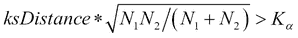
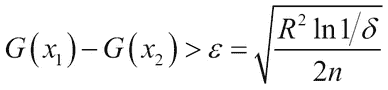
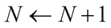

# 五、实时流机器学习

在第二章、*现实世界监督学习的实用方法*、第三章、*无监督机器学习技术*和第四章、*半监督和主动学习*中，我们讨论了各种分类、聚类、离群点检测、半监督和主动学习技术。从现有或历史数据中完成的学习形式传统上被称为批量学习。

所有这些算法或技术都假定三件事，即:

*   有限的训练数据可用于构建不同的模型。
*   学习的模型将是静态的；也就是说，模式不会改变。
*   数据分布也将保持不变。

在许多真实世界的数据场景中，要么没有先验的训练数据可用，要么数据本质上是动态的；也就是说，随时间不断变化。许多现实世界的应用程序也可能有具有瞬时性质的数据，这些数据以高速度或高容量出现，例如物联网传感器信息、网络监控和 Twitter 订阅源。这里的要求是立即从实例中学习，然后更新学习。

动态数据的性质和潜在变化的分布使得现有的基于批处理的算法和技术通常不适合这样的任务。这就产生了机器学习中的自适应或可更新或增量学习算法。这些技术可用于从数据流中不断学习。在许多情况下，通过将大数据学习问题转换为增量学习问题，并一次检查一个示例，也可以克服从大数据学习的缺点，这是由于大数据的大小以及需要将整个数据放入内存中。

在这一章中，我们将讨论假设，并讨论监督和非监督学习中促进实时或流机器学习的不同技术。我们将使用开源库**大规模在线分析** ( **MOA** )来执行真实世界的案例研究。

本章的主要部分是:

*   假设和数学符号。
*   基本的流处理和计算技术。讨论流计算、滑动窗口(包括 ADWIN 算法)和采样。
*   概念漂移和漂移检测:介绍学习进化系统和数据管理，检测方法，以及隐式和显式适应。
*   增量监督学习:讨论从标记流数据学习，建模技术，包括线性，非线性和集成算法。接下来是验证、评估和模型比较方法。
*   增量无监督学习:聚类技术类似于第三章、*中讨论的无监督机器学习技术*，包括验证和评估技术。
*   使用离群点检测的无监督学习:基于分区和基于距离，以及使用的验证和评估技术。
*   基于流的学习的案例研究:介绍 MOA 框架，提出业务问题，特征分析，映射到机器学习蓝图；描述实验，并以结果的展示和分析结束。

# 假设和数学符号

这里有一些由许多流机器学习技术做出的关键假设，我们将在这里明确地陈述它们:

*   数据中的个特征是固定的。
*   数据具有小到中等的维度或特征数量，通常有数百个。
*   示例或训练数据的数量可以是无限的或非常大的，通常为数百万或数十亿。
*   监督学习或聚类中的类别标签的数量很小且有限，通常少于 10 个。
*   正常情况下，内存是有上限的；也就是说，我们无法将所有的数据都存储在内存中，因此从数据中学习必须考虑到，尤其是像 K 近邻这样的懒惰学习者。
*   通常，处理事件或数据的时间有一个上限，通常是几毫秒。
*   数据中的模式或分布可以随着时间而演变。
*   学习算法必须在有限时间内收敛到一个解。

设*D*[t]= {**x**[I]，y [i] : *y = f(x)* }为时间 *t* ∈ {1，2，… *i* }的给定数据。

增量学习算法产生模型/假设序列{..， *G* [j-1] ，G [j] ， *G* [j+1] ..}对于数据序列{..、*D*j-1、*D*j、*D*j+1..}而模型/假设*G*t 24】I 只取决于之前的假设*G*t 28】I-1 和当前数据*D*I。


# 基本流处理和计算技术

我们现在将描述一些可以在数据流上执行的基本计算。如果我们必须在内存和速度有限的情况下运行汇总操作，如聚合或直方图，我们可以肯定需要某种折衷。在这些情况下，有两种众所周知的近似方法:

*   *ϵ* 近似值:计算在误差的分数 *ϵ* 内接近精确值。
*   ( *ϵ* 、T2、δ )近似值:计算在 1 *ϵ* 内接近精确值，概率在 1—*δ*内。

## 流计算

我们将举例说明一些基本计算和聚合，以强调当我们必须在内存受限的情况下计算基本操作，同时还要考虑整个数据时，批处理和基于流的计算之间的差异:

*   **频率计数或点查询**:计数最小草图的通用技术已经成功应用于对数据流进行各种汇总。主要的技术是创建一个大小为*宽* x *宽*的窗口。然后，给定期望的概率(δ)和容许误差( *ϵ* ，可以使用 *w* = 2/ *ϵ* 和创建存储器中数据的大小。与每一行相关联的是一个 hash 函数: *h* (。).该将值 *x* 统一转换为区间[1，2 … *w* 中的值。这种查找和更新方法可用于执行值、点积或频率计数的点查询。
*   **非重复计数**:Hash-Sketch 的通用技术可用于执行“非重复值”查询或计数。给定输入流值 x ∈ [0，1，2…的域。N-1]，哈希函数 *h* ( *x* )跨[0，1，…2l-1]均匀映射值，其中 *L=O(log N)* 。
*   **平均值**:计算平均值而不需要存储所有的值是非常有用的，通常使用递归方法，其中只需要观察值的数量 *(n)* 和到目前为止看到的值的总和(≘*x*n:
*   **标准偏差**:与平均值一样，标准偏差可以使用无记忆选项来计算，该选项只有观察次数( *n* )、目前所见值的总和(≘*x*T7【n)以及这些值的平方和(≘*x*[n]²):
*   **相关系数**:给定一个两个不同值的流，很多算法需要计算两者之间的相关系数，这可以通过维护每个流的运行总和(∈*x*n 和∈*y*n)、平方和(∈*x*n2²和∈来完成相关性由给出

## 推拉窗

通常，你不需要完整的数据来计算统计或总结，只需要“最近的过去”。在这种情况下，滑动窗口技术用于计算汇总统计数据，方法是保持窗口大小固定或可调整，并在最近的过去移动它。

**自适应滑动窗口** ( **ADWIN** )是一种众所周知的技术，用于检测变化作为以及估计计算中所需的值。ADWIN 背后的思想是保持最后看到的值的可变长度窗口，其特征是窗口具有统计上与窗口内的平均值没有变化的事实一致的最大长度。换句话说，当且仅当新的输入值会改变平均值时，旧的值才会被丢弃。这具有双重优势，既可以记录变化，又可以在最近的流中维护动态值，如聚合值。可以使用众所周知的 Hoeffding 界限来确定用于投掷物品的主观概念“足够大”,该界限为:


这里的分别是大小为| * W * [ 0 ] |和| * W * [ 1 ] |的两个窗口*W*0 和*W*[1[1[1]之间的调和平均值，其中 *W* 包含更近的元素。此外，设和为各自的计算平均值。]]

该算法可以概括为:

1.  ADWIN ( *x:输入流，δ:置信度*)
2.  init(*W*)//初始化窗口 *W*
3.  while (*x*){

    W←W∩{*x*[t]}//将新实例*x*t 添加到窗口头 *W*

4.  重复 W←W–*x*old//从窗口尾部删除元素
5.   < 适用于 *W* 的每一次拆分
6.  输出
7.  }

ADWIN 的还表明，它提供了假阳性和假阴性的理论界限，这使得它成为一种非常有前途的技术。

## 取样

在许多基于流的算法中，需要减少数据或选择数据子集进行分析。对于基于流的数据，必须增强对整个数据进行采样的正常方法。

必须解决的采样中的关键问题是样本的无偏性如何，以及它们在产生流的总体中的代表性如何。在非流式环境中，这完全取决于样本大小和采样方法。均匀随机抽样(第二章，*现实世界监督学习的实用方法*)是用来减少批量数据世界中的数据的最著名的技术之一。储层取样技术被认为是在给定存储器限制的情况下减少数据的非常有效的方法。

储层采样的基本思想是保持一个固定大小的储层或样本，比如说 *k* ，进入河流的每个元素都有一个替换储层中较老元素的概率 *k/n* 。详细算法如下所示:

```java
ReservoirSampling(x:inputstream, k:sizeOfReservoir)
//add first k elements to reservoir
for(i = 0; i < k; i++)
  addToReservoir(x)
  while (x){
    for(i = 0; i < k; i++)
    //flip a coin to get random integer
    r = randomInteger[1..n]
    if(r ≤ k){
      //move it inside the reservoir
      addToReservoir(x)
      //delete an instance randomly from reservoir
      position = randomInteger[1..k]
      removeInstance(position)
    }
}
```

还有对这些方法的扩展，如最小采样和减载，克服了与基本方法相关的一些问题。


# 概念漂移和漂移检测

正如在本章的介绍中所讨论的，无限流的动态本质与静态学习的基本原则完全相反；也就是说，数据或模式的分布保持不变。尽管可能会有*快速*或*突然*的变化，这里讨论的是缓慢渐进的变化。这些缓慢、渐进的变化很难被检测到，从噪声中分离这些变化变得更加困难:


图 1 底部面板中颜色从黄色到蓝色的渐变说明了概念漂移。采样数据反映了数据分布的潜在变化，必须检测到这种变化并学习新的模型。

在过去的二十年中，各种研究中描述了几种技术，如下图所示进行分类:


图 2 漂移检测技术的类别

## 数据管理

的主要思想是在内存中管理一个与数据的动态特性一致的模型。

## 部分记忆

这些技术使用内存缓冲区中最近使用的数据来学习或获取汇总信息。前面讨论的关键问题是:有效检测变化和有效学习的合适窗口大小是多少？在基于固定窗口大小的技术中，我们使用队列的思想，其中具有最近时间戳的新实例进入，而具有最早时间戳的实例被驱逐。因此，该窗口包含所有最近的足够多的例子，并且大小通常基于存储器的物理可用性和队列中数据元素的大小来选择。在自适应窗口大小中，队列与检测算法结合使用。当检测算法基于性能评估指示漂移的迹象时，可以减小窗口大小以有效地移除不再有助于模型的旧示例。

### 全部记忆

的想法是存储所有例子或数据的足够的统计数据。一种方法是给数据加上权重，权重会随着时间而衰减。使用λ给出的速率因子进行指数加权可能非常有效:

wλ=*exp*(–λ* I)

### 检测方法

给定观察到给定数据的概率*【P(X)】*，模式/类别 *P(C)* 的概率，以及给定类别 *P(X|C)* 的数据的概率——这是模型——检测方法可以在高层次上分为两类:

*   监控模型、分类器或 *P(C|X)* 的发展或性能
*   监测环境中的分布或观察 *P(X)* 、 *P(C)* 和 *P(X|C)*

#### 监控模式演变

虽然这种方法是基于的假设，即模型的所有学习都是静态的，并且数据来自**独立的、相同的分布** ( **i.i.d.** )，这在许多应用中并不成立，但它仍然被证明是有效的。接下来描述一些众所周知的技术。

##### Widmer 和 Kubat

这个是观察错误率或错误分类率以及模型变化的最早方法之一，例如由于新分支导致的树结构。使用这些和已知的阈值，学习窗口大小增加或减少。

##### 漂移检测法或 DDM

这个方法假设被观察的参数，比如正确或错误标记事物的分类器，是一个遵循二项式分布的二进制随机变量。它假设错误分类的概率为概率 pi，标准偏差为，其中在序列中的第*I*第点计算值。然后，该方法使用两个级别:

*   预警级别:当*p*[I]+*s*[I]≥*p*[min]*+2 **s*[min]*
*   *检测电平:当*p*[I]+*s*[I]≥*p*[min]*+3 **s*[min]**

**在“警告”和“检测”级别之间的所有例子被用于训练新的分类器，当达到“检测”级别时，该分类器将替换“不良”分类器。**

##### **早期漂移检测法或 EDDM**

**EDDM 使用与 DDM 相同的技术，但稍有改动。它使用分类率(即召回率)而不是错误率(1-准确度),并使用正确预测和两个错误预测之间的距离来改变级别。**

**EDDM 计算两个误差之间的平均距离*p*[I]*^'*和两个*s*[I]*'*。这些级别是:**

*   **预警级别:(*p*[I]*^'*+2 *[sI]*^'*)‖(*p^'*[max]+2 **s^'*[max])<*α***
*   **检测等级:(*p*[I]*'*+2 *[s[I]*'*)‖(*p^'*[max]+2 **s^'*[max])<*β*]**

**参数 *α* 和 *β* 通常由用户分别调整到 90%和 95%左右。**

#### **监控分布变化**

**当没有模型或分类器来检测变化时，我们应用使用某种形式的统计测试来监控分布变化的技术。这些测试用于识别分布变化。由于各种假设，无论是参数性的还是非参数性的，以及不同的偏见，很难具体说出哪一种效果最好。这里我们提供一些众所周知的统计测试。**

##### **韦尔奇 t 检验**

**这个是对学生 *t* 测试和两个样本的改编。该测试适于取大小为*N*1 和*N*2 的两个窗口，其均值为和且方差为和以计算 *p* 值，并使用该值拒绝或接受零假设:**

****

###### **科尔莫戈罗夫-斯米尔诺夫试验**

**该统计测试通常用于比较两个分布之间的距离，并验证它们是否低于特定阈值。这可以通过使用具有不同累积分布函数的两个不同样本大小的窗口 *N* [1] 和*N*[2]*F*1 和 F2*KS*来适应变化检测:**

****

**假设两个分布相似的零假设，当且仅当通过在 Kolmogorov-Smirnov 表中查找获得时，以 *α* 的置信度被拒绝。**

###### **CUSUM 和 Page-Hinckley 试验**

****累积和** ( **累积和**)被设计为以指示输入的平均值何时明显不同于零:**

***g*0= 0，*g*[t]=*max*(0，*g*[t–1])+*ϵ*[t]–*v***

**当 *g* [t] > *h* 时，我们引发变化检测，其中( *h，v* )为用户自定义的参数。请注意，累积和检验是无记忆的，并且是单侧或不对称的，只检测增加。**

**Page Hinckley 测试类似于 CUSUM，但有一点小小的变化，如下所示:**

***g* 0 = 0，*g*t=*g*[t–1]+*ϵ*[t]–*v***

**为了增加和减少数值，我们使用*G*[t]*= min(G*[t]，*G*[t–1]*或 G*[t]*= max(G*[t]，*G*[t–1]*和***

### ***适应方法***

***显式和隐式适应是两种众所周知的技术，用于在检测到变化时适应环境变化。***

#### ***显性适应***

***在显式适配中，使用了以下附加技术:***

*   ***使用新数据从头开始重新训练模型，以便以前的模型或数据不会影响新模型***
*   ***使用更改或新数据更新模型，以便平稳过渡-假设更改是渐进的，而不是剧烈的***
*   ***当协作方法优于任何单一模型时，创建一个随时间学习的模型序列或集合***

#### ***内隐适应***

***在隐式适应中，我们一般使用集成算法/模型来适应概念的变化。这可能意味着使用不同的组合，从单个分类器到集成预测，再到使用 ADWIN 进行基于窗口的自适应分类器，所有这些都属于隐式自适应的选择范围。***

***

# 增量监督学习

这个部分介绍了当每个实例的真实标签可用时，从流数据中学习的几种技术。特别是，我们提出了适合增量学习的线性、非线性和基于集成的算法，以及评估和验证这些模型所需的方法，记住学习受到内存和 CPU 时间限制的约束。

## 建模技术

建模技术分为线性算法、非线性算法和集成方法。

### 线性算法

这里描述的线性方法几乎不需要修改来处理流数据。

#### 带有损失函数的在线线性模型

在该算法中可以使用不同的损失函数，例如铰链、逻辑和平方误差。

##### 输入和输出

在这些方法中只使用数字特征。应用权重更新的损失函数 *l* 和学习速率λ的选择被作为输入参数。输出通常是可更新的模型，其给出的预测伴随有置信度值。

##### 它是如何工作的？

基本算法假设线性权重组合，类似于第二章、*现实世界监督学习的实用方法*中解释的线性/逻辑回归。流或在线学习算法可以总结为:

1.  for(t=1，2，…T)do

    1.  **x**[T]=*receive()*；//接收数据
    2.  ；//预测标签
    3.  *y*[t]=*observe true label()*；//得到真实标签
    4.  *损失*=*l*(**w**[t]，(**x**t，**w**[t])；//计算损耗
    5.  if(*l*(**w**t，( **x** t， **w** t )) > 0 然后
    6.  ；//更新权重
    7.  结束

2.  结束

可以根据问题的类型插入不同的损失函数；下面是一些众所周知的类型:

*   分类:

    *   铰链损耗: *l* ( **w** [t] ， **x** [t] ，**w**[t])= max(0，1-*YF*(**x**[t]， **w** [t] )

*   回归:

    *   平方损失:

**随机梯度下降** ( **SGD** )可以被认为是改变权重以最小化平方损失，就像在前面的损失函数中一样，但是在每个例子中沿着梯度的方向进行。权重的更新可以描述为:


##### 优点和局限性

在线线性模型与第二章、*现实世界监督学习实用方法*中描述的线性模型具有相似的优点和缺点:

*   在某种程度上是可解释的，因为每个特征的权重给出了对每个特征的影响的洞察
*   假设线性关系、附加和不相关的要素，因此不会对复杂的非线性现实世界数据进行建模
*   对数据中的异常值非常敏感
*   非常快，通常是最先尝试或基线的算法之一

#### 在线朴素贝叶斯

应用贝叶斯定理来获得预测作为后验概率，给定一个 *m* 维输入:


##### 输入和输出

在线朴素贝叶斯可以接受分类和连续输入。分类特征更容易，因为算法必须维护每个类的计数，同时计算给定类的每个特征的*P*(**X**j|*Y*)概率。对于连续特征，我们必须假设一个分布，例如高斯分布，或者以增量方式计算在线核密度估计值，或者以增量方式离散化数字特征。输出是可更新的模型，可以预测带有置信度值的类别。作为概率模型，它们具有分布在 0 和 1 之间的更好的置信度得分。

##### 它是如何工作的？

1.  for(t = 1，2，…T)do

    1.  **x**[T]=*receive()*；//接收数据
    2.  increment counters(**x**t[t])；//更新*P(***X**j*| Y)*
    3.  //后验概率

2.  结束

##### 优点和局限性

*   这个是最快的算法，并且具有较低的内存占用以及计算成本。它非常受在线或快速学习者的欢迎。
*   假设数值特征的分布或某些偏差会影响预测质量。

### 非线性算法

正在使用的最流行的非线性流学习分类器之一是 Hoeffding 树。在接下来的小节中，将介绍 Hoeffding 界限的概念，以及算法本身。

#### 赫夫丁树或快速决策树(VFDT)

在**胡夫丁树** ( **HT** )背后的关键思想是胡夫丁界限的概念。给定一个实值随机变量 **x** ，其值域的大小为 **R** ，假设我们有 **n** 个 **x** 的独立观测值，并将平均值计算为。

赫夫丁界限指出，在概率为 1–δ的情况下，变量 **x** 的实际均值至少为，其中

赫夫丁界限独立于生成样本的概率分布，并且仅通过 **n** 个示例给出了良好的近似。

赫夫丁界限的思想被用于叶子展开。如果 *x* [1] 是最具信息性的特征并且 *x* [2] 排在第二位，那么使用用户定义的分割函数 *G* 进行分割。)的方式使得:



##### 输入和输出

分类数据和连续数据都可以是数据输入的一部分。在许多实现中，连续特征被离散化。期望的概率参数 1–δ和决策树通用的分裂函数 *G* (。)成为输入的一部分。输出是可解释的决策树模型，并且可以用类和置信度值来预测/学习。

##### 它是如何工作的？

HoeffdingTree(x:inputstream，G(。):splitFunction，δ:probabilityBound)

1.  假设 HT 是一棵单叶(根)树
2.  InitCounts( *n* [ijk] ， *root* )
3.  for(t=1，2，…T)do//来自 stream

    1.  **x***[T]= receive()；*//接收数据
    2.  *y[t]= obtaintruelable()；*//获取真实标签
    3.  HT grow((**x**t，*y*t)， **HT** ，δ)
    4.  end

**HT grow**((**x**t，*y*t)， **HT** ， *G* (。), δ)

1.  *l = sort((***x**[t]， *y* [t] )，**HT**)；//使用 HT 将数据排序到叶子 l
2.  *update counts(n*[ijk]，*l)；* //更新叶子 l 处的计数
3.  *if(examplessofarnotofsame class()；* //检查是否有多个类
4.  *computefeachfeature(，G(。))*

    1.  

赫夫丁树有一些有趣的特性，例如:

*   它们是稳健的低方差模型
*   它们表现出较低的过度拟合
*   由于 Hoeffding 界限，理论上保证错误率的概率很高

赫夫丁树有多种变体可以适应概念漂移，称为概念适应 VFDT。他们在流上使用滑动窗口的概念。决策树中的每个节点都保持足够的统计量；基于 Hoeffding 测试，当准确性更好时，替换子树被生长和交换。

##### 优点和局限性

优点和局限性如下:

*   基本 HT 有属性接近所选*的问题，ϵ* 和打破平局。决定任何节点的属性数量也是一个问题。一些问题在 VFDT 得到了解决。
*   随着树的变化，扩展树的内存限制以及在实例上花费的时间成为一个问题。
*   如前所述，VFDT 在模式变化方面有问题，CVFDT 试图克服这些问题。对于实时和大数据，它是最优雅、快速、可解释的算法之一。

### 集成算法

集成学习背后的想法类似于批量监督学习，其中多种算法被训练并以某种形式组合起来，以预测看不见的数据。即使在网络环境中，不同的教学方法也能带来同样的好处；例如，使用不同类型的多种算法，使用相似类型但具有不同参数或采样数据的模型，所有这些都使得找到不同的搜索空间或模式，并减少总误差。

#### 加权多数算法

**加权多数算法** ( **WMA** )训练一组基本分类器并组合它们的投票，以某种方式加权，基于多数做出预测。

##### 输入和输出

对输入类型的约束(仅分类、仅连续或混合)取决于所选的基本分类器。模型的可解释性取决于所选的基础模型，但很难解释模型组合的输出。当预测不正确时，每个模型的权重通过每个示例/实例的因子( *β* )来更新。权重和模型的结合可以给出一些可解释性的概念。

##### 它是如何工作的？

*weighted majority algorithm(x:inputstream，hm: m 个学习者模型)*

1.  *初始化权重(w* [i] *)*
2.  for(t=1，2，…T)do

    1.  xT*= receive()；*
    2.  *foreach 模型 hk**∈**h*
    3.  *y*[I]↓*h*k；

3.   
4.  否则
5.  如果已知 *y* 则

    1.  为 *i* = 1 到 m do
    2.  如果*y*I≦*y*则
    3.  wi←*w*I**β*

        如果…就会结束

        结束于

6.  结束

##### 优点和局限性

优点和局限性如下:

*   WMA 有个简单的实现和个系综误差的理论界限
*   困难在于选择正确的基础算法作为模型和池中模型的数量

#### 在线装袋算法

正如我们在关于监督学习的章节中看到的，bagging 算法从训练集中创建不同的样本，并使用多种算法进行学习和预测，减少了方差，在学习中非常有效。

##### 输入和输出

对输入类型的约束(仅分类、仅连续或混合)取决于所选的基本分类器。基础分类器算法以及与该算法相对应的参数选择也是输入。输出是可以基于选择的分类器预测类别/置信度的学习模型。

##### 它是如何工作的？

基本分批装袋算法需要完整的数据来创建不同的样本，并将这些样本提供给不同的分类器。Oza 的在线 Bagging 算法改变了这种约束，使从无界数据流中学习成为可能。基于采样，原始算法中的每个训练实例被复制多次，并且每个基础模型用原始实例的 *k* 个副本来训练，其中:

P(k)= exp(–1)/k！

这相当于取一个训练样本，为每个分类器选择 k ~泊松(1) ，并更新基本分类器 *k* 次。因此，消除了对示例数量的依赖，并且该算法可以在无限流上运行:

*OnlineBagging(x: inputstream，h* [m] *: m 个学习模型)*

1.  初始化所有 *m* ∈ {1，2，..M
2.  for(t=1，2，…T)do

    1.  xT*= receive()；*
    2.  foreach 模型 *m* = {1，2，.. *M* }

        鱼 (1)

        *更新型号(h* [m] *，w，x*[t]*)*

    3.  结束

3.  返回
4.  

##### 优点和局限性

优点和局限性如下:

*   经验表明，它是最成功的在线或流算法之一。
*   必须在不查看其他实例的情况下将权重赋予数据实例；这减少了对不同加权方案的选择，这些方案可以批量获得并且在模型性能上是好的。

性能完全由选择的 *M* 个学习者决定——用于问题领域的学习者类型。我们只能通过采用模型验证技术一节中描述的不同的验证技术来决定这个选择。

#### 在线助推算法

监督增强算法采用许多精度略高于随机的*弱学习器*，并通过对错误分类的样本进行迭代采样来组合它们，以产生一个强学习器。Oza 的在线增强算法中的概念是相同的，只是对连续数据流进行了修改。

##### 输入和输出

对输入类型的约束(仅分类、仅连续或混合)取决于所选的基本分类器。基本分类器算法和它们各自的参数是输入。输出是可以基于选择的分类器预测类别/置信度的学习模型。

##### 它是如何工作的？

批量升压改为在线升压修改如下:

1.  为 *M* 基本模型保留两组权重， *λ* ^c 是维度为 *M* 的向量，携带正确分类实例的权重之和，*λ*w 是维度为 *M* 的向量，携带错误分类实例的权重之和。
2.  权重被初始化为 1。
3.  给定一个新的实例( **x** [t] ， *y* [t] )，该算法经历更新基本模型的迭代。
4.  对于每个基础模型，重复以下步骤:

    1.  对于第一次迭代， *k =泊松(λ)* 被设置，并且学习分类器使用( **x** [t] ，*y*[t])
    2.  If*h 来更新算法(这里表示为*h*[1】k]*次) 增加*λ*t27】w1， *ϵ* [1] ，计算被*h*t35】1 错误分类的加权分数，并将该示例的权重乘以 1/2 *ϵ* [1] 。

##### 优点和局限性

优点和局限性如下:

*   同样，表现是由多个学习者的选择、他们的类型和问题的特定领域决定的。模型验证技术一节中描述的不同方法有助于我们选择学习者。
*   理论和经验表明，Oza 的在线增强并非“无损”；也就是说，模型与其批次版本不同。因此，它受到性能问题的困扰，并且近年来已经研究了不同的扩展来提高性能。

## 在线设置中的验证、评估和比较

在中，与我们在前面章节中看到的机器学习模式相比，流学习对执行验证和评估的核心步骤提出了独特的挑战。我们不再处理批量数据的事实意味着验证评估和模型比较的标准技术必须适应增量学习。

### 模型验证技术

在离线或批量设置中，我们讨论了调整算法参数或测试算法泛化能力的各种方法，作为防止过拟合的对策。批次标记数据中的一些技术，如交叉验证，不能直接应用于在线或流设置。下面给出了在线或流设置中最常用的技术。

#### 事前评估

顺序评估法是一种向算法提供实例，然后使用损失函数与实际标签进行比较来测量算法输出预测的方法。因此，该算法总是在看不见的数据上测试，并且不需要“维持”数据来估计泛化。基于实际值和预测值之间的累积损失函数之和来计算先验误差，由下式给出:


为了更好地估计变化的数据，进行了三种基本的概率评估，它们是:

*   使用地标窗口(基本)
*   使用滑动窗口
*   使用遗忘机制

最后两种方法是对前面描述的技术的扩展，在这两种方法中，您可以对随时间推移而减少的预测设置权重或衰减因子。

#### 维持评估

这个是批学习的保持机制或“独立测试集”方法的扩展。这里，基于一些固定的间隔或算法已经看到的例子/实例的数量，总的标记集或流数据被分成训练集和测试集。想象一个连续的数据流，我们在和放置众所周知的间隔来比较评估指标，如下一节所讨论的。

#### 受控排列

上述机制的问题在于，它们提供了在时间内的“平均”行为，并且可能掩盖一些基本问题，例如算法在开始时做得很好，而在结束时由于漂移而做得很差。前述方法的优点在于，它们可以应用于真实的输入流以获得估计。克服这一缺点的一种方法是创建不同的随机数据集，其中在保持时间上的接近性的同时稍微打乱顺序，并且在许多这些随机集上进行评估。

#### 评估标准

大多数评估标准与监督学习章节中描述的标准相同，应根据业务问题、业务问题到机器学习技术的映射以及从中获得的好处进行选择。在本节中，为读者总结了最常用的在线监督学习评估标准:

*   **准确率**:由学习算法得到正确分类的真阳性和真阴性的的度量
*   **平衡精度**:当类别不平衡时，平衡精度常用作为衡量标准。平衡准确度是特异性和敏感性的算术平均值。在二元分类问题中，当从相同的概率中抽取正面和负面实例时，它也可以被认为是准确性。
*   **ROC 曲线下面积**(**AUC**):ROC 曲线下面积给出了算法泛化的良好度量。接近 1.0 意味着该算法具有良好的泛化能力，而接近 0.5 意味着它更接近随机猜测。
*   **Kappa 统计量**(**K**):Kappa 统计量用于度量分类中随机猜测的期望精度的观察精度。在在线学习中，Kappa 统计量是通过计算先验精度( *p* o)和随机分类器精度( *p* c)来使用的，并由以下公式给出:
*   **Kappa Plus 统计量**:Kappa Plus 统计量是对通过用持久分类器代替随机分类器而获得的 Kappa 统计量的修改。持久分类器是基于前一个实例的标签或结果来预测下一个实例的分类器。

如前所述，在考虑“漂移”或概念变化时，除了这些标准测量值之外，还使用一些已知的测量值来给出定量测量值:

*   **真实变化检测概率**:通常用合成数据或已知变化的数据来衡量。它赋予学习算法检测变化的能力。
*   **假警报概率**:在线设置使用检测*时间的倒数或平均运行*长度，而不是使用离线设置中的假阳性率，平均运行长度是使用假阳性检测之间的预期时间计算的。
*   **检测延迟**:这是指识别漂移所需的时间。

#### 比较算法和指标

当在在线设置中比较两个分类器或学习者时，通常的机制是采用性能度量的方法，例如错误率，并使用适合在线学习的统计测试。下面描述两种广泛使用的方法:

*   **McNemar test**: McNemar's test is a non-parametric statistical test normally employed to compare two classifiers' evaluation metrics, such as "error rate", by storing simple statistics about the two classifiers. By computing statistic *a*, the number of correctly classified points by one algorithm that are incorrectly classified by the other, and statistic *b*, which is the inverse, we obtain the McNemar's Test as:

    检验遵循χ2 分布，p 值可用于检查统计显著性。

*   **Nemenyi test**: When there are multiple algorithms and multiple datasets, we use the Nemenyi test for statistical significance, which is based on average ranks across all. Two algorithms are considered to be performing differently in a statistically significant way if the ranks differ by a critical difference given by:

    这里，K =算法数量，N =数据集数量。

假设临界差值遵循 Student-T 分布。


# 使用聚类的增量无监督学习

数据流中聚类背后的概念与批处理或离线模式中的概念相同；也就是说，寻找在数据中聚集在一起的感兴趣的聚类或模式，同时将处理所需的有限内存和时间限制作为约束。对现有算法进行单遍修改或保持小的存储器缓冲区以对现有算法进行小批量版本，构成了对所有算法进行的基本改变，以使它们适合于流或实时无监督学习。

## 建模技术

在线学习的聚类建模技术分为基于分区的、基于层次的、基于密度的、基于网格的，类似于批量聚类的情况。

### 基于分区

基于分区的算法的概念类似于基于批处理的聚类，其中形成 **k** 个聚类以优化某些目标函数，例如最小化聚类间距离、最大化聚类内距离等等。

#### 在线 k-Means

k-Means 是最流行的聚类算法，它将数据划分为用户指定的 *k* 聚类，主要是为了最小化质心和聚类指定点之间的平方误差或距离。我们将举例说明 k-Means 的一个非常基本的在线改编，其中存在几个变体。

##### 输入和输出

主要地，数字特征被认为是输入；一些工具采用分类特征，并将它们转换成某种形式的数字表示。算法本身将参数的聚类数 *k* 和最大迭代次数 *n* 作为输入。

##### 它是如何工作的？

1.  输入数据流被认为是无限的，但是具有恒定的块大小。
2.  块大小的存储器缓冲器被保留用于存储数据或数据的压缩表示。
3.  最初，块大小的第一个数据流被用于寻找簇的 *k* 质心，质心信息被存储并且缓冲器被清空。
4.  对于达到块大小时的下一个数据:

    1.  对于最大迭代次数或者直到质心没有变化:
    2.  用缓冲数据和当前质心执行 k-Means。
    3.  最小化质心和分配给聚类的数据之间的平方和误差。
    4.  迭代后，清空缓冲区，获得新的质心。

5.  重复步骤 4，直到数据不再可用。

##### 优点和局限性

优点和局限性如下:

*   与基于批处理的类似，检测到的聚类的形状取决于距离度量，并且不适用于具有不规则形状的问题域。
*   在基于批处理的情况下，参数 **k** 的选择会限制具有许多不同模式或聚类的数据集的性能。
*   离群点和缺失数据会给在线 k-Means 的聚类行为带来很多不规则性。
*   如果所选择的缓冲区大小或迭代 k-Means 运行的流的块大小很小，它将不会找到正确的聚类。如果选择的块大小很大，可能会导致速度变慢或丢失数据更改。诸如**非常快速 k-Means 算法** ( **VFKM** )之类的扩展使用 Hoeffding 界限来确定缓冲区大小，在很大程度上克服了这种限制。

### 基于层次和微聚类

层次化的方法通常是基于**聚类特征** ( **CF** )和**聚类树** ( **CT** )的。我们将描述层次化聚类的基础和元素以及 BIRCH 算法，CluStream 算法基于该算法的扩展。

群集功能是一种以压缩方式计算和保存有关群集的汇总统计信息的方法，而不是保留属于群集的全部数据。在一个 **d** 维数据集中，集群中有 **N** 个点，计算每个维度的总和 **LS** 和每个维度的数据总平方和 **SS** 形式的两个集合，并且表示这个三元组的向量形成集群特征:

*CF* [j] *= < N，LS* [j] *，SS*[j]*>*

这些统计数据有助于总结整个集群的信息。使用以下公式可以很容易地计算群集的质心:

*质心*[j]*= LS*[j]*/N*

可以使用以下公式来估计群集的半径:


可以使用以下公式来估计簇的直径:


CF 向量具有很好的增量和附加属性，这在流或增量更新中非常有用。

对于增量更新，当我们必须更新 CF 向量时，以下情况成立:



当两个 cf 必须合并时，以下情况成立:


**聚类特征树** ( **CF 树**)代表的一种层次树结构。CF 树的构建需要两个用户定义的参数:

*   分支因子 **b** ，它是任何节点可以拥有的子集群或非叶节点的最大数量
*   最大直径(或半径) **T** ，一个 CF 父节点的叶节点可以吸收的样本数

插入等 CF 树操作通过递归遍历 CF 树并使用 CF 向量基于距离度量寻找最近的节点来完成。如果叶节点已经吸收了由参数 *T* 给出的最大元素，则该节点被拆分。在操作结束时，CF 向量会针对其统计信息进行适当更新:


图 3 示出了分层结构的示例聚类特征树。

我们将按照这个概念来讨论 **BIRCH** ( **平衡迭代约简和聚类层次**)。

#### 输入和输出

BIRCH only 接受数字特征。CF 和 CF 树参数，例如分支因子 *b* 和树叶的最大直径(或半径) *T* 是用户定义的输入。

#### 它是如何工作的？

BIRCH 是为超大型数据库设计的，它原本是一个*两遍*算法；即扫描一次整个数据，然后再重新扫描一次，这样就是一个 *O(N)* 算法。它可以很容易地进行在线修改，作为保留相同属性的单遍算法:

1.  在第一阶段或扫描中，它检查数据，并通过顺序访问点和执行前面讨论的 CF 树操作来创建内存中的 CF 树结构。
2.  在第二阶段，一个可选的阶段，我们删除离群值并合并子聚类。
3.  第三阶段是克服第一阶段中的数据顺序问题。我们使用凝聚层次聚类来重构 CF 树。
4.  第四阶段是最后一个阶段，这是一个可选阶段，用于计算统计数据，如质心，将数据分配给最近的质心，等等，以提高效率。

#### 优点和局限性

优点和局限性如下:

*   这是最流行的算法之一，可以对大型数据库或数据流进行线性扩展。
*   它具有 CF 和 CF 树形式的紧凑内存表示，用于对输入数据进行统计和操作。
*   它比大多数算法更好地处理异常值。
*   一个主要的限制是，当簇的形状不是球形时，它表现得不好。
*   Aggarwal *等人*扩展了桦树中 CF 向量和聚类的概念，并命名为*微聚类和聚类流*。

#### 输入和输出

仅 CluStream】接受数字特征。在用户定义的参数中，有内存中微簇的数量( *q* )和时间阈值( *δ* ),在此之后它们可以被删除。此外，输入中包括用于存储微团簇信息的时间敏感参数，由 *α* 和 *l* 给出。

#### 它是如何工作的？

1.  The micro-cluster extends the CF vector and keeps two additional measures. They are the sum of the timestamps and sum of the squares of timestamps:

    *微团簇* [j] *= < N，LS* [j] *，SS* [j] *，ST，SST >*

2.  该算法将 *q* 微聚类存储在存储器中，并且每个微聚类具有*最大边界*，该边界可以基于质心和聚类实例距离之间的平均值和标准偏差来计算。测量值乘以一个随时间呈指数下降的系数。
3.  对于每个新实例，我们基于欧几里德距离选择最近的微簇，并决定它是否应该被吸收:

    1.  如果新实例和最近的微簇的质心之间的距离落在最大边界内，则它被吸收并更新微簇统计。
    2.  如果没有一个微集群可以吸收，则使用该实例创建一个新的微集群，并基于时间戳和阈值( *δ* )，删除最旧的微集群。

4.  通过使用金字塔时间窗概念，微聚类信息不时地被存储在辅助存储器中。每个微群具有指数减少时间间隔，使用 *α* l 来创建快照。这些有助于在时间和空间上的有效搜索。

#### 优点和局限性

优点和局限性如下:

*   CluStream 已经被证明在实时发现集群方面非常有效
*   CluStream 算法通过使用金字塔时间戳的有效存储，具有高效的时间和空间使用。像桦树一样，CluStream 只能找到球形的簇

### 基于密度

类似于批量聚类，基于密度的技术克服了基于距离的算法所面临的“形状”问题。这里，我们将介绍一个众所周知的基于密度的算法 DenStream，它基于前面讨论的 CF 和 CF 树的概念。

#### 输入和输出

核心微团簇的邻域范围是用户定义的半径 *ϵ* 。第二个输入值是微聚类的最小总权重，其是对象中每个实例的到达时间的加权函数的总和，其中权重以与另一个用户定义的参数 *λ* 成比例的时间常数衰减。最后，使用输入因子 *β* ∈ (0，1)来区分潜在的核心微簇和离群微簇。

#### 它是如何工作的？

1.  基于 CluStream 的微簇概念，DenStream 拥有两种数据结构:*p-微簇*用于潜在簇，*o-微簇*用于离群点检测。
2.  每个*p-微簇*结构具有:

    1.  与其相关联的权重，该权重随着其被更新的时间戳而呈指数下降。如果微簇中有 *j* 对象:其中*f(t)=*2^(-λt)
    2.  **加权线性和** ( **WLS** )和**加权线性平方和** ( **WSS** )存储在类似线性和平方和的微簇中:

        【T26 和直径是，然后使用先前定义的加权度量来计算，与在 CF 中完全一样。例如，半径可以被给定为:

    
3.  每个*o-微簇*具有与*p-微簇*相同的结构以及与之相关联的时间戳。
4.  当新的实例到达时:

    1.  找到最近的 *p 微簇*，如果新的半径在用户定义的边界 *ϵ* 内，则插入该实例。如果插入，*p-微簇*的统计数据会相应更新。
    2.  否则，找到一个*o-微簇*，如果新半径再次在边界内，则插入实例。该边界由用户定义参数的乘积 *β* × *μ* 定义，如果半径增长超过该值，则*o-微簇*移动到*p-微簇*。
    3.  如果实例不能被*o-微簇*吸收，那么一个新的微簇被添加到*o-微簇*中。

5.  在基于权重的时间间隔 *t* 内，*o-微团簇*可以变成*p-微团簇*，反之亦然。时间间隔由 *λ* 、 *β* 、定义为:

#### 优点和局限性

优点和局限性如下:

*   基于参数的，DenStream 可以为实时数据找到有效的聚类和异常值。
*   它的优点是可以发现任何形状或大小的聚类和异常值。
*   如果选择不当，更新 o 微群和 *p 微群*的内务处理工作在计算上可能会很昂贵。

### 基于网格

这种技术基于将多维连续空间离散化为具有网格的多维离散化版本。将传入实例映射到网格在线并保持网格离线，这是一种高效且有效的实时发现集群的方法。

这里我们介绍 D-Stream，这是一个基于网格的在线流聚类算法。

#### 输入和输出

如同在基于密度的算法中一样，在 D 流中使用了实例权重衰减的思想。此外，如下所述，由输入空间形成的格网中的像元可被视为稀疏、密集或分散的区别，这些区别对于算法的计算和空间效率至关重要。那么，基于网格的算法的输入是:

*   *λ* :衰减因子
*   0 < *C* [l] < 1 和 *C* [m] > 1:控制网格中密集和稀疏单元之间的边界的参数
*   *β* > 0:控制稀疏单元被认为是零星的条件之一的常数。

#### 它是如何工作的？

1.  在时间 *t* 到达的每个实例具有随时间呈指数下降的密度系数:
2.  网格单元 *g* 在任何给定时间 *t* 的密度由 *D(g，t)* 给出，并且是映射到网格单元 *g* :的 *E(g，t)* 给出的所有实例的调整密度的总和
3.  网格中的每个单元格将统计信息捕获为一个特征向量，由以下各项给出:

    *   *CV(g)=*<*t*[g]， *t* > [m] ， *D* ，*标签*， *状态* >其中:
    *   *t*[g]=上一次网格单元被更新
    *   *t*[m]*=上一次网格单元因稀疏而被移除*
    **   *D* =上一次更新时网格单元的密度*   *标签* =类标签*

4.  *当新实例到达时，它被映射到单元格 *g* ，并且特征向量被更新。如果 *g* 不可用，则创建它并更新网格列表。*
5.  *包含空实例的网格单元将被删除。此外，长时间未更新的单元会变得稀疏，反之，当映射许多实例时，它们会变得密集。*
6.  *在称为间隔的固定时间间隔内，检查格网像元的状态，实例数少于一定数量的像元(由密度阈值函数确定)将被视为异常值并被移除。*

#### *优点和局限性*

*优点和局限性如下:*

*   *D-Streams 已经在理论上和经验上被证明在空间和时间上以非常高的效率发现零星的和正常的集群。*
*   *它可以有效地找到任何形状或大小的集群。*

### *验证和评估技术*

*第三章、*无监督机器学习技术*中讨论的许多静态聚类评估方法，都有一个静态和非进化模式的假设。这些内部和外部测量中的一些甚至被用在基于流的聚类检测中。本节我们的目标是首先强调流学习中聚类评估固有的问题，然后描述解决这些问题的不同内部和外部措施，最后介绍一些仍然有效的现有内部和外部措施。*

#### *河流聚类评价中的关键问题*

*了解特定于流和集群的一些重要问题非常重要，因为这些措施需要解决这些问题:*

*   ***老化**:给定时间后，点与聚类度量无关的性质。*
*   ***遗漏点**:一个点的属性，该点不仅因为属于该簇而被遗漏，而且它在该簇中被遗漏的量。*
*   ***错位点**:进化出新的簇而引起的簇的变化。合并现有聚类或删除聚类会导致时间点错位。必须考虑这些变化对时间的影响。*
*   ***群集噪声**:选择不属于群集的数据或围绕噪声形成群集及其随时间的影响必须考虑在内。*

#### *评估措施*

*评估在流数据环境中的聚类测量必须提供有用的聚类质量指数，考虑进化和噪声数据流、重叠和合并聚类等的影响。在这里，我们提出了一些在流聚类中使用的外部度量。在第三章、*无监督机器学习技术*中遇到的很多内部度量，比如剪影系数、邓恩指数、R-Squared 等也有使用，这里不再赘述。*

##### *聚类映射度量(CMM)*

*CMM 背后的思想是在给定地面事实的情况下，量化点与集群的连通性。它分三个阶段工作:*

***映射阶段**:在这个阶段，由流学习算法分配的聚类被映射到地面真实聚类。基于这些，使用 k-最近邻的概念来测量距离和点连通性的各种统计。*

*点 *p* 到聚类 *C* i 中其最近的 *k* 邻居的平均距离由下式给出:*

**

*一个集群的平均距离由下式给出:*

**

*群集*C*I 中的点 *p* 的点连通性由下式给出:*

**

*对每个聚类的类别频率进行计数，并且通过计算直方图和聚类中的相似性来执行聚类到基本事实的映射。*

*具体地，簇 *C* [i] 被映射到地面真值类， *Cl* [j] 被映射到地面真值簇，其覆盖了 *C* [i] 的大部分类频率。剩余被定义为来自类*Cl*I[I]的未被基础真值聚类覆盖的实例数，以及类*Cl*1、*Cl*2、*Cl*3……*Cl*1C*中实例的总剩余**

**

*集群 *C* [i] 的映射使用:*

**

***惩罚阶段**:在这个步骤中，使用故障对象的计算来计算每个不正确映射的实例的惩罚；也就是说，不是噪声但放置不正确的对象，使用:*

**

*点 *o* 相对于找到的所有聚类的总罚分由下式给出:*

**

***CMM 计算**:使用寿命期间加权的所有惩罚由下式给出:*

**

*这里， *C* 是发现簇， *Cl* 是地面真值簇， *F* 是故障对象， *w(o)* 是实例的权重。*

##### *垂直测量*

*有效性或 V-Measure 是基于流聚类中感兴趣的两个属性计算的外部度量，即**同质性**和**完整性**。如果设置有 *n* 类*C*= {*C*C[1]， *c* [2] …， *c* [n] }和 *k* 簇*K*= {*K*1，*K*.. *k* [m] }***

**同质性**:同质性定义为一个聚类的属性，反映了该聚类中所有数据属于同一类的程度。

条件熵和类别熵；


同质性被定义为:


更高的均匀度值是更理想的。

**完备性**:完备性被定义为同质性的镜像属性，即一个类的所有实例都属于同一个聚类。

类似于同质性，条件熵和聚类熵被定义为:


完整性被定义为:


使用权重因子 *β* 将 V-Measure 定义为同质性和完整性的调和平均值:


完整度或 V-measure 的值越高越好。

##### 其他外部措施

下面给出了一些在分类已知的情况下比较聚类算法或测量聚类有效性时非常流行的外部度量:

**纯度**和**熵**:它们类似于之前定义的同质性和完备性。

纯度定义为:


熵的定义是:


这里， *q* =类的数量， *k* =簇的数量， *n* r =簇的大小 *r* 和。

**精度**、**召回**、 **F-Measure** :聚类算法修改的信息检索度量如下:

给定，和。

精度定义为:


召回的定义是:


F-measures 定义为:


# 使用离群点检测的无监督学习

在数据流中寻找离群值或异常值的主题是机器学习的新兴领域之一。这个领域还没有像基于分类和聚类的问题那样被研究人员探索。然而，有一些非常有趣的想法扩展了聚类的概念，以从数据流中发现离群值。我们将提供一些已被证明在流异常检测中非常有效的研究。

## 基于划分的聚类离群点检测

这里的中心思想是使用基于分区的在线聚类算法，并基于聚类大小排序或聚类间距离排序，将聚类标记为离群值。

这里我们介绍一个由 Koupaie *等人*提出的算法。，使用增量 k 均值。

### 输入和输出

和大多数 k-Means 算法一样，只使用了数字特征。发生离线聚类的聚类数量 *k* 和异常值窗口数量 *n* 是输入参数。输出是恒定的异常值(局部和全局)和检测这些异常值的可更新模型。

### 它是如何工作的？

1.  该算法的工作原理是让 k-Means 算法处于两种模式，离线模式和在线模式，两种模式并行工作。
2.  对于在线模式:

    1.  在给定的窗口 *w* 上应用 k-Means，找到数据的聚类和分区。
    2.  根据聚类距离和聚类大小对聚类进行排序。相距最远且尺寸较小的聚类被认为是离群值。
    3.  将窗口内存中的异常值存储为集合*O*[w]= {**x**[1]， **x** [2..] **x** [n] }并将其视为局部异常值。
    4.  窗口被清空，重复该过程。

3.  对于离线模式:

    1.  从*【n】*、先前的窗口中获得离群值，并创建集合:
    2.  使用 k-Means 将该窗口与集合 *S* 聚类，并找到最远且尺寸小的聚类。
    3.  这些聚类都是全局离群值。
    4.  窗口被清除，重复该过程。

### 优点和局限性

优点和局限性如下:

*   它对两个参数 *k* 和 *n* 非常敏感，并且会产生大量噪声。
*   仅发现球形簇/异常值，而不同形状的异常值会被遗漏。

## 基于距离的聚类离群点检测

基于距离的离群点检测是流学习领域中研究最多、研究最多和实现最多的方法。基于距离的方法有许多变体，基于滑动窗口、最近邻的数量、半径和阈值以及考虑数据中异常值的其他度量。在本节中，我们将尝试给出一些最重要的算法。

### 输入和输出

大多数算法将以下参数作为输入:

*   窗口大小 *w* ，对应于算法寻找异常模式的固定大小
*   滑动尺寸 *s* ，对应于将被添加到窗口的新实例的数量，并且旧实例被移除
*   使用最近邻计算时实例的计数阈值 *k*
*   距离阈值 *R* 用于定义距离中的异常值阈值

作为标签或分数(基于邻居和距离)的异常值是输出。

### 它是如何工作的？

我们展示了基于距离的流异常值算法的不同变体，给出了它们不同或独特之处的见解。每个算法中的独特元素定义了当载玻片过期时会发生什么，如何处理新载玻片，以及如何报告异常值。

#### 确切的风暴

精确风暴将当前窗口 *w* 中的数据存储在众所周知的索引结构中，以便高效地完成范围查询搜索或查找给定点的距离 *R* 内的邻居的查询。它还存储所有数据点的前一个和后一个邻居的 *k* :

*   **过期幻灯片**:过期幻灯片中的实例从影响范围查询的索引结构中移除，但保留在先前的邻居列表中。
*   **新幻灯片**:对于新幻灯片中的每个数据点，执行范围查询 *R* ，结果用于更新实例的前后列表，实例存储在索引结构中。
*   **异常值报告**:在任何窗口中，在过期的和新的幻灯片元素的处理完成后，来自后续列表和未过期的先前列表的至少具有 *k* 个元素的任何实例被报告为异常值。

#### 摘要-C

Abstract-C 保持了类似于 Exact Storm 的索引结构，但是,不是为每个对象保持前后列表，而是为实例参与的窗口保持邻居计数列表:

*   **过期幻灯片**:过期幻灯片中的实例从影响范围查询的索引结构中移除，并且对应于最后一个窗口，从计数列表中移除第一个元素。
*   **新幻灯片**:对于新幻灯片中的每个数据点，执行范围查询 *R* ，结果用于更新列表计数。对于现有实例，计数随着新的邻居而更新，并且实例被添加到索引结构中。
*   **异常值报告**:在任何窗口中，过期的和新的幻灯片元素处理完成后，当前窗口中邻居计数小于 *k* 的所有实例都被认为是异常值。

#### 事件的直接更新(到期)

DUE 为高效的范围查询保留了与其他算法完全一样的索引结构，但有一个不同的假设，即当过期的幻灯片出现时，不是每个实例都受到相同的影响。它维护两个优先级队列:不安全的内部队列和外部列表。不安全内联队列根据其前面邻居的最小过期时间的升序对实例进行了排序。异常值列表包含当前窗口中的所有异常值:

*   **过期幻灯片**:从影响范围查询的索引结构中移除过期幻灯片中的实例，并为过期邻居更新不安全内联队列。那些成为异常值的不安全的内联者被从优先级队列中移除，并被移动到异常值列表中。
*   **新幻灯片**:对于新幻灯片中的每个数据点，执行范围查询 *R* ，结果用于更新该点的后续相邻点，对于该实例，仅更新最近的先前点。基于这些更新，该点被添加到不安全内部优先级队列中，或者从队列中移除并添加到异常值列表中。
*   **异常值报告**:在任何窗口中，过期的和新的幻灯片元素处理完成后，异常值列表中的所有实例都被报告为异常值。

#### 基于微聚类的算法(MCOD)

基于微聚类的异常值检测克服了对每个数据点执行范围查询的计算问题。在这些算法中，使用微聚类数据结构来代替范围查询。微集群以一个实例为中心，半径为 *R* 。属于微簇的所有点都变成了内点。外部的点可以是离群点或内点，并存储在单独的列表中。由于保留了不安全内联程序的优先级队列，它还具有类似的数据结构:

*   **过期幻灯片**:过期幻灯片中的实例从微簇和具有离群值和内联值的数据结构中移除。在 DUE 算法中，为过期的邻居更新不安全的内联队列。微聚类也针对未过期的数据点进行更新。
*   **新幻灯片**:对于新幻灯片中的每个数据点，实例或者成为微聚类的中心，或者成为微聚类的一部分，或者被添加到事件队列和离群值的数据结构中。如果该点在距离 *R* 内，它被分配给一个现有的微簇；否则，如果 *R* 内有 *k* 个点，则成为新微簇的中心；如果不是，它进入事件队列和可能的异常值的两个结构。
*   **异常值报告**:在任何窗口中，在过期的和新的幻灯片元素的处理完成后，异常值结构中具有少于 *k* 个相邻实例的任何实例被报告为异常值。

#### 近似风暴

近似风暴，顾名思义，是精确风暴的近似。这两种近似方法是:

*   通过增加因子 *ρ* 并将窗口改为 *ρW* 来减少窗口中的数据点数量。
*   通过使用在先前列表中是安全内联者的邻居的数量与当前窗口中的数量的分数来存储该数量而不是先前邻居的数据结构。

过期和新载玻片的处理以及如何根据这些步骤确定异常值如下:

1.  **过期幻灯片**:与精确风暴相同——过期幻灯片中的实例从影响范围查询的索引结构中移除，但保留在先前的邻居列表中。
2.  **新幻灯片**:对于新幻灯片中的每个数据点，执行范围查询 *R* ，结果用于计算前面讨论的分数，并更新索引结构。如果安全内联体的大小超过了这个值，通过移除随机内联体，安全内联体的数量被限制为 *ρW* 。假设安全内联器中的大多数点都是安全的。
3.  **异常值报告**:在任何窗口中，过期的和新的幻灯片元素处理完成后，当基于分数、窗口大小和先前列表的实例的邻居数量的近似值(见*参考*【17】)小于 *k* 时，视为异常值。

##### 优点和局限性

优点和局限性如下:

*   Exact Storm 对存储列表和检索邻居的存储和 CPU 有很高的要求。而且，它引入了延迟；即使它们是在高效的数据结构中实现的，范围查询也会很慢。
*   与 Exact Storm 相比，Abstract-C 有一个小优势，因为它不需要花费时间为窗口中的每个实例寻找活动邻居。存储和花费的时间仍然在很大程度上取决于所选择的窗口和幻灯片。
*   DUE 比 Exact Storm 和 Abstract-C 有一些优势，因为它可以有效地重新评估点的“内联性”(即，不安全的内联体是保持内联体还是变成离群体),但是对结构进行排序会影响 CPU 和内存。
*   由于使用了微集群结构并消除了成对距离计算，MCOD 在内存和 CPU 方面具有明显的优势。将邻居信息存储在微簇中也有助于记忆。
*   与其他方法相比，Approx Storm 具有时间优势，因为它不处理前一个窗口的过期数据点。

### 验证和评估技术

验证和评估基于流的异常值仍然是一个开放的研究领域。在许多研究比较中，我们看到使用了各种指标，例如:

*   根据每个对象的 CPU 时间进行评估的时间
*   在流中检测到的异常值的数量
*   与现有标签、TP/精度/召回 PRC 曲线下面积等相关的异常值数量

通过改变诸如窗口大小、半径内的邻居等参数，我们确定了对前面提到的性能度量的敏感性，并确定了鲁棒性。


# 流学习的案例研究

本章的案例研究由几个实验组成，这些实验说明了基于流的机器学习的不同方法。选择一个经过充分研究的数据集作为流数据源，并使用基于监督树的方法，如朴素贝叶斯、Hoeffding 树以及集成方法。在非监督方法中，使用的聚类算法包括 k-Means、DBSCAN、CluStream 和 CluTree。异常检测技术包括 MCOD 和 SimpleCOD 等。我们还显示了分类实验的结果，证明处理概念漂移。如本章前面所述，在滑动窗口中计算统计数据的 ADWIN 算法在分类实验中使用的几种算法中使用。

## 工具和软件

用于数据流挖掘的最流行、也可以说是最全面的基于 Java 的框架之一是由怀卡托大学创建的开源**大规模在线分析** ( **MOA** )软件。框架是流分类、聚类和离群点检测算法的集合，支持变化检测和概念漂移。它还包括数据生成器和几个评估工具。该框架可以用新的流数据生成器、算法和评估器来扩展。在本案例研究中，我们采用了几种使用基于文件的数据流的流数据学习方法。

### 注意

产品主页:[`moa.cms.waikato.ac.nz/`](http://moa.cms.waikato.ac.nz/)

GitHub:[`github.com/Waikato/moa`](https://github.com/Waikato/moa)

如*图 4* 和*图 5* 中显示的 MOA 工具的一系列截图所示，顶层菜单让您选择要完成的学习类型。例如，对于分类实验，工具的配置包括选择要运行的任务(此处选择为后续评估)，然后配置我们想要使用的学习者和评估者，最后是数据流的源。在**配置任务**对话框中显示的窗口宽度参数会影响所选模型的准确性，我们将在实验结果中看到。除了为窗口宽度选择不同的值之外，所有基础学习者参数都保留为默认值。任务配置完成后，点击**运行**按钮即可运行:


图 4。用于配置分类前评估的 MOA 图形界面，包括设置窗口宽度


图 5。用于预先分类任务的图形界面。在配置任务中，您必须选择一个学习者，找到数据流(细节未显示)，并选择一个评估者

任务运行完成后，可以将模型评估结果导出到 CSV 文件中。

## 商业问题

本案例研究的问题是不断从电力市场数据流中学习，并预测市场价格的运动方向。我们比较了不同分类方法的准确性和平均成本，包括概念漂移以及聚类和离群点检测的性能。

## 机器学习映射

本案例研究中使用的数据集可用于说明经典的基于批处理的监督和非监督学习技术。但是，在这里，我们将它视为基于流的数据源，以展示我们如何利用本章中描述的技术，使用 MOA 框架来执行分类、聚类和异常值检测任务。在这种情况下，我们演示了如何在静态和演化数据流呈现概念漂移的假设下实现增量学习。

## 数据收集

数据集被称为电力或 ELEC 数据集，由新南威尔士电力市场收集。这个市场的价格是可变的，根据供求关系每 5 分钟调整一次。该数据集由 1996 年 5 月至 1998 年 12 月间每半小时获得的 45，312 个数据点组成。目标是相对于 24 小时移动平均线的价格运动的指示，无论是上涨还是下跌。

### 注意

数据文件是 ARRF 格式的公开文件，可在 http://downloads . SourceForge . net/project/moa-datastream/Datasets/Classification/elec norm new . ARFF . zip？r = http % 3A % 2F % 2f moa . CMS . wai kato . AC . NZ % 2f datasets % 2F&ts = 1483128450&use _ mirror = cytranet。

## 数据采样和转换

在这里进行的实验中，没有进行数据采样；数据集中的每个示例都是单独处理的，不排除任何示例。所有数字数据元素都被规范化为 0 到 1 之间的值。

### 特征分析和降维

ELEC 数据集有 45，312 条记录，包含 9 个特征，包括目标类。特征 class 和 day 是名义的(分类的)，所有其他的是数字的(连续的)。这些特征在*表 1* 和*表 2* 中列出，并给出了 ELEC 数据集的描述性统计数据:

| 

名字

 | 

数据类型

 | 

描述

 |
| --- | --- | --- |
| 班级 | 名义上的 | 上涨、下跌——价格相对于 24 小时移动平均线的运动方向 |
| 日期 | 连续的 | 记录价格的日期 |
| 天 | 名义上的 | 一周中的第几天(1-7) |
| 时期 | 连续的 |   |
| nswprice | 连续的 | 新南威尔士的电价 |
| nswdemand | 连续的 | 新南威尔士的电力需求 |
| 维克普莱斯 | 连续的 | 维多利亚州的电价 |
| 受害者需求 | 连续的 | 维多利亚州的电力需求 |
| 转移 | 整数 |   |

> *表 1。ELEC 数据集特征*

|   | 

数数

 | 

意思是

 | 

标准

 | 

25%

 | 

50%

 | 

75%

 |
| --- | --- | --- | --- | --- | --- | --- |
| 日期 | Forty-five thousand three hundred and twelve | 0.49908 | 0.340308 | 0.031934 | 0.456329 | 0.880547 |
| 时期 | Forty-five thousand three hundred and twelve | Zero point five | 0.294756 | Zero point two five | Zero point five | Zero point seven five |
| nswprice | Forty-five thousand three hundred and twelve | 0.057868 | 0.039991 | 0.035127 | 0.048652 | 0.074336 |
| nswdemand | Forty-five thousand three hundred and twelve | 0.425418 | 0.163323 | 0.309134 | 0.443693 | 0.536001 |
| 维克普莱斯 | Forty-five thousand three hundred and twelve | 0.003467 | 0.010213 | 0.002277 | 0.003467 | 0.003467 |
| 受害者需求 | Forty-five thousand three hundred and twelve | 0.422915 | 0.120965 | 0.372346 | 0.422915 | 0.469252 |
| 转移 | Forty-five thousand three hundred and twelve | 0.500526 | 0.153373 | 0.414912 | 0.414912 | 0.605702 |

> *表 2。ELEC 数据集特征的描述性统计*

这里省略了特征减少步骤，因为它在大多数基于流的学习中。

## 模型、结果和评估

实验分为分类、概念漂移、聚类和离群点检测。这里给出了每组实验的学习过程的细节和实验的结果。

### 监督学习实验

对于这组实验，选择了线性、非线性和集成学习器，以便说明各种分类器的行为。**随机梯度下降** ( **SGD** )，使用线性 SVM，朴素贝叶斯是线性分类器，而 Lazy k-NN 是非线性分类器。对于集成学习，我们使用两个元学习器，**利用 Bagging** ( **LB** )和 OxaBag，使用不同的线性和非线性基础学习器，如 SGD、朴素贝叶斯和 Hoeffding 树。OxaBag 中使用的算法在集成算法一节中描述。在 LB 中，用于重采样的权重因子是可变的(这里使用默认值 6)，而 OxaBag 中的权重是固定的 1。

所有分类方法都选择顺序评估，因此每个示例首先用现有模型的预测进行测试，然后用于训练模型。这需要选择窗宽，不同窗宽值的各种型号的性能列于*表 3* 。使用了 100、500、1000 和 5000 个元素的宽度:

| 

算法

 | 

窗口宽度

 | 

评估时间(CPU 秒)

 | 

模型成本(冲压工时)

 | 

分类正确率(百分比)

 | 

Kappa 统计(百分比)

 |
| --- | --- | --- | --- | --- | --- |
| 签名于 | One hundred | 0.5781 | 3.76E-10 | Sixty-seven | Zero |
| 签名于 | Five hundred | 0.5781 | 3.76E-10 | Fifty-five point six | Zero |
| 签名于 | One thousand | 0.5469 | 3.55E-10 | Fifty-three point three | Zero |
| 签名于 | Five thousand | 0.5469 | 3.55E-10 | Fifty-three point seven eight | Zero |
| 朴素贝叶斯 | One hundred | 0.7656 | 8.78E-10 | Eighty-six | 65.7030 |
| 朴素贝叶斯 | Five hundred | 0.6094 | 8.00 年至 10 年 | Eighty-two point two | 62.6778 |
| 朴素贝叶斯 | One thousand | 0.6719 | 7.77E-10 | Seventy-five point three | 48.8583 |
| 朴素贝叶斯 | Five thousand | 0.6406 | 7.35E-10 | Seventy-seven point eight four | 54.1966 |
| kNN | One hundred | 34.6406 | 4.66E-06 | Seventy-four | 36.3057 |
| kNN | Five hundred | 34.5469 | 4.65E-06 | Seventy-nine point eight | 59.1424 |
| kNN | One thousand | 35.8750 | 4.83E-06 | Eighty-two point five | 64.8049 |
| kNN | Five thousand | 35.0312 | 4.71E-06 | Eighty point three two | 60.4594 |
| LB-kNN | One hundred | 637.8125 | 2.88E-04 | Seventy-four | 36.3057 |
| LB-kNN | Five hundred | 638.9687 | 2.89E-04 | Seventy-nine point eight | 59.1424 |
| LB-kNN | One thousand | 655.8125 | 2.96E-04 | Eighty-two point four | 64.5802 |
| LB-kNN | Five thousand | 667.6094 | 3.02 年至 2004 年 | Eighty point six six | 61.0965 |
| l B-赫夫丁特里 | One hundred | 13.6875 | 2.98E-06 | Ninety-one | 79.1667 |
| l B-赫夫丁特里 | Five hundred | 13.5781 | 2.96E-06 | Ninety-three | 85.8925 |
| l B-赫夫丁特里 | One thousand | 12.5625 | 2.74E-06 | Ninety-two point one | 84.1665 |
| l B-赫夫丁特里 | Five thousand | 12.7656 | 2.78E-06 | Ninety point seven four | 81.3184 |

> *表 3。不同窗口大小的分类器性能*

对于*表 4* 中的算法，所用窗口宽度的每个值的性能是相同的:

| 

算法

 | 

评估时间(CPU 秒)

 | 

模型成本(冲压工时)

 | 

分类正确率(百分比)

 | 

Kappa 统计(百分比)

 |
| --- | --- | --- | --- | --- |
| 赫夫丁特里 | 1.1562 | 3.85E-08 | 79.1953 | 57.2266 |
| 适应树 | 2.0469 | 2.84E-09 | 83.3863 | 65.5569 |
| 奥萨巴格-朴素贝叶斯 | 2.01562 | 1.57E-08 | 73.4794 | 42.7636 |
| 奥萨巴加德温-赫夫丁特里 | 5.7812 | 2.26E-07 | 84.3485 | 67.5221 |
| LB-SGD | Two | 1.67E-08 | 57.6977 | 3.0887 |
| l b-朴素贝叶斯 | 3.5937 | 3.99E-08 | 78.8753 | 55.7639 |

> *表 4。分类器的性能(对所有使用的窗口宽度都一样)*

#### 概念漂移实验

在本实验中，我们在配置分类任务时继续使用 EvaluatePrequential。这次我们选择`DriftDetectionMethodClassifier`作为学习器，DDM 作为漂移检测方法。这展示了如何适应不断发展的数据流。使用的基础学习者和获得的结果如*表 5* 所示:

| 

算法

 | 

评估时间(CPU 秒)

 | 

模型成本(冲压工时)

 | 

分类正确率(百分比)

 | 

Kappa 统计(百分比)

 | 

检测到变化

 |
| --- | --- | --- | --- | --- | --- |
| 签名于 | 0.307368829 | 1.61E-09 | Fifty-three point three | Zero | One hundred and thirty-two |
| 朴素贝叶斯 | 0.298290727 | 1.58E-09 | Eighty-six point six | 73.03986 | One hundred and forty-three |
| 懒惰-kNN | 10.34161893 | 1.74E-06 | Eighty-seven point four | 74.8498 | Twelve |
| 赫夫丁特里 | 0.472981754 | 5.49E-09 | Eighty-six point two | 72.19816 | One hundred and sixty-nine |
| 适应树 | 0.598665043 | 2009 年 7 月 19 日 | Eighty-four | 67.80878 | One hundred and fifty-five |
| LB-SGD | 0.912737325 | 2.33E-08 | Fifty-three point three | Zero | One hundred and thirty-two |
| l b-朴素贝叶斯 | 1.990137758 | 3.61E-08 | Eighty-five point seven | 71.24056 | Two hundred and five |
| 奥萨巴格-朴素贝叶斯 | 1.342189725 | 2.29E-08 | Seventy-seven point four | Fifty-four point zero one seven | Two hundred and eleven |
| LB-kNN | 173.3624715 | 1.14E-04 | Eighty-seven point five | 75.03296 | four |
| l B-赫夫丁特里 | 5.660440101 | 1.61E-06 | Ninety-one point three | 82.56317 | Fifty-nine |
| 奥萨巴格-赫夫丁特里 | 4.306455545 | 3.48E-07 | Eighty-five point four | 70.60209 | One hundred and twenty-five |

> *表 5。具有概念漂移检测的分类器的性能*

### 聚类实验

几乎所有在 MOA 工具中实现的聚类算法都用在了这个实验中。收集了外部和内部评估结果，并在*表 6* 中列出。CMM、同质性和完整性在本章前面已经定义过了。我们以前遇到过纯度和轮廓系数，来自于第三章、*无监督机器学习技术*中的讨论。SSQ 是实例距它们各自聚类中心的平方距离的总和；SSQ 值越低越好。微聚类的使用在表中用 *m = 1* 表示。宏聚类的计算频率由选定的时间范围 *h* 决定，例如:

| 

算法

 | 

通信（communication 的简写）

 | 

同种

 | 

完全

 | 

纯洁

 | 

SSQ

 | 

轮廓系数

 |
| --- | --- | --- | --- | --- | --- | --- |
| 具有 k 均值的 clustream(h = 5000；k = 2；m = 1) | 0.7168 | -1.0000 | 0.1737 | 0.9504 | 9.1975 | 0.5687 |
| k 均值聚类流(h = 1000k = 5) | 0.5391 | -1.0000 | 0.8377 | 0.7238 | 283.6543 | 0.8264 |
| clustream(h = 1000；m = 1) | 0.6241 | -1.0000 | 0.4363 | 0.9932 | 7.2734 | 0.4936 |
| 带 DBSCAN 的 denstream(h = 1000) | 0.4455 | -1.0000 | 0.7586 | 0.9167 | 428.7604 | 0.6682 |
| clus tree(h = 5000；m = 1) | 0.7984 | 0.4874 | -0.4815 | 0.9489 | 11.7789 | 0.6879 |
| clus tree(h = 1000；m = 1) | 0.7090 | -1.0000 | 0.3979 | 0.9072 | 13.4190 | 0.5385 |
| 摘要 | 1.0000 | 1.0000 | -8.1354 | 1.0000 | 0.0000 | 0.0000 |
| MCOD (w = 1000) | 1.0000 | 1.0000 | -8.1354 | 1.0000 | 0.0000 | 0.0000 |

### 离群点检测实验

在最后一组实验中，使用了五种异常值检测算法来处理 ELEC 数据集。结果在*表 7* 中给出:

| 

算法

 | 

节点总是在内层

 | 

节点总是离群值

 | 

内部和外部节点

 |
| --- | --- | --- | --- |
| MCOD | 42449 (93.7%) | 302 (0.7%) | 2561 (5.7%) |
| 近似风暴 | 41080 (90.7%) | 358 (0.8%) | 3874 (8.5%) |
| 简单 cd | 42449 (93.7%) | 302 (0.7%) | 2561 (5.7%) |
| 抽象 c | 42449 (93.7%) | 302 (0.7%) | 2561 (5.7%) |
| 精确风暴 | 42449 (93.7%) | 302 (0.7%) | 2561 (5.7%) |

> *表 7。异常值检测评估*

下面的图(*图 6* )显示了对整个数据集运行 Abstract-C 算法后三对特征的结果。在每个图中，很容易看到由围绕数据点的圆圈标识的异常值。尽管很难同时在多个维度上对异常值进行空间可视化，但集合双变量图给出了在基于流的设置中应用的异常值检测方法的一些结果指示:


图 6。在处理所有 45，300 个实例后，使用 Abstract-C 对三对特征进行异常值检测

*图 7* 中的图像显示了两个算法`Angiulli.ExactSTORM`和`Angiulli.ApproxSTORM`同时运行时 MOA 的截图；每个算法的双变量散点图并排显示，并附有每个对象处理时间的比较:


图 7。氧化锌避雷器中异常检测的可视化

## 流学习结果分析

基于对来自分类、聚类和异常值检测实验的学习模型的评估，分析揭示了几个有趣的观察结果。

分类实验:

*   如表 3 所示，从线性算法到非线性算法，性能显著提高。线性 SGD 具有最好的性能，使用 67%的准确性度量，而 KNN 和赫夫丁树显示 82.4%到 93%。这个清楚地表明问题是非线性的，使用非线性算法将会给出更好的性能。
*   K-NNs 提供了良好的性能，但是以评估时间为代价，如表 3 所示。与线性方法相比，评估时间和内存都要高得多，大约高两个数量级。当模型必须在更紧的评估周期中执行时，在选择 KNNs 等算法时必须非常谨慎。
*   赫夫丁树给出了最好的分类率和 Kappa 统计量。评估时间也不像 KNNs 那么长，但仍然在秒的数量级，这在许多实时的基于流的应用中可能是可接受的，也可能是不可接受的。
*   朴素贝叶斯的评估时间是最短的——尽管与 SGD 没有太大区别——并且通过正确选择窗口宽度，可以使性能仅次于 Hoeffding 树。例如，在宽度为 100 时，朴素贝叶斯的分类率为 86，仅次于 93 的赫夫丁树，但与超过 13 秒的时间相比，朴素贝叶斯只需要 0.76 秒，如*表 3* 所示。
*   保持窗口宽度不变，从线性(SGD，朴素贝叶斯)到非线性(Hoeffding 树)再到基于集合(OzaBag，Adwin，Hoeffding 树)有一个清晰的改进模式，如表 4 所示。这清楚地表明，在理论上，选择集合可以帮助减少误差，但代价是模型中前述的可解释性。
*   *表 5* 与*表 3* 和*表 4* 相比，显示了为什么漂移保护和自动漂移检测学习提高了鲁棒性。作为例子，OzaBag-NaiveBayes、OzaBag-HoeffdingTrees 和 OzaBag-HoeffdingAdaptiveTree 的基于集成的学习都显示出对非漂移保护运行的改进。

聚类实验:

*   从*表 6* 中的前两个模型中，我们看到，与具有较小范围和 *k* 为 5 的模型相比，具有 5000 个实例的范围和为 2 的 *k* 的 k-Means 表现出更高的纯度、更高的 CMM 和更低的 SSQ。在整套结果中(可在本书的网站上找到，见下面的链接)，人们可以看到更大视界的影响是造成差异的主要因素。
*   在使用微聚类的聚类模型中，SSQ 通常比不使用微聚类时小得多。这是可以理解的，因为集群多得多，而每个集群的实例少得多，并且 SSQ 是相对于集群中心来测量的。
*   发现 DBSCAN 对微聚类和范围大小不敏感。与所有其他模型相比，它在内在指标(轮廓系数)和外在指标(完整性、纯度)上都名列前茅。
*   这两个 ClusTree 型号具有最好的 CMM 和纯度分数，由于微团簇而具有较低的 SSQ。
*   最后两个基于异常值的聚类算法具有完美的 CMM 和纯度分数。窗口大小(尽管这会影响评估时间)或邻居计数阈值 k 的值不会显著影响度量。

异常值检测实验:

*   这组实验中的所有技术都表现得一样好，除了 ApproxSTORM，考虑到该方法中使用的窗口与精确版本相比减少了，这是可以预料的。
*   对于大多数模型来说，总是在内部的实例与总是在外部的实例的比率接近 140。对于给定的数据集，这是否意味着足够的区分能力取决于实时学习问题的目标。

### 注意

所有的 MOA 配置文件和实验结果都可以从以下网址获得:[`github . com/mjmlbook/mastering-Java-machine-learning/chapter 5`](https://github.com/mjmlbook/mastering-java-machine-learning/Chapter5)。


# 总结

基于流的学习中的假设不同于基于批的学习，其中主要的是操作内存和计算时间的上限。必须计算使用滑动窗口或采样的运行统计数据，以便扩展到潜在的无限数据流。我们区分了从静态数据学习(假设生成的数据分布是恒定的)和从动态或演变的数据学习(必须考虑概念漂移)。这是通过涉及监控模型性能变化或监控数据分布变化的技术来实现的。显性和隐性适应方法是适应概念变化的方法。

几种监督和非监督学习方法已经被用于增量在线学习。监督方法包括线性、非线性和集成技术，HoeffdingTree 是特别有趣的，主要是由于它对错误率上限的保证。模型验证技术，如顺序评估，是对增量学习的独特适应。对于静态监督学习，评估方法类似于基于批处理的学习中使用的方法。在发展数据流的情况下，使用其他度量。

在固定内存和时间限制下运行的聚类算法通常在单次通过中使用具有标准技术的小内存缓冲区。在聚类评估过程中，必须考虑特定于流的问题，例如老化、噪声以及遗漏或放错位置的点。数据流中的离群点检测是一个相对较新且不断发展的领域。事实证明，将聚类思想扩展到异常检测非常有效。

本章案例研究中的实验使用了 Java 框架 MOA，展示了用于监督、聚类和异常值检测的各种基于流的学习技术。

在下一章中，我们将开始一次概率图建模技术之旅，这些技术在各种领域的表示、引出知识和学习中是有用的。


# 参考文献

1.  G.Cormode 和 S. Muthukrishnan (2010 年)。*一种改进的数据流概要:计数-最小草图及其应用*。算法杂志，55(1):58–75，2005。
2.  若昂·伽马(2010 年)。*从数据流中发现知识，Chapman 和 Hall / CRC 数据挖掘和知识发现系列*，CRC 出版社 2010，ISBN 978-1-4398-2611-9，第 I-XIX 页，第 1-237 页。
3.  B.巴布科克，m .达塔尔，r .莫特瓦尼(2002 年)。*流数据上移动窗口的采样*，第十三届 ACM-SIAM 离散算法年会论文集，第 633–634 页，2002 年。
4.  bifet a .和 Gavalda r .(2007 年)。*利用自适应窗口从时变数据中学习*。在暹罗国际诉讼中。糖膏剂关于数据挖掘。SDM。443–448.
5.  j .维特(1985 年)。*随机取样同一个储层。ACM Trans 数学。Softw* 。11, 1, 37–57.
6.  Gama，j .，Medas，p .，Castillo，g .，和 Rodrigues，P. (2004 年)。*漂移检测学习*。第 17 届巴西研讨会论文集。在阿提夫。智能。SBIA。286–295.
7.  Gama，j .，Sebastiao，r .，和 Rodrigues，第 2013 页。*关于评测流学习算法*。机器学习 90，3，317–346。
8.  多明戈斯和赫尔滕(2000 年)。*挖掘高速数据流*。诉讼中。第六届美国计算机学会国际会议。知识发现和数据挖掘会议。KDD。71–80.
9.  奥萨，N. (2001 年)。*在线集成学习*。博士论文，加州大学伯克利分校。
10.  Gama，j .，liobait，I .，Bifet，a .，Pechenizkiy，m .，Bouchachia，A. (2014 年)。概念漂移适应研究综述。ACM 计算调查 46(4)，第 44 条。
11.  f .法恩斯特罗姆、j .刘易斯和 c .埃尔坎(2000 年)。*重新审视聚类算法的可扩展性*。SIGKDD 探索，51–57。
12.  t .张，r . Ramakrishnan 和 m .利夫尼(1996 年)。 *BIRCH:一种针对超大型数据库的高效数据聚类方法*。ACM SIGMOD 数据管理国际会议论文集。美国计算机学会出版社，103-114 页。
13.  Aggarwal，C. (2003 年)。*用于诊断进化数据流变化的框架*。在 ACM SIGMOD 会议上。575–586.
14.  陈，于，涂，林(2007)。*基于密度的实时流数据聚类*。KDD 07:第 13 届 ACM SIGKDD 知识发现和数据挖掘国际会议论文集。美国计算机学会出版社，133-142 页。
15.  Kremer，h .，Kranen，p .，Jansen，t .，Seidl，t .，Bifet，a .，Holmes，g .，和 Pfahringer，B. (2011 年)。*进化数据流聚类的有效评价指标*。第 17 届 ACM SIGKDD 知识发现和数据挖掘国际会议论文集。11 年的 KDD。美国纽约州纽约市 ACM，868–876。
16.  马赫迪拉吉(2009 年)。*数据流聚类:算法综述*。基于知识的智能工程系统国际期刊，39–44。
17.  F.Angiulli 和 F. Fassetti (2007 年)。*检测数据流中基于距离的异常值*。《第十六届 ACM 信息和知识管理会议论文集》, CIKM '07，811-820 页，美国纽约州纽约市，2007 年。ACM。
18.  D.杨、伦登斯坦纳和沃德(2009 年)。*基于邻居的流数据窗口模式检测*。《第 12 届扩展数据库技术国际会议论文集:数据库技术进展》, EDBT '09，第 529-540 页，美国纽约州纽约市，2009 年。ACM。
19.  米（meter 的缩写））Kontaki、A. Gounaris、A. Papadopoulos、K. Tsichlas 和 Y. Manolopoulos (2011 年)。*持续监控数据流上基于距离的异常值*。数据工程(ICDE)，2011 年 IEEE 第 27 届国际会议，第 135–146 页，2011 年 4 月。***