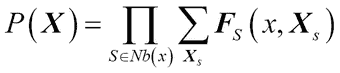
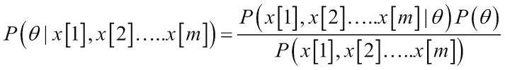
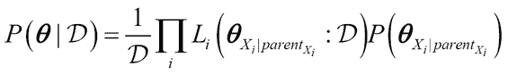
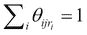
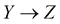
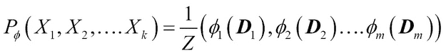
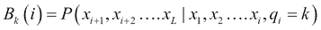
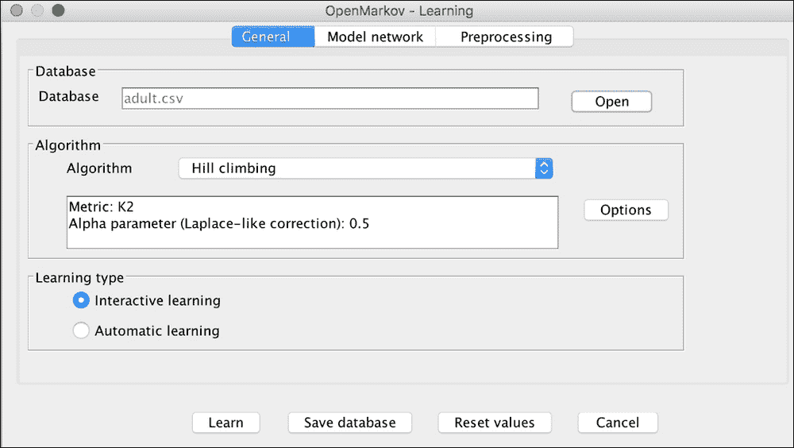

# 六、概率图建模

**概率图模型** ( **PGMs** )，也称为图模型，捕捉不同变量之间的关系，表示概率分布。PGM 捕获联合概率分布，并可用于回答不同的查询和进行推理，使我们能够对看不见的数据进行预测。PGM 具有很大的优势，可以获取专家的领域知识以及变量之间的因果关系，从而对系统进行建模。PGM 表示结构，它们可以在一个表示框架中获取知识，这使得共享和理解领域和模型变得更加容易。PGM 很好地捕捉了不确定性或概率性质，因此在需要评分或基于不确定性的方法的应用中非常有用。PGM 广泛用于使用机器学习的各种应用中，例如应用于语言处理、文本挖掘和信息提取、计算机视觉、疾病诊断和 DNA 结构预测等领域。

Judea Pearl 是 PGMs 领域的先驱，并且是第一个引入贝叶斯网络主题的人(*参考文献* [2]和[7])。尽管介绍 PGM 的所有知识超出了本章的范围，但我们的目标是详细介绍 PGM 最重要的方面——贝叶斯网络和有向 PGM。我们将把主题分为表示、推理和学习三个领域，并将讨论每个领域的具体算法和子主题。我们将涵盖马尔可夫网络和无向 PGM，总结与 PGM 的一些差异和相似之处，并解决相关领域，如推理和学习。最后，我们将讨论**树增广** **网络** ( **谭**)、马尔可夫链**隐马尔可夫模型** ( **嗯**)。关于这个主题的深入探讨，请参见柯勒和弗里德曼的*概率图形模型*(*参考文献*【1】)。

# 概率再探

概率的许多基本概念在附录 B 、*概率*中有详细介绍。概率论中的一些关键思想构成了概率图模型的基础。很好地掌握相关理论有助于理解 PGM 以及如何使用它们从数据中进行推断。

## 概率中的概念

在这一节中，我们将讨论与概率论相关的重要概念，这些概念将在本章后面的讨论中用到。

### 条件概率

给定两个相关事件 a 和，条件概率的本质是捕捉当已知另一个事件已经发生时，我们如何为其中一个事件赋值。条件概率或条件分布由*P*(*a*|*a*表示，即假设事件*a*已经发生(相当于假设*a*为真)，事件 *a* 发生的概率，形式上定义为:

*P*(*a*n*a*)捕捉 a 和 a 同时发生的事件。

### 链式法则和贝叶斯定理

条件概率定义产生了条件概率链规则，即当有多个事件α [1] ，α [2] ….α [n] 时，则:

*p*(*[**…。*[=*(*[)*(*-什么*p*(*[|*[*[【n-1】])*]*]***]**]***]*

***几个事件的概率可以表示为第一个事件的概率乘以第二个事件的概率，以此类推。因此， *α* [n] 的概率取决于一切α [1] 到α [n] 并且独立于事件的顺序。***

**贝叶斯规则也遵循条件概率规则，并且可以被正式地给出为:**

****

### **随机变量、联合和边际分布**

**通过将事件空间和结果视为属性和值来映射事件空间和结果是很自然的。随机变量被定义为具有不同已知特定值的属性。例如，如果*成绩*是与*学生*相关联的属性，并且具有值 *{A，B，C}* ，那么 *P(成绩= A)* 表示具有结果的随机变量。**

**随机变量一般用大写字母表示，如 *X* 、 *Y* 、 *Z* ，它们取的值用 *Val(X) = x* 表示。在本章中，我们将主要讨论本质上是分类的值，也就是说，取固定数量的离散值。在现实世界中，变量也可以有连续的表示。类别为{x ¹ ，x ² …x ^n 的变量的分布可以表示为:**

****

**在许多类别上的这种分布被称为**多项式分布**。在只有两个类别的特殊情况下，分布被称为**伯努利分布**。**

**给定一个随机变量，该变量描述的所有事件的概率分布称为边际分布。例如，如果等级是随机变量，边际分布可以定义为*(等级= A) = 0.25，P(等级= b) = 0.37，P(等级= C) = 0.38* 。**

**在许多现实世界的模型中，有不止一个随机变量，考虑所有这些随机变量的分布称为**联合分布**。例如，如果学生的*智力*是作为另一个变量的，用 *P(智力)*或 *P(I)* 表示，并有二元结果*{低，高}* ，那么考虑*智力*和*年级*的分布，表示为 *P(智力，年级)*或 *P(I，G)* ，就是联合分布。**

**一个随机变量的边际分布可以通过将所有其他变量的值相加而从联合分布中计算出来。如*表 1* 所示，通过对所有行求和可以获得等级的边际分布，通过对所有列求和可以获得智能的边际分布。**

**

表 1。I 和 G 上的边际分布** 

### **边际独立和条件独立**

**边际独立性定义如下。考虑两个随机变量 *X* 和*Y*；那么 *P(X|Y) = P(X)* 表示随机变量 *X* 独立于 *Y* 。形式上表示为 ( *P* 满足 *X* 独立于 *Y* )。**

**这意味着联合分布可由下式给出:**

***P(X，Y) = P(X)P(Y)***

**如果考试的难度( *D* )和学生的智力( *I* )决定了成绩( *G* )，我们知道考试的难度与学生的智力无关( *D* ⊥ *I* )也隐含着 *P(D，I) = P(D)P(I)* 。**

**当给定第三个变量时，两个随机变量是独立的，这种独立性称为条件独立。给定一组三个随机变量 *X* 、 *Y* 、 *Z* ，我们可以说；也就是说，给定 *Z* ，变量 *X* 独立于 *Y* 。有条件独立的必要条件是**

****

### **因素**

**因子是定义高维(大量变量)空间中概率分布的基本构建块。他们给出了帮助处理概率分布的基本运算。**

**“因子”被定义为将被称为“范围”的随机变量作为输入并给出真实值输出的函数。**

**形式上，一个因子被表示为，其中范围是(X [1] ， *X* [2] ，…。*X*k)。**

#### **因子类型**

**不同类型的因素如下:**

*   ****联合分布**:对于变量的每个组合，你得到一个实值输出。**
*   ****非标准化度量**:当在联合分布中，一个变量是常数时，输出也是实值，但它是非标准化的，因为它的总和不是 1。然而，它仍然是一个因素。**
*   ****条件概率分布**:形式为 *P(G|I)* 的概率分布是也是一个因子。**

**对因子执行各种操作，例如:**

*   ****因子乘积**:如果两个因子*ϕ*1(*x*[1]、 *X* [2] 和*ϕ*2 相乘，则产生*实际上，它是取对应于*ϕ*t44】1 的表格，并将其乘以*ϕ*t48】2***
*   ***因子边缘化**:这和边缘化是一样的，其中*ϕ*1 可以对一个变量进行边缘化，比如说 *X* [2] ，给*ϕ*[2]*
*   ***因子缩减**:仅当其中一个变量不变时，取其他变量的值。*

### *配送查询*

*给定随机变量的概率，可以执行许多查询来回答某些问题。一些常见的查询类型将在后面的章节中解释。*

#### *概率查询*

*这是最常见的查询类型之一，它有两个部分:*

*   ***证据**:具有众所周知的结果或类别的变量子集。例如，一个随机变量 **E = e** 。*
*   ***Query**: A random variable from the rest of the variables. For example, a random variable **X**.

    *P*(**X**|**E**=**E**)* 

*概率查询的例子是后验边际估计，例如 *P(I =高|L =差，S =低)=？*和证据概率如 *P(L =坏，S =低)=？*。*

#### *地图查询和边际地图查询*

*地图查询用于寻找最有可能的变量的子集的概率分配，因此也被称为**最可能的解释** ( **MPE** )。这些查询和概率查询的区别在于，我们得到的不是概率，而是所有变量最可能的值。*

*在形式上，如果我们有变量*W = X–E*，其中我们有 *E = e* 作为证据，并且有兴趣找到 *W* 中变量最可能的赋值，*

**地图*(**W**|**e**)=*arg max*[W]*P*(**W**， **e** )*

*边际查询的一个更一般的形式是当我们有一个变量的子集，比如说由构成我们的查询的 *Y* 给出，并且有 *E = e* 的证据，我们感兴趣的是找到 *Y* 中变量最可能的赋值。使用映射定义，我们得到:*

**地图*(**Y**|**e**)=*arg max*[Y]*P*(**Y**|**e**)*

*假设，*Z = X–Y–E*，那么边际地图查询就是:*

***

# 图形概念

接下来，我们将简单回顾一下图论中的概念以及我们将在本章中用到的一些定义。

## 图形结构和属性

图被定义为包含节点和连接这些节点的边的数据结构。在本章的上下文中，随机变量表示为节点，边表示随机变量之间的连接。

形式上，如果 *X = {X* [1] *，X* [2] *，…X* [k] *}* 其中 *X* [1] *，X* [2] *，…X* [k] 是表示节点的随机变量，那么在给出的节点之间可以有一条属于集合 e 的有向边，也可以有一条**无向边** ，该图被定义为数据结构。当集合 e 中来自集合 **X** 的节点之间的每条边都是有向的时，称一个图为**有向图**，类似地，**无向图**是节点之间的每条边都是无向的，如图 1 中的*所示。同样，如果有一个图既有有向边又有无向边，那么符号表示一条边可以是有向边也可以是无向边。*

图一。有向图、无向图和部分有向图

如果图中存在有向边，则节点*X*I 称为*父节点*，节点*X*j 称为*子节点*。

在无向图的情况下，如果有一条边*X*I*–X*[j]，则称节点 *X* [i] 和 *X* [j] 为邻居。

有向图中节点 *X* 的父节点集合称为节点 *X* 的边界，类似地，无向图中的相邻节点形成彼此的边界。节点 *X* 的度数就是它参与的边数。节点 *X* 的度数是有向图中与节点 *X* 有关系的边的数量，使得边在节点 *Y* 和节点 *X* 和 *X* → *Y* 之间。图的度是该图中节点的最大度。

## 子图和集团

子图是表示整个集合中一些节点的图的一部分。**团**是无向图中顶点的子集，使得每两个不同的顶点是相邻的。

## 路径、踪迹和循环

如果有个变量*X*1，*X*2，…。*X*K 在图 *K = (X，E)* 中，它形成一条路径，如果，对于每一个 *i* = 1，2...*k*–1，我们有或者*X*[I]*–X*[j]；也就是说，变量之间要么有一条有向边要么有一条无向边——回想一下这可以被描绘成*X*I？*X*j。有向路径至少有一条有向边:。

如果有变量 *X* [1] ， *X* [2] ，…。 *X* [k] 在图中 *K = (X，E)* 如果对于每一个 *i* = 1，2，则形成一个*尾迹*...*k*–1，我们要么有。

一个图叫做**连通图**，如果对每一个*X*I，…*X*j 在*X*I 和*X*j 之间有一条轨迹。

在一个图 *K = (X，e)* 中，如果节点 *X* 和 *Y* 之间存在有向路径， *X* 称为 *Y* 的祖先， *Y* 称为 *X* 的*后代*。

如果一个图 *K* 有一条有向路径 *X* [1] ， *X* [2] ，…*X*k 其中*X*1？*X*k，该路径称为一个**循环**。相反，没有圈的图称为**无圈**图。

# 贝叶斯网络

一般来说，所有概率性图形模型都有三个基本元素构成重要部分:

*   **表示**:这回答了模型意味着什么或者表示什么的问题。的思路是如何表示和存储 *P(X* [1] ， *X* [2] ，……*X*nT15)。
*   **推论**:这回答了这个问题:给定模型，我们如何执行查询，如何得到答案。这给了我们从已知证据中推断未知值的能力，给出了模型的结构。激发主要讨论点的是各种形式的推理，包括计算和正确性问题之间的权衡。
*   **学习**:这个回答了给定数据，什么模型是正确的这个问题。学习分为两个主要部分:

    *   学习参数给定的结构和数据
    *   学习参数给定的结构和数据

在我们的讨论中，我们将使用著名的学生网络作为贝叶斯网络的例子来说明概念和理论。学生网络有五个随机变量，捕捉各种属性之间的关系，定义如下:

*   考试难度( *D*
*   学生的智力( *I* )
*   学生得到的分数( *G*
*   学生 SAT 成绩( *S* )
*   学生根据成绩得到的推荐信( *L* )。

这些属性中的每一个都有二进制分类值，例如，变量*难度* ( *D* )有两个类别( *d* 0， *d* 1)，分别对应低和高。*等级* ( *G* )有三个类别值对应于等级 *(A，B，C)* 。图中的箭头表示从领域知识中编码的依赖关系——例如，如果我们知道考试的*难度*和学生的*智力*就可以确定*等级*，而如果我们只知道*等级* ( *图 2* )就可以完全确定*推荐信*。可以进一步观察到，变量之间没有明显的边缘表明它们是相互独立的——例如，考试的*难度*和学生的*智力*是独立变量。

> *图二。“学生”网络*

## 表象

一个图表简洁地表示了随机变量之间的复杂关系，允许快速算法在完全枚举被禁止的地方进行查询。在这里定义的概念中，我们展示了有向无环图结构和条件独立性是如何使涉及大量变量的问题变得易于处理的。

### 定义

贝叶斯网络被定义为具有以下特征的系统模型:

*   若干随机变量{ *X* [1] ， *X* [2] ，…。*X*k}
*   一个**有向** **无环图** ( **DAG** )，节点代表随机变量。
*   对每个依赖于其父节点的节点的局部 **条件概率分布**(**CPD**)*P(X*[I]*| parent(X*[I]*)*。
*   使用链式分布规则获得的联合概率分布是如下给出的因子:
*   For the student network defined, the joint distribution capturing all nodes can be represented as:

    *P(D，I，G，S，L)=P(D)P(I)P(G D，I)P(S I)P(L G)*

### 推理模式

给定一些数据和事实，贝叶斯网络有助于回答各种查询，这里讨论这些推理模式。

#### 因果或预测推理

例如，如果给出的证据是“智力低下”，那么得到右上角象限图 3 所示“好信”的几率有多大？这是通过因果推理解决的。如第一象限所示，因果推理自上而下流动。

#### 证据或诊断推理

如果给出了证据，比如一封“坏信”，那么这个学生得到“好成绩”的可能性有多大？如左上象限的图 3 所示，这个问题通过证据推理来解决。如第二象限所示，证据推理自下而上。

#### 因果推理

从寻找“相关原因”中获得有趣的模式是因果推理的目标。如果给出了“C 级”和“高智商”的证据，那么课程难度“高”的几率会是多少？这种推理也被称为“解释”，因为一个原因解释了另一个原因的原因，这在第三象限*图 3* 的左下方进行了说明。

#### 综合推理

如果一个学生选了一门“简单”的课程，却有一封“糟糕的信”，那么他得到“C”的可能性有多大？这可以用具有组合推理模式的查询来解释。请注意，它具有混合信息，并且不像其他推理模式那样沿单一固定方向流动，如图右下方象限 4 所示:

> *图 3。推理模式*

### 独立性、影响流、D-分离、I-Map

当执行查询时，可以利用节点之间的条件独立性来减少计算。在这一节中，我们将讨论一些与独立性相关的重要概念。

#### 影响力的流动

**影响** 是一个变量的条件或结果如何改变与另一个变量相关的价值或信念的影响。我们已经从推理模式中看到了这一点，这些推理模式影响直接关系(父母/子女)、因果/证据关系(父母和子女以及中间物)以及组合结构中的变量流。

影响不流动的唯一情况是当存在“v 型结构”时。也就是说，给定三个变量之间的边，在 *X* [i - 1] 和 *X* [i + 1] 之间存在 v 型结构，没有影响流。例如，课程的难度和学生的智力之间没有影响。

#### D-分离

随机变量 *X* 和 *Y* 在图 **G** 中被称为 d 分隔，假定在 **X** 和 **Y** 之间没有活动轨迹，在 **G** 中给定 **Z** 。它正式表示为:

*dsep*T2G*(X，Y|Z)*

d 分离的要点是它完美地映射到点之间的条件独立性。这给出了一个有趣的性质:在贝叶斯网络中，给定节点的父节点，任何变量都独立于它的非后代。

在学生网络示例中，节点/变量字母与难度、智力和 SAT 分开，给出了分数。

#### 智能地图

从 d-分离，在图 **G** 中，我们可以收集来自 d-分离的所有独立性，并且这些独立性被正式表示为:

如果 *P* 满足 *I* ( **G** ，那么我们说 **G** 是 *P* 的独立映射或 I 映射。

I-Map 的主要观点是，它可以被正式地证明与独立性的因式分解关系成立。反过来也可以证明。

简而言之，人们可以在贝叶斯网络图 G 中读到，不管任何参数，分布 P 中的所有独立性都成立！

以学生网络为例，其整体分布如下所示:

*P(D，I，G，S，L) = P(D)P(I|D)P(G D，I)P(S D，I，G)P(L D，I，G，S)*

现在，考虑独立于 I-Maps:

*   变量 *I* 和 *D* 是非后代并且不以父母为条件，所以 *P(I|D) = P(I)*
*   变量 *S* 独立于其非后代 *D* 和 *G* ，给定其父 *I* 。 *P(S D，I，G)=P(S|I)*
*   Variable *L* is independent of its non-descendants *D*, *I*, and *S*, given its parent *G*. *P(L¦D,I,G,S)=P(L|G)*

    *(D，I，G，S，L)=P(D)P(I)P(G D，I)P(S I)P(L G)*

因此，我们已经展示了 I-Map 有助于仅给定图网络的因式分解！

## 推论

概率图模型的最大优势是它们的能力，在给定一些证据的情况下，以条件或地图或边际地图的形式回答概率查询。

形式上，证据的概率 **E = e** 由下式给出:

但是这个问题已经被证明是 NP 难的(*参考* [3])，或者具体来说，# P-完全。这意味着当有大量的树或变量时，它是难以处理的。即使树宽(最大集团中的变量数量)为 25，这个问题似乎也很难解决——大多数现实世界的模型的树宽都比这个大。

因此，如果之前讨论的精确推理是难以处理的，那么是否可以使用一些近似，以便在一定的误差范围内，我们可以使问题易于处理？已经表明，即使是计算带有误差*的推论的近似算法？* < 0.5，这样我们就找到一个数 *p* 这样|*P*(**E**=**E**)–*P*|<*？*，也是 NP-Hard。

但好消息是，这是显示指数时间复杂性的“最坏情况”结果之一。在“一般情况”下，可以应用试探法来减少精确算法和近似算法的计算时间。

执行精确和近似推理的一些众所周知的技术在*图 4* 中描述，除了贝叶斯网络，它还涵盖了大多数概率图模型。

图 4。精确和近似推理技术

详细讨论这些问题超出了本章的范围。我们将详细解释一些算法,并附有参考文献，以便读者更好地理解。

### 基于排除的推理

这里我们将描述两种技术，变量消除算法和团树或连接树算法。

#### 变量消去算法

**变量消去** ( **VE** )算法的基础在于分配性，如图所示:

*(ab+ac+ad)= a (b+c+d)*

换句话说，通过去掉公因数 *a* ，三乘二加的五次算术运算可以减少为一乘三加的四次算术运算。

让我们通过学生网络中的一个简单例子来理解计算量的减少。如果我们要计算一个概率查询比如考试难度给定的字母是 good，即 *P(D L=good)=？*。

使用贝叶斯定理:

要计算 *P(D L=good)=？*我们可以使用链式法则和联合概率:

如果我们重新排列右边的术语:

如果我们现在替换，因为因子独立于变量 *I* ，而变量 *S* 以变量为条件，我们得到:

因此，如果我们小心地进行，一次消除一个变量，我们已经有效地将 *O(2* ^n *)* 因子转换为 *O(nk* ² *)* 因子，其中 *n* 是变量的数量， *k* 是每个变量的观察值的数量。

因此，VE 算法的主要思想是对变量进行排序，使查询变量排在最后。在变量的有序列表上维护因子列表，并执行求和。通常，我们在 VE 算法的实现中使用动态规划(*引用*【4】)。

##### 输入和输出

输入:

*   条件概率分布列表/表 **F**
*   查询变量列表 **Q**
*   观察变量列表 **E** 和观察值 **e**

输出:

*   *P*(**Q**|**E**=*E*)

##### 它是如何工作的？

该算法循环调用`eliminate`函数，如下所示:

*变量消除*:

1.  而*？*，贝叶斯网络中所有随机变量的集合不为空

    1.  从*中去掉第一个变量 **Z** ？*
    2.  *消除* ( *F* ， **Z** )

2.  结束循环。
3.  设置*？*T2 F 中所有因素的乘积
4.  在*中实例化观察变量？*到它们的观测值。
5.  返回(重正化)

*消除* ( *F* ， **Z** )

1.  从 *F* 中删除所有功能，例如， *X* [1] ， *X* [2] ，…。涉及 **Z** 的*X*k。
2.  计算新函数
3.  计算新函数
4.  添加新功能*？*到 *F*
5.  返回 *F*

考虑同样的以 *P(D，L = good)* 为目标的学生网络的例子。

1.  挑选一个变量排序列表: *S* 、 *I* 、 *L* 、 *G* 、 *D*
2.  Initialize the active factor list and introduce the evidence:

    列表: *P(S I)P(I)P(D)P(G I，D)P(L G)d(L = good)*

3.  Eliminate the variable SAT or **S** off the list

    列表: *P(I)P(D)P(G I，D)P(L G)d(L =好)* *？* 1 *(I)*

4.  Eliminate the variable Intelligence or *I*

    列表: *P(D)P(L G)d(L =好)* *？* 2 *(G，D)*

5.  Eliminate the variable Letter or *L*

    列表: *P(D)* *？* [3] *(G)* *？* [2] *(G，D)*

6.  Eliminate the variable Grade or *G*

    列表: *P(D)* *？* [4] *(D)*

这样就有了两个值，*P(D =高)* *？*[4]*(D =高)**P(D =低)* *？*[4]*(D =低)*，我们得到答案。

##### 优点和局限性

优点和局限性如下:

*   VE 算法的主要优势在于其简单性和通用性，可应用于许多网络。
*   当网络中有许多连接时，VE 的计算减少优势似乎消失了。
*   变量最优排序的选择对于计算效益非常重要。

#### 团树或连接树算法

连接树或团树是基于变量消除技术的更有效形式。

##### 输入和输出

输入:

*   条件概率分布列表/表 **F**
*   查询变量列表 **Q**
*   观察变量列表 **E** 和观察值 **e**

输出:

*   *P* ( **Q|** E = *e* )

##### 它是如何工作的？

涉及的步骤如下:

1.  **道德化**:这是一个将有向图转化为无向图的过程，分以下两步:

    1.  用节点间的无向边替换有向边。
    2.  如果有两个不相连但有一个公共子节点的节点或顶点，添加一条连接它们的边。(注意*V*4 与*V*5 与*V*2 与*V*3 中的*图*5】:

    

    图 5。十克的图形道德化,用绿色显示方向边是如何改变的,用红色显示新增加的边

2.  **三角剖分**:要理解三角剖分，必须形成弦。一个循环的弦是一对顶点*V*I 和*V*j，它们之间有一条边。如果长度≥ 4 的每个圈都有弦，则称一个图为**弦图或三角图**。注意*图 6* 中*V*1 和*V*5 之间的边形成弦使道德化图形成为弦/三角化图形:

    图 6。添加蓝色边的图三角剖分将道德化图转换为弦图

3.  **Junction Tree**: From the chordal graphs a junction tree is formed using the following steps:

    1.  找出图中的所有集团，并使它们成为具有所有顶点的集群的节点。团是在每对节点之间存在一条边的子图。如果两个节点有一个或多个公共顶点，则创建一条由相交顶点组成的边作为分隔符或 sepset。例如，具有边缘的循环 *V* [1] 、 *V* [4] 、 *V* [5] 和 *V* [6] 、 *V* [4] 、 *V* [5] 在*V*[4[之间具有公共边缘]]

    如果上图包含一个循环，则循环中的所有分隔符都包含相同的变量。通过创建最小生成树来删除图中的循环，同时包括最大分隔符。整个转换过程如图 7 所示:

    

    图 7。连接树的形成

4.  **在连接树**上运行消息传递算法:连接树可用于计算联合分布，使用集团和分隔符的因子分解，如
5.  **计算连接树的参数**:连接树参数可以利用原始贝叶斯网络中的父节点逐节点获得，称为集团势，如下:

    1.  ( *？*1=*P*(*V*[5]|*V*[2]， *V*3)*P*(*V*3)(注在原贝叶斯网边 *V* [5] 依赖于 *V* [2] ，*V*[3V[3]]

6.  **连接树**中节点/集团间的消息传递:连接树中的一个节点，用集团*C*I 表示，将所有来自其邻居的消息与自己的集团势相乘，得到一个范围为集团的因子。然后，它对除 sepset 或分隔符*S*I，j 上的变量之外的所有变量求和，这些变量位于*C*I 和*C*j 之间，然后将结果因子作为消息发送给*C*j。

    图 8。连接树中节点/集团之间的消息传递

    

这样，当消息传递到达树根时，联合概率分布就完成了。

##### 优点和局限性

优点和局限性如下:

*   算法对与连接树中的树宽相关的计算有一个理论上的上限。
*   集团中每个势的倍增会导致数值上溢和下溢。

### 繁殖技术

在这里，我们讨论信念传播，这是一种常用的消息传递算法，通过引入因子图和可以在这些图中流动的消息来进行推理。

#### 信念传播

信念传播是最实用的推理技术之一，适用于大多数概率图模型，包括有向图、无向图、基于链的图和时态图。为了理解信念传播算法，我们需要首先定义因子图。

##### 因子图

从基本的概率理论中我们知道，整个联合分布可以表示为变量子集上的一个因子，如下所示

在 DAG 或贝叶斯网络中*f*s 是一种条件分布。因此，与变量子集相比，在表达因子的联合分布方面有很大的优势。

因素图是网络的一种表示，其中变量和涉及变量的因素都被制成显式节点(*引用* [11])。在上一节的一个简化的学生网络中，因子图如图*图 9* 所示。

图 9。简化的“学生”网络的因子图

因子图是一个二分图，即它有两种类型的节点，变量和因子。

边缘在两种相反的类型之间流动，即从变量到因子，反之亦然。

将贝叶斯网络转换为因子图是一个简单的过程，如前所示，您可以开始添加变量节点和条件概率分布作为因子节点。贝叶斯网络和因子图之间是一对多的关系，即同一个贝叶斯网络可以在多个因子图中表示，并且不是唯一的。

##### 因子图中的消息传递

有两种不同的信息在这些因素图中流动，这些因素图构成了通过通信进行的大部分计算。

*   **从因子节点到变量节点的消息**:从因子节点发送到变量节点的消息在数学上可以表示为:其中因此，是来自因子节点 *f* [s] 到 *x* 的消息以及来自 *x* 到 *x* 的邻居的所有此类消息的乘积图 10。从因子节点到变量节点的消息传递
*   **变量节点到因子节点的消息**:和前面的例子类似，变量到因子的消息可以表示为

因此，所有到达节点 *x* [m] 的因子都被相乘，除了它发送到的因子。

图 11。从变量节点到因子节点的消息传递

##### 输入和输出

输入:

*   条件概率分布列表/表(CPD/CPT) *F*
*   查询变量列表 **Q**
*   观察变量列表 **E** 和观察值 **e**

输出:

*   *P* ( **Q|** E = *e* )

##### 它是如何工作的？

1.  根据前面讨论的贝叶斯网络创建一个因子图。
2.  将节点 **Q** 视为图的根。
3.  初始化所有的叶子节点，即:和
4.  以递归方式将消息从一个叶节点传递到下一个节点。
5.  移动到下一个节点，直到到达根节点。
6.  根节点处的 Marginal 给出结果。

##### 优点和局限性

优点和局限性如下:

*   所讨论的这个算法非常通用，可以用于大多数图形模型。当有向树中没有环时，该算法给出精确的推理。
*   这可以很容易地并行实现，并有助于可伸缩性。根据连接情况，内存需求可能非常高。

### 基于采样的技术

我们将讨论一个简单的方法，使用粒子和采样来说明从随机变量生成分布 *P(X)* 的过程。其思想是从贝叶斯网络中重复采样，并使用带有计数的样本来近似推断。

#### 带拒绝的正向采样

关键的想法是使用拓扑顺序生成迭代变量的独立同分布样本。在一些证据的情况下，例如， *P(X|E = e)* 与生成的样本相矛盾，最简单的方法是拒绝样本并继续进行。

##### 输入和输出

输入:

*   条件概率分布列表/表 *F*
*   查询变量列表 **Q**
*   观察变量列表 **E** 和观察值 **e**

输出:

*   *P* ( **Q|** E = *e* )

##### 它是如何工作的？

1.  为 *j* = 1 到*m*//样本数

    1.  创建一个拓扑顺序的变量，比如说 **X** [1] ， **X** [2] ， **… X** [n] 。
    2.  为 *i* = 1 为*n*

        1.  **u**[I]？**X**(父(**X**I)//将*父*(**X**I)赋值给变量
        2.  *样本*(**X**I， *P* ( **X** [i)、*P*(**X**[I]|**E**=**E**)拒绝，转到 1.1.2。//如果样品与证据不符，则拒绝样品。]

    3.  回车( **X** [1] ， **X** [2] ，…。**X**n 作为样本。

2.  使用样本中的计数计算 *P* ( **Q** | **E** = e)。

为学生网络生成的一个样本的示例可以是:对难度进行采样并变低，接下来对智力进行采样并变高，接下来使用 CPD 表对难度=低、智力=高的等级进行采样，得到等级=A，对智力=高的 SAT 进行采样，得到 SAT =好，最后使用等级=A 对字母进行采样，得到字母=好。因此，我们得到第一个样本(难度=低，智力=高，等级=A，SAT =好，字母=好)

##### 优点和局限性

优点和局限性如下:

*   这种技术实现和执行起来相当简单。它要求大量的样本在界限内近似。
*   当证据集很大时，拒绝过程会变得很昂贵。

## 学习

学习背后的想法是在给定数据和领域专家的情况下，生成一个结构或找到参数，或者两者都有。

学习的目标如下:

*   为了便于贝叶斯网络中的推理。推理的前提是结构和参数已知，这是学习的输出。
*   使用贝叶斯网络促进预测。给定观察变量 **X** ，预测目标变量 **Y** 。
*   使用贝叶斯网络促进知识发现。这意味着从数据中理解因果关系、关系和其他特征。

学习，一般来说，可以用*图 12* 来表征。假设有一个已知的概率分布 *P ^** ，它可能是也可能不是从贝叶斯网络 *G ^** 中生成的。假设观测数据样本是从已知的概率分布 *P ^** 中生成或采样的。领域专家可能在场，也可能不在场，以包括关于该结构的知识或先验信念。与其他机器学习算法相比，贝叶斯网络是少数几种可以直接使用领域专家在变量关系或先验概率方面的输入的技术之一。在知识获取和从数据中学习的过程结束时，我们得到具有定义的结构和参数的贝叶斯网络(CPT)作为输出。

图 12。贝叶斯网络学习的要素

基于数据质量(缺失数据或完整数据)和来自专家的结构知识(未知和已知)，下面的是贝叶斯网络学习的四个类别，如*表 2* 所示:

| 数据 | 结构 |
| 已知结构(学习参数) | 未知结构(学习结构和参数) |
| 完整数据 | 参数估计(最大似然，贝叶斯估计) | 最佳化(搜索和评分技术) |
| 不完整数据 | 非线性参数优化(期望最大化，梯度下降) | 结构和参数优化(结构 EM，混合模型) |

> *表 2。贝叶斯网络学习的种类*

### 学习参数

在本节中，我们将讨论两种广泛使用的方法来估计给定结构的参数。我们将只讨论完整的数据，读者可以参考(*参考文献* [8])中关于不完整数据参数估计的讨论。

#### 贝叶斯网络的最大似然估计

**最大** **似然估计** ( **MLE** )是一种非常通用的方法，可以定义为:给定一个数据集合 *D* ，选择满足以下条件的参数:

*   
*   
*   

最大似然法是在给定训练数据的情况下选择贝叶斯网络参数的技术。详细讨论见(*参考文献* 6】)。

给定图 *G* 和训练数据

现在每个例子或实例都可以用变量来表示。如果有由*x*I 表示的 *i* 变量，并且每个变量的父变量由*父变量*Xi 给出，那么:

互换变量和实例:

术语是:

这是给定其父变量*父变量*Xi 的某个变量 *x* *[i]* 的条件可能性。因此，这些条件可能性的参数是由给出的参数的子集。因此:

这里，称为局部似然函数。这变得非常重要，因为总似然分解成局部似然的独立项，并被称为似然函数的全局分解属性。其思想是，通过简单地使用来自训练数据的不同结果的计数，这些局部似然函数可以被进一步分解为表格 CPD。

设 *N* [ijk] 为我们观察变量或节点 *i* 处于状态 *k* [，]给定父节点配置 *j* :

例如，我们可以有一个对应于 *X* [i] *= a* 和*父* [Xi] *= b* 的简单条目，通过从训练数据估计似然函数如下:

作为例子，考虑两种情况。首先，满足 10 个实例，其中*父*[*= b*= 100。第二种，当*父*[Xi]*= b*= 1000 时，满足 100。请注意，这两种概率达到了相同的值，而第二种概率的数据是第一种概率的 10 倍，是“更有可能”的估计值！类似地，对领域或先前知识的熟悉程度，或者由于不确定性而缺乏知识，也不会被 MLE 捕获。因此，当样本数量有限时，或者当领域专家知道先验知识时，这种方法就会遇到严重的问题。]

#### 贝叶斯网络的贝叶斯参数估计

这种技术通过编码关于参数*的先验知识克服了 MLE 的问题。*具有概率分布。因此，我们可以将关于参数空间的信念或先验知识编码为概率分布，然后在估计中使用变量和参数的联合分布。

让我们考虑单变量参数学习，其中我们有实例 *x* [1]， *x* [2] … *x* [M]，并且它们都有参数**？** [X] 。

图 13。单变量参数学习

因此，网络是参数和数据的联合概率模型。优点是我们可以用它来做后验分布:

， *P(？)=之前的*，

因此，最大似然和贝叶斯估计的区别在于先验的使用。

给定数据集 *D* ，将其推广到贝叶斯网络 *G* :

如果我们假设参数是全局独立的

因此，我们得到

再次，如之前，子集**？**Xi|*母*Xi 之**？**是局部的，因此整个后验概率可以用局部术语计算！

##### 先验和后验采用狄利克雷分布

通常，在实践中，被称为狄利克雷分布的连续概率分布——这是一种贝塔分布——被用于来表示参数的先验。

概率密度函数:

这里，，α项被称为超参数，而 *a* [ ijri ] > 0。是伪计数，也称为等效样本量，它为我们提供了先验的度量。

贝塔函数 *B(a* [ij] *)* 通常用伽马函数表示如下

使用狄利克雷分布的优点是它本质上是共轭的，也就是说，不管可能性如何，如果先验是狄利克雷，则后验也是狄利克雷！

可以看出参数*的后验分布？* [ijk] 是一个超参数更新的狄利克雷，有一个封闭形式的解！

*a*[ijk]=*a*[ijk]+*N*[ijk]

如果我们使用最大后验估计值和后验均值，它们可以表示为:

### 学习结构

在没有任何领域知识或不了解结构的情况下学习贝叶斯网络包括学习结构和参数。我们将首先讨论用于评估网络结构的一些度量，然后讨论用于构建最佳结构的一些众所周知的算法。

#### 评估结构的措施

给定数据集，用于评估贝叶斯网络结构的度量可以大致分为以下类别，许多类别的细节可以在这里获得(*参考文献* [14])。

*   **Deviance-Threshold Measure**: The two common techniques to measure deviance between two variables used in the network and structure are Pearson's chi-squared statistic and the Kullback-Leibler distance.

    给定 *M* 个样本的数据集 *D* ，考虑两个变量*X*I 和*X*j，度量散度的皮尔逊卡方统计量为

    

    *d* [？2] *(D)* 为 0；当变量是独立的，较大的值表示变量之间存在相关性。

    库尔巴克-莱布勒散度是:

    

    *d* [I] *(D)* 再次为 0，表示独立，数值越大表示依赖。使用各种统计假设检验，可以使用阈值来确定显著性。

*   **结构得分度量**:在贝叶斯网络中，有各种各样的方法给一个结构打分。我们将在这里讨论最常用的措施。在参数学习中讨论的对数似然分数可以用作结构的分数:
*   **贝叶斯信息得分** ( **BIC** )也是一种相当流行的得分技术，因为它通过考虑复杂结构的惩罚来避免过拟合，如下面的等式所示

罚函数在 *M* 中是对数的，因此，随着它的增加，复杂结构的罚函数不太严重。

Akaike 信息得分(AIC)与 BIC 相似，具有相似的基于惩罚的得分，并且是:

在参数学习中讨论的贝叶斯分数也被用作评分标准。

#### 学习结构的方法

我们将在本节讨论一些用于学习结构的算法；细节可以在这里找到(*参考文献* [15])。

##### 基于约束的技术

基于约束的算法使用各种变量的独立性测试，通过遵循这里讨论的一步一步的过程，试图找到我们在前面的部分中讨论的不同的结构依赖性，例如 d 分离、v 结构等等。

###### 输入和输出

输入是带有所有变量 *{X，Y }的数据集 *D* ..}* 已知每一个实例{1，2，... *m* }，并且没有缺失值。输出是一个贝叶斯网络图 *G* ，所有的边、方向都在 **E** 和 CPT 表中。

###### 它是如何工作的？

1.  创建一个无向边 **E** 的空集。
2.  检验两个独立于有边方向的变量之间的条件独立性。

    1.  若对于所有子集**S**=*U*–{*X，Y* }，若 *X* 独立于 *Y* ，则将其添加到无向边集合**E***’*。

3.  一旦识别出所有潜在的无向边，就可以从集合**E***’*中推断出边的方向性。

    1.  考虑一个三元组 *{X，Y，Z}* ，如果有一条边*X–Z*和*Y–Z*，但是在*X–Y*之间没有边使用集合中的所有变量，并且进一步，如果 *X* 不独立于 *Y* 给定所有的边**S**=*U*-
    2.  添加边缘和设置 **E** 。
    3.  使用本地计算更新 CPT 表。

    
4.  返回贝叶斯网络 *G* ，边 **E** ，以及 CPT 表。

###### 优点和局限性

*   缺乏鲁棒性是这种方法的最大缺点之一。由于独立性假设会渗透到独立测试中，数据中的小错误会对结构造成大的影响。
*   可伸缩性和计算时间是一个主要问题，因为每个变量子集都要经过测试，并且大约为 2 ^n 。随着变量的数量增加到 100 个，这种方法由于计算时间而失败。

##### 搜索和基于分数的技术

搜索和评分方法可以被视为一种启发式优化方法，其中通过小扰动迭代地改变结构，并且使用诸如 BIC 或最大似然法之类的测量来给结构评分，以找到最佳评分和结构。爬山法、深度优先搜索法、遗传算法等等，都被用于搜索和评分。

###### 输入和输出

输入是包含所有变量 *{X，Y }的数据集 *D* ..}* 已知每一个实例{1，2，... *m* }并且没有缺失值。输出是贝叶斯网络图 *G* ，所有的边和方向都在 **E** 中。

###### 它是如何工作的？

图 14。搜索和评分

1.  初始化图 *G* ，或者基于领域知识或者空或者满。根据图形初始化边集 **E** ，根据图形 *G* 、 **E** 和数据 *D* 初始化 CPT 表 *T* 。还提到了正常终止条件，例如*最大终止时间*:
2.  *maxScore= -8，score=computeScore(G，* **E** *，T)*
3.  do

    1.  *max score = score*
    2.  For each variable pair*(X，Y)*

        1.  For each
        2.  New Graph G ' based parents and variables with edge changes
        3.  计算新的 CPT*T’？computeCPT(G '，E '，D)* 。
        4.  *currentScore = computeScore(G '，* **E** *'，T ')*
        5.  If*currentScore>score*:

            1.  *score = currentScore*
            2.  *G ' = G*， **E** *'* =

4.  **重复 3 while ( **

###### **优点和局限性**

*   **陷入局部最优是大多数启发式搜索方法的缺点，也是最大的缺点之一。**
*   **启发式搜索中没有收敛性或理论上的保证，所以搜索终止性很大程度上是靠猜测。**

**

# 马尔可夫网络和条件随机场

到目前为止，我们已经讨论了概率图模型领域中的有向无环图，包括表示、推理和学习的各个方面。当图是无向图时，它们称为**马尔可夫网络** ( **MN** )或**马尔可夫随机** **场** ( **MRF** )。像以前一样，我们将在本节讨论马尔可夫网络的一些方面，包括表示、推理和学习。马尔可夫网络或 MRF 在诸如分割、去噪、立体、识别等计算机视觉的各个领域中非常流行。如需进一步阅读，请参见(*参考文献*【10】)。

## 表象

即使马尔可夫网络，像贝叶斯网络一样，有无向的边，它仍然有局部的相互作用和分布。我们将首先讨论参数化的概念，这是一种捕捉这些相互作用的方法，然后讨论 MN 中的独立性。

### 参数化

MN 中变量之间的相似性通过以下章节中讨论的三种可选参数化技术来获取。

#### 吉布斯参数化

概率分布函数被称为处于吉布分布或由吉布分布参数化，如果

*Z* 称为配分函数，定义为:

请注意，变量之间的相互作用由因子捕获，不是边际概率，而是对联合概率的贡献。参数化马尔可夫网络的因素称为集团势。通过在图中的最大团上选择因子，参数的数量大大减少。

#### 因子图

马尔可夫网络的图结构在使用 Gibbs 参数化时并不揭示诸如因素是否涉及最大团或它们的子集的性质。在贝叶斯网络的推理一节中讨论的因子图具有识别最大集团的步骤，因此可以捕获这些参数化。请参考 BN 中的因子图部分。

#### 对数线性模型

参数化的另一种形式是使用来自统计物理学的能量模型表示。

势被表示为一组特征，势表通常由具有与其相关联的权重的特征来表示。

如果 *D* 是一组变量，是一个因子，那么:

因此，随着能量的增加，概率降低，反之亦然。在统计物理学中，在中捕获的对数细胞频率被称为对数线性。联合概率可以表示为:

是定义在**D**I 中变量上的特征函数。

### 独立自主

像贝叶斯网络一样，马尔可夫网络也编码了一组控制无向图中影响流的独立性假设。

#### 全球

一组节点 **Z** 分隔一组节点 **X** 和 **Y** ，如果 *X* 中任意节点之间没有活动路径？ **X** 和 *Y* ？ **Y** 给定 **Z** 。图 *G* 中的独立性为:

#### 成对马氏

两个节点， *X* 和 *Y* ，如果它们之间没有直接的边，那么它们是独立的。这种属性具有局部独立性，是所有属性中最弱的:

##### 马氏毯

给定其马尔可夫毯，节点独立于图中的所有其他节点，这是马尔可夫网络中的一个重要概念:

这里***= X 的马氏毯*。**

***图 15* 显示了一个马氏毯为变量 *X* 为其的父母、子女和子女的父母:**

**

图 15。节点 X 的 Markov blanket 它的父节点、子节点和子节点的父节点。** 

## **推论**

**MNs 中的推理是类似的# P-完全问题，因此应用了类似的近似或试探法。贝叶斯网络中讨论的大多数精确和近似推理技术，如变量消去法、连接树法、信念传播法等，都可以直接应用于马尔可夫网络。边缘和条件保持相似，并通过集团上的潜在函数进行计算，如下**

********

**马尔可夫毯简化了一些计算。**

## **学习**

**由于划分函数中所有参数的纠缠，学习马尔可夫网络中的参数是复杂且计算昂贵的。将计算分解成局部分布的有利步骤无法完成，因为划分函数需要网络中所有变量的因子耦合。**

**MN 中的最大似然估计没有封闭形式的解，因此使用诸如梯度下降的增量技术来优化整个参数空间。优化函数可以显示为凹函数，从而确保全局最优，但是梯度下降中的每一步迭代都需要在整个网络上进行推理，这使得计算成本很高并且有时难以处理。**

**贝叶斯参数估计需要对整个参数空间进行积分，这同样没有封闭形式的解，甚至更难。因此，最常见的是，近似学习方法，如**马尔可夫链蒙特卡罗** ( **MCMC** )用于 MNs。**

**MNs 中的结构学习类似于甚至比参数学习更难，并且已经被证明是 NP 难的。在基于约束的方法中，对于给定的数据集，测试变量之间的条件独立性。在 MNs 中，使用变量对之间的互信息来测试每对变量的条件独立性。然后，基于阈值，边缘被认为存在于该对之间或者不存在。这种方法的一个缺点是需要非常大量的样本来反驳数据中存在的任何噪声。由于成对边缘的出现而导致的网络的复杂性是另一个限制。**

**在搜索和基于分数的学习中，目标类似于 BNs，其中搜索是针对结构进行的，并且基于各种技术计算分数以帮助和调整搜索。在 MNs 的情况下，我们使用对数线性模型中描述的特征，而不是电势。在优化和评分过程中考虑特征的权重。**

## **条件随机字段**

****条件** **随机场** ( **CRFs** )是马尔可夫网络的一种特殊形式，其中隐藏的和可观察的主要针对标记序列预测问题进行建模(*参考文献*【16】)。序列预测问题出现在许多文本挖掘领域，如下一个单词/字母预测、**词性** ( **词性**)标注等，以及用于 DNA 或蛋白质序列预测的生物信息学领域。**

**CRFs 背后的思想是序列的条件分布被建模为特征函数，并且标记的数据被用于通过优化经验分布来学习，如下图所示。**

**条件分布表示如下，其中 *Z* ( **x** )是归一化常数。最大似然用于*的参数估计？*一般是通过梯度下降等迭代优化方法获得的对数线性凸函数。**

******

图 16:映射到词类标记域中序列预测区域的条件随机字段。** **

# 专业网络

在本节中，我们将涵盖一些基本的专业概率图模型，这些模型在不同的机器学习应用中非常有用。

## 树形增强网络

在第二章、*现实世界监督学习的实用方法*中，我们讨论了朴素贝叶斯网络，它做出了所有变量相互独立的简化假设，只依赖于目标或类变量。这是从数据集导出或假设的最简单的贝叶斯网络。正如我们在前面几节中看到的，学习贝叶斯网络中的复杂结构和参数可能很困难，有时甚至很棘手。**树增强网络**或 **TAN** ( *引用*【9】)可以被认为是中间的某个地方，引入了对树如何连接的约束。TAN 对特征或变量关系进行约束。除了目标变量之外，一个特征只能有一个其他特征作为父特征，如下图所示:

图 17。显示与朴素贝叶斯和贝叶斯网络的比较以及每个节点一个父节点的约束的树扩充网络。

### 输入和输出

输入是将所有特征作为变量的训练数据集 *D* ..} 。如果不需要作为预处理步骤进行离散化，则要素具有离散的结果。

输出作为贝叶斯网络与 CPT。

### 它是如何工作的？

1.  从训练数据集中计算每对变量之间的互信息。
2.  建立一个无向图，每个节点是变量，边是它们之间的互信息。
3.  创建一棵最大加权生成树。
4.  通过选择结果或目标变量作为根，并使所有边向外流动，将生成树转换为有向图。
5.  如果类变量和其他特征之间没有有向边，则添加它。
6.  基于之前构建的 DAG 或 TAN 计算 CPT。

### 优点和局限性

*   在许多实际模型中，它比朴素贝叶斯更准确。与完全贝叶斯网络相比，它的构建和计算更简单、更快速。

## 马尔可夫链

马尔可夫链是专门的概率图模型，有向图包含循环。马尔可夫链可以被视为自动机的扩展，其中权重是转移的概率。马尔可夫链对于建模可直接观察到的时间或序列变化非常有用。进一步研究见(*参考文献*【12】)。

*图 17* 表示一个马尔可夫链(一阶),其一般定义可作为一个随机过程给出，包括

节点为状态。

表示状态或节点之间转移概率的边。一般用矩阵来表示，它是一个 *N* X *N* 的矩阵，其中 *N* 是节点或状态的个数。在给定状态*q*k 的情况下，的值捕捉到节点*q*l 的转移概率。矩阵的行加 1 和的值。

处于该状态的初始概率， *p* = { *p* [1] ， *p* [2] ，… *p* [N] }。

因此，它可以写成三元组 *M* = (Q， **A 【T3， *p* )并且处于任何状态的概率只取决于最后一个状态(一阶):**

联合概率:

图 18。一阶马尔可夫链

### 隐马尔可夫模型

在许多真实世界的情况下，我们感兴趣的事件是无法直接观察到的。例如，句子中的单词是可观察的，但生成句子的词性却不是。**隐马尔可夫** **模型** ( **HMM** )帮助我们对这类存在可观测事件和隐藏状态的状态进行建模(*参考文献*【13】)。HMM 广泛用于各种建模应用，例如语音识别、语言建模、时间序列分析和生物信息学应用，例如 DNA/蛋白质序列预测。

图 19。显示隐藏变量和可观测值的隐藏马尔可夫模型。

隐藏的马尔可夫模型可以再次定义为三重，其中:

*   是一组被观察到的有限状态或符号。
*   q 是一组不可观测的有限状态。
*   t 是参数。

给定为的状态转移矩阵捕获了从状态*q*k 到*q*l 的转移概率。

捕捉隐藏状态和观察状态之间关系的发射概率，给定为和 *b* ？？。。

初始状态分布 *p* = { *p* [1] ， *p* [2] ，… *p* [N] }。

因此，HMM 中由一系列隐藏状态 Q = { *q* [1] ， *q* [2] ，… *q* [L] }组成的路径是一阶马尔可夫链 *M* = (Q， **A** ， *p* )。HMM 中的这条路径发出一个符号序列， *x* [1] ， *x* [2] ， *x* [L] ，称为观测值。因此，已知观察和隐藏状态，联合概率是:

在现实世界的情况下，我们只知道观察值 *x* ，不知道隐藏状态 *q* 。HMM 帮助我们回答以下问题:

*   最有可能产生观察结果 *x* 的路径是什么？
*   *x* 的概率是多少？
*   给定观察值，处于状态 *q* i *= k* 的概率是多少？

### HMM 中最可能的路径

让我们假设观察值 *x* = *x* [1] ， *x* [2] ， *x* [L] ，我们想要找到生成观察值的路径。这可以表示为:

路径 *q** 不需要是唯一的，但是为了计算和解释，通常假设唯一的路径。以一种天真的方式，我们可以计算长度为 *L* 和 *q* 的所有可能路径，并选择具有最高概率给出指数计算项或速度的路径。更有效的是使用维特比算法，使用动态规划和递归的概念。它的工作原理很简单，就是将等式分解成更简单的项，如下所示:

这里，和给定初始条件，使用动态规划并保持指针指向路径，我们可以有效地计算答案。

### 隐马尔可夫模型中的后验解码

在给定观测值 *x* 的情况下，处于状态*q*Ik 的概率可以使用贝叶斯定理写成:

分子可以改写为:

其中称为前向变量，称为后向变量。

前向变量的计算类似于维特比算法，使用动态编程和递归，而不是求和:

观察到 *x* 的概率可以是，那么

前向变量是联合概率，后向变量是条件概率:

它被称为反向变量，因为动态编程表是从第*L*第列开始反向填充到第一列的。后向概率也可用于计算观察到 *x* 的概率，如下所示:

# 工具和用法

在这一节中，我们将介绍 Java 中两个非常流行的概率图建模工具。

## OpenMarkov

OpenMarkov 是一个基于 Java 的 PGM 工具，下面是来自 www.openmarkov.org T2 的描述:

### 注意

OpenMarkov 是由 UNED 智能决策支持系统研究中心开发的概率图形模型(PGM)软件工具。

它被设计用于:编辑和评估几种类型的 PGM，如贝叶斯网络、影响图、分解马尔可夫模型等等，从数据中交互式地学习贝叶斯网络，以及成本效益分析。

OpenMarkov 非常擅长从数据中执行交互式和自动化学习。它能够对数据进行预处理(使用频率和值进行离散化)，并使用一些搜索算法(如基于搜索的爬山法和基于分数的 PC)进行结构和参数学习。OpenMarkov 以一种称为 pgmx 的格式存储模型。要在大多数传统包中应用模型，可能需要将 pgmx 模型转换为 XMLBIF 格式。各种开源工具提供了这些转换。

这里我们有一些截图，展示了如何使用 OpenMarkov 从数据中学习结构和参数。

在*图 20* 中，我们看到了交互式学习屏幕，您可以在其中选择要使用的数据文件和算法:

图 20。OpenMarkov GUI–交互式学习，算法选择

下一步是 **预处理**选项卡(*图 21* ，在这里我们可以选择如何进行离散化:

图 21。open Markov GUI–预处理屏幕

最后，在*图 22* 中，我们看到学习过的贝叶斯网络结构的显示:

图 22。open Markov GUI–结构输出

## Weka 贝叶斯网络 GUI

与 OpenMarkov 相比，Weka 的用于交互式和自动化学习的 Bayes 网络编辑器具有大量用于 Bayes 网络表示、推理和学习的选项。使用 Weka 的优势是可以获得许多集成良好的预处理和转换过滤器、算法、评估和实验指标。

在*图 23* 中，我们看到了贝叶斯网络编辑器，其中选择了搜索算法，并且可以配置各种选项:

图 23。WEKA Bayes 网络–配置搜索算法

在*图 24* 的输出屏幕中显示了学习到的贝叶斯网络的结构和参数:

图 24。WEKA Bayes 网络——学习参数和结构

# 案例研究

在本节中，我们将使用真实世界的机器学习数据集进行案例研究，以说明贝叶斯网络中的一些概念。

我们将使用 UCI 成人数据集，也称为*人口普查收入*数据集(【http://archive.ics.uci.edu/ml/datasets/Census+Income】T2)。这个数据集是从美国人口普查局 1994 年的人口普查数据中提取的。数据的捐赠者是 Ronny Kohavi 和 Barry Becker，他们当时在 Silicon Graphics 工作。该数据集由 48，842 个实例组成，具有 14 个属性，混合了分类和连续类型。目标类是二进制的。

## 商业问题

问题包括基于人口普查数据预测人口成员的收入，特别是他们的收入是否大于 50，000 美元。

## 机器学习映射

这是一个分类问题，这一次我们将训练贝叶斯网络来开发预测模型。我们将使用线性、非线性和集成算法，就像我们在前几章的实验中所做的那样。

## 数据采样和转换

在原始数据集中，有 3620 个实例具有缺失值和六个重复或冲突实例。这里我们只包括没有丢失值的例子。这个集合，没有未知数，被分成 30，162 个训练实例和 15，060 个测试实例。

## 特征分析

特性及其描述在*表 3* 中给出:

| 

特征

 | 

类型信息

 |
| --- | --- |
| 年龄 | 连续的。 |
| workclass | 私人，自我雇佣公司，自我雇佣公司，联邦政府，地方政府，州政府，无薪，从未工作过。 |
| fnlwgt | 连续的。 |
| 教育 | 学士，一些学院，11，HS-grad，Prof-school，Assoc-acdm，Assoc-voc，9，7-8，12，硕士，1-4，10，博士，5-6，学前。 |
| 教育-数量 | 连续的。 |
| 婚姻状况 | 已婚配偶，离婚，未婚，分居，丧偶，已婚配偶不在，已婚配偶。 |
| 职业 | 技术支持，工艺修理，其他服务，销售，行政管理，专业，清洁工，机器操作，检查，行政，文书，农业，渔业，运输，私人服务，保护服务，武装部队。 |
| 关系 | 妻子，自己的孩子，丈夫，非家庭成员，其他亲属，未婚。 |
| 人种 | 白人、亚洲太平洋岛民、美洲印第安爱斯基摩人、其他人、黑人。 |
| 性 | 女，男。 |
| 资本收益 | 连续的。 |
| 资本损失 | 连续的。 |
| 每周小时数 | 连续的。 |
| 母国 | 美国、柬埔寨、英国、波多黎各、加拿大、德国、美国外围(关岛-USVI 等)、印度、日本、希腊、中国、古巴、伊朗、洪都拉斯、菲律宾、意大利、波兰、牙买加、越南、墨西哥、葡萄牙、爱尔兰、法国、多米尼加共和国、老挝、厄瓜多尔、台湾、海地、哥伦比亚、匈牙利、危地马拉、尼加拉瓜、苏格兰、泰国、南斯拉夫、萨尔瓦多、特立尼达和多巴哥&秘鲁、香港、荷兰。 |

> *表 3。UCI 成人数据集–特征*

数据集按标签分为 24.78% (>50K)到 75.22% ( <= 50K). Summary statistics of key features are given in *)图 25* :

图 25。功能摘要统计

## 模型、结果和评估

我们将使用不同风格的贝叶斯网络结构以及常规的线性、非线性和集成算法对成人数据集进行详细分析。Weka 还可以选择使用菜单项在训练数据集上可视化图形模型，如图*图 26* 所示。当领域专家想要理解图模型的假设和结构时，这非常有用。如果领域专家想要更改或改变网络，可以使用贝叶斯网络编辑器轻松完成并保存。

图 26。WEKA Explorer–可视化菜单

*图 27* 显示了经过训练的贝叶斯网络模型的图形结构的可视化:

图 27:贝叶斯网络学习结构的可视化。

用于实验的算法有:

*   贝叶斯网络分类器
*   连续数据上带缺省核估计的朴素贝叶斯
*   连续数据监督离散化的朴素贝叶斯
*   使用 K2 算法和每个节点三个父节点的选择的具有搜索分数结构参数学习的树扩充网络(TAN)
*   带搜索和评分的贝叶斯网络
*   使用爬山和 K2 搜索
*   使用简单估计进行评分
*   父母的选择从两个变为三个，以说明对指标的影响
*   非贝叶斯算法
*   逻辑回归(默认参数)
*   KNN(有 10 个邻国的 IBK)
*   决策树(J48，默认参数)
*   AdaBoostM1(决策树桩和默认参数)
*   随机森林(默认参数)

*表 4* 给出了实验中使用的所有学习器的评估度量，包括贝叶斯网络分类器以及非贝叶斯算法:

| 

算法

 | 

TP 率

 | 

FP 率

 | 

精确

 | 

回忆

 | 

f-测度

 | 

玛丽勒本板球俱乐部

 | 

ROC 区域

 | 

中国地区

 |
| --- | --- | --- | --- | --- | --- | --- | --- | --- |
| 朴素贝叶斯(核估计量) | Zero point eight three one | Zero point three nine one | Zero point eight two one | Zero point eight three one | Zero point eight two two | Zero point four nine four | Zero point eight nine one | Zero point nine zero six |
| 朴素贝叶斯(离散化) | Zero point eight four three | Zero point one nine one | Zero point eight six one | Zero point eight four three | Zero point eight four eight | Zero point six | Zero point nine one seven | Zero point nine three |
| TAN (K2，3 个父母，简单估计量) | Zero point eight five nine | Zero point two seven three | Zero point eight five six | Zero point eight five nine | Zero point eight five seven | Zero point six | Zero point nine one six | Zero point nine three one |
| BayesNet (K2，3 个双亲，简单估计量) | Zero point eight six three | Zero point two eight three | Zero point eight five eight | Zero point eight six three | Zero point eight six | Zero point six zero five | Zero point nine three four | Zero point nine one nine |
| BayesNet (K2，2 个双亲，简单估计量) | Zero point eight five eight | Zero point two eight three | Zero point eight five four | Zero point eight five eight | Zero point eight five five | Zero point five nine four | Zero point nine one seven | Zero point nine three two |
| BayesNet(爬山，3 个父母，简单估计) | Zero point eight six two | Zero point two nine three | Zero point eight five seven | Zero point eight six two | Zero point eight five nine | Zero point six zero two | Zero point nine one eight | Zero point nine three three |
| 逻辑回归 | Zero point eight five one | Zero point three three two | Zero point eight four four | Zero point eight five one | Zero point eight four five | Zero point five six one | Zero point nine zero three | Zero point nine one seven |
| KNN (10) | Zero point eight three four | Zero point three seven five | Zero point eight two four | Zero point eight three four | Zero point eight two six | Zero point five zero six | Zero point eight six seven | Zero point eight seven four |
| 决策树(J48) | Zero point eight five eight | Zero point three | Zero point eight five three | Zero point eight five eight | Zero point eight five five | Zero point five nine | Zero point eight nine | Zero point nine zero four |
| AdaBoostM1 | Zero point eight four one | Zero point four one five | Zero point eight three three | Zero point eight four one | Zero point eight two six | Zero point five one three | Zero point eight seven two | Zero point eight seven three |
| 随机森林 | Zero point eight four eight | Zero point three three three | Zero point eight four one | Zero point eight four eight | Zero point eight four three | Zero point five five five | Zero point eight nine six | Zero point nine one three |

> *表 4。分类器性能指标*

## 结果分析

监督离散化的朴素贝叶斯表现出比核估计相对更好的性能。这给出了一个有用的提示，即大多数贝叶斯网络都需要的离散化将发挥重要作用。

表中的结果表明，随着贝叶斯网络复杂性的增加，性能会不断提高。例如，具有离散化的朴素贝叶斯假设独立于所有特征，并显示出 84.3 的 TP 率，可以有多个父代的 TAN 算法显示出 85.9 的 TP 率，而具有三个父代的 BN 显示出 86.2 的最佳 TP 率。这清楚地表明，具有不超过三个父节点的一些节点的复杂 BN 可以捕获领域知识，并很好地对其进行编码，以根据看不见的测试数据进行预测。

贝叶斯网络使用搜索和评分(使用 K2 搜索三个父节点，使用贝叶斯评分进行评分)来学习结构，并使用简单估计来进行估计，在几乎所有评估指标中表现最佳，如高亮显示的值所示。

贝叶斯网络(使用搜索和爬山得分来学习结构)和 K2 之间的差异非常小，这表明即使是局部搜索算法也可以找到最优解。

具有三亲结构的贝叶斯网络在几乎所有关于看不见的测试数据的指标上击败了大多数线性、非线性和集成方法，例如 AdaBoostM1 和 Random Forest。这显示了 BNs 不仅在学习具有大量缺失值的小数据集的结构和参数方面以及在预测未知数据方面的优势，而且在击败其他复杂算法方面也是如此。

# 总结

PGM 将领域知识捕获为变量之间的关系，并表示联合概率。它们被用于一系列应用中。

概率将一个事件映射到一个介于 0 和 1 之间的真实值，可以解释为对事件发生频率的度量(频率主义者观点)或对该事件的信任程度(贝叶斯观点)。随机变量、条件概率、贝叶斯定理、链式法则、边际和条件独立性以及因子的概念构成了理解 PGMs 的基础。地图和边际地图查询是询问有关图表中的变量和关系的方法。

图的结构和它们的属性，例如路径、踪迹、循环、子图和集团，对于理解贝叶斯网络是至关重要的。表征、推理和学习构成了网络的核心元素，帮助我们使用这些方法捕捉、提取和预测。从图的表示中，我们可以推断出影响流并检测独立性，这有助于减少查询模型时的计算负载。连接树、变量消除和信任传播方法同样通过简化步骤使查询的推断更易处理。从贝叶斯网络中学习包括从数据中生成结构和模型参数。我们讨论了学习参数和结构的几种方法。

**马尔可夫网络** ( **MN** )，其具有无向边，也包含可以使用参数化技术捕获的交互，例如吉布斯参数化、因子图和对数线性模型。MN 中的独立性支配着影响流，就像贝叶斯网络一样。推理技巧也差不多。学习 MN 中的参数和结构是困难的，并且使用近似方法。诸如**树增强网络** ( **TAN** )之类的专用网络假设节点之间相互独立，并且在一些应用中非常有用。马尔可夫链和隐马尔可夫模型是在一系列领域中也找到应用的其他专业网络。

开放马尔可夫和 Weka 贝叶斯网络图形用户界面作为基于 Java 的工具引入 PGMs。本章的案例研究使用贝叶斯网络从 UCI 成人人口普查数据集学习，并将其性能与其他(非 PGM)分类器进行比较。

# 参考文献

1.  达芙妮·柯勒和尼尔·弗里德曼(2009 年)。*概率图形模型*。麻省理工出版社。国际标准书号 0-262-01319-3。
2.  T.维尔马和 j .珀尔(1988)，蒙大拿州第四届人工智能不确定性研讨会论文集，第 352-359 页。因果网络-语义和表达。
3.  达古姆博士和卢比博士(1993 年)。*在贝叶斯信念网络中近似概率推理是 NP 难的*。人工智能 60(1):141–153。
4.  单位伯特勒和 f .布里奥奇，*非序列动态规划*，学术出版社。纽约，1972 年。
5.  Shenoy，P. P .和 G. Shafer (1990 年)。*概率和信任函数传播的公理*，载于《人工智能中的不确定性》, 4，169-198，荷兰北部，阿姆斯特丹
6.  巴亚里和德格鲁特(1989 年)。*选择模型中的信息*。概率和贝叶斯统计。)，全会出版社，纽约。
7.  Spiegelhalter 和 Lauritzen (1990 年)。*有向图形结构上条件概率的顺序更新*。网络 20。第 579-605 页。
8.  大卫·赫克曼，丹·盖格，大卫·M·奇克林(1995)。《机器学习杂志》。*学习贝叶斯网络:知识和统计数据的结合*。
9.  n .弗里德曼、d .盖格和 m .戈尔兹米特(1997 年)。*贝叶斯网络分类器*。机器学习，29，131–163。
10.  Isham，V. (1981 年)。*空间点过程和马尔可夫随机场的介绍*。国际统计评论，49(1):21–43
11.  Frank R. Kschischang、Brendan J. Frey 和 Hans-Andrea Loeliger，*因子图和积算法*，IEEE Trans。信息。理论，第 47 卷，第 498-519 页，2001 年 2 月。
12.  Kemeny，J. G .和 Snell，J. L. *有限马尔可夫链*。纽约:施普林格出版社，1976 年。
13.  鲍姆；t .佩特里(1966 年)。*有限状态马氏链概率函数的统计推断*。数理统计年鉴。37 (6): 1554–1563.
14.  Gelman，a .，Hwang，j .和 Vehtar，A. (2004 年)。*了解贝叶斯模型的预测信息标准*。统计与计算杂志 24: 997。doi:10.1007/s11222-013-9416-2
15.  迪米特里斯。玛格丽特酒(2003 年)。*从数据中学习贝叶斯网络模型结构*。卡内基梅隆大学博士论文。
16.  约翰·拉弗蒂、安德鲁·麦卡勒姆、费尔南多·佩雷拉(2001 年)。*条件随机场:分割和标记序列数据的概率模型*，2001 年国际机器学习会议(ICML 2001)，第 282-289 页。*****