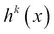
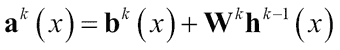
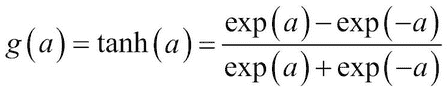
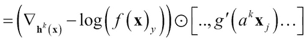
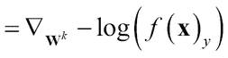
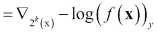
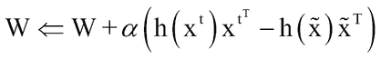
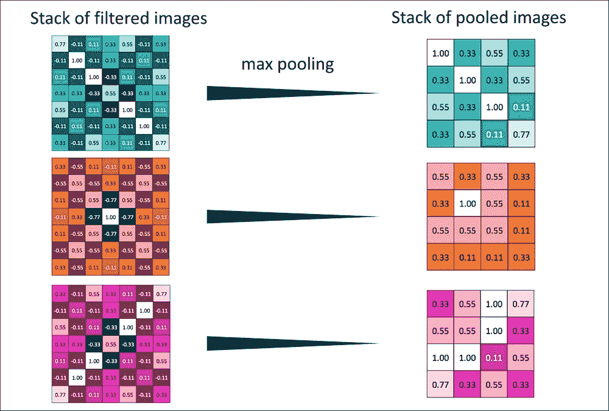
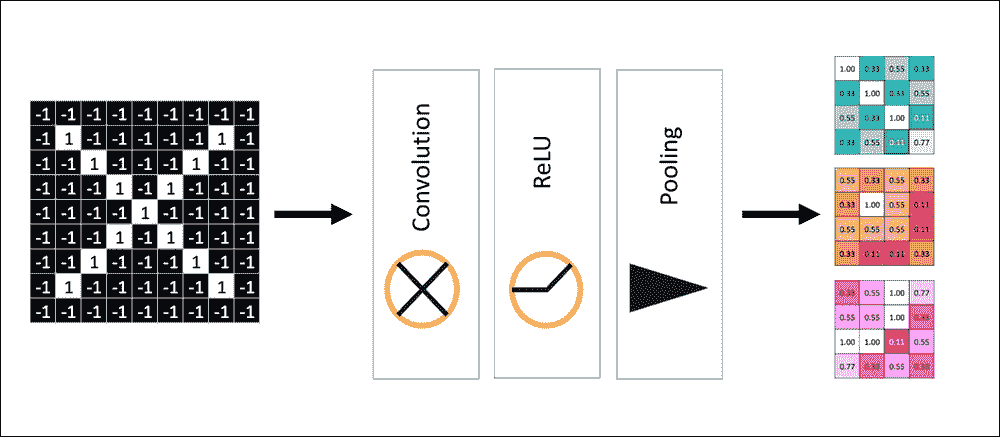

# 七、深度学习

在第二章、*现实世界监督学习的实用方法*中，我们讨论了不同的监督分类技术，这些技术是通用的，可以在广泛的应用中使用。在受监督的非线性技术领域，特别是在计算机视觉领域，深度学习及其变体正在产生显著的影响。我们发现深度学习和相关方法可以应用于图像识别、图像和对象注释、电影描述，甚至文本分类、语言建模、翻译等领域。(*参考文献*【1、2、3、4、5】)

为了为深度学习奠定基础，我们将从描述什么是神经元以及如何排列它们来构建多层神经网络开始，呈现这些网络的核心元素，并解释它们如何工作。然后，我们将讨论与神经网络相关的问题，这些问题导致了深度学习的进步和结构变化。我们将了解深度学习的一些构建模块，如受限玻尔兹曼机器和自动编码器。然后，我们将通过监督和非监督学习的不同变化来探索深度学习。接下来，我们将参观卷积神经网络(CNN ),并通过一个用例，通过解构 CNN 在计算机视觉领域的应用来说明它们是如何工作的。我们将介绍递归神经网络(RNN)及其变体，以及它们如何用于文本/序列挖掘领域。最后，我们将展示一个使用 MNIST 图像真实数据的案例研究，并使用它来比较/对比不同的技术。我们将使用 DeepLearning4J 作为我们的 Java 工具包来执行这些实验。

# 多层前馈神经网络

历史上，人工神经网络在很大程度上是通过多层前馈感知器来识别的，因此我们将从讨论此类网络结构的原始元素、如何训练它们、过拟合问题以及解决该问题的技术开始。

## 输入、神经元、激活函数和数学符号

单个神经元或感知器与第二章、*现实世界监督学习实用方法*中线性回归主题中描述的单元相同。在本章中，数据实例向量将是由 *x* 表示的，并且有 *d* 个维度，每个维度可以表示为。与每个维度相关联的权重被表示为具有 *d* 维度的权重向量 *w* ，并且每个维度可以被表示为。每个神经元都有一个与之相关的额外输入 *b* ，称为偏置。

神经元预激活执行由下式给出的输入的线性变换:


激活函数由给出，它将神经元输入转换如下:


图一。感知器通过输入、权重和偏置反馈来产生输出。

## 多层神经网络

多层神经网络是理解深度学习网络的第一步，因为多层网络的基本概念和原语构成了所有深度神经网络的基础。

### 结构和数学符号

我们在这一节介绍神经网络的一般结构。大多数神经网络都是这里概述的结构的变体。我们还提供了相关的符号，我们将在本章的其余部分使用。


图二。显示一个输入层、两个隐藏层和一个输出层的多层神经网络。

与神经网络相关的最常见的监督学习算法使用多层感知器。输入层由几个神经元组成，每个神经元独立地连接到输入，有自己的一组权重和偏置。除了输入层，还有一层或多层神经元，称为隐藏层。输入层神经元连接到第一个隐藏层中的每个神经元，该层类似地连接到下一个隐藏层，依此类推，从而形成完全连接的网络。连接到最后一个隐藏层的神经元层称为输出层。

每个隐藏的层由表示，其中 *k* 是层。层 *0 < k* *< l* 的预激活由下式给出:



隐藏层激活为:


最终的输出层激活是:


输出通常是每个神经元一个类，并且它以这样的方式被调整，即只有一个神经元被激活，而所有其他神经元的输出为 0。带有的 softmax 函数用于给出结果。

### 神经网络中的激活函数

神经网络中使用的一些最著名的激活函数在以下章节中给出，使用它们是因为学习中需要的导数可以用函数本身来表示。

#### 乙状结肠功能

Sigmoid 激活函数由以下等式给出:


它可以被视为一个有界的、严格递增的正变换函数，将值压缩在 0 和 1 之间。

#### 双曲正切(" tanh ")函数

以下等式给出了双曲正切函数:



它可以被看作是有界的，严格递增的，但作为一个正的或负的变换函数，压缩-1 和 1 之间的值。

### 训练神经网络

在本部分，我们将讨论从输入训练集训练神经网络的关键要素，其方式与我们在第二章、*现实世界监督学习的实用方法*中所做的大致相同。数据集由 *D* 表示，由单独的数据实例组成。实例通常表示为集合。每个实例的标签表示为集合。具有数值或实值特征的整个标注数据集被表示为集合中的成对元素，如所示。

#### 经验风险最小化

经验风险最小化是一个通用的机器学习概念，用于许多分类或监督学习。这种技术背后的主要思想是将训练或学习问题转化为优化问题(*参考文献* [13])。

给定神经网络的参数为**？** = ({ **W** ¹ ， **W** ² ，…**W***^L*^(+1)}，{ **b** ¹ ， **b** ² ，…**b***L*)这样


其中第二章、*现实世界监督学习的实用方法*和第五章、*实时流机器学习中讨论的【随机梯度下降】、*通常被用作优化过程。应用于训练神经网络的 SGD 是:

1.  初始化**？** = ({ **W** ¹ ， **W** ² ，…**W***^L*^(+1)}，{ **b** ¹ ， **b** ² ，…**b***L*
2.  对于每个训练样本，i=1 到 *N 个*历元

    1.  (**x**^t， *y* ^t )  //求函数 2 的梯度？= ?+ a？//向

    方向移动

这里使用的学习速率(a)将通过减少最优值附近的振荡来影响算法的收敛；选择 a 的正确值通常是一个超级参数搜索，需要在第二章、*现实世界监督学习实用方法*中描述的验证技术。

因此，为了学习神经网络的参数，我们需要选择进行参数初始化的方式，选择损失函数，计算参数梯度，将损失传播回来，选择正则化/罚函数 O( *？*)，并计算正则化梯度。在接下来的几节中，我们将一步一步地描述这一点。

##### 参数初始化

神经网络的参数是从输入层，经过隐层，到输出层的每一层的权重和偏差。由于优化取决于启动或初始化，因此在这方面已经有了很多研究。偏差通常设置为 0。权重初始化取决于激活函数，因为有些函数(如 tanh，值 0)无法使用。通常，初始化每层权重的方法是使用具有用户定义边界的对称函数进行随机初始化。

##### 损失函数

损失函数的主要作用是最大化预测输出标签与输入数据向量类别的匹配程度。

因此，最大化相当于最小化对数似然或交叉熵的负值:


##### 渐变

我们将描述输出层和隐藏层的渐变，但不涉及推导，因为这超出了本书的范围。感兴趣的读者可以看看鲁梅尔哈特、辛顿和威廉姆斯在文中的推导(*参考文献* [6])。

###### 输出层的渐变

输出层的梯度可计算如下:


其中 *e(y)* 被称为“一个热向量”，其中向量中只有一个值是 1，对应于正确的类别 *y* ，其余的值是 0。

输出层预激活处的梯度可以类似地计算:


=–(**e**(y)–**f**(**x**))

###### 隐藏层的渐变

使用偏导数的链式法则计算隐藏层梯度。

隐藏层的渐变


隐藏层预激活的梯度可以表示为:



由于隐藏层预激活需要如前所示的激活函数的偏导数(*g’*(*a*^k**x**[j]))，所以之前描述的一些众所周知的激活函数在方程本身方面具有偏导数，这使得计算非常容易。

例如，sigmoid 函数的偏导数是*g '(a)= g(a)(*1*–g(a))*，对于 tanh 函数，它是 1-*g*(a)²。

###### 参数梯度

必须使用权重和偏差的梯度来计算参数的损失梯度。权重的梯度可以表示为:



偏差的梯度可以表示为:



##### 前馈和反向传播

神经网络训练的目的是调整每一层的权重和偏差，以便根据来自输出层的反馈和估计预测输出和实际输出之间差异的损失函数，使差异最小化。

基于初始权重和偏差的神经网络算法可以被视为逐层转发计算，如具有一个隐藏层的非循环流程图所示，以演示流程:


图 3:前馈中的神经网络流程图。

根据输入向量以及权重和偏差的预初始化值，计算每个后续元素:预激活、隐藏层输出、最终层预激活、最终层输出以及相对于实际标签的损失函数。在反向传播中，流量正好相反，从输出端的损耗下降到第一层的权重和偏差，如下图所示:


图 4:反向传播中的神经网络流程图。

##### 它是如何工作的？

反向传播算法(*引用*【6 和 7】)的整体可以总结如下:

激活前计算输出梯度:


对于隐藏层 *k=l+1 到 1* :

计算隐藏层参数的梯度:


计算当前下方隐藏层的梯度:


激活前计算层的梯度:


##### 正规化

在之前定义的经验风险最小化目标中，正则化用于解决机器学习中的过拟合问题，如第二章、*现实世界监督学习的实用方法*中所介绍。众所周知的正则化函数给出如下。

###### L2 正规化

这仅适用于权重，而不适用于偏差，并适用于连接( *i，j* )组件的层，如下所示:


同样，正则化子的梯度可以计算为。它们通常被解释为权重分布的“高斯先验”。

###### L1 正则化

这再次应用于仅应用于权重而非偏差，并且对于连接 *(i，j)* 组件的层给出为:


并且这个正则化子的梯度可以计算为。它通常被解释为权重分布的“拉普拉斯先验”。


# 神经网络的局限性

在本节中，我们将详细讨论神经网络所面临的问题，这些问题将成为构建深度学习网络的垫脚石。

## 消失梯度、局部最优和慢速训练

神经网络的一个主要问题是“消失梯度”的问题。我们将试图对这个问题给出一个简单的解释，而不是深入探究数学推导。如下图所示，我们将选择 sigmoid 激活函数和两层神经网络来演示该问题:


图 5:渐变消失问题。

正如我们在激活函数描述中看到的，sigmoid 函数压缩范围 0 和 1 之间的输出。sigmoid 函数*g’(a)= g(a)(*1*–g(a))*的导数的范围在 0 到 0.25 之间。学习的目标是最小化输出损失，即。一般来说，输出误差不会到 0，所以最大迭代次数；用户指定的参数决定了学习的质量和误差的反向传播。

简化以说明输出误差对输入权重图层的影响:


例如，从输出到隐藏的每一个变换都涉及两个项的乘法，这两个项都小于 1:


因此，当到达输入层时，该值变得非常小，梯度的传播几乎消失。这就是所谓的消失梯度问题。

当您需要添加更多的层以使隐藏层中的特征更有趣时，一种矛盾的情况出现了。但是增加更多的层也会增加误差。随着您添加更多图层，输入图层变得“训练缓慢”，这导致输出图层更加不准确，因为它们依赖于输入图层；此外，对于相同的迭代次数，误差随着层数的增加而增加。

在最大迭代次数固定的情况下，更多的层和缓慢的误差传播会导致“局部最优”

基本神经网络的另一个问题是参数的数量。随着层数的增加，找到每个隐藏层和偏差的有效大小和权重变得更加困难。如果我们增加层数，参数以多项式形式增加。拟合数据的参数需要大量的数据样本。这可能导致之前讨论的问题，即过度拟合。

在接下来的几节中，我们将开始学习有助于克服这些问题的深度学习的构建模块。


# 深度学习

深度学习包括用于监督和非监督学习的架构和技术，能够使用由构建模块组成的网络来内部化高维数据的抽象结构，以创建判别或生成模型。近年来，这些技术被证明是非常成功的，任何有兴趣掌握它们的读者都必须首先熟悉深度学习的基本构建模块，并了解从业者使用的各种类型的网络。如果你想对这个主题有更深的理解，建立和调整深度神经网络的实践经验是非常宝贵的。在诸如图像分类和文本学习的各种领域中，深度学习在其结构中结合了特征生成，从而使得挖掘特征的任务在许多应用中是多余的。以下部分提供了概念、构建模块、构建架构的技术以及训练深度网络的指南。

## 深度学习的构建模块

在接下来的章节中，我们将介绍深度学习中使用的最重要的组件，包括受限玻尔兹曼机器、自动编码器和去噪自动编码器，以及它们的工作方式、优势和局限性。

### 校正线性激活函数

Reclin 函数由下式给出:

*g*(*a*)*= reclin*(*a*)*= max*(0*，* *a* )

可以看做有下界为 0 无上界，严格递增，正变换函数只是做正的线性变换。

更容易看出，整流线性单位或 ReLu 具有 1 的导数，或者对于大于 0 的值具有恒等式。这是一个很大的好处，因为衍生品不会被挤压，并且在链接时不会有递减的价值。ReLu 的一个问题是负输入的值为 0，相应的神经元表现为“死亡”,特别是当偏差项学习到大的负值时。因为输入和导数都是 0，所以 ReLu 不能从此恢复。这通常通过具有“泄漏的 ReLu”来解决。这些函数对于负输入值很小，由给出，其中？= 0.01，典型值。

### 受限玻尔兹曼机器

受限波尔兹曼机器(RBM)是一种无监督学习的神经网络(*参考文献* [11])。RBM 的想法是从有标签或无标签的数据中提取“更多有意义的特征”。它还意味着当访问已标记数据成本高昂或困难时，从许多领域中可用的大量未标记数据中“学习”。

#### 定义和数学符号

在其基本形式中，RBM 假设输入在每个维度上都是二进制值 0 或 1。RBM 是具有两层的无向图形模型，可见层表示为 *x* ，隐藏层表示为 *h、*和连接 *W* 。

RBM 定义了可见层上的分布，它包含了隐藏层的潜在变量。首先，定义一个能量函数，以矢量形式捕捉可见层和隐藏层之间的关系，如下所示:


在标量形式中，能量函数可以定义为:


分布的概率由给出，其中 *Z* 被称为“配分函数”，它是对所有二进制的 *x 和 h* 的值的枚举，导致指数项，从而使其难以处理！


图 6:可见层和隐藏层之间的连接。

可以使用所有成对因子以标量形式表示相同的马尔可夫网络视图，如下图所示。这也清楚地说明了为什么它被称为“受限”玻尔兹曼机，因为在给定的隐藏层或可见层中的单元之间没有联系:


图 7:作为标量的输入和隐藏层

我们已经看到，整个概率分布函数是难以处理的。我们现在将推导出 *x，h* 的基本条件概率分布。

#### 条件分布

虽然计算整个 *p(x，h)* 是困难的，但是 *p(x|h)* 或 *p(h|x)* 的条件分布可以很容易地被定义和显示为伯努利分布并且是易处理的:


类似地，由于对称且无向:


#### RBM 的自由能源

输入或观察变量的分布为:


函数 *F(x)* 叫做自由能。

#### 训练 RBM

使用最小化整个训练数据的平均负对数似然的优化目标来训练 RBM。这可以表示为:


通过使用随机梯度下降进行优化:


术语被称为“正阶段”,术语被称为“负阶段”,因为它们如何影响概率分布——正阶段，因为它通过减少自由能来增加训练数据的概率，负阶段，因为它减少模型生成样本的概率。

已经表明，由于“负相位”的存在，整体梯度很难解析计算，因为它是在模型形成的分布下计算输入数据的所有可能配置的期望值，并使其难以处理！

为了使计算易于处理，使用固定数量的模型样本进行估计，它们被称为“负粒子”，用 *N* 表示。

梯度现在可以写成近似值:


其中粒子使用一些采样技术进行采样，例如蒙特卡罗方法。

#### 在 RBM 取样

吉布斯采样(Gibbs sampling)是常用于生成样本并根据 *p(x|h)* 和 *p (h|x)* 学习 *p(x，h)* 的概率的技术，相对容易计算，如前所示。

用于 N 个随机变量的联合采样的吉布斯采样使用形式为的 N 个采样子步骤来完成，其中*S**-I*包含直到并且不包括步骤 *S* *[ i ]* 的样本。从图形上看，这可以显示如下:


图 8:隐藏层和输入层之间采样的图形表示。

如所示，可以看出采样代表实际分布 *p(x，h)* 。

#### 对比分歧

对比发散(CD)是一种用于加速前面描述的吉布斯采样过程的技巧，因此它在过程的步骤 *k* 处停止，而不是持续很长时间来保证收敛。已经看到，甚至 *k=1* 也是合理的，并且给出了良好的性能(*引用*【10】)。

##### 输入和输出

这些是算法的输入:

*   训练数据集
*   吉布斯采样的步骤数， *k*
*   学习率 a
*   输出是一组更新的参数

##### 它是如何工作的？

使用具有自由能函数和偏导数的 CD 的完整训练伪码可以给出如下:

1.  对于训练中的每个实例 **x** ^t :

    1.  使用吉布斯采样的 *k* 步骤生成一个负粒子。

    

#### 持续的对比分歧

持续的对比背离是用于计算联合概率 *p(x，h)* 的另一个技巧。在这种方法中，有一个单链不会在每次观察样本后重新初始化，以找到负粒子。它保持其状态，并通过使用上一步中的粒子运行这 k 个状态来更新参数。

### Autoencoders

自动编码器是神经网络中另一种形式的无监督学习技术。它与开头描述的前馈神经网络非常相似，唯一的区别是它不在输出端生成类，而是试图在输出层复制输入(*参考*【12 和 23】)。目标是让隐藏层捕获输入的潜在或隐藏信息，作为在无监督或有监督学习中有用的特征。

#### 定义和数学符号

下图显示了自动编码器的单个隐藏层示例:


图 9:层间的自动编码器流程

输入层和输出层具有与前馈类似的相同数量的神经元，对应于输入向量， *x* 。每个隐藏层可以具有比输入或输出层更多、相等或更少的神经元，以及对信号进行非线性变换的激活函数。它可以被视为使用无监督的或潜在的隐藏结构来有效地“压缩”数据。

隐藏层对数据的编码器或输入变换由下式给出:


输出层对数据的解码器或输出转换由下式给出:


一般而言，在神经网络部分中描述的具有信号线性变换的 sigmoid 函数普遍用于各层:

和

#### 损失函数

损失函数的工作是像以前一样减少训练误差，以便可以使用诸如随机梯度函数的优化过程。

在二进制值输入的情况下，损失函数通常是由下式给出的平均交叉熵:


很容易验证，当输入信号和输出信号匹配 0 或 1 时，误差为 0。同样，对于实值输入，使用平方误差:


随机梯度过程所需的损失函数的梯度类似于前馈神经网络，并且可以通过对实值和二进制的求导如下所示:


正如在神经网络中一样，通过反向传播获得参数梯度。

#### 自动编码器的局限性

自动编码器有一些已知的缺点，这些缺点已经被专门的架构解决了，我们将在接下来的章节中讨论。这些限制是:

当自动编码器的大小等于输入中神经元的数量时，有可能自动编码器学习到的权重正好是单位向量，并且整个表示简单地将输入作为零损失的输出传递。因此，他们没有任何概括地模仿“死记硬背”或“死记硬背”。

当自动编码器的大小大于输入中神经元的数量时，这种配置称为“过完备”隐藏层，可能会出现与前面提到的问题类似的问题。一些单位可以关闭，其他的可以成为身份，使它只是复制单位。

当 Autoencoder 的大小小于输入中神经元的数量时，称为“欠完成”，可以发现数据中的潜在结构或重要的隐藏成分。

#### 去噪自动编码器

如前所述,当自动编码器的隐藏层大小大于或等于输入的隐藏层大小时，它不能保证学习到权重，并且可以变成简单的将输入复制到输出的单元开关。去噪自动编码器解决了这个问题。这里，在输入和隐藏层之间添加了另一层。这一层使用众所周知的分布或使用随机噪声(如将二进制输入中的一位变为 0)向输入添加一些噪声。这个“噪声”输入然后从隐藏层学习到输出层，就像自动编码器一样。去噪自动编码器的损失函数将输出与实际输入进行比较。因此，添加的噪声和更大的隐藏层使得能够学习潜在结构或者添加/去除冗余以在输出端产生精确的信号。这种架构——噪声层的非零特征在隐藏层生成特征，这些特征随着信号的前进而由激活层进行转换——为学习出版社带来了鲁棒性和隐式结构(*参考文献*【15】)。


图 10:降噪自动编码器

### 无监督预训练和有监督微调

正如我们在关于神经网络的问题部分中所讨论的，过度训练的问题尤其出现在深度学习中，因为层数以及参数的数量很大。解决过度拟合的一种方法是进行特定于数据的正则化。在本节中，我们将描述在隐藏层中完成的“无监督预训练”方法，以克服过拟合问题。注意，这一般是很多深度学习算法使用的“初始化过程”。

无监督预训练的算法以逐层贪婪的方式工作。如下图所示，在给定时间，考虑一个可见和隐藏结构层。该层的权重通过使用无监督技术(如之前描述的 RBM)进行几次迭代来学习。然后，隐藏层的输出被用作“可见”或“输入”层，训练进行到下一层，依此类推。

每一层的学习都可以被认为是一个“特征提取或特征生成”的过程。转换后的实际数据输入在给定层形成更高级别的特征，然后进一步组合以形成更高级别的特征，等等。


图 11:通过无监督学习的逐层增量学习。

如前所述，一旦使用无监督技术在预训练中学习了所有隐藏层参数，接下来就是监督微调过程。在监督微调过程中，会添加最终输出层，就像在神经网络中一样，训练是通过向前和向后传播来完成的。其思想是大多数权重或参数几乎被完全调整，并且只需要很小的改变来在输出端产生有区别的类别映射。


图 12:最终调优或监督学习。

### 深度前馈神经网络

深度前馈神经网络包括使用阶段预训练和微调。

根据所使用的无监督学习技术——RBM、自动编码器或去噪自动编码器——形成了不同的算法:分别是堆叠 RBM、堆叠自动编码器和堆叠去噪自动编码器。

#### 输入和输出

给定深度前馈神经网络的架构，这些是训练网络的输入:

*   层数 *L*
*   没有标签的数据集 *D*
*   带有标签 *D* 的数据集
*   训练迭代次数*n*

#### 它是如何工作的？

所有三种情况的通用学习/训练算法如下所示:

1.  对于层 *l=1 到 L* (预训练):

    1.  没有标签的数据集
    2.  执行逐层无监督学习(RBM、自动编码器或去噪自动编码器)
    3.  最终确定参数 **W** ^l ， **b** ^l 来自上一步骤

2.  对输出层 *(L+1)* 随机初始化参数**W***^L*^(+1)，**b***^L*^(+1)。
3.  对于层 *l=1 到 L+1* (微调):

    1.  带标签的数据集。
    2.  使用来自 1 的预初始化权重。(**W**l，**b**l)。
    3.  执行前向-反向传播，进行 *n 次*迭代。

### 深度自动编码器

深度自动编码器有许多层隐藏单元，这些隐藏单元收缩到非常小的尺寸，然后对称地增长到输入尺寸。


图 13:深度自动编码器

深度自动编码器背后的想法是创建使用深度网络捕捉潜在复杂输入结构的功能，同时克服由于深度结构而导致的梯度和欠拟合问题。结果表明，这种方法产生了更好的特征，并且在许多数据集上的表现优于 PCA*参考文献*【13】】。

深度自动编码器使用预训练、编码器/解码器和微调的概念来执行无监督学习:

在预训练阶段，RBM 方法用于学习编码器的贪婪逐步参数，如下图所示，用于初始化:


图 14:RBM 的阶梯式学习

在展开阶段，相同的参数被对称地应用于解码器网络进行初始化。

最后，微调反向传播用于调整整个网络的参数。

### 深度信念网络

深度信念网络(DBNs)是无监督预训练概念的起源(*参考文献* [9])。无监督预训练起源于 DBNs，然后被发现在前馈有监督深度网络中同样有用和有效。

深度信念网络不是有监督的前馈网络，而是生成数据样本的生成模型。

#### 输入和输出

输入层是数据的实例，由表示，每个输入特征对应一个神经元。DBN 的输出是对输入的重构，输入来自于一个不断提高的抽象层次的习得特征。

#### 它是如何工作的？

这里以三层 DBN 架构为例解释 DBN 如何学习输入数据的联合分布。


图 15:深度信念网络

如图所示的三隐藏层 DBN 具有连接到两层贝叶斯网络的第一层无向 RBM。具有 sigmoid 激活函数的贝叶斯网络被称为 sigmoid 贝叶斯网络(SBN)。

生成模型的目标是学习由 *p* ( **x** ， **h** ^((1)) ， **h** ^((2)) ， **h** ^((3)) )给出的联合分布

*p* ( **x** 、 **h** 、 **h** 、^(、 **h** 、^、 ) = *p* ( **h** 、 ² )、 **h** 、^、 ) *p*)

如前所述，RBM 计算给我们提供了:


下两层的贝叶斯网络是:


对于二进制数据:


### 辍学者的深度学习

另一种用于克服深度神经网络中提到的“过拟合”问题的技术是使用 dropout 技术来学习参数。在接下来的部分中，我们将定义、说明和解释辍学者的深度学习是如何工作的。

#### 定义和数学符号

辍学背后的想法是在学习参数后，通过随机删除一些隐藏单元来“削弱”深层神经网络结构，如下图所示。单位设置为 0，丢失概率通常设置为 *p=0.5*

这个想法类似于在输入中添加噪声，但是是在所有隐藏层中完成的。当某些特征(或特征的组合)被随机移除时，神经网络必须以更健壮的方式学习潜在特征，而不需要一些特征的相互依赖。


图 16:通过用深色阴影丢弃某些单元来指示丢弃的深度学习。

每个隐藏层由 *h* ^k *(x)* 表示，其中 *k* 是层。层 *0 < k < l* 的预激活由下式给出:


隐藏层激活为 *1 < k < l* 。二进制掩码在每个隐藏层用**m**k 表示:


最终的输出层激活是:


#### 输入和输出

对于辍学者的培训，输入为:

*   网络体系结构
*   训练数据集
*   脱落概率 *p* (通常为 0.5)

输出是经过训练的深度神经网络，可用于预测用途。

##### 它是如何工作的？

我们现在将描述辍学者深度学习如何工作的不同部分。

#### 辍学者的学习培训和测试

使用梯度对来自输出损失函数的权重和偏差进行反向传播学习与传统的神经网络学习非常相似。唯一的区别是掩码的应用是适当的，如下所示:

激活前计算输出梯度:


对于隐藏层 *k=l+1 到 1* :

计算隐藏层参数的梯度:


**h** ^(k-1) 计算已经考虑到应用的二进制掩码 **m** ^(k-1) 。

计算当前下方隐藏层的梯度:


激活前计算下面层的梯度:


在测试模型时，我们不能使用二进制掩码，因为它是随机的；使用掩码的“预期”值。如果退出概率为 *p=0.5* ，则相同的值 0.5 被用作测试或模型应用时单元的期望值。

### 稀疏编码

稀疏编码是另一种用于无监督学习和特征生成的神经网络(*参考文献*【22】)。它的工作原理是在捕捉模式的高维空间中寻找潜在结构，从而在无监督学习之外执行特征提取。

形式上，对于每个输入 **x** ^((t)) 学习一个潜在表示 **h** ^((t)) ，它具有稀疏表示(向量中大多数值为 0)。这是通过使用以下目标函数进行优化来实现的:


其中第一项用于控制重建误差，第二项使用正则化器。，是为了稀疏性控制。矩阵 **D** 也被称为字典，因为它等价于字典中的单词，并且**h**(t)类似于词频；当执行文本挖掘时，它们一起捕捉单词在提取模式中的影响。

### 卷积神经网络

卷积神经网络或 CNN 已经变得突出，并广泛用于计算机视觉领域。计算机视觉涉及处理图像/视频以获取知识和模式。注释图像、分类图像/视频、纠正它们、讲故事或描述图像等等，是计算机视觉中的一些广泛应用[16]。

计算机视觉问题通常必须处理非结构化数据，这些数据可以描述为:

输入是具有单个或多个颜色通道的 2D 图像，或者是高维向量的 3D 视频。

这些 2D 或 3D 表示中的要素具有众所周知的空间拓扑、等级结构和一些可利用的重复元素。

基于诸如照明、噪声等因素，图像/视频具有大量的变换或变体。基于几个因素，同一个人或同一辆车可能看起来不同。

接下来，我们将描述 CNN 中使用的一些构建块。我们将使用简单的图像，例如字母表中的字母 X，来解释相关的概念和数学。例如，即使由于平移、缩放或扭曲，相同的字符 X 在下面的图中以不同的方式表示，人眼也可以很容易地将其读取为 X，但对于计算机来说，要看到该模式就变得很棘手。这些图片是在作者允许的情况下展示的(*参考文献*【19】):


图 17:以不同方式表现的角色 X 的图像。

下图说明了 X 的简单灰度图像如何具有共同的特征，例如从左上角开始的对角线、从右上角开始的对角线以及左右交叉的对角线，这些特征被重复和组合以形成更大的 X:


图 18:人物 x 形象中表现的共同特征。

#### 本地连接

这是一个简单的概念，将整个图像分成“补丁”或“接收域”,并将每个补丁分配给隐藏层。如图所示，不是完整样本图像的 9 X 9 像素，而是从左上方开始的 3 X 3 像素片到达第一个隐藏单元，重叠的第二个像素片到达第二个，依此类推。

由于完全连接的隐藏层将具有大量的参数，因此具有较小的面片完全减少了参数或高维空间问题！


图 19:整个图像上补丁的概念。

#### 参数共享

参数共享的概念是构建一个权重矩阵，该矩阵可在不同的补丁或接收字段上重复使用，如前图中的局部共享所示。如下图所示，具有相同参数**W**1，1 和**W**1，4 的特征映射创建了两个不同的特征映射，特征映射 1 和 4，两者捕捉相同的特征，即两边的对角边。因此，特征映射捕获图像中的“相似区域”,并进一步降低输入空间的维度。


#### 离散卷积

我们将解释离散卷积的步骤，用一个简单的人为例子和简化的数学来说明操作。

假设代表对角线特征的核作为 3×3 的小块在整个图像上被扫描。如果该核落在输入图像中的自同特征上，并且我们必须通过我们称之为卷积运算符的方法来计算中心值，则由于如下所示的匹配，我们得到精确值 1:


图 21:离散卷积步长。

整个图像在运行该内核和卷积运算符时会给出一个值矩阵，如下所示:


图 22:内核和卷积操作后字符图像的转换。

通过运行该扫描，我们可以看到左对角线特征是如何被突出显示的。同样，通过运行其他内核，如下图所示，我们可以得到一个“过滤图像堆栈”:


图 23:不同的特性贯穿内核，给出一堆图像。

中的每一个单元格的滤波图像可以给定为:


#### 合并或二次抽样

池化或二次采样对过滤后的图像堆栈进行处理，以进一步缩小或压缩图像，同时保持模式不变。在汇集中执行的主要步骤是:

1.  选择一个窗口大小(例如，2 X 2)和一个步幅大小(例如，2)。
2.  在所有已过滤的图像上快速移动窗口。
3.  在每个窗口，选择“最大”值。


图 24:最大池，使用 2 X 2 的窗口大小和 2 的步幅，计算第一个最大值为 1.0 的单元格值，第二个为 0.33，依此类推。

池化也起着重要的作用，因为使用了最大值，如果移动或缩放，仍然可以检测到相同的特征。相同的堆叠过滤图像集被转换成汇集图像，如下所示:



图 25:显示一堆过滤后的图像如何被转换为合并图像的转换。

#### 使用 ReLU 进行标准化

正如我们在深度学习的构建模块中讨论的, ReLUs 通过将消极因素压缩为 0 来消除消极因素，并保持积极因素不变。它们在反向传播中的梯度计算中也起着重要作用，消除了消失梯度的消失梯度问题。


图 26:使用 ReLu 的转换。

### CNN 图层

在这一节中，我们将把前面讨论的构件放在一起，形成 CNN 的完整画面。将卷积层、ReLU 层和池化层组合起来，形成一个连接的网络，生成具有最终输出中捕获的图案的缩小图像，我们就获得了下一个复合构造块，如下图所示:



图 27:CNN 的基本单元，显示了卷积、ReLu 和池的组合。

因此，这些层可以组合或“深度堆叠”，如下图所示，形成一个复杂网络，输出一小部分图像:


图 28:重复深层堆叠基本单元以形成 CNN 层。

如图所示，输出层是一个完全连接的网络，它使用投票技术并学习所需输出的权重。完全连接的输出层也可以堆叠。


图 29:作为 CNN 输出的全连接层。

因此，最终的 CNN 可以完整地说明如下:


图 30:所有层都显示输入和输出的 CNN。

如前所述，选择梯度下降作为学习技术，使用损失函数计算差值并向后传播误差。

如果数据到“图像”的映射可以成功完成并且“局部空间”模式存在，CNN 可以用于其他领域，例如声音模式识别、文本挖掘等等。下图显示了 CNN 使用的将声音和文本映射到图像的方法之一:


图 31:时间数据(如声音到空间数据)到图像的映射示意图。

### 递归神经网络

正常的深度网络用于当你有有限的输入，并且在输入例子或实例之间没有相互依赖。当存在可变长度的输入并且它们之间存在时间依赖性时，即序列相关数据，神经网络必须被修改以处理这样的数据。递归神经网络(RNN)是广泛用于解决这类问题的神经网络的例子，我们将在以下部分讨论它们。rnn 用于许多序列相关的问题，如文本挖掘、语言建模、生物信息学数据建模等，仅举几个适合这种元级描述的领域(*参考文献*【18 和 21】)。

#### 递归神经网络的结构

我们将首先描述 RNN 的最简单的单元，然后展示它是如何被组合的，以从功能和数学上理解它，并说明不同的组件是如何交互和工作的。


图 32:人工神经元和带反馈的神经元之间的区别。

让我们考虑基本输入，一个激活的神经元，以及它在给定时间 *t* 的输出:


具有反馈的神经元保持矩阵 **W** [R] 以合并在时间 *t-1* 的先前输出，并且等式是:


图 33:反馈连接在一起的神经元链。

基本的 RNN 堆叠了隐藏单元的结构，如图所示，反馈来自前一层。在时间 *t* 激活时，不仅依赖于**x**??(t)作为输入，还依赖于**W**[R]**h**^((t-1))给出的前一个单位。RNN 反馈连接中的权重在所有单元中通常是相同的，**W**R。此外，不是在前馈神经网络的最末端发出输出，而是每个单元连续发出可用于损失函数计算的输出。

#### RNNs 中的学习和相关问题

使用 RNNs 会带来一些挑战，这些挑战是 RNNs 特有的，但也有一些其他类型的神经网络也会遇到的常见问题。

1.  The gradient used from the output loss function at any time *t* of the unit has dependency going back to the first unit or *t=0*, as shown in the following figure. This is because the partial derivative at the unit is dependent on the previous unit, since:

    通过时间反向传播(BPTT)是用来说明这一过程的术语。

    

    图 34:随时间反向传播。

2.  类似于我们在前馈神经网络一节中看到的，由于前面讨论过的单元的连接性，爆炸和消失梯度的情况在 RNNs 中变得更加明显。
3.  爆炸渐变的一些解有:

    1.  截断 BPTT 是对 BPTT 过程的一个小改动。不是将学习传播回到时间 *t=0* ，而是将其截断到向后到 *t=k* 的固定时间。
    2.  渐变裁剪当渐变向上射出时，剪切阈值以上的渐变。
    3.  自适应学习率。学习率根据反馈和值进行自我调整。

4.  消失渐变的解决方案有:

    1.  使用 ReLU 作为激活函数；因此，梯度将是 1。
    2.  适应学习速度。学习率根据反馈和值进行自我调整。
    3.  使用扩展，比如长短期记忆(LSTM)和门控循环单元(GRUs)，我们接下来会介绍。

RNNs 有许多应用，例如，在下一个字母预测、下一个单词预测、语言翻译等方面。


图 35:显示了使用 RNN 结构在下一个字母/单词预测中的一些应用。

#### 长短期记忆

解决消失梯度问题的一种神经网络架构或对 RNNs 的修改被称为长短期记忆或 LSTM。我们将解释 LSTM 的一些组成部分，然后为我们的读者把它们放在一起。

对 RNN 的第一个修改是将反馈学习矩阵改为 1，即 **W** [R] = 1，如下图所示:


图 36:反馈矩阵设为 1 的 LSTM 积木。

这将确保来自旧单元或存储单元的输入按原样传递到下一个单元。因此，需要进行一些修改。

如下图所示，输出门结合了两种计算。第一个是通过激活函数传递的单个单元的输出，第二个是使用缩放通过 sigmoid 传递的旧单元的输出。


图 37:LSTM 的构建模块输出门。

从数学上讲，该单元的输出门由下式给出:


遗忘门位于两个存储单元之间。它根据学习到的权重和变换生成 0 或 1。遗忘门如下图所示:


图 38:LSTM 的积木式遗忘之门。

数学上，可以看作是遗忘门的表示。接下来，组合输入门和新门，如下图所示:


图 39:添加新门和输入门以完成 LSTM 的构建模块。

新内存生成单元通过激活函数使用当前输入 *x* [t] 和旧状态 *h* [t-1] ，生成新内存 *C* [t] 。输入门将输入和旧状态相结合，并确定是应该保留新的存储器还是输入。

因此，更新等式如下所示:


#### 门控循环单元

门控循环单元(gru)是经过修改的简化 LSTMs。通过使用一个“更新”单元简化了许多门，如下所示:


图 40:带更新单元的 GRUs。

对等式所做的更改如下:


# 案例研究

图像分类有几个基准。在这个案例研究中，我们将使用 MNIST 图像数据库。当我们在第三章的中使用 MNIST 时，无监督的机器学习技术与聚类和离群点检测技术，每个像素都被视为一个特征。除了像在以前的实验中一样从像素值中学习之外，通过深度学习技术，我们还将从训练数据集的结构中学习新的特征。深度学习算法将在 60，000 张图像上进行训练，并在 10，000 张图像的测试数据集上进行测试。

## 工具和软件

在这一章，我们介绍名为 DeepLearning4J (DL4J)的深度学习开源 Java 框架。DL4J 有实现大量深度学习技术的库，它们可以在分布式 CPU 和 GPU 上使用。

深度学习 4j:[`deeplearning4j.org/index.html`](https://deeplearning4j.org/index.html)

我们将说明一些 DL4J 库在从 MNIST 训练图像学习中的使用，并应用所学习的模型来分类测试集中的图像。

## 商业问题

图片分类是评估深度学习网络的一个特别有吸引力的试验台。我们以前遇到过 MNIST 数据库，它由手写数字的灰度图像组成。这一次，我们将展示如何使用无监督和有监督的深度学习技术从同一个数据集进行学习。MNIST 数据集在单个通道中包含 28 x 28 像素的图像。这些图像被分为 10 个标签，代表数字 0 到 9。目标是在 60，000 个数据点上进行训练，并在剩余的 10，000 张图像上测试我们的深度学习分类算法。

## 机器学习映射

这包括应用于分类问题的监督和非监督方法，其中有 10 个可能的输出类。正如我们在前面章节中看到的，一些技术使用初始预训练阶段，这在本质上是无人监督的。

## 数据采样和传输

该数据集位于:

[`yann . lecun . com/exdb/mnst`](https://yann.lecun.com/exdb/mnist)

在本案例研究的实验中，MNIST 数据集已被标准化，0 至 255 范围内的像素值已被标准化为 0.0 至 1.0 的值。例外是在使用堆叠 RBM 的实验中，其中训练和测试数据已经被二进制化，也就是说，如果标准化值大于或等于 0.3，则设置为 1，否则设置为 0。这 10 个类中的每一个在训练集和测试集中被同等地表示。此外，使用用户提供的随机数发生器种子对示例进行混洗。

## 特征分析

输入数据特征是每个图像中像素的灰度值。这是原始数据，我们将使用深度学习算法从原始像素值中学习更高级别的特征。数据集已经准备好，使得在训练集和测试集中每个类都有相同数量的示例。

## 模型、结果和评估

我们将从简单的 MLP、卷积网络、变分自动编码器、堆叠 RBMS 和 DBNs 开始进行不同的实验。我们将遍历代码中突出网络结构或专门调整的重要部分，给出帮助读者的参数，重现实验，并给出每种类型网络的结果。

### 基础数据处理

下面的代码片段显示:

如何从具有由分隔符强制的结构的 CSV 中读取数据。

如何迭代数据并获取记录。

如何在内存中混排数据并创建训练/测试或验证集:

```java
RecordReader recordReader = new  ] CSVRecordReader(numLinesToSkip,delimiter);
recordReader.initialize(new FileSplit(new ClassPathResource(fileName).getFile()));
DataSetIterator iterator = new RecordReaderDataSetIterator(recordReader,batchSize,labelIndex,numClasses);
DataSet allData = iterator.next();
allData.shuffle();
SplitTestAndTrain testAndTrain = allData.splitTestAndTrain(trainPercent); 
DataSet trainingData = testAndTrain.getTrain();
DataSet testData = testAndTrain.getTest();
```

DL4J 有一个特定的 MNIST 包装器来处理我们使用的数据，如下面的代码片段所示:

```java
DataSetIterator mnistTrain = new MnistDataSetIterator(batchSize, true, randomSeed);
DataSetIterator mnistTest = new MnistDataSetIterator(batchSize, false, randomSeed);
```

### 多层感知器

在第一个实验中，我们将使用一个基本的多层感知器，它有一个输入层、一个隐藏层和一个输出层。代码中使用的参数的详细列表如下:

#### 用于 MLP 的参数

| 

参数

 | 

可变的

 | 

价值

 |
| --- | --- | --- |
| **迭代次数** | m | one |
| **学习率** | 速度 | 0.0015 |
| **动量** | 动力 | Zero point nine eight |
| **L2 正规化** | 正规化 | Zero point zero zero five |
| **输入中的行数** | numRows 的 | Twenty-eight |
| **输入中的列数** | 数字列 | Twenty-eight |
| **第 0 层输出尺寸，第 1 层输入尺寸** | 输出层 0，输入层 1 | Five hundred |
| **第一层输出尺寸，第二层输入尺寸** | 输出层 1，输入层 2 | Three hundred |
| **第二层输出尺寸，第三层输入尺寸** | 输出层 2，输入层 3 | One hundred |
| **第三层输出尺寸，** | 输出数量 | Ten |

#### MLP 代码

在下面的清单中,我们可以看到我们如何通过使用构建器模式传入超参数来配置 MLP。

```java
MultiLayerConfiguration conf = new NeuralNetConfiguration.Builder() .seed(randomSeed) .optimizationAlgo(OptimizationAlgorithm.STOCHASTIC_GRADIENT_DESCENT) // use SGD
.iterations(m)//iterations
.activation(Activation.RELU)//activation function
.weightInit(WeightInit.XAVIER)//weight initialization
.learningRate(rate) //specify the learning rate
.updater(Updater.NESTEROVS).momentum(momentum)//momentum
.regularization(true).l2(rate * regularization) // 
.list()
.layer(0, 
new DenseLayer.Builder() //create the first input layer.
.nIn(numRows * numColumns)
.nOut(firstOutput)
.build())
.layer(1, new DenseLayer.Builder() //create the second input layer
.nIn(secondInput)
.nOut(secondOutput)
.build())
.layer(2, new OutputLayer.Builder(LossFunction.NEGATIVELOGLIKELIHOOD) //create hidden layer
.activation(Activation.SOFTMAX)
.nIn(thirdInput)
.nOut(numberOfOutputClasses)
.build())
.pretrain(false).backprop(true) //use backpropagation to adjust weights
.build();
```

MLP 的培训、评估和测试如下面的代码片段所示。请注意初始化可视化后端的代码，使您能够在浏览器中监控模型训练，特别是模型得分(每次迭代后的训练误差)和参数更新:

```java
MultiLayerNetwork model = new MultiLayerNetwork(conf);
model.init();
model.setListeners(new ScoreIterationListener(5));  //print the score with every iteration
//Initialize the user interface backend
UIServer uiServer = UIServer.getInstance();
//Configure where the network information (gradients, activations, score vs. time etc) is to be stored
//Then add the StatsListener to collect this information from the network, as it trains
StatsStorage statsStorage = new InMemoryStatsStorage();             //Alternative: new FileStatsStorage(File) - see UIStorageExample
int listenerFrequency = 1;
net.setListeners(new StatsListener(statsStorage, listenerFrequency));
//Attach the StatsStorage instance to the UI: this allows the contents of the StatsStorage to be visualized
uiServer.attach(statsStorage);
log.info(""Train model...."");
for( int i=0; i<numEpochs; i++ ){
log.info(""Epoch "" + i);
model.fit(mnistTrain);
        }
log.info(""Evaluate model...."");
Evaluation eval = new Evaluation(numberOfOutputClasses); 
while(mnistTest.hasNext()){
DataSet next = mnistTest.next();
INDArray output = model.output(next.getFeatureMatrix()); //get the networks prediction
eval.eval(next.getLabels(), output); //check the prediction against the true class
        }
log.info(eval.stats());
```

以下图显示了 MLP 模型的训练误差与训练迭代的关系。这条曲线应该随着迭代而减少:


图 41:用 MLP 模型的训练迭代次数测量的训练误差。

在下图中，我们看到了 MLP 第 0 层中的参数分布以及参数更新的分布。这些直方图应该具有近似高斯(正态)形状，这表示良好的收敛性。有关如何使用图表调整模型的更多信息，请参见 DL4J 可视化页面([`deeplearning4j.org/visualization`](https://deeplearning4j.org/visualization)):


图 42:显示层参数和更新分布的直方图。

### 卷积网络

在第二个实验中，我们使用内置多层配置配置了一个卷积网络(ConvNet)。网络的架构总共由五层组成，这可以从下面的代码片段中看出。在输入图层之后，两个具有 5 乘 5 过滤器的卷积图层与最大池化图层交替出现，然后是使用 ReLu 激活图层的完全连接的密集图层，以最终输出图层中的 Softmax 激活结束。使用的优化算法是随机梯度下降，损失函数是负对数似然。

表中给出了 ConvNet 的各种配置参数(或超参数)。

#### 用于 ConvNet 的参数

| 

参数

 | 

可变的

 | 

价值

 |
| --- | --- | --- |
| **种子** | 种子 | One hundred and twenty-three |
| **输入尺寸** | numRows，numcolumns | 28, 28 |
| **历元数** | numEpochs | Ten |
| **迭代次数** | 迭代次数 | one |
| **L2 正规化** | 正规化 | Zero point zero zero five |
| **学习率** | 学习率 | Zero point one |
| **动量** | 动力 | Zero point nine |
| **卷积滤波器尺寸** | xsize，ysize | 5, 5 |
| **卷积层步幅大小** | x，y | 1, 1 |
| **输入通道数量** | 数字频道 | one |
| **子采样层步幅大小** | sx, sy | 2, 2 |
| **第 0 层输出尺寸** | nOut0 | Twenty |
| **第二层输出尺寸** | nOut1 | Fifty |
| **第 4 层输出尺寸** | nOut2 | Five hundred |
| **第五层输出尺寸** | 输出数量 | Ten |

#### CNN 的代码

正如您所看到的，无论您是构建 MLP 还是 CNN，用 DL4J API 配置多层神经网络都是相似的。特定于算法的配置简单地在每一层的定义中完成。

```java
MultiLayerConfiguration conf = new NeuralNetConfiguration.Builder()
.seed(seed)
.iterations(iterations) .regularization(true).l2(regularization)
.learningRate(learningRate)
.weightInit(WeightInit.XAVIER) .optimizationAlgo(OptimizationAlgorithm.STOCHASTIC_GRADIENT_DESCENT) .updater(Updater.NESTEROVS).momentum(momentum)
.list()
.layer(0, new ConvolutionLayer.Builder(xsize, ysize)
.nIn(nChannels)
.stride(x,y)
.nOut(nOut0)
.activation(Activation.IDENTITY)
.build())
.layer(1, new SubsamplingLayer
.Builder(SubsamplingLayer.PoolingType.MAX)
.kernelSize(width, height)
.stride(sx,sy)
.build())
.layer(2, new ConvolutionLayer.Builder(xsize, ysize)
.stride(x,y)
.nOut(nOut2)
.activation(Activation.IDENTITY)
.build())
.layer(3, new SubsamplingLayer
.Builder(SubsamplingLayer.PoolingType.MAX)
.kernelSize(width, height)
.stride(sx,sy)
.build())
.layer(4, new DenseLayer.Builder()
.activation(Activation.RELU)
.nOut(nOut4).build())
.layer(5, new OutputLayer. Builder(LossFunctions.LossFunction.NEGATIVELOGLIKELIHOOD)
.nOut(outputNum)
.activation(Activation.SOFTMAX)
.build())
.setInputType(InputType.convolutionalFlat(numRows,numColumns,1)) 
.backprop(true).pretrain(false).build();
```

### 变分自动编码器

在第三个实验中，我们配置了一个变分自动编码器作为分类器。

#### 用于变型自动编码器的参数

下表显示了用于配置 VAE 的参数。

| 

参数

 | 

可变的

 | 

价值观念

 |
| --- | --- | --- |
| **RNG 的种子** | rngSeed | one two three four five |
| **迭代次数** | 迭代次数 | one |
| **学习率** | 学习率 | Zero point zero zero one |
| **均方根衰减** | rmsDecay | Zero point nine five |
| **L2 正规化** | 正规化 | 0.0001 |
| **输出图层大小** | 输出数量 | Ten |
| **VAE 编码器层数尺寸** | vaeEncoder1，vaeEncoder2 | 256, 256 |
| **VAE 解码器层数大小** | vaeDecoder1，vaeDecoder2 | 256, 256 |
| **潜在变量空间的大小** | latentVarSpaceSize | One hundred and twenty-eight |

#### 变型代码自动编码器

我们已经配置了两层编码器和解码器，并且正在使用伯努利分布来重构输入。

```java
MultiLayerConfiguration conf = new NeuralNetConfiguration.Builder()
.seed(rngSeed)
.iterations(iterations)
.optimizationAlgo(
OptimizationAlgorithm.STOCHASTIC_GRADIENT_DESCENT)
.learningRate(learningRate)
.updater(Updater.RMSPROP).rmsDecay(rmmsDecay)
.weightInit(WeightInit.XAVIER)
.regularization(true).l2(regulaization)
.list()
.layer(0, new VariationalAutoencoder.Builder()
.activation(Activation.LEAKYRELU)
                .encoderLayerSizes(vaeEncoder1, vaeEncoder2)        //2 encoder layers
                .decoderLayerSizes(vaeDecoder1, vaeDecoder2)        //2 decoder layers
.pzxActivationFunction(""identity"")  //p(z|data) activation function
.reconstructionDistribution(new BernoulliReconstructionDistribution(Activation.SIGMOID.getActivationFunction()))     //Bernoulli distribution for p(data|z) (binary or 0 to 1 data only)
.nIn(numRows * numColumns) //Input size                      
.nOut(latentVarSpaceSize) //Size of the latent variable space: p(z|x).
.build())
.layer(1, new OutputLayer.Builder(LossFunction.NEGATIVELOGLIKELIHOOD).activation(Activation.SOFTMAX)
.nIn(latentVarSpaceSize).nOut(outputNum).build())
.pretrain(true).backprop(true).build();
```

### DBN

DBN 中使用的参数如下表所示:

| 

参数

 | 

可变的

 | 

价值

 |
| --- | --- | --- |
| **输入数据大小** | numRows，numcolumns | 28, 28 |
| **RNG 的种子** | 种子 | One hundred and twenty-three |
| **训练迭代次数** | 迭代次数 | one |
| **动量** | 动力 | Zero point five |
| **第 0 层(输入)****第 0 层(输出)****第一层(输入，输出)****第二层(输入，输出)****第三层(输入，输出)** | numRows * numColumnsnOut0nIn1，nOut1nIn2，nOut2nIn3, outputNum | 28 * 28Five hundred500, 250250, 200200, 10 |

本案例研究中使用的示例展示了如何使用 DL4J API 配置 DBN。此处显示了网络的配置代码。

```java
MultiLayerConfiguration conf = new NeuralNetConfiguration.Builder()
.seed(seed)
.gradientNormalization(GradientNormalization.ClipElementWiseAbsoluteValue)
.gradientNormalizationThreshold(1.0)
.iterations(iterations)
.updater(Updater.NESTEROVS)
.momentum(momentum)
.optimizationAlgo(OptimizationAlgorithm.CONJUGATE_GRADIENT)
.list()
.layer(0, new RBM.Builder().nIn(numRows*numColumns).nOut(nOut0)
.weightInit(WeightInit.XAVIER).lossFunction(LossFunction.KL_DIVERGENCE)
.visibleUnit(RBM.VisibleUnit.BINARY)
.hiddenUnit(RBM.HiddenUnit.BINARY)
.build())
.layer(1, new RBM.Builder().nIn(nIn1).nOut(nOut1)
.weightInit(WeightInit.XAVIER).lossFunction(LossFunction.KL_DIVERGENCE)
.visibleUnit(RBM.VisibleUnit.BINARY)
.hiddenUnit(RBM.HiddenUnit.BINARY)
.build())
.layer(2, new RBM.Builder().nIn(nIn2).nOut(nOut2)
.weightInit(WeightInit.XAVIER).lossFunction(LossFunction.KL_DIVERGENCE)
.visibleUnit(RBM.VisibleUnit.BINARY)
.hiddenUnit(RBM.HiddenUnit.BINARY)
.build())
.layer(3, new OutputLayer.Builder().nIn(nIn3).nOut(outputNum)
.weightInit(WeightInit.XAVIER).activation(Activation.SOFTMAX)
.build())
.pretrain(true).backprop(true)
.build();
MultiLayerNetwork model = new MultiLayerNetwork(conf);
model.init();
model.setListeners(new ScoreIterationListener(listenerFreq));
```

### 使用仲裁器进行参数搜索

DeepLearning4J 通过将手动调整的负担从建模者身上拿走，提供了一个微调超参数的框架；相反，它允许参数空间的规范进行搜索。在以下示例代码片段中，使用 MultiLayerSpace 而不是 MutiLayerConfiguration 对象来指定配置，其中超级参数的范围是通过仲裁器 DL4J 包中的 ParameterSpace 对象为要调整的参数指定的:

```java
ParameterSpace<Double> learningRateHyperparam = new ContinuousParameterSpace(0.0001, 0.1);  //Values will be generated uniformly at random between 0.0001 and 0.1 (inclusive)
ParameterSpace<Integer> layerSizeHyperparam = new IntegerParameterSpace(16,256);            //Integer values will be generated uniformly at random between 16 and 256 (inclusive)
MultiLayerSpace hyperparameterSpace = new MultiLayerSpace.Builder()
//These next few options: fixed values for all models
.optimizationAlgo(OptimizationAlgorithm.STOCHASTIC_GRADIENT_DESCENT)
.iterations(1)
.regularization(true)
.l2(0.0001)
//Learning rate: this is something we want to test different values for
.learningRate(learningRateHyperparam)
.addLayer( new DenseLayerSpace.Builder()
//Fixed values for this layer:
.nIn(784)  //Fixed input: 28x28=784 pixels for MNIST
.activation(""relu"")
//One hyperparameter to infer: layer size
.nOut(layerSizeHyperparam)
.build())
.addLayer( new OutputLayerSpace.Builder()
//nIn: set the same hyperparemeter as the nOut for the last layer.
.nIn(layerSizeHyperparam)
//The remaining hyperparameters: fixed for the output layer
.nOut(10)
.activation(""softmax"")
.lossFunction(LossFunctions.LossFunction.MCXENT)
.build())
.pretrain(false).backprop(true).build();
```

### 结果和分析

根据测试数据评估四个网络性能的结果如下表所示:

|   | 

MLP

 | 

ConvNet

 | 

VAE

 | 

DBN

 |
| --- | --- | --- | --- | --- |
| **精度** | 0.9807 | 0.9893 | 0.9743 | 0.7506 |
| **精度** | 0.9806 | 0.9893 | 0.9742 | 0.7498 |
| **回忆** | 0.9805 | 0.9891 | 0.9741 | 0.7454 |
| **F1 得分** | 0.9806 | 0.9892 | 0.9741 | 0.7476 |

实验的目标不是在每个神经网络结构中匹配基准结果，而是在代码中给出一个全面的架构实现，并提供详细的参数供读者探索。

在深度学习网络中调整超参数是一个相当大的挑战，尽管仲裁器和 gitter([`gitter.im/deeplearning4j/deeplearning4j`](https://gitter.im/deeplearning4j/deeplearning4j))等在线资源有助于 DL4J，但与包括 SVM 在内的其他分类技术相比，运行超参数搜索的时间和成本相当高。

MNIST 数据集上的基准测试结果和相应的论文可在此处获得:

*   [`yann . lecun . com/exdb/mnst/`](http://yann.lecun.com/exdb/mnist/)
*   [`rodrigob . github . io/are _ we _ there _ yet/build/classification _ datasets _ results . html # 4d4e 495354`](http://rodrigob.github.io/are_we_there_yet/build/classification_datasets_results.html#4d4e495354)

从基准测试结果可以看出，线性 1 层神经网络的错误率为 12%，增加更多的层可以将错误率降低到大约 2。这表明了数据的非线性本质，以及需要复杂的算法来拟合模式。

与神经网络上从 2.5%到 1.6%误差率的基准最佳结果相比，我们的结果与 2%误差率非常接近。

大多数基准测试结果显示，卷积网络架构的错误率在 1.1%至 0.5%的范围内，我们的超参数搜索匹配了这些模型中的最佳模型，错误率略低于 1.1%。

我们在 DBN 的结果远远低于基准，仅略高于 25%。毫无疑问，进一步的调优可以将性能提高 3-5%。


# 总结

深度学习的历史与早期尝试在机器学习和人工智能中使用神经网络的限制密切相关，以及这些限制如何通过更新的技术、技术改进和大量数据的可用性来克服。

感知器是基本的神经网络。多层网络用于监督学习，通过连接几个隐藏的神经元层来向前传播激活，并使用反向传播来减少训练误差。使用了几种激活函数，最常用的是 sigmoid 和 tanh 函数。

神经网络的问题是梯度消失或爆炸、训练缓慢和陷入局部极小值。

深度学习在几种有效技术的帮助下成功解决了这些问题，这些技术可以用于无监督和有监督的学习。

深度学习网络的构建模块包括受限玻尔兹曼机器(RBM)、自动编码器和去噪自动编码器。RBM 是两层无向网络，能够从输入中提取高级特征。对比发散用于加速训练。自动编码器也是用于无监督学习的深度学习网络——它们试图通过首先在编码层对学习到的特征进行编码，然后通过一组解码层重建输入来复制输入。去噪自动编码器解决了自动编码器的一些限制，这些限制有时会导致它们琐碎地学习标识函数。

深度学习网络通常以无监督的方式进行预训练，然后通过监督微调来微调它们的参数。在预训练阶段使用堆叠 RBM 或自动编码器，在分类的情况下，微调通常通过在输出层激活 softmax 来完成。

深度自动编码器擅长学习数据中复杂的潜在结构，并通过使用自动编码器构建块进行预训练和微调，用于无监督学习。深度信念网络(DBN)是可以用来创建更多样本的生成模型。它是使用有向贝叶斯网络构建的，在其上有一个无向 RBM 层。深度学习网络中的过度拟合可以通过辍学学习来解决，其中网络中的一些节点被随机“关闭”。

卷积神经网络(CNN)在计算机视觉中有许多应用。CNN 可以学习数据平移不变的模式，并对数据中的线性缩放具有鲁棒性。它们使用卷积过滤器和合并层来降低数据的维度，并且可以在分类任务中获得非常有效的结果。提出了涉及数字图像分类的用例。

当数据作为序列到达并且数据之间存在时间关系时，递归神经网络(RNN)用于建模。rnn 使用来自前几层的反馈，并不断发出输出。消失和爆炸梯度的问题在 RNNs 中反复出现，并且通过对体系结构的几种修改来解决，例如长短期记忆(LSTM)和门控循环网络(GRU)。

在本章的案例研究中，我们介绍了用各种深度学习网络从 MNIST 手写数字图像数据集进行学习的实验。结果使用 MLP，康文网，变分自动编码器，和堆叠 RBM 介绍。

我们认为，深度神经网络能够逼近基础数据所基于的关键结构的重要且有代表性的子集。此外，借助不同的隐藏层，可以轻松捕捉数据的层次结构。最后，例如，对图像的旋转、平移和缩放的不变性是深度神经网络性能的最后一个关键要素。不变性允许我们减少神经网络捕获的可能状态的数量(*参考文献* [19])。


# 参考文献

1.  Behnke，S. (2001 年)。在神经抽象金字塔中学习迭代图像重建。国际计算智能与应用杂志，1(4)，427–438。
2.  Behnke，S. (2002 年)。利用分层递归网络学习人脸定位。第 12 届国际人工神经网络会议论文集(第 1319-1324 页)。
3.  Behnke，S. (2003 年)。使用卷积非负矩阵分解发现分层语音特征。国际神经网络联合会议论文集，第 4 卷(第 2758-2763 页)。
4.  Behnke，S. (2003 年)。LNCS，计算机科学讲义:第 2766 卷。用于图像解释的分层神经网络。斯普林格。Behnke，S. (2005 年)。神经抽象金字塔中的人脸定位和跟踪。神经计算与应用，14(2)，97–103。
5.  凯西议员(1996 年)。离散时间计算的动力学，应用于循环神经网络和有限状态机提取。神经计算，8(6)，1135–1178。
6.  鲁梅尔哈特、辛顿和威廉姆斯(1986)。通过误差传播学习内部表征。在鲁梅尔哈特，D. E .和麦克莱兰，J. L .编辑的《并行分布式处理》,第 1 卷，第 318-362 页。麻省理工出版社。
7.  高勒角；屈希勒尔(1996 年)。""通过结构反向传播来学习任务相关的分布式表示" "。神经网络，IEEE。doi:10.1109/ICNN
8.  霍克雷特，赛普。递归神经网络学习中的消失梯度问题及解决方案。《不确定性、模糊性和基于知识的系统国际期刊》，6(02):107–116，1998。
9.  G.E. Hinton、S. Osindero 和 Y. The (2006 年)。“深度信念网络的快速学习算法，”神经计算。，第 18 卷，第 1527-1554 页。
10.  G.e .辛顿(2002 年)。“通过最小化对比差异来训练专家的产品”。，第 14 卷，第 1771-1800 页。
11.  G.E. Hinton 和 R. R. Salakhutdinov (2006 年)。“用神经网络减少数据的维数”，《科学》，第 313 卷，第 5786 期，第 504-507 页。
12.  辛顿和泽梅尔(1994 年)。自动编码器、最小描述长度和亥姆霍兹自由能。神经信息处理系统进展，6，3–10。
13.  Y.本吉奥、p .兰布林、d .波博维奇和 h .拉罗歇尔。(2007).“深度网络的贪婪分层训练”，《神经信息处理系统进展》19(NIPS’06)第 153–160 页。
14.  H.拉罗歇尔、d .埃汉、a .库维尔、j .伯格斯特拉和 y .本吉奥(2007 年)。“对具有许多变化因素的问题的深度架构的经验评估”，正在进行中。24 ^(th) Int。糖膏剂机器学习(ICML 07)第 473-480 页。
15.  页（page 的缩写）Vincent、H. Larochelle、Y. Bengio 和 P.-A. Manzagol (2008 年)，“用去噪自动编码器提取和合成鲁棒特征”，在 Proc。第 25 个国际。糖膏剂机器学习(ICML 08)，第 1096–1103 页。
16.  F.-黄俊杰和李乐存(2006 年)。“用 SVM 和卷积网络进行大规模学习，用于一般对象分类”，正在进行中。计算机视觉与模式识别会议。(CVPR 06 年)。
17.  F.A. Gers、N. N. Schraudolph 和 J. Schmidhuber (2003 年)。用 LSTM 递归网络学习精确定时。机器学习研究杂志。
18.  Kyunghyun Cho 等人。阿尔(2014)。使用统计机器翻译的 RNN 编码器-解码器学习短语表示。[`arxiv.org/pdf/1406.1078.pdf`](https://arxiv.org/pdf/1406.1078.pdf)。
19.  [`br hrer . github . io/how _ convolatile _ neural _ networks _ work . html`](https://brohrer.github.io/how_convolutional_neural_networks_work.html)
20.  亨利·w·林，马克斯·泰格马克，大卫·罗尔尼克(2016)。为什么深度廉价学习效果这么好？[`arxiv.org/abs/1608.08225`](https://arxiv.org/abs/1608.08225)
21.  迈克·舒斯特和库尔迪普·k·帕利瓦尔(1997 年)。双向递归神经网络。关于信号处理。
22.  李，一场战斗，R .刘冰，吴宇森(2007)。有效的稀疏编码算法，神经信息处理系统进展
23.  Bengio Y. (2009 年)。学习人工智能的深度架构，机器学习的基础和趋势 1(2)第 1-127 页。