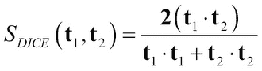
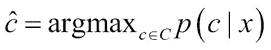
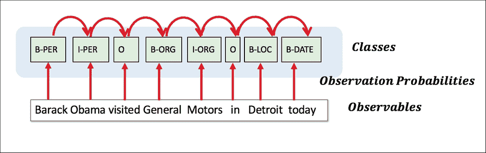
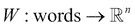

# 八、文本挖掘和自然语言处理

**自然语言处理** ( **NLP** )如今在各种应用中无处不在，比如移动应用、电子商务网站、电子邮件、新闻网站等等。检测电子邮件中的垃圾邮件，描述电子邮件的特征，语音合成，对新闻进行分类，搜索和推荐产品，对社交媒体品牌进行情感分析——这些都是 NLP 和挖掘文本信息的不同方面。

文本内容的数字信息呈指数级增长，其形式包括网页、电子书、短信、各种格式的文档、电子邮件、社交媒体消息(如推文和脸书帖子)，现在的数量级为艾字节(1 艾字节为 1，018 字节)。从历史上看，依赖于自动机和概率建模的最早基础工作始于 20 世纪 50 年代。20 世纪 70 年代见证了诸如随机建模、马尔可夫建模和句法分析之类的变化，但是它们的进展在“人工智能冬天”期间受到了限制。20 世纪 90 年代出现了文本挖掘和一场统计革命，其中包括语料库统计、监督机器学习和文本数据的人工注释。从 2000 年开始，随着计算和大数据的巨大进步，以及在监督和非监督学习中引入复杂的机器学习算法，该领域重新引起了人们的兴趣，现在是学术界和商业企业 R&D 部门最热门的研究主题之一。在这一章中，我们将讨论自然语言处理和文本挖掘在机器学习中的一些重要方面。

本章首先介绍了自然语言处理中的关键领域，然后解释了重要的处理和转换步骤，这些步骤使文档更适合机器学习，无论是有监督的还是无监督的。接下来是主题建模、集群和命名实体识别的概念，并简要描述了两个提供强大文本处理功能的 Java 工具包。本章的案例研究使用另一个广为人知的数据集，通过使用工具 KNIME 和 Mallet 的实验来演示这里描述的几种技术。

本章组织如下:

*   NLP、子字段和任务:

    *   文本分类
    *   词性标注
    *   文本聚类
    *   信息提取和命名实体识别
    *   情感分析
    *   指代消解
    *   词义消歧
    *   机器翻译
    *   语义推理和推断
    *   总结
    *   问答
    *   与挖掘和非结构化数据相关的问题

*   文本处理组件和转换:

    *   文档收集和标准化
    *   分词
    *   停用词去除
    *   词干化/词汇化
    *   局部/全局词典
    *   特征提取/生成
    *   特征表示和相似度
    *   特征选择和降维

*   文本挖掘中的主题:

    *   主题建模
    *   文本聚类
    *   命名实体识别
    *   深度学习和 NLP

*   工具及用法:

    *   木槌
    *   KNIME

*   个案研究

# 自然语言处理、子字段和任务

关于真实世界的信息以结构化数据的形式存在，通常由自动化流程生成，或者以非结构化数据的形式存在，对于文本，由人类直接以书面或口头形式创建。无论是结构化数据还是非结构化数据，观察真实世界情况并使用自动化流程或让人类感知信息并将其转换为可理解数据的过程都非常相似。将观察到的世界转换成非结构化数据涉及到诸如文本语言、文本存在的格式、不同观察者在解释相同数据时的差异等复杂性。此外，由所选语言的语法和语义、表达中的微妙性、数据中的上下文等引起的歧义使得挖掘文本数据的任务非常困难。

接下来，我们将讨论一些涉及 NLP 和文本挖掘的高级子领域和任务。自然语言处理的主题相当广泛，下面的主题并不全面。

## 文本分类

这个字段是最完善的字段之一，其基本的形式将带有非结构化文本数据的文档分类到预定义的类别中。这可以被视为监督机器学习在非结构化文本世界中的直接扩展，从历史文档中学习，以预测未来看不见的文档的类别。电子邮件或新闻分类中的垃圾邮件检测的基本方法是该任务的一些最突出的应用。


图 1:显示不同类别的文本分类

## 词性标注(词性标注)

NLP 中的另一个子任务已经取得了很大的成功，它基于上下文和与相邻单词的关系将语言的词类(如名词、形容词、动词)与文本中的单词相关联。如今，自动化和复杂的 POS 标签员代替了人工 POS 标签。


图 2:与文本片段相关联的位置标签

## 文本聚类

聚类基于相似性对非结构化数据进行组织、检索和分组是文本聚类的子领域。这个领域也随着适合学习的不同聚类和文本表示的进步而得到了很好的发展。


图 3:将操作系统新闻文档聚集到各种特定于操作系统的集群

## 信息抽取和命名实体识别

提取特定元素的任务，如时间、地点、组织、实体等，属于信息提取主题下的。命名实体识别是一个子领域，在不同领域有着广泛的应用，从历史文献的评论到具有基因和药物信息的生物信息学。


图 4:句子中的命名实体识别

## 情感分析和观点挖掘

NLP 领域中的另一个子领域涉及推断观察者的情绪，以便用一种可理解的度量标准对他们进行分类，或者给出对他们观点的洞察。这个领域不像前面提到的一些领域那样先进，但是在这个方向上已经做了很多研究。


图 5:情感分析显示句子的正面和负面情感

## 共指消解

理解对存在于文本中的多个实体的引用并消除该引用的歧义是 NLP 的另一个热门领域。这被认为是做更复杂任务的垫脚石，如问题回答和总结，这将在后面讨论。


图 6:指代消解展示了代词是如何消除歧义的

## 词义消歧

在像英语这样的语言中，由于同一个单词可以基于上下文具有多个含义，因此自动破译这一点是自然语言处理的重要部分，也是**词义消歧** ( **WSD** )的重点。


图 7:使用上下文显示单词“鼠标”如何与正确的单词相关联

## 机器翻译

将文本从一种语言翻译成另一种语言，或者从演讲翻译成不同语言的文本，大体上涵盖了**机器翻译** ( **MT** )的领域。随着机器学习算法在监督、非监督和半监督学习中的使用，该领域在过去几年中取得了重大进展。使用 LSTM 等技术的深度学习已被证明是该领域最有效的技术，并被谷歌广泛用于其翻译。


图 8:显示英汉转换的机器翻译

## 语义推理和推断

从非结构化的文本中推理、推导逻辑和推理是 NLP 的下一个发展层次。


图 9:回答复杂问题的语义推理

## 文本摘要

在自然语言处理中，越来越受欢迎的一个子领域是将大型文档或文本段落自动摘要为易于理解的小型代表性文本。这是自然语言处理中新兴的研究领域之一。搜索引擎对摘要的使用、专家的多文档摘要等等，是受益于该领域的一些应用。

## 自动化问答

回答人类用自然语言提出的问题是自然语言处理领域的另一个新兴领域，从特定领域的问题到通用的开放式问题。


# 挖掘非结构化数据的问题

人类比基于计算机的程序更容易阅读、解析和理解非结构化文本/文档。下面给出了文本挖掘比一般的监督或非监督学习更复杂的一些原因:

*   术语和短语的模糊性。单词 *bank* 有多种含义，人类读者可以根据上下文正确联想，但这需要预处理步骤，如词性标注和词义消歧，如我们所见。根据牛津英语词典，单词 *run* 仅在动词形式上就有不下 645 种不同的用法，我们可以看到这样的单词确实会在解决意图的含义方面存在问题(在它们之间，单词 run、put、set 和 take 有一千多种含义)。
*   与文本相关的上下文和背景知识。考虑一个句子，它使用一个带后缀 *gate* 的新词来表示一个政治丑闻，比如在*中，随着弹劾呼声和支持率的急剧下降，俄罗斯门最终对他的总统任期造成了致命的打击*。人类读者可以猜测这个新词 *Russiagate* 指的是什么，它让人想起高调的阴谋，通过词缀联想到美国政治历史上的另一个重大丑闻*水门*。这对一台机器来说尤其难以理解。
*   推理，即从文档中进行推理是非常困难的，因为将非结构化信息映射到知识库本身就是一个很大的障碍。
*   执行监督学习的能力需要标记的训练文档，并且基于领域，在文档上执行标记可能是耗时且昂贵的。


# 文本处理组件和转换

在本节的中，我们将讨论一些常见的预处理和大多数文本挖掘过程中完成的转换步骤。一般概念是将文档转换成结构化数据集，这些数据集具有大多数机器学习算法可以用来执行不同种类的学习的特征或属性。

我们将在下一节简要描述一些最常用的技术。不同的文本挖掘应用程序可能会使用不同的组件或组件变体，如下图所示:


图 10:文本处理组件和流程

## 文件收集和标准化

大多数文本挖掘应用程序的第一步是以文档体的形式收集数据(??)——在文本挖掘领域通常被称为语料库(??)。这些文档可以具有与它们相关联的预定义分类，或者它可以仅仅是未标记的语料库。文档可以是异构格式，也可以标准化为一种格式，用于下一个标记化过程。拥有多种格式，比如文本、HTML、DOCs、PDGs 等等，会导致许多复杂性，因此在大多数应用程序中，通常首选一种格式，比如 XML 或 **JavaScript 对象符号** ( **JSON** )。

### 输入和输出

输入是同类或异类源的巨大集合，输出是标准化为一种格式的文档集合，比如 XML。

### 它是如何工作的？

标准化包括确保工具和格式根据应用程序的需求达成一致:

1.  同意一种标准格式，比如 XML，带有预定义的标签，这些标签提供了关于文档`(<author>`、`
2.  大多数文档处理器要么可以转换成 XML，要么可以编写转换代码来执行转换。

## 标记化

标记化的任务是从包含单词流的文本中提取单词或有意义的字符。例如，正文*男孩站了起来。然后他追狗*可以令牌化成令牌如 *{tHe，boy，stood，up，he，ran，after，the，dog}* 。

### 输入和输出

输入是众所周知的格式的文档集合，如上一节所述,输出是带有应用程序所需的单词或字符标记的文档。

### 它是如何工作的？

任何用于标记化的自动化系统都必须解决预期要处理的语言所带来的特殊挑战:

*   在英语等语言中，由于存在空格、制表符和换行来分隔单词，所以标记化相对简单。
*   每种语言都有不同的挑战——即使在英语中，缩写词，如 *Dr.* ，字母数字字符( *B12* ，不同的命名方案(*奥赖利*)等等，都必须进行适当的标记化。
*   编写 if-then 指令形式的特定于语言的规则来从文档中提取标记。

## 停止文字删除

这个包括去除没有鉴别或预测价值的高频单词。如果每个单词都可以被视为一个特征，这个过程将显著降低特征向量的维数。介词、冠词和代词是构成停用词的一些例子，在许多应用中，停用词被移除而不影响文本挖掘的性能。

### 输入和输出

输入是提取了标记的文档集合，而输出是通过移除停用词减少了标记的文档集合。

### 它是如何工作的？

在过去的几年中，从手工预编译列表到使用基于术语或交互信息的统计排除，已经发展出了各种各样的技术。

*   许多语言最常用的技术是手动预编译停用词列表，包括介词(in、for、on)、冠词(a、an、The)、代词(his、her、thes、thes)等等。
*   许多工具使用 Zipf 定律(*引用* [3])，其中高频词、单态词和唯一术语被删除。卢恩的早期工作(*参考文献* [4])，如下图 11 所示，显示了词频的上限和下限的阈值，这给了我们可以用于建模的有意义的词:

    图 11:词频分布,显示了语料库中频繁使用、重要和罕见的词的数量

## 词干化或词汇化

将相似单词的标记规范化为一个的想法被称为词干化或词汇化。因此，将文档中所有出现的“talking”、“talks”、“talked”等减少到文档中的一个词根“talk”就是词干化的一个例子。

### 输入和输出

输入是具有记号的文档，输出是具有标准化到其词干或词根的简化记号的文档。

### 它是如何工作的？

1.  基本上有两种类型的词干:屈折词干和词根词干。
2.  屈折词干通常包括去除词缀、规范动词时态和去除复数。因此，在英语中，“ships”为“ship”，“is”，“are”和“am”为“be”。
3.  词根词干通常是比词尾变化词干更激进的形式，词根变化词干将单词规范化为词根。这方面的一个例子是“应用”、“已应用”、“重新应用”等等，都简化为词根“应用”。
4.  Lovin 的词干分析器是最早的词干算法之一(*参考文献* [1])。波特的词干法在 20 世纪 80 年代发展起来，有 6 个步骤，大约 60 条规则，仍然是最广泛使用的词干法(*参考文献* [2])。
5.  当今的应用程序推动了基于词干的各种统计技术，包括使用 n 元语法(n 个项目的连续序列，来自给定文本序列的字母或单词)、**隐马尔可夫模型** ( **HMM** )和上下文敏感词干的技术。

## 本地/全球字典或词汇？

一旦执行了将文档转换成标记的预处理任务，下一步就是使用来自所有文档的所有标记创建一个语料库或词汇表作为一个字典。或者，使用较少文档中的特定标记，基于类别创建几个字典。

当按主题/类别创建字典时，主题建模和文本分类中的许多应用程序表现良好，这被称为本地字典。另一方面，当从所有文档标记创建单个全局字典时，文档聚类和信息提取中的许多应用表现良好。创建一个或多个特定词典的选择取决于核心的 NLP 任务，以及计算和存储需求。

## 特征提取/生成

转换带有非结构化文本的文档的一个关键步骤是将它们转换成带有结构化特征的数据集，类似于我们目前在机器学习数据集中看到的。从文本中提取特征以使其可用于机器学习任务，如监督、非监督和半监督学习，取决于许多因素，如应用的目标、特定领域的要求和可行性。可以从任何文档中提取各种各样的特征，比如单词、短语、句子、词性标记的单词、印刷元素等等。我们将给出在不同的机器学习应用中常用的广泛的特征。

### 词汇特征

词汇特征是文本挖掘应用中最常用的特征。词汇特征构成了下一级特征的基础。它们是简单的字符级或单词级特征，无需试图捕捉关于意图或与文本相关的各种含义的信息。例如，词汇特征可以进一步细分为基于字符的特征、基于单词的特征、词性特征和分类法。在下一节中，我们将更详细地描述其中的一些。

#### 基于字符的特征

单个字符(unigram)或一系列字符(n-gram)是可以从文本文档构建的最简单的特征形式。字符包或单字字符没有位置信息，而更高阶的 n 元语法捕获一些上下文和位置信息。这些特征可以以不同的方式编码或赋予数值，例如二进制 0/1 值或计数，这将在下一节中讨论。

让我们考虑一下令人难忘的苏斯博士押韵作为文本内容——“戴帽子的猫踩在垫子上”。字袋(一个字或一个字的特征)将生成唯一的字符{"t "、" h "、" e "、" c "、" a "、" I "、" n "、" s "、" p "、" o "、" n "、" m"}作为特征，三个字的特征是{ "\sCa "、" sHa "、" sin "、" sma "、" son "、" sst "、" sth "、" Cat "、" Hat "、" at\s "、" e\sC "、" e\sH "、" e\sm "、" eps "、" he\s "、" in\s "、" mat "可以看出，随着“n”的增加，特征的数量呈指数增长，并且很快变得难以处理。n-grams 的优势在于，以增加特征总数为代价，组装的特征似乎常常捕捉到比单个字符本身更有趣的字符组合。

#### 基于单词的特性

代替从字符生成特征，特征可以类似地从单词以一元语法和 n 元语法的方式构建。这些是最流行的特征生成技术。单字记号也称为单词袋模型。因此，当把“戴帽子的猫踩在垫子上”的例子看作是单字特征时，它就是{“the”、“Cat”、“in”、“Hat”、“steps”、“onto”、“mat”}。类似地，相同文本上的二元模型特征将导致{ "猫"、"猫在"、"在"、"帽子中"、"帽步"、"踏上"、"踏上"、"垫子上" }。在基于字符的特征的情况下，通过到达 n 元语法中更高的“n ”,特征的数量增加了，但是通过上下文捕获词义的能力也增加了。

#### 词性标注功能

输入是包含单词的文本，输出是每个单词都与语法标签相关联的文本。在许多应用中，词性给出了上下文，并且在识别命名实体、短语、实体消歧等方面是有用的。在示例“戴帽子的猫踩在垫子上”中，输出是{"the\Det "，" Cat\Noun "，" in\Prep "，" the\Det "，" Hat\Noun "，" steps\Verb "，" onto\Prep "，" the\Det "，" mat\Noun"}。在这个过程中，经常使用特定语言的基于规则的标记或基于马尔可夫链的概率标记。

#### 分类特征

从文本数据中创建分类并使用它来理解单词之间的关系在不同的上下文中也是有用的。各种分类特征，例如上义词、下义词、is-member、member-of、is-part、part-of、反义词、同义词、首字母缩写词等等，给出了在许多文本挖掘场景中证明在搜索、检索和匹配中有用的词汇上下文。

### 句法特征

比文本文档中的字符或单词更高的下一级特征是基于语法的特征。文本中句子的句法表示通常是句法树的形式。语法树将节点捕获为句子中使用的术语，并将节点之间的关系捕获为链接。句法特征还可以捕捉关于句子和用法的更复杂的特征，例如聚合，这些特征可以用于机器学习。它还可以捕捉关于语法树的统计数据，例如句子是左倾、右倾还是平衡，这些数据可以用来理解不同内容或作者的签名。

在词法分析中，两个句子可以有相同的字符和单词，但它们的语法树或意图可能完全不同。将文本中的句子分解成不同的短语——**名词短语** ( **NP** )、**介词短语** ( **PP** )、**动词**(或动名词)**短语** ( **VP** )等等——并捕获句子的短语结构树是这个处理任务的一部分。下面是我们的例句的语法分析树:

```java
(S (NP (NP the cat)
       (PP in
           (NP the hat)))
   (VP steps
       (PP onto
           (NP the mat))))
```

**句法语言模型** ( **SLM** )是关于确定一系列术语的概率。语言模型特征用于机器翻译、拼写校正、语音翻译、摘要等等，仅举几个例子。语言模型还可以在计算中使用解析树和语法树。

应用链规则来计算句子中术语的联合概率:


在“戴帽子的猫踩在垫子上”的例子中:


通常，基于使用任何语料库的计数来估计长句的概率是困难的，因为需要这种句子的许多例子。大多数语言模型在实际实现中使用独立性和 n-grams (2-5 个单词)的马尔可夫假设(*引用* [8])。

### 语义特征

语义特征试图捕捉文本的“含义”，然后用于文本挖掘的不同应用。语义特征的最简单形式之一是向文档添加注释的过程。这些注释或元数据可以包含描述或捕捉文本或文档意图的附加信息。使用协作标记来添加标记以捕获标记作为描述文本的关键词是常见的语义特征生成过程。

语义特征生成的另一种形式是文本的本体表示过程。捕获对象之间不同关系的通用和领域特定本体在知识库中可用，并且具有众所周知的规范，例如语义 Web 2.0。这些本体特征有助于在文本挖掘中完成复杂的推理、概括、分类和聚类任务。文本或文档中的术语可以映射到本体中的“概念”并存储在知识库中。本体中的这些概念具有语义属性，并以多种方式与其他概念相关，例如泛化/特殊化、成员/成员、关联等等。概念和关系的这些属性或特性可以进一步用于搜索、检索，甚至用于预测建模。例如，许多语义特征使用词汇和句法过程作为语义过程的前驱，并使用输出(如名词)来映射到本体中的概念。将概念添加到现有的本体中，或者用更多的概念对其进行注释，使得该结构更适合学习。例如，在“猫在..”句子，“猫”有{年龄，吃，...}并具有不同的关系，如{“isA 哺乳动物”、“hasChild”、“hasParent”等}。

## 特征表示和相似性

上一节描述的词汇、句法和语义特征，通常有彼此完全不同的表现。相同特征类型的表示，即词汇、句法或语义的表示，可以根据它们所用于的计算或挖掘任务而有所不同。在本节中，我们将描述最常见的基于词汇特征的表示，称为向量空间模型。

### 向量空间模型

**向量空间模型** ( **VSM** )是非结构化文档到数字向量表示的转换，其中语料库中的术语形成向量的维度，我们使用一些数字方式将值与这些维度相关联。

如在词典一节中所讨论的，语料库由来自一个领域或一个领域的局部子类别中的整个文档集合的独特单词和短语形成。这种字典的每个元素都是向量的维数。术语可以是单个单词或短语，如 n-grams 中的术语，它们构成维度，并且在给定的文本/文档中可以有不同的值与之相关联。目标是以反映整个语料库中术语的相关性的方式捕获维度中的值(*引用* [11])。因此，每个文档或文件都被表示为一个高维数值向量。由于项的稀疏性，数值向量表示在数值空间中具有稀疏表示。接下来，我们将给出一些将值与这些术语相关联的众所周知的方法。

#### 双星

这个是将值与术语或维度相关联的最简单的形式。在二进制形式中，语料库中的每个术语基于该术语在文档中的存在或不存在而被赋予 0 或 1 值。例如，考虑以下三个文档:

*   文档 1:“戴帽子的猫踩在垫子上”
*   文件 2:“猫坐在帽子上”
*   文件三:“猫爱踩垫子”

在通过移除停用词{on，the，in，onto}和使用单字或单词包词干化{love/loves，steps/step}进行预处理之后，{cat，hat，step，mat，sat，love}是语料库的特征。现在，每个文档都用二进制向量空间模型表示，如下所示:

| 

条款

 | 

猫

 | 

帽子

 | 

步骤

 | 

垫子

 | 

坐

 | 

爱

 |
| --- | --- | --- | --- | --- | --- | --- |
| 文档 | one | one | one | one | Zero | Zero |
| 文档 | one | one | Zero | Zero | one | Zero |
| 文档 | one | Zero | one | one | Zero | one |

#### 词频(TF)

在**词频** ( **TF** )中，顾名思义，整个文档中的词频构成了特征的数值。基本假设是，术语出现的频率越高，该术语与文档的相关性就越大。术语的计数或术语的归一化计数用作每列术语中的值:

*tf(t) = count(D，t)*

下表给出了我们示例中三个文档的词频:

| 

TF /术语

 | 

猫

 | 

帽子

 | 

步骤

 | 

垫子

 | 

坐

 | 

爱

 |
| --- | --- | --- | --- | --- | --- | --- |
| 文档 | one | one | one | one | Zero | Zero |
| 文档 | one | one | Zero | Zero | one | Zero |
| 文档 | one | Zero | one | one | Zero | one |

#### 逆文档频率(IDF)

**逆文档频率** ( **IDF** )有各种风格，但最常见的计算方式是使用以下方式:


这里，  IDF 最青睐那些在文档中出现频率相对较低的术语。研究中还提出了一些基于经验的 IDF 改进方案(*参考文献*【7】)。

我们的示例语料库的 TF:

| 

条款

 | 

猫

 | 

帽子

 | 

步骤

 | 

垫子

 | 

坐

 | 

爱

 |
| --- | --- | --- | --- | --- | --- | --- |
| 不包括新泽西州 | 3/3 | 3/2 | 3/2 | 3/2 | 3/1 | 3/1 |
| 综合资料的文件（intergrated Data File） | Zero | Zero point four | Zero point four | Zero point four | One point one | One point one |

#### 词频-逆文档频率(TF-IDF)

将项频率和逆文档频率组合在一个度量中，我们得到项频率-逆文档频率值。其思想是重视那些在语料库中相对不常见的术语(高 IDF)，但是与文档合理相关的术语(高 TF)。TF-IDF 是许多文本挖掘过程中最常见的值关联形式:


这为我们提供了每个文档中所有术语的 TF-IDF:

| 

TF-IDF/条款

 | 

猫

 | 

帽子

 | 

步骤

 | 

垫子

 | 

坐

 | 

爱

 |
| --- | --- | --- | --- | --- | --- | --- |
| 文档 | Zero | Zero point four | Zero point four | Zero point four | One point one | One point one |
| 文档 | Zero | Zero point four | Zero | Zero | One point one | Zero |
| 文档 | Zero | Zero | Zero point four | Zero point four | Zero | One point one |

### 相似性度量

监督、非监督和半监督学习中的许多技术在它们的基础算法中使用“相似性”度量来寻找相似的模式或分离不同的模式。相似性度量与数据的表示密切相关。在文档的 VSM 表示中，向量是非常高维和稀疏的。这给大多数传统的分类、聚类或信息检索的相似性度量带来了严重的问题。基于角度的相似性度量，如余弦距离或 Jaccard 系数，在实践中更常用。考虑对应于两个文本文档的由**t**1 和**t**2 表示的两个向量。

#### 欧几里德距离

这个是文档的特征空间中的 L2 范数；


#### 余弦距离

这个基于角度的相似性度量只考虑矢量之间的方向，而不考虑它们的长度。它等于矢量间夹角的余弦值。由于向量空间模型是正空间，余弦距离从 0(正交，没有公共项)变化到 1(所有项对两者都是公共的，但不一定具有相同的项频率):


#### 成对自适应相似度

该通过仅考虑两个文档中最重要的特征，在缩减的特征空间中测量距离:


这里， **t** [i，k] 是由 **t** [i] ( *i* = 1，2)包含出现在 **t** [1] 和 **t** [2] 中的 *K* 最大特征的并集的特征子集形成的向量。

#### 扩展的雅克卡系数

这个度量被计算为共享术语与文档间术语的并集的比率:


#### 骰子系数

骰子系数由下式给出:



## 特征选择和降维

目标与第二章、*现实世界监督学习的实用方法*和第三章、*无监督机器学习技术*中的目标相同。随着文本挖掘和高维特征的出现，维数灾难的问题变得更加明显。

### 功能选择

大多数特征选择技术是监督技术,依赖于标签或特征评分的结果。在大多数情况下，由于较低的性能成本，我们执行基于过滤器而不是基于包装器的特征选择。即使在基于过滤器的方法中，一些方法，如那些涉及多元技术的方法，如基于**相关性的特征选择** ( **CFS** )，如第二章、*现实世界监督学习的实用方法*中所述，可能会相当昂贵，或者由于高维度而导致次优性能(*参考文献*【9】)。

#### 信息论技术

如第二章、*现实世界监督学习的实用方法*所示，基于滤波器的单变量特征选择方法，如**信息增益** ( **IG** )和**增益比** ( **GR** )，是预处理和特征提取完成后最常用的。

在他们的研究中，Yang 和 Pederson ( *参考文献* [10])清楚地展示了使用 IG 进行特征选择和缩减的好处，可以删除近 98%的术语，同时提高分类器的预测能力。

许多信息论或基于熵的方法由于记号的边际概率而具有更强的影响。当术语具有相等的条件概率 P(t|class)时，这可能是一个问题，较罕见的术语可能具有比常见术语更好的分数。

#### 基于统计的技术

？特征选择是文本挖掘中最常用的基于统计的特征选择技术之一。？ ² 统计，如第二章、*现实世界监督学习的实用方法*所示，给出文本中的记号和类之间的独立关系。

事实证明。 ² 当存在低频术语时，用于特征选择的统计可能无效(*参考文献* 19】)。

#### 基于频率的技术

使用特征表示章节中描述的术语频率或文档频率，可以手动设置阈值，只有高于或低于特定阈值的术语才允许用于分类或聚类任务中的建模。注意，**词频** ( **TF** )和**文档频率** ( **DF** )方法偏向于常用词，而一些信息论或基于统计的方法偏向于不常用词。特征的选择取决于领域、预测学习的特定应用，更重要的是，取决于如何评估使用这些特征的模型，尤其是在看不见的数据集上。

### 降维

我们在[第三章、*无监督机器学习技术*中看到的另一种方法是使用无监督技术来减少特征，使用某种形式的转换来决定它们的有用性。

**主成分分析** ( **PCA** )根据文档-术语矩阵计算协方差或相关矩阵。它将数据转换为输入项的线性组合，转换后的特征或项的组合比输入项具有更高的鉴别能力。如第三章、*无监督机器学习技术*中所示，对转换后的特征进行截断或阈值处理的 PCA 可以显著降低维数，甚至提高或给出与高维输入空间相当的性能。使用 PCA 的唯一问题是变换后的特征是不可解释的，对于理解哪些术语或组合产生更好的预测模型的领域，这种技术有一些限制。

**潜在语义分析** ( **LSA** )是使用从术语和文档构建的输入矩阵并将其转换到更低的维度的另一种方式，通过文档中使用的术语的组合(*引用*【5】)发现潜在概念。下图显示了使用**奇异值分解** ( **SVD** )方法分解输入文档术语矩阵的过程:


图 12:将输入文档术语 SVD 分解成 LSA 文档向量和 LSA 术语向量

LSA 已被证明是一种非常有效的降维方法，也是一种提高模型预测性能的方法。LSA 的缺点是执行检索或查询需要存储向量 U 和 V。确定较低的维度 k 是很难的，需要一些类似于第三章、*中讨论的 k-means 的试探法*。


# 文本挖掘的主题

正如我们在第一部分看到的，文本挖掘和对文本进行机器学习的领域跨越了广泛的主题。讨论的每个主题都有一些对主流算法的定制，或者有一些特定的算法被开发来执行该领域中要求的任务。我们选择了四个广泛的主题，即文本分类、主题建模、文本聚类和命名实体识别，并将详细讨论每个主题。

## 文本分类/归类

文本分类问题体现在不同的应用中，例如文档过滤和组织、信息检索、观点和情感挖掘、电子邮件垃圾邮件过滤等等。类似于第二章、*现实世界监督学习的实用方法*中讨论的分类问题，一般思想是在带有标签的训练数据上进行训练，并预测看不见的文档的标签。

如前一节所讨论的，预处理步骤有助于将非结构化文档集合转换成众所周知的按照文档术语矩阵排列的数字或分类/二进制结构化数据。选择执行一些预处理步骤，如词干提取或自定义停用词，取决于数据和应用。特征选择一般是基本的词汇特征，n 个单词组成的词项，只有在某些情况下，我们才把整个文本作为一个字符串使用，而不把它分成词项或记号。对于文档术语结构化数据，通常使用二进制特征表示或基于频率的表示。一旦这种转换完成，我们使用单变量分析进行特征选择，例如信息增益或卡方，以选择高于特定分数阈值的区别特征。在许多应用中，还可以执行特征变换和维数减少，例如 PCA 或 LSA。

一旦我们从前面的过程中获得结构化数据，分类器的选择范围就很广。在研究和商业应用中，我们看到了大多数常见建模技术的使用，包括线性(线性回归、逻辑回归等)、非线性(SVM、神经网络、KNN)、生成(朴素贝叶斯、贝叶斯网络)、可解释(决策树、规则)和基于集成(bagging、boosting、随机森林)的分类器。许多算法使用相似性或距离度量，其中余弦距离是最受欢迎的选择。在某些分类器中，如 SVM，文档的字符串表示可以按原样使用，通过正确选择字符串核和基于字符串相似性的度量来计算点积。

验证和评估方法类似于监督分类方法——将数据分为训练/验证/测试、训练数据训练、调整验证数据算法的参数，以及估计模型在保留或测试数据上的性能。

由于大多数文本分类涉及大量的文档，并且目标类别很少，因此在大多数情况下，用于评估、调整或选择算法的度量是精度、召回率和 F 值度量，如下所示:


## 话题建模

一个主题是一个固定词汇的分布。主题建模可以定义为在各种文档中捕捉不同核心思想或主题的能力。这有广泛的应用，如文件摘要，理解情绪，趋势，新闻和许多其他原因。下图显示了主题建模如何从语料库中识别用户指定数量 *k* 的主题，然后为每个文档分配代表每个主题在文档中出现的比例:


图 13:文档的概率主题权重分配

文献中有不少使用监督和非监督学习进行主题建模的技术(*参考文献* [13])。我们将讨论最常见的技术，称为**概率潜在语义索引** ( **PLSI** )。

### 概率潜在语义分析(PLSA)

PLSA 的想法，就像 LSA 中的特征约简一样，是通过发现共现术语之间的关联，并将文档视为这些概念的混合物，来找到隐藏在语料库中的潜在概念。这是一种无监督的技术，类似于降维，但其思想是使用它来建模文档中主题或潜在概念的混合(*参考文献* 12】)。

如下图所示，该模型可以将语料库中经常一起出现的术语与潜在概念相关联，然后可以说每个文档都或多或少地展示了该主题:


*   需要建模或发现的主题数量为 *k* 。

输出是:

*   *k* 题目确定 T = {T [1] ，T [2] ，…T [k] }。
*   对于每个文档，文档 *d* [i] 给出的主题覆盖范围可以写成= { *p* [i1] ， *p* [i2] ，… *p* [ik] }，其中 *p* [ij] 是文档 *d* i 覆盖主题 T [j 的概率]

#### 它是如何工作的？

PLSA 的实施一般遵循这里描述的步骤:

1.  如果需要，执行前面讨论的基本预处理步骤，例如标记化、停用词去除、词干化、单词字典形成、特征提取(单字或 n 字等等)和特征选择(无监督技术)。
2.  这个问题可以简化为估计文档中术语的分布，并且在给定分布的情况下，基于对应于主题的最大术语来选择主题。
3.  引入“潜在变量” *z* 有助于我们选择术语是否属于某个主题。注意 *z* 不是“观察到的”，但是我们假设它与从题目中挑选术语有关。因此，给定文档 *t* 的条件 *t* 的概率可以用这个潜在变量表示为:
4.  By using two sets of variables (?, p) the equation can be written as:

    这里，p(t | z；？)是项和 p(z|d)中潜在概念的概率；p)是特定文档混合中潜在概念的概率。

5.  利用对数似然估计参数最大化:
6.  由于该方程涉及非凸优化，EM 算法经常用于迭代地寻找参数，直到达到收敛或完成总迭代次数(*参考文献*【6】):

    1.  EM 算法的 E 步用于确定潜在概念的后验概率。术语 t 在文档 d 中出现的概率可以由潜在概念 z 解释为:
    2.  EM 算法的 M 步骤使用从 E 步骤获得的值，即 p(z|d，t)，并且进行参数估计为:
    3.   =术语 *t* 与概念 *z* :

    

#### 优点和局限性

其优点和局限性如下:

*   尽管被广泛使用，PLSA 也有一些缺点，这些缺点已经被最近的技术克服了。
*   该算法的无监督性质及其普遍适用性使其可以用于各种类似的文本挖掘应用，如聚类文档、关联与作者/时间相关的主题等。
*   如前几章所述，EM 算法的 PLSA 面临着“陷入局部最优”的问题，这与其他全局算法(如进化算法)不同。
*   PLSA 算法只能在已知文档中进行主题识别，而不能进行任何预测建模。PLSA 已被推广并被称为**潜狄利克雷分配** ( **LDA** )来克服这一点(*参考文献*【14】)。

## 文本聚类

聚类的目标，正如在第三章、*无监督机器学习技术*中看到的，是在组内找到彼此相似的数据、文本或文档组。非结构化数据的粒度各不相同，从小短语或句子、段落和文本段落到一组文档。文本聚类在许多领域都有应用，例如信息检索、摘要、主题建模和无监督情况下的文档分类等。一旦通过预处理将非结构化文本数据转换成结构化数据，就可以使用传统的聚类技术。传统聚类技术的难点在于使用转换后的文档术语矩阵表示获得的数据集的高维度和稀疏性。许多传统的聚类算法只对特征的数值起作用。由于这种限制，不能使用术语的分类或二进制表示，通常使用 TF 或 TF-IDF 来表示文档-术语矩阵。

在这一节中，我们将讨论集群的一些基本过程和技术。我们将从预处理和转换开始，然后讨论一些广泛使用的技术和对它们的修改。

### 特征变换、选择和归约

本节中讨论的大多数预处理步骤通常用于获取文档中术语的单字母或 n 字母表示。降维技术，如 LSA，经常被用来将特征转换成更小的潜在空间。

### 聚类技术

用于文本聚类的技术包括概率模型，以及那些使用基于距离的方法的技术，这是我们在学习结构化数据时所熟悉的。我们还将讨论**非负矩阵分解** ( **NNMF** )作为一种有效的技术，具有良好的性能和可解释性。

#### 生成概率模型

在生成方法中，主题建模和文本聚类之间存在共性。如下图所示，与主题建模相比，聚类将一个文档与一个单独的聚类相关联，主题建模中每个文档都有可能覆盖多个主题。主题建模中的每个词都可以由多个主题以独立的方式生成，而在聚类中，所有的词都是从同一个聚类中生成的:


图 15:文档到 K-Clusters 的排他映射

数学上，这个可以用两个话题 T = {T [1] ，T [2] }和两个集群 c = {c [1] ，c [2] }来解释。

在聚类中，文档的可能性可以被给定为:


如果文档有 L 个术语，这可以进一步扩展为:


因此，一旦你“假定”了一个簇，所有的单词都来自这个簇。计算所有项的乘积，然后对所有分类求和。

在主题建模中，文档的可能性可以被给定为:


因此，每个项 ti 都可以从主题中独立选取，因此求和在内部完成，乘积在外部完成。

##### 输入和输出

这些输入是:

*   A collection of documents following a certain format and structure expressed with the following notation:

    D = { *d* 1， *d* 2，… *d* n}

*   需要建模或发现的集群数量为 *k* 。

输出是:

*   *k* 簇确定 c = {c [1] ，c [2] ，… c [k] }。
*   对于每个文档， *p(d* [i] *)* 被映射到一个簇 *k* 。

##### 它是如何工作的？

以下是步骤:

1.  基本的预处理步骤如前所述，如标记化、停用词移除、词干化、单词字典形成、术语的特征提取(单字母或 n 字母等)、特征转换(LSA)，甚至特征选择。让 *t* 成为最终特征集中的术语；它们对应于字典或词汇。
2.  类似于 PLSA，我们引入一个“潜在变量”， *z* ，帮助我们选择属于该簇的文档是否落在该簇对应的 *z* ={1，2，… *k* }的范围内。让*？*参数是我们为每个潜在变量估计的参数，使得 *p(？* [i] *)* 对应聚类的概率 *z = i* 。
3.  The probability of a document belonging to a cluster is given by *p(?*[i]*)*, and every term in the document generated from that cluster is given by *p(t|?*[i]*)*. The likelihood equation can be written as:

    注意，它不是遍历文档，而是用词汇表中的术语 *t* 重写，该术语在文档中出现的次数。

4.  执行 EM 算法的方式与我们之前使用的估计参数的方法类似，如下所示:

    1.  EM 算法的 E 步用于推断生成文档的聚类:
    2.  EM 算法的 M 步用于使用 E 步的结果重新估计参数，如下所示:

    
5.  可以使用最大可能性或者使用具有先验概率的贝叶斯算法来完成每个文档的最终概率估计，如下所示:或

##### 优点和局限性

*   基于生成的模型与 LSA 和 PLSA 的模型有相似的优势，在这两个模型中，我们在聚类中获得文档的概率分数。通过应用领域知识或使用集群大小的先验知识，可以进一步微调分配。
*   EM 算法的缺点与陷入局部最优和对起始点敏感有关，在这里仍然是正确的。

#### 基于距离的文本聚类

大多数基于距离的聚类算法依靠相似性或距离度量来确定实例在特征空间中彼此相距多远。通常，在具有数值的数据集中，欧几里德距离或其变体非常有效。在文本挖掘中，甚至在将非结构化文本转换成具有数值的术语的结构化特征之后，已经发现余弦和 Jaccard 相似度函数表现得更好。

通常，使用在第三章、*中讨论的凝聚或分层聚类，无监督机器学习技术*，它可以根据相似性合并文档，如前所述。合并文档或组通常使用单链接、组平均链接和完全链接技术来完成。凝聚聚类还产生一种可用于信息检索和文档搜索的结构。

还采用了基于划分的聚类技术 k-means 和 k-medoids，以及合适的相似性或距离方法。如在关于聚类技术的讨论中所指出的，k-means 的问题是对起始条件以及计算空间和时间的敏感性。k-medoids 对稀疏数据结构敏感，并且还具有计算空间和时间约束。

#### 非负矩阵分解(NMF)

非负矩阵分解是另一种用于将大型数据特征矩阵分解为两个非负矩阵的技术，这两个非负矩阵不仅可以执行降维，而且更易于检查。NMF 因文档聚类而广受欢迎，许多具有不同优化功能的 NMF 变体现已被证明在文本聚类中非常有效(*参考文献*【15】)。

##### 输入和输出

这些输入是:

*   A collection of documents following a certain format and structure given by the notation:

    D = {d [1] ，d [2] ，… d [n] }

*   需要建模或发现的集群数量为 *k* 。

输出是:

*   k 个集群用分配给集群的文档来标识 c = {c [1] ，c [2] ，… c [k] }。

##### 它是如何工作的？

下面给出了 NMF 的数学细节和解释:

1.  NMF 背后的基本思想是使用低秩近似对输入矩阵进行因式分解，如下:
2.  A non-linear optimization function is used as:

    这在 W 或 H 中是凸的，但不是在两者中都是凸的，因此不能保证全局最小值。使用约束最小二乘的各种算法，例如均方误差和梯度下降，被用于求解优化函数。

3.  NMF 的解释，尤其是在理解基于术语的潜在主题方面，非常有用。术语和文档的输入 A [m x n] 可以在低秩近似中表示为 W [m x k] H [k x n] 矩阵，其中 W [m x k] 是术语-主题表示，其列是 NMF 基向量。由 W [1] 给出的 W 的第 1 列的非零元素对应于特定项。因此，w [ij] 可以解释为关于术语 j 的基向量 W [i] ，H [i1] 可以解释为 doc 1 给出的文档对主题向量 W [i] 的方向有多大的亲和力。
4.  从论文(*参考文献*【18】)中可以清楚地看出，为医学摘要(称为 Medlars 数据集)获得的基本向量如何创建高度可解释的基本向量。这些基向量中权重最高的项直接对应概念，比如 W [1] 对应与“心脏”相关的话题，W [5] 与“发育障碍”相关。

    图 16:来自朗维尔等人(2006),显示了用于可解释性的医学数据集的一些基本向量

##### 优点和局限性

在信息检索和查询方面，NMF 已经被证明在性能上几乎与顶级算法相当，例如 LSI:

*   NMF 的可伸缩性、计算和存储比 LSA 或使用 SVD 的 LSI 要好。
*   NMF 有一个问题，优化不是全局的，陷入局部最小值。
*   因子的 NMF 生成依赖于优化算法和选择的参数，并且不是唯一的。

### 文本聚类的评价

在标记数据集的情况下，第三章、*无监督机器学习技术、*中讨论的所有外部度量，如 F-measure 和 Rand Index，在评估聚类技术时都是有用的。当数据集没有标注时，可以使用一些被称为内部测量的技术，如戴维斯–波尔丁指数、R 平方和剪影指数。

一般的良好实践是调整并确保文档之间的相似性，如本节所讨论的，当应用于文本挖掘数据时，用于测量聚类的接近度、遥远度和扩散度。类似地，用法也取决于算法和问题的相关性。在基于距离的分割算法中，文档的相似性可以通过平均向量或质心来计算。在分层算法中，可以用组中最相似或最不相似的文档来计算相似性。

## 命名实体识别

命名实体识别(**)是文本挖掘信息检索中最重要的课题之一。许多复杂的挖掘任务，如关系的识别、事件的注释和实体间的关联，都使用 NER 作为初始组件或基本预处理步骤。**

**历史上，基于规则和基于正则表达式的人工技术被用于实体识别。这些人工规则依赖于基本的预处理，使用 POS 标签作为特征，以及手工设计的特征，例如大写单词的存在、单词前标点符号的使用等等。**

**基于统计学习的技术现在更多地用于 NER 及其变体。NER 可以映射到机器学习中的序列标记和预测问题。生物符号，其中每个实体类型 T 有两个标签 B-T 和 I-T 分别对应于开始和中间，被标记，学习包括找到模式并在看不见的数据中预测它。O 代表文本序列中的外部或无关实体。实体类型 T 以最基本的形式被进一步分类为个人、组织、数据和位置。**

**在本节中，我们将讨论两种最常用的算法:基于生成的隐马尔可夫模型和基于判别的最大熵模型。**

**虽然我们在命名实体识别的上下文中讨论这些算法，但是相同的算法和过程可以用于其他 NLP 任务，例如词性标注，其中标签与序列相关联，而不是与 NER 类相关联。**

### **NER 的隐马尔可夫模型**

**隐藏的马尔可夫模型，正如在第六章、*概率图建模*中所解释的，是基于序列的生成模型，它假设生成序列的底层分布。通过用正确的 NER 类标记序列而获得的训练数据可以用于学习分布和参数，从而对于未知的未来序列，可以进行有效的预测。**

#### **输入和输出**

**训练数据由文本序列 x ={x [1] ，x [2] ，...x [n] }其中每个 xi 是文本序列中的一个单词，并且每个单词的标签可作为 y ={y [1] ，y [2] ，...y [n] }。该算法生成一个模型，以便在对看不见的数据进行测试时，可以生成新序列的标签。**

#### **它是如何工作的？**

1.  **在最简单的形式中，做了一个马尔可夫假设，即序列的隐藏状态和标签只依赖于前一个状态。对带标签的单词序列的一种适应如下图所示:

    图 17:隐藏马尔可夫链中对应于 NER 的文本序列和标签** 
2.  **序列分类的 HMM 公式有助于估计在训练数据上最大化的联合概率:**
3.  **假设每个 *y* [i] 都是基于*y*[I–1]和 *x* i 生成的，实体中的第一个字是根据当前和以前的标签生成的，即 *y* [i] 和*y*[I–1]。如果该实例已经是一个命名实体，那么只对以前的实例进行调节，即*x*I–1。“到访过”、“在”等外界词被认为“不是名类”。**
4.  **具有前向-后向算法的 HMM 公式可用于确定具有从训练数据中学习的参数的观察序列的可能性。**

#### **优点和局限性**

**优点和局限性如下:**

*   **hmm 适用于短序列，如图所示，带有一个单词或术语以及独立性假设。对于实体跨度较长的序列，结果将违反这些假设。**
*   **HMM 需要大量的训练数据来估计参数。**

### **NER 的最大熵马尔可夫模型**

****最大熵马尔可夫模型** ( **MEMM** )是一种流行的 NER 技术，它使用马尔可夫链的概念和最大熵模型来学习和预测命名实体(*引用*【16】【17】)。**

#### **输入和输出**

**训练数据由文本序列 x ={x1，x2，...其中每个 xi 是文本序列中的一个单词，并且每个单词的标签可作为 y ={y1，y2，...yn}。该算法生成模型，以便在对看不见的数据进行测试时，可以生成新序列的标签。**

#### **它是如何工作的？**

**下面的说明了如何使用 MEMM 方法来学习命名实体。**

1.  **MEMM 中的特征可以是单词特征或其他类型的特征，如“isWordCapitalized”等，这使它比 HMM 具有更多的上下文并提高了性能，HMM 仅基于单词。**
2.  **接下来，让我们看看最大熵模型，称为最大熵模型，这是一个指数概率模型，但也可以被视为多项式逻辑回归模型。在基本的 MaxEnt 模型中，给定特征{f [1] ，f [2] … f [N] }和类 c [1] ，c [2] … c [C] ，这些特征的权重是使用优化方法从训练数据和特定的概率中学习到的**
3.  **The feature fi is formally written as fi, which means the feature f[i] for class c and observation x. The fi is generally binary with values 1/0 in most NER models. Thus, it can be written as:

    基于跨类预测概率的最大似然法可用于选择单个类:

    **
4.  **For every word, we use the current word, the features from "nearby" words, and the predictions on the nearby words to create a joint probability model. This is also called local learning as the chunks of test and distribution are learned around local features corresponding to the word.

    在数学上，我们看到如何从当前单词和最后预测创建判别模型，如下所示:

    

    k 要素的概化:

    **
5.  **因此，在 MEMM，我们计算状态的概率，这是 NER 的类，即使我们以 y[I–1]给出的邻近单词的预测为条件，一般来说，我们可以使用更多的特征，这是优于之前讨论的 HMM 模型的优势:

    图 18:带标签的文本序列和观察概率** 
6.  **维特比算法用于执行对单词的类别估计或 HMM 中的解码/推理，即获得对 p(y[I]| y[I–1]，X [i] 的估计**
7.  **最后，使用 MaxEnt 模型来估计权重，如之前使用优化方法对于状态变化一般:**

#### **优点和局限性**

*   **MEMM 在使用不仅仅是基于单词甚至是人类工程的功能方面有更大的灵活性，这给了它更多的丰富性，并使其模型更具预测性。**
*   **与 HMM 相比，MEMM 可以具有不仅仅是相近单词的范围，这使其在更大范围内具有检测优势。**

## **深度学习和自然语言处理**

**在过去的几年里，深度学习及其在自然语言处理各个领域的应用取得了巨大的成功，并被 ?? 认为是当今科技的前沿。使用深度学习的主要优势在于工具和方法的小子集，这些工具和方法在各种各样的 NLP 问题中是有用的。它解决了特征工程的基本问题，并通过自动学习来仔细创建手动表示，从而解决了让大量语言专家处理各种问题的问题，例如文本分类、情感分析、词性标注和机器翻译等等。在这一部分，我们将尝试涵盖深度学习和 NLP 领域的重要概念和研究。**

**在他的开创性论文中，Bengio 介绍了深度学习最重要的构建模块之一，称为单词嵌入或单词向量(*参考文献* [20])。单词嵌入可以被定义为将单词映射到高维向量(基于应用通常是 25 到 500 维)的参数化函数。**

**形式上，这可以写成。**

**比如和，等等。**

**一个神经网络( *R* )，其输入是来自句子的单词或具有二元分类的句子的 n-grams，例如 n-grams 中的单词序列是否有效，用于训练和学习 *W* 和 *R* :**

**

图 19:一个模块化神经网络学习 5 个单词的有效-无效分类** 

**例如:**

*   ***R(W(cat)，W(sat)，W(on)，W(the)，W(mat)) = 1(有效)***
*   ***R(W(cat)，W(sat)，W(on)，W(the)，W(mat)) = 0(无效)***

**训练这些句子或 n-grams 的想法不仅是学习短语的正确结构，也是学习 *W* 和 *R* 的正确参数。使用第三章、*无监督机器学习技术*中介绍的各种线性和非线性特征简化/可视化技术，单词嵌入也可以被投射到较低维度的空间，例如 2D 空间，人类可以很容易地将其可视化。这种使用 t-SNE 等技术的二维单词嵌入可视化发现了关于基于语义的单词接近度的重要信息，甚至发现了该区域中单词的聚类，如下图所示:**

**

图 20:整个单词映射的一小部分的 t-SNE 表示。罗马数字和单词中的数字在左边聚集在一起，而语义相近的单词在右边聚集在一起。** 

**进一步扩展概念，科洛伯特和米科洛夫都表明，学习单词嵌入的副作用在各种 NLP 任务中非常有用，例如相似短语学习(例如， *W("the color is red"))* *？* *W("颜色是黄色")*，找同义词(例如 *W("钉钉")* *？* *W("被砸")*，类比映射(例如 *W("人")？W(“女”)然后 W(“王”)？W(" queen ")*，甚至复杂的关系映射(例如， *W("Paris ")？W(“法国”)然后 W(“东京”)？w("日本")* ( *参考文献*【21 和 22】)。**

**将单词嵌入概念扩展到通用表示，这有助于我们在各种 NLP 问题中重用该表示(通过较小的扩展)，这是 NLP 中深度学习最近取得许多成功的主要原因。Socher 在他的研究中扩展了单词嵌入的概念产生了双语单词嵌入，即把来自两种不同语言的单词，如汉语(普通话)和英语，嵌入到一个共享的空间(*引用*【23】)。通过相互独立地学习两种语言的单词嵌入，然后将它们投射到同一空间，他的工作让我们对跨语言的单词相似性有了有趣的见解，这可以扩展到机器翻译。Socher 还做了有趣的工作，将从 CNN 学习到的嵌入单词的图像投影到相同的空间，以将单词与图像关联起来，作为一个基本的分类问题(*参考文献* 24】)。大约在同一时间，谷歌也在研究类似的概念，但规模更大，用于词-图匹配和学习。**

**递归神经网络的想法是将单词嵌入概念扩展到组合器或关联模块，这些模块可以帮助组合所有组合中的单词、单词-短语、短语-短语，以学习复杂的句子。下图显示了如何使用递归神经网络学习复杂关联*((猫)(sat(on (the mat))))* 。它还消除了神经网络中输入“固定”数量的限制，因为它能够递归组合:**

**

图 22:一个复合句，显示了通过 RNN 连接的带有负面情绪(红色圆圈)、正面情绪(绿色圆圈)和中性情绪(空 0)的单词。** 

**递归神经网络的概念现在被扩展，使用编码器和解码器的构建块来学习可逆的句子表示——也就是说，从输入句子中重建意思大致相同的原始句子(*引用*【27】)。这已经成为神经机器翻译背后的中心核心主题。使用 RNNs 的编码器-解码器框架对对话建模也取得了巨大的突破(*参考文献* [28])。**

**

# 工具和用法

我们现在将讨论在各种 NLP 和文本挖掘应用中使用的一些最著名的 Java 工具和库。

## 木槌

Mallet 是一个用 Java 编写的文本的机器学习工具包，它附带了几个自然语言处理库，包括那些用于文档分类、序列标记和主题建模的库，以及各种机器学习算法。它是开源的，在 CPL 下发布。Mallet 公开了一个广泛的 API(见下面的截图)，用于创建和配置预处理、矢量化、特征选择等“管道”序列，以及扩展分类和聚类算法的实现，加上许多其他文本分析和机器学习功能。


## KNIME

KNIME 是一个开放的分析平台，拥有开放的 GL 许可，拥有许多强大的工具，可以处理数据科学的所有方面。文本处理模块可以从 KNIME 实验室单独下载。KNIME 有一个直观的拖放 UI，可以从他们的工作流服务器下载示例。

### 注意

https://www.knime.org/

克尼梅实验室:[`tech.knime.org/knime-text-processing`](https://tech.knime.org/knime-text-processing)

该平台包括一个节点存储库，其中包含所有必要的工具，通过方便的节点嵌套来构建您的工作流，可以通过复制和粘贴来轻松重用这些节点。工作流的执行很简单。调试错误可能需要一些时间来适应，因此我们的建议是以文本挖掘为例，使用不同的数据集作为输入，并使工作流执行时没有错误。这是熟悉平台最快的方法。

## 用木槌做主题造型

我们现在将说明如何使用 API 和 Java 代码来实现主题建模，以向用户展示如何用 Java 为一个问题构建文本学习管道:

```java
//create pipeline
ArrayList<Pipe> pipeList = new ArrayList<Pipe>();
  // Pipes: lowercase, tokenize, remove stopwords, map to features
pipeList.add( new CharSequenceLowercase() );
pipeList.add( new CharSequence2TokenSequence(Pattern.compile("\\p{L}[\\p{L}\\p{P}]+\\p{L}")) );
pipeList.add( new TokenSequenceRemoveStopwords(new File("stopReuters/en.txt"), "UTF-8", false, false, false) );
//add all 
pipeList.add( new TokenSequence2FeatureSequence() );
InstanceList instances = new InstanceList (new SerialPipes(pipeList));
//read the file
Reader fileReader = new InputStreamReader(new FileInputStream(new File(reutersFile)), "UTF-8");
instances.addThruPipe(new CsvIterator (fileReader, Pattern.compile("^(\\S*)[\\s,]*(\\S*)[\\s,]*(.*)$"),
3, 2, 1)); // name fields, data, label
```

Mallet 中的 ParallelTopicModel 有一个 API，其中包含主题数量、alpha 和 beta 等参数，这些参数控制使用 Dirichlet 分布调整 LDA 的底层参数。并行化得到了很好的支持，这从系统中可用线程数量的增加可以看出:

```java
ParallelTopicModel model = new ParallelTopicModel(10, 1.0, 0.01);//10 topics using LDA method
model.addInstances(instances);//add instances
model.setNumThreads(3);//parallelize with threading
model.setNumIterations(1000);//gibbs sampling iterations
model.estimate();//perform estimation of probability
```

下面的截图显示了在 Mallet 中运行 ParallelTopicModel 的结果。很明显，在许多情况下都可以很好地发现主题的顶级术语和关联，例如 exec、acq、wheat、crude、corn 和 earning 类:


## 商业问题

路透社语料库给每份文件标上 10 个类别中的一个。本案例研究中实验的目的是使用本章中学习的文本处理技术，通过向量空间建模为这些文档提供结构。这是通过三种不同的方式完成的，在这三种情况下，都使用四种分类算法来训练并使用转换后的数据集进行预测。开源 Java 分析平台 KNIME 用于文本处理和学习。

## 机器学习映射

在文本或图像等非结构化数据的学习技术中，给定带有标签的训练集，将数据分类为不同类别是一个监督学习问题。然而，由于数据是非结构化的，一些统计或信息理论的手段是必要的，以提取可学习的特征从数据中。在本研究的设计中，在使用线性、非线性和集成方法进行分类之前，我们对文档进行了特征表示和选择。

## 数据收集

实验中使用的数据集是可从 UCI 机器学习知识库获得的 Reuters-21578 Distribution 1.0 文本分类数据集的一个版本:

### 注意

Reuters-21578 数据集:[`archive . ics . UCI . edu/ml/datasets/Reuters-21578+文本+分类+集合`](https://archive.ics.uci.edu/ml/datasets/Reuters-21578+Text+Categorization+Collection)

这个数据集是一个包含 9981 个文档的修改过的 Apte 分割，每个文档都有一个表示文档类别的类标签。数据集中有 10 个不同的类别。

## 数据采样和转换

在导入数据文件后，我们执行了一系列预处理步骤，以便在对文档训练任何模型之前丰富和转换数据。这些步骤可以在 KNIME 中创建的工作流截图中看到。它们包括:

*   标点符号擦除
*   n 字符过滤(删除长度小于四个字符的标记)
*   数字过滤
*   大小写转换–全部转换为小写
*   停止单词过滤
*   堵塞物

在学习步骤之前，我们将数据随机分成 70-30 份，分别用于训练和测试。我们在每个实验中使用了五重交叉验证。


前面的截图显示了第一个实验集的工作流程，它使用了一个二元特征向量。数据导入之后是一系列预处理节点，之后数据集被转换为文档向量。在添加回目标向量后，工作流分为四个分类任务，每个任务使用五重交叉验证设置。结果收集在计分器节点中。

## 特征分析和降维

我们总共进行了三组实验。在第一组中，在预处理之后，我们使用了术语的二进制矢量化，这增加了一个表示，指示术语是否出现在文档中:


在第二个实验中，我们使用了每个术语的相对**术语频率** ( **TF** )的值，结果得到一个介于 0 和 1 之间的值。


在第三个中，我们通过过滤掉相对 TF 分数小于 0.01 的项来执行特征选择。

## 模型、结果和评估

对于三组实验中的每一组，我们使用了两个线性分类器(使用线性核的朴素贝叶斯和 SVM)和两个非线性分类器(以朴素贝叶斯为基础学习器的决策树和 AdaBoost)。在文本挖掘分类中，通常选择精度/召回率作为优于准确度的评价指标，这在传统的平衡分类问题中更为常见。

表中给出了三组实验的结果。分数是所有班级的平均值:

二元术语向量:

| 

分类者

 | 

回忆

 | 

精确

 | 

灵敏度

 | 

特征

 | 

f-测度

 | 

准确(性)

 | 

科恩的卡帕

 |
| --- | --- | --- | --- | --- | --- | --- | --- |
| 朴素贝叶斯 | 0.5079 | 0.5281 | 0.5079 | 0.9634 | 0.5087 | 0.7063 | 0.6122 |
| 决策图表 | 0.4989 | 0.5042 | 0.4989 | 0.9518 | 0.5013 | 0.7427(2) | 0.6637(2) |
| AdaBoost(NB) | 0.5118(2) | 0.5444(2) | 0.5118(2) | 0.9665(2) | 0.5219(2) | 0.7285 | 0.6425 |
| LibSVM | 0.6032(1) | 0.5633(1) | 0.6032(1) | 0.9808(1) | 0.5768(1) | 0.8290(1) | 0.7766(1) |

相对 TF 向量:

| 

分类者

 | 

回忆

 | 

精确

 | 

灵敏度

 | 

特征

 | 

f-测度

 | 

准确(性)

 | 

科恩的卡帕

 |
| --- | --- | --- | --- | --- | --- | --- | --- |
| 朴素贝叶斯 | 0.4853 | 0.5480(2) | 0.4853 | 0.9641 | 0.5113(2) | 0.7248 | 0.6292 |
| 决策图表 | 0.4947(2) | 0.4954 | 0.4947(2) | 0.9703(2) | 0.4950 | 0.7403(2) | 0.6612(2) |
| AdaBoost(NB) | 0.4668 | 0.5326 | 0.4668 | 0.9669 | 0.4842 | 0.6963 | 0.6125 |
| LibSVM | 0.6559(1) | 0.6651(1) | 0.6559(1) | 0.9824(1) | 0.6224(1) | 0.8433(1) | 0.7962(1) |

使用阈值滤波的相对 TF 向量(相对 TF > 0.01):

| 

分类者

 | 

回忆

 | 

精确

 | 

灵敏度

 | 

特征

 | 

f-测度

 | 

准确(性)

 | 

科恩的卡帕

 |
| --- | --- | --- | --- | --- | --- | --- | --- |
| 朴素贝叶斯 | 0.4689 | 0.5456(2) | 0.4689 | 0.9622 | 0.4988 | 0.7133 | 0.6117 |
| 决策图表 | 0.5008(2) | 0.5042 | 0.5008(2) | 0.9706(2) | 0.5022(2) | 0.7439(2) | 0.6657(2) |
| AdaBoost(NB) | 0.4435 | 0.4992 | 0.4435 | 0.9617 | 0.4598 | 0.6870 | 0.5874 |
| LibSVM | 0.6438(1) | 0.6326(1) | 0.6438(1) | 0.9810(1) | 0.6118(1) | 0.8313(1) | 0.7806(1) |

## 文本处理结果分析

我们在路透社数据集上的实验结果的分析如下，其中包含一些关键观察结果:

*   如第一个表所示，使用术语的二进制表示，朴素贝叶斯得分约为 0.7，这表明生成的特征具有良好的区分能力。在相同配置的朴素贝叶斯上的 AdaBoost 进一步提高了所有指标，如精度、召回率、F1-measure 和准确度，提高了约 2%，表明了 boosting 和元学习的优势。
*   如第一个表所示，非线性分类器，如决策树，在大多数指标上仅略好于线性朴素贝叶斯。具有线性分类器的 SVM 比线性朴素贝叶斯提高了 17%的准确度，并且在几乎所有测量中具有类似的更好的度量。SVM 和核，没有高维数据的问题，文本分类的诅咒，因此是建模的较好算法之一，结果证实了这一点。
*   将二进制表示更改为 TF 可提高许多测量值，例如线性朴素贝叶斯(从 0.70 更改为 0.72)和 SVM(从 0.82 更改为 0.84)的精确度。这确实证实了基于 TF 的表示在许多基于数值的算法中，如 SVM。如许多理论和经验结果所示，当基础分类器贝叶斯的性能变得更强时，使用朴素贝叶斯的 AdaBoost 性能在大多数度量中下降。
*   最后，通过使用阈值 TF > 0.01 来减少特征，如这里所使用的，我们在大多数分类器中获得几乎相似或稍微降低的性能，这表明尽管某些术语看起来很少，但它们具有辨别能力，并且减少它们具有负面影响。


# 总结

数字世界中的大部分信息都是文本信息。文本挖掘和自然语言处理都是与从这种非结构化形式的数据中提取信息有关的领域。该领域的几个重要子领域是当今研究的活跃主题，对这些领域的理解对于数据科学家来说至关重要。

文本分类涉及将文档分类到预先确定的类别中。可以通过注释单词来丰富文本，就像词性标注一样，以便为后续处理任务提供更多的结构。诸如聚类之类的非监督技术也可以应用于文档。信息提取和命名实体识别有助于识别信息丰富的细节，如位置、个人或组织名称等。摘要是为大型文档或文档集生成简明摘要的另一个重要应用。各种语言和语义的歧义，如上下文、词义和推理，使得自然语言处理的任务具有挑战性。

文本内容的转换包括标记化、停用词移除和词干化，所有这些都通过标准化内容来准备语料库，以便可以有效地应用机器学习技术。接下来，提取词汇、语义和句法特征，因此数值可以用向量空间模型更常规地表示文档结构。然后可以应用相似性和距离度量来有效地比较文档的相似性。由于通常存在大量特征，因此降维是关键。本章将详细介绍主题建模、PLSA 和文本聚类以及命名实体识别技术。最后，向读者介绍了在 NLP 的各个领域中采用深度学习的最新技术。

Mallet 和 KNIME 是两个开源的基于 Java 的工具，提供了强大的 NLP 和机器学习能力。案例研究使用 KNIME 检验了不同分类器在路透社语料库上的性能。


# 参考文献

1.  J.b .洛文斯(1968 年)。*词干算法的开发*，《机械翻译与计算机语言学》，第 11 卷，第 1/2 期，第 22-31 页。
2.  波特 M . F .(1980 年)。*后缀剥离的一种算法*，程序；14, 130-137.
3.  齐普夫，惠普，(1949 年)。人类行为和最小努力原则，Addison-Wesley，剑桥，马萨诸塞州。
4.  H.P .卢恩(1958 年)。*文献摘要的自动生成*’，IBM 研发杂志，2，159-165。
5.  Deerwester，s .，Dumais，s .，Furnas，g .，& Landauer，T. (1990)，*潜在语义分析索引*，美国信息科学学会杂志，41，391–407。
6.  Dempster，A. P .，Laird，N. M .，& Rubin，D. B. (1977)，*通过 EM 算法*不完全数据的最大似然。皇家统计学会杂志，B 辑，39(1)，1–38。
7.  格雷夫，W. R. (1998 年)。*基于探索性数据分析的术语加权理论*。在第 21 届国际 ACM SIGIR 信息检索研究与发展会议上。ACM。
8.  页（page 的缩写）F. Brown，P. V. deSouza，R. L. Mercer，V. J. Della Pietra 和 J/ C. Lai (1992)，*自然语言的基于类的 n-gram 模型*，计算语言学，18，4，467-479。
9.  T.刘绍林，陈志军，马文友(2003)，*文本聚类中特征选择的评价*，会议。
10.  Y.杨(1995)。*文本分类中特征选择的比较研究*，ACM SIGIR 会议。
11.  索尔顿和巴克利(1998 年)。自动文本检索中的术语加权方法。信息处理&管理，24(5)，513–523。
12.  t .霍夫曼(2001 年)。*通过概率潜在语义分析的无监督学习*。机器学习杂志，41(1)，177–196 页。
13.  D.布雷，j .拉弗蒂(2006 年)。*动态话题模型*。ICML 会议。
14.  D.布莱，A. Ng，m .乔丹(2003)。*潜在狄利克雷分配*，《机器学习研究杂志》，第 3 期:第 993–1022 页。
15.  W.徐，刘小玲，龚永元(2003)。*基于非负矩阵分解的文档聚类*。2003 年 SIGIR 会议录，第 267-273 页。
16.  Dud ik M .和 Schapire (2006 年)。广义正则化的最大熵分布估计。在卢戈西和西蒙。)，柯尔特，柏林，第 123-138 页，施普林格出版社，。
17.  McCallum，a .，Freitag，d .，和 Pereira，F. C. N. (2000 年)。*用于信息提取和分割的最大熵马尔可夫模型*。在 ICML，第 591–598 页..
18.  兰维尔，A. N .，迈耶，C. D .，奥尔布赖特，R. (2006 年)。*非负因式分解的初始化*。美国费城 KDD
19.  邓宁，T. (1993 年)。*统计惊奇和巧合的精确方法。计算语言学*，19，1，第 61-74 页。
20.  Y.Bengio、R. Ducharme、P. Vincent 和 C. Jauvin (2003 年)。*一个神经概率语言模型*。机器学习研究杂志。
21.  R.Collobert、J. Weston、L. Bottou、M. Karlen、K. Kavukcuoglu 和 P. Kuksa。(2011).*自然语言处理(几乎)从无到有*。机器学习研究杂志，12:2493–2537。
22.  T.Mikolov、K. Chen、G. Corrado 和 J. Dean (2013 年)。*向量空间中单词表示的有效估计*。arXiv:1301.3781v1。
23.  R.索契，克里斯多佛·曼宁和吴恩达。(2010).*用递归神经网络学习连续短语表示和句法分析*。NIPS 2010 年深度学习和无监督特征学习研讨会。
24.  R.Socher，J. Pennington，E. H. Huang，A. Y. Ng 和 C. D. Manning .(2011).用于预测情感分布的半监督递归自动编码器。在 EMNLP。
25.  米（meter 的缩写））Luong、R. Socher 和 C. Manning (2013 年)。*用递归神经网络对形态学进行更好的单词表示*。康。
26.  A.Frome、G. S. Corrado、J. Shlens、S. Bengio、J. Dean、T. Mikolov 等人(2013 年)。*设计:深度视觉语义嵌入模型*。在 NIPS 诉讼中。
27.  莱昂·博图(2011 年)。从机器学习到机器推理。[`arxiv.org/pdf/1102.1808v3.pdf`](https://arxiv.org/pdf/1102.1808v3.pdf)。
28.  Cho，Kyunghyun 等人(2014 年)。*使用用于统计机器翻译的 rnn 编码器-解码器学习短语表示*。arXiv 预印本 arXiv:1406.1078。**