# 九、大数据机器学习——最后的前沿

近年来，我们看到人类和机器生成的数据呈指数级增长。各种来源，包括家用传感器、医疗保健相关的监控设备、新闻源、社交媒体上的对话、图像和全球商业交易——不胜枚举——每天都会产生大量数据。

2017 年 3 月，脸书拥有 12.8 亿日活跃用户，分享近 400 万条非结构化信息，如文本、图像、网址、新闻和视频(来源:脸书)。13 亿 Twitter 用户每天分享大约 5 亿条推文(来源:Twitter)。**物联网** ( **物联网**)到 2020 年，灯中的传感器、恒温器、汽车中的传感器、手表、智能设备等等将从 500 亿增长到 2000 亿(来源:IDC 估计)。YouTube 用户每五分钟上传 300 小时的新视频内容。网飞有 3000 万观众，每天观看 77000 小时的视频。亚马逊已经销售了大约 4.8 亿件产品，拥有大约 2.44 亿客户。在金融领域，即使是一家大型机构产生的交易数据量也是巨大的，美国大约有 2500 万家庭将大型金融机构美国银行作为他们的主要银行，每年产生数 Pb 的数据。总体而言，预计 2017 年全球大数据产业价值 430 亿美元(来源:[www.statista.com](http://www.statista.com))。

上述每家公司以及许多类似的公司都面临着存储所有这些数据(结构化和非结构化)、处理数据以及从数据中学习隐藏模式以增加收入和提高客户满意度的实际问题。我们将探讨当前的方法、工具和技术如何帮助我们从大数据规模环境中的数据中学习，以及作为该领域的从业者，我们必须如何认识到这一问题领域特有的挑战。

本章的结构如下:

*   大数据有什么特点？
*   大数据机器学习

    *   通用大数据框架:

        *   大数据集群部署框架
        *   HortonWorks 数据平台(HDP)
        *   cloud era CDH
        *   亚马逊弹性 MapReduce (EMR)
        *   微软HD insight

    *   数据采集:

        *   发布-订阅框架
        *   源-宿框架
        *   SQL 框架
        *   消息排队框架
        *   自定义框架

    *   数据存储:

        *   Hadoop 分布式文件系统(HDFS)】

*   批量大数据机器学习

    *   【H2O:
    *   H2O 架构

        *   H2O 机器学习
        *   工具及用法
        *   案例分析
        *   业务问题
        *   机器学习映射
        *   数据采集
        *   数据采样与转换
        *   实验、结果、分析

    *   Spark MLlib:

*   实时大数据机器学习

    *   可扩展高级海量在线分析(萨摩亚):

        *   萨摩亚架构
        *   机器学习算法
        *   工具和用法
        *   实验、结果和分析
        *   机器学习的未来

# 大数据有什么特点？

大数据有许多不同于正常数据的特征。在此，我们将它们突出显示为四个表征大数据的 *V* 。每一个都需要使用专门的工具、框架和算法来进行数据采集、存储、处理和分析:

*   **容量**:大数据的特征之一是内容的大小，无论是结构化的还是非结构化的，都不符合单台机器上可用的存储容量或处理能力，因此需要多台机器。
*   **速度**:大数据的另一个特征是内容生成的速度，这有助于数据量，但需要以时间敏感的方式处理。社交媒体内容和物联网传感器信息是高速大数据的最佳示例。
*   **多样性**:这个一般的是指数据存在的多种格式，即结构化、半结构化、非结构化，而且每种格式都有不同的形式。包含图像、视频、音频、文本以及有关活动、背景、网络等结构化信息的社交媒体内容是必须分析各种来源数据的最佳示例。
*   **准确性**:这是指各种各样的因素，如噪音、不确定性、偏差和必须解决的数据异常，特别是在给定数据量、速度和多样性的情况下。正如我们将在大数据机器学习的背景下讨论的那样，其中一个关键步骤是处理和清理这些“不干净”的数据。

许多人在前面的列表中添加了其他特征，如价值、有效性和波动性，但我们认为它们很大程度上源自前面的四个特征。


# 大数据机器学习

在本节中，我们将讨论大数据机器学习所需的一般流程和组件。尽管许多组件，如数据获取或存储，与机器学习方法没有直接关系，但它们不可避免地会对框架和过程产生影响。给出可用组件和工具的完整目录超出了本书的范围，但是我们将讨论所涉及任务的一般职责，并给出一些关于完成这些任务的可用技术和工具的信息。

## 通用大数据框架

下图说明了通用大数据框架:


图 1:大数据框架

如何在集群中设置和部署大数据框架的选择是影响工具、技术和成本选择的决策之一。数据获取或收集组件是第一步，它由几种同步和异步技术组成，用于将数据吸收到系统中。组件中提供了各种技术，包括发布-订阅、源-接收器、关系数据库查询和自定义数据连接器。

从分布式文件系统(如 HDFS)到非关系数据库(NoSQL ),数据存储的选择基于各种其他功能需求。NoSQL 数据库在*数据存储*部分有所描述。

数据准备，或转换大量存储的数据，使其可供机器学习分析使用，是一个重要的处理步骤。这依赖于存储中使用的框架、技术和工具。它还依赖于下一步:选择将使用的机器学习分析/框架。处理框架有很多种选择，这将在下面的小节中讨论。

回想一下，在批量学习中，模型是根据先前收集的大量示例同时训练的。与批量学习相比，在实时学习模型中，训练是连续的，每个新的实例都成为动态训练集的一部分。详见[第五章](ch05.html "Chapter 5. Real-Time Stream Machine Learning")、*实时流机器学习*。一旦基于领域需求收集、存储和转换了数据，就可以采用不同的机器学习方法，包括批量学习、实时学习和批量-实时混合学习。选择监督学习、非监督学习还是两者的结合还取决于数据、标签的可用性和标签质量。这些将在本章后面详细讨论。

开发阶段的分析结果以及生产或运行阶段的结果也需要为人工和自动化任务存储和可视化。

### 大数据集群部署框架

有许多框架建立在核心的 Hadoop ( *参考文献* [3])开源平台上。它们中的每一个都为前面描述的大数据组件提供了许多工具。

#### Hortonworks 数据平台

**Hortonworks 数据平台** ( **HDP** )提供了一个开源发行版，包括在其堆栈中的各种组件，从数据采集到可视化。Apache Ambari 通常是用于管理服务、供应和监控集群的用户界面。以下屏幕截图描述了用于配置各种服务和运行状况检查仪表板的 Ambari:


图 2: Ambari 仪表板用户界面

#### 云时代 CDH

像 HDP 一样，Cloudera CDH ( *参考文献* [4])提供类似的服务，Cloudera 服务管理器可以以类似于 Ambari 的方式用于集群管理和健康检查，如下面的屏幕截图所示:

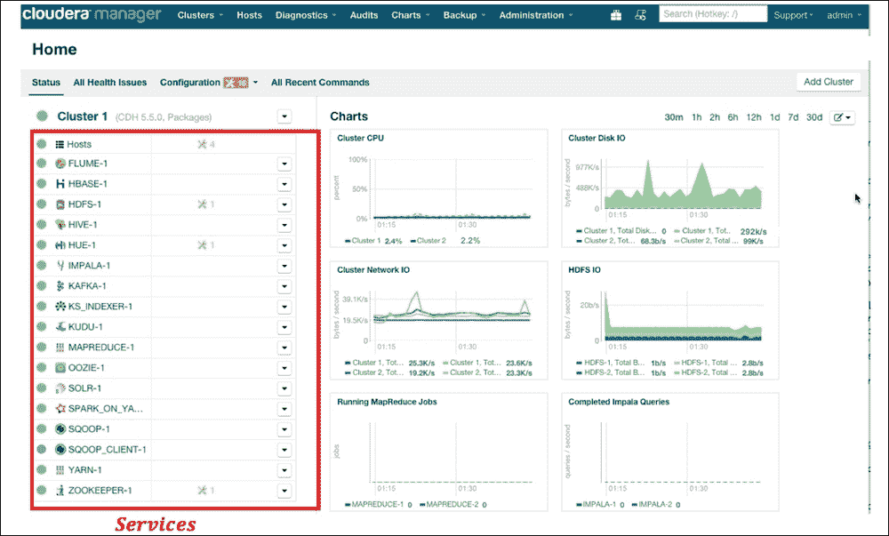

图 3: Cloudera 服务管理器用户界面

#### 亚马逊弹性 MapReduce

亚马逊 Elastic MapReduce (EMR) ( *参考文献*【5】)是另一个大数据集群，平台类似于 HDP 和 Cloudera，支持各种各样的框架。EMR 有两种模式——**集群模式**和**步进执行模式**。在集群模式下，您可以选择大数据堆栈供应商 EMR 或 MapR，而在分步执行模式下，您可以将从 jar 到 SQL 查询的各种作业交付执行。在下面的屏幕截图中，我们看到了用于配置新集群以及定义新作业流的界面:

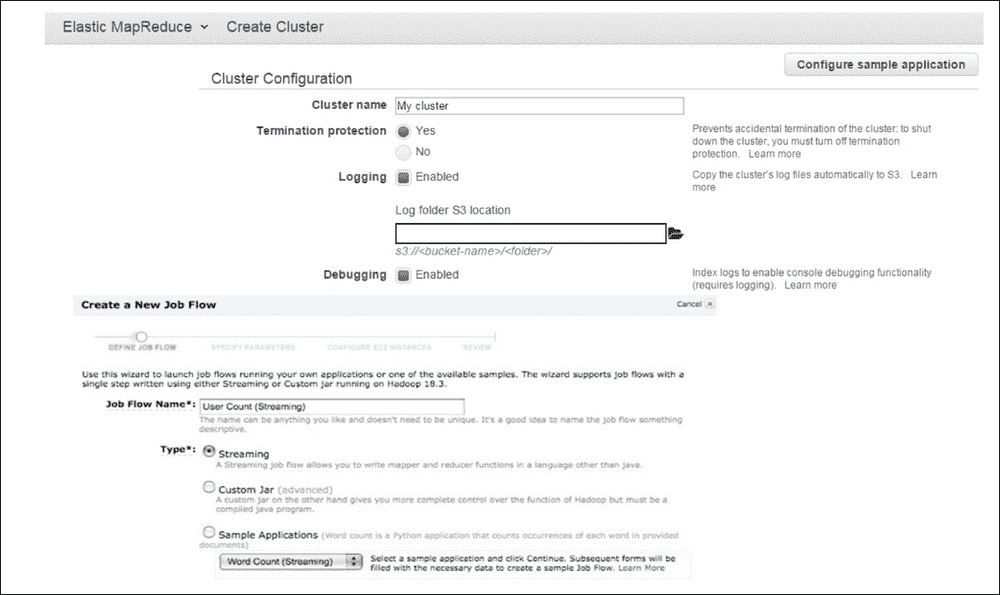

图 4:亚马逊弹性 MapReduce 集群管理用户界面

#### 微软 Azure HDInsight

微软 Azure HDInsight ( *参考* [6])是另一个平台，它允许对所需的大多数服务进行集群管理，包括存储、处理和机器学习。如下图所示，Azure 门户用于创建、管理和帮助了解集群各种组件的状态:

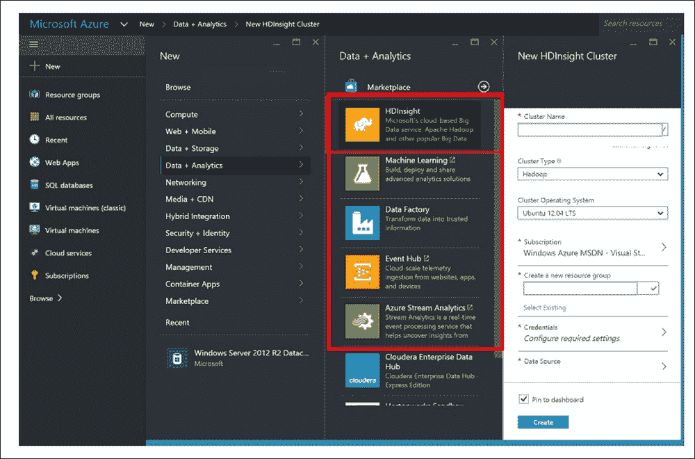

图 5:微软 Azure HDInsight 集群管理用户界面

### 数据采集

在大数据框架中，采集组件在从不同的源系统收集数据并将其存储在大数据存储中发挥着重要作用。基于源和量的类型、速度、功能和基于性能的要求，有各种各样的采集框架和工具。我们将描述几个最著名的框架和工具，给读者一些启示。

#### 发布-订阅框架

在基于发布-订阅的框架中，发布源将不同格式的数据推送给代理，代理让不同的订阅者等待使用这些数据。发布者和订阅者彼此都不知道对方，由代理在中间进行调解。

**阿帕奇卡夫卡** ( *参考文献*【9】)和**亚马逊 Kinesis** 就是基于这个模型的两个知名实现。Apache Kafka 定义了出版商、消费者和主题的概念——在这些概念上，东西被出版和消费——以及管理主题的代理人。亚马逊 Kinesis 建立在类似的概念上，生产者和消费者通过 Kinesis 流连接在一起，这类似于卡夫卡中的主题。

#### 源汇框架

在源-接收器模型中，源将数据推入框架，框架将系统推入接收器。Apache Flume ( *参考文献*【7】)是这种框架的一个众所周知的实现，它有各种各样的源、缓冲数据的通道和许多在大数据世界中存储数据的接收器。

#### SQL 框架

由于许多传统数据存储都是基于 SQL 的 RDBMS 形式，基于 SQL 的框架提供了从 RDBMS 导入数据并将其存储在大数据中的通用方法，主要以 HDFS 格式存储。Apache Sqoop ( *参考文献* [10])是一个众所周知的实现，它可以从任何基于 JDBC 的 RDBMS 导入数据，并将其存储在基于 HDFS 的系统中。

#### 消息排队框架

消息排队框架是基于推拉的框架，类似于发布者-订阅者系统。消息队列将生产者和消费者分开，并可以以异步通信模式将数据存储在队列中。许多协议已经在此基础上开发出来，比如高级消息排队协议(AMQP)和 ZeroMQ 消息传输协议(ZMTP)。RabbitMQ、ZeroMQ、亚马逊 SQS 等等，都是这个框架的一些著名实现。

#### 定制框架

针对物联网、HTTP、WebSockets 等不同来源的专门的连接器，已经产生了许多特定的连接器，如 Amazon IoT Hub、REST-connectors、WebSocket 等。

### 数据存储

数据存储组件在将采集和其余组件连接在一起方面起着关键作用。在决定数据存储时，应该考虑性能、对数据处理的影响、成本、高可用性、易管理性等等。对于纯实时或接近实时的系统，有基于内存的存储框架，但对于基于批处理的系统，主要有分布式文件系统，如 HDFS 或 NoSQL。

#### HDFS

HDFS 可以在大型节点集群上运行，并提供所有重要功能，例如高吞吐量、复制、故障转移等等。

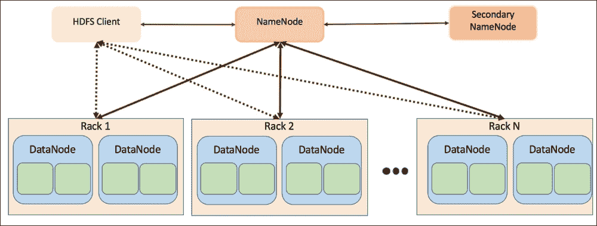

HDFS 的基本架构包括以下组件:

*   **NameNode**:HDFS客户端总是向 NameNode 发送请求，NameNode 保存文件的元数据，而实际数据以块的形式分布在 DataNodes 上。NameNodes 只负责处理文件的打开和关闭，而其余的读、写和附加交互发生在客户机和数据节点之间。NameNode 将元数据存储在两个文件中:`fsimage`和`edit`文件。`fsimage`包含作为快照的文件系统元数据，而编辑文件包含元数据的增量更改。
*   **辅助 NameNode** :辅助 NameNode 通过在每个预定义的检查点保存`fsimage`和`edit`文件的副本，为 NameNode 中的元数据提供冗余。
*   **DataNode**:DataNode管理实际的数据块，方便对这些数据块的读写操作。DataNodes 使用心跳信号与 NameNodes 保持通信，表明它们是活动的。存储在数据节点中的数据块也被复制用于冗余。数据节点中数据块的复制由机架感知放置策略控制。

#### NoSQL

非关系型数据库，也称为 NoSQL 数据库，在大数据世界里越来越受欢迎。高吞吐量、更好的水平伸缩性、改进的检索性能以及以较弱的一致性模型为代价的存储是大多数 NoSQL 数据库的显著特征。在这一节中，我们将讨论 NoSQL 数据库的一些重要形式及其实现。

##### 键值数据库

键值数据库是最突出的 NoSQL 数据库，主要用于半结构化或非结构化数据。顾名思义，存储的结构非常基本，唯一键关联任何类型的数据值，包括字符串、整数、双精度等等，甚至包括 BLOBS。散列键以快速查找和检索值，以及跨多个节点划分数据，提供了高吞吐量和可伸缩性。查询功能非常有限。Amazon DynamoDB、Oracle NoSQL、MemcacheDB 等等都是键值数据库的例子。

##### 文档数据库

文档数据库以 XML、JSON 或 YAML 文档的形式存储半结构化数据，这是一些最流行的格式。文档有唯一的映射键。虽然可以将文档存储在键值存储中，但是文档存储提供的查询功能更强大，因为组成文档结构的原语(可能包括名称或属性)也可以用于检索。当数据不断变化并且具有可变数量或长度的字段时，文档数据库通常是一个不错的选择。文档数据库不提供连接功能和，因此所有信息都需要在文档值中捕获。MongoDB、ElasticSearch、Apache Solr 等等，都是一些众所周知的文档数据库实现。

##### 柱状数据库

使用列作为名称、值和时间戳的基本存储单元，这将列数据库与传统的关系数据库区分开来。柱被进一步组合以形成柱族。行由行键进行索引，并且有多个列族与该行相关联。某些行只能使用填充的列族，这为稀疏数据提供了良好的存储表示。列数据库没有固定的类似模式的关系数据库；可以随时添加新的柱和族，这给了它们显著的优势。 **HBase** 、 **Cassandra** 和 **Parquet** 是列数据库的一些众所周知的实现。

##### 图形数据库

在许多应用中，数据有一个固有的图形结构，带有节点和链接。将这样的数据存储在图形数据库中可以提高存储、检索和查询的效率。节点有一组属性，通常表示实体，而链接表示节点之间的关系，可以是有向的，也可以是无向的。 **Neo4J** 、 **OrientDB** 和 **ArangoDB** 是一些众所周知的图形数据库实现。

### 数据处理和准备

在数据准备好供分析和机器学习算法使用之前，数据准备步骤涉及各种预处理步骤。涉及的一些关键任务是:

*   **数据清洗**:涉及原始数据上的一切，从纠错、类型匹配、元素规范化等等。
*   **数据采集和管理**:转换数据元素，将数据从一种结构规范化为另一种结构。
*   **数据转换**:许多分析算法需要建立在原始数据或历史数据上的聚合特性。转换和计算这些额外的特征在这一步完成。

#### 蜂房和 HQL

Apache Hive ( *参考文献* [11])是在 HDFS 系统中执行各种数据准备活动的强大工具。Hive 组织底层 HDFS 数据 a，其结构类似于关系型数据库。HQL 就像 SQL，帮助执行各种聚合、转换、清理和规范化，然后数据被序列化回 HDFS。为了加速，Hive 中的逻辑表被分割并细分为桶。Hive 中的复杂连接和聚合查询会自动转换为 MapReduce 作业，以提高吞吐量和速度。

#### Spark SQL

Spark SQL 是 Apache Spark 的主要组件(*引用* [1]和[2])，它提供了类似 SQL 的功能，类似于 HQL 提供的功能，用于对大数据执行更改。Spark SQL 可以与 Hive 等底层数据存储系统或 Parquet 等 NoSQL 数据库一起工作。在后面关于 Spark 的部分，我们将涉及 Spark SQL 的一些方面。

#### 亚马逊红移

亚马逊 Redshift 提供了几个仓储功能，尤其是在亚马逊 EMR 设置上。它可以使用其**大规模并行处理** ( **MPP** )数据仓库架构处理数 Pb的数据。

#### 实时流处理

在许多大数据部署中，处理和执行之前指定的转换必须在数据流上实时完成，而不是从存储的批量数据中完成。有各种各样的**流处理引擎** ( **SPE** )，比如 Apache Storm(*References*【12】)和 Apache Samza，还有内存中的处理引擎，比如用于流处理的 Spark-Streaming。

### 机器学习

机器学习有助于对大数据进行描述性、预测性和规范性分析。本章将讨论两种极端情况:

*   可以对批量历史数据进行机器学习，然后可以将学习/模型应用于新的批量/实时数据
*   机器学习可以在实时数据上进行，并同时应用于实时数据

这两个主题都将在本章的剩余部分详细讨论。

### 可视化和分析

由于批处理学习在建模时完成，而实时学习在运行时完成，预测——将模型应用于新数据的输出——必须存储在某种数据结构中，然后由用户进行分析。可视化工具和其他报告工具经常用于提取信息并将其呈现给用户。基于领域和用户的需求，分析和可视化可以是静态的、动态的或交互式的。

Lightning 是一个框架，使用 REST for Python、R、Scala 和 JavaScript 语言，通过不同的绑定 API 在 Web 上执行交互式可视化。

Pygal 和 Seaborn 是基于 Python 的库，帮助绘制 Python 中所有可能的图表和图形，用于分析、报告和可视化。


# 批量大数据机器学习

批量大数据机器学习涉及两个基本步骤，如[第 2 章](ch02.html "Chapter 2. Practical Approach to Real-World Supervised Learning")、*现实世界监督学习的实用方法*、[第 3 章](ch03.html "Chapter 3. Unsupervised Machine Learning Techniques")、*无监督机器学习技术*和[第 4 章](ch04.html "Chapter 4. Semi-Supervised and Active Learning")、*半监督和主动学习*中所述:从历史数据集学习或训练数据，并将学习到的模型应用于未知的未来数据。下图展示了这两种环境以及组件任务和完成这些任务的一些技术/框架:


图 6:大数据和提供者的模型时间和运行时间组件

我们将讨论在批量数据的环境中进行机器学习的两个最著名的框架，并将使用案例研究来强调执行建模的代码或工具。

## H2O 作为大数据机器学习平台

H2O ( *参考文献* [13])是大数据规模机器学习的领先开源平台，专注于将 AI 引入企业。该公司成立于 2011 年，在其科学顾问中有几位统计学习理论和优化方面的领军人物。它支持多种语言的编程环境。虽然 H2O 软件是免费的，但可以购买产品的客户服务和定制扩展。

### H2O 建筑

下图给出了包含重要组件的 H2O 高层架构。H2O 可以从各种数据存储中访问数据，比如 HDFS、SQL、NoSQL 和亚马逊 S3 等等。最流行的 H2O 部署是使用前面讨论过的 Spark 部署栈之一，或者在 H2O 集群中运行它。

H2O 的核心是一种在内存中处理大数据的优化方式，这样可以高效地处理经过相同数据的迭代算法，并获得良好的性能。监督和非监督学习中的重要机器学习算法是专门为处理跨多个节点和 JVM 的水平可伸缩性而实现的。H2O 不仅提供了自己的用户界面(称为 flow)来管理和运行建模任务，还提供了 Java、R、Python 和 Scala 的不同语言绑定和连接器 API。


图 7: H2O 高层架构

大多数机器学习算法、优化算法和实用程序都使用 fork-join 或 MapReduce 的概念。如*图 8* 所示，整个数据集被认为是 H2O 的一个**数据框**，由矢量组成，矢量是数据集中的特征或列。行或实例由并排排列的每个向量中的一个元素组成。这些行被组合在一起形成一个处理单元，称为**块**。几个块被组合在一个 JVM 中。任何算法或优化工作都是从将信息从最顶层的 JVM 发送到下一个 JVM 开始，然后到下一个 JVM，依此类推，类似于 MapReduce 中的 map 操作。每个 JVM 处理块中的行来建立任务，最后结果在 reduce 操作中返回:

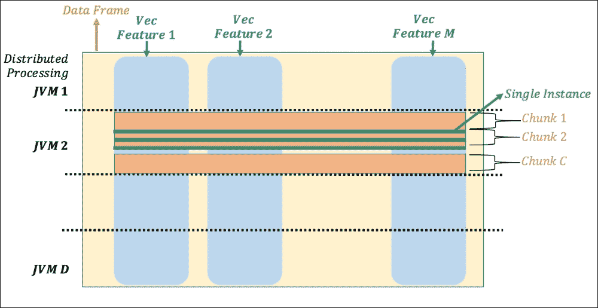

图 8:使用分块的 H2O 分布式数据处理

### H2O 的机器学习

下图显示了 H2O v3 支持的监督和非监督学习的所有机器学习算法:


图 9: H2O v3 机器学习算法

### 工具和用法

H2O 流是一款交互式网络应用，帮助数据科学家执行各种任务，从导入数据到使用点击和基于向导的概念运行复杂模型。

H2O 以本地模式运行，如下所示:

```java
java –Xmx6g –jar h2o.jar

```

启动 Flow 的默认方式是将浏览器指向下面的 URL: `http://192.168.1.7:54321/`。流程的右侧捕获了在标签**轮廓**下执行的每个用户操作。所采取的行动可以被编辑并保存为命名的流程，以供重用和协作，如图*图 10* 所示:

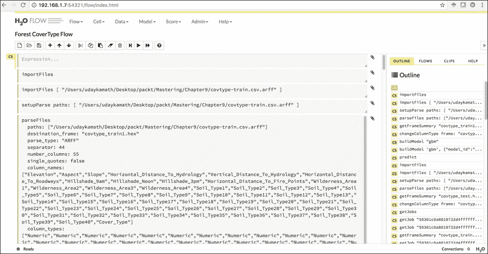

图 10:浏览器中的 H2O 流

*图 11* 显示了从本地文件系统或 HDFS 导入文件的界面，并显示了详细的摘要统计信息以及可以对数据集执行的后续操作。导入数据后，它会在 H2O 框架中获得一个数据框参考，扩展名为`.hex`。汇总统计有助于理解数据的特征，如**缺失**、**表示**、**最大**、**最小**等。它也有一个简单的方法将特征从一种类型转换为另一种类型，例如，将具有几个唯一值的数字特征转换为分类/名义类型，在 H2O 称为`enum`。

可以对数据集执行的操作包括:

1.  将数据可视化。
2.  将数据分成不同的集合，如培训、验证和测试。
3.  构建监督和非监督模型。
4.  使用模型来预测。
5.  Download and export the files in varied formats.

    Figure 11: Import data as frames, summaries and executable operations

在 H2O，建立有人监督或无人监督的模型是通过一个交互式屏幕完成的。每个建模算法都将其参数分为三个部分:基本、高级和专家。任何支持超参数搜索来调整模型的参数旁边都有一个复选框，可以使用多个参数值。

一些基本参数如**训练 _ 帧**、**验证 _ 帧**、**响应 _ 列**是每个监督算法共有的；还有一些是特定于模型类型的，比如 GLM 的求解器选择，深度学习的激活函数等等。所有这些通用参数都可以在基本部分中找到。如果必须覆盖默认行为，高级参数是为建模者提供更大灵活性和控制的设置。这些参数中有几个在一些算法中也是通用的——两个例子是选择分配折叠指数的方法(如果在基本部分选择了交叉验证),以及选择包含权重的列(如果每个例子都单独加权),等等。

专家参数定义了更复杂的元素，例如如何处理缺失的值、需要对算法有基本了解的特定模型参数，以及其他深奥的变量。在*图 12* 中，监督学习算法 GLM 配置了 10 重交叉验证、二项式(两类)分类、高效 LBFGS 优化算法和交叉验证分割的分层采样:


图 12:建模算法参数和验证

“模型结果”屏幕包含使用重要评估图表对结果进行的详细分析，具体取决于所使用的验证方法。在屏幕的顶部是可以采取的可能操作，例如对未知数据运行模型进行预测，以 POJO 格式下载模型，导出结果，等等。

有些图表是特定于算法的，如显示训练损失或目标函数在 GLM 迭代中如何变化的得分历史，这使用户能够洞察收敛速度以及迭代参数的调整。除了增益和提升图之外，我们还可以在验证数据上看到 ROC 曲线和曲线下面积指标，它们分别给出了验证样本的累积捕获率和累积提升。

*图 13* 显示了在`CoverType`数据集上对 GLM 进行 10 倍交叉验证的**得分历史**、 **ROC 曲线**和**收益/提升**图表；

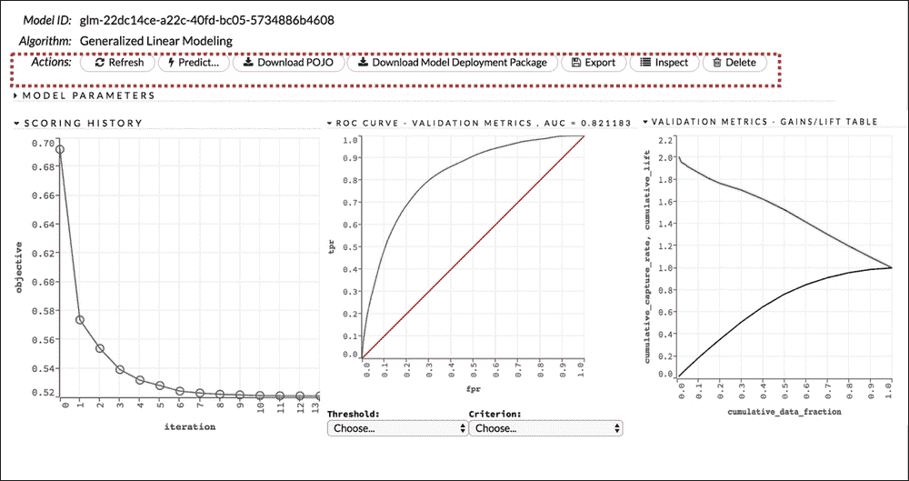

图 13:建模和验证 ROC 曲线、目标函数和提升/增益图

验证的输出给出了详细的评估方法，如交叉验证情况下每个验证折叠的准确度、AUC、err、误差、f1 测量、MCC (Mathews 相关系数)、精确度、和召回，以及所有验证的平均值和标准偏差。

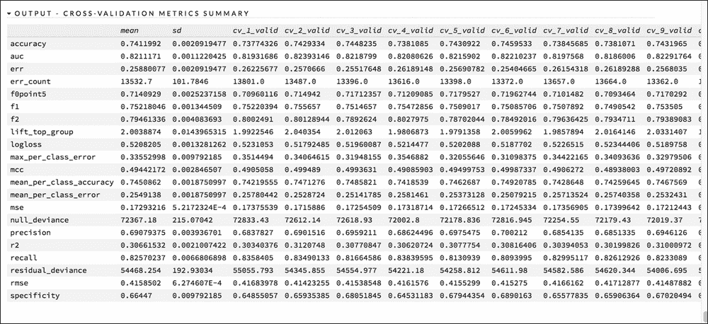

图 14:验证结果和总结

预测操作使用未公开的数据运行模型，以估计样本外性能。误差、准确度、曲线下面积、ROC 图等重要测量值作为可保存或导出的预测输出给出。

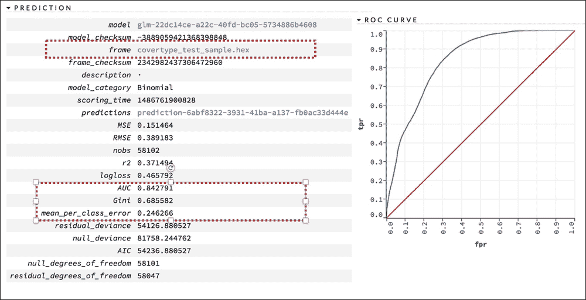

图 15:运行测试数据、预测和 ROC 曲线


# 案例研究

在这个案例研究中，我们使用`CoverType`数据集用 Java 展示了来自 H2O、Apache Spark MLlib 和萨摩亚机器学习库的分类和聚类算法。

## 商业问题

可从 UCI 机器学习知识库([https://archive.ics.uci.edu/ml/datasets/Covertype](https://archive.ics.uci.edu/ml/datasets/Covertype))获得的`CoverType`数据集包含尺寸为 30 x 30 m2 的林地的 581，012 个单元的未缩放制图数据，并附有实际森林覆盖类型标签。在这里进行的实验中，我们使用数据的标准化版本。包括两个分类类型的一次性编码，每行总共有 54 个属性。

## 机器学习映射

首先，我们将问题视为使用数据集中包含的标签进行分类的问题，并执行几个监督学习实验。有了生成的模型，我们可以预测一个看不见的测试数据集的森林覆盖类型。对于接下来的聚类实验，我们忽略数据标签，确定要使用的聚类数，然后使用 H2O 和 Spark MLLib 中实现的各种算法报告相应的成本。

## 数据收集

这个数据集是仅使用制图测量而非遥感收集的。它来源于最初由**美国林务局** ( **USFS** )和美国地质调查局**(**美国地质调查局**)收集的数据。**

## **数据采样和转换**

**训练和测试数据——数据集被分成两组，20%用于测试，80%用于训练。**

**分类土壤类型名称由 40 个二元变量属性表示。值为 1 表示观测中存在一种土壤类型；0 表示不存在。**

**荒野区域名称同样是一个具有四个二元列的分类属性，1 表示存在，0 表示不存在。**

**所有连续值属性在使用前都已规范化。**

### **实验、结果和分析**

**在本案例研究的第一组实验中，我们使用了 H2O 框架。**

#### **特征关联与分析**

**虽然 H2O 没有明确的特征选择算法，但许多学习者，如 GLM、随机森林、GBT 等，基于模型的训练/验证给出特征重要性度量。在我们的分析中，我们使用 GLM 进行特征选择，如图*图 16* 所示。有趣的是，特征**高程**作为最具辨别能力的特征出现，同时还有一些分类特征被转换为数值/二进制，如**土壤 _ 类型 2** 、**土壤 _ 类型 4** 等等等等。土壤类型分类的许多特征没有相关性，可以从建模的角度删除。**

**这组实验包含的学习算法有:**广义线性模型**(**GLM**)**梯度推进机**(**GBM**)**随机森林**(**RF**)**朴素贝叶斯**(**NB**)**深度学习** ( **DL** )。H2O 支持的深度学习模型是**多层感知器** ( **MLP** )。**

**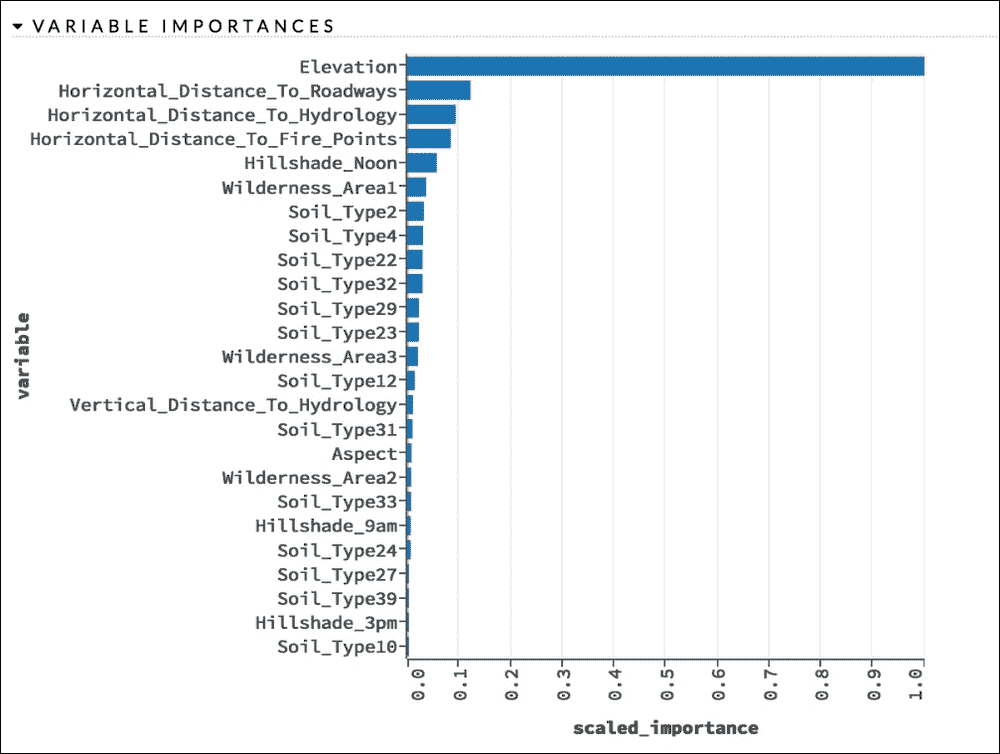

图 16:使用 GLM 的特征选择** 

#### **测试数据的评估**

**使用所有功能的结果如下表所示:**

| 

算法

 | 

因素

 | 

罗马纪元

 | 

最大精确度

 | 

最大 F1

 | 

最高精度

 | 

最大召回

 | 

最大特异性

 |
| --- | --- | --- | --- | --- | --- | --- | --- |
| **GLM** | 默认 | Zero point eight four | Zero point seven nine | Zero point eight four | Zero point nine eight | 1.0(1) | Zero point nine nine |
| **GBM** | 默认 | Zero point eight six | Zero point eight two | Zero point eight six | 1.0(1) | 1.0(1) | 1.0(1) |
| **随机森林** ( **RF** ) | 默认 | 0.88(1) | 0.83(1) | 0.87(1) | Zero point nine seven | 1.0(1) | Zero point nine nine |
| **朴素贝叶斯** ( **NB** ) | 拉普拉斯=50 | Zero point six six | Zero point seven two | Zero point eight one | Zero point six eight | 1.0(1) | Zero point three three |
| **深度学习** ( **DL** ) | Rect,300, 300,Dropout | 0. | Zero point seven eight | Zero point eight three | Zero point eight eight | 1.0(1) | Zero point nine nine |
| **深度学习** ( **DL** ) | 300，300，最大辍学 | Zero point eight two | Zero point eight | Zero point eight four | 1.0(1) | 1.0(1) | 1.0(1) |

**去除特征相关性得分不高的特征后的结果为:**

| 

算法

 | 

因素

 | 

罗马纪元

 | 

最大精确度

 | 

最大 F1

 | 

最大

精确

 | 

最大召回

 | 

最大特异性

 |
| --- | --- | --- | --- | --- | --- | --- | --- |
| **GLM** | 默认 | Zero point eight four | Zero point eight | Zero point eight five | One | One | One |
| **GBM** | 默认 | Zero point eight five | Zero point eight two | Zero point eight six | One | One | One |
| **随机森林** ( **RF** ) | 默认 | Zero point eight eight | Zero point eight three | Zero point eight seven | One | One | One |
| **朴素贝叶斯** ( **NB** ) | 拉普拉斯=50 | Zero point seven six | Zero point seven four | Zero point eight one | Zero point eight nine | One | Zero point nine five |
| **深度学习** ( **DL** ) | 300，300，直肠辍学 | Zero point eight one | Zero point seven nine | Zero point eight four | One | One | One |
| **深度学习** ( **DL** ) | 300，300，最大辍学 | Zero point eight five | Zero point eight | Zero point eight four | Zero point eight nine | Zero point nine | One |

**表 1:包含所有特性的模型评估结果**

#### **结果分析**

**从对所得结果的分析中得出的主要观察结果很有启发性，在此列出。**

1.  **要素相关性分析显示了**高程**要素是一个高区分度的要素，而许多转换为二元要素的分类属性，如**土壤类型 _10** 等，几乎没有相关性。**
2.  **如表 1 中的*所示，包括所有特征的实验结果清楚地表明，非线性集成技术随机森林是最佳算法，如包括准确度、F1、AUC 和召回率在内的大多数评估指标所示。***
3.  ***表 1* 还强调了这样一个事实，尽管更快的线性朴素贝叶斯算法可能不是最适合的，但同样属于线性算法类别的 GLM 表现出了更好的性能——这表明了特性之间的某种相互依赖性！**
4.  **正如我们在[第七章](ch07.html "Chapter 7. Deep Learning")、*深度学习中看到的，*深度学习中使用的算法通常需要大量调优；然而，即使有一些小的调整变化，来自 DL 的结果也可以与随机森林相媲美，尤其是使用 MaxDropout 时。**
5.  ***表 2* 显示了从训练集中移除低相关性特征后所有算法的结果。可以看出，朴素贝叶斯-由于基于特征之间的独立性假设的概率倍增而具有最大的影响-获得了最大的好处和最高的性能提升。正如我们在[第 2 章](ch02.html "Chapter 2. Practical Approach to Real-World Supervised Learning")、*现实世界监督学习的实用方法、*中所讨论的那样，大多数其他算法(如随机森林)都有内置的特征选择，因此删除不重要的特征对它们的性能几乎没有影响。**

## **Spark MLlib 作为大数据机器学习平台**

**Apache Spark 于 2009 年在加州大学伯克利分校的 AMPLab 启动，于 2013 年根据 Apache 许可证 2.0 捐赠给 Apache 软件基金会。Spark 的核心思想是构建一个集群计算框架，克服 Hadoop 的问题，特别是对于迭代和内存计算。**

### **星火架构**

**图 17 所示的 Spark 栈可以使用任何类型的数据存储，比如 HDFS、SQL、NoSQL 或本地文件系统。它可以部署在 Hadoop、Mesos 上，甚至可以独立部署。**

**Spark 最重要的组件是 Spark 核心，它提供了一个以高吞吐量、容错和可伸缩的方式处理和操作数据的框架。**

**Spark core 之上构建了各种库，每个库都是为了在大数据世界中处理数据和进行分析所需的各种功能。Spark SQL 为我们提供了一种在大数据存储中执行数据操作的语言，它使用的查询语言非常像 SQL，即数据库的通用语言。Spark GraphX 提供 API 来对大数据执行与图形相关的操作和基于图形的算法。Spark Streaming 提供 API 来处理流处理中所需的实时操作，从数据操作到流上的查询。**

**Spark-MLlib 是一个机器学习库，它有一套广泛的机器学习算法来执行从特征选择到建模的监督和非监督任务。Spark 有 Java、R、Scala、Python 等各种语言绑定。MLlib 在 Spark 引擎上运行具有明显的优势，特别是因为在内存中跨多个节点缓存数据并运行 MapReduce 作业，因此与 Mahout 和其他大规模机器学习引擎相比，性能提高了一个重要因素。MLlib 还具有其他优势，如容错和可伸缩性，而无需在机器学习算法中显式管理它。**

**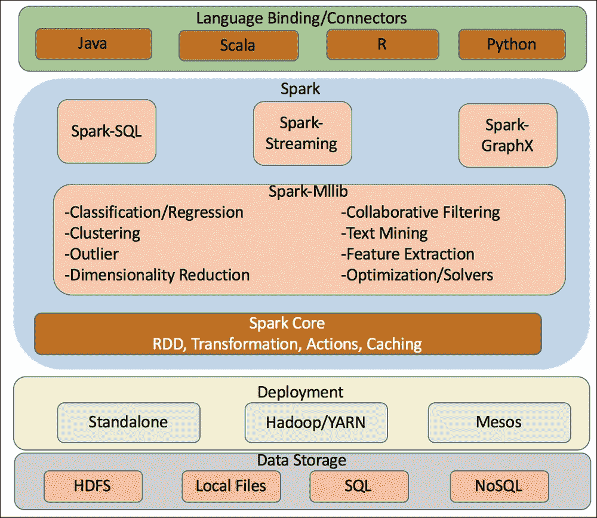

图 17: Apache Spark 高层架构** 

**火花芯具有以下部件:**

*   ****弹性分布式数据集**(**RDD**):rdd 是基本的不可变对象集合，Spark Core 知道如何在集群中进行分区和分布以执行任务。rdd 由“分区”组成，依赖于父 rdd 和关于数据放置的元数据。**
*   **在 RDD 上执行两个不同的操作:

    *   **转换**:延迟求值并将一个 RDD 转换为另一个的操作。惰性求值尽可能地推迟求值，这使得一些资源优化成为可能。
    *   **动作**:触发转换并返回输出值

    的实际操作**
*   ****谱系图**:描述特定任务的计算的数据管道或数据流，包括在转换和动作中创建的不同 rdd，被称为任务的谱系图。谱系图在容错中起着关键作用。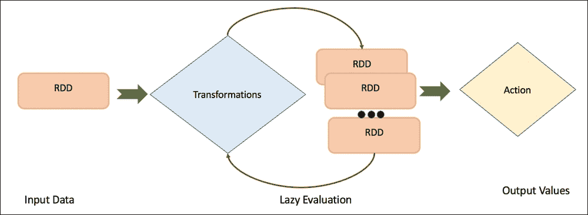图 18:阿帕奇火花谱系图**

**Spark 与集群管理无关，可以与几种实现(包括 YARN 和 Mesos)一起工作，用于管理节点、分配工作和通信。跨集群的转换和动作中的任务分配由调度器完成，从创建 Spark 上下文的驱动节点开始，到许多工作节点，如图*图 19* 所示。当使用 YARN 运行时，Spark 允许用户在节点级别选择每个 JVM 的执行器、堆和内核分配的数量。**

**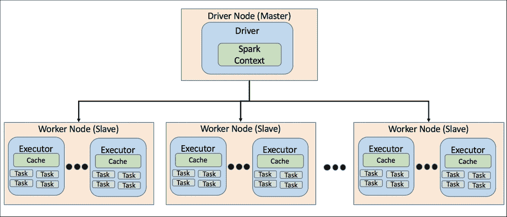

图 19:Apache Spark 集群部署和任务分配** 

### **ml lib 中的机器学习**

**Spark MLlib 有一个全面的机器学习工具包，在撰写本文时提供了比 H2O 更多的算法，如图*图 20* :**

**

图 20: Apache Spark MLlib 机器学习算法** 

**已经为 Spark 编写了许多扩展，包括 Spark MLlib，用户社区继续贡献更多的包。你可以下载第三方软件或者在 https://spark-packages.org/注册自己的软件。**

### **工具和用法**

**Spark MLlib 为除 Java 之外的其他语言提供了 API，包括 Scala、Python 和 r。当一个`SparkContext`被创建时，它会在端口`4040`启动一个监控和工具 web 控制台，这让我们可以看到关于运行时的关键信息，包括调度的任务及其进度、RDD 大小和内存使用等。还有一些外部分析工具可供使用。**

### **实验、结果和分析**

**我们在这里解决的业务问题与之前描述的使用 H2O 进行实验的业务问题相同。我们总共使用了五种使用 MLlib 的学习算法。第一个是 k-Means ，所有特性都使用一个通过计算成本确定的 *k* 值，具体来说，就是在大量的 *k* 值上计算的**误差平方和** ( **SSE** )，并选择曲线的“弯头”。确定 k 的最佳值通常不是一件容易的事情；通常，为了挑选最佳的 *k* ，会对轮廓等评估指标进行比较。即使我们知道数据集中的类的数量是 *7* ，如果我们假装没有标记数据，看看这样的实验会导致什么结果是有启发性的。使用弯头法找到的最佳 k 值为 27。在现实世界中，商业决策可能经常会引导对 T21 的选择。**

**在下面的清单中，我们展示了如何使用 MLlib 套件中的不同模型来进行聚类分析和分类。代码基于 MLlib API 指南中的例子([https://spark.apache.org/docs/latest/mllib-guide.html](https://spark.apache.org/docs/latest/mllib-guide.html))。我们使用 CSV 格式的标准化 UCI `CoverType`数据集。请注意，将`spark.sql.Dataset`与新的`spark.ml`包一起使用更自然，而`spark.mllib`包与`JavaRDD`的配合更紧密。这提供了对 rdd 的抽象，并允许对底层的转换进行优化。在大多数无监督学习算法的情况下，这意味着必须转换数据，以便用于训练和测试的数据集在默认情况下应该有一个名为 features 的列，该列包含作为向量的所有观察特征。一个`VectorAssembler`对象可用于此转换。ML 管道是一种将任务链接在一起的方法，在训练随机森林分类器的源代码中给出了对 ML 管道使用的一瞥。**

#### **k-Means**

**用于 k-Means 实验的代码片段使用了来自`org.apache.spark.ml.clustering`包的算法。代码包括设置`SparkSession`的最小样板文件，它是 Spark 运行时的句柄。注意在设置中，本地模式下指定了八个内核:**

```java
SparkSession spark = SparkSession.builder()
    .master("local[8]")
    .appName("KMeansExpt")
    .getOrCreate();

// Load and parse data
String filePath = "/home/kchoppella/book/Chapter09/data/covtypeNorm.csv";
// Selected K value 
int k =  27;

// Loads data.
Dataset<Row> inDataset = spark.read()
    .format("com.databricks.spark.csv")
    .option("header", "true")
    .option("inferSchema", true)
    .load(filePath);
ArrayList<String> inputColsList = new ArrayList<String>(Arrays.asList(inDataset.columns()));

//Make single features column for feature vectors 
inputColsList.remove("class");
String[] inputCols = inputColsList.parallelStream().toArray(String[]::new);

//Prepare dataset for training with all features in "features" column
VectorAssembler assembler = new VectorAssembler().setInputCols(inputCols).setOutputCol("features");
Dataset<Row> dataset = assembler.transform(inDataset);

KMeans kmeans = new KMeans().setK(k).setSeed(1L);
KMeansModel model = kmeans.fit(dataset);

// Evaluate clustering by computing Within Set Sum of Squared Errors.
double SSE = model.computeCost(dataset);
System.out.println("Sum of Squared Errors = " + SSE);

spark.stop();
```

**通过对几个不同值的平方误差的总和进行评估和绘图，并选择曲线拐点处的一个值，得出聚类数的最佳值。这里使用的值是 *27* 。**

#### **k-均值与主成分分析**

**在第二个实验中，我们再次使用了 k-Means，但首先我们通过 PCA 降低了数据中的维数。同样，我们在这里使用了一个经验法则，即针对维数选择 PCA 参数的值，使得在降维后原始数据集中至少 85%的方差被保留。这在转换的数据集中从最初的 54 个特征产生了 16 个特征，并且该数据集被用于该实验和随后的实验。以下代码显示了 PCA 分析的相关代码:**

```java
int numDimensions = 16
PCAModel pca = new PCA()
    .setK(numDimensions)
    .setInputCol("features")
    .setOutputCol("pcaFeatures")
    .fit(dataset);

Dataset<Row> result = pca.transform(dataset).select("pcaFeatures");
KMeans kmeans = new KMeans().setK(k).setSeed(1L);
KMeansModel model = kmeans.fit(dataset);
```

#### **二等分 k-均值(使用 PCA)**

**第三个实验使用了 MLlib 的二分 k-Means 算法。该算法类似于自上而下的分层聚类技术，其中所有实例一开始都在同一个聚类中，随后是连续的拆分:**

```java
// Trains a bisecting k-Means model.
BisectingKMeans bkm = new BisectingKMeans().setK(k).setSeed(1);
BisectingKMeansModel model = bkm.fit(dataset);
```

#### **高斯混合模型**

**在接下来的实验中，我们使用了 MLlib 的**高斯混合模型** ( **GMM** )，另一种聚类模型。该模型固有的假设是每个集群中的数据分布本质上是高斯分布，参数未知。此处指定了相同的聚类数，最大迭代次数和容差使用了默认值，这决定了算法何时被视为已收敛:**

```java
GaussianMixtureModel gmm = new GaussianMixture()
    .setK(numClusters)
    .fit(result);
// Output the parameters of the mixture model
for (int k = 0; k < gmm.getK(); k++) {
  String msg = String.format("Gaussian %d:\nweight=%f\nmu=%s\nsigma=\n%s\n\n",
              k, gmm.weights()[k], gmm.gaussians()[k].mean(), 
              gmm.gaussians()[k].cov());
  System.out.printf(msg);
  writer.write(msg + "\n");
  writer.flush();
}
```

#### **随机森林**

**最后，我们运行了随机森林，这是唯一可用的能够处理多类分类的集成学习器。在下面的代码中，我们看到该算法需要在训练之前执行一些准备工作。预处理阶段由转换器和估计器组成。然后使用管道来拟合数据。你可以在 Apache Spark 网站([https://spark.apache.org/docs/latest/ml-pipeline.html](https://spark.apache.org/docs/latest/ml-pipeline.html))上了解更多关于管道的信息:**

```java
// Index labels, adding metadata to the label column.
// Fit on whole dataset to include all labels in index.
StringIndexerModel labelIndexer = new StringIndexer()
  .setInputCol("class")
  .setOutputCol("indexedLabel")
  .fit(dataset);
// Automatically identify categorical features, and index them.
// Set maxCategories so features with > 2 distinct values are treated as continuous since we have already encoded categoricals with sets of binary variables.
VectorIndexerModel featureIndexer = new VectorIndexer()
  .setInputCol("features")
  .setOutputCol("indexedFeatures")
  .setMaxCategories(2)
  .fit(dataset);

// Split the data into training and test sets (30% held out for testing)
Dataset<Row>[] splits = dataset.randomSplit(new double[] {0.7, 0.3});
Dataset<Row> trainingData = splits[0];
Dataset<Row> testData = splits[1];

// Train a RF model.
RandomForestClassifier rf = new RandomForestClassifier()
  .setLabelCol("indexedLabel")
  .setFeaturesCol("indexedFeatures")
  .setImpurity("gini")
  .setMaxDepth(5)
  .setNumTrees(20)
  .setSeed(1234);

// Convert indexed labels back to original labels.
IndexToString labelConverter = new IndexToString()
  .setInputCol("prediction")
  .setOutputCol("predictedLabel")
  .setLabels(labelIndexer.labels());

// Chain indexers and RF in a Pipeline.
Pipeline pipeline = new Pipeline()
  .setStages(new PipelineStage[] {labelIndexer, featureIndexer, rf, labelConverter});

// Train model. This also runs the indexers.
PipelineModel model = pipeline.fit(trainingData);

// Make predictions.
Dataset<Row> predictions = model.transform(testData);

// Select example rows to display.
predictions.select("predictedLabel", "class", "features").show(5);

// Select (prediction, true label) and compute test error.
MulticlassClassificationEvaluator evaluator = new MulticlassClassificationEvaluator()
  .setLabelCol("indexedLabel")
  .setPredictionCol("prediction");

evaluator.setMetricName("accuracy");
double accuracy = evaluator.evaluate(predictions);
System.out.printf("Accuracy = %f\n", accuracy); 
```

**下表给出了使用 k 均值和二等分 k 均值的实验的误差平方和:**

| 

算法

 | 

k

 | 

特征

 | 

同ＳＯＵＴＨ-ＳＯＵＴＨ-ＥＡＳＴ

 |
| --- | --- | --- | --- |
| k 均值 | Twenty-seven | Fifty-four | Two hundred and fourteen thousand seven hundred and two |
| k 均值(PCA) | Twenty-seven | Sixteen | Two hundred and forty-one thousand one hundred and fifty-five |
| 二分 k 均值(PCA) | Twenty-seven | Sixteen | Three hundred and five thousand six hundred and forty-four |

**表 3:k 均值的结果**

**GMM 模型被用来说明 API 的使用；它输出每个聚类的高斯混合的参数以及聚类权重。所有集群的输出可以在本书的网站上看到。**

**对于随机森林的情况，这些是用不同数量的树运行的结果。这里使用了所有 54 个特性:**

| 

树的数量

 | 

准确(性)

 | 

F1 度量

 | 

加权精度

 | 

加权回忆

 |
| --- | --- | --- | --- | --- |
| Fifteen | 0.6806 | 0.6489 | 0.6213 | 0.6806 |
| Twenty | 0.6776 | 0.6470 | 0.6191 | 0.6776 |
| Twenty-five | 0.5968 | 0.5325 | 0.5717 | 0.5968 |
| Thirty | 0.6547 | 0.6207 | 0.5972 | 0.6547 |
| Forty | 0.6594 | 0.6272 | 0.6006 | 0.6594 |

**表 4:随机森林的结果**

##### **结果分析**

**从*表 3* 中可以看出，当 PCA 后使用更少的维度时，对于相同数量的簇，成本会有小幅增加。用 PCA 改变 *k* 可能暗示 PCA 情况下更好的 *k* 。还要注意，在这个实验中，对于相同的 *k* ，用 PCA 派生的特征平分 K-Means 具有最高的成本。用于二等分 k-均值的聚类的停止数目已经被简单地挑选为对于基本 k-均值确定的数目，但是这不需要如此。对产生最佳成本的 *k* 的类似搜索可以独立地进行以平分 k 均值。**

**在随机森林的情况下，我们看到使用 *15* 树时性能最佳。所有树的深度都是 3。这个超参数也可以改变来调整模型。尽管由于在训练阶段考虑了树之间的差异，随机森林不容易过度拟合，但是将树的数量值增加到超过最佳数量会降低性能。**

### **实时大数据机器学习**

**在本节中，我们将讨论大数据机器学习的实时版本，在这种情况下，数据大量到达，同时快速变化。在这些条件下，机器学习分析无法按照的“批量学习和部署”的传统实践应用*(*参考* [14])。***

**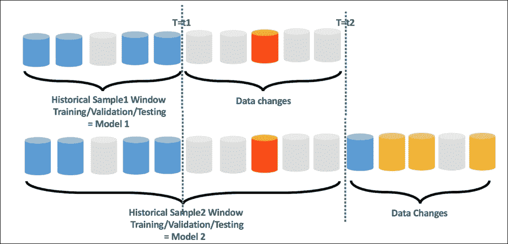

图 21:实时大数据机器学习的用例** 

**让我们考虑一种情况，其中标记的数据在短时间内可用，我们对数据执行适当的建模技术，然后对结果模型应用最合适的评估方法。接下来，我们选择最佳模型，并在运行时使用它对未知数据进行预测。然后，我们有些沮丧地观察到，模型性能随着时间显著下降。用新数据重复这个练习显示了类似的性能下降！我们现在该怎么办？这种困境，加上大量的数据，激发了对不同方法的需求:实时大数据机器学习。**

**像批量学习框架一样，大数据中的实时框架可能有类似的组件，直到数据准备阶段。当数据准备中涉及的计算必须在流或组合流和批处理数据上进行时，我们需要专门的计算引擎，如 **Spark Streaming** 。像流计算一样，机器学习必须跨集群工作，并在流上执行不同的机器学习任务。这给单机多线程流算法的实现增加了额外的复杂性。**

**

图 22:实时大数据组件和提供者** 

#### **萨摩亚作为实时大数据机器学习框架**

**对于一台单机，在[第五章](ch05.html "Chapter 5. Real-Time Stream Machine Learning")、*实时流机器学习*中，我们详细讨论了 MOA 框架。萨摩亚是用于在流上执行机器学习的分布式框架。**

**在撰写本文的时刻，萨摩亚是一个孵化器级的开源项目，拥有 Apache 2.0 许可，并与不同的流处理引擎如 **Apache Storm** 、 **Samza** 和 **S4** 进行了良好的集成。**

##### **萨摩亚建筑**

**SAMOA 框架为一组可扩展的流处理引擎提供了几个关键的流服务，并为当今最流行的引擎提供了现有的实现。**

**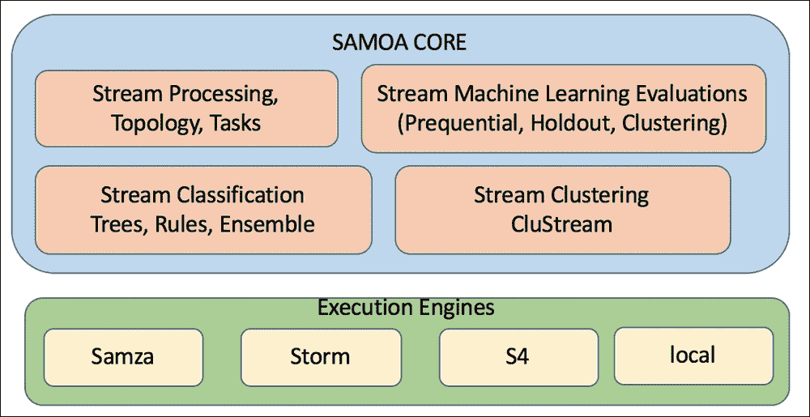

图 23:萨摩亚高层架构** 

**是一个接口，它作为一个工厂来创建不同的组件，并在萨摩亚将它们连接在一起。萨摩亚的核心是为数据流构建处理元素。加工的基本单元由`ProcessingItem`和`Processor`接口组成，如图*图 24* 所示。`ProcessingItem`是一个封装的隐藏元素，而处理器是核心实现，用于处理流的逻辑在其中编码。**

**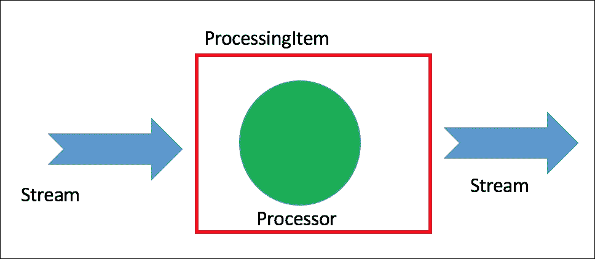

图 24:萨摩亚处理数据流** 

****流**是另一个接口，将各个**处理器**连接在一起，作为`TopologyBuilder`创建的源和目的地。一个流可以有一个源和多个目标。流支持源和目的地之间的三种通信形式:**

*   ****All** :在这种通信中，来自源的所有消息都被发送到所有目的地**
*   ****Key** :在这次通信中，具有相同密钥的消息被发送到相同的处理器**
*   ****混洗**:在这种通信中，消息被随机发送到处理器**

**SAMOA 中的所有消息或事件都是接口`ContentEvent`的实现，主要将流中的数据封装为一个值，并具有某种形式的惟一性键。**

**每个 stream 处理引擎都有一个作为插件的所有关键接口的实现，并与 SAMOA 集成。Apache Storm 实现 StormTopology、StormStream 和 StormProcessingItem 等显示在图 25 的 API 中。**

**Task 是萨摩亚的另一个工作单元，负责执行。所有的分类或聚类评估和验证技术(如 prequential、holdout 等)都是作为任务实现的。**

**学习者是萨摩亚实现所有监督和非监督学习能力的接口。学习者可以是本地的，也可以是分布式的，有不同的扩展，比如`ClassificationLearner`和`RegressionLearner`。**

#### **机器学习算法**

**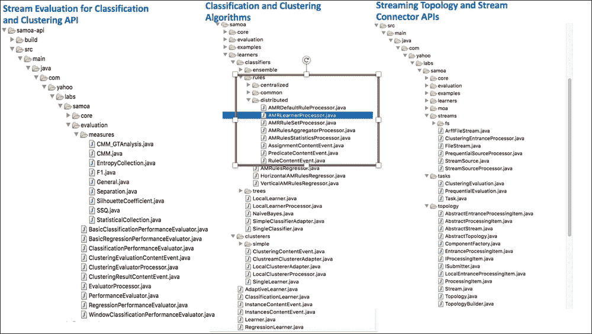****

图 25:萨摩亚机器学习算法** 

***图 25* 显示了萨摩亚拓扑的核心组件及其在各种引擎上的实现。**

#### **工具和用法**

**我们继续处理和以前一样的业务问题。为`covtype`数据集启动训练作业的命令行是:**

```java
**bin/samoa local target/SAMOA-Local-0.3.0-SNAPSHOT.jar "PrequentialEvaluation -l classifiers.ensemble.Bagging** 
 **-s (ArffFileStream -f covtype-train.csv.arff) -f 10000"** 
```

**

图 25:装袋模型性能** 

**使用 Storm 运行时，命令行如下:**

```java
**bin/samoa storm target/SAMOA-Storm-0.3.0-SNAPSHOT.jar "PrequentialEvaluation -l classifiers.ensemble.Bagging** 
 **-s (ArffFileStream -f covtype-train.csv.arff) -f 10000"** 
```

#### **实验、结果和分析**

**使用萨摩亚作为大数据的基于流的学习平台的实验的结果在*表 5* 中给出。**

| 

算法

 | 

最佳精确度

 | 

最终精度

 | 

最终 Kappa 统计

 | 

最终 Kappa 时间统计

 |
| --- | --- | --- | --- | --- |
| 制袋材料 | Seventy-nine point one six | Sixty-four point zero nine | Thirty-seven point five two | -69.51 |
| 助推 | Seventy-eight point zero five | Forty-seven point eight two | Zero | -1215.1 |
| 垂直 HoeffdingTree | Eighty-three point two three | Sixty-seven point five one | Forty-four point three five | -719.51 |
| 适应性装袋 | Eighty-one point zero three | Sixty-four point six four | Thirty-eight point nine nine | -67.37 |

**表 5:使用萨摩亚进行大数据实时学习的实验结果**

##### **结果分析**

**通过对结果的分析，可以得出以下结论:**

*   ***表 5* 显示，根据几乎所有指标，萨摩亚上流行的基于非线性决策树的 VHDT 是性能最好的算法。**
*   **自适应 bagging 算法比 bagging 执行得更好，因为它在实现中采用了 Hoeffding 自适应树，这比基本的在线流 bagging 更健壮。**
*   **在线 boosting 算法依赖于弱学习者并且没有适应性，如预期的那样排名最低。**
*   ***图 25* 中的 bagging 图显示了随着示例数量的增加而实现的稳定趋势，验证了这样一个普遍共识，即如果模式是稳定的，则更多的示例会导致稳健的模型。**

### **机器学习的未来**

**机器学习对商业、社会互动以及我们今天的日常生活的影响是不可否认的，尽管并不总是显而易见的。在不久的将来，它将无处不在，不可避免。根据麦肯锡全球研究所 2016 年 12 月发布的一份报告(*参考文献* [15])，在主要行业领域，尤其是医疗保健和公共部门，数据和分析有着巨大的未开发潜力。机器学习是有助于开发这一潜力的关键技术之一。比以往任何时候都有更多的计算能力可供我们使用。比以往任何时候都有更多的数据可用，我们比以往任何时候都有更便宜和更大的存储容量。**

**对数据科学家的需求得不到满足已经刺激了全球大学课程的变化，并导致美国数据科学家的工资在 2012—2014 年间每年增长 16%。利用机器学习，可以找到一系列问题的解决方案，包括资源分配、预测、预测分析、预测性维护以及价格和产品优化。**

**麦肯锡的同一份报告强调了机器学习日益增长的作用，包括深度学习在农业、制药、制造、能源、媒体和金融等行业的各种用例中的作用。这些场景涵盖了所有领域:预测个性化的健康结果、识别欺诈交易、优化定价和调度、根据个人条件个性化作物、识别和导航道路、诊断疾病以及个性化广告。深度学习在自动化越来越多的职业方面具有巨大的潜力。仅仅提高对自然语言的理解就有可能对全球工资产生 3 万亿美元的影响，影响到全球的客户服务和支持等工作。**

**得益于深度学习技术的显著进步，图像和语音识别以及语言处理方面的巨大进步已经使个人数字助理等应用变得司空见惯。本书开篇提到的 AlphaGO 成功击败 Lee Sedol 的象征意义是巨大的，因为这是一个生动的例子，说明人工智能的进步如何超越我们自己对人工智能发展里程碑的预测。然而，这只是众所周知的冰山一角。迁移学习等领域的最新研究为更广泛的智能系统带来了希望，这些系统将能够解决更广泛的问题，而不是狭隘地专注于一个问题。在通用人工智能中，人工智能可以开发客观推理，提出解决问题的方法，并从错误中学习，在这一点上还有一段距离，但几年后检查一下，这一距离可能已经缩小到超出我们目前的预期！越来越多的变革性技术进步相互融合，预示着一个充满令人眼花缭乱的可能性的未来，我们已经可以在身边一瞥。看起来，机器学习的作用是继续以深刻和非凡的方式塑造未来。这是毫无疑问的。**

### **总结**

**这本书的最后一章讨论了机器学习，它适应了过去几十年来信息管理和分析领域出现的最重要的范式转变之一——大数据。正如计算机科学和工程的许多其他领域所看到的那样，人工智能——特别是机器学习——受益于创新的解决方案和专门的社区，这些社区适应于面对大数据带来的许多挑战。**

**描述大数据的一种方式是通过数量、速度、多样性和准确性。这需要一套新的工具和框架来执行有效的分析任务。**

**选择大数据框架涉及选择分布式存储系统、数据准备技术、批处理或实时机器学习，以及可视化和报告工具。**

**有几个开源部署框架可用，包括 Hortonworks 数据平台、Cloudera CDH、Amazon Elastic MapReduce 和 Microsoft Azure HDInsight。每个都提供了一个平台，其中包含支持数据采集、数据准备、机器学习、评估和结果可视化的组件。**

**在数据获取组件中，发布-订阅是由 Apache Kafka ( *参考文献* [8])和亚马逊 Kinesis 提供的一种模型，它涉及一个在订阅者和发布者之间进行中介的经纪人。备选方案包括源接收器、SQL、消息队列和其他定制框架。**

**关于数据存储，无论您的需求是什么，有几个因素有助于做出正确的选择。HDFS 提供了一个具有强大容错能力和高吞吐量的分布式文件系统。NoSQL 数据库也提供高吞吐量，但通常一致性保证较弱。它们包括键值、文档、列和图形数据库。**

**流程中的下一步是数据处理和准备，包括数据清理、清理和转换。Hive 和 HQL 在 HDFS 系统中提供这些功能。SparkSQL 和 Amazon Redshift 提供了类似的功能。Storm 和 Samza 等产品提供实时流处理。**

**大数据分析中的学习阶段可以包括批量或实时数据。**

**存在各种丰富的可视化和分析框架，可以从多种编程环境中访问它们。**

**关于大数据的两个主要机器学习框架是 H2O 和 Apache Spark MLlib。两者都可以访问各种来源的数据，如 HDFS、SQL、NoSQL、S3 等。H2O 支持许多可以在集群中运行的机器学习算法。对于使用实时数据的机器学习，萨摩亚是一个大数据框架，具有一套全面的流处理能力。**

**机器学习在未来将占据主导地位，对医疗保健、金融、能源乃至大多数行业都将产生广泛影响。自动化范围的扩大将会产生不可避免的社会影响。每美元计算能力、数据和存储的增加为机器学习应用开辟了新的前景，这些应用有可能提高生产率、产生创新并显著提高全世界的生活水平。**

### **参考文献**

1.  **马泰·扎哈利亚，莫沙拉夫·乔杜里，迈克尔·j·富兰克林，斯科特·申克，*扬·斯托伊察:火花:带工作集的集群计算*。热云 2010**
2.  **马泰·扎哈利亚、雷诺兹·s·辛、帕特里克·温德尔、如来达斯、迈克尔·阿姆布鲁斯特、安库尔·戴夫、孟祥瑞、乔希·罗森、希瓦拉姆·文卡塔拉曼、迈克尔·j·富兰克林、阿里·古德西、约瑟夫·冈萨雷斯、斯科特·申克、*扬·斯托伊察:阿帕奇·斯帕克:大数据处理的统一引擎*。Commun。第五十九届会议(11): 56-65 (2016)**
3.  **阿帕奇 Hadoop:[https://hadoop.apache.org/](https://hadoop.apache.org/)。**
4.  **cloud era:[http://www.cloudera.com/](http://www.cloudera.com/)。**
5.  **霍顿作品:[http://hortonworks.com/](http://hortonworks.com/)。**
6.  **亚马逊 EC2:[http://aws.amazon.com/ec2/](http://aws.amazon.com/ec2/)。**
7.  **微软 Azure:[http://azure.microsoft.com/](http://azure.microsoft.com/)。**
8.  **阿帕奇水槽:[https://flume.apache.org/](https://flume.apache.org/)。**
9.  **阿帕奇卡夫卡:[http://kafka.apache.org/](http://kafka.apache.org/)。**
10.  **Apache sqoop:http://sqoop . Apache . org/。**
11.  **阿帕奇蜂巢:[http://hive.apache.org/](http://hive.apache.org/)。**
12.  **阿帕奇风暴:[https://storm.apache.org/](https://storm.apache.org/)。**
13.  **http://h2o.ai/的 H2O。**
14.  **Shahrivari S，Jalili S. *超越批处理:走向实时和流式大数据*。电脑。2014;3(4):117–29.**
15.  ***MGI，分析时代*——执行摘要[http://www . McKinsey . com/~/media/McKinsey/Business % 20 functions/McKinsey % 20 Analytics/Our % 20 insights/The % 20 Age % 20 of % 20 Analytics % 20 competiting % 20 in % 20a % 20 data % 20 driven % 20 world/MGI-The-The-Age-of-Analytics-Full-report . ashx](http://www.mckinsey.com/~/media/McKinsey/Business%20Functions/McKinsey%20Analytics/Our%20Insights/The%20age%20of%20analytics%20Competing%20in%20a%20data%20driven%20world/MGI-The-Age-of-Analytics-Full-report.ashx)。**