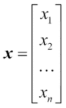
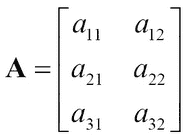
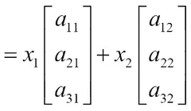
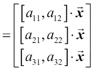
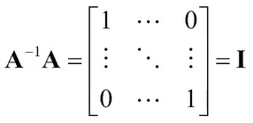

# 十、附录 A：线性代数

线性代数在机器学习中非常重要，它为我们提供了一系列工具，这些工具对于处理数据和从中提取模式非常方便。此外，当在许多机器学习中必须成批处理数据时，当在优化或数据预处理或分析中的任何数量的操作中实施软件解决方案时，使用“矢量化”形式作为传统循环结构的替代，可以获得很高的运行时效率。

下面我们将只考虑实数域。因此，向量表示一个由 *n 个*实数值组成的数组。矩阵是一个由实数值组成的 *m* 行和 *n* 列的二维数组。

这里介绍了线性代数基础中的一些关键概念。

# 矢量

向量 **x** (小写，粗体，约定；等价地，可以看作是*n*-维空间中的一个点。通常，当我们说向量时，我们指的是列向量。列向量的*转置*是元素个数相同的*行*向量，排列成单行。

## 向量的标量积

也称为点积，标量积定义为两个长度相等的向量。运算的结果是一个标量值，并且是通过对向量的相应元素的乘积求和而获得的。因此，给定向量 **x** 和 **y** :

点积 **x** T **y** 给出为:

# 矩阵

一个矩阵是一个二维数组。每个元素都可以根据其行和列的位置进行索引。因此，一个 3×2 的矩阵:

## 矩阵的转置

交换矩阵中的行和列产生转置。因此， **A** 的转置是一个 2×3 矩阵:

### 矩阵加法

矩阵加法被定义为具有相同形状的两个矩阵的元素相加。设 **A** 和 **B** 为两个 *m* x *n* 矩阵。它们的和 **C** 可以写成如下:

**C** i，j = **A** i，j + **B** i，j

### 标量乘法

与标量相乘产生一个矩阵，其中每个元素由标量值缩放。这里 **A** 乘以标量值 *d* :

### 矩阵乘法

如果 **A** 的列数等于 **B** 的行数，则两个矩阵 **A** 和 **B** 可以相乘。如果 **A** 的尺寸为 *m* x *n* 并且 **B** 的尺寸为 *n* x *p* ，则产品 **AB** 的尺寸为 *m* x *p* :

#### 矩阵产品的特性

分配性超过加法:A(B + C) = AB + AC

结合性:A(BC) = (AB)C

非交换性:AB ≠ BA

向量点积是可换的:**x**T**y**=**y**T**x**

积的转置是转置的积:(**AB**T =**A**T**B**T

##### 线性变换

在线性代数中，矩阵和向量的乘积有着特殊的重要性。考虑 3×2 矩阵 **A** 和 2×1 向量 **x** 的乘积，产生 3×1 向量 *y* :

(三)

(R)

考虑前面的矩阵矢量积的两个视图是有用的，即列图像( **C** 和行图像( **R** )。在列图中，乘积可视为矩阵列向量的线性组合，而行图可视为矩阵行与向量的点积

##### 矩阵求逆

矩阵与其逆矩阵的乘积就是单位矩阵。因此:

如果矩阵逆矩阵存在的话，它可以用来求解由前面的向量矩阵乘积方程表示的联立方程组。考虑一个方程组:

*x* 1 + 2 *x* 2 = 3

3 *x* 1 + 9 *x* 2 = 21

这可以表示为一个包含矩阵矢量积的等式:

我们可以通过将两边乘以矩阵逆来求解变量 *x* 1 和 *x* 2:

矩阵的逆矩阵可以用不同的方法计算。建议读者观看斯特朗教授的麻省理工学院讲座:[bit.ly/10vmKcL](http://bit.ly/10vmKcL)。

##### 特征分解

矩阵可以被分解成因子，这些因子可以给我们对矩阵所代表的转换的有价值的洞察力。作为特征分解的结果，获得特征值和特征向量。对于给定的方阵 **A** ，特征向量是一个非零向量，当乘以矩阵时，它被转换成自身的缩放版本。标量乘数是特征值。特征向量的所有标量倍数也是特征向量:

**A****v**=*λ*v

在前面的例子中， **v** 是特征向量，λ是特征值。

矩阵 **A** 的特征值方程由下式给出:

(**A****—*λ***I**)**v**= 0**

**特征值的非零解由行列式表示的次数为 *n* 的特征多项式方程的根给出:**

****

**然后通过求解**Av**=*λ*v 中的 *v* 可以找到特征向量。**

**一些矩阵，称为可对角化矩阵，可以完全由它们的特征向量和特征值构成。如果**λ**是矩阵 A 的特征值在其主对角线上的对角矩阵， **Q** 是列为 **A** 的特征向量的矩阵:**

****

**那么**A = QλQ**-1。**

##### **正定矩阵**

**如果一个矩阵只有正的特征值，则称这个矩阵为**正定矩阵**。如果特征值为正或为零，则该矩阵称为**正半定矩阵**。对于正定矩阵，事实是:**

****x**T*T3**Ax**≥*0**

### **奇异值分解**

**SVD 是任何矩形矩阵**的一个分解，一个维度为 *n* x *p* 的**，并且被写成三个矩阵的乘积:**

****

****U** 定义为 *n* x *n* ， **S** 为对角 *n* x *p* 矩阵， **V** 为 *p* x *p* 。 **U** 和 **V** 是正交矩阵；那就是:**

****

****S** 的对角值称为 **A** 的奇异值。 **U** 的列称为 **A** 的左奇异向量， **V** 的列称为 **A** 的右奇异向量。左奇异向量是 **A** T **A** 的正交特征向量，右奇异向量是 **AA** T 的正交特征向量。**

**SVD 表示将原始数据扩展到一个坐标系中，使得协方差矩阵是一个对角矩阵。**