# 十一、附录 B：概率

这里简单介绍一下概率的基本概念。

# 概率公理

Kolmogorov 的概率公理可以用可能事件的样本空间 *S* 、 *E* 1、 *E* 2、 *E* 3、… *E* n 和事件 *E* 的实值概率 *P(E)* 来表述。公理是:

1.  *P(E) ≥ 0 对于所有的 e*ϵs
2.  *P(S) = 1*
3.  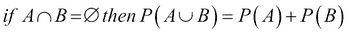

总的来说，这些公理认为概率不能是负数——不可能事件的概率为零——样本空间之外的事件是不可能的，因为它是所考虑的可能性的宇宙，并且两个互斥事件中任何一个发生的概率等于它们各自概率的总和。

# 贝叶斯定理

以证据 **X** 为条件的事件 **E** 的概率与事件的先验概率和事件已经发生的证据的可能性成正比。这是贝叶斯定理:

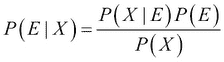

*P(X)* 是归一化常数，也叫 *X* 的边际概率。 *P(E)* 为先验， *P(X|E)* 为似然。 *P(E|X)* 也叫后验概率。

用后验概率和先验概率表示的贝叶斯定理被称为贝叶斯法则。

## 密度估计

从总体中随机抽取样本数据，估计随机变量的隐藏概率密度函数，称为密度估计。高斯混合和核密度估计是用于特征工程、数据建模和聚类的例子。

给定随机变量 *X* 的概率密度函数 *f(X)* ，与 *X* 的值相关联的概率可以被发现如下:

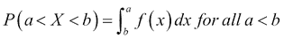

密度估计可以是参数化的，其中假设数据来自已知的分布族，并且例如通过估计分布的参数来估计 *f(x)* ，并且在正态分布的情况下估计σ ² 。另一种方法是非参数的，其中没有对观察数据的分布进行假设，并且允许数据确定分布的形式。

## 意思是

随机变量的长期平均值被称为期望值或平均值。样本平均值是观测数据的相应平均值。

在离散随机变量的情况下，平均值由下式给出:

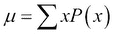

例如，掷出单个公平骰子的点数平均数是 3.5。

对于概率密度函数为 *f(x)* 的连续随机变量，均值为:

## 方差

方差是随机变量与其均值之差的平方的期望值。

在离散情况下，使用前面讨论的定义的平均值，以及概率质量函数 *p(x)* ，方差为:

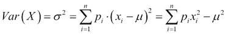

在连续情况下，情况如下:

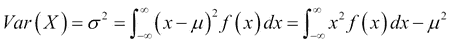

一些连续分布没有均值或方差。

## 标准偏差

标准偏差衡量数据相对于其平均值的分布程度。它是方差的平方根，与方差不同，它以与数据相同的单位表示。这里给出了离散和连续随机变量的标准偏差:

*   离散案例: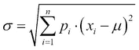
*   连续案例: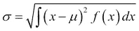

## 高斯标准差

从较大人口中随机抽取样本的标准差是人口标准差的有偏估计。基于特定的分布，对这种有偏估计的校正可以不同。对于高斯或正态分布，方差通过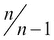的值进行调整。

根据之前给出的定义，有偏估计值 *s* 由下式给出:

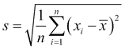

在上式中，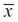是样本平均值。

使用贝塞尔修正的无偏估计值为:

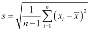

## 协方差

在两个随机变量的联合分布中，随机变量与其各自均值的偏差乘积的期望称为协方差。因此，对于两个随机变量 **X** 和 **Y** ，等式如下:

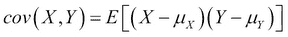

=*e[xy]–*x*μ*y

如果两个随机变量是独立的，那么它们的协方差为零。

## 相关系数

当协方差被两个随机变量的标准差的乘积归一化时，我们得到相关系数*ρ*X，Y ，也称为皮尔逊积矩相关系数:

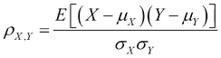

相关系数只能取-1 和 1 之间的值。系数+1 意味着随机变量之间存在完美的递增线性关系。-1 表示完美的递减线性关系。如果两个变量相互独立，则皮尔逊系数为 0。

## 二项分布

参数为 **n** 和 **p** 的离散概率分布。随机变量是一个二元变量，在单次试验中，结果的概率由 **p** 和**1–p**给出。概率质量函数给出了在 **n** 次独立试验中 **k** 次成功的概率。

参数: *n，k*

PMF:

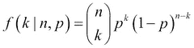

其中:

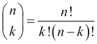

这是二项式系数。

均值:E[*X*=*NP*

方差:*Var(X)*=*NP*(1—*p*

## 泊松分布

泊松分布给出了一个事件在给定时间段或给定空间区域发生次数的概率。

参数λ是给定时间间隔内出现的平均次数。在该间隔内观察到的 *k* 个事件的概率质量函数为

PMF:

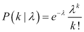

均值:E[ *X* ] = λ

方差: *Var(X)* = λ

## 高斯分布

高斯分布，又称正态分布，是一种连续的概率分布。其概率密度函数用均值和方差表示如下:

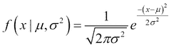

平均:

标准偏差:σ

方差:σ2

标准正态分布是均值为 0，标准差为 1 的情况。标准正态分布的 PDF 如下所示:

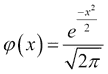

## 中心极限定理

中心极限定理说，当你有几个独立且同分布的随机变量，其分布具有明确定义的均值和方差时，大量这些观察值的平均值(或总和)近似正态分布，而不考虑母分布。此外，极限正态分布与母体分布具有相同的均值，并且方差等于基础方差除以样本大小。

给定一个随机样本 *X* 1， *X* 2， *X* 3 … *X* n 用*=*E*[*X*I】和*σ*2*= Var(X*I*)*，样本均值: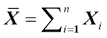*

*大致正常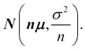*

*中心极限定理有几个变体，其中独立性或同分布的约束被放松，但收敛到正态分布仍然遵循。*

## *误差传播*

*假设有一个随机变量 *X* ，它是多个观测值的函数，每个观测值都有自己的分布。给定组成 *X* 的测量量的相应值，关于 *X* 的平均值和方差有什么说法？这就是误差传播的问题。*

*假设 *x* 是通过观察变量 *u* 、 *v* 等确定的量:*

**x = f(u，v，)**

*让我们假设:*

*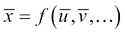*

**x* 中关于 *u* 、 *v* 等的方差的不确定性可以用 *x* 的方差来表示:*

*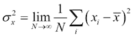*

*从 *x* 的方差的泰勒展开式，我们得到如下结果:*

*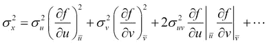*

*这里，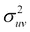是协方差。*

*同样，我们可以确定平均值的传播误差。给定具有由 *s* i 表征的 *N* 测量值和*x*T4I不确定度，可写出以下公式:*

*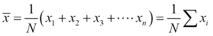*

*使用:*

*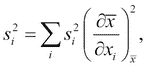*

*这些方程假设协方差为 0。*

*假设*s*I*= s*——也就是说，所有的观测值都有相同的误差。*

*然后，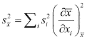。*

*自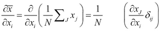*

*因此，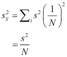。*