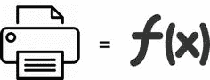
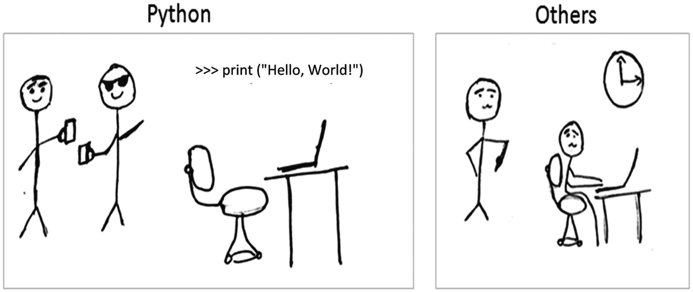
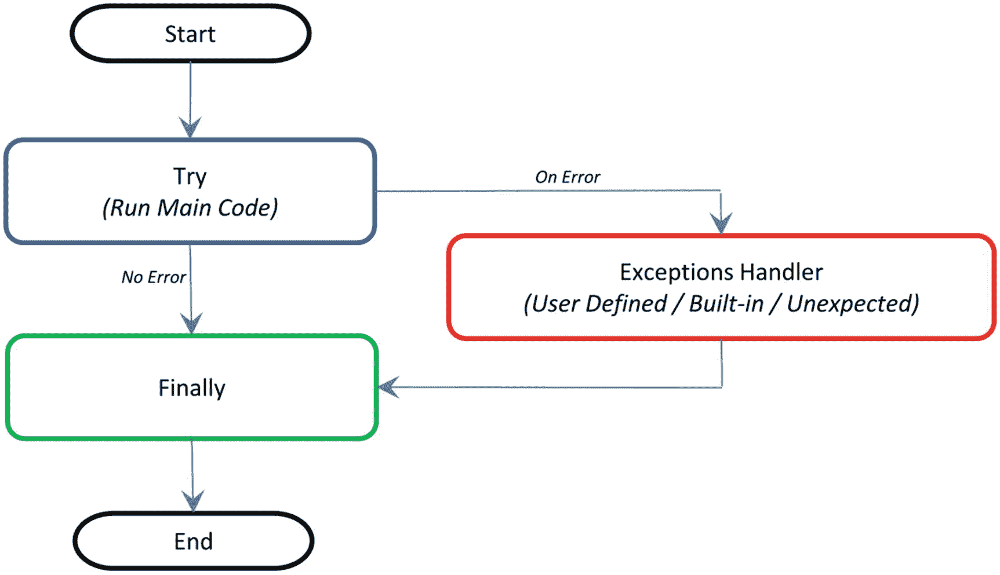

# 一、Python 3 入门

在本章中，你将获得关于 Python 语言及其核心理念的高层次概述，如何设置 Python 3 开发环境，以及围绕 Python 编程的关键概念，以帮助你入门。本章是非 Python 用户的附加步骤或先决步骤。如果您已经熟悉 Python，我建议您快速浏览一下目录，以确保您了解所有的关键概念。

## 生活中最好的东西都是免费的

有人说，生活中最美好的东西都是免费的！“Python 是一种开源、高级、面向对象、解释型的通用动态编程语言。它有一个基于社区的发展模式。其核心设计理论强调代码可读性，其编码结构使程序员能够用比 Java、C 或 C++等其他高级编程语言更少的代码行来阐述计算概念。

文档“Python 的禅”(Python 增强提案，信息条目编号 20)很好地总结了 Python 的设计哲学，其中包括如下格言:

*   美丽总比丑陋好——保持一致。

*   复杂比复杂好——使用现有的库。

*   简单总比复杂好——保持简单，笨蛋(吻)。

*   平的比嵌套的好——避免嵌套的 if。

*   明确的比含蓄的好——要清楚。

*   稀疏比密集好——将代码分成模块。

*   可读性很重要——缩进以方便阅读。

*   特例不足以特殊到打破规则——一切都是对象。

*   错误不应该悄无声息地过去——使用良好的异常处理。

*   尽管实用性胜过纯粹性——如果需要，打破规则。

*   除非明确禁止，否则使用错误记录和可追溯性。

*   在歧义中，拒绝猜测的诱惑——Python 语法更简单；然而，很多时候我们可能需要更长的时间来破译。

*   尽管方式可能一开始并不明显——实现某件事的方式并不只有一种。

*   最好只有一个显而易见的方法——使用现有的库。

*   如果实现很难解释，这是一个坏主意——如果你不能用简单的术语解释，那么你对它理解得不够好。

*   现在做总比不做好——有快速/肮脏的方法来完成工作，而不是尝试太多的优化。

*   尽管从来没有比现在更好——尽管有一条快速/肮脏的路，但不要走上一条没有优雅的回头路的道路。

*   名称空间是一个非常棒的想法，所以让我们多做一些吧！具体点。

*   如果实现很容易解释，这可能是一个好主意——简单是好的。

## 冉冉升起的明星

Python 于 1991 年 2 月 20 日正式诞生，版本号为 0.9.0。它的应用横跨各个领域，如网站开发、移动应用程序开发、科学和数字计算、桌面 GUI 和复杂软件开发。尽管 Python 是一种更通用的编程和脚本语言，但在过去几年中，它已经在数据工程师、科学家和机器学习(ML)爱好者中流行起来。

有一些设计良好的开发环境，如 Jupyter Notebook 和 Spyder，它们允许快速检查数据，并能够交互式地开发 ML 模型。

NumPy 和 Pandas 等强大的模块可以有效地使用数字数据。科学计算通过 SciPy 软件包变得很容易。许多主要的 ML 算法已经在 scikit-learn(也称为 sklearn)中有效地实现。HadooPy 和 PySpark 通过大数据技术堆栈提供无缝的工作体验。Cython 和 Numba 模块允许以 C 代码的速度执行 Python 代码。nosetest 等模块强调高质量、持续集成测试和自动部署。

将所有这些结合起来，使得许多 ML 工程师选择 Python 作为语言来探索数据、识别模式、构建模型并将其部署到生产环境中。最重要的是，各种关键 Python 包的商业友好许可证鼓励了商业和开源社区的合作，这对双方都有利。总的来说，Python 编程生态系统允许快速的结果和快乐的程序员。我们已经看到了这样一种趋势，即开发人员成为开源社区的一部分，为全球社区提供 bug 修复和新算法，同时保护他们所在公司的核心知识产权。

## 选择 Python 2.x 或 Python 3.x

2008 年 12 月发布的 Python 版是向后不兼容的。这是因为开发团队有很大的压力，强调将二进制数据与文本数据分开，并使所有文本数据自动支持 Unicode，以便项目团队可以轻松地使用多种语言。因此，任何从 2.x 到 3.x 的项目迁移都需要很大的改变。Python 2.x 原本计划在 2015 年寿终正寝，但后来又延长了 5 年到 2020 年。

Python 3 是一种前沿、更好、更一致的语言。这是 Python 语言的未来，它修复了 Python 2 中存在的许多问题。表 [1-1](#Tab1) 显示了一些主要差异。

表 1-1

Python 2 对 Python 3

<colgroup><col class="tcol1 align-left"> <col class="tcol2 align-left"></colgroup> 
| 

Python 2

 | 

python3

 |
| --- | --- |
| 它将在 2020 年退休；在那之前，它会收到安全更新和错误修复。 | 在过去的两年里，它被广泛采用；目前 99.7%的关键包支持 Python 3。 |
| 印刷品是一种陈述。打印“Hello World！” | 打印是一种功能。Print ("Hello World！") |
| 默认情况下，字符串存储为 ASCII。 | 默认情况下，字符串存储为 Unicode。 |
| 将整数除法舍入到最接近的整数 | 整数除法返回精确值，不四舍五入到最接近的整数。 |

截至目前，Python 3 readiness ( [`http://py3readiness.org/`](http://py3readiness.org/) )显示，Python 的 360 个顶级包中有 360 个支持 3.x，强烈建议我们使用 Python 3.x 进行开发工作。

我推荐 Anaconda (Python 发行版)，BSD 许可的，它允许您将它用于商业和再发行。它有大约 474 个包，包括对大多数科学应用、数据分析和 ML 最重要的包，如 NumPy、SciPy、Pandas、Jupyter Notebook、matplotlib 和 scikit-learn。它还提供了一个优秀的环境工具 conda，允许您轻松地在环境之间切换——甚至在 Python 2 和 3 之间切换(如果需要的话)。当一个包的新版本发布时，它也更新得非常快；你可以直接做`conda update <packagename>`来更新它。

你可以从他们的官方网站 [`https://www.anaconda.com/distribution/`](https://www.anaconda.com/distribution/) 下载最新版本的 Anaconda，并按照安装说明进行操作。

要安装 Python，请参考以下章节。

### Windows 操作系统

1.  根据您的系统配置(32 或 64 位)，下载安装程序。

2.  双击。exe 文件来安装 Anaconda，并按照屏幕上的安装向导进行操作。

### 系统

对于 Mac OS，您可以通过图形安装程序或命令行进行安装。

#### 图形安装程序

1.  下载图形安装程序。

2.  双击下载的。pkg 文件，然后按照屏幕上的安装向导说明进行操作。

#### 命令行安装程序

1.  下载命令行安装程序

2.  在你的终端窗口中，输入并遵循指令:bash

### Linux 操作系统

1.  根据您的系统配置，下载安装程序。

2.  在您的终端窗口中，键入并遵循指令:bash anaconda 3-x . x . x-Linux-x86 _ xx . sh。

### 来自官方网站

如果你不想使用 Anaconda build pack，你可以去 Python 的官方网站 [`www.python.org/downloads/`](http://www.python.org/downloads/) 浏览到合适的 OS 部分并下载安装程序。注意，OSX 和大多数 Linux 都预装了 Python，所以不需要额外的配置。

为 Windows 设置路径时，请确保在运行安装程序时选中“将 Python 添加到路径选项”。这将允许您从任何目录调用 Python 解释器。

如果您没有勾选“将 Python 添加到路径选项”，请遵循以下步骤:

1.  右键单击“我的电脑”

2.  单击“属性”

3.  单击侧面板中的“高级系统设置”

4.  单击“环境变量”

5.  单击系统变量下方的“新建”。

6.  在 name 中，输入 pythonexe(或您想要的任何名称)。

7.  在值中，输入 Python 的路径(例如:C:\Python32\)。

8.  现在编辑 Path 变量(在系统部分)并添加% pythonexe %到已经存在的东西的尽头。

### 运行 Python

在命令行中，键入“Python”打开交互式解释器。Python 脚本可以使用以下语法在命令行执行

```py
python <scriptname.py>.

```

## 关键概念

Python 中有许多基本概念，理解它们对于您的入门至关重要。本章的其余部分对它们进行了简要的介绍。

### Python 标识符

顾名思义，标识符帮助我们区分一个实体和另一个实体。类、函数和变量等 Python 实体被称为标识符。

*   它可以是大写或小写字母的组合(A 到 Z 或 A 到 Z)。

*   它可以是任何数字(0 到 9)或下划线(_)。

*   用 Python 编写标识符要遵循的一般规则:
    *   它不能以数字开头。例如，1 变量无效，而变量 1 有效。

    *   Python 保留关键字(参考表 [1-2](#Tab2) )不能用作标识符。

    *   除了下划线(_)，特殊符号如！、@、#、$、%等。不能是标识符的一部分。

### 关键词

表 [1-2](#Tab2) 列出了 Python 中用来定义语言语法和结构的一组保留字。关键词区分大小写，除了*真、*假、*无*外，所有关键词都是小写。

表 1-2

Python 关键字

<colgroup><col class="tcol1 align-left"> <col class="tcol2 align-left"> <col class="tcol3 align-left"> <col class="tcol4 align-left"> <col class="tcol5 align-left"></colgroup> 
| 错误的 | 班级 | 最后 | 是 | 返回 |
| 没有人 | 继续 | 为 | 希腊字母的第 11 个 | 尝试 |
| 真实的 | 极好的 | 从 | 非局部的 | 正在… |
| 和 | 是吗 | 全球的 | 不 | 随着 |
| 如同 | 艾列弗 | 如果 | 或者 | 产量 |
| 维护 | 其他 | 进口 | 及格 |   |
| 破裂 | 除...之外 | 在 | 上升 |   |

### 我的第一个 Python 程序

与其他编程语言相比，使用 Python 要容易得多(图 [1-1](#Fig1) )。让我们看看如何在一行代码中执行一个简单的 print 语句。您可以在命令提示符下启动 Python 交互式，输入以下文本，然后按 Enter 键。



图 1-1

Python 与其他

```py
>>> print ("Hello, Python World!")

```

### 代码块

理解如何用 Python 编写代码块是非常重要的。让我们来看看关于代码块的两个关键概念:缩进和套件。

#### 缺口

Python 最独特的特性之一是使用缩进来标记代码块。在 Python 中，每行代码必须缩进相同的量来表示一个代码块。与大多数其他编程语言不同，缩进不是用来让代码看起来漂亮的。需要缩进来指示哪个代码块或语句属于当前程序结构(参见清单 [1-1](#PC3) 和 [1-2](#PC4) 中的示例)。

#### 套房

在 Python 中，构成单个代码块的单个语句的集合称为套件。if、while、def 和 class 等复合或复杂语句需要一个标题行，后面跟着一个 suite(我们将在后面的小节中详细理解这些语句)。标题行以关键字开始，以冒号(:)结束，后面是组成套件的一行或多行。

```py
# incorrect indentation, program will generate a syntax error
# due to the space character inserted at the beginning of the second line
print ("Programming is an important skill for Data Science")
 print ("Statistics is an important skill for Data Science")
print ("Business domain knowledge is an important skill for Data Science")
3
# incorrect indentation, program will generate a syntax error
# due to the wrong indentation in the else statement
x = 1
if x == 1:
    print ('x has a value of 1')
else:
 print ('x does NOT have a value of 1')
-------Output-----------
    print ("Statistics is an important skill for Data Science")
    ^
IndentationError: unexpected indent

Listing 1-2Example of Incorrect Indentation

```

```py
# Correct indentation
print ("Programming is an important skill for Data Science")
print ("Statistics is an important skill for Data Science")
print ("Business domain knowledge is an important skill for Data Science")

# Correct indentation, note that if statement here is an example of suites
x = 1
if x == 1:
    print ('x has a value of 1')
else:
    print ('x does NOT have a value of 1')

Listing 1-1Example of Correct Indentation

```

### 基本对象类型

表 [1-3](#Tab3) 列出了 Python 对象类型。根据 Python 数据模型参考，对象是 Python 的数据概念。Python 程序中的所有数据都由对象或对象之间的关系来表示。在某种意义上，与冯·诺依曼的“存储程序计算机”模型一致，代码也是由对象表示的。

每个对象都有标识、类型和值。清单 [1-3](#PC5) 提供了理解对象类型的示例代码。

表 1-3

Python 对象类型

<colgroup><col class="tcol1 align-left"> <col class="tcol2 align-left"> <col class="tcol3 align-left"></colgroup> 
| 

类型

 | 

例子

 | 

评论

 |
| --- | --- | --- |
| 没有人 | 没有人 | # singleton 空对象 |
| 布尔代数学体系的 | 真，假 |   |
| 整数 | -一，零，一，麦克斯 |   |
| 长的 | 1L，9787L |   |
| 浮动 | 3.141592654 |   |
|   | inf，float('inf ') | #无限 |
|   | -inf | #负无穷大 |
|   | nan，float('nan ') | #不是一个数字 |
| 复杂的 | 2+8j | #注意 j 的使用 |
| 线 | 这是一串“也是我” | #使用单引号或双引号 |
|   | r“原始字符串”，u“unicode 字符串” |   |
| 元组 | empty =() | #空元组 |
|   | (1，真，“ML”) | #不可变列表或不可改变列表 |
| 目录 | empty = [] | 空列表 |
|   | [1，真，' ML'] | #可变列表或可变列表 |
| 一组 | empty = set() | #空集 |
|   | set(1，True，' ML ') | #可变的或可改变的 |
| 词典 | empty = {} | #可变对象或可变对象 |
|   | {'1':'A '，' 2':'AA '，True = 1，False = 0} |   |
| 文件 | f =打开('文件名'，' rb ') |   |

```py
none = None           #singleton null object
boolean = bool(True)
integer = 1
Long = 3.14

# float
Float = 3.14
Float_inf = float('inf')
Float_nan = float('nan')

# complex object type, note the usage of letter j
Complex = 2+8j

# string can be enclosed in single or double quote
string = 'this is a string'
me_also_string = "also me"

List = [1, True, 'ML'] # Values can be changed

Tuple = (1, True, 'ML') # Values can not be changed

Set = set([1,2,2,2,3,4,5,5]) # Duplicates will not be stored

# Use a dictionary when you have a set of unique keys that map to values
Dictionary = {'a':'A', 2:'AA', True:1, False:0}

# lets print the object type and the value
print (type(none), none)
print (type(boolean), boolean)
print (type(integer), integer)
print (type(Long), Long)
print (type(Float), Float)
print (type(Float_inf), Float_inf)
print (type(Float_nan), Float_nan)
print (type(Complex), Complex)
print (type(string), string)
print (type(me_also_string), me_also_string)
print (type(Tuple), Tuple)
print (type(List), List)
print (type(Set), Set)
print (type(Dictionary), Dictionary)

----- output ------

<type 'NoneType'> None
<type 'bool'> True
<type 'int'> 1
<type 'float'> 3.14
<type 'float'> 3.14
<type 'float'> inf
<type 'float'> nan
<type 'complex'> (2+8j)
<type 'str'> this is a string
<type 'str'> also me
<type 'tuple'> (1, True, 'ML')
<type 'list'> [1, True, 'ML']
<type 'set'> set([1, 2, 3, 4, 5])
<type 'dict'> {'a': 'A', True: 1, 2: 'AA', False: 0}

Listing 1-3Code for Basic Object Types

```

### 何时使用列表、元组、集合或字典

四个关键的、常用的 Python 对象是列表、元组、集合和字典。理解什么时候使用这些很重要，这样才能写出高效的代码。

*   *列表* *:* 当您需要一个有序的同质集合序列，其值可以在程序中稍后更改时使用。

*   *Tuple:* 当您需要一个异构集合的有序序列时使用，这些集合的值不需要在程序的后面进行更改。

*   *Set:* 当您不必存储重复项，并且不关心项目的顺序时，它是理想的选择。你只想知道一个特定的值是否已经存在。

*   *Dictionary:* 当您需要将值与键相关联，以便使用键高效地查找它们时，它是理想的选择。

### Python 中的注释

单行注释:任何跟在#(散列)后面直到行尾的字符都被认为是注释的一部分，Python 解释器会忽略它们。

多行注释:字符串`"""`(称为多行字符串)之间的任何字符，即注释开头和结尾的字符，将被 Python 解释器忽略。请参考清单 [1-4](#PC6) 中的注释代码示例。

```py
# This is a single line comment in Python
print("Hello Python World") # This is also a single line comment in Python

""" This is an example of a multi-line
the comment that runs into multiple lines.
Everything that is in between is considered as comments
"""

Listing 1-4Example Code for Comments

```

### 多行语句

Python 在圆括号、中括号和大括号内的斜线延续是最受欢迎的换行方式。使用反斜杠来表示行继续符使得可读性更好；但是，如果需要，您可以在表达式两边添加一对额外的括号。适当地缩进代码的后续行是很重要的。请注意，打破二元运算符的首选位置是在运算符之后，而不是之前。Python 代码示例请参考清单 [1-5](#PC7) 。

```py
# Example of implicit line continuation
x = ('1' + '2' +
    '3' + '4')

# Example of explicit line continuation
y = '1' + '2' + \
    '11' + '12'

weekdays = ['Monday', 'Tuesday', 'Wednesday',
'Thursday', 'Friday']

weekend = {'Saturday',
           'Sunday'}

print ('x has a value of', x)
print ('y has a value of', y)
print (weekdays)
print (weekend)

------ output -------
('x has a value of', '1234')
('y has a value of', '1234')
['Monday', 'Tuesday', 'Wednesday', 'Thursday', 'Friday']
set(['Sunday', 'Saturday'])

Listing 1-5Example Code for Multiline Statements

```

### 单行上的多条语句

Python 还允许通过使用分号(；)，假设该语句不启动新的代码块。清单 [1-6](#PC8) 提供了一个代码示例。

```py
import os; x = 'Hello'; print (x)

Listing 1-6Code Example for Multiple Statements on a Single Line

```

### 基本运算符

在 Python 中，运算符是可以操作操作数值的特殊符号。例如，让我们考虑表达式 1 + 2 = 3。这里 1 和 2 称为操作数，是运算符所运算的值，符号+称为运算符。

Python 语言支持以下类型的运算符:

*   算术运算符

*   比较或关系运算符

*   赋值运算符

*   按位运算符

*   逻辑运算符

*   成员运算符

*   标识运算符

让我们通过例子来学习所有的运算符，一个一个来。

#### 算术运算符

算术运算符(列在表 [1-4](#Tab4) 中)对于对数字执行加、减、乘、除等数学运算很有用。代码示例请参考清单 [1-7](#PC9) 。

表 1-4

算术运算符

<colgroup><col class="tcol1 align-left"> <col class="tcol2 align-left"> <col class="tcol3 align-left"></colgroup> 
| 

操作员

 | 

描述

 | 

例子

 |
| --- | --- | --- |
| + | 添加 | x + y = 30 |
| - | 减法 | x–y =-10 |
| *本文件迟交 | 增加 | x ' y = 200 |
| / | 分开 | y / x = 2 |
| % | 系数 | y % x = 0 |
| ∫指数 | 指数运算 | x∫b = 10 的 20 次方 |
| // | 地板除法-整数除法四舍五入到负无穷大 | 9//2 = 4 和 9.0//2.0 = 4.0，-11//3 = -4，-11.0/ |

```py
# Variable x holds 10 and variable y holds 5
x = 10
y = 5

# Addition
print ("Addition, x(10) + y(5) = ", x + y)

# Subtraction
print ("Subtraction, x(10) - y(5) = ", x - y)

# Multiplication
print ("Multiplication, x(10) * y(5) = ", x * y)

# Division
print ("Division, x(10) / y(5) = ",x / y)

# Modulus
print ("Modulus, x(10) % y(5) = ", x % y)

# Exponent
print ("Exponent, x(10)**y(5) = ", x**y)

# Integer division rounded towards minus infinity
print ("Floor Division, x(10)//y(5) = ", x//y)

-------- output --------

Addition, x(10) + y(5) =  15
Subtraction, x(10) - y(5) =  5
Multiplication, x(10) * y(5) =  50
Divions, x(10) / y(5) =  2.0
Modulus, x(10) % y(5) =  0
Exponent, x(10)**y(5) =  100000
Floor Division, x(10)//y(5) =  2

Listing 1-7Example Code for Arithmetic Operators

```

#### 比较或关系运算符

顾名思义，表 [1-5](#Tab5) 中列出的比较或关系运算符对于比较值很有用。对于给定的条件，它们将返回 True 或 False。代码示例参见清单 [1-8](#PC10) 。

表 1-5

比较或关系运算符

<colgroup><col class="tcol1 align-left"> <col class="tcol2 align-left"> <col class="tcol3 align-left"></colgroup> 
| 

操作员

 | 

描述

 | 

例子

 |
| --- | --- | --- |
| == | 如果两个操作数的值相等，则条件为真。 | (10 == 5)不成立。 |
| ！= | 如果两个操作数的值不相等，则条件为真。 | (10 != 5)为真。 |
| > | 如果左操作数的值大于右操作数的值，则该条件为真。 | (10 > 5)不成立。 |
| < | 如果左操作数的值小于右操作数的值，则条件为真。 | (10 < 5)为真。 |
| >= | 如果左操作数的值大于或等于右操作数的值，则该条件为真。 | (10 >= 5)不成立。 |
| <= | 如果左操作数的值小于或等于右操作数的值，则该条件为真。 | (10 <= 5)为真。 |

```py
# Variable x holds 10 and variable y holds 5
x = 10
y = 5

# Equal check operation
print ("Equal check, x(10) == y(5) ", x == y)

# Not Equal check operation
print ("Not Equal check, x(10) != y(5) ", x != y)

# Less than check operation
print ("Less than check, x(10) <y(5) ", x<y)

# Greater check operation
print ("Greater than check, x(10) >y(5) ", x>y)

# Less than or equal check operation
print ("Less than or equal to check, x(10) <= y(5) ", x<= y)

# Greater than or equal to check operation
print ("Greater than or equal to check, x(10) >= y(5) ", x>= y)

-------- output --------
Equal check, x(10) == y(5)  False
Not Equal check, x(10) != y(5)  True
Less than check, x(10) <y(5)  False
Greater than check, x(10) >y(5)  True
Less than or equal to check, x(10) <= y(5)  False
Greater than or equal to check, x(10) >= y(5)  True

Listing 1-8Example Code for Comparision/Relational Operators

```

#### 赋值运算符

在 Python 中，表 [1-6](#Tab6) 中列出的赋值运算符用于给变量赋值。例如，考虑 x = 5；这是一个简单的赋值运算符，它将运算符右侧的数值 5 赋给左侧的变量 x。Python 中有一系列复合操作符，比如 x += 5，它们会添加到变量中，然后对变量赋值。它和 x = x + 5 一样好。代码示例参见清单 [1-9](#PC11) 。

表 1-6

赋值运算符

<colgroup><col class="tcol1 align-left"> <col class="tcol2 align-left"> <col class="tcol3 align-left"></colgroup> 
| 

操作员

 | 

描述

 | 

例子

 |
| --- | --- | --- |
| = | 将右侧操作数的值分配给左侧操作数 | z = x + y 将 x + y 的值赋给 z |
| +=相加和 | 它将右操作数加到左边操作数，并将结果赋给左操作数 | z += x 相当于 z = z + x |
| -=减去和 | 它从左操作数中减去右操作数，并将结果赋给左操作数。 | z -= x 等价于 z = z - x |
| ∑=相乘和 | 它将右操作数与左操作数相乘，并将结果赋给左操作数。 | z∫= x 等价于 z = z∫x |
| /=除和 | 它将左操作数除以右操作数，并将结果赋给左操作数。 | z /= x 相当于 z = z/ xz/= x 相当于 z = z / x |
| %=模数和 | 它使用两个操作数取模，并将结果赋给左操作数。 | z %= x 相当于 z = z % x |
| ∫∫=指数和 | 它对运算符执行指数(幂)计算，并将值赋给左操作数。 | z∑∑= x 等价于 z = z |
| //=楼层划分 | 它对运算符执行底数除法，并将值赋给左操作数。 | z //= x 等价于 z = z// x |

```py
# Variable x holds 10 and variable y holds 5
x = 5
y = 10

x += y
print ("Value of a post x+=y is ", x)

x *= y
print ("Value of a post x*=y is ", x)

x /= y
print ("Value of a post x/=y is ", x)

x %= y
print ("Value of a post x%=y is ", x)

x **= y
print ("Value of x post x**=y is ", x)

x //= y
print ("Value of a post x//=y is ", x)
-------- output --------
Value of a post x+=y is  15
Value of a post x*=y is  150
Value of a post x/=y is  15.0
Value of a post x%=y is  5.0
Value of x post x**=y is  9765625.0
Value of a post x//=y is  976562.0

Listing 1-9Example Code for Assignment Operators

```

#### 按位运算符

你可能知道，计算机中的一切都是用比特来表示的，即一系列 0 和 1。表 [1-7](#Tab7) 中列出的位运算符使我们能够直接操作或操纵位。让我们了解一下基本的位运算。按位运算符的一个主要用途是解析十六进制颜色。

众所周知，按位运算符会让 Python 编程新手感到困惑，所以如果你一开始不理解可用性，也不要着急。事实是，在你的日常 ML 编程中，你不会真的看到按位操作符。但是，知道这些操作符是有好处的。

比如我们假设 x = 10(二进制 0000 1010)，y = 4(二进制 0000 0100)。代码示例请参考清单 [1-10](#PC12) 。

表 1-7

按位运算符

<colgroup><col class="tcol1 align-left"> <col class="tcol2 align-left"> <col class="tcol3 align-left"></colgroup> 
| 

操作员

 | 

描述

 | 

例子

 |
| --- | --- | --- |
| &二进制和 | 如果在两个操作数中都存在一个位，则该运算符会将该位复制到结果中。 | (x 和 y)(表示 0000 0000) |
| 二进制或 | 如果任一操作数中存在某个位，则该运算符会复制该位。 | (x &#124; y) = 14(表示 0000 1110) |
| ^二元异或 | 如果该位在一个操作数中设置，而不是在两个操作数中都设置，则该运算符复制该位。 | (x ^ y) = 14(表示 0000 1110) |
| ~二进制一补码 | 这个运算符是一元的，具有“翻转”位的效果。 | (~x ) = -11(表示 1111 0101) |
| < | 左操作数值左移右操作数指定的位数。 | x<< 2= 42(表示 0010 1000) |
| >>二进制右移 | 左操作数的值向右移动右操作数指定的位数。 | x>> 2 = 2(表示 0000 0010) |

```py
# Basic six bitwise operations
# Let x = 10 (0000 1010 in binary) and y = 4 (0000 0100 in binary)
x = 10
y = 4

print (x >> y)  # Right Shift
print (x << y)  # Left Shift
print (x & y)   # Bitwise AND
print (x | y)   # Bitwise OR
print (x ^ y) # Bitwise XOR
print (~x)    # Bitwise NOT
-------- output --------

0
160
0
14
14
-11

Listing 1-10Example Code for Bitwise Operators

```

#### 逻辑运算符

AND、OR、NOT 运算符称为逻辑运算符，列于表 [1-8](#Tab8) 中。这些对于检查给定条件下的两个变量是有用的，并且结果将适当地为真或为假。代码示例参见清单 [1-11](#PC13) 。

表 1-8

逻辑运算符

<colgroup><col class="tcol1 align-left"> <col class="tcol2 align-left"> <col class="tcol3 align-left"></colgroup> 
| 

操作员

 | 

描述

 | 

例子

 |
| --- | --- | --- |
| 和逻辑和 | 如果两个操作数都为真，则条件为真。 | (var1 和 var2)为真。 |
| 或逻辑或 | 如果两个操作数中的任何一个不为零，则条件为真。 | (var1 或 var2)为真。 |
| 不符合逻辑不 | 用于反转其操作数的逻辑状态 | Not (var1 和 var2)为假。 |

```py
var1 = True
var2 = False
print('var1 and var2 is',var1 and var2)
print('var1 or var2 is',var1 or var2)
print('not var1 is',not var1)
-------- output --------

var1 and var2 is False
var1 or var2 is True
not var1 is False

Listing 1-11Example Code for Logical Operators

```

#### 成员运算符

表 [1-9](#Tab9) 中列出的成员运算符对于测试是否在一个序列中找到一个值很有用，即字符串、列表、元组、集合或字典。Python 中有两个成员运算符:“in”和“not in”注意，在字典的情况下，我们只能测试键(而不是值)的存在。代码示例参见清单 [1-12](#PC14) 。

表 1-9

成员运算符

<colgroup><col class="tcol1 align-left"> <col class="tcol2 align-left"> <col class="tcol3 align-left"></colgroup> 
| 

操作员

 | 

描述

 | 

例子

 |
| --- | --- | --- |
| 在 | 如果一个值在指定的序列中，结果为 True，否则为 False | var2 中的 var1 |
| 不在 | 如果值不在指定的序列中，则结果为 True，否则为 False | var1 不在 var2 中 |

```py
var1 = 'Hello world'          # string
var2 = {1:'a',2:'b'}          # dictionary
print('H' in var1)
print('hello' not in var1)
print(1 in var2)
print('a' in var2)
-------- output --------
True
True
True
False

Listing 1-12Example Code for Membership Operators

```

#### 标识运算符

表 [1-10](#Tab10) 中列出的恒等运算符可用于测试两个变量是否存在于存储器的同一部分。Python 中有两个身份运算符:“*是*,*不是*”请注意，两个值相等的变量并不意味着它们是相同的。代码示例请参考清单 [1-13](#PC15) 。

表 1-10

标识运算符

<colgroup><col class="tcol1 align-left"> <col class="tcol2 align-left"> <col class="tcol3 align-left"></colgroup> 
| 

操作员

 | 

描述

 | 

例子

 |
| --- | --- | --- |
| 存在 | 如果运算符两边的变量指向同一个对象，则结果为 True，否则为 False | var1 是 var2 |
| 不是 | 如果运算符两边的变量指向同一个对象，则结果为 False，否则为 True | Var1 不是 var2 |

```py
var1 = 5
var1 = 5
var2 = 'Hello'
var2 = 'Hello'
var3 = [1,2,3]
var3 = [1,2,3]
print(var1 is not var1)
print(var2 is var2)
print(var3 is var3)
-------- output --------
False
True
False

Listing 1-13Example Code for Identity Operators

```

### 控制结构

控制结构是编程中的基本选择或决策过程。它是一段分析变量值并根据给定条件决定前进方向的代码。在 Python 中，主要有两种类型的控制结构:选择和迭代。

#### 选择

选择语句允许程序员检查条件，并根据结果执行不同的操作。这个有用的结构有两个版本:1) if 和 2) if…else。代码示例请参考清单 [1-14](#PC16) 至 [1-16](#PC18) 。

```py
score = 95

if score >= 99:
    print('A')
elif score >=75:
    print('B')
elif score >= 60:
    print('C')
elif score >= 35:
    print('D')
else:
    print('F')
-------- output --------
B

Listing 1-16Example Code for Nested “if else” Statements

```

```py
var = 1

if var < 0:
    print ("the value of var is negative")
    print (var)
else:
    print ("the value of var is positive")
    print (var)
-------- output --------
the value of var is positive
1

Listing 1-15Example Code for “if else” Statement

```

```py
var = -1
if var < 0:
    print (var)
    print ("the value of var is negative")

# If the suite of an if clause consists only of a single line, it may go on the same line as the header statement
if ( var  == -1 ) : print ("the value of var is negative")
-------- output --------
-1
the value of var is negative
the value of var is negative

Listing 1-14Example Code for a Simple “if” Statement

```

#### 迭代次数

循环控制语句使我们能够多次执行单个或一组编程语句，直到满足给定的条件。Python 提供了两个基本的循环语句:1)“for”和 2)“while”

*For loop:* 它允许我们执行一个代码块特定的次数或特定的条件，直到它被满足。代码示例请参考清单 [1-17](#PC19) 至 [1-19](#PC21) 。

```py
# First Example
print ("First Example")
for item in [1,2,3,4,5]:
    print ('item :', item)

# Second Example
print ("Second Example")
letters = ['A', 'B', 'C']
for letter in letters:
    print ('First loop letter :', letter)

# Third Example - Iterating by sequency index
print ("Third Example")
for index in range(len(letters)):
    print ('First loop letter :', letters[index])

# Fourth Example - Using else statement
print ("Fourth Example")
for item in [1,2,3,4,5]:
    print ('item :', item)
else:
    print ('looping over item complete!')
----- output ------
First Example
item : 1
item : 2
item : 3
item : 4
item : 5
Second Example
First loop letter : A
First loop letter : B
First loop letter : C
Third Example
First loop letter : A
First loop letter : B
First loop letter : C
Fourth Example
item : 1
item : 2
item : 3
item : 4
item : 5
looping over item complete!

Listing 1-17Example Code for a “for” Loop Statement

```

*While 循环:*While 语句重复一组代码，直到条件为真。

```py
count = 0
while (count < 5):
    print ('The count is:', count)
    count = count + 1
----- output ------
The count is: 0
The count is: 1
The count is: 2
The count is: 3
The count is: 4

Listing 1-18Example Code for a “while” Loop Statement

```

### 警告

如果一个条件永远不会变为假，那么这个循环就变成了一个无限循环。

else 语句可以与 while 循环一起使用，当条件变为 false 时将执行 else 语句。

```py
count = 0
while count < 5:
    print (count, " is  less than 5")
    count = count + 1
else:
    print (count, " is not less than 5")
----- output ------
0  is  less than 5
1  is  less than 5
2  is  less than 5
3  is  less than 5
4  is  less than 5
5  is not less than 5

Listing 1-19Example Code for a “while” with an “else” 

Statement

```

### 列表

Python 的列表是最灵活的数据类型。它们可以通过在方括号之间写一列逗号分隔的值来创建。请注意，列表中的项目不必是相同的数据类型。表 [1-11](#Tab11) 汇总了列表操作；代码示例请参考清单 [1-20](#PC22) 至 [1-24](#PC26) 。

表 1-11

Python 列表操作

<colgroup><col class="tcol1 align-left"> <col class="tcol2 align-left"> <col class="tcol3 align-left"> <col class="tcol4 align-left"></colgroup> 
| 

描述

 | 

Python 表达式

 | 

例子

 | 

结果

 |
| --- | --- | --- | --- |
| 创建项目列表 | [项目 1、项目 2、…] | list = ['a '，' b '，' c '，' d'] | ['a '，' b '，' c '，' d'] |
| 访问列表中的项目 | 列表[索引] | list = ['a '，' b '，' c '，' d']列表[2] | c |
| 长度 | len(列表) | len([1，2，3]) | three |
| 串联 | 列表 1 +列表 2 | [1, 2, 3] + [4, 5, 6] | [1, 2, 3, 4, 5, 6] |
| 重复 | list’int | ['你好']* 3 | ['你好'，'你好'，'你好'] |
| 成员资格 | 列表中的项目 | 3 英寸[1，2，3] | 真实的 |
| 循环 | 对于列表中的 x:print(x) | 对于[1，2，3]中的 x:打印(x) | 1 2 3 |
| 从右边数 | 列表[-索引] | list = [1，2，3]；列表[-2] | Two |
| 切片获取部分 | 列表[索引:] | list = [1，2，3]；列表[1:] | [2,3] |
| 返回最大项目 | 最大值(列表) | max([1，2，3，4，5]) | five |
| 返回最小项目 | 最小(列表) | max([1，2，3，4，5]) | one |
| 将对象追加到列表 | 列表.追加(对象) | [1,2,3,4].追加(5) | [1,2,3,4,5] |
| 计数项目出现次数 | 列表.计数(对象) | [1,1,2,3,4].计数(1) | Two |
| 将序列内容附加到列表 | list.extend(序列) | ['a '，1]。扩展(['b '，2]) | ['a '，1，' b '，2] |
| 返回项目的第一个索引位置 | 列表索引(对象) | ['a '，' b '，' c '，1，2，3]。索引(' c ') | Two |
| 将对象插入到列表中所需的索引处 | list.insert(index，obj) | ['a '，' b '，' c '，1，2，3]。插入(4，“d”) | ['a '，' b '，' c '，' d '，1，2，3] |
| 从列表中移除并返回最后一个对象 | list.pop(obj=list[-1]) | [' a '，' b '，' c '，1，2，3]. pop()[' a '，' b '，' c '，1，2，3].pop(2) | 3c |
| 从列表中删除对象 | list.remove(对象) | ['a '，' b '，' c '，1，2，3]。移除(' c ') | ['a '，' b '，1，2，3] |
| 就地反转列表中的对象 | list.reverse() | ['a '，' b '，' c '，1，2，3]。反向( ) | [3，2，1，' c '，' b '，a'] |
| 对列表中的对象排序 | list.sort() | ['a '，' b '，' c '，1，2，3]。sort( )['a '，' b '，' c '，1，2，3]。排序(反向=真) | [1，2，3，' a '，' b '，' c']['c '，' b '，' a '，3，2，1] |

```py
# Basic Operations
print ("Length: ", len(list_1))
print ("Concatenation: ", [1,2,3] + [4, 5, 6])
print ("Repetition :", ['Hello'] * 4)
print ("Membership :", 3 in [1,2,3])
print ("Iteration :" )
for x in [1,2,3]: print (x)

# Negative sign will count from the right
print ("slicing :", list_1[-2])
# If you don't specify the end explicitly, all elements from the specified start index will be printed
print ("slicing range: ", list_1[1:])

# Comparing elements of lists
# cmp function is only available in Python 2 and not 3, so if you still need it you could use the below custom function
def cmp(a, b):
    return (a > b) - (a < b)

print ("Compare two lists: ", cmp([1,2,3, 4], [1,2,3]))
print ("Max of list: ", max([1,2,3,4,5]))
print ("Min of list: ", min([1,2,3,4,5]))
print ("Count number of 1 in list: ", [1,1,2,3,4,5,].count(1))
list_1.extend(list_2)
print ("Extended :", list_1)
print ("Index for Programming : ", list_1.index( 'Programming'))
print (list_1)
print ("pop last item in list: ", list_1.pop( ))
print ("pop the item with index 2: ", list_1.pop(2))
list_1.remove('b')
print ("removed b from list: ", list_1)
list_1.reverse( )
print ("Reverse: ", list_1)
list_1 = ['a','b','c']
list_1.sort( )
print ("Sort ascending: ", list_1)
list_1.sort(reverse = True)
print ("Sort descending: ", list_1)
---- output ----

Length:  5
Concatenation:  [1, 2, 3, 4, 5, 6]
Repetition : ['Hello', 'Hello', 'Hello', 'Hello']
Membership : True
Iteration :
1
2
3
slicing : 2017
slicing range:  ['Programming', 2015, 2017, 2018]
Compare two lists:  1
Max of list:  5
Min of list:  1
Count number of 1 in list:  2
Extended : ['Statistics', 'Programming', 2015, 2017, 2018, 'a', 'b', 1, 2, 3, 4, 5, 6, 7]
Index for Programming :  1
['Statistics', 'Programming', 2015, 2017, 2018, 'a', 'b', 1, 2, 3, 4, 5, 6, 7]
pop last item in list:  7
pop the item with index 2:  2015
removed b from list:  ['Statistics', 'Programming', 2017, 2018, 'a', 1, 2, 3, 4, 5, 6]
Reverse:  [6, 5, 4, 3, 2, 1, 'a', 2018, 2017, 'Programming', 'Statistics']
Sort ascending:  ['a', 'b', 'c']
Sort descending:  ['c', 'b', 'a'] 

Listing 1-24Example Code for Basic Operations on Lists

```

```py
# Deleting list elements
print ("list_1 values: ", list_1)
del list_1[5];
print ("After deleting value at index 2 : ", list_1)
---- output ----
list_1 values:  ['Statistics', 'Programming', 2015, 2017, 2018, 2019]
After deleting value at index 2 :  ['Statistics', 'Programming', 2015, 2017, 2018]

Listing 1-23Example Code for Deleting a List Element

```

```py
# Updating existing values of list
print ("Value available at index 2 : ", list_1[2])
list_1[2] = 2015;
print ("New value available at index 2 : ", list_1[2])
---- output ----
Values of list_1:  ['Statistics', 'Programming', 2016, 2017, 2018, 2019]
Value available at index 2 :  2016
New value available at index 2 :  2015

Listing 1-22Example Code for Updating Existing Values of Lists

```

```py
print ("list_1 values: ", list_1)
list_1.append(2019)
print ("list_1 values post append: ", list_1)
---- output ----
list_1 values:  ['Statistics', 'Programming', 2016, 2017, 2018]
list_1 values post append:  ['Statistics', 'Programming', 2016, 2017, 2018, 2019]

Listing 1-21Example Code for Adding New Values to Lists

```

```py
list_1 = ['Statistics', 'Programming', 2016, 2017, 2018];
list_2 = ['a', 'b', 1, 2, 3, 4, 5, 6, 7 ];

# Accessing values in lists
print ("list_1[0]: ", list_1[0])
print ("list2_[1:5]: ", list_2[1:5])
---- output ----

list_1[0]:  Statistics
list2_[1:5]:  ['b', 1, 2, 3]

Listing 1-20Example Code for Accessing Lists

```

### 元组

Python 元组是一系列不可变的 Python 对象，非常类似于列表。然而，列表和元组之间存在一些本质的区别:

1.  与列表不同，元组的对象不能改变。

2.  元组是用括号定义的，而列表是用方括号定义的。

表 [1-12](#Tab12) 总结了元组操作；代码示例参见清单 [1-25](#PC27) 至 [1-28](#PC30) 。

表 1-12

Python 元组操作

<colgroup><col class="tcol1 align-left"> <col class="tcol2 align-left"> <col class="tcol3 align-left"> <col class="tcol4 align-left"></colgroup> 
| 

描述

 | 

Python 表达式

 | 

例子

 | 

结果

 |
| --- | --- | --- | --- |
| 创建元组 | (项目 1、项目 2、…)()#空元组(item1，)#具有一个项目的元组，注意需要逗号 | 元组= ('a '，' b '，' c '，' d '，1，2，3)元组=()元组= (1，) | (' a '，' b '，' c '，' d '，1，2，3)( )one |
| 访问元组中的项目 | 元组[索引]元组[开始索引:结束索引] | 元组= ('a '，' b '，' c '，' d '，1，2，3)元组[2]元组[0:2] | c 甲、乙、丙 |
| 删除元组 | 元组名称 | 元组码 |   |
| 长度 | 长度(元组) | len((1，2，3)) | three |
| 串联 | 元组 _1 +元组 _2 | (1, 2, 3) + (4, 5, 6) | (1, 2, 3, 4, 5, 6) |
| 重复 | 元组' int | ('你好'，' 4) | (“你好”、“你好”、“你好”、“你好”) |
| 成员资格 | 元组中的项目 | 3 英寸(1，2，3) | 真实的 |
| 循环 | 对于元组中的 x:print(x) | 对于(1，2，3)中的 x:print(x) | 1 2 3 |
| 从右边数 | 元组[-索引] | 元组= (1，2，3)；列表[-2] | Two |
| 切片获取部分 | 元组[索引:] | 元组= (1，2，3)；列表[1:] | (2,3) |
| 返回最大项目 | 最大值(元组) | 最大值((1，2，3，4，5)) | five |
| 返回最小项目 | 最小(元组) | 最大值((1，2，3，4，5)) | one |
| 将列表转换为元组 | 元组(序列) | 元组([1，2，3，4]) | (1,2,3,4,5) |

```py
# Basic Tuple operations
Tuple = ('a','b','c','d',1,2,3)

print ("Length of Tuple: ", len(Tuple))

Tuple_Concat = Tuple + (7,8,9)
print ("Concatinated Tuple: ", Tuple_Concat)

print ("Repetition: ", (1, 'a',2, 'b') * 3)
print ("Membership check: ", 3 in (1,2,3))

# Iteration
for x in (1, 2, 3): print (x)

print ("Negative sign will retrieve item from right: ", Tuple_Concat[-2])
print ("Sliced Tuple [2:] ", Tuple_Concat[2:])

# Find max
print ("Max of the Tuple (1,2,3,4,5,6,7,8,9,10): ", max((1,2,3,4,5,6,7,8,9,10)))
print ("Min of the Tuple (1,2,3,4,5,6,7,8,9,10): ", min((1,2,3,4,5,6,7,8,9,10)))
print ("List [1,2,3,4] converted to tuple: ", type(tuple([1,2,3,4])))
---- output ----
Length of Tuple:  7
Concatinated Tuple:  ('a', 'b', 'c', 'd', 1, 2, 3, 7, 8, 9)
Repetition:  (1, 'a', 2, 'b', 1, 'a', 2, 'b', 1, 'a', 2, 'b')
Membership check:  True
1
2
3
Negative sign will retrieve an item from right:  8
Sliced Tuple [2:]  ('c', 'd', 1, 2, 3, 7, 8, 9)
Max of the Tuple (1,2,3,4,5,6,7,8,9,10):  10
Min of the Tuple (1,2,3,4,5,6,7,8,9,10):  1
List [1,2,3,4] converted to tuple:  <type 'tuple'>

Listing 1-28Example Code for Basic Tuple Operations (Not Exhaustive) 

```

```py
print ("Sample Tuple: ",Tuple)
del Tuple
print (Tuple) # Will throw an error message as the tuple does not exist

---- output ----

Sample Tuple:  ('a', 'b', 'c', 'd', 1, 2, 3)
---------------------------------------------------------------------------
Sample Tuple:  ('a', 'b', 'c', 'd', 1, 2, 3)
---------------------------------------------------------------------------
NameError                                 Traceback (most recent call last)
<ipython-input-6-002eefa7c22f> in <module>
      4 print ("Sample Tuple: ",Tuple)
      5 del Tuple
----> 6 print (Tuple) # Will throw an error message as the tuple does not exist

NameError: name 'Tuple' is not defined

Listing 1-27Example Code for Deleting a Tuple

```

```py
Tuple = ('a', 'b', 'c', 'd', 1, 2, 3)

print ("3rd item of Tuple:", Tuple[2])
print ("First 3 items of Tuple", Tuple[0:2])
---- output ----
3rd item of Tuple: c
First 3 items of Tuple ('a', 'b')

Listing 1-26Example Code for Accessing a Tuple

```

```py
Tuple = ( )
print ("Empty Tuple: ", Tuple)

Tuple = (1,)
print ("Tuple with a single item: ", Tuple)

Tuple = ('a','b','c','d',1,2,3)
print ("Sample Tuple :", Tuple)
---- output ----
Empty Tuple:  ( )
Tuple with a single item:  (1,)
Sample Tuple : ('a', 'b', 'c', 'd', 1, 2, 3)

Listing 1-25Example Code for Creating a Tuple

```

### 设置

顾名思义，集合是数学集合的实现，其主要特征如下:

*   项目集合是无序的。

*   不会存储重复的项目，这意味着每个项目都是唯一的。

*   集合是可变的，这意味着集合中的项目可以被改变。

可以在器械包中添加或删除物品。数学集合运算，如并、交等。可以在 Python 集合上执行。表 [1-13](#Tab13) 总结了 Python 集合操作，清单 [1-29](#PC31) 显示了创建集合的示例代码，清单 [1-30](#PC32) 显示了访问集合元素的示例代码。

表 1-13

Python 集合运算

<colgroup><col class="tcol1 align-left"> <col class="tcol2 align-left"> <col class="tcol3 align-left"> <col class="tcol4 align-left"></colgroup> 
| 

描述

 | 

Python 表达式

 | 

例子

 | 

结果

 |
| --- | --- | --- | --- |
| 创建集合 | set{item1，item2，…}set( ) #空集 | languages = set(['Python '，' R '，' SAS '，' Julia']) | set(['SAS '，' Python '，' R '，' Julia']) |
| 向集合中添加项目/元素 | 添加( ) | languages.add('SPSS ') | set(['SAS '，' SPSS '，' Python '，' R '，' Julia']) |
| 从集合中移除所有项目/元素 | 清除( ) | languages.clear() | 集合([]) |
| 返回集合的副本 | 复制( ) | lang = languages . copy()print(lang) | set(['SAS '，' SPSS '，' Python '，' R '，' Julia']) |
| 如果项目/元素是成员，则将其从集合中移除。(如果元素不在集合中，什么也不做) | 丢弃( ) | languages = set(['C '，' Java '，' Python '，' Data Science '，' Julia '，' SPSS '，' AI '，' R '，' SAS '，' Machine Learning'])语言. discard('AI ') | set(['C '，' Java '，' Python '，'数据科学'，' Julia '，' SPSS '，' R '，' SAS '，'机器学习']) |
| 从集合中删除项目/元素。如果该元素不是成员，则引发一个 KeyError。 | 移除( ) | languages = set(['C '，' Java '，' Python '，' Data Science '，' Julia '，' SPSS '，' AI '，' R '，' SAS '，' Machine Learning'])语言. remove('AI ') | set(['C '，' Java '，' Python '，'数据科学'，' Julia '，' SPSS '，' R '，' SAS '，'机器学习']) |
| 移除和返回任意集合元素。如果集合为空，则引发一个 KeyError。 | 流行( ) | languages = set(['C '，' Java '，' Python '，' Data Science '，' Julia '，' SPSS '，' AI '，' R '，' SAS '，' Machine Learning '])print(" Removed:"，(languages . pop()))print(languages) | 已删除:Cset(['Java '，' Python '，'数据科学'，' Julia '，' SPSS '，' R '，' SAS '，'机器学习']) |
| 将两个或多个集合的差作为一个新集合返回 | 差异( ) | #初始化 A 和 BA = {1，2，3，4，5}B = {4，5，6，7，8} A .差异(B) | {1, 2, 3} |
| 从此集合中移除另一个集合的所有项目/元素 | 差异 _ 更新( ) | #初始化 A 和 BA = {1，2，3，4，5}B = {4，5，6，7，8}A .差异 _ 更新(B)打印(A) | 集合([1，2，3]) |
| 将两个集合的交集作为新集合返回 | 交集( ) | #初始化 A 和 BA = {1，2，3，4，5}B = {4，5，6，7，8} A .交集(B) | {4, 5} |
| 用自身和另一个的交集更新集合 | 交集 _ 更新( ) | #初始化 A 和 BA = {1，2，3，4，5}B = {4，5，6，7，8 } A . intersection _ update(B)print(A) | 集合([4，5]) |
| 如果两个集合有零交集，则返回 True | isdisjoint() | # initialize A and BA = {1，2，3，4，5}B = {4，5，6，7，8} A.isdisjoint(B) | 错误的 |
| 如果另一个集合包含此集合，则返回 True | issubset（ ） | # initialize A 和 BA = {1，2，3，4，5}B = {4，5，6，7，8} print (A.issubset(B)) | 错误的 |
| 如果这个集合包含另一个集合，则返回 True | issuperset() | # initialize A 和 BA = {1，2，3，4，5}B = {4，5，6，7，8}print (A.issuperset(B)) | 错误的 |
| 将两个集合的对称差作为一个新集合返回 | 对称 _ 差异( ) | #初始化 A 和 BA = {1，2，3，4，5}B = {4，5，6，7，8}A.symmetric_difference(B) | {1, 2, 3, 6, 7, 8} |
| 用自身和另一个集合的对称差更新一个集合 | 对称 _ 差异 _ 更新( ) | #初始化 A 和 BA = {1，2，3，4，5}B = {4，5，6，7，8}A .对称 _ 差异(B)打印(A)A .对称 _ 差异 _ 更新(B)打印(A) | 集合([1，2，3，6，7，8]) |
| 返回新集合中集合的并集 | 联合( ) | #初始化 A 和 BA = {1，2，3，4，5}B = {4，5，6，7，8}A.union(B)print(A) | 集合([1，2，3，4，5]) |
| 用集合自身和其他集合的并集更新集合 | 更新( ) | #初始化 A 和 BA = {1，2，3，4，5}B = {4，5，6，7，8}A .更新(B)打印(A) | 集合([1，2，3，4，5，6，7，8]) |
| 返回集合中的长度(项目数) | len() | A = {1，2，3，4，5 }长度(A) | five |
| 返回集合中最大的项 | 最大( ) | A = {1，2，3，4，5 }最大值(A) | one |
| 返回集合中最小的项目 | 最小值( ) | A = {1，2，3，4，5 }分钟 | five |
| 从集合中的元素返回一个新的排序列表。不对集合进行排序 | 已排序( ) | A = {1，2，3，4，5 }排序(A) | [4, 5, 6, 7, 8] |
| 返回集合中所有项目/元素的总和 | 总和( ) | A = {1，2，3，4，5 }和(A) | Fifteen |

```py
print (list(languages)[0])
print (list(languages)[0:3])
---- output ----
R
['R', 'Python', 'SAS']

Listing 1-30Example Code for Accessing Set Elements

```

```py
# Creating an empty set
languages = set( )
print (type(languages), languages)

languages = {'Python', 'R', 'SAS', 'Julia'}
print (type(languages), languages)

# set of mixed datatypes
mixed_set = {"Python", (2.7, 3.4)}
print (type(mixed_set), languages)
---- output ----
<class 'set'> set( )
<class 'set'> {'R', 'Python', 'SAS', 'Julia'}
<class 'set'> {'R', 'Python', 'SAS', 'Julia'}

Listing 1-29Example Code for Creating Sets

```

#### 在 Python 中更改集合

尽管集合是可变的，但是由于它们是无序的，因此对它们进行索引没有意义。所以集合不支持使用索引或切片来访问或更改项目/元素。add()方法可用于添加单个元素，update()方法可用于添加多个元素。请注意，update()方法可以接受元组、列表、字符串或其他集合格式的参数。但是，在所有情况下，重复项都会被忽略。请参考清单 [1-31](#PC33) 中更改集合元素的代码示例。

```py
# initialize a set
languages = {'Python', 'R'}
print(languages)

# add an element
languages.add('SAS')
print(languages)

# add multiple elements
languages.update(['Julia','SPSS'])
print(languages)

# add list and set
languages.update(['Java','C'], {'Machine Learning','Data Science','AI'})
print(languages)
---- output ----
{'R', 'Python'}
{'R', 'Python', 'SAS'}
{'Julia', 'R', 'Python', 'SAS', 'SPSS'}
{'Julia', 'Machine Learning', 'R', 'Python', 'SAS', 'Java', 'C', 'Data Science', 'AI', 'SPSS'}

Listing 1-31Example Code for Changing Set Elements

```

#### 从集合中移除项目

discard()或 remove()方法可用于从集合中移除特定项目。discard()和 remove()之间的根本区别在于，如果集合中不存在该项，则前者不会采取任何操作，而 remove()会在这种情况下引发错误。清单 [1-32](#PC34) 给出了从集合中删除项目的示例代码。

```py
# remove an element
languages.remove('AI')
print(languages)

# discard an element, although AI has already been removed discard will not throw an error
languages.discard('AI')
print(languages)

# Pop will remove a random item from set
print ("Removed:", (languages.pop( )), "from", languages)
---- output ----
{'Julia', 'Machine Learning', 'R', 'Python', 'SAS', 'Java', 'C', 'Data Science', 'SPSS'}
{'Julia', 'Machine Learning', 'R', 'Python', 'SAS', 'Java', 'C', 'Data Science', 'SPSS'}
Removed: Julia from {'Machine Learning', 'R', 'Python', 'SAS', 'Java', 'C', 'Data Science', 'SPSS'}

Listing 1-32Example Code for Removing Items from a Set

```

#### 集合操作

如前所述，集合允许我们使用数学集合运算，如并、交、差和对称差。我们可以借助运算符或方法来实现这一点。

#### 集合联合

两个集合 A 和 B 的并集将产生两个集合的所有项目的集合。有两种执行联合运算的方法:1)使用|运算符，2)使用 union()方法。请参考清单 [1-33](#PC35) 中的联合操作代码示例。

```py
# initialize A and B
A = {1, 2, 3, 4, 5}
B = {4, 5, 6, 7, 8}

# use | operator
print ("Union of A | B", A|B)

# alternative we can use union( )
print ("Union of A | B", A.union(B))
---- output ----
Union of A | B {1, 2, 3, 4, 5, 6, 7, 8}

Listing 1-33Example Code for Set Union Operation

```

#### 设置交叉点

两个集合 A 和 B 的交集将产生两个集合中共同存在的一组项目。有两种方法可以实现交集运算:1)使用 and 运算符；2)使用 intersection()方法。集合交集操作示例代码参见清单 [1-34](#PC36) 。

```py
# use & operator
print ("Intersection of A & B", A & B)

# alternative we can use intersection( )
print ("Intersection of A & B", A.intersection(B))
---- output ----
Intersection of A & B {4, 5}

Listing 1-34Example Code for Set Intersection Operation

```

#### 集合差异

两个集合 A 和 B 的差(即 A - B)将产生一组只存在于 A 中而不存在于 B 中的项目。有两种方法来执行差运算:1)使用'–，–'运算符；2)使用 difference()方法。参考清单 [1-35](#PC37) 中的设置差操作码示例。

```py
# use - operator on A
print ("Difference of A - B", A - B)

# alternative we can use difference( )
print ("Difference of A - B", A.difference(B))
---- output ----
Difference of A - B {1, 2, 3}

Listing 1-35Example Code for Set Difference Operation

```

#### 设置对称差

两个集合 A 和 B 的对称差是两个集合中不常见的项的集合。执行对称差分有两种方法:1)使用 *^* 运算符，2)使用对称 *_difference()方法*。设置对称差分操作码示例参见清单 [1-36](#PC38) 。

```py
# use ^ operator
print ("Symmetric difference of A ^ B", A ^ B)

# alternative we can use symmetric_difference( )
print ("Symmetric difference of A ^ B", A.symmetric_difference(B))
---- output ----
Symmetric difference of A ^ B {1, 2, 3, 6, 7, 8}

Listing 1-36Example Code for Set Symmetric Difference Operation

```

#### 基本操作

让我们看看可以在清单 [1-37](#PC39) 代码示例中的 Python 集合上执行的基本操作。

```py
# Return a shallow copy of a set
lang = languages.copy( )
print (languages)
print (lang)

# initialize A and B
A = {1, 2, 3, 4, 5}
B = {4, 5, 6, 7, 8}

print (A.isdisjoint(B))   # True, when two sets have a null intersection
print (A.issubset(B))     # True, when another set contains this set
print (A.issuperset(B))   # True, when this set contains another set
sorted(B)                 # Return a new sorted list
print (sum(A))            # Retrun the sum of all items
print (len(A))            # Return the length
print (min(A))            # Return the largest item
print (max(A))            # Return the smallest item
---- output ----
{'Machine Learning', 'R', 'Python', 'SAS', 'Java', 'C', 'Data Science', 'SPSS'}
{'Machine Learning', 'R', 'Python', 'SAS', 'Java', 'C', 'Data Science', 'SPSS'}
False
False
False
15
5
1
5

Listing 1-37Example Code for Basic Operations on Sets

```

### 词典

Python 字典中的每一项都有一个键和值对。键和值应该用花括号括起来。每个键和值用冒号(:)分隔，而且每个项目用逗号(，)分隔。请注意，键在特定的字典中是唯一的，并且必须是不可变的数据类型，例如字符串、数字或元组，而值可以接受任何类型的重复数据。表 [1-14](#Tab14) 总结了 Python 字典操作；代码示例参见清单 [1-38](#PC40) 至 [1-42](#PC44) 。

表 1-14

Python 字典操作

<colgroup><col class="tcol1 align-left"> <col class="tcol2 align-left"> <col class="tcol3 align-left"> <col class="tcol4 align-left"></colgroup> 
| 

描述

 | 

Python 表达式

 | 

例子

 | 

结果

 |
| --- | --- | --- | --- |
| 创建字典 | dict = {'key1 ':'值 1 '，' key2 ':'值 2'…..} | dict = {'Name': 'Jivin '，' Age': 8，' Class': 'Three'} | { '姓名':'吉文'，'年龄':8，'阶级':'三' } |
| 访问字典中的项目 | 字典['key'] | 字典['名称'] | 字典['名称']: Jivin |
| 删除字典 | del dict[' key ']；dict . clear()；del dict | del dict[' Name ']；dict . clear()；del dict | { '年龄':68，'阶级':'三' }；{}; |
| 更新字典 | 字典['key'] =新值 | 字典['年龄'] = 8.5 | 字典['年龄']: 8.5 |
| 长度 | len(字典) | len({'Name': 'Jivin '，' Age': 8，' Class': 'Three'}) | three |
| 字典的字符串表示 | str(字典) | dict = {'Name': 'Jivin '，' Age ':8 }；print("等效字符串: "，str (dict)) | 等效字符串:{'Age': 8，' Name': 'Jivin'} |
| 返回字典的浅拷贝 | dict.copy() | dict = {'Name': 'Jivin '，' Age ':8 }；dict1 = dict.copy( )print(dict1) | { '年龄':8，'姓名':' Jivin'} |
| 使用 seq 中的键和值设置为 value 创建新字典 | dict.fromkeys() | seq =('姓名'，'年龄'，'性别')dict = dict.fromkeys(seq)print("新字典: "，str(dict))dict = dict . from keys(seq，10)print("新字典: "，str(dict)) | 新字典:{ '年龄':无，'姓名':无，'性别':无}新字典:{ '年龄':10，'姓名':10，'性别':10} |
| 对于关键字 key，如果关键字不在字典中，则返回值或默认值 | dict.get(key，默认值=None) | dict = {'Name': 'Jivin '，' Age': 8}print ("Value for Age:"，dict . get(' Age '))print(" Value for Education:"，dict.get('Education '，"三年级")) | 价值:68 价值:三年级 |
| 如果字典字典中有关键字，则返回 True，否则返回 False | dict.has_key(key) | dict = {'Name': 'Jivin '，' Age': 8}print("年龄存在？"，dict.has_key('Age '))打印(“性是存在的？”，dict.has_key('Sex ')) | 值:Value 值:False |
| 返回字典(键，值)元组对的列表 | dict.items() | dict = {'Name': 'Jivin '，' Age': 8}print ("dict items:"，dict.items()) | 值:[('Age '，8)，(' Name '，' Jivin')] |
| 返回字典 dict 的关键字列表 | 关键字( ) | dict = {'Name': 'Jivin '，' Age': 8}print ("dict keys:"，dict.keys()) | 值:['年龄'，'姓名'] |
| 类似于 get()，但是如果关键字不在字典中，将设置字典[关键字]=默认值 | dict.setdefault(关键字，默认值=无) | dict = {'Name': 'Jivin '，' Age': 8}print("年龄的值: "，dict.setdefault('年龄'，无))print(" Sex 的值: "，dict.setdefault('Sex '，None)) | 值:8 值:无 |
| 将字典 dict2 的键值对添加到 dict | 字典更新(字典 2) | dict = {'Name': 'Jivin '，' Age ':8 } dict 2 = { ' Sex ':' male ' } dict . update(dict 2)print(" dict . update(dict 2)= "，dict) | 值:{ '年龄':8，'姓名':' Jivin '，'性别':'男性' } |
| 返回字典 dict 值的列表 | dict.values() | dict = {'Name': 'Jivin '，' Age': 8}print ("Value:"，dict.values()) | 值:[8，' Jivin'] |

```py
# Basic operations

dict = {'Name': 'Jivin', 'Age': 8, 'Class': 'Three'}
print ("Length of dict: ", len(dict))

dict1 = {'Name': 'Jivin', 'Age': 8};
dict2 = {'Name': 'Pratham', 'Age': 9};
dict3 = {'Name': 'Pranuth', 'Age': 7};
dict4 = {'Name': 'Jivin', 'Age': 8};

# String representation of dictionary
dict = {'Name': 'Jivin', 'Age': 8}
print ("Equivalent String: ", str (dict))

# Copy the dict
dict1 = dict.copy( )
print (dict1)

# Create new dictionary with keys from tuple and values to set value
seq = ('name', 'age', 'sex')

dict = dict.fromkeys(seq)
print ("New Dictionary: ", str(dict))

dict = dict.fromkeys(seq, 10)
print ("New Dictionary: ", str(dict))

# Retrieve value for a given key
dict = {'Name': 'Jivin', 'Age': 8};
print ("Value for Age: ", dict.get('Age'))
# Since the key Education does not exist, the second argument will be returned
print ("Value for Education: ", dict.get('Education', "First Grade"))

# Check if key in dictionary
print ("Age exists? ", 'Age' in dict)
print ("Sex exists? ", 'Sex' in dict)

# Return items of dictionary
print ("dict items: ", dict.items( ))

# Return items of keys
print ("dict keys: ", dict.keys( ))

# return values of dict
print ("Value of dict: ",  dict.values( ))

# if key does not exists, then the arguments will be added to dict and returned
print ("Value for Age : ", dict.setdefault('Age', None))
print ("Value for Sex: ", dict.setdefault('Sex', None))

# Concatenate dicts
dict = {'Name': 'Jivin', 'Age': 8}
dict2 = {'Sex': 'male' }

dict.update(dict2)
print ("dict.update(dict2) = ",  dict)
---- output ----
Length of dict:  3
Equivalent String:  {'Name': 'Jivin', 'Age': 8}
{'Name': 'Jivin', 'Age': 8}
New Dictionary:  {'name': None, 'age': None, 'sex': None}
New Dictionary:  {'name': 10, 'age': 10, 'sex': 10}
Value for Age:  8
Value for Education:  First Grade
Age exists?  True
Sex exists?  False
dict items:  dict_items([('Name', 'Jivin'), ('Age', 8)])
dict keys:  dict_keys(['Name', 'Age'])
Value of dict:  dict_values(['Jivin', 8])
Value for Age :  8
Value for Sex:  None

dict.update(dict2) =  {'Name': 'Jivin', 'Age': 8, 'Sex': 'male'}

Listing 1-42Example Code for Basic Operations on the Dictionary

```

```py
# Updating a dictionary

dict = {'Name': 'Jivin', 'Age': 8, 'Class': 'Three'}
print ("Sample dictionary: ", dict)
dict['Age'] = 8.5

print ("Dictionary post age value update: ", dict)
---- output ----
Sample dictionary:  {'Name': 'Jivin', 'Age': 8, 'Class': 'Three'}
Dictionary post age value update:  {'Name': 'Jivin', 'Age': 8.5, 'Class': 'Three'}

Listing 1-41Example Code for Updating the Dictionary

```

```py
# Deleting a dictionary
dict = {'Name': 'Jivin', 'Age': 8, 'Class': 'Three'}
print ("Sample dictionary: ", dict)
del dict['Name'] # Delete specific item
print ("Sample dictionary post deletion of item Name:", dict)

dict = {'Name': 'Jivin', 'Age': 8, 'Class': 'Three'}
dict.clear( ) # Clear all the contents of dictionary
print ("dict post dict.clear( ):", dict)

dict = {'Name': 'Jivin', 'Age': 8, 'Class': 'Three'}
del dict # Delete the dictionary
---- output ----

Sample dictionary:  {'Name': 'Jivin', 'Age': 8, 'Class': 'Three'}
Sample dictionary post deletion of item Name: {'Age': 8, 'Class': 'Three'}
dict post dict.clear( ): {}

Listing 1-40Example for Deleting a Dictionary

```

```py
print ("Value of key Name, from sample dictionary:", dict['Name'])
---- output ----
Value of key Name, from sample dictionary: Jivin

Listing 1-39Example Code for Accessing the Dictionary

```

```py
# Creating a dictionary
dict = {'Name': 'Jivin', 'Age': 8, 'Class': 'Three'}

print ("Sample dictionary: ", dict)
---- output ----
Sample dictionary:  {'Name': 'Jivin', 'Age': 8, 'Class': 'Three'}

Listing 1-38Example Code for Creating a Dictionary

```

### 用户定义的函数

用户定义的函数是一组相关的代码语句，它们被组织起来以实现单个相关的操作。用户定义函数概念的一个关键目标是鼓励模块化并实现代码的可重用性。

#### 定义函数

需要定义函数，下面是在 Python 中定义函数要遵循的一组规则。

*   关键字 def 表示函数块的开始，后面是函数名和左、右括号。在这之后，放一个冒号(:)来表示函数头的结尾。

*   函数可以接受自变量或参数。任何这样的输入变量或参数都应该放在参数头的括号内。

*   主代码语句放在函数头的下面，应该缩进，这表明代码是同一个函数的一部分。

*   函数可以将表达式返回给调用者。如果函数末尾没有使用 return 方法，它将作为一个子过程。函数和子过程之间的主要区别在于，函数总是返回表达式，而子过程则不会。

创建不带参数的函数的语法:

```py
def function_name( ):
    1st block line
    2nd block line
    ...

```

参考清单 [1-43](#PC46) 和 [1-44](#PC48) 中的用户自定义函数示例。

```py
# Simple function
def someFunction( ):
    print ("Hello World")

# Call the function
someFunction( )
----- output -----
Hello world

Listing 1-43Example Code for Creating Functions Without Argument

```

以下是创建带参数的函数的语法:

```py
# simple function to add two numbers
def sum_two_numbers(a, b):
    return a + b

# after this line x will hold the value 3!
x = sum_two_numbers(1,2)
print (x)

# You can also set default value for argument(s) in a function. In the below example value of b is set to 10 as default
def sum_two_numbers(a, b = 10):
    return a + b

print (sum_two_numbers(10))
print (sum_two_numbers(10, 5))
----- output -----
3
20
15

Listing 1-44Example Code for Creating Functions with Arguments

```

```py
def function_name(parameters):
    1st block line
    2nd block line
    ...
    return [expression]

```

#### 变量的范围

程序中变量或标识符在执行期间和之后的可用性是由变量的作用域决定的。Python 中有两个基本的变量范围:

1.  全局变量

2.  局部变量

关于定义变量范围的代码示例，请参考清单 [1-45](#PC49) 。

请注意，Python 支持全局变量，而无需您明确表示它们是全局变量。

```py
# Global variable
a = 10

# Simple function to add two numbers
def sum_two_numbers(b):
    return a + b

# Call the function and print result
print (sum_two_numbers(10)) 

----- output -----
20

Listing 1-45Example Code for Defining Variable Scopes

```

#### 默认参数

您可以为函数的参数定义默认值，这意味着如果在函数调用中没有为该参数提供任何值，函数将采用或使用默认值。参考清单 [1-46](#PC50) 中的代码示例。

```py
# Simple function to add two number with b having default value of 10
def sum_two_numbers(a, b = 10):
    return a + b
# Call the function and print result
print (sum_two_numbers(10))
print (sum_two_numbers(10, 5))
----- output -----
20
15

Listing 1-46Example Code for Function with Default Argument

```

#### 可变长度参数

有些情况下，您在定义函数时不知道参数的确切数目，并且希望能够动态处理所有参数。Python 对这种情况的回答是可变长度参数，这使您能够处理比定义函数时指定的更多的参数。args 和 kwargs 是允许动态数量的参数的常见习惯用法。

args 将以元组的形式提供所有函数参数。代码示例参见清单 [1-47](#PC51) 和 [1-48](#PC52) 。

```py
# Simple function to loop through arguments and print them
def foo(*args):
    for a in args:
        print (a)

# Call the function
foo(1,2,3)
----- output -----
1
2
3

Listing 1-47Example Code for Passing Arguments ∗args

```

kwargs 将使您能够处理没有预先定义的命名参数或关键字参数。

```py
# Simple function to loop through arguments and print them
def foo(**kwargs):
    for a in kwargs:
        print (a, kwargs[a])

# Call the function
foo(name='Jivin', age=8)
----- output -----
name Jivin
age 8

Listing 1-48Example Code for Passing Arguments as ∗∗kwargs

```

### 模块

模块是一组逻辑上组织好的、多重的、独立但相关的代码、函数或类。创建模块背后的关键原则是它更容易理解和使用，并且具有高效的可维护性。您可以导入一个模块，Python 解释器将按照以下顺序搜索感兴趣的模块。

首先，它搜索当前活动的目录，也就是调用 Python 程序的目录。如果在当前活动目录中没有找到该模块，Python 就会在路径变量 PYTHONPATH 中搜索每个目录。如果失败，它会在默认的软件包安装路径中进行搜索

请注意，模块搜索路径作为 sys.path 变量存储在名为 sys 的系统模块中，其中包含当前目录、PYTHONPATH 和与安装相关的默认值。

当您导入一个模块时，无论导入多少次，它都只被加载一次。您还可以导入特定的元素(函数、类等。)从您的模块复制到当前命名空间。参考清单 [1-49](#PC53) 获取导入模块的示例代码。

```py
# Import all functions from a module
import module_name           # Method 1
from modname import*         # Method 2

# Import specific function from the module
# Syntax: from module_name import function_name
from os import abc

Listing 1-49Example Code for Importing Modules

```

Python 内部有一个名为名称空间的字典，它将每个变量或标识符名称存储为键，它们对应的值是各自的 Python 对象。有两种类型的命名空间，局部和全局。本地名称空间是在 Python 程序的执行过程中创建的，用于保存程序创建的所有对象。局部变量和全局变量同名，局部变量隐藏全局变量。每个类和函数都有自己的本地名称空间。Python 假设函数中任何被赋值的变量都是局部的。对于全局变量，需要显式指定。

另一个关键的内置函数是 dir()；运行它将返回一个字符串的排序列表，其中包含模块中定义的所有模块、变量和函数的名称。参考清单 [1-50](#PC54) 中的示例代码。

```py
import os
content = dir(os)
print(content)

---- output ----
['DirEntry', 'F_OK', 'MutableMapping', 'O_APPEND', 'O_BINARY', 'O_CREAT', 'O_EXCL', 'O_NOINHERIT', 'O_RANDOM', 'O_RDONLY', 'O_RDWR', 'O_SEQUENTIAL', 'O_SHORT_LIVED', 'O_TEMPORARY', 'O_TEXT', 'O_TRUNC', 'O_WRONLY', 'P_DETACH', 'P_NOWAIT', 'P_NOWAITO', 'P_OVERLAY', 'P_WAIT', 'PathLike', 'R_OK', 'SEEK_CUR', 'SEEK_END', 'SEEK_SET', 'TMP_MAX', 'W_OK', 'X_OK', '_Environ', '__all__', '__builtins__', '__cached__', '__doc__', '__file__', '__loader__', '__name__', '__package__', '__spec__', '_execvpe', '_exists', '_exit', '_fspath', '_get_exports_list', '_putenv', '_unsetenv', '_wrap_close', 'abc', 'abort', 'access', 'altsep', 'chdir', 'chmod', 'close', 'closerange', 'cpu_count', 'curdir', 'defpath', 'device_encoding', 'devnull', 'dup', 'dup2', 'environ', 'error', 'execl', 'execle', 'execlp', 'execlpe', 'execv', 'execve', 'execvp', 'execvpe', 'extsep', 'fdopen', 'fsdecode', 'fsencode', 'fspath', 'fstat', 'fsync', 'ftruncate', 'get_exec_path', 'get_handle_inheritable', 'get_inheritable', 'get_terminal_size', 'getcwd', 'getcwdb', 'getenv', 'getlogin', 'getpid', 'getppid', 'isatty', 'kill', 'linesep', 'link', 'listdir', 'lseek', 'lstat', 'makedirs', 'mkdir', 'name', 'open', 'pardir', 'path', 'pathsep', 'pipe', 'popen', 'putenv', 'read', 'readlink', 'remove', 'removedirs', 'rename', 'renames', 'replace', 'rmdir', 'scandir', 'sep', 'set_handle_inheritable', 'set_inheritable', 'spawnl', 'spawnle', 'spawnv', 'spawnve', 'st', 'startfile', 'stat', 'stat_result', 'statvfs_result', 'strerror', 'supports_bytes_environ', 'supports_dir_fd', 'supports_effective_ids', 'supports_fd', 'supports_follow_symlinks', 'symlink', 'sys', 'system', 'terminal_size', 'times', 'times_result', 'truncate', 'umask', 'uname_result', 'unlink', 'urandom', 'utime', 'waitpid', 'walk', 'write']

Listing 1-50Example Code dir( ) Operation

```

看看前面的输出，__name__ 是一个特殊的字符串变量名，表示模块的名称，而 _ _ file _ _ 是加载模块的文件名。

### 文件输入/输出

Python 提供了读取和写入文件信息的简单函数(表 [1-15](#Tab15) )。要对文件执行读或写操作，我们需要首先打开它。一旦所需的操作完成，就需要关闭它，以便释放与该文件相关的所有资源。

以下是文件操作的顺序:

表 1-15

文件输入输出操作

<colgroup><col class="tcol1 align-left"> <col class="tcol2 align-left"> <col class="tcol3 align-left"></colgroup> 
| 

描述

 | 

句法

 | 

例子

 |
| --- | --- | --- |
| 打开文件 | obj=open(文件名，访问模式，缓冲区) | f =打开(' vehicles.txt '，' w ') |
| 从文件中读取 | fileobject.read(值) | f =打开(' vehicles.txt ')f.readlines() |
| 关闭文件 | fileobject.close（ ） | f.close() |
| 写入文件 | fileobject.write(字符串 str) | vehicles = ['scooter\n '，'自行车\n '，'汽车\n']f =打开(' vehicles.txt '，' w ')f.writelines(车辆)f.close() |

*   打开一个文件

*   执行读或写操作

*   关闭文件

### 打开文件

在打开一个文件时，access_mode 将决定文件的打开方式，即读、写、追加等。Read (r)模式是默认的文件访问模式，这是一个可选参数。参考表 [1-16](#Tab16) 了解文件打开方式，并列出 [1-51](#PC55) 示例代码。

表 1-16

文件打开模式

<colgroup><col class="tcol1 align-left"> <col class="tcol2 align-left"></colgroup> 
| 

模式

 | 

描述

 |
| --- | --- |
| 稀有 | 只读 |
| 铷 | 仅以二进制格式读取 |
| r+ | 文件将可读写 |
| rb+ | 文件将以二进制格式读写 |
| W | 只写 |
| 韦伯 | 仅以二进制格式书写 |
| w+ | 对写作和阅读都开放；如果文件存在—覆盖，否则—创建 |
| wb+ | 以二进制格式读写；如果文件存在—覆盖，否则—创建 |
| A | 以追加模式打开文件。如果文件不存在，则创建文件 |
| 抗体 | 以追加模式打开文件。如果文件不存在，则创建文件 |
| a+ | 打开文件进行追加和读取。如果文件不存在，则创建文件 |
| ab+ | 以二进制格式打开文件进行追加和读取。如果文件不存在，则创建文件 |

```py
# Below code will create a file named vehicles and add the items. \n is a newline character
vehicles = ['scooter\n', 'bike\n', 'car\n']
f = open('vehicles.txt', 'w')
f.writelines(vehicles)
f.close

# Reading from file
f = open(vehicles.txt')
print (f.readlines( ))
f.close( )

---- output ----

['scooter\n', 'bike\n', 'car\n']

Listing 1-51Example Code for File Operations

```

### 异常处理

在 Python 程序执行过程中发生的任何会中断程序预期流程的错误都被称为异常。你的程序应该被设计成既能处理预期的错误又能处理意外的错误。

Python 有一组丰富的[内置异常](http://www.programiz.com/python-programming/exceptions)，列在表 [1-17](#Tab17) 中，当程序出错时，这些异常会强制程序输出错误。

以下是 Python 官方文档中描述的 Python 标准异常列表( [`https://docs.python.org/2/library/exceptions.html`](https://docs.python.org/2/library/exceptions.html) )

表 1-17

Python 内置的异常处理

<colgroup><col class="tcol1 align-left"> <col class="tcol2 align-left"></colgroup> 
| 

异常名

 | 

描述

 |
| --- | --- |
| 例外 | 所有异常的基类 |
| 停止迭代 | 当迭代器的 next()方法不指向任何对象时引发 |
| 系统退出 | 由 sys.exit()函数引发 |
| 标准误差 | 除 StopIteration 和 SystemExit 之外的所有内置异常的基类 |
| 算术误差 | 数值计算中出现的所有错误的基类 |
| 溢出误差 | 当计算超过数值类型的最大限制时引发 |
| 浮点错误 | 浮点计算失败时引发 |
| 零除法错误 | 当所有数值类型都被零除或取模时引发 |
| 断言错误 | Assert 语句失败时引发 |
| 属性错误 | 在属性引用或赋值失败时引发 |
| 欧费罗 | 当 raw_input()或 input()函数没有输入并且到达文件结尾时引发 |
| 导入错误 | 当导入语句失败时引发 |
| 键盘中断 | 当用户中断程序执行时引发，通常是通过按 Ctrl+c |
| LookupError | 所有查找错误的基类 |
| 索引错误 | 在序列中找不到索引时引发 |
| 键错误 | 在字典中找不到指定的键时引发 |
| 名称错误 | 在本地或全局命名空间中找不到标识符时引发 |
| unboundlocalrerror | 当试图访问函数或方法中的局部变量，但没有给它赋值时引发 |
| 环境错误 | Python 环境之外发生的所有异常的基类 |
| 我错了 | 当输入/输出操作失败时引发，例如当 print 语句或 open()函数试图打开不存在的文件时 |
| 我错了 | 因操作系统相关错误而引发 |
| 句法误差 | 当 Python 语法中有错误时引发 |
| 内建 Error | 当未正确指定缩进时引发 |
| 系统误差 | 当解释器发现内部问题时引发，但是当遇到这个错误时 Python 解释器不退出 |
| 系统退出 | 使用 sys.exit()函数退出 Python 解释器时引发。如果没有在代码中处理，将导致解释器退出 |
| 类型错误 | 当尝试对指定的数据类型无效的操作或函数时引发 |
| 值错误 | 当数据类型的内置函数具有有效类型的参数，但这些参数指定了无效值时引发 |
| 运行时错误 | 当生成的错误不属于任何类别时引发 |
| notimplemontederror | 当需要在继承类中实现的抽象方法实际上没有实现时引发 |

您可以在 Python 程序中使用 try、raise、except 和 finally 语句处理异常。

*try and except:*try 子句可用于放置任何会在程序中引发异常的关键操作；异常子句应该有处理异常的代码。异常处理的示例代码参见清单 [1-52](#PC56) 。

```py
import sys

try:
    a = 1
    b = 1
    print ("Result of a/b: ", a / b)
except (ZeroDivisionError):
    print ("Can't divide by zero")
except (TypeError):
    print ("Wrong data type, division is allowed on numeric data type only")
except:
    print ("Unexpected error occurred", '\n', "Error Type: ", sys.exc_info( )[0], '\n', "Error Msg: ", sys.exc_info( )[1])
---- output ----
Result of a/b:  1.0

Listing 1-52Example Code for Exception Handling

```

### 注意

1)将前面代码中 b 的值更改为零将打印语句“不能被零除”

2)将 divide 语句中的“A”替换为“A”将打印以下输出:

出现意外错误

错误类型:

错误消息:名称“A”未定义

最后:这是一个可选条款，旨在定义在任何情况下都必须执行的清理操作。

参考清单 [1-53](#PC57) 获取文件操作异常处理的示例代码。

```py
try:
    f = open('C:\\Users\Manoh\\Documents\\ vehicles.txt')
    s = f.readline( )
    print (s)
    i = int(s.strip( ))
except IOError as e:
    print ("I/O error({0}): {1}".format(e.errno, e.strerror))
except ValueError:
    print ("Could not convert data to an integer.")
except:
    print ("Unexpected error occurred", '\n', "Error Type: ", sys.exc_info( )[0], '\n', "Error Msg: ", sys.exc_info( )[1])
finally:
    f.close( )
    print ("file has been closed")
---- output ----
scooter
Could not convert data to an integer.
file has been closed

Listing 1-53Example Code for Exception Handling with File Operations # Below code will open a file and try to convert the content to integer

```

Python 总是在离开 try 语句之前执行“finally”子句，而不管是否出现异常。如果异常子句不是为处理 try 子句中引发的异常而设计的，则在执行“finally”子句后，会再次引发该异常。参见图 [1-2](#Fig2) 了解错误处理器的理想代码流程。如果使用诸如 break、continue 或 return 之类的语句迫使程序退出 try 子句，那么“finally”仍然会在退出时执行。



图 1-2

错误处理程序的代码流

注意，通常使用“finally”来遵循单一出口点原则是最佳实践这意味着，在成功执行主代码或错误处理程序处理完错误后，它应该通过“finally ”,以便在所有情况下代码都在同一点退出。

## 摘要

在这一章中，我试图介绍 Python 3 的基础知识和基本主题。有大量在线/离线资源可以帮助您加深对 Python 这种编程语言的了解。表 [1-18](#Tab18) 提供了一些有用的资源供你将来参考。

表 1-18

额外资源

<colgroup><col class="tcol1 align-left"> <col class="tcol2 align-left"> <col class="tcol3 align-left"></colgroup> 
| 

资源

 | 

描述

 | 

方式

 |
| --- | --- | --- |
| [T2`http://docs.python-guide.org/en/latest/intro/learning/`](http://docs.python-guide.org/en/latest/intro/learning/) | 这是 Python 的官方教程；它涵盖了所有的基础知识，并详细介绍了语言和标准库。 | 在线的 |
| [T2`http://awesome-python.com/`](http://awesome-python.com/) | 令人惊叹的 Python 框架、库、软件和资源的精选列表 | 在线的 |
| Python 黑客指南 | 这本书的目标读者是已经了解 Python，但希望向更有经验的 Python 开发人员学习的开发人员。 | 书 |