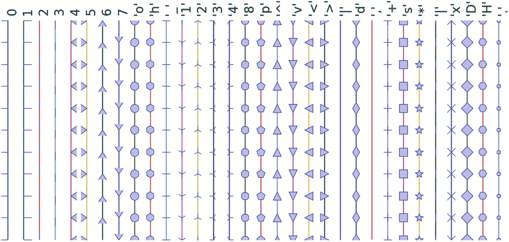

# 二、机器学习简介

机器学习(ML)是计算机科学的一个子领域，它是从人工智能(AI)中的*模式识别*和计算学习理论的研究中发展而来的。让我们看看 ML 定义的其他几个版本:

*   1959 年，计算机游戏、ML 和 AI 领域的美国先驱亚瑟·塞缪尔(Arthur Samuel)将机器学习定义为“在没有明确编程的情况下赋予计算机学习能力的研究领域。”

*   ML 是计算机科学的一个领域，涉及使用统计方法来创建程序，这些程序要么随着时间的推移提高性能，要么在大量数据中检测人类不太可能发现的模式。

前面的定义是正确的。简而言之，ML 是用于创建计算系统的算法和技术的集合，该计算系统从数据中学习以做出预测和推断。

ML 应用程序比比皆是。让我们看看发生在我们身边的一些最常见的 ML 日常应用。

*推荐系统:* YouTube 根据一个推荐系统，向它的每个用户推荐它认为该用户会感兴趣的视频。类似地，亚马逊和其他此类电子零售商通过查看客户的购买历史和大量产品库存来推荐客户感兴趣并可能购买的产品。

*垃圾邮件检测:*电子邮件服务提供商使用 ML 模型，该模型可以自动检测未经请求的邮件，并将其移动到垃圾邮件文件夹。

*潜在客户识别:*银行、保险公司和金融机构使用触发警报的 ML 模型，以便这些机构在适当的时间介入，开始用适当的优惠吸引客户，并说服他们尽早转换。这些模型观察用户在初始阶段的行为模式，并将其映射到所有用户的过去行为，试图确定哪些人会购买产品，哪些人不会。

在这一章中，我们将学习人工智能的历史和演变，以理解它在更广泛的人工智能家族中的位置。我们还将了解与 ML 并行存在的不同相关形式/术语，如统计学、数据或业务分析以及数据科学，以及它们存在的原因。还讨论了 ML 的高级类别，以及构建高效 ML 系统最常用的框架。我们还将简要地看一下用于数据分析的关键 ML 库。

## 历史和演变

ML 是 AI 的一个子集，所以让我们首先了解什么是 AI，以及 ML 在它更广泛的保护伞中的位置。人工智能是一个广义的术语，旨在使用数据为现有问题提供解决方案。它是在机器中复制甚至超越人类智能的科学和工程。这意味着观察或阅读、学习、感知和体验。

人工智能过程循环如图 [2-1](#Fig1) 所示。


图 2-1

人工智能过程循环

*   *观察*:使用数据识别模式。

*   *计划*:寻找所有可能的解决方案。

*   *优化*:从可能的解决方案列表中找到最优的解决方案。

*   *动作*:执行最优解。

*   *学习和适应*:结果是否给出了预期的结果？如果不是，那就适应。

人工智能过程循环可以使用智能代理来实现。机器人智能代理可以被定义为能够通过不同种类的传感器(摄像机、红外线等)感知其环境的组件。)，并将在环境内采取行动。在这里，机器人代理被设计成反映人类。我们有不同的感觉器官，如眼睛、耳朵、鼻子、舌头和皮肤来感知我们的环境，手、腿和嘴等器官是效应器，使我们能够根据我们的感知在我们的环境中采取行动

Stuart J. Russell 和 Peter Norvig 在《人工智能，一种现代方法》一书中讨论了关于设计代理的详细讨论。图 [2-2](#Fig2) 是一个样本图示。


图 2-2

机器人智能代理概念的描述，它通过传感器和效应器与环境交互

为了更好地理解这个概念，让我们看看为特定环境或用例设计的智能代理的组件(表 [2-1](#Tab1) )。考虑设计一个自动出租车司机。

表 2-1

智能代理组件示例

<colgroup><col class="tcol1 align-left"> <col class="tcol2 align-left"></colgroup> 
| 

智能代理的组件名

 | 

描述

 |
| --- | --- |
| 代理类型 | 出租车司机 |
| 目标 | 安全出行，合法，舒适出行，利润最大化，方便，快捷 |
| 环境 | 道路、交通、信号、标志、行人、顾客 |
| 感知 | 速度计、麦克风、全球定位系统、照相机、声纳、传感器 |
| 行动 | 转向、加速、刹车、与乘客交谈 |

出租车司机机器人智能代理将需要知道它的位置，它行进的方向，它行进的速度，以及路上还有什么！这些信息可以从诸如适当位置的可控摄像机、速度计、里程表和加速度计等感知设备获得。为了了解车辆和发动机的机械状态，需要电气系统传感器。此外，卫星全球定位系统(GPS)可以帮助提供相对于电子地图的准确位置信息，红外/声纳传感器可以检测到周围其他汽车或障碍物的距离。智能出租车司机代理可用的动作是通过踏板控制发动机加速和制动，以及控制方向的转向。还应该有一种与乘客互动或交谈的方式，以了解目的地或目标。

1950 年，著名的计算机科学家艾伦·图灵在他著名的论文《计算机械和智能》中提出了一个测试，被称为图灵测试该测试旨在提供一个令人满意的智能操作定义，要求一个人不能通过对机器和另一个人的问题的回答来区分机器和另一个人。

为了能够通过图灵测试，计算机应该具备以下能力:

*   *自然语言处理*:能够用选定的语言成功交流

*   *知识表示*:存储审讯前或审讯过程中提供的信息，有助于查找信息、做出决策和计划。这也被称为专家系统。

*   *自动推理*(语音):使用存储的知识图谱信息来回答问题，并在需要时得出新的结论

*   机器学习:分析数据，检测和推断有助于适应新环境的模式

*   *计算机视觉*:感知物体或分析图像以发现图像的特征

*   机器人技术(Robotics):能够操控环境并与之互动的设备。这意味着根据环境移动物体。

*   *计划、调度和优化*:计算制定决策计划或实现指定目标的方法，以及分析计划和设计的性能

前面提到的人工智能的七个能力领域已经经历了多年的研究和发展。虽然这些领域的许多术语可以互换使用，但我们可以从描述中看出它们的目标是不同的(图 [2-3](#Fig3) )。特别是，ML 的范围跨越了人工智能的所有七个领域。


图 2-3

人工智能领域

## 人工智能进化

让我们简单看一下 AI 的过去，现在，和未来。

*   *【ANI】**:*在特定任务上等于或超过人类智力或效率的机器智能。一个例子是 IBM 的 Watson，它需要主题或领域专家的密切参与，以提供数据/信息并评估其性能。

*   *人工通用智能(AGI)* *:* 有能力将智能应用于一个领域的任何问题，而不仅仅是一个特定问题的机器。自动驾驶汽车就是一个很好的例子。

*   *人工超级智能(ASI)* *:* 在几乎每个领域都比最优秀的人类大脑聪明得多的智力，一般智慧，社交技能，包括科学创造力。这里的关键主题是“不要模仿世界，要模仿思想。”

### 不同形式

ML 是唯一一门我们用数据来学习和用于预测/推断的学科吗？

要回答这个问题，让我们先来看看相对经常听到的其他几个关键术语的定义(维基百科)(不是一个详尽的列表):

*   *统计:*是对[数据](https://en.wikipedia.org/wiki/Data)的收集、[分析](https://en.wikipedia.org/wiki/Analysis)，解释、呈现、组织的研究。

*   *数据挖掘* *:* 它是[计算机科学](https://en.wikipedia.org/wiki/Computer_science)的一个交叉子领域。它是在大型[数据集](https://en.wikipedia.org/wiki/Data_set)(来自数据仓库)中发现模式的计算过程，涉及 [AI](https://en.wikipedia.org/wiki/Artificial_intelligence) 、 [ML](https://en.wikipedia.org/wiki/Machine_learning) 、[统计](https://en.wikipedia.org/wiki/Statistics)和[数据库系统](https://en.wikipedia.org/wiki/Database_system)的交集的方法。

*   *数据分析* *:* 对[数据](https://en.wikipedia.org/wiki/Data)进行检查、清理、转换和建模的过程，目的是发现有用的[信息](https://en.wikipedia.org/wiki/Information)，提出结论，支持决策。这也称为业务分析，在许多行业中广泛使用，允许公司/组织使用检查原始数据的科学，以得出有关该信息的结论，从而做出更好的业务决策。

*   *数据科学* *:* 数据科学是一个关于从各种形式的[数据](https://en.wikipedia.org/wiki/Data)中提取[知识](https://en.wikipedia.org/wiki/Knowledge)或洞察力的过程和系统的跨学科领域，无论是结构化的还是非结构化的，它是一些数据分析领域的延续，如[统计](https://en.wikipedia.org/wiki/Statistics)、ML、[数据挖掘](https://en.wikipedia.org/wiki/Data_mining)和[预测分析](https://en.wikipedia.org/wiki/Predictive_analytics)，类似于数据库 (KDD)中的[知识发现。](https://en.wikipedia.org/wiki/Knowledge_Discovery_in_Databases)

是的，从前面的定义中，我们清楚而惊讶地发现，ML 并不是我们使用数据从中学习并进一步用于预测/推理的唯一主题。在这些领域中，几乎相同的主题、工具和技术正在被讨论。这提出了一个真正的问题，为什么有这么多不同的名字，围绕着从数据中学习有很多重叠。这些有什么区别？

简而言之，所有这些实际上都是一样的。然而，在这三者之间存在着意义、表达或声音的细微差别。为了更好地理解，我们必须回顾这些领域的历史，仔细研究这些术语的起源、核心应用领域和演变。

#### 统计数字

德国学者 Gottfried Achenwall 在 18 世纪中叶(1749 年)引入了“统计学”一词。这个词在这一时期的使用意味着它与一个国家的行政职能有关，提供了反映其各个行政领域的定期现状的数字。统计这个词的起源可以追溯到拉丁语“Status”(“国务院”)或意大利语“Statista”(“statesman”或“political”)，也就是说，这些词的意思是“政治国家”或政府。莎士比亚在他的戏剧《哈姆雷特》(1602)中使用了 statist 一词。在过去，统治者使用统计学，指定分析关于国家的数据，象征着“国家科学”

在 19 世纪初，统计学获得了收集和分类数据的意义。苏格兰政治家约翰·辛克莱爵士于 1791 年在他的著作《苏格兰统计报告》中将其引入英语。因此，统计诞生的基本目的涉及政府和中央行政组织用来收集各州和地方人口普查数据的数据。

##### 频率论者

约翰·格兰特是第一批人口学家之一，也是我们的第一位生命统计学家。他在《死亡法案》中发表了他的观察结果(1662 年)，这项工作经常被引用为描述统计学的第一个实例。他用几个表格提供了大量的数据，这些数据很容易理解，这种技术现在被广泛称为描述统计学。在这本书里，我们注意到，每周死亡率统计首次出现在英国是在 1603 年的教区事务员大厅。我们可以从中了解到，1623 年，在伦敦的大约 50，000 次葬礼中，只有 28 次死于瘟疫。到 1632 年，这种疾病实际上已经暂时消失了，但在 1636 年再次出现，并在 1665 年再次成为可怕的流行病。这说明了描述性统计的基本性质是计数。他从所有教区的登记簿上，统计了死亡人数，以及死于瘟疫的人数。计算出来的数字往往太大而难以理解，所以他也通过使用比例而不是实际数字来简化它们。例如，1625 年有 51，758 人死亡，其中 35，417 人死于瘟疫。为了简化这一点，他写道，“我们发现瘟疫与整体的比例为 35 比 51。或者 7 到 10。”通过这些，他引入了一个概念，即相对比例往往比原始数字更有意义。我们通常将比例表示为 70%。这种基于样本数据的比例分布或频率的推测被称为“频率统计”统计假设检验是基于一个推理框架，其中你假设观察到的现象是由未知但固定的过程引起的。

##### 贝叶斯定理的

相比之下，贝叶斯统计(以托马斯·贝叶斯命名)基于可能与事件相关的条件，描述了[事件](https://en.wikipedia.org/wiki/Event_%2528probability_theory%2529)的[概率](https://en.wikipedia.org/wiki/Probability)。贝叶斯统计的核心是贝叶斯定理，它使用条件概率的概念来描述相关(相依)事件的结果概率。例如，如果特定疾病与年龄和生活方式有关，那么通过考虑一个人的年龄和生活方式来应用贝叶斯定理，可以更准确地评估该人患病的概率。

贝叶斯定理在数学上表述为以下等式:


其中 A 和 B 是[事件](https://en.wikipedia.org/wiki/Event_%2528probability_theory%2529)，P (B) ≠ 0。

*   P (A)和 P (B)是不考虑彼此的情况下观察 A 和 B 的[概率](https://en.wikipedia.org/wiki/Marginal_probability)。

*   P (A | B)，a [条件概率](https://en.wikipedia.org/wiki/Conditional_probability)，是假设 B 为真，观察到事件 A 的概率。

*   P (B | A)是假设 A 为真，观察到事件 B 的概率。

例如，一位医生知道睡眠不足 50%的时候会导致偏头痛。任何患者睡眠不足的先验概率为 10，000/50，000，任何患者偏头痛的先验概率为 300/1，000。如果一个病人有睡眠障碍，让我们应用贝叶斯定理来计算他/她患偏头痛的概率。

P(睡眠障碍|偏头痛)= P(偏头痛|睡眠障碍)÷P(偏头痛)/ P(睡眠障碍)

p(睡眠障碍|偏头痛)= . 5∫10000/50000/(300/1000)= 33%

在前面的场景中，睡眠障碍患者有 33%的几率会出现偏头痛问题。

##### 回归

统计学家的另一个重要里程碑是回归方法，该方法由勒让德于 1805 年和高斯于 1809 年发表。勒让德和高斯都将这种方法应用于从天文观测中确定天体围绕太阳运行的轨道的问题，这些天体主要是彗星，后来也包括新发现的小行星。高斯在 1821 年发表了最小二乘理论的进一步发展。回归分析是估计因素之间关系的基本统计过程。它包括许多分析和模拟各种因素的技术。这里主要关注的是一个相关因素和一个或多个独立因素之间的关系，也称为预测因素或变量或特征。我们将在 Scikit-learn 的 ML 基础中了解更多这方面的内容。

随着时间的推移，统计这个词背后的思想经历了非凡的转变。所提供的数据或信息的特征已经扩展到人类活动的所有领域。让我们来理解经常与统计学一起使用的两个术语之间的区别:1)数据和 2)方法。统计数据是事实的数字陈述，而统计方法处理的是在收集和分析这些数据时使用的原则和技术的信息。今天，统计学作为一门独立于数学的学科，与几乎所有的教育分支和人类活动都有着密切的联系，而这些都是用数字来表示的。在现代，它在质量和数量上都有无数不同的应用。在自然科学和社会科学、医学、商业和其他领域，个人和组织使用统计学来理解数据并做出明智的决策。统计学已经成为主干，并产生了许多其他学科，你会明白，因为你进一步阅读。

#### 数据挖掘

“数据库中的知识发现”(KDD)这个术语是 Gregory Piatetsky-Shapiro 在 1989 年提出的。与此同时，他共同创建了第一个名为 KDD 的工作室。术语“数据挖掘”是在 20 世纪 90 年代在数据库社区中引入的，但数据挖掘是一个历史稍长的领域的演变。

数据挖掘技术是对业务流程和产品开发进行研究的结果。这一演变始于业务数据首次存储在计算机的关系数据库中，并随着数据访问的改进而继续，并进一步产生了允许用户实时浏览其数据的新技术。在商业社会中，数据挖掘专注于在“正确的时间”为“正确的决策”提供“正确的数据”。这是通过在分布式多处理器计算机的帮助下实现大量数据收集和应用算法来实现的，以提供来自数据的实时洞察。

在“构建 ML 系统的框架”一节中，我们将进一步了解 KDD 提出的数据挖掘的五个阶段。

#### 数据分析

自从 19 世纪晚期美国机械工程师弗雷德里克·温斯洛·泰勒发起提高工业效率的管理运动以来，人们就知道分析在商业中的应用。制造业采用测量制造和装配线的速度，从而彻底改变了工业效率。但在 20 世纪 60 年代末，当计算机开始在组织的决策支持系统中发挥主导作用时，分析开始得到更多的关注。传统上，业务经理根据过去的经验或经验法则做出决策，或者有其他定性方面的决策。然而，随着数据仓库和企业资源规划(ERP)系统的发展，这种情况发生了变化。业务经理考虑数据，并依靠特别分析来确认他们基于经验/知识的日常和关键业务决策假设。这演变为用于决策过程的数据驱动的商业智能或商业分析，并被全球的组织和公司迅速采用。如今，各种规模的企业都在使用分析。在企业界，术语“业务分析”通常与“数据分析”互换使用。

企业需要对市场有一个整体的看法，以及一家公司如何在该市场中有效竞争，以增加他们的投资回报率(RoI)。这需要一个围绕各种可能的分析的强大分析环境。这些可以大致分为四种类型(图 [2-4](#Fig4) )。


图 2-4

数据分析类型

1.  描述性分析

2.  诊断分析

3.  预测分析

4.  规定性分析

##### 描述性分析

它们是描述过去的分析，告诉我们“发生了什么”详细说明，顾名思义，任何帮助我们将原始数据描述或总结成人类可以理解的东西的活动或方法都可以称为描述性分析。这些是有用的，因为它们允许我们从过去的行为中学习，并理解它们如何影响未来的结果。

统计数据，如计数、最小值、最大值、总和、平均值、百分比、百分比变化等的算术运算。属于这一类。描述性分析的常见示例是公司的商业智能报告，这些报告涵盖组织的不同方面，以提供关于公司的生产、运营、销售、收入、财务、库存、客户和市场份额的历史回顾。

##### 诊断分析

这是描述性分析的下一步，描述性分析检查数据或信息来回答“为什么会发生”这个问题它的特点是技术，如钻取，数据发现，数据挖掘，相关性和因果关系。它基本上提供了对您想要解决的问题的有限部分的非常好的理解。然而，这是一项非常费力的工作，因为需要大量的人工干预来执行下钻或数据挖掘，以更深入地了解数据，从而了解为什么会发生某种情况或根本原因。它侧重于确定促成结果的因素和事件。

例如，假设一家零售公司强硬路线(通常包括家具、器具、工具、电子产品等的类别。)某些商店的销售业绩不达标，产品线经理希望了解根本原因。在这种情况下，产品经理可能希望根据产品线在商店中的位置(哪个楼层、角落、过道)，回顾不同商店中产品线销售的过去趋势和模式。经理可能还想了解与它密切相关的其他产品之间是否存在因果关系。他们可能会分别或同时考虑不同的外部因素，如人口统计、季节和宏观经济因素，以基于结论性解释来定义相关变量的相对排名。要做到这一点，没有一套明确定义的有序步骤，它取决于进行分析的人的经验水平和思维方式。

主题专家的大量参与，可能需要直观地展示数据/信息，以便更好地理解。有太多的工具可供使用，如 Excel、Tableau、QlikView、Spotfire 和 D3，这些工具支持诊断分析。

##### 预测分析

它是根据过去或历史模式对未知未来事件的可能性做出预测或估计的能力。预测分析将让我们洞察“可能会发生什么？”它使用来自数据挖掘、统计、建模、ML 和 AI 的许多技术来分析当前数据，以对未来做出预测。

重要的是要记住，预测分析的基础是基于概率，统计算法的预测质量在很大程度上取决于输入数据的质量。因此，这些算法不能 100%确定地预测未来。然而，公司可以使用这些统计数据来预测未来可能发生的事情的概率，并且将这些结果与商业知识一起考虑应该会导致有利可图的决策。

ML 非常注重预测分析，我们将来自不同来源的历史数据结合起来，如组织 ERP、CRM(客户关系管理)、POS(销售点)、员工数据和市场研究数据。这些数据用于识别模式并应用统计模型/算法来捕捉各种数据集之间的关系，并进一步预测事件的可能性。

预测性分析的一些示例包括天气预报、垃圾电子邮件识别、欺诈检测、客户购买产品或续保的概率、预测某人患已知疾病的几率等。

##### 规定性分析

它是数据或业务分析领域，致力于为给定情况找到最佳行动方案。说明性分析与其他三种形式的分析相关:描述性、诊断性和预测性。规范分析的目的是衡量未来决策的效果，使决策者在实际决策之前预见可能的结果。说明性分析系统是业务规则和 ML 算法的组合，这些工具可以应用于历史和实时数据馈送。这里的关键目标不仅仅是预测将会发生什么，还要预测为什么会发生，通过预测基于不同情景的多种未来，使公司能够根据他们的行动评估可能的结果。

说明性分析的一个例子是在设计环境中使用模拟来帮助用户识别不同配置下的系统行为。这可确保满足所有关键性能指标，如等待时间、队列长度等。另一个例子是在给定约束和目标函数的情况下，使用线性或非线性规划来确定业务的最佳结果。

#### 数据科学

1960 年，彼得·诺尔在他的出版物*计算机方法简明概览*中使用了“数据科学”一词，这是关于当代数据处理方法在广泛应用中的情况。1991 年，计算机科学家蒂姆·伯纳斯·李在“新闻组小组”的一篇文章中宣布了我们今天所知的万维网的诞生，他提出了一个世界范围内互联的数据网络的规范，任何地方的任何人都可以访问。随着时间的推移，Web/Internet 每年增长十倍，并且已经成为提供各种信息和通信设施的全球计算机网络，包括使用标准化通信协议的互连网络。此外，存储系统也在发展，数字存储变得比纸质存储更具成本效益。

截至 2008 年，全世界的服务器处理了 9.57 泽塔字节(9.57 万亿吉字节)的信息，这相当于每人每天 12 吉字节的信息，根据“[有多少信息？2010 年企业服务器信息报告](http://hmi.ucsd.edu/howmuchinfo_research_report_consum_2010.php)

互联网的兴起极大地增加了结构化、半结构化和非结构化数据的数量。这导致了术语“大数据”的诞生，其特征是三个 v(图 [2-5](#Fig5) ):数量、多样性和速度。需要特殊的工具和系统来处理高速产生的种类繁多(文本、数字、音频、视频等)的大量数据。


图 2-5

大数据的三个 v(来源: [`http://blog.sqlauthority.com`](http://blog.sqlauthority.com) )

大数据革命影响了术语“数据科学”的诞生虽然数据科学这个术语从 1960 年就存在了，但它变得流行起来，并归功于脸书和 LinkedIn 的杰夫·哈默巴赫尔和 DJ·帕蒂尔，因为他们精心选择了它，试图描述他们的团队和工作(根据 DJ·帕蒂尔在 2008 年出版的*建立数据科学团队*)。他们选定了“数据科学家”，于是一个时髦的词诞生了。图 [2-6](#Fig6) 很好地解释了 Drew Conway 在 2010 年提出的数据科学基本技能集。


图 2-6

德鲁·康威的数据科学维恩图

执行数据科学项目需要三项关键技能:

*   编程或黑客技能

*   数学和统计学

*   范围内给定领域的业务或主题专业知识

注意 ML 源于 AI。它不是数据科学的一个分支，而是仅仅使用 ML 作为工具。

#### 统计与数据挖掘、数据分析与数据科学

我们可以从关于从数据中学习的主题的历史和演变中了解到，尽管他们使用相同的方法，但他们作为不同的文化进化，因此他们有不同的历史、命名、符号和哲学观点(图 [2-7](#Fig7) )。


图 2-7

从数据进化中学习

所有形式一起:通往终极 AI 的道路(图 [2-8](#Fig8) )。


图 2-8

所有形式一起:通向终极人工智能的道路

## 机器学习类别

在高层次上，基于期望的输出和产生输出所需的输入类型，ML 任务可以分为三组(图 [2-9](#Fig9) )。


图 2-9

ML 的类型

### 监督学习

ML 算法提供有足够大的相应于输出或事件/类的示例输入数据集，通常与相应领域的主题专家协商准备。该算法的目标是学习数据中的模式，并构建一组通用规则来将输入映射到类或事件。

概括地说，有两种常用的监督学习算法:

*   *回归*:待预测的输出是与给定输入数据集相关的连续数。示例用例有零售销售预测、每班所需员工数量预测、零售店所需停车场空间数量预测、客户信用评分预测等。

*   *分类*:预测的输出是事件/类的实际或概率，预测的类数可以是两个或两个以上。该算法应该从历史数据中学习每个类的相关输入中的模式，并且能够在考虑它们的输入的情况下，预测未来看不见的类或事件。一个示例用例是垃圾邮件过滤，其中预期的输出是将电子邮件分类为垃圾邮件或非垃圾邮件。

构建监督学习 ML 模型有三个阶段:

1.  *训练*:将为算法提供具有映射输出的历史输入数据。该算法将学习每个输出的输入数据中的模式，并将其表示为一个统计方程，通常也称为模型。

2.  *测试或验证*:在这一阶段，对训练好的模型的性能进行评估，通常是通过将其应用于数据集(不是训练的一部分)来预测类或事件。

3.  n:这里我们将训练好的模型应用到一个数据集，这个数据集既不是训练的一部分，也不是测试的一部分。该预测将用于推动业务决策。

### 无监督学习

有些情况下，对于历史数据，所需的输出类/事件是未知的。这种情况的目的是研究输入数据集中的模式，以便更好地理解和识别可以分组到特定类或事件中的相似模式。由于这些类型的算法事先不需要主题专家的任何干预，因此它们被称为无监督学习。

以下是一些无监督学习的例子:

*   *聚类*:假设对于给定的数据集，事先不知道类。这里的目标是将输入数据集分成相关项目的逻辑组。一些例子是对相似的新闻文章进行分组，或者根据客户的个人资料对相似的客户进行分组。

*   *降维*:这里的目标是通过将大型输入数据集映射到一个较低维度的空间来简化它们。例如，对大规模数据集进行分析是非常计算密集型的；因此，为了简化，您可能希望找到持有重要百分比(比如 95%)信息的关键变量，并且只使用*它们*进行分析。

### 强化学习

强化学习算法的基本目标是将情境映射到产生最大最终回报的行动。在映射动作时，算法不应该只考虑眼前的奖励，还应该考虑下一个和所有后续的奖励。例如，一个玩游戏或驾驶汽车的程序将不得不不断地与一个动态的环境交互，在这个环境中它被期望达到某个目标。我们将在第 [6](6.html) 章中详细了解这一点。

强化学习技术的例子有:

*   马尔可夫决策过程

*   q 学习

*   时间差分方法

*   蒙特卡罗方法

## 构建 ML 系统的框架

随着时间的推移，数据挖掘领域经历了巨大的扩展。许多专家做了大量的工作来标准化方法，并为不断增长的、多样化的和迭代的构建 ML 系统的过程定义最佳实践。在过去的十年中，由于其从大量数据中提取洞察力的能力，ML 领域对于不同的行业、企业和组织变得非常重要。以前，这些数据对于了解趋势/模式和预测有助于推动业务决策以获取利润的可能性毫无用处或未得到充分利用。最终，浪费丰富的业务数据源所包含的有价值的信息的风险增加了。这需要使用适当的技术来获得有用的知识，ML 领域在 20 世纪 80 年代初已经出现，并且已经有了很大的发展。随着这个领域的出现，不同的过程框架被引入。这些过程框架指导并承载着 ML 任务及其应用。人们努力使用数据挖掘过程框架来指导对大量数据进行数据挖掘。

主要是三种数据挖掘过程框架已经被数据挖掘专家/研究人员最流行和最广泛地实践来构建 ML 系统。这些模型是:

*   数据库中的知识发现(KDD)过程模型

*   数据挖掘的跨行业标准流程(CRISP-DM)

*   取样、探索、修改、建模和评估(SEMMA)

### 数据库中的知识发现

它是指从数据中发现有用知识的整个过程，由 Fayyad 等人于 1996 年提出。它集成了多种数据管理技术，如数据仓库、统计 ML、决策支持、可视化和并行计算。顾名思义，KDD 以从数据中发现知识的整个过程为中心，涵盖了数据的整个生命周期。这包括如何存储数据，如何访问数据，如何有效地将算法扩展到庞大的数据集，以及如何解释和可视化结果。

图 [2-10](#Fig10) 显示了 KDD 的五个阶段，将在以下章节中详细介绍。


图 2-10

KDD 数据挖掘流程

#### 选择

*在这一步骤中，对可能来自许多不同和异构来源的目标数据进行 s* 选择和整合。然后从数据库中检索与分析任务相关的变量和数据样本*的正确子集。*

#### 预处理

真实世界的数据集通常是不完整的。也就是说，属性值会缺失、有噪声(错误和异常值)和不一致，这意味着收集的数据之间存在差异。不干净的数据会混淆挖掘过程，并导致不可靠和无效的输出。此外，对大量此类污染数据执行复杂的分析和挖掘可能需要很长时间。预处理和清理应该通过增强实际的挖掘过程来提高数据和挖掘结果的质量。要采取的行动包括:

*   收集建模所需的数据或信息

*   异常值处理或噪声去除

*   使用先前的领域知识来消除数据中的不一致和重复

*   选择处理缺失数据的策略

#### 转换

在这一步中，数据被转换或整合成适合挖掘的形式，也就是说，根据任务的目标找到有用的特征来表示数据。比如在高维空间或者大量属性中，物体之间的距离可能会变得没有意义。因此，可以使用降维和变换方法来减少所考虑的变量的有效数量，或者找到数据的不变表示。有多种数据转换技术:

*   平滑(宁滨、聚类、回归等。

*   聚合

*   一般化，其中原始数据对象可以被更高级别的概念所替代

*   归一化，包括最小-最大缩放或 z 值

*   从现有属性构造特征主成分分析(PCA)，多维标度(MDS)

*   应用数据简化技术来产生数据的简化表示(紧密保持原始数据完整性的较小体积)

*   压缩，例如小波、PCA、聚类

#### 数据挖掘

在这个步骤中，应用 ML 算法来提取数据模式。探索/总结方法，如均值、中值、众数、标准差、类别/概念描述和低维图的图形技术，可用于理解数据。分类或回归等预测模型可用于预测事件或未来值。聚类分析可以用来了解相似群体的存在。选择用于模型和模式搜索的最合适的方法。

#### 解释/评估

这一步的重点是解释主题模式，让用户能够理解它们，比如总结和可视化。挖掘的模式或模型被解释。模式是一种局部结构，它只对变量所跨越的空间的有限区域进行陈述。模型是对测量空间中的任意点进行陈述的全局结构，例如，Y = mX+C(线性模型)。

### 数据挖掘的跨行业标准流程

它通常以首字母缩写 CRISP-DM 为人所知。它是由[欧洲信息技术研究战略计划](https://en.wikipedia.org/wiki/European_Strategic_Program_on_Research_in_Information_Technology)倡议建立的，旨在创建一种不依赖于领域的公正方法。这是一个巩固[数据挖掘](https://en.wikipedia.org/wiki/Data_mining)过程最佳实践的努力，由专家来处理数据挖掘问题。它于 1996 年构思，于 1999 年首次发布，并在 2002 年、2004 年和 2007 年进行的民意调查中被报道为数据挖掘/预测分析项目的领先方法。在 2006 年和 2008 年之间有一个更新 CRISP-DM 的计划，但是那个更新没有发生，并且今天最初的 CRISP-DM.org 网站不再活跃。

这个框架是一系列理想化的活动。这是一个迭代的过程，许多任务回溯到以前的任务，并重复某些动作以带来更大的清晰度。有六个主要阶段，如图 [2-11](#Fig11) 所示，并在以下章节中讨论:


图 2-11

显示 CRISP-DM 六个阶段之间关系的流程图

*   商业理解

*   数据理解

*   数据准备

*   建模

*   估价

*   部署

#### 阶段 1:业务理解

顾名思义，这个阶段的重点是从业务角度理解整个项目的目标和期望。这些目标被转换为数据挖掘或 ML 问题定义，并且围绕数据需求、企业所有者输入和结果性能评估度量来设计行动计划。

#### 阶段 2:数据理解

在这一阶段，收集在前一阶段确定为需求的初始数据。开展活动是为了了解数据缺口或数据与手头对象的相关性、任何数据质量问题，以及对数据的初步洞察，以提出适当的假设。这个阶段的结果将被迭代地呈现给业务，以使业务理解和项目目标更加清晰。

#### 阶段 3:数据准备

这个阶段是关于清理数据的，以便为模型构建阶段做好准备。清理数据可能涉及填补上一步中的已知数据缺口、缺失值处理、识别重要要素、应用变换以及在适用的情况下创建新的相关要素。这是最重要的阶段之一，因为模型的准确性将在很大程度上取决于输入算法以学习模式的数据质量。

#### 阶段 4:建模

有多种 ML 算法可用于解决给定的问题。因此，各种适当的 ML 算法被应用于干净的数据集，并且它们的参数被调整到最佳的可能值。记录每个应用模型的模型性能。

#### 第五阶段:评估

在这一阶段，将在被确定为具有高准确性的所有不同模型中进行基准测试。该模型将根据不作为训练一部分的数据进行测试，以评估其性能一致性。将根据阶段 1 中确定的业务需求验证结果。来自企业的主题专家将参与进来，以确保模型结果是准确的，并且可以按照项目目标的要求使用。

#### 第 6 阶段:部署

这个阶段的重点是模型输出的可用性。因此，由主题专家签署的最终模型将被实现，模型输出的消费者将被培训如何解释或使用它来做出在业务理解阶段定义的业务决策。实现可以是生成一个预测报告并与消费者共享。此外，将根据业务需求安排定期的模型培训和预测时间。

## SEMMA(取样、探索、修改、建模、评估)

SEMMA 是在 SAS Enterprise Miner 中构建 ML 模型的连续步骤，SAS Enterprise Miner 是 SAS Institute Inc .的产品，SAS Institute Inc .是商业、统计和商业智能软件的最大生产商之一。这些连续的步骤指导了 ML 系统的开发。让我们来看看这五个连续的步骤，以便更好地理解。

### 样品

这一步是从为建立模型而提供的大数据集中选择正确体积的子集。这将有助于高效地构建模型。当计算能力昂贵时，这是一个著名的实践；然而，它仍然在实践中。所选的数据子集应该是最初收集的整个数据集的实际表示，这意味着它应该包含足够的信息以供检索。在这个阶段，数据还被划分用于训练和验证。

### 探索

在这一阶段，开展活动以了解数据差距和变量之间的关系。两个关键活动是单变量和多变量分析。在单变量分析中，每个变量被单独检查以了解其分布，而在多变量分析中，每个变量之间的关系被探究。数据可视化大量用于帮助更好地理解数据。

### 修改

在这一阶段，需要清理变量。基于需求，通过将业务逻辑应用于现有功能来创建新的派生功能。如有必要，对变量进行转换。这个阶段的结果是一个干净的数据集，可以传递给 ML 算法来构建模型。

### 模型

在这个阶段，各种建模或数据挖掘技术被应用于预处理的数据，以根据期望的结果对它们的性能进行基准测试。

### 评定

这是最后一个阶段。在这里，模型性能根据测试数据(不用于模型训练)进行评估，以确保可靠性和业务有用性。

KDD 是三个框架中最古老的。CRISP-DM 和 SEMMA 似乎是 KDD 进程的实际实现。CRISP-DM 更加完整，因为已经清楚地定义了跨阶段和阶段之间的知识迭代流。此外，它涵盖了从商业世界的角度建立一个可靠的 ML 系统的所有领域。在 SEMMA 的取样阶段，重要的是你要真正了解业务的各个方面，以确保取样数据保留最大限度的信息。然而，最近的重大创新已经降低了数据存储和计算能力的成本，这使我们能够对整个数据有效地应用 ML 算法，几乎消除了采样的需要。

我们可以看到，一般来说，所有三个框架都涵盖了核心阶段，它们之间没有很大的区别(图 [2-12](#Fig12) )。总的来说，这些过程指导我们如何将数据挖掘技术应用到实际场景中。一般来说，大多数研究人员和数据挖掘专家遵循 KDD 和克里斯普-DM 过程模型，因为它更完整和准确。我个人建议在商业环境中使用 CRISP-DM，因为它涵盖了端到端的商业活动和构建 ML 系统的生命周期。


图 2-12

数据挖掘框架综述

## 机器学习 Python 包

有大量的开源库可以用来促进实用的 ML。这些主要被称为科学 Python 库，通常在执行基本的 ML 任务时使用。在高层次上，我们可以根据它们的用途/目的将这些库分为数据分析和核心 ML 库。

*数据分析:*这些软件包为我们提供了执行数据预处理和转换所必需的数学和科学功能。

核心机器学习包:这些包为我们提供了所有必要的 ML 算法和功能，可以应用于给定的数据集来提取模式。

### 数据分析包

有四个最广泛用于数据分析的关键包:

*   NumPy

*   我的天啊

*   Matplotlib

*   熊猫

Pandas、NumPy 和 Matplotlib 在几乎所有的数据分析任务中都起着主要的作用并有使用范围(图 [2-13](#Fig13) )。所以在这一章中，我们将尽可能地关注与这三个包相关的用法或概念。SciPy 是对 NumPy 库的补充，拥有多种关键的高级科学和工程模块；然而，这些功能的使用很大程度上取决于用例。因此，我们将在接下来的章节中尽可能地触及或强调一些有用的功能。


图 2-13

数据分析包

### 注意

为了简明起见，我们将只通过简短的介绍和代码实现来涵盖每个库中的关键概念。您可以随时参考这些软件包的官方用户文档，这些文档由开发人员社区精心设计，涵盖了更多的深度。

#### NumPy

NumPy 是 Python 中科学计算的核心库。它提供了一个高性能的多维数组对象和工具来处理这些数组。它是数字包的继承者。2005 年，Travis Oliphant 通过将竞争对手 Numarray 的功能整合到 Numeric 中，并进行大量修改，创造了 NumPy。我认为这些概念和代码示例在很大程度上已经在他的书*NumPy*中以最简单的形式解释过了。在这里，我们将只看一些关键的数字概念，这些概念是必须的，或者是与 ML 相关的知识。

##### 排列

NumPy 数组是相似数据类型值的集合，由非负数元组索引。数组的秩是维度的数量，数组的形状是一组数字，给出了数组在每个维度上的大小。

我们可以从嵌套的 Python 列表中初始化 NumPy 数组，并使用方括号访问元素(清单 [2-1](#PC1) )。

```py
import numpy as np

# Create a rank 1 array
a = np.array([0, 1, 2])
print (type(a))

# this will print (the dimension of the array
print (a.shape)
print (a[0])
print (a[1])
print (a[2])

# Change an element of the array
a[0] = 5
print (a)
# ----output-----
<class 'numpy.ndarray'>
(3,)
0
1
2
[5 1 2]

# Create a rank 2 array
b = np.array([[0,1,2],[3,4,5]])
print (b.shape)
print (b)
print (b[0, 0], b[0, 1], b[1, 0])
----output-----
(2, 3)
[[0 1 2]
 [3 4 5]]
0 1 3

Listing 2-1Example Code for Initializing NumPy Array

```

##### 创建 NumPy 数组

NumPy 还提供了许多内置函数来创建数组。最好的学习方法是通过例子(清单 [2-2](#PC2) )，所以让我们直接进入代码。

```py
# Create a 3x3 array of all zeros
a = np.zeros((3,3))
print (a)
----- output -----
[[ 0\.  0\.  0.]
 [ 0\.  0\.  0.]
 [ 0\.  0\.  0.]]

# Create a 2x2 array of all ones
b = np.ones((2,2))
print (b)
---- output ----
[[ 1\.  1.]
 [ 1\.  1.]]

# Create a 3x3 constant array
c = np.full((3,3), 7)
print (c)
---- output ----
[[7 7 7]
 [7 7 7]
 [7 7 7]]

# Create a 3x3 array filled with random values
d = np.random.random((3,3))
print (d)
---- output ----
[[0.67920283 0.54527415 0.89605908]
 [0.73966284 0.42214293 0.10170252]
 [0.26798364 0.07364324 0.260853  ]]

# Create a 3x3 identity matrix
e = np.eye(3)
print (e)
---- output ----
[[ 1\.  0\.  0.]
 [ 0\.  1\.  0.]
 [ 0\.  0\.  1.]]

# convert list to array
f = np.array([2, 3, 1, 0])
print (f)
---- output ----

[2 3 1 0]

# arange() will create arrays with regularly incrementing values
g = np.arange(20)
print (g)
---- output ----
[ 0  1  2  3  4  5  6  7  8  9 10 11 12 13 14 15 16 17 18 19]

# note mix of tuple and lists
h = np.array([[0, 1,2.0],[0,0,0],(1+1j,3.,2.)])
print (h)
---- output ----
[[ 0.+0.j  1.+0.j  2.+0.j]
 [ 0.+0.j  0.+0.j  0.+0.j]
 [ 1.+1.j  3.+0.j  2.+0.j]]

# create an array of range with float data type
i = np.arange(1, 8, dtype=np.float)
print (i)
---- output ----
[ 1\.  2\.  3\.  4\.  5\.  6\.  7.]

# linspace() will create arrays with a specified number of items which are
# spaced equally between the specified beginning and end values
j = np.linspace(2., 4., 5)
print (j)
---- output ----
[ 2\.   2.5  3\.   3.5  4\. ]

# indices() will create a set of arrays

stacked as a one-higher
# dimensioned array, one per dimension with each representing variation
# in that dimension
k = np.indices((2,2))
print (k)
---- output ----
[[[0 0]
  [1 1]]

 [[0 1]
  [0 1]]]

Listing 2-2Creating NumPy Array

```

##### 数据类型

该数组是同一数据类型的项的集合。NumPy 支持并提供了一个内置函数来构造一个带有可选参数的数组，以显式指定所需的数据类型(清单 [2-3](#PC3) )。

```py
# Let numpy choose the data type
x = np.array([0, 1])
y = np.array([2.0, 3.0])

# Force a particular data type
z = np.array([5, 6], dtype=np.int64)

print (x.dtype, y.dtype, z.dtype)
---- output ----
int32 float64 int64

Listing 2-3NumPy Data Types

```

##### 数组索引

NumPy 提供了几种方法来索引数组。标准 Python x[obj]语法可用于索引 NumPyarray，其中 x 是数组，obj 是选择。

有三种索引可供使用:

*   现场访问

*   基本切片

*   高级索引

##### 现场访问

如果 ndarray 对象是一个结构化数组，可以通过用字符串索引数组来访问数组的字段，就像字典一样。索引 x['field-name']返回一个与 x 形状相同的数组的新视图，除非该字段是一个子数组，但数据类型为 x.dtype['field-name']，并且只包含指定字段中的部分数据(清单 [2-4](#PC4) )。

```py
x = np.zeros((3,3), dtype=[('a', np.int32), ('b', np.float64, (3,3))])
print ("x['a'].shape: ",x['a'].shape)
print ("x['a'].dtype: ", x['a'].dtype)
print ("x['b'].shape: ", x['b'].shape)
print ("x['b'].dtype: ", x['b'].dtype)
----output-----
x['a'].shape:  (3, 3)
x['a'].dtype:  int32
x['b'].shape:  (3, 3, 3, 3)
x['b'].dtype:  float64

Listing 2-4Field Access

```

##### 基本切片

NumPy 数组可以切片，类似于列表。您必须为数组的每个维度指定一个切片，因为数组可能是多维的。

基本的切片语法是 i: j: k，其中 I 是起始索引，j 是终止索引，k 是步长，k 不等于 0。这选择了相应维度中的 m 个元素，索引值为 I，i + k，...，i + (m - 1) k，其中 m = q + (r 不等于 0)而 q 和 r 是 j - i 除以 k 得到的商和余数:j - i = q k + r，这样 i + (m - 1) k < j. Refer to Listings [2-5](#PC5) 到 [2-10](#PC10) 例如基本切片上的代码。

```py
x = np.array([5, 6, 7, 8, 9])
x[1:7:2]
---- output ----
array([6, 8])

Listing 2-5Basic Slicing

```

负 k 使步进朝向更小的指数。负的 I 和 j 被解释为 n + i 和 n + j，其中 n 是相应维中的元素数。

```py
print (x[-2:5])
print (x[-1:1:-1])
# ---- output ----
[8 9]
[9 8 7]

Listing 2-6Basic Slicing (continued)

```

如果 n 是被切片的维度中的项目数，如果没有给定 I，那么对于 k > 0，它默认为 0；对于 k < 0\. If j is not given it defaults to n for k > 0，它默认为 n- 1；对于 k < 0，它默认为-1。如果没有给出 k，则默认为 1。请注意::与:相同，表示选择沿此轴的所有索引。

```py
x[4:]
# ---- output ----
array([9])

Listing 2-7Basic Slicing (continued)

```

如果选择元组中的对象数小于 N，则:被假定用于任何后续维度。

```py
y = np.array([[[1],[2],[3]], [[4],[5],[6]]])
print ("Shape of y: ", y.shape)
y[1:3]
# ---- output ----
Shape of y:  (2, 3, 1)

Listing 2-8Basic Slicing (continued)

```

省略号扩展到:对象的数量，需要生成与 x.ndim 长度相同的选择元组。可能只存在一个省略号。

```py
x[...,0]
---- output ----
array(5)

# Create a rank 2 array with shape (3, 4)
a = np.array([[5,6,7,8], [1,2,3,4], [9,10,11,12]])
print ("Array a:", a)

# Use slicing to pull out the subarray consisting of the first 2 rows
# and columns 1 and 2; b is the following array of shape (2, 2):
# [[2 3]
#  [6 7]]
b = a[:2, 1:3]
print ("Array b:", b)
---- output ----
Array a:  [[ 5  6  7  8]
 [ 1  2  3  4]
 [ 9 10 11 12]]
Array b:  [[6 7]
 [2 3]]

Listing 2-9Basic Slicing (continued)

```

数组的切片是相同数据的视图，因此修改它将会修改原始数组。

```py
print (a[0, 1])
b[0, 0] = 77
print(a[0, 1])
---- output ----
6
77

Listing 2-10Basic Slicing (continued)

```

可以以两种方式访问中间行数组:1)片连同整数索引将产生较低等级的数组，以及 2)仅使用片将产生相同等级的数组。

示例代码:

```py
# Create the following rank 2 array with shape (3, 4)
a = np.array([[1,2,3,4], [5,6,7,8], [9,10,11,12]])

row_r1 = a[1,:]# Rank 1 view of the second row of a
row_r2 = a[1:2,:]# Rank 2 view of the second row of a
print (row_r1, row_r1.shape)
print (row_r2, row_r2.shape)
---- output ----
[5 6 7 8] (4,)
[[5 6 7 8]] (1, 4)

# We can make the same distinction when accessing columns of an array:
col_r1 = a[:, 1]
col_r2 = a[:, 1:2]
print (col_r1, col_r1.shape)
print (col_r2, col_r2.shape)
---- output ----
[ 2  6 10] (3,)
[[ 2]
 [ 6]
 [10]] (3, 1)

```

##### 高级索引

有两种高级索引:整数数组和布尔数组。

整数数组索引允许您将随机数组转换成另一个新数组，如清单 [2-11](#PC12) 所示。

```py
a = np.array([[1,2], [3, 4]])

# An example of integer array indexing.
# The returned array will have shape (2,) and
print (a[[0, 1], [0, 1]])

# The preceding example of integer array indexing is equivalent to this:
print (np.array([a[0, 0], a[1, 1]]))
--- output ----
[1 4]
[1 4]

# When using integer array indexing, you can reuse the same
# element from the source array:
print (a[[0, 0], [1, 1]])

# Equivalent to the previous integer array indexing example
print (np.array([a[0, 1], a[0, 1]]))
---- output ----
[2 2]
[2 2]

Listing 2-11Advanced Indexing

```

布尔数组索引对于从一个数组中挑选一个随机元素很有用，这通常用于过滤满足给定条件的元素(清单 [2-12](#PC13) )。

```py
a = np.array([[1,2], [3, 4], [5, 6]])
# Find the elements of a that are bigger than 2
print (a > 2)

# to get the actual value
print (a[a > 2])
---- output ----
[[False False]
 [ True  True]
 [ True  True]]
[3 4 5 6]

Listing 2-12Boolean Array Indexing

```

##### 数组数学

在 NumPy 中，基本的数学函数可以作为运算符使用，也可以作为函数使用。它对数组进行元素操作(清单 [2-13](#PC14) )。

```py
import numpy as np

x=np.array([[1,2],[3,4],[5,6]])
y=np.array([[7,8],[9,10],[11,12]])

# Elementwise sum; both produce the array
print (x+y)
print (np.add(x, y))
---- output ----
[[ 8 10]
 [12 14]
 [16 18]]
[[ 8 10]
 [12 14]
 [16 18]]

# Elementwise difference; both produce the array
print(x-y)
print (np.subtract(x, y))
---- output ----
[[-6 -6]
 [-6 -6]
 [-6 -6]]
[[-6 -6]
 [-6 -6]
 [-6 -6]]

# Elementwise product; both produce the array
print (x∗y)
print (np.multiply(x, y))
---- output ----
[[ 7 16]
 [27 40]
 [55 72]]
[[ 7 16]
 [27 40]
 [55 72]]

# Elementwise division

; both produce the array
print (x/y)
print (np.divide(x, y))
---- output ----
[[0.14285714 0.25      ]
 [0.33333333 0.4       ]
 [0.45454545 0.5       ]]
[[0.14285714 0.25      ]
 [0.33333333 0.4       ]
 [0.45454545 0.5       ]]

# Elementwise square root; produces the array
print(np.sqrt(x))
---- output ----
[[1\.         1.41421356]
 [1.73205081 2\.        ]
 [2.23606798 2.44948974]]

Listing 2-13
Array Math

```

我们可以使用" dot "函数来计算向量的内积或者矩阵相乘或者向量乘矩阵，如清单 [2-14](#PC15) 中的代码示例所示。

```py
x = np.array([[1,2],[3,4]])
y = np.array([[5,6],[7,8]])

a = np.array([9,10])
b = np.array([11, 12])

# Inner product of vectors; both produce 219
print (a.dot(b))
print (np.dot(a, b))
---- output ----
219
219

# Matrix / vector product; both produce the rank 1 array [29 67]
print (x.dot(a))
print (np.dot(x, a))
---- output ----
[29 67]
[29 67]

# Matrix / matrix product; both produce the rank 2 array
print (x.dot(y))
print (np.dot(x, y))
---- output ----
[[19 22]
 [43 50]]
[[19 22]
 [43 50]]

Listing 2-14Array Math (continued)

```

NumPy 为在数组上执行计算提供了许多有用的函数。其中最有用的是“和”；示例代码如清单 [2-15](#PC16) 所示。

```py
x = np.array([[1,2],[3,4]])

# Compute sum of all elements
print (np.sum(x))
# Compute sum of each column
print (np.sum(x, axis=0))
# Compute sum of each row
print (np.sum(x, axis=1))
---- output ----
10
[4 6]
[3 7]

Listing 2-15Sum Function

```

转置是经常在矩阵上执行的常见操作之一，可以使用数组对象的 T 属性来实现。代码示例请参考清单 [2-16](#PC17) 。

```py
x = np.array([[1,2],[3,4]])
print (x)
print (x.T)
---- output ----
[[1 2]
 [3 4]]
[[1 3]
 [2 4]]

# Note that taking the transpose of a rank 1 array does nothing:
v = np.array([1,2,3])
print (v)
print (v.T)
---- output ----
[1 2 3]
[1 2 3]

Listing 2-16Transpose Function

```

##### 广播

广播使得算术运算能够在不同形状的阵列之间执行。让我们看一个简单的例子(清单 [2-17](#PC18) )向矩阵的每一行添加一个常量向量。

```py
# create a matrix
a = np.array([[1,2,3], [4,5,6], [7,8,9]])
# create a vector
v = np.array([1, 0, 1])

# Create an empty matrix with the same shape as a
b = np.empty_like(a)

# Add the vector v to each row of the matrix x with an explicit loop
for i in range(3):
    b[i, :] = a[i, :] + v

print (b)
---- output ----
[[ 2  2  4]
 [ 5  5  7]
 [ 8  8 10]]

Listing 2-17Broadcasting

```

通过 Python 中的循环对大型矩阵执行上述操作可能会很慢。让我们看看清单 [2-18](#PC19) 中显示的另一种方法。

```py
# Stack 3 copies of v on top of each other
vv = np.tile(v, (3, 1))
print (vv)
---- output ----
[[1 0 1]
 [1 0 1]
 [1 0 1]]

# Add x and vv elementwise
b = a + vv
print (b)
---- output ----
[[ 2  2  4]
 [ 5  5  7]
 [ 8  8 10]]

Listing 2-18Broadcasting for Large Matrix

```

现在让我们看看如何使用清单 [2-19](#PC20) 中的示例代码中的 NumPy 广播来实现上述功能。

```py
a = np.array([[1,2,3], [4,5,6], [7,8,9]])
v = np.array([1, 0, 1])

# Add v to each row of a using broadcasting
b = a + v
print (b)
---- output ----
[[ 2  2  4]
 [ 5  5  7]
 [ 8  8 10]]

Listing 2-19Broadcasting Using NumPy

```

现在我们来看看广播的一些应用(列举 [2-20](#PC21) )。

```py
# Compute outer product of vectors
# v has shape (3,)
v = np.array([1,2,3])
# w has shape (2,)
w = np.array([4,5])
# To compute an outer product, we first reshape v to be a column
# vector of shape (3, 1); we can then broadcast it against w to yield
# an output of shape (3, 2), which is the outer product of v and w:

print (np.reshape(v, (3, 1)) ∗ w)
---- output ----
[[ 4  5]
 [ 8 10]
 [12 15]]

# Add a vector to each row of a matrix
x = np.array([[1,2,3], [4,5,6]])
# x has shape (2, 3) and v has shape (3,) so they broadcast to (2, 3)

print (x + v)

---- output ----
[[2 4 6]
 [5 7 9]]

# Add a vector to each column of a matrix
# x has shape (2, 3) and w has shape (2,).
# If we transpose x then it has shape (3, 2) and can be broadcast
# against w to yield a result of shape (3, 2); transposing this result
# yields the final result of shape (2, 3) which is the matrix x with
# the vector w added to each column

print ((x.T + w).T)
---- output ----
[[ 5  6  7]
 [ 9 10 11]]

# Another solution is to reshape

w to be a row vector of shape (2, 1);
# we can then broadcast it directly against x to produce the same
# output.
print (x + np.reshape(w, (2, 1)))
---- output ----
[[ 5  6  7]
 [ 9 10 11]]

# Multiply a matrix by a constant:
# x has shape (2, 3). Numpy treats scalars as arrays of shape ();
# these can be broadcast together to shape (2, 3), producing the
# following array:
print (x ∗ 2)
---- output ----
[[ 2  4  6]
 [ 8 10 12]]

Listing 2-20Appliclations of Broadcasting

```

广播通常会使您的代码更简洁、更快，所以您应该尽可能地使用它。

#### 熊猫

Python 在数据管理方面一直很棒；然而，与使用 SQL、Excel 或 R 数据框架的数据库相比，它并不适合分析。Pandas 是一个开源的 Python 包，它提供了快速、灵活、富于表现力的数据结构，旨在使处理“关系”或“标签”数据变得既简单又直观。Pandas 是 Wes McKinney 于 2008 年在 AQR Capital Management 工作时开发的，当时需要一个高性能、灵活的工具来执行财务数据的定量分析。在离开 AQR 之前，他能够说服管理层允许他开放这个库的源代码。

Pandas 非常适合具有不同类型列的表格数据，如 SQL 表或 Excel 电子表格。

##### 数据结构

Pandas 为 Python 引入了两种新的数据结构——Series 和 data frame——这两种数据结构都建立在 NumPy 之上(这意味着它们很快)。

###### 系列

这是一个一维对象，类似于电子表格或 SQL 表中的列。默认情况下，每个项目将被分配一个从 0 到 N 的索引标签(清单 [2-21](#PC22) )。

```py
import pandas as pd

# creating a series by passing a list of values, and a custom index label.
# Note that the labeled index reference for each row and it can have duplicate values
s = pd.Series([1,2,3,np.nan,5,6], index=['A','B','C','D','E','F'])
print (s)
---- output ----
A    1.0
B    2.0
C    3.0
D    NaN
E    5.0
F    6.0
dtype: float64

Listing 2-21Creating a Pandas Series

```

###### 数据帧

它是一个二维对象，类似于电子表格或 SQL 表。这是最常用的熊猫对象(清单 [2-22](#PC23) )。

```py
data = {'Gender': ['F', 'M', 'M'],
        'Emp_ID': ['E01', 'E02', 'E03'],
        'Age': [25, 27, 25]}

# We want to order the columns, so lets specify in columns parameter
df = pd.DataFrame(data, columns=['Emp_ID','Gender', 'Age'])
df
---- output ----
       Emp_ID       Gender       Age
0      E01          F            25
1      E02          M            27
2      E03          M            25

Listing 2-22Creating a Pandas DataFrame

```

##### 读取和写入数据

我们会看到三种常用的文件格式:csv、文本文件和 Excel(列表 [2-23](#PC24) )。

```py
# Reading
df=pd.read_csv('Data/mtcars.csv')             # from csv
df=pd.read_csv('Data/mtcars.txt', sep="\t")   # from text file
df=pd.read_excel('Data/mtcars.xlsx','Sheet2') # from Excel

# reading from multiple sheets of same Excel into different dataframes
xlsx = pd.ExcelFile('file_name.xls')
sheet1_df = pd.read_excel(xlsx, 'Sheet1')
sheet2_df = pd.read_excel(xlsx, 'Sheet2')

# writing
# index = False parameter will not write the index values, default is True
df.to_csv('Data/mtcars_new.csv', index=False)
df.to_csv('Data/mtcars_new.txt', sep="\t", index=False)
df.to_excel('Data/mtcars_new.xlsx',sheet_name='Sheet1', index = False)

Listing 2-23Reading/Writing Data from csv, text, Excel

```

### 注意

默认情况下，Write 将覆盖任何同名的现有文件。

##### 基本统计摘要

Pandas 有一些内置的函数来帮助我们更好地理解数据，使用基本的统计汇总方法(清单 [2-24](#PC25) )。

*describe()* 将返回数据帧每一列的快速统计数据，如计数、平均值、标准偏差、最小值、第一个四分位数、中值、第三个四分位数和最大值。

```py
df = pd.read_csv('Data/iris.csv')
df.describe()
---- output ----
       Sepal.Length Sepal.Width  Petal.Length Petal.Width
count  150.000000   150.000000   150.000000   150.000000
mean   5.843333     3.057333     3.758000     1.199333
std    0.828066     0.435866     1.765298     0.762238
min    4.300000     2.000000     1.000000     0.100000
25%    5.100000     2.800000     1.600000     0.300000
50%    5.800000     3.000000     4.350000     1.300000
75%    6.400000     3.300000     5.100000     1.800000
max    7.900000     4.400000     6.900000     2.500000

Listing 2-24Basic Statistics on DataFrame

```

*cov()* 协方差表示两个变量是如何相关的。正协方差意味着变量正相关，而负协方差意味着变量负相关。协方差的缺点是它不能告诉你一个正或负关系的程度(列表 [2-25](#PC26) )。

```py
df = pd.read_csv('Data/iris.csv')
df.cov()
---- output ----
Sepal.Length  Sepal.Width  Petal.Length  Petal.Width
Sepal.Length 0.685694     -0.042434     1.274315     0.516271
Sepal.Width -0.042434      0.189979    -0.329656    -0.121639
Petal.Length 1.274315     -0.329656     3.116278     1.295609
Petal.Width  0.516271     -0.121639     1.295609     0.581006

Listing 2-25Creating Covariance on DataFrame

```

相关性是确定两个变量之间关系的另一种方式。除了告诉你变量是正相关还是负相关，相关性还告诉你变量一起移动的程度。当你说两个项目相关时，你是说一个项目的变化影响另一个项目的变化。你总是把相关性说成是介于-1 和 1 之间的范围。在下面的代码示例中，花瓣长度与萼片长度有 87%的正相关；这意味着花瓣长度的变化导致萼片长度的正 87%的变化，反之亦然(列表 [2-26](#PC27) )。

```py
df = pd.read_csv('Data/iris.csv')
df.corr()
----output----
             Sepal.Length Sepal.Width  Petal.Length Petal.Width
Sepal.Length 1.000000     -0.117570    0.871754     0.817941
Sepal.Width  -0.117570    1.000000     -0.428440    -0.366126
Petal.Length 0.871754     -0.428440    1.000000     0.962865
Petal.Width  0.817941     -0.366126    0.962865     1.000000

Listing 2-26Creating Correlation Matrix on DataFrame

```

##### 查看数据

Pandas DataFrame 自带内置函数来查看包含的数据(表 [2-2](#Tab2) )。

表 2-2

熊猫视图功能

<colgroup><col class="tcol1 align-left"> <col class="tcol2 align-left"></colgroup> 
| 

形容

 | 

句法

 |
| --- | --- |
| 查看前 n 条记录如果未指定，默认 n 值为 5 | df.head(n=2) |
| 查看底部的 n 条记录 | df.tail() |
| 获取列名 | df.columns |
| 获取列数据类型 | df . dtypes |
| 获取数据帧索引 | df .索引 |
| 获取唯一值 | df[列名]。唯一() |
| 获取值 | df.values |
| 黑色数据帧 | df.sort_values(by =['Column1 '，' Column2']，ascending=[True，True']) |
| 按列名选择/查看 | df[列名] |
| 按行号选择/查看 | df[0:3] |
| 按索引选择 | df.loc[0:3] #索引 0 到 3df.loc[0:3，['column1 '，' column2']] #为特定列索引 0 到 3 |
| 按位置选择 | df.iloc[0:2] #使用范围，前 2 行 df.iloc[2，3，6] #具体位置 df.iloc[0:2，0:2] #前 2 行和前 2 列 |
| 不在索引中的选择 | print (df.iat[1，1]) #第一行第一列的值 print (df.iloc[:，2]) #第二个位置的列的所有行 |
| 获得标量值的 iloc 的更快替代方案 | print (df.iloc[1，1]) |
| 转置数据帧 | df。T |
| 基于一列的值条件筛选数据框架 | df[df['列名'] > 7.5] |
| 基于一列上的值条件筛选数据帧 | df[df['列名']。isin(['条件值 1 '，'条件值 2'])] |
| 使用 AND 运算符基于多个列上的多个条件进行筛选 | df[(df[' column 1 ']> 7.5)&(df[' column 2 ']> 3)] |
| 使用 OR 运算符基于多个列上的多个条件进行筛选 | df[(df[' column 1 ']> 7.5)&#124;(df[' column 2 ']> 3)] |

##### 基本操作

Pandas 自带了一套丰富的基本操作内置函数(表 [2-3](#Tab3) )。

表 2-3

熊猫基本操作

<colgroup><col class="tcol1 align-left"> <col class="tcol2 align-left"></colgroup> 
| 

描述

 | 

句法

 |
| --- | --- |
| 将字符串转换为日期序列 | 到日期时间(pd。系列(['2017-04-01 '，' 2017-04-02 '，' 2017-04-03'])) |
| 重命名特定的列名 | df.rename(columns={ '旧列名':'新列名' }，inplace=True) |
| 重命名 DataFrame 的所有列名 | df.columns = ['列 1 _ 新名称'，'列 2 _ 新名称'…。] |
| 标记重复项 | df.duplicated() |
| 删除重复项 | df = df.drop_duplicates() |
| 删除特定列中的重复项 | df . drop _ duplicates([' column _ name ']) |
| 删除特定列中的重复项，但保留重复集中的第一个或最后一个观察项 | df . drop _ duplicates([' column _ name ']，keep = 'first') #更改为 last 以保留副本的最后一个 obs |
| 从现有列创建新列 | df['新列名'] = df['现有列名'] + 5 |
| 从两列的元素创建新列 | df['新列名'] = df['现有列 1'] + '_' + df['现有列 2'] |
| 向数据框架添加新列列表 | df['新列名'] = pd。系列(我的列表) |
| 删除缺少值的行和列 | df.dropna() |
| 用 0 替换所有缺少的值(或者可以使用任何 int 或 str) | df.fillna(值=0) |
| 用最后一个有效观察值替换缺失值(在时间序列数据中很有用)。例如，与以前的观测相比，温度没有剧烈变化。因此，填充 NA 的更好方法是向前或向后填充，而不是取平均值。主要有两种方法可用 1)“填充”/“填充”-向前填充 2)“回填”/“回填”-反向回填限制:如果指定了方法，这是向前/向后填充的连续 NaN 值的最大数量 | df.fillna(method='ffill '，inplace=True，limit = 1) |
| 检查缺失值条件，并为每个单元格返回布尔值 True 或 False | BOM . is null(df) |
| 用平均值替换给定列的所有缺失值 | mean=df['列名']。均值()；df['列名']。菲尔娜(平均值) |
| 每列返回平均值 | df.mean() |
| 返回每列的最大值 | df.max() |
| 返回每列的最小值 | df.min() |
| 返回每列的总和 | df.sum() |
| 每列的返回计数 | df.count() |
| 返回每列的累计总和 | df.cumsum()函数的值 |
| 沿数据帧的轴应用函数 | df.apply(np.cumsum) |
| 迭代一系列中的每个元素，并执行所需的操作 | df['列名']。map(lambda x: 1+x) #对列进行迭代，并将值 1 加到每个元素上 |
| 将函数应用于数据帧的每个元素 | func = lambda x: x + 1 #函数向 DataFrame 的每个元素添加常数 1df . appliymap(func) |

##### 合并/加入

Pandas 提供了各种工具，在 join/merge 类型的操作中，使用各种集合逻辑为索引和关系代数功能轻松地将 Series、DataFrame 和 Panel 对象组合在一起(清单 [2-27](#PC28) )。

```py
data = {
        'emp_id': ['1', '2', '3', '4', '5'],
        'first_name': ['Jason', 'Andy', 'Allen', 'Alice', 'Amy'],
        'last_name': ['Larkin', 'Jacob', 'A', 'AA', 'Jackson']}
df_1 = pd.DataFrame(data, columns = ['emp_id', 'first_name', 'last_name'])

data = {
        'emp_id': ['4', '5', '6', '7'],
        'first_name': ['Brian', 'Shize', 'Kim', 'Jose'],
        'last_name': ['Alexander', 'Suma', 'Mike', 'G']}
df_2 = pd.DataFrame(data, columns = ['emp_id', 'first_name', 'last_name'])

# Usingconcat
df = pd.concat([df_1, df_2])
print (df)

# or

# Using append
print (df_1.append(df_2))

# Join the two DataFrames along columns
pd.concat([df_1, df_2], axis=1)

---- output ----
# Table df_1
 emp_idfirst_namelast_name
0      1      Jason    Larkin
1      2       Andy     Jacob
2      3      Allen         A
3      4      Alice        AA
4      5        Amy   Jackson

# Table df_2
emp_idfirst_namelast_name
0      4      Brian  Alexander
1      5      Shize       Suma
2      6        Kim       Mike
3      7       Jose          G

# concated table
  emp_idfirst_namelast_name
0      1      Jason     Larkin
1      2       Andy      Jacob
2      3      Allen          A
3      4      Alice         AA
4      5        Amy    Jackson
0      4      Brian  Alexander

1      5      Shize       Suma
2      6        Kim       Mike
3      7       Jose          G

# concated along columns
emp_idfirst_namelast_nameemp_idfirst_namelast_name
0      1      Jason    Larkin      4      Brian  Alexander
1      2       Andy     Jacob      5      Shize       Suma
2      3      Allen         A      6        Kim       Mike
3      4      Alice        AA      7       Jose          G
4      5        Amy   Jackson    NaNNaNNaN

Listing 2-27Concat or Append Operation

```

我们可能遇到的一个常见的数据帧操作是基于一个公共列合并两个数据帧(清单 [2-28](#PC29) )。

```py
# Merge two DataFrames based on the emp_id value
# in this case only the emp_id's present in both tables will be joined
pd.merge(df_1, df_2, on="emp_id")

---- output ----
  emp_id first_name_x last_name_x first_name_y last_name_y
0      4        Alice          AA        Brian   Alexander
1      5          Amy     Jackson        Shize        Suma

Listing 2-28Merge Two DataFrames

```

##### 加入

Pandas 也提供 SQL 风格的合并。Left join 从表 A 中产生一个完整的记录集，匹配的记录在表 b 中可用。如果没有匹配，右侧将包含 null(清单 [2-29](#PC30) )。

注意:可以加后缀避免重复；如果没有提供，它会自动将 x 添加到表 A，将 y 添加到表 b。

```py
# Left join
print(pd.merge(df_1, df_2, on="emp_id", how="left"))

# Merge while adding a suffix to duplicate column names of both table
print(pd.merge(df_1, df_2, on="emp_id", how="left", suffixes=('_left', '_right')))

---- output ----
---- without suffix ----
  emp_id first_name_x last_name_x first_name_y last_name_y
0      1        Jason      Larkin          NaN         NaN
1      2         Andy       Jacob          NaN         NaN
2      3        Allen           A          NaN         NaN
3      4        Alice          AA        Brian   Alexander
4      5          Amy     Jackson        Shize        Suma
 ---- with suffix ----
  emp_id first_name_left last_name_left first_name_right last_name_right
0      1           Jason         Larkin              NaN             NaN
1      2            Andy          Jacob              NaN             NaN
2      3           Allen              A              NaN             NaN
3      4           Alice             AA            Brian       Alexander
4      5             Amy        Jackson            Shize            Suma

Listing 2-29Left Join Two DataFrames

```

Right join 从表 B 中生成一组完整的记录，匹配的记录在表 a 中可用。如果没有匹配，左侧将包含 null(清单 [2-30](#PC31) )。

```py
# Left join
pd.merge(df_1, df_2, on="emp_id", how="right")
---- output ----
  emp_id first_name_x last_name_x first_name_y last_name_y
0      4        Alice          AA        Brian   Alexander
1      5          Amy     Jackson        Shize        Suma
2      6          NaN         NaN          Kim        Mike
3      7          NaN         NaN         Jose           G

Listing 2-30Right Join Two DataFrames

```

内部连接是数据帧上另一种常见的连接操作。它只产生在表 A 和表 B 中都匹配的记录集(清单 [2-31](#PC32) )。

```py
pd.merge(df_1, df_2, on="emp_id", how="inner")
 ---- output ----
  emp_id first_name_x last_name_x first_name_y last_name_y
0      4        Alice          AA        Brian   Alexander
1      5          Amy     Jackson        Shize        Suma

Listing 2-31Inner Join Two DataFrames

```

外部连接:完全外部连接产生一组表 A 和表 B 中的所有记录，两边的匹配记录都可用。如果没有匹配，缺失的一边将包含 null(清单 [2-32](#PC33) )。

```py
pd.merge(df_1, df_2, on="emp_id", how="outer")
---- output ----
  emp_id first_name_x last_name_x first_name_y last_name_y
0      1        Jason      Larkin          NaN         NaN
1      2         Andy       Jacob          NaN         NaN
2      3        Allen           A          NaN         NaN
3      4        Alice          AA        Brian   Alexander
4      5          Amy     Jackson        Shize        Suma
5      6          NaN         NaN          Kim        Mike
6      7          NaN         NaN         Jose           G

Listing 2-32Outer Join Two DataFrames

```

##### 分组

分组包括以下一个或多个步骤(列表 [2-33](#PC34) ):

1.  根据某些标准将数据分组

2.  对每个组独立应用一个函数

3.  将结果组合成数据结构

```py
df = pd.DataFrame({'Name' : ['jack', 'jane', 'jack', 'jane', 'jack', 'jane',
                             'jack', 'jane'],
                   'State' : ['SFO', 'SFO', 'NYK', 'CA', 'NYK', 'NYK', 'SFO', ‘CA’],
                   'Grade':['A','A','B','A','C','B','C','A'],
                   'Age' : np.random.uniform(24, 50, size=8),
                   'Salary' : np.random.uniform(3000, 5000, size=8),})

# Note that the columns are ordered automatically in their alphabetic order
# for custom order please use below code
# df = pd.DataFrame(data, columns = ['Name', 'State', 'Age','Salary'])

# Find max age and salary by Name / State
# with the group by, we can use all aggregate functions such as min, max, mean, count, cumsum
df.groupby(['Name','State']).max()

---- output ----

---- DataFrame ----
         Age Grade  Name       Salary State
0  45.364742     A  jack  3895.416684   SFO
1  48.457585     A  jane  4215.666887   SFO
2  47.742285     B  jack  4473.734783   NYK
3  35.181925     A  jane  4866.492808    CA
4  30.285309     C  jack  4874.123001   NYK
5  35.649467     B  jane  3689.269083   NYK
6  42.320776     C  jack  4317.227558   SFO
7  46.809112     A  jane  3327.306419    CA

 ----- find max age and salary by Name / State -----

                  Age Grade       Salary
Name State
jack NYK    47.742285     C  4874.123001
     SFO    45.364742     C  4317.227558
jane CA     46.809112     A  4866.492808
     NYK    35.649467     B  3689.269083
     SFO    48.457585     A  4215.666887

Listing 2-33Grouping Operation

```

##### 数据透视表

Pandas 提供了一个函数`pivot_table`来创建一个 MS-Excel 电子表格风格的数据透视表。它可以采用以下参数来执行关键操作(清单 [2-34](#PC35) )。

*   数据:DataFrame 对象

*   值:要聚合的列

*   索引:行标签

*   列:列标签

*   agg func:用于值的聚合函数；默认值为 NumPy.mean

```py
# by state and name find mean age for each grade
pd.pivot_table(df, values="Age", index=['State', 'Name'], columns=['Grade'])
---- output ----
Grade               A          B          C
State Name
CA    jane  40.995519        NaN        NaN
NYK   jack        NaN  47.742285  30.285309
      jane        NaN  35.649467        NaN
SFO   jack  45.364742        NaN  42.320776
      jane  48.457585        NaN        NaN

Listing 2-34Pivot Tables

```

#### Matplotlib

Matplotlib 是对 NumPy 的一个数字数学扩展，也是一个很好的以图片或图形格式查看或呈现数据的软件包。它使分析师和决策者能够看到可视化的分析，因此他们可以掌握困难的概念或识别新的模式。有两种使用 pyplot 的广泛方法(matplotlib 提供 pyplot，这是一个命令风格函数的集合，使 Matplotlib 像 MATLAB 一样工作):

*   全局函数

*   面向对象

#### 使用全局函数

最常见和简单的方法是使用全局函数来构建和显示全局图形，使用 matplotlib 作为全局状态机(清单 [2-35](#PC36) )。让我们来看看一些最常用的图表:

*   PLT . bar–创建条形图

*   PLT . scatter–制作散点图

*   PLT . box plot–绘制一个盒须图

*   绘制直方图

*   PLT . plot–创建线形图

```py
import matplotlib.pyplot as plt
%matplotlib inline

# simple bar and scatter plot
x = np.arange(5)          # assume there are 5 students
y = (20, 35, 30, 35, 27)  # their test scores
plt.bar(x,y)              # Barplot

# need to close the figure using show() or close(), if not closed any follow-up plot commands will use the same figure.
plt.show()                # Try commenting this an run
plt.scatter(x,y)          # scatter plot
plt.show()

# ---- output ----

Listing 2-35Creating a Plot on Variables

```


您可以直接在数据帧上使用直方图、折线图和箱线图。您可以看到它非常快，不需要太多的编码工作(清单 [2-36](#PC37) )。

```py
df = pd.read_csv('Data/iris.csv')   # Read sample data
df.hist()# Histogram
df.plot()                           # Line Graph
df.boxplot()                        # Box plot
#  --- histogram--------------line graph -----------box plot-------

Listing 2-36Creating Plot on DataFrame

```


##### 自定义标签

您可以定制标签，使它们更有意义，如清单 [2-37](#PC38) 所示。

```py
# generate sample data
x = np.linspace(0, 20, 1000)  #100 evenly-spaced values from 0 to 50
y = np.sin(x)

# customize axis labels
plt.plot(x, y, label = 'Sample Label')
plt.title('Sample Plot Title')                        # chart title
plt.xlabel('x axis label')                            # x axis title
plt.ylabel('y axis label')                            # y axis title
plt.grid(True)                                        # show gridlines

# add footnote
plt.figtext(0.995, 0.01, 'Footnote', ha="right", va="bottom")

# add legend, location pick the best automatically
plt.legend(loc='best', framealpha=0.5, prop={'size':'small'})

# tight_layout() can take keyword arguments of pad, w_pad and h_pad.
# these control the extra padding around the figure border and between subplots.
# The pads are specified in fraction of fontsize.
plt.tight_layout(pad=1)

# Saving chart to a file
plt.savefig('filename.png')

plt.close()  # Close the current window

to allow new plot creation on separate window / axis, alternatively we can use show()
plt.show()

---- output ----

Listing 2-37Customize Labels

```


#### 面向对象

您从全局工厂获得一个空图形，然后使用图形的方法和它包含的类显式地构建绘图。该图是画布上所有内容的顶级容器。Axes 是用于特定绘图的容器类。一个图形可能包含许多轴和/或子图形。支线剧情被安排在图中的格子里。轴可以放在图上的任何地方。我们可以使用支线剧情工厂一次得到图形和所有想要的轴。这在清单 [2-38](#PC39) 到 [2-48](#PC49) 和图 [2-14](#Fig14) 到 [2-16](#Fig16) 中有所展示。


```py
fig, ax = plt.subplots()
fig,(ax1,ax2,ax3) = plt.subplots(nrows=3, ncols=1, sharex=True, figsize=(8,4))

# Iterating the Axes within a Figure
for ax in fig.get_axes():
    pass                            # do something

# ---- output ----

Listing 2-38Object-Oriented Customization

```

##### 使用 ax.plot()绘制线图

这是一个用图形和轴构建的单一地块。

```py
# generate sample data
x = np.linspace(0, 20, 1000)
y = np.sin(x)

fig = plt.figure(figsize=(8,4))                        # get an empty figure and add an Axes
ax = fig.add_subplot(1,1,1)                            # row-col-num
ax.plot(x, y, 'b-', linewidth=2, label='Sample label') # line plot data on the Axes

# add title, labels and legend, etc.
ax.set_ylabel('y axis label', fontsize=16)             # y label
ax.set_xlabel('x axis label', fontsize=16)             # x label
ax.legend(loc='best')                                  # legend
ax.grid(True)                                          # show grid
fig.suptitle('Sample Plot Title')                      # title
fig.tight_layout(pad=1)                                # tidy laytout

fig.savefig('filename.png', dpi=125)

# ---- output ----

Listing 2-39Single Line Plot Using ax.plot()

```


##### 同一轴上的多条线

您可以在清单 [2-40](#PC41) 中看到在同一轴上绘制多个线图的代码示例。

```py
# get the Figure and Axes all at once
fig, ax = plt.subplots(figsize=(8,4))

x1 = np.linspace(0, 100, 20)
x2 = np.linspace(0, 100, 20)
x3 = np.linspace(0, 100, 20)
y1 = np.sin(x1)
y2 = np.cos(x2)
y3 = np.tan(x3)

ax.plot(x1, y1, label="sin")
ax.plot(x2, y2, label="cos")
ax.plot(x3, y3, label="tan")

# add grid, legend, title and save
ax.grid(True)

ax.legend(loc='best', prop={'size':'large'})

fig.suptitle('A Simple Multi Axis Line Plot')
fig.savefig('filename.png', dpi=125)

# ---- output ----

Listing 2-40Multiple Line Plot on the Same Axis

```


##### 不同轴上的多条线

关于在不同轴上绘制多条线的代码示例，请参考清单 [2-41](#PC42) 。

```py
# Changing sharex to True will use the same x axis
fig, (ax1,ax2,ax3) = plt.subplots(nrows=3, ncols=1, sharex=False, sharey = False, figsize=(8,4))

# plot some lines
x1 = np.linspace(0, 100, 20)
x2 = np.linspace(0, 100, 20)
x3 = np.linspace(0, 100, 20)
y1 = np.sin(x1)
y2 = np.cos(x2)
y3 = np.tan(x3)

ax1.plot(x1, y1, label="sin")
ax2.plot(x2, y2, label="cos")
ax3.plot(x3, y3, label="tan")

# add grid, legend, title and save
ax1.grid(True)
ax2.grid(True)
ax3.grid(True)

ax1.legend(loc='best', prop={'size':'large'})
ax2.legend(loc='best', prop={'size':'large'})
ax3.legend(loc='best', prop={'size':'large'})

fig.suptitle('A Simple Multi Axis Line Plot')
fig.savefig('filename.png', dpi=125)
# ---- output ----

Listing 2-41Multiple Lines on Different Axes

```


##### 控制线条样式和标记样式

参考清单 [2-42](#PC43) 中的代码示例，了解如何控制图表的线条样式和标记样式。

```py
# get the Figure and Axes all at once
fig, ax = plt.subplots(figsize=(8,4))

# plot some lines
N = 3 # the number of lines we will plot
styles =  ['-', '--', '-.', ':']
markers = list('+ox')
x = np.linspace(0, 100, 20)

for i in range(N): # add line-by-line
    y = x + x/5∗i + i
    s = styles[i % len(styles)]
    m = markers[i % len(markers)]
    ax.plot(x, y, alpha = 1, label='Line '+str(i+1)+' '+s+m,
                  marker=m, linewidth=2, linestyle=s)

# add grid, legend, title and save
ax.grid(True)
ax.legend(loc='best', prop={'size':'large'})
fig.suptitle('A Simple Line Plot')
fig.savefig('filename.png', dpi=125)

# ---- output ----

Listing 2-42
Line Style and Marker Style Controls

```


##### 线条样式参考

图 [2-14](#Fig14) 总结了可用的 matplotlib 线条样式。


图 2-14

Matplotlib 线条样式参考

##### 标记参考

图 [2-15](#Fig15) 总结了可用的 matplotlib 标记样式。



图 2-15

Matplotlib 标记参考

##### 彩色地图参考

图 [2-16](#Fig16) 中显示的所有色图都可以通过追加 _r 来反转，例如 gray_r 是 gray 的反转。


图 2-16

Matplotlib colormaps 参考

##### 使用 ax.bar()绘制条形图

参考清单 [2-43](#PC44) 中使用 ax.bar()的条形图代码示例

```py
# get the data
N = 4
labels = list('ABCD')
data = np.array(range(N)) + np.random.rand(N)

#plot the data
fig, ax = plt.subplots(figsize=(8, 3.5))
width = 0.5;
tickLocations = np.arange(N)
rectLocations = tickLocations-(width/2.0)

# for color either HEX value of the name of the color can be used
ax.bar(rectLocations, data, width,
       color='lightblue',
       edgecolor='#1f10ed', linewidth=4.0)

# tidy-up the plot
ax.set_xticks(ticks= tickLocations)
ax.set_xticklabels(labels)
ax.set_xlim(min(tickLocations)-0.6, max(tickLocations)+0.6)
ax.set_yticks(range(N)[1:])
ax.set_ylim((0,N))
ax.yaxis.grid(True)
ax.set_ylabel('y axis label', fontsize=8)             # y label
ax.set_xlabel('x axis label', fontsize=8)             # x label

# title and save
fig.suptitle("Bar Plot")
fig.tight_layout(pad=2)
fig.savefig('filename.png', dpi=125)
# ---- output ----

Listing 2-43Bar Plots Using ax.bar() and ax.barh()

```


##### 使用 ax.barh()的水平条形图

正如刻度位置需要用垂直条来管理一样，位于 y 刻度线上方的水平条也是如此(清单 [2-44](#PC45) )。

```py
# get the data
N = 4
labels = list('ABCD')
data = np.array(range(N)) + np.random.rand(N)

#plot the data
fig, ax = plt.subplots(figsize=(8, 3.5))
width = 0.5;
tickLocations = np.arange(N)
rectLocations = tickLocations-(width/2.0)

# for color either HEX value of the name of the color can be used
ax.barh(rectLocations, data, width, color="lightblue")

# tidy-up the plot
ax.set_yticks(ticks= tickLocations)
ax.set_yticklabels(labels)
ax.set_ylim(min(tickLocations)-0.6, max(tickLocations)+0.6)
ax.xaxis.grid(True)
ax.set_ylabel('y axis label', fontsize=8)             # y label
ax.set_xlabel('x axis label', fontsize=8)             # x label

# title and save
fig.suptitle("Bar Plot")
fig.tight_layout(pad=2)
fig.savefig('filename.png', dpi=125)
# ---- output ----

Listing 2-44Horizontal Bar Charts

```


##### 并排条形图

并排绘制条形图的代码示例参见清单 [2-45](#PC46) 。

```py
# generate sample data
pre = np.array([19, 6, 11, 9])
post = np.array([15, 11, 9, 8])
labels=['Survey '+x for x in list('ABCD')]

# the plot – left then right
fig, ax = plt.subplots(figsize=(8, 3.5))
width = 0.4 # bar width
xlocs = np.arange(len(pre))
ax.bar(xlocs-width, pre, width,
       color='green', label="True")
ax.bar(xlocs, post, width,
       color='#1f10ed', label="False")

# labels, grids and title, then save
ax.set_xticks(ticks=range(len(pre)))
ax.set_xticklabels(labels)
ax.yaxis.grid(True)
ax.legend(loc='best')
ax.set_ylabel('Count')
fig.suptitle('Sample Chart')
fig.tight_layout(pad=1)
fig.savefig('filename.png', dpi=125)
# ---- output ----

Listing 2-45
Side by Side Bar Chart

```


##### 堆积条形图示例代码

关于创建堆叠条形图的代码示例，请参考清单 [2-46](#PC47) 。

```py
# generate sample data
pre = np.array([19, 6, 11, 9])
post = np.array([15, 11, 9, 8])
labels=['Survey '+x for x in list('ABCD')]

# the plot – left then right
fig, ax = plt.subplots(figsize=(8, 3.5))
width = 0.4 # bar width
xlocs = np.arange(len(pre)+2)
adjlocs = xlocs[1:-1] - width/2.0
ax.bar(adjlocs, pre, width,
       color='grey', label="True")
ax.bar(adjlocs, post, width,
       color='cyan', label="False",
       bottom=pre)

# labels, grids and title, then save
ax.set_xticks(ticks=xlocs[1:-1])
ax.set_xticklabels(labels)
ax.yaxis.grid(True)
ax.legend(loc='best')
ax.set_ylabel('Count')
fig.suptitle('Sample Chart')
fig.tight_layout(pad=1)
fig.savefig('filename.png', dpi=125)
# ---- output ----

Listing 2-46Stacked Bar Charts

```


##### 使用 ax.pie()的饼图

参见清单 [2-47](#PC48) 中创建饼图的代码示例。

```py
# generate sample data
data = np.array([15,8,4])
labels = ['Feature Engineering', 'Model Tuning', 'Model Building']
explode = (0, 0.1, 0) # explode feature engineering
colrs=['cyan', 'tan', 'wheat']

# plot
fig, ax = plt.subplots(figsize=(8, 3.5))
ax.pie(data, explode=explode,
       labels=labels, autopct='%1.1f%%',
       startangle=270, colors=colrs)
ax.axis('equal') # keep it a circle

# tidy-up and save
fig.suptitle("ML Pie")
fig.savefig('filename.png', dpi=125)
# ---- output ----

Listing 2-47Pie Chart

```


##### 网格创建的示例代码

网格创建的代码示例参见清单 [2-48](#PC49) 。

```py
# Simple subplot grid layouts
fig = plt.figure(figsize=(8,4))
fig.text(x=0.01, y=0.01, s="Figure",color='#888888', ha="left", va="bottom", fontsize=20)

for i in range(4):
    # fig.add_subplot(nrows, ncols, num)
    ax = fig.add_subplot(2, 2, i+1)
    ax.text(x=0.01, y=0.01, s='Subplot 2 2 '+str(i+1),  color='red', ha="left", va="bottom", fontsize=20)
    ax.set_xticks([]); ax.set_yticks([])
ax.set_xticks([]); ax.set_yticks([])
fig.suptitle('Subplots')
fig.savefig('filename.png', dpi=125)
# ---- output ----

Listing 2-48Grid Creation

```


##### 绘制默认值

Matplotlib 使用 matplotlibrc 配置文件自定义各种属性，我们称之为 rc 设置或 rc 参数。您可以控制 matplotlib 中几乎每个属性的默认值，例如图形大小和 dpi、线宽、颜色和样式、轴、轴和网格属性、文本和字体属性等等(清单 [2-49](#PC50) )。使用下面的代码可以找到配置文件的位置，这样您就可以在需要时编辑它。

```py
# get the configuration file location
print (matplotlib.matplotlib_fname())

# get configuration current settings
print (matplotlib.rcParams)

# Change the default settings
plt.rc('figure', figsize=(8,4), dpi=125,facecolor='white', edgecolor="white")
plt.rc('axes', facecolor='#e5e5e5',  grid=True, linewidth=1.0, axisbelow=True)
plt.rc('grid', color="white", linestyle='-',    linewidth=2.0, alpha=1.0)
plt.rc('xtick', direction="out")
plt.rc('ytick', direction="out")
plt.rc('legend', loc="best")

Listing 2-49
Plotting Defaults

```

### 机器学习核心库

Python 有过多的开源 ML 库。表 [2-4](#Tab4) 给出了根据贡献者数量排名的前 10 个 Python ML 库的快速总结。它还显示了 2016 年至 2018 年期间他们的贡献者人数增长百分比的变化。

表 2-4

Python ML 库

<colgroup><col class="tcol1 align-left"> <col class="tcol2 align-left"> <col class="tcol3 align-left"> <col class="tcol4 align-left"> <col class="tcol5 align-left"> <col class="tcol6 align-left"></colgroup> 
|   | 

贡献者

 |
| --- | --- |
| 

项目名

 | 

Two thousand and sixteen

 | 

Two thousand and eighteen

 | 

变化%

 | 

许可证

 | 

来源

 |
| --- | --- | --- | --- | --- | --- |
| Scikit-learn | Seven hundred and thirty-two | One thousand two hundred and thirty-seven | 69% | BSD 3 | [T2`www.github.com/scikit-learn/scikit-learn`](https://github.com/scikit-learn/scikit-learn) |
| 硬 | 不适用的 | Seven hundred and seventy | 不适用的 | 用它 | [T2`https://github.com/keras-team/keras`](https://github.com/keras-team/keras) |
| Xgboost | 不适用的 | Three hundred and thirty-eight | 不适用的 | 阿帕奇 2.0 | [T2`https://github.com/dmlc/xgboost`](https://github.com/dmlc/xgboost) |
| 统计模型 | 不适用的 | One hundred and sixty-seven | 不适用的 | BSD 3 | [T2`https://github.com/statsmodels/statsmodels`](https://github.com/statsmodels/statsmodels) |
| Pylearn2 | One hundred and fifteen | One hundred and sixteen | 1% | BSD 3 | [T2`www.github.com/lisa-lab/pylearn2`](https://github.com/lisa-lab/pylearn2) |
| 昵图网 | Seventy-five | Eighty-six | 15% | AGPL 3 号 | [T2`www.github.com/numenta/nupic`](https://github.com/numenta/nupic) |
| 尼勒恩 | Forty-six | Eighty-one | 76% | 加州大学伯克利分校软件(Berkeley Software Distribution) | [T2`www.github.com/nilearn/nilearn`](https://github.com/nilearn/nilearn) |
| 皮布里 | Thirty-one | Thirty-two | 3% | BSD 3 | [`www.github.com/idiap/bob`](https://github.com/idiap/bob)[`www.github.com/pybrain/pybrain`T5】](https://github.com/pybrain/pybrain) |
| 模式 | Twenty | Nineteen | -5% | BSD 3 | [T2`www.github.com/clips/pattern`](https://github.com/clips/pattern) |
| 燃料 | Twenty-nine | Thirty-two | 10% | 用它 | [`www.github.com/luispedro/milk`](https://github.com/luispedro/milk)[`www.github.com/mila-udem/fuel`T5】](https://github.com/mila-udem/fuel) |

*注:2016 年的数字基于 KDNuggets 新闻*

Scikit-learn 是最流行和使用最广泛的 ML 库。它建立在 SciPy 之上，具有大量监督和非监督学习算法。

我们将学习更多关于 Scikit 的不同算法——在下一章详细学习。

## 摘要

至此，我们已经到了这一章的结尾。我们已经了解了什么是机器学习，以及它在更广泛的人工智能家族中的位置。我们还了解了与 ML 并行存在的不同相关形式/术语(如统计学、数据或业务分析、数据科学)以及它们存在的原因。我们已经简要了解了 ML 的高级类别，以及构建高效 ML 系统最常用的框架。最后，我们了解到 ML 库可以分为数据分析和核心 ML 包。我们还查看了三个重要数据分析包的关键概念和示例实现代码:NumPy、Pandas 和 Matplotlib。我想给你们留下一些有用的资源(表 [2-5](#Tab5) )供你们将来参考，加深你们对数据分析包的了解。

表 2-5

额外资源

<colgroup><col class="tcol1 align-left"> <col class="tcol2 align-left"> <col class="tcol3 align-left"></colgroup> 
| 

资源

 | 

描述

 | 

方式

 |
| --- | --- | --- |
| [T2`https://docs.scipy.org/doc/numpy/reference/`](https://docs.scipy.org/doc/numpy/reference/) | 这是 NumPy 的快速入门教程，详细介绍了所有概念。 | 在线的 |
| [T2`http://pandas.pydata.org/pandas-docs/stable/tutorials.html`](http://pandas.pydata.org/pandas-docs/stable/tutorials.html) | 这是许多熊猫教程的指南，主要面向新用户。 | 在线的 |
| [T2`http://matplotlib.org/users/beginner.html`](http://matplotlib.org/users/beginner.html) | 初学者指南，Pyplot 教程 | 在线的 |
| [Python](http://awesome-python.com/) 进行数据分析 | 这本书关注的是在 Python 中操作、处理、清理和处理数据的具体细节。 | 书 |