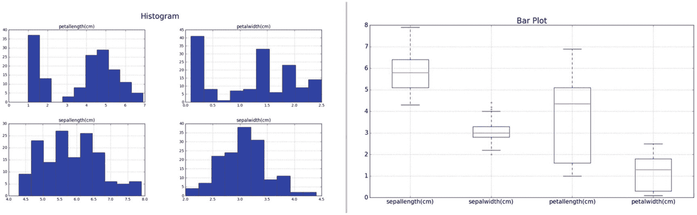
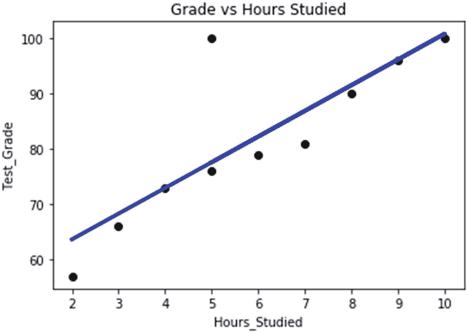
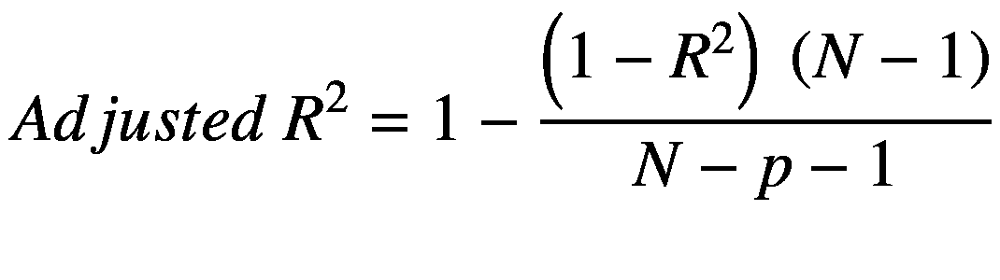
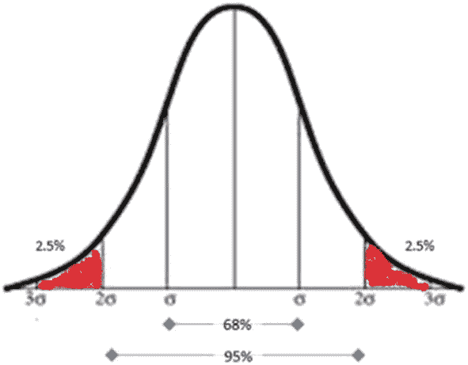
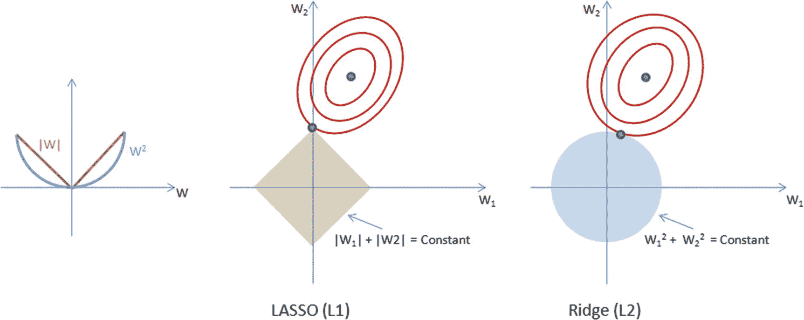
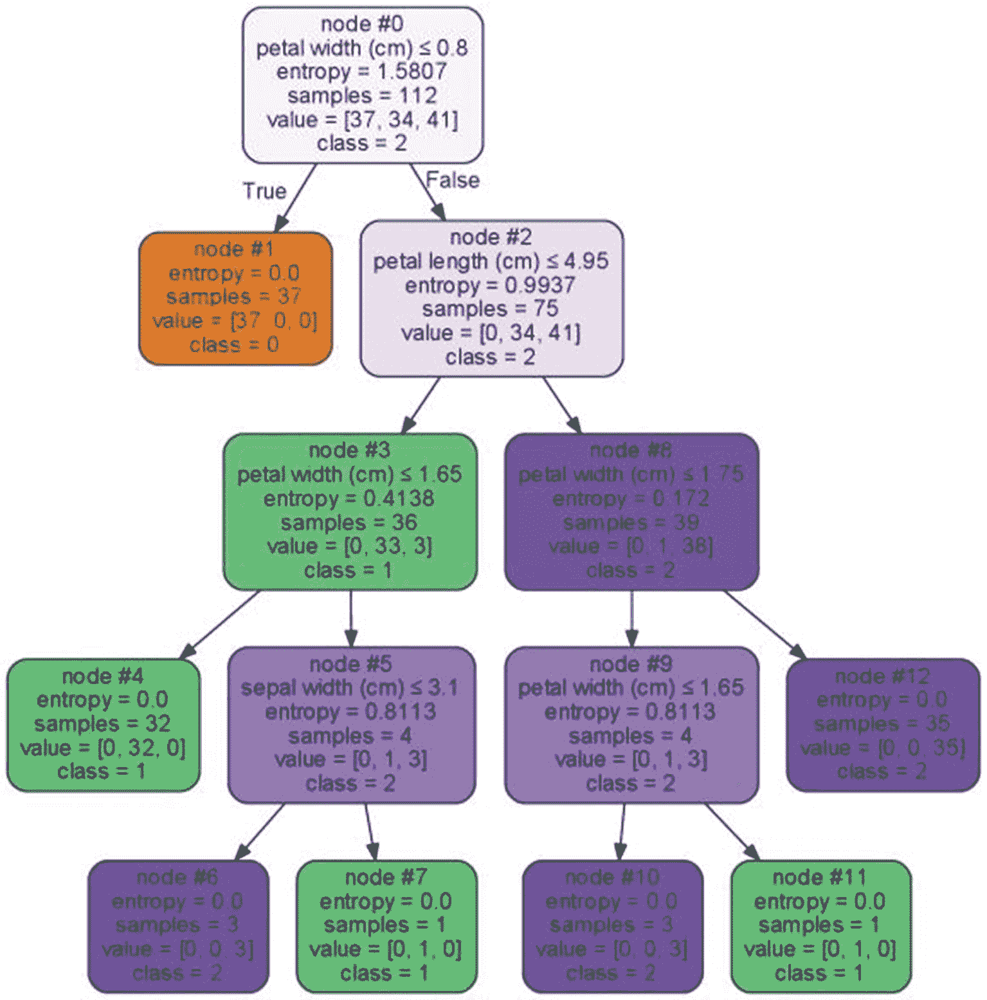
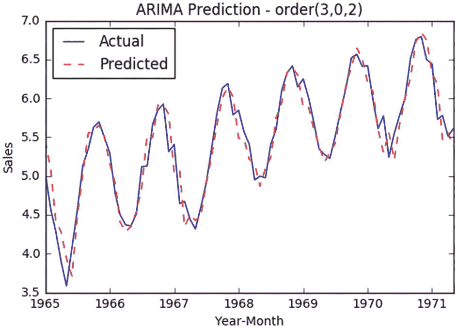
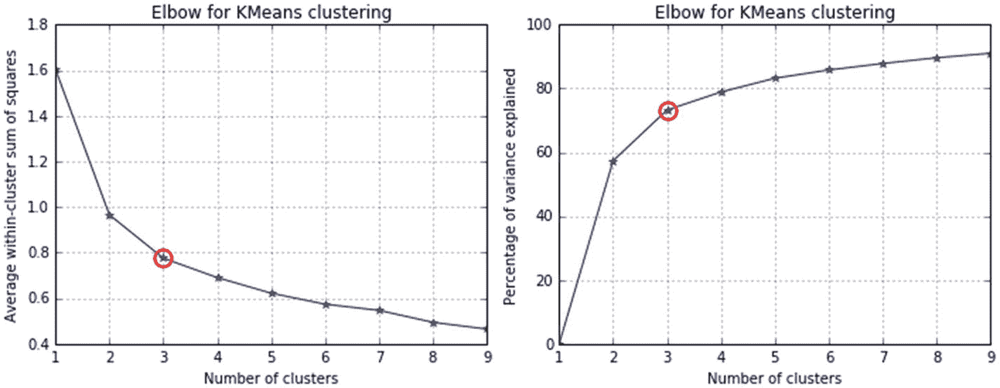

# 三、机器学习的基础

本章使用两个关键的 Python 包，重点介绍监督和非监督机器学习(ML)的不同算法。

***Scikit-learn:***2007 年，David Cournapeau 开发了 Scikit-learn，作为谷歌代码之夏项目的一部分。INRIA 在 2010 年参与进来，并向公众发布了测试版 v0.1。目前，有超过 700 个活跃的贡献者，以及来自 INRIA、Python 软件基金会、谷歌和 Tinyclues 的付费赞助。Scikit-learn 的许多功能都建立在 SciPy(科学 Python)库的基础上，它提供了大量有效实现的、基本的、有监督的和无监督的学习算法。

### 注意

Scikit-learn 也称为 sklearn，因此这两个术语在本书中可以互换使用。

***Statsmodels:*** 这是对 SciPy 包的补充，是运行回归模型的最佳包之一，因为它为模型的每个估计器提供了一个广泛的统计结果列表。

## 数据的机器学习视角

数据是我们在业务环境中可用的事实和数字(也可以称为原始数据)。数据由两个方面组成:

1.  *物体*如人、树、动物等。

2.  *为对象记录的属性*，如年龄、大小、重量、成本等。

当我们测量一个对象的属性时，我们获得的值因对象而异。例如，如果我们将花园中的单个植物视为对象，则它们之间的属性“高度”会有所不同。相应地，不同的属性在不同的对象之间有所不同，所以属性更统称为变量。

我们为对象测量、控制或操作的东西就是变量。不同之处在于它们能被很好地衡量，也就是说，它们的衡量尺度能提供多少可衡量的信息。一个变量所能提供的信息量是由其测量尺度的类型决定的。

从较高的层面来看，基于变量可以取值的类型，有两种类型的变量:

1.  *连续定量:变量*可以取大范围内的任意正数值或负数值。零售额和保险索赔额是连续变量的例子，它可以取大范围内的任何数字。这些类型的变量通常也称为数值变量。

2.  *离散或定性:*变量只能取特定值。零售商店位置区域、州和城市是离散变量的示例，因为它只能为商店取一个特定值(这里“商店”是我们的对象)。这些类型的变量也称为分类变量。

### 测量尺度

一般来说，变量可以用四种不同的尺度来衡量(名义尺度、顺序尺度、区间尺度和比率尺度)。均值、中位数和众数是理解数据分布的中心趋势(中间点)的方法。标准差、方差和范围是用于理解数据分布的最常用的离差度量。

#### 标称测量标度

当每个案例被归入若干离散类别之一时，数据是在名义水平上测量的。这也称为分类，即仅用于分类。由于均值没有意义，我们所能做的就是统计每种类型出现的次数，并计算比例(每种类型出现的次数/总出现次数)。参考表 3-1 中的标称刻度示例。

表 3-1

标称规模示例

<colgroup><col class="tcol1 align-left"> <col class="tcol2 align-left"></colgroup> 
| 

变量名

 | 

示例测量值

 |
| --- | --- |
| 颜色 | 红色、绿色、黄色等。 |
| 性别 | 女性，男性 |
| 足球运动员的球衣号码 | 1、2、3、4、5 等。 |

#### 测量的顺序标度

如果类别意味着顺序，那么数据是按顺序来衡量的。军衔之间的区别在方向和权威上是一致的，但在数量上是不同的。参考表 3-2 中的顺序刻度示例。

表 3-2

序数标度示例

<colgroup><col class="tcol1 align-left"> <col class="tcol2 align-left"></colgroup> 
| 

变量名

 | 

示例测量值

 |
| --- | --- |
| 军衔 | 少尉、第一上尉、上尉、少校、中校、上校等。 |
| 服装尺寸 | 小号、中号、大号、特大号等。 |
| 考试中的班级排名 | 1、2、3、4、5 等。 |

#### 测量的区间尺度

如果值之间的差异有意义，则数据在区间尺度上测量。参考表 3-3 中的间隔刻度示例。

表 3-3

区间标度示例

<colgroup><col class="tcol1 align-left"> <col class="tcol2 align-left"></colgroup> 
| 

变量名

 | 

示例测量值

 |
| --- | --- |
| 温度 | 10、20、30、40 等等。 |
| 智商等级 | 85–114、115–129、130–144、145–159 等。 |

#### 测量比例

在比率尺度上测量的数据具有有意义的差异，并且与一些真正的零点相关。这是最常见的测量尺度。比率刻度示例参见表 3-4 。

表 3-4

比率标度示例

<colgroup><col class="tcol1 align-left"> <col class="tcol2 align-left"></colgroup> 
| 

变量名

 | 

示例测量值

 |
| --- | --- |
| 重量 | 10，20，30，40，50，60 等等。 |
| 高度 | 5、6、7、8、9 等。 |
| 年龄 | 1、2、3、4、5、6、7 等等。 |

表 3-5 提供了不同关键测量尺度的快速总结。

表 3-5

不同测量尺度的比较

<colgroup><col class="tcol1 align-left"> <col class="tcol2 align-left"> <col class="tcol3 align-left"> <col class="tcol4 align-left"> <col class="tcol5 align-left"></colgroup> 
|   | 

测量尺度

 |
| --- | --- |
|   | 

名义上的

 | 

序数

 | 

间隔

 | 

比例

 |
| --- | --- | --- | --- | --- |
| **属性** | 身份 | 身份重要 | 身份重要相等的间隔 | 身份重要相等的间隔真零点 |
| **数学****操作** | 数数 | 等级次序 | 添加减法 | 添加减法增加分开 |
| **描述性****统计数据** | 方式比例 | 方式中位数范围统计 | 方式中位数范围统计变化标准偏差 | 方式中位数范围统计变化标准偏差 |

## 特征工程

任何 ML 算法的输出或预测质量主要取决于被传递的输入的质量。通过应用业务上下文创建适当的数据特征的过程被称为特征工程，它是构建高效的 ML 系统的最重要的方面之一。这里的业务环境意味着我们试图解决的业务问题的表达，我们为什么试图解决它，以及预期的结果是什么。因此，在着手研究不同类型的最大似然算法之前，让我们先了解特征工程的基本原理。图 3-1 显示了原始数据到 ML 算法的逻辑流程。


图 3-1

ML 模型建立中的数据逻辑流程

来自不同来源的数据“按原样”是原始数据，当我们应用业务逻辑来处理原始数据时，结果是信息(经过处理的数据)。进一步的洞察力来自信息。将原始数据转换为信息，并结合业务环境来解决特定业务问题的过程是特征工程的一个重要方面。特征工程的输出是一组清晰而有意义的特征，算法可以使用这些特征来识别模式并建立 ML 模型，该模型可以进一步应用于看不见的数据以预测可能的结果。为了获得高效的最大似然系统，通常进行特征优化以降低特征维数并仅保留重要的/有意义的特征，这将减少计算时间并提高预测性能。请注意，ML 模型构建是一个迭代过程。让我们看看特性工程中的一些常见实践。

### 处理缺失数据

缺失的数据可能会误导数据分析，或者给数据分析带来问题。为了避免任何此类问题，您需要估算缺失数据。有四种最常用的数据插补技术:

*   *删除*:您可以简单地删除包含缺失值的行。当缺失值的行数与总记录数相比微不足道(比如说< 5%)时，这种技术更加合适和有效。您可以使用 Panda 的 dropna()函数来实现这一点。

*   *替换为摘要*:这可能是最常用的插补技术。这里的汇总是各个列的平均值、众数或中值。对于连续或定量变量，可以使用相应列的平均值或众数或中值来替换缺失值。而对于分类或定性变量，模式(最频繁)求和技术效果更好。你可以使用 Panda 的 fillna()函数来实现这一点(请参考第二章“Pandas”一节)。

*   *随机替换*:您也可以用从相应列中随机选取的值替换缺失的值。这种技术适用于缺失值行数不重要的情况。

*   *使用预测模型*:这是一种先进的技术。在这里，您可以使用可用数据为连续变量训练一个回归模型，为分类变量训练一个分类模型，并使用该模型预测缺失值。

### 处理分类数据

大多数 ML 库被设计成能很好地处理数值变量。因此，原始文本描述形式的分类变量不能直接用于建模。让我们根据级别数来学习一些处理分类数据的常用方法。

***创建一个虚拟变量:*** 这是一个布尔变量，表示类别的存在，值为 1，0 表示不存在。您应该创建 k-1 个虚拟变量，其中 k 是级别数。Scikit-learn 提供了一个有用的函数，一个热编码器，为给定的分类变量创建一个虚拟变量(清单 3-1 )。

```py
import pandas as pd
from patsy import dmatrices

df = pd.DataFrame({'A': ['high', 'medium', 'low'],
                   'B': [10,20,30]},
                    index=[0, 1, 2])

print df
#----output----
        A   B
0    high  10
1  medium  20
2     low  30

# using get_dummies function of pandas package
df_with_dummies= pd.get_dummies(df, prefix="A", columns=['A'])
print (df_with_dummies)
#----output----
    B  A_high  A_low  A_medium
0  10     1.0    0.0       0.0
1  20     0.0    0.0       1.0
2  30     0.0    1.0       0.0

Listing 3-1Creating Dummy Variables

```

***转换为数字:*** 另一个简单的方法是利用 Scikit-learn 的标签编码器函数(清单 3-2 )用数字表示每一级的文本描述。如果级别数很高(例如邮政编码、州等。)，然后应用业务逻辑将级别组合到组中。例如，邮政编码或州可以与地区组合在一起；但是，这种方法存在丢失关键信息的风险。另一种方法是基于相似的频率组合类别(新的类别可以是高、中、低)。

```py
import pandas as pd

# using pandas package's factorize function
df['A_pd_factorized'] = pd.factorize(df['A'])[0]

# Alternatively you can use sklearn package's LabelEncoder function
from sklearn.preprocessing import LabelEncoder
le = LabelEncoder()

df['A_LabelEncoded'] = le.fit_transform(df.A)
print (df)
#----output----
        A   B  A_pd_factorized  A_LabelEncoded
0    high  10                0               0
1  medium  20                1               2
2     low  30                2               1

Listing 3-2Converting the Categorical Variable to Numerics

```

### 标准化数据

测量的单位或尺度因变量而异，因此使用原始测量值的分析可能会人为地偏向绝对值较高的变量。将所有不同类型的变量单位归入相同的数量级，从而消除了可能会歪曲调查结果并对结论的准确性产生负面影响的异常值测量。重新调整数据的两种广泛使用的方法是归一化和标准化。

归一化数据可以通过最小-最大缩放来实现。下面给出的公式将对范围 0 到 1 内的所有数值进行缩放。

X <sub>归一化</sub> = 

### 注意

请确保在应用上述技术之前移除极端异常值，因为它会使数据中的正常值偏向一个小区间。

标准化技术会将变量转换为具有零均值和一的标准差。标准化公式如下所示，结果通常称为 z 分数。

Z = 

其中，μ是均值，σ是标准差。

标准化通常是各种分析的首选方法，因为它告诉我们每个数据点在其分布中的位置，并给出离群值的粗略指示。参考清单 3-3 获取标准化和缩放的示例代码。

```py
from sklearn import datasets
import numpy as np
from sklearn import preprocessing

iris = datasets.load_iris()
X = iris.data[:, [2, 3]]
y = iris.target

std_scale = preprocessing.StandardScaler().fit(X)
X_std = std_scale.transform(X)

minmax_scale = preprocessing.MinMaxScaler().fit(X)
X_minmax = minmax_scale.transform(X)

print('Mean before standardization: petal length={:.1f}, petal width={:.1f}'
      .format(X[:,0].mean(), X[:,1].mean()))
print('SD before standardization: petal length={:.1f}, petal width={:.1f}'
      .format(X[:,0].std(), X[:,1].std()))

print('Mean after standardization: petal length={:.1f}, petal width={:.1f}'
      .format(X_std[:,0].mean(), X_std[:,1].mean()))
print('SD after standardization: petal length={:.1f}, petal width={:.1f}'
      .format(X_std[:,0].std(), X_std[:,1].std()))

print('\nMin value before min-max scaling: patel length={:.1f}, patel width={:.1f}'
      .format(X[:,0].min(), X[:,1].min()))
print('Max value before min-max scaling: petal length={:.1f}, petal width={:.1f}'
      .format(X[:,0].max(), X[:,1].max()))

print('Min value after min-max scaling: patel length={:.1f}, patel width={:.1f}'
      .format(X_minmax[:,0].min(), X_minmax[:,1].min()))

print('Max value after min-max scaling: petal length={:.1f}, petal width={:.1f}'
      .format(X_minmax[:,0].max(), X_minmax[:,1].max()))
#----output----
Mean before standardization: petal length=3.8, petal width=1.2
SD before standardization: petal length=1.8, petal width=0.8
Mean after standardization: petal length=-0.0, petal width=-0.0
SD after standardization: petal length=1.0, petal width=1.0

Min value before min-max scaling: patel length=1.0, patel width=0.1
Max value before min-max scaling: petal length=6.9, petal width=2.5

Min value after min-max scaling: patel length=0.0, patel width=0.0
Max value after min-max scaling: petal length=1.0, petal width=1.0

Listing 3-3Normalization and Scaling

```

### 特征构造或生成

只有当我们为机器学习算法提供针对您试图解决的问题的最佳可能特征时，它们才会给出最佳结果。通常，这些功能必须手动创建，方法是花费大量时间处理实际的原始数据，并试图理解它与您为解决业务问题而收集的所有其他数据的关系。

这意味着考虑聚合、拆分或组合要素以创建新要素或分解要素。通常这部分被认为是一种艺术形式，是竞争型 ML 的关键区别。

特征构建是手动的、缓慢的，并且需要主题专家的大量干预来创建丰富的特征，这些特征可以暴露给预测建模算法以产生最佳结果。

汇总数据是帮助我们理解数据质量和问题/差距的基本技术。图 3-2 映射了不同数据类型的表格和图形数据汇总方法。请注意，该映射显示了显而易见的或常用的方法，而不是一个详尽的列表。


图 3-2

常用的数据汇总方法

#### 探索性数据分析

EDA 就是通过使用总结和可视化技术来理解你的数据。在高层次上，EDA 可以以两种方式执行:单变量分析和多变量分析。

让我们学习考虑一个实例数据集来实际学习。虹膜数据集是在模式识别文献中广泛使用的众所周知的数据集。它位于加州大学欧文分校的机器学习库。数据集包含三种鸢尾花的花瓣长度、花瓣宽度、萼片长度和萼片宽度测量值:Setosa、Versicolor 和 Virginica(图 3-3 )。


图 3-3

虹膜异色

#### 单变量分析

单个变量被孤立地分析，以便更好地理解它们。Pandas 提供了一个 describe 函数，以表格形式为所有变量创建汇总统计数据(清单 3-4 )。这些统计数据对于数值型变量非常有用，有助于理解任何质量问题，如缺失值和异常值的存在。

```py
from sklearn import datasets
import numpy as np
import pandas as pd
import matplotlib.pyplot as plt

iris = datasets.load_iris()

# Let's convert to dataframe
iris = pd.DataFrame(data= np.c_[iris['data'], iris['target']],
                     columns= iris['feature_names'] + ['species'])

# replace the values with class labels
iris.species = np.where(iris.species == 0.0, 'setosa', np.where(iris.species==1.0,'versicolor', 'virginica'))

# let's remove spaces from column name
iris.columns = iris.columns.str.replace(' ',")
iris.describe()

#----output----
       sepallength(cm) sepalwidth(cm) petallength(cm) petalwidth(cm)
Count  150.00          150.00         150.00          150.00
Mean   5.84            3.05           3.75            1.19
std    0.82            0.43           1.76            0.76
min    4.30            2.00           1.00            0.10
25%    5.10            2.80           1.60            0.30
50%    5.80            3.00           4.35            1.30
75%    6.40            3.30           5.10            1.80
max    7.90            4.40           6.90            2.50

The columns 'species' is categorical, so let's check the frequency distribution for each category.

print (iris['species'].value_counts())
#----output----
Setosa       50
versicolor   50
virginica    50

Listing 3-4Univariate Analysis

```

Pandas 支持绘图功能，用于属性的快速可视化。从图中我们可以看到,“物种”有三个类别，每个类别有 50 条记录(列表 3-5 )。

```py
# Set the size of the plot
plt.figure(figsize=(15,8))

iris.hist()        # plot histogram
plt.suptitle("Histogram", fontsize=12) # use suptitle to add title to all sublots
plt.tight_layout(pad=1)
plt.show()

iris.boxplot()     # plot boxplot
plt.title("Bar Plot", fontsize=16)
plt.tight_layout(pad=1)

plt.show()
#----output----

Listing 3-5Pandas DataFrame Visualization

```



#### 多变量分析

在多元分析中，你试图建立所有变量之间的关系。让我们根据物种类型确定每个特征的平均值(列表 3-6 )。

```py
# print the mean for each column by species
iris.groupby(by = "species").mean()

# plot for mean of each feature for each label class
iris.groupby(by = "species").mean().plot(kind="bar")

plt.title('Class vs Measurements')
plt.ylabel('mean measurement(cm)')
plt.xticks(rotation=0)  # manage the xticks rotation
plt.grid(True)

# Use bbox_to_anchor option to place the legend outside plot area to be tidy
plt.legend(loc="upper left", bbox_to_anchor=(1,1))
#----output----
        sepallength(cm) sepalwidth(cm) petallength(cm) petalwidth(cm)

setosa       5.006      3.418          1.464           0.244
versicolor   5.936      2.770          4.260           1.326
virginica    6.588      2.974          5.552           2.026

Listing 3-6A Multivariate Analysis

```


##### 相关矩阵

correlation 函数使用皮尔逊相关系数，得出一个介于-1 和 1 之间的数字。更接近-1 的系数表示强负相关，而更接近 1 的系数表示强正相关(列表 3-7 )。

```py
# create correlation matrix
corr = iris.corr()
print(corr)

import statsmodels.api as sm
sm.graphics.plot_corr(corr, xnames=list(corr.columns))
plt.show()
#----output----
                 sepallength(cm)  sepalwidth(cm)  petallength(cm)sepallength(cm)         1.000000       -0.109369         0.871754
sepalwidth(cm)         -0.109369        1.000000        -0.420516
petallength(cm)         0.871754       -0.420516         1.000000
petalwidth(cm)          0.817954       -0.356544         0.962757

                 petalwidth(cm)
sepallength(cm)        0.817954
sepalwidth(cm)        -0.356544
petallength(cm)        0.962757
petalwidth(cm)         1.000000  

Listing 3-7
Correlation Matrix

```


##### 配对图

您可以通过查看每对属性的交互分布来理解关系属性。这使用一个内置函数来创建一个所有属性相对于所有属性的散点图矩阵(清单 3-8 )。

```py
from pandas.plotting import scatter_matrix
scatter_matrix(iris, figsize=(10, 10))

# use suptitle to add title to all sublots

plt.suptitle("Pair Plot", fontsize=20)
#----output----

Listing 3-8
Pair Plot

```


##### EDA 的发现

*   没有丢失的值。

*   萼片比花瓣长。萼片长度在 4.3 和 7.9 之间，平均长度为 5.8，而花瓣长度在 1 和 6.9 之间，平均长度为 3.7。

*   萼片也比花瓣宽。萼片宽度在 2 到 4.4 之间，平均宽度为 3.05，而花瓣宽度在 0.1 到 2.5 之间，平均宽度为 1.19

*   刚毛藻的平均花瓣长度远小于杂色菊和海滨菊；然而，刚毛藻的平均萼片宽度大于杂色花和海滨锦葵

*   花瓣长度和宽度密切相关，即 96%的时间宽度随着长度的增加而增加。

*   花瓣长度与萼片宽度呈负相关，即萼片宽度增加 42%的时间会减少花瓣长度。

*   从数据得出的初步结论:仅根据萼片/花瓣的长度和宽度，你可以得出结论，云芝/海滨锦葵在大小上可能彼此相似，然而，刚毛藻的特征似乎与其他两种显著不同。

进一步观察图 3-4 中三种鸢尾花的特征，我们可以从我们的 EDA 中确定假设。


图 3-4

鸢尾花

统计学和数学构成了最大似然算法的基础。让我们从理解一些来自统计世界的基本概念和算法开始，并逐渐转向高级的 ML 算法。

## 监督学习–回归

您能猜出表 3-6 中给出的跨不同领域的一组业务问题的共同点吗？

表 3-6

监督学习用例示例

<colgroup><col class="tcol1 align-left"> <col class="tcol2 align-left"></colgroup> 
| 

领域

 | 

问题

 |
| --- | --- |
| 零售 | 给定商店未来 3 年的日、月、年销售额是多少？ |
| 零售 | 零售店应分配多少停车位？ |
| 制造业 | 产品制造的人工成本是多少？ |
| 制造业/零售业 | 未来 3 年我每月的电费是多少？ |
| 银行业务 | 客户的信用评分是多少？ |
| 保险 | 今年会有多少客户要求投保？ |
| 能源/环境 | 未来 5 天的气温是多少？ |

你可能猜对了！单词“多少”和“多少”的出现意味着这些问题的答案将是一个定量的或连续的数字。回归是一种基本技术，通过研究与问题相关的不同变量之间的关系，可以帮助我们找到这类问题的答案。

让我们考虑一个用例，我们从一组智商相似的学生那里收集了学生的平均考试成绩和他们各自的平均学习时间(列表 3-9 )。

```py
import pandas as pd
import numpy as np
import matplotlib.pyplot as plt

# Load data
df = pd.read_csv('Data/Grade_Set_1.csv')
print(df)

# Simple scatter plot
df.plot(kind='scatter', x="Hours_Studied", y="Test_Grade", title='Grade vs Hours Studied')
plt.show()
# check the correlation between variables
print("Correlation Matrix: ")
print(df.corr())
# ---- output ----
   Hours_Studied  Test_Grade
0              2          57
1              3          66
2              4          73
3              5          76
4              6          79
5              7          81
6              8          90
7              9          96
8             10         100

Listing 3-9
Students’ Score vs. Hours Studied

```


```py
Correlation Matrix

:
               Hours_Studied            Test_Grade
Hours_Studied      1.000000             0.987797
Test_Grade         0.987797             1.000000

```

一个简单的散点图显示，x 轴为学习时间，y 轴为考试成绩，成绩随着学习时间的增加而逐渐增加。这意味着这两个变量之间存在线性关系。此外，执行相关分析显示，在两个变量之间存在 98%的正关系；这意味着有 98%的可能性学习时间的任何变化都会导致成绩的变化。

### 相关性和因果关系

虽然相关性有助于我们确定两个或更多变量之间的关系程度，但它不能告诉我们因果关系。高度的相关性并不总是意味着变量之间存在因果关系。请注意，相关性并不意味着因果关系，尽管因果关系的存在总是意味着相关性。让我们通过例子来更好地理解这一点:

*   在火灾中有更多的消防员在场意味着火势很大，但是火灾不是由消防员引起的。

*   当一个人穿着鞋子睡觉时，很可能会头痛。这可能是由于酒精中毒。

上述示例中的显著相关性可能是由以下原因造成的:

*   由于纯粹的偶然性，小样本倾向于表现出更高的相关性。

*   变量可能会相互影响，所以很难确定一个是原因，另一个是结果。

*   相关变量可能会受到一个或多个其他相关变量的影响。

领域知识或主题专家的参与对于确定因果关系的相关性非常重要。

### 拟合斜坡

让我们试着拟合一条穿过所有点的斜线，以使误差或残差(即直线到每个点的距离)尽可能最小(图 3-5 )。


图 3-5

线性回归模型组件

误差可能是正的，也可能是负的，取决于它在斜坡上的位置，因此，如果我们对所有误差进行简单求和，误差将为零。所以我们应该对误差求平方，去掉负值，然后对误差平方求和。因此，斜率也称为最小二乘直线。

*   斜率方程由 Y = mX + c 给出，其中 Y 是给定 x 值的预测值。

*   m 是 y 的变化，除以 x 的变化(即，m 是 x 变量的直线斜率，它表示 x 变量值每增加一个单位，其增加的陡度)。

*   c 是截距，表示它在轴上相交的位置或点；在图 3-5 的情况下是 49.67。截距是一个常数，表示 X 无法解释的 Y 的可变性。它是 X 为零时 Y 的值。

斜率和截距共同定义了两个变量之间的线性关系，可用于预测或估计平均变化率。现在，对一个新学生使用这个关系，我们可以根据他/她的学习时间来确定分数。假设一个学生计划学习 6 个小时来准备考试。简单地从 x 轴和 y 轴画一条连线到斜率，就可以看出这个学生有 80 分的可能性。我们可以使用斜率方程来预测任何给定学习时间的分数。在这种情况下，考试成绩是因变量，用“Y”表示，学习时间是自变量或预测值，用“x”表示。让我们使用 Scikit-learn 库中的线性回归函数来查找 m (x 的系数)和 c(截距)的值。参考清单 3-10 获取示例代码。

```py
# Create linear regression object
lr = lm.LinearRegression()

x= df.Hours_Studied[:, np.newaxis] # independent variable
y= df.Test_Grade.values            # dependent variable

# Train the model using the training sets
lr.fit(x, y)
print("Intercept: ", lr.intercept_)
print("Coefficient: ", lr.coef_)

# manual prediction for a given value of x
print("Manual prediction :", 49.67777777777776 + 5.01666667*6)

# predict using the built-in function
print("Using predict function: ", lr.predict([[6]]))

# plotting fitted line
plt.scatter(x, y,  color='black')
plt.plot(x, lr.predict(x), color="blue", linewidth=3)
plt.title('Grade vs Hours Studied')
plt.ylabel('Test_Grade')
plt.xlabel('Hours_Studied')
# ---- output ----
Intercept:  49.67777777777776
Coefficient:  [5.01666667]
Manual prediction : 79.77777779777776
Using predict function:  [79.77777778]

Listing 3-10Linear Regression

```


我们把合适的值放到斜率方程(m∫X+c = Y)中，5.01∫6+49.67 = 79.77；这意味着学习 6 个小时的学生有可能获得 79.77 分的考试成绩。

注意，如果 X 是零，Y 的值将是 49.67。这意味着即使学生不学习，分数也有可能是 49.67。这意味着还有其他变量对分数有因果关系的影响，而我们目前还不知道。

### 你的模型有多好？

有三个广泛用于评估线性模型性能的指标:

*   r 平方

*   均方根误差

*   平均绝对误差

#### 拟合优度的 r 平方

R 平方度量是评估模型与数据拟合程度的最常用方法。r 平方值表示由自变量解释的因变量中方差的总比例。它是一个介于 0 和 1 之间的值；值越接近 1，表示模型拟合越好。R 平方计算说明见表 3-7 ，代码实现示例见清单 3-11 。

表 3-7

R 平方计算的示例表


在哪里


```py
             Total Sum of Square Residual (∑ SSR)
R-squared =  ------------------------------------
                  Sum of Square Total(∑ SST)

R-squared =  1510.01 / 1547.55 = 0.97

```

在这种情况下，R 平方可以解释为因变量(考试分数)中 97%的可变性，可以用自变量(学习小时数)来解释。

#### 均方根误差

这是误差平方平均值的平方根。RMSE 表示预测值与实际值的接近程度；因此，较低的 RMSE 值表示模型性能良好。RMSE 的关键属性之一是单位将与目标变量相同。


#### 绝对平均误差

这(MAE)是误差绝对值的平均值，即预测值-实际值。


```py
# function to calculate r-squared, MAE, RMSE
from sklearn.metrics import r2_score , mean_absolute_error, mean_squared_error

# add predict value to the data frame
df['Test_Grade_Pred'] = lr.predict(x)

# Manually calculating R Squared
df['SST'] = np.square(df['Test_Grade'] - df['Test_Grade'].mean())
df['SSR'] = np.square(df['Test_Grade_Pred'] - df['Test_Grade'].mean())

print("Sum of SSR:", df['SSR'].sum())
print("Sum of SST:", df['SST'].sum())

print(df)
df.to_csv('r-squared.csv', index=False)

print("R Squared using manual calculation: ", df['SSR'].sum() / df['SST'].sum()))

# Using built-in function
print("R Squared using built-in function: ", r2_score(df.Test_Grade,  df.Test_Grade_Pred))
print("Mean Absolute Error: ", mean_absolute_error(df.Test_Grade, df.Test_Grade_Pred))
print("Root Mean Squared Error: ", np.sqrt(mean_squared_error(df.Test_Grade, df.Test_Grade_Pred)))
# ---- output ----
Sum of SSR: 1510.01666667
Sum of SST: 1547.55555556
R Squared using manual calculation:  0.97574310741
R Squared using built-in function:  0.97574310741
Mean Absolute Error:  1.61851851852
Root Mean Squared Error:  2.04229959955

Listing 3-11Linear Regression Model Accuracy Matrices

```

#### 极端值

先介绍一个离群值) :一个学生学习了 5 个小时，得了 100 分。假设这个学生的智商比组里其他人都高。注意 R 平方值的下降。因此，应用业务逻辑以避免在训练数据集中包含异常值、一般化模型并提高准确性非常重要(清单 3-12 )。

```py
# Load data
df = pd.read_csv('Data/Grade_Set_1.csv')

df.loc[9] = np.array([5, 100]) )

x= df.Hours_Studied[:, np.newaxis] # independent variable
y= df.Test_Grade.values            # dependent variable

# Train the model using the training sets
lr.fit(x, y)
print("Intercept: ", lr.intercept_)
print("Coefficient: ", lr.coef_)

# manual prediction for a given value of x
print("Manual prediction :", 54.4022988505747 + 4.64367816*6)

# predict using the built-in function
print("Using predict function: ", lr.predict([[6]]))

# plotting fitted line
plt.scatter(x, y,  color='black')
plt.plot(x, lr.predict(x), color="blue", linewidth=3)
plt.title('Grade vs Hours Studied')
plt.ylabel('Test_Grade')
plt.xlabel('Hours_Studied')

# add predict value to the data frame)

df['Test_Grade_Pred'] = lr.predict(x)

# Using built-in function
print("R Squared : ", r2_score(df.Test_Grade,  df.Test_Grade_Pred))
print("Mean Absolute Error: ", mean_absolute_error(df.Test_Grade, df.Test_Grade_Pred))
print("Root Mean Squared Error: ", np.sqrt(mean_squared_error(df.Test_Grade, df.Test_Grade_Pred)))
# ---- output ----
Intercept:  54.4022988505747
Coefficient:  [4.64367816]
Manual prediction : 82.2643678105747
Using predict function:  [82.26436782]
R Squared :  0.6855461390206965
Mean Absolute Error:  4.480459770114941)

Root Mean Squared Error:  7.761235830020588

Listing 3-12Outlier vs. R-Squared Value

```



### 多项式回归

它是一种高阶线性回归的形式，在因变量和自变量之间建模为 n 次多项式。虽然是线性的，但是可以更好的拟合曲线。本质上，我们将在等式中引入同一自变量的高阶次变量(表 3-8 和列表 3-13 )。

表 3-8

高次多项式回归

<colgroup><col class="tcol1 align-left"> <col class="tcol2 align-left"></colgroup> 
| 

程度

 | 

回归方程式

 |
| --- | --- |
| 二次的(2) | Y = m <sub>1</sub> X + m <sub>2</sub> X² + c |
| 立方(3) | y = m<sub>1</sub>x+m<sub>2</sub>x²+ m<sub>3</sub>x³+c |
| 北 | y = m<sub>1</sub>x+m<sub>2</sub>x²+m<sub>3</sub>x³+…x^n+·c |

```py
x = np.linspace(-3,3,1000) # 1000 sample number between -3 to 3

# Plot subplots
fig, ((ax1, ax2, ax3), (ax4, ax5, ax6)) = plt.subplots(nrows=2, ncols=3)

ax1.plot(x, x)
ax1.set_title('linear')
ax2.plot(x, x**2)
ax2.set_title('degree 2')
ax3.plot(x, x**3)
ax3.set_title('degree 3')
ax4.plot(x, x**4)
ax4.set_title('degree 4')
ax5.plot(x, x**5)
ax5.set_title('degree 5')
ax6.plot(x, x**6)
ax6.set_title('degree 6')

plt.tight_layout()# tidy layout

# --- output ----

Listing 3-13
Polynomial Regression

```


让我们考虑另一组学生的平均考试成绩和他们各自的平均学习时数，对于智商相近的学生(列出 3-14 )。

```py
# importing linear regression function
import sklearn.linear_model as lm

# Load data
df = pd.read_csv('Data/Grade_Set_2.csv')
print(df)

# Simple scatter plot
df.plot(kind='scatter', x="Hours_Studied", y="Test_Grade", title='Grade vs Hours Studied')

# check the correlation between variables
print("Correlation Matrix: ")
print(df.corr())

# Create linear regression object
lr = lm.LinearRegression()

x= df.Hours_Studied[:, np.newaxis]           # independent variable
y= df.Test_Grade                             # dependent variable

# Train the model using the training sets

lr.fit(x, y)

# plotting fitted line
plt.scatter(x, y,  color='black')
plt.plot(x, lr.predict(x), color="blue", linewidth=3)
plt.title('Grade vs Hours Studied')
plt.ylabel('Test_Grade')
plt.xlabel('Hours_Studied')

print("R Squared: ", r2_score(y, lr.predict(x)))
# ---- output ----
    Hours_Studied  Test_Grade
0             0.5          20
1             1.0          21
2             2.0          22
3             3.0          23
4             4.0          25
5             5.0          37
6             6.0          48
7             7.0          56
8             8.0          67
9             9.0          76
10           10.0          90
11           11.0          89
12           12.0          90

Correlation Matrix

:
                  Hours_Studied       Test_Grade
Hours_Studied     1.000000            0.974868
Test_Grade        0.974868            1.000000

R Squared:  0.9503677767

Listing 3-14Polynomial Regression Example

```


相关分析显示，学习时间和考试成绩之间有 97%的正相关，而考试成绩的 95% (R 平方)的变化可以用学习时间来解释。请注意，长达 4 个小时的平均学习成绩不到 30 分，9 个小时的学习后，成绩没有增值。这不是一个完美的线性关系，虽然我们可以拟合一条线性线。让我们试试更高阶的多项式次数(列出 3-15 )。

```py
lr = lm.LinearRegression()

x= df.Hours_Studied        # independent variable
y= df.Test_Grade           # dependent variable

# NumPy's vander function will return powers of the input vector
for deg in [1, 2, 3, 4, 5]:
    lr.fit(np.vander(x, deg + 1), y);
    y_lr = lr.predict(np.vander(x, deg + 1))
    plt.plot(x, y_lr, label='degree ' + str(deg));
    plt.legend(loc=2);
    print("R-squared for degree " + str(deg) + " = ",  r2_score(y, y_lr))
plt.plot(x, y, 'ok')

# ---- output ----
R-squared for degree 1 =  0.9503677767
R-squared for degree 2 =  0.960872656868
R-squared for degree 3 =  0.993832312037
R-squared for degree 4 =  0.99550001841
R-squared for degree 5 =  0.99562049139

Listing 3-15R-Squared for Different Polynomial Degrees

```


请注意，这里的 1 阶是线性拟合，高阶多项式回归更好地拟合了曲线，R 平方在 3 阶跃升了 4%。超过 3 度后，R 平方没有大的变化，所以我们可以说 3 度更合适。

Scikit-learn 提供了一个函数来生成一个新的特征矩阵，该矩阵由阶数小于或等于指定阶数的特征的所有多项式组合组成(列表 3-16 )。

```py
from sklearn.preprocessing import PolynomialFeatures
from sklearn.pipeline import make_pipeline

x= df.Hours_Studied[:, np.newaxis] # independent variable
y= df.Test_Grade                   # dependent variable

degree = 3
model = make_pipeline(PolynomialFeatures(degree), lr)

model.fit(x, y)

plt.scatter(x, y,  color='black')
plt.plot(x, model.predict(x), color="green")
plt.title('Grade vs Hours Studied')
plt.ylabel('Test_Grade')
plt.xlabel('Hours_Studied')

print("R Squared using built-in function: ", r2_score(y, model.predict(x)))
# ---- output ----
R Squared using built-in function:  0.993832312037

Listing 3-16Scikit-learn Polynomial Features

```


### 多变量回归

到目前为止，我们已经看到了一个自变量对一个给定的因变量的简单回归。在大多数现实生活的用例中，会有不止一个自变量，所以有多个自变量的概念被称为多元回归。该方程采用以下形式。

y = m<sub>1</sub>x<sub>1</sub>+m<sub>2</sub>x<sub>2</sub>+m<sub>3</sub>x<sub>3</sub>+...+m <sub>n</sub> x <sub>n</sub>

其中每个独立变量由 xs 表示，ms 是相应的系数。我们将使用“stats models”Python 库来学习多元回归的基础知识，因为它提供了更有用的统计结果，从学习的角度来看，这些结果很有帮助。一旦理解了基本概念，就可以使用 Scikit-learn 或 statsmodels 包，因为两者都很有效。

我们将使用住房数据集(来自 RDatasets 的表 3-9 ),其中包含温莎市的房屋销售价格。下面是每个变量的简要描述。

表 3-9

住房数据集(来自 RDatasets)

<colgroup><col class="tcol1 align-left"> <col class="tcol2 align-left"> <col class="tcol3 align-left"></colgroup> 
| 

变量名

 | 

描述

 | 

数据类型

 |
| --- | --- | --- |
| 价格 | 房子的售价 | 数字的 |
| 洛兹 | 以平方英尺为单位的房产面积 | 数字的 |
| 卧室 | 卧室数量 | 数字的 |
| Bathrms | 全浴室数量 | 数字的 |
| 故事 | 不包括地下室的层数 | 绝对的 |
| 私人车道 | 房子有车道吗？ | 布尔/分类 |
| 再房间 | 这房子有娱乐室吗？ | 布尔/分类 |
| 全碱基 | 这栋房子有完整的地下室吗？ | 布尔/分类 |
| Gashw | 房子用燃气热水供暖吗？ | 布尔/分类 |
| 河南艾瑞科 | 房子有中央空调吗？ | 布尔/分类 |
| Garagepl | 车库位置数量 | 数字的 |
| 预制区域 | 房子位于城市的首选街区吗？ | 布尔/分类 |

让我们建立一个模型，将其余变量视为自变量来预测房价(因变量)。

在运行模型的第一次迭代之前，需要适当地处理分类变量。Scikit-learn 提供了有用的内置预处理函数来处理分类变量。

*   *LabelBinarizer* :这将用数值替换二进制变量文本。我们将把这个函数用于二进制分类变量。

*   *LabelEncoder* :这将用数字表示代替类别级别。

*   *OneHotEncoder* :这将把 n 个级别转换成 n-1 个新变量，新变量将使用 1 来表示级别的存在，否则使用 0。注意，在调用 OneHotEncoder 之前，我们应该使用 LabelEncoder 将级别转换为数字。或者，我们可以使用 Pandas 包的 get_dummies 实现同样的功能。这样使用起来更有效率，因为我们可以直接在带有文本描述的列上使用它，而不必先转换成数字。

#### 多重共线性和变异膨胀因子

因变量应该与自变量有很强的关系。但是，任何独立变量都不应该与其他独立变量有很强的相关性。多重共线性是指一个或多个独立变量彼此高度相关的情况。在这种情况下，我们应该只使用相关自变量中的一个。

多重共线性和方差膨胀因子(VIF)是多重共线性存在的指标，statsmodel 提供了一个函数来计算每个自变量的 VIF '值大于 10 是可能存在高度多重共线性的经验法则。VIF 值的标准准则是:VIF = 1 表示不存在相关性，VIF >1 但<5 means moderate correlation exists (Listing 3-17 。


其中是变量 X <sub>i</sub> 的决定系数。

```py
# Load data
df = pd.read_csv('Data/Housing_Modified.csv')

# Convert binary fields to numeric boolean fields
lb = preprocessing.LabelBinarizer()

df.driveway = lb.fit_transform(df.driveway)
df.recroom = lb.fit_transform(df.recroom)
df.fullbase = lb.fit_transform(df.fullbase)
df.gashw = lb.fit_transform(df.gashw)
df.airco = lb.fit_transform(df.airco)
df.prefarea = lb.fit_transform(df.prefarea)

# Create dummy variables for stories
df_stories = pd.get_dummies(df['stories'], prefix="stories", drop_first=True)

# Join the dummy variables to the main dataframe
df = pd.concat([df, df_stories], axis=1)
del df['stories']

# lets plot the correlation matrix using statmodels graphics packages' plot_corr

# create correlation matrix
corr = df.corr()
sm.graphics.plot_corr(corr, xnames=list(corr.columns))
plt.show()
# ---- output ----

Listing 3-17
Multicollinearity and VIF

```


从剧情中我们可以看出，stories _ 1 与 stories _ 2 有很强的负相关关系。让我们执行 VIF 分析来消除强相关的独立变量(列表 3-18 )。

```py
from statsmodels.stats.outliers_influence import variance_inflation_factor, OLSInfluence

# create a Python list of feature names
independent_variables = ['lotsize', 'bedrooms', 'bathrms','driveway', 'recroom',
                         'fullbase','gashw','airco','garagepl', 'prefarea',
                         'stories_one','stories_two','stories_three']

# use the list to select a subset from original DataFrame
X = df[independent_variables]
y = df['price']

thresh = 10

for i in np.arange(0,len(independent_variables)):
    vif = [variance_inflation_factor(X[independent_variables].values, ix) for ix in range(X[independent_variables].shape[1])]
    maxloc = vif.index(max(vif))
    if max(vif) > thresh:
        print("vif :", vif)
        print('dropping \" + X[independent_variables].columns[maxloc] + '\' at index: ' + str(maxloc))

        del independent_variables[maxloc]
    else:
        break

print('Final variables:', independent_variables)
# ---- output ----
vif : [8.9580980878443359, 18.469878559519948, 8.9846723472908643, 7.0885785420918861, 1.4770152815033917, 2.013320236472385, 1.1034879198994192, 1.7567462065609021, 1.9826489313438442, 1.5332946465459893, 3.9657526747868612, 5.5117024083548918, 1.7700402770614867]
dropping 'bedrooms' at index: 1
Final variables: ['lotsize', 'bathrms', 'driveway', 'recroom', 'fullbase', 'gashw', 'airco', 'garagepl', 'prefarea', 'stories_one', 'stories_two', 'stories_three']

Listing 3-18Remove Multicollinearity

```

我们可以看到 VIF 分析已经排除了大于 10 的卧室；但是，stories _ 1 和 stories _ 2 被保留了下来。

让我们用通过 VIF 分析的一组独立变量来运行多元回归模型的第一次迭代。

为了测试模型性能，通常的做法是将数据集分成 80/20(或 70/30)分别用于训练/测试，并使用训练数据集来建立模型。然后在测试数据集上应用训练好的模型，评估模型的性能(清单 3-19 )。

```py
from sklearn.model_selection import train_test_split
from sklearn import metrics
# create a Python list of feature names
independent_variables = ['lotsize', 'bathrms','driveway', 'fullbase','gashw', 'airco','garagepl',
                         'prefarea','stories_one','stories_three']

# use the list to select a subset from original DataFrame
X = df[independent_variables]

X_train, X_test, y_train, y_test = train_test_split(X, y, train_size=.80, random_state=1)

# create a fitted model
lm = sm.OLS(y_train, X_train).fit()

# print the summary

print(lm.summary())

# make predictions on the testing set
y_train_pred = lm.predict(X_train)
y_test_pred = lm.predict(X_test)
y_pred = lm.predict(X) # full data
print("Train MAE: ", metrics.mean_absolute_error(y_train, y_train_pred))
print("Train RMSE: ", np.sqrt(metrics.mean_squared_error(y_train, y_train_pred)))

print("Test MAE: ", metrics.mean_absolute_error(y_test, y_test_pred))

print("Test RMSE: ", np.sqrt(metrics.mean_squared_error(y_test, y_test_pred)))

# ---- output ----
Train MAE:  11987.660160035877
Train RMSE:  15593.474917800835
Test MAE:  12722.079675396284
Test RMSE:  17509.25004003038

Listing 3-19Build the Multivariate Linear Regression Model

```


#### 解读普通最小二乘(OLS)回归结果

*调整后的 R 平方:*简单的 R 平方值会随着自变量的加入而不断增加。为了解决这个问题，调整的 R 平方被考虑用于多元回归，以了解独立变量的解释能力。



其中 N 是总观察值或样本量，p 是预测值的数量。


图 3-6

R 平方与调整后的 R 平方

*   图 3-6 显示了随着更多变量的增加，R 平方如何遵循调整后的 R 平方

*   随着包含更多变量，R 平方总是趋于增加

*   如果添加的变量不能解释因变量中的变量，调整后的 R 平方将下降

*系数:*这是各个独立变量的单独系数。它可以是正数，也可以是负数，表示自变量的每一个单位的增加都会对因变量的值产生积极或消极的影响。

*标准误差:*这是各个独立观察值离回归线的平均距离。较小的值表明模型拟合良好。

*Durbin-Watson:* 这是用于确定多重共线性存在的常用统计量之一，多重共线性是指多元回归模型中使用的两个或多个自变量高度相关。德宾-沃森统计值总是介于 0 和 4 之间的数字。2 左右的值比较理想(1.5 到 2.5 的范围比较正常)；这意味着模型中使用的变量之间没有自相关。

*置信区间:*这是计算自变量斜率 95%置信区间的系数。

*t 和 p 值:* p 值是重要的统计量之一。为了更好地理解，我们将不得不探讨假设检验和正态分布的概念。

假设检验是关于观察值分布的断言，并验证这一断言。假设检验的步骤如下:

*   提出一个假设。

*   假设的有效性得到了检验。

*   如果假设被发现是真实的，它被接受。

*   如果发现不真实，就拒绝接受

*   被检验可能被拒绝的假设被称为零假设。

*   零假设由 H <sub>0</sub> 表示。

*   当零假设被拒绝时被接受的假设被称为替代假设 H <sub>a</sub> 。

*   另一种假设通常是有趣的，也是有人想要证明的。

*   例如，零假设 H0 是批量大小对房价有实际影响；在这种情况下，回归方程中的系数 m 等于零(y = m÷批量+ c)。

*   替代假设 H <sub>a</sub> 是批量大小对房价没有实质影响，你看到的影响是由于偶然性，也就是说回归方程中系数 m 不等于零。

*   In order to be able to say whether the regression estimate is close enough to the hypothesized value to be acceptable, we take the range of estimate implied by the estimated variance and see whether this range will contain the hypothesized value. To do this, we can transform the estimate into a standard normal distribution, and we know that 95% of all values of a variable that has a mean of 0 and variance of 1 will lie within 0 to 2 standard deviation. Given a regression estimate and its standard error, we can be 95% confident that the true (unknown) value of m will lie in this region (Figure 3-7).

    

    图 3-7

    正态分布(红色是拒绝区域)

*   t 值用于确定 p 值(概率)，p 值≤0.05 表示存在反对原假设的有力证据，因此您拒绝原假设。p 值> 0.05 表示反对零假设的证据很弱，因此您无法拒绝零假设。所以在我们的例子中，变量≤0.05 意味着变量对模型是有意义的。

*   检验假设的过程表明有可能出错。任何给定的数据集都有两种类型的错误，这两种类型的错误是反向相关的，这意味着一种风险越小，另一种风险越高。

*   第一类错误:拒绝零假设 H0 的错误，即使 H0 为真

*   *第二类错误*:即使 H0 为假，也接受原假设 H0 的错误

*   请注意，变量“stories_three”和“recroom”具有较大的 p 值，表明它无关紧要。所以让我们在没有这个变量的情况下重新运行回归，看看结果。


火车前：11993.3436816

开往 RMSE 的火车:16860 . 686868686617

测试： 12902.4799591

测试 RMSE:18660 . 686868686617

*   请注意，删除变量不会对调整后的 R 平方产生负面影响。

#### 回归诊断

关于我们的模型结果，有一套程序和假设需要验证，否则模型可能会产生误导。让我们看看一些重要的回归诊断。

##### 极端值

远离拟合回归线的数据点称为异常值，这些数据点会影响模型的准确性。绘制标准化残差与杠杆的关系图将使我们很好地理解异常点。残差是实际值与预测值之间的差异，而杠杆是对观察值的独立变量值与其他观察值之间距离的度量(列表 3-20 )。

```py
# lets plot the normalized residual vs leverage
from statsmodels.graphics.regressionplots import plot_leverage_resid2
fig, ax = plt.subplots(figsize=(8,6))
fig = plot_leverage_resid2(lm, ax = ax)
# ---- output ----

Listing 3-20Plot the Normalized Residual vs. Leverage

```


从图表中，我们看到有许多观察值具有高杠杆和残差。运行 Bonferroni 异常值测试将为我们提供每个观察值的 p 值，以及那些 p 值为<0.05 are the outliers affecting the accuracy. It is a good practice to consult or apply business domain knowledge to make a decision on removing the outlier points and rerunning the model; these points could be natural in the process, although they are mathematically found as outliers (Listing 3-21 的观察值。

```py
# Find outliers #
# Bonferroni outlier test
test = lm.outlier_test()

print('Bad data points (bonf(p) < 0.05):')
print(test[test['bonf(p)'] < 0.05])
# ---- output ----
Bad data points (bonf(p) < 0.05):
     student_resid   unadj_p   bonf(p)
377       4.387449  0.000014  0.006315

Listing 3-21Find Outliers

```

##### 同异方差和正态性

误差方差应该是常数，称为同方差，误差应该是正态分布的(列表 3-22 )。

```py
# plot to check homoscedasticity
plt.plot(lm.resid,'o')
plt.title('Residual Plot')
plt.ylabel('Residual')
plt.xlabel('Observation Numbers')
plt.show()
plt.hist(lm.resid, normed=True)
# ---- output ----

Listing 3-22Homoscedasticity Test

```


预测因素和结果变量之间的关系应该是线性的。如果关系不是线性的，则进行适当的变换(如对数、平方根和高阶多项式等)。)应用于因变量/自变量以解决问题(列表 3-23 )。

```py
# linearity plots
fig = plt.figure(figsize=(10,15))
fig = sm.graphics.plot_partregress_grid(lm, fig=fig)
# ---- output ----

Listing 3-23Linearity Check

```


##### 过度拟合和欠拟合

当模型不能很好地拟合数据，并且不能捕捉其中的潜在趋势时，就会出现拟合不足。在这种情况下，我们可以注意到训练和测试数据集中的低准确性。

相反，当模型与数据拟合得太好，捕获了所有的噪声时，就会发生过度拟合。在这种情况下，我们可以注意到训练数据集中的高准确性，而相同的模型将导致测试数据集中的低准确性。这意味着该模型将该线与训练数据集拟合得如此之好，以至于未能将其推广到与未知数据集拟合得如此之好。图 3-8 显示了之前讨论的示例用例中不同配件的外观。选择正确的多项式次数对于避免回归中的过拟合或欠拟合问题非常重要。我们还将在下一章详细讨论处理这些问题的不同方法。


图 3-8

模型拟合

### 正规化

随着变量数量的增加和模型复杂性的增加，过拟合的概率也增加。正则化是一种避免过拟合问题的技术。

Statsmodel 和 Scikit-learn 提供了岭和套索(最小绝对收缩和选择运算符)回归来处理过度拟合问题。随着模型复杂性的增加，系数的大小呈指数增长，因此岭和套索回归(图 3-9 )对系数的大小应用惩罚来处理这个问题。代码实现示例参见清单 3-24 。

LASSO:这提供了一个稀疏的解决方案，也称为 L1 正则化。它引导参数值为零(即，向模型添加较小值的变量的系数将为零)，并添加与系数大小的绝对值相等的惩罚。

岭回归:也称为吉洪诺夫(L2)正则化，它引导参数接近零，但不是零。当您有许多单独为模型精度增加较小值的变量时，您可以使用此方法，但是总体上会提高模型精度，并且不能从模型中排除。岭回归将应用罚分来降低所有变量的系数的大小，这些变量对模型精度增加了较小的值，增加的罚分相当于系数大小的平方。Alpha 是正则化强度，必须是正浮点数。



图 3-9

正规化

```py
from sklearn import linear_model

# Load data
df = pd.read_csv('Data/Grade_Set_2.csv')
df.columns = ['x','y']

for i in range(2,50):               # power of 1 is already there
    colname = 'x_%d'%i              # new var will be x_power
    df[colname] = df['x']**i

independent_variables = list(df.columns)
independent_variables.remove('y')

X= df[independent_variables]       # independent variable
y= df.y                            # dependent variable

# split data into train and test
X_train, X_test, y_train, y_test = train_test_split(X, y, train_size=.80, random_state=1)

# Ridge regression

lr = linear_model.Ridge(alpha=0.001)
lr.fit(X_train, y_train)
y_train_pred = lr.predict(X_train)
y_test_pred = lr.predict(X_test)

print("------ Ridge Regression ------")
print("Train MAE: ", metrics.mean_absolute_error(y_train, y_train_pred))
print("Train RMSE: ", np.sqrt(metrics.mean_squared_error(y_train, y_train_pred)))

print("Test MAE: ", metrics.mean_absolute_error(y_test, y_test_pred))

print("Test RMSE: ", np.sqrt(metrics.mean_squared_error(y_test, y_test_pred)))
print("Ridge Coef: ", lr.coef_)

# LASSO regression
lr = linear_model.Lasso(alpha=0.001)
lr.fit(X_train, y_train)
y_train_pred = lr.predict(X_train)
y_test_pred = lr.predict(X_test)

print("----- LASSO Regression -----")
print("Train MAE: ", metrics.mean_absolute_error(y_train, y_train_pred))
print("Train RMSE: ", np.sqrt(metrics.mean_squared_error(y_train, y_train_pred)))

print("Test MAE: ", metrics.mean_absolute_error(y_test, y_test_pred))
print("Test RMSE: ", np.sqrt(metrics.mean_squared_error(y_test, y_test_pred)))
print("LASSO Coef: ", lr.coef_)
#--- output ----
------ Ridge Regression ------
Train MAE:  12.775326528414379

Train RMSE:  16.72063936357992
Test MAE:  22.397943556789926
Test RMSE:  22.432642089791898
Ridge Coef:  [ 1.01446487e-88  1.27690319e-87  1.41113660e-86  1.49319913e-85
  1.54589299e-84  1.58049535e-83  1.60336716e-82  1.61825366e-81
  1.62742313e-80  1.63228352e-79  1.63372709e-78  1.63232721e-77
  1.62845333e-76  1.62233965e-75  1.61412730e-74  1.60389073e-73
  1.59165478e-72  1.57740595e-71  1.56110004e-70  1.54266755e-69
  1.52201757e-68  1.49904080e-67  1.47361205e-66  1.44559243e-65
  1.41483164e-64  1.38117029e-63  1.34444272e-62  1.30448024e-61
  1.26111524e-60  1.21418622e-59  1.16354417e-58  1.10906042e-57
  1.05063662e-56  9.88217010e-56  9.21803842e-55  8.51476330e-54
  7.77414158e-53  6.99926407e-52  6.19487106e-51  5.36778815e-50
  4.52745955e-49  3.68659929e-48  2.86198522e-47  2.07542549e-46
  1.35493365e-45  7.36155358e-45  2.64098894e-44 -4.76790286e-45
  2.09597530e-46]
----- LASSO Regression -----
Train MAE:  0.8423742988874519
Train RMSE:  1.219129185560593
Test MAE:  4.32364759404346
Test RMSE:  4.872324349696696
LASSO Coef:  [ 1.29948409e+00  3.92103580e-01  1.75369422e-02  7.79647589e-04

  3.02339084e-05  3.35699852e-07 -1.13749601e-07 -1.79773817e-08
 -1.93826156e-09 -1.78643532e-10 -1.50240566e-11 -1.18610891e-12
 -8.91794276e-14 -6.43309631e-15 -4.46487394e-16 -2.97784537e-17
 -1.89686955e-18 -1.13767046e-19 -6.22157254e-21 -2.84658206e-22
 -7.32019963e-24  5.16015995e-25  1.18616856e-25  1.48398312e-26
  1.55203577e-27  1.48667153e-28  1.35117812e-29  1.18576052e-30
  1.01487234e-31  8.52473862e-33  7.05722034e-34  5.77507464e-35
  4.68162529e-36  3.76585569e-37  3.00961249e-38  2.39206785e-39
  1.89235649e-40  1.49102460e-41  1.17072537e-42  9.16453614e-44
  7.15512017e-45  5.57333358e-46  4.33236496e-47  3.36163309e-48
  2.60423554e-49  2.01461728e-50  1.55652093e-51  1.20123190e-52
  9.26105400e-54]

Listing 3-24
Regularization

```

### 非线性回归

线性模型本质上大多是线性的，尽管它们不需要直线拟合。相比之下，非线性模型的拟合线可以采取任何形状。这种情况通常发生在基于物理或生物因素推导模型时。非线性模型对所研究的过程有直接的解释。SciPy 库提供了一个 curve_fit 函数，根据理论将模型与科学数据进行拟合，以确定物理系统的参数。一些示例用例是米氏酶动力学、威布尔分布和幂律分布(列表 3-25 )。

```py
import numpy as np
import matplotlib.pyplot as plt
from scipy.optimize import curve_fit
%matplotlib inline

y = np.array([1.0, 1.5, 2.4, 2, 1.49, 1.2, 1.3, 1.2, 0.5])

# Function for non-liear curve fitting
def func(x, p1,p2):
    return p1*np.sin(p2*x) + p2*np.cos(p1*x)

popt, pcov = curve_fit(func, x, y,p0=(1.0,0.2))

p1 = popt[0]
p2 = popt[1]
residuals = y - func(x,p1,p2)
fres = sum(residuals**2)

curvex=np.linspace(-2,3,100)
curvey=func(curvex,p1,p2)

plt.plot(x,y,'bo ')
plt.plot(curvex,curvey,'r')
plt.title('Non-linear fitting')
plt.xlabel('x')
plt.ylabel('y')
plt.legend(['data','fit'],loc='best')
plt.show()

# ---- output ----

Listing 3-25
Nonlinear Regression

```


## 监督学习–分类

再来看另一组问题(表 3-10 )。您能猜出不同领域的这组业务问题的共同点吗？

表 3-10

分类用例示例

<colgroup><col class="tcol1 align-left"> <col class="tcol2 align-left"></colgroup> 
| 

**域**

 | 

**问题**

 |
| --- | --- |
| 电信 | 客户有可能离开网络吗？(流失预测) |
| 零售 | 他是潜在客户吗(即购买与不购买的可能性)？ |
| 保险 | 要开保险，是否应该送客户去体检？ |
| 保险 | 客户会续保吗？ |
| 银行业务 | 客户会拖欠贷款金额吗？ |
| 银行业务 | 应该给客户贷款吗？ |
| 制造业 | 设备会失效吗？ |
| 卫生保健 | 病人感染了疾病吗？ |
| 卫生保健 | 病人患的是什么类型的疾病？ |
| 娱乐 | 音乐的流派是什么？ |

这些问题的答案是一个独立的类。级别或类别的数量可以从最少两个(例如:真或假，是或否)到多类别不等。在 ML 中，分类处理识别一个新对象是一个类或集合的成员的概率。分类器是将输入数据(也称为特征)映射到类别的算法。

### 逻辑回归

让我们考虑一个用例，其中我们必须预测学生的测试结果:通过(1)或失败(0)，基于学习的小时数。在这种情况下，要预测的结果是离散的。让我们建立一个线性回归并尝试使用一个阈值:任何超过某个值的都是通过，否则失败(清单 3-26 )。


```py
import sklearn.linear_model as lm

# Load data
df = pd.read_csv('Data/Grade_Set_1_Classification.csv')
print (df)
x= df.Hours_Studied[:, np.newaxis] # independent variable
y= df.Result                       # dependent variable

# Create linear regression object
lr = lm.LinearRegression()

# Train the model using the training sets
lr.fit(x, y)

# plotting fitted line
plt.scatter(x, y,  color='black')
plt.plot(x, lr.predict(x), color="blue", linewidth=3)
plt.title('Hours Studied vs Result')
plt.ylabel('Result')
plt.xlabel('Hours_Studied')

# add predict value to the data frame
df['Result_Pred'] = lr.predict(x)

# Using built-in function
print ("R Squared : ", r2_score(df.Result, df.Result_Pred))
print ("Mean Absolute Error: ", mean_absolute_error(df.Result, df.Result_Pred))
print ("Root Mean Squared Error: ", np.sqrt(mean_squared_error(df.Result, df.Result_Pred)))
# ---- output ----
R Squared :  0.675
Mean Absolute Error:  0.22962962963
Root Mean Squared Error:  0.268741924943

Listing 3-26
Logistic Regression

```

我们期待的结果不是 1 就是 0；线性回归的问题是它可以给出大于 1 或小于 0 的值。在前面的图中，我们可以看到线性回归无法绘制边界来对观察值进行分类。

对此的解决方案是将 sigmoid 或 logit 函数(呈 S 形)引入回归方程。这里的基本思想是假设将使用线性近似，然后使用逻辑函数映射进行二元预测。这种情况下的线性回归方程是 y = mx + c。

Logistic 回归可以用比值比更好的解释。事件发生的几率定义为事件发生的概率除以事件不发生的概率。

通过与失败的比值比= *概率*(*y*= 1)/1*概率* ( *y* = 1)

logit 是赔率的对数基数 e(log ),因此使用 logit 模型:

```py
log(p / p(1 - p)) = mx + c

```

图 3-10 显示了逻辑回归方程概率(y = 1)= 1/1+*e*<sup>-(*MX*+*c*)</sup>和清单 3-27 显示了绘制 sigmoid 的代码实现。


图 3-10

线性回归与逻辑回归


```py
# plot sigmoid function
x = np.linspace(-10, 10, 100)
y = 1.0 / (1.0 + np.exp(-x))

plt.plot(x, y, 'r-', label="logit")
plt.legend(loc='lower right')

# --- output ----

Listing 3-27
Plot Sigmoid Function

```

清单 3-28 显示了使用 Scikit-learn 包实现逻辑回归的示例代码。


```py
from sklearn.linear_model import LogisticRegression

# manually add intercept
df['intercept'] = 1
independent_variables = ['Hours_Studied', 'intercept']

x = df[independent_variables]         # independent variable
y = df['Result']                      # dependent variable

# instantiate a logistic regression model, and fit with X and y
model = LogisticRegression()
model = model.fit(x, y)

# check the accuracy on the training set
model.score(x, y)

# predict_proba will return array containing probability of y = 0 and y = 1
print ('Predicted probability:', model.predict_proba(x)[:,1])

# predict will give convert the probability(y=1) values > .5 to 1 else 0
print ('Predicted Class:',model.predict(x))

# plotting fitted line
plt.scatter(df.Hours_Studied, y,  color='black')
plt.yticks([0.0, 0.5, 1.0])
plt.plot(df.Hours_Studied, model.predict_proba(x)[:,1], color="blue", linewidth=3)
plt.title('Hours Studied vs Result')
plt.ylabel('Result')
plt.xlabel('Hours_Studied')

plt.show()
# ---- output ----
Predicted probability: [0.38623098 0.49994056 0.61365629 0.71619252 0.80036836 0.86430823 0.91006991 0.94144416 0.96232587]
Predicted Class: [0 0 1 1 1 1 1 1 1]

Listing 3-28Logistic Regression Using Scikit-learn

```

### 评估分类模型性能

混淆矩阵是用于描述分类模型性能的表格。图 3-11 显示了混淆矩阵。


图 3-11

混淆矩阵

*   真阴性(TN):预测为假的实际假

*   假阳性(FP):预测为真的实际错误(I 类错误)

*   假阴性(FN):预测为假的实际真值(第二类错误)

*   真正值(TP):预测为真的实际真值

理想情况下，一个好的模型应该具有较高的 TN 和 TP，以及较少的 I 型和 II 型误差。表 3-11 描述了源自混淆矩阵的关键指标，用于测量分类模型性能。(表 3-11 )。清单 3-29 是产生混淆矩阵的代码示例。

表 3-11

分类性能矩阵

<colgroup><col class="tcol1 align-left"> <col class="tcol2 align-left"> <col class="tcol3 align-left"></colgroup> 
| 

公制的

 | 

描述

 | 

公式

 |
| --- | --- | --- |
| 准确 | 百分之多少的预测是正确的？ | （TP+TN）/（TP+TN+FP+FN） |
| 错误分类率 | 百分之多少的预测是错误的？ | (FP+FN)/(TP+TN+FP+FN) |
| 真实阳性率或灵敏度或回忆(完整性) | 模型捕捉到的阳性病例的百分比是多少？ | TP/(联合国+TP) |
| 假阳性率 | 有百分之多少的否定被预测为肯定？ | FP/(FP+TN) |
| 特征 | 预测 No 为 No 的百分比是多少？ | TN/(TN+FP) |
| 精确度 | 多少%的正面预测是正确的？ | TP/(TP+FP) |
| F1 分数 | 精确度和召回率的加权平均值 | 2*(精度*召回)/(精度+召回)) |

```py
from sklearn import metrics

# generate evaluation metrics

print ("Accuracy :", metrics.accuracy_score(y, model.predict(x)))
print ("AUC :", metrics.roc_auc_score(y, model.predict_proba(x)[:,1]))

print ("Confusion matrix :",metrics.confusion_matrix(y, model.predict(x)))
print ("classification report :", metrics.classification_report(y, model.predict(x)))
# ----output----
Accuracy : 0.88
AUC : 1.0
Confusion matrix : [[2 1] [0 6]]
classification report :
                precision    recall  f1-score   support

           0       1.00      0.67      0.80         3
           1       0.86      1.00      0.92         6

   micro avg       0.89      0.89      0.89         9
   macro avg       0.93      0.83      0.86         9
weighted avg       0.90      0.89      0.88         9

Listing 3-29Confusion Matrix

```

### 受试者工作特征曲线

ROC(接收器操作特性)曲线是一个更重要的度量，是可视化二元分类器性能的最常用方法；AUC 被认为是用一个数字概括业绩的最佳方式之一。AUC 表示分类器对随机选择的阳性样本的概率评分高于随机选择的阴性样本。如果您有多个精确度几乎相同的模型，您可以选择一个给出更高 AUC 的模型(清单 3-30 )。

```py
# Determine the false positive and true positive rates
fpr, tpr, _ = metrics.roc_curve(y, model.predict_proba(x)[:,1])

# Calculate the AUC
roc_auc = metrics.auc(fpr, tpr)
print ('ROC AUC: %0.2f' % roc_auc)

# Plot of a ROC curve for a specific class
plt.figure()
plt.plot(fpr, tpr, label='ROC curve (area = %0.2f)' % roc_auc)
plt.plot([0, 1], [0, 1], 'k--')
plt.xlim([0.0, 1.0])
plt.ylim([0.0, 1.05])
plt.xlabel('False Positive Rate')
plt.ylabel('True Positive Rate')
plt.title('ROC Curve')
plt.legend(loc="lower right")
plt.show()
#---- output ----

Listing 3-30Area Under the Curve

```


在前一种情况下，AUC 是 100%，因为该模型能够将所有阳性情况预测为真阳性。

### 装配线

正则化的逆过程是拟合逻辑回归直线的关键方面之一。它定义了拟合线的复杂度。让我们尝试为这个参数(C，默认为 1)的不同值拟合直线，看看拟合直线和精度如何变化(清单 3-31 )。

```py
# instantiate a logistic regression model with default c value, and fit with X and y
model = LogisticRegression()
model = model.fit(x, y)

# check the accuracy on the training set
print ("C = 1 (default), Accuracy :", metrics.accuracy_score(y, model.predict(x)))

# instantiate a logistic regression model with c = 10, and fit with X and y
model1 = LogisticRegression(C=10)
model1 = model1.fit(x, y)

# check the accuracy on the training set
print ("C = 10, Accuracy :", metrics.accuracy_score(y, model1.predict(x)))

# instantiate a logistic regression model with c = 100, and fit with X and y
model2 = LogisticRegression(C=100)
model2 = model2.fit(x, y)

# check the accuracy on the training set
print ("C = 100, Accuracy :", metrics.accuracy_score(y, model2.predict(x)))

# instantiate a logistic regression model with c = 1000, and fit with X and y
model3 = LogisticRegression(C=1000)
model3 = model3.fit(x, y)

# check the accuracy on the training set
print ("C = 1000, Accuracy :", metrics.accuracy_score(y, model3.predict(x)))

# plotting fitted line
plt.scatter(df.Hours_Studied, y,  color='black', label="Result")
plt.yticks([0.0, 0.5, 1.0])
plt.plot(df.Hours_Studied, model.predict_proba(x)[:,1], color="gray", linewidth=2, label='C=1.0')
plt.plot(df.Hours_Studied, model1.predict_proba(x)[:,1], color="blue", linewidth=2,label='C=10')
plt.plot(df.Hours_Studied, model2.predict_proba(x)[:,1], color="green", linewidth=2,label='C=100')
plt.plot(df.Hours_Studied, model3.predict_proba(x)[:,1], color="red", linewidth=2,label='C=1000')
plt.legend(loc='lower right') # legend location
plt.title('Hours Studied vs Result')
plt.ylabel('Result')
plt.xlabel('Hours_Studied')

plt.show()
#----output----
C = 1 (default), Accuracy : 0.88
C = 10, Accuracy : 1.0
C = 100, Accuracy : 1.0
C = 1000, Accuracy : 1.0

Listing 3-31Controling Complexity for Fitting a Line

```


### 随机梯度下降

为大型数据集拟合使误差最小化的正确斜率(也称为成本函数)可能很棘手。然而，这可以通过随机梯度下降(最速下降)优化算法来实现。在回归问题的情况下，学习权重的成本函数 J 可以定义为实际值与预测值之间的误差平方和(SSE)。

J(w) = ，其中 y <sup>i</sup> 第 i <sup>个</sup>为实际值，为第 i <sup>个</sup>个预测值。

对于每个训练样本 I 的每个权重 j，更新权重(w)的随机梯度下降算法可以被给出为(重复直到收敛)。Alpha (α)是学习率，为其选择较小的值将确保算法不会错过全局成本最小值(图 3-12 )。


图 3-12

梯度下降

Scikit-learn 中逻辑回归的默认求解器参数是“liblinear”这对于较小的数据集来说很好。对于包含大量独立变量的大型数据集，建议使用“sag”(随机平均梯度下降)求解器来更快地拟合最佳斜率。

### 正规化

随着变量数量的增加，过度拟合的可能性也会增加。LASSO (L1)和 Ridge (L2)也可以用于逻辑回归，以避免过度拟合。让我们看一个例子来理解逻辑回归中的过拟合/欠拟合问题(清单 3-32 )。

```py
import pandas as pd
data = pd.read_csv('Data\LR_NonLinear.csv')

pos = data['class'] == 1
neg = data['class'] == 0
x1 = data['x1']
x2 = data['x2']

# function to draw scatter plot between two variables
def draw_plot():
    plt.figure(figsize=(6, 6))
    plt.scatter(np.extract(pos, x1),
                np.extract(pos, x2),
                c='b', marker="s", label="pos")
    plt.scatter(np.extract(neg, x1),
                np.extract(neg, x2),
                c='r', marker="o", label="neg")
    plt.xlabel('x1');
    plt.ylabel('x2');
    plt.axes().set_aspect('equal', 'datalim')
    plt.legend();

# create hihger order polynomial for independent variables
order_no = 6

# map the variable 1 & 2 to its higher order polynomial
def map_features(variable_1, variable_2, order=order_no):
    assert order >= 1
    def iter():
        for i in range(1, order + 1):
            for j in range(i + 1):
                yield np.power(variable_1, i - j) * np.power(variable_2, j)

    return np.vstack(iter())

out = map_features(data['x1'], data['x2'], order=order_no)
X = out.transpose()
y = data['class']

# split the data into train and test
X_train, X_test, y_train, y_test = train_test_split(X, y, test_size=0.3, random_state=0)

# function to draw classifier line
def draw_boundary(classifier):
    dim = np.linspace(-0.8, 1.1, 100)
    dx, dy = np.meshgrid(dim, dim)
    v = map_features(dx.flatten(), dy.flatten(), order=order_no)
    z = (np.dot(classifier.coef_, v) + classifier.intercept_).reshape(100, 100)
    plt.contour(dx, dy, z, levels=[0], colors=['r'])

# fit with c = 0.01
clf = LogisticRegression(C=0.01).fit(X_train, y_train)
print ('Train Accuracy for C=0.01: ', clf.score(X_train, y_train))
print ('Test Accuracy for C=0.01: ', clf.score(X_test, y_test))
draw_plot()

plt.title('Fitting with C=0.01')
draw_boundary(clf)
plt.legend();

# fit with c = 1
clf = LogisticRegression(C=1).fit(X_train, y_train)
print ('Train Accuracy for C=1: ', clf.score(X_train, y_train))
print ('Test Accuracy for C=1: ', clf.score(X_test, y_test))
draw_plot()
plt.title('Fitting with C=1')
draw_boundary(clf)

plt.legend();

# fit with c = 10000
clf = LogisticRegression(C=10000).fit(X_train, y_train)
print ('Train Accuracy for C=10000: ', clf.score(X_train, y_train))
print ('Test Accuracy for C=10000: ', clf.score(X_test, y_test))
draw_plot()
plt.title('Fitting with C=10000')
draw_boundary(clf)
plt.legend();
#----output----
Train Accuracy for C=0.01:  0.624242424242
Test Accuracy for C=0.01:  0.619718309859
Train Accuracy for C=1:  0.842424242424
Test Accuracy for C=1:  0.859154929577
Train Accuracy for C=10000:  0.860606060606
Test Accuracy for C=10000:  0.788732394366

Listing 3-32Underfitting, Right-Fitting, and Overfitting

```


请注意，对于更高阶的正则化，会发生值过度拟合。同样可以通过查看训练和测试数据集之间的准确性来确定(即，准确性在测试数据集中显著下降)。

### 多类逻辑回归

逻辑回归也可以用来预测多类的因变量或目标变量。让我们用 Iris 数据集学习多类预测，它是模式识别文献中最著名的数据库之一。数据集包含三类，每类 50 个实例，其中每类涉及一种鸢尾植物。这是 Scikit-learn 数据集的一部分，其中第三列表示花瓣长度，第四列表示花朵样本的花瓣宽度。这些类已经转换为整数标注，其中 0 =鸢尾-Setosa，1 =鸢尾-杂色，2 =鸢尾-海滨。

#### 加载数据

我们可以从 sklearn 数据集加载数据，如清单 3-33 所示。

```py
from sklearn import datasets
import numpy as np
import pandas as pd
iris = datasets.load_iris()
X = iris.data
y = iris.target
print('Class labels:', np.unique(y))
#----output----
('Class labels:', array([0, 1, 2]))

Listing 3-33
Load Data

```

#### 标准化数据

度量单位可能会有所不同，所以让我们在构建模型之前将数据标准化(清单 3-34 )。

```py
from sklearn.preprocessing import StandardScaler
sc = StandardScaler()
sc.fit(X)
X = sc.transform(X)

Listing 3-34
Normalize Data

```

#### 分割数据

将数据分成训练和测试。每当我们使用随机函数时，建议使用种子来确保结果的可重复性(清单 3-35 )。

```py
# split data into train and test
from sklearn.model_selection import train_test_split
X_train, X_test, y_train, y_test = train_test_split(X, y, test_size=0.3, random_state=0)

Listing 3-35Split Data into Train and Test

```

#### 训练逻辑回归模型并评估

清单 3-36 是逻辑回归模型训练和评估的示例代码实现。

```py
from sklearn.linear_model import LogisticRegression

# l1 regularization gives better results
lr = LogisticRegression(penalty='l1', C=10, random_state=0)
lr.fit(X_train, y_train)

from sklearn import metrics

# generate evaluation metrics
print("Train - Accuracy :", metrics.accuracy_score(y_train, lr.predict(X_train)))
print("Train - Confusion matrix :",metrics.confusion_matrix(y_train, lr.predict(X_train)))
print("Train - classification report :", metrics.classification_report(y_train, lr.predict(X_train)))

print("Test - Accuracy :", metrics.accuracy_score(y_test, lr.predict(X_test)))
print("Test - Confusion matrix :",metrics.confusion_matrix(y_test, lr.predict(X_test)))
print("Test - classification report :", metrics.classification_report(y_test, lr.predict(X_test)))

#----output----
Train - Accuracy : 0.9809523809523809
Train - Confusion matrix : [[34  0  0]
                            [ 0 30  2]
                            [ 0  0 39]]
Train - classification report :
               precision    recall  f1-score   support

           0       1.00      1.00      1.00        34
           1       1.00      0.94      0.97        32
           2       0.95      1.00      0.97        39

   micro avg       0.98      0.98      0.98       105
   macro avg       0.98      0.98      0.98       105
weighted avg       0.98      0.98      0.98       105

Test - Accuracy : 0.9777777777777777
Test - Confusion matrix : [[16  0  0]
                           [ 0 17  1]
                           [ 0  0 11]]
Test - classification report :
               precision    recall  f1-score   support

           0       1.00      1.00      1.00        16
           1       1.00      0.94      0.97        18
           2       0.92      1.00      0.96        11

   micro avg       0.98      0.98      0.98        45
   macro avg       0.97      0.98      0.98        45
weighted avg       0.98      0.98      0.98        45

Listing 3-36Logistic Regression Model Training and Evaluation

```

#### 广义线性模型

广义线性模型(GLM)是约翰·内尔德和罗伯特·威德伯恩统一常用的各种统计模型，如线性、逻辑、泊松等。(表 3-12 )。代码实现示例参见清单 3-37 。

表 3-12

不同的 GLM 分布族

<colgroup><col class="tcol1 align-left"> <col class="tcol2 align-left"></colgroup> 
| 

家庭的

 | 

描述

 |
| --- | --- |
| 二项式 | 目标变量是二元响应 |
| 泊松 | 目标变量是出现次数 |
| 高斯的 | 目标变量是一个连续数字 |
| 微克 | 当泊松分布事件之间的等待时间相关时(即，在两个时间段之间发生了多个事件)，出现这种分布。 |
| 逆高斯 | 分布的尾部比正态分布下降得更慢(即，走过单位距离所需的时间与单位时间内走过的距离成反比)。 |
| 负二项式 | 目标变量表示在随机失败之前序列中的成功次数 |

```py
df = pd.read_csv('Data/Grade_Set_1.csv')

print('####### Linear Regression Model ########')
# Create linear regression object
lr = lm.LinearRegression()

x= df.Hours_Studied[:, np.newaxis] # independent variable
y= df.Test_Grade.values            # dependent variable

# Train the model using the training sets
lr.fit(x, y)

print ("Intercept: ", lr.intercept_)
print ("Coefficient: ", lr.coef_)

print('\n####### Generalized Linear Model ########')
import statsmodels.api as sm

# To be able to run GLM, we'll have to add the intercept constant to x variable
x = sm.add_constant(x, prepend=False)

# Instantiate a gaussian family model with the default link function.
model = sm.GLM(y, x, family = sm.families.Gaussian())
model = model.fit()
print (model.summary())

#----output----

####### Linear Regression Model ########
Intercept:  49.6777777778
Coefficient:  [ 5.01666667]

####### Generalized Linear Model ########
                 Generalized Linear Model Regression Results
===========================================================================
Dep. Variable:                   y   No. Observations:                    9
Model:                         GLM   Df Residuals:                        7
Model Family:             Gaussian   Df Model:                            1
Link Function:            identity   Scale:                          5.3627
Method:                       IRLS   Log-Likelihood:                -19.197
Date:             Sat, 09 Feb 2019   Deviance:                       37.539
Time:                     10:01:22   Pearson chi2:                     37.5
No. Iterations:                  3   Covariance Type:             nonrobust
===========================================================================
              coef    std err          z      P>|z|      [0.025      0.975]
---------------------------------------------------------------------------
x1          5.0167      0.299     16.780      0.000       4.431      5.603
const      49.6778      1.953     25.439      0.000      45.850     53.505

===========================================================================

Listing 3-37Generalized Linear Model

```

注意，线性回归和 GLM 的系数是相同的。然而，GLM 可用于其他分布，如二项式分布、泊松分布等。通过改变族参数。

## 监督学习–流程

至此，您已经看到了如何构建回归和逻辑回归模型，所以让我在图 3-13 中总结一下监督学习的流程。


图 3-13

监督学习流程

首先，您需要通过对历史数据应用 ML 技术来训练和验证监督模型。然后将该模型应用于新的数据集，以预测未来值。

### 决策树

1986 年，J.R. Quinlan 发表了“决策树归纳”,总结了一种使用 ML 合成决策树的方法。它使用了一个说明性的示例数据集，目标是决定是否在周六早上出去玩。顾名思义，决策树是一种树状结构，其中内部节点代表对属性的测试，每个分支代表测试的结果，每个叶子节点代表类标签，在计算所有属性后做出决策。从根到叶的路径代表分类规则。因此，决策树由三种类型的节点组成:

*   根节点

*   分支节点

*   叶节点(类别标签)

决策树模型输出很容易解释，它提供了驱动决策或事件的规则。在前面的用例中，我们可以得到导致不玩场景的规则:晴天，温度> 30 `°` 30 <sup>0</sup> 摄氏度，下雨和刮风是真的。通常，企业可能对这些决策规则比对决策本身更感兴趣。例如，保险公司可能更感兴趣的是保险申请人应该被送去进行体检的规则或条件，而不是将申请人的数据提供给黑盒模型来找到决定(图 3-14 )。


图 3-14

J.R. Quinlan 合成决策树的例子

使用训练数据构建树生成器模型，该模型将确定在节点处拆分哪个变量以及拆分的值。停止或再次分割的决定将叶节点分配给一个类。决策树的优点是不需要专门创建虚拟变量。

#### 树是如何分裂和生长的

*   基本算法被称为贪婪算法，在该算法中，树是以自上而下的递归分治方式构造的。

*   开始时，所有的训练示例都是在根上。

*   输入数据基于选定的属性进行递归分区。

*   每个节点的测试属性都是基于启发式或统计杂质测量示例(Gini 或信息增益(熵))来选择的。
    *   Gini = 1 - ，其中 p <sub>i</sub> 是每个标签的概率。

    *   熵=-p log2(p)–q log2(q)，其中 p 和 q 分别表示给定节点中成功/失败的概率。

#### 停止分区的条件

*   给定节点的所有样本属于同一类别。

*   没有剩余的属性用于进一步划分——采用多数表决来对叶进行分类

*   没有样本了。

### 注意

默认标准是“基尼系数”，因为它比“熵”计算起来相对更快；然而，这两种方法对拆分给出了几乎相同的决定。

清单 3-38 提供了一个在 Iris 数据集上实现决策树模型的例子。

```py
from sklearn import datasets
import numpy as np
import pandas as pd
from sklearn import tree

iris = datasets.load_iris()

# X = iris.data[:, [2, 3]]
X = iris.data
y = iris.target
from sklearn.preprocessing import StandardScaler

sc = StandardScaler()
sc.fit(X)
X = sc.transform(X)

# split data into train and test
from sklearn.model_selection import train_test_split

X_train, X_test, y_train, y_test = train_test_split(X, y, test_size=0.3, random_state=0)

clf = tree.DecisionTreeClassifier(criterion = 'entropy', random_state=0)
clf.fit(X_train, y_train)

# generate evaluation metrics
print("Train - Accuracy :", metrics.accuracy_score(y_train, clf.predict(X_train)))

print("Train - Confusion matrix :",metrics.confusion_matrix(y_train, clf.predict(X_train)))
print("Train - classification report :", metrics.classification_report(y_train, clf.predict(X_train)))

print("Test - Accuracy :", metrics.accuracy_score(y_test, clf.predict(X_test)))
print("Test - Confusion matrix :",metrics.confusion_matrix(y_test, clf.predict(X_test)))
print("Test - classification report :", metrics.classification_report(y_test, clf.predict(X_test)))

tree.export_graphviz(clf, out_file='tree.dot')

from sklearn.externals.six import StringIO
import pydot
out_data = StringIO()

tree.export_graphviz(clf, out_file=out_data,
                    feature_names=iris.feature_names,
                    class_names=clf.classes_.astype(int).astype(str),
                    filled=True, rounded=True,
                    special_characters=True,
                    node_ids=1,)
graph = pydot.graph_from_dot_data(out_data.getvalue())
graph[0].write_pdf("iris.pdf")  # save to pdf
#----output----
Train - Accuracy : 1.0
Train - Confusion matrix : [[34  0  0]
                            [ 0 32  0]
                            [ 0  0 39]]
Train - classification report :
               precision    recall  f1-score   support

           0       1.00      1.00      1.00        34
           1       1.00      1.00      1.00        32
           2       1.00      1.00      1.00        39

   micro avg       1.00      1.00      1.00       105
   macro avg       1.00      1.00      1.00       105
weighted avg       1.00      1.00      1.00       105

Test - Accuracy : 0.9777777777777777
Test - Confusion matrix : [[16  0  0]
                           [ 0 17  1]
                           [ 0  0 11]]
Test - classification report

:
               precision    recall  f1-score   support

           0       1.00      1.00      1.00        16
           1       1.00      0.94      0.97        18
           2       0.92      1.00      0.96        11

   micro avg       0.98      0.98      0.98        45
   macro avg       0.97      0.98      0.98        45
weighted avg       0.98      0.98      0.98        45

Listing 3-38Decision Tree Model

```



##### 阻止树木生长的关键参数

决策树的一个关键问题是，树可能会变得非常大，最终每观察一次就生成一片叶子。

*max_features* :决定每次分割时要考虑的最大特征；default = "None "，这意味着将考虑所有要素。

*min_samples_split* :不满足此数量的节点不允许拆分。

*min_samples_leaf* :小于最小样本数的节点不允许叶节点。

*max_depth* :不允许进一步分割；default = "无。"

### 支持向量机

弗拉基米尔·瓦普尼克和阿列克谢·亚。切尔沃嫩基斯在 1963 年提出了 SVM。SVM 的一个关键目标是绘制一个超平面，该超平面最优地将两个类分开，使得超平面和观测值之间的余量最大。图 3-15 说明了存在不同超平面的可能性。然而，SVM 的目标是找到能给我们带来高利润的产品(图 3-15 )。


图 3-15

支持向量机

为了最大化余量，我们需要最小化(1/2)||w||2 服从 yi(WTXi + b)-1 ≥ 0 对于所有 I。

最终的 SVM 方程在数学上可以写成

L =  i  (  i  j)

### 注意

与逻辑回归相比，SVM 不太容易出现异常值，因为它只关心最接近决策边界或支持向量的点。

#### 关键参数

*C* :这是惩罚参数，有助于平滑、恰当地拟合边界；默认值= 1。

*内核*:内核是用于模式分析的相似度函数。它必须是 RBF/线性/多边形/sigmoid/预计算之一；default = "rbf "(径向基函数)。选择合适的内核将导致更好的模型拟合(清单 3-39 )。

```py
from sklearn import datasets
import numpy as np
import pandas as pd
from sklearn import tree
from sklearn import metrics

iris = datasets.load_iris()

X = iris.data[:, [2, 3]]
y = iris.target

print('Class labels:', np.unique(y))
from sklearn.preprocessing import StandardScaler

sc = StandardScaler()
sc.fit(X)
X = sc.transform(X)

# split data into train and test
from sklearn.model_selection import train_test_split

X_train, X_test, y_train, y_test = train_test_split(X, y, test_size=0.3, random_state=0)
from sklearn.svm import SVC

clf = SVC(kernel='linear', C=1.0, random_state=0)
clf.fit(X_train, y_train)

# generate evaluation metrics
# generate evaluation metrics
print("Train - Accuracy :", metrics.accuracy_score(y_train, clf.predict(X_train)))
print("Train - Confusion matrix :",metrics.confusion_matrix(y_train, clf.predict(X_train)))
print("Train - classification report :", metrics.classification_report(y_train, clf.predict(X_train)))

print("Test - Accuracy :", metrics.accuracy_score(y_test, clf.predict(X_test)))
print("Test - Confusion matrix :", metrics.confusion_matrix(y_test, clf.predict(X_test)))
print("Test - classification report :", metrics.classification_report(y_test, clf.predict(X_test)))
#----output----
Train - Accuracy : 0.9523809523809523
Train - Confusion matrix : [[34  0  0]
                            [ 0 30  2]
                            [ 0  3 36]]
Train - classification report :
               precision    recall  f1-score   support

           0       1.00      1.00      1.00        34
           1       0.91      0.94      0.92        32
           2       0.95      0.92      0.94        39

   micro avg       0.95      0.95      0.95       105
   macro avg       0.95      0.95      0.95       105
weighted avg       0.95      0.95      0.95       105

Test - Accuracy : 0.9777777777777777
Test - Confusion matrix : [[16  0  0]
                           [ 0 17  1]
                           [ 0  0 11]]
Test - classification report :
               precision    recall  f1-score   support

           0       1.00      1.00      1.00        16
           1       1.00      0.94      0.97        18
           2       0.92      1.00      0.96        11

   micro avg       0.98      0.98      0.98        45
   macro avg       0.97      0.98      0.98        45
weighted avg       0.98      0.98      0.98        45

Listing 3-39Support Vector Machine (SVM) Model

```

*绘制决策边界*:为了简单起见，让我们考虑一个两类的例子(列表 3-40 )。

```py
# Let's use sklearn make_classification function to create some test data.
from sklearn.datasets import make_classification
X, y = make_classification(100, 2, 2, 0, weights=[.5, .5], random_state=0)

# build a simple logistic regression model
clf = SVC(kernel='linear', random_state=0)
clf.fit(X, y)

# get the separating hyperplane
w = clf.coef_[0]
a = -w[0] / w[1]
xx = np.linspace(-5, 5)
yy = a * xx - (clf.intercept_[0]) / w[1]

# plot the parallels to the separating hyperplane that pass through the
# support vectors
b = clf.support_vectors_[0]
yy_down = a * xx + (b[1] - a * b[0])

b = clf.support_vectors_[-1]
yy_up = a * xx + (b[1] - a * b[0])

# Plot the decision boundary
plot_decision_regions(X, y, classifier=clf)

# plot the line, the points, and the nearest vectors to the plane

plt.scatter(clf.support_vectors_[:, 0], clf.support_vectors_[:, 1], s=80, facecolors="none")
plt.plot(xx, yy_down, 'k--')
plt.plot(xx, yy_up, 'k--')

plt.xlabel('X1')
plt.ylabel('X2')
plt.legend(loc='upper left')
plt.tight_layout()
plt.show()
#----output----

Listing 3-40Ploting SVM Decision Boundaries

```


### k-最近邻

当概率密度的可靠参数估计未知或难以确定时，k-最近邻分类(kNN)是从执行判别分析的需要发展而来的。Fix 和 Hodges 在 1951 年引入了一种用于模式分类的非参数方法，这种方法后来被称为 k-最近邻规则。

顾名思义，该算法基于其 k 近邻类的多数投票来工作。在图 3-16 中，基于所选择的距离度量来识别未知数据点的 k = 5 个最近邻居，并且将基于所识别的最近数据点类中的多数类来对未知点进行分类。kNN 的主要缺点是为每个样本搜索最近邻的复杂性(列表 3-41 )。

要记住的事情:


图 3-16

k = 5 的 k 个最近邻

*   两类问题选奇数 k 值。

*   k 不能是班级人数的倍数。

```py
from sklearn.neighbors import KNeighborsClassifier

clf = KNeighborsClassifier(n_neighbors=5, p=2, metric="minkowski")
clf.fit(X_train, y_train)

# generate evaluation metrics
print("Train - Accuracy :", metrics.accuracy_score(y_train, clf.predict(X_train)))
print("Train - Confusion matrix :",metrics.confusion_matrix(y_train, clf.predict(X_train)))
print("Train - classification report :", metrics.classification_report(y_train, clf.predict(X_train)))

print("Test - Accuracy :", metrics.accuracy_score(y_test, clf.predict(X_test)))

print("Test - Confusion matrix :", metrics.confusion_matrix(y_test, clf.predict(X_test)))
print("Test - classification report :", metrics.classification_report(y_test, clf.predict(X_test)))
#----output----
Train - Accuracy : 0.9714285714285714

Train - Confusion matrix : [[34  0  0]
                            [ 0 31  1]
                            [ 0  2 37]]
Train - classification report :
               precision    recall  f1-score   support

           0       1.00      1.00      1.00        34
           1       0.94      0.97      0.95        32
           2       0.97      0.95      0.96        39

   micro avg       0.97      0.97      0.97       105
   macro avg       0.97      0.97      0.97       105
weighted avg       0.97      0.97      0.97       105

Test - Accuracy : 0.9777777777777777
Test - Confusion matrix : [[16  0  0]
                           [ 0 17  1]
                           [ 0  0 11]]
Test - classification report :
               precision    recall  f1-score   support

           0       1.00      1.00      1.00        16
           1       1.00      0.94      0.97        18
           2       0.92      1.00      0.96        11

   micro avg       0.98      0.98      0.98        45
   macro avg       0.97      0.98      0.98        45
weighted avg       0.98      0.98      0.98        45

Listing 3-41k Nearest Neighbor Model

```

### 注意

决策树、SVM 和基于 kNN 的算法概念本质上可以应用于预测因变量，这些因变量本质上是连续的数字；Scikit-learn 为此提供了 DecisionTreeRegressor、SVR(支持向量回归机)和 kNeighborsRegressor。

### 时间序列预测

简而言之，在一段时间内以规则的间隔顺序收集的一系列数据点称为“时间序列数据”均值和方差为常数的时间序列数据称为平稳时间序列。

时间序列往往在滞后变量之间有一个线性关系，这被称为自相关。因此，时间序列的历史数据可以建模，以预测未来的数据点，而不涉及任何其他独立变量；这些类型的模型通常被称为时间序列预测。时间序列的一些关键应用领域有:销售预测、经济预测和股票市场预测。

#### 时间序列的组成部分

时间序列可以由三个关键部分组成(图 3-17 )。


图 3-17

时间序列组件

*   *趋势*:长期的上升或下降称为趋势。

*   *季节性*:固定或已知时期内季节性因素的影响。例如，零售商店的销售额在周末和假日季节会很高。

*   *周期*:这是由外部因素引起的不固定或不知道周期的较长的起伏。

清单 3-42 显示了分解时序组件的代码实现。

#### 自回归综合移动平均线(ARIMA)

ARIMA 是一个关键且受欢迎的时间序列模型，因此理解其中涉及的概念将为您围绕时间序列建模奠定基础。

*自回归模型(AM):* 顾名思义，是变量对自身的回归(即利用变量过去值的线性组合来预测未来值)。

y<sub>t</sub>= c+φ<sub>1</sub>y<sub>T1</sub>+φ<sub>2</sub>y<sub>T2</sub>+…+φ<sub>n</sub>y<sub>t n</sub>+e<sub>t</sub>，其中 c 为常数，e <sub>t</sub> 为随机误差，y<sub>T1</sub>为一阶相关，并且

*移动平均线(MA):* 使用过去的预测误差而不是过去的值来建立模型。

y<sub>t</sub>= c+y<sub>t-1</sub>+o<sub>2</sub>和<sub>t-2</sub>+…+o<sub>n</sub>和

带有积分(与差分相反)的自回归(AR)、移动平均(MA)模型称为 ARIMA 模型。

y<sub>= c+<sub>和<sub>+2 和<sub><sub>+</sub>+</sub></sub></sub></sub>

等式(p，d，q)右侧的预测值是滞后值和误差。这些是 ARIMA 的关键参数，为 p、d 和 q 选择正确的值会产生更好的模型结果。

p =自回归部分的阶。这是未知项的数量乘以你的信号过去的次数(过去的次数等于你的 p 值)。

d =所涉及的一阶差分的阶数。为了得到一个稳定的时间序列，你需要微分时间序列的次数。

q =移动平均部分的阶数。这是未知项的数量乘以你在过去时间的预测误差(过去的次数等于你的 q 值)。

##### 运行 ARIMA 模型

*   绘制图表以确保数据集中存在趋势、周期或季节性。

*   *平稳化序列*:为了平稳化一个序列，我们需要从序列中去除趋势(变化均值)和季节性(方差)成分。移动平均和差分技术可用于稳定趋势，而对数变换将稳定季节性差异。此外，迪基富勒测试可用于评估序列的平稳性，即迪基富勒测试的零假设是数据是平稳的，因此 p 值>为 0.05 的测试结果意味着数据是非平稳的(列表 3-43 )。

*   *寻找最佳参数*:一旦序列平稳化，您可以查看自相关函数(ACF)和偏自相关函数(PACF)图形，以选择消除自相关所需的 AR 或 MA 项的数量。ACF 是相关系数和滞后之间的条形图；同样，PACF 是偏相关(变量和滞后本身之间的相关性并不能解释所有低阶滞后的相关性)系数和滞后之间的条形图(列表 3-44 )。

*   *建立模型和评估*:由于时间序列是一个连续的数，MAE 和 RMSE 可以用来评估训练数据集中实际值和预测值之间的偏差。其他有用的度量标准是阿凯克信息标准(AIC)和贝叶斯信息标准(BIC)。这些是信息论的一部分，用于估计给定模型集合的单个模型的质量，并且它们倾向于残差更小的模型(列表 3-45 )。

    AIC = -2log(L) + 2(p+q+k+1)，其中 L 是拟合模型的最大似然函数，p，q，k 是模型中的参数个数

    BIC = AIC+(日志(t)-2)(p+q+k+1)

```py
# Data Source: O.D. Anderson (1976), in file: data/anderson14, Description: Monthly sales of company X Jan '65 – May '71 C. Cahtfield
df = pd.read_csv('Data/TS.csv')
ts = pd.Series(list(df['Sales']), index=pd.to_datetime(df['Month'],format='%Y-%m'))

from statsmodels.tsa.seasonal import seasonal_decompose
decomposition = seasonal_decompose(ts)

trend = decomposition.trend
seasonal = decomposition.seasonal
residual = decomposition.resid

plt.subplot(411)
plt.plot(ts_log, label="Original")
plt.legend(loc='best')
plt.subplot(412)
plt.plot(trend, label="Trend")
plt.legend(loc='best')
plt.subplot(413)
plt.plot(seasonal,label='Seasonality')
plt.legend(loc='best')

plt.tight_layout()

Listing 3-42
Decompose Time Series

```


##### 检查信纸

```py
from statsmodels.tsa.stattools import adfuller

# log transform
ts_log = np.log(ts)
ts_log.dropna(inplace=True)

s_test = adfuller(ts_log, autolag="AIC")
print ("Log transform stationary check p value: ", s_test[1])

#Take first difference:
ts_log_diff = ts_log - ts_log.shift()
ts_log_diff.dropna(inplace=True)

plt.title('Trend removed plot with first order difference')
plt.plot(ts_log_diff)
plt.ylabel('First order log diff')

s_test = adfuller(ts_log_diff, autolag="AIC")
print ("First order difference stationary check p value: ", s_test[1] )

# moving average smoothens the line
moving_avg = ts_log.rolling(12).mean()

fig, (ax1, ax2) = plt.subplots(1, 2, figsize = (10,3))
ax1.set_title('First order difference')
ax1.tick_params(axis='x', labelsize=7)
ax1.tick_params(axis='y', labelsize=7)
ax1.plot(ts_log_diff)

ax2.plot(ts_log)
ax2.set_title('Log vs Moving AVg')
ax2.tick_params(axis='x', labelsize=7)
ax2.tick_params(axis='y', labelsize=7)
ax2.plot(moving_avg, color="red")
plt.tight_layout()

#----output----
Log transform stationary check p value:  0.785310212485
First order difference stationary check p value:  0.0240253928399

Listing 3-43Check Stationary

```


##### 自相关检验

我们确定时间序列的日志需要至少一个不同的顺序来平稳化。现在让我们为一阶对数系列绘制 ACF 和 PACF 图。

```py
fig, (ax1, ax2) = plt.subplots(1, 2, figsize = (10,3))

# ACF chart
fig = sm.graphics.tsa.plot_acf(ts_log_diff.values.squeeze(), lags=20, ax=ax1)

# draw 95% confidence interval line
ax1.axhline(y=-1.96/np.sqrt(len(ts_log_diff)),linestyle='--',color='gray')
ax1.axhline(y=1.96/np.sqrt(len(ts_log_diff)),linestyle='--',color='gray')
ax1.set_xlabel('Lags')

# PACF chart

fig = sm.graphics.tsa.plot_pacf(ts_log_diff, lags=20, ax=ax2)

# draw 95% confidence interval line
ax2.axhline(y=-1.96/np.sqrt(len(ts_log_diff)),linestyle='--',color='gray')
ax2.axhline(y=1.96/np.sqrt(len(ts_log_diff)),linestyle='--',color='gray')
ax2.set_xlabel('Lags')
#----output----

Listing 3-44Check Autocorrelation

```


PACF 图仅在滞后 1 处具有显著的尖峰，这意味着所有高阶自相关都可以由滞后 1 和滞后 2 自相关有效地解释。理想的滞后值是 p = 2 和 q = 2(即 ACF/PACF 图表第一次越过置信区间上限的滞后值)。

##### 构建模型并评估

让我们在数据集上拟合 ARIMA 模型，并评估模型性能。

```py
# build model
model = sm.tsa.ARIMA(ts_log, order=(2,0,2))
results_ARIMA = model.fit(disp=-1)

ts_predict = results_ARIMA.predict()

# Evaluate model
print("AIC: ", results_ARIMA.aic)
print("BIC: ", results_ARIMA.bic)

print("Mean Absolute Error: ", mean_absolute_error(ts_log.values, ts_predict.values))
print("Root Mean Squared Error: ", np.sqrt(mean_squared_error(ts_log.values, ts_predict.values)))

# check autocorrelation

print("Durbin-Watson statistic :", sm.stats.durbin_watson(results_ARIMA.resid.values))
#----output-----
AIC:  7.8521105380873735
BIC:  21.914943069209478
Mean Absolute Error:  0.19596606887750853
Root Mean Squared Error:  0.2397921908617542
Durbin-Watson statistic : 1.8645776109746208

Listing 3-45Build ARIMA Model and Evaluate

```

通常的做法是用不同的 p 和 q 建立几个模型，选择 AIC、BIC、MAE 和 RMSE 中值最小的一个。现在让我们将 p 增加到 3，看看结果是否有任何不同(清单 3-46 )。

```py
model = sm.tsa.ARIMA(ts_log, order=(3,0,2))
results_ARIMA = model.fit(disp=-1)

ts_predict = results_ARIMA.predict()
plt.title('ARIMA Prediction - order(3,0,2)')
plt.plot(ts_log, label="Actual")
plt.plot(ts_predict, 'r--', label="Predicted")
plt.xlabel('Year-Month')
plt.ylabel('Sales')
plt.legend(loc='best')

print("AIC: ", results_ARIMA.aic)
print("BIC: ", results_ARIMA.bic)

print("Mean Absolute Error: ", mean_absolute_error(ts_log.values, ts_predict.values))
print("Root Mean Squared Error: ", np.sqrt(mean_squared_error(ts_log.values, ts_predict.values)))

# check autocorrelation

print("Durbin-Watson statistic :", sm.stats.durbin_watson(results_ARIMA.resid.values))
AIC:  -7.786042455163056
BIC:  8.620595497812733
Mean Absolute Error:  0.16721947678957297
Root Mean Squared Error:  0.21618486190507652
Durbin-Watson statistic : 2.5184568082461936

Listing 3-46Build ARIMA Model and Evaluate by Increasing p to 3

```



让我们用一阶差分(即 d = 1)来尝试一下，看看模型性能是否有所提高(列表 3-47 )。

```py
model = sm.tsa.ARIMA(ts_log, order=(3,1,2))
results_ARIMA = model.fit(disp=-1)

ts_predict = results_ARIMA.predict()

# Correctcion for difference
predictions_ARIMA_diff = pd.Series(ts_predict, copy=True)
predictions_ARIMA_diff_cumsum = predictions_ARIMA_diff.cumsum()
predictions_ARIMA_log = pd.Series(ts_log.ix[0], index=ts_log.index)
predictions_ARIMA_log = predictions_ARIMA_log.add(predictions_ARIMA_diff_cumsum,fill_value=0)

#----output----
plt.title('ARIMA Prediction - order(3,1,2)')
plt.plot(ts_log, label="Actual")

plt.plot(predictions_ARIMA_log, 'r--', label="Predicted")
plt.xlabel('Year-Month')
plt.ylabel('Sales')
plt.legend(loc='best')

print("AIC: ", results_ARIMA.aic)
print("BIC: ", results_ARIMA.bic)

print("Mean Absolute Error: ", mean_absolute_error(ts_log_diff.values, ts_predict.values))
print("Root Mean Squared Error: ", np.sqrt(mean_squared_error(ts_log_diff.values, ts_predict.values)))

# check autocorrelation

print("Durbin-Watson statistic :", sm.stats.durbin_watson(results_ARIMA.resid.values))

#----output----
AIC:  -35.41898773672588
BIC:  -19.103854354721562
Mean Absolute Error:  0.13876538862134086
Root Mean Squared Error:  0.1831024379477494
Durbin-Watson statistic : 1.941165833847913

Listing 3-47ARIMA with First Order Differencing

```


在上图中，我们可以看到该模型在某些地方预测过高，AIC 和 BIC 值都高于之前的模型。注意:AIC/BIC 可以是正数，也可以是负数；但是，要看它的绝对值来评价。

##### 预测未来值

下面的值(p=3，d=0，q=2)给出了评估指标的较小数字，因此让我们使用它作为最终模型来预测 1972 年的未来值(列表 3-48 )。

```py
# final model
model = sm.tsa.ARIMA(ts_log, order=(3,0,2))
results_ARIMA = model.fit(disp=-1)

# predict future values
ts_predict = results_ARIMA.predict('1971-06-01', '1972-05-01')
plt.title('ARIMA Future Value Prediction - order(3,1,2)')
plt.plot(ts_log, label="Actual")
plt.plot(ts_predict, 'r--', label="Predicted")
plt.xlabel('Year-Month')
plt.ylabel('Sales')
plt.legend(loc='best')

#----output----

Listing 3-48ARIMA Predict Function

```


### 注意

至少需要 3 到 4 年的历史数据，以确保季节性模式是有规律的。

## 无监督学习流程

无监督学习过程流程如下图 3-18 所示。类似于监督学习，我们可以训练一个模型，用它来预测未知数据集。然而，关键的区别在于，没有可用于目标变量的预定义类别或标签，目标通常是基于数据中可用的模式创建类别或标签。


图 3-18

无监督学习流程

### 使聚集

聚类是一个无监督的学习问题。关键目标是根据给定数据集中的相似性概念来识别不同的组(称为聚类)。聚类分析起源于 20 世纪 30 年代的人类学和心理学领域。最常用的聚类技术是 k-means(分裂)和 hierarchical(凝聚)。

#### k 均值

K-means 算法的主要目标是将数据组织成簇，使得簇内相似性高，簇间相似性低。一个项目将只属于一个群集，而不是几个群集(即，它生成特定数量的不相交、非分层的群集)。K-means 使用 divide and concur 策略，是期望最大化(EM)算法的经典例子。EM 算法由两个步骤组成:第一步，称为期望(E ),是找到与聚类相关的期望点；第二步，称为最大化(M ),是使用来自第一步的知识来改进聚类的估计。重复处理这两个步骤，直到达到收敛。

假设我们有“n”个数据点，我们需要将它们聚类成 k (c1，c2，c3)组(图 3-19 )。


图 3-19

期望值最大化算法工作流

步骤 1:在第一步中，随机选取 k 个质心(在前面的情况中 k = 3 )(仅在第一次迭代中),并且将最接近每个质心点的所有点分配给该特定聚类。质心是所有点的算术平均值或平均位置。

步骤 2:这里，使用该簇中所有点的平均坐标来重新计算质心点。然后重复第一步(指定最近点)，直到聚类收敛。

注意:K-means 仅适用于欧氏距离。


##### K 均值的局限性

*   K-means 聚类需要指定聚类数。

*   当聚类具有不同的大小、密度和非球形形状时，K-means 存在问题。

*   异常值的存在会扭曲结果。

让我们加载 Iris 数据，并假设物种列缺失—我们有萼片长度/宽度和花瓣长度/宽度的测量值，但我们不知道存在多少个物种。

现在让我们使用无监督学习(聚类)来找出有多少物种存在。这里的目标是将所有相似的项目分组到一个集群中。我们现在可以假设 k 为 3；稍后我们将了解求 k 值的方法(清单 3-49 )。

```py
from sklearn import datasets
import numpy as np
import pandas as pd
from sklearn.cluster import KMeans
from sklearn.preprocessing import StandardScaler

iris = datasets.load_iris()

# Let's convert to dataframe
iris = pd.DataFrame(data= np.c_[iris['data'], iris['target']],
                     columns= iris['feature_names'] + ['species'])

# let's remove spaces from column name
iris.columns = iris.columns.str.replace(' ',")
iris.head()

X = iris.ix[:,:3]  # independent variables
y = iris.species   # dependent variable

sc = StandardScaler()
sc.fit(X)
X = sc.transform(X)

# K Means Cluster
model = KMeans(n_clusters=3, random_state=11)
model.fit(X)
print (model.labels_)
# ----output----
[1 1 1 1 1 1 1 1 1 1 1 1 1 1 1 1 1 1 1 1 1 1 1 1 1 1 1 1 1 1 1 1 1 1 1 1 1
 1 1 1 1 0 1 1 1 1 1 1 1 1 2 2 2 0 2 0 2 0 2 0 0 0 0 0 0 2 0 0 0 0 2 0 0 0
 2 2 2 2 0 0 0 0 0 0 0 2 2 0 0 0 0 2 0 0 0 0 0 0 0 0 2 0 2 2 2 2 0 2 2 2 2
 2 2 0 0 2 2 2 2 0 2 0 2 0 2 2 0 2 2 2 2 2 2 2 0 2 2 2 0 2 2 2 0 2 2 2 0 2
 2 0]

Listing 3-49
k-means Clustering

```

我们看到聚类算法已经为每条记录分配了一个聚类标签。让我们将此与实际物种标签进行比较，以了解相似记录分组的准确性(列表 3-50 )。

```py
# since its unsupervised the labels

have been assigned
# not in line with the actual lables so let's convert all the 1s to 0s and 0s to 1s
# 2's look fine
iris['pred_species'] =  np.choose(model.labels_, [1, 0, 2]).astype(np.int64)

print ("Accuracy :", metrics.accuracy_score(iris.species, iris.pred_species))
print ("Classification report :", metrics.classification_report(iris.species, iris.pred_species))

# Set the size of the plot

plt.figure(figsize=(10,7))

# Create a colormap for red, green and blue
cmap = ListedColormap(['r', 'g', 'b'])

# Plot Sepal
plt.subplot(2, 2, 1)
plt.scatter(iris['sepallength(cm)'], iris['sepalwidth(cm)'], c=cmap(iris.species), marker="o", s=50)
plt.xlabel('sepallength(cm)')
plt.ylabel('sepalwidth(cm)')
plt.title('Sepal (Actual)')

plt.subplot(2, 2, 2)
plt.scatter(iris['sepallength(cm)'], iris['sepalwidth(cm)'], c=cmap(iris.pred_species), marker="o", s=50)
plt.xlabel('sepallength(cm)')
plt.ylabel('sepalwidth(cm)')
plt.title('Sepal (Predicted)')

plt.subplot(2, 2, 3)
plt.scatter(iris['petallength(cm)'], iris['petalwidth(cm)'], c=cmap(iris.species),marker='o', s=50)
plt.xlabel('petallength(cm)')
plt.ylabel('petalwidth(cm)')
plt.title('Petal (Actual)')

plt.subplot(2, 2, 4)
plt.scatter(iris['petallength(cm)'], iris['petalwidth(cm)'], c=cmap(iris.pred_species),marker='o', s=50)
plt.xlabel('petallength(cm)')
plt.ylabel('petalwidth(cm)')
plt.title('Petal (Predicted)')
plt.tight_layout()
#----output----
Accuracy : 0.8066666666666666
Classification report :
               precision    recall  f1-score   support

         0.0       1.00      0.98      0.99        50
         1.0       0.71      0.70      0.71        50
         2.0       0.71      0.74      0.73        50

   micro avg       0.81      0.81      0.81       150
   macro avg       0.81      0.81      0.81       150
weighted avg       0.81      0.81      0.81       150

Listing 3-50Accuracy of k-means Clustering

```


从前面的图表中我们可以看到，K-means 在相似标签的聚类方面做得相当不错，与实际标签相比，准确率达到了 80%。

##### 求 k 的值

通常使用两种方法来确定 k 值:

*   肘法

*   平均轮廓法

###### 肘法

对数据集中的 K 值范围(例如 1 到 10)执行 K 均值聚类，并计算 SSE 或解释每个 K 值的方差百分比。绘制聚类数与 SSE 的折线图，然后在折线图上寻找肘部形状，这是理想的聚类数。随着 k 的增加，上证综指有向 0 下降的趋势。如果等于数据集中数据点的总数，则 SSE 为零，因为在此阶段，每个数据点都成为其自己的聚类，并且聚类与其中心之间不存在误差。所以肘形法的目标是选择一个较小的 k 值，它具有较低的 SSE，肘形通常代表这个值。解释的方差百分比往往随着 k 的增加而增加，我们将选择肘部形状出现的点(清单 3-51 )。

```py
from scipy.spatial.distance import cdist, pdist
from sklearn.cluster import KMeans

K = range(1,10)
KM = [KMeans(n_clusters=k).fit(X) for k in K]
centroids = [k.cluster_centers_ for k in KM]

D_k = [cdist(X, cent, 'euclidean') for cent in centroids]
cIdx = [np.argmin(D,axis=1) for D in D_k]
dist = [np.min(D,axis=1) for D in D_k]
avgWithinSS = [sum(d)/X.shape[0] for d in dist]

# Total with-in sum of square
wcss = [sum(d**2) for d in dist]
tss = sum(pdist(X)**2)/X.shape[0]
bss = tss-wcss
varExplained = bss/tss*100

kIdx = 10-1
##### plot ###
kIdx = 2

# elbow curve
# Set the size of the plot
plt.figure(figsize=(10,4))

plt.subplot(1, 2, 1)
plt.plot(K, avgWithinSS, 'b*-')
plt.plot(K[kIdx], avgWithinSS[kIdx], marker="o", markersize=12,
    markeredgewidth=2, markeredgecolor="r", markerfacecolor="None")
plt.grid(True)
plt.xlabel('Number of clusters')
plt.ylabel('Average within-cluster sum of squares')
plt.title('Elbow for KMeans clustering')

plt.subplot(1, 2, 2)
plt.plot(K, varExplained, 'b*-')
plt.plot(K[kIdx], varExplained[kIdx], marker="o", markersize=12,
    markeredgewidth=2, markeredgecolor="r", markerfacecolor="None")
plt.grid(True)
plt.xlabel('Number of clusters')

plt.ylabel('Percentage of variance explained')
plt.title('Elbow for KMeans clustering')
plt.tight_layout()
#----output----

Listing 3-51
Elbow Method

```



###### 平均轮廓法

1986 年，Peter J. Rousseuw 描述了剪影方法，旨在解释聚类数据内的一致性。轮廓值将介于-1 和 1 之间。高值表示项目在群集内匹配良好，与相邻群集的匹配较弱(列表 3-52 )。

s(I)= b(i)–a(i)/max { a(I)，b(i)}，其中 a(I)是第 I 项与来自同一聚类的其他数据点的平均相异度，b(I)是 I 与 I 不属于的其他聚类的最低平均相异度。

```py
from sklearn.metrics import silhouette_samples, silhouette_score
from matplotlib import cm

score = []
for n_clusters in range(2,10):
    kmeans = KMeans(n_clusters=n_clusters)
    kmeans.fit(X)

    labels = kmeans.labels_
    centroids = kmeans.cluster_centers_

    score.append(silhouette_score(X, labels, metric="euclidean"))

    # Set the size of the plot
plt.figure(figsize=(10,4))

plt.subplot(1, 2, 1)
plt.plot(score)
plt.grid(True)
plt.ylabel("Silouette Score")
plt.xlabel("k")
plt.title("Silouette for K-means")

# Initialize the clusterer with n_clusters value and a random generator
model = KMeans(n_clusters=3, init='k-means++', n_init=10, random_state=0)
model.fit_predict(X)

cluster_labels = np.unique(model.labels_)
n_clusters = cluster_labels.shape[0]

# Compute the silhouette scores for each sample
silhouette_vals = silhouette_samples(X, model.labels_)

plt.subplot(1, 2, 2)

# Get spectral values for colormap.
cmap = cm.get_cmap("Spectral")

y_lower, y_upper = 0,0
yticks = []
for i, c in enumerate(cluster_labels):
    c_silhouette_vals = silhouette_vals[cluster_labels]
    c_silhouette_vals.sort()
    y_upper += len(c_silhouette_vals)
    color = cmap(float(i) / n_clusters)
    plt.barh(range(y_lower, y_upper), c_silhouette_vals, facecolor=color, edgecolor=color, alpha=0.7)
    yticks.append((y_lower + y_upper) / 2)
    y_lower += len(c_silhouette_vals)
silhouette_avg = np.mean(silhouette_vals)

plt.yticks(yticks, cluster_labels+1)

# The vertical line for average silhouette score of all the values

plt.axvline(x=silhouette_avg, color="red", linestyle="--")

plt.ylabel('Cluster')
plt.xlabel('Silhouette coefficient')
plt.title("Silouette for K-means")
plt.show()

#---output----

Listing 3-52
Silhouette Method

```


#### 分层聚类

凝聚聚类是一种分层聚类技术，它使用自下而上的方法构建嵌套聚类，其中每个数据点从自己的聚类开始，随着我们向上移动，这些聚类将根据距离矩阵进行合并。

##### 关键参数

n_clusters:这是要查找的聚类数；默认值为 2。

联系:它必须是下列之一:沃德氏或完全或平均；默认=病房(图 3-20 )。

让我们更深入地了解每一种联系。如果类内方差或误差平方和最小，Ward 的方法将合并类。两个聚类的所有成对距离都在“平均”方法中使用，并且它受离群值的影响较小。“完全”方法考虑了两个簇的最远元素之间的距离，因此也称为最大连锁。清单 3-53 是分层集群的示例实现代码。


图 3-20

凝聚聚类连锁

```py
from sklearn.cluster import AgglomerativeClustering

# Agglomerative Cluster
model = AgglomerativeClustering(n_clusters=3)

# lets fit the model to the iris data set that we imported in Listing 3-49
model.fit(X)

print(model.labels_)
iris['pred_species'] =  model.labels_

print("Accuracy :", metrics.accuracy_score(iris.species, iris.pred_species))
print("Classification report :", metrics.classification_report(iris.species, iris.pred_species))
#----outout----
[0 0 0 0 0 0 0 0 0 0 0 0 0 0 0 0 0 0 0 0 0 0 0 0 0 0 0 0 0 0 0 0 0 0 0 0 0
 0 0 0 0 1 0 0 0 0 0 0 0 0 2 2 2 1 2 1 2 1 2 1 1 1 1 1 1 2 1 1 1 1 2 1 1 1
 1 2 2 2 1 1 1 1 1 1 1 2 2 1 1 1 1 1 1 1 1 1 1 1 1 1 2 1 2 1 2 2 1 2 1 2 2
 1 2 1 1 2 2 2 2 1 2 1 2 1 2 2 1 1 1 2 2 2 1 1 1 2 2 2 1 2 2 2 1 2 2 2 1 2
 2 1]
Accuracy : 0.7733333333333333
Classification report :
               precision    recall  f1-score   support

         0.0       1.00      0.98      0.99        50
         1.0       0.64      0.74      0.69        50
         2.0       0.70      0.60      0.65        50

   micro avg       0.77      0.77      0.77       150
   macro avg       0.78      0.77      0.77       150
weighted avg       0.78      0.77      0.77       150

Listing 3-53
Hierarchical Clustering

```

树状可视化可以更好地解释分层聚类结果的排列。SciPy 为树突可视化提供了必要的功能(清单 3-54 )。目前，Scikit-learn 缺少这些功能。

```py
from scipy.cluster.hierarchy import cophenet, dendrogram, linkage
from scipy.spatial.distance import pdist

# generate the linkage matrix
Z = linkage(X, 'ward')
c, coph_dists = cophenet(Z, pdist(X))

# calculate full dendrogram

plt.figure(figsize=(25, 10))
plt.title('Agglomerative Hierarchical Clustering Dendrogram')
plt.xlabel('sample index')
plt.ylabel('distance')
dendrogram(
    Z,
    leaf_rotation=90.,  # rotates the x axis labels
    leaf_font_size=8.,  # font size for the x axis labels
)
plt.tight_layout()
#----output----

Listing 3-54Hierarchical Clustering

```


因为我们知道 k = 3，所以我们可以以大约 10 的距离阈值来切割树，以得到正好三个不同的聚类。

### 主成分分析

大量特征或维度的存在使得分析计算量大，并且难以执行用于模式识别的 ML 任务。主成分分析(PCA)是最流行的无监督线性变换降维技术。PCA 在高维数据中寻找方差最大的方向，从而保留大部分信息，并将其投影到一个更小的维度子空间上(图 3-21 )。


图 3-21

主成分分析

PCA 方法可以总结如下:

*   标准化数据。

*   使用标准化数据生成协方差矩阵或相关矩阵。

*   执行特征分解:计算作为主分量的特征向量，这将给出方向，并计算特征值，这将给出幅度。

*   对特征对进行排序，并选择具有最大特征值的特征向量，这累积地捕获了某个阈值(比如 95%)以上的信息。

```py
from sklearn import datasets

from sklearn.preprocessing import StandardScaler
from sklearn.decomposition import PCA

iris = datasets.load_iris()
X = iris.data

# standardize data
X_std = StandardScaler().fit_transform(X)

# create covariance matrix
cov_mat = np.cov(X_std.T)

print('Covariance matrix \n%s' %cov_mat)

eig_vals, eig_vecs = np.linalg.eig(cov_mat)
print('Eigenvectors \n%s' %eig_vecs)
print('\nEigenvalues \n%s' %eig_vals)

# sort eigenvalues in decreasing order
eig_pairs = [(np.abs(eig_vals[i]), eig_vecs[:,i]) for i in range(len(eig_vals))]

tot = sum(eig_vals)
var_exp = [(i / tot)*100 for i in sorted(eig_vals, reverse=True)]
print("Cummulative Variance Explained", cum_var_exp)

plt.figure(figsize=(6, 4))

plt.bar(range(4), var_exp, alpha=0.5, align="center",
        label='Individual explained variance')
plt.step(range(4), cum_var_exp, where="mid",
         label='Cumulative explained variance')
plt.ylabel('Explained variance ratio')
plt.xlabel('Principal components')
plt.legend(loc='best')
plt.tight_layout()
plt.show()
#----output----
Covariance matrix

[[ 1.00671141 -0.11835884  0.87760447  0.82343066]
 [-0.11835884  1.00671141 -0.43131554 -0.36858315]
 [ 0.87760447 -0.43131554  1.00671141  0.96932762]
 [ 0.82343066 -0.36858315  0.96932762  1.00671141]]
Eigenvectors
[[ 0.52106591 -0.37741762 -0.71956635  0.26128628]
 [-0.26934744 -0.92329566  0.24438178 -0.12350962]
 [ 0.5804131  -0.02449161  0.14212637 -0.80144925]
 [ 0.56485654 -0.06694199  0.63427274  0.52359713]]

Eigenvalues
[2.93808505 0.9201649  0.14774182 0.02085386]

Cummulative Variance Explained
[ 72.96244541  95.8132072   99.48212909 100\.        ]

Listing 3-55Principal Component Analysis

```


在上图中，我们可以看到前三个主成分解释了 99%的方差。让我们使用 Scikit-learn 执行 PCA，并绘制前三个特征向量。

清单 3-56 显示了可视化 PCA 的代码实现示例。

```py
# source: http://scikit-learn.org/stable/auto_examples/datasets/plot_iris_dataset.html#
import matplotlib.pyplot as plt

from mpl_toolkits.mplot3d import Axes3D
from sklearn import datasets
from sklearn.decomposition import PCA

# import some data to play with
iris = datasets.load_iris()
Y = iris.target

# To getter a better understanding of interaction of the dimensions
# plot the first three PCA dimensions
fig = plt.figure(1, figsize=(8, 6))
ax = Axes3D(fig, elev=-150, azim=110)
X_reduced = PCA(n_components=3).fit_transform(iris.data)
ax.scatter(X_reduced[:, 0], X_reduced[:, 1], X_reduced[:, 2], c=Y, cmap=plt.cm.Paired)
ax.set_title("First three PCA directions")
ax.set_xlabel("1st eigenvector")
ax.w_xaxis.set_ticklabels([])
ax.set_ylabel("2nd eigenvector")
ax.w_yaxis.set_ticklabels([])
ax.set_zlabel("3rd eigenvector")
ax.w_zaxis.set_ticklabels([])
plt.show()

#---output----

Listing 3-56Visualize PCA

```


## 摘要

至此，我们已经完成了第二步。我们简要地学习了不同的基本 ML 概念及其实现。数据质量是构建高效 ML 系统的一个重要方面。为此，我们学习了不同类型的数据、了解数据质量的常用 EDA 技术，以及修复数据缺口的基本预处理技术。监督模型(如线性和非线性回归技术)对于建模模式以预测连续数值数据类型非常有用。而逻辑回归、决策树、SVM 和 kNN 对分类问题建模很有用(函数也可用于回归)。我们还学习了 ARIMA，这是一个关键的时间序列预测模型。k-means 和层次聚类等无监督技术可用于对相似项目进行分组，而主成分分析可用于将大维数据降维以实现高效计算。

在下一步中，您将学习如何为模型选择最佳参数，这通常被称为“超参数调整”以提高模型准确性。对于给定的问题，从多个模型中选择最佳模型的常见做法是什么？您还将学习组合多个模型，以从单个模型中获得最佳效果。