# 二、医疗保健领域的关键技术进步

## 情景 2025

在不太遥远的 2025 年，一个晴朗的早晨，一位老太太在她的个人家庭管理设备上收到一个警报，她将在不久的将来患上癌症。这份报告是她的机器人医生在她上周去做检查后发来的。听到这样的消息，她有点震惊。然后，她决定从人类医生那里获得第二种意见。在她的城市里，人类医生的数量很少，而且比机器人医生更贵。所以她决定去看离她家最近的人类医生。她去看医生，并给他看了她的报告，这是机器人医生今天早上发给她的。人类医生仔细看了这份报告，发现机器人提到了 2019 年完成的一项临床研究，该研究证明，连续睡眠障碍超过 3 周的人有 90%的机会患某种癌症。使用安装在患者家中的探针传感器，机器人医生已经检测到她连续 6 周以上的睡眠模式受到干扰。基于这一事实，机器人医生查看了她的生命统计数据，如她的心率、血压、呼吸模式等。，并得出结论，她是在获得癌症的道路上。另一方面，人类医生再次检查她的生命统计数据，并要求她进行一些血液测试和其他必要的测试，以确定她当前的医疗状况。几天后，当她的医疗报告到达时，人类医生宣布她没有任何癌症的迹象。

这是不是听起来有些牵强，有些太遥远了？

这不是不可能的场景，而是一旦机器人医生成为现实，我们可能会目睹的事情。我们在第一章已经看到，中国有一个机器人已经顺利通过体检，取得了医生的医学学位。当你看到这种情况时，你会想到什么问题？如果这样的事情发生在你身上，你会怎么做？你会相信机器人医生吗？你会更信任人类医生吗？在人类医生给了你一份关于你目前医疗状况的干净的账单后，你会认为机器人医生的报告是假的而不予理会吗？一旦我们接受机器人作为医疗保健行业的专家，未来社会将不得不处理这些问题。

如果你注意到了，这是一个人类专家没有能力根据在人类身上观察到的模式开出任何药物的场景。在这种情况下，机器人医生可以根据从其连接的探针或传感器获得的数据，更好地预测和给人类开出纠正疗程的药物。

医疗保健行业尤其关注人类及其生活。这是一个简单的判断错误可能导致病人死亡的行业之一。然而，当我们谈论基于机器学习(ML)建立预测模型时，机器学习是任何机器人背后的大脑，我们知道无论选择什么算法来预测任何数据集的结果，模型的最终预测都会有一定比例的误差。在人类的情况下，人类或人类医生或保健专业人员也容易出错。这就是我们所知的人为错误。霍普金斯医学组织或约翰霍普金斯医学组织最近的一项研究表明，美国所有州的 10%是由于医生的医疗错误而发生的，这是美国第三大死亡原因。因此，如果我们要为人类医生制造一个替代品或竞争对手，我们知道它必须比这个错误率做得更好。只有当它以比人类医生更低的错误率给出预测诊断时，它才能生存。由于我们在医疗保健行业处理人类生活，我们需要一种渐进和谨慎的方式来采用技术，因为很多事情都处于危险之中。要求是建立具有更高精度水平的预测模型的稳健算法。

## 狭义与广义机器学习

现在让我们来了解机器人背后的大脑，也就是 ML。有两种类型的 ML 应用:一种是狭义的，第二种是广义的。狭义 ML 处理创建程序、算法和机器人软件，以满足一组狭义的活动或技能。在这里，狭义的意思是应用的领域是一种专门的技能。它与专家有关，其目的是在专业技能上模仿并超越人类专家。当有专家可以学习和复制时，狭义的 ML 效果最好。窄 ML 机器人的一个例子是用于心脏手术的机械臂带，例如从动脉中移除血凝块。这个例子是一个机器人，它需要人类的帮助来完成它的操作。我们可以在图 2-1 中看到这一点。

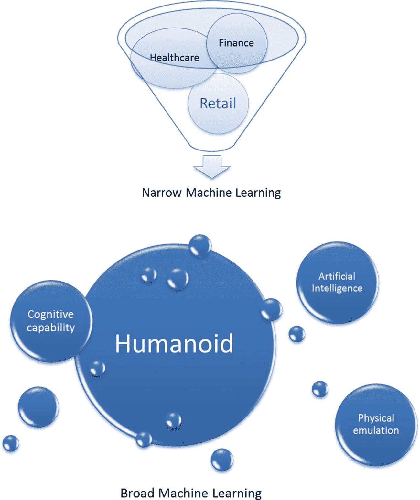

图 2-1

窄 ML 与宽 ML

在图 2-1 中，我们可以清楚地看到狭义 ML 集中在医疗保健、金融和零售等领域。相比之下，广义 ML 是关于建立一个人形机器人，赋予它人工智能(AI)的认知能力和模仿人类身体特征的能力。

现在让我们来看看广义的 ML 应用。在这里，我们谈论的是创造程序、算法和机器人软件来迎合一般技能而不是专业技能。它模拟人类的一般行为，目的是证明机器人的能力等同于人类。最近一个广泛应用人工智能的例子是名为索菲亚的机器人，由于其被证明具有模仿人类对话的能力，该机器人已经获得了沙特阿拉伯王国的公民身份。随着技术的进步，我们将会看到更多的机器人在广泛的 ML 应用中被开发出来。然而，医疗保健行业目前的趋势是狭义地采用机器人及其应用，并帮助模仿或取代新药和其他类似领域的疾病诊断研究专家。我们可以看看表 2-1 的区别。

表 2-1

狭义与广义的机器学习应用

<colgroup><col class="tcol1 align-left"> <col class="tcol2 align-left"> <col class="tcol3 align-left"> <col class="tcol4 align-left"></colgroup> 
| 

应用机器学习

 | 

应用领域

 | 

焦点

 | 

目的

 |
| --- | --- | --- | --- |
| 狭窄的 | 专业技能 | 专家能力 | 模仿并超越专家的表现 |
| 辽阔的 | 通用技能 | 一般人类行为能力 | 证明类似人类的能力 |

## 世界各地医疗保健机构的现状

现在，我想看看全球医疗保健行业的现状。图 2-2 描绘了医疗保健领域正在发生的动荡。

请注意两种对立的力量:一种是传统的医疗保健机构，通常由健康诊所、医生诊所和医院组成。另一组新出现的机构是基于机器人人工智能的。在我参加的 2018 年 3 月在班加罗尔举行的 XIME 医疗保健管理最佳实践国际会议上，这一趋势被清楚地提了出来。您可以通过以下网址了解更多关于大会的信息: [`http://xime.org/Health%20care%20conference%20report`](http://xime.org/Health%2520care%2520conference%2520report) 。

传统的医疗保健系统从医生的同情心、人情味和治疗中获得价值。与此相反，另一组机构正在迅速崛起。这些机构带来的价值是医疗保健运作的效率和准确性，更好的资源管理，以及避免传染病传播的最少人力接触。这两个系统的目标都是为病人提供更好的护理。在传统观点中，医生是不可替代的，是医疗机构的中心。然而，新的现代观点是，医生的分析能力有限，无法分析大局——因此，这样的机器算法和机器人可以做得更好。我已经在这一章讨论了狭义和广义的 ML 应用。读者应该注意到，基于机器人人工智能和人工智能的机构正试图通过首先瞄准狭窄的人工智能应用来取代传统的医疗保健系统。这里的尝试不是取代医生作为一个整体，而是取代或模仿，然后取代医生或医疗保健专业人员的某些专门功能。

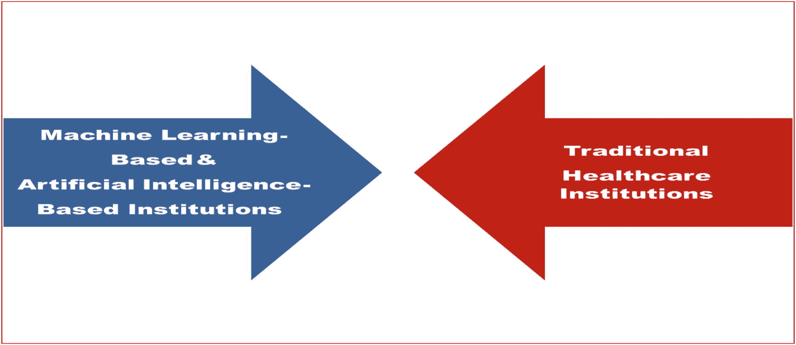

图 2-2

全球医疗保健行业的对立力量

一个用于狭义医疗任务的 ML 的例子来自西门子公司医疗工程部门。他们在计算机断层扫描上进行计算机视觉成像，并通过核磁共振扫描来观察大脑线路的样子。他们有被称为特斯拉机器的大脑解剖机器，我用它来完成这项任务。同一公司的 ML 的另一个应用是 CT 扫描仪，用于参数成像或分子成像，医疗保健工作者已经应用它来显示肿瘤是良性还是恶性。这项研究是基于将人工智能应用于 path lab 机器的 250 幅精选图像而完成的。他们开发了精确的算法，使用特斯拉机器内部的 3D 相机来定位患者，因为这曾经是一项人工辅助的任务，每个人都有自己不同的方法来定位机器内部的患者，有时会导致图像质量差。ML 算法现在能够尽可能快地定位患者，以获得更好的图像。他们还开发了深度学习算法，用于读取胸部 x 光片，并检测 x 光机中的异常。这是一种尝试，用所有摆在他们面前的 X 射线，包括核磁共振成像和 CT 扫描，来取代拥有大量专业知识的放射科医生的专业角色。在同一条线上，西门子开发了一种 MRI 图像指纹技术，使用深度学习来模仿放射科医生的工作。它也是实验室机器人自动化领域的先驱，使用了一种电磁悬浮技术，这种技术被用于世界各地的高速列车。

我现在向读者展示另一个例子，一个组织使用 ML 应用程序开发一个解决方案，以创新的方式克服社会障碍。这家公司是印度的一家初创公司，名为**尼拉迈******4****；这个概念是由两位女性 Geetha Manjunath 和 Nidhi Mathur 提出的，她们创建了这个创业公司。Nidhi 在 XIME Healthcare conference 上展示了其公司开发的用于识别女性乳腺癌的所有解决方案。在像印度这样的国家，传统观念在农村地区盛行，检测乳腺癌的主要障碍是传统系统需要医生触摸患者的乳房来检测可能癌变的肿块。甚至今天使用的主要方法是医生用他/她的手来感觉和查看身体区域是否存在肿块。为了克服这一缺点，Manjunath 和 Nidhi 研究了如何利用技术来帮助诊断乳腺癌，而不使用触摸或侵入性程序或通过乳房 x 线照相术施加压力，这是很痛苦的。因此，他们寻找一种解决方案，通过使用高分辨率、全感知的 ML 热成像，并使用图像来检测癌症的患病率。通过使用高分辨率的热传感设备和人工智能以及 ML，他们能够开发 API，这是非侵入性的，不需要任何测试，也不会给患者带来任何痛苦。他们要求在机器检测癌症患病率以及癌症是恶性还是良性时，脱掉病人的衣服，这与任何人工进行的乳房 x 光检查相匹配。随着时间的推移，我确信算法会自己学习和改进。这种专注于克服医疗保健中的社会问题的创新技术将在人口众多的国家更快地被采用，这些国家存在反对医疗帮助的社会污名，这阻止了医疗帮助作为一种治疗方法在普通人群中的传播。****

 ****### 机器学习在医疗保健中的重要性

将医疗保健与金融和零售等其他领域区分开来的事实是，医疗保健涉及人类生活，当我们应用 ML 时，我们需要以渐进和谨慎的方式采用技术，因为这里有很多风险。需要具有更高精度水平的预测模型的稳健算法。这可以从一个非常简单的例子中改变，我们建立了一个预测模型，以 95%的准确率预测特定类型的癌症。在这种情况下，预测模型将对 25 名患者进行准确预测，而对另外 5 名患者进行不正确预测。所以被错误预测的病人仍然会认为他们没有患癌症。这就是为什么在医疗保健中应用 ML 需要在生产中部署模型之前进行更多测试的原因。

医疗保健应用机器学习的一些关键领域是:

1.  **疾病识别**

2.  **个性化医疗**

3.  **药物发现**

4.  **药品制造**

5.  **临床试验研究**

6.  **放射科**

7.  **数字健康记录**

8.  **疫情爆发预测**

9.  **外科机器人**

医疗保健的所有这些领域都是医疗保健行业的核心。现在，我们将关注医疗行业的上述领域，并执行我在第一章图 [1-1](https://doi.org/10.1007/978-1-4842-3787-8_1Fig#1-1) 中讨论的 ML 技术采用过程。这种映射将有助于我们理解这些领域在当前场景中的技术采用过程中所处的位置。通过这样做，我们可以进一步了解在这些特定领域中的每一个领域中会发生什么样的进步。关于如何使用该映射信息的示例，假设您的医院已在心脏外科领域实现了手术机器人。通过从该图表中了解机器人手术在技术采用过程方面的先进程度，我们可以了解该手术应用在未来可能会有什么样的技术进步。

为了对 2018 年的全球医疗保健行业有一个当前的看法，我使用德尔菲法对 18 名医疗保健专业人员进行了一项研究。这是我做的独立研究，没有任何机构赞助。我也没有定期与任何医疗机构直接联系，以便从更独立的角度进行研究。这项研究的目的是听取专家的意见，并找出医疗保健行业中人工智能和 ML 的现状。我在研究中使用了德尔菲法。我们需要了解什么是德尔菲法，以及它如何在这项研究中帮助我们。让我们先来看看这项研究中使用的研究方法。

**研究目标** **:** 本研究的主要目标是利用专家意见找出并绘制人工智能和人工智能的两个参数:(1)人工智能和人工智能在医疗保健行业关键领域的当前技术成熟度水平，以及(2)医疗保健行业内部技术采用流程的参数。

在第一次迭代中，专家组最初确定了 12 个关键领域。然后，专家组重申了这些领域，以找出未来将会发展的最重要的领域。专家组确定了对医疗保健行业进一步发展至关重要的九个医疗保健领域。调查研究不提供关键领域的迭代选择结果，但它从专家选择这九个关键领域的点开始。我已经在本章讨论了这九个领域，从疾病识别到手术机器人。

**研究样本:**从总共 232 名专家中选出一组专家。专家组由在医疗保健行业工作超过 20 年的医疗保健专业人员组成，他们的工作岗位包括患者护理、医疗保健机构的管理专家、大型医疗保健机构的董事和首席执行官，以及从事医疗保健行业研究并发表论文的学术教授。我涵盖了医疗保健各个领域的所有专家，例如患者管理、药物研究、外科医生、首席执行官和人工智能专家——仅举几例。共有 18 名这样的专业人士被列入本次研究的候选名单。在这项研究中没有缺席或流失。

**所需信息:**为了做出决策并支持决策，我们提供了各种辅助数据，如关于医疗保健中 ML 和 AI 状态的已发表论文。西门子医疗工程师艾玛·沃森在基因组研究和癌症检测方面的研究就是一个例子。在前面提到的两个参数之间建立映射所需的信息是基于专家对九个领域技术实现现状的理解，从疾病诊断到临床试验研究。向他们提供了关于技术成熟度水平和技术分阶段识别的专家解释的决策。除此之外，没有提供其他信息，所以要小心不要在专家的头脑中产生偏见。这项研究需要的信息包括背景知识、理论知识和专家知识。这项研究还要求专家们运用他们的隐性或固有知识，这些知识是他们长期从事医疗保健行业所积累的。

**研究设计概述:**

这项研究涉及的主要步骤如下:

1.  定义研究的目标。

2.  寻找愿意帮助这项研究的专家。

3.  设计收集信息的问卷，减少专家的写作工作量。

4.  向专家发放调查问卷。

5.  收集对问卷的答复，并对其进行分析，以了解是否达成了共识。

6.  重复并管理更多的问卷，直到专家们就某个特定的关键领域达成共识。

7.  一旦达成共识，就进入下一个关键领域，重复调查问卷，直到达成共识。在达成共识之前，根据专家之前的回答提供更多信息。

8.  分析并创建 AI 和 ML 采用的技术成熟度级别和阶段图。

**数据收集方式:**

关于医疗保健的文献不是本研究要收集的数据。我之前提到的测试研究是在专家的帮助下，将对医疗保健行业的未来至关重要的 12 个关键领域缩小到 8 个。这一点很重要，因为在我们的研究中，我们根据专家过去的经验，对医疗保健行业的发展重点做出了判断。我们使用了 Chittu Okoli 和 Suzanne De Poweski 的一篇名为“德尔菲法”的论文中的德尔菲法作为研究工具和设计考虑和应用的示例 [6 。

问卷调查法用于通过电子邮件在线管理调查和以纸质方式亲自发放问卷向专家收集数据。

**数据分析:**

在一个特定的迭代过程中，当收集数据时，使用 Microsoft Excel 以表格的形式记录专家的回答。对于任何给定的关键领域，都会绘制一个图表来检查是否达成了共识，以及该图表是否充分显示了专家的共识。然后迭代停止。所以数据分析是在计算机软件的帮助下手工完成的。使用 Excel 软件绘制技术成熟度和技术采用阶段图，以创建技术地图。

**道德考量:**

如果我们没有确保结果是专家的回答，并且是匿名的，不影响这项研究的结果，那么研究可能会出现偏差。因此采取了适当的措施，以确保专家之间互不相识。正如我已经提到的，在医疗保健行业有两类人:一类人喜欢技术，另一类人不喜欢技术。我们没有根据这些特定的标准进行专家选择，所以这项研究很可能在这些基础上有所偏差，我们还没有对此进行测试。

**研究的局限性:**

定性研究的最大局限是不能准确量化未来的结果，这也非常适用于我们的研究。然而，通过在我们的问卷中使用分类变量，我们也试图对我们的结果进行定量分析。绘制技术采用图和了解技术成熟度不是一个普通人能做的事情，除非他们已经与行业相关联，这就是为什么我们选择专家来进行这项研究。然而，有可能一些专家可能没有足够的知识或接触人工智能和人工智能的进展。我们承认这可能是研究的一个局限。

从第一章中的图 [1-1](https://doi.org/10.1007/978-1-4842-3787-8_1Fig#1) 我们已经知道技术采用有四个阶段。在图 2-3 中，我们看到了这个映射。

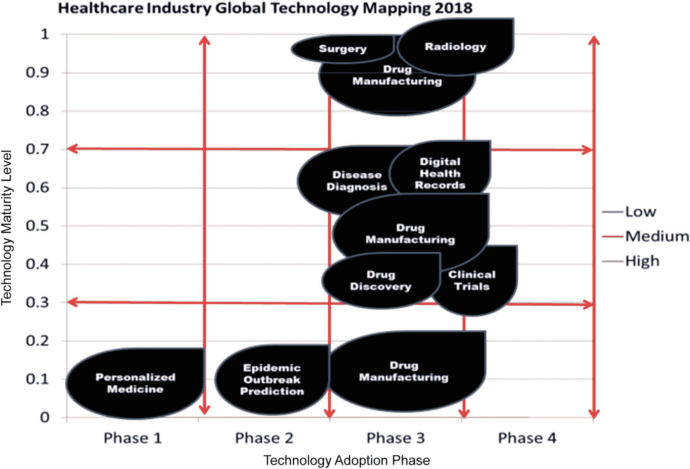

图 2-3

医疗保健行业技术采用阶段

在图 2-3 中有两个轴。x 轴代表技术采用阶段，如图 [1-1](https://doi.org/10.1007/978-1-4842-3787-8_1Fig#1) 所示，y 轴显示技术成熟度。技术成熟度应用级别。成熟度应用程序级别分为低、中和高。低表示该技术处于研究阶段，尚未投入生产。中等意味着该技术已经在生产中实现，有些成功和失败，需要更多的研究来推动主流生产。高意味着该技术已经过充分研究，准备投入生产或正在生产环境中使用，如医院等。

表 2-2 和图 2-4 展示了根据德尔菲研究法分析的数据。

表 2-2

关于研究中使用的德尔菲研究方法的数据

<colgroup><col class="tcol1 align-left"> <col class="tcol2 align-left"> <col class="tcol3 align-left"> <col class="tcol4 align-left"></colgroup> 
| 

主题

 | 

保健专家人数

 | 

迭代次数

 |
| --- | --- | --- |
| 德尔菲法 | 邀请 | 入围的 |   |
| 人工智能和人工智能在医疗保健中的应用现状 | Two hundred and thirty-two | Eighteen | four |

我们已经在本章的方法一节中讨论了这些数据。现在，我们来看看医疗保健中人工智能和人工智能的第一参数技术成熟度的数据及其图形表示。

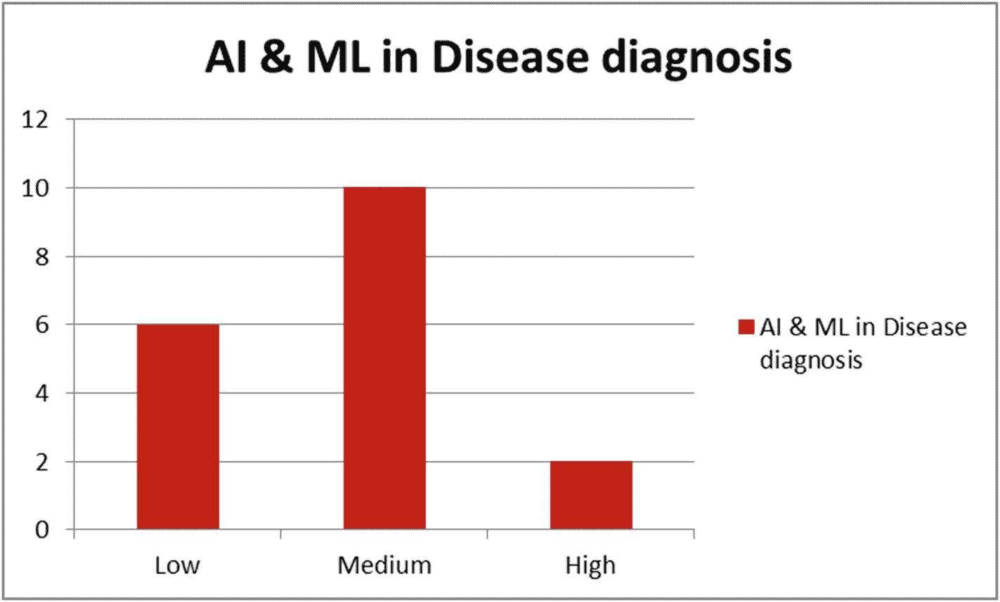

图 2-4

AI 和 ML 在疾病诊断中的地位

在疾病诊断领域，关于医疗保健行业人工智能和人工智能技术成熟度水平的第一个参数，56%的专家认为疾病诊断具有中等成熟度水平。将疾病诊断识别为中等成熟度意味着该技术已经在生产中的疾病诊断领域中实现，但是存在成功和失败，并且需要更多的研究才能进入主流生产。这个领域的一个很好的例子是谷歌用于检测糖尿病眼病的深度学习 [5 ]。

在以传统方式使用人工智能进行疾病检测的过程中，眼科医生使用眼睛后部的照片以及计算机视觉视网膜病(CVR)来检测是否有糖尿病眼病的迹象。CVR 确定图像中存在的损伤类型，其显示眼睛中是否有任何液体渗漏或是否有出血。在眼科医生对视网膜病变进行的如此复杂的分析中，谷歌的糖尿病眼睛检测器能够通过使用 327 名眼科医生提供的 100 和 28，000 张图像的开发数据集来创建一个基于人工智能的系统。深度神经网络对这些糖尿病视网膜病变图像进行了训练，当它应用于超过 12，000 张图像时，它能够与 728 名美国委员会认证眼科医生的大多数决定相匹配。该算法的 AP 分数与眼科医生手动进行的疾病检测分数相比是相同的，都是 9.5 分。

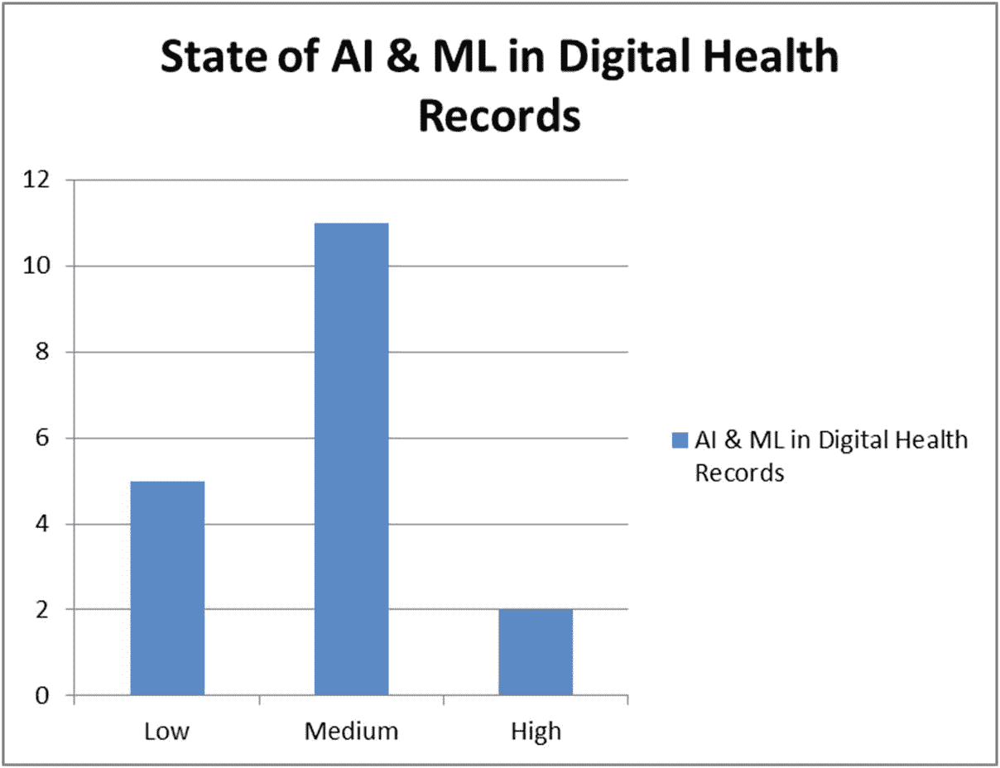

图 2-5

数字健康记录中 AI 和 ML 的状态

现在让我们看看另一个领域:数字健康记录。我们的专家得出结论，这是一个中等水平的技术成熟度，61%的专家同意这一观点。我们可以在图 2-5 中看到，他们中的一部分人(约 28%)也觉得成熟度水平处于较低水平。中等意味着该技术没有进入主流生产，在这里和那里有一些成功和失败。然而，低状态意味着研究还没有进入生产。给你一个在电子健康记录中使用人工智能的应用，有一家名为 Savana(西班牙马德里)的公司已经成功开发了一个使用人工智能 [7 ]重新使用电子健康记录的应用。

该系统最显著的特征是，它使用由医疗从业者在电子健康记录或数字健康记录中书写的自由文本形式的自然语言来分析由医生生成的实时信息。Savannah 系统对其软件记录中的所有患者进行即时统计分析，并提供与用户提供的输入变量相关的结果。它使用自然语言处理在后台完成这一目标。它使用监督 ML 将医生的书面文本分类为背景信息或诊断信息。无监督 ML 技术使用案例来确定单词的语义内容，因为算法在没有任何预定义的语义或语法关系的情况下自主学习。例如，工程师和帕金森有相似或不同的含义，例如萘普生和布洛芬或不对称类似，只是给你一个实际操作的想法。现在让我们看一下图 2-6AI&ML 在数字个性化医疗中的状态。

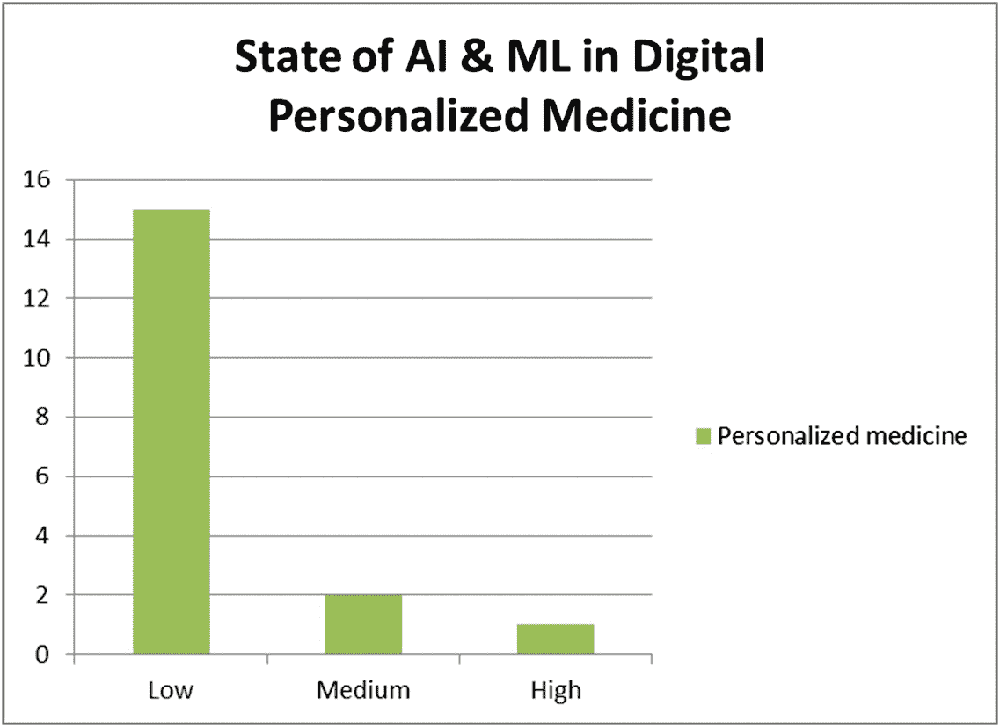

图 2-6

人工智能和人工智能在个性化医疗中的现状

现在我们来看看人工智能和人工智能在个性化医疗领域的现状。在四次迭代之后，我们的专家告诉我们，技术采用成熟度处于非常低的水平。我们 83%的专家肯定地告诉我们是这样的。个性化医疗领域也被称为精准医疗。在这里，对疾病的治疗和对病人的预防是基于他们个人的基因变异、他们生活的环境和每个人遵循的生活方式。这就像建立你自己的定制治疗。很明显，如果不使用人工智能，这个职业是不可能的，人工智能运行在超级计算机上，以便使用深度学习进行学习，并开发认知能力。这类似于医生的工作——计算机需要高处理能力。他们使用深度学习算法，并且他们需要他们希望进行诊断的领域的专业诊断知识，例如心脏病科、皮肤科和肿瘤科的医生，等等。

现在我们来看另一个关键领域，即图 2-7 中的流行病爆发预测。

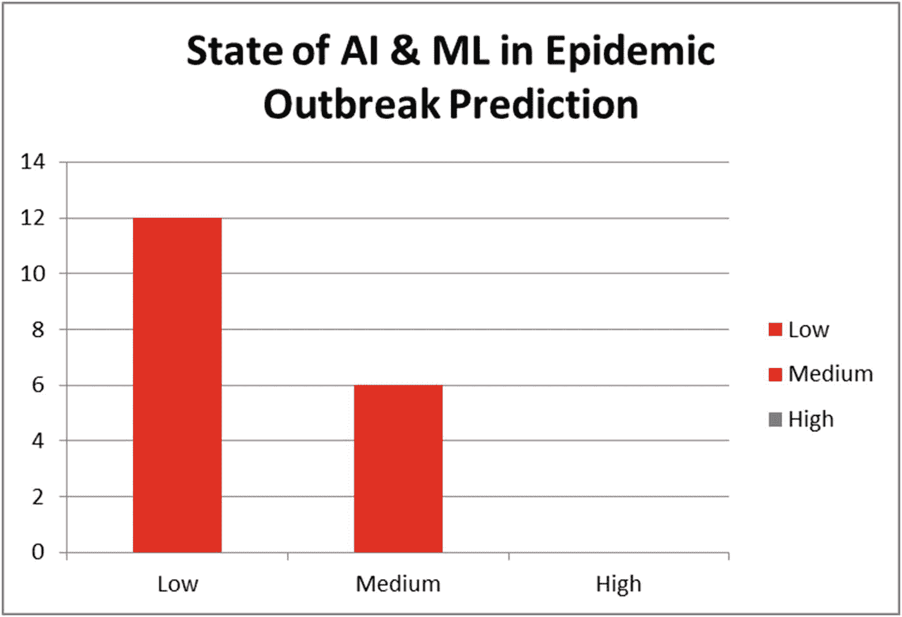

图 2-7

AI 和 ML 在疫情预测中的地位

在图 2-7 中，我们可以清楚地看到，我们的专家告诉我们，技术成熟度处于较低水平。我们的专家中有 67%的人在三轮迭代后有这种感觉，当时达成了共识。一个很好的例子是谷歌流感趋势 [2 ]，谷歌能够预测流感在许多国家的传播；然而，它不再公布结果。它过去的工作方式是，谷歌将分析搜索查询，以确定如此大量的查询来自世界哪些地区，它将自动预测这些地区将受到流感的影响。这个项目始于 2008 年，由于各种机构对隐私问题的担忧而被关闭。然而，在后台，谷歌将向不同的公共卫生机构提供这些数据，以帮助他们了解和分析趋势。这种技术是存在的，但在成为主流之前，它需要解决隐私问题。

在图 2-8 中，我们现在来看看人工智能和人工智能在放射学领域的有趣应用。

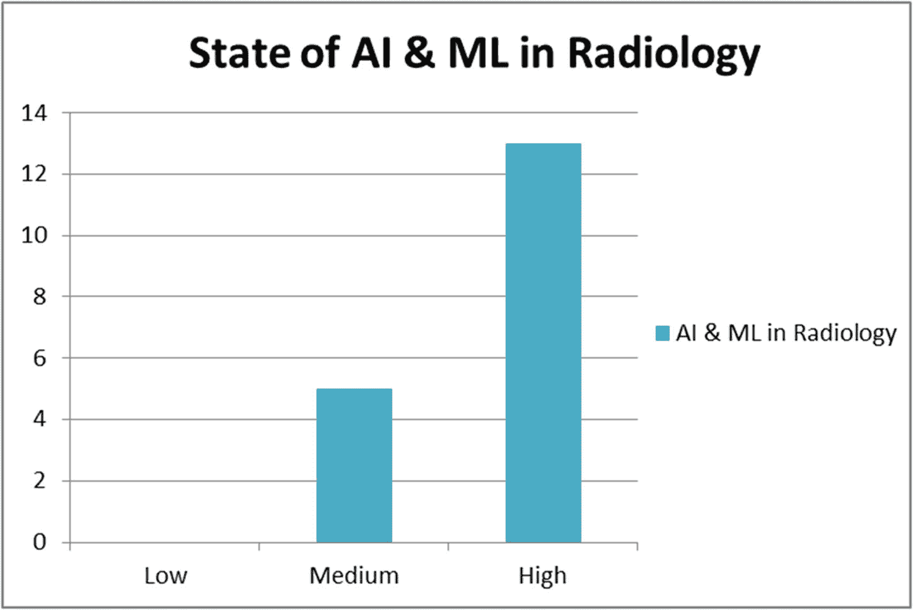

图 2-8

放射学中人工智能和人工免疫的现状

我们的专家告诉我们，经过四次迭代后，这一领域的技术成熟度很高，72%的专家得出了这一结论。西门子医疗团队的一项显著成就是将神经网络应用于 X 射线等成像，并将这些图像转换为数据，然后像放射科医生一样进行分析。这使用了深度学习，更具体地说，是复制人类神经元的人工神经网络(ann)。据报道，他们以 97%的灵敏度通过胸部 x 光片检测，并以 100%的特异性检测肺结核病例 [3 ] ( [`https://www.healthcare.siemens.com/magazine/mso-artificial-intelligence-in-radiology.html`](https://www.healthcare.siemens.com/magazine/mso-artificial-intelligence-in-radiology.html) )。

越来越多的此类应用将会出现，它们可能会集成到医疗设备中，使它们具有自动化的独立机器人功能。这是当今放射学的未来。我们现在来看看图 2-9 中 AI & ML 在下面手术中的状态。

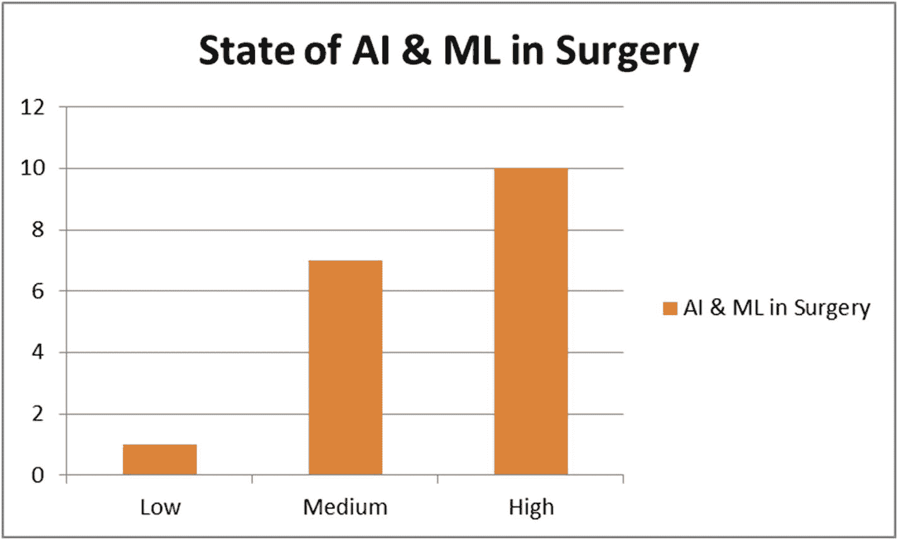

图 2-9

AI 和 ML 在外科中的地位

正如我们在图 2-9 中看到的，在外科领域，我们的专家看到人工智能和人工智能的使用处于非常高的成熟水平，在我们的迭代之后，56%的专家同意这一观点。在割肉这一外科医生的基本技能中，与人类外科医生相比，机器人能够进行精确的切割，对组织的损伤要小得多[8； [`https://spectrum.ieee.org/the-human-os/biomedical/devices/in-fleshcutting-task-autonomous-robot-surgeon-beats-human-surgeons`](https://spectrum.ieee.org/the-human-os/biomedical/devices/in-fleshcutting-task-autonomous-robot-surgeon-beats-human-surgeons) 。

有一个名为 STAR(智能组织自主机器人)的机器人，它悬停在患者上方，然后根据算法，进行专家外科医生进行的精确切割，但 STAR 通过包围肌肉造成的伤害较小。这种 STAR 系统能够缝合手术中切下的肉，而且这种缝合比有经验的外科医生的缝合更规则，更防漏。所以这清楚地表明，机器人在外科领域的使用确实处于先进阶段。在图 2-10 中，我们看到了 AI & ML 在药物发现中的状态。

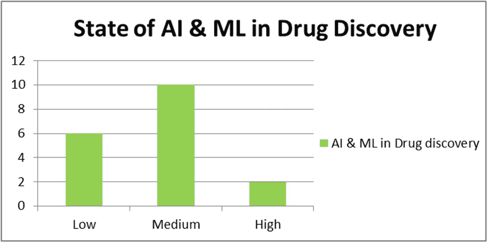

图 2-10

人工智能和人工智能在药物开发中的地位

我们的专家告诉我们，人工智能和人工智能在药物发现领域的应用处于中等技术成熟度水平，这意味着尽管有技术，但仍有许多成功和失败，因此该技术尚未进入主流生产。整个药物发现领域与临床试验密切相关，但实际上，药物发现发生在任何药物的临床试验发生之前很久。药物发现过程需要许多药物测试来检查，并且它是在许多不同的药物化合物上进行的，这可能有助于消除或限制特定疾病的传播。因此，这一发现表明，一种特定的化合物在实验室中对这种疾病起作用，用于毒性测试和其他测试，如人体吸收、运动代谢率等。一旦这些化合物在这些早期实验室测试中显示出结果，它们就会被转移到临床试验中，以获得政府的批准。最大的制药公司正在使用人工智能。像 50 Shades SK 这样的公司正在使用人工智能和 ML 来寻找潜在药物的新化合物。他们还建立模型来预测潜在药物在测试阶段的表现。发现药物及其组合正在使用人工智能开发，用于组合治疗，人工智能正在根据患者的遗传密码创造个性化的药物[9； [`https://emerj.com/ai-sector-overviews/machine-learning-drug-discovery-applications-pfizer-roche-gsk/`](https://emerj.com/ai-sector-overviews/machine-learning-drug-discovery-applications-pfizer-roche-gsk/) 。在下图 2-11 中，我们看到了 AI & ML 在药品生产中的状态。

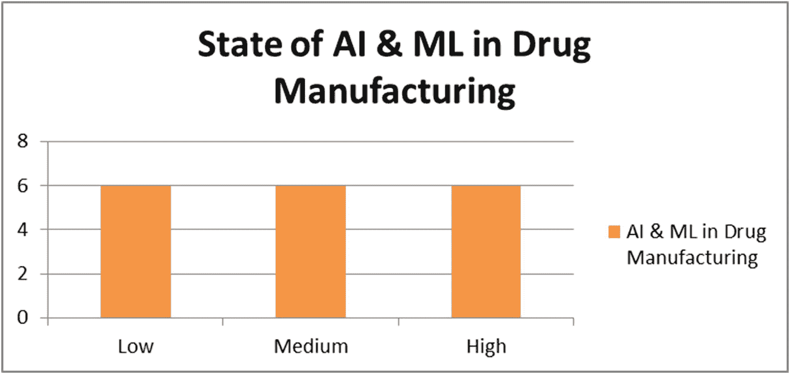

图 2-11

AI 和 ML 在药品生产中的地位

现在我们来看看 AI 和 ML 在药物制造领域的状态。这是一个有趣的案例，在四次迭代结束时，我们的专家能够最终告诉我们，药物制造处于所有三个成熟度水平(即低、中和高)。因此，这意味着在药物制造领域，这项技术还处于研究阶段，其中一些还没有投入生产。还有一些技术已经在生产中进行了测试，但尚未进入主流生产环境，如医院。专家们还告诉我们，在药物制造领域，有一些技术已经过充分研究，可以投入生产，或者已经在生产环境中使用。在卡车制造中，机器人和人工智能正被用于制药厂的自动化检测和包装，从而提高效率，并将工人从危险和重复的任务中解救出来。医药制造设施中使用的机器人为笛卡尔并联和选择性柔顺装配机械臂(SCARA)[10； [`http://www.pharmtech.com/using-robotics-pharmaceutical-manufacturing`](http://www.pharmtech.com/using-robotics-pharmaceutical-manufacturing) 。

默克公司正在其装瓶生产线上使用一个机器人来将配药盖放在瓶装过敏药物上，这提高了其运营效率。Enclave 的机器人越来越多地用于药瓶灌装应用、检查和包装，以及各种药品装配检查——仅举几例。

现在我们来看最后一个也是第九个领域，即下图 2-12 中的临床试验研究。

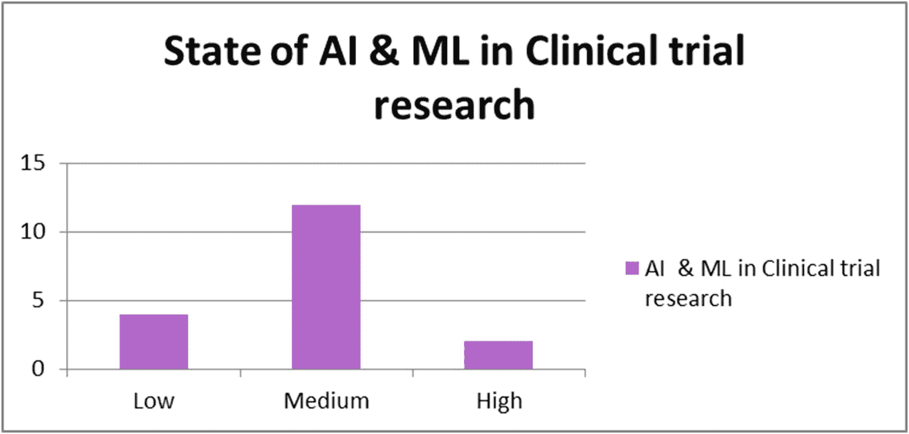

图 2-12

AI 和 ML 在临床试验研究中的地位

从图 2-12 中，我们可以看到我们的专家告诉我们，它处于中等技术成熟度的阶段，AI 和 ML 状态处于那个水平。经过四次反复，这个小组中 67%的专家能够得出这个结论。这意味着在这个领域有很多研究在进行。然而，有成功也有失败，它需要更仔细的研究，以便将技术转移到主流生产中。麻省理工学院机器人实验室在 2014 年 9 月进行了一项研究[11； [`https://news.mit.edu/2014/mit-robot-may-accelerate-trials-for-stroke-medications-0211`](https://news.mit.edu/2014/mit-robot-may-accelerate-trials-for-stroke-medications-0211) 。

也有毕马威之声在 2016 年做的研究[12； [`https://www.forbes.com/sites/kpmg/2016/12/21/using-smart-robots-to-run-clinical-drug-trials/#749ef31f36d2`](https://www.forbes.com/sites/kpmg/2016/12/21/using-smart-robots-to-run-clinical-drug-trials/#749ef31f36d2) 。

这有望实现自动化临床试验，以便在数百名患者中证明药物治疗的有效性。由于实验室仍在研究这项技术，它在现实世界中的应用很少，但有很多实验正在进行，以了解它如何帮助最大限度地减少药物发现的临床试验阶段。如果这项技术进入生产，那么它将降低药物发现和临床试验的成本，这可能需要高达 200 万美元，是一件极其昂贵和耗时的事情。

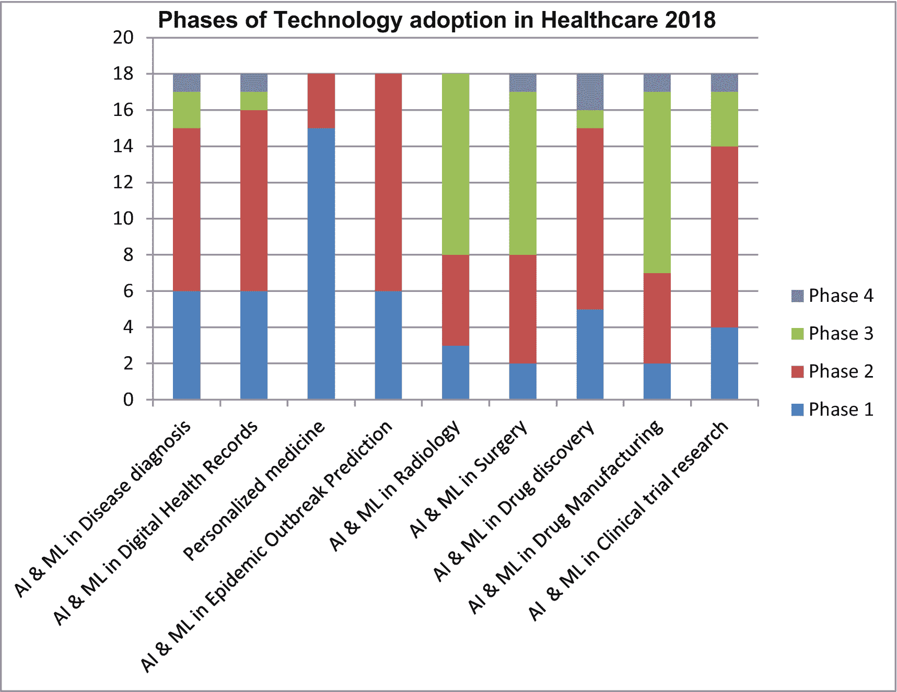

图 2-13

《医疗保健行业技术采用的阶段，2018》让我们快速了解了本书中医疗保健调查报告的技术采用流程。

现在我们继续我们研究的第二个参数，即医疗保健中技术采用的阶段，我们已经在第一章图 1-1 机器学习技术采用流程中讨论过。正如您在上一章中所回忆的，有四个阶段:阶段 1:快速申请阶段，阶段 2:早期申请阶段，阶段 3:辅助申请阶段，阶段 4:独立运营。这里我们有第二阶段的快速应用，第四阶段分析的独立操作。从图 2-13 中我们可以看到，正如我们的专家组告诉我们的，疾病诊断处于早期应用阶段 2 的状态。数字健康记录处于第二阶段，56%的专家在三次迭代后得出结论。个性化医疗处于第一阶段，即快速应用阶段，我们 83%的专家在四次迭代后得出了这一结论。流行病爆发预测领域处于人工智能和人工智能应用的第 2 阶段，这是我们 67%的专家得出的结论。我们的专家还得出结论，56%的人认为放射学处于第 3 阶段辅助应用阶段，我们已经看到在技术成熟度水平上，西门子等公司在其特斯拉机器中使用了各种应用。对于外科手术，我们的专家在三次迭代后得出结论，50%的人认为 AI 和 ML 在第三阶段为 50%，这是辅助应用阶段。我已经看到机器人手术在主流应用中的应用，如矫正心脏病的手术；这是个陷阱。在药物发现方面，我们的专家得出结论，人工智能和人工智能的应用处于初级阶段，其中 56%的专家得出结论，人工智能和人工智能处于 2 期早期应用水平。对于药物制造，56%的专家得出结论，人工智能和人工智能的使用处于第 3 阶段水平。对于临床试验研究，我们的专家认为 AI 和 ML 的使用处于 2 期早期应用水平。

至此，我们结束了这项研究的演示，我和医疗保健行业的专家花了 3 个多月的时间来实现这项研究。我真的希望它能为读者提供一个简明的观点，让读者了解医疗保健行业在人工智能和人工智能的应用和适应方面的情况。

## 尾注

1.  研究提示医疗差错现为美国第三大死亡原因，2016 年 5 月 3 日， [`https://www.hopkinsmedicine.org/news/media/releases/study_suggests_medical_errors_now_third_leading_cause_of_death_in_the_us`](https://www.hopkinsmedicine.org/news/media/releases/study_suggests_medical_errors_now_third_leading_cause_of_death_in_the_us)

2.  谷歌流感公开数据: [`https://www.google.com/publicdata/explore?ds=z3bsqef7ki44ac_#!ctype=m&strail=false&bcs=d&nselm=s&met_s=flu_index&scale_s=lin&ind_s=false&ifdim=region&hl=en_US&dl=en_US&ind=false`](https://www.google.com/publicdata/explore?ds=z3bsqef7ki44ac_%2523!ctype=m%2526strail=false%2526bcs=d%2526nselm=s%2526met_s=flu_index%2526scale_s=lin%2526ind_s=false%2526ifdim=region%2526hl=en_US%2526dl=en_US%2526ind=false)

3.  西门子医疗团队: [`https://www.healthcare.siemens.com/about`](https://www.healthcare.siemens.com/about)

4.  尼拉姆斯： ・T1️ ・T0️ ・T2️

5.  “谷歌的人工智能程序可以检测糖尿病眼病”，2017 年 7 月 17 日， [`https://research.googleblog.com/2016/11/deep-learningfor-detection-of-diabetic.html`](https://research.googleblog.com/2016/11/deep-learningfor-detection-of-diabetic.html) 。第二章医疗保健领域的关键技术进步 35

6.  [`https://www.academia.edu/399894/The_Delphi_Method_As_a_Research_Tool_An_Example_Design_Considerations_and_Applications`](https://www.academia.edu/399894/The_Delphi_Method_As_a_Research_Tool_An_Example_Design_Considerations_and_Applications) 德尔菲法

7.  Medrano，I. H .，J. T. Guijarro，C. Belda，A. Ureñ，I. Salcedo，L. Espinosa-Anke 和 h . sag gion“Savana:使用人工智能重新使用电子健康记录”，2017 年 3 月 27 日，国际交互式多媒体和人工智能杂志 4(7):8-12。[`http://www.ijimai.org/journal/sites/default/files/files/2017/03/ijimai_4_7_1_pdf_22755.pdf`](http://www.ijimai.org/journal/sites/default/files/files/2017/03/ijimai_4_7_1_pdf_22755.pdf)

8.  伊莱扎·斯特里克兰，2017 年 10 月 13 日格林尼治时间 19:30，机器人命名为 STAR(智能组织自主机器人)， [`https://spectrum.ieee.org/the-human-os/biomedical/devices/in-fleshcutting-task-autonomous-robot-surgeon-beats-human-surgeons`](https://spectrum.ieee.org/the-human-os/biomedical/devices/in-fleshcutting-task-autonomous-robot-surgeon-beats-human-surgeons)

9.  机器学习药物发现应用——辉瑞、罗氏、葛兰素史克等等，最后更新于 2018 年 11 月 29 日，发表于 2017 年 10 月 12 日作者:乔恩·沃克， [`https://emerj.com/ai-sector-overviews/machine-learning-drug-discovery-applications-pfizer-roche-gsk/`](https://emerj.com/ai-sector-overviews/machine-learning-drug-discovery-applications-pfizer-roche-gsk/)

10.  笛卡尔平行和选择性柔顺装配机械臂(SCARA)，詹妮弗·马卡里安，2014 年 11 月 19 日， [`http://www.pharmtech.com/using-robotics-pharmaceutical-manufacturing`](http://www.pharmtech.com/using-robotics-pharmaceutical-manufacturing)

11.  [`https://news.mit.edu/2014/mit-robot-may-accelerate-trials-for-strokemedications-0211`](https://news.mit.edu/2014/mit-robot-may-accelerate-trials-for-strokemedications-0211)

12.  使用智能机器人进行临床药物试验，阿什拉夫·谢哈塔，2016 年 12 月 21 日上午 11:45， [`https://www.forbes.com/sites/kpmg/2016/12/21/using-smart-robots-to-run-clinical-drug-trials/#3d61d05336d2`](https://www.forbes.com/sites/kpmg/2016/12/21/using-smart-robots-to-run-clinical-drug-trials/#3d61d05336d2)****