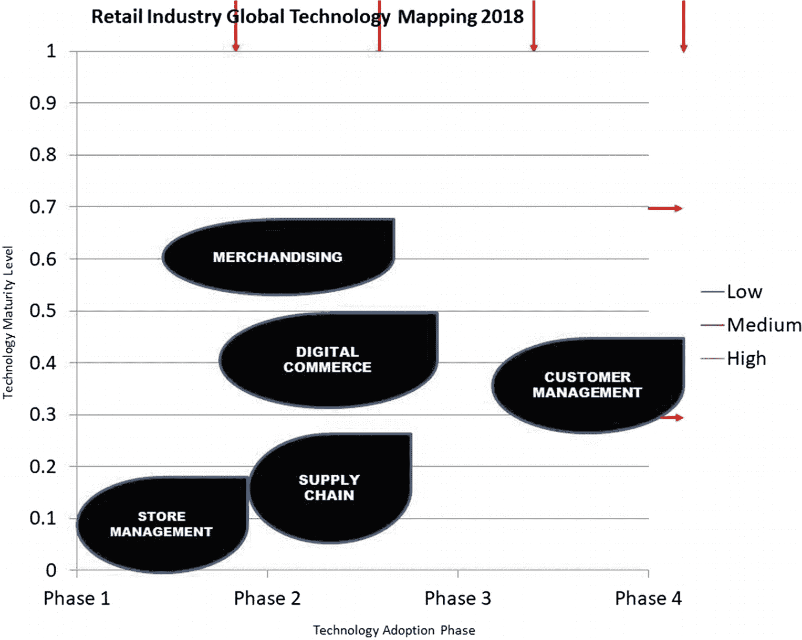
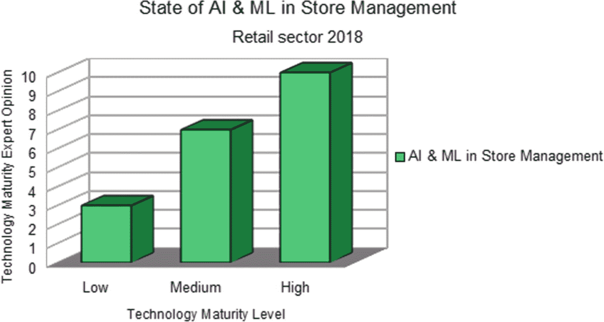
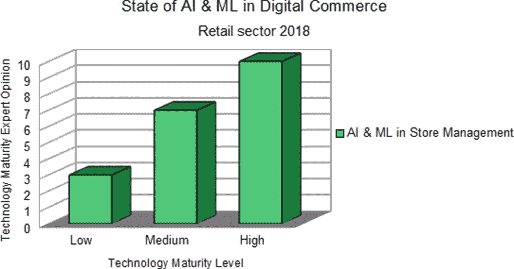
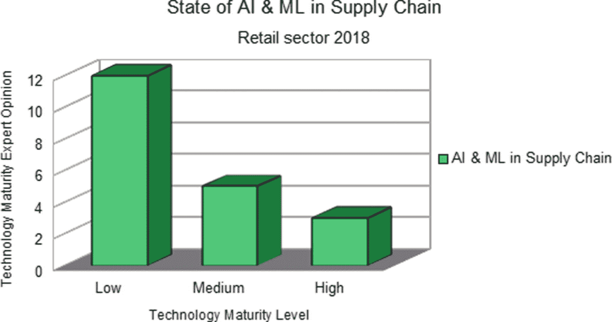
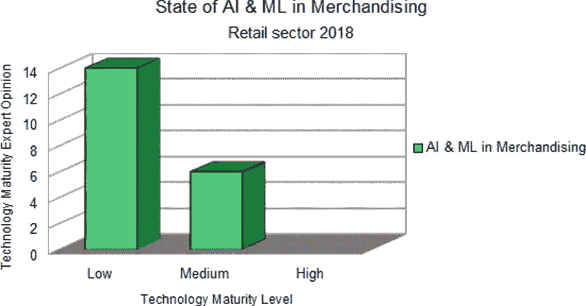
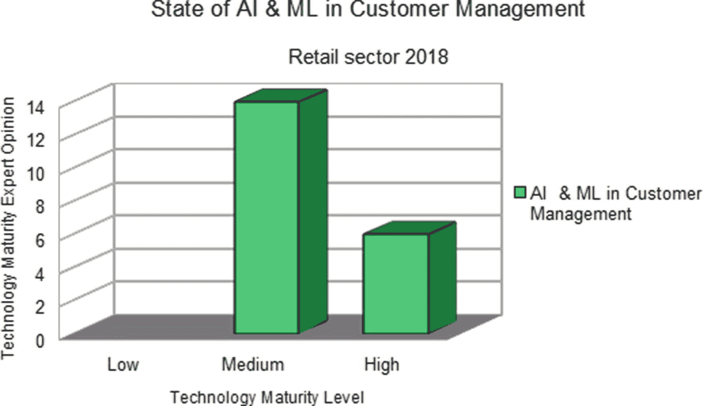
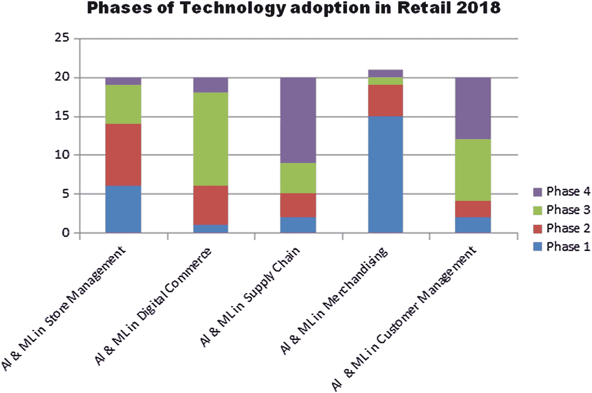

# 八、零售业的关键技术进步

## 情景 2025

在不太遥远的 2025 年，住着一位名叫珍妮的机器人工程师。她的房子完全由一个名为 GENIE 的房屋监控机器人管理。珍妮的房子配备了许多智能常用物品，如智能冰箱和智能橱柜。珍妮醒来后，她的家庭机器人为她准备好了一天的生活，给她洗了个澡，准备了早餐。像 2025 年的其他人一样，珍妮在楼上的家庭办公室工作。她上楼去和她在家办公室的机器人老板开电话会议。她不必担心订购常见的家庭用品和食物，因为她的整个房子都是智能的，并连接到她的房屋监控机器人。她的智能冰箱创建了一个快用完的物品清单，比如黄油、奶酪、果酱等。智能冰箱内部的机器学习应用程序使用传感器和图像来检查需要重新排序的商品数量。在这个时代，智能冰箱会与珍妮交谈，了解她对新产品的偏好，并为自己订购。根据这个反馈，冰箱会记住并从重新排序列表中删除珍妮不喜欢的东西。她的房子有智能橱柜，每种常见产品都有智能容器，咖啡豆、盐、糖等都有单独的智能罐子。智能容器称量储存在其中的数量，当它们达到完美的再订购阈值重量时，会向智能橱柜发出警报。这些工具在周末汇总所有订单，并将它们发送给 house GENIE。房屋精灵从智能冰箱、智能橱柜和其他类似设备中收集订单，然后向珍妮显示完整的订单。house GENIE 还从互联网上找到了每种要订购的产品的当前报价和折扣，并向 Jenny 展示了她通过选择这些产品可以节省的成本。在 house GENIE 报告订单列表后，它从 Jenny 那里获得语音反馈，对订单进行修改，然后下单。在这个新的现代世界中，所有的零售店都有自己的营销机器人，这些机器人连接到房屋监控机器人并接受订单。零售店使用无人机送货上门。物品到达珍妮的家，房屋机器人通过视觉检查检查所有物品后送货上门——这是视觉机器学习的另一种用途。对珍妮来说，最大的优势是她不必参与平凡的任务，机器人可以高效地完成这些任务。这就是零售业未来将如何改变我们的社会。

这听起来是不是很牵强或者太遥远了？

今天对你来说这听起来像科幻小说；然而，在不久的将来，这将成为现实。看看已经取得的一些技术进步，这将向你保证，未来将通过使用人工智能、机器学习和机器人等技术来帮助我们更有效地做事。2025 年场景中显示的智能冰箱可以通过创建一个简单的基于机器学习的深度神经网络来使用视觉分析，以识别冰箱中的某个项目是否接近补充需求。它还可以有传感器来确定冰箱中保存的物品与墙壁的距离。冰箱内的机械臂可以帮助抓住产品，同时对其拍照以确定其水平。我们场景中的智能冰箱需要的另一个东西是说话的能力。聊天机器人技术已经存在，我们让机器人以某种智能的方式与客户交谈。然而，机器学习需要进一步发展，才能从基于文本的转换技术转向基于音频的技术。我的意思是，聊天机器人需要理解用户发送给它们的音频，并需要实时处理答案。智能零售店中的智能聊天机器人需要理解一个狭窄的应用程序，即找出用户对店内特定产品的反馈。为了让机器人确定是否需要再次订购该产品，必须与用户进行这种对话。它需要一种程序化的方法，以特定的频率醒来，智能冰箱的用户可以使用 home GENIE 系统设置该频率，以让智能冰箱醒来并开始为下一个订单收集数据。例如，用户可以设置双周周期来补充冰箱内的产品。一旦设置完成，智能冰箱就会读取标签并扫描条形码来确定其内容。它确定并记录特定产品的使用频率，并给出在冰箱中存放了很长时间的用过的产品的列表。这当然有助于减少人们购买他们不用的产品的费用。这样的报告肯定会帮助用户做出更好的决定。

我们看到的另一个应用是支持物联网的智能橱柜。这款智能橱柜配有智能充电装置，可储存家庭使用的某些产品。智能橱柜芯片内部有传感器和机器学习应用程序，它们以一定的频率醒来，并确定是否需要重新订购任何特定的产品。用户设置重新订购产品的阈值；例如，如果储存在智能罐中的大米的数量达到储存价值的 20%，则可以重新订购。这个警报是由智能充电通过智能橱柜传感器发送的，智能橱柜传感器记录警报并将其发送到 home GENIE 系统。home GENIE 收集所有这些奖项，并每天向客户展示一次，以获得他们的反馈。我们现在有技术来实现搜索场景；然而，一些公司需要做实际的研究，然后创建这样的系统。

## 零售业中的狭义与广义机器学习

正如我们在医疗保健领域看到的那样，零售领域也有类似的趋势，狭义的机器学习技术突然大量增长，而不是广泛的应用。

购物中心的客流量有下降的趋势，人们越来越多地从最佳购买文化转向选择性购买文化。人们的购买模式也发生了变化，他们不再花在衣服上，而是花更多的钱在旅游、赌博和其他娱乐活动上。 [`https://risnews.com/top-8-retail-trends-watch-2018`](https://risnews.com/top-8-retail-trends-watch-2018) 。

在我看来，这并不是一个令人惊讶的趋势，而是零售业应该提前思考和准备的事情。从基于体验的购买转向基于选择的购买的原因之一是全球流量的上升。周末的交通状况变得很糟糕，每个人都试图在同一时间购买，堵塞了道路。因此，人们选择在线家庭送货模式，送货上门，而不必冒险去堵车。

为了迎合这些城市购物者，大型购物中心将不得不通过创建社区自动驾驶商店来重塑自己。我的意思是，将会有移动自动驾驶商店，它将根据他们的社交媒体活动驶过特定的社区，并为该社区提供走出家门购买产品的选项，而不是开车去零售店。基于社区的自动驾驶零售店可以是一辆改造成小型购物中心的大卡车，它足够智能，可以跟踪用户对展示在里面的特定产品的面部反应。这种智能商店还会记录顾客当前的颜色偏好，并通过指导他们选择与他们穿着相似的颜色来与顾客交谈。它还可以温和地询问顾客是否有任何颜色偏好。这是零售部门如何利用技术来迎合消费者不断变化的模式和需求的一个例子。智能商店还会通过提前了解特定社区的回头客的偏好来迎合他们。它可能会返回客户上次访问智能社区自动驾驶商店时订购的某些商品，当时可能没有该产品。这种类型的商店可能类似于 Amazon Go，其中客户资料与卡片一起使用，以跟踪他们在访问智能社区自驾车商店期间购买的商品。该商店将通过社交媒体宣传活动等渠道宣布其下一次访问，这些活动基于地理位置地图，只针对居住在该社区的人。这将降低零售公司的促销成本，因为有针对性的促销将有助于他们只接触到那些可能在附近购买的人。

## 全球零售机构的现状

在图 [7-1](07.html#Fig1) 中，你可以看到我们有三种类型的零售机构。第一种类型是典型的实体组织。这是销售产品的传统方式，让顾客来到商店，然后购买产品。一些实体组织确实有网站；然而，这些网站只是为了提供关于他们商店的公司及其产品的信息，以及做促销广告。他们的主要精力是把顾客带到商店。

下一种零售机构是在线零售商。这种类型的零售组织的主要精力集中在将客户带到其在线商店网站上。这家在线零售商使用社交媒体博客和其他互联网服务将顾客带到其网站。成为一个在线零售商并不意味着他们没有一个实体的存在。这实际上意味着实体建筑仅用于仓储和销售目的。

第三种零售商是既有实体店又有在线电子商务网站来为其在线客户服务的零售商。实体店通过创建在线电子商务网站获得的优势是信誉。去过那家公司商店的购物者非常了解这家公司，因为他们是忠实的回头客，他们知道他们从这些商店购买的产品。因此，对于这样的客户来说，通过其在线网站从实体店订购经常使用或购买的物品是很方便的。由于顾客减少，越来越多的实体店开始转向这种商业模式。

为了向您解释全球零售机构的现状，让我们以美国的一家大型零售连锁店为例。TJX 是一家美国大型零售商，年收入超过 3300 万美元，员工总数为 35，000 人。它有八个部门。它的零售店遍布世界各地，如加拿大、英国和欧洲。它主要经营服装、鞋类、婚礼用品、食品、家具、珠宝、美容产品和家庭用品等产品。这家零售巨头旗下有各种品牌，如 TJMaxx、HomeGoods、HomeSense、Marshalls、Sierra Post、Winners 等。Marshalls 是一个专注于时尚、家居用品和其他配饰的品牌，是 TJX 集团的实体零售连锁店。TJMaxx 是另一个不提供在线销售的品牌。类似地，TJX 集团的家居商品零售商店品牌不提供在线购物设施。TJX 集团有另一组零售商店，它们遵循混合模式，既有商店，也有购买商品的在线设施，其中包括 Sierra Trading Post，它出售男女老少的服装和鞋类，以及家具、珠宝、家居和时尚商品。顾客可以在网上查看产品，并订购送货上门。TJX 还有另一个与风格和时尚服装相关的零售商店品牌 Winners，它也不提供任何在线购买其产品的选项。你必须去 Winners 商店看看它的新品，然后做出购买决定。同样，TJX 还有另一个名为 HomeSense 的零售商店品牌，也不提供任何在线购物服务。

实体零售连锁店的另一个例子是家得宝，它现在为顾客提供了通过电子商务网站购物的便利，家得宝通过其零售商店和在线网站提供家具、室内装潢和其他家居服务。沃尔玛也是类似商店的一个例子，它有一个巨大的实体商店；然而，它现在允许顾客选择在线订购。“美国制造”也是一个既有实体店又有网上购物设施的商店的例子。

## 机器学习在零售业中的重要性

零售部门不同于大多数其他部门，因为它依赖于活动、物流或供应链管理。这也是 TJX、沃尔玛和梅西百货等大型组织每分钟都有大量来自客户的内部数据产生的一个因素。只要商店还开着，就会产生账单，每个顾客都会有大量的数据。塔吉特百货是首批建立精确模型来预测顾客下一步会买什么的商店之一。在媒体发表的一篇报道中，Target 正处于一场争议之中，其机器学习系统能够预测一名少女的怀孕，甚至在她的父亲意识到她怀孕之前。商店收集与每个客户的信用卡、姓名或电子邮件地址相关联的数据，并创建一个人在商店购买的商品的存储桶。使用孕妇的购买模式，它能够检测出孕妇在第二个三个月开始时购买香味乳液的模式。因此，机器学习系统能够将孕妇描述为购物者，因为她突然大量购买无味肥皂、超大棉球、洗手液和毛巾。Target 使用这些数据，在系统预测到孕妇怀孕的特定阶段时，向她们发送特定的优惠券。在这种情况下，该系统能够如此准确地预测明尼阿波利斯一名少女的怀孕，以至于其系统向该少女发出了关于婴儿服装和痉挛的提议。当这位父亲在邮件中看到这些时，他变得很愤怒，并愤怒地去找目标商店经理谈话，经理道歉了。然而，当父亲回家后与女儿交谈时，她透露自己怀孕了。这位父亲后来道歉说，你比我更清楚我家发生了什么事[[2](#Par74)； [`https://www.forbes.com/sites/kashmirhill/2012/02/16/how-target-figured-out-a-teen-girl-was-pregnant-before-her-father-did/#4a9c59c86668`](https://www.forbes.com/sites/kashmirhill/2012/02/16/how-target-figured-out-a-teen-girl-was-pregnant-before-her-father-did/#4a9c59c86668) 。这是一个经典的例子，通过机器学习使用技术，并根据人们的购买行为预测他们的事件。这也引发了数据隐私问题，以及大公司试图通过挖掘数据来控制人们生活的事实。在零售业的机器学习真正开始预测人类生活的方方面面之前，所有这些问题都需要得到解决。

就我个人而言，在社交媒体上，我没有看到有人在走出家门的那一刻就抱怨隐私被完全侵犯了。据报道，有这样的情况，一个家庭去餐馆，正要点菜，正在讨论他们想吃什么，这个男人在和他的女儿谈话时多次说出“比萨饼”这个词。突然，他的移动设备上收到一条短信，说如果他今天订购比萨饼，他所在的餐馆将给他 25%的折扣。他很惊讶，他刚刚对他的女儿说了几次比萨饼，现在他收到了比萨饼的报价。从零售商的角度来看，这种对技术的过度使用看起来不错；然而，从顾客的角度来看，这意味着他们在餐厅内的谈话不仅被听到和记录，而且还被分析和采取行动。机器学习和音频分析使这成为可能。在这种机器学习技术成为主流并应用于每个零售柜台之前，隐私问题需要得到解决。

需要注意的重要一点是，这种技术的应用根本不可能通过人类来实现。人类无法从如此海量的数据中发现模式。为了发现女性怀孕这样的事件，像 Target 或沃尔玛这样的公司需要数 Pb 的数据来发现她们之间的频繁模式。为了做出准确的预测，训练数据也需要相当准确。因为俗话说，垃圾进，垃圾出。这将要求顾客能够允许商店进行分析并得出结论。

现在，我将带您通过一项在线调查，由零售行业的专家通过德尔菲法找出该行业的哪些细分市场属于技术采用水平。这项调查与本书医疗保健部分的调查非常相似。零售专家在初步调查中确定的关键领域是商店管理系统、数字商务、供应链管理、销售和客户管理。开展这项调查的目的是让读者清楚地了解零售业各个领域的技术采用成熟度。专家分散在实体商店、在线零售商和混合组织中。

零售业应用机器学习的一些关键领域包括:

1.  **商店管理系统**

2.  **数字商务**

3.  **供应链**

4.  **商品销售**

5.  **客户管理**

商店管理系统包括管理商店车间各种产品的内部布局。它还包括运用技巧在顾客经常光顾的地区附近展示最有吸引力的商品。这在很大程度上是一个领域，商店经理利用自己的经验将最有利可图的产品摆在顾客面前。不仅如此，商店管理还包括将商品归类到相似的类别中，并将它们放在一起，这样顾客就可以更容易地对同一产品的不同品牌进行比较。虽然这听起来像一个简单的活动，但如果你考虑到世界上任何地方的任何大型商店都有数千种不同类别的产品要展示，这几乎会成为商店管理的噩梦。从仓库库存中填满货架上的产品也是一件需要小心处理的事情。在世界各地，商店经理一直在尝试最能吸引顾客的商店地板设计和陈列。确定具有季节性促销价值的产品，如圣诞节展示和 12 月或任何其他地方或地区节日期间的礼品，也是商店管理人员的工作。这种活动在很大程度上是一种由人推动的活动，需要一些技能和经验来了解在增加商店销售额方面什么可行，什么不可行。

数字商务是一个快速增长的领域，也是大多数客户在不久的将来会迁移到的领域。大多数实体店现在都有自己的网站，比如沃尔玛有 walmart.com，TJX 有 TJx.com，梅西有 macys.com，塔吉特有 target.com。当一家公司从一个实体设施延伸其服务时，它就更容易将产品运送到人们的家中。该公司节省了商品仓储费用，而这是独家在线零售商需要做的。实体店提供的额外优势是，它有一个忠诚的客户群，不断回来接受更多订单。因此，当顾客从这样的商店订购产品时，他们知道如果寄给他们的产品不符合标准，他们可以去实体店并向他们的顾客服务台提出投诉。Amazon.com 和 Alibaba.com 等在线零售商没有任何大型实体店；然而，他们可以使用机器学习，根据用户过去的购买模式向用户提供更好的建议。

供应链管理处理零售商店运作所必需的物流。它具有客户无法直接看到的后端活动，并涉及保持数以千计的产品供应商的联系，并根据即将到来的需求进行更新。主要零售连锁店提前向供应商下订单，这样任何一家商店的库存都不会枯竭。这里要注意的关键点是，一个糟糕的供应链系统会让一个零售连锁店损失数百万美元。如果订购的产品多于市场需求，将导致更多材料的库存，这将增加零售商店公司的仓储成本。如果订购的产品少于市场需求，就会导致客户不满。这就是为什么供应链管理被称为零售业的心脏。一些商店遵循将仓库设在离商店更近的地方的做法；然而，一些连锁商店遵循在供应商附近开店的做法。这两种方法都适用于不同的公司，在解决这一关键活动时没有对错之分。

销售是另一个非常重要的活动，它决定了商店是否盈利。我这样说是因为销售包括确保商店库存充足，产品价格有竞争力。在零售连锁店的幕后工作的跟单员确保他们跟上消费者销售趋势，允许他们以适合零售连锁店的价格购买该类型的产品，以获取利润。举个例子，采购经理至少提前 6 个月就开始计划圣诞销售，他们通过购买特定类型的产品，查看过去的圣诞销售报告和与圣诞销售一致的新产品发布来进行计划。他们还决定什么样的产品在商店陈列中得到优先考虑，这样顾客就会被吸引过来，从而做出有利的购买决定。采购经理的关键技能是谈判零售链购买的库存商品的最低价格。采购计划是采购经理使用的一项重要技能，目的是确保商店在正确的时间储备正确的商品。大型零售连锁店的销售专家确保他们知道哪种销售策略对顾客最有吸引力，因为他们随时了解全年发生的消费者变化或购买模式。销售还包括商品成本的评估和监控，以及双赢的合同谈判。

客户管理包括获得新客户和增加现有客户的忠诚度。零售连锁店的这一部分监控到商店的新顾客流，以确保连锁店的收入增长。回来购买更多产品的老客户也同样重要，因为他们会重复购买，并传播关于该品牌的好消息。如果一家商店只有新顾客光顾，而老顾客减少，那么这表明该商店的促销计划是有效的，但当顾客从连锁店购买商品时，他们对这种体验不满意。在这种情况下，一段时间后，即使是新的顾客流也会停止，因为坏的口碑会在连锁店中传播。只有老顾客光顾，很少有新顾客光顾，这种情况也不太健康。这说明连锁门店的促销方案没有被新客户接受，有可能是因为更好的优惠而去竞争。在这种情况下，当老顾客在市场上看到更好的报价时，他们也可能转向新的竞争对手，慢慢地放弃连锁店。所以在这两种情况下，连锁商店都失去了生意。任何连锁商店的客户管理实践都应该真正照顾到老客户，并确保新客户在市场上也能提供有竞争力的产品。现在让我们来看看调查及其研究方法。

*   **研究目标:**本研究的主要目标是利用专家意见找出并绘制人工智能和机器学习的两个参数:(1)零售行业关键领域中人工智能和机器学习的当前技术成熟度，以及(2)零售行业内部的技术采用流程。

*   在第一次迭代中，专家组确定了 16 个初始关键领域。然后，与专家组一起重申这些领域，以找出其中将来会发展的重要演示领域。专家组确定了零售业中对零售业进一步发展至关重要的五个领域。调查研究不提供关键领域的迭代选择结果，但它从专家选择这五个关键领域的点开始。我已经在本章讨论了这五个领域，从商店管理到顾客管理。

*   **研究样本:**从总共 125 名专家中选出一组专家。这些专家包括在该行业工作了 20 多年的零售专业人士，从客户服务到零售机构的管理专家、零售设施的主管、零售组织的首席执行官，或者从事零售业研究并发表过论文的学术教授。我介绍了零售业各个领域的所有专家，例如供应链管理、客户服务、商品销售、首席执行官和人工智能专家——仅举几例。共有 20 名这样的专业人士入围了这项研究。在这项研究中没有缺席或流失。

*   **所需信息:**为了做出决策并支持决策，提供了各种二手数据(例如，关于机器学习和人工智能在零售业中的状态的已发表论文)；一些例子是塔吉特或沃尔玛。创建上述两个参数之间的映射所需的信息基于专家对从商店管理到顾客管理这五个领域的技术实现现状的理解。为了使专家对技术成熟度水平的解释做出决策，向他们提供了分阶段的技术鉴定。除此之外，没有提供其他信息，所以要小心不要在专家的头脑中产生偏见。这项研究需要的信息是背景知识、理论知识和专家知识。还要求专家们利用他们在零售业中长期积累的隐性或固有知识。

## 研究设计概述:

这项研究涉及的主要步骤如下:

1.  定义研究的目标。

2.  寻找愿意帮助这项研究的专家。

3.  设计问卷，收集信息，减少专家的写作工作量。

4.  向专家发放调查问卷。

5.  收集对问卷的答复，并对其进行分析，以了解是否达成了共识。

6.  重复并管理更多的问卷，直到专家们就某个特定的关键领域达成共识。

7.  一旦达成共识，继续下一个关键领域，并重复调查问卷，直到达成共识。在达成共识之前，将根据专家之前的回答提供更多信息。

8.  分析并创建技术成熟度水平和采用人工智能和机器学习阶段的地图。

## 数据收集方法

关于零售的文献不是这项研究要收集的数据。进行的测试研究(我在前面提到过)是在专家的帮助下，将对零售业的未来至关重要的 16 个关键领域缩小到 5 个。这是一件重要的事情，因为在我们的研究专家中，我们根据他们过去的经验来判断零售业的重点。我们使用了奇图·奥科利和苏珊娜·德·波斯基题为“德尔菲法”的论文中的德尔菲法作为研究工具、范例、设计、考虑和应用[[1](#Par73)； [`https://www.academia.edu/399894/The_Delphi_Method_As_a_Research_Tool_An_Example_Design_Considerations_and_Applications`](https://www.academia.edu/399894/The_Delphi_Method_As_a_Research_Tool_An_Example_Design_Considerations_and_Applications) 因为它是收集专家意见供我们研究的最佳研究工具。

问卷调查法用于通过电子邮件和在线调查从专家那里收集数据。

## 数据分析

在收集数据的特定迭代过程中，使用 Microsoft Excel 软件以表格形式记录专家的回答。对于任何给定的关键领域，都会绘制一个图表来检查是否达成了共识，如果图表充分显示了共识，那么迭代就会停止。所以数据分析是在计算机软件的帮助下手工完成的。使用 Excel 软件绘制技术成熟度和技术采用阶段的地图，以创建技术地图。这也是在微软 Excel 的帮助下完成的。

## 道德考量

如果我们没有确保结果和专家的回答是匿名的，并且不影响这项研究的结果，那么研究中可能会出现偏见。因此，采取了适当的措施来确保专家之间互不相识。正如我已经提到的，在零售业中有两种人:一种人喜欢技术，另一种人不喜欢技术。我们没有根据这些特定的标准进行专家选择，所以这项研究很可能在这些基础上有所偏差，我们也没有对此进行测试。

## 研究的局限性

定性研究的最大局限是不能准确量化未来的结果，这也非常适用于我们的研究。然而，通过在我们的问卷中使用分类变量，我们也试图对我们的结果进行定量分析。绘制技术采用图和理解技术成熟度不是一个普通人能做的事情，除非他们已经与行业相关联；这就是为什么我们选择专家来进行这项研究。然而，有可能一些专家可能没有足够的知识或接触人工智能和机器学习的进展。我们承认这可能是研究的一个局限。

## 检查研究

从本书的图 [1-1](01.html#Fig1) 中，我们已经知道技术采用有四个阶段。在图 [8-1](#Fig1) 中，我们看到了这个映射。

图 8-1

零售业技术采用阶段

从图 [8-1](#Fig1) 来看，有两个轴:x 轴代表图 [8-1](#Fig1) 中概述的技术采用阶段，y 轴代表技术成熟度水平。技术成熟度应用级别。**成熟度应用级别分为低、中、高。低表示该技术处于研究阶段，尚未投入生产。中等意味着该技术已经在生产中实现，有些成功和失败，需要更多的研究才能进入主流生产。高表示该技术经过充分研究，准备投入生产或正在生产环境中使用，**如零售店等。

这里介绍的是表格和图表中的数据及其对德尔菲研究方法的分析。

表 8-1

关于研究中使用的德尔菲研究方法的数据

<colgroup><col class="tcol1 align-left"> <col class="tcol2 align-left"> <col class="tcol3 align-left"> <col class="tcol4 align-left"></colgroup> 
| 

主题

 | 

零售专家数量

 | 

迭代次数

 |
| --- | --- | --- |
| 德尔菲法 | 邀请 | 入围的 |   |
| 人工智能和人工智能在零售业的应用现状 | One hundred and twenty-five | Twenty | four |
| 人工智能和人工智能在零售业的未来应用 | One hundred and twenty-five | Twenty | five |

我们已经在本章的方法一节中讨论了这些数据。现在，我们来看看零售领域人工智能和机器学习的技术成熟度参数的数据及其图形表示。

现在，我们来看看图 [8-2](#Fig2) 中零售部门的人工智能和人工智能在商店管理中的状态。

图 8-2

人工智能和人工智能在商店管理中的地位

在商店管理领域，关于零售业人工智能和机器学习技术成熟度水平的第一个参数，50%的专家认为它具有很高的成熟度。确定商店管理处于高成熟度水平意味着该技术已经在该生产领域实现，并且正在主流生产中使用。这方面的一个很好的例子是百思买商店雇用的机器人售货员，被称为“克洛伊”( [`https://www.businessinsider.in/I-went-to-Best-Buy-and-encountered-a-robot-named-Chloe-and-now-I'm-convinced-shes-the-future-of-retail/30-seconds-later-she-brought-me-my-purchase-and-passed-the-DVD-to-me-through-a-chute-/slideshow/49507844.cms).`](https://www.businessinsider.in/I-went-to-Best-Buy-and-encountered-a-robot-named-Chloe-and-now-I%2527m-convinced-shes-the-future-of-retail/30-seconds-later-she-brought-me-my-purchase-and-passed-the-DVD-to-me-through-a-chute-/slideshow/49507844.cms)

机器人使用触摸屏与商店顾客交流，并能够在 30 秒内让他们购买他们选择的产品。克洛伊测试于 2015 年在纽约切尔西区开始。测试机器人看起来更像一个自动化的工业手臂，但能够通过玻璃屏幕后面显示的屏幕进行通信。在这家机器人商店中，地板机器人已经完全取代了员工，每天为顾客检索商品。它能够在商店内的整个地板空间内移动。克洛伊机器人具有智能，它能够跟踪客户的购买模式，并能够预测对高需求产品的新库存购买。

甚至沃尔玛也在为商店管理部署机器人，它已经在几家商店成功测试了货架扫描机器人。这些机器人有 2 英尺高，它们使用摄像机来检查是否有任何商品缺货。机器人还会检查商品上错误的价格或缺失的标签。它们与商店管理系统相连接，这样人们就可以看到任何问题，例如遗漏的价格或错误的股票价格。这些机器人被设计成当它们看到顾客走近时就会停下来。这是辅助操作的一个应用，机器人正在帮助人类做得更好。

现在让我们看看另一个领域:图 [8-3](#Fig3) 中的数字健康记录。

图 8-3

人工智能和人工智能在数字商务中的地位

我们的专家得出结论，这是一个技术成熟度很高的国家，80%的专家得出了这个结论。我们可以在图 [8-3](#Fig3) 中看到，他们中的一部分人(约 15%)也觉得成熟度处于中等水平。中等意味着该技术还没有进入主流生产，在这里和那里有一些成功和失败。然而，高状态意味着研究已经进入生产阶段。

户外服装零售商 North Face 正在其网站上使用基于机器学习的 IBM Watson 引擎，以个性化其在线客户的购物体验。在他们的手机上下载应用程序，并对着应用程序说话，就像你对销售人员说话一样。虚拟销售人员向客户提出一系列问题，帮助他们了解客户的偏好，并提供符合客户需求的产品。机器学习的另一个很好的应用是 Amazon.com 大学的推荐引擎。电子商务零售商使用机器学习的另一个好例子是网飞如何使用大数据和机器学习来研究观众如何消费电影，包括研究整季剧集的发布以及何时自动播放下一集，并优化与特定电影相关的推荐。网飞大学的机器学习每年为他们节省 100 万美元。这超过了他们从推荐产品和自动播放下一部电影中获得的收入增长。这是对机器学习的一种非常明智的使用，它不仅为公司增加了收入，还降低了成本。电子商务公司很快采用了机器学习，并获得了优势，因为他们的运营已经数字化。只需要机器学习工程师团队确定应用的业务领域，然后为它们编写生产就绪的代码。这就是为什么实体公司需要更多时间来适应机器学习应用程序，因为他们有物理限制要解决。

在图 [8-4](#Fig4) 中，现在我们来看看人工智能和机器学习在供应链领域的状态。

图 8-4

供应链中人工智能和物流管理的现状

在五次迭代之后，我们的专家告诉我们，技术采用成熟度处于非常低的水平；我们 60%的专家肯定地告诉我们这是事实。供应领域也被称为物流。亚马逊正在提供机器学习，用于实时预测、规划和优化履行网络所需的数百万件商品。亚马逊将机器学习应用于不同问题的大量数据:推荐、销售运营、规划、自动化和机器学习，其中它根据预测确定要通过其供应商订购的搜索产品。

沃尔玛正在使用人工智能和机器学习来为客户提供产品。它正在将机器学习用于沃尔玛员工配送计划，在该计划中，机器学习选择最佳路线，以更高效地向客户配送订单。这有助于购物者避免在沃尔玛超市排队结账。沃尔玛使用机器学习来学习客户想要什么，然后在正确的时间和正确的地点以正确的价格提供给他们[[4](#Par76)； [`https://scsolutionsinc.com/news/Walmart-turns-to-ai-to-serve-you-better`](https://scsolutionsinc.com/news/Walmart-turns-to-ai-to-serve-you-better) 。

现在我们来看另一个关键领域——图 [8-5](#Fig5) 中的销售领域。

图 8-5

人工智能和 ML 在商品销售中的地位

我们可以清楚地看到，我们的专家告诉我们，技术成熟度处于较低水平。经过四轮反复，当达成共识时，67%的专家认为是这样。这方面的一个很好的例子是曼坦系统公司关于商品分析的案例研究[ [5](#Par77) ]，秘鲁的一家零售公司通过对商品数据实现机器学习，成功地利用了这些数据。Manthan 的解决方案能够利用其数据仓库中 350 的未使用数据，这些数据通过基于季节生成报告和比较各种趋势分析来发现模式。通过该系统，使用商品分析与供应商进行当前数据交流也变得非常容易，因为所有的库存、销售预测和当前采购都放在同一个系统中，以便预测未来的需求[[5](#Par77)； [`https://www.manthan.com/downloads/case-studies/Ripley-peru.pdf`](https://www.manthan.com/downloads/case-studies/Ripley-peru.pdf) 。

在图 [8-6](#Fig6) 中，我们现在来看看人工智能和机器学习在客户管理领域的一个有趣应用。

图 8-6

人工智能和人工智能在客户管理中的地位

经过四次迭代后，我们的专家告诉我们，该领域的技术成熟度处于中等水平，70%的专家得出了这一结论。我们都知道 Amazon.com 的客户产品推荐引擎已经帮助它产生了 55%的重复订单。对于实体销售人员来说，推荐引擎是一个很好的在线替代品。然而，在这里，几乎没有人可以交谈，人们只是在屏幕上得到一个关于推荐产品的通知。像这样显示推荐并不容易，但必须有机器学习应用于其中，这样客户才能看到他们实际上会购买的推荐。仅仅显示顾客最后从商店购买的东西并不是一个好的建议。我们看到这种失误发生在许多声称使用机器学习向现有客户推荐产品的网站上。一个好的推荐引擎的真正关键是在研究了数百万用户的数据后，然后用一般一起购买的产品研究他们的行为模式，从而创建一个商业模式。在挖掘出这样的模式后，我们可以希望机器学习算法会推荐人们会购买的东西。一个人正在尝试进行的产品搜索不应该是向客户推荐产品的唯一影响因素。我们将着眼于创建一个推荐引擎，尽管规模很小，这样您就可以了解一个实际的推荐引擎需要什么。机器学习的另一个客户管理用途是创建聊天机器人。聊天机器人的好例子是易贝和丝芙兰。在易贝，它被称为购物机器人，一个虚拟的个人购物助手，通过提供价格和描述等特定细节来帮助人们找到他们想要的物品。 [`https://ww.ebay.com`](https://ww.ebay.com) 。

### 2018 年零售业技术采用阶段

现在我们继续我们研究的第二个参数，即零售中技术采用的阶段(我已经在第 [1](01.html) 章中讨论过了)，从快速应用阶段到独立运营阶段，我们有四个阶段。经过分析，我们可以从图 [8-7](#Fig7) 中看到，对于人工智能和机器学习在商店管理中的应用，40%的专家表示处于第二阶段水平。

图 8-7

2018 年零售行业的技术采用阶段

您会记得，我已经将阶段 2 归类为早期应用，其中机器学习被用于问题检测系统和自动化低效率测试。重点是诊断业务问题的根本原因。我们的专家将数字商务归类为第三阶段，这意味着它已经达到辅助应用。你会记得当一项技术是在辅助应用，因为它有一个良好的自动化水平，它使用低水平的智能，它只是熟练的专业人员。在我们的例子中，他们可能是销售专家、商店经理、客户服务人员或营销人员。我们已经了解了这个零售部分，我已经向你们展示过，客户服务部正试图通过将机器人放在顾客面前进行服务来实现机器人操作。然而，对于或多或少自动化的数字商务，我们还没有看到机器人在后台独立管理网站的运营，而不使用人类专家。这就是我们的专家将其技术归类为辅助应用的原因。接下来我们来看看供应链管理，根据我们 55%的专家的说法，它被归类为实现的第 4 阶段的高级别。供应链管理涉及到物业运营的使用，我们已经看到在亚马逊、沃尔玛和其他零售巨头的仓库中大量使用机器人，这些零售巨头正在使用机器学习算法，如马尔可夫链，来优化他们的库存存储。这就是我们的专家将这项技术归类为实现独立机器人操作的原因。对于商品销售，经过五次迭代后，我们的专家将其列为第一阶段，这意味着应用技术自动化和重复商品销售自动化是一个必须进行研究以改进其应用的领域，以便随后可以进入第二阶段和第三阶段。对于客户管理，我们的专家在第 3 阶段和第 4 阶段之间找到了平衡点，我们的专家报告说两个阶段都达到了 40%。该阶段是辅助应用，其中机器学习处于高级阶段，并且具有预测能力。我们已经看到了零售店提前预测顾客购买行为的能力，这就是为什么这些例子处于第 4 阶段。他们也在客户管理方面，日本的几家商店引入了机器人进行客户服务，并在地板上问候客户。

至此，我结束了我与零售业专家历时 3 个多月完成的研究报告。我真的希望它能为读者提供一个关于零售业在应用和适应人工智能和机器学习方面的简明观点。

## 尾注

1.  [T2`https://www.academia.edu/399894/The_Delphi_Method_As_a_Research_Tool_An_Example_Design_Considerations_and_Applications`](https://www.academia.edu/399894/The_Delphi_Method_As_a_Research_Tool_An_Example_Design_Considerations_and_Applications)

2.  [T2`https://www.businessinsider.in/I-went-to-Best-Buy-and-encountered-a-robot-named-Chloe-and-now-`](https://www.businessinsider.in/I-went-to-Best-Buy-and-encountered-a-robot-named-Chloe-and-now-)

3.  可儿机器人在百思买门店: [`https://www.businessinsider.in/I-went-to-Best-Buy-and-encountered-a-robot-named-Chloe-and-now-I'm-convinced-shes-the-future-of-retail/30-seconds-later-she-brought-me-my-purchase-and-passed-the-DVD-to-me-through-a-chute-/slideshow/49507844.cms`](https://www.businessinsider.in/I-went-to-Best-Buy-and-encountered-a-robot-named-Chloe-and-now-I'm-convinced-shes-the-future-of-retail/30-seconds-later-she-brought-me-my-purchase-and-passed-the-DVD-to-me-through-a-chute-/slideshow/49507844.cms)

4.  [T2`https://scsolutionsinc.com/news/Walmart-turns-to-ai-to-serve-you-better`](https://scsolutionsinc.com/news/Walmart-turns-to-ai-to-serve-you-better)

5.  [T2`https://www.manthan.com/downloads/case-studies/Ripley-peru.pdf`](https://www.manthan.com/downloads/case-studies/Ripley-peru.pdf)

6.  [T2`https://ww.ebay.com`](https://ww.ebay.com)