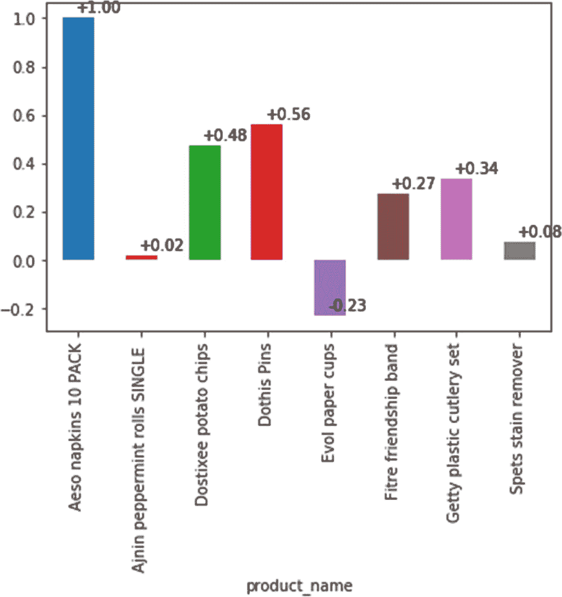
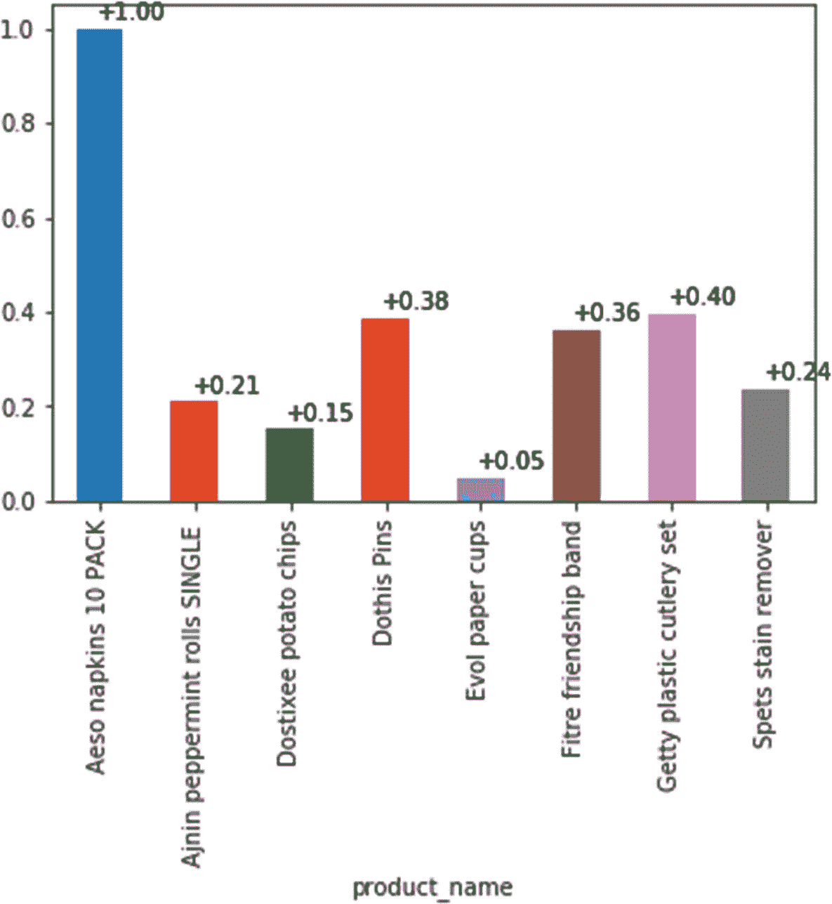

# 十、零售人工智能案例研究

**免责声明:**本书中的案例研究取自现实生活中的组织。已经注意确保组织的名称及其员工的姓名被更改，并且不与我的客户有任何相似之处。熟悉医疗保健行业的读者肯定会发现这些情况非常实用和有见地。

## 什么是推荐系统？

推荐系统被在线零售商用来向人们推荐产品。这种实现的好例子包括 Amazon.com 的“推荐给你”、“买了 X 的人也买了”、“你可能喜欢。”我们在其他网站上看到了这种实现，如 Netflix.com 和 Walmart.com，它们有自己的推荐系统，如“客户也考虑过”，“客户也购买了这些产品”，“客户也查看了这些产品。”这是机器学习技术的直接实现——更具体地说，是一种被称为协作过滤的技术。简单来说，这意味着我们正在使用机器学习技术来学习一组客户基于产品或用户信息采取的行动。它也可以被称为分组过滤，我们试图看到用户集体做了什么动作和行为。一旦机器学习算法看到一些模式，就会围绕它建立一个算法，以便观察你的购买行为，并给出类似的建议。基本假设是人们表现出相似的购买行为；例如，如果一个人购买了电视和通用遥控器，那么正在购买电视的第二个人也可能购买通用遥控器。这个例子很好，因为它没有谈论群体行为，但我们可以扩展它，说我们的机器学习算法发现 70%购买电视的用户可能会购买通用遥控器。搜索模式可以由推荐系统算法创建，并且可以用于给出最可能的购买行为模式。使用协同过滤的机器学习的应用需要跨越客户购买行为的各种类别的大型数据集的可用性。这项技术的使用范围没有限制。例如，消费品零售商、高端时尚网上商店、金融产品零售商或在线网站上矿产勘探产品的批发商都可以使用它。协同过滤的目的是找到有相似兴趣的人群，并在此基础上进行推荐。通过购买行为、评级、反馈等来捕捉用户的行为和购买行为。协同过滤用于项目、产品和基于用户的推荐系统。零售店提供的项目或产品形成了创建基于项目的推荐系统的基础，并且用户的行为和偏好被用作基于用户的推荐系统的基础。通常，在实践中，基于项目或产品的协同过滤被发现比基于用户的协同过滤更准确，因为基于用户的方法的主要缺点是人们的口味会随着时间而改变，他们可能不喜欢过去喜欢的东西。考虑这个例子:一个人几个月前买了三本科幻小说，我们选择这个模式推荐给其他正在购买科幻小说的用户。假设我们挑选的第一个购买模式的用户在购买科幻小说 3 个月后突然改变了购买行为，转而购买浪漫小说。如果系统发现了这种模式，并在用户选择科幻小说时推荐浪漫小说，那么推荐就会完全出错。在本章的案例研究中，我将给你一个基于项目的协同过滤的例子。我相信你会喜欢这个案例研究，因为它涉及到一个在线零售商店的内部，以及他们是如何在残酷的竞争中生存和扩大业务的。

## 案例研究 1:为在线零售市场创建推荐引擎

Aystsaga 是欧洲的一家零售连锁店，为中产阶级的各种客户提供服务。它在苏黎世、巴黎等欧洲主要城市拥有 250 多家零售店。它的零售业务年收入超过 3000 亿美元。这家大型非公开上市公司面临着来自网上零售店的激烈竞争，这些零售店在互联网上如雨后春笋般涌现。为了保持其在零售领域的第四名地位并增加收入，Aystsaga 实现了一个在线零售商城。

Zacky Johannsen 先生是该公司互联网业务的负责人兼首席执行官。他想出了一个想法，即成立一个在线零售部门，并向在线客户宣布建立互联网零售店。虽然自 2014 年在线商店推出以来，在线销售一直在增长，但其他在线零售商店一直在通过提供更好的价格和其他对客户友好的功能，如推荐引擎，来蚕食竞争对手在线销售的收入份额，类似于 Amazon.com 等网站上显示的推荐。扎克先生要求其竞争情报官就今年销售额下降的原因提交一份报告，并质疑 Aystsaga 的竞争对手如何比 Aystsaga 做得更好。Zacky 要求与 Aystsaga 在线零售部门的负责人 Arnold Zaine 进行讨论，并要求他准备好以下议程:

1.  Aystsaga 在线销售的现状

2.  竞争状态

3.  促进在线零售销售需要解决的关键问题

Arnold 带着一份报告来参加会议，事实记录在表 [10-1](#Tab1) 中。Aystsaga 的在线销售数据显示有所增长，但收入一直在下降。

表 10-1

艾斯特萨加的销售数字

<colgroup><col class="tcol1 align-left"> <col class="tcol2 align-left"> <col class="tcol3 align-left"> <col class="tcol4 align-left"> <col class="tcol5 align-left"></colgroup> 
| 

描述

 | 

Two thousand and fourteen

美元(百万)

 | 

Two thousand and fifteen

美元(百万)

 | 

Two thousand and sixteen

美元(百万)

 | 

计划

Two thousand and seventeen

美元(百万)

 |
| --- | --- | --- | --- | --- |
| 总数销售 | Four hundred and fifty-one | Six hundred and ninety-four | Seven hundred and twelve | Seven hundred and twenty-six point two four |
| 收入 | One hundred and thirty-two point three | One hundred and sixty-five point five | One hundred and thirty-five point two | One hundred and eight point nine |
| 收入百分比年龄 | 29.3% | 23.8% | 19% | 15% |

Arnold 解释说，虽然他们可以从网上销售逐年增长的事实中得到安慰，但与销售额相比，收入份额一直在急剧下降。他将竞争对手在线商店的激进竞争策略归因于收入下降的主要原因，因为当竞争对手削减利润率以增加销售额时，Aystsaga 不得不降价提供产品。他还指出，竞争对手的商店有更好的程序来保持客户忠诚度，并推动重复订单，或者通过推荐客户可能在他们的网站上购买的产品来增加他们的销售额。例如，Aystsaga 的主要竞争对手能够通过其网站上基于机器学习的在线推荐引擎增加其客户推荐，该引擎是在一年前部署的。阿诺德指出，这是 Aystsaga 网站上没有的东西，Aystsaga 迫切需要建立一个推荐引擎来帮助增加销售。看一下表 [10-2](#Tab2) 中的重复订单数据，就知道我们在这方面需要帮助。

表 10-2

Aystsaga 在线零售的平均销售数据

<colgroup><col class="tcol1 align-left"> <col class="tcol2 align-left"> <col class="tcol3 align-left"> <col class="tcol4 align-left"></colgroup> 
| 

描述

 | 

Two thousand and fourteen

美元(百万)

 | 

Two thousand and fifteen

美元(百万)

 | 

Two thousand and sixteen

美元(百万)

 |
| --- | --- | --- | --- |
| 总数销售 | Four hundred and fifty-one | Six hundred and ninety-four | Seven hundred and twelve |
| 每张发票的平均销售额(美元) | One hundred and fifty-six | One hundred and fourteen | Eighty-three |

阿诺德进一步提到，从 2014 年到 2015 年，平均销售额下降了 27%，从 2015 年到 2016 年，平均销售额下降了 27.2%。每张发票平均销售额的下降意味着每位客户的订单都比前一年少。这不仅是一个令人担忧的原因，也意味着需要更仔细地研究这种下降的原因。为了了解客户订购量减少的原因，我们在网上进行了一项客户反馈调查，询问网站的各种功能和客户体验。反馈在圣诞节期间持续了 3 个月，当时销售额非常高。调查结果如表 [10-3](#Tab3) 所示。

表 10-3

Aystsaga 的调查结果

<colgroup><col class="tcol1 align-left"> <col class="tcol2 align-left"></colgroup> 
| 

调查结果

 |
| --- |
| 用户总数 | Five hundred and fifty-one |
| 产品总数 | Thirty-nine |

从调查结果表中，我们可以看到它被呈现给了 551 个用户，他们对总共 39 个产品进行了评级，评级大小为 1719 个评级。阿诺德表示，他们已经收集了调查数据，并需要机器学习工程师的帮助，为他们的在线零售店构建推荐引擎。他们确定了以下需要回答的问题:

*   调查中哪些产品的评分最高？

*   用户是否表现出任何品牌忠诚行为？如果是，那么哪个是最顶级的品牌？

*   能否从数据中构建推荐引擎算法，对同类产品进行精准推荐？如果有，那么解决方案是什么？

*   调查中最受欢迎的产品是什么？

*   调查中最受欢迎的产品的相似性得分是多少？(以图形表示的方式给出可视化。)

现在，我将继续为 Arnold 在他们组织的案例研究中提出的问题提供 Python 代码。请注意，我使用 aystsaga.csv 作为数据集，可以从网站 [`http://www.puneetmathur.me/Book9/aystsaga.csv`](http://www.puneetmathur.me/Book9/aystsaga.csv) 访问。Python 代码也可以从 [`http://www.puneetmathur.me/Book9/aystsaga.py`](http://www.puneetmathur.me/Book9/aystsaga.py) 下载。

在开始回答调查中的问题之前，让我们先用 Python 加载数据(参见清单 [10-1](#PC1) )。

```py
# -*- coding: utf-8 -*-
"""
Created on Sat Jun 30 13:30:46 2018

@author: PUNEETMATHUR
"""
#Loading libraries
import pandas as pd

#Loading the retail dataset
survey=pd.read_csv("aystsaga.csv")

#Looking at the dataset one row
print(survey.head(1))
#Shape of the dataset Rows and Columns
print(survey.shape)

   product_id           product_name  user_id  rating
0          16  Dalmere Chocolate cup      894       3
(1719, 4)

#Looking at the columns in the dataset
print(survey.columns)
Index([u'product_id', u'product_name', u'user_id', u'rating'], dtype="object")

Listing 10-1Loading and Fetching Data

```

Python 代码首先从 aystsaga.csv 加载数据，然后显示第一行数据，这是 16 product _ name“dal mere Chocolate cup”的 product_id，由 user_id 894 评分，评分为 3。survey.shape 命令显示总共有 1719 行评级和 4 列。接下来，代码 survey.columns 向我们显示了 4 列:product_id、product_name、user_id 和用户在调查中给出的产品评级。请注意，用户购买的数量没有包含在这个数据集中，因为我想保持简单；然而，在零售店中，你会有几千个列，给出更多的数据，如位置、数量、使用的信用卡等。，其中一些是非常敏感的信息。由于您所在国家的数据隐私法，如 GDPR(一般数据保护法规)，类似于欧盟的法规，您可能需要就使用此类数据咨询法律专家。接下来让我们看看数据类型，并看看我们是否有任何丢失的值(参见清单 [10-2](#PC2) )。

```py
print(survey.dtypes)
#Are there any Null values in the dataset
print(survey.isnull().any())
product_id       int64
product_name    object
user_id          int64
rating           int64
dtype: object
product_id      False
product_name    False
user_id         False
rating          False
dtype: bool

Listing 10-2Data Set Datatypes and Missing Values Check

```

从清单 [10-2](#PC2) 中我们可以看到，除了保存产品简短描述的 product_name 之外，所有的列都是 int64 或 numerical。我们还看到使用 isnull()。any()函数表示该数据集中没有缺失值。我必须再次告诉你，这在现实世界中很少发生。当数据从一个系统迁移到另一个系统时，比如从 Oracle 迁移到 hadoop 或者从 csv 迁移到 xml，您通常会得到许多垃圾数据和缺失值。在继续下一步之前，您需要像我处理缺失值一样处理它们。由于我们的数据是干净的，现在让我们在表 [10-4](#Tab4) 中创建一个数据透视表。

表 10-4

创建数据透视表

<colgroup><col class="tcol1 align-left"> <col class="tcol2 align-left"> <col class="tcol3 align-left"> <col class="tcol4 align-left"> <col class="tcol5 align-left"> <col class="tcol6 align-left"> <col class="tcol7 align-left"> <col class="tcol8 align-left"> <col class="tcol9 align-left"> <col class="tcol10 align-left"> <col class="tcol11 align-left"> <col class="tcol12 align-left"></colgroup> 
| 

产品名称

 | 

Aeso 餐巾纸 10 包

 | 

Aeso 餐巾纸 20 包

 | 

Aeso 餐巾纸 40 包

 | 

Aeso 餐巾纸 50 包

 | 

阿金薄荷卷 10

 | 

阿金薄荷卷 5

 | 

阿金薄荷卷 50

 | 

阿金薄荷卷单份

 | 

阿金薄荷卷单肉桂

 | 

阿鲁特涅夫海盐

 | 

...

 |
| --- | --- | --- | --- | --- | --- | --- | --- | --- | --- | --- | --- |
| **用户标识 1** | 圆盘烤饼 | 圆盘烤饼 | 圆盘烤饼 | 圆盘烤饼 | 圆盘烤饼 | 圆盘烤饼 | 圆盘烤饼 | Four | 圆盘烤饼 | 圆盘烤饼 | ... |
| **产品名称** | **Mudlok 小麦面包** | **Neek 玉米片** | **Noit 房屋清洁工** | **皮特雷兹甜蛋糕** | **重磨牙膏** | **Serut 鼻巾** | **Sirp 马苏里拉奶酪** | **Spets 去污剂** | **泰国浓缩果汁** | **y sbol 杂志** |   |
| **用户标识 1** | 圆盘烤饼 | 圆盘烤饼 | 圆盘烤饼 | Four | 圆盘烤饼 | 圆盘烤饼 | 圆盘烤饼 | One | 圆盘烤饼 | 圆盘烤饼 |   |

```py
#Creating a pivot table for product ratings
productRatings = survey.pivot_table(index=['user_id'],columns=['product_name'],values='rating')
#Peeking into the pivot table
productRatings.head(1)

```

在这里的数据透视表中，您会注意到来自 id 为 1 的用户的一行反馈，她对三种产品 Ajnin peppermint rolls SINGLE、Pitrez sweet cake 和 Spets stain remover 的评分分别为 4、4 和 1。但是，您会注意到，对于那些用户没有评级的产品列，存在 NaN 值。这将在解释我们的结果时产生问题，所以让我们在代码的下一部分中消除它们。在下一节中，我实现了以下用例:

作为 Aystsaga 网站的客户，我应该能够根据我目前的购买情况获得推荐，以便我能够再次购买。

为了实现这个用例，重要的是假设客户已经选择了特定的产品，然后查看系统给出了什么建议。所以让我们开始实现清单 [10-3](#PC4) 中的下一段代码。

```py
##===========================Customer chooses a product======================================================
#Sample Product rating view assume here that a customer selected the product 'Dalmere Chocolate cup'
#What recommendation are you going to give based on this selection
#Users who bought 'Dalmere Chocolate cup' also bought:
dalmereRatings = productRatings['Dalmere Chocolate cup']
dalmereRatings.head()
Out[233]:
user_id
1    5.0
3    NaN
4    NaN
6    NaN
7    NaN
Name: Dalmere Chocolate cup, dtype: float64

In [234]:
similarProducts = productRatings.corrwith(dalmereRatings)
#Dropping the NA values to get more meaningful data
similarProducts = similarProducts.dropna()
df = pd.DataFrame(similarProducts)
df.head(10)
Out[234]:
                                       0
product_name
Aeso napkins 10 PACK            1.000000
Ajnin peppermint rolls SINGLE   0.021653
Condsi Pen                      1.000000
Dalmere Chocolate cup           1.000000
Deur masscara                   0.188982
Dostixee potato chips           0.476342
Dothis Pins                     0.563854
Ega hair remover               -1.000000
Erutan shampoo                  1.000000
Evol paper cups                -0.228218

Listing 10-3Choosing a Product and Showing Similar Products

```

在清单 [10-3](#PC4) 中，我首先假设顾客选择的产品是 Dalmere 巧克力杯。在这个选择之后，在后台中，为特定产品选择评级，在我们的例子中，显示了来自前七个用户中，用户 ID 给出的评级为 5。对于其他四个用户，给出的评级为 NaN，这意味着用户没有给出该产品的任何评级。在下一段代码中，我现在在产品评级之间建立关联，这是我们的数据透视表，由索引用户 id、列产品名称和值作为评级组成。产品评分和 dalMere 评分之间的相关性，这是我们对 Dalmere 巧克力杯的数据框架，我们假设它是用户选择的产品。在使用相似产品的数据框中，我们获得了相关性，现在我从相似产品数据框中删除 NaN 值。在下一行代码中完成后，我查看数据帧的前 10 个值。我们可以看到，产品 Aeso 餐巾 10 包与 Dalmere 巧克力杯的相关性最高，为 1。同样，我们有产品 Condsi Pen，它与 Dalmere 巧克力杯的相关性也为 1。还可以看到琼脂脱毛仪和达尔米尔巧克力杯呈-1 的负相关。虽然这些结果很好，但是它们没有被排序，所以在下一段代码中，我求解这些乘积。这可以从清单 [10-4](#PC5) 中看出。

```py
similarProducts.sort_values(ascending=False)
Out[235]:
product_name
Aeso napkins 10 PACK              1.000000
Thygie fruit juice concentrate    1.000000
Dalmere Chocolate cup             1.000000
Condsi Pen                        1.000000
Erutan shampoo                    1.000000
Pitrez sweet cake                 0.798935
Dothis Pins                       0.563854
Yssbol Magazine                   0.500000
Dostixee potato chips             0.476342
Getty plastic cutlery set         0.335047
Fitre friendship band             0.272375
Deur masscara                     0.188982
Spets stain remover               0.076743
Ajnin peppermint rolls SINGLE     0.021653
Evol paper cups                  -0.228218
Rewop toothpaste                 -0.845154
Neek corn chips                  -1.000000
Ega hair remover                 -1.000000
dtype: float64

Listing 10-4Sorted Values of the Similar Products

```

如果你仔细观察清单 [10-4](#PC5) 中的结果，你会发现其中也有一些虚假的相关性，比如 Condsi Pen 和 Everton 洗发水的高度相关性——仅举几例。这告诉我们，尽管我们进行关联的方法有效，但我们无法从类似的产品中获得 100%准确的结果。您会发现，在为生产环境构建搜索产品时，您的方法可能会给出结果，但它们可能无法令人满意地给出任何有意义的业务建议。在这种情况下，您可能需要采取一种替代方法，例如聚合产品名称和评级，然后尝试实现并查看不同产品之间的相似性。所以为了改进我们的结果，我现在将实现从清单 [10-5](#PC6) 开始的代码来移除虚假的结果。

```py
#Now let us get rid of spurious results in the similarities
import numpy as np
productStats = survey.groupby('product_name').agg({'rating': [np.size, np.mean]})
productStats.head()

productStats.sort_values([('rating', 'mean')], ascending=False)[:15]

#I am now getting rid of ratings size greater than 50 to create meaning results which matter to the business
popularProducts = productStats['rating']['size'] >= 50
productStats[popularProducts].sort_values([('rating', 'mean')], ascending=False)[:15]
df = productStats[popularProducts].join(pd.DataFrame(similarProducts, columns=['similarity']))
df.head(15)
df.sort_values(['similarity'], ascending=False)[:15]
Out[241]:
                                (rating, size)  (rating, mean)  similarity
product_name
Aeso napkins 10 PACK                        64        3.468750    1.000000
Dothis Pins                                175        3.645714    0.563854
Dostixee potato chips                      208        3.817308    0.476342
Getty plastic cutlery set                  246        4.077236    0.335047
Fitre friendship band                      198        4.292929    0.272375
Spets stain remover                        127        2.574803    0.076743
Ajnin peppermint rolls SINGLE              256        3.875000    0.021653
Evol paper cups                             90        3.888889   -0.228218

Listing 10-5
Removing Spurious Correlation

```

从消除虚假关联的结果中可以清楚地看到，我们现在获得的结果比之前获得的产品列表更好。这里我们有评级类似于和评级大小的产品。在这段代码中，对于产品统计数据框中的变量，有一个大于 50 的大小。简单地说，我只选择了那些调查对象或用户 id 数量超过 50 的产品。我还对值进行了升序排序，然后将流行产品的产品统计数据与相似产品的数据框连接起来，以创建一个名为 similarity 的新列，它只不过是每个产品与所选产品的相关值。在图示案例中，我们看到了 Aeso 片装餐巾纸、Dostixee 薯片、Getty 塑料餐具套装、Ajnin 薄荷单层卷、Evol 纸杯、Dothis 别针和 Spets 去污剂等产品，它们有助于对我们选择的产品进行相关性或相似性评分。就网上商店的任何用户的购买行为而言，您能想到这些产品之间的任何关联吗？他们为什么会一起购买这些产品？

如果你看看产品的性质，你就会明白，人们通常在家里聚会时会购买塑料餐具、餐巾、薯片、薄荷卷、纸杯、别针和去污剂等物品。从这个角度来看，这些产品之间的相似性是有道理的。我们也可以在图 [10-1](#Fig1) 中看到相似性的柱状图。



图 10-1

用产品 Dalmere 巧克力杯购买的产品的相似性得分

```py
df['similarity'].plot(kind='bar')
ax = df['similarity'].plot(kind='bar')
x_offset = -0.03
y_offset = 0.02
for p in ax.patches:
    b = p.get_bbox()
    val = "{:+.2f}".format(b.y1 + b.y0)
    ax.annotate(val, ((b.x0 + b.x1)/2 + x_offset, b.y1 + y_offset))

```

我在代码中使用了一个条形图，通过使用 plot 函数参数 equal bar，使用 x 偏移设置为-0.3，y 偏移设置为 0.2，从该图中详细描述访问对象。最相似的是 Aeso 餐巾 10 包和 Dothis 别针和 Dostixee 薯片。因此，我们看到用户选择的初始 Dalmere 巧克力杯取得了良好的结果。

现在让我们运行另一个产品的这组代码:Aeso 餐巾 10 包。我们可以在图 [10-2](#Fig2) 中看到选择相似产品的所有结果。与我们在早期 Python 代码集中看到的代码相比，没有任何变化。唯一的变化是产品名称和代码的后续结果:



图 10-2

与 Aeso 餐巾纸相似的产品 10 包

```py
#2nd Sample Product rating view
aesoRatings = productRatings['Aeso napkins 10 PACK']
aesoRatings.head()

#Now finding products with similar ratings
similarProducts = productRatings.corrwith(aesoRatings)
similarProducts = similarProducts.dropna()
df = pd.DataFrame(similarProducts)
df.head(10)

similarProducts.sort_values(ascending=False)

#Now let us get rid of spurious results in the similarities
import numpy as np
productStats = survey.groupby('product_name').agg({'rating': [np.size, np.mean]})
productStats.head()

productStats.sort_values([('rating', 'mean')], ascending=False)[:15]

#I am now getting rid of ratings size greater than 20 to create meaning results which matter to the business
popularProducts = productStats['rating']['size'] >= 50
productStats[popularProducts].sort_values([('rating', 'mean')], ascending=False)[:15]
df = productStats[popularProducts].join(pd.DataFrame(similarProducts, columns=['similarity']))
df.head(15)
df.sort_values(['similarity'], ascending=False)[:15]

#Visualization of similarities
df['similarity'].plot(kind='bar')
ax = df['similarity'].plot(kind='bar')
x_offset = -0.03
y_offset = 0.02
for p in ax.patches:
    b = p.get_bbox()
    val = "{:+.2f}".format(b.y1 + b.y0)
    ax.annotate(val, ((b.x0 + b.x1)/2 + x_offset, b.y1 + y_offset))

```

现在我们来看看结果，我们发现没有任何产品像我们在巧克力杯产品类别中看到的那样具有非常高的相似性得分。这里相似度最高的是盖蒂塑料餐具套装和图钉。虽然这些产品的相似性得分不高，但它们仍然有意义，因为它们都是客户用来满足单一需求的，即购买聚会产品。在部署到产品中之前，需要对这些代码进行现场测试。可以对数百名客户进行一项简短的调查，以了解这些产品的选择以及代码中的建议是否对客户购买相关产品有意义。至此，我总结了第一个案例研究的解决方案。

第二个案例研究是一个基于讨论的案例研究，它讲述了一个为东南亚的零售连锁集团实现会说话的机器人的场景。基于讨论的案例研究是提出问题和数据，但只讨论解决方案而不实现代码。给出一个基于讨论的案例研究的目的是帮助你，读者，发展一种为不同的商业问题提供解决方案的商业思维。您可以参考我在医疗保健部分给出的 birds 的案例研究实现，以实现您的代码解决方案。

## 案例研究 AMDAP 零售集团的会说话的机器人

AMDAP 集团在东南亚、澳大利亚和新西兰都有商店。这是该地区最大的零售概念店之一。其创始人 Hun Hun Makawaki 先生用了近 20 年的时间，才使该集团达到今天的地位。AMDAP 集团的概念零售店是独一无二的，通过他们的商店向当地人出售异国情调的国际商品来区分自己。例如:在泰国，商店出售来自世界各地的异国水果，如猕猴桃，这些水果在当地市场很难买到；在澳大利亚和新西兰，他们出售来自泰国、印度尼西亚、马来西亚以及其他国家的商品。他们的产品范围从水果和蔬菜到衣服都有，他们还出售异国情调的包装产品，如奶酪、酱料、熟食肉、鲜花、家具等。数字说明了该集团的成功，因为它已从 1998 年在泰国开设的 2 家不起眼的商店发展到 137 家。它现在的年销售额为 12.6 亿美元。

自 2014 年以来，该集团的销售额增长缓慢。该公司实现了一项试点计划，在其商店周围引入销售亭来促进销售；然而，正如我们在表 [10-5](#Tab5) 中看到的，这并没有给出任何重要的结果。

表 10-5

试点实现前后的销售

<colgroup><col class="tcol1 align-left"> <col class="tcol2 align-left"></colgroup> 
| 

试点前的商店销售

 | 

试点后的商店销售

 |
| --- | --- |
| 2.16 亿美元 | 2.07 亿美元 |

顾客可以走到信息亭，查找他们想要搜索的产品或物品。然后，自动售货亭将显示该特定商店中的区域、价格和可供选择的产品。这要求客户正确输入关键字，以便搜索产品。这个信息亭由一个中央商店网络管理，它会通知顾客某个产品是否有货。它还会给顾客一个产品缺货时的日期。这是一个经过精心规划和充分利用技术构建的智能系统，但该实验悲惨地失败了，因为它没有导致实现该系统的商店的销售额上升。在此之后，该公司做了另一个试点，它买了一个会说话的机器人，清单上有无限多的产品。顾客会走上前询问产品的可用性，机器人会在屏幕上显示其状态，并与顾客进行对话。这个实验为商店创造了奇迹，销售额显著增加(35%)。机器人驾驶员的这些号码在表 [10-6](#Tab6) 中给出。

表 10-6

引入会说话的机器人后商店的销售额

<colgroup><col class="tcol1 align-left"> <col class="tcol2 align-left"></colgroup> 
| 

试点前的商店销售

 | 

试点后的商店销售

 |
| --- | --- |
| 2.31 亿美元 | 3.11 亿美元 |

这就是我对这一章案例研究的全部内容。我希望您喜欢浏览案例研究，就像我喜欢向您展示它们一样。试点成功后，Makawaki 先生召集了一次与商店负责人、技术负责人、首席技术官和客户管理负责人的会议。目的是找出为什么这次机器人试验比他们之前试验的售货亭更成功。aMDaP 零售集团客户管理部门负责人 Hun Hun Magawaki 先生说，他的团队对两个试点项目的客户进行了调查，调查结果不言自明。在调查中，客户收到了口头和书面形式的问卷，并被要求阅读他们的体验，并解释他们喜欢和不喜欢正在实现的技术。结果如表 [10-7](#Tab7) 所示。

表 10-7

客户调查反馈

<colgroup><col class="tcol1 align-left"> <col class="tcol2 align-left"> <col class="tcol3 align-left"></colgroup> 
| 

热门调查问题

 | 

电子信息亭

 | 

会说话的机器人

 |
| --- | --- | --- |
| 你喜欢这项技术的什么？ | 轻松找到缺货商品 | 口头回应 |
| 您不喜欢这项技术的哪一点？ | 需要打字 | 不是人类的反应 |

Hun Hun Magawaki 先生解释说，接受调查的顾客中有 84%的人表示他们喜欢电子售货亭的功能，因为它可以很容易地找到缺货的商品，而顾客则认为会说话的机器人的口头反应对这项技术非常感兴趣。他们不喜欢电子信息亭的技术实现是因为需要打字，因为他们发现这很费力，多达 84%的受访者说他们不喜欢这项技术。然而，对于会说话的机器人，34%的受访者表示，机器人不会做出类似人类的反应。Hun Hun Makawaki 先生向该组织的创始人建议，该公司引进类似于会说话的机器人的技术，因为人们说话比打字更舒服。

财务主管 Gin Gin Nuchigiwa 先生随后简要报告了每个试点项目的相对实现成本。这在表 [10-8](#Tab8) 中给出。

表 10-8

飞行员之间的成本比较

<colgroup><col class="tcol1 align-left"> <col class="tcol2 align-left"></colgroup> 
| 

电子信息亭试点的成本(每单位)

 | 

会说话的机器人飞行员的成本(每单位)

 |
| --- | --- |
| $70,000 | $250,000 |

我们可以看到，电子信息亭的试点单位成本远远低于一个会说话的机器人的单位实现成本。看到这里，创始人 Hun Hun Makawaki 先生评论说，实现会说话的机器人成本太高；然而，他问技术总部组织是否有可能引入说话亭，因为它们的成本相对较低，并且会给客户提供与会说话的机器人相同的说话体验。当然，不同之处在于，一个会说话的机器人会有一个外观，可以走到顾客面前，但在电子说话亭的情况下，顾客必须走向它。但他说，考虑到电子信息亭的成本优势，如果有可能建造的话，他愿意选择这一方案。

你的主要任务如下:

*   你认为实现会说话的机器人的第二个试点的销售额增加的原因是什么？你认为飞行员成功的主要原因是什么？是这个想法的新颖性，还是科技像人类一样说话的能力？为什么商店的顾客更喜欢会说话的机器人而不是电子售货亭？

*   你认为在引进会说话的电子机器人后，一旦这个想法的新鲜感消失，商店里的顾客销售额会再次下降吗？给出你的观点的理由。

*   您是否同意 Hun Hun Makawaki 先生的观点，即在这种情况下，实现会说话的电子亭是最佳解决方案？

*   对于带有以下菜单的语音信息亭，您的 Python 实现代码是什么？
    *   搜索产品

    *   提出客户投诉

    *   给你的建议

    *   新优惠

现在我讨论这四个问题的答案。请记住，在案例研究方法中，没有单一的正确或错误答案；但是，您需要给出一个企业可以接受的方案。

在我看来，关于会说话的机器人的第二个试点销售增长的原因的第一个问题是，人类发现说话更容易，因为在零售商店环境中，人们通常会随身携带一些物品或包或其他东西，不允许他们放下这些东西，然后开始打字。此外，说话可以不用手，也不需要手的任何物理参与。所以在店里，通过技术实现客服的最好方式就是直接和他们对话。

关于第二个问题，在我看来，由于会说话的机器人的出现，销售肯定会增加，因为当人们听到这个消息时，他们会去商店购物。然而，我不认为新鲜感的消退会导致销量大幅下降，因为这项技术正在帮助客户，并通过与他们对话来提供更好的服务。因此，我不认为在引入会说话的机器人或售货亭后，销量会大幅下降。如果会说话的机器人不能帮助顾客识别和解决他们的问题，那么这个想法的新颖性肯定会消失。在这种情况下，这个零售团队应该不断听取反馈，改进谈话技术。

这家商店的创始人不想花钱买一个会说话的机器人，并且发现在他的组织中实现起来成本太高，所以他选择了一条中间道路，在这条道路上，他可以让顾客体验到电子亭中会说话的机器人的体验，相比之下，成本要低得多。在我看来，采取中间路线是一个明智的决定，这样可以为企业节省资源。当他们有资金实现时，他们可以考虑实现会说话的机器人。

我告诉过你，对于第四个问题，我不会给你实现这个案例研究的 Python 代码。但是，您可以从医疗保健部分的案例研究中获取 Python 代码，并使用 Pi audio 等 Python 库添加交谈功能，实现语音到文本和文本到语音，以便与客户交谈。您可以直接从我们刚刚完成的本书第 [10](10.html) 章的案例研究中获取针对您所在部分的建议，并通过文本到语音的实现来实现答案。同样可以搜索产品，这些产品给出库存中可用项目的输出，以及它们的库存状态和数量。您可以首先实现语音到文本，以获取要搜索的产品名称，然后实现文本到语音，以给出关于项目状态的响应。要进行客户投诉，您可以创建一个预建菜单，在该菜单中询问客户的产品名称、账单号和其他类似的详细信息，然后记录客户通过麦克风向电子信息亭说出的投诉。这个简单的实现可以帮助您了解如何实现音频，与客户交谈，并向他们解释主要产品的当前报价。通过这种方式，您可以实现一个简单的解决方案，并了解如何处理零售环境中遇到的情况。我将在本书金融的第三部分通过 Python 库实现音频功能。在案例研究章节 [3](03.html) 中，你可以查阅 Python 库是如何被用来赋予程序音频功能的。

## 尾注

1.  泰迪·罗兰[`https://github.com/teddyroland/python-biplot`](https://github.com/teddyroland/python-biplot)github 上的脚本中的双标

2.  高斯混合， [`http://scikit-learn.org/stable/modules/mixture.html#mixture`](http://scikit-learn.org/stable/modules/mixture.html#mixture)