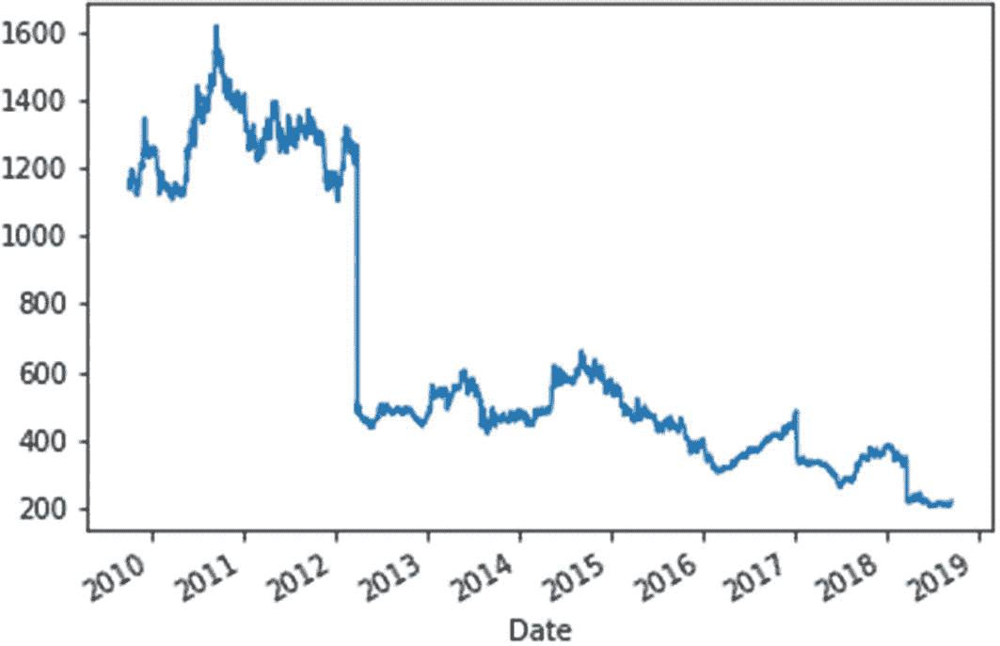
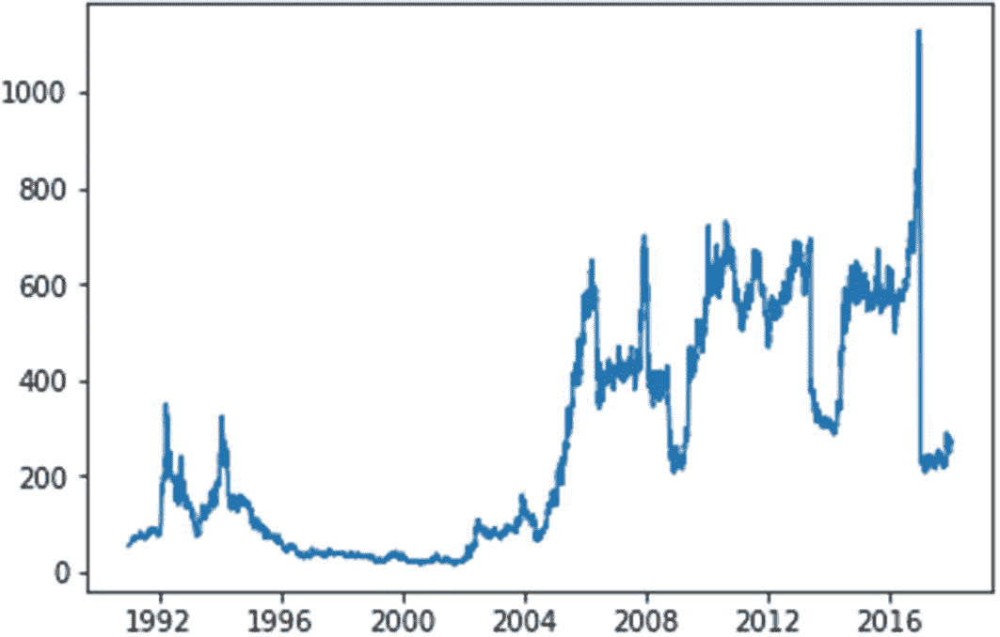
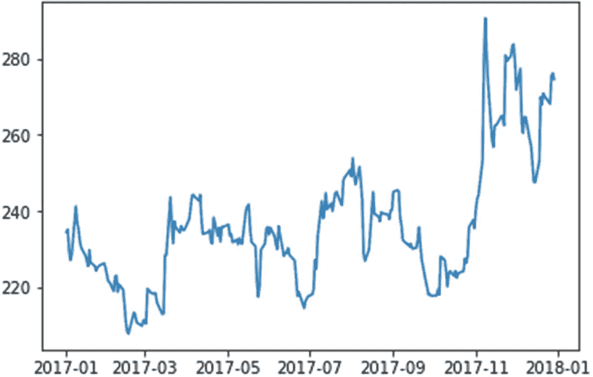
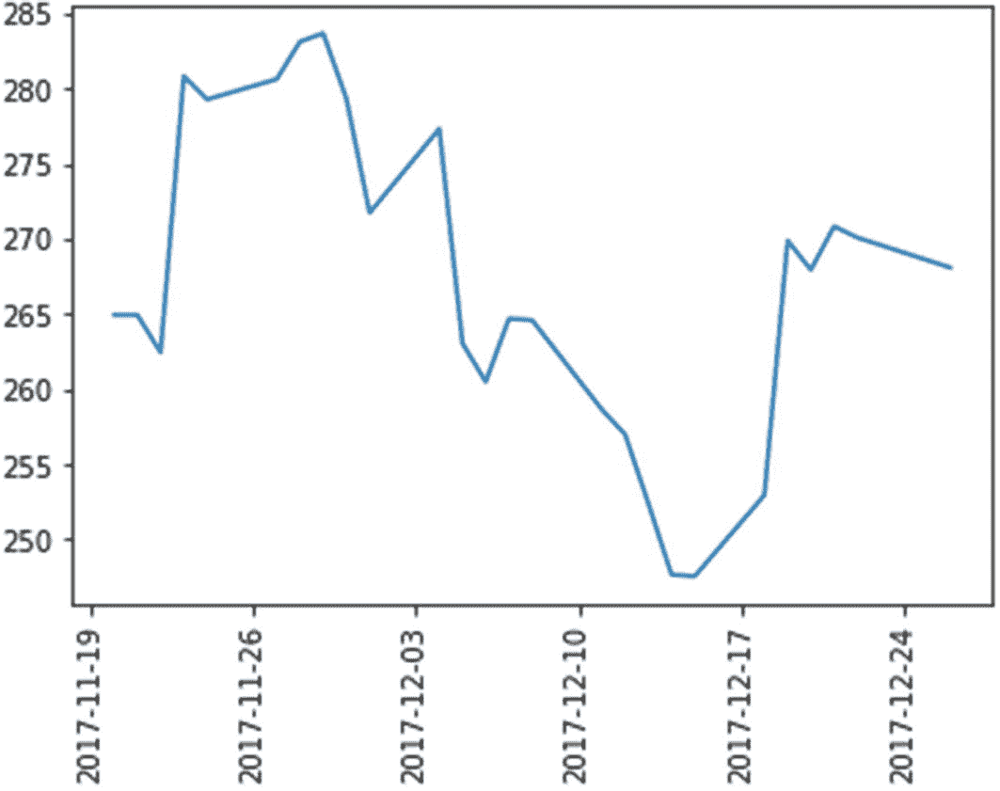
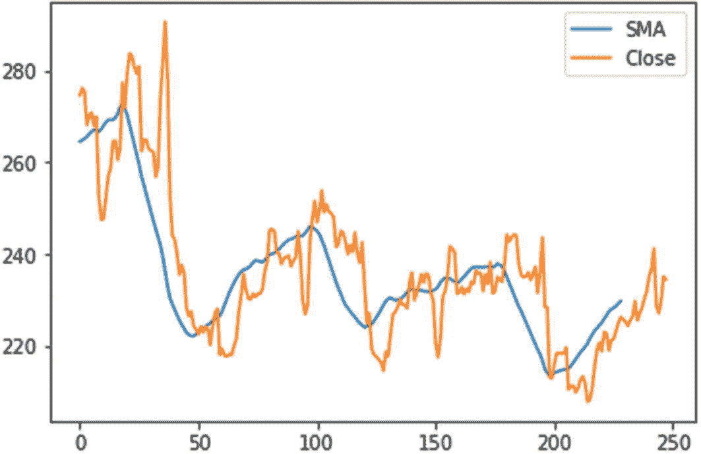
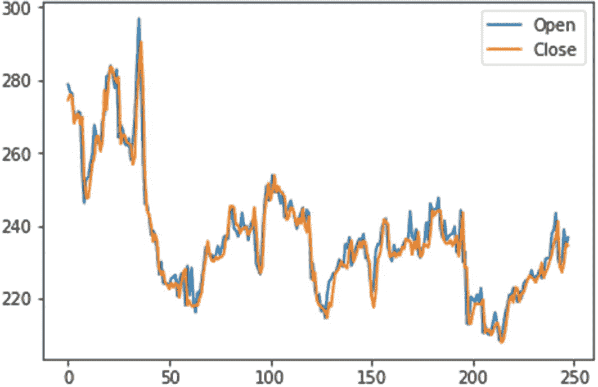
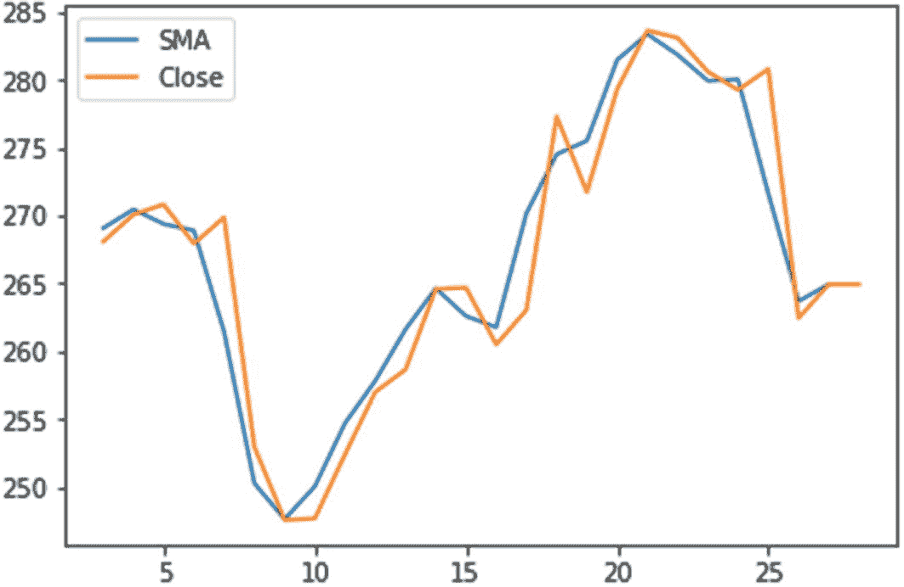

# 十六、金融人工智能案例研究

**免责声明:**本书中的案例研究取自现实生活中的组织。已经注意确保组织的名称及其员工的姓名被更改，并且不与我的客户有任何相似之处。熟悉金融行业的读者肯定会发现这些情况非常实用且有见地。

## 案例研究 1:股票市场运动预测

RISEGOINVEST 是一家领先的投资咨询公司和基金管理公司，自 1997 年成立以来，其基金增长了许多倍，当时美国证券市场的表现超过了全球同行十多年，迄今为止表现最好的是道琼斯工业平均指数，增长了 20%。其创始人兼董事长 Jimiki Takasata 成立了这家公司，旨在建立一条通往亚洲、中东和非洲等新兴市场的重要投资渠道。他有远见，知道发达国家将看到增长受阻，新兴市场将看到下一阶段的指数增长，并提供发达经济体没有提供的机会。那时，他是羊群中的独狼，他要求他的投资者开始寻找发展中国家和新兴市场。然而，第一年他就筹集了超过 6 亿美元的资金。这表明人们相信他作为投资者的能力，他的远见在当时得到了很多人的认同。

自早期增长阶段以来，该公司已呈指数增长，2017 年全球投资基金超过 925 亿美元。Takasata 先生建立了一个伟大的投资顾问团队，他们不仅是各自领域的专家，而且是能够发现世界各地将要发生的投资趋势的专业人士。他们在 2000 年初发现了像印度和中国这样的新兴经济体的崛起，并开始为他们的主要客户推动大量投资，给他们带来丰厚的回报，即使是在全球经济衰退的年代。这为该公司赢得了良好的声誉，也是其投资客户群增长的主要原因。随着所有的增长和趋势，risegoeventure 的基金经理和投资顾问错过了一些投资机会。例如，它未能预见到非洲国家投资机会的增加。它还在香港和马来西亚的证券市场为许多客户投资失败，在那里它遭受了严重的损失。

来自更高效管理新兴市场基金的竞争对手的竞争也有所加剧。由于竞争，投资者对新兴市场基金经理和顾问的要求越来越高。鹦鹉先生就是这样一个主要投资者。他将个人资金投资于高田先生的公司，总额达 8.5 亿美元。他是该公司非常重要的客户，因为他从 2003 年开始就和他们一起投资。这是超过十年的关系。高萨塔的投资顾问吉姆·卡特扎特(Jim Catzat)负责管理长尾小鹦鹉的账户，他向高萨塔报告了他所说的与客户的“不同寻常的对话”。在与鹦鹉先生的季度会议上，他要求吉姆给他提供关于新兴国家股票市场的非常准确的报告——特别是印度，他在那里有大量投资。鹦鹉先生希望关于他在印度股票市场投资的每日和每周咨询报告能够准确预测他投资的股票市场和个别股票的价格。吉姆告诉鹦鹉先生，目前的报告对他的股票发出了警告，这是基于他的公司为他做的各种基本面和技术面的分析，并反映在每天和每周发给他的报告中。鹦鹉先生说，“我需要你把你的报告调整到这样一个程度，那就是你向我预测明天或下一个交易日的股票市场运动或股票价格运动。”Jim 说，这是不可能实现的，因为预测股票价格是不可能的，因为股票价格是基于各种因素的，从宏观到微观指标的这些因素本身都是不可预测的。对此，吉姆回答说:“我给你一个月的时间。如果你没有这样的系统，那就开发它，给我一份至少 80%准确的印度股票价格报告，否则我会把我的资金转移到其他公司。”

在被 Jim 告知后，Takasata 先生解释说，这是一个大客户，口碑是非常重要的，所以如果这个客户不满意，口碑也会传给其他客户，他们也可以将他们的资金转移给其他基金经理。他让吉姆向该公司的计算机科学家 Kazy Korone 咨询，看看是否有一种计算机模型可以预测股票市场价格。

吉姆安排了一次与 Kazy 的会面，从她那里了解这样的事情是否有可能在第一时间完成，以及是否可以在 4 周内完成，这是客户给他们的。Kazy 告诉他，利用机器学习，有可能建立这样一个可以预测股票价格的模型。然而，它需要印度股票市场过去 10 年的数据。她要求他给她一周的时间来建立一个原型，以演示根据股票在最后一个交易日的收盘价预测股票价格。

### 案例研究的问题

1.  你认为有可能对任何给定的股票建立机器学习预测模型，并预测其第二天的价格吗？

2.  建立这样一个预测模型需要哪些数据？定义常用的数据特征，如股票名称、收盘价、开盘价等。

3.  对于像印度这样的新兴市场，什么来源能给你最准确的股市数据？这些数据是免费的还是需要付费的？

4.  从数据源收集数据后，您会采用什么方法来定义机器学习预测模型？

5.  使用问题 4 中定义的方法，列出一两个你将在模型中使用的算法。

6.  你实际的基于 Python 的机器学习解决方案是什么？

### 案例研究的建议解决方案

这个案例研究的解决方案将尝试以业务人员和机器学习专业人员都可以接受的方式回答每个问题。请记住，对于给定的问题，没有解决方案是最终的解决方案，在这种案例研究方法中，您可能会找到自己独特的解决方案。给出此解决方案的目的是为了让您了解如何为给定的业务问题找到专业的解决方案；重要的是要求给出解决方案的时间框架。但是，为了让您充分理解业务问题，我将要求您使用我在本书的医疗保健和零售部分向您展示的一些流程和原则，为这个案例研究问题开发一个成熟的解决方案。

#### 答案 1

我确实认为有可能开发一个链式模型来预测下一个交易日的股票价格。我确信这一点，因为价格只不过是数字数据，它是在股票市场进行盘点时每分每秒产生的。有各种各样的算法可以用来预测股票市场价格，其中大部分是回归方程。

让我们好好看看一个基本回归器，因为构建原型非常短。然后，当一个成熟的解决方案构建完成后，我们可以考虑对其进行改进。

#### 答案 2

在我看来，除了目标预测值(即价格)之外，还需要以下特征:

*   日期:股票交易的日期。

*   开盘价:当日股票的开盘价。

*   高:当日股票的最高价格。

*   低:当日股票的最低价格。

*   最后:当日股票的最后交易价格。

*   收盘:当日股票的收盘价。

#### 答案 3

截至撰写本书时，目前有以下免费数据源可用于获取国家证券交易所和孟买证券交易所的数据。

[Yahoo](http://www.google.com/finance/info?q=NSE:NIFTY) 使用 Pandas datareader 库:在清单 [16-1](#PC1) 中，我给出了一个示例代码，可以使用这个 Python 脚本下载任何股票价格历史值。

```py
# -*- coding: utf-8 -*-
"""
Created on Sun Dec  3 23:32:32 2017

@author: PUNEETMATHUR
"""

import numpy as np
import pandas as pd
#import pandas.io.data as web
from pandas_datareader import data, wb

sp500= data.DataReader('^GSPC', data_source="yahoo", start='1/1/2000', end='1/12/2017')
#sp500= data.DataReader('^GSPC', data_source="yahoo")
sp500.ix['2010-01-04']
sp500.info()
print(sp500)
print(sp500.columns)
print(sp500.shape)

import matplotlib.pyplot as plt
plt.plot(sp500['Close'])

# now calculating the 42nd Days and 252 days trend for the index
sp500['42d']= np.round(pd.rolling_mean(sp500['Close'], window=42),2)
sp500['252d']= np.round(pd.rolling_mean(sp500['Close'], window=252),2)

#Look at the data

sp500[['Close','42d','252d']].tail()
plt.plot(sp500[['Close','42d','252d']])

Listing 16-1Simple Python Script to Get Stock Market Data

```

例如，这个脚本获取标准普尔 500 指数的数据，然后通过将数据存储在 Pandas dataframe 中来绘制图表。然而，这个数据不是很准确，因为它也包含了节假日和周六的值，而我们确实知道股市是关闭的。所以我们有来自雅虎的数据来源，但是不准确。然后我给你看另一个来源，有免费的准确数据:Quandl.com。这些数据可以免费挖掘，没有很多限制。你需要在他们的网站上注册并获得一个免费的 api 密匙才能在这里工作: [`https://www.quandl.com/data/NSE-National-Stock-Exchange-of-India`](https://www.quandl.com/data/NSE-National-Stock-Exchange-of-India) 。

现在，一旦您注册并从 Quandl 获得免费的 api 密钥，您就可以使用他们的 Python api 直接下载数据。

在开始使用清单 [16-2](#PC2) 中的脚本之前，您需要使用 pip 安装程序安装 Quandl 包。现在我给你看图 [16-1](#Fig1) 。使用 quandl 免费 Python 库下载样本股票的数据。

```py
pip install Quandl

# -*- coding: utf-8 -*-
"""
Created on Sat Sep 22 23:43:13 2018

@author: PUNEETMATHUR
"""

import quandl
quandl.ApiConfig.api_key = 'INSERT YOU API KEY HERE'

# get the table for daily stock prices and,
# filter the table for selected tickers, columns within a time range
# set paginate to True because Quandl limits tables API to 10,000 rows per call

data = quandl.get_table('WIKI/PRICES', ticker = ['AAPL', 'MSFT', 'WMT'],
                        qopts = { 'columns': ['ticker', 'date', 'adj_close'] },
                        date = { 'gte': '2015-12-31', 'lte': '2016-12-31' },
                        paginate=True)
data.head()

# create a new dataframe with 'date' column as index
new = data.set_index('date')

# use pandas pivot function to sort adj_close by tickers
clean_data = new.pivot(columns='ticker')

# check the head of the output
clean_data.head()

#Below script gets you Data from National Stock Exchange for a stock known as Oil India Limited
import quandl
quandl.ApiConfig.api_key = 'z1bxBq27SVanESKoLJwa'
quandl.ApiConfig.api_version = '2015-04-09'

import quandl
data = quandl.get('NSE/OIL')
data.head()
data.columns
data.shape

#Storing data in a flat file
data.to_csv("NSE_OIL.csv")
#A basic plot of the stocks data across the years
data['Close'].plot()

Listing 16-2Loading Data from Quandl

```



图 16-1

使用 quandl 免费 Python 库下载样本股票的数据

你会注意到，在代码的第一部分，我给出了一个例子，说明如何使用 Quandl 库获取苹果、微软和沃尔玛等股票的市场价格。我还向您展示了如何清理数据，并在清理后以可展示的形式显示出来。在引言的第二部分，我将向您展示如何从 Quandl 获取国家证券交易所(NSE)的数据。在这里，我使用的是一家名为印度石油有限公司的股票，我正在搜索它的数据，并将其存储在一个文件中，然后显示它的曲线图。你也会注意到股票有 2009 年到 2018 年的数据。所以这是一个非常好的股票市场免费数据来源。这是我向我所有的读者推荐的资源，为这个案例研究提供一个解决方案。

#### 答案 4

我解决这个问题的方法是，首先通过答案 3 中所示的方法从 Quandl 获取关于一家公司的数据。使用 Python 脚本后，将数据存储在一个平面 csv 文件中，然后清除包含空值的数据。用日期列对数据进行排序。通过查看年和月的可视化数据进行探索性的数据分析。计算股票的简单移动平均线，因为它是衡量股票表现的好指标。我将主要为这个预测模型使用三列:['Date '，' Open '，' Close']。但是，我将从第二天的开盘价创建一个派生值列，并将其添加到前一天的价格中。所以我创建了一个新特性['NextDayOpen']。让我用清单 [16-3](#PC3) 中的例子来说明这一点。

```py
           Date    Open   Close
5909 1991-02-08   60.00   60.00
5908 1991-03-15   65.00   75.00
5907 1991-03-18   65.00   70.00

           Date    Open   Close  NextDayOpen
5909 1991-02-08   60.00   60.00            0
5908 1991-03-15   65.00   75.00           60
5907 1991-03-18   65.00   70.00           65
5906 1991-03-20   67.50   72.50           65

Listing 16-3Example of Adding Next Day Open Column Values

```

我们可以从清单 [16-3](#PC3) 中看到，原来只有三列(日期、打开和关闭特性)的 dataframe 现在也增加了一个 NextDayOpen 特性。这只不过是前一天的开盘价结转到第二天开盘的功能。第一个是空的，因为它没有以前的开放值。实际上，现在 NextDayOpen 列成为我们的目标变量或预测值。这是我们第二天要预测的。这个概念是理解这个预测模型如何工作的基础和关键。

完成这些后，创建一个基于线性回归的模型来预测下一个交易日的股价。尽管这是一个简单的预测原型模型，但是当它投入生产时，我们需要尝试一些其他的回归模型，比如决策树等等。我让您自己尝试，选择最适合您的生产环境的型号。

#### 答案 5

我会使用线性回归来建立一个原型模型。这样做的原因是因为在案例研究中，很少有时间来建立一个给定的模型，而线性回归技术提供了最快的实现和获得结果的方法。唯一可能做得不好的部分是预测模型的准确性水平；然而，如果你很着急，那么就要做出权衡。

#### 答案 6

现在，我向您展示我在本案例研究的答案 5 中讨论过的解决方案。您将看到清单 [16-4](#PC4) 中的代码。我假设你已经使用图 [16-1](#Fig1) 中给出的 Python 脚本加载了数据，并将其存储在一个 csv 文件中。

```py
# -*- coding: utf-8 -*-
"""
Created on Sun Dec 17 20:30:01 2017
@author: PUNEETMATHUR
I am creating this script to predict next day Opening Price based on
Today's Closing Price for any given stock
"""
import numpy as np
import pandas as pd
import os

#Change your directory to wherever your dataset is stored
os.chdir("E:\\") # Change this to your directory or path where you have downloaded the dataset

.
#Loading the dataset of the company for which prediction is required
df=pd.read_csv("BalmerLawrieColtd.csv",parse_dates=['Date'])
print(df.head(1))
print(df.columns)

Out[*]:
   Unnamed: 0       Date    Open    High    Low   Close    WAP  No. of Shares  \
0           1 2017-12-29  278.85  279.15  272.6  274.55  276.1          19372
   No. of Trades  Total Turnover  Deliverable Quantity  \
0            504       5348670.0               10024.0

   % Deli. Qty to Traded Qty  Spread H-L  Spread C-O
0                      51.74        6.55        -4.3
Index([u'Unnamed: 0', u'Date', u'Open', u'High', u'Low', u'Close', u'WAP',
       u'No. of Shares', u'No. of Trades', u'Total Turnover',
       u'Deliverable Quantity', u'% Deli. Qty to Traded Qty', u'Spread H-L',
       u'Spread C-O'],
      dtype='object')
df.shape
Out[91]: (5911, 14)

Listing 16-4Loading Data

```

到目前为止，我已经加载了数据并查看了它的形状，它由 5911 行和 14 列组成。有很多额外的数据是我们在构建原型模型时不需要的，因此我将删除它们，只选择清单 [16-5](#PC5) 中模型构建练习所需的那些特性。

```py
#Selecting only relevant columns required for prediction
cols=['Date','Open','Close']
df=df[cols]

print(df.columns)
print(df.head(5))
Index([u'Date', u'Open', u'Close'], dtype="object")
Date Open Close
0 2017-12-29 278.85 274.55
1 2017-12-28 276.75 276.15
2 2017-12-27 276.40 275.45
3 2017-12-26 269.00 268.10
4 2017-12-22 269.60 270.10

Listing 16-5Selecting Only the Relevant Columns for Our Prototype Model

```

我们可以从清单 [16-5](#PC5) 中的代码结果看到，它只有我们想要的相关数据。现在让我们进入下一步，检查清单 [16-6](#PC6) 中数据集中的空行。

```py
# Checking data if Cleaning up data is required
df.isnull().any()
#df=df.dropna()
#df=df.replace("NA",0)
df.dtypes
Out[96]:
Date datetime64[ns]
Open float64
Close float64
dtype: object

Listing 16-6Checking for Data Clean-Up

```

从清单 [16-6](#PC6) 中可以看出，我们没有任何清理工作要做，因为没有空行。这就是为数据集选择好的数据源的好处。Quandl.com 是全球股市数据的良好来源。现在让我们通过将数据绘制在清单 [16-7](#PC7) 中来快速可视化数据。我们将数据可视化在下图 [16-2](#Fig2) 中。

```py
#Sorting up data to plot historically ascending values in graph
df = df.sort_values(by='Date',ascending=True)

#Plotting the price of stock over the years
#What story does it tell?
import matplotlib.pyplot as plt
plt.plot(df['Date'],df['Close'])

Listing 16-7Plotting the data

```



图 16-2

可视化数据

我们看到这只特殊的股票 Balmer Lawrie Co. Ltd .在 2016 年见顶，在跌至低点之前是其有史以来的最高价格。接下来，我们绘制图表来检查去年和上个月的数据，看看我们是否注意到清单 [16-8](#PC8) 和图 [16-3](#Fig3) 中给出的价格变动的一些不寻常之处。

```py
#Now plot only for last one year and last 1 month
df['Date'].dt.year==2017
mask=(df['Date'] > '2017-1-1') & (df['Date'] <= '2017-12-31')
print(df.loc[mask])
df2017=df.loc[mask]
print(df2017.head(5))
plt.plot(df2017['Date'],df2017['Close'])

Listing 16-8Plotting data for last year and a month

```



图 16-3

可视化一年的数据

我们可以看到，这只股票在 11 月和 12 月左右见顶，然后在 2018 年 1 月略有上涨。此外，我们会在 2017 年 3 月至 6 月以及 8 月至 9 月看到一些季度业绩峰值。

现在让我们来看看这 1 个月的数据，看看它是否显示了我们的任何特点(列表 [16-9](#PC9) 和图 [16-4](#Fig4) )。



图 16-4

可视化 1 个月的股票数据

```py
#Plotting last 1 month data on stock
mask=(df['Date'] > '2017-11-17') & (df['Date'] <= '2017-12-26')
print(df.loc[mask])
dfnovdec2017=df.loc[mask]
print(dfnovdec2017.head(5))
plt.plot(dfnovdec2017['Date'],dfnovdec2017['Close'])

Listing 16-9Plotting 1 month stock data

```

我们可以在图表中看到，该股票在 2017 年 11 月 26 日之后达到顶峰，在 2017 年 12 月 10 日至 2017 年 12 月 17 日期间处于最低点。而我们可以通过搜索有关股票分红的新闻、季度业绩、股票回购新闻或股票分割新闻等来找出股票下跌的原因。这是你在向客户展示结果时可以做的事情，客户肯定会有兴趣知道这种高峰和低谷的原因。然而，在本解决方案中，我将跳过这一步，直接进入下一步，计算清单 [16-10](#PC10) 和图 [16-5](#Fig5) 中股票 1 年的简单移动平均线。



图 16-5

用简单移动平均线绘制股票价格

```py
#Now calculating the Simple Moving Average of the Stock
#Simple Moving Average One Year
df2017['SMA'] = df2017['Close'].rolling(window=20).mean()
df2017.head(25)
df2017[['SMA','Close']].plot().

Listing 16-10Calculating Simple Moving Average of the Stock

```

你会注意到简单移动平均线非常仔细地跟踪股票，有时与价格运动曲线不太吻合。例如，在 x 轴上的点 0 和 50 之间，SMA 的蓝线远低于实际价格线。在 x 轴点 100 和 150 之间，以及 x 轴点 150 和 200 之间，也可以看到这种情况。SMA 也被称为技术指标，我用过 20 天的滚动窗口，它是在代码 df2017['SMA'] = df2017['Close']的部分定义的。滚动(**窗口=20** )。mean()定义收盘价的平均值。现在我们来到这个模型建筑的中心部分，在这里我问开盘价和收盘价是否彼此跟随得很好。如图 [16-6](#Fig6) 所示。



图 16-6

股票的开盘价和收盘价是否相互一致？

```py
#Does the Open and Closing price of the stock follow very well?
df2017[['Open','Close']].plot()

```

是的，目测所选股票 Balmer Lawries Co. Ltd .的开盘价和收盘价之间似乎有非常好的关系，但在 x 轴分笔成交点 50 附近以及 x 轴分笔成交点 100 和 150 之间的少数地方，我们发现开盘价和收盘价之间有差距，它们在 2017 年并没有非常紧密地跟随自己。让我们通过在表 [16-1](#Tab1) 中建立它们之间的关联来检查这一点。

表 16-1

检查列之间的相关性

<colgroup><col class="tcol1 align-left"> <col class="tcol2 align-left"> <col class="tcol3 align-left"> <col class="tcol4 align-left"></colgroup> 
|   | 

打开

 | 

关闭

 | 

主题区（subject matter area 的缩写）

 |
| --- | --- | --- | --- |
| **打开** | **1** | **0.962507** | **0.799758** |
| **关闭** | **0.962507** | **1** | **0.788695** |
| **高中** | **0.799758** | **0.788695** | **1** |

```py
df2017.corr()
Out[104]:

```

```py
In [105]:

```

我们可以看到开盘价和收盘价之间的相关性很强，为 0.96。所以是的，有一个很大的可能性，就是做一个预测股价的模型。SMA 的相关性在这里是不相关的，因为它是一个派生列，而不是我们可以用于预测目的的东西。这也体现在开盘价和 SMA 的相关性为 0.79，收盘价和 SMA 的相关性为 0.788。

现在，在我们继续创建新的列来进行图 [16-7](#Fig7) 中的预测之前，让我们也看一个月的 SMA。想象 SMA 一个月。

```py
#Simple Moving Average One Month
dfnovdec2017['SMA'] = dfnovdec2017['Close'].rolling(window=2).mean()
dfnovdec2017.head(25)
dfnovdec2017[['SMA','Close']].plot()

Listing 16-11Calculating Moving Average for One Month

```



图 16-7

想象 SMA 一个月

滚动窗口为 2 的 1 个月的 SMA 给出了 1 个月的平均值。

dfnovdec 2017[' SMA ']= dfnovdec 2017[' Close ']。滚动(窗口=2)。平均值()。正是这种设置使我们能够获得 2017 年 11 月和 12 月的数据-大约 30 天的数据。现在，在清单 [16-12](#PC15) 中，我将向您展示一种在 NextDayOpen 中创建列的方法，我们在前面的答案 5 中看到了这种方法。

```py
#Now creating NextDayOpen column for prediction
ln=len(df)
lnop=len(df['Open'])
print(lnop)
ii=0
df['NextDayOpen']=df['Open']
df['NextDayOpen']=0
for i in range(0,ln-1):
    print("Open Price: ",df['Open'][i])
    if i!=0:
        ii=i-1
    df['NextDayOpen'][ii]=df['Open'][i]
    print(df['NextDayOpen'][ii])

Listing 16-12Creating NextDayOpen column for Prediction

```

您会注意到，我使用了一个 for 循环来遍历数据帧中的每一行，然后它进入一个 for 循环，其中 NextDayOpen 列从以前的开盘价更新。这是模型的实际逻辑工作的地方。您可以通过 apply()函数或 lambda 函数实现同样的功能；然而，我的其他语言的根使我这样做。我认为使用 apply()和 lambda()函数更有效、更快。所以如果你想使用这些函数，你可以在这里创建你自己的代码。这需要一段时间来完成，所以在新列更新后，我们可以看到清单 [16-13](#PC16) 中的数据。

```py
 ('Open Price: ', 70.0)
70
('Open Price: ', 65.0)
65
('Open Price: ', 67.5)
67
('Open Price: ', 65.0)
65
('Open Price: ', 65.0)
65
('Open Price: ', 60.0)
60
rint(df['NextDayOpen'].head())
5910 0
5909 0
5908 60
5907 65
5906 65
Name: NextDayOpen, dtype: int64

Listing 16-13Looking at the New Column Data.

```

我们看到数据已经在 NextDayOpen 列中更新，并为我们构建回归模型做好了准备。

现在，我们检查收盘价和 NextDayOpen 之间的相关性，看看是否有任何关系来构建我们的模型。

```py
#Now checking if there is any correlation
dfnew=df[['Close','NextDayOpen']]
print(dfnew.head(5))
dfnew.corr()
Out[110]:

Listing 16-14Checking Correlation between columns

```

```py
In [111]:

```

表 16-2

NextDayOpen 和 Close 列之间的相关性

<colgroup><col class="tcol1 align-left"> <col class="tcol2 align-left"> <col class="tcol3 align-left"></colgroup> 
|   | 

关闭

 | 

下一天开放

 |
| --- | --- | --- |
| 关闭 | one | 0.997021 |
| 下一天开放 | Nine hundred and ninety-seven thousand and twenty-one | 1.000000 |

正如我们所看到的，这支股票的第二天开盘价和收盘价之间肯定有很好的相关性。因此，让我们继续使用清单 [16-15](#PC19) 中的线性回归方法构建一个预测模型。

```py
#Now Creating the Prediction model as correlation is very high
#Importing the libraries
from sklearn import cross_validation
from sklearn.utils import shuffle
from sklearn import linear_model
from sklearn.metrics import mean_squared_error, r2_score

#Creating the features and target dataframes
price=dfnew['Close']
print(price)
print(dfnew.columns)
features=dfnew[['NextDayOpen']]
#Shuffling the data
price=shuffle(price, random_state=0)
features=shuffle(features,random_state=0)

#Dividing data into Train and Test
X_train, X_test, y_train, y_test= cross_validation.train_test_split(features,price,test_size=0.2, random_state=0)

#Linear Regression on Sensex data

reg= linear_model.LinearRegression()
X_train.shape
reg.fit(X_train, y_train)
regDT.fit(X_train, y_train)
y_pred= reg.predict(X_test)
y_pred= regDT.predict(X_test)

print("Coefficients: ", reg.coef_)

#Mean squared error
print("mean squared error:  ",mean_squared_error(y_test,y_pred))

#Variance score
print("Variance score: ",   r2_score(y_test, y_pred))

#STANDARD DEVIATION
standarddev=price.std()

#Predict based on Opening BSE Sensex Index and Opening Volume
#In the predict function below enter the first parameter Open for BSE and 2nd Volume in Crores
sensexClosePredict=reg.predict([[269.05]])
#175 is the standard deviation of the Diff between Open and Close of sensex so this range

print("Stock Likely to Open at: ",sensexClosePredict , "(+-11)")
print("Stock Open between: ",sensexClosePredict+standarddev , " & " , sensexClosePredict-standarddev)

5910 55.00
5909 60.00
5908 75.00
5907 70.00
5906 72.50
5905 75.00
5904 74.00
5903 75.00
5902 74.00
5901 72.50
5900 72.50
5899 72.50
5898 72.50
5897 72.50
5896 72.50
5895 72.50
5894 67.00
5893 72.50
5892 74.00
5891 75.00
5890 75.00
5889 75.00
5888 75.00
5887 75.00
5886 75.00
5885 75.00
5884 75.00
5883 72.50
5882 75.00
5881 75.00
...
29 262.95
28 264.95
27 264.95
26 262.45
25 280.85
24 279.30
23 280.65
22 283.15
21 283.70
20 279.35
19 271.75
18 277.35
17 263.05
16 260.50
15 264.70
14 264.60
13 258.65
12 257.00
11 252.40
10 247.65
9 247.55
8 252.95
7 269.90
6 267.95
5 270.85
4 270.10
3 268.10
2 275.45
1 276.15
0 274.55

Name: Close, Length: 5911, dtype: float64
Index([u'Close', u'NextDayOpen'], dtype="object")
('Coefficients: ', array([0.98986882]))
('mean squared error: ', 313.02619408516466)
('Variance score: ', 0.994126802384695)
('Stock Likely to Open at: ', array([269.34940985]), '(+-11)')
('Stock Open between: ', array([500.67339591]), ' & ', array([38.02542379]))

Listing 16-15Linear Regression Model Creation and Stock Price Prediction

```

在第一部分中，像往常一样，我引入了通用的比例和洗牌线性模型、均方误差和 R2 分数。之后，我创建特征和目标数据框架——目标数据框架是包含股票收盘价的价格。features dataframe 包含股票后第二天开盘的栏目。完成之后，我将数据放入价格和功能数据框中，在下一步中，我将数据分成训练和测试数据集。在此之后，我实例化线性回归模型，然后拟合 x 系列和 y 系列，然后使用 predict 方法基于 x 测试进行 Sensex 预测。现在我们有了基于线性回归技术的模型预测，接下来我们可以查看回归系数，我们得到的回归系数为 0.989 ('Coefficients:'，array([0.98986882]))。在此之后，我查看均方差，然后查看方差得分，然后查看该数据集的标准差。之所以要看标准差，是因为在股票市场价格数据集中，标准差是用来衡量股票的波动性的。这是一个使用正负标准差范围的注释，标准差应用于我们的模型给出的预测。那么，一旦我们准备好了模型，你如何预测呢？很简单——使用 predict 方法，我输入股票前一天的最后收盘价，然后模型会给出第二天可能出现的开盘情况。请记住，使用这种方法我们不能太确定或准确，因此我们将使用标准差来预测股票可能的波动范围。所以在最后一行，预测股价会在正负标准之间开市就是我们基于这个模型做预测的方法。这就是本案例研究的解决方案。现在让我们进入下一个案例研究。

## 案例研究 2:发现财务报表欺诈

这本书的最后一个案例研究是基于讨论的案例研究，因此我将讨论这里讨论的问题的可能解决方案。然而，我将敦促您应用我在本书中讨论的技术和过程来开发一个完整的解决方案。这将有助于你为金融领域的实际应用做好准备。这个案例研究是根据几年前我在一个项目中从一个客户那里得到的一个实际问题模拟的。然而，该数据集是虚构的，并非来自任何组织或机构。

在拜访完一个客户后，我正从印多尔飞往孟买，坐在乘客休息室里，突然接到一位老客户 Goriz 先生打来的疯狂电话，他在电话里似乎很不安，他向我解释说，由于他的基金经理错误地选择了一家被称为中盘多袋股但却变成了海龟的公司，他在股市上损失了很多钱。他问我是否有可能通过查看一家公司的财务报表来预测和发现该公司是否是一家欺诈公司。我向他解释这是可能的；然而，这需要更多的详细讨论，不能通过电话进行。因此，我们安排在接下来的一个月里，在戈里兹位于孟买的办公室与他会面。

这次谈话后，我做了一些研究，发现了更多关于这家公司的信息，并注意到直到几个月前，市场上还没有这家公司走向破产的迹象。有一些关于该公司债务增加的坏消息，但除此之外，当该公司倒闭并申请破产时，市场受到了冲击。后来证明，创始人大量挪用资金，这是发生这种情况的主要原因。

戈里兹是一名国际投资者，他依靠自己的基金经理对印度等新兴经济体的公司进行投资。这就是他对这家失败公司的投资所做的。

当我第二次见到他时，戈里兹向我解释说，他在这只所谓的中型多袋股票上损失了近 5900 万美元的个人资金。他问我，是否有可能根据一家公司以前的财务数据来预测该公司是否在进行欺诈活动，这些数据是他们使用机器学习技术为像他这样的投资者提交给交易所的。我向他解释说，在这方面有各种各样的研究工作，有一些博士论文是为了开发这方面的公式而完成的；然而，还没有一个模型投入生产。此外，还有一家像 LexusNexus 这样的公司使用自己的专利技术来检测欺诈。然而，从我自己的消息来源来看，我确信这不是机器学习。戈里兹说，他在非洲和中东等其他经济体有大量投资，并希望我为他开发一个通用模型，帮助他在全球范围内发现此类欺诈公司。

这些要求确实非常明确，我被安排去做一些在使用机器学习之前没有做过的事情。

### 案例研究的问题

*   问题 1:

*   你认为这个案例研究的中心问题是什么？

*   问题 2:

*   你认为利用过去的财务报表建立一个机器学习系统来预测一个公司是否要破产是可行的吗？

*   问题 3:

*   如果你要建立这个模型，你会用什么方法利用过去的财务报表数据预测破产？

*   问题 4:

*   构建这个模型需要什么数据集？

*   问题 5:

*   对于构建这个模型，你推荐的基于 Python 的解决方案是什么？

### 讨论案例研究的解决方案:

现在让我们更详细地讨论这个案例研究的问题。本次讨论的目的是让您深入了解手头的问题以及解决该问题的各种可用选项。请再次记住，这是我认为最好的解决方案；但是，您可能会提出一个更好、更有效的方法来解决这个问题，这完全没问题，因为这就是提出这些案例研究的目的。

#### 答案 1

在这种情况下，投资者根据第三方基金经理的建议投资于一家公司，而第三方基金经理并没有对该公司及其创始人的运作进行太多研究，因此投资者陷入了发起人将资金转移到其他海外业务或账户的行为中。

#### 答案 2

是的，在我看来，根据公司过去的财务报表建立一个模型是非常可能的。有足够的研究可用，如 Johan Perols (2010)在*财务报表欺诈检测:统计和机器学习算法的分析。审计实践杂志&理论*。另一项有助于解释这一点的研究是由 R. Meenatkshi 和 K. Sivaranjani 在*使用数据挖掘技术*对财务报表中的欺诈检测进行的比较研究，摘自 [`https://www.ijcsmc.com/docs/papers/July2016/V5I7201659.pdf`](https://www.ijcsmc.com/docs/papers/July2016/V5I7201659.pdf) 。

这项研究足以开始建立一个机器学习系统来检测财务报表欺诈。

#### 问题 3

我的方法，就像建立任何预测模型一样，将从查看数据源获取财务报表开始。网上有许多这样的资源；然而，如果在选择数据来源时没有处理好，像侵犯版权这样的问题可能会悄悄出现。Quandl.com 上有付费服务，是收费的高级服务，但它们承诺更好的准确性。因此，必须做出决定，是从 Quandl.com 这样的来源购买公司数据，还是通过网络搜集免费获取，这可能需要仔细评估是否存在侵犯版权的情况。

一旦使用适合项目的任何来源获得数据，我们就进入数据清理阶段，寻找数据的准确性和可能存在的任何缺失值。高级付费服务最有可能拥有干净的数据，不需要太多的操作，如丢失值处理等。

之后，我们需要为我们的预测模型选择特征和目标变量。在我们的例子中，我们需要一个字段来告诉机器一个财务报表行是否是欺诈——类似于 1 表示欺诈，0 表示没有欺诈。一旦我们有了这种监督学习数据，我们就可以将它分成训练和测试数据集，并使用分类器算法来建立预测模型。由于我们的目标变量分别是欺诈或无欺诈的 1 或 0，这种情况使得使用分类器算法更容易，如朴素贝叶斯、逻辑回归或决策树分类器等。

#### 问题 4

我需要一个样本数据集，例如表 [16-3](#Tab3) 中给定的像 Balmer Lawrie 有限公司这样的公司的数据集。

表 16-3

公司资产负债表样本

<colgroup><col class="tcol1 align-left"> <col class="tcol2 align-left"> <col class="tcol3 align-left"> <col class="tcol4 align-left"> <col class="tcol5 align-left"> <col class="tcol6 align-left"></colgroup> 
| 

巴尔莫·劳里公司的资产负债表

 | 

-卢比。Cr。-

 |   |   |   |   |
| --- | --- | --- | --- | --- | --- |
|   | 3 月 18 日 | 3 月 17 日 | 3 月 16 日 | 3 月 15 日 | 3 月 14 日 |
|   | 12 mths | 12 mths | 12 mths | 12 mths | 12 mths |
| 股票和负债 |   |   |   |   |
| 股东资金 |   |   |   |   |
| 权益股本 | One hundred and fourteen | One hundred and fourteen | Twenty-eight point five | Twenty-eight point five | Twenty-eight point five |
| 总股本 | One hundred and fourteen | One hundred and fourteen | Twenty-eight point five | Twenty-eight point five | Twenty-eight point five |
| 准备金和盈余 | One thousand one hundred and forty-one point eight six | One thousand and fifty-one point nine nine | One thousand and thirty-six point four four | Eight hundred and seventy-four point five six | Seven hundred and ninety-one point one four |
| 总准备金和盈余 | One thousand one hundred and forty-one point eight six | One thousand and fifty-one point nine nine | One thousand and thirty-six point four four | Eight hundred and seventy-four point five six | Seven hundred and ninety-one point one four |
| 股东资金合计 | One thousand two hundred and fifty-five point eight six | One thousand one hundred and sixty-five point nine nine | One thousand and sixty-four point nine four | Nine hundred and three point zero six | Eight hundred and nineteen point six four |
| 非流动负债 |   |   |   |   |
| 长期借款 | Eleven point one six | Zero | Zero | Zero | Zero |
| 递延税款负债[净额] | Eight point one nine | Zero | Zero | Zero | Zero |
| 其他长期负债 | Zero point five seven | Zero point two six | Zero point two seven | Forty-one point nine one | Thirty-four point one eight |
| 长期准备金 | Thirty-seven point seven seven | Fifty-five point seven nine | Sixty-five point four two | Zero point zero one | Zero point zero four |
| 非流动负债总额 | Fifty-seven point six nine | Fifty-six point zero five | Sixty-five point six nine | Forty-one point nine two | Thirty-four point two two |
| 流动负债 |   |   |   |   |
| 短期借款 | Three point seven four | Zero | Zero | Zero | Zero |
| 贸易应付款 | Three hundred and twenty-two point seven nine | Three hundred and seven point one two | Two hundred and twenty-four point two nine | Two hundred and seventeen point seven one | Two hundred and sixty-four point five seven |
| 其他流动负债 | Two hundred and six point seven two | Two hundred and forty-four point four six | Two hundred and thirty point zero six | One hundred and seventy-four point six | Two hundred and one point nine |
| 短期准备金 | Five point zero four | Nineteen point nine one | Seven point nine three | One hundred and twelve point two seven | One hundred and eighteen point zero five |
| 流动负债总额 | Five hundred and thirty-eight point three | Five hundred and seventy-one point four eight | Four hundred and sixty-two point two eight | Five hundred and four point five eight | Five hundred and eighty-four point five three |
| 资本和负债总额 | One thousand eight hundred and fifty-one point eight five | One thousand seven hundred and ninety-three point five two | One thousand five hundred and ninety-two point nine one | One thousand four hundred and forty-nine point five six | One thousand four hundred and thirty-eight point four |
| 资产 |   |   |   |   |
| 非流动资产 |   |   |   |   |
| 有形资产 | Three hundred and ninety-four point eight | Three hundred and eighty-two point six seven | Three hundred and seventy-nine point one six | Three hundred and ninety-three point one seven | Two hundred and seventy-three point two eight |
| 无形资产 | Five point two seven | Thirteen point one nine | Fourteen point one | Thirteen point six seven | Seventeen point zero one |
| 资本在建工程 | Thirteen point two five | Twenty-three point three one | Seven point two six | Four point three | Seventy-three point seven nine |
| 开发中的无形资产 | Zero | Zero | Zero | Zero point one seven | Zero |
| 其他资产 | One point one four | Zero point six two | Zero point nine five | Zero | Zero |
| 固定资产 | Four hundred and fourteen point four five | Four hundred and nineteen point seven nine | Four hundred and one point four seven | Four hundred and eleven point three two | Three hundred and sixty-four point zero nine |
| 非流动投资 | One hundred and thirty-eight point four one | Eighty-seven point three eight | Fifty-seven point five | Fifty-seven point four | Fifty-seven point three nine |
| 递延税款资产[净额] | Zero | Eight point zero two | Four point nine six | One point seven one | Four point three five |
| 长期贷款和预付款 | Four point two eight | Four point eight five | Five point zero seven | Fifteen point zero nine | Fourteen point two seven |
| 其他非流动资产 | Forty point three five | Forty-two point one six | Thirty-nine point five two | Zero | Zero |
| 非流动资产总额 | Five hundred and ninety-seven point four nine | Five hundred and sixty-two point two | Five hundred and eight point five two | Four hundred and eighty-five point five three | Four hundred and forty point one |
| 流动资产 |   |   |   |   |
| 存货 | One hundred and thirty-six point six three | One hundred and fifty-one point seven | One hundred and nineteen point seven six | One hundred and thirty point one | One hundred and forty-one point seven two |
| 交易应收帐 | Two hundred and seventy-one point two seven | Two hundred and eighty-one point six one | Two hundred and thirty point three three | Three hundred and sixty-five point one three | Four hundred and ten point six nine |
| 现金和现金等价物 | Four hundred and eighty point six seven | Five hundred and eight point six five | Four hundred and forty-three point seven | Three hundred and sixty-one point two nine | Three hundred and forty-six point eight six |
| 短期贷款和预付款 | Twenty-four point six seven | Four point three nine | Eight point five one | Eighty-four point three eight | Seventy-five point one |
| 其他流动资产 | Three hundred and forty-one point one one | Two hundred and eighty-four point nine seven | Two hundred and eighty-two point zero nine | Twenty-three point one three | Twenty-three point nine two |
| 流动资产总额 | One thousand two hundred and fifty-four point three six | One thousand two hundred and thirty-one point three two | One thousand and eighty-four point three nine | Nine hundred and sixty-four point zero three | Nine hundred and ninety-eight point two nine |
| 总资产 | One thousand eight hundred and fifty-one point eight five | One thousand seven hundred and ninety-three point five two | One thousand five hundred and ninety-two point nine one | One thousand four hundred and forty-nine point five six | One thousand four hundred and thirty-eight point four |
| 其他附加信息 |   |   |   |   |
| 或有负债、承付款 |   |   |   |   |
| 或有债务 | Two hundred and eleven point zero six | Two hundred and thirteen point one five | Fifty-four point four five | Two hundred and fourteen point three two | Three hundred and twenty-six point seven four |
| 进口到岸价格 |   |   |   |   |
| 原材料 | Sixteen point five one | Fourteen point two seven | Thirty-six point eight two | Eighty-four point six four | Forty-two point eight three |
| 库存、备件和松散工具 | One point three six | One point two three | One point five two | Zero point two five | Zero point one eight |
| 贸易/其他商品 | Zero point seven five | Zero | Zero | Zero | Zero |
| 资本货物 | One point two four | Zero point one nine | Zero point one two | Zero point one one | Forty-two point three three |
| 外汇支出 |   |   |   |   |
| 外币支出 | One hundred and seventy-two point two nine | One hundred and seventy-three point four five | One hundred and seventy-two point six four | One hundred and seventy-eight point two five | One hundred and six point six nine |
| 股息外汇汇款 |   |   |   |   |
| 外币股息汇款 | - | - | - | - | - |
| 外汇收入 |   |   |   |   |
| 货物的离岸价 | Nineteen point two seven | Eleven point two | One hundred and four point six four | Thirteen point five | Fifteen |
| 其他收入 | Eighty-one point five six | Eighty-four point nine two | - | One hundred and twelve point two four | Twenty-three point seven eight |
| 奖金详情 |   |   |   |   |
| 红利股本 | One hundred and four point four nine | One hundred and four point four nine | Eighteen point nine nine | Eighteen point nine nine | Eighteen point nine nine |
| 非流动投资 |   |   |   |   |
| 非流动投资报价市值 | - | - | - | Zero | Zero |
| 非流动投资未上市账面价值 | One hundred and thirty-eight point four one | Eighty-seven point three eight | Fifty-seven point four | Fifty-seven point four | Fifty-seven point three nine |
| 当前投资 |   |   |   |   |
| 当前投资报价市值 | - | - | - | - | - |
| 当前投资的未上市账面价值 | - | - | - | - | - |

来源:MoneyControl.com[`https://www.moneycontrol.com/financials/balmerlawriecompany/balance-sheetVI/BLC#BLC`](https://www.moneycontrol.com/financials/balmerlawriecompany/balance-sheetVI/BLC%2523BLC)

#### 问题 5

我将让读者来构建基于 Python 的模型。然而，鉴于我已经与你分享了将有助于你获得检测欺诈所需公式的研究论文，你应该不难创建一个。我还与你分享了一个财务报表的样本格式，你将需要建立这样一个数据集。

我以此结束本书的最后一个案例研究。我希望你喜欢它，就像我喜欢与你分享客户在金融领域的业务中面临的一些实际问题一样。

## 尾注

再见了，约翰。"财务报表欺诈检测:统计和机器学习算法分析."*审计实务杂志&理论*。2010;30:2.

Meenatkshi R .和 Sivaranjani K. *《利用数据挖掘技术进行财务报表舞弊检测的比较研究*，摘自 [`https://www.ijcsmc.com/docs/papers/July2016/V5I7201659.pdf`](https://www.ijcsmc.com/docs/papers/July2016/V5I7201659.pdf) 。