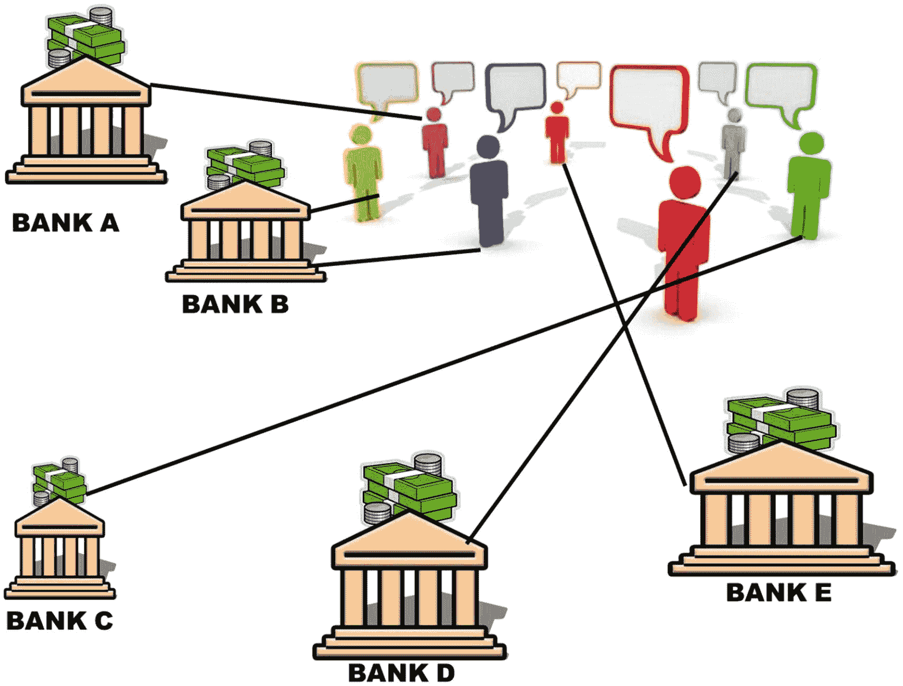
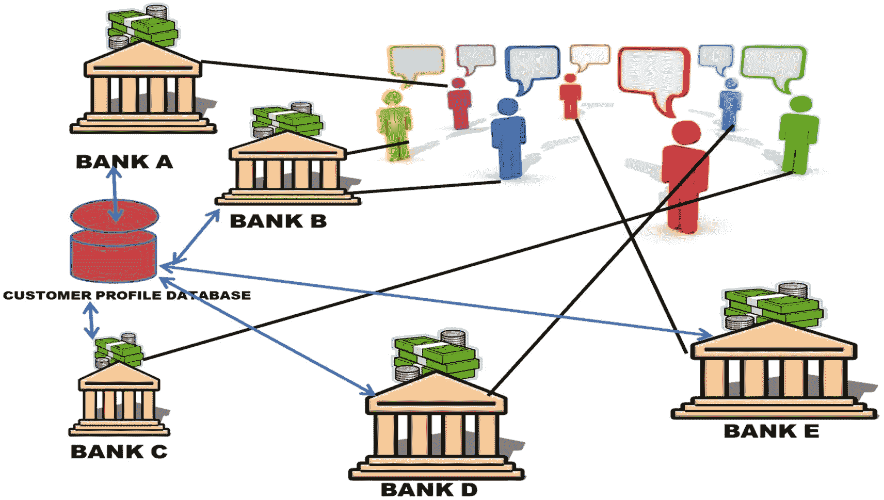
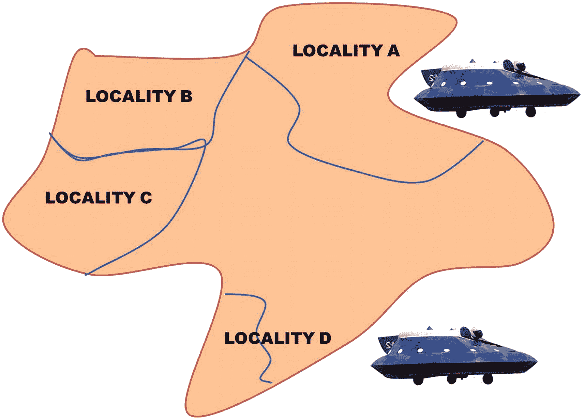

# 十八、金融机器学习货币化

在这一章中，我将提出一些创新的想法，这些想法可以在金融世界中使用机器学习来货币化。我还将向您展示一些使用类似方法并取得成功的例子。对他们中的一些人来说，现在可能没有榜样，因为他们更有远见。

货币化的三个领域如下:

*   关联银行

*   飞入金融市场

*   金融资产交易所

在某种程度上，正如我将进一步解释的那样，互联零售店和互联仓库的概念是相互联系的。但是，我们将分别研究它们，以便更详细地理解它们，然后看看它们如何协同工作。

## 关联银行

为了让我们理解我所说的互联银行的含义，就像我们对互联零售店所做的那样，让我们首先理解什么是互联银行。

*   互联银行不仅仅是将数字功能扩展到您现有的实体银行。

*   互联银行网络不仅仅是让客户使用银行的数字产品技术。

*   互联银行网络不仅仅拥有客户的数字档案。

*   互联银行网络不仅仅是对现有银行客户数据使用机器学习，并向他们提供银行的产品。

在了解了什么是联网银行网络之后，现在让我们看看什么是联网银行网络，以及我们是否有任何可以效仿或学习的例子。让我们看一下图 [18-1](#Fig1) 中的图表，该图显示了任何国家当前连接的银行网络。

图 18-1

当前连接的银行网络图

在当前互联银行的示例图中，我们看到每个客户都通过数字网络或实体网络与银行相连。这里要注意的关键点是，银行 A、银行 B、银行 C、银行 D 和银行 E 与它们的客户紧密相连，进行交易，如信用卡、储蓄、银行账户、贷款、保险和其他支付。但是，这些银行无法访问另一家银行的客户数据。例如，如果 E 银行有一个客户，该银行客户想在 A 银行开户，那么该客户也必须向新银行提供所有信息、文件和其他此类了解客户的要求。这对每个银行来说都是一项开销，因为它们必须独立地验证和存储客户信息。这些银行彼此不交谈，因此它们不知道关于客户的历史信息或其他银行网络。例如，银行 D 的客户可能拥有信用卡账户，而他们可能拥有银行 B 的贷款账户。银行 B 将无法访问客户的历史付款信息，这些信息存储在银行 D 的网络中。本质上，银行是在暗中与客户打交道，不知道他们的金融历史。例如，如果一个人经常拖欠 D 银行的信用卡，那么 B 银行的贷款人可以将此人标记为屡次违约者，并采取纠正措施。在当前网络中不可能这样做。银行网络各自为政，基本上互不交流。你可能会说，有信用分析机构提供一个人的信用档案——然而，这不仅仅是关于信用分析，还包括获得数据，从而洞察一个人的储蓄习惯或购买周期等。通过拥有这样的文件加载网络，银行失去了关键信息，这些信息可以通过预测客户的需求(如贷款、保险等)来帮助他们更好地与客户互动。

这就是为什么该银行当前的数字网络不足以满足其客户的所有需求，也不足以服务他们。通过创建一个互联的银行网络，他们可以共享有关个人银行和公司银行客户的信息，并应用数据挖掘找出客户的任何隐藏模式，等待客户信贷等。

让我们在图 [18-2](#Fig2) 中看看我们连接的银行网络将如何工作。在这个例子中，我们看到，银行业务对客户来说是一样的，每个客户都与他们自己的银行有联系，以满足他们自己的金融需求；然而，现在每个银行都有另一个中央客户档案数据库，该中央客户档案数据库允许银行在获得客户许可后访问客户的档案。让我们看看在这个超连接环境中交易将如何发生。

图 18-2

真正连接的银行网络

让我们看一下 C 银行的一位客户，他在过去 15 年里一直是这家银行的住房贷款客户。然而，客户从银行 A 得到了一份关于续保保单的要约，其中银行 A 基于其客户简档数据库向该客户提供了更好的要约，在该数据库中，银行 A 可以看到该客户在另一家银行有一份保单。虽然银行之间存在竞争，但客户也获得了更好的优惠，如果他们喜欢新的优惠，他们可以将产品从一家银行转移到另一家银行。这种独特的场景只有在我们拥有这种超连接客户档案数据库的情况下才会发生，这种数据库由一个机构集中控制，比如一个国家的中央银行。它不仅可以有个人客户，也可以有在其他银行有大额金融贷款和商业账户的公司客户。在这种超关联场景中，对于将要向另一个公司客户提供贷款的潜在银行来说，该公司客户的财务历史不再是秘密。通过创建这个集中控制的数据库，不仅可以访问支付历史，还可以访问所有的金融交易，包括贷款偿还信贷服务等。尽管银行因分享竞争力方面的信息而遭受损失，但这对于在整个银行体系中引入透明度大有裨益。金融交易的透明度给银行家带来了巨大的好处，让他们能够分辨出哪些是好客户，哪些是坏客户。在这个超连接的世界中，客户通过跨银行共享数据而受益，因为他们不必一次又一次地提供相同的数据或不同的数据，然后在超连接的银行网络中获得集中的身份。实现这种超互联银行业务的最大挑战涉及数据隐私，在这种情况下，个人客户的财务资料在不同的网络上共享。在实现这种系统之前，客户同意分享他们的个人或公司财务状况是绝对必要的。这种集中式系统的安全性也非常重要。

在实现这种超连接系统时可能面临的另一个障碍是建立个人或公司的身份。发行唯一的身份号码或使用现有的身份文件，如社会安全号码、国民身份证号码或税务身份证号码，对于在国与国之间实现它来说肯定是一个挑战。这当然是一个不小的挑战，因为没有多少国家为其公民和公司提供国家身份证号码。然而，在美国或印度这样的国家，这应该不会成为大问题，因为个人和企业的国家身份已经确立。

## 飞入金融市场

这也是一个未来主义的创新理念；然而，金融业应该现在就开始准备，以便利用最近发生的技术发展。在这个创新的用例中，银行的主要格言变成了“来找你！”这个用例类似于飞进零售店；然而，飞入银行的功能是完全不同的。银行飞向客户，因为客户面临严重的交通堵塞和日程工作超负荷，因此没有时间去银行。从在偏远地区分发现金到使用无人机将信用卡或借记卡等金融产品送到客户家门口，再到为亚马逊的客户提供保险损失索赔服务，这一创新充满了希望。在这些远程操作中，替换人类是不可避免的。

可以通过使用社交媒体平台来调查生活在特定社区或地区的个人的需求并获取反馈，从而独立启动飞入式金融服务市场。从地理上来说，这种标记调查，然后创建基于社区的金融，然后创建正确的报价给两户人，人们事先购买 UV 的广告，并让他们知道他们所在地区的金融服务活动，这在未来将非常普遍。银行家们越来越倾向于通过这种方式接触那些已经忙于生活的客户。所以银行决定来找你，根据你的需求为你提供金融产品和服务。像这样一个由人类或信息技术建立的飞行银行的安全性是这个国家和他们计划瞄准的社区需要回答的问题。图 [18-3](#Fig3) 描绘了这样一个场景。

图 18-3

飞入金融市场

在图 [18-3](#Fig3) 中，我们可以看到城市中有四个假想的地点，在将金融市场放入社区位置之前，金融市场会在一个地点上空盘旋。让金融机构参与组织这种活动对于组织这种活动的公司来说是昂贵的事情，因此他们希望有来自各种金融公司如银行和其他金融机构的赞助商，这些赞助商希望向潜在的客户销售他们的产品并与特定的社区或地方交谈。这种线下金融市场的地域划分和地理分布将随着服务的推出而不断发展。组织此类活动的公司最终将瞄准表现更好的社区，而不是那些在金融服务销售方面表现不佳的社区。金融机构将能够拥有自己的飞行自主车辆，这些车辆将具有机器学习能力，通过为用户服务并在组织此类活动之前测量他们的名字来产生此类活动。从组织活动到了解客户需求，再到创造合适的产品，整个过程将完全自动化。在某些领域可能需要人工干预，这就是机器学习模型将从人类那里获取输入，以便微调向其潜在客户提供的最终产品。

## 金融资产交易所

这是一个我觉得时机已经到来的概念。为了充分理解这一点，我们需要了解基于金融资产的交易在当今时代是如何发生的。一项资产[[1](#Par73)； [`https://fbs.com/glossary/financial-asset-29`](https://fbs.com/glossary/financial-asset-29) 】通常是对个人有价值的东西。与金钱相关的资源是难以捉摸的流动资源，例如，银行商店、证券和股票，其费用是从它们所涉及的具有法律约束力的案件中获得的，与财产或项目相反，它们不是与记录纸张分离的明确无误的物理资源。

正常的货币相关资源包括认证、证券、股票和银行存储。

存储遗嘱(CD)是金融专家和银行之间的一种协议，其中投机者同意在银行保留一定数量的现金，以换取有保证的贷款成本。银行可能会提供更高的保费分期付款，因为现金将在一段时间内保持完美。投机者在协议期限结束前收回 CD 的可能性极小，他或她将错过阴谋分期付款，并可能受到货币处罚。

另一种众所周知的货币资源是证券，通常由组织或政府出售，记住最终目标是使储备能够在此时此地扩展。证券是一个权威的档案，说明金融专家借给借款人多少现金，何时应该偿还(除了溢价)以及债券的开发日期。

股票是一种主要的与金钱相关的资源，没有固定的到期日。将资源投入股票为贡献者提供了对组织的责任，并提供了组织的利益和不幸。股票可以保留任意一段时间，直到投资者选择把它卖给另一个金融专家。尽管财务记录和银行账户暗示了流动资源，但它们的利润率更受限制。与此同时，大额存单和货币展示账户在相当长的时间或几年内限制提款。当融资成本下降时，可赎回 CDs 就会被频繁赎回，投机者就会面临转移资金以压低工资的风险。

将你的部分现金分散到各种风险投资中可能会获利，因为其中一些风险投资没有合适的资产。每种资产都有其潜在的回报和风险。

金融资产的当前环境在很大程度上是无形的，并且它们没有物理存在，例如证明某人对该类型资产的所有权的文件。这种金融资产分类存在缺陷，我们现在来看看其中的一些。

表 18-1

资产类别的分类

<colgroup><col class="tcol1 align-left"> <col class="tcol2 align-left"></colgroup> 
| 

资产类

 | 

类型

 |
| --- | --- |
| **无形的** | 股票、债券、存款、货币。版权、专利 |
| **有形的** | 土地、房屋、车辆、建筑、高端手机、高端电子设备、机器人、无人机、机械。 |

在表 [18-1](#Tab1) 中，我们可以看到无形和有形两种类型。有形资产是我们作为人类可以触摸和感受到的资产。可变类型的资产是那些不能用感官触摸或感觉的资产。这是一个简单的分类，很容易理解。对于拥有股票和债券、存款或加密货币等资产的人来说，不存在单一的资产交易所，他们不仅可以在无形资产之间进行交易，还可以与有形资产进行交易。

让我们看一个例子，它将清楚地表明我想说的关于我们正在谈论的资产交换的内容。假设一个人持有一项专利，他们想把它转换成现金。这样一个他们可以出售专利并获得现金回报的机构并不存在。同样，也没有这样的交易所，人们可以去提供他们的现金存款，并通过从拥有版权的特定人那里购买版权来进行转换。让我们来看第二类有形资产，我们看到一个人在使用一部高端手机，他们想用手机兑换一部电子设备作为回报。资产类别从移动电话、无人机或机器等设备发生变化，客户希望将其换成土地或房屋。这种类型的资产交换是非常创新的，肯定是世界上任何地方都不存在的。

甚至在今天，也不存在购买和销售无形资产中的发动机。这里的概念是消除金融资产在无形和有形价值方面的差异，我将给你一个例子，其中可以使用区块链技术和机器学习来建立这样的交易所，以评估属于任何资产类别的资产的当前市场价格。让我们看一个例子。如果保罗价值 200 万美元，并想在某个特定的城市买一栋房子，那么在当前的情况下，他需要首先在股票交易所出售股票，然后通过去那个特定的城市寻找房子来购买房子。然而，在最好的新的创新金融资产交换系统发挥作用的情况下，想要购买房子的人直接去金融资产交易所，并提供在城市内特定地点或社区的房子。就金融交易而言，这样的资产交换将使人们的生活变得极其快捷。同样，一个拥有机器或机器人的人可以用他们的东西来交换物品或现金存款。我将称这种金融服务体系为资产交易所的诞生。

虽然金融资产交易所看起来操作非常简单，但它们是任何国家金融监管中最大的障碍或路障。没有时间去各个市场买卖产品的消费者有一种强烈的需求，他们希望有一个简单的资产交易平台，为他们处理所有这些转换。金融监管机构需要理解这个名称，并出台严格的监管措施，在洗钱和欺诈交易利用这种通用资产交易所发生时，对其进行检查。

为每个有形和无形资产建立市场价值的能力需要输入到机器学习系统中的消息数据集，然后该机器学习系统将使用预测模型来预测与现在相比资产价值的未来增长。这将有助于决策者或购买者通过查看其内在价值、当前提供的市场价值和该金融资产的预测市场价值来避免不适当的决策。这种交易的独特销售主张将是使用机器学习来预测这种有形和无形资产的未来价格。因此，我们已经看到了最后一个创新的概念，它提供了改变金融资产在未来被评估、购买和出售的方式。首先，公司可以在易于交换的无形资产之间创建一个资产交换，并为有形产品创建另一个金融资产交换。然后，在满足所有法规遵从性之后，它可以创建并合并这两个金融资产交易所。

## 尾注

1.  金融资产， [`https://fbs.com/glossary/financial-asset-29`](https://fbs.com/glossary/financial-asset-29)