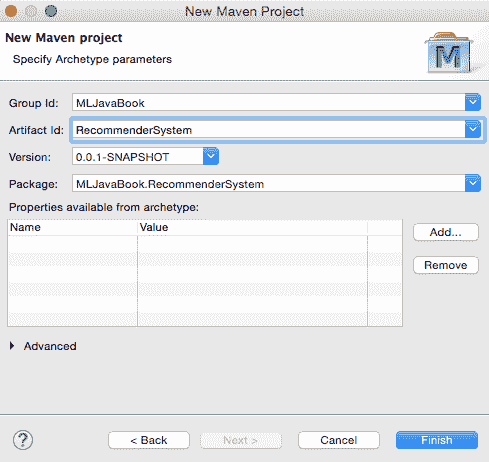
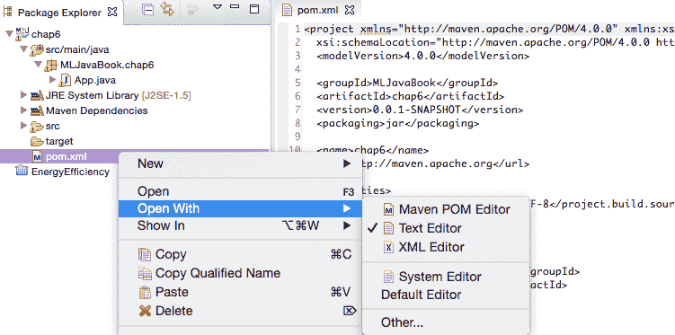
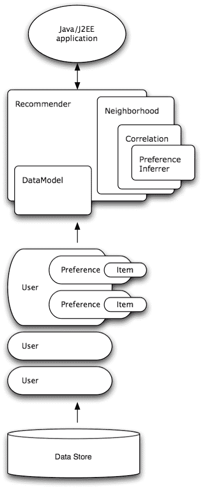

# 六、Apache Mahout 推荐引擎

推荐引擎是当今初创公司中应用最广泛的数据科学方法之一。构建推荐系统有两种主要技术:基于内容的过滤和协同过滤。基于内容的算法使用项目的属性来查找具有相似属性的项目。协同过滤算法采用用户评级或其他用户行为，并根据具有相似行为的用户喜欢或购买的内容进行推荐。

在本章中，我们将首先解释理解推荐引擎原理所需的基本概念，然后我们将演示如何利用 Apache Mahout 的各种算法的实现来快速获得可扩展的推荐引擎。

本章将涵盖以下主题:

*   如何构建推荐引擎
*   准备好 Apache Mahout
*   基于内容的方法
*   协作过滤方法

在本章结束时，你将会学到适合我们问题的推荐引擎的种类，以及如何快速实现这个引擎。


# 基本概念

推荐引擎旨在向用户展示感兴趣的项目。与搜索引擎不同的是，相关内容通常在没有被请求的情况下出现在网站上，用户不必构建查询，因为推荐引擎会观察用户的行为，并在用户不知情的情况下为用户构建查询。

可以说，推荐引擎最著名的例子是 www.amazon.com，它以多种方式提供个性化推荐。下面的屏幕截图显示了购买了该商品的客户也购买了该商品的示例。稍后您将会看到，这是一个基于项目的协作推荐示例，其中推荐与特定项目相似的项目:


在本节中，我们将介绍与理解和构建推荐引擎相关的关键概念。


# 关键概念

推荐引擎需要以下输入才能做出推荐:

*   项目信息，用属性描述
*   用户资料，如年龄范围、性别、位置、朋友等
*   用户交互，以评级、浏览、标记、比较、保存和发送电子邮件的形式
*   将显示项目的上下文；例如，项目的类别和项目的地理位置

该输入然后被推荐引擎组合以帮助获得以下内容:

*   购买、观看、查看或书签标记了该项目的用户也购买、观看、查看或书签标记了该项
*   与此项类似的项目
*   您可能认识的其他用户
*   与您相似的其他用户

现在，让我们仔细看看这种组合是如何工作的。


# 基于用户和基于项目的分析

构建推荐引擎取决于当试图推荐特定项目时，引擎是否搜索相关项目或用户。

在基于项目的分析中，引擎侧重于识别与特定项目相似的项目，而在基于用户的分析中，首先确定与特定用户相似的用户。例如，确定具有相同简档信息(年龄、性别等)或行为历史(购买、观看、观看等)的用户，然后将相同的项目推荐给其他类似的用户。

这两种方法都需要我们计算相似性矩阵，这取决于我们是在分析物品属性还是用户行为。让我们更深入地了解一下这是如何做到的。


# 计算相似度

有三种计算相似性的基本方法，如下所示:

*   协同过滤算法采用用户评级或其他用户行为，并根据具有相似行为的用户喜欢或购买的内容进行推荐
*   基于内容的算法使用项目的属性来查找具有相似属性的项目
*   一种混合方法结合了协作过滤和基于内容的过滤

让我们在接下来的小节中详细了解一下每种方法。


# 协同过滤

**协同过滤**完全基于用户评分或其他用户行为，根据具有相似行为的用户喜欢或购买的内容进行推荐。

协同过滤的一个关键优势是它不依赖于项目内容，因此，它能够准确地推荐复杂的项目，例如电影，而无需了解项目本身。潜在的假设是，过去同意的人将来也会同意，并且他们会喜欢与他们过去喜欢的东西相似的东西。

这种方法的一个主要缺点是所谓的冷启动，这意味着如果我们想要建立一个精确的协同过滤系统，算法往往需要大量的用户评级。这通常会在产品的第一个版本中去掉协同过滤，然后在收集了大量数据后再引入。


# 基于内容的过滤

另一方面，基于内容的过滤是基于项目的描述和用户偏好的简档，其组合如下。首先，用属性描述项目，为了找到相似的项目，我们使用距离度量来测量项目之间的距离，例如余弦距离或皮尔逊系数(在第一章、*应用机器学习快速入门*中有更多关于距离度量的内容)。现在，用户配置文件开始起作用了。给定关于用户喜欢的项目种类的反馈，我们可以引入权重，指定特定项目属性的重要性。例如，Pandora 广播流媒体服务应用基于内容的过滤来创建电台，使用 400 多个属性。用户最初挑选具有特定属性的歌曲，并且通过提供反馈，强调重要的歌曲属性。

最初，这种方法需要很少的用户反馈信息；因此，它有效地避免了冷启动问题。


# 混合工艺

现在，在协作和基于内容之间，你应该选择哪一个？协同过滤能够从用户关于一个内容源的动作中学习用户偏好，并在其他内容类型中使用它们。基于内容的过滤仅限于推荐用户已经在使用的相同类型的内容。这在某些用例中提供了价值；比如基于新闻浏览推荐新闻文章是有用的，但是如果基于新闻浏览可以推荐不同的来源，比如书籍、电影，那就有用得多了。

协同过滤和基于内容的过滤并不相互排斥；在某些情况下，它们可以结合起来更有效。例如，网飞使用协同过滤来分析相似用户的搜索和观看模式，以及基于内容的过滤来提供与用户高度评价的电影具有共同特征的电影。

有各种各样的杂交技术:加权、切换和混合、特征组合、特征增强、级联、元级等等。推荐系统是机器学习和数据挖掘社区中的一个活跃领域，在数据科学会议上有专门的跟踪。Adomavicius 和 Tuzhilin (2005)在论文*中对技术进行了很好的概述，该论文讨论了不同的方法和底层算法，并为后续论文提供了参考。为了获得更多的技术知识并理解某个特定方法有意义时的所有微小细节，你应该看看 Ricci 等人编辑的书:*推荐系统手册*(2010 年第一版，*出版社*。*


# 开发与探索

在推荐系统中，根据我们对用户的了解，在推荐落入用户最佳位置的项目(**开发**)和推荐不落入用户最佳位置的项目之间总是有一个权衡，目的是向用户展示一些新奇的东西(**探索**)。很少探索的推荐系统将仅推荐与先前用户评级一致的项目，从而防止显示其当前气泡之外的项目。在实践中，从用户的甜蜜点中获得新项目的意外收获通常是可取的，这导致了令人愉快的惊喜，并且潜在地发现了新的甜蜜点。

在本节中，我们讨论了开始构建推荐引擎所需的基本概念。现在，让我们看看如何用 Apache Mahout 实际构建一个。


# 获取 Apache Mahout

Mahout 是在第二章、 *Java 库和机器学习平台*中介绍的，作为一个可扩展的机器学习库。它提供了一组丰富的组件，您可以使用这些组件从选择的算法中构建一个定制的推荐系统。Mahout 的创建者说它是为企业准备的；它专为性能、可扩展性和灵活性而设计。

Mahout 可以被配置为以两种方式运行:使用或不使用 Hadoop，以及分别用于单机和分布式处理。我们将着重于在没有 Hadoop 的情况下配置 Mahout。关于 Mahout 更高级的配置和进一步的使用，我推荐两本最近的书:*学习 Apache Mahout，*作者 *C* handramani Tiwary，Packt 出版社，*学习 Apache Mahout 分类，*作者 Ashish Gupta，Packt 出版社。

因为 Apache Mahout 的构建和发布系统是基于 Maven 的，所以您需要学习如何安装它。我们将研究最方便的方法；使用 Eclipse 和 Maven 插件。


# 用 Maven 插件在 Eclipse 中配置 Mahout

你需要一个最新版本的 Eclipse，可以从它的主页([`www.eclipse.org/downloads/`](https://www.eclipse.org/downloads/))下载。在本书中，我们将使用 Eclipse Luna。打开 Eclipse 并使用默认设置启动一个新的 Maven 项目，如下面的屏幕截图所示:


将出现新的 Maven 项目屏幕，如下面的屏幕截图所示:



现在，我们需要告诉项目将 Mahout JAR 文件及其依赖项添加到项目中。找到`pom.xml`文件，用文本编辑器打开它(左键单击用|文本编辑器打开)，如下面的截图所示:



找到以`<dependencies>`开始的行，并在下一行添加以下代码:

```java
<dependency> 
 <groupId>org.apache.mahout</groupId> 
  <artifactId>mahout-mr</artifactId> 
  <version>0.10.0</version> 
</dependency> 
```

就是这样；已经添加了看象人，我们准备开始了。


# 构建推荐引擎

为了演示基于内容的过滤和协作过滤方法，我们将构建一个图书推荐引擎。


# 图书评分数据集

在这一章中，我们将使用一个图书评级数据集(齐格勒等人，2005 年)，该数据集是在为期四周的搜索中收集的。它包含了图书交叉网站的 278，858 个成员的数据和 1，157，112 个隐含和明确的评级，涉及 271，379 个不同的 ISBNs。用户数据是匿名的，但带有人口统计信息。数据集摘自[通过主题多样化改进推荐列表](http://www2.informatik.uni-freiburg.de/~dbis/Publications/05/WWW05.html)、 *C* ai-Nicolas Ziegler、Sean M. McNee、Joseph A. Konstan、Georg Lausen: *第 14 届国际万维网会议论文集* (WWW '05) *、*2005 年 5 月 10-14 日，日本千叶([`www2.informatik.uni-freiburg.de/~cziegler/BX/`](http://www2.informatik.uni-freiburg.de/~cziegler/BX/))。

跨帐簿数据集由以下三个文件组成:

*   `BX-Users`:包含用户。注意，用户 ID(User-ID)已经被匿名化并映射到整数。如果可能，提供人口统计数据(位置和年龄)。否则，这些字段包含空值。
*   书籍由它们各自的 ISBNs 来识别。无效的 ISBNs 已从数据集中删除。此外，给出了一些基于内容的信息(书名、作者、出版年份和出版商)，这些信息是从 Amazon Web Services 获得的。注意，在有几个作者的情况下，只提供第一作者。还给出链接到封面图片的 URL，以三种不同的风格出现(Image-URL-S、Image-URL-M 和 Image-URL-L)，分别指小型、中型和大型 URL。这些网址指向亚马逊网站。
*   `BX-Book-Ratings`:包含图书评级信息。评级(书籍评级)要么是显性的，用 1-10 的等级表示(数值越高表示欣赏程度越高)，要么是隐性的，用 0 表示。


# 加载数据

根据数据存储的位置，有两种加载数据的方法:文件或数据库。首先，我们将详细了解如何从文件中加载数据，包括如何处理自定义格式。最后，我们将快速看一下如何从数据库加载数据。


# 从文件加载数据

从文件中加载数据可以通过`FileDataModel`类来实现。我们将期待一个逗号分隔的文件，其中每行包含一个`userID`、一个`itemID`、一个可选的`preference`值和一个可选的`timestamp`，顺序相同，如下所示:

```java
userID,itemID[,preference[,timestamp]] 
```

可选偏好适应具有二进制偏好值的应用，也就是说，用户要么表达对项目的偏好，要么不表达，没有偏好程度；例如，喜欢或不喜欢。

以散列(`#`)或空行开头的行将被忽略。这些行包含附加字段也是可以接受的，这些字段将被忽略。

`DataModel`类采用以下类型:

*   `userID`和`itemID`可以被解析为`long`
*   `preference`值可以解析为`double`
*   `timestamp`可以解析为`long`

如果您能够以前面的格式提供数据集，您可以简单地使用下面的行来加载数据:

```java
DataModel model = new FileDataModel(new File(path)); 
```

此类不适用于大量数据；比如几千万行。为此，一个 JDBC 支持的`DataModel`和一个数据库更合适。

然而，在现实世界中，我们不能总是确保提供给我们的输入数据只包含`userID`和`itemID`的整数值。例如，在我们的例子中，`itemID`对应于 ISBN 图书编号，它惟一地标识了项目，但是这些不是整数，`FileDataModel`默认值不适合处理我们的数据。

现在，让我们考虑如何处理我们的`itemID`是一个字符串的情况。我们将通过扩展`FileDataModel`并覆盖长的`readItemIDFromString(String)`方法来定义我们的自定义数据模型，以便将`itemID`作为字符串读取并将其转换为`long`，并返回唯一的`long`值。为了将一个`String`转换成一个唯一的`long`，我们将扩展另一个 Mahout `AbstractIDMigrator`助手类，它正是为此任务而设计的。

现在，让我们看看`FileDataModel`是如何扩展的:

```java
class StringItemIdFileDataModel extends FileDataModel { 

  //initialize migrator to covert String to unique long 
  public ItemMemIDMigrator memIdMigtr; 

  public StringItemIdFileDataModel(File dataFile, String regex) 
     throws IOException { 
    super(dataFile, regex); 
  } 

  @Override 
  protected long readItemIDFromString(String value) { 

    if (memIdMigtr == null) { 
      memIdMigtr = new ItemMemIDMigrator(); 
    } 

    // convert to long 
    long retValue = memIdMigtr.toLongID(value); 
    //store it to cache  
    if (null == memIdMigtr.toStringID(retValue)) { 
      try { 
        memIdMigtr.singleInit(value); 
      } catch (TasteException e) { 
        e.printStackTrace(); 
      } 
    } 
    return retValue; 
  } 

  // convert long back to String 
  String getItemIDAsString(long itemId) { 
    return memIdMigtr.toStringID(itemId); 
  } 
} 
```

其他可以被覆盖的有用方法如下:

*   `readUserIDFromString(String value)`，如果用户 id 不是数字
*   `readTimestampFromString(String value)`，改变`timestamp`的解析方式

现在，让我们看看`AbstractIDMIgrator`是如何扩展的:

```java
class ItemMemIDMigrator extends AbstractIDMigrator { 

  private FastByIDMap<String> longToString; 

  public ItemMemIDMigrator() { 
    this.longToString = new FastByIDMap<String>(10000); 
  } 

  public void storeMapping(long longID, String stringID) { 
    longToString.put(longID, stringID); 
  } 

  public void singleInit(String stringID) throws TasteException { 
    storeMapping(toLongID(stringID), stringID); 
  } 

  public String toStringID(long longID) { 
    return longToString.get(longID); 
  } 
} 
```

现在，一切就绪，我们可以用下面的代码加载数据集:

```java
StringItemIdFileDataModel model = new StringItemIdFileDataModel( 
  new File("datasets/chap6/BX-Book-Ratings.csv"), ";"); 
System.out.println( 
"Total items: " + model.getNumItems() +  
"\nTotal users: " +model.getNumUsers()); 
```

这提供了用户和项目的总数作为输出:

```java
    Total items: 340556
    Total users: 105283

```

我们准备继续前进，并开始提出建议。


# 从数据库加载数据

或者，我们可以使用一个 JDBC 数据模型从数据库中加载数据。在这一章中，我们将不会深入到如何设置数据库、连接等的详细说明中，但是我们将给出一个如何实现这一点的草图。

数据库连接器已经被移动到一个单独的包中，`mahout-integration`；因此，我们必须将这个包添加到我们的`dependency`列表中。打开`pom.xml`文件，添加以下`dependency`:

```java
<dependency> 
  <groupId>org.apache.mahout</groupId> 
  <artifactId>mahout-integration</artifactId> 
  <version>0.7</version> 
</dependency> 
```

假设我们想要连接到一个 MySQL 数据库。在这种情况下，我们还需要一个处理数据库连接的包。将以下内容添加到`pom.xml`文件中:

```java
<dependency> 
  <groupId>mysql</groupId> 
  <artifactId>mysql-connector-java</artifactId> 
  <version>5.1.35</version> 
</dependency> 
```

现在，我们有了所有的包，所以我们可以创建一个连接。首先，让我们用连接细节初始化一个`DataSource`类，如下所示:

```java
MysqlDataSource dbsource = new MysqlDataSource(); 
  dbsource.setUser("user"); 
  dbsource.setPassword("pass"); 
  dbsource.setServerName("hostname.com"); 
  dbsource.setDatabaseName("db"); 
```

Mahout 集成实现了可以通过 JDBC 访问的各种数据库。默认情况下，该类假设在 JNDI 名`jdbc/taste`下有一个可用的`DataSource`，它允许访问一个带有
`taste_preferences`表的数据库，模式如下:

```java
CREATE TABLE taste_preferences ( 
  user_id BIGINT NOT NULL, 
  item_id BIGINT NOT NULL, 
  preference REAL NOT NULL, 
  PRIMARY KEY (user_id, item_id) 
) 
CREATE INDEX taste_preferences_user_id_index ON taste_preferences 
   (user_id); 
CREATE INDEX taste_preferences_item_id_index ON taste_preferences 
   (item_id); 
```

数据库支持的数据模型初始化如下。除了 DB 连接对象，我们还可以指定自定义表名和表列名，如下所示:

```java
DataModel dataModel = new MySQLJDBCDataModel(dbsource, 
   "taste_preferences",  
  "user_id", "item_id", "preference", "timestamp"); 
```


# 内存数据库

最后但同样重要的是，数据模型可以动态创建并保存在内存中。可以从一组偏好中创建一个数据库，该数据库将保存一组项目的用户评级。

我们可以如下进行。首先，我们创建一个偏好数组的`FastByIdMap`散列映射`PreferenceArray`，它存储一个偏好数组:

```java
FastByIDMap <PreferenceArray> preferences = new FastByIDMap 
   <PreferenceArray> ();  
```

接下来，我们可以为用户创建一个新的偏好数组来保存他们的评级。该数组必须用一个 size 参数初始化，该参数在内存中保留这么多的槽:

```java
PreferenceArray prefsForUser1 =  
  new GenericUserPreferenceArray (10);   
```

接下来，我们在位置`0`设置当前偏好的用户 ID。这将实际设置所有首选项的用户 ID:

```java
prefsForUser1.setUserID (0, 1L);  
```

在位置`0`为当前偏好设置一个`itemID`，如下所示:

```java
prefsForUser1.setItemID (0, 101L);  
```

在`0`设置首选项的首选项值，如下所示:

```java
prefsForUser1.setValue (0, 3.0f);   
```

继续其他项目评级，如下所示:

```java
prefsForUser1.setItemID (1, 102L);  
prefsForUser1.setValue (1, 4.5F);  
```

最后，将用户`preferences`添加到哈希映射中:

```java
preferences.put (1L, prefsForUser1); // use userID as the key  
```

偏好散列图现在可以用来初始化`GenericDataModel`:

```java
DataModel dataModel = new GenericDataModel(preferences); 
```

这段代码演示了如何为单个用户添加两个首选项；在实际应用中，您会希望为多个用户添加多个首选项。


# 协同过滤

Mahout 中的推荐引擎可以用`org.apache.mahout.cf.taste`包构建，它以前是一个名为`Taste`的独立项目，并在 Mahout 中继续开发。

基于 Mahout 的协作过滤引擎获取用户对项目的偏好(口味),并返回对其他项目的估计偏好。例如，一个销售书籍或 CD 的网站可以很容易地使用 Mahout，在以前购买数据的帮助下，找出客户可能有兴趣听的 CD。

顶层包将 Mahout 接口定义为以下关键抽象:

*   数据模型(data model):这是一个关于用户和他们对项目的偏好的信息库
*   **用户相似性**:这定义了两个用户之间相似性的概念
*   **项目相似性**:这定义了两个项目之间相似性的概念
*   **UserNeighborhood** :计算给定用户的邻居用户
    *   **推荐者**:为用户推荐商品

下图显示了上述概念的一般结构:




# 基于用户的过滤

最基本的基于用户的协同过滤可以通过初始化前面描述的组件来实现，如下所示:

首先，加载数据模型:

```java
StringItemIdFileDataModel model = new StringItemIdFileDataModel( 
    new File("/datasets/chap6/BX-Book-Ratings.csv", ";"); 
```

接下来，定义如何计算用户之间的相关性；例如，使用皮尔逊相关性:

```java
UserSimilarity similarity =  
  new PearsonCorrelationSimilarity(model); 
```

接下来，定义如何根据用户的评级来区分哪些用户是相似的，即哪些用户彼此很接近:

```java
UserNeighborhood neighborhood =  
  new ThresholdUserNeighborhood(0.1, similarity, model); 
```

现在，我们可以用`model`、`neighborhood`和类似对象的数据初始化一个`GenericUserBasedRecommender`默认引擎，如下所示:

```java
UserBasedRecommender recommender =  
new GenericUserBasedRecommender(model, neighborhood, similarity); 
```

就是这样。我们的第一个基本推荐引擎已经准备好了。让我们讨论如何调用建议。首先，让我们打印用户已经评分的项目，以及对该用户的十条推荐:

```java
long userID = 80683; 
int noItems = 10; 

List<RecommendedItem> recommendations = recommender.recommend( 
  userID, noItems); 

System.out.println("Rated items by user:"); 
for(Preference preference : model.getPreferencesFromUser(userID)) { 
  // convert long itemID back to ISBN 
  String itemISBN = model.getItemIDAsString( 
  preference.getItemID()); 
  System.out.println("Item: " + books.get(itemISBN) +  
    " | Item id: " + itemISBN +  
    " | Value: " + preference.getValue()); 
} 

System.out.println("\nRecommended items:"); 
for (RecommendedItem item : recommendations) { 
  String itemISBN = model.getItemIDAsString(item.getItemID()); 
  System.out.println("Item: " + books.get(itemISBN) +  
    " | Item id: " + itemISBN +  
    " | Value: " + item.getValue()); 
} 
```

这将提供以下建议及其分数作为输出:

```java
    Rated items:
    Item: The Handmaid's Tale | Item id: 0395404258 | Value: 0.0
    Item: Get Clark Smart : The Ultimate Guide for the Savvy Consumer | Item id: 1563526298 | Value: 9.0
    Item: Plum Island | Item id: 0446605409 | Value: 0.0
    Item: Blessings | Item id: 0440206529 | Value: 0.0
    Item: Edgar Cayce on the Akashic Records: The Book of Life | Item id: 0876044011 | Value: 0.0
    Item: Winter Moon | Item id: 0345386108 | Value: 6.0
    Item: Sarah Bishop | Item id: 059032120X | Value: 0.0
    Item: Case of Lucy Bending | Item id: 0425060772 | Value: 0.0
    Item: A Desert of Pure Feeling (Vintage Contemporaries) | Item id: 0679752714 | Value: 0.0
    Item: White Abacus | Item id: 0380796155 | Value: 5.0
    Item: The Land of Laughs : A Novel | Item id: 0312873115 | Value: 0.0
    Item: Nobody's Son | Item id: 0152022597 | Value: 0.0
    Item: Mirror Image | Item id: 0446353957 | Value: 0.0
    Item: All I Really Need to Know | Item id: 080410526X | Value: 0.0
    Item: Dreamcatcher | Item id: 0743211383 | Value: 7.0
    Item: Perplexing Lateral Thinking Puzzles: Scholastic Edition | Item id: 0806917695 | Value: 5.0
    Item: Obsidian Butterfly | Item id: 0441007813 | Value: 0.0

    Recommended items:
    Item: Keeper of the Heart | Item id: 0380774933 | Value: 10.0
    Item: Bleachers | Item id: 0385511612 | Value: 10.0
    Item: Salem's Lot | Item id: 0451125452 | Value: 10.0
    Item: The Girl Who Loved Tom Gordon | Item id: 0671042858 | Value: 10.0
    Item: Mind Prey | Item id: 0425152898 | Value: 10.0
    Item: It Came From The Far Side | Item id: 0836220730 | Value: 10.0
    Item: Faith of the Fallen (Sword of Truth, Book 6) | Item id: 081257639X | Value: 10.0
    Item: The Talisman | Item id: 0345444884 | Value: 9.86375
    Item: Hamlet | Item id: 067172262X | Value: 9.708363
    Item: Untamed | Item id: 0380769530 | Value: 9.708363

```


# 基于项目的过滤

`ItemSimilarity`属性是这里要讨论的最重要的一点。基于项目的推荐器是有用的，因为它们可以很快地利用某些东西；他们的计算基于项目相似性，而不是用户相似性，并且项目相似性是相对静态的。它可以预先计算，而不是实时重新计算。

因此，如果您打算使用这个类，强烈建议您使用预计算相似性的`GenericItemSimilarity`。您也可以使用`PearsonCorrelationSimilarity`，它可以实时计算相似性，但是您可能会发现对于大量数据来说，这非常慢:

```java
StringItemIdFileDataModel model = new StringItemIdFileDataModel( 
  new File("datasets/chap6/BX-Book-Ratings.csv"), ";"); 

ItemSimilarity itemSimilarity = new 
   PearsonCorrelationSimilarity(model); 

ItemBasedRecommender recommender = new 
   GenericItemBasedRecommender(model, itemSimilarity); 

String itemISBN = "0395272238"; 
long itemID = model.readItemIDFromString(itemISBN); 
int noItems = 10; 
List<RecommendedItem> recommendations = 
   recommender.mostSimilarItems(itemID, noItems); 

System.out.println("Recommendations for item: 
   "+books.get(itemISBN)); 

System.out.println("\nMost similar items:"); 
for (RecommendedItem item : recommendations) { 
  itemISBN = model.getItemIDAsString(item.getItemID()); 
  System.out.println("Item: " + books.get(itemISBN) + " | Item id: 
     " + itemISBN + " | Value: " + item.getValue()); 
} 
Recommendations for item: Close to the BoneMost similar items:Item: Private Screening | Item id: 0345311396 | Value: 1.0Item: Heartstone | Item id: 0553569783 | Value: 1.0Item: Clockers / Movie Tie In | Item id: 0380720817 | Value: 1.0Item: Rules of Prey | Item id: 0425121631 | Value: 1.0Item: The Next President | Item id: 0553576666 | Value: 1.0Item: Orchid Beach (Holly Barker Novels (Paperback)) | Item id: 0061013412 | Value: 1.0Item: Winter Prey | Item id: 0425141233 | Value: 1.0Item: Night Prey | Item id: 0425146413 | Value: 1.0Item: Presumed Innocent | Item id: 0446359866 | Value: 1.0Item: Dirty Work (Stone Barrington Novels (Paperback)) | Item id: 
   0451210158 | Value: 1.0
```

结果列表返回一组与我们选择的特定项目相似的项目。


# 向建议添加自定义规则

经常发生的情况是，一些业务规则要求我们提高所选项目的分数。例如，在图书数据集中，如果一本书是最近的，我们希望给它一个较高的分数。这可以通过使用`IDRescorer`接口来实现，如下所示:

*   `rescore(long, double)`将`itemId`和原始分数作为参数，并返回修改后的分数
*   `isFiltered(long)`返回`true`从建议中排除特定项目，否则返回`false`

我们的示例可以实现如下:

```java
class MyRescorer implements IDRescorer { 

  public double rescore(long itemId, double originalScore) { 
    double newScore = originalScore; 
    if(bookIsNew(itemId)){ 
      originalScore *= 1.3; 
    } 
    return newScore; 
  } 

  public boolean isFiltered(long arg0) { 
    return false; 
  } 

} 
```

调用`recommender.recommend`时提供了`IDRescorer`的实例:

```java
IDRescorer rescorer = new MyRescorer(); 
List<RecommendedItem> recommendations =  
recommender.recommend(userID, noItems, rescorer); 
```


# 估价

您可能想知道如何确保返回的建议有意义。真正确定推荐有多有效的唯一方法是在一个真实用户的系统中使用 A/B 测试。例如，A 组收到一个随机的项目作为推荐，而 B 组收到一个由我们的引擎推荐的项目。

由于这并不总是可能的(也不实际)，我们可以通过离线统计评估得到一个估计值。一种方法是使用 k-fold 交叉验证，这在第一章、*应用机器学习快速入门*中有介绍。我们将一个数据集划分成多个集合；一些用于训练我们的推荐引擎，其余的用于测试它向未知用户推荐商品的效果如何。

Mahout 实现了`RecommenderEvaluator`类，它将数据集分成两部分。第一部分(默认为 90%)用于产生推荐，而其余的数据与估计的偏好值进行比较，以测试匹配情况。该类不直接接受`recommender`对象；您需要构建一个实现`RecommenderBuilder`接口的类，它为给定的`DataModel`对象构建一个`recommender`对象，然后用于测试。让我们来看看这是如何实现的。

首先，我们创建一个实现`RecommenderBuilder`接口的类。我们需要实现`buildRecommender`方法，它将返回一个`recommender`，如下所示:

```java
public class BookRecommender implements RecommenderBuilder  { 
  public Recommender buildRecommender(DataModel dataModel) { 
    UserSimilarity similarity =  
      new PearsonCorrelationSimilarity(model); 
    UserNeighborhood neighborhood =  
      new ThresholdUserNeighborhood(0.1, similarity, model); 
    UserBasedRecommender recommender =  
      new GenericUserBasedRecommender( 
        model, neighborhood, similarity); 
    return recommender; 
  } 
} 
```

现在我们有了一个返回推荐者对象的类，我们可以初始化一个`RecommenderEvaluator`实例。这个类的默认实现是`AverageAbsoluteDifferenceRecommenderEvaluator`类，它为用户计算预测和实际评分之间的平均绝对差值。下面的代码显示了如何将各个部分组合在一起，并运行保持测试:

首先，加载一个数据模型，如下所示:

```java
DataModel dataModel = new FileDataModel( 
  new File("/path/to/dataset.csv")); 
```

接下来，初始化一个`evaluator`实例，如下所示:

```java
RecommenderEvaluator evaluator =  
  new AverageAbsoluteDifferenceRecommenderEvaluator(); 
```

初始化`BookRecommender`对象，实现`RecommenderBuilder`接口，如下所示:

```java
RecommenderBuilder builder = new MyRecommenderBuilder(); 
```

最后，调用`evaluate()`方法，该方法接受以下参数:

*   `RecommenderBuilder`:这是实现`RecommenderBuilder`的对象，可以构建`recommender`进行测试
*   `DataModelBuilder`:表示要使用的`DataModelBuilder`；如果为空，将使用默认的`DataModel`实现
*   `DataModel`:这是将用于测试的数据集
*   `trainingPercentage`:这表示用于产生推荐的每个用户偏好的百分比；其余的与估计的偏好值进行比较，以评估`recommender`的性能
*   `evaluationPercentage`:这是评估中使用的用户百分比

该方法的调用如下:

```java
double result = evaluator.evaluate(builder, null, model, 0.9, 
   1.0); 
System.out.println(result); 
```

该方法返回一个`double`，其中`0`代表可能的最佳评价，意味着推荐者完全符合用户偏好。一般来说，值越低，匹配越好。


# 在线学习引擎

在任何一个在线平台，新用户都会不断增加。前面讨论的方法对现有用户很有效。为每个添加的新用户创建一个推荐实例是非常昂贵的。我们不能忽视在推荐引擎制作完成后添加到系统中的用户。为了处理类似的情况，Apache Mahout 能够向数据模型添加一个临时用户。
一般设置如下:

*   使用当前数据定期重新创建整个建议(例如，每天或每小时，取决于需要多长时间)
*   在寻求建议之前，请始终检查用户是否存在于系统中
*   如果用户存在，则完成建议
*   如果用户不存在，则创建一个临时用户，填写首选项，然后进行推荐

第一步似乎很棘手，涉及到使用当前数据生成整个推荐的频率。如果系统很大，将会有存储器限制，因为当新的推荐器被生成时，旧的、工作的推荐器应该被保存在存储器中，所以请求从旧的拷贝被提供，直到新的推荐器准备好。

对于临时用户，我们可以用一个`PlusAnonymousConcurrentUserDataModel`实例包装我们的数据模型。这个类允许我们获得一个临时用户 ID；ID 必须在以后被释放，以便可以重用(这种 ID 的数量是有限的)。获得 ID 后，我们必须填写首选项，然后我们可以继续推荐，一如既往:

```java
class OnlineRecommendation{ 

  Recommender recommender; 
  int concurrentUsers = 100; 
  int noItems = 10; 

  public OnlineRecommendation() throws IOException { 

    DataModel model = new StringItemIdFileDataModel( 
      new File /chap6/BX-Book-Ratings.csv"), ";"); 
    PlusAnonymousConcurrentUserDataModel plusModel = new 
       PlusAnonymousConcurrentUserDataModel
         (model, concurrentUsers); 
    recommender = ...; 

  } 

  public List<RecommendedItem> recommend(long userId, 
     PreferenceArray preferences){ 

    if(userExistsInDataModel(userId)){ 
      return recommender.recommend(userId, noItems); 
    } 

    else{ 

      PlusAnonymousConcurrentUserDataModel plusModel = 
        (PlusAnonymousConcurrentUserDataModel) 
           recommender.getDataModel(); 

      // Take an available anonymous user form the poll 
      Long anonymousUserID = plusModel.takeAvailableUser(); 

      // Set temporary preferences 
      PreferenceArray tempPrefs = preferences; 
      tempPrefs.setUserID(0, anonymousUserID); 
      tempPrefs.setItemID(0, itemID); 
       plusModel.setTempPrefs(tempPrefs, anonymousUserID); 

      List<RecommendedItem> results = 
         recommender.recommend(anonymousUserID, noItems); 

      // Release the user back to the poll 
      plusModel.releaseUser(anonymousUserID); 

      return results; 

    } 

  } 
} 
```


# 基于内容的过滤

基于内容的过滤超出了 Mahout 框架的范围，主要是因为如何定义类似的项目取决于您。如果我们想做一个基于内容的项目相似性，我们需要实现我们自己的`ItemSimilarity`。例如，在我们的书的数据集中，我们可能想要为书的相似性建立以下规则:

*   如果类型相同，将`0.15`添加到`similarity`
*   如果作者相同，在`similarity`上加上`0.50`

我们现在可以实现我们自己的`similarity`度量，如下所示:

```java
class MyItemSimilarity implements ItemSimilarity { 
 ... 
 public double itemSimilarity(long itemID1, long itemID2) { 
  MyBook book1 = lookupMyBook (itemID1); 
  MyBook book2 = lookupMyBook (itemID2); 
  double similarity = 0.0; 
  if (book1.getGenre().equals(book2.getGenre())  
   similarity += 0.15; 
  } 
  if (book1.getAuthor().equals(book2\. getAuthor ())) { 
   similarity += 0.50; 
  } 
  return similarity; 
 } 
 ... 
} 
```

然后我们可以使用这个`ItemSimilarity`，而不是类似`LogLikelihoodSimilarity`的东西，或者其他带有`GenericItemBasedRecommender`的实现。大概就是这样。这是我们在 Mahout 框架中执行基于内容的推荐所必须做的。

我们在这里看到的是一种最简单的基于内容的推荐形式。另一种方法是基于项目特征的加权向量，创建基于内容的用户简档。权重表示每个特征对用户的重要性，并且可以根据单独评级的内容向量来计算。


# 摘要

在本章中，您了解了推荐引擎的基本概念，协作过滤和基于内容的过滤之间的区别，以及如何使用 Apache Mahout，这是创建推荐器的一个很好的基础，因为它是非常可配置的，并且提供了许多扩展点。我们研究了如何选择正确的配置参数值、设置重新评分以及评估推荐结果。

在本章中，我们完成了对用于分析客户行为的数据科学技术的概述，首先是第四章中的客户关系预测、*中的*客户关系预测，然后是第五章、*亲和力分析*中的亲和力分析。在下一章，我们将继续讨论其他主题，如欺诈和异常检测。