# 七、欺诈和异常检测

异常值检测用于识别异常、罕见事件和其他异常情况。这种异常现象可能是大海捞针，但其后果却可能相当惊人；例如，信用卡欺诈检测、识别网络入侵、制造过程中的故障、临床试验、投票活动以及电子商务中的犯罪活动。因此，异常在被发现时代表着高价值，如果没有被发现则代表着高成本。将机器学习应用于异常检测问题可以带来新的见解和更好的异常事件检测。机器学习可以考虑许多不同的数据源，并可以找到人类分析难以识别的相关性。

以电子商务欺诈检测为例。有了机器学习算法，购买者的在线行为，即网站浏览历史，就成为欺诈检测算法的一部分，而不仅仅是持卡人的购买历史。这涉及分析各种数据源，但这也是一种更强大的电子商务欺诈检测方法。

在本章中，我们将讨论以下主题:

*   问题和挑战
*   可疑模式检测
*   异常模式检测
*   使用不平衡的数据集
*   时间序列中的异常检测


# 可疑和异常行为检测

从传感器数据中学习模式的问题出现在许多应用中，包括电子商务、智能环境、视频监控、网络分析、人机交互、环境辅助生活等等。我们专注于检测偏离常规行为的模式，这些模式可能代表安全风险、健康问题或任何其他异常行为。

换句话说，异常行为是不符合预期行为(异常行为)或符合先前定义的不想要的行为(可疑行为)的数据模式。异常行为模式也被称为异常值、例外、怪癖、意外、误用等等。这种模式出现的频率相对较低；然而，当它们真的发生时，其后果可能是相当戏剧性的，而且往往是负面的。典型的例子包括信用卡欺诈、网络入侵和工业破坏。在电子商务中，据估计欺诈每年给商家造成的损失超过 2000 亿美元；在医疗保健领域，据估计，欺诈每年要花费纳税人 600 亿美元；对银行来说，成本超过 120 亿美元。


# 未知的未知

2002 年 2 月 12 日，美国国防部长唐纳德·拉姆斯菲尔德在一次新闻发布会上说，没有证据表明伊拉克政府向恐怖组织提供大规模杀伤性武器，这立即成为人们议论纷纷的话题。拉姆斯菲尔德声明如下(*国防部新闻*，2012 年):

“我总是对那些说某事尚未发生的报道感兴趣，因为正如我们所知，有已知的已知；有些事情我们知道我们知道。我们也知道有已知的未知；也就是说，我们知道有些事情我们不知道。但也有未知的未知——那些我们不知道我们不知道的。如果纵观我们国家和其他自由国家的历史，后一类往往是困难的。”

这种说法乍一看似乎令人困惑，但未知的未知的概念在处理风险、NSA 和其他情报机构的学者中得到了很好的研究。该声明的基本含义如下:

*   **已知已知**:这些都是众所周知的问题；我们知道如何识别它们，如何处理它们
*   **已知未知**:这些是预期或可预见的问题，可以合理地预见，但以前没有发生过
*   **未知的未知**:这些是意料之外和不可预见的问题，根据以往的经验，这些问题是无法预测的，因此会带来重大风险

在下面的部分中，我们将研究处理前两种类型的已知和未知的两种基本方法:处理已知的可疑模式检测，以及针对已知未知的异常模式检测。


# 可疑模式检测

第一种方法涉及一个行为库，它对否定模式进行编码，在下图中显示为红色减号，并识别观察到的行为对应于识别库中的匹配。如果一个新模式可以与否定模式匹配，那么它就被认为是可疑的:


例如，当你去看医生时，他/她会检查各种健康症状(体温、疼痛程度、患处等)，并将症状与已知疾病进行匹配。用机器学习的术语来说，医生收集属性并进行分类。

这种方法的一个优点是，我们可以立即知道哪里出了问题；例如，假设我们知道疾病，我们可以选择一个适当的治疗程序。

这种方法的一个主要缺点是它只能检测预先已知的可疑模式。如果一个模式没有被插入到否定模式库中，那么我们将不能识别它。因此，这种方法适用于已知知识的建模。


# 异常模式检测

第二种方法以相反的方式使用模式库，这意味着该库只对积极的模式进行编码，这些模式在下图中用绿色加号标记。当观察到的行为(蓝色圆圈)无法与库匹配时，它被认为是异常的:


这种方法要求我们只对过去所见的建模，即正常模式。如果我们回到医生的例子，我们首先去看医生的主要原因是因为我们感觉不舒服。我们感觉到的感觉状态(例如，头痛和皮肤疼痛)与我们通常的感觉不符，因此，我们决定去看医生。我们不知道是哪种疾病导致了这种状态，也不知道治疗方法，但我们能够观察到这与通常的状态不符。

这种方法的一个主要优点是它不需要我们说任何关于异常模式的事情；因此，它适用于建模已知的未知和未知的未知。另一方面，它并没有告诉我们到底出了什么问题。


# 分析类型

已经提出了几种方法来解决这个问题。我们将异常和可疑行为检测大致分为以下三类:模式分析、交易分析和计划识别。在接下来的几节中，我们将快速了解一些实际应用。


# 模式分析

从模式中检测异常和可疑行为的活跃区域是基于视觉模态的，例如照相机。张等人(2007)提出了一种从视频序列中进行视觉人体运动分析的系统，该系统基于行走轨迹识别异常行为；林等人(2009)描述了一种基于颜色特征、距离特征和计数特征的视频监控系统，其中进化技术用于测量观察相似性。该系统跟踪每个人，并通过分析他们的轨迹模式对他们的行为进行分类。该系统在图像的不同部分提取一组视觉低级特征，并用支持向量机进行分类，以便检测攻击性、愉快、陶醉、紧张、中性和疲劳行为。


# 交易分析

与连续观察相反，事务分析假设离散的状态/事务。一个主要的研究领域是**入侵检测** ( **ID** )，目的是检测对信息系统的攻击。有两种类型的 ID 系统，基于特征的和基于异常的，大体上遵循前面部分描述的可疑和异常模式检测。Gyanchandani 等人(2012 年)发表了一篇关于 ID 方法的综合综述。

此外，基于可穿戴传感器的环境辅助生活中的应用也适合于交易分析，因为感测通常是基于事件的。林贝洛保罗斯等人(2008)提出了一个系统，用于自动提取用户的时空模式，编码为来自他们家中部署的传感器网络的传感器激活。所提出的方法基于位置、时间和持续时间，能够使用 Apriori 算法提取频繁模式，并以马尔可夫链的形式编码最频繁的模式。相关工作的另一个领域包括**隐马尔可夫模型** ( **HMMs** )，这些模型在传统的活动识别中被广泛用于对一系列动作进行建模，但这些主题已经超出了本书的范围。


# 计划识别

计划识别侧重于一种机制，用于识别一个代理的不可观察状态，给定其与环境的相互作用的观察(Avrahami-Zilberbrand，2009)。大多数现有的调查假设离散的观察活动的形式。为了执行异常和可疑行为检测，计划识别算法可以使用混合方法。符号计划识别器用于过滤一致的假设，并将它们传递给评估引擎，该引擎关注排名。

这些是应用于各种现实生活场景的高级方法，旨在发现异常。在接下来的几节中，我们将深入探讨更基本的可疑和异常模式检测方法。


# 使用 ELKI 的异常检测

**ELKI** 代表采用 KDD 应用索引结构的**环境，其中 **KDD** 代表数据库**中的**知识发现** **。这是一个开源软件，主要用于数据挖掘，重点是无监督学习。它支持聚类分析和离群点检测的各种算法。以下是一些异常值算法:**

*   **基于距离的异常值检测**:用于指定两个参数。对于距离 c 大于 d 的所有数据对象，如果其分数 p，则对象被标记为**离群值**，有许多算法，如`DBOutlierDetection`、`DBOutlierScore`、`KNNOutlier`、`KNNWeightOutlier`、`ParallelKNNOutlier`、`ParallelKNNWeightOutlier`、`ReferenceBasedOutlierDetection`等等。
*   **LOF 家族方法**:计算特定参数上基于密度的局部异常因子。包括`LOF`、`ParallelLOF`、`ALOCI`、`COF`、`LDF`、`LDOF`等算法。
*   **基于角度的异常值检测**:使用角度的方差分析，主要使用高维数据集。常见的算法有`ABOD`、`FastABOD`、`LBABOD`。
*   **基于聚类的离群点检测**:使用 EM 聚类；如果该对象不属于某个聚类，则将其视为异常值。这包括`EMOutlier`和`KMeansOutlierDetection`等算法。
*   **子空间离群点检测**:这使用轴平行子空间的离群点检测方法。它有`SOD`、`OutRankS1`、`OUTRES`、`AggrawalYuNaive`、`AggrawalYuEvolutionary`等算法。
*   **空间异常值检测**:这是一个大型数据集，基于从不同来源收集的位置和相对于邻居极端的数据点。它有`CTLuGLSBackwardSearchAlgorithm`、`CTLuMeanMultipleAttributes`、`CTLuMedianAlgorithm`、`CTLuScatterplotOutlier`等算法。


# 使用 ELKI 的示例

在第三章、*基本算法——分类、回归和聚类*中，您已经看到了如何获得 ELKI 所需的`.jar`文件。我们将遵循类似的流程，如下所示:

打开命令提示符或终端，并执行以下命令:

```java
java -jar elki-bundle-0.7.1.jar
```

这将提供 GUI 界面，如下面的屏幕截图所示:

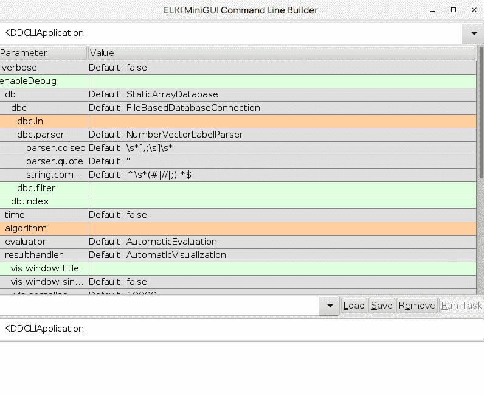

在 GUI 中，dbc.in 和算法参数会突出显示，并且需要进行设置。我们将使用`pov.csv`文件作为 dbc.in。这个 CSV 文件可以从[`github . com/elki-project/elki/blob/master/data/synthetic/ABC-publication/POV . CSV`](https://github.com/elki-project/elki/blob/master/data/synthetic/ABC-publication/pov.csv)下载。

对于算法，选择 outlier.clustering.EMOutlier，在 em.k 中，传递`3`作为值。以下屏幕截图显示了所有已填写的选项:

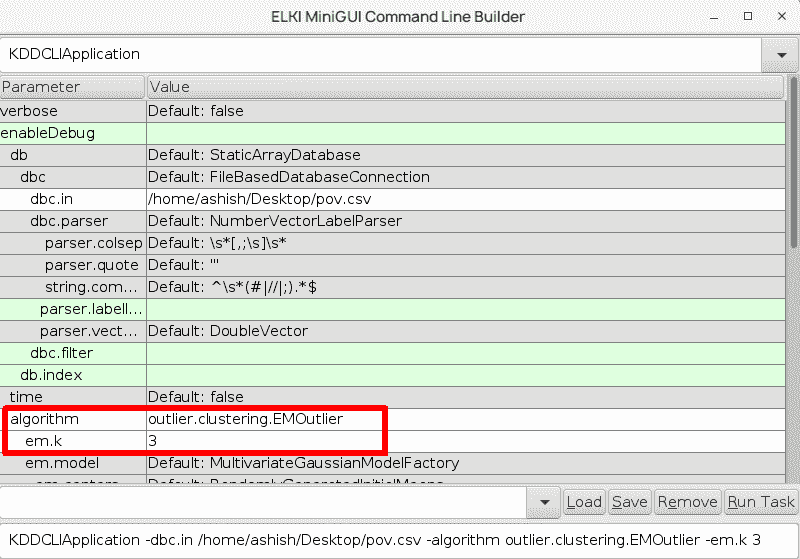

单击 Run Task 按钮，它将处理并生成以下输出:

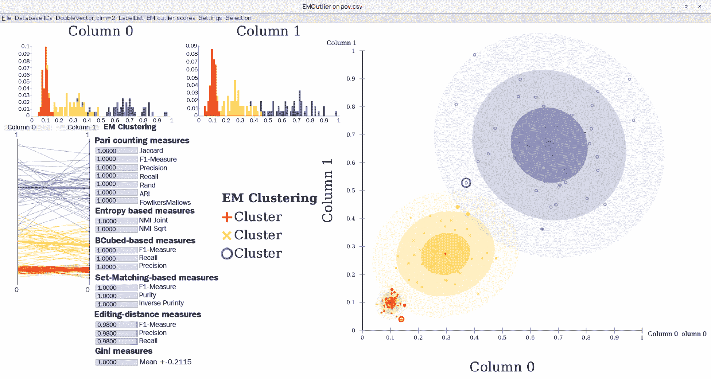

这显示了聚类和可能的异常值。


# 保险索赔中的欺诈检测

首先，我们将看看可疑行为检测，其目标是了解欺诈模式，这对应于对已知知识进行建模。


# 资料组

我们将使用描述保险交易的数据集，该数据集在 Oracle 数据库在线文档中公开提供，网址为[`docs . Oracle . com/CD/b 28359 _ 01/data mine . 111/b 28129/anomalies . htm`](http://docs.oracle.com/cd/B28359_01/datamine.111/b28129/anomalies.htm)。

该数据集描述了一家未披露的保险公司对车辆事故的保险索赔。它包含 15，430 项索赔；每个索赔由 33 个属性组成，描述了以下组件:

*   客户人口统计信息(年龄、性别、婚姻状况等)
*   购买的保单(保单类型、车辆类别、补充数量、代理类型等)
*   索赔情况(索赔日/月/周、提交的保单报告、证人在场、事故-保单报告、事故索赔之间的过去天数等)
*   其他客户数据(汽车数量、以前的索赔、驾驶评级等)
*   发现欺诈(是或否)

以下屏幕截图中显示的数据库示例描述了已经加载到 Weka 中的数据:

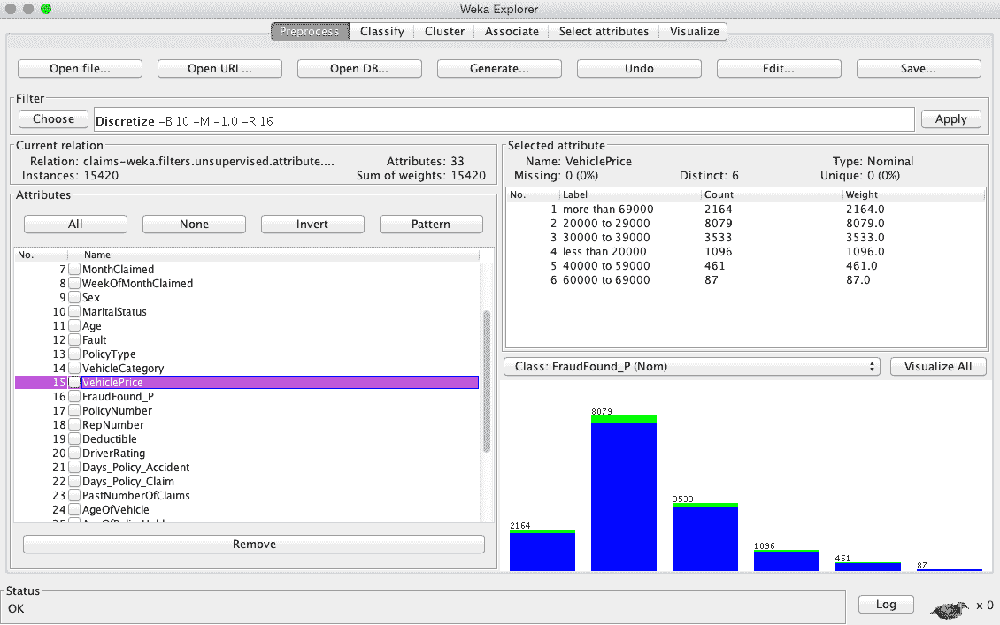

现在的任务是创建一个模型，将来能够识别可疑的索赔。这项任务的挑战性在于，只有 6%的声明是可疑的。如果我们创建一个虚拟分类器，说没有索赔是可疑的，它将在 94%的情况下是准确的。因此，在这个任务中，我们将使用不同的准确性度量:精确度和召回率。

让我们回忆一下第一章、*应用机器学习快速入门*中的结果表，其中有四种可能的结果，分别表示为真阳性、假阳性、假阴性和真阴性:

|  |  | **归类为** |
| **实际** |  | **诈骗** | **没有欺诈** |
| **诈骗** | TP -真阳性 | FN -假阴性 |
| **没有欺诈** | FP -假阳性 | TN -真阴性 |

精确度和召回率定义如下:

*   **精度**等于正确发出警报的比例，如下:

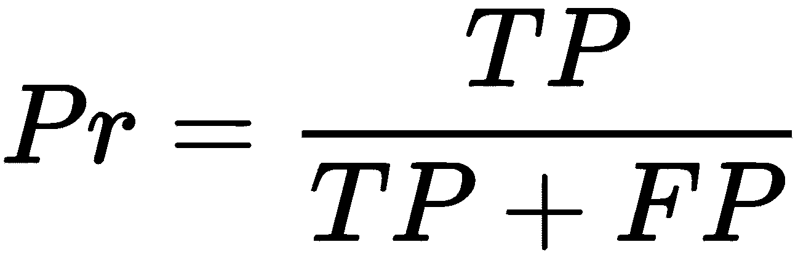

*   **召回**等于异常签名的比例，正确识别如下:

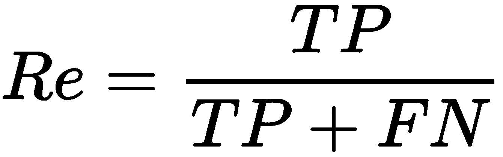

*   通过这些衡量标准——我们的虚拟分类器得分——我们发现 *Pr = 0* 和 *Re = 0* ，因为它从未将任何实例标记为欺诈( *TP = 0* )。在实践中，我们希望通过两个数字来比较分类器；因此，我们使用 *F 值*。这是一个事实上的度量，它计算精度和召回率之间的调和平均值，如下所示:

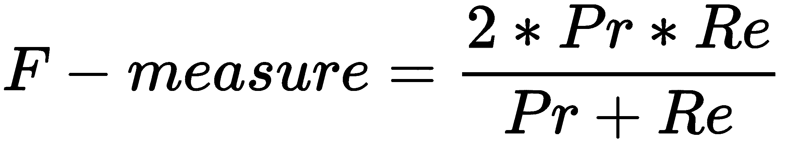

现在，让我们继续设计一个真正的分类器。


# 模拟可疑模式

要设计一个分类器，我们可以遵循标准的监督学习步骤，如第一章、*应用机器学习快速入门*中所述。在这个方法中，我们将包括一些额外的步骤来处理不平衡的数据集，并基于精度和召回率评估分类器。计划如下:

1.  加载`.csv`格式的数据。
2.  分配类属性。
3.  将所有属性从数值转换为标称值，以确保没有错误加载的数值。
4.  **实验一**:用 k 重交叉验证评估模型。
5.  **实验二**:将数据集重新平衡到更均衡的类分布，手动进行交叉验证。
6.  通过召回率、精确度和 f-measure 比较分类器。

首先，让我们使用`CSVLoader`类加载数据，如下所示:

```java
String filePath = "/Users/bostjan/Dropbox/ML Java Book/book/datasets/chap07/claims.csv"; 

CSVLoader loader = new CSVLoader(); 
loader.setFieldSeparator(","); 
loader.setSource(new File(filePath)); 
Instances data = loader.getDataSet(); 
```

接下来，我们需要确保所有的属性都是名义上的。在数据导入过程中，Weka 应用一些试探法来猜测最可能的属性类型，即数字、名义、字符串或日期。由于试探法不能总是猜测正确的类型，我们可以手动设置类型，如下所示:

```java
NumericToNominal toNominal = new NumericToNominal(); 
toNominal.setInputFormat(data); 
data = Filter.useFilter(data, toNominal); 
```

在我们继续之前，我们需要指定我们将尝试预测的属性。我们可以通过调用`setClassIndex(int)`函数来实现这一点:

```java
int CLASS_INDEX = 15; 
data.setClassIndex(CLASS_INDEX); 
```

接下来，我们需要删除描述策略编号的属性，因为它没有预测价值。我们简单地应用`Remove`过滤器，如下所示:

```java
Remove remove = new Remove(); 
remove.setInputFormat(data); 
remove.setOptions(new String[]{"-R", ""+POLICY_INDEX}); 
data = Filter.useFilter(data, remove); 
```

现在，我们准备开始建模。


# 普通的方法

普通的方法是直接应用经验教训，就像在第三章、*中演示的那样——基本算法——分类、回归、聚类*，没有任何预处理，也没有考虑数据集细节。为了演示普通方法的缺点，我们将简单地用默认参数构建一个模型，并应用 k-fold 交叉验证。

首先，让我们定义一些我们想要测试的分类器，如下所示:

```java
ArrayList<Classifier>models = new ArrayList<Classifier>(); 
models.add(new J48()); 
models.add(new RandomForest()); 
models.add(new NaiveBayes()); 
models.add(new AdaBoostM1()); 
models.add(new Logistic()); 
```

接下来，我们需要创建一个`Evaluation`对象，并通过调用`crossValidate(Classifier, Instances, int, Random, String[])`方法执行 k 重交叉验证，提供`precision`、`recall`和`fMeasure`作为输出:

```java
int FOLDS = 3; 
Evaluation eval = new Evaluation(data); 

for(Classifier model : models){ 
  eval.crossValidateModel(model, data, FOLDS,  
  new Random(1), new String[] {}); 
  System.out.println(model.getClass().getName() + "\n"+ 
    "\tRecall:    "+eval.recall(FRAUD) + "\n"+ 
    "\tPrecision: "+eval.precision(FRAUD) + "\n"+ 
    "\tF-measure: "+eval.fMeasure(FRAUD)); 
} 
```

评估提供以下分数作为输出:

```java
    weka.classifiers.trees.J48
      Recall:    0.03358613217768147
      Precision: 0.9117647058823529
      F-measure: 0.06478578892371996
    ...
    weka.classifiers.functions.Logistic
      Recall:    0.037486457204767065
      Precision: 0.2521865889212828
      F-measure: 0.06527070364082249

```

我们可以看到结果不太乐观。召回率，即发现的欺诈在所有欺诈中所占的份额，仅为 1-3%，这意味着只有 1-3/100 的欺诈被检测到。另一方面，精确度，即警报的准确性，是 91%，这意味着在 9/10 的情况下，当一个索赔被标记为欺诈时，该模型是正确的。


# 数据集重新平衡

因为与正面例子相比，反面例子(即欺诈的实例)的数量非常少，所以学习算法难以进行归纳。我们可以通过给他们一个数据集来帮助他们，在这个数据集里，正面和负面例子的比例是可以比较的。这可以通过数据集重新平衡来实现。

Weka 有一个内置的过滤器`Resample`，它使用替换或不替换的采样来产生数据集的随机子样本。过滤器还可以使分布偏向统一的类别分布。

我们将通过手动实现 k 倍交叉验证来继续。首先，我们将把数据集分成 *k* 等份。折叠 *k* 将用于测试，而其他折叠将用于学习。为了将数据集分割成折叠，我们将使用`StratifiedRemoveFolds`过滤器，该过滤器保持折叠内的类分布，如下所示:

```java
StratifiedRemoveFolds kFold = new StratifiedRemoveFolds(); 
kFold.setInputFormat(data); 

double measures[][] = new double[models.size()][3]; 

for(int k = 1; k <= FOLDS; k++){ 

  // Split data to test and train folds 
  kFold.setOptions(new String[]{ 
    "-N", ""+FOLDS, "-F", ""+k, "-S", "1"}); 
  Instances test = Filter.useFilter(data, kFold); 

  kFold.setOptions(new String[]{ 
    "-N", ""+FOLDS, "-F", ""+k, "-S", "1", "-V"}); 
    // select inverse "-V" 
  Instances train = Filter.useFilter(data, kFold); 
```

接下来，我们可以重新平衡训练数据集，其中`-Z`参数指定要重新采样的数据集的百分比，而`-B`使类分布偏向均匀分布:

```java
Resample resample = new Resample(); 
resample.setInputFormat(data); 
resample.setOptions(new String[]{"-Z", "100", "-B", "1"}); //with 
   replacement 
Instances balancedTrain = Filter.useFilter(train, resample); 
```

接下来，我们可以构建分类器并执行评估:

```java
for(ListIterator<Classifier>it = models.listIterator(); 
   it.hasNext();){ 
  Classifier model = it.next(); 
  model.buildClassifier(balancedTrain); 
  eval = new Evaluation(balancedTrain); 
  eval.evaluateModel(model, test); 

// save results for average 
  measures[it.previousIndex()][0] += eval.recall(FRAUD); 
  measures[it.previousIndex()][1] += eval.precision(FRAUD); 
 measures[it.previousIndex()][2] += eval.fMeasure(FRAUD); 
} 
```

最后，我们计算平均值，并使用以下代码行提供最佳模型作为输出:

```java
// calculate average 
for(int i = 0; i < models.size(); i++){ 
  measures[i][0] /= 1.0 * FOLDS; 
  measures[i][1] /= 1.0 * FOLDS; 
  measures[i][2] /= 1.0 * FOLDS; 
} 

// output results and select best model 
Classifier bestModel = null; double bestScore = -1; 
for(ListIterator<Classifier> it = models.listIterator(); 
   it.hasNext();){ 
  Classifier model = it.next(); 
  double fMeasure = measures[it.previousIndex()][2]; 
  System.out.println( 
    model.getClass().getName() + "\n"+ 
    "\tRecall:    "+measures[it.previousIndex()][0] + "\n"+ 
    "\tPrecision: "+measures[it.previousIndex()][1] + "\n"+ 
    "\tF-measure: "+fMeasure); 
  if(fMeasure > bestScore){ 
    bestScore = fMeasure; 
    bestModel = model; 

  } 
} 
System.out.println("Best model:"+bestModel.getClass().getName()); 
```

现在，模型的性能有了显著提高，如下所示:

```java
    weka.classifiers.trees.J48
      Recall:    0.44204845100610574
      Precision: 0.14570766048577555
      F-measure: 0.21912423640160392
    ...
    weka.classifiers.functions.Logistic
      Recall:    0.7670657247204478
      Precision: 0.13507459756495374
      F-measure: 0.22969038530557626
    Best model: weka.classifiers.functions.Logistic

```

我们可以看到所有的模型都得到了显著的提高；例如，最好的模型，逻辑回归，正确地发现了 76%的欺诈，同时产生了合理数量的假警报——只有 13%被标记为欺诈的索赔确实是欺诈的。如果未被发现的欺诈比调查假警报的成本高得多，那么处理越来越多的假警报是有意义的。

整体性能很可能仍有一些改进的空间；我们可以执行属性选择和特征生成，并应用更复杂的模型学习，我们在第三章、*中讨论了基本算法——分类、回归、聚类*。


# 网站流量中的异常检测

在第二个例子中，我们将重点关注与前一个例子相反的建模。我们将讨论系统的正常预期行为，而不是讨论什么是典型的无欺诈案例。如果某些东西不能与我们预期的模型相匹配，它将被认为是异常的。


# 资料组

我们将使用雅虎发布的公开数据集。实验室，这对于讨论如何检测时间序列数据中的异常非常有用。对雅虎来说，主要的用例是检测雅虎服务器上不寻常的流量。

即使雅虎已经宣布他们的数据是公开的，你必须申请使用它，并且在批准之前需要大约 24 小时。数据集在[`webscope.sandbox.yahoo.com/catalog.php?datatype=s&did = 70`](http://webscope.sandbox.yahoo.com/catalog.php?datatype=s&did=70)可用。

该数据集由雅虎服务的真实流量和一些合成数据组成。该数据集总共包含 367 个时间序列，每个时间序列包含 741 至 1，680 个观测值，这些观测值是定期记录的。每个系列都写在自己的文件中，每行一个观察值。一个系列伴随着第二个列指示器，如果观察值是异常值，则使用 1，否则使用 0。真实数据中的异常是由人的判断确定的，而合成数据中的异常是通过算法生成的。下表显示了合成时间序列数据的一个片段:

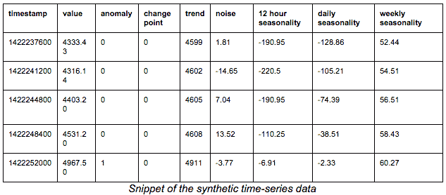

在下一节中，您将了解如何将时间序列数据转换为属性表示，以便我们应用机器学习算法。


# 时间序列数据中的异常检测

检测原始流时间序列数据中的异常需要一些数据转换。最明显的方法是选择一个时间窗口，以固定长度对时间序列进行采样。下一步，我们希望将新的时间序列与之前收集的时间序列进行比较，以检测是否有异常。

可以使用各种技术进行比较，如下所示:

*   预测最可能的后续值以及置信区间(例如，霍尔特-温特斯指数平滑)。如果一个新值超出了预测的置信区间，则被认为是异常的。
*   互相关将新样本与阳性样本库进行比较，寻找完全匹配的样本。如果没有找到匹配，则标记为异常。
*   动态时间缠绕类似于互相关，但相比之下允许信号失真。
*   将信号离散化为带，每个带对应一个字母。例如，`A=[min, mean/3]`、`B=[mean/3, mean*2/3]`和`C=[mean*2/3, max]`将信号转换为字母序列，例如`aAABAACAABBA....`这种方法减少了存储空间，并允许我们应用文本挖掘算法，我们将在第十章、*使用 Mallet 进行文本挖掘-主题建模和垃圾邮件检测*中讨论这些算法。
*   基于分布的方法估计特定时间窗口中值的分布。当我们观察一个新的样本时，我们可以比较这个分布是否与之前观察到的分布相匹配。

这份清单绝非详尽无遗。不同的方法侧重于检测不同的异常(例如，值、频率和分布)。在这一章中，我们将集中讨论一种基于分布的方法。


# 对时间序列使用 Encog

我们必须从 https://solarscience.msfc.nasa.gov/greenwch/spot_num.txt[的](https://solarscience.msfc.nasa.gov/greenwch/spot_num.txt)下载时间序列数据，并将文件保存在`data`文件夹中。在`.java`文件中，我们将指定文件路径，然后我们将使用以下代码块指示文件的格式:

```java
File filename = new File("data/spot_num.txt");
CSVFormat format = new CSVFormat('.', ' ');
VersatileDataSource source = new CSVDataSource(filename, true, format);
VersatileMLDataSet data = new VersatileMLDataSet(source);
data.getNormHelper().setFormat(format);
ColumnDefinition columnSSN = data.defineSourceColumn("SSN", ColumnType.continuous);
ColumnDefinition columnDEV = data.defineSourceColumn("DEV", ColumnType.continuous);
data.analyze();
data.defineInput(columnSSN);
data.defineInput(columnDEV);
data.defineOutput(columnSSN);
```

现在，我们将创建窗口大小为`1`的前馈网络。当处理一个时间序列时，你应该记住它不应该被打乱。我们将保留一些数据进行验证。我们将使用下面几行代码来实现这一点:

```java
EncogModel model = new EncogModel(data);
model.selectMethod(data, MLMethodFactory.TYPE_FEEDFORWARD);

model.setReport(new ConsoleStatusReportable());
data.normalize();

// Set time series.
data.setLeadWindowSize(1);
data.setLagWindowSize(WINDOW_SIZE);
model.holdBackValidation(0.3, false, 1001);
model.selectTrainingType(data);
```

下一步是使用以下代码行运行带有五重交叉验证的培训:

```java
MLRegression bestMethod = (MLRegression) model.crossvalidate(5, false);
```

现在，是时候显示错误和最终模型了。我们将通过使用以下代码行来实现这一点:

```java
System.out.println("Training error: " + model.calculateError(bestMethod, model.getTrainingDataset()));
System.out.println("Validation error: " + model.calculateError(bestMethod, model.getValidationDataset()));

NormalizationHelper helper = data.getNormHelper();
System.out.println(helper.toString());

// Display the final model.
System.out.println("Final model: " + bestMethod);
```

输出将类似于下面的屏幕截图:

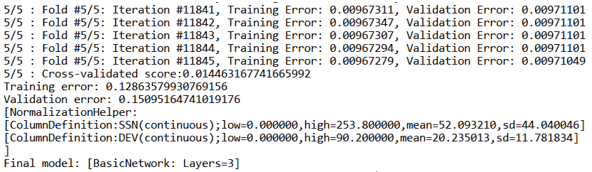

现在，我们将使用以下代码块测试该模型:

```java
while (csv.next() && stopAfter > 0) {
                StringBuilder result = new StringBuilder();

                line[0] = csv.get(2);// ssn
                line[1] = csv.get(3);// dev
                helper.normalizeInputVector(line, slice, false);

                if (window.isReady()) {
                    window.copyWindow(input.getData(), 0);
                    String correct = csv.get(2); // trying to predict SSN.
                    MLData output = bestMethod.compute(input);
                    String predicted = helper
                            .denormalizeOutputVectorToString(output)[0];

                    result.append(Arrays.toString(line));
                    result.append(" -> predicted: ");
                    result.append(predicted);
                    result.append("(correct: ");
                    result.append(correct);
                    result.append(")");

                    System.out.println(result.toString());
                }

                window.add(slice);

                stopAfter--;
            }
```

输出将类似于下面的屏幕截图:

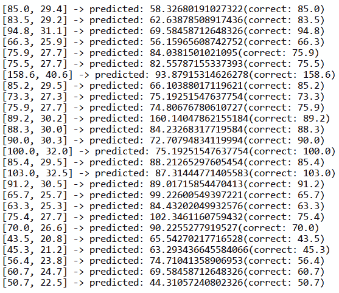


# 基于直方图的异常检测

在基于直方图的异常检测中，我们通过选定的时间窗口分割信号，如下图所示。

对于每个窗口，我们计算直方图；也就是说，对于选定数量的桶，我们计算每个桶中有多少个值。直方图捕获了所选时间窗口中值的基本分布，如图表中心所示。

然后直方图可以直接呈现为实例，其中每个柱对应于一个属性。此外，我们可以通过应用降维技术来减少属性的数量，例如**主成分分析** ( **PCA** )，它允许我们在图中可视化降维直方图，如图表的右下角所示，其中每个点对应一个直方图。

在我们的例子中，想法是观察几天的网站流量，然后创建直方图；例如，四个小时的时间窗，来建立一个积极行为库。如果新的时间窗口直方图不能与阳性库匹配，我们可以将其标记为异常:

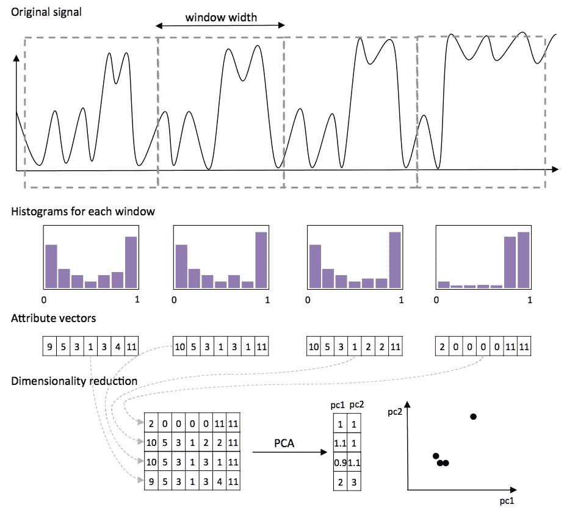

为了将新直方图与一组现有直方图进行比较，我们将使用基于密度的 k-最近邻算法，**局部异常因子** ( **LOF** ) (Breunig 等人，2000)。该算法能够处理不同密度的分类，如下图所示。例如，右上侧的集群较大且分布广泛，而左下侧的集群较小且密度较大:

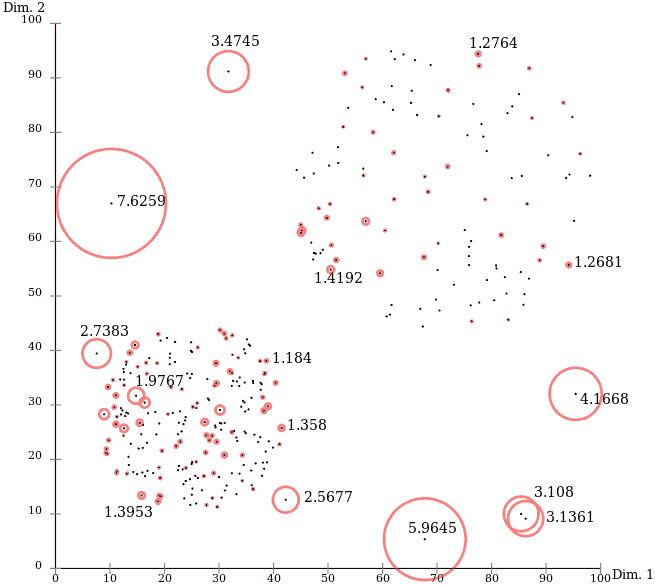

我们开始吧！


# 加载数据

第一步，我们需要将文本文件中的数据加载到一个 Java 对象中。这些文件存储在一个文件夹中，每个文件包含一个时间序列，每行有一个值。我们将它们加载到一个`Double`列表中，如下所示:

```java
String filePath = "chap07/ydata/A1Benchmark/real"; 
List<List<Double>> rawData = new ArrayList<List<Double>>(); 
```

我们将需要`min`和`max`值来进行直方图归一化；所以，让我们在这个数据通道中收集它们:

```java
double max = Double.MIN_VALUE; 
double min = Double.MAX_VALUE; 

for(int i = 1; i<= 67; i++){ 
  List<Double> sample = new ArrayList<Double>(); 
  BufferedReader reader = new BufferedReader(new 
     FileReader(filePath+i+".csv")); 

  boolean isAnomaly = false; 
  reader.readLine(); 
  while(reader.ready()){ 
    String line[] = reader.readLine().split(","); 
    double value = Double.parseDouble(line[1]); 
    sample.add(value); 

    max = Math.max(max, value); 
    min = Double.min(min, value); 

    if(line[2] == "1") 
      isAnomaly = true; 

  } 
  System.out.println(isAnomaly); 
  reader.close(); 

  rawData.add(sample); 
} 
```

数据已经加载。接下来，让我们继续讨论直方图。


# 创建直方图

我们将用`WIN_SIZE`宽度为选定的时间窗口创建一个直方图。

直方图将保存`HIST_BINS`值桶。由双精度列表组成的直方图将存储在数组列表中:

```java
int WIN_SIZE = 500; 
int HIST_BINS = 20; 
int current = 0; 

List<double[]> dataHist = new ArrayList<double[]>(); 
for(List<Double> sample : rawData){ 
  double[] histogram = new double[HIST_BINS]; 
  for(double value : sample){ 
    int bin = toBin(normalize(value, min, max), HIST_BINS); 
    histogram[bin]++; 
    current++; 
    if(current == WIN_SIZE){ 
      current = 0; 
      dataHist.add(histogram); 
      histogram = new double[HIST_BINS]; 
    } 
  } 
  dataHist.add(histogram); 
} 
```

直方图现已完成。最后一步是将它们转换成 Weka 的`Instance`对象。每个直方图值对应一个 Weka 属性，如下所示:

```java
ArrayList<Attribute> attributes = new ArrayList<Attribute>(); 
for(int i = 0; i<HIST_BINS; i++){ 
  attributes.add(new Attribute("Hist-"+i)); 
} 
Instances dataset = new Instances("My dataset", attributes, 
   dataHist.size()); 
for(double[] histogram: dataHist){ 
  dataset.add(new Instance(1.0, histogram)); 
} 
```

数据集现在已经加载完毕，可以插入异常检测算法了。


# 基于密度的 k 近邻

为了演示 LOF 如何计算分数，我们将首先使用`testCV(int, int)`函数将数据集分成训练集和测试集。第一个参数指定折叠的次数，而第二个参数指定要返回哪个折叠:

```java
// split data to train and test 
Instances trainData = dataset.testCV(2, 0); 
Instances testData = dataset.testCV(2, 1); 
```

LOF 算法不是默认 Weka 发行版的一部分，但可以通过 Weka 的包管理器下载，网址是[`Weka . SourceForge . net/package metadata/localooutlierfactor/index . html`](http://weka.sourceforge.net/packageMetaData/localOutlierFactor/index.html)。

LOF 算法有两个实现的接口:作为计算 LOF 值(已知未知)的非监督过滤器，以及作为监督的 k-最近邻分类器(已知已知)。在我们的例子中，我们想要计算异常因子，因此，我们将使用无监督过滤器接口:

```java
import weka.filters.unsupervised.attribute.LOF; 
```

该过滤器的初始化方式与普通过滤器相同。我们可以用`-min`和`-max`参数指定`k`个邻居(例如`k=3`)。`LOF`允许我们指定两个不同的`k`参数，在内部用作上限和下限，以找到最小或最大数量的`lof`值:

```java
LOF lof = new LOF(); 
lof.setInputFormat(trainData); 
lof.setOptions(new String[]{"-min", "3", "-max", "3"}); 
```

接下来，我们将训练实例加载到过滤器中，该过滤器将充当正面示例库。完成加载后，我们将调用`batchFinished()`方法来初始化内部计算:

```java
for(Instance inst : trainData){ 
  lof.input(inst); 
} 
lof.batchFinished(); 
```

最后，我们可以将过滤器应用于测试数据。`Filter()`函数将处理实例并在末尾附加一个附加属性，包含 LOF 分数。我们可以简单地在控制台中提供分数作为输出:

```java
Instances testDataLofScore = Filter.useFilter(testData, lof); 

for(Instance inst : testDataLofScore){ 
  System.out.println(inst.value(inst.numAttributes()-1)); 
} 
```

前几个测试实例的 LOF 分数如下:

```java
    1.306740014927325
    1.318239332210458
    1.0294812291949587
    1.1715039094530768

```

为了理解`LOF`值，我们需要一些 LOF 算法的背景知识。它将一个实例的密度与其最近邻居的密度进行比较。这两个分数相除，产生 LOF 分数。LOF 值约为 1 表示密度大致相等，而较高的 LOF 值表示实例的密度远低于其相邻实例的密度。在这种情况下，实例可以被标记为异常。


# 摘要

在这一章中，我们研究了异常和可疑模式的检测。我们讨论了两种基本的方法，集中在库编码上，无论是积极的还是消极的模式。接下来，我们接触了两个真实的数据集，并讨论了如何处理不平衡的类分布以及如何对时间序列数据执行异常检测。

在下一章中，我们将更深入地研究模式和更高级的方法来构建基于模式的分类器，并讨论如何使用深度学习自动为图像分配标签。