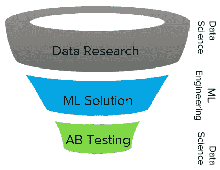
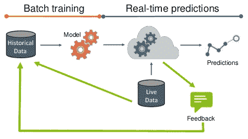
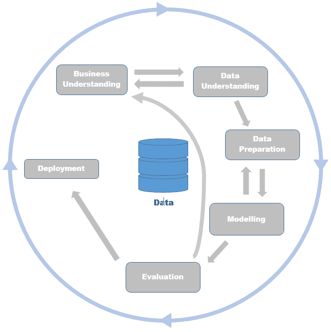
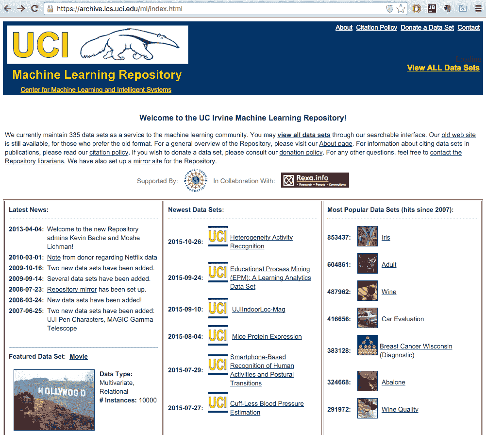

# 十一、下一步是什么？

本章结束了我们回顾 Java 库中机器学习的旅程，并讨论了如何利用它们来解决现实生活中的问题。然而，这绝不应该是你旅程的终点。这一章会给你一些实用的建议，告诉你如何在现实世界中开始部署你的模型，有哪些陷阱，以及到哪里去加深你的知识。它还为您提供了进一步的指导，告诉您在哪里可以找到更多的资源、材料、场所和技术来更深入地研究机器学习。

本章将涵盖以下主题:

*   现实生活中机器学习的重要方面
*   标准和标记语言
*   云中的机器学习
*   网络资源和竞赛

# 现实生活中的机器学习

论文、会议报告和讲座通常不会讨论模型在生产环境中是如何实际部署和维护的。在这一节中，我们将探讨一些应该考虑的方面。

# 噪声数据

在实践中，由于各种原因，例如测量误差、人为错误以及在对训练样本进行分类时专家判断的误差，数据通常包含误差和缺陷。我们将所有这些称为**噪声**。当具有未知属性值的示例被一组对应于缺失值的概率分布的加权示例替换时，噪声也可能来自缺失值的处理。学习数据中的噪声的典型后果是新数据中的学习模型的低预测精度以及用户难以解释和理解的复杂模型。

# 阶级不平衡

类别不平衡是我们在第 7 章、*欺诈和异常检测*中遇到的一个问题，我们的目标是检测欺诈性保险索赔。面临的挑战是，数据集的很大一部分(通常超过 90%)描述了正常活动，只有一小部分数据集包含欺诈示例。在这种情况下，如果模型总是预测正常，那么它在 90%的情况下是正确的。这个问题在实践中非常普遍，并且可以在各种应用中观察到，包括欺诈检测、异常检测、医疗诊断、漏油检测和面部识别。

现在，知道了什么是阶级失衡问题，为什么它是一个问题，我们来看看如何处理这个问题。第一种方法是关注分类准确度之外的度量，比如召回率、精确度和 f-measure。这样的衡量标准集中在一个模型在预测少数类(**回忆**)时有多准确，以及虚警的比例是多少(**精度**)。另一种方法是基于重采样，其主要思想是以这样一种方式减少过度表示的例子的数量，即新的集合包含两类的平衡比率。

# 特征选择

**特征选择**可以说是建模中最具挑战性的部分，需要领域知识和对手头问题的深刻见解。然而，良好特性的属性如下:

*   可重用性:特性应该可以在不同的模型、应用程序和团队中重用。
*   **可转换性**:你应该能够通过一个操作转换一个特征，例如`log()`、`max()`，或者通过一个自定义计算将多个特征组合在一起。
*   可靠性:特性应该易于监控，并且应该有适当的单元测试来最小化错误或问题。
*   **可解释性**:要执行前面的任何操作，您需要能够理解特性的含义并解释它们的值。

捕捉特征的能力越强，结果就越准确。

# 模型链接

某些模型可能会产生输出，用作另一个模型中的特征。此外，我们可以使用多个模型——集合——将任何模型转化为一个特征。这是一个获得更好结果的好方法，但是这也会导致问题。必须注意模型的输出已经准备好接受依赖关系。此外，尽量避免反馈循环，因为它们会在管道中产生依赖性和瓶颈。

# 评估的重要性

另一个重要的方面是模型评估。除非你将你的模型应用于新数据，并衡量一个业务目标，否则你就不是在做预测分析。评估技术，如交叉验证和分离的训练/测试集，只是简单地分割您的测试数据，这只能为您提供模型将如何执行的估计。生活中通常不会给你一个定义了所有案例的训练数据集，所以在现实世界的数据集中定义这两个数据集需要很大的创造性。

在一天结束时，我们希望提高一个业务目标，例如提高广告转化率，并在推荐的项目上获得更多的点击。为了测量改进，执行 A/B 测试，测量统计上相同的群体中的度量差异，每个群体都经历不同的算法。关于产品的决策总是由数据驱动的。

A/B 检验是一种有两个变量的随机实验的方法:A，对应原始版本，控制实验；B 对应于一个变量。该方法可用于确定变体是否优于原始版本。它可以用来测试从网站变更到销售电子邮件到搜索广告的一切。Udacity 提供免费课程，涵盖在[https://www.udacity.com/course/ab-testing-ud 257](https://www.udacity.com/course/ab-testing--ud257)的 A/B 测试的设计和分析。

# 将模型投入生产

从在实验室构建准确的模型到将其部署到产品中的过程涉及数据科学和工程的协作，如以下三个步骤所示:

1.  **数据研究和假设构建**包括问题建模和执行初始评估。
2.  **解决方案构建和实现**是您的模型通过将其重写为更高效、稳定和可伸缩的代码而进入产品流程的地方。
3.  **在线评估**是对业务目标进行 A/B 测试，利用实时数据评估模型的最后阶段。

下图更好地说明了这一点:

# 模型维护

我们需要解决的另一个方面是如何维护模型。这是一种不会随时间而改变的模式吗？建模一个动态现象需要模型随时间调整它的预测吗？

该模型通常是在离线批处理定型中构建的，然后用于实时数据以提供预测，如下图所示。如果我们能够收到关于模型预测的反馈，例如，股票是否如模型预测的那样上涨，以及候选人是否对竞选活动做出了回应，那么反馈应该用于改进初始模型:

反馈对于改进初始模型非常有用，但是一定要注意你正在采样的数据。例如，如果您有一个模型来预测谁会对某个活动做出响应，那么您最初将使用一组随机联系的客户端，这些客户端具有特定的响应/未响应分布和特征属性。该模型将只关注最有可能做出回应的客户子集，您的反馈将为您返回做出回应的客户子集。通过包含这些数据，该模型在特定的子群中更加准确，但是可能会完全遗漏一些其他的群。我们称这个问题为探索与剥削。Osugi 等人(2005 年)和 Bondu 等人(2010 年)提出了解决这个问题的一些方法。

# 标准和标记语言

随着预测模型变得越来越普遍，共享模型和完成建模过程的需要导致开发过程和可互换格式的形式化。在这一节中，我们将回顾两个事实上的标准，一个涵盖数据科学过程，另一个指定应用程序之间共享模型的可互换格式。

# CRISP-DM

**跨行业数据挖掘标准流程** ( **CRISP-DM** )描述了数据科学家在行业中常用的数据挖掘流程。CRISP-DM 将数据挖掘科学过程分为六个主要阶段:

*   **业务理解**
*   **数据理解**
*   **数据准备**
*   **建模**
*   **评估**
*   **部署**

在下图中，箭头表示流程流，它可以在各个阶段之间来回移动。此外，这个过程不会随着模型部署而停止。外部箭头表示数据科学的循环性质。在此过程中吸取的经验教训可以引发新的问题，并在改进之前结果的同时重复此过程:

# SEMMA 方法论

另一种方法是**采样、探索、修改、建模和评估** ( **塞马**)。SEMMA 描述了数据科学中的主要建模任务，同时撇开了数据理解和部署等业务方面。SEMMA 由 SAS Institute 开发，SAS Institute 是最大的统计软件供应商之一，旨在帮助其软件用户执行数据挖掘的核心任务。

# 预测模型标记语言

**预测** **模型标记语言** ( **PMML** )是一种基于 XML 的交换格式，允许机器学习模型在应用程序和系统之间轻松共享。支持的模型包括逻辑回归、神经网络、决策树、朴素贝叶斯、回归模型和许多其他模型。典型的 PMML 文件由以下部分组成:

*   包含一般信息的标题
*   数据字典，描述数据类型
*   数据转换，指定规范化、离散化、聚合或自定义函数的步骤
*   模型定义，包括参数
*   列出模型使用的属性的挖掘架构
*   允许对预测结果进行后处理的目标
*   输出列出要输出的字段和其他后处理步骤

生成的 PMML 文件可以导入任何使用 PMML 的应用程序，如 Zementis **adaptive decision 和****predictive analytics**(**ADAPA**)和 **universal PMML 插件** ( **UPPI** )评分引擎；Weka，内置支持回归、一般回归、神经网络、TreeModel、RuleSetModel、**支持向量机** ( **SVM** )模型；Spark，可以导出 k-means 聚类、线性回归、岭回归、lasso 模型、二元 logistic 模型、SVM；和级联，可以将 PMML 文件转换成 Apache Hadoop 上的应用程序。

下一代 PMML 是一种被称为**可移植分析格式** ( **PFA** )的新兴格式，它提供了一个通用界面来跨环境部署完整的工作流。

# 云中的机器学习

建立一个能够随着数据量的增加而扩展的完整的机器学习堆栈可能是一个挑战。最近的一波**软件即服务(SaaS)** 和**基础设施即服务** ( **IaaS** )范式也蔓延到了机器学习领域。如今的趋势是将实际的数据预处理、建模和预测转移到云环境中，只关注建模任务。

在本节中，我们将回顾一些有前途的服务，这些服务提供算法、已经在特定领域中训练的预测模型，以及支持数据科学团队中的协作工作流的环境。

# 机器学习即服务

第一类是算法即服务，为您提供 API 甚至图形用户界面，将数据科学管道的预编程组件连接在一起:

*   谷歌预测 API(Google Prediction API):它是首批通过其 web API 推出预测服务的公司之一。该服务与作为数据存储的谷歌云存储集成在一起。用户可以建立一个模型并调用 API 来获得预测。
*   BigML :它实现了一个用户友好的图形界面，支持许多存储提供商(例如，亚马逊 S3)，并提供了各种各样的数据处理工具、算法和强大的可视化。
*   **微软 Azure 机器学习**:这提供了一个大型的机器学习算法和数据处理功能库，以及图形用户界面，将这些组件连接到一个应用程序。此外，它还提供了完全托管的服务，您可以使用该服务将预测模型部署为现成的 web 服务。
*   **亚马逊机器学习**:进入市场相当晚。它的主要优势是与其他亚马逊服务的无缝集成，而算法和用户界面的数量需要进一步改进。
*   IBM Watson Analytics(IBM Watson Analytics):它专注于为特定领域(如语音识别、机器翻译和异常检测)提供已经手工制作的模型。它通过解决特定的用例，面向广泛的行业。
*   **预测。IO** :它是一个自托管的开源平台，提供从数据存储到建模再到服务预测的完整堆栈。预测。IO 可以与 Apache Spark 对话，以利用其学习算法。此外，它还附带了针对特定领域的各种模型，例如推荐系统、流失预测等。

预测 API 是一个新兴的新领域，所以这些只是一些众所周知的例子；**kdnugges**在[http://www . kdnugges . com/2015/12/machine-learning-data-science-APIs . html](http://www.kdnuggets.com/2015/12/machine-learning-data-science-apis.html)整理了 50 个机器学习 API 的列表。

要了解更多信息，你可以访问 PAPI，预测 API 和应用国际会议，网址为 [http://www.papi.io](http://www.papi.io/) 或者看看这本书:*引导机器学习，* L Dorard *，Createspace 独立出版社，2014 年。*

# 网络资源和竞赛

在本节中，我们将回顾在哪里可以找到用于学习、讨论、演示或强化我们的数据科学技能的其他资源。

# 资料组

加州大学欧文分校是最著名的机器学习数据集仓库之一。UCI 存储库包含 300 多个数据集，涵盖各种挑战，包括扑克、电影、葡萄酒质量、活动识别、股票、出租车服务轨迹、广告等。每个数据集通常都配有一篇使用该数据集的研究论文，它可以提示您如何开始以及预测基线是什么。

可以在 https://archive.ics.uci.edu 的[访问 UCI 机器学习库，如下所示:](https://archive.ics.uci.edu/)

GitHub 上还有一个保存完好的陈的收藏:[T1。](https://github.com/caesar0301/awesome-public-datasets)

awesome 公共数据集存储库维护着 400 多个数据源的链接，这些数据源来自各个领域，包括农业、生物学、经济学、心理学、博物馆和交通运输。专门针对机器学习的数据集收集在图像处理、机器学习和数据挑战部分。

# 在线课程

由于在线课程的提供，学习如何成为数据科学家变得更加容易。以下是在线学习不同技能的免费资源列表:

*   **Udemy—** **从零开始学习** **Java 编程**在[https://www.udemy.com/learn-java-programming-from-scratch](https://www.udemy.com/learn-java-programming-from-scratch)。
*   **Udemy—****https://www.udemy.com/java-tutorial[的](https://www.udemy.com/java-tutorial)**完全初学者 Java 教程。
*   **LearnJAvaOnline—** **互动 Java 教程**在【http://www.learnjavaonline.org】的。

了解机器学习更多信息的一些在线课程如下:

*   Coursera 机器学习(斯坦福)，作者吴恩达:这本书教你许多机器学习算法背后的数学，解释它们如何工作，并探索它们为什么在 https://www.coursera.org/learn/machine-learning[有意义](https://www.coursera.org/learn/machine-learning)。
*   Joe Biltzstein 统计 110(哈佛):这门课程让你发现在你的数据科学之旅中你会多次听到的相关术语的概率。讲座可以在 http://projects.iq.harvard.edu/stat110/youtube[的 YouTube 上找到。](http://projects.iq.harvard.edu/stat110/youtube)
*   John A. Paulson 的数据科学 CS109(哈佛):这是一门实践课程，在这里你将学习用于数据科学的 Python 库，以及如何在 http://cs109.github.io/2015/[处理机器学习算法](http://cs109.github.io/2015/)。

# 竞争

提高知识的最佳方式是解决实际问题，如果你想建立一个经过验证的项目组合，机器学习竞赛是一个可行的起点:

*   这是排名第一的竞赛平台，举办各种各样的挑战，有丰厚的奖品，强大的数据科学社区和大量有用的资源。你可以在 https://www.kaggle.com/的[检查一下。](https://www.kaggle.com/)
*   **CrowdANALYTIX** :这是一个众包数据分析服务，专注于 https://www.crowdanalytix.com 的[的生命科学和金融服务行业。](https://www.crowdanalytix.com/)
*   **DrivenData** :在 http://www.drivendata.org/的[举办数据科学公益竞赛。](http://www.drivendata.org/)

# 网站和博客

除了在线课程和竞赛，还有许多网站和博客发布数据科学社区的最新发展、他们解决不同问题的经验或最佳实践。一些好的起点如下:

*   **KDnuggets** :这是数据挖掘、分析、大数据和数据科学的事实上的门户，涵盖 http://www.kdnuggets.com/[的最新新闻、故事、事件和其他相关问题](http://www.kdnuggets.com/)。
*   机器学习大师(Machine Learning Mastery):这是一个初级博客，提供实用的建议和从哪里开始的指示。在 http://machinelearningmastery.com/的[看看吧。](http://machinelearningmastery.com/)
*   **数据科学中心**:这是 http://www.datasciencecentral.com/[的实用社区文章，内容涉及各种主题、算法、缓存和商业案例。](http://www.datasciencecentral.com/)
*   桑德罗·塞塔在 http://www.dataminingblog.com/进行的 **数据挖掘**研究。
*   Matthew Hurst 的《数据挖掘:文本挖掘、可视化和社交媒体》,涵盖了有趣的文本和网络挖掘主题，经常应用于 http://datamining.typepad.com/data_mining/[的必应和微软](http://datamining.typepad.com/data_mining/)。
*   **与格雷格一起极客**作者格雷格林登，亚马逊推荐引擎的发明者和互联网企业家。你可以在 http://glinden.blogspot.si/的[检查一下。](http://glinden.blogspot.si/)
*   **DSGuide** :这是 http://dsguide.biz/reader/sources 的[超过 150 个数据科学博客的集合。](http://dsguide.biz/reader/sources)

# 场地和会议

以下是几个顶级学术会议的最新算法:

*   **数据库中的知识发现** ( **KDD**
*   **计算机视觉与模式识别** ( **CVPR** )
*   **神经信息处理系统年会** ( **NIPS**
*   **机器学习国际会议** ( **ICML** )
*   **数据挖掘国际会议** ( **ICDM** )
*   **普适计算国际联合会议** ( **UbiComp** )
*   **国际人工智能联合会议** ( **IJCAI** )

一些商务会议如下:

*   奥莱利地层会议
*   Strata + Hadoop 世界大会
*   预测分析世界
*   MLconf

你也可以去当地的聚会团体看看。

# 摘要

在本章中，我们通过讨论模型部署的某些方面来结束本书，并研究了数据科学过程和可互换预测模型格式的标准。我们还回顾了在线课程、竞赛、网络资源和会议，这些都可以帮助你掌握机器学习的艺术。

我希望这本书能启发您更深入地研究数据科学，并激励您动手尝试各种库，了解如何解决不同的问题。请记住，所有的源代码和其他资源都可以在 Packt Publishing 网站上找到:[https://www.packtpub.com/](https://www.packtpub.com/)。