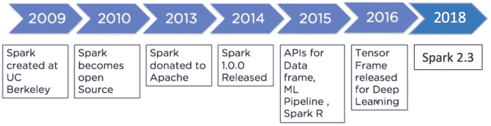
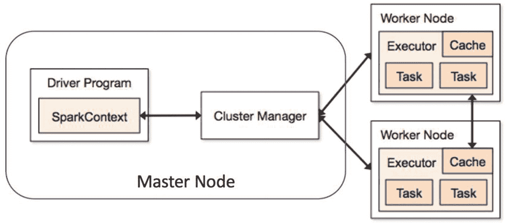
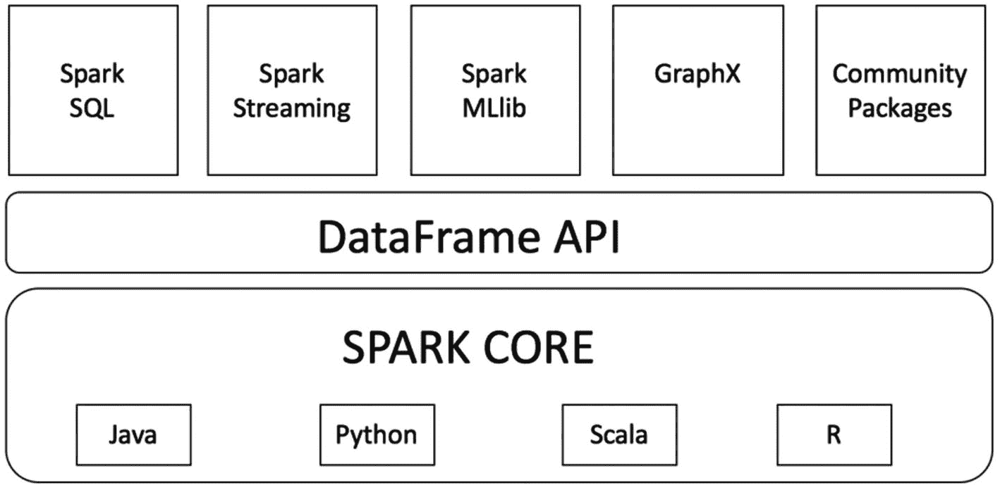

# 一、数据的演变

在理解 Spark 之前，有必要理解我们今天所目睹的这种数据洪流背后的原因。在早期，数据是由工人生成或积累的，因此只有公司的员工将数据输入系统，数据点非常有限，只能捕获几个领域。然后出现了互联网，使用互联网的每个人都可以很容易地获取信息。现在，用户有权输入和生成自己的数据。这是一个巨大的转变，因为互联网用户的数量呈指数级增长，这些用户创建的数据甚至以更高的速度增长。例如:登录/注册表单允许用户填写自己的详细信息，在各种社交平台上上传照片和视频。这导致了巨大的数据生成，并且需要一个快速且可扩展的框架来处理如此大量的数据。

## 数据生成

如图 [1-1](#Fig1) 所示，随着机器生成和累积数据，这种数据生成现已进入下一个阶段。我们周围的每一个设备都在捕捉数据，比如汽车、建筑、手机、手表、飞机引擎。它们嵌入了多个监测传感器，每秒记录数据。该数据甚至比用户生成的数据更大。


图 1-1

*数据* *进化*

早些时候，当数据仍处于企业级别时，关系数据库足以满足系统需求，但随着数据规模在过去几十年中呈指数级增长，处理大数据的结构发生了变化，这就是 Spark 的诞生。传统上，我们将数据带到处理器中进行处理，但现在数据太多，处理器不堪重负。现在，我们将多个处理器用于数据处理。这就是所谓的并行处理，因为数据是在许多地方同时处理的。

让我们看一个例子来理解并行处理。假设在一条特定的高速公路上，只有一个收费站，每辆车必须排成一排才能通过收费站，如图 [1-2](#Fig2) 所示。如果平均每辆车通过收费站需要 1 分钟，那么八辆车总共需要 8 分钟。对于 100 辆车，需要 100 分钟。


图 1-2

*单线程处理*

但是想象一下，如果不是一个收费站，而是在同一条高速公路上有八个收费站，车辆可以使用其中的任何一个通过。如图 [1-3](#Fig3) 所示，由于现在不存在依赖性，所有 8 辆车通过收费站总共只需要 1 分钟。我们已经将操作并行化。


图 1-3

*并行处理*

并行或分布式计算的工作原理类似，因为它将任务并行化，并在最后累积最终结果。Spark 是一个以高速并行处理来处理海量数据集的框架，是一个健壮的机制。

## 火花

Apache Spark 于 2009 年开始作为加州大学伯克利分校 AMPLab 的一个研究项目，并于 2010 年初开源，如图 [1-4](#Fig4) 所示。从此，再也没有回头。2016 年，Spark 发布深度学习 TensorFrames。



图 1-4

*火花* *进化*

在引擎盖下，Spark 使用了一种不同的数据结构，称为 RDD(弹性分布式数据集)。从某种意义上说，它是有弹性的，因为它们有能力在执行过程中重新创建任何时间点。因此，RDD 用最后一个创建了一个新的 RDD，并且在出现任何错误的情况下都有能力进行重建。它们也是不可变的，因为原始 rdd 保持不变。由于 Spark 是一个分布式框架，它在主节点和工作节点设置上工作，如图 [1-5](#Fig5) 所示。执行任何活动的代码首先写在 Spark Driver 上，并在数据实际驻留的工作节点之间共享。每个 worker 节点都包含实际执行代码的执行器。集群管理器为下一个任务分配检查各种工作节点的可用性。



图 1-5

*火花* *运转正常*

Spark 大受欢迎的主要原因是因为它非常容易用于数据处理、机器学习和数据流；相对来说，它非常快，因为它完成了所有内存中的计算。由于 Spark 是一个通用的数据处理引擎，它可以很容易地用于各种数据源，如 [HBase](http://data-flair.training/blogs/category/hbase/) ，Cassandra，亚马逊 S3，[，](http://data-flair.training/blogs/comprehensive-hdfs-guide-introduction-architecture-data-read-write-tutorial/)等。Spark 为用户提供了四种语言选项:Java、Python、Scala 和 r。

### 火花核心

Spark 核心是 Spark 最基本的构建模块，如图 [1-6](#Fig6) 所示。它是 Spark 最高功能特性的支柱。Spark Core 支持驱动数据并行和分布式处理的内存计算。Spark 的所有功能都建立在 Spark Core 之上。Spark 核心负责管理任务、I/O 操作、容错和内存管理等。



图 1-6

*星火* *建筑*

### 火花部件

让我们看看组件。

#### Spark SQL

该组件主要处理结构化数据处理。关键思想是获取更多关于数据结构的信息来执行额外的优化。它可以被认为是一个分布式 SQL 查询引擎。

#### 火花流

该组件以可扩展和容错的方式处理实时流数据。它使用微批处理来读取和处理传入的数据流。它创建小批量的流数据，执行批处理，并将其传递给一些文件存储或实时仪表板。Spark Streaming 可以从 Kafka 和 Flume 等多个来源获取数据。

#### Spark MLlib(消歧义)

该组件用于以分布式方式在大数据上构建机器学习模型。当数据量巨大时，使用 Python 的 scikit learn 库构建 ML 模型的传统技术面临许多挑战，而 MLlib 的设计方式提供了大规模的特征工程和机器学习。MLlib 具有为分类、回归、聚类、推荐系统和自然语言处理实现的大多数算法。

#### 火花图形 x/图形框架

该组件擅长图形分析和图形并行执行。图表框架可用于理解潜在的关系，并使数据的洞察力可视化。

## 设置环境

本章的这一节将介绍如何在系统上设置 Spark 环境。基于操作系统，我们可以选择在系统上安装 Spark 的选项。

### Windows 操作系统

要下载的文件:

1.  Anaconda (Python 3.x)

2.  Java(如果没有安装)

3.  Apache Spark 最新版本

4.  Winutils.exe

### 蟒蛇装置

从链接 [`https://www.anaconda.com/download/#windows`](https://www.anaconda.com/download/#windows) 下载 Anaconda 发行版并安装在您的系统上。在安装它的时候需要注意的一点是，启用将 Anaconda 添加到 path 环境变量的选项，以便 Windows 可以在启动 Python 时找到相关文件。

一旦安装了 Anaconda，我们就可以使用命令提示符检查 Python 在系统上是否工作正常。您可能还想通过尝试以下命令来检查 Jupyter 笔记本是否也打开了:

```py
[In]: Jupyter notebook

```

### Java 安装

访问 [`https://www.java.com/en/download/link`](https://www.java.com/en/download/link) 下载 Java(最新版本)并安装 Java。

### 火花装置

在您选择的位置创建一个名为 spark 的文件夹。假设我们决定在 D:/ drive 中创建一个名为 spark 的文件夹。转到 [`https://spark.apache.org/downloads.html`](https://spark.apache.org/downloads.html) 并选择您想要安装在机器上的 Spark 发布版本。选择“为 Apache Hadoop 2.7 和更高版本预构建”的包类型选项请继续下载。tgz 文件复制到我们之前创建的 spark 文件夹中，并提取所有文件。您还会发现在解压缩后的文件中有一个名为 bin 的文件夹。

下一步是下载 winutils.exe，为此你需要去链接 [`https://github.com/steveloughran/winutils/blob/master/hadoop-2.7.1/bin/winutils.exe`](https://github.com/steveloughran/winutils/blob/master/hadoop-2.7.1/bin/winutils.exe) 并下载。exe 文件并保存到解压后的 spark 文件夹的 bin 文件夹中(D:/spark/spark_unzipped/bin)。

现在我们已经下载了所有需要的文件，下一步是添加环境变量以便使用 pyspark。

转到 Windows 的开始按钮，搜索“为您的帐户编辑环境变量”让我们继续为 winutils 创建一个新的环境变量，并为其分配路径。单击 new，创建一个名为 HADOOP_HOME 的新变量，并在变量值占位符中传递文件夹的路径(D:/spark/spark_unzipped)。

我们对 spark 变量重复相同的过程，创建一个名为 SPARK_HOME 的新变量，并在变量值占位符中传递 SPARK 文件夹的路径(D:/spark/spark_unzipped)。

让我们添加几个变量来使用 Jupyter notebook。创建一个名为 PYSPARK_DRIVER_PYTHON 的新变量，并在变量值占位符中传递 Jupyter。创建另一个名为 PYSPARK_DRIVER_PYTHON_OPTS 的变量，并在值字段中传递笔记本。

在同一个窗口中，查找 PATH 或 Path 变量，点击 edit，向其中添加 D:/spark/spark_unzipped/bin。在 Windows 7 中，您需要用分号分隔 Path 中的值。

我们还需要将 Java 添加到环境变量中。因此，创建另一个变量 JAVA_HOME，并传递安装 JAVA 的文件夹的路径。

我们可以打开 cmd 窗口，运行 Jupyter notebook。

```py
[In]: Import findspark
[In]: findspark.init()

[In]:import pyspark
[In]:from pyspark.sql import SparkSession
[In]: spark=SparkSession.builder.getOrCreate()

```

### IOS

假设我们已经在 Mac 上安装了 Anaconda 和 Java，我们可以下载最新版本的 Spark 并保存到主目录。我们可以打开终端，使用

```py
[In]:  cd ~

```

将下载的 spark 压缩文件复制到主目录，并解压缩文件内容。

```py
[In]: mv /users/username/Downloads/ spark-2.3.0-bin-hadoop2.7 /users/username

[In]: tar -zxvf spark-2.3.0-bin-hadoop2.7.tgz

```

验证您是否有一个. bash_profile。

```py
[In]: ls -a

```

接下来，我们将编辑。bash_profile，这样我们就可以在任何目录下打开 Spark 笔记本。

```py
[In]: nano .bash_profile

```

将下面的项目粘贴到 bash 配置文件中。

```py
export SPARK_PATH=~/spark-2.3.0-bin-hadoop2.7
export PYSPARK_DRIVER_PYTHON="jupyter"
export PYSPARK_DRIVER_PYTHON_OPTS="notebook"

alias notebook='$SPARK_PATH/bin/pyspark --master local[2]'

[In]: source  .bash_profile

```

现在尝试在终端中打开 Jupyter notebook，导入 Pyspark 使用。

### 码头工人

我们可以使用 Jupyter 存储库中的映像直接将 [PySpark](https://spark.apache.org/docs/latest/api/python/) 与 Docker 一起使用，但这需要在您的系统上安装 Docker。

### 大数据

Databricks 还提供了一个免费的社区版帐户，并提供了 6 GB 的 PySpark 集群。

## 结论

在这一章中，我们研究了 Spark 体系结构、各种组件以及设置本地环境以使用 Spark 的不同方式。在接下来的章节中，我们将深入 Spark 的各个方面，并使用它建立一个机器学习模型。