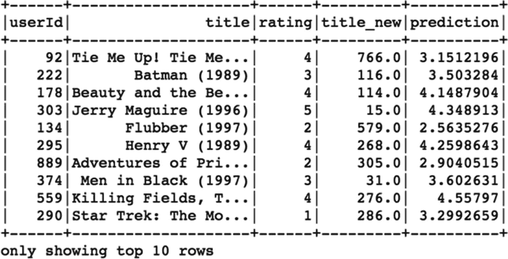

# 七、推荐系统

在实体店中可以观察到的一个常见趋势是，我们在购物时有销售人员指导和推荐我们相关的产品。另一方面，在在线零售平台上，有无数不同的产品可供选择，我们必须自己导航才能找到合适的产品。现在的情况是，用户有太多的选项和选择，但是他们不喜欢花太多的时间浏览整个目录。因此，推荐系统(RS)的作用对于推荐相关项目和推动客户转化变得至关重要。

传统实体店使用货架图来排列商品，这样可以增加高销量商品的可见性并增加收入，而在线零售店需要根据每个客户的偏好来保持动态，而不是对每个人都保持相同。

推荐系统主要用于以个性化的方式向正确的用户自动推荐正确的内容或产品，以增强整体体验。推荐系统在使用大量数据和学习理解特定用户的偏好方面非常强大。推荐可以帮助用户轻松浏览数以百万计的产品或大量内容(文章/视频/电影)，并向他们展示他们可能喜欢或购买的正确商品/信息。因此，简单地说，RS 代表用户帮助发现信息。现在，这取决于用户来决定 rs 是否在推荐方面做得很好，他们可以选择选择产品/内容或放弃并继续前进。用户的每一个决定(积极的或消极的)都有助于根据最新数据重新训练 rs，以便能够给出更好的建议。在这一章中，我们将回顾 RS 是如何工作的，以及提出这些建议时所使用的不同类型的技术。我们还将使用 PySpark 构建一个推荐系统。

## 推荐

在向用户推荐各种事物的意义上，推荐系统可以用于多种目的。例如，其中一些可能属于以下类别:

1.  零售产品

2.  乔布斯

3.  关系/朋友

4.  电影/音乐/视频/书籍/文章

5.  广告(ad 的复数)

“推荐什么”部分完全取决于使用 RS 的环境，可以通过提供用户最有可能购买的商品或通过在适当的时间展示相关内容来增加参与度，从而帮助企业增加收入。RS 关注的关键方面是，被推荐的产品或内容应该是用户可能喜欢但自己不会发现的东西。除此之外，RS 还需要各种各样的推荐元素来保持足够的趣味性。一些当今企业大量使用 RS 的例子，如亚马逊产品、脸书的朋友建议、LinkedIn 的“你可能认识的人”、网飞的电影、YouTube 的视频、Spotify 的音乐和 Coursera 的课程。

从商业角度来看，这些建议的影响被证明是巨大的，因此花费了更多的时间来使这些规则更加有效和相关。RS 在零售环境中提供的一些直接优势包括:

1.  收入增加

2.  用户的积极评价和评级

3.  参与度提高

对于其他垂直行业，如广告推荐和其他内容推荐，RS 非常有助于帮助他们找到适合用户的东西，从而增加采用率和订阅量。如果没有 RS，以个性化方式向数百万用户推荐在线内容或向每个用户提供通用内容可能会令人难以置信地偏离目标，并对用户产生负面影响。

现在我们知道了 RS 的用法和特性，我们可以看看不同类型的 RS。可以构建的 RS 主要有五种类型:

1.  基于流行度的 RS

2.  基于内容的遥感

3.  基于协同过滤的粗糙集

4.  混合遥感

5.  基于粗糙集的关联规则挖掘

除了最后一项，即基于 RS 的关联规则挖掘，我们将简要介绍每一项，因为它超出了本书的范围。

### 基于流行度的 RS

这是可以用来向用户推荐产品或内容的最基本和最简单的 RS。它根据大多数用户的购买/观看/喜欢/下载来推荐项目/内容。虽然它实现起来简单易行，但它不会产生相关的结果，因为对每个用户的推荐都是一样的，但它有时会优于一些更复杂的 RS。RS 的实现方式是简单地根据各种参数对项目进行排名，并推荐列表中排名最高的项目。如前所述，项目或内容可以按以下方式排序:

1.  下载次数

2.  购买次数

3.  浏览次数

4.  最高评级

5.  共享次数

6.  喜欢的次数

这种 RS 直接向客户推荐最畅销或最受关注/购买的商品，从而增加客户转化的机会。这种 RS 的局限性在于它不是超个性化的。

### 基于内容的遥感

这种类型的 RS 向用户推荐用户过去喜欢过的类似项目。因此，整个想法是计算任意两个项目之间的相似性得分，并基于用户的兴趣简档推荐给用户。我们首先为每个项目创建项目配置文件。现在，可以通过多种方式创建这些项目配置文件，但最常用的方法是包含关于项目的详细信息或属性的信息。例如，电影的项目简档可以具有各种属性的值，例如恐怖、艺术、喜剧、动作、戏剧和商业，如下所示。

<colgroup><col class="tcol1 align-left"> <col class="tcol2 align-left"> <col class="tcol3 align-left"> <col class="tcol4 align-left"> <col class="tcol5 align-left"> <col class="tcol6 align-left"> <col class="tcol7 align-left"></colgroup> 
| 

电影 ID

 | 

恐怖

 | 

艺术

 | 

喜剧

 | 

行动

 | 

戏剧

 | 

商业

 |
| --- | --- | --- | --- | --- | --- | --- |
| Two thousand three hundred and ten | Zero point zero one | Zero point three | Zero point eight | Zero | Zero point five | Zero point nine |

上面是一个项目配置文件的例子，每个项目都有一个相似的向量来表示它的属性。现在，让我们假设用户已经观看了 10 部这样的电影，并且非常喜欢它们。因此，对于该特定用户，我们最终得到了表 7-1 中所示的项目矩阵。

表 7-1。

电影数据

<colgroup><col class="tcol1 align-left"> <col class="tcol2 align-left"> <col class="tcol3 align-left"> <col class="tcol4 align-left"> <col class="tcol5 align-left"> <col class="tcol6 align-left"> <col class="tcol7 align-left"></colgroup> 
| 

电影 ID

 | 

恐怖

 | 

艺术

 | 

喜剧

 | 

行动

 | 

戏剧

 | 

商业

 |
| --- | --- | --- | --- | --- | --- | --- |
| Two thousand three hundred and ten | Zero point zero one | Zero point three | Zero point eight | Zero | Zero point five | Zero point nine |
| Two thousand six hundred and thirty-one | Zero | Zero point four five | Zero point eight | Zero | Zero point five | Zero point six five |
| Two thousand four hundred and forty-four | Zero point two | Zero | Zero point eight | Zero | Zero point five | Zero point seven |
| Two thousand nine hundred and seventy-four | Zero point six | Zero point three | Zero | Zero point six | Zero point five | Zero point three |
| Two thousand one hundred and fifty-one | Zero point nine | Zero point two | Zero | Zero point seven | Zero point five | Zero point nine |
| Two thousand eight hundred and seventy-six | Zero | Zero point three | Zero point eight | Zero | Zero point five | Zero point nine |
| Two thousand three hundred and forty-five | Zero | Zero point three | Zero point eight | Zero | Zero point five | Zero point nine |
| Two thousand three hundred and nine | Zero point seven | Zero | Zero | Zero point eight | Zero point four | Zero point five |
| Two thousand three hundred and sixty-six | Zero point one | Zero point one five | Zero point eight | Zero | Zero point five | Zero point six |
| Two thousand three hundred and eighty-eight | Zero | Zero point three | Zero point eight five | Zero | Zero point eight | Zero point nine |

#### 用户概要

基于内容的 RC 中的另一个组件是用户简档，它是使用用户喜欢或评价的项目简档创建的。假设用户喜欢表 7-1 中的电影，用户简档可能看起来像单个向量，它只是项目向量的平均值。用户配置文件可能如下所示。

<colgroup><col class="tcol1 align-left"> <col class="tcol2 align-left"> <col class="tcol3 align-left"> <col class="tcol4 align-left"> <col class="tcol5 align-left"> <col class="tcol6 align-left"> <col class="tcol7 align-left"></colgroup> 
| 

用户标识

 | 

恐怖

 | 

艺术

 | 

喜剧

 | 

行动

 | 

戏剧

 | 

商业

 |
| --- | --- | --- | --- | --- | --- | --- |
| 1A92 | Zero point two five one | Zero point two three | Zero point five six five | Zero point two one | Zero point five two | Zero point seven two five |

这种创建用户简档的方法是最基本的方法之一，还有其他复杂的方法来创建更丰富的用户简档，如标准化值、加权值等。下一步是根据之前的偏好推荐用户可能喜欢的项目(电影)。因此，用户简档和项目简档之间的相似性得分被计算并相应地排序。相似度得分越多，用户喜欢该电影的几率越高。有几种方法可以计算相似性得分。

#### 欧几里得距离

用户简档和项目简档都是高维向量，因此为了计算两者之间的相似性，我们需要计算两个向量之间的距离。使用下面的公式可以很容易地计算出 n 维向量的欧几里德距离:


距离值越高，两个向量越不相似。因此，计算用户简档和所有其他项目之间的距离，并按降序排列。以这种方式向用户推荐前几个项目。

#### 余弦相似性

计算用户和项目简档之间的相似性得分的另一种方式是余弦相似性。它测量的不是距离，而是两个向量(用户简档向量和项目简档向量)之间的角度。两个向量之间的角度越小，它们彼此越相似。余弦相似度可以使用下面的公式计算出来:

是(x，y)=cos(θ)= x*y / |x|*|y|

让我们来看看基于内容的 RS 的优缺点。

**优点:**

1.  基于内容的 RC 独立于其他用户的数据工作，因此可以应用于个人的历史数据。

2.  RC 背后的基本原理很容易理解，因为推荐是基于用户简档和项目简档之间的相似性得分。

3.  也可以仅仅基于用户的历史兴趣和偏好向用户推荐新的和未知的项目。

**缺点:**

1.  项目配置文件可能有偏差，可能无法反映准确的属性值，并可能导致不正确的建议。

2.  推荐完全取决于用户的历史，并且只能推荐与历史观看/喜欢的项目相似的项目，而不考虑访问者的新兴趣或喜欢。

### 基于协同过滤的粗糙集

基于 CF 的 RS 不需要项目属性或描述来进行推荐；相反，它作用于用户项目交互。这些互动可以通过各种方式来衡量，如评级、购买的商品、花费的时间、在另一个平台上的分享等。在深入探讨 CF 之前，让我们后退一步，思考一下我们是如何在日常生活中做出某些决定的，例如以下这些决定:

1.  看哪部电影

2.  读哪本书

3.  去哪家餐馆

4.  去哪个地方旅游

我们问我们的朋友，对！我们向在某些方面与我们相似、品味和爱好与我们相同的人寻求推荐。我们的利益在某些领域是一致的，所以我们相信他们的建议。这些人可能是我们的家庭成员、朋友、同事、亲戚或社区成员。在现实生活中，很容易知道这个圈子里的人都是些什么人，但当涉及到在线推荐时，协同过滤中的关键任务是找到与你最相似的用户。每个用户可以由包含用户项目交互的反馈值的向量来表示。让我们先了解用户项目矩阵，以理解 CF 方法。

#### 用户项目矩阵

用户项目矩阵顾名思义。在行中，我们有所有的唯一用户；沿着列，我们有所有独特的项目。这些值填充有反馈或交互分数，以突出用户对该产品的喜欢或不喜欢。一个简单的用户条目矩阵可能类似于表 7-2 所示。

表 7-2。

用户项目矩阵

<colgroup><col class="tcol1 align-left"> <col class="tcol2 align-left"> <col class="tcol3 align-left"> <col class="tcol4 align-left"> <col class="tcol5 align-left"> <col class="tcol6 align-left"> <col class="tcol7 align-left"></colgroup> 
| 

用户标识

 | 

项目 1

 | 

项目 2

 | 

项目 3

 | 

项目 4

 | 

项目 5

 | 

项目 n

 |
| --- | --- | --- | --- | --- | --- | --- |
| 14SD | one | four |   |   | five |   |
| 26BB |   | three | three |   |   | one |
| 24DG | one | four | one |   | five | Two |
| 59YU |   | Two |   |   | five |   |
| 21HT | three | Two | one | Two | five |   |
| 公元前 68 年 |   | one |   |   |   | five |
| 26DF | one | four |   | three | three |   |
| 25TR | one | four |   |   | five |   |
| 33XF | five | five | five | one | five | five |
| 73QS | one |   | three |   |   | one |

正如您所观察到的，用户项目矩阵通常非常稀疏，因为有数百万个项目，并且每个用户不会与每个项目进行交互；所以这个矩阵包含了很多空值。矩阵中的值通常是基于用户与该特定项目的交互而推导出的反馈值。在 UI 矩阵中可以考虑两种类型的反馈。

#### 明确的反馈

这种类型的反馈通常是当用户在交互之后给项目评级并且已经体验了项目特征时。评级可以有多种类型。

1.  用 1-5 级评分

2.  向他人推荐的简单评分项目(是或否或从不)

3.  喜欢该项目(是或否)

显式反馈数据包含非常有限的数据点，因为即使在购买或使用商品后，也只有很小比例的用户会花时间给出评级。一个完美的例子可以是一部电影，因为很少有用户在观看后给出评级。因此，仅基于显式反馈数据构建 RS 会将我们置于一个棘手的境地，尽管数据本身噪声较小，但有时不足以构建 RS。

#### 隐性反馈

这种反馈不是直接的，主要是从用户在在线平台上的活动中推断出来的，并且基于与项目的交互。例如，如果用户已经购买了该商品，将其添加到购物车中，查看了该商品，并且花了大量时间查看关于该商品的信息，这表明用户对该商品有更高的兴趣。隐式反馈值很容易收集，并且当每个用户通过在线平台导航时，他们可以获得大量的数据点。隐式反馈面临的挑战是，它包含大量嘈杂的数据，因此不会在推荐中增加太多价值。

现在我们已经了解了 UI 矩阵和进入该矩阵的值的类型，我们可以看到不同类型的协同过滤(CF)。主要有两种 CF:

1.  基于最近邻的 CF

2.  基于潜在因素的 CF

#### 基于最近邻的 CF

这种 CF 的工作方式是通过找到与活跃用户(对于我们试图推荐的用户)喜欢或不喜欢相同项目的最相似用户来找出用户的 k 个最近邻居。最近邻的协同过滤包括两个步骤。第一步是找到 k 个最近的邻居，第二步是预测活跃用户喜欢特定项目的评级或可能性。可以使用我们在本章中讨论过的一些早期技术来找出 k-最近邻。余弦相似性或欧几里德距离等指标可以帮助我们根据两组用户喜欢或不喜欢的共同项目，从用户总数中找到与活跃用户最相似的用户。也可以使用的另一个度量是 Jaccard 相似性。让我们看一个例子来理解这个指标——回到之前的用户项目矩阵，只取五个用户的数据，如表 7-3 所示。

表 7-3。

用户项目矩阵

<colgroup><col class="tcol1 align-left"> <col class="tcol2 align-center"> <col class="tcol3 align-center"> <col class="tcol4 align-center"> <col class="tcol5 align-center"> <col class="tcol6 align-center"> <col class="tcol7 align-center"></colgroup> 
| 

用户标识

 | 

项目 1

 | 

项目 2

 | 

项目 3

 | 

项目 4

 | 

项目 5

 | 

项目 n

 |
| --- | --- | --- | --- | --- | --- | --- |
| 14SD | one | four |   |   | five |   |
| 26BB |   | three | three |   |   | one |
| 24DG | one | four | one |   | five | Two |
| 59YU |   | Two |   |   | five |   |
| 26DF | one | four |   | three | three |   |

假设我们总共有五个用户，我们想找到离活动用户最近的两个邻居(14SD)。Jaccard 的相似性可以通过使用

是(x，y)= | rx’ry |/| rx’ry |

因此，这是任意两个用户共同评价的项目数除以两个用户评价的项目总数:

sim(用户 1，用户 2) = 1 / 5 = 0.2，因为他们只对项目 2 进行了共同评价)。

其余四个用户与活跃用户的相似性得分将类似于表 7-4 所示。

表 7-4。

用户相似性得分

<colgroup><col class="tcol1 align-center"> <col class="tcol2 align-center"></colgroup> 
| 

用户标识

 | 

相似性得分

 |
| --- | --- |
| 14SD | one |
| 26BB | Zero point two |
| 24DG | Zero point six |
| 59YU | Zero point six seven seven |
| 26DF | Zero point seven five |

因此，根据 Jaccard 相似性，前两个最近的邻居是第四和第五用户。不过，这种方法有一个主要问题，因为 Jaccard 相似性在计算相似性得分时不考虑反馈值，而只考虑已评级的常见项目。因此，可能存在这样一种可能性，即用户可能对许多项目进行了共同评级，但一个人可能对它们进行了高评级，而另一个人可能对它们进行了低评级。Jaccard 相似性得分仍然可能以两个用户的高分结束，这是违反直觉的。在上面的例子中，很明显，活动用户与第三用户(24DG)最相似，因为他们对三个常见项目具有完全相同的评级，而第三用户甚至没有出现在前两个最近的邻居中。因此，我们可以选择其他度量来计算 k-最近邻。

#### 缺少值

用户项目矩阵将包含许多缺失值，原因很简单，因为有许多项目，并且不是每个用户都与每个项目交互。有几种方法可以处理 UI 矩阵中缺失的值。

1.  用 0 替换丢失的值。

2.  用用户的平均评分替换缺失值。

对共同项目的评级越相似，邻居离活跃用户越近。同样，有两类基于最近邻的 CF

1.  基于用户的 CF

2.  基于项目的 CF

这两个 RS 之间的唯一区别是，在基于用户的 CF 中，我们找到 k 个最近的用户，而在基于项目的 CF 中，我们找到 k 个最近的项目推荐给用户。我们将看到推荐在基于用户的 RS 中是如何工作的。

顾名思义，在基于用户的 CF 中，整个思路就是找到与活跃用户最相似的用户，将相似用户已经购买/评价很高的商品推荐给活跃用户，而这些商品是他还没有看过/买过/试过的。这种 RS 的假设是，如果两个或更多的用户对一堆项目有相同的意见，那么他们很可能对其他项目也有相同的意见。让我们看一个例子来理解基于用户的协同过滤:有三个用户，我们想向其中的活跃用户推荐一个新项目。其余两个用户是与活动用户在项目的好恶方面的前两个最近邻居，如图 7-1 *所示。*


图 7-1

活跃用户和最近邻居

这三个用户都对某个特定的相机品牌给予了很高的评价，根据图 7-2 所示的相似性得分，前两个用户是与活跃用户最相似的用户。


图 7-2

所有用户都喜欢一个项目

现在，前两个用户对另一个项目(Xbox 360)的评价也非常高，第三个用户尚未与之互动，也没有看到如图 7-3 所示。使用该信息，我们试图预测活动用户将给予新项目(XBOX 360)的评级，这也是该特定项目(Xbox 360)的最近邻居的评级的加权平均值。


图 7-3

最近的邻居也喜欢另一个项目

然后，基于用户的 CF 向活跃用户推荐另一个项目(XBOX 360 ),因为他最有可能对该项目评价较高，因为最近的邻居也对该项目评价较高，如图 7-4 所示。


图 7-4

主动用户推荐

#### 基于潜在因素的 CF

这种协作过滤也使用用户项目矩阵，但是不是寻找最近的邻居和预测评级，而是试图将 UI 矩阵分解成两个潜在的因素矩阵。潜在因素是从原始值导出的值。它们与观察到的变量有着内在的联系。这些新矩阵的秩要低得多，并且包含潜在的因素。这也称为矩阵分解。我们举个例子来理解矩阵因式分解的过程。我们可以将秩为 r 的 m×n 大小的矩阵“A”分解成两个更小的秩矩阵 X，Y，使得 X 和 Y 的点积产生原始的 A 矩阵。如果我们有表 7-5 所示的矩阵 A，

表 7-5。

潜在因素计算

<colgroup><col class="tcol1 align-center"> <col class="tcol2 align-center"> <col class="tcol3 align-center"> <col class="tcol4 align-center"></colgroup> 
| 

one

 | 

Two

 | 

three

 | 

five

 |
| --- | --- | --- | --- |
| Two | four | eight | Twelve |
| three | six | seven | Thirteen |

然后我们可以把所有的列值写成第一列和第三列(A1 和 A3)的线性组合。

A1 = 1 * A1 + 0 * A3

A2 = 2 * A1 + 0 * A3

A3 = 0 * A1 + 1 * A3

A4 = 2 * A1 + 1 * A3

现在，我们可以创建两个小秩矩阵，使得这两个矩阵的乘积返回原始矩阵 a。

X =

<colgroup><col class="tcol1 align-left"> <col class="tcol2 align-left"></colgroup> 
| 

one

 | 

three

 |
| --- | --- |
| Two | eight |
| three | seven |

Y =

<colgroup><col class="tcol1 align-left"> <col class="tcol2 align-left"> <col class="tcol3 align-left"> <col class="tcol4 align-left"></colgroup> 
| 

one

 | 

Two

 | 

Zero

 | 

Two

 |
| --- | --- | --- | --- |
| Zero | Zero | one | one |

x 包含 A1 和 A3 的列值，Y 包含线性组合的系数。

X 和 Y 之间的点积返回到矩阵‘A’(原始矩阵)

考虑到表 7-2 中所示的相同用户项目矩阵，我们将其因式分解或分解成两个更小的秩矩阵。

1.  用户潜在因素矩阵

2.  项目潜在因素矩阵


用户潜在因素矩阵包含映射到这些潜在因素的所有用户，类似地，项目潜在因素矩阵包含映射到每个潜在因素的列中的所有项目。寻找这些潜在因素的过程是使用机器学习优化技术来完成的，例如交替最小二乘法。用户项目矩阵被分解成潜在因素矩阵，使得用户对任何项目的评级是用户潜在因素值和项目潜在因素值之间的乘积。主要目标是最小化整个用户项目矩阵评级和预测项目评级的误差平方和。例如，第二用户(26BB)对项目 2 的预测评级将是

评级(用户 2，项目 2)= 1


在每一个预测的收视率上都会有一定量的误差，因此成本函数变成了预测收视率和实际收视率之间的误差平方和。训练推荐模型包括以这样一种方式学习这些潜在因素，即它最小化总体评级的 SSE。我们可以用 ALS 方法找到最低的 SSE。ALS 的工作方式是首先固定用户潜在因素值，并尝试改变项目潜在因素值，以使总体 SSE 降低。在下一步中，项目潜在因素值保持固定，并且用户潜在因素值被更新以进一步降低 SSE。这在用户矩阵和项目矩阵之间保持交替，直到 SSE 不再减少。

**优点:**

1.  不需要项目的内容信息，并且可以基于有价值的用户项目交互来进行推荐。

2.  基于其他用户的个性化体验。

**限制:**

1.  冷启动问题:如果用户没有物品交互的历史数据。则 RC 不能预测新用户的 k 个最近邻居，并且不能做出推荐。

2.  缺失值:由于项目数量庞大，很少有用户与所有项目进行交互，因此有些项目从未被用户评级，也无法推荐。

3.  无法推荐新的或未分级的项目:如果项目是新的且尚未被用户看到，则在其他用户与之交互之前，无法向现有用户推荐该项目。

4.  准确性差:它不能很好地执行，因为许多组件都在不断变化，如用户的兴趣，有限的商品保质期，以及很少的商品评级。

### 混合推荐系统

顾名思义，混合推荐系统包括来自多个推荐系统的输入，这使得它在向用户提供有意义的推荐方面更加强大和相关。正如我们所看到的，使用个人简历有一些限制，但结合起来，他们克服了这些限制，因此能够推荐用户认为更有用和个性化的项目或信息。混合 RS 可以通过特定的方式构建，以满足业务需求。其中一种方法是构建单个 RS，并将多个 RS 输出的建议组合起来，然后推荐给用户，如图 7-5 所示。


图 7-5

综合建议

另一种方法是利用基于内容的推荐器的优势，并将它们用作基于协同过滤的推荐的输入，以向用户提供更好的推荐。这种方法也可以反过来，协同过滤可以用作基于内容的推荐的输入，如图 7-6 所示。


图 7-6

混合建议

混合推荐还包括使用其他类型的推荐，例如基于人口统计的和基于知识的，以增强其推荐的性能。混合 RS 已经成为各种业务不可或缺的一部分，帮助他们的用户消费正确的内容，因此获得了很多价值。

## 密码

本章的这一节重点介绍使用 PySpark 和 Jupyter Notebook 中的 ALS 方法从头构建 RS。

### 注意

完整的数据集和代码可以在本书的 GitHub repo 上参考，在 Spark 2.0 和更高版本上执行得最好。

让我们使用 Spark 的 MLlib 库构建一个推荐器模型，并预测任何给定用户对某个项目的评分。

### 数据信息

我们将在本章使用的数据集是一个著名的开源电影镜头数据集的子集，包含总共 10 万条记录，有三列(User_Id、title、rating)。我们将使用 75%的数据来训练我们的推荐模型，并在剩余的 25%用户评级上测试它。

### 步骤 1:创建 SparkSession 对象

我们启动 Jupyter 笔记本并导入 SparkSession，然后创建一个新的 SparkSession 对象来使用 Spark:

```py
[In]: from pyspark.sql import SparkSession
[In]: spark=SparkSession.builder.appName('lin_reg').getOrCreate()

```

### 步骤 2:读取数据集

然后，我们使用 dataframe 在 Spark 中加载和读取数据集。我们必须确保我们已经从数据集可用的同一个目录文件夹中打开了 PySpark，否则我们必须提到数据文件夹的目录路径。

```py
[In]:
df=spark.read.csv('movie_ratings_df.csv',inferSchema=True,header=True)

```

### 步骤 3:探索性数据分析

在本节中，我们将通过查看数据集、验证数据集的形状，以及获得已评级的电影数量和每个用户已评级的电影数量来研究数据集。

```py
[In]: print((df.count(), len(df.columns)))
[Out]: (100000,3)

```

因此，上面的输出确认了数据集的大小，然后我们可以验证输入值的数据类型，以检查我们是否需要更改/转换任何列的数据类型。

```py
[In]: df.printSchema()
[Out]: root
 |-- userId: integer (nullable = true)
 |-- title: string (nullable = true)
 |-- rating: integer (nullable = true)

```

总共有三列，其中两列是数字，标题是分类。使用 PySpark 构建 RS 的关键是我们需要数字形式的 user_id 和 item_id。因此，我们稍后会将电影标题转换成数值。我们现在使用 rand 函数来查看数据帧的几行，以随机顺序打乱记录。

```py
[In]: df.orderBy(rand()).show(10,False)
[Out]:

```


```py
[In]: df.groupBy('userId').count().orderBy('count',ascending=False).show(10,False) 

[Out]:

```


```py
[In]: df.groupBy('userId').count().orderBy('count',ascending=True).show(10,False)
[Out]:

```


记录数最高的用户评价了 737 部电影，每个用户至少评价了 20 部电影。

```py
[In]: df.groupBy('title').count().orderBy('count',ascending=False).show(10,False)
[Out]:

```


收视率最高的电影是*星球大战* (1977)，被评为 583 次，每部电影至少有 1 名用户评为。

### 步骤 4:特征工程

我们现在使用 StringIndexer 将电影标题列从分类值转换为数值。我们从 PySpark 库中导入 stringIndexer 和 Indextostring。

```py
[In]: from pyspark.sql.functions import *
[In]: from pyspark.ml.feature import StringIndexer,IndexToString

```

接下来，我们通过提到输入列和输出列来创建 stringindexer 对象。然后，我们将对象放在数据帧上，并将其应用于电影标题列，以创建带有数值的新数据帧。

```py
[In]: stringIndexer = StringIndexer(inputCol="title", outputCol="title_new")

[In]: model = stringIndexer.fit(df)

[In]: indexed = model.transform(df)

```

让我们通过查看新数据帧的几行来验证标题列的数值。

```py
[In]: indexed.show(10)
[Out]:

```


正如我们所看到的，我们现在有了一个额外的列(title_new ),用数值表示电影标题。如果 user_id 也是分类类型，我们必须重复相同的过程。为了验证电影计数，我们在一个新的数据帧上重新运行 groupBy。

```py
[In]: indexed.groupBy('title_new').count().orderBy('count',ascending=False).show(10,False)
[Out]:

```


### 步骤 5:拆分数据集

既然我们已经为构建推荐器模型准备了数据，我们可以将数据集分成训练集和测试集。我们将其分成 75 比 25 的比例来训练模型并测试其准确性。

```py
[In]: train,test=indexed.randomSplit([0.75,0.25])

[In]: train.count()
[Out]: 75104

[In]: test.count()
[Out]: 24876

```

### 步骤 6:建立和训练推荐模型

我们从 PySpark ml 库中导入 ALS 函数，并在训练数据集上构建模型。可以调整多个超参数来提高模型的性能。其中两个重要的是 non negative =“True”不会在推荐中产生负面评级，cold start strategy =“drop”会阻止任何 NaN 评级预测。

```py
[In]: from pyspark.ml.recommendation import ALS
[In]: rec=ALS(maxIter=10,regParam=0.01,userCol='userId',itemCol='title_new',ratingCol='rating',nonnegative=True,coldStartStrategy="drop")

[In]: rec_model=rec.fit(train)

```

### 步骤 7:对测试数据的预测和评估

整个练习的最后一部分是检查模型在未知或测试数据上的性能。我们使用 transform 函数对测试数据进行预测，并使用 RegressionEvaluate 来检查模型对测试数据的 RMSE 值。

```py
[In]: predicted_ratings=rec_model.transform(test)

[In]: predicted_ratings.printSchema()
root
 |-- userId: integer (nullable = true)
 |-- title: string (nullable = true)
 |-- rating: integer (nullable = true)
 |-- title_new: double (nullable = false)
 |-- prediction: float (nullable = false)

[In]: predicted_ratings.orderBy(rand()).show(10)
[Out]:

```



```py
[xIn]: from pyspark.ml.evaluation import RegressionEvaluator

[In]: evaluator=RegressionEvaluator(metricName='rmse',predictionCol='prediction',labelCol='rating')

[In]: rmse=evaluator.evaluate(predictions)

[In] : print(rmse)

[Out]: 1.0293574739493354

```

RMSE 不是很高；我们在实际评分和预测评分上犯了一个点的错误。这可以通过调整模型参数和使用混合方法来进一步改善。

### 第八步:推荐活跃用户可能喜欢的热门电影

在检查了模型的性能并调整了超参数之后，我们可以继续向用户推荐他们没有看过但可能喜欢的顶级电影。第一步是在数据帧中创建独特电影的列表。

```py
[In]: unique_movies=indexed.select('title_new').distinct()

[In]: unique_movies.count()

[Out]: 1664

```

所以，我们总共有 1664 部不同的电影。

```py
[In]: a = unique_movies.alias('a')

```

我们可以在数据集中选择任何需要推荐其他电影的用户。在我们的例子中，我们使用 userId = 85。

```py
[In]: user_id=85

```

我们将过滤该活跃用户已经评级或看过的电影。

```py
[In]: watched_movies=indexed.filter(indexed['userId'] == user_id).select('title_new').distinct()

[In]: watched_movies.count()
[Out]: 287

[In]: b=watched_movies.alias('b')

```

因此，在该活跃用户已经评级的 1，664 部电影中，总共有 287 部独特的电影。因此，我们想从剩余的 1377 个项目中推荐电影。我们现在合并这两个表，通过从连接的表中过滤空值来查找我们可以推荐的电影。

```py
[In]: total_movies = a.join(b, a.title_new == b.title_new,how='left')

[In]: total_movies.show(10,False)

[Out]:

```


```py
[In]: remaining_movies=total_movies.where(col("b.title_new").isNull()).select(a.title_new).distinct()

[In]: remaining_movies.count()

[Out]: 1377

[In]: remaining_movies=remaining_movies.withColumn("userId",lit(int(user_id)))
[In]: remaining_movies.show(10,False)

[Out]:

```


最后，我们现在可以使用我们之前构建的推荐者模型，对活跃用户的剩余电影数据集进行预测。我们只过滤几个预测评级最高的推荐。

```py
[In]: recommendations=rec_model.transform(remaining_movies).orderBy('prediction',ascending=False)

[In]: recommendations.show(5,False)
[Out]:

```


因此，电影标题 1433 和 1322 对于该活动用户具有最高的预测评级(85)。我们可以通过将电影标题重新添加到推荐中来使其更加直观。我们使用 Indextostring 函数创建一个额外的列来返回电影标题。

```py
[In]:
movie_title = IndexToString(inputCol="title_new", outputCol="title",labels=model.labels)
[In]: final_recommendations=movie_title.transform(recommendations)

[In]: final_recommendations.show(10,False)

[Out]:

```


所以，对 userId (85)的推荐是 *Boys，Les* (1997)和 F *aust* (1994)。这可以很好地封装在一个函数中，该函数依次执行上述步骤，并为活跃用户生成推荐。GitHub repo 上有完整的代码，内置了这个函数。

## 结论

在本章中，我们讨论了各种类型的推荐模型，以及每种模型的优点和局限性。然后，我们在 PySpark 中创建了一个基于协同过滤的推荐系统，使用 ALS 方法向用户推荐电影。