# 九、自然语言处理

## 介绍

本章揭示了一些使用 PySpark 处理文本数据的基本技术。今天的文本形式的数据正在以闪电般的速度产生，多个社交媒体平台为用户提供了分享他们的意见、建议、评论等的选项。专注于让机器学习和理解文本数据以执行一些有用任务的领域被称为自然语言处理(NLP)。文本数据可以是结构化的，也可以是非结构化的，我们必须应用多个步骤来做好分析准备。NLP 已经为多种应用做出了巨大贡献。目前，NLP 的许多应用被企业大量使用，例如聊天机器人、语音识别、语言翻译、推荐系统、垃圾邮件检测和情感分析。本章演示了处理文本数据并对其应用机器学习算法的一系列步骤。它还展示了序列嵌入，可以作为传统的分类输入特征的替代。

## NLP 中涉及的步骤

进行 NLP 分析没有正确的方法，因为人们可以探索多种方法并采用不同的方法来处理文本数据。然而，从机器学习的角度来看，要使文本数据为分析做好准备，需要五个主要步骤。NLP 中涉及的五个主要步骤是:

1.  阅读文集

2.  标记化

3.  清除/停用字词删除

4.  堵塞物

5.  转换成数字形式

在进入加载和清理文本数据的步骤之前，让我们先熟悉一个叫做语料库的术语，因为它会在本章的其余部分不断出现。

## 文集

语料库被称为文本文档的全部集合。例如，假设我们有数千封电子邮件需要处理和分析。这组电子邮件被称为语料库，因为它包含所有的文本文档。文本处理的下一步是标记化。

## 标记化

将文本文档中的给定句子或单词集合分成单独的/个别的单词的方法被称为标记化。它删除了不必要的字符，如标点符号。例如，如果我们有这样一个句子:

输入:他真的很喜欢伦敦这座城市。他在那里还要呆两天。

令牌:

他真的很喜欢伦敦，他在那里呆了两天多

对于上面的输入句子，我们最终得到了 13 个标记。

让我们看看如何使用 PySpark 进行标记化。第一步是创建包含文本数据的 dataframe。

```py
[In]: df=spark.createDataFrame([(1,'I really liked this movie'),
              (2,'I would recommend this movie to my friends'),
              (3,'movie was alright but acting was horrible'),
              (4,'I am never watching that movie ever again')],
              ['user_id','review'])
[In]: df.show(4,False)
[Out]:
+-------+------------------------------------------+
|user_id|review                                    |
+-------+------------------------------------------+
|1      |I really liked this movie                 |
|2      |I would recommend this movie to my friends|
|3      |movie was alright but acting was horrible |
|4      |I am never watching that movie ever again |
+-------+------------------------------------------+

```

在这个数据框架中，我们有四个句子用于标记化。下一步是从 Spark 库中导入 Tokenizer。然后，我们必须传递输入列，并在标记化之后命名输出列。我们使用 transform 函数来对 review 列应用标记化。

```py
[In]: from pyspark.ml.feature import Tokenizer
[In]: tokenization=Tokenizer(inputCol='review',outputCol='tokens')
[In]: tokenized_df=tokenization.transform(df)
[In]: tokenized_df.show(4,False)
[Out]:

```

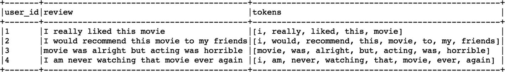

我们得到一个名为 tokens 的新列，其中包含每个句子的标记。

## 停用词移除

正如您所观察到的，tokens 列包含非常常见的单词，如“this”、“the”、“to”、“was”、“that”等。这些词被称为停用词，它们似乎对分析没有什么价值。如果在分析中使用它们，会增加计算开销，但不会增加太多价值或洞察力。因此，从标记中去掉这些停用词总是一个好主意。在 PySpark 中，我们使用停用词移除器来移除停用词。

```py
[In]: from pyspark.ml.feature import StopWordsRemover
[In]: stopword_removal=StopWordsRemover(inputCol='tokens',outputCol='refined_tokens')
We then pass the tokens as the input column and name the output column as refined tokens.
[In]: refined_df=stopword_removal.transform(tokenized_df)
[In]: refined_df.select(['user_id','tokens','refined_tokens']).show(4,False)
[Out]:

```

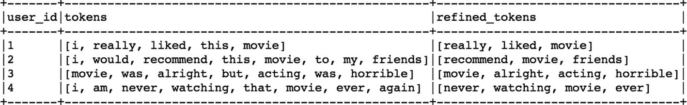

正如您所观察到的，像' I '，' this '，' was '，' am '，' but '，' that '这样的停用词都从 tokens 列中删除了。

## 一袋单词

这是一种方法，通过这种方法，我们可以将文本数据表示为数字形式，以供机器学习或任何其他分析使用。文本数据通常是非结构化的，并且长度各不相同。BOW(单词包)允许我们通过考虑单词在文本文档中的出现来将文本形式转换成数字向量形式。举个例子，

医生 1:生活中最好的事情就是旅行

医生 2:旅行是最好的良药

医生 3:一个人应该经常旅行

词汇:

出现在所有文档中的唯一单词的列表称为词汇表。在上面的例子中，我们有 13 个独特的单词，它们是词汇表的一部分。每个文档可以由这个固定大小的向量 13 来表示。

<colgroup><col class="tcol1 align-left"> <col class="tcol2 align-left"> <col class="tcol3 align-left"> <col class="tcol4 align-left"> <col class="tcol5 align-left"> <col class="tcol6 align-left"> <col class="tcol7 align-left"> <col class="tcol8 align-left"> <col class="tcol9 align-left"> <col class="tcol10 align-left"> <col class="tcol11 align-left"> <col class="tcol12 align-left"> <col class="tcol13 align-left"></colgroup> 
| 这 | 最好的 | 东西 | 在 | 生活 | 存在 | 到 | 旅行 | 医学 | 一个 | 应该 | 更多 | 时常 |

另一个元素是使用布尔值表示特定文档中的单词。

(1 或 0)。

文件 1:

<colgroup><col class="tcol1 align-left"> <col class="tcol2 align-left"> <col class="tcol3 align-left"> <col class="tcol4 align-left"> <col class="tcol5 align-left"> <col class="tcol6 align-left"> <col class="tcol7 align-left"> <col class="tcol8 align-left"> <col class="tcol9 align-left"> <col class="tcol10 align-left"> <col class="tcol11 align-left"> <col class="tcol12 align-left"> <col class="tcol13 align-left"></colgroup> 
| 

这

 | 

最好的

 | 

东西

 | 

在

 | 

生活

 | 

存在

 | 

到

 | 

旅行

 | 

医学

 | 

一个

 | 

应该

 | 

更多

 | 

时常

 |
| --- | --- | --- | --- | --- | --- | --- | --- | --- | --- | --- | --- | --- |
| one | one | one | one | one | one | one | one | Zero | Zero | Zero | Zero | Zero |

文件 2:

<colgroup><col class="tcol1 align-left"> <col class="tcol2 align-left"> <col class="tcol3 align-left"> <col class="tcol4 align-left"> <col class="tcol5 align-left"> <col class="tcol6 align-left"> <col class="tcol7 align-left"> <col class="tcol8 align-left"> <col class="tcol9 align-left"> <col class="tcol10 align-left"> <col class="tcol11 align-left"> <col class="tcol12 align-left"> <col class="tcol13 align-left"></colgroup> 
| 

这

 | 

最好的

 | 

东西

 | 

在

 | 

生活

 | 

存在

 | 

到

 | 

旅行

 | 

医学

 | 

一个

 | 

应该

 | 

更多

 | 

时常

 |
| --- | --- | --- | --- | --- | --- | --- | --- | --- | --- | --- | --- | --- |
| one | one | Zero | Zero | Zero | one | Zero | one | one | Zero | Zero | Zero | Zero |

文档 3:

<colgroup><col class="tcol1 align-left"> <col class="tcol2 align-left"> <col class="tcol3 align-left"> <col class="tcol4 align-left"> <col class="tcol5 align-left"> <col class="tcol6 align-left"> <col class="tcol7 align-left"> <col class="tcol8 align-left"> <col class="tcol9 align-left"> <col class="tcol10 align-left"> <col class="tcol11 align-left"> <col class="tcol12 align-left"> <col class="tcol13 align-left"></colgroup> 
| 

这

 | 

最好的

 | 

东西

 | 

在

 | 

生活

 | 

存在

 | 

到

 | 

旅行

 | 

医学

 | 

一个

 | 

应该

 | 

更多

 | 

时常

 |
| --- | --- | --- | --- | --- | --- | --- | --- | --- | --- | --- | --- | --- |
| Zero | Zero | Zero | Zero | Zero | Zero | Zero | one | Zero | one | one | one | one |

BOW 不考虑文档中单词的顺序和单词的语义，因此是将文本数据表示为数字形式的最基本的方法。还有其他方法可以将文本数据转换成数字形式，这将在下一节中提到。我们将使用 PySpark 来研究这些方法。

## 计数矢量器

在 BOW 中，我们看到简单地用 1 或 0 来表示单词的出现，而没有考虑单词的频率。相反，计数矢量器对特定文档中出现的单词进行计数。我们将使用之前在使用标记化时创建的相同文本文档。我们首先导入计数矢量器。

```py
[In]: from pyspark.ml.feature import CountVectorizer
[In]: count_vec=CountVectorizer(inputCol='refined_tokens',outputCol='features')
[In]: cv_df=count_vec.fit(refined_df).transform(refined_df)
[In]: cv_df.select(['user_id','refined_tokens','features']).show(4,False)
[Out]:

```

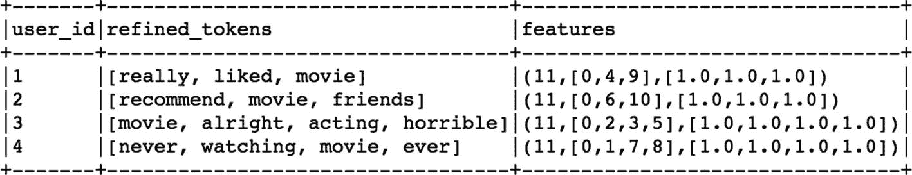

正如我们所观察到的，每个句子都被表示为一个密集的向量。它显示了向量长度是 11，并且第一个句子在第 0、第 4 和第 9 个索引处包含 3 个值。

为了验证计数矢量器的词汇，我们可以简单地使用词汇函数。

```py
[In]: count_vec.fit(refined_df).vocabulary
[Out]:
['movie',
 'horrible',
 'really',
 'alright',
 'liked',
 'friends',
 'recommend',
 'never',
 'ever',
 'acting',
 'watching']

```

因此，上述句子的词汇量为 11，如果你仔细观察这些特征，它们类似于我们在 PySpark 中用于机器学习的输入特征向量。使用计数矢量器方法的缺点是它不考虑单词在其他文档中的共现。简单来说，出现频率越高的单词对特征向量的影响越大。因此，将文本数据转换为数字形式的另一种方法称为词频-逆文档频率(TF-IDF)。

## TF-以色列国防军

这种方法试图根据其他文档来标准化单词出现的频率。整个想法是，如果一个单词在同一文档中出现的次数多，就给这个单词更大的权重，但是如果这个单词在其他文档中出现的次数也多，就惩罚这个单词。这表明一个单词在整个语料库中是常见的，并且不如它在当前文档中的频率所表明的那样重要。

词频:根据当前文档中的词频进行评分。

逆向文档频率:基于包含当前单词的文档的频率进行评分。

现在，我们在 PySpark 中使用相同的细化 DF 数据框架创建基于 TF-IDF 的要素。

```py
[In]: from pyspark.ml.feature import HashingTF,IDF
[In]: hashing_vec=HashingTF(inputCol='refined_tokens',outputCol='tf_features')
[In]: hashing_df=hashing_vec.transform(refined_df)
[In]: hashing_df.select(['user_id','refined_tokens','tf_features']).show(4,False)
[Out]:

```

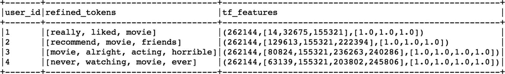

```py
[In]: tf_idf_vec=IDF(inputCol='tf_features',outputCol='tf_idf_features')
[In]: tf_idf_df=tf_idf_vec.fit(hashing_df).transform(hashing_df)
[In]: tf_idf_df.select(['user_id','tf_idf_features']).show(4,False)
[Out]:

```

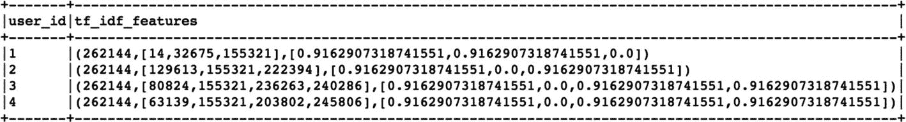

## 使用机器学习的文本分类

现在，我们已经基本了解了处理文本处理和要素矢量化所涉及的步骤，我们可以构建一个文本分类模型，并使用它来预测文本数据。我们将使用的数据集是开源的电影镜头评论数据，我们将预测任何给定评论的情感类别(正面或负面)。让我们先从读取文本数据开始，并创建一个 Spark 数据帧。

```py
[In]: text_df=spark.read.csv('Movie_reviews.csv',inferSchema=True,header=True,sep=',')
[In]: text_df.printSchema()
[Out]:
root
 |-- Review: string (nullable = true)
 |-- Sentiment: string (nullable = true)

```

您可以观察 StringType 中的情感列，我们将需要它将它转换为 Integer 或 float 类型。

```py
[In]: text_df.count()
[Out]: 7087

```

我们有近 7000 条记录，其中一些可能没有正确标记。因此，我们只过滤那些标记正确的记录。

```py
[In]: text_df=text_df.filter(((text_df.Sentiment =='1') | (text_df.Sentiment =='0')))
[In]: text_df.count()
[Out]: 6990

```

一些记录被过滤掉了，我们现在剩下 6，990 条记录进行分析。下一步是验证每门课的大量复习。

```py
[In]: text_df.groupBy('Sentiment').count().show()
[Out]:
+---------+-----+
|Sentiment|count|
+---------+-----+
|        0| 3081|
|        1| 3909|
+---------+-----+

```

我们在这里处理一个平衡的数据集，因为两个类有几乎相似数量的评论。让我们看看数据集中的一些记录。

```py
[In]: from pyspark.sql.functions import rand
[In]: text_df.orderBy(rand()).show(10,False)
[Out]:

```

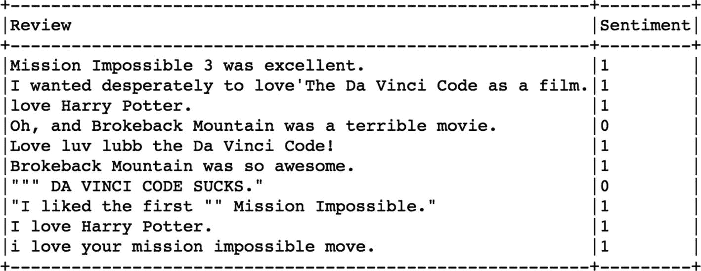

在下一步中，我们创建一个新的整数类型的标签列，并删除原来的字符串类型的情感列。

```py
[In]: text_df=text_df.withColumn("Label", text_df.Sentiment.cast('float')).drop('Sentiment')
[In]: text_df.orderBy(rand()).show(10,False)
[Out]:

```

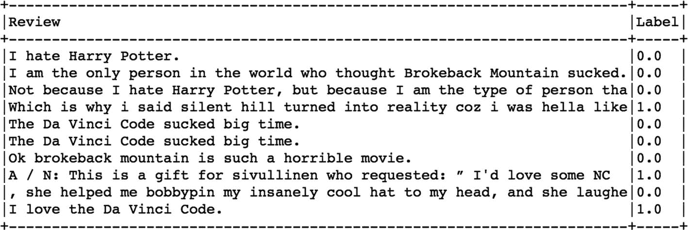

我们还包括一个额外的列，用于记录评论的长度。

```py
[In]: from pyspark.sql.functions import length
[In]: text_df=text_df.withColumn('length',length(text_df['Review']))
[In]: text_df.orderBy(rand()).show(10,False)
[Out]:

```

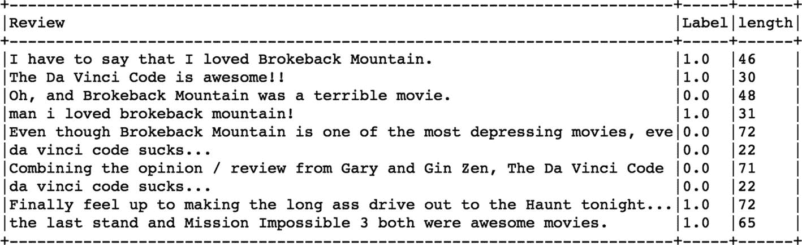

```py
[In]: text_df.groupBy('Label').agg({'Length':'mean'}).show()
[Out]:
+-----+-----------------+
|Label|      avg(Length)|
+-----+-----------------+
|  1.0|47.61882834484523|
|  0.0|50.95845504706264|
+-----+-----------------+

```

正面和负面评论的平均长度没有太大差异。下一步是开始标记化过程并删除停用词。

```py
[In]: tokenization=Tokenizer(inputCol='Review',outputCol='tokens')
[In]: tokenized_df=tokenization.transform(text_df)
[In]: stopword_removal=StopWordsRemover(inputCol='tokens',outputCol='refined_tokens')
[In]: refined_text_df=stopword_removal.transform(tokenized_df)

```

因为我们现在只处理标记而不是整个审查，所以在每个审查中捕获一些标记比使用审查的长度更有意义。我们创建了另一个列(令牌计数),给出了每行中的令牌数。

```py
[In]: from pyspark.sql.functions import udf
[In]: from pyspark.sql.types import IntegerType
[In]: from pyspark.sql.functions import *
[In]: len_udf = udf(lambda s: len(s), IntegerType())
[In]: refined_text_df = refined_text_df.withColumn("token_count", len_udf(col('refined_tokens')))
[In]: refined_text_df.orderBy(rand()).show(10)
[Out]:

```

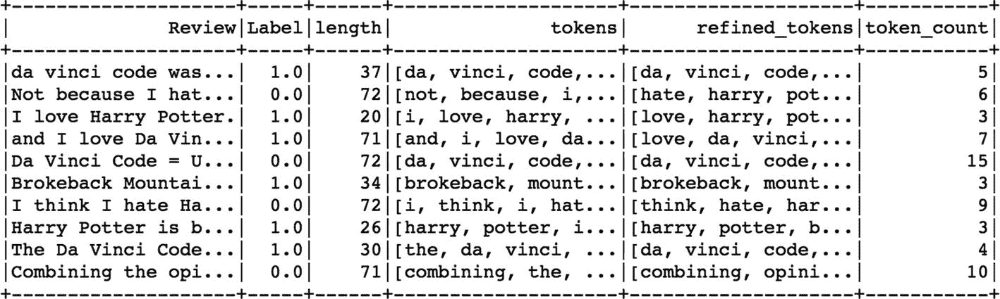

现在我们已经有了去除停用词后的精炼标记，我们可以使用上述任何一种方法将文本转换成数字特征。在这种情况下，我们使用计数矢量器对机器学习模型进行特征矢量化。

```py
[In]:count_vec=CountVectorizer(inputCol='refined_tokens',outputCol='features')
[In]: cv_text_df=count_vec.fit(refined_text_df).transform(refined_text_df)
[In]: cv_text_df.select(['refined_tokens','token_count','features','Label']).show(10)
[Out]:
+--------------------+-----------+--------------------+-----+
|      refined_tokens|token_count|            features|Label|
+--------------------+-----------+--------------------+-----+
|[da, vinci, code,...|          5|(2302,[0,1,4,43,2...|  1.0|
|[first, clive, cu...|          9|(2302,[11,51,229,...|  1.0|
|[liked, da, vinci...|          5|(2302,[0,1,4,53,3...|  1.0|
|[liked, da, vinci...|          5|(2302,[0,1,4,53,3...|  1.0|
|[liked, da, vinci...|          8|(2302,[0,1,4,53,6...|  1.0|
|[even, exaggerati...|          6|(2302,[46,229,271...|  1.0|
|[loved, da, vinci...|          8|(2302,[0,1,22,30,...|  1.0|
|[thought, da, vin...|          7|(2302,[0,1,4,228,...|  1.0|
|[da, vinci, code,...|          6|(2302,[0,1,4,33,2...|  1.0|
|[thought, da, vin...|          7|(2302,[0,1,4,223,...|  1.0|
+--------------------+-----------+--------------------+-----+

[In]: model_text_df=cv_text_df.select(['features','token_count','Label'])

```

一旦我们有了每行的特征向量，我们就可以利用 VectorAssembler 为机器学习模型创建输入特征。

```py
[In]: from pyspark.ml.feature import VectorAssembler
[In]: df_assembler = VectorAssembler(inputCols=['features','token_count'],outputCol='features_vec')
[In]: model_text_df = df_assembler.transform(model_text_df)
[In]: model_text_df.printSchema()

[Out]:
 root
 |-- features: vector (nullable = true)
 |-- token_count: integer (nullable = true)
 |-- Label: float (nullable = true)
 |-- features_vec: vector (nullable = true)

```

我们可以对这些数据使用任何分类模型，但是我们继续训练逻辑回归模型。

```py
[In]: from pyspark.ml.classification import LogisticRegression
[In]: training_df,test_df=model_text_df.randomSplit([0.75,0.25])

```

为了验证在训练和测试数据集中是否存在足够的记录，我们可以对标签列应用 groupBy 函数。

```py
[In]: training_df.groupBy('Label').count().show()
[Out]:
+-----+-----+
|Label|count|
+-----+-----+
|  1.0| 2979|
|  0.0| 2335|
+-----+-----+
[In]: test_df.groupBy('Label').count().show()
[Out]:
+-----+-----+
|Label|count|
+-----+-----+
|  1.0|  930|
|  0.0|  746|
+-----+-----+
[In]: log_reg=LogisticRegression(featuresCol='features_vec',labelCol='Label').fit(training_df)

```

在训练模型之后，我们在测试数据集上评估模型的性能。

```py
[In]: results=log_reg.evaluate(test_df).predictions
[In]: results.show()
[Out]:

```

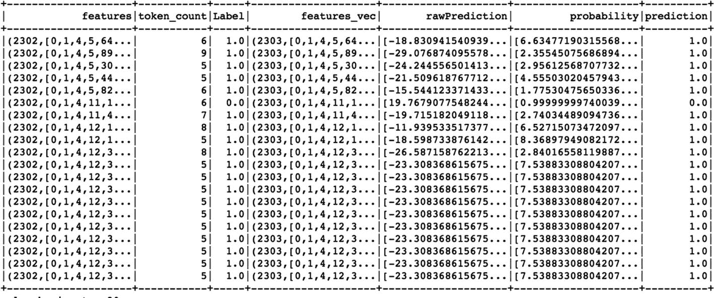

```py
[In]: from pyspark.ml.evaluation import BinaryClassificationEvaluator

[In]: true_postives = results[(results.Label == 1) & (results.prediction == 1)].count()
[In]: true_negatives = results[(results.Label == 0) & (results.prediction == 0)].count()
[In]: false_positives = results[(results.Label == 0) & (results.prediction == 1)].count()
[In]: false_negatives = results[(results.Label == 1) & (results.prediction == 0)].count()

```

该模型的性能似乎相当好，它能够很容易地区分正面和负面的评论。

```py
[In]: recall = float(true_postives)/(true_postives + false_negatives)
[In]:print(recall)
[Out]: 0.986021505376344

[In]: precision = float(true_postives) / (true_postives + false_positives)
[In]: print(precision)
[Out]: 0.9572025052192067

[In]: accuracy=float((true_postives+true_negatives) /(results.count()))
[In]: print(accuracy)
[Out]: 0.9677804295942721

```

## 序列嵌入

每天有数百万人访问商业网站，每个人都采取不同的步骤来寻找正确的信息/产品。然而，他们中的大多数人出于某种原因失望或沮丧地离开，很少有人能在网站中找到正确的页面。在这种情况下，很难确定潜在客户是否真的得到了他想要的信息。此外，这些观众的个人旅程不能相互比较，因为每个人都做了一套不同的活动。那么，我们怎样才能更多地了解这些旅程，并对这些游客进行相互比较呢？序列嵌入是一种强大的方式，它不仅为我们提供了灵活性来比较任何两个不同的观众在相似性方面的整个旅程，还可以预测他们转换的概率。序列嵌入本质上帮助我们摆脱使用传统特征来进行预测，并且不仅考虑用户活动的顺序，还考虑花费在每个独特页面上的平均时间，以转化为更健壮的特征；它还用于跨多个用例的监督机器学习(下一个可能的行动预测，转换与非转换，产品分类)。在序列嵌入等高级功能上使用传统的机器学习模型，我们可以在预测准确性方面取得巨大的成果，但真正的好处在于可视化所有这些用户旅程，并观察这些路径与理想路径有多么不同。

本章的这一部分将展开在 PySpark 中为每个用户的旅程创建序列嵌入的过程。

## 嵌入

到目前为止，我们已经看到使用计数矢量化、TF-IDF 和哈希矢量化等技术将文本数据表示成数字形式。然而，上述技术都没有考虑单词的语义或单词出现的上下文。嵌入在捕捉单词的上下文并以这样一种方式表示它们方面是独特的，即具有相似含义的单词用相似种类的嵌入来表示。有两种方法来计算嵌入。

1.  跳过克

2.  连续单词包(CBOW)

这两种方法给出的嵌入值只不过是神经网络中隐藏层的权重。根据需要，这些嵌入向量的大小可以是 100 或更大。word2vec 给出每个单词的嵌入值，而 doc2vec 给出整个句子的嵌入值。序列嵌入类似于 doc2vec，并且是出现在句子中的单词的单独嵌入的加权平均的结果。

让我们用一个样本数据集来说明我们如何从用户的在线零售之旅中创建序列嵌入。

```py
[In]: spark=SparkSession.builder.appName('seq_embedding').getOrCreate()
[In]:
df = spark.read.csv('embedding_dataset.csv',header=True,inferSchema=True)
[In]: df.count()
[Out]: 1096955

```

数据集中的记录总数接近一百万，并且有 10 万个唯一用户。还跟踪每个用户在每个网页上花费的时间以及用户是否购买该产品的最终状态。

```py
[In]: df.printSchema()
[Out]:
root
 |-- user_id: string (nullable = true)
 |-- page: string (nullable = true)
 |-- timestamp: timestamp (nullable = true)
 |-- visit_number: integer (nullable = true)
 |-- time_spent: double (nullable = true)
 |-- converted: integer (nullable = true)

[In]: df.select('user_id').distinct().count()
[Out]: 104087

[In]: df.groupBy('page').count().orderBy('count',ascending=False).show(10,False) 

[Out]:
+-------------+------+
|page         |count |
+-------------+------+
|product info |767131|
|homepage     |142456|
|added to cart|67087 |
|others       |39919 |
|offers       |32003 |
|buy          |24916 |
|reviews      |23443 |
+-------------+------+

[In]: df.select(['user_id','page','visit_number','time_spent','converted']).show(10,False)
[Out]:

```

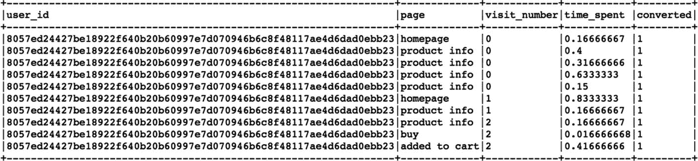

序列嵌入的整体思想是将用户在他或她的在线旅程中采取的一系列步骤转换成页面序列，该页面序列可用于计算嵌入分数。第一步是在用户的旅程中移除任何连续的重复页面。我们创建了一个额外的列来捕获用户的上一页。Window 是 spark 中的一个功能，它有助于将特定的逻辑应用于数据集中的单个或一组行。

```py
[In]:w = Window.partitionBy("user_id").orderBy('timestamp')
[In]: df = df.withColumn("previous_page", lag("page", 1, 'started').over(w))
[In]: df.select('user_id','timestamp','previous_page','page').show(10,False)
[Out]:

```

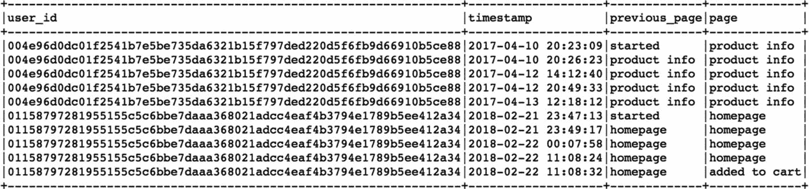

```py
[In]:
def indicator(page, prev_page):
    if page == prev_page:
        return 0
    else:
        return 1

[In]:page_udf = udf(indicator,IntegerType())
[In]: df = df.withColumn("indicator",page_udf(col('page'),col('previous_page'))) \
        .withColumn('indicator_cummulative',sum(col('indicator')).over(w))

```

现在，我们创建一个函数来检查当前页面是否与前一个页面相似，并在一个新的列指示器中指示相同的内容。指示器累积栏用于跟踪用户旅程中不同页面的数量。

```py
[In]: df.select('previous_page','page','indicator','indicator_cummulative').show(20,False)
[Out]:

```

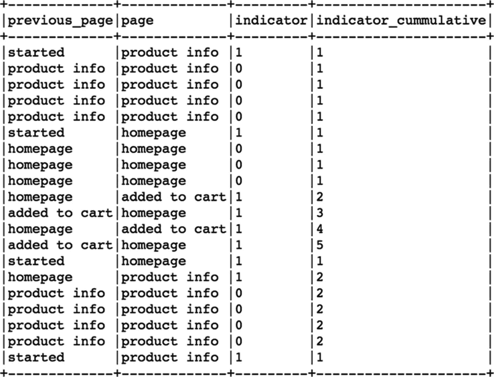

我们不断创建新的窗口对象来进一步划分数据，以便为每个用户构建序列。

```py
[In]: w2=Window.partitionBy(["user_id",'indicator_cummulative']).orderBy('timestamp')
[In]: df= df.withColumn('time_spent_cummulative',sum(col('time_spent')).over(w2))
[In]: df.select('timestamp','previous_page','page','indicator','indicator_cummulative','time_spent','time_spent_cummulative').show(20,False)

```

[Out]: 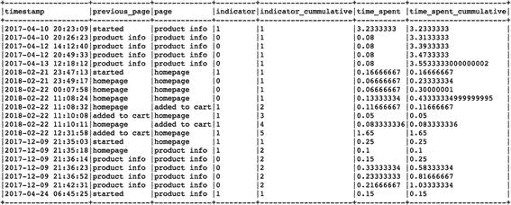

在下一阶段，我们计算在相似页面上花费的总时间，以便只保留一个记录来表示连续的页面。

```py
[In]: w3 = Window.partitionBy(["user_id",'indicator_cummulative']).orderBy(col('timestamp').desc())

[In]: df = df.withColumn('final_page',first('page').over(w3))\
     .withColumn('final_time_spent',first('time_spent_cummulative').over(w3))

[In]: df.select(['time_spent_cummulative','indicator_cummulative','page','final_page','final_time_spent']).show(10,False)

[Out]:

```

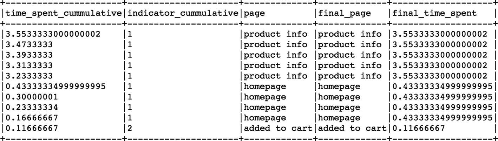

```py
[In]: aggregations=[]
[In]: aggregations.append(max(col('final_page')).alias('page_emb'))
[In]: aggregations.append(max(col('final_time_spent')).alias('time_spent_emb'))
[In]: aggregations.append(max(col('converted')).alias('converted_emb'))

[In]: df_embedding = df.select(['user_id','indicator_cummulative','final_page','final_time_spent','converted']).groupBy(['user_id','indicator_cummulative']).agg(*aggregations)

[In]: w4 = Window.partitionBy(["user_id"]).orderBy('indicator_cummulative')
[In]: w5 = Window.partitionBy(["user_id"]).orderBy(col('indicator_cummulative').desc())

```

最后，我们使用一个收集列表将用户旅程中的所有页面合并到一个列表中，并计算花费的时间。因此，我们以页面列表和花费时间列表的形式结束用户旅程。

```py
[In]:df_embedding = df_embedding.withColumn('journey_page', collect_list(col('page_emb')).over(w4))\
                         .withColumn('journey_time_temp', collect_list(col('time_spent_emb')).over(w4)) \
                         .withColumn('journey_page_final',first('journey_page').over(w5))\
                        .withColumn('journey_time_final',first('journey_time_temp').over(w5)) \
                        .select(['user_id','journey_page_final','journey_time_final','converted_emb'])

```

我们只继续独特的用户旅程。每个用户由一个单独的旅程和花费的时间向量表示。

```py
[In]: df_embedding = df_embedding.dropDuplicates()

[In]: df_embedding.count()
[Out]: 104087

[In]: df_embedding.select('user_id').distinct().count()
[Out]: 104087

[In]: df_embedding.select('user_id','journey_page_final','journey_time_final').show(10)
[Out]:

```

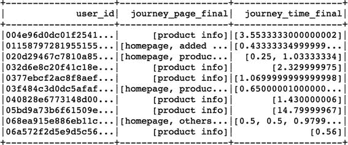

现在我们有了用户旅程和花费时间的列表，我们将这个数据帧转换成 Pandas 数据帧，并使用这些旅程序列构建一个 word2vec 模型。为了使用 word2vec，我们必须先安装一个 gensim 库。为了简单起见，我们使用 100 的嵌入大小。

```py
[In]: pd_df_emb0 = df_embedding.toPandas()
[In]: pd_df_embedding = pd_df_embedding.reset_index(drop=True)

[In]: !pip install gensim
[In]: from gensim.models import Word2Vec
[In]: EMBEDDING_SIZE = 100
[In]: model = Word2Vec(pd_df_embedding['journey_page_final'], size=EMBEDDING_SIZE)
[In]: print(model)
[Out]: Word2Vec(vocab=7, size=100, alpha=0.025)

```

正如我们所观察到的，词汇量为 7，因为我们只处理了 7 个页面类别。这些页面类别中的每一个现在都可以借助大小为 100 的嵌入向量来表示。

```py
[In]: page_categories = list(model.wv.vocab)
[In]: print(page_categories)
[Out]:
['product info', 'homepage', 'added to cart', 'others', 'reviews', 'offers', 'buy']

[In]: print(model['reviews'])
[Out]:

```

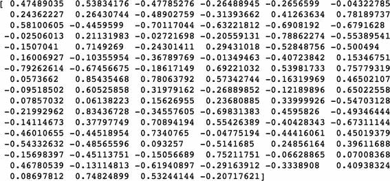

```py
[In]: model['offers'].shape
[Out]: (100,)

```

要创建嵌入矩阵，我们可以使用一个模型，并传递模型词汇表；这将产生大小为(7，100)的矩阵。)

```py
[In]: X = model[model.wv.vocab]
[In]: X.shape
[Out]: (7,100)

```

为了更好地理解这些页面类别之间的关系，我们可以使用降维技术(PCA)并在二维空间上绘制这七个页面嵌入。

```py
[In]: pca = PCA(n_components=2)
[In]: result = pca.fit_transform(X)

[In]: plt.figure(figsize=(10,10))
[In]: plt.scatter(result[:, 0], result[:, 1])

[In]: for i,page_category in enumerate(page_categories):
      plt.annotate(page_category,horizontalalignment='right', verticalalignment="top",xy=(result[i, 0], result[i, 1]))

[In]: plt.show()

```

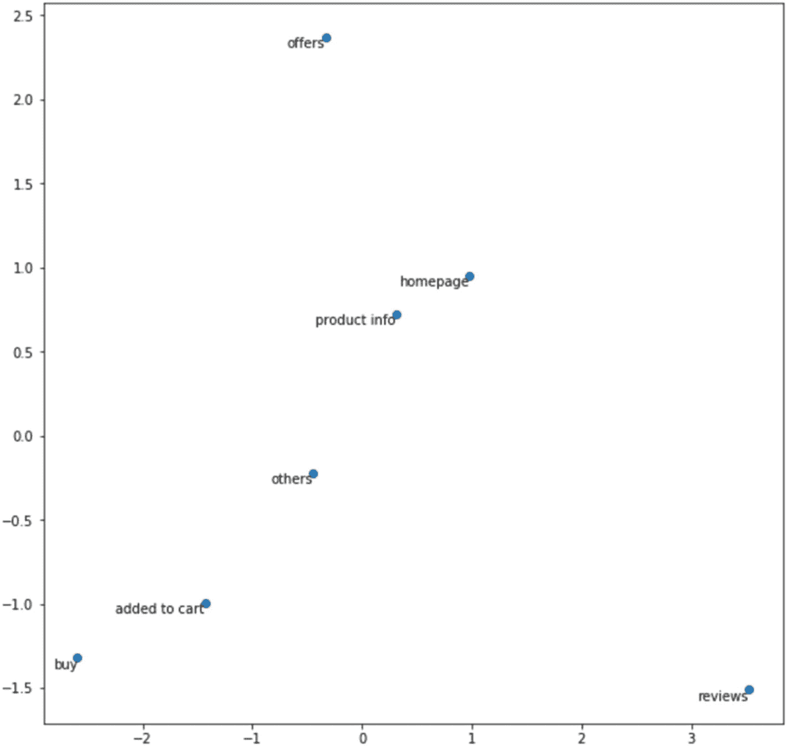

我们可以清楚地看到,“购买”和“添加到购物车”的嵌入在相似性方面彼此接近，而主页和产品信息也彼此接近。当涉及到通过嵌入表示时，提供和评论是完全分开的。这些单独的嵌入可以被组合并使用机器学习用于用户旅程比较和分类。

### 注意

这本书的 GitHub repo 上提供了完整的数据集和代码，在 Spark 2.3 和更高版本上执行得最好。

## 结论

在这一章中，我们熟悉了文本处理和为机器学习创建特征向量的步骤。我们还经历了从在线用户旅程数据创建序列嵌入的过程，以比较各种用户旅程。