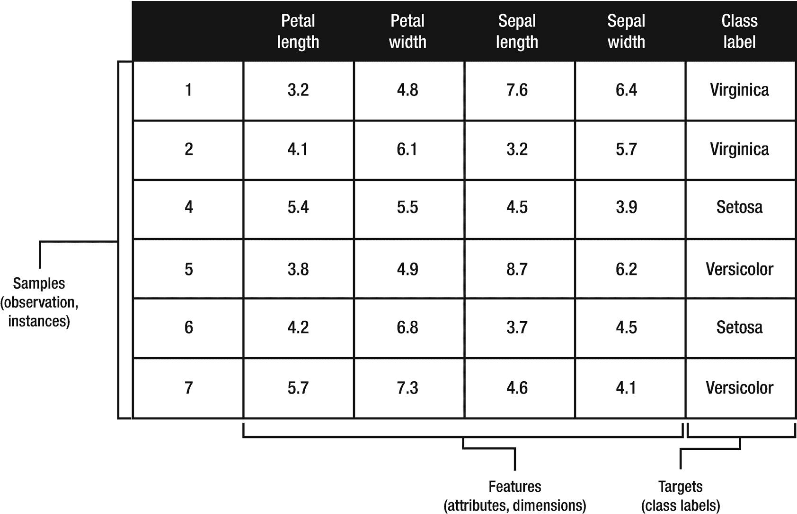
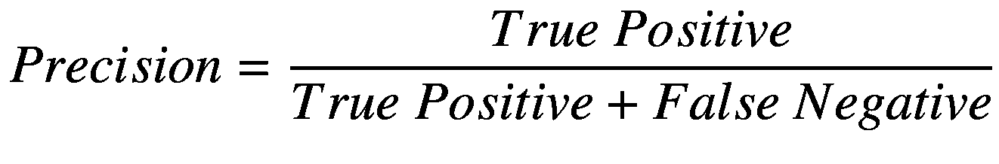

# 一、机器学习导论

> *我可以给你通常的论点。但事实是，发现的前景太甜了。*
> 
> —杰弗里·辛顿 我

机器学习(ML)是人工智能的一个子领域，即制造智能机器的科学和工程。 ii 人工智能的先驱之一亚瑟·塞缪尔(Arthur Samuel)将机器学习定义为“无需明确编程就能赋予计算机学习能力的研究领域。” iii 图 1-1 展示了人工智能、机器学习、深度学习之间的关系。人工智能(AI)包含其他领域，这意味着尽管所有的机器学习都是 AI，但并非所有的 AI 都是机器学习。人工智能的另一个分支，符号人工智能，是二十世纪大部分时间里占主导地位的人工智能研究范式。 iv 符号人工智能实现被称为专家系统或知识图，它们本质上是使用 if-then 语句通过演绎推理得出逻辑结论的规则引擎。你可以想象，符号人工智能受到几个关键的限制；其中最主要的是在规则引擎中定义规则后修改规则的复杂性。添加更多的规则增加了规则引擎中的知识，但是它不能改变现有的知识。 v 机器学习模型另一方面更加灵活。他们可以根据新数据接受再培训，以学习新知识或修改现有知识。象征性人工智能也涉及重大的人类干预。它依赖于人类的知识，需要人类在规则引擎中硬编码规则。另一方面，机器学习更加动态，从输入数据中学习和识别模式，以产生所需的输出。

图 1-1

AI、机器学习、深度学习的关系 vi

深度学习在 2000 年代中期的复兴将人们的注意力重新集中到人工智能和机器学习的连接主义方法上。深度学习的复兴、高速图形处理单元(GPU)的可用性、大数据的出现以及谷歌、脸书、亚马逊、微软和 IBM 等公司的投资创造了推动人工智能复兴的完美风暴。

## 人工智能和机器学习用例

在过去的十年里，机器学习取得了一系列惊人的进步。这些突破正在扰乱我们的日常生活，并对你能想到的几乎每一个垂直领域产生影响。这绝不是机器学习用例的详尽列表，但它表明了每个行业正在发生的许多创新。

### 零售

零售业是最早受益于机器学习的行业之一。多年来，在线购物网站一直依赖协作和基于内容的过滤算法来个性化购物体验。在线推荐和高度针对性的营销活动为零售商创造了数百万甚至数十亿的收入。或许是 ML 驱动的在线推荐和个性化的典型代表，亚马逊是最受欢迎(也是最成功)的实现机器学习好处的在线零售商。根据麦肯锡的一项研究，亚马逊网站 35%的收入来自其推荐引擎。 vii 零售的附加机器学习应用包括货架空间规划、货架图优化、目标营销、客户细分和需求预测。

### 运输

几乎每个主要的汽车制造商都在研究由深度神经网络驱动的人工智能自动驾驶汽车。这些车辆配备了支持 GPU 的计算机，每秒可以处理超过 100 万亿次运算，用于实时人工智能感知、导航和路径规划。运输和物流公司，如 UPS 和 FedEx，使用机器学习进行路线和燃料优化、车队监控、预防性维护、旅行时间估计和智能地理围栏。

### 金融服务

预测客户终身价值(CLV)、信用风险预测和欺诈检测是金融服务的一些关键机器学习用例。对冲基金和投资银行使用机器学习来分析 Twitter Firehose 的数据，以检测可能推动市场的推文。金融服务的其他常见机器学习用例包括预测下一个最佳行动、流失预测、情感分析和多渠道营销归因。

### 医疗保健和生物技术

医疗保健是人工智能和机器学习研究和应用的一个重要领域。医院和医疗保健初创企业正在使用人工智能和机器学习来帮助准确诊断威胁生命的疾病，如心脏病、癌症和结核病。人工智能驱动的药物发现以及成像和诊断是人工智能最具代表性的领域 viii 。人工智能还彻底改变了生物技术和基因组学研究的方式，导致了路径分析、微阵列分析、基因预测和功能注释方面的新创新。T5】IXT7】

### 制造业

具有前瞻性思维的制造商正在使用深度学习进行质量检查，以检测硬件产品上的裂纹、边缘不平和划痕等缺陷。多年来，制造业和工业工程师一直使用生存分析来预测重型设备的故障时间。人工智能机器人正在实现制造过程的自动化，与人类机器人相比，操作速度更快，精度更高，从而提高了生产率，降低了产品缺陷。物联网(IoT)的到来和传感器数据的丰富正在扩大该行业机器学习应用的数量。

### 政府

机器学习在政府中有着广泛的应用。例如，公共事业公司一直在使用机器学习来监控公用事业管道。异常检测技术有助于检测泄漏和管道破裂，这些泄漏和管道破裂会导致全市范围的服务中断和数百万美元的财产损失。机器学习还被用于实时水质监测，防止污染疾病，并有可能挽救生命。为了节约能源，公有能源公司通过确定用电量的高峰和低谷，使用机器学习来相应地调整能源输出。人工智能支持的网络安全是另一个快速发展的领域，也是一个重要的政府用例，尤其是在当今时代。

## 机器学习和数据

机器学习模型是使用算法和数据的组合来构建的。使用强大的算法至关重要，但同样重要(有些人可能会说更重要)的是用大量高质量的数据进行训练。一般来说，数据越多，机器学习的表现越好。2001 年，微软的研究人员 Michele Banko 和 Eric Brill 在他们颇具影响力的论文“扩展到非常非常大的自然语言消歧语料库”中首次提出了这个概念。谷歌的研究主管彼得·诺维格(Peter Norvig)在他的论文《数据的不合理有效性》中进一步推广了这一概念。 x 然而，比数量更重要的是质量。每个高质量的模型都是从高质量的特性开始的。这就是特征工程进入画面的地方。特征工程是将原始数据转化为高质量特征的过程。这通常是整个机器学习过程中最艰巨的部分，但也是最重要的部分。我将在本章后面更详细地讨论特征工程。但与此同时，让我们来看看一个典型的机器学习数据集。图 1-2 显示了虹膜数据集的子集。我将在整本书的一些例子中使用这个数据集。

图 1-2

机器学习数据集

### 观察

单行数据被称为观察值或实例。

#### 特征

特征是观察的属性。特征是用作模型输入的独立变量。在图 1-2 中，特征是花瓣长度、花瓣宽度、萼片长度和萼片宽度。

#### 类别标签

类别标签是数据集中的因变量。这是我们试图预测的事情。它是输出。在我们的例子中，我们试图预测鸢尾花的类型:Virginica、Setosa 和 Versicolor。

#### 模型

模型是一种具有预测能力的数学构造。它估计数据集中自变量和因变量之间的关系。Xi

## 机器学习方法

有不同类型的机器学习方法。决定使用哪一个很大程度上取决于你想要完成什么以及你所拥有的原始数据的种类。

### 监督学习

监督学习是一种使用训练数据集进行预测的机器学习任务。监督学习可以分为分类或回归。回归用于预测连续值，如“价格”、“温度”或“距离”，而分类用于预测类别，如“是”或“否”、“垃圾邮件”或“非垃圾邮件”，或者“恶性”或“良性”。

#### 分类

分类可能是最常见的监督机器学习任务。您很可能已经遇到过在没有意识到的情况下利用分类的应用程序。常见的使用案例包括医疗诊断、定向营销、垃圾邮件检测、信用风险预测和情感分析等。有三种分类任务:二进制、多类和多标签。

##### 二元分类

如果只有两个类别，则任务是二元或二项式分类。例如，当使用二进制分类算法进行垃圾邮件检测时，输出变量可以有两个类别，“垃圾邮件”或“非垃圾邮件”。对于检测癌症，类别可以是“恶性”或“良性”。对于有针对性的营销，预测某人购买诸如牛奶等物品的可能性，分类可以简单地是“是”或“否”。

##### 多类分类

多类或多项分类任务有三个或更多类别。例如，要预测天气状况，您可能有五个类别:“多雨”、“多云”、“晴天”、“下雪”和“刮风”。为了扩展我们的目标营销示例，多类别分类可用于预测客户是否更有可能购买全脂牛奶、低脂牛奶、低脂牛奶或脱脂牛奶。

##### 多标签分类

在多标签分类中，可以为每个观察值分配多个类别。相比之下，在多类别分类中，只能将一个类别分配给一个观察。使用我们的目标营销示例，多标签分类不仅用于预测客户是否更有可能购买牛奶，还用于预测其他商品，如饼干、黄油、热狗或面包。

#### 分类和回归算法

多年来已经开发了各种分类和回归算法。它们在方法、特征、复杂性、易用性、训练性能和预测准确性方面各不相同。我在下面的文字中描述了最受欢迎的。我在第三章中详细介绍了它们。

##### 支持向量机

支持向量机(SVM)是一种流行的算法，它通过寻找使两个类之间的间隔最大化的最佳超平面来工作，通过尽可能宽的间隙将数据点分成单独的类。最接近分类边界的数据点称为支持向量。

##### 逻辑回归

逻辑回归是预测概率的线性分类器。它使用逻辑(sigmoid)函数将其输出转换为可以映射到两个(二元)类的概率值。通过多项式逻辑回归(softmax)支持多类分类。 xii 当您的数据有明确的决策边界时，线性分类器(如逻辑回归)是合适的。

##### 奈伊夫拜厄斯

朴素贝叶斯是一种基于贝叶斯定理的简单多类线性分类算法。朴素贝叶斯之所以得名，是因为它天真地假设数据集中的要素是独立的，忽略了要素之间任何可能的相关性。现实世界的情况并非如此，朴素贝叶斯仍然表现良好，尤其是在小数据集或高维数据集上。像线性分类器一样，它在非线性分类问题上表现不佳。朴素贝叶斯是一种计算效率高且高度可伸缩的算法，只需要对数据集进行一次传递。对于使用大型数据集的分类任务，这是一个很好的基线模型。它的工作原理是在给定一组特征的情况下，找出一个点属于某个类的概率。

##### 多层感知器

多层感知器是一个前馈人工网络，由几个完全连接的节点层组成。输入图层中的节点对应于输入数据集。中间层中的节点使用逻辑(sigmoid)函数，而最终输出层中的节点使用 softmax 函数来支持多类分类。输出层中的节点数量必须与类的数量相匹配。XIIIT3】

##### 决策树

决策树通过学习从输入变量推断出的决策规则来预测输出变量的值。从视觉上看，决策树看起来就像一棵倒置的树，根节点在顶部。每个内部节点都代表对一个属性的测试。叶节点代表一个类标签，而单个分支代表一个测试的结果。决策树很容易解释。与像逻辑回归这样的线性模型相比，决策树不需要特征缩放。它能够处理缺失的特征，并处理连续和分类特征。 xiv 一次性编码分类特征 xv 在使用决策树和基于树的集成时不是必需的，事实上是不鼓励的。独热编码创建了不平衡的树，并且要求树生长得非常深以实现良好的预测性能。对于高基数分类特征来说尤其如此。不利的一面是，决策树对数据中的噪声很敏感，有过度拟合的倾向。由于这种限制，决策树本身很少在现实生产环境中使用。如今，决策树是更强大的集成算法的基础模型，如随机森林和梯度提升树。

##### 随机森林

随机森林是一种集成算法，它使用一组决策树进行分类和回归。它使用一种叫做*bagging*(bootstrap aggregation)的方法来减少方差，同时保持低偏差。Bagging 从训练数据的子集训练单独的树。除了装袋，兰登森林还采用了另一种叫做*的方法装袋*。与 bagging(使用观测值的子集)相反，特征 bagging 使用特征(列)的子集。特征装袋旨在减少决策树之间的相关性。如果没有特征打包，单个树将会非常相似，尤其是在只有几个主要特征的情况下。对于分类，单个树的输出或模式的多数投票成为模型的最终预测。对于回归，单个树的输出的平均值成为最终输出(图 [3-3](https://doi.org/10.1007/978-1-4842-5669-5_3%2523Fig3) )。Spark 并行训练几棵树，因为每棵树都是在随机森林中独立训练的。

##### 梯度提升树

梯度推进树(GBT)是另一种类似于随机森林的基于树的集成算法。gbt 使用一种称为 *boosting to* 的技术从弱学习者(浅树)中创建强学习者。GBTs 按顺序训练一组决策树 xvi ，每一棵后继的树减少前一棵的误差。这是通过使用前一个模型的残差来拟合下一个模型 xvii 来完成的。该残差校正过程 xviii 被执行设定的迭代次数，迭代次数由交叉验证确定，直到残差被完全最小化。

##### XGBoost

XGBoost(极限梯度提升)是目前可用的最好的梯度提升树实现之一。XGBoost 于 2014 年 3 月 27 日由陈天琦发布，作为一个研究项目，它已经成为分类和回归的主流机器学习算法。XGBoost 是使用梯度推进的一般原则设计的，将弱学习者组合成强学习者。但是，虽然梯度提升树是按顺序构建的——慢慢地从数据中学习，以在后续迭代中改进其预测，但 XGBoost 是并行构建树的。

XGBoost 通过其内置的正则化来控制模型复杂性和减少过拟合，从而产生更好的预测性能。为连续特征寻找最佳分割点时，XGBoost 使用近似算法来寻找分割点。 xix 近似分裂法使用离散箱来桶化连续特征，显著加快模型训练。XGBoost 包括另一种使用基于直方图的算法的树生长方法，该方法提供了一种将连续要素分入离散箱的更有效的方法。但是，虽然近似方法每次迭代都创建一组新的面元，但是基于直方图的方法在多次迭代中重复使用面元。这种方法允许使用近似方法无法实现的额外优化，例如缓存二进制文件以及父直方图和兄弟直方图相减 xx 的能力。为了优化排序操作，XGBoost 将排序后的数据存储在内存中的块单元中。排序块可以由并行 CPU 核心高效地分配和执行。XGBoost 可以通过其加权分位数草图算法有效地处理加权数据，可以有效地处理稀疏数据，支持缓存，并通过为大型数据集利用磁盘空间来支持核外计算，因此数据不必放在内存中。XGBoost 不是核心 Spark MLlib 库的一部分，但它作为一个外部包提供。

##### 莱特格姆

多年来，XGBoost 一直是每个人最喜欢的分类和回归算法。最近，LightGBM 成为了王位的新挑战者。它是一个相对较新的基于树的梯度提升变体，类似于 XGBoost。LightGBM 于 2016 年 10 月 17 日发布，是微软分布式机器学习工具包(DMTK)项目的一部分。它被设计成快速和分布式的，导致更快的训练速度和更低的内存使用。它支持 GPU 和并行学习以及处理大型数据集的能力。

在几个基准测试和公共数据集上的实验中，LightGBM 显示出比 XGBoost 更快的速度和更好的准确性。它比 XGBoost 有几个优点。LightGBM 利用直方图将连续特征分成离散的箱。这为 LightGBM 提供了优于 XGBoost(默认情况下，XGBoost 使用基于预排序的算法进行树学习)的几个性能优势，例如减少了内存使用、减少了计算每次分割的增益的成本，以及减少了并行学习的通信成本。LightGBM 通过对其兄弟节点和父节点执行直方图减法来计算节点的直方图，从而实现了额外的性能提升。在线基准测试显示，在某些任务中，LightGBM 比 XGBoost(不含宁滨)快 11 到 15 倍。 xxi LightGBM 通过逐叶生长(最佳优先)的方式，一般在精度上优于 XGBoost。有两种主要的策略来训练决策树，级别方式和叶方式。对于大多数基于树的集成(包括 XGBoost)，逐层树生长是生长决策树的传统方式。LightGBM 引入了逐叶增长策略。与水平方向生长相比，叶方向生长通常收敛更快 xxii 并实现更低的损失。 xxiii 和 XGBoost 一样，LightGBM 不是核心 Spark MLlib 库的一部分，但它作为一个外部包提供。LightGBM 的大部分特性最近都移植到了 XGBoost 上。我将在第三章详细讨论这两种算法。

#### 回归

回归是一种用于预测连续数值的监督机器学习任务。举几个例子来说，流行的用例包括销售和需求预测、预测股票、房屋或商品价格以及天气预报。决策树、随机森林、梯度提升树、XGBoost 和 LightGBM 也可以用于回归。我将在第三章更详细地讨论回归。

##### 线性回归

线性回归用于检查一个或多个自变量和因变量之间的线性关系。对单个自变量和单个连续因变量之间关系的分析称为简单线性回归。多元回归是简单线性回归的扩展，用于根据多个自变量预测因变量的值。

##### 生存回归

生存回归，也称为死亡时间分析或失败时间分析，用于预测特定事件将要发生的时间。生存回归与线性回归的主要区别在于其处理删失的能力，删失是一种缺失数据问题，事件发生的时间未知。

### 无监督学习

无监督学习是一种机器学习任务，它在没有标记响应的帮助下发现数据集中隐藏的模式和结构。当您只能访问输入数据，而训练数据不可用或难以获得时，无监督学习是理想的选择。常见的方法包括聚类、主题建模、异常检测、推荐和主成分分析。

#### 使聚集

聚类是一种无监督的机器学习任务，用于对具有某些相似性的未标记观察值进行分组。流行的聚类用例包括客户细分、欺诈分析和异常检测。在训练数据缺乏或不可用的情况下，聚类也经常用于为分类器生成训练数据。

##### k 均值

K-Means 是最流行的无监督聚类学习算法之一。K-Means 的工作原理是随机分配质心作为每个聚类的起点。该算法基于欧几里德距离迭代地将每个数据点分配到最近的质心。然后，它通过计算属于该聚类的所有点的平均值来计算每个聚类的新质心。当达到预定义的迭代次数，或者每个数据点都被分配到其最近的质心，并且不再有可以执行的重新分配时，该算法停止迭代。

#### 主题建模

主题模型自动导出一组文档中的主题。这些主题可用于基于内容的推荐、文档分类、维度缩减和特征化。

##### 潜在狄利克雷分配

潜在狄利克雷分配(LDA)是由戴维·布雷、吴恩达和迈克尔·乔丹在 2003 年提出的，尽管乔纳森·k·普里查德、马修·斯蒂芬斯和彼得·唐纳利在 2000 年也提出了一种用于群体遗传学的类似算法。应用于机器学习的 LDA 是基于图形模型的，并且是第一个包含基于 GraphX 构建的 Spark MLlib 的算法。潜在狄利克雷分配广泛用于主题建模。

#### 异常检测

异常或异常值检测可识别出明显偏离大多数数据集的罕见观察值。它经常用于发现欺诈性金融交易、识别网络安全威胁或执行预测性维护，仅举几个使用案例。

##### 隔离森林

隔离森林是一种基于树的集成算法，用于异常检测，该算法是由刘飞东尼、婷和开发的。 xxiv 与大多数异常检测技术不同，隔离森林试图显式检测实际异常值，而不是识别正常数据点。隔离林的运行基于这样一个事实，即数据集中通常存在少量异常值，因此易于进行隔离。 xxv 从正常数据点中分离异常值是有效的，因为它需要的条件较少。相比之下，隔离正常数据点通常会涉及更多条件。与其他基于树的集合类似，隔离林建立在一组称为*隔离树*的决策树上，每棵树都有整个数据集的一个子集。异常分数被计算为森林中树木的平均异常分数。异常分值来自分割数据点所需的条件数量。接近 1 的异常分数表示异常，而小于 0.5 的分数表示非异常观察。

##### 单类支持向量机

支持向量机(SVM)通过使用最佳超平面，以尽可能宽的间隔将数据点划分为单独的类别，从而对数据进行分类。在一类 SVM 中，模型根据只有一个“正常”类的数据进行训练。与正常示例不同的数据点被视为异常。

#### 降维

当数据集中有大量要素时，降维至关重要。例如，基因组学和工业分析领域的机器学习用例通常涉及数千甚至数百万个特征。高维数使得模型更加复杂，增加了过度拟合的机会。在某一点上添加更多的特征实际上会降低模型的性能。此外，对高维数据的训练需要大量的计算资源。这些被统称为维度的诅咒。降维技术旨在克服维数灾难。

##### 主成分分析

主成分分析(PCA)是一种无监督的机器学习技术，用于降低特征空间的维度。它检测要素之间的相关性，并生成数量减少的线性不相关要素，同时保留原始数据集中的大部分方差。这些更紧凑、线性不相关的特征被称为*主成分*。主成分按其解释方差的降序排列。其他降维技术包括奇异值分解(SVD)和线性判别分析(LDA)。

#### 推荐

提供个性化推荐是机器学习最流行的应用之一。几乎每个主要零售商，如亚马逊、阿里巴巴、沃尔玛和塔吉特，都根据顾客行为提供某种个性化推荐。网飞、Hulu 和 Spotify 等流媒体服务根据用户的口味和偏好提供电影或音乐推荐。协作过滤、基于内容的过滤和关联规则学习(用于购物篮分析)是构建推荐系统最流行的方法。Spark MLlib 支持用于协作过滤的交替最小二乘法(ALS ),以及用于购物篮分析的 FP-Growth 和 PrefixSpan。

### 半监督学习

在某些情况下，访问带标签的数据既费钱又费时。在标记响应稀少的情况下，半监督学习结合监督和非监督学习技术来进行预测。在半监督学习中，利用未标记数据来扩充标记数据以提高模型精度。

### 强化学习

强化学习试图通过试错来学习，以确定哪种行为提供了最大的回报。强化学习有三个组成部分:代理(决策者或学习者)、环境(代理与之交互的内容)和动作(代理可以执行的内容)。 xxvi 这种类型的学习经常用于游戏、导航和机器人。

## 深度学习

深度学习是机器学习和人工智能的一个子领域，使用深度、多层人工神经网络。它促成了人工智能领域最近的许多突破。虽然深度学习可以用于更平凡的分类任务，但当应用于更复杂的问题时，如医疗诊断、面部识别、自动驾驶汽车、欺诈分析和智能语音控制助理，它的真正力量会大放异彩。 xxvii 在某些领域，深度学习已经让计算机能够匹配甚至超越人类的能力。

## 神经网络

神经网络是一类算法，其操作类似于人脑的互连神经元。神经网络包含由互连节点组成的多层。通常有一个输入层、一个或多个隐藏层和一个输出层。数据经由输入层通过神经网络。隐藏层通过加权连接网络处理数据。隐藏层中的节点为输入分配权重，并将其与一组系数组合。数据通过一个节点的激活函数，该函数决定了层的输出。最后，数据到达输出层，输出层产生神经网络的最终输出。 xxviii 具有几个隐含层的神经网络称为“深度”神经网络。层次越多，网络就越深，通常网络越深，学习就变得越复杂，它能解决的问题也越复杂。

## 卷积神经网络

卷积神经网络(简称为 convnet 或 CNN)是一种特别擅长分析图像的神经网络(尽管它们也可以应用于音频和文本数据)。卷积神经网络层中的神经元以三维方式排列:高度、宽度和深度。CNN 使用卷积层来学习其输入特征空间(图像)中的局部模式，例如纹理和边缘。相反，全连接(密集)层学习全局模式。 xxix 卷积层中的神经元仅连接到其之前层的一小部分区域，而不是像密集层那样连接到所有神经元。密集层的完全连接结构会导致大量的参数，这是低效的，并可能很快导致过度拟合。 xxx 我在第七章更详细地介绍了深度学习和深度卷积神经网络。

## 特征工程

特征工程是转换数据以创建可用于训练机器学习模型的特征的过程。通常，原始数据需要通过多种数据准备和提取技术进行转换。例如，对于非常大的数据集，可能需要降维。可能需要从其他要素创建新要素。基于距离的算法需要特征缩放。当分类特征被一键编码时，一些算法执行得更好。文本数据通常需要标记化和特征矢量化。将原始数据转换为特征后，对其进行评估，并选择最具预测能力的特征。

特征工程是机器学习的一个重要方面。几乎在每一个机器学习的努力中，如果要成功，生成高度相关的特征是不言自明的。不幸的是，特征工程是一项复杂而耗时的任务，通常需要领域专业知识。这是一个反复的过程，包括集思广益的特征，创建它们并研究它们对模型准确性的影响。事实上，根据福布斯的一项调查，典型的数据科学家将大部分时间用于准备数据(图 1-3 )。T3】XXXIT5】

图 1-3

数据准备约占数据科学家工作的 80%

特征工程任务可以分为几类:特征选择、特征重要性、特征提取和特征构造。XXXIIT3】

### 特征选择

特征选择是识别重要特征和消除不相关或冗余特征的重要预处理步骤。它提高了预测性能和模型训练效率，并降低了维数。必须移除不相关的特征，因为它们会对模型的准确性产生负面影响，并降低模型训练的速度。某些特征可能没有任何预测能力，或者它们可能与其他特征是冗余的。但是我们如何确定这些特征是否相关呢？领域知识至关重要。例如，如果您正在建立一个模型来预测贷款违约的概率，它有助于了解在量化信用风险时需要考虑哪些因素。你可以从借款人的债务收入比开始。还有其他借款特定的因素要考虑，如借款人的信用评分，就业时间，就业职称和婚姻状况。经济增长等整个市场的考虑也可能很重要。人口统计学和心理学信息也应该被考虑。一旦你有了一个特性列表，有几种方法可以客观地确定它们的重要性。有多种特征选择方法可帮助您为模型选择正确的特征。XXXIIIT3】

#### 过滤方法

过滤方法使用统计技术(如卡方检验、相关系数和信息增益)为每个特征分配等级。

#### 包装方法

包装方法使用特征的子集来训练模型。然后，您可以根据模型的性能添加或删除特征。包装器方法的常见示例有递归特征消除、向后消除和向前选择。

#### 嵌入式方法

嵌入式方法结合了过滤器和包装器方法使用的技术。流行的例子包括套索和岭回归、正则化树和随机多项式 logit。XXXIVT3】

### 特征重要性

基于树的集成(如 Random Forest、XGBoost 和 LightGBM)提供了一种基于为每个特征计算的特征重要性分数的特征选择方法。分数越高，该特性对提高模型准确性越重要。随机森林中的特征重要性也称为基于基尼系数的重要性或杂质平均减少(MDI)。随机森林的一些实现利用不同的方法来计算特征重要性，这种方法被称为基于精度的重要性或平均精度下降(MDA)。 xxxv 基于准确度的重要性是基于特征被随机置换时预测准确度的降低来计算的。我将在第三章中详细讨论随机森林、XGBoost 和 LightGBM 中的特性重要性。

相关系数是特征选择方法的基本形式。相关系数代表两个变量之间线性关系的强度。对于线性问题，您可以使用相关性来选择相关要素(要素类相关性)和识别冗余要素(要素内相关性)。

### 特征抽出

当数据集中有大量要素时，要素提取至关重要。例如，基因组学和工业分析领域的机器学习用例通常涉及数千甚至数百万个特征。高维数使得模型更加复杂，增加了过度拟合的机会。此外，对高维数据的训练需要大量的计算资源。特征提取通常涉及使用降维技术。主成分分析(PCA)、线性判别分析(LDA)和奇异值分解(SVD)是一些最流行的降维算法，也用于特征提取。

### 特征构造

为了提高模型的准确性，有时需要根据现有要素构建新要素。有几种方法可以做到这一点。您可以组合或聚合要素。在某些情况下，您可能想要拆分它们。例如，您的模型可能受益于将大多数事务数据中常见的时间戳属性拆分成几个更细粒度的属性:秒、分钟、小时、日、月和年。然后，您可能希望使用这些属性来构造更多的特性，比如 dayofweek、weekofmonth、monthofyear 等等。特征构造既是艺术，又是科学，是特征工程中最困难和最耗时的方面之一。精通要素构造通常是经验丰富的数据科学家与新手之间的区别。

## 模型评估

在分类中，每个数据点都有一个已知的标签和一个模型生成的预测类。通过比较每个数据点的已知标注和预测类别，结果可分为四类:预测类别为正且标注为正的真阳性(TP );预测类别为负且标注为负的真阴性(TN );预测类别为正但标注为负的假阳性(FP );预测类别为负且标注为正的假阴性(FN)。这四个值构成了大多数分类任务评估指标的基础。它们经常出现在一个叫做混淆矩阵的表格中(表格 1-1 )。

表 1-1

混淆矩阵

### 准确

准确度是分类模型的评估标准。它被定义为正确预测数除以预测总数。

T2】

在数据集不平衡的情况下，精确度不是理想的衡量标准。为了举例说明，考虑具有 90 个阴性和 10 个阳性样本的假设分类任务；将所有分类为负面给出 0.90 的准确度分数。精度和召回率是评估用类不平衡数据训练的模型的更好的度量。

### 精确

精确度被定义为真阳性的数量除以真阳性的数量加上假阳性的数量。精度显示了当模型的预测为正时，模型正确的频率。例如，如果您的模型预测了 100 个癌症发生，但其中 10 个是不正确的预测，则您的模型的精确度为 90%。在误报成本很高的情况下，精确度是一个很好的度量标准。

T2】

### 回忆

召回是一个很好的衡量标准，可以用在假阴性成本很高的情况下。召回被定义为真阳性的数量除以真阳性的数量加上假阴性的数量。

T2】

### F1 度量

F1 测量值或 F1 分数是精确度和召回率的调和平均值或加权平均值。这是评估多类分类器的一个常见性能指标。当存在不均匀的阶级分布时，这也是一个很好的衡量标准。F1 成绩最好的是 1，最差的是 0。一个好的 F1 测量意味着你有很低的假阴性和假阳性。F1 测度定义如下:

### 受试者工作特性下的面积(AUROC)

接受者操作特征下的面积(AUROC)是用于评估二元分类器的常见性能度量。受试者工作特性(ROC)是绘制真阳性率与假阳性率的图表。曲线下面积(AUC)是 ROC 曲线下的面积。AUC 可以解释为模型对随机正例的排序高于随机负例的概率。 xxxvi 曲线下面积越大(AUROC 越接近 1.0)，模型表现越好。AUROC 为 0.5 的模型是无用的，因为它的预测准确性与随机猜测一样好。

## 过度拟合和欠拟合

模型的糟糕表现是由过度拟合或拟合不足造成的。过度拟合是指模型过于拟合训练数据。过度拟合的模型对训练数据表现良好，但对新的、看不见的数据表现不佳。过度拟合的反义词是拟合不足。对于欠拟合，模型过于简单，并且没有学习训练数据集中的相关模式，这是因为模型过于规则或者需要训练更长时间。模型很好地适应新的、看不见的数据的能力被称为泛化。这是每个模型调整练习的目标。防止过度拟合的几种既定方法包括使用更多数据或特征子集、交叉验证、放弃、修剪、提前停止和正则化。 xxxvii 对于深度学习来说，数据增强是一种常见的正则化形式。为了减少欠拟合，建议添加更多相关特征。对于深度学习，可以考虑在一层中增加更多的节点，或者在神经网络中增加更多的层，以增加模型的容量。T5】xxxviiiT7】

## 型号选择

模型选择包括评估拟合的机器学习模型，并通过尝试用用户指定的超参数组合拟合底层估计器来输出最佳模型。使用 Spark MLlib，通过 CrossValidator 和 TrainValidationSplit 估计器执行模型选择。CrossValidator 为超参数调整和模型选择执行 k 重交叉验证和网格搜索。它将数据集分成一组随机的、不重叠的分区褶皱，用作训练和测试数据集。例如，如果 k=3 折，k 折交叉验证将生成 3 个训练和测试数据集对(每个折仅用作测试数据集一次)，每个数据集对使用 2/3 用于训练数据，1/3 用于测试。XXXIXTrainValidationSplit 是超参数调优的另一个估计器。与 k-fold 交叉验证(这是一种昂贵的操作)相比，TrainValidationSplit 只对每个参数组合评估一次，而不是 k 次。

## 摘要

这一章是机器学习的快速介绍。为了更彻底的治疗，我建议*统计学习的元素，第二版。、特雷弗·哈斯蒂等人的*(施普林格，2016 年)和加雷斯·詹姆斯等人的*统计学习导论*(施普林格，2013 年)。关于深度学习的介绍，我推荐伊恩·古德菲勒等人的*深度学习*(麻省理工出版社，2016)。虽然机器学习已经存在很长时间了，但使用大数据来训练机器学习模型是最近才发展起来的。作为最受欢迎的大数据框架，Spark 的独特定位是成为构建大规模企业级机器学习应用的卓越平台。让我们在下一章深入探讨 Spark 和 Spark MLlib。

## 参考

1.  raffi khatchadourian《DOOMSDAY 发明》，[纽约人。com](http://newyorker.com) ，2015 年， [`www.newyorker.com/magazine/2015/11/23/doomsday-invention-artificial-intelligence-nick-bostrom`](https://www.newyorker.com/magazine/2015/11/23/doomsday-invention-artificial-intelligence-nick-bostrom)

2.  约翰·麦卡锡；“什么是人工智能？”，stanford.edu，2007， [`www-formal.stanford.edu/jmc/whatisai/node1.html`](https://www-formal.stanford.edu/jmc/whatisai/node1.html)

3.  克里斯·尼科尔森；《人工智能(AI) vs 机器学习 vs 深度学习》，skimind.ai，2019， [`https://skymind.ai/wiki/ai-vs-machine-learning-vs-deep-learning`](https://skymind.ai/wiki/ai-vs-machine-learning-vs-deep-learning)

4.  玛尔塔·加内洛和默里·沙纳汉；《用符号化人工智能调和深度学习:表示对象和关系》，sciencedirect.com，2019， [`www.sciencedirect.com/science/article/pii/S2352154618301943`](https://www.sciencedirect.com/science/article/pii/S2352154618301943)

5.  克里斯·尼科尔森；“符号推理(Symbolic AI)和机器学习”；skymind.ai，2019， [`https://skymind.ai/wiki/symbolic-reasoning`](https://skymind.ai/wiki/symbolic-reasoning)

6.  迈克尔·科普兰；“人工智能、机器学习、深度学习有什么区别？”，nvidia.com，2016， [`https://blogs.nvidia.com/blog/2016/07/29/whats-difference-artificial-intelligence-machine-learning-deep-learning-ai/`](https://blogs.nvidia.com/blog/2016/07/29/whats-difference-artificial-intelligence-machine-learning-deep-learning-ai/)

7.  伊恩·麦肯齐等人；“零售商如何才能跟上消费者”，mckinsey.com，2013， [`www.mckinsey.com/industries/retail/our-insights/how-retailers-can-keep-up-with-consumers`](https://www.mckinsey.com/industries/retail/our-insights/how-retailers-can-keep-up-with-consumers)

8.  CB 洞察；“从药物 R&D 到诊断学:医疗保健领域的 90+人工智能创业公司”，cbinsights.com，2019， [`www.cbinsights.com/research/artificial-intelligence-startups-healthcare/`](https://www.cbinsights.com/research/artificial-intelligence-startups-healthcare/)

9.  Ragothaman Yennamali《机器学习在生物学中的应用》，kolabtree.com，2019， [`www.kolabtree.com/blog/applications-of-machine-learning-in-biology/`](https://www.kolabtree.com/blog/applications-of-machine-learning-in-biology/)

10.  泽维尔·阿马特里安；《在机器学习中，什么更好:更多的数据还是更好的算法》，kdnuggets.com，2015， [`www.kdnuggets.com/2015/06/machine-learning-more-data-better-algorithms.html`](https://www.kdnuggets.com/2015/06/machine-learning-more-data-better-algorithms.html)

11.  穆罕默德·古勒；“借助 Spark 进行大数据分析”，2015 年出版

12.  阿帕奇 Spark《多项逻辑回归》，spark.apache.org，2019， [`https://spark.apache.org/docs/latest/ml-classification-regression.html#multinomial-logistic-regression`](https://spark.apache.org/docs/latest/ml-classification-regression.html%2523multinomial-logistic-regression)

13.  阿帕奇 Spark《多层感知器分类器》，spark.apache.org，2019， [`https://spark.apache.org/docs/latest/ml-classification-regression.html#multilayer-perceptron-classifier`](https://spark.apache.org/docs/latest/ml-classification-regression.html%2523multilayer-perceptron-classifier)

14.  分析 Vidhya 内容团队；《从零开始的基于树的建模完整教程(用 R & Python 编写)》，AnalyticsVidhya.com，2016， [`www.analyticsvidhya.com/blog/2016/04/complete-tutorial-tree-based-modeling-scratch-in-python/#one`](https://www.analyticsvidhya.com/blog/2016/04/complete-tutorial-tree-based-modeling-scratch-in-python/%2523one)

15.  LightGBM《分类特征的最优分割》，lightgbm.readthedocs.io，2019， [`https://lightgbm.readthedocs.io/en/latest/Features.html`](https://lightgbm.readthedocs.io/en/latest/Features.html)

16.  约瑟夫·布拉德利和马尼什·阿姆德；《MLlib 中的随机森林与助推》，Databricks，2015， [`https://databricks.com/blog/2015/01/21/random-forests-and-boosting-in-mllib.html`](https://databricks.com/blog/2015/01/21/random-forests-and-boosting-in-mllib.html)

17.  分析 Vidhya 内容团队；《理解 XGBoost 背后数学的端到端指南》，analyticsvidhya.com，2018， [`www.analyticsvidhya.com/blog/2018/09/an-end-to-end-guide-to-understand-the-math-behind-xgboost/`](https://www.analyticsvidhya.com/blog/2018/09/an-end-to-end-guide-to-understand-the-math-behind-xgboost/)

18.  本·戈尔曼；“一位 Kaggle 大师解释渐变增强，”Kaggle.com，2017， [`http://blog.kaggle.com/2017/01/23/a-kaggle-master-explains-gradient-boosting/`](http://blog.kaggle.com/2017/01/23/a-kaggle-master-explains-gradient-boosting/)

19.  莉娜·肖；《XGBoost:简明技术概述》，KDNuggets，2017， [`www.kdnuggets.com/2017/10/xgboost-concise-technical-overview.html`](https://www.kdnuggets.com/2017/10/xgboost-concise-technical-overview.html)

20.  Philip Hyunsu Cho“快速直方图优化生长器，8 到 10 倍加速”，DMLC，2017， [`https://github.com/dmlc/xgboost/issues/1950`](https://github.com/dmlc/xgboost/issues/1950)

21.  Laurae"基准测试 light GBM:light GBM 与 xgboost 相比有多快？"，medium.com，2017 年

    [T2`https://medium.com/implodinggradients/benchmarking-lightgbm-how-fast-is-lightgbm-vs-xgboost-15d224568031`](https://medium.com/implodinggradients/benchmarking-lightgbm-how-fast-is-lightgbm-vs-xgboost-15d224568031)

22.  LightGBM《在速度和内存使用上的优化》，lightgbm.readthedocs.io，2019， [`https://lightgbm.readthedocs.io/en/latest/Features.html`](https://lightgbm.readthedocs.io/en/latest/Features.html)

23.  大卫·马克思；“决策树:逐叶(最佳优先)和逐级树遍历”，stackexchange.com，2018， [`https://datascience.stackexchange.com/questions/26699/decision-trees-leaf-wise-best-first-and-level-wise-tree-traverse`](https://datascience.stackexchange.com/questions/26699/decision-trees-leaf-wise-best-first-and-level-wise-tree-traverse)

24.  费托尼刘，婷，-周华；《隔离森林》，acm.org，2008， [`https://dl.acm.org/citation.cfm?id=1511387`](https://dl.acm.org/citation.cfm%253Fid%253D1511387)

25.  亚历杭德罗·科雷亚·巴恩森；“利用隔离森林进行异常检测的好处”，easysol.net，2016， [`https://blog.easysol.net/using-isolation-forests-anamoly-detection/`](https://blog.easysol.net/using-isolation-forests-anamoly-detection/)

26.  SAS《机器学习》，sas.com，2019， [`www.sas.com/en_us/insights/analytics/machine-learning.html`](https://www.sas.com/en_us/insights/analytics/machine-learning.html)

27.  英伟达；《深度学习》，developer.nvidia.com，2019， [`https://developer.nvidia.com/deep-learning`](https://developer.nvidia.com/deep-learning)

28.  SAS《神经网络如何工作》，sas.com，2019， [`www.sas.com/en_us/insights/analytics/neural-networks.html`](https://www.sas.com/en_us/insights/analytics/neural-networks.html)

29.  弗朗索瓦·乔莱；“计算机视觉的深度学习”，2018，用 Python 进行深度学习

30.  安德烈·卡帕西；《卷积神经网络(CNN/conv nets)》，github.io，2019， [`http://cs231n.github.io/convolutional-networks/`](http://cs231n.github.io/convolutional-networks/)

31.  吉尔出版社；“清洗大数据:最耗时、最不愉快的数据科学任务”，调查称，“forbes.com，2016， [`www.forbes.com/sites/gilpress/2016/03/23/data-preparation-most-time-consuming-least-enjoyable-data-science-task-survey-says/#680347536f63`](https://www.forbes.com/sites/gilpress/2016/03/23/data-preparation-most-time-consuming-least-enjoyable-data-science-task-survey-says/%2523680347536f63)

32.  杰森·布朗利；“发现特征工程，如何工程化特征，如何擅长”，machinelearningmastery.com，2014， [`https://machinelearningmastery.com/discover-feature-engineering-how-to-engineer-features-and-how-to-get-good-at-it/`](https://machinelearningmastery.com/discover-feature-engineering-how-to-engineer-features-and-how-to-get-good-at-it/)

33.  杰森·布朗利；《特征选择导论》，MachineLearningMastery.com，2014， [`https://machinelearningmastery.com/an-introduction-to-feature-selection/`](https://machinelearningmastery.com/an-introduction-to-feature-selection/)

34.  绍拉夫·考什克；《特征选择方法介绍及实例》，Analyticsvidhya.com，2016， [`www.analyticsvidhya.com/blog/2016/12/introduction-to-feature-selection-methods-with-an-example-or-how-to-select-the-right-variables/`](https://www.analyticsvidhya.com/blog/2016/12/introduction-to-feature-selection-methods-with-an-example-or-how-to-select-the-right-variables/)

35.  杰克·霍尔；《随机森林的可变重要性是如何计算的》，DisplayR，2018， [`www.displayr.com/how-is-variable-importance-calculated-for-a-random-forest/`](https://www.displayr.com/how-is-variable-importance-calculated-for-a-random-forest/)

36.  谷歌；“分类:ROC 曲线和 AUC”，developers.google.com，2019， [`https://developers.google.com/machine-learning/crash-course/classification/roc-and-auc`](https://developers.google.com/machine-learning/crash-course/classification/roc-and-auc)

37.  韦恩·汤普森；《机器学习最佳实践:理解泛化》，blogs.sas.com，2017， [`https://blogs.sas.com/content/subconsciousmusings/2017/09/05/machine-learning-best-practices-understanding-generalization/`](https://blogs.sas.com/content/subconsciousmusings/2017/09/05/machine-learning-best-practices-understanding-generalization/)

38.  杰森·布朗利；《深度学习神经网络如何避免过拟合》，machinelearningmaster.com，2018， [`https://machinelearningmastery.com/introduction-to-regularization-to-reduce-overfitting-and-improve-generalization-error/`](https://machinelearningmastery.com/introduction-to-regularization-to-reduce-overfitting-and-improve-generalization-error/)

39.  火花；《CrossValidator》，spark.apache.org，2019， [`https://spark.apache.org/docs/latest/api/scala/index.html#org.apache.spark.ml.tuning.CrossValidator`](https://spark.apache.org/docs/latest/api/scala/index.html%2523org.apache.spark.ml.tuning.CrossValidator)