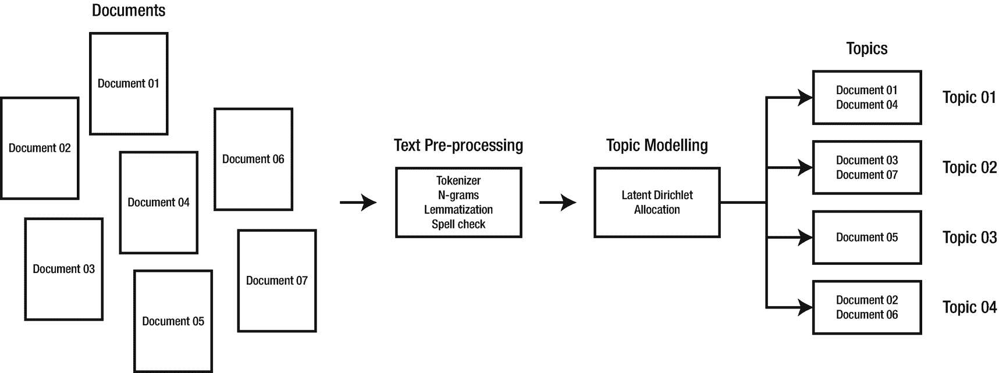
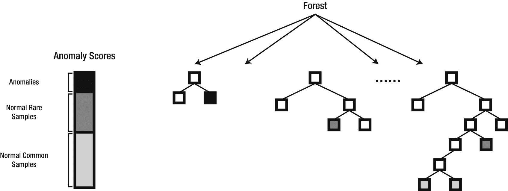

# 四、无监督学习

> *新知识是地球上最有价值的商品。我们掌握的真理越多，我们就越富有。*
> 
> —库尔特·冯内古特 <sup>我</sup>

无监督学习是一种机器学习任务，它在没有标记响应的帮助下发现数据集中隐藏的模式和结构。当您只能访问输入数据，而训练数据不可用或难以获得时，无监督学习是理想的选择。常见的方法包括聚类、主题建模、异常检测和主成分分析。

## K-均值聚类

聚类是一种无监督的机器学习任务，用于对具有某些相似性的未标记观察值进行分组。流行的聚类用例包括客户细分、欺诈分析和异常检测。在训练数据缺乏或不可用的情况下，聚类也经常用于为分类器生成训练数据。K-Means 是最流行的无监督聚类学习算法之一。Spark MLlib 包含一个更具可扩展性的 K-means 实现，称为 K-means||。图 4-1 显示了 K-means 将 Iris 数据集中的观察值分组为三个不同的聚类。


图 4-1

使用 K-means 对虹膜数据集进行聚类

图 4-2 显示了运行中的 K 均值算法。观察值显示为正方形，聚类质心显示为三角形。图 4-2 (a)显示了原始数据集。K-Means 的工作原理是随机分配质心作为每个聚类的起点(图 4-2 (b)和(c))。该算法基于欧几里德距离迭代地将每个数据点分配到最近的质心。然后，它通过计算属于该聚类的所有点的平均值来计算每个聚类的新质心(图 4-2 (d)和(e))。当达到预定义的迭代次数或每个数据点都被分配到其最近的质心，并且不再有可执行的重新分配时，算法停止迭代(图 4-2 (f))。


图 4-2

K-Means 算法在动作 <sup>ii</sup>

K-Means 要求用户向算法提供聚类数 *k* 。有多种方法可以找到数据集的最佳聚类数。我们将在本章的后面讨论肘和剪影方法。

## 例子

让我们来看一个简单的客户细分例子。我们将使用一个小型数据集，其中包含七个观察值以及三个分类要素和两个连续要素的组合。在开始之前，我们需要解决 K-means 的另一个限制。K-Means 不能直接处理分类特征，例如性别*、【M】、【F】、*、【M】、*、*、【CA】、【NY】、*，并且要求所有特征都是连续的。然而，现实世界的数据集通常包含分类特征和连续特征的组合。幸运的是，我们仍然可以通过将分类特征转换成数字格式来使用 K-means。*

这并不像听起来那么简单。例如，要将婚姻状况从其字符串表示形式*、【M】、*和【S】转换为一个数字，您可能会认为将 0 映射到*、【M】、*、【S】、*对于 K-means 是合适的。正如你在第二章中了解到的，这被称为整数或标签编码。但这也带来了另一个问题。整数有一个自然的顺序 *(0 < 1 < 2)* 一些机器学习算法(如 K-means)可能会误解这一顺序，认为一个分类值比另一个分类值“更大”只是因为它被编码为整数，而实际上数据中并不存在这样的顺序关系。这可能会产生意想不到的结果。为了解决这个问题，我们将使用另一种类型的编码，称为一次性编码。 <sup>iii</sup>*

在将分类特征转换为整数(使用 StringIndexer)之后，我们使用一键编码(使用 OneHotEncoderEstimator)将分类特征表示为二进制向量。例如，状态特征*(“CA”、“NY”、“MA”、“AZ”)*是表 4-1 中的一个热编码。

表 4-1

独热编码状态特征

<colgroup><col class="tcol1 align-left"> <col class="tcol2 align-left"> <col class="tcol3 align-left"> <col class="tcol4 align-left"></colgroup> 
| 

加利福尼亚

 | 

纽约州

 | 

马萨诸塞州

 | 

阿塞拜疆（Azerbaijan 的缩写）

 |
| --- | --- | --- | --- |
| one | Zero | Zero | Zero |
| Zero | one | Zero | Zero |
| Zero | Zero | one | Zero |
| Zero | Zero | Zero | one |

特征缩放是 K-means 的另一个重要的预处理步骤。如第二章所述，特征缩放被认为是最佳实践，也是许多涉及距离计算的机器学习算法的要求。如果数据以不同的比例测量，则要素比例尤其重要。某些特性可能具有非常宽的值范围，导致它们支配其他特性。要素缩放可确保每个要素成比例地影响最终距离。在我们的示例中，我们将使用 StandardScaler 估计量来重新调整我们的特征，使其均值为 0，单位方差(标准差为 1)如清单 4-1 所示。

```py
// Let's start with our example by creating some sample data.

val custDF = Seq(
(100, 29000,"M","F","CA",25),
(101, 36000,"M","M","CA",46),
(102, 5000,"S","F","NY",18),
(103, 68000,"S","M","AZ",39),
(104, 2000,"S","F","CA",16),
(105, 75000,"S","F","CA",41),
(106, 90000,"M","M","MA",47),
(107, 87000,"S","M","NY",38)
).toDF("customerid", "income","maritalstatus","gender","state","age")

// Perform some preprocessing steps.

import org.apache.spark.ml.feature.StringIndexer

val genderIndexer = new StringIndexer()
                    .setInputCol("gender")
                    .setOutputCol("gender_idx")

val stateIndexer = new StringIndexer()
                   .setInputCol("state")
                   .setOutputCol("state_idx")

val mstatusIndexer = new StringIndexer()
                     .setInputCol("maritalstatus")
                     .setOutputCol("maritalstatus_idx")

import org.apache.spark.ml.feature.OneHotEncoderEstimator

val encoder = new OneHotEncoderEstimator()
              .setInputCols(Array("gender_idx","state_idx","maritalstatus_idx"))
              .setOutputCols(Array("gender_enc","state_enc","maritalstatus_enc"))

val custDF2 = genderIndexer.fit(custDF).transform(custDF)

val custDF3 = stateIndexer.fit(custDF2).transform(custDF2)

val custDF4 = mstatusIndexer.fit(custDF3).transform(custDF3)

custDF4.select("gender_idx","state_idx","maritalstatus_idx").show

+----------+---------+-----------------+
|gender_idx|state_idx|maritalstatus_idx|
+----------+---------+-----------------+
|       0.0|      0.0|              1.0|
|       1.0|      0.0|              1.0|
|       0.0|      1.0|              0.0|
|       1.0|      3.0|              0.0|
|       0.0|      0.0|              0.0|
|       0.0|      0.0|              0.0|
|       1.0|      2.0|              1.0|
|       1.0|      1.0|              0.0|
+----------+---------+-----------------+

val custDF5 = encoder.fit(custDF4).transform(custDF4)

custDF5.printSchema

root
 |-- customerid: integer (nullable = false)
 |-- income: integer (nullable = false)
 |-- maritalstatus: string (nullable = true)
 |-- gender: string (nullable = true)
 |-- state: string (nullable = true)
 |-- age: integer (nullable = false)
 |-- gender_idx: double (nullable = false)
 |-- state_idx: double (nullable = false)
 |-- maritalstatus_idx: double (nullable = false)
 |-- gender_enc: vector (nullable = true)
 |-- state_enc: vector (nullable = true)
 |-- maritalstatus_enc: vector (nullable = true)

custDF5.select("gender_enc","state_enc","maritalstatus_enc").show

+-------------+-------------+-----------------+
|   gender_enc|    state_enc|maritalstatus_enc|
+-------------+-------------+-----------------+
|(1,[0],[1.0])|(3,[0],[1.0])|        (1,[],[])|
|    (1,[],[])|(3,[0],[1.0])|        (1,[],[])|
|(1,[0],[1.0])|(3,[1],[1.0])|    (1,[0],[1.0])|
|    (1,[],[])|    (3,[],[])|    (1,[0],[1.0])|
|(1,[0],[1.0])|(3,[0],[1.0])|    (1,[0],[1.0])|
|(1,[0],[1.0])|(3,[0],[1.0])|    (1,[0],[1.0])|
|    (1,[],[])|(3,[2],[1.0])|        (1,[],[])|
|    (1,[],[])|(3,[1],[1.0])|    (1,[0],[1.0])|
+-------------+-------------+-----------------+

import org.apache.spark.ml.feature.VectorAssembler

val assembler = new VectorAssembler()
                .setInputCols(Array("income","gender_enc", "state_enc", "maritalstatus_enc", "age"))
                .setOutputCol("features")

val custDF6 = assembler.transform(custDF5)

custDF6.printSchema

root
 |-- customerid: integer (nullable = false)
 |-- income: integer (nullable = false)
 |-- maritalstatus: string (nullable = true)
 |-- gender: string (nullable = true)
 |-- state: string (nullable = true)
 |-- age: integer (nullable = false)
 |-- gender_idx: double (nullable = false)
 |-- state_idx: double (nullable = false)
 |-- maritalstatus_idx: double (nullable = false)
 |-- gender_enc: vector (nullable = true)
 |-- state_enc: vector (nullable = true)
 |-- maritalstatus_enc: vector (nullable = true)
 |-- features: vector (nullable = true)

custDF6.select("features").show(false)

+----------------------------------+
|features                          |
+----------------------------------+
|[29000.0,1.0,1.0,0.0,0.0,0.0,25.0]|
|(7,[0,2,6],[36000.0,1.0,46.0])    |
|[5000.0,1.0,0.0,1.0,0.0,1.0,18.0] |
|(7,[0,5,6],[68000.0,1.0,39.0])    |
|[2000.0,1.0,1.0,0.0,0.0,1.0,16.0] |
|[75000.0,1.0,1.0,0.0,0.0,1.0,41.0]|
|(7,[0,4,6],[90000.0,1.0,47.0])    |
|[87000.0,0.0,0.0,1.0,0.0,1.0,38.0]|
+----------------------------------+

import org.apache.spark.ml.feature.StandardScaler

val scaler = new StandardScaler()
             .setInputCol("features")
             .setOutputCol("scaledFeatures")
             .setWithStd(true)
             .setWithMean(false)

val custDF7 = scaler.fit(custDF6).transform(custDF6)

custDF7.printSchema

root
 |-- customerid: integer (nullable = false)
 |-- income: integer (nullable = false)
 |-- maritalstatus: string (nullable = true)
 |-- gender: string (nullable = true)
 |-- state: string (nullable = true)
 |-- age: integer (nullable = false)
 |-- gender_idx: double (nullable = false)
 |-- state_idx: double (nullable = false)
 |-- maritalstatus_idx: double (nullable = false)
 |-- gender_enc: vector (nullable = true)
 |-- state_enc: vector (nullable = true)
 |-- maritalstatus_enc: vector (nullable = true)
 |-- features: vector (nullable = true)
 |-- scaledFeatures: vector (nullable = true)

custDF7.select("scaledFeatures").show(8,65)

+-----------------------------------------------------------------+
| scaledFeatures                                                  |
+-----------------------------------------------------------------+
|[0.8144011366375091,1.8708286933869707,1.8708286933869707,0.0,...|
|(7,[0,2,6],[1.0109807213431148,1.8708286933869707,3.7319696616...|
|[0.1404139890754326,1.8708286933869707,0.0,2.160246899469287,0...|
|(7,[0,5,6],[1.9096302514258834,1.9321835661585918,3.1640612348...|
|[0.05616559563017304,1.8708286933869707,1.8708286933869707,0.0...|
|[2.106209836131489,1.8708286933869707,1.8708286933869707,0.0,0...|
|(7,[0,4,6],[2.5274518033577866,2.82842712474619,3.813099436871...|
|[2.443203409912527,0.0,0.0,2.160246899469287,0.0,1.93218356615...|
+-----------------------------------------------------------------+

// We’ll create two clusters.

import org.apache.spark.ml.clustering.KMeans

val kmeans = new KMeans()
             .setFeaturesCol("scaledFeatures")
             .setPredictionCol("prediction")
             .setK(2)

import org.apache.spark.ml.Pipeline

val pipeline = new Pipeline()
               .setStages(Array(genderIndexer, stateIndexer,
               mstatusIndexer, encoder, assembler, scaler, kmeans))

val model = pipeline.fit(custDF)

val clusters = model.transform(custDF)

clusters.select("customerid","income","maritalstatus",
                "gender","state","age","prediction")
                .show

+----------+------+-------------+------+-----+---+----------+
|customerid|income|maritalstatus|gender|state|age|prediction|
+----------+------+-------------+------+-----+---+----------+
|       100| 29000|            M|     F|   CA| 25|         1|
|       101| 36000|            M|     M|   CA| 46|         0|
|       102|  5000|            S|     F|   NY| 18|         1|
|       103| 68000|            S|     M|   AZ| 39|         0|
|       104|  2000|            S|     F|   CA| 16|         1|
|       105| 75000|            S|     F|   CA| 41|         0|
|       106| 90000|            M|     M|   MA| 47|         0|
|       107| 87000|            S|     M|   NY| 38|         0|
+----------+------+-------------+------+-----+---+----------+

import org.apache.spark.ml.clustering.KMeansModel

val model = pipeline.stages.last.asInstanceOf[KMeansModel]

model.clusterCenters.foreach(println)
[1.9994952044341603,0.37416573867739417,0.7483314773547883,0.4320493798938574,0.565685424949238,1.159310139695155,3.4236765156588613]
[0.3369935737810382,1.8708286933869707,1.247219128924647,0.7200822998230956,0.0,1.288122377439061,1.5955522466340666]

Listing 4-1A Customer Segmentation Example Using K-Means

```

我们通过计算误差平方和(WSSSE)来评估我们的聚类。使用“肘方法”检查 WSSSE 通常用于帮助确定最佳的集群数量。肘方法的工作原理是用一系列 k 值拟合模型，并将其绘制在 WSSSE 上。目视检查折线图，如果它类似于弯曲的手臂，它在曲线上弯曲的点(“肘”)指示 k 的最佳值。

```py
val wssse = model.computeCost(custDF)
wssse: Double = 32.09801038868844

```

另一种评估聚类质量的方法是通过计算轮廓系数得分。轮廓分数提供了一个聚类中的每个点与其他聚类中的点的接近程度的度量。轮廓分数越大，聚类的质量越好。分数越接近 1 表示这些点越接近聚类的质心。分数越接近 0 表示这些点越接近其他聚类，负值表示这些点可能被指定到错误的聚类。

```py
import org.apache.spark.ml.evaluation.ClusteringEvaluator

val evaluator = new ClusteringEvaluator()

val silhouette = evaluator.evaluate(clusters)

silhouette: Double = 0.6722088068201866

```

## 基于潜在狄利克雷分配的主题建模

潜在狄利克雷分配(LDA)是由戴维·布雷、吴恩达和迈克尔·乔丹在 2003 年提出的，尽管乔纳森·k·普里查德、马修·斯蒂芬斯和彼得·唐纳利在 2000 年也提出了一种用于群体遗传学的类似算法。应用于机器学习的 LDA 基于图形模型，是基于 GraphX 构建的 Spark MLlib 中包含的第一个算法。潜在狄利克雷分配广泛用于主题建模。主题模型自动导出一组文档中的主题(或话题)(图 4-3 )。这些主题可用于基于内容的推荐、文档分类、维度缩减和特征化。



图 4-3

使用潜在狄利克雷分配按主题对文档进行分组

尽管 Spark MLlib 具有广泛的文本挖掘和预处理功能，但它缺乏大多数企业级 NLP 库 <sup>iv</sup> 中的几个功能，例如词汇化、词干提取和情感分析等。在本章后面的主题建模示例中，我们将需要其中的一些特性。这是一个介绍斯坦福 CoreNLP for Spark 和约翰斯诺实验室的 Spark NLP 的好时机。

### 斯坦福 CoreNLP for Spark

斯坦福 CoreNLP 是由斯坦福大学的 NLP 研究小组开发的专业级 NLP 库。CoreNLP 支持多种语言，如阿拉伯语、中文、英语、法语和德语。 <sup>v</sup> 它提供了一个原生的 Java API，以及 web API 和命令行接口。也有针对主要编程语言(如 R、Python、Ruby 和 Lua)的第三方 API。来自 Databricks 的软件工程师孟祥瑞为 Spark 开发了斯坦福 CoreNLP 包装器(见清单 4-2 )。

```py
spark-shell --packages databricks:spark-corenlp:0.4.0-spark2.4-scala2.11 --jars stanford-corenlp-3.9.1-models.jar

import spark.implicits._
import org.apache.spark.sql.types._

val dataDF = Seq(
(1, "Kevin Durant was the 2019 All-Star NBA Most Valuable Player."),
(2, "Stephen Curry is the best clutch three-point shooter in the NBA."),
(3, "My game is not as good as it was 20 years ago."),
(4, "Michael Jordan is the greatest NBA player of all time."),
(5, "The Lakers currently have one of the worst performances in the NBA."))
.toDF("id", "text")

dataDF.show(false)

+---+-------------------------------------------------------------------+
|id |text                                                               |
+---+-------------------------------------------------------------------+
|1  |Kevin Durant was the 2019 All-Star NBA Most Valuable Player.       |
|2  |Stephen Curry is the best clutch three-point shooter in the NBA.   |
|3  |My game is not as good as it was 20 years ago.                     |
|4  |Michael Jordan is the greatest NBA player of all time.             |
|5  |The Lakers currently have one of the worst performances in the NBA.|
+---+-------------------------------------------------------------------+

// Stanford CoreNLP lets you chain text processing functions. Let's split
// the document into sentences and then tokenize the sentences into words.

import com.databricks.spark.corenlp.functions._

val dataDF2 = dataDF
              .select(explode(ssplit('text)).as('sen))
              .select('sen, tokenize('sen).as('words))

dataDF2.show(5,30)

+------------------------------+------------------------------+
|                           sen|                         words|
+------------------------------+------------------------------+
|Kevin Durant was the 2019 A...|Kevin, Durant, was, the, 2...|
|Stephen Curry is the best c...|[Stephen, Curry, is, the, b...|
|My game is not as good as i...|[My, game, is, not, as, goo...|
|Michael Jordan is the great...|[Michael, Jordan, is, the, ...|
|The Lakers currently have o...|[The, Lakers, currently, ha...|
+------------------------------+------------------------------+

// Perform sentiment analysis on the sentences. The scale
// ranges from 0 for strong negative to 4 for strong positive.

val dataDF3 = dataDF
              .select(explode(ssplit('text)).as('sen))
              .select('sen, tokenize('sen).as('words), sentiment('sen).as('sentiment))

dataDF3.show(5,30)

+------------------------------+------------------------------+---------+
|                           sen|                         words|sentiment|
+------------------------------+------------------------------+---------+
|Kevin Durant was the 2019 A...|[Kevin, Durant, was, the, 2...|        1|
|Stephen Curry is the best c...|[Stephen, Curry, is, the, b...|        3|
|My game is not as good as i...|[My, game, is, not, as, goo...|        1|
|Michael Jordan is the great...|[Michael, Jordan, is, the, ...|        3|
|The Lakers currently have o...|[The, Lakers, currently, ha...|        1|
+------------------------------+------------------------------+---------+

Listing 4-2A Brief Introduction to Stanford CoreNLP for Spark

```

请访问 Databricks 的 CoreNLP GitHub 页面，获取 Stanford CoreNLP for Spark 的完整功能列表。

### 约翰·斯诺实验室的 Spark NLP

John Snow Labs 的 Spark NLP 库本身支持 Spark ML 管道 API。它是用 Scala 编写的，包括 Scala 和 Python APIs。它包括几个高级功能，例如记号赋予器、词汇赋予器、词干分析器、实体和日期提取器、词性标记器、句子边界检测、拼写检查器和命名实体识别等等。

标注器在 Spark NLP 中提供了 NLP 功能。注释是 Spark NLP 操作的结果。有两种类型的标注器，*标注器方法和标注器模型。注释器方法*代表 Spark MLlib 估算器。它用数据拟合一个模型，以产生一个注释器模型或转换器。一个*注释器模型*是一个转换器，它接受一个数据集并添加一个包含注释结果的列。因为它们被表示为 Spark 估计器和转换器，所以注释器可以很容易地与 Spark 管道 API 集成。Spark NLP 为用户提供了几种访问其功能的方法。[VI

#### 预训练管道

Spark NLP 包括用于快速文本注释的预训练管道。Spark NLP 提供了一个名为 explain_document_ml 的预训练管道，它接受文本作为输入(参见清单 4-3 )。预训练的管道包含流行的文本处理功能，并提供了一种快速和肮脏的方式来使用 Spark NLP，而没有太多的麻烦。

```py
spark-shell --packages JohnSnowLabs:spark-nlp:2.1.0

import com.johnsnowlabs.nlp.pretrained.PretrainedPipeline

val annotations = PretrainedPipeline("explain_document_ml").annotate("I visited Greece last summer. It was a great trip. I went swimming in Mykonos.")

annotations("sentence")
res7: Seq[String] = List(I visited Greece last summer.,
It was a great trip., I went swimming in Mykonos.)

annotations("token")
res8: Seq[String] = List(I, visited, Greece, last, summer, .,
It, was, a, great, trip, ., I, went, swimming, in, Mykonos, .)

annotations("lemma")
res9: Seq[String] = List(I, visit, Greece, last, summer, .,
It, be, a, great, trip, ., I, go, swim, in, Mykonos, .)

Listing 4-3Spark NLP Pre-trained Pipeline Example

```

#### 带有火花数据帧的预训练管道

预训练的流水线也可以处理 Spark 数据帧，如清单 4-4 所示。

```py
val data = Seq("I visited Greece last summer. It was a great trip. I went swimming in Mykonos.").toDF("text")

val annotations = PretrainedPipeline("explain_document_ml").transform(data)

annotations.show()

+--------------------+--------------------+--------------------+
|                text|            document|            sentence|
+--------------------+--------------------+--------------------+
|I visited Greece ...|[document, 0, 77...|[[document, 0, 28...|
+--------------------+--------------------+--------------------+

+--------------------+
|               token|
+--------------------+
|[[token, 0, 0, I,...|
+--------------------+
+--------------------+--------------------+--------------------+
|             checked|               lemma|                stem|
+--------------------+--------------------+--------------------+
|[[token, 0, 0, I,...|[[token, 0, 0, I,...|[[token, 0, 0, i,...|
+--------------------+--------------------+--------------------+

+--------------------+
|                 pos|
+--------------------+
|[[pos, 0, 0, PRP,...|
+--------------------+

Listing 4-4Spark NLP Pre-trained Pipelines with Spark DataFrames

```

#### 带 Spark MLlib 管道的预训练管道

您可以将预训练的管道与 Spark MLlib 管道一起使用(参见清单 [4-5 )。请注意，需要一个名为 *Finisher* 的特殊转换器来以人类可读的格式显示令牌。

```py
import com.johnsnowlabs.nlp.Finisher
import org.apache.spark.ml.Pipeline

val data = Seq("I visited Greece last summer. It was a great trip. I went swimming in Mykonos.").toDF("text")

val finisher = new Finisher()
               .setInputCols("sentence", "token", "lemma")

val explainPipeline = PretrainedPipeline("explain_document_ml").model

val pipeline = new Pipeline()
               .setStages(Array(explainPipeline,finisher))

pipeline.fit(data).transform(data).show(false)

+--------------------------------------------------+
|text                                              |
+--------------------------------------------------+
|I visited Greece last summer. It was a great trip.|
+--------------------------------------------------+

+----------------------------+
| text                       |
+----------------------------+
|I went swimming in Mykonos. |
+----------------------------+

+-----------------------------------------------------+
|finished_sentence                                    |
+-----------------------------------------------------+
|[I visited Greece last summer., It was a great trip. |
+-----------------------------------------------------+

+-----------------------------+
| finished_sentence           |
+-----------------------------+
|,I went swimming in Mykonos.]|
+-----------------------------+

+-----------------------------------------------------------------+
|finished_token                                                   |
+-----------------------------------------------------------------+
|[I, visited, Greece, last, summer, ., It, was, a, great, trip, .,|
+-----------------------------------------------------------------+

+--------------------------------------------------------------+
|finished_lemma                                                |
+--------------------------------------------------------------+
|[I, visit, Greece, last, summer, ., It, be, a, great, trip, .,|
+--------------------------------------------------------------+

+--------------------------------+
| finished_lemma                 |
+--------------------------------+
|, I, go, swim, in, Mykonos, .]  |
+--------------------------------+

Listing 4-5Pre-trained Pipelines with Spark MLlib Pipeline Example

```

#### 创建自己的 Spark MLlib 管道

您可以直接从自己的 Spark MLlib 管道中使用注释器，如清单 4-6 所示。

```py
import com.johnsnowlabs.nlp.base._
import com.johnsnowlabs.nlp.annotator._
import org.apache.spark.ml.Pipeline

val data = Seq("I visited Greece last summer. It was a great trip. I went swimming in Mykonos.").toDF("text")

val documentAssembler = new DocumentAssembler()
                        .setInputCol("text")
                        .setOutputCol("document")

val sentenceDetector = new SentenceDetector()
                       .setInputCols(Array("document"))
                       .setOutputCol("sentence")

val regexTokenizer = new Tokenizer()
                     .setInputCols(Array("sentence"))
                     .setOutputCol("token")

val finisher = new Finisher()
               .setInputCols("token")
               .setCleanAnnotations(false)

val pipeline = new Pipeline()
               .setStages(Array(documentAssembler,
               sentenceDetector,regexTokenizer,finisher))

pipeline.fit(Seq.empty[String].toDF("text"))
        .transform(data)

        .show()

+--------------------+--------------------+--------------------+
|                text|            document|            sentence|
+--------------------+--------------------+--------------------+
|I visited Greece ...|[document, 0, 77...|[[document, 0, 28...|
+--------------------+--------------------+--------------------+

+--------------------+--------------------+
|               token|      finished_token|
+--------------------+--------------------+
|[[token, 0, 0, I,...|[I, visited, Gree...|
+--------------------+--------------------+

Listing 4-6Creating Your Own Spark MLlib Pipeline Example

```

#### Spark NLP 光管道

Spark NLP 提供了另一类管道，称为 LightPipeline。它类似于 Spark MLlib 管道，但不是利用 Spark 的分布式处理能力，而是在本地执行。当处理少量数据并且需要低延迟执行时，LightPipeline 是合适的(参见清单 [4-7 )。

```py
import com.johnsnowlabs.nlp.base._

val trainedModel = pipeline.fit(Seq.empty[String].toDF("text"))

val lightPipeline = new LightPipeline(trainedModel)

lightPipeline.annotate("I visited Greece last summer.")

Listing 4-7Spark NLP LightPipelines Example

```

#### Spark NLP OCR 模块

Spark NLP 包括一个 OCR 模块，允许用户从 PDF 文件创建 Spark 数据帧。OCR 模块不包含在核心 Spark NLP 库中。要使用它，您需要包含一个单独的包并指定一个额外的库，正如您在清单 4-8 中我的 spark-shell 命令中看到的。

```py
spark-shell --packages JohnSnowLabs:spark-nlp:2.1.0,com.johnsnowlabs.nlp:spark-nlp-ocr_2.11:2.1.0,javax.media.jai:com.springsource.javax.media.jai.core:1.1.3
      --repositories http://repo.spring.io/plugins-release

import com.johnsnowlabs.nlp.util.io.OcrHelper

val myOcrHelper = new OcrHelper

val data = myOcrHelper.createDataset(spark, "/my_pdf_files/")

val documentAssembler = new DocumentAssembler().setInputCol("text")

documentAssembler.transform(data).select("text","filename").show(1,45)

+------------------------------------------+
|                                      text|
+------------------------------------------+
|this is a PDF document. Have a great day. |
+------------------------------------------+

+--------------------------------------------+
|                                   filename |
+--------------------------------------------+
|file:/my_pdf_files/document.pdf             |
+--------------------------------------------+

Listing 4-8Spark NLP OCR Module Example

```

Spark NLP 是一个强大的库，它包含了本简介中没有涉及的许多特性。要了解更多关于 Spark NLP 的信息，请访问 [`http://nlp.johnsnowlabs.com`](http://nlp.johnsnowlabs.com) 。

### 例子

现在我们已经拥有了所有需要的东西，可以继续我们的主题建模例子了。我们将使用潜在的狄利克雷分配对超过 100 万条新闻标题进行分类，这些标题是在 15 年的时间内发布的。该数据集可从 Kaggle 下载，由澳大利亚广播公司提供，并由 Rohit Kulkarni 提供。

我们可以使用 John Snow Labs 的 Spark NLP 或 Stanford CoreNLP 软件包为我们提供额外的文本处理能力。对于这个例子，我们将使用斯坦福 CoreNLP 包(参见清单 4-9 )。

```py
spark-shell --packages databricks:spark-corenlp:0.4.0-spark2.4-scala2.11 --jars stanford-corenlp-3.9.1-models.jar

import org.apache.spark.sql.functions._
import org.apache.spark.sql.types._
import org.apache.spark.sql._

// Define the schema.

var newsSchema = StructType(Array (
StructField("publish_date",   IntegerType, true),
StructField("headline_text",   StringType, true)
    ))

// Read the data.

val dataDF = spark.read.format("csv")
             .option("header", "true")
             .schema(newsSchema)
             .load("abcnews-date-text.csv")

// Inspect the data.

dataDF.show(false)
+------------+--------------------------------------------------+
|publish_date|headline_text                                     |
+------------+--------------------------------------------------+
|20030219    |aba decides against community broadcasting licence|
|20030219    |act fire witnesses must be aware of defamation    |
|20030219    |a g calls for infrastructure protection summit    |
|20030219    |air nz staff in aust strike for pay rise          |
|20030219    |air nz strike to affect australian travellers     |
|20030219    |ambitious olsson wins triple jump                 |
|20030219    |antic delighted with record breaking barca        |
|20030219    |aussie qualifier stosur wastes four memphis match |
|20030219    |aust addresses un security council over iraq      |
|20030219    |australia is locked into war timetable opp        |
|20030219    |australia to contribute 10 million in aid to iraq |
|20030219    |barca take record as robson celebrates birthday in|
|20030219    |bathhouse plans move ahead                        |
|20030219    |big hopes for launceston cycling championship     |

|20030219    |big plan to boost paroo water supplies            |
|20030219    |blizzard buries united states in bills            |
|20030219    |brigadier dismisses reports troops harassed in    |
|20030219    |british combat troops arriving daily in kuwait    |
|20030219    |bryant leads lakers to double overtime win        |
|20030219    |bushfire victims urged to see centrelink          |
+------------+--------------------------------------------------+
only showing top 20 rows

// Remove punctuations.

val dataDF2 = dataDF
              .withColumn("headline_text",
              regexp_replace((dataDF("headline_text")), "[^a-zA-Z0-9 ]", ""))

// We will use Stanford CoreNLP to perform lemmatization. As discussed
// earlier, lemmatization derives the root form of inflected words. For
// example, "camping", "camps", "camper", and "camped" are all inflected
// forms of "camp". Reducing inflected words to its root form helps reduce // the complexity of performing natural language processing. A similar
// process known as stemming also reduces inflected words to their root
// form, but it does so by crudely chopping off affixes, even though the
// root form may not be a valid word. In contrast, lemmatization ensures
// that the inflected words are reduced to a valid root word through the
// morphological analysis of words and the use of a vocabulary.vii

import com.databricks.spark.corenlp.functions._

val dataDF3 = dataDF2
.select(explode(ssplit('headline_text)).as('sen))
              .select('sen, lemma('sen)
              .as('words))

dataDF3.show
+--------------------+--------------------+
|                 sen|               words|
+--------------------+--------------------+
|aba decides again...|[aba, decide, aga...|
|act fire witnesse...|[act, fire, witne...|
|a g calls for inf...|[a, g, call, for,...|
|air nz staff in a...|[air, nz, staff, ...|
|air nz strike to ...|[air, nz, strike,...|
|ambitious olsson ...|[ambitious, olsso...|
|antic delighted w...|[antic, delighted...|
|aussie qualifier ...|[aussie, qualifie...|
|aust addresses un...|[aust, address, u...|
|australia is lock...|[australia, be, l...|
|australia to cont...|[australia, to, c...|
|barca take record...|[barca, take, rec...|
|bathhouse plans m...|[bathhouse, plan,...|
|big hopes for lau...|[big, hope, for, ...|
|big plan to boost...|[big, plan, to, b...|
|blizzard buries u...|[blizzard, bury, ...|
|brigadier dismiss...|[brigadier, dismi...|
|british combat tr...|[british, combat,...|
|bryant leads lake...|[bryant, lead, la...|
|bushfire victims ...|[bushfire, victim...|
+--------------------+--------------------+
only showing top 20 rows

// We’ll remove stop words such as “a”, “be”, and “to”. Stop
// words have no contribution to the meaning of a document.

import org.apache.spark.ml.feature.StopWordsRemover

val remover = new StopWordsRemover()
              .setInputCol("words")
              .setOutputCol("filtered_stopwords")

val dataDF4 = remover.transform(dataDF3)

dataDF4.show

+--------------------+--------------------+--------------------+
|                 sen|               words|  filtered_stopwords|
+--------------------+--------------------+--------------------+
|aba decides again...|[aba, decide, aga...|[aba, decide, com...|
|act fire witnesse...|[act, fire, witne...|[act, fire, witne...|
|a g calls for inf...|[a, g, call, for,...|[g, call, infrast...|
|air nz staff in a...|[air, nz, staff, ...|[air, nz, staff, ...|
|air nz strike to ...|[air, nz, strike,...|[air, nz, strike,...|
|ambitious olsson ...|[ambitious, olsso...|[ambitious, olsso...|
|antic delighted w...|[antic, delighted...|[antic, delighted...|
|aussie qualifier ...|[aussie, qualifie...|[aussie, qualifie...|

|aust addresses un...|[aust, address, u...|[aust, address, u...|
|australia is lock...|[australia, be, l...|[australia, lock,...|
|australia to cont...|[australia, to, c...|[australia, contr...|
|barca take record...|[barca, take, rec...|[barca, take, rec...|
|bathhouse plans m...|[bathhouse, plan,...|[bathhouse, plan,...|
|big hopes for lau...|[big, hope, for, ...|[big, hope, launc...|
|big plan to boost...|[big, plan, to, b...|[big, plan, boost...|
|blizzard buries u...|[blizzard, bury, ...|[blizzard, bury, ...|
|brigadier dismiss...|[brigadier, dismi...|[brigadier, dismi...|
|british combat tr...|[british, combat,...|[british, combat,...|
|bryant leads lake...|[bryant, lead, la...|[bryant, lead, la...|
|bushfire victims ...|[bushfire, victim...|[bushfire, victim...|
+--------------------+--------------------+--------------------+
only showing top 20 rows

// Generate n-grams. n-grams are a sequence of “n” number of words often
// used to discover the relationship of words in a document.  For example,
// “Los Angeles” is a bigram. “Los” and “Angeles” are unigrams. “Los” and // “Angeles” when considered as individual units may not mean much, but it // is more meaningful when combined as a single entity “Los Angeles”.
// Determining the optimal number of “n” is dependent on the use case
// and the language used in the document.viii For our example, we'll generate // a unigram, bigram, and trigram.

import org.apache.spark.ml.feature.NGram

val unigram = new NGram()
              .setN(1)
              .setInputCol("filtered_stopwords")
              .setOutputCol("unigram_words")

val dataDF5 = unigram.transform(dataDF4)

dataDF5.printSchema
root
 |-- sen: string (nullable = true)
 |-- words: array (nullable = true)
 |    |-- element: string (containsNull = true)
 |-- filtered_stopwords: array (nullable = true)
 |    |-- element: string (containsNull = true)
 |-- unigram_words: array (nullable = true)
 |    |-- element: string (containsNull = false)

val bigram = new NGram()
             .setN(2)
             .setInputCol("filtered_stopwords")
             .setOutputCol("bigram_words")

val dataDF6 = bigram.transform(dataDF5)

dataDF6.printSchema
root
 |-- sen: string (nullable = true)
 |-- words: array (nullable = true)
 |    |-- element: string (containsNull = true)
 |-- filtered_stopwords: array (nullable = true)
 |    |-- element: string (containsNull = true)
 |-- unigram_words: array (nullable = true)
 |    |-- element: string (containsNull = false)
 |-- bigram_words: array (nullable = true)
 |    |-- element: string (containsNull = false)

val trigram = new NGram()
              .setN(3)
              .setInputCol("filtered_stopwords")
              .setOutputCol("trigram_words")

val dataDF7 = trigram.transform(dataDF6)

dataDF7.printSchema
root
 |-- sen: string (nullable = true)
 |-- words: array (nullable = true)
 |    |-- element: string (containsNull = true)
 |-- filtered_stopwords: array (nullable = true)
 |    |-- element: string (containsNull = true)
 |-- unigram_words: array (nullable = true)
 |    |-- element: string (containsNull = false)
 |-- bigram_words: array (nullable = true)
 |    |-- element: string (containsNull = false)
 |-- trigram_words: array (nullable = true)
 |    |-- element: string (containsNull = false)

// We combine the unigram, bigram, and trigram into a single vocabulary

.
// We will concatenate and store the words in a column “ngram_words”
// using Spark SQL.

dataDF7.createOrReplaceTempView("dataDF7")

val dataDF8 = spark.sql("select sen,words,filtered_stopwords,unigram_words,bigram_words,trigram_words,concat(concat(unigram_words,bigram_words),trigram_words) as ngram_words from dataDF7")

dataDF8.printSchema
root
 |-- sen: string (nullable = true)
 |-- words: array (nullable = true)
 |    |-- element: string (containsNull = true)
 |-- filtered_stopwords: array (nullable = true)
 |    |-- element: string (containsNull = true)
 |-- unigram_words: array (nullable = true)
 |    |-- element: string (containsNull = false)
 |-- bigram_words: array (nullable = true)
 |    |-- element: string (containsNull = false)
 |-- trigram_words: array (nullable = true)
 |    |-- element: string (containsNull = false)
 |-- ngram_words: array (nullable = true)
 |    |-- element: string (containsNull = false)

dataDF8.select("ngram_words").show(20,65)
+-----------------------------------------------------------------+
|ngram_words                                                      |
+-----------------------------------------------------------------+
|[aba, decide, community, broadcasting, licence, aba decide, de...|
|[act, fire, witness, must, aware, defamation, act fire, fire w...|
|[g, call, infrastructure, protection, summit, g call, call inf...|
|[air, nz, staff, aust, strike, pay, rise, air nz, nz staff, st...|
|[air, nz, strike, affect, australian, traveller, air nz, nz st...|
|[ambitious, olsson, win, triple, jump, ambitious olsson, olsso...|
|[antic, delighted, record, break, barca, antic delighted, deli...|
|[aussie, qualifier, stosur, waste, four, memphis, match, aussi...|
|[aust, address, un, security, council, iraq, aust address, add...|
|[australia, lock, war, timetable, opp, australia lock, lock wa...|
|[australia, contribute, 10, million, aid, iraq, australia cont...|
|[barca, take, record, robson, celebrate, birthday, barca take,...|
|[bathhouse, plan, move, ahead, bathhouse plan, plan move, move...|
|[big, hope, launceston, cycling, championship, big hope, hope ...|
|[big, plan, boost, paroo, water, supplies, big plan, plan boos...|
|[blizzard, bury, united, state, bill, blizzard bury, bury unit...|
|[brigadier, dismiss, report, troops, harass, brigadier dismiss...|
|[british, combat, troops, arrive, daily, kuwait, british comba...|
|[bryant, lead, laker, double, overtime, win, bryant lead, lead...|
|[bushfire, victim, urge, see, centrelink, bushfire victim, vic...|
+-----------------------------------------------------------------+

only showing top 20 rows

// Use CountVectorizer to convert the text data to vectors of token counts

.

import org.apache.spark.ml.feature.{CountVectorizer, CountVectorizerModel}

val cv = new CountVectorizer()
         .setInputCol("ngram_words")
         .setOutputCol("features")

val cvModel = cv.fit(dataDF8)

val dataDF9 = cvModel.transform(dataDF8)

val vocab = cvModel.vocabulary

vocab: Array[String] = Array(police, man, new, say, plan, charge, call,
council, govt, fire, court, win, interview, back, kill, australia, find,
death, urge, face, crash, nsw, report, water, get, australian, qld, take,
woman, wa, attack, sydney, year, change, murder, hit, health, jail, claim,
day, child, miss, hospital, car, home, sa, help, open, rise, warn, school,
world, market, cut, set, accuse, die, seek, drug, make, boost, may, coast,
government, ban, job, group, fear, mp, two, talk, service, farmer, minister, election, fund, south, road, continue, lead, worker, first, national, test, arrest, work, rural, go, power, price, cup, final, concern, green, china, mine, fight, labor, trial, return, flood, deal, north, case, push, pm, melbourne, law, driver, one, nt, want, centre, record, ...

// We use IDF to scale the features generated by CountVectorizer.
// Scaling features generally improves performance.

import org.apache.spark.ml.feature.IDF

val idf = new IDF()
          .setInputCol("features")
          .setOutputCol("features2")

val idfModel = idf.fit(dataDF9)

val dataDF10 = idfModel.transform(dataDF9)

dataDF10.select("features2").show(20,65)
+-----------------------------------------------------------------+
| features2                                                       |
+-----------------------------------------------------------------+
|(262144,[154,1054,1140,15338,19285],[5.276861439995834,6.84427...|
|(262144,[9,122,711,727,3141,5096,23449],[4.189486226673463,5.1...|
|(262144,[6,734,1165,1177,1324,43291,96869],[4.070620900306447,...|
|(262144,[48,121,176,208,321,376,424,2183,6231,12147,248053],[4...|
|(262144,[25,176,208,376,764,3849,12147,41079,94670,106284],[4....|
|(262144,[11,1008,1743,10833,128493,136885],[4.2101466208496285...|
|(262144,[113,221,3099,6140,9450,16643],[5.120230688038215,5.54...|
|(262144,[160,259,483,633,1618,4208,17750,187744],[5.3211036079...|
|(262144,[7,145,234,273,321,789,6163,10334,11101,32988],[4.0815...|
|(262144,[15,223,1510,5062,5556],[4.393970862600795,5.555011224...|
|(262144,[15,145,263,372,541,3896,15922,74174,197210],[4.393970...|
|(262144,[27,113,554,1519,3099,13499,41664,92259],[4.5216508634...|
|(262144,[4,131,232,5636,6840,11444,37265],[3.963488754657374,5...|

|(262144,[119,181,1288,1697,2114,49447,80829,139670],[5.1266204...|
|(262144,[4,23,60,181,2637,8975,9664,27571,27886],[3.9634887546...|
|(262144,[151,267,2349,3989,7631,11862],[5.2717309555002725,5.6...|
|(262144,[22,513,777,12670,33787,49626],[4.477068652869369,6.16...|
|(262144,[502,513,752,2211,5812,7154,30415,104812],[6.143079025...|
|(262144,[11,79,443,8222,8709,11447,194715],[4.2101466208496285...|
|(262144,[18,146,226,315,2877,5160,19389,42259],[4.414350240692...|

+-----------------------------------------------------------------+
only showing top 20 rows

// The scaled features could then be passed to LDA

.

import org.apache.spark.ml.clustering.LDA

val lda = new LDA()
          .setK(30)
          .setMaxIter(10)

val model = lda.fit(dataDF10)

val topics = model.describeTopics

topics.show(20,30)
+-----+------------------------------+------------------------------+
|topic|                   termIndices|                   termWeights|
+-----+------------------------------+------------------------------+
|    0|[2, 7, 16, 9482, 9348, 5, 1...|[1.817876125380732E-4, 1.09...|
|    1|[974, 2, 3, 5189, 5846, 541...|[1.949552388785536E-4, 1.89...|
|    2|[2253, 4886, 12, 6767, 3039...|[2.7922272919208327E-4, 2.4...|
|    3|[6218, 6313, 5762, 3387, 27...|[1.6618313204146235E-4, 1.6...|
|    4|[0, 1, 39, 14, 13, 11, 2, 1...|[1.981809243111437E-4, 1.22...|
|    5|[4, 7, 22, 11, 2, 3, 79, 92...|[2.49620962563534E-4, 2.032...|
|    6|[15, 32, 319, 45, 342, 121,...|[2.885684164769467E-5, 2.45...|
|    7|[2298, 239, 1202, 3867, 431...|[3.435238376348344E-4, 3.30...|
|    8|[0, 4, 110, 3, 175, 38, 8, ...|[1.0177738516279581E-4, 8.7...|
|    9|[1, 19, 10, 2, 7, 8, 5, 0, ...|[2.2854683602607976E-4, 1.4...|
|   10|[1951, 1964, 16, 33, 1, 5, ...|[1.959705576881449E-4, 1.92...|
|   11|[12, 89, 72, 3, 92, 63, 62,...|[4.167255720848278E-5, 3.19...|
|   12|[4, 23, 13, 22, 73, 18, 70,...|[1.1641833113477034E-4, 1.1...|
|   13|[12, 1, 5, 16, 185, 132, 24...|[0.008769073702733892, 0.00...|
|   14|[9151, 13237, 3140, 14, 166...|[8.201099412213086E-5, 7.85...|
|   15|[9, 1, 0, 11, 3, 15, 32, 52...|[0.0032039727688580703, 0.0...|
|   16|[1, 10, 5, 56, 27, 3, 16, 1...|[5.252120584885086E-5, 4.05...|
|   17|[12, 1437, 4119, 1230, 5303...|[5.532790361864421E-4, 2.97...|
|   18|[12, 2459, 7836, 8853, 7162...|[6.862552774818539E-4, 1.83...|
|   19|[21, 374, 532, 550, 72, 773...|[0.0024665346250921432, 0.0...|

+-----+------------------------------+------------------------------+
only showing top 20 rows

// Determine the max size of the vocabulary.

model.vocabSize
res27: Int = 262144

// Extract the topic words. The describeTopics method returns the
// dictionary indices from CountVectorizer's output. We will use a custom // user-defined function to map the words to the indices.ix

import scala.collection.mutable.WrappeddArray
import org.apache.spark.sql.functions.udf

val extractWords = udf( (x : WrappedArray[Int]) => { x.map(i => vocab(i)) })

val topics = model
             .describeTopics
             .withColumn("words", extractWords(col("termIndices")))

topics.select("topic","termIndices","words").show(20,30)
+-----+------------------------------+------------------------------+
|topic|                   termIndices|                         words|
+-----+------------------------------+------------------------------+
|    0|[2, 7, 16, 9482, 9348, 5, 1...|[new, council, find, abuse ...|
|    1|[974, 2, 3, 5189, 5846, 541...|[2016, new, say, china sea,...|
|    2|[2253, 4886, 12, 6767, 3039...|[nathan, interview nathan, ...|
|    3|[6218, 6313, 5762, 3387, 27...|[new guinea, papua new guin...|
|    4|[0, 1, 39, 14, 13, 11, 2, 1...|[police, man, day, kill, ba...|
|    5|[4, 7, 22, 11, 2, 3, 79, 92...|[plan, council, report, win...|
|    6|[15, 32, 319, 45, 342, 121,...|[australia, year, india, sa...|
|    7|[2298, 239, 1202, 3867, 431...|[sach, tour, de, tour de, d...|
|    8|[0, 4, 110, 3, 175, 38, 8, ...|[police, plan, nt, say, fun...|
|    9|[1, 19, 10, 2, 7, 8, 5, 0, ...|[man, face, court, new, cou...|
|   10|[1951, 1964, 16, 33, 1, 5, ...|[vic country, vic country h...|
|   11|[12, 89, 72, 3, 92, 63, 62,...|[interview, price, farmer, ...|
|   12|[4, 23, 13, 22, 73, 18, 70,...|[plan, water, back, report,...|
|   13|[12, 1, 5, 16, 185, 132, 24...|[interview, man, charge, fi...|
|   14|[9151, 13237, 3140, 14, 166...|[campese, interview terry, ...|
|   15|[9, 1, 0, 11, 3, 15, 32, 52...|[fire, man, police, win, sa...|
|   16|[1, 10, 5, 56, 27, 3, 16, 1...|[man, court, charge, die, t...|
|   17|[12, 1437, 4119, 1230, 5303...|[interview, redback, 666, s...|
|   18|[12, 2459, 7836, 8853, 7162...|[interview, simon, intervie...|
|   19|[21, 374, 532, 550, 72, 773...|[nsw, asylum, seeker, asylu...|
+-----+------------------------------+------------------------------+

only showing top 20 rows

// Extract the term weights from describeTopics.

val wordsWeight = udf( (x : WrappedArray[Int],
y : WrappedArray[Double]) =>
{ x.map(i => vocab(i)).zip(y)}
)

val topics2 = model
              .describeTopics
              .withColumn("words", wordsWeight(col("termIndices"), col("termWeights")))

val topics3 = topics2
              .select("topic", "words")
              .withColumn("words", explode(col("words")))

topics3.show(50,false)
+-----+------------------------------------------------+
|topic|words                                           |
+-----+------------------------------------------------+
|0    |[new, 1.4723785654465323E-4]                    |
|0    |[council, 1.242876719889358E-4]                 |
|0    |[thursday, 1.1710009304019913E-4]               |
|0    |[grandstand thursday, 1.0958369194828903E-4]    |
|0    |[two, 8.119593156862581E-5]                     |
|0    |[charge, 7.321024120305904E-5]                  |
|0    |[find, 6.98723717903146E-5]                     |
|0    |[burley griffin, 6.474176573486395E-5]          |
|0    |[claim, 6.448801852215021E-5]                   |
|0    |[burley, 6.390953777977556E-5]                  |
|1    |[say, 1.9595383103126804E-4]                    |
|1    |[new, 1.7986957579978078E-4]                    |
|1    |[murder, 1.7156446166835784E-4]                 |
|1    |[las, 1.6793241095301546E-4]                    |
|1    |[vegas, 1.6622904053495525E-4]                  |
|1    |[las vegas, 1.627321199362179E-4]               |
|1    |[2016, 1.4906599207615762E-4]                   |
|1    |[man, 1.3653760511354596E-4]                    |
|1    |[call, 1.3277357539424398E-4]                   |
|1    |[trump, 1.250570735309821E-4]                   |
|2    |[ntch, 5.213678388314454E-4]                    |
|2    |[ntch podcast, 4.6907569870744537E-4]           |
|2    |[podcast, 4.625754070258578E-4]                 |
|2    |[interview, 1.2297477650126824E-4]              |
|2    |[trent, 9.319817855283612E-5]                   |
|2    |[interview trent, 8.967384560094343E-5]         |
|2    |[trent robinson, 7.256857525120274E-5]          |
|2    |[robinson, 6.888930961680287E-5]                |
|2    |[interview trent robinson, 6.821800839623336E-5]|
|2    |[miss, 6.267572268770148E-5]                    |
|3    |[new, 8.244153432249302E-5]                     |
|3    |[health, 5.269269109549137E-5]                  |
|3    |[change, 5.1481361386635024E-5]                 |
|3    |[first, 3.474601129571304E-5]                   |
|3    |[south, 3.335342687995096E-5]                   |
|3    |[rise, 3.3245575277669534E-5]                   |
|3    |[country, 3.26422466284622E-5]                  |
|3    |[abuse, 3.25594250748893E-5]                    |
|3    |[start, 3.139959761950907E-5]                   |
|3    |[minister, 3.1327427652213426E-5]               |
|4    |[police, 1.756612187665565E-4]                  |
|4    |[man, 1.2903801461819285E-4]                    |
|4    |[petero, 8.259870531430337E-5]                  |
|4    |[kill, 8.251557569137285E-5]                    |
|4    |[accuse grant, 8.187325944352362E-5]            |
|4    |[accuse grant bail, 7.609807356711693E-5]       |
|4    |[find, 7.219731162848223E-5]                    |
|4    |[attack, 6.804063612991027E-5]                  |
|4    |[day, 6.772554893634948E-5]                     |
|4    |[jail, 6.470525327671485E-5]                    |
+-----+------------------------------------------------+
only showing top 50 rows

// Finally, we split the word and the weight

into separate fields.

val topics4 = topics3
              .select(col("topic"), col("words")
              .getField("_1").as("word"), col("words")
              .getField("_2").as("weight"))

topics4.show(50, false)

+-----+------------------------+---------------------+
|topic|word                    |weight               |
+-----+------------------------+---------------------+
|0    |new                     |1.4723785654465323E-4|
|0    |council                 |1.242876719889358E-4 |
|0    |thursday                |1.1710009304019913E-4|
|0    |grandstand thursday     |1.0958369194828903E-4|
|0    |two                     |8.119593156862581E-5 |
|0    |charge                  |7.321024120305904E-5 |
|0    |find                    |6.98723717903146E-5  |
|0    |burley griffin          |6.474176573486395E-5 |
|0    |claim                   |6.448801852215021E-5 |
|0    |burley                  |6.390953777977556E-5 |
|1    |say                     |1.9595383103126804E-4|
|1    |new                     |1.7986957579978078E-4|
|1    |murder                  |1.7156446166835784E-4|
|1    |las                     |1.6793241095301546E-4|
|1    |vegas                   |1.6622904053495525E-4|
|1    |las vegas               |1.627321199362179E-4 |
|1    |2016                    |1.4906599207615762E-4|
|1    |man                     |1.3653760511354596E-4|
|1    |call                    |1.3277357539424398E-4|
|1    |trump                   |1.250570735309821E-4 |
|2    |ntch                    |5.213678388314454E-4 |
|2    |ntch podcast            |4.6907569870744537E-4|
|2    |podcast                 |4.625754070258578E-4 |
|2    |interview               |1.2297477650126824E-4|
|2    |trent                   |9.319817855283612E-5 |

|2    |interview trent         |8.967384560094343E-5 |
|2    |trent robinson          |7.256857525120274E-5 |
|2    |robinson                |6.888930961680287E-5 |
|2    |interview trent robinson|6.821800839623336E-5 |
|2    |miss                    |6.267572268770148E-5 |
|3    |new                     |8.244153432249302E-5 |
|3    |health                  |5.269269109549137E-5 |
|3    |change                  |5.1481361386635024E-5|
|3    |first                   |3.474601129571304E-5 |
|3    |south                   |3.335342687995096E-5 |
|3    |rise                    |3.3245575277669534E-5|
|3    |country                 |3.26422466284622E-5  |
|3    |abuse                   |3.25594250748893E-5  |
|3    |start                   |3.139959761950907E-5 |
|3    |minister                |3.1327427652213426E-5|
|4    |police                  |1.756612187665565E-4 |
|4    |man                     |1.2903801461819285E-4|
|4    |petero                  |8.259870531430337E-5 |
|4    |kill                    |8.251557569137285E-5 |
|4    |accuse grant            |8.187325944352362E-5 |
|4    |accuse grant bail       |7.609807356711693E-5 |
|4    |find                    |7.219731162848223E-5 |
|4    |attack                  |6.804063612991027E-5 |
|4    |day                     |6.772554893634948E-5 |
|4    |jail                    |6.470525327671485E-5 |
+-----+------------------------+---------------------+
only showing top 50 rows

Listing 4-9Topic Modeling with LDA

```

为了简洁起见，我只显示了前 50 行，显示了 30 个主题中的 4 个。如果你仔细检查每个主题中的单词，你会发现重复的主题可以用来对标题进行分类。

## 隔离森林异常检测

异常或异常值检测可识别出明显偏离大多数数据集的罕见观察值。它经常用于发现欺诈性金融交易、识别网络安全威胁或执行预测性维护，仅举几个使用案例。异常检测是机器学习领域的一个热门研究领域。多年来，已经发明了几种异常检测技术，其效果各不相同。在这一章中，我将介绍一种最有效的异常检测技术，叫做隔离森林。隔离森林是一种基于树的集成算法，用于异常检测，该算法是由刘飞东尼、婷和开发的。 <sup>x</sup>

与大多数异常检测技术不同，隔离林试图明确检测实际的异常值，而不是识别正常的数据点。隔离林的运行基于这样一个事实，即数据集中通常存在少量异常值，因此易于进行隔离。<sup>【Xi】</sup>从正常数据点中分离异常值是有效的，因为它需要较少的条件。相比之下，隔离正常数据点通常会涉及更多条件。如图 4-4 (b)所示，异常数据点只用一个分区隔离，而正常数据点用了五个分区隔离。当数据被表示为树形结构时，异常更有可能在比正常数据点浅得多的深度上靠近根节点。如图 4-4 (a)所示，离群点(8，12)的树深度为 1，而正常数据点(9，15)的树深度为 5。

隔离林不需要要素缩放，因为用于检测异常值的距离阈值是基于树深度的。它适用于大型和小型数据集，并且不需要训练数据集，因为它是一种无监督的学习技术。<sup>XIII</sup>


图 4-4

用隔离林隔离异常和正常数据点 <sup>xii</sup> 所需的分区数

与其他基于树的集合类似，隔离林建立在称为*隔离树*的决策树集合上，每棵树都有整个数据集的子集。异常分数被计算为森林中树木的平均异常分数。异常分值来自分割数据点所需的条件数量。接近 1 的异常分数表示异常，而低于 0.5 的分数表示非异常观察(图 4-5 )。



图 4-5

用隔离林探测异常<sup>XIV</sup>

隔离林在准确性和性能方面都优于其他异常检测方法。图 4-6 和 4-7 显示了隔离森林与单类支持向量机(另一种众所周知的离群点检测算法)的性能比较。 <sup>xv</sup> 第一个测试针对属于单个组的正常观察值评估了两种算法(图 4-6 )，而第二个测试针对属于两个不均匀聚类的观察值评估了两种算法(图 4-7 )。在这两种情况下，隔离森林的表现优于单类支持向量机。


图 4-7

隔离森林与单类支持向量机——不均匀聚类(图片由 Alejandro Correa Bahnsen 提供)


图 4-6

隔离森林与单类支持向量机——正常观察，单组(图片由 Alejandro Correa Bahnsen 提供)

Spark-iForest 是杨在 Jie Fang 和几个贡献者的帮助下开发的 Spark 中隔离森林算法的一个实现。它作为外部第三方包提供，不包含在标准的 Apache Spark MLlib 库中。你可以通过访问 Spark-iForest GitHub 页面 [`https://github.com/titicaca/spark-iforest`](https://github.com/titicaca/spark-iforest) 找到更多关于 Spark-iForest 的信息以及最新的 JAR 文件。 <sup>十六世</sup>

### 因素

这是 Spark-iForest 支持的参数列表。如您所见，一些参数类似于其他基于树的集合，如随机森林。

*   *maxFeatures* :从数据中抽取的特征数，用来训练每棵树(> 0)。如果 maxFeatures < = 1，该算法将绘制 max features÷total features 要素。如果 maxFeatures >为 1，该算法将绘制 maxFeatures 特征。

*   *maxDepth* :构造一棵树的高度限制(> 0)。默认值大约为 log2(numSamples)。

*   *numTrees*:I forest 模型中的树的数量(> 0)。

*   *maxSamples* :从数据中抽取训练每棵树的样本数(> 0)。如果 maxSamples < = 1，该算法将绘制 max samples÷total sample 样本。如果 maxSamples >为 1，该算法将绘制 maxSamples 样本。总内存大约是 max samples÷num trees÷4+max samples÷8 字节。

*   *污染*:数据集中异常值的比例；该值应该在(0，1)中。它仅在预测阶段用于将异常分值转换为预测标签。为了提高性能，我们采用近似分位数来计算异常分值阈值。您可以将 param approxquantilerelativerror 设置为大于 0，以便计算大型数据集异常分值的近似分位数阈值。

*   *approxquantilerrelativeerror*:近似分位数计算的相对误差(0<= value<= 1)；对于计算精确值，默认值为 0，这对于大型数据集来说代价很高。

*   *bootstrap* :如果为真，则个体树适合于用替换采样的训练数据的随机子集。如果为假，则执行无替换的采样。

*   *种子*:随机数生成器使用的种子。

*   *Features coll*:Features 列名，默认为“Features”。

*   *Anomaly scoreCol* :异常分值列名，默认为“anomalyScore”。

*   *predictionCol* :预测列名，默认为“预测”。XVII

### 例子

我们将使用 Spark-iForest 来预测乳腺癌的发生率(列表 4-10 )，使用威斯康星州乳腺癌数据集(表 4-2 )，可从 UCI 机器学习资源库获得。XVIII

表 4-2

威斯康星乳腺癌数据集

<colgroup><col class="tcol1 align-left"> <col class="tcol2 align-left"> <col class="tcol3 align-left"></colgroup> 
| 

索引

 | 

特征

 | 

领域

 |
| --- | --- | --- |
| one | 样本代码编号 | 识别号 |
| Two | 团块厚度 | 1–10 |
| three | 细胞大小的均匀性 | 1–10 |
| four | 细胞形状的均匀性 | 1–10 |
| five | 边缘粘连 | 1–10 |
| six | 单一上皮细胞大小 | 1–10 |
| seven | 裸核 | 1–10 |
| eight | 平淡的染色质 | 1–10 |
| nine | 正常核仁 | 1–10 |
| Ten | 神话故事 | 1–10 |
| Eleven | 班级 | (良性 2 例，恶性 4 例) |

```py
spark-shell --jars spark-iforest-1.0-SNAPSHOT.jar

import org.apache.spark.sql.types._

var dataSchema = StructType(Array(
StructField("id", IntegerType, true),
StructField("clump_thickness", IntegerType, true),
StructField("ucell_size", IntegerType, true),
StructField("ucell_shape", IntegerType, true),
StructField("marginal_ad", IntegerType, true),
StructField("se_cellsize", IntegerType, true),
StructField("bare_nuclei", IntegerType, true),
StructField("bland_chromatin", IntegerType, true),
StructField("normal_nucleoli", IntegerType, true),
StructField("mitosis", IntegerType, true),
StructField("class", IntegerType, true)
    ))

val dataDF = spark.read.option("inferSchema", "true")
             .schema(dataSchema)
             .csv("/files/breast-cancer-wisconsin.csv")

dataDF.printSchema

//The dataset contain 16 rows with missing attribute values.
//We'll remove them for this exercise.

val dataDF2 = dataDF.filter("bare_nuclei is not null")

val seed = 1234

val Array(trainingData, testData) = dataDF2.randomSplit(Array(0.8, 0.2), seed)

import org.apache.spark.ml.feature.StringIndexer

val labelIndexer = new StringIndexer().setInputCol("class").setOutputCol("label")

import org.apache.spark.ml.feature.VectorAssembler

val assembler = new VectorAssembler()
                .setInputCols(Array("clump_thickness",
                "ucell_size", "ucell_shape", "marginal_ad", "se_cellsize", "bare_nuclei", "bland_chromatin", "normal_nucleoli", "mitosis"))
                .setOutputCol("features")

import org.apache.spark.ml.iforest._

val iForest = new IForest()
              .setMaxSamples(150)
              .setContamination(0.30)
              .setBootstrap(false)
              .setSeed(seed)
              .setNumTrees(100)
              .setMaxDepth(50)

val pipeline = new Pipeline()
      .setStages(Array(labelIndexer, assembler, iForest))

val model = pipeline.fit(trainingData)

val predictions = model.transform(testData)

predictions.select("id","features","anomalyScore","prediction").show()

+------+--------------------+-------------------+----------+
|    id|            features|       anomalyScore|prediction|
+------+--------------------+-------------------+----------+
| 63375|9.0,1.0,2.0,6.0,...| 0.6425205920636737|       1.0|
| 76389|[10.0,4.0,7.0,2.0...| 0.6475157383643779|       1.0|
| 95719|[6.0,10.0,10.0,10...| 0.6413247885878359|       1.0|
|242970|[5.0,7.0,7.0,1.0,...| 0.6156526231532693|       1.0|
|353098|[4.0,1.0,1.0,2.0,...|0.45686731187686386|       0.0|
|369565|[4.0,1.0,1.0,1.0,...|0.45957810648090186|       0.0|
|390840|[8.0,4.0,7.0,1.0,...| 0.6387497388682214|       1.0|
|412300|[10.0,4.0,5.0,4.0...| 0.6104797020175959|       1.0|
|466906|[1.0,1.0,1.0,1.0,...|0.41857428772927696|       0.0|
|476903|[10.0,5.0,7.0,3.0...| 0.6152957125696049|       1.0|
|486283|[3.0,1.0,1.0,1.0,...|0.47218763124223706|       0.0|
|557583|[5.0,10.0,10.0,10...| 0.6822227844447365|       1.0|
|636437|[1.0,1.0,1.0,1.0,...|0.41857428772927696|       0.0|
|654244|[1.0,1.0,1.0,1.0,...| 0.4163657637214968|       0.0|
|657753|[3.0,1.0,1.0,4.0,...|0.49314746153500594|       0.0|
|666090|[1.0,1.0,1.0,1.0,...|0.45842258207090547|       0.0|
|688033|[1.0,1.0,1.0,1.0,...|0.41857428772927696|       0.0|
|690557|[5.0,1.0,1.0,1.0,...| 0.4819098604217553|       0.0|
|704097|[1.0,1.0,1.0,1.0,...| 0.4163657637214968|       0.0|
|770066|[5.0,2.0,2.0,2.0,...| 0.5125093127301371|       0.0|
+------+--------------------+-------------------+----------+
only showing top 20 rows

Listing 4-10Anomaly Detection with Isolation Forest

```

我们不能使用 BinaryClassificationEvaluator 来评估隔离林模型，因为它要求原始预测字段出现在输出中。Spark-iForest 生成一个异常分数字段，而不是原始预测。我们将使用 BinaryClassificationMetrics 来评估模型。

```py
import org.apache.spark.mllib.evaluation.BinaryClassificationMetrics

val binaryMetrics = new BinaryClassificationMetrics(
predictions.select("prediction", "label").rdd.map {
case Row(prediction: Double, label: Double) => (prediction, label)
}
)

println(s"AUC: ${binaryMetrics.areaUnderROC()}")

AUC: 0.9532866199532866

```

## 主成分分析降维

主成分分析(PCA)是一种无监督的机器学习技术，用于降低特征空间的维度。它检测要素之间的相关性，并生成数量减少的线性不相关要素，同时保留原始数据集中的大部分方差。这些更紧凑、线性不相关的特征被称为*主成分*。主成分按其解释方差的降序排列。当数据集中有大量要素时，降维至关重要。例如，基因组学和工业分析领域的机器学习用例通常涉及数千甚至数百万个特征。高维数使得模型更加复杂，增加了过度拟合的机会。在某一点上添加更多的特征实际上会降低模型的性能。此外，对高维数据的训练需要大量的计算资源。这些被统称为*维度诅咒*。降维技术旨在克服维数灾难。

请注意，五氯苯甲醚产生的主要成分不可解释。在你需要理解为什么做出预测的情况下，这是一个交易破坏者。此外，在应用 PCA 之前对数据集进行标准化也很重要，这样可以防止最大比例的要素被认为比其他要素更重要。

### 例子

对于我们的例子，我们将在 Iris 数据集上使用 PCA 来将四维特征向量投影到二维主分量中(参见清单 [4-11 )。

```py
import org.apache.spark.ml.feature.{PCA, VectorAssembler}
import org.apache.spark.ml.feature.StringIndexer
import org.apache.spark.sql.types._

val irisSchema = StructType(Array (
StructField("sepal_length",   DoubleType, true),
StructField("sepal_width",   DoubleType, true),
StructField("petal_length",   DoubleType, true),
StructField("petal_width",   DoubleType, true),
StructField("class",  StringType, true)
))

val dataDF = spark.read.format("csv")
             .option("header", "false")
             .schema(irisSchema)
             .load("/files/iris.data")

dataDF.printSchema

root
 |-- sepal_length: double (nullable = true)
 |-- sepal_width: double (nullable = true)
 |-- petal_length: double (nullable = true)
 |-- petal_width: double (nullable = true)
 |-- class: string (nullable = true)

dataDF.show

+------------+-----------+------------+-----------+-----------+
|sepal_length|sepal_width|petal_length|petal_width|      class|
+------------+-----------+------------+-----------+-----------+
|         5.1|        3.5|         1.4|        0.2|Iris-setosa|
|         4.9|        3.0|         1.4|        0.2|Iris-setosa|
|         4.7|        3.2|         1.3|        0.2|Iris-setosa|
|         4.6|        3.1|         1.5|        0.2|Iris-setosa|
|         5.0|        3.6|         1.4|        0.2|Iris-setosa|
|         5.4|        3.9|         1.7|        0.4|Iris-setosa|
|         4.6|        3.4|         1.4|        0.3|Iris-setosa|
|         5.0|        3.4|         1.5|        0.2|Iris-setosa|
|         4.4|        2.9|         1.4|        0.2|Iris-setosa|
|         4.9|        3.1|         1.5|        0.1|Iris-setosa|
|         5.4|        3.7|         1.5|        0.2|Iris-setosa|
|         4.8|        3.4|         1.6|        0.2|Iris-setosa|
|         4.8|        3.0|         1.4|        0.1|Iris-setosa|
|         4.3|        3.0|         1.1|        0.1|Iris-setosa|
|         5.8|        4.0|         1.2|        0.2|Iris-setosa|
|         5.7|        4.4|         1.5|        0.4|Iris-setosa|
|         5.4|        3.9|         1.3|        0.4|Iris-setosa|
|         5.1|        3.5|         1.4|        0.3|Iris-setosa|
|         5.7|        3.8|         1.7|        0.3|Iris-setosa|
|         5.1|        3.8|         1.5|        0.3|Iris-setosa|
+------------+-----------+------------+-----------+-----------+
only showing top 20 rows

dataDF.describe().show(5,15)

+-------+---------------+---------------+---------------+---------------+
|summary|   sepal_length|    sepal_width|   petal_length|    petal_width|
+-------+---------------+---------------+---------------+---------------+
|  count|            150|            150|            150|            150|
|   mean|5.8433333333...|3.0540000000...|3.7586666666...|1.1986666666...|
| stddev|0.8280661279...|0.4335943113...|1.7644204199...|0.7631607417...|
|    min|            4.3|            2.0|            1.0|            0.1|
|    max|            7.9|            4.4|            6.9|            2.5|
+-------+---------------+---------------+---------------+---------------+

+--------------+
|         class|
+--------------+
|           150|
|          null|
|          null|
|   Iris-setosa|
|Iris-virginica|
+--------------+

val labelIndexer = new StringIndexer()
                   .setInputCol("class")
                   .setOutputCol("label")

val dataDF2 = labelIndexer.fit(dataDF).transform(dataDF)

dataDF2.printSchema

root
 |-- sepal_length: double (nullable = true)
 |-- sepal_width: double (nullable = true)
 |-- petal_length: double (nullable = true)
 |-- petal_width: double (nullable = true)
 |-- class: string (nullable = true)
 |-- label: double (nullable = false)

dataDF2.show

+------------+-----------+------------+-----------+-----------+-----+
|sepal_length|sepal_width|petal_length|petal_width|      class|label|
+------------+-----------+------------+-----------+-----------+-----+

|         5.1|        3.5|         1.4|        0.2|Iris-setosa|  0.0|
|         4.9|        3.0|         1.4|        0.2|Iris-setosa|  0.0|
|         4.7|        3.2|         1.3|        0.2|Iris-setosa|  0.0|
|         4.6|        3.1|         1.5|        0.2|Iris-setosa|  0.0|
|         5.0|        3.6|         1.4|        0.2|Iris-setosa|  0.0|
|         5.4|        3.9|         1.7|        0.4|Iris-setosa|  0.0|
|         4.6|        3.4|         1.4|        0.3|Iris-setosa|  0.0|
|         5.0|        3.4|         1.5|        0.2|Iris-setosa|  0.0|
|         4.4|        2.9|         1.4|        0.2|Iris-setosa|  0.0|
|         4.9|        3.1|         1.5|        0.1|Iris-setosa|  0.0|
|         5.4|        3.7|         1.5|        0.2|Iris-setosa|  0.0|
|         4.8|        3.4|         1.6|        0.2|Iris-setosa|  0.0|
|         4.8|        3.0|         1.4|        0.1|Iris-setosa|  0.0|
|         4.3|        3.0|         1.1|        0.1|Iris-setosa|  0.0|
|         5.8|        4.0|         1.2|        0.2|Iris-setosa|  0.0|
|         5.7|        4.4|         1.5|        0.4|Iris-setosa|  0.0|
|         5.4|        3.9|         1.3|        0.4|Iris-setosa|  0.0|
|         5.1|        3.5|         1.4|        0.3|Iris-setosa|  0.0|
|         5.7|        3.8|         1.7|        0.3|Iris-setosa|  0.0|
|         5.1|        3.8|         1.5|        0.3|Iris-setosa|  0.0|
+------------+-----------+------------+-----------+-----------+-----+
only showing top 20 rows

import org.apache.spark.ml.feature.VectorAssembler

val features = Array("sepal_length","sepal_width","petal_length","petal_width")

val assembler = new VectorAssembler()
                .setInputCols(features)
                .setOutputCol("features")

val dataDF3 = assembler.transform(dataDF2)

dataDF3.printSchema

root
 |-- sepal_length: double (nullable = true)
 |-- sepal_width: double (nullable = true)
 |-- petal_length: double (nullable = true)
 |-- petal_width: double (nullable = true)
 |-- class: string (nullable = true)
 |-- label: double (nullable = false)
 |-- features: vector (nullable = true)

dataDF3.show

+------------+-----------+------------+-----------+-----------+-----+
|sepal_length|sepal_width|petal_length|petal_width|      class|label|
+------------+-----------+------------+-----------+-----------+-----+
|         5.1|        3.5|         1.4|        0.2|Iris-setosa|  0.0|
|         4.9|        3.0|         1.4|        0.2|Iris-setosa|  0.0|
|         4.7|        3.2|         1.3|        0.2|Iris-setosa|  0.0|
|         4.6|        3.1|         1.5|        0.2|Iris-setosa|  0.0|
|         5.0|        3.6|         1.4|        0.2|Iris-setosa|  0.0|
|         5.4|        3.9|         1.7|        0.4|Iris-setosa|  0.0|
|         4.6|        3.4|         1.4|        0.3|Iris-setosa|  0.0|
|         5.0|        3.4|         1.5|        0.2|Iris-setosa|  0.0|
|         4.4|        2.9|         1.4|        0.2|Iris-setosa|  0.0|
|         4.9|        3.1|         1.5|        0.1|Iris-setosa|  0.0|
|         5.4|        3.7|         1.5|        0.2|Iris-setosa|  0.0|
|         4.8|        3.4|         1.6|        0.2|Iris-setosa|  0.0|
|         4.8|        3.0|         1.4|        0.1|Iris-setosa|  0.0|
|         4.3|        3.0|         1.1|        0.1|Iris-setosa|  0.0|

|         5.8|        4.0|         1.2|        0.2|Iris-setosa|  0.0|
|         5.7|        4.4|         1.5|        0.4|Iris-setosa|  0.0|
|         5.4|        3.9|         1.3|        0.4|Iris-setosa|  0.0|
|         5.1|        3.5|         1.4|        0.3|Iris-setosa|  0.0|
|         5.7|        3.8|         1.7|        0.3|Iris-setosa|  0.0|
|         5.1|        3.8|         1.5|        0.3|Iris-setosa|  0.0|
+------------+-----------+------------+-----------+-----------+-----+
+-----------------+
|         features|
+-----------------+
|[5.1,3.5,1.4,0.2]|
|[4.9,3.0,1.4,0.2]|
|[4.7,3.2,1.3,0.2]|
|[4.6,3.1,1.5,0.2]|
|[5.0,3.6,1.4,0.2]|
|[5.4,3.9,1.7,0.4]|
|[4.6,3.4,1.4,0.3]|
|[5.0,3.4,1.5,0.2]|
|[4.4,2.9,1.4,0.2]|
|[4.9,3.1,1.5,0.1]|
|[5.4,3.7,1.5,0.2]|
|[4.8,3.4,1.6,0.2]|
|[4.8,3.0,1.4,0.1]|
|[4.3,3.0,1.1,0.1]|
|[5.8,4.0,1.2,0.2]|
|[5.7,4.4,1.5,0.4]|
|[5.4,3.9,1.3,0.4]|
|[5.1,3.5,1.4,0.3]|
|[5.7,3.8,1.7,0.3]|
|[5.1,3.8,1.5,0.3]|
+-----------------+

// We will standardize the four attributes (sepal_length, sepal_width,
// petal_length, and petal_width) using StandardScaler even though they all // have the same scale and measure the same quantity. As discussed earlier, // standardization is considered the best practice and is a requirement for
// many algorithms such as PCA to execute optimally.

import org.apache.spark.ml.feature.StandardScaler

val scaler = new StandardScaler()
             .setInputCol("features")
             .setOutputCol("scaledFeatures")
             .setWithStd(true)
             .setWithMean(false)

val dataDF4 = scaler.fit(dataDF3).transform(dataDF3)

dataDF4.printSchema

root
 |-- sepal_length: double (nullable = true)
 |-- sepal_width: double (nullable = true)
 |-- petal_length: double (nullable = true)
 |-- petal_width: double (nullable = true)
 |-- class: string (nullable = true)
 |-- label: double (nullable = false)
 |-- features: vector (nullable = true)
 |-- scaledFeatures: vector (nullable = true)

// Generate two principal components.

val pca = new PCA()
          .setInputCol("scaledFeatures")
          .setOutputCol("pcaFeatures")
          .setK(2)
          .fit(dataDF4)

val dataDF5 = pca.transform(dataDF4)

dataDF5.printSchema

root
 |-- sepal_length: double (nullable = true)
 |-- sepal_width: double (nullable = true)
 |-- petal_length: double (nullable = true)
 |-- petal_width: double (nullable = true)
 |-- class: string (nullable = true)
 |-- label: double (nullable = false)
 |-- features: vector (nullable = true)
 |-- scaledFeatures: vector (nullable = true)
 |-- pcaFeatures: vector (nullable = true)

dataDF5.select("scaledFeatures","pcaFeatures").show(false)

+-------------------------------------------------------------------------+
|scaledFeatures                                                           |
+-------------------------------------------------------------------------+

|[6.158928408838787,8.072061621390857,0.7934616853039358,0.26206798787142]|
|[5.9174018045706,6.9189099611921625,0.7934616853039358,0.26206798787142] |
|[5.675875200302412,7.38017062527164,0.7367858506393691,0.26206798787142] |
|[5.555111898168318,7.149540293231902,0.8501375199685027,0.26206798787142]|
|[6.038165106704694,8.302691953430596,0.7934616853039358,0.26206798787142]|
|[6.52121831524107,8.99458294954981,0.9634891892976364,0.52413597574284]  |
|[5.555111898168318,7.841431289351117,0.7934616853039358,0.39310198180713]|
|[6.038165106704694,7.841431289351117,0.8501375199685027,0.26206798787142]|
|[5.313585293900131,6.688279629152423,0.7934616853039358,0.26206798787142]|
|[5.9174018045706,7.149540293231902,0.8501375199685027,0.13103399393571]  |
|[6.52121831524107,8.533322285470334,0.8501375199685027,0.26206798787142] |
|[5.7966385024365055,7.841431289351117,0.9068133546330697,0.262067987871] |
|[5.7966385024365055,6.9189099611921625,0.7934616853039358,0.131033993935]|
|[5.192821991766037,6.9189099611921625,0.6234341813102354,0.1310339939351]|
|[7.004271523777445,9.22521328158955,0.6801100159748021,0.26206798787142] |
|[6.883508221643351,10.147734609748506,0.8501375199685027,0.524135975742] |
|[6.52121831524107,8.99458294954981,0.7367858506393691,0.52413597574284]  |
|[6.158928408838787,8.072061621390857,0.7934616853039358,0.39310198180713]|
|[6.883508221643351,8.763952617510071,0.9634891892976364,0.39310198180713]|
|[6.158928408838787,8.763952617510071,0.8501375199685027,0.39310198180713]|
+-------------------------------------------------------------------------+

+-----------------------------------------+
|pcaFeatures                              |
+-----------------------------------------+
|[-1.7008636408214346,-9.798112476165109] |
|[-1.8783851549940478,-8.640880678324866] |
|[-1.597800192305247,-8.976683127367169]  |
|[-1.6613406138855684,-8.720650458966217] |
|[-1.5770426874367196,-9.96661148272853]  |
|[-1.8942207975522354,-10.80757533867312] |
|[-1.5202989381570455,-9.368410789070643] |
|[-1.7314610064823877,-9.540884243679617] |
|[-1.6237061774493644,-8.202607301741613] |
|[-1.7764763044699745,-8.846965954487347] |
|[-1.8015813990792064,-10.361118028393015]|
|[-1.6382374187586244,-9.452155017757546] |
|[-1.741187558292187,-8.587346593832775]  |
|[-1.3269417814262463,-8.358947926562632] |
|[-1.7728726239179156,-11.177765120852797]|
|[-1.7138964933624494,-12.00737840334759] |
|[-1.7624485738747564,-10.80279308233496] |
|[-1.7624485738747564,-10.80279308233496] |
|[-1.7624485738747564,-10.80279308233496] |
|[-1.6257080769316516,-10.44826393443861] |
+-----------------------------------------+

Listing 4-11Reducing Dimensions with PCA

```

如前所述，鸢尾数据集有三种花(刚毛鸢尾、杂色鸢尾和海滨鸢尾)。它有四个属性(萼片长度、萼片宽度、花瓣长度和花瓣宽度)。让我们在两个主成分上绘制样本。从图 4-8 中可以看出，刚毛鸢尾与其他两个纲分开的很好，而杂色鸢尾和海滨鸢尾略有重叠。


图 4-8

虹膜数据集的 PCA 投影

explainedVariance 方法返回一个向量，该向量包含由每个主成分解释的方差的比例。我们的目标是在新的主成分中保持尽可能多的差异。

```py
pca.explainedVariance
res5: org.apache.spark.ml.linalg.DenseVector = [0.7277045209380264,0.23030523267679512]

```

基于该方法的输出，第一主成分解释了 72.77%的方差，而第二主成分解释了 23.03%的方差。累积起来，两个主成分解释了 95.8%的方差。如你所见，当我们降低维度时，我们丢失了一些信息。如果在保持良好的模型准确性的同时有实质性的训练性能改进，这通常是可接受的折衷。

## 摘要

我们讨论了几种无监督学习技术，并学习了如何将它们应用到现实世界的业务用例中。近年来，随着大数据的出现，无监督学习再次受到欢迎。聚类、异常检测和主成分分析等技术有助于理解移动和物联网设备、传感器、社交媒体等产生的大量非结构化数据。这是你机器学习武库中的一个强大工具。

## 参考

1.  库尔特·冯内古特；"18.地球上最有价值的商品，“1998，猫的摇篮:一部小说

2.  克里斯皮赫，吴恩达，迈克尔乔丹；”K 的意思是，“stanford.edu，2013， [`https://stanford.edu/~cpiech/cs221/handouts/kmeans.html`](https://stanford.edu/%257Ecpiech/cs221/handouts/kmeans.html)

3.  杰森·布朗利；"为什么在机器学习中一次性编码数据？"，machinelearningmastery.com，2017， [`https://machinelearningmastery.com/why-one-hot-encode-data-in-machine-learning/`](https://machinelearningmastery.com/why-one-hot-encode-data-in-machine-learning/)

4.  大卫·塔尔比；《面向 Apache Spark 的自然语言处理库介绍》，Databricks，2017， [`https://databricks.com/blog/2017/10/19/introducing-natural-language-processing-library-apache-spark.html`](https://databricks.com/blog/2017/10/19/introducing-natural-language-processing-library-apache-spark.html)

5.  克里斯托弗·d·曼宁等人；《斯坦福 CoreNLP 自然语言处理工具包》，斯坦福大学， [`https://nlp.stanford.edu/pubs/StanfordCoreNlp2014.pdf`](https://nlp.stanford.edu/pubs/StanfordCoreNlp2014.pdf)

6.  约翰·斯诺实验室；《快速入门》，约翰·斯诺实验室，2019， [`https://nlp.johnsnowlabs.com/docs/en/quickstart`](https://nlp.johnsnowlabs.com/docs/en/quickstart)

7.  Shivam Bansal《理解和实现自然语言处理的终极指南》，Analytics Vidhya，2017， [`www.analyticsvidhya.com/blog/2017/01/ultimate-guide-to-understand-implement-natural-language-processing-codes-in-python/`](http://www.analyticsvidhya.com/blog/2017/01/ultimate-guide-to-understand-implement-natural-language-processing-codes-in-python/)

8.  塞巴斯蒂安·拉什卡；《朴素贝叶斯与文本分类——导论与理论》，sebastiantraschka.com，2014， [`https://sebastianraschka.com/Articles/2014_naive_bayes_1.html`](https://sebastianraschka.com/Articles/2014_naive_bayes_1.html)

9.  齐格蒙特·扎瓦日基；《从 LDA 模型中获取话题词》，zstat.pl，2018， [`www.zstat.pl/2018/02/07/scala-spark-get-topics-words-from-lda-model/`](http://www.zstat.pl/2018/02/07/scala-spark-get-topics-words-from-lda-model/)

10.  费托尼刘，婷，-周华；《隔离森林》，acm.org，2008， [`https://dl.acm.org/citation.cfm?id=1511387`](https://dl.acm.org/citation.cfm%253Fid%253D1511387)

11.  亚历杭德罗·科雷亚·巴恩森；“利用隔离森林进行异常检测的好处”，easysol.net，2016， [`https://blog.easysol.net/using-isolation-forests-anamoly-detection/`](https://blog.easysol.net/using-isolation-forests-anamoly-detection/)

12.  李孙等。艾尔。；“使用扩展隔离森林算法检测异常用户行为:企业案例研究”，arxiv.org，2016， [`https://arxiv.org/pdf/1609.06676.pdf`](https://arxiv.org/pdf/1609.06676.pdf)

13.  李孙等。艾尔。；“使用扩展隔离森林算法检测异常用户行为:企业案例研究”，arxiv.org，2016， [`https://arxiv.org/pdf/1609.06676.pdf`](https://arxiv.org/pdf/1609.06676.pdf)

14.  张志敏；“通过隔离森林进行代表子集选择和离群点检测”，github.com，2016， [`https://github.com/zmzhang/IOS`](https://github.com/zmzhang/IOS)

15.  亚历杭德罗·科雷亚·巴恩森；“利用隔离森林进行异常检测的好处”，easysol.net，2016， [`https://blog.easysol.net/using-isolation-forests-anamoly-detection/`](https://blog.easysol.net/using-isolation-forests-anamoly-detection/)

16.  杨与投稿人:【火花四射】github.com，2018 年 [`https://github.com/titicaca/spark-iforest`](https://github.com/titicaca/spark-iforest)

17.  杨及供稿人:《spark-iforest》，github.com，2018， [`https://github.com/titicaca/spark-iforest`](https://github.com/titicaca/spark-iforest)

18.  威廉·h·沃尔伯格博士等人；“乳腺癌威斯康星州(诊断)数据集”，archive.isc.uci.edu，1995， [`http://archive.ics.uci.edu/ml/datasets/breast+cancer+wisconsin+(diagnostic)`](http://archive.ics.uci.edu/ml/datasets/breast%252Bcancer%252Bwisconsin%252B%2528diagnostic%2529)