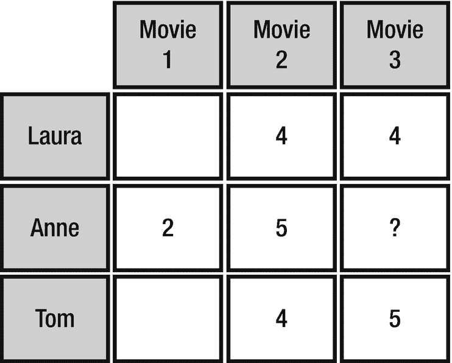
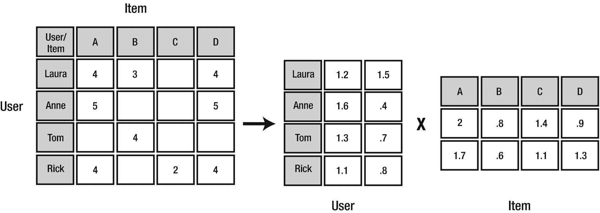

# 五、推荐

> *人是不知道渴望什么的生物，他求助于他人以下定决心。我们渴望别人渴望的东西，因为我们模仿他们的渴望。*
> 
> —勒内·吉拉德 <sup>我</sup>

提供个性化推荐是机器学习最流行的应用之一。几乎每个主要零售商，如亚马逊、阿里巴巴、沃尔玛和塔吉特，都根据顾客行为提供某种个性化推荐。网飞、Hulu 和 Spotify 等流媒体服务根据用户的口味和偏好提供电影或音乐推荐。

推荐对于提高客户满意度和参与度至关重要，最终会增加销售额和收入。为了突出推荐的重要性，44%的亚马逊客户从他们在亚马逊上看到的产品推荐中购买。 <sup>ii</sup> 麦肯锡的一份报告发现，35%的客户销售直接来自亚马逊的推荐。同一份研究报告称，75%的观众在网飞上观看的内容来自个性化推荐。网飞的首席产品官在一次采访中宣称，网飞的个性化电影和电视节目推荐每年给公司带来 10 亿美元的收入。阿里巴巴的推荐引擎帮助推动了创纪录的销售，成为世界上最大的电子商务公司和零售业巨头之一，2013 年销售额达 2480 亿美元(超过亚马逊和易贝的总和)。 <sup>v</sup>

推荐不仅限于零售商和流媒体服务。银行将推荐引擎作为一种有针对性的营销工具，利用它向在线银行客户提供金融产品和服务，如基于其人口统计和心理特征的家庭或学生贷款。广告和营销机构使用推荐引擎来显示高针对性的在线广告。

## 推荐引擎的类型

有几种类型的推荐引擎。 <sup>vi</sup> 我们将讨论最流行的:协同过滤、基于内容的过滤和关联规则。

### 交替最小二乘协同过滤

协同过滤经常被用于在 Web 上提供个性化推荐。使用协同过滤的公司包括网飞、亚马逊、阿里巴巴、Spotify 和苹果等。协同过滤根据其他人的(协同)偏好或品味提供推荐(过滤)。它基于这样一种想法，即具有相同偏好的人将来更有可能拥有相同的兴趣。例如，劳拉喜欢泰坦尼克号、T2、阿波罗 13 号和 T4 高耸的地狱。汤姆喜欢阿波罗 13 号和高耸的地狱。如果安妮喜欢*阿波罗 13* ，根据我们的计算，任何喜欢*阿波罗 13* 的人一定也喜欢*高耸的地狱*，那么*高耸的地狱*可能是安妮的潜在推荐。产品可以是任何项目，如电影、歌曲、视频或书籍。



图 5-1

作为评分矩阵<sup>【VII】</sup>

Spark MLlib 包括一种流行的协作过滤算法，称为交替最小二乘法(ALS)。ALS 将评分矩阵(图 5-1 )建模为用户与产品因素 <sup>viii</sup> (图 5-2 )的乘积。ALS 利用最小平方计算来最小化估计误差， <sup>ix</sup> 在固定客户因素和求解产品因素之间交替迭代，反之亦然，直到过程收敛。Spark MLlib 实现了 ALS 的分块版本，通过将两组因素(称为“用户”和“产品”)分组为块来利用 Spark 的分布式处理能力，并通过在每次迭代中仅向每个产品块发送每个用户向量的一个副本来减少通信，并且仅针对需要该用户的特征向量的产品块。 <sup>x</sup>



图 5-2

als 计算机如何推荐

Spark MLlib 的 ALS 实现支持显式和隐式评级。显式评级(默认)要求用户对产品的评级是一个分数(例如，1 `–` 5 个大拇指)，而隐式评级表示用户将与产品交互的信心(例如，点击数或页面浏览量，或者视频流的次数)。隐性评分在现实生活中更为常见，因为并非每个公司都会为其产品收集显性评分。然而，隐式评级可以从公司数据中提取，如网络日志、观看习惯或销售交易。Spark MLlib 的 ALS 实现使用整数作为项目和用户 id，这意味着项目和用户 id 必须在整数的范围内，最大值为 2，147，483，647。

Note

在 Yehuda Koren 和 Robert M. Bell 的论文“具有联合导出的邻域插值权重的可伸缩协同过滤”中描述了交替最小二乘法(ALS)。<sup>Xi</sup>

### 因素

Spark MLlib 的 ALS 实现支持以下参数 <sup>xii</sup> :

*   *alpha:* 适用于 ALS 的隐式反馈版本，指导偏好观察的基线置信度

*   *numBlocks:* *U* sed 进行并行处理；项目和用户将被划分成的块数

*   *非负:*表示是否对最小二乘使用非负约束

*   *implicitPrefs:* 表示是使用显式反馈还是隐式反馈

*   *k:* 表示模型中潜在因素的数量

*   *regParam* :正则化参数

*   *maxIter:* 表示要执行的最大迭代次数。

### 例子

我们将使用 MovieLens 数据集来构建一个玩具电影推荐系统。数据集可以从 [`https://grouplens.org/datasets/movielens/`](https://grouplens.org/datasets/movielens/) 下载。数据集中包含多个文件，但我们主要对 ratings.csv 感兴趣。清单 5-1 中显示的文件中的每一行都包含用户对一部电影的明确评级(1 `–` 5 评级)。

```py
val dataDF = spark.read.option("header", "true")
             .option("inferSchema", "true")
             .csv("ratings.csv")

dataDF.printSchema
root
 |-- userId: integer (nullable = true)
 |-- movieId: integer (nullable = true)
 |-- rating: double (nullable = true)
 |-- timestamp: integer (nullable = true)

dataDF.show
+------+-------+------+---------+
|userId|movieId|rating|timestamp|
+------+-------+------+---------+
|     1|      1|   4.0|964982703|
|     1|      3|   4.0|964981247|
|     1|      6|   4.0|964982224|
|     1|     47|   5.0|964983815|
|     1|     50|   5.0|964982931|
|     1|     70|   3.0|964982400|
|     1|    101|   5.0|964980868|
|     1|    110|   4.0|964982176|
|     1|    151|   5.0|964984041|
|     1|    157|   5.0|964984100|
|     1|    163|   5.0|964983650|
|     1|    216|   5.0|964981208|
|     1|    223|   3.0|964980985|
|     1|    231|   5.0|964981179|
|     1|    235|   4.0|964980908|
|     1|    260|   5.0|964981680|
|     1|    296|   3.0|964982967|
|     1|    316|   3.0|964982310|
|     1|    333|   5.0|964981179|
|     1|    349|   4.0|964982563|
+------+-------+------+---------+
only showing top 20 rows

val Array(trainingData, testData) = dataDF.randomSplit(Array(0.7, 0.3))

import org.apache.spark.ml.recommendation.ALS

val als = new ALS()
          .setMaxIter(15)
          .setRank(10)
          .setSeed(1234)
          .setRatingCol("rating")
          .setUserCol("userId")
          .setItemCol("movieId")

val model = als.fit(trainingData)

val predictions = model.transform(testData)

predictions.printSchema
root
 |-- userId: integer (nullable = true)
 |-- movieId: integer (nullable = true)
 |-- rating: double (nullable = true)
 |-- timestamp: integer (nullable = true)
 |-- prediction: float (nullable = false)

predictions.show

+------+-------+------+----------+----------+
|userId|movieId|rating| timestamp|prediction|
+------+-------+------+----------+----------+
|   133|    471|   4.0| 843491793| 2.5253267|
|   602|    471|   4.0| 840876085| 3.2802277|
|   182|    471|   4.5|1054779644| 3.6534667|
|   500|    471|   1.0|1005528017| 3.5033386|
|   387|    471|   3.0|1139047519| 2.6689813|
|   610|    471|   4.0|1479544381|  3.006948|
|   136|    471|   4.0| 832450058| 3.1404104|
|   312|    471|   4.0|1043175564|  3.109232|
|   287|    471|   4.5|1110231536| 2.9776838|
|    32|    471|   3.0| 856737165| 3.5183017|
|   469|    471|   5.0| 965425364| 2.8298397|
|   608|    471|   1.5|1117161794|  3.007364|
|   373|    471|   5.0| 846830388| 3.9275675|
|   191|    496|   5.0| 829760898|       NaN|
|    44|    833|   2.0| 869252237| 2.4776468|
|   609|    833|   3.0| 847221080| 1.9167987|
|   608|    833|   0.5|1117506344|  2.220617|
|   463|   1088|   3.5|1145460096| 3.0794377|
|    47|   1088|   4.0|1496205519| 2.4831696|
|   479|   1088|   4.0|1039362157| 3.5400867|
+------+-------+------+----------+----------+

import org.apache.spark.ml.evaluation.RegressionEvaluator

val evaluator = new RegressionEvaluator()
                .setPredictionCol("prediction")
                .setLabelCol("rating")
                .setMetricName("rmse")

val rmse = evaluator.evaluate(predictions)
rmse: Double = NaN

Listing 5-1Movie Recommendations with ALS

```

看起来评估者不喜欢预测数据帧中的 NaN 值。现在让我们通过删除具有 NaN 值的行来解决这个问题。我们稍后将讨论如何使用 coldStartStrategy 参数来处理这个问题。

```py
val predictions2 = predictions.na.drop

predictions2.show

+------+-------+------+----------+----------+
|userId|movieId|rating| timestamp|prediction|
+------+-------+------+----------+----------+
|   133|    471|   4.0| 843491793| 2.5253267|
|   602|    471|   4.0| 840876085| 3.2802277|
|   182|    471|   4.5|1054779644| 3.6534667|
|   500|    471|   1.0|1005528017| 3.5033386|
|   387|    471|   3.0|1139047519| 2.6689813|
|   610|    471|   4.0|1479544381|  3.006948|
|   136|    471|   4.0| 832450058| 3.1404104|
|   312|    471|   4.0|1043175564|  3.109232|
|   287|    471|   4.5|1110231536| 2.9776838|
|    32|    471|   3.0| 856737165| 3.5183017|
|   469|    471|   5.0| 965425364| 2.8298397|
|   608|    471|   1.5|1117161794|  3.007364|
|   373|    471|   5.0| 846830388| 3.9275675|
|    44|    833|   2.0| 869252237| 2.4776468|
|   609|    833|   3.0| 847221080| 1.9167987|
|   608|    833|   0.5|1117506344|  2.220617|
|   463|   1088|   3.5|1145460096| 3.0794377|
|    47|   1088|   4.0|1496205519| 2.4831696|
|   479|   1088|   4.0|1039362157| 3.5400867|
|   554|   1088|   5.0| 944900489| 3.3577442|
+------+-------+------+----------+----------+
only showing top 20 rows

val evaluator = new RegressionEvaluator()
                .setPredictionCol("prediction")
                .setLabelCol("rating")
                .setMetricName("rmse")

val rmse = evaluator.evaluate(predictions2)
rmse: Double = 0.9006479893684061

```

Note

使用 ALS 时，您有时会遇到在模型定型时不存在的用户和/或测试数据集中的项目。新用户或项目可能没有任何评级，并且模型没有在其上被训练。这就是所谓的冷启动问题。当数据在评估数据集和训练数据集之间随机拆分时，也可能会遇到这种情况。当用户和/或项目不在模型中时，预测设置为 NaN。这就是我们之前在评估模型时遇到 NaN 结果的原因。为了解决这个问题，Spark 提供了一个 coldStartStrategy 参数，该参数可以设置为删除预测数据帧中包含 NaN 值的所有行。<sup>XIII</sup>T3】

让我们提出一些建议。

为所有用户推荐前三部电影。

```py
model.recommendForAllUsers(3).show(false)

+------+----------------------------------------------------------+
|userId|recommendations                                           |
+------+----------------------------------------------------------+
|471   |[[7008, 4.8596725], [7767, 4.8047066], [26810, 4.7513227]]|
|463   |[[33649, 5.0881286], [3347, 4.7693057], [68945, 4.691733]]|
|496   |[[6380, 4.946864], [26171, 4.8910613], [7767, 4.868356]]  |
|148   |[[183897, 4.972257], [6732, 4.561547], [33649, 4.5440807]]|
|540   |[[26133, 5.19643], [68945, 5.1259947], [3379, 5.1259947]] |
|392   |[[3030, 6.040107], [4794, 5.6566052], [55363, 5.4429026]] |
|243   |[[1223, 6.5019746], [68945, 6.353135], [3379, 6.353135]]  |
|31    |[[4256, 5.3734074], [49347, 5.365612], [7071, 5.3175936]] |
|516   |[[4429, 4.8486495], [48322, 4.8443394], [28, 4.8082485]]  |
|580   |[[86347, 5.20571], [4256, 5.0522637], [72171, 5.037114]]  |
|251   |[[33649, 5.6993585], [68945, 5.613014], [3379, 5.613014]] |
|451   |[[68945, 5.392536], [3379, 5.392536], [905, 5.336588]]    |
|85    |[[25771, 5.2532864], [8477, 5.186757], [99764, 5.1611686]]|
|137   |[[7008, 4.8952146], [26131, 4.8543305], [3200, 4.6918836]]|
|65    |[[33649, 4.695069], [3347, 4.5379376], [7071, 4.535537]]  |
|458   |[[3404, 5.7415047], [7018, 5.390625], [42730, 5.343014]]  |
|481   |[[232, 4.393473], [3473, 4.3804317], [26133, 4.357505]]   |
|53    |[[3200, 6.5110188], [33649, 6.4942613], [3347, 6.452143]] |
|255   |[[86377, 5.9217377], [5047, 5.184309], [6625, 4.962062]]  |
|588   |[[26133, 4.7600465], [6666, 4.65716], [39444, 4.613207]]  |
+------+----------------------------------------------------------+
only showing top 20 rows

```

推荐所有电影前三用户。

```py
model.recommendForAllItems(3).show(false)

+-------+------------------------------------------------------+
|movieId|recommendations                                       |
+-------+------------------------------------------------------+
|1580   |[[53, 4.939177], [543, 4.8362885], [452, 4.5791063]]  |
|4900   |[[147, 3.0081954], [375, 2.9420073], [377, 2.6285374]]|
|5300   |[[53, 4.29147], [171, 4.129584], [375, 4.1011653]]    |
|6620   |[[392, 5.0614614], [191, 4.820595], [547, 4.7811346]] |
|7340   |[[413, 3.2256641], [578, 3.1126869], [90, 3.0790782]] |
|32460  |[[53, 5.642673], [12, 5.5260286], [371, 5.2030106]]   |
|54190  |[[53, 5.544555], [243, 5.486003], [544, 5.243029]]    |
|471    |[[51, 5.073474], [53, 4.8641024], [337, 4.656805]]    |
|1591   |[[112, 4.250576], [335, 4.147236], [207, 4.05843]]    |
|140541 |[[393, 4.4335465], [536, 4.1968756], [388, 4.0388694]]|
|1342   |[[375, 4.3189483], [313, 3.663758], [53, 3.5866988]]  |
|2122   |[[375, 4.3286233], [147, 4.3245177], [112, 3.8350344]]|
|2142   |[[51, 3.9718416], [375, 3.8228302], [122, 3.8117828]] |
|7982   |[[191, 5.297085], [547, 5.020829], [187, 4.984965]]   |
|44022  |[[12, 4.5919843], [53, 4.501897], [523, 4.301981]]    |
|141422 |[[456, 2.7050805], [597, 2.6988854], [498, 2.6347125]]|
|833    |[[53, 3.8047972], [543, 3.740805], [12, 3.6920836]]   |
|5803   |[[537, 3.8269677], [544, 3.8034997], [259, 3.76062]]  |
|7993   |[[375, 2.93635], [53, 2.9159238], [191, 2.8663528]]   |
|160563 |[[53, 4.048704], [243, 3.9232922], [337, 3.7616432]]  |
+-------+------------------------------------------------------+
only showing top 20 rows

```

为一组指定的电影生成前三个用户推荐。

```py
model.recommendForItemSubset(Seq((111), (202), (225), (347), (488)).toDF("movieId"), 3).show(false)

+-------+----------------------------------------------------+
|movieId|recommendations                                     |
+-------+----------------------------------------------------+
|225    |[[53, 4.4893017], [147, 4.483344], [276, 4.2529426]]|
|111    |[[375, 5.113064], [53, 4.9947076], [236, 4.9493203]]|
|347    |[[191, 4.686208], [236, 4.51165], [40, 4.409832]]   |
|202    |[[53, 3.349618], [578, 3.255436], [224, 3.245058]]  |
|488    |[[558, 3.3870435], [99, 3.2978806], [12, 3.2749753]]|
+-------+----------------------------------------------------+

```

为指定的一组用户生成前三部电影推荐。

```py
model.recommendForUserSubset(Seq((111), (100), (110), (120), (130)).toDF("userId"), 3).show(false)

+------+--------------------------------------------------------------+
|userId|recommendations                                               |
+------+--------------------------------------------------------------+
|111   |[[106100, 4.956068], [128914, 4.9050474], [162344, 4.9050474]]|
|120   |[[26865, 4.979374], [3508, 4.6825113], [3200, 4.6406555]]     |
|100   |[[42730, 5.2531567], [5867, 5.1075697], [3404, 5.0877166]]    |
|130   |[[86377, 5.224841], [3525, 5.0586476], [92535, 4.9758487]]    |
|110   |[[49932, 4.6330786], [7767, 4.600622], [26171, 4.5615706]]    |
+------+--------------------------------------------------------------+

```

协同过滤可以非常有效地提供高度相关的推荐。它的扩展性很好，可以处理非常大的数据集。为了使协同过滤以最佳方式运行，它需要访问大量数据。数据越多越好。随着时间的推移，评分开始累积，推荐会变得越来越准确。在实现的早期阶段，访问大型数据集通常是一个问题。一种解决方案是将基于内容的过滤与协作过滤结合使用。由于基于内容的过滤不依赖于用户活动，它可以立即开始提供建议，随着时间的推移逐渐增加您的数据集。

## 具有 FP 增长的市场篮分析

购物篮分析是一种简单但重要的技术，通常被零售商用来提供产品推荐。它使用交易数据集来确定哪些产品经常一起购买。零售商可以利用这些建议进行个性化的交叉销售和追加销售，帮助提高转化率并最大化每个客户的价值。

在浏览 Amazon.com 时，你很可能已经看到了市场篮子分析在起作用。Amazon.com 产品页面通常会有一个名为“购买该商品的客户也购买了”的部分，为您提供一个经常与您当前浏览的产品一起购买的商品列表。该列表是通过购物篮分析生成的。实体店零售商也使用购物篮分析，通过告知货架图中的产品位置和相邻位置来优化商店。这样做的目的是通过把互补的物品放在一起来增加销量。

购物篮分析使用关联规则学习来进行推荐。关联规则使用大型事务数据集寻找项目之间的关系。 <sup>xiv</sup> 关联规则是由两个或两个以上称为*项集*的项计算出来的。关联规则由前因(if)和后果(then)组成。例如，如果有人买饼干(前因)，那么这个人也更有可能买牛奶(后果)。流行的关联规则算法包括 Apriori、SETM、ECLAT 和 FP-Growth。Spark MLlib 为关联规则挖掘提供了一个高度可扩展的 FP-Growth 实现。 <sup>xv</sup> FP-Growth 使用频繁模式(*“FP”*代表频繁模式)树结构识别频繁项目并计算项目频率。T13】XVIT15】

Note

FP-Growth 在 Jiawei Han、Jian Pei 和 Iwen Yin 的论文“*挖掘无候选生成的频繁模式”*中有所描述。T3】XVIIT5】

### 例子

对于使用 FP-Growth 的购物篮分析示例，我们将使用流行的 Instacart 在线杂货购物数据集。 <sup>xviii</sup> 该数据集包含来自 200，000 名 Instacart 客户的 50，000 种产品的 340 万份杂货订单。可以从 [`www.instacart.com/datasets/grocery-shopping-2017`](http://www.instacart.com/datasets/grocery-shopping-2017) 下载数据集。对于 FP-Growth，我们只需要 products 和 order_products_train 表(参见清单 5-2 )。

```py
val productsDF = spark.read.format("csv")
                 .option("header", "true")
                 .option("inferSchema","true")
                 .load("/instacart/products.csv")

ProductsDF.show(false)

+----------+-------------------------------------------------+
|product_id|product_name                                     |
+----------+-------------------------------------------------+
|1         |Chocolate Sandwich Cookies                       |
|2         |All-Seasons Salt                                 |
|3         |Robust Golden Unsweetened Oolong Tea             |
|4         |Smart Ones Classic Favorites Mini Rigatoni With  |
|5         |Green Chile Anytime Sauce                        |
|6         |Dry Nose Oil                                     |
|7         |Pure Coconut Water With Orange                   |
|8         |Cut Russet Potatoes Steam N' Mash                |
|9         |Light Strawberry Blueberry Yogurt                |
|10        |Sparkling Orange Juice & Prickly Pear Beverage   |
|11        |Peach Mango Juice                                |
|12        |Chocolate Fudge Layer Cake                       |
|13        |Saline Nasal Mist                                |
|14        |Fresh Scent Dishwasher Cleaner                   |
|15        |Overnight Diapers Size 6                         |
|16        |Mint Chocolate Flavored Syrup                    |
|17        |Rendered Duck Fat                                |
|18        |Pizza for One Suprema  Frozen Pizza              |
|19        |Gluten Free Quinoa Three Cheese & Mushroom Blend |
|20        |Pomegranate Cranberry & Aloe Vera Enrich Drink   |
+----------+-------------------------------------------------+

+--------+-------------+

|aisle_id|department_id|
+--------+-------------+
|61      |19           |
|104     |13           |
|94      |7            |
|38      |1            |
|5       |13           |
|11      |11           |
|98      |7            |
|116     |1            |
|120     |16           |
|115     |7            |
|31      |7            |
|119     |1            |
|11      |11           |
|74      |17           |
|56      |18           |
|103     |19           |
|35      |12           |
|79      |1            |
|63      |9            |
|98      |7            |
+--------+-------------+

only showing top 20 rows

val orderProductsDF = spark.read.format("csv")
                      .option("header", "true")
                      .option("inferSchema","true")
                      .load("/instacart/order_products__train.csv")

orderProductsDF.show()

+--------+----------+-----------------+---------+
|order_id|product_id|add_to_cart_order|reordered|
+--------+----------+-----------------+---------+
|       1|     49302|                1|        1|
|       1|     11109|                2|        1|
|       1|     10246|                3|        0|
|       1|     49683|                4|        0|
|       1|     43633|                5|        1|
|       1|     13176|                6|        0|
|       1|     47209|                7|        0|
|       1|     22035|                8|        1|
|      36|     39612|                1|        0|
|      36|     19660|                2|        1|
|      36|     49235|                3|        0|
|      36|     43086|                4|        1|
|      36|     46620|                5|        1|
|      36|     34497|                6|        1|
|      36|     48679|                7|        1|
|      36|     46979|                8|        1|
|      38|     11913|                1|        0|
|      38|     18159|                2|        0|
|      38|      4461|                3|        0|
|      38|     21616|                4|        1|
+--------+----------+-----------------+---------+
only showing top 20 rows

// Create temporary tables

.

orderProductsDF.createOrReplaceTempView("order_products_train")
productsDF.createOrReplaceTempView("products")

val joinedData = spark.sql("select p.product_name, o.order_id from order_products_train o inner join products p where p.product_id = o.product_id")

import org.apache.spark.sql.functions.max
import org.apache.spark.sql.functions.collect_set

val basketsDF = joinedData
                .groupBy("order_id")
                .agg(collect_set("product_name")
                .alias("items"))

basketsDF.createOrReplaceTempView("baskets"

basketsDF.show(20,55)

+--------+-------------------------------------------------------+
|order_id|                                                  items|
+--------+-------------------------------------------------------+
|    1342|[Raw Shrimp, Seedless Cucumbers, Versatile Stain Rem...|
|    1591|[Cracked Wheat, Strawberry Rhubarb Yoghurt, Organic ...|
|    4519|[Beet Apple Carrot Lemon Ginger Organic Cold Pressed...|
|    4935|                                                [Vodka]|
|    6357|[Globe Eggplant, Panko Bread Crumbs, Fresh Mozzarell...|
|   10362|[Organic Baby Spinach, Organic Spring Mix, Organic L...|
|   19204|[Reduced Fat Crackers, Dishwasher Cleaner, Peanut Po...|
|   29601|[Organic Red Onion, Small Batch Authentic Taqueria T...|
|   31035|[Organic Cripps Pink Apples, Organic Golden Deliciou...|
|   40011|[Organic Baby Spinach, Organic Blues Bread with Blue...|
|   46266|[Uncured Beef Hot Dog, Organic Baby Spinach, Smoked ...|
|   51607|[Donut House Chocolate Glazed Donut Coffee K Cup, Ma...|
|   58797|[Concentrated Butcher's Bone Broth, Chicken, Seedles...|
|   61793|[Raspberries, Green Seedless Grapes, Clementines, Na...|
|   67089|[Original Tofurky Deli Slices, Sharp Cheddar Cheese,...|
|   70863|[Extra Hold Non-Aerosol Hair Spray, Bathroom Tissue,...|
|   88674|[Organic Coconut Milk, Everything Bagels, Rosemary, ...|
|   91937|[No. 485 Gin, Monterey Jack Sliced Cheese, Tradition...|
|   92317|[Red Vine Tomato, Harvest Casserole Bowls, Organic B...|
|   99621|[Organic Baby Arugula, Organic Garlic, Fennel, Lemon...|

+--------+-------------------------------------------------------+
only showing top 20 rows

import org.apache.spark.ml.fpm.FPGrowth

// FPGrowth only needs a string containing the list of items.

val basketsDF = spark.sql("select items from baskets")
                .as[Array[String]].toDF("items")

basketsDF.show(20,55)
+-------------------------------------------------------+
|                                                  items|
+-------------------------------------------------------+
|[Raw Shrimp, Seedless Cucumbers, Versatile Stain Rem...|
|[Cracked Wheat, Strawberry Rhubarb Yoghurt, Organic ...|
|[Beet Apple Carrot Lemon Ginger Organic Cold Pressed...|
|                                                [Vodka]|
|[Globe Eggplant, Panko Bread Crumbs, Fresh Mozzarell...|
|[Organic Baby Spinach, Organic Spring Mix, Organic L...|
|[Reduced Fat Crackers, Dishwasher Cleaner, Peanut Po...|
|[Organic Red Onion, Small Batch Authentic Taqueria T...|
|[Organic Cripps Pink Apples, Organic Golden Deliciou...|
|[Organic Baby Spinach, Organic Blues Bread with Blue...|
|[Uncured Beef Hot Dog, Organic Baby Spinach, Smoked ...|
|[Donut House Chocolate Glazed Donut Coffee K Cup, Ma...|
|[Concentrated Butcher's Bone Broth, Chicken, Seedles...|
|[Raspberries, Green Seedless Grapes, Clementines, Na...|
|[Original Tofurky Deli Slices, Sharp Cheddar Cheese,...|
|[Extra Hold Non-Aerosol Hair Spray, Bathroom Tissue,...|
|[Organic Coconut Milk, Everything Bagels, Rosemary, ...|
|[No. 485 Gin, Monterey Jack Sliced Cheese, Tradition...|
|[Red Vine Tomato, Harvest Casserole Bowls, Organic B...|
|[Organic Baby Arugula, Organic Garlic, Fennel, Lemon...|
+-------------------------------------------------------+
only showing top 20 rows

val fpgrowth = new FPGrowth()
               .setItemsCol("items")
               .setMinSupport(0.002)
               .setMinConfidence(0)

val model = fpgrowth.fit(basketsDF)

// Frequent itemsets.

val mostPopularItems = model.freqItemsets

mostPopularItems.createOrReplaceTempView("mostPopularItems")

// Verify results.

spark.sql("select ∗ from mostPopularItems wheresize(items) >= 2 order by freq desc")
          .show(20,55)

+----------------------------------------------+----+
|                                         items|freq|
+----------------------------------------------+----+
|[Organic Strawberries, Bag of Organic Bananas]|3074|
|[Organic Hass Avocado, Bag of Organic Bananas]|2420|
|[Organic Baby Spinach, Bag of Organic Bananas]|2236|
|                     [Organic Avocado, Banana]|2216|
|                [Organic Strawberries, Banana]|2174|
|                         [Large Lemon, Banana]|2158|
|                [Organic Baby Spinach, Banana]|2000|
|                        [Strawberries, Banana]|1948|
| [Organic Raspberries, Bag of Organic Bananas]|1780|
|   [Organic Raspberries, Organic Strawberries]|1670|
|  [Organic Baby Spinach, Organic Strawberries]|1639|
|                          [Limes, Large Lemon]|1595|
|  [Organic Hass Avocado, Organic Strawberries]|1539|
|       [Organic Avocado, Organic Baby Spinach]|1402|
|                [Organic Avocado, Large Lemon]|1349|
|                               [Limes, Banana]|1331|
|   [Organic Blueberries, Organic Strawberries]|1269|
|    [Organic Cucumber, Bag of Organic Bananas]|1268|
|  [Organic Hass Avocado, Organic Baby Spinach]|1252|
|           [Large Lemon, Organic Baby Spinach]|1238|
+----------------------------------------------+----+
only showing top 20 rows

spark.sql("select ∗ from mostPopularItems where
          size(items) > 2 order by freq desc")
          .show(20,65)

+-----------------------------------------------------------------+----+
|                                                            items|freq|

+-----------------------------------------------------------------+----+
|[Organic Hass Avocado, Organic Strawberries, Bag of Organic Ba...| 710|
|[Organic Raspberries, Organic Strawberries, Bag of Organic Ban...| 649|
|[Organic Baby Spinach, Organic Strawberries, Bag of Organic Ba...| 587|
|[Organic Raspberries, Organic Hass Avocado, Bag of Organic Ban...| 531|
|[Organic Hass Avocado, Organic Baby Spinach, Bag of Organic Ba...| 497|
|                  [Organic Avocado, Organic Baby Spinach, Banana]| 484|
|                           [Organic Avocado, Large Lemon, Banana]| 477|
|                                     [Limes, Large Lemon, Banana]| 452|
| [Organic Cucumber, Organic Strawberries, Bag of Organic Bananas]| 424|
|                            [Limes, Organic Avocado, Large Lemon]| 389|
|[Organic Raspberries, Organic Hass Avocado, Organic Strawberries]| 381|
|                  [Organic Avocado, Organic Strawberries, Banana]| 379|
|             [Organic Baby Spinach, Organic Strawberries, Banana]| 376|
|[Organic Blueberries, Organic Strawberries, Bag of Organic Ban...| 374|
|                      [Large Lemon, Organic Baby Spinach, Banana]| 371|
| [Organic Cucumber, Organic Hass Avocado, Bag of Organic Bananas]| 366|
|    [Organic Lemon, Organic Hass Avocado, Bag of Organic Bananas]| 353|
|                                 [Limes, Organic Avocado, Banana]| 352|
|[Organic Whole Milk, Organic Strawberries, Bag of Organic Bana...| 339|
|             [Organic Avocado, Large Lemon, Organic Baby Spinach]| 334|
+-----------------------------------------------------------------+----+
only showing top 20 rows

Listing 5-2Market Basket Analysis with FP-Growth

```

显示的是最有可能一起购买的商品。列表中最受欢迎的是有机鳄梨、有机草莓和一袋有机香蕉的组合。这种列表可以是“经常一起购买”`-`类型推荐的基础。

```py
// The FP-Growth model also generates association rules. The output includes
// the antecedent, consequent, and confidence (probability). The minimum
// confidence for generating association rule is determined by the
// minConfidence parameter.

val AssocRules = model.associationRules
AssocRules.createOrReplaceTempView("AssocRules")

spark.sql("select antecedent, consequent,
          confidence from AssocRules order by confidence desc")
          .show(20,55)

+-------------------------------------------------------+
|                                             antecedent|
+-------------------------------------------------------+
|            [Organic Raspberries, Organic Hass Avocado]|
|                        [Strawberries, Organic Avocado]|
|           [Organic Hass Avocado, Organic Strawberries]|
|                  [Organic Lemon, Organic Hass Avocado]|
|                  [Organic Lemon, Organic Strawberries]|
|               [Organic Cucumber, Organic Hass Avocado]|
|[Organic Large Extra Fancy Fuji Apple, Organic Straw...|
|           [Organic Yellow Onion, Organic Hass Avocado]|
|                            [Strawberries, Large Lemon]|
|             [Organic Blueberries, Organic Raspberries]|
|               [Organic Cucumber, Organic Strawberries]|
|               [Organic Zucchini, Organic Hass Avocado]|
|            [Organic Raspberries, Organic Baby Spinach]|
|           [Organic Hass Avocado, Organic Baby Spinach]|
|               [Organic Zucchini, Organic Strawberries]|
|            [Organic Raspberries, Organic Strawberries]|
|                                       [Bartlett Pears]|
|                                          [Gala Apples]|
|                               [Limes, Organic Avocado]|
|            [Organic Raspberries, Organic Hass Avocado]|
+-------------------------------------------------------+

+------------------------+-------------------+

|              consequent|         confidence|
+------------------------+-------------------+
|[Bag of Organic Bananas]|  0.521099116781158|
|                [Banana]| 0.4643478260869565|
|[Bag of Organic Bananas]| 0.4613385315139701|
|[Bag of Organic Bananas]| 0.4519846350832266|
|[Bag of Organic Bananas]| 0.4505169867060561|
|[Bag of Organic Bananas]| 0.4404332129963899|
|[Bag of Organic Bananas]| 0.4338461538461538|
|[Bag of Organic Bananas]|0.42270861833105333|
|                [Banana]| 0.4187779433681073|
|  [Organic Strawberries]|  0.414985590778098|
|[Bag of Organic Bananas]| 0.4108527131782946|
|[Bag of Organic Bananas]|0.40930232558139534|
|[Bag of Organic Bananas]|0.40706806282722513|
|[Bag of Organic Bananas]|0.39696485623003197|
|[Bag of Organic Bananas]| 0.3914780292942743|
|[Bag of Organic Bananas]|0.38862275449101796|
|                [Banana]| 0.3860811930405965|
|                [Banana]|0.38373305526590196|
|           [Large Lemon]| 0.3751205400192864|
|  [Organic Strawberries]|0.37389597644749756|
+------------------------+-------------------+

only showing top 20 rows

```

根据产量，购买有机树莓、有机鳄梨和有机草莓的顾客也更有可能购买有机香蕉。正如你所看到的，香蕉是非常受欢迎的商品。这种列表可以是“购买了该商品的顾客也购买了”`-`类型推荐的基础。

Note

除了 FP-Growth 之外，Spark MLlib 还包括另一个用于频率模式匹配的算法实现，称为 PrefixSpan。虽然 FP-Growth 与项集的排序方式无关，但 PrefixSpan 使用序列或项集的有序列表来发现数据集中的顺序模式。PrefixSpan 属于称为序列模式挖掘的算法子组。PrefixSpan 在 Jian Pei 等人的论文“*通过模式增长挖掘序列模式:PrefixSpan 方法”*中有所描述。

### 基于内容的过滤

基于内容的过滤通过将项目信息(如项目名称、描述或类别)与用户配置文件进行比较来提供建议。让我们以一个基于内容的电影推荐系统为例。如果系统根据用户的个人资料确定用户偏爱加里·格兰特电影，它可能会开始推荐他的电影，如《西北偏北》、《T2 捉贼》和《T4 艳遇》。推荐者可以推荐相同类型演员的电影，例如吉米·斯图尔特、格里高里·派克或克拉克·盖博(经典电影)。经常与加里·格兰特合作的阿尔弗雷德·希区柯克和乔治·库克导演的电影也值得推荐。尽管简单，基于内容的推荐引擎通常提供相关的结果。也很容易实现。该系统可以立即提供推荐，而无需等待用户的显式或隐式反馈，这是一项艰巨的要求，困扰着其他方法，如协同过滤。

不利的一面是，基于内容的过滤在推荐方面缺乏多样性和新颖性。观众有时会想要更广泛的电影选择或更前卫的东西，这可能不是观众个人资料的完美匹配。可扩展性是困扰基于内容的推荐系统的另一个挑战。为了生成高度相关的推荐，基于内容的引擎需要大量关于它推荐的项目的相关领域特定信息。对于一个电影推荐者来说，仅仅根据标题、描述或类型来给出建议是不够的。内部数据可能需要用来自 IMDB 或烂番茄等第三方来源的数据进行扩充。诸如潜在狄利克雷分配(LDA)之类的无监督学习方法可用于从这些数据源提取的元数据中创建新主题。我在第四章中详细讨论了 LDA。

网飞在这一领域处于领先地位，它创建了数千个微引擎，提供高度有针对性的个性化推荐*。*比如*，*网飞不仅知道我老婆爱看韩国电影，还知道她喜欢*浪漫音乐剧韩国电影*，*谋杀悬疑僵尸韩国电影*，*纪录片黑帮韩国僵尸电影，*还有她个人最喜欢的*法庭剧法律惊悚僵尸韩国电影*。通过一个类似土耳其人的机械系统，网飞雇佣了兼职电影爱好者来为其图书馆中的数千部电影和电视节目手动分配描述和类别。最近一次统计显示，网飞有 76897 只独特的小企鹅。这是一种新的个性化水平，在网飞以外的任何地方都没有见过。

Spark MLlib 不包括基于内容的过滤算法，尽管 Spark 有必要的组件来帮助您开发自己的实现。首先，我建议您研究 Spark 中一种高度可扩展的相似性算法，称为“*使用 MapReduce* 的维度独立矩阵平方”，简称 DIMSUM。查看 [`https://bit.ly/2YV6qTr`](https://bit.ly/2YV6qTr) 了解更多关于 DIMSUM 的信息。 <sup>xx</sup>

## 摘要

每种方法都有自己的优点和缺点。在真实的场景中，通常的做法是构建一个混合推荐引擎，结合多种技术来增强结果。推荐者是研究的沃土。考虑到它为一些世界上最大的公司创造的收入，预计这一领域很快会有更多的发展。FP-Growth 的例子改编自 Bhavin Kukadia 和 Denny Lee 在 Databricks 的工作。<sup>XXI</sup>T3】

## 参考

1.  勒内·吉拉德；“rené girard and mimetic theory，”仿. org，2019 年，

2.  迈克尔·奥斯本；“零售品牌如何利用亚马逊的战术竞争并取胜”，forbes.com，2017， [`www.forbes.com/sites/forbesagencycouncil/2017/12/21/how-retail-brands-can-compete-and-win-using-amazons-tactics/#4f4e55bc5e18`](http://www.forbes.com/sites/forbesagencycouncil/2017/12/21/how-retail-brands-can-compete-and-win-using-amazons-tactics/%25234f4e55bc5e18)

3.  伊恩·麦肯齐等人；“零售商如何才能跟上消费者”，mckinsey.com，2013， [`www.mckinsey.com/industries/retail/our-insights/how-retailers-can-keep-up-with-consumers`](http://www.mckinsey.com/industries/retail/our-insights/how-retailers-can-keep-up-with-consumers)

4.  内森·麦卡龙；《为什么网飞认为其个性化推荐引擎每年价值 10 亿美元》，businessinsider.com，2016， [`www.businessinsider.com/netflix-recommendation-engine-worth-1-billion-per-year-2016-6`](http://www.businessinsider.com/netflix-recommendation-engine-worth-1-billion-per-year-2016-6)

5.  伯纳德·马尔；“中国科技巨头阿里巴巴使用人工智能和机器学习的惊人方式”，2018， [`www.forbes.com/sites/bernardmarr/2018/07/23/the-amazing-ways-chinese-tech-giant-alibaba-uses-artificial-intelligence-and-machine-learning/#686ffa0117a9`](http://www.forbes.com/sites/bernardmarr/2018/07/23/the-amazing-ways-chinese-tech-giant-alibaba-uses-artificial-intelligence-and-machine-learning/%2523686ffa0117a9)

6.  威廉·沃希斯；《5 类推荐人》，datasciencecentral.com，2017， [`www.datasciencecentral.com/m/blogpost?id=6448529%3ABlogPost%3A512183`](http://www.datasciencecentral.com/m/blogpost%253Fid%253D6448529%253ABlogPost%253A512183)

7.  卡罗尔·麦克唐纳；《用 Spark 打造推荐引擎》，mapr.com，2015， [`https://mapr.com/ebooks/spark/08-recommendation-engine-spark.html`](https://mapr.com/ebooks/spark/08-recommendation-engine-spark.html)

8.  Burak Yavuz 等人；“使用 Apache Spark MLlib 的可扩展协同过滤”，Databricks.com，2014， [`https://databricks.com/blog/2014/07/23/scalable-collaborative-filtering-with-spark-mllib.html`](https://databricks.com/blog/2014/07/23/scalable-collaborative-filtering-with-spark-mllib.html)

9.  IBM《Apache Spark 实验室简介，第三部分:机器学习》，IBM.com，2017， [`https://dataplatform.cloud.ibm.com/exchange/public/entry/view/5ad1c820f57809ddec9a040e37b4af08`](https://dataplatform.cloud.ibm.com/exchange/public/entry/view/5ad1c820f57809ddec9a040e37b4af08)

10.  火花；《类渐冻人症》，spark.apache.org，2019， [`https://spark.apache.org/docs/2.0.0/api/java/org/apache/spark/mllib/recommendation/ALS.html`](https://spark.apache.org/docs/2.0.0/api/java/org/apache/spark/mllib/recommendation/ALS.html)

11.  罗伯特·贝尔和耶胡达·科伦；“联合导出邻域插值权重的可扩展协同过滤”，acm.org，2007， [`https://dl.acm.org/citation.cfm?id=1442050`](https://dl.acm.org/citation.cfm%253Fid%253D1442050)

12.  阿帕奇 Spark《协同过滤》，spark.apache.org，2019， [`https://spark.apache.org/docs/latest/ml-collaborative-filtering.html`](https://spark.apache.org/docs/latest/ml-collaborative-filtering.html)

13.  阿帕奇 Spark《协同过滤》，spark.apache.org，2019， [`https://spark.apache.org/docs/latest/ml-collaborative-filtering.html`](https://spark.apache.org/docs/latest/ml-collaborative-filtering.html)

14.  玛格丽特·劳斯；《关联规则(在数据挖掘中)》，techtarget.com，2018， [`https://searchbusinessanalytics.techtarget.com/definition/association-rules-in-data-mining`](https://searchbusinessanalytics.techtarget.com/definition/association-rules-in-data-mining)

15.  阿帕奇 Spark《频繁模式挖掘》，spark.apache.org，2019， [`https://spark.apache.org/docs/2.3.0/mllib-frequent-pattern-mining.html`](https://spark.apache.org/docs/2.3.0/mllib-frequent-pattern-mining.html)

16.  韩佳伟等人。艾尔。；“挖掘无候选代的频繁模式”，acm.org，2000， [`https://dl.acm.org/citation.cfm?doid=335191.335372`](https://dl.acm.org/citation.cfm%253Fdoid%253D335191.335372)

17.  韩家伟，等；“挖掘无候选代的频繁模式”，acm.org，2000， [`https://dl.acm.org/citation.cfm?id=335372%C3%DC`](https://dl.acm.org/citation.cfm%253Fid%253D335372%25C3%25DC)

18.  巴文·库卡迪亚和丹尼·李；“使用数据块上的 FP-growth 简化市场篮子分析”，Databricks.com，2018， [`https://databricks.com/blog/2018/09/18/simplify-market-basket-analysis-using-fp-growth-on-databricks.html`](https://databricks.com/blog/2018/09/18/simplify-market-basket-analysis-using-fp-growth-on-databricks.html)

19.  泰勒·基南；"什么是基于内容的过滤？"，upwork.com，2019， [`www.upwork.com/hiring/data/what-is-content-based-filtering/`](http://www.upwork.com/hiring/data/what-is-content-based-filtering/)

20.  礼萨·扎德；“高效的相似性算法现在出现在 Apache Spark，这要归功于 Twitter，”Databricks.com，2014， [`https://databricks.com/blog/2014/10/20/efficient-similarity-algorithm-now-in-spark-twitter.html`](https://databricks.com/blog/2014/10/20/efficient-similarity-algorithm-now-in-spark-twitter.html)

21.  巴文·库卡迪亚和丹尼·李；“使用数据块上的 FP-growth 简化市场篮子分析”，Databricks.com，2018， [`https://databricks.com/blog/2018/09/18/simplify-market-basket-analysis-using-fp-growth-on-databricks.html`](https://databricks.com/blog/2018/09/18/simplify-market-basket-analysis-using-fp-growth-on-databricks.html)