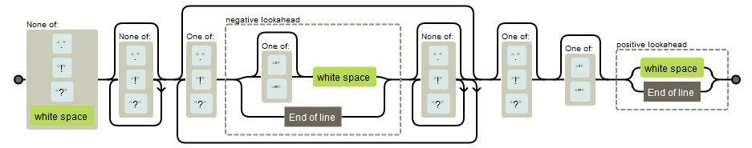
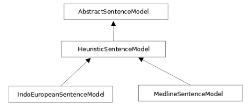

# 三、搜索语句

将文本分割成句子也叫**句子边界消歧**(**)。这个过程对于许多下游的需要在句子中分析的 NLP 任务是有用的；例如，词性和短语分析通常在一个句子中进行。**

 **在这一章中，我们将解释为什么 SBD 是困难的。然后，我们将研究一些在某些情况下可能有效的核心 Java 方法，并继续讨论各种 NLP APIs 对模型的使用。我们还将研究句子检测模型的训练和验证方法。我们可以添加额外的规则来进一步优化这个过程，但是这只能在一定程度上起作用。之后，模型必须被训练来处理普通和特殊的情况。本章的后半部分着重于这些模型及其使用。

我们将在本章中讨论以下主题:

*   SBD 进程
*   是什么让 SBD 变得困难？
*   使用 NLP APIs
*   训练句子检测器模型


# SBD 进程

SBD 过程依赖于语言，并且通常不简单。检测句子的常见方法包括使用一组规则或训练一个模型来检测它们。下面是一组检测句子的简单规则。如果下列条件为真，则检测到句子结束:

*   文本以句点、问号或感叹号结束
*   句点前面没有缩写，后面也没有数字

虽然这对于大多数句子来说很有效，但并不是对所有的句子都有效。例如，确定什么是缩写并不总是容易的，像省略号这样的序列可能会与句号混淆。

大多数搜索引擎并不关心 SBD。他们只对查询的标记及其位置感兴趣。执行数据提取的词性标注和其他 NLP 任务将经常处理单个句子。句子边界的检测将有助于分离看起来可能跨越句子的短语。例如，考虑下面的句子:

“建设过程结束了。盖房子的那座小山很矮。”

如果我们正在搜索短语 *over the hill* ，我们会不经意地在这里找到它。

本章中的许多例子将使用下面的文字来演示 SBD。这篇课文由三个简单的句子组成，后面跟着一个更复杂的句子:

```java
private static String paragraph = "When determining the end of sentences " 
    + "we need to consider several factors. Sentences may end with " 
    + "exclamation marks! Or possibly questions marks? Within " 
    + "sentences we may find numbers like 3.14159, abbreviations " 
    + "such as found in Mr. Smith, and possibly ellipses either " 
    + "within a sentence ..., or at the end of a sentence..."; 
```


# 是什么让 SBD 变得困难？

将文本分解成句子很困难，原因有很多:

*   标点符号经常含糊不清
*   缩写通常包含句点
*   通过使用引号，句子可以相互嵌入
*   对于更专业的文本，比如 tweets 和聊天会话，我们可能需要考虑使用新行或完成从句

标点歧义最好用句号来说明。它经常被用来区分一个句子的结尾。然而，它也可以用在许多其他上下文中，包括缩写、数字、电子邮件地址和省略号。其他标点符号，如问号和感叹号，也用在嵌入的引号和特殊文本中，如可能在文档中的代码。

句点用于多种情况:

*   终止一项判决
*   以缩写结尾
*   结束一个缩写并结束一个句子
*   对于省略号
*   对于句末的省略号
*   嵌入在引号或括号中

我们遇到的大多数句子都以句号结尾。这使得它们易于识别。然而，当它们以缩写结尾时，识别它们就有点困难了。以下句子包含带句点的缩写:

"史密斯夫妇去参加舞会了."

在下面的两个句子中，我们有一个出现在句末的缩写:

"他是中央情报局的特工。"

"他是中央情报局的特工。"

在最后一句中，缩写的每个字母后面都有一个句点。虽然不常见，但这可能会发生，我们不能简单地忽视它。

另一个让 SBD 感到困难的问题是试图确定一个单词是否是一个缩写。我们不能简单地把所有的大写序列都当成缩写。也许用户不小心输入了一个全部大写的单词，或者文本被预处理以将所有字符转换成小写。此外，一些缩写由一系列大写和小写字母组成。为了处理缩写，有时会使用有效缩写的列表。然而，缩写通常是特定领域的。

省略号会使问题更加复杂。它们可能是单个字符(扩展 ASCII 0 x 85 或 Unicode (U+2026))或三个句点的序列。此外，还有 Unicode 水平省略号(U+2026)、垂直省略号(U+22EE)以及垂直和水平省略号的表示形式(U+FE19)。除了这些，还有 HTML 编码。对于 Java，使用`\uFE19`。编码上的这些变化说明了在分析文本之前对其进行良好预处理的必要性。

下面两个句子说明了省略号的可能用法:

“然后就有了...一个。”

"这份名单还在继续，而且……"

第二句以省略号结尾。在某些情况下，正如《司法协助手册》([`www.mlahandbook.org/fragment/public_index`](http://www.mlahandbook.org/fragment/public_index))所建议的，我们可以使用括号来区分添加的省略号和原文本中的省略号，如下所示:

“人民[...使用各种交通工具...]" ( *少年 73* )。

我们还会发现嵌入在另一个句子中的句子，比如:

那人说:“那不对。”

感叹号和问号代表其他问题，即使这些字符的出现比句点更有限。感叹号可以出现在句尾以外的地方。在某些词的情况下，比如 Yahoo！感叹号是单词的一部分。此外，多个感叹号用于强调，如“最美好的祝愿！!"这可以导致识别实际上不存在的多个句子。


# 理解 LingPipe 的 HeuristicSentenceModel 类的 SBD 规则

还有其他规则可以用来执行 SBD。LingPipe 的`HeuristicSentenceModel`类使用一系列令牌规则来执行 SBD。我们将在这里展示它们，因为它们提供了对哪些规则有用的洞察。

这个类使用三组标记和两个标志来帮助这个过程:

*   **可能的停顿**:这是一组标记，可以是一个句子的最后一个标记
*   不可能的倒数第二个单词:这些单词不能是句子中倒数第二个单词
*   **不可能开始**:这是一组不能用来开始一个句子的标记
*   **平衡括号**:该标志表示在一个句子中所有匹配的括号都匹配之前，该句子不应被终止
*   **Force final boundary** :这指定输入流中的最后一个标记应该被视为语句结束符，即使它不是一个可能的终止符

平衡括号包括()和[]。但是，如果文本格式不正确，此规则将失败。下表列出了默认令牌集:

| **可能的停靠点** | **不可能的倒数第二名** | **不可能的开始** |
| 。 | 任何一个字母 | 闭括号 |
| .. | 个人和专业头衔、军衔等等 | , |
| ！ | 逗号、冒号和引号 | ； |
| ？ | 常见缩写 | ： |
| " | 方向 | - |
| '' | 公司标志 | - |
| ). | 时间、月份等等 | - |
|  | 美国政党 | % |
|  | 美国各州(不是我或我所在的州) | " |
|  | 运货条款 |  |
|  | 地址缩写 |  |

尽管 LingPipe 的`HeuristicSentenceModel`类使用了这些规则，但是没有理由说它们不能在 SBD 工具的其他实现中使用。

SBD 的启发式方法可能不总是像其他技术一样准确。然而，它们可能在特定的领域中工作，并且通常具有更快和使用更少内存的优势。


# 简单 Java SBDs

有时，文本可能足够简单，Java 核心支持就足够了。有两种方法可以执行 SBD:使用正则表达式和使用`BreakIterator`类。我们将在这里研究这两种方法。


# 使用正则表达式

正则表达式可能很难理解。虽然简单的表达式通常不是问题，但是随着它们变得越来越复杂，它们的可读性也会变差。当试图将正则表达式用于 SBD 时，这是正则表达式的局限性之一。

我们将给出两种不同的正则表达式。第一个表达式很简单，但是做得不太好。它展示了一个对于某些问题领域来说可能过于简单的解决方案。第二个更复杂，做得更好。

在本例中，我们创建了一个匹配句点、问号和感叹号的正则表达式类。`String` class' `split`方法用于将文本拆分成句子:

```java
String simple = "[.?!]"; 
String[] splitString = (paragraph.split(simple)); 
for (String string : splitString) { 
    System.out.println(string); 
}
```

输出如下所示:

```java
    When determining the end of sentences we need to consider several factors
     Sentences may end with exclamation marks
     Or possibly questions marks
     Within sentences we may find numbers like 3
    14159, abbreviations such as found in Mr
     Smith, and possibly ellipses either within a sentence ..., or at the end of a sentence...

```

正如所料，该方法将段落分割成字符，而不管它们是数字还是缩写的一部分。

第二种方法会产生更好的结果。这个例子改编自[`stack overflow . com/questions/5553410/regular-expression-match-a-sentence`](http://stackoverflow.com/questions/5553410/regular-expression-match-a-sentence)上的一个例子。使用了编译以下正则表达式的`Pattern`类:

```java
    [^.!?\s][^.!?]*(?:.!?[^.!?]*)*[.!?]?['"]?(?=\s|$)

```

以下代码序列中的注释解释了每个部分的含义:

```java
Pattern sentencePattern = Pattern.compile( 
    "# Match a sentence ending in punctuation or EOS.\n" 
    + "[^.!?\\s]    # First char is non-punct, non-ws\n" 
    + "[^.!?]*      # Greedily consume up to punctuation.\n" 
    + "(?:          # Group for unrolling the loop.\n" 
    + "  [.!?]      # (special) inner punctuation ok if\n" 
    + "  (?!['\"]?\\s|$)  # not followed by ws or EOS.\n" 
    + "  [^.!?]*    # Greedily consume up to punctuation.\n" 
    + ")*           # Zero or more (special normal*)\n" 
    + "[.!?]?       # Optional ending punctuation.\n" 
    + "['\"]?       # Optional closing quote.\n" 
    + "(?=\\s|$)", 
    Pattern.MULTILINE | Pattern.COMMENTS); 
```

使用在[`regexper.com/`](http://regexper.com/)找到的显示工具可以生成该表达式的另一种表示。如下图所示，它以图形方式描述了表达式，并阐明了其工作原理:



对示例段落执行`matcher`方法，然后显示结果:

```java
Matcher matcher = sentencePattern.matcher(paragraph); 
while (matcher.find()) { 
    System.out.println(matcher.group()); 
} 
```

输出如下。保留了句子终止符，但缩写仍然存在问题:

```java
    When determining the end of sentences we need to consider several factors.
    Sentences may end with exclamation marks!
    Or possibly questions marks?
    Within sentences we may find numbers like 3.14159, abbreviations such as found in Mr.
    Smith, and possibly ellipses either within a sentence ..., or at the end of a sentence...

```


# 使用 BreakIterator 类

`BreakIterator`类可以用来检测各种文本边界，比如字符、单词、句子和行之间的边界。不同的方法用于创建不同的`BreakIterator`类实例，如下所示:

*   对于字符，使用`getCharacterInstance`方法
*   对于单词，使用`getWordInstance`方法
*   对于句子，使用`getSentenceInstance`方法
*   对于线，使用`getLineInstance`方法

检测字符之间的分隔符有时很重要，例如，当我们需要处理由多个 Unicode 字符组成的字符时，比如ü。该字符有时由`\u0075` (u)和`\u00a8` ( ) Unicode 字符组合而成。该类将识别这些类型的字符。这种能力在 https://docs.oracle.com/javase/tutorial/i18n/text/char.html 的[有更详细的说明。](https://docs.oracle.com/javase/tutorial/i18n/text/char.html)

`BreakIterator`类可以用来检测一个句子的结尾。它使用引用当前边界的光标。它支持一个`next`和一个`previous`方法，分别在文本中向前和向后移动光标。`BreakIterator`有一个受保护的默认构造函数。要获得一个`BreakIterator`类的实例来检测句子的结尾，使用静态的`getSentenceInstance`方法，如下所示:

```java
BreakIterator sentenceIterator = 
 BreakIterator.getSentenceInstance(); 
```

还有一个方法的重载版本。它将一个`Locale`实例作为参数:

```java
Locale currentLocale = new Locale("en", "US"); 
BreakIterator sentenceIterator =  
    BreakIterator.getSentenceInstance(currentLocale); 
```

一旦创建了一个实例，`setText`方法将把文本关联到
,用迭代器进行处理:

```java
sentenceIterator.setText(paragraph); 
```

`BreakIterator`使用一系列方法和字段识别文本中的边界。所有这些函数都返回整数值，下表对它们进行了详细说明:

| **方法** | **用途** |
| `first` | 返回文本的第一个边界 |
| `next` | 返回当前边界之后的边界 |
| `previous` | 返回当前边界之前的边界 |
| `DONE` | 最后一个整数，赋值为-1(表示没有边界可寻) |

为了以连续的方式使用迭代器，使用`first`方法识别第一个边界，然后重复调用`next`方法来寻找后续的边界。当`DONE`返回时，过程终止。下面的代码序列说明了这种技术，它使用了之前声明的`sentenceIterator`实例:

```java
int boundary = sentenceIterator.first(); 
while (boundary != BreakIterator.DONE) { 
    int begin = boundary; 
    System.out.print(boundary + "-"); 
    boundary = sentenceIterator.next(); 
    int end = boundary; 
    if (end == BreakIterator.DONE) { 
        break; 
    } 
    System.out.println(boundary + " [" 
        + paragraph.substring(begin, end) + "]"); 
} 
```

在执行时，我们得到以下输出:

```java
    0-75 [When determining the end of sentences we need to consider several factors. ]
    75-117 [Sentences may end with exclamation marks! ]
    117-146 [Or possibly questions marks? ]
    146-233 [Within sentences we may find numbers like 3.14159 , abbreviations such as found in Mr. ]
    233-319 [Smith, and possibly ellipses either within a sentence ... , or at the end of a sentence...]
    319-

```

该输出适用于简单的句子，但不适用于更复杂的句子。

正则表达式和`BreakIterator`类的使用都有局限性。它们对于由相对简单的句子组成的文本很有用。然而，当文本变得更加复杂时，最好使用 NLP APIs，这将在下一节中讨论。


# 使用 NLP APIs

有许多支持 SBD 的 NLP API 类。一些是基于规则的，而另一些则使用使用常见和不常见文本训练的模型。我们将使用 OpenNLP、Stanford 和 LingPipe APIs 说明句子检测类的用法。

模型也可以被训练。关于这种方法的讨论在*训练句子检测器模型*一节中进行了说明。在处理专业文本(如医学或法律文本)时，需要专业模型。


# 使用 OpenNLP

OpenNLP 使用模型来执行 SBD。基于一个模型文件，创建了一个`SentenceDetectorME`类的实例。通过`sentDetect`方法返回句子，通过`sentPosDetect`方法返回位置信息。


# 使用 SentenceDetectorME 类

使用`SentenceModel`类从文件中加载模型。然后使用该模型创建一个`SentenceDetectorME`类的实例，并调用`sentDetect`方法来执行 SBD。该方法返回一个字符串数组，每个元素包含一个句子。

下面的示例演示了这一过程。try-with-resources 块用于打开包含模型的`en-sent.bin`文件。然后，处理`paragraph`字符串。接下来，捕捉各种 IO 类型异常(如有必要)。最后，使用 for-each 语句来显示句子:

```java
try (InputStream is = new FileInputStream( 
        new File(getModelDir(), "en-sent.bin"))) { 
    SentenceModel model = new SentenceModel(is); 
    SentenceDetectorME detector = new SentenceDetectorME(model); 
    String sentences[] = detector.sentDetect(paragraph); 
    for (String sentence : sentences) { 
        System.out.println(sentence); 
    } 
} catch (FileNotFoundException ex) { 
    // Handle exception 
} catch (IOException ex) { 
    // Handle exception 
}
```

在执行时，我们得到以下输出:

```java
    When determining the end of sentences we need to consider several factors.
    Sentences may end with exclamation marks!
    Or possibly questions marks?
    Within sentences we may find numbers like 3.14159, abbreviations such as found in Mr. Smith, and possibly ellipses either within a sentence ..., or at the end of a sentence...

```

这一段的输出效果很好。它既能捕捉简单的句子，也能捕捉更复杂的句子。当然，经过处理的文本并不总是完美的。下面的段落在某些地方有多余的空格，但在需要的地方缺少空格。此问题可能出现在聊天会话分析中:

```java
paragraph = " This sentence starts with spaces and ends with "  
    + "spaces . This sentence has no spaces between the next " 
    + "one.This is the next one."; 
```

当我们在前面的例子中使用这一段时，我们得到下面的输出:

```java
    This sentence starts with spaces and ends with spaces  .
    This sentence has no spaces between the next one.This is the next one.

```

第一句的前导空格被删除，但结尾空格没有删除。第三句没有检测出来，和第二句合并了。

`getSentenceProbabilities`方法返回一个 doubles 数组，表示从最后一次使用`sentDetect`方法中检测到的句子的置信度。在显示句子的 for-each 语句后添加以下代码:

```java
double probablities[] = detector.getSentenceProbabilities(); 
for (double probablity : probablities) { 
    System.out.println(probablity); 
} 
```

通过执行原始段落，我们得到以下输出:

```java
    0.9841708738988814
    0.908052385070974
    0.9130082376342675
    1.0
```

显示的数字是表示置信度的概率。


# 使用 sentPosDetect 方法

`SentenceDetectorME`类拥有一个为每个句子返回`Span`对象的`sentPosDetect`方法。使用与上一节相同的代码，除了两处更改:用`sentPosDetect`方法替换`sentDetect`方法，用这里使用的方法替换 for-each 语句:

```java
Span spans[] = detector.sentPosDetect(paragraph); 
for (Span span : spans) { 
    System.out.println(span); 
} 
```

接下来的输出使用原始段落。`Span`对象包含默认执行`toString`方法返回的位置信息:

```java
    [0..74)
    [75..116)
    [117..145)
    [146..317)  
```

`Span`类拥有许多方法。下面的代码序列演示了如何使用`getStart`和`getEnd`方法来清楚地显示这些跨度所代表的文本:

```java
for (Span span : spans) { 
    System.out.println(span + "[" + paragraph.substring( 
        span.getStart(), span.getEnd()) +"]"); 
} 
```

输出显示识别的句子:

```java
     [0..74)[When determining the end of sentences we need to consider several factors.]
    [75..116)[Sentences may end with exclamation marks!]
    [117..145)[Or possibly questions marks?]
    [146..317)[Within sentences we may find numbers like 3.14159, abbreviations such as found in Mr. Smith, and possibly ellipses either within a sentence ..., or at the end of a sentence...]
```

还有许多其他有价值的方法。下表列出了这些功能:

| **方法** | **意为** |
| `contains` | 确定另一个`Span`对象或索引是否包含在目标中的重载方法 |
| `crosses` | 确定两个跨度是否重叠 |
| `length` | 跨度的长度 |
| `startsWith` | 确定跨度是否从目标跨度开始 |


# 使用斯坦福 API

斯坦福 NLP 库支持几种用于执行句子检测的技术。在本节中，我们将使用以下类来演示这一过程:

*   `PTBTokenizer`
*   `DocumentPreprocessor`
*   `StanfordCoreNLP`

尽管它们都执行 SBD，但每个都使用不同的方法来执行流程。


# 使用 PTBTokenizer 类

`PTBTokenizer`类使用规则来执行 SBD，并有多种标记化选项。这个类的构造函数拥有三个参数:

*   封装要处理的文本的`Reader`类
*   实现`LexedTokenFactory`接口的对象
*   保存标记化选项的字符串

这些选项允许我们指定文本、要使用的标记器以及我们可能需要用于特定文本流的任何选项。

在下面的代码序列中，创建了一个`StringReader`类的实例来封装文本。在本例中，`CoreLabelTokenFactory`类与选项一起使用，剩下的选项为`null`:

```java
PTBTokenizer ptb = new PTBTokenizer(new StringReader(paragraph), 
     new CoreLabelTokenFactory(), null); 
```

我们将使用`WordToSentenceProcessor`类创建一个`List`类的`List`实例来保存句子及其标记。它的`process`方法使用由`PTBTokenizer`实例产生的令牌来创建`List`类的列表，如下所示:

```java
WordToSentenceProcessor wtsp = new WordToSentenceProcessor(); 
List<List<CoreLabel>> sents = wtsp.process(ptb.tokenize());
```

`List`类的该`List`实例可以通过多种方式显示。在下面的序列中，`List`类的`toString`方法显示括在括号中的列表，其元素用逗号分隔:

```java
for (List<CoreLabel> sent : sents) { 
    System.out.println(sent); 
} 
```

该序列的输出产生以下内容:

```java
    [When, determining, the, end, of, sentences, we, need, to, consider, several, factors, .]
    [Sentences, may, end, with, exclamation, marks, !]
    [Or, possibly, questions, marks, ?]
    [Within, sentences, we, may, find, numbers, like, 3.14159, ,, abbreviations, such, as, found, in, Mr., Smith, ,, and, possibly, ellipses, either, within, a, sentence, ..., ,, or, at, the, end, of, a, sentence, ...]  
```

此处显示的另一种方法是在单独的行上显示每个句子:

```java
for (List<CoreLabel> sent : sents) { 
    for (CoreLabel element : sent) { 
        System.out.print(element + " "); 
     } 
    System.out.println(); 
} 
```

输出如下所示:

```java
    When determining the end of sentences we need to consider several factors . 
    Sentences may end with exclamation marks ! 
    Or possibly questions marks ? 
    Within sentences we may find numbers like 3.14159 , abbreviations such as found in Mr. Smith , and possibly ellipses either within a sentence ... , or at the end of a sentence ... 
```

如果我们只对单词和句子的位置感兴趣，我们可以使用`endPosition`方法，如下所示:

```java
for (List<CoreLabel> sent : sents) { 
    for (CoreLabel element : sent) { 
        System.out.print(element.endPosition() + " "); 
     } 
    System.out.println(); 
} 
```

当执行这个命令时，我们得到以下输出。每行的最后一个数字是句子边界的索引:

```java
    4 16 20 24 27 37 40 45 48 57 65 73 74 
    84 88 92 97 109 115 116 
    119 128 138 144 145 
    152 162 165 169 174 182 187 195 196 210 215 218 224 227 231 237 238 242 251 260 267 274 276 285 287 288 291 294 298 302 305 307 316 317

```

每个句子的第一个元素及其索引按以下顺序显示:

```java
for (List<CoreLabel> sent : sents) { 
    System.out.println(sent.get(0) + " "  
        + sent.get(0).beginPosition()); 
} 
```

输出如下所示:

```java
    When 0
    Sentences 75
    Or 117
    Within 146
```

如果我们对一个句子的最后成分感兴趣，我们可以用下面的顺序。列表元素的数量用于显示终止字符及其结束位置:

```java
for (List<CoreLabel> sent : sents) { 
    int size = sent.size(); 
    System.out.println(sent.get(size-1) + " "  
        + sent.get(size-1).endPosition()); 
} 
```

这将产生以下输出:

```java
    . 74
    ! 116
    ? 145
    ... 317  
```

当调用`PTBTokenizer`类的构造函数时，有许多选项可用。这些选项包含在构造函数的第三个参数中。选项字符串由逗号分隔的选项组成，如下所示:

```java
"americanize=true,normalizeFractions=true,asciiQuotes=true".
```

下表列出了这些选项中的几个:

| **选项** | **意为** |
| `invertible` | 用于指示必须保留标记和空白，以便可以重建原始字符串 |
| `tokenizeNLs` | 指示行尾必须被视为标记 |
| `americanize` | 如果是真的，这将把英式拼写改写成美式拼写 |
| `normalizeAmpersandEntity` | 将 XML & amp 字符转换为& amp 符号 |
| `normalizeFractions` | 将常见的分数字符(如)转换为长格式(1/2) |
| `asciiQuotes` | 会将引号字符转换为更简单的“和”字符 |
| `unicodeQuotes` | 会将引号字符转换为范围从 U+2018 到 U+201D 的字符 |

以下序列说明了此选项字符串的用法:

```java
paragraph = "The colour of money is green. Common fraction " 
    + "characters such as ½  are converted to the long form 1/2\. " 
    + "Quotes such as "cat" are converted to their simpler form."; 
ptb = new PTBTokenizer( 
    new StringReader(paragraph), new CoreLabelTokenFactory(), 
    "americanize=true,normalizeFractions=true,asciiQuotes=true"); 
wtsp = new WordToSentenceProcessor(); 
sents = wtsp.process(ptb.tokenize()); 
for (List<CoreLabel> sent : sents) { 
    for (CoreLabel element : sent) { 
        System.out.print(element + " "); 
    } 
    System.out.println(); 
} 
```

输出如下所示:

```java
    The color of money is green . 
    Common fraction characters such as 1/2 are converted to the long form 1/2 . 
    Quotes such as " cat " are converted to their simpler form . 
```

“colour”一词的英国拼法被转换成了美国的对应拼法。分数`½`展开为三个字符:`1/2`。在最后一句中，智能引号被转换成了更简单的形式。


# 使用 document 预处理程序类

当`DocumentPreprocessor`类的一个实例被创建时，它使用它的`Reader`参数产生一个句子列表。它还实现了`Iterable`接口，这使得遍历列表变得很容易。

在下面的示例中，该段落用于创建一个`StringReader`对象，该对象用于实例化`DocumentPreprocessor`实例:

```java
Reader reader = new StringReader(paragraph); 
DocumentPreprocessor dp = new DocumentPreprocessor(reader); 
for (List sentence : dp) { 
    System.out.println(sentence); 
} 
```

在执行时，我们得到以下输出:

```java
    [When, determining, the, end, of, sentences, we, need, to, consider, several, factors, .]
    [Sentences, may, end, with, exclamation, marks, !]
    [Or, possibly, questions, marks, ?]
    [Within, sentences, we, may, find, numbers, like, 3.14159, ,, abbreviations, such, as, found, in, Mr., Smith, ,, and, possibly, ellipses, either, within, a, sentence, ..., ,, or, at, the, end, of, a, sentence, ...]  
```

默认情况下，`PTBTokenizer`用于标记输入。`setTokenizerFactory`方法可以用来指定一个不同的记号赋予器。还有其他几种有用的方法，如下表所示:

| **方法** | **目的** |
| `setElementDelimiter` | 它的参数指定了一个 XML 元素。只会处理这些元素中的文本。 |
| `setSentenceDelimiter` | 处理器将假设字符串参数是一个句子分隔符。 |
| `setSentenceFinalPuncWords` | 它的字符串数组参数指定了句子的结束分隔符。 |
| `setKeepEmptySentences` | 当与空白模型一起使用时，如果它的参数是`true`，空句将被保留。 |

该类可以处理纯文本或 XML 文档。

为了演示如何处理 XML 文件，我们将创建一个名为`XMLText.xml`的简单 XML 文件，其中包含以下数据:

```java
<?xml version="1.0" encoding="UTF-8"?> 
<?xml-stylesheet type="text/xsl"?> 
<document> 
    <sentences> 
        <sentence id="1"> 
            <word>When</word> 
            <word>the</word> 
            <word>day</word> 
            <word>is</word> 
            <word>done</word> 
            <word>we</word> 
            <word>can</word> 
            <word>sleep</word> 
            <word>.</word> 
        </sentence> 
        <sentence id="2"> 
            <word>When</word> 
            <word>the</word> 
            <word>morning</word> 
            <word>comes</word> 
            <word>we</word> 
            <word>can</word> 
            <word>wake</word> 
            <word>.</word> 
        </sentence> 
        <sentence id="3"> 
            <word>After</word> 
            <word>that</word> 
            <word>who</word> 
            <word>knows</word> 
            <word>.</word> 
        </sentence> 
    </sentences> 
</document> 
```

我们将重用前面例子中的代码。但是，我们将打开`XMLText.xml`文件，并使用`DocumentPreprocessor.DocType.XML`作为`DocumentPreprocessor`类的构造函数的第二个参数，如下面的代码所示。这将指定处理器应该将文本视为 XML 文本。此外，我们将指定只处理那些在`<sentence>`标记内的 XML 元素:

```java
try { 
    Reader reader = new FileReader("XMLText.xml"); 
    DocumentPreprocessor dp = new DocumentPreprocessor( 
        reader, DocumentPreprocessor.DocType.XML); 
    dp.setElementDelimiter("sentence"); 
    for (List sentence : dp) { 
        System.out.println(sentence); 
    } 
} catch (FileNotFoundException ex) { 
    // Handle exception 
} 
```

该示例的输出如下:

```java
    [When, the, day, is, done, we, can, sleep, .] 
    [When, the, morning, comes, we, can, wake, .]
    [After, that, who, knows, .]  
```

使用`ListIterator`可以得到更清晰的输出，如下所示:

```java
for (List sentence : dp) { 
    ListIterator list = sentence.listIterator(); 
     while (list.hasNext()) { 
        System.out.print(list.next() + " "); 
    } 
    System.out.println(); 
} 
```

它的输出如下:

```java
    When the day is done we can sleep . 
    When the morning comes we can wake . 
    After that who knows . 
```

如果我们没有指定元素分隔符，每个单词将显示如下:

```java
    [When]
    [the]
    [day]
    [is]
    [done]
    ...
    [who]
    [knows]
    [.]
```


# 使用 StanfordCoreNLP 类

`StanfordCoreNLP`类支持使用`ssplit`注释器进行句子检测。在下面的例子中，使用了`tokenize`和`ssplit`标注器。创建一个管道对象，并对管道应用`annotate`方法，使用段落作为其参数:

```java
Properties properties = new Properties(); 
properties.put("annotators", "tokenize, ssplit"); 
StanfordCoreNLP pipeline = new StanfordCoreNLP(properties); 
Annotation annotation = new Annotation(paragraph); 
pipeline.annotate(annotation); 
```

输出包含大量信息。这里只显示了第一行的输出:

```java
    Sentence #1 (13 tokens):
    When determining the end of sentences we need to consider several factors.
    [Text=When CharacterOffsetBegin=0 CharacterOffsetEnd=4] [Text=determining CharacterOffsetBegin=5 CharacterOffsetEnd=16] [Text=the CharacterOffsetBegin=17 CharacterOffsetEnd=20] [Text=end CharacterOffsetBegin=21 CharacterOffsetEnd=24] [Text=of CharacterOffsetBegin=25 CharacterOffsetEnd=27] [Text=sentences CharacterOffsetBegin=28 CharacterOffsetEnd=37] [Text=we CharacterOffsetBegin=38 CharacterOffsetEnd=40] [Text=need CharacterOffsetBegin=41 CharacterOffsetEnd=45] [Text=to CharacterOffsetBegin=46 CharacterOffsetEnd=48] [Text=consider CharacterOffsetBegin=49 CharacterOffsetEnd=57] [Text=several CharacterOffsetBegin=58 CharacterOffsetEnd=65] [Text=factors CharacterOffsetBegin=66 CharacterOffsetEnd=73] [Text=. CharacterOffsetBegin=73 CharacterOffsetEnd=74] 

```

或者，我们可以使用`xmlPrint`方法。这将产生 XML 格式的输出，这通常更容易提取感兴趣的信息。
这里展示了这个方法，它需要处理`IOException`:

```java
try { 
    pipeline.xmlPrint(annotation, System.out); 
} catch (IOException ex) { 
    // Handle exception 
}
```

部分输出如下所示:

```java
<?xml version="1.0" encoding="UTF-8"?> 
<?xml-stylesheet href="CoreNLP-to-HTML.xsl" type="text/xsl"?> 
<root> 
  <document> 
    <sentences> 
      <sentence id="1"> 
        <tokens> 
          <token id="1"> 
            <word>When</word> 
            <CharacterOffsetBegin>0</CharacterOffsetBegin> 
            <CharacterOffsetEnd>4</CharacterOffsetEnd> 
          </token> 
... 
         <token id="34"> 
            <word>...</word> 
            <CharacterOffsetBegin>316</CharacterOffsetBegin> 
            <CharacterOffsetEnd>317</CharacterOffsetEnd> 
          </token> 
        </tokens> 
      </sentence> 
    </sentences> 
  </document> 
</root> 
```


# 使用 LingPipe

LingPipe 使用类的层次结构来支持 SBD，如下图所示:



这个层次结构的基础是 **AbstractSentenceModel** 类，它的主要方法是一个重载的`boundaryIndices`方法。这个方法返回一个边界索引的整数数组，其中数组的每个元素代表一个句子边界。

从这个类派生的是 **HeuristicSentenceModel** 类。这个类使用一系列可能的停止、不可能的倒数第二和不可能的开始标记集。这些在前面的*理解 LingPipe 的 HeuristicSentenceModel 类*部分已经讨论过了。

**indeuropeansentcemodel**和 **MedlineSentenceModel** 类是从 **HeuristicSentenceModel** 类派生而来的。他们分别接受过英语培训和医学专业培训。我们将在下面的小节中演示这两个类。


# 使用 IndoEuropeanSentenceModel 类

`IndoEuropeanSentenceModel`模型用于英文文本。它的双参数构造函数将指定:

*   最后一个令牌是否必须是一个停止符
*   括号是否应该平衡

默认构造函数不强制最后一个标记是一个停止符，也不期望括号应该是平衡的。句子模型需要和分词器一起使用。为此，我们将使用`IndoEuropeanTokenizerFactory`类的默认构造函数，如下所示:

```java
TokenizerFactory TOKENIZER_FACTORY= 
 IndoEuropeanTokenizerFactory.INSTANCE; 
com.aliasi.sentences.SentenceModel sentenceModel = new IndoEuropeanSentenceModel(); 
```

创建一个标记化器，并调用它的`tokenize`方法来填充两个列表:

```java
List<String> tokenList = new ArrayList<>(); 
List<String> whiteList = new ArrayList<>(); 
Tokenizer tokenizer= TOKENIZER_FACTORY.tokenizer( 
    paragraph.toCharArray(),0, paragraph.length()); 
tokenizer.tokenize(tokenList, whiteList);
```

`boundaryIndices`方法返回一个整数边界索引数组。该方法需要两个包含标记和空格的`String`数组参数。`tokenize`方法为这些元素使用了两个列表。这意味着我们需要将列表转换成等价的数组，如下所示:

```java
String[] tokens = new String[tokenList.size()]; 
String[] whites = new String[whiteList.size()]; 
tokenList.toArray(tokens); 
whiteList.toArray(whites); 
```

然后我们可以使用`boundaryIndices`方法并显示索引:

```java
int[] sentenceBoundaries= 
 sentenceModel.boundaryIndices(tokens, whites); 
for(int boundary : sentenceBoundaries) { 
    System.out.println(boundary); 
} 
```

输出如下所示:

```java
    12
    19
    24  
```

为了显示实际的句子，我们将使用下面的顺序。空白索引与标记相差一个:

```java
int start = 0; 
for(int boundary : sentenceBoundaries) { 
    while(start<=boundary) { 
        System.out.print(tokenList.get(start) 
     + whiteList.get(start+1)); 
        start++; 
    } 
    System.out.println(); 
} 
```

以下输出是结果:

```java
    When determining the end of sentences we need to consider several factors. 
    Sentences may end with exclamation marks! 
    Or possibly questions marks?

```

可惜，它漏掉了最后一句。这是因为最后一句以省略号结尾。如果我们在句尾添加一个句点，我们会得到以下输出:

```java
    When determining the end of sentences we need to consider several factors. 
    Sentences may end with exclamation marks! 
    Or possibly questions marks? 
    Within sentences we may find numbers like 3.14159, abbreviations such as found in Mr. Smith, and possibly ellipses either within a sentence ..., or at the end of a sentence....

```


# 使用 SentenceChunker 类

另一种方法是使用`SentenceChunker`类来执行 SBD。这个类的构造函数需要一个`TokenizerFactory`对象和一个`SentenceModel`对象，如下所示:

```java
TokenizerFactory tokenizerfactory = 
 IndoEuropeanTokenizerFactory.INSTANCE; 
SentenceModel sentenceModel = new IndoEuropeanSentenceModel(); 
```

使用`tokenizerfactory`和
句子实例创建`SentenceChunker`实例:

```java
SentenceChunker sentenceChunker =  
    new SentenceChunker(tokenizerfactory, sentenceModel); 
```

`SentenceChunker`类实现了`Chunker`接口，该接口使用了一个`chunk`方法。这个方法返回一个实现`Chunking`接口的对象。这个对象用一个字符序列(`CharSequence`)指定文本的“块”。

`chunk`方法使用一个字符数组和数组中的索引来指定需要处理的文本部分。一个`Chunking`对象是这样返回的:

```java
Chunking chunking = sentenceChunker.chunk( 
    paragraph.toCharArray(),0, paragraph.length()); 
```

我们将使用`Chunking`对象有两个目的。首先，我们将使用它的`chunkSet`方法返回一组`Chunk`对象。然后，我们将获得一个包含所有句子的字符串:

```java
Set<Chunk> sentences = chunking.chunkSet(); 
String slice = chunking.charSequence().toString();
```

一个`Chunk`对象存储句子边界的字符偏移量。我们将结合使用它的`start`和`end`方法来显示句子，如下面的代码所示。每个元素和句子都包含句子的边界。我们使用这些信息来显示切片中的每个句子:

```java
for (Chunk sentence : sentences) { 
    System.out.println("[" + slice.substring(sentence.start(), 
       sentence.end()) + "]"); 
} 
```

以下是输出。但是，对于以省略号结尾的句子，它仍然存在问题，因此在处理文本之前，在最后一句的末尾添加了一个句点。

```java
    [When determining the end of sentences we need to consider several factors.]
    [Sentences may end with exclamation marks!]
    [Or possibly questions marks?]
    [Within sentences we may find numbers like 3.14159, abbreviations such as found in Mr. Smith, and possibly ellipses either within a sentence ..., or at the end of a sentence....]

```

尽管`IndoEuropeanSentenceModel`类对于英语文本相当适用，但对于专业文本可能并不总是适用。在下一节中，我们将检查`MedlineSentenceModel`类的使用，它已经被训练来处理医学文本。


# 使用 MedlineSentenceModel 类

LingPipe 语句模型使用的是 **MEDLINE** ，这是一个生物医学文献的大集合。这个集合以 XML 格式存储，由美国国家医学图书馆(【http://www.nlm.nih.gov/】??)维护。

LingPipe 使用它的`MedlineSentenceModel`类来执行 SBD。这个模型已经针对 MEDLINE 数据进行了训练。它使用简单的文本，并将其标记为标记和空白。然后使用 MEDLINE 模型来查找文本的句子。

在下面的例子中，我们将使用来自[`www.ncbi.nlm.nih.gov/pmc/articles/PMC3139422/`](http://www.ncbi.nlm.nih.gov/pmc/articles/PMC3139422/)的一段话来演示模型的使用，如这里所声明的:

```java
paragraph = "HepG2 cells were obtained from the American Type 
 Culture "  
    + "Collection (Rockville, MD, USA) and were used only until "  
    + "passage 30\. They were routinely grown at 37°C in Dulbecco's " 
    + "modified Eagle's medium (DMEM) containing 10 % fetal bovine " 
    + "serum (FBS), 2 mM glutamine, 1 mM sodium pyruvate, and 25 " 
    + "mM glucose (Invitrogen, Carlsbad, CA, USA) in a humidified " 
    + "atmosphere containing 5% CO2\. For precursor and 13C-sugar "  
    + "experiments, tissue culture treated polystyrene 35 mm " 
    + "dishes (Corning Inc, Lowell, MA, USA) were seeded with 2 " 
    + "× 106 cells and grown to confluency in DMEM."; 
```

下面的代码基于`SentenceChunker`类，如前一节所示。不同之处在于`MedlineSentenceModel`类的使用:

```java
TokenizerFactory tokenizerfactory = 
     IndoEuropeanTokenizerFactory.INSTANCE; 
MedlineSentenceModel sentenceModel = new 
     MedlineSentenceModel(); 
SentenceChunker sentenceChunker =  
    new SentenceChunker(tokenizerfactory, 
 sentenceModel); 
     = sentenceChunker.chunk( 
    paragraph.toCharArray(), 0, paragraph.length()); 
Set<Chunk> sentences = chunking.chunkSet(); 
String slice = chunking.charSequence().toString(); 
for (Chunk sentence : sentences) { 
    System.out.println("[" 
        + slice.substring(sentence.start(), 
 sentence.end())  
        + "]"); 
} 
```

输出如下所示:

```java
    [HepG2 cells were obtained from the American Type Culture Collection (Rockville, MD, USA) and were used only until passage 30.]
    [They were routinely grown at 37°C in Dulbecco's modified Eagle's medium (DMEM) containing 10 % fetal bovine serum (FBS), 2 mM glutamine, 1 mM sodium pyruvate, and 25 mM glucose (Invitrogen, Carlsbad, CA, USA) in a humidified atmosphere containing 5% CO2.]
    [For precursor and 13C-sugar experiments, tissue culture treated polystyrene 35 mm dishes (Corning Inc, Lowell, MA, USA) were seeded with 2 × 106 cells and grown to confluency in DMEM.] 

```

当针对医学文本执行时，该模型将比其他模型执行得更好。


# 训练句子检测器模型

我们将用 OpenNLP 的`SentenceDetectorME`类来说明训练过程。这个类有一个静态的`train`方法，使用在文件中找到的例句。该方法返回一个模型，该模型通常被序列化为一个文件以供以后使用。

模型使用特殊的带注释的数据来清楚地指定句子的结束位置。通常，一个大文件被用来为训练目的提供一个好的样本。该文件的一部分用于训练目的，其余部分用于在模型被训练后对其进行验证。

OpenNLP 使用的训练文件每行包含一句话。通常至少需要 10 到 20 个例句来避免处理错误。为了演示这个过程，我们将使用一个名为`sentence.train`的文件。它由儒勒·凡尔纳的第五章《海底两万里》组成。这本书的正文可以在 http://www.gutenberg.org/files/164/164-h/164-h.htm#chap05 的[找到。该文件可以从 https://github . com/packt publishing/Natural-Language-Processing-with Java-Second-Edition](http://www.gutenberg.org/files/164/164-h/164-h.htm#chap05)下载，也可以从本书的 GitHub 资源库下载。

一个`FileReader`对象用于打开文件。这个对象被用作`PlainTextByLineStream`构造函数的参数。产生的流由文件中每行的一个字符串组成。这被用作`SentenceSampleStream`构造函数的参数，它将句子字符串转换成`SentenceSample`对象。这些对象保存每个句子的开始索引。这个过程如下所示，其中语句被包含在一个`try`块中，以处理这些语句可能抛出的异常:

```java
try { 
    ObjectStream<String> lineStream = new PlainTextByLineStream( 
        new FileReader("sentence.train")); 
    ObjectStream<SentenceSample> sampleStream 
        = new SentenceSampleStream(lineStream); 
    ... 
    } catch (FileNotFoundException ex) { 
        ex.printStackTrace();
        // Handle exception 
    } catch (IOException ex) { 
        ex.printStackTrace(); 
        // Handle exception 
} 
```

现在，`train`方法可以这样使用:

```java
SentenceModel model = SentenceDetectorME.train("en", 
     sampleStream, true, 
    null, TrainingParameters.defaultParams());
```

该方法的输出是经过训练的模型。下表详细列出了该方法的参数:

| **参数** | **意为** |
| `"en"` | 指定
文本的语言是英语 |
| `sampleStream` | 训练文本流 |
| `true` | 指定是否应该使用显示的结束标记 |
| `null` | 缩略语词典 |
| `TrainingParameters.defaultParams()` | 指定应使用默认训练参数 |

在下面的序列中，`OutputStream`被创建并用于将模型保存在`modelFile`文件中。这使得模型可以在其他应用程序中重复使用:

```java
OutputStream modelStream = new BufferedOutputStream( 
    new FileOutputStream("modelFile")); 
model.serialize(modelStream); 
```

这个过程的输出如下。为了节省空间，这里没有显示所有的迭代。默认情况下，将索引事件截止到`5`并将迭代次数截止到 100:

```java
    Indexing events using cutoff of 5

        Computing event counts...  done. 93 events
        Indexing...  done.
    Sorting and merging events... done. Reduced 93 events to 63.
    Done indexing.
    Incorporating indexed data for training...  
    done.
        Number of Event Tokens: 63
            Number of Outcomes: 2
          Number of Predicates: 21
    ...done.
    Computing model parameters ...
    Performing 100 iterations.
      1:  ... loglikelihood=-64.4626877920749    0.9032258064516129
      2:  ... loglikelihood=-31.11084296202819    0.9032258064516129
      3:  ... loglikelihood=-26.418795734248626    0.9032258064516129
      4:  ... loglikelihood=-24.327956749903198    0.9032258064516129
      5:  ... loglikelihood=-22.766489585258565    0.9032258064516129
      6:  ... loglikelihood=-21.46379347841989    0.9139784946236559
      7:  ... loglikelihood=-20.356036369911394    0.9139784946236559
      8:  ... loglikelihood=-19.406935608514992    0.9139784946236559
      9:  ... loglikelihood=-18.58725539754483    0.9139784946236559
     10:  ... loglikelihood=-17.873030559849326    0.9139784946236559
     ...
     99:  ... loglikelihood=-7.214933901940582    0.978494623655914
    100:  ... loglikelihood=-7.183774954664058    0.978494623655914

```


# 使用训练好的模型

然后，我们可以使用该模型，如下面的代码序列所示。这是基于使用 SentenceDetectorME 类一节中的*所阐述的技术:*

```java
try (InputStream is = new FileInputStream( 
        new File(getModelDir(), "modelFile"))) { 
    SentenceModel model = new SentenceModel(is); 
    SentenceDetectorME detector = new 
     SentenceDetectorME(model); 
    String sentences[] = detector.sentDetect(paragraph); 
    for (String sentence : sentences) { 
        System.out.println(sentence); 
    } 
} catch (FileNotFoundException ex) { 
    // Handle exception 
} catch (IOException ex) { 
    // Handle exception 
} 
```

输出如下所示:

```java
    When determining the end of sentences we need to consider several factors.
    Sentences may end with exclamation marks! Or possibly questions marks?
    Within sentences we may find numbers like 3.14159,
    abbreviations such as found in Mr.
    Smith, and possibly ellipses either within a sentence ..., or at the end of a sentence...

```

这个模型没有很好地处理最后一句话，这反映了样本文本和模型所针对的文本之间的不匹配。使用相关的培训数据很重要。否则，基于该输出的下游任务将受到影响。


# 使用 SentenceDetectorEvaluator 类评估模型

出于评估的目的，我们保留了样本文件的一部分，以便我们可以使用`SentenceDetectorEvaluator`类来评估模型。我们修改了`sentence.train`文件，提取了最后 10 个句子，并将它们放在一个名为`evalSample`的文件中。然后，我们使用这个文件来评估模型。在下面的例子中，我们重用了`lineStream`和`sampleStream`变量来创建一个基于文件内容的`SentenceSample`对象流:

```java
lineStream = new PlainTextByLineStream(
     new FileReader("evalSample")); 
sampleStream = new SentenceSampleStream(lineStream); 
```

使用之前创建的`SentenceDetectorME`类变量`detector`创建了一个`SentenceDetectorEvaluator`类的实例。构造函数的第二个参数是一个`SentenceDetectorEvaluationMonitor`对象，我们在这里不使用它。于是，`evaluate`的方法就叫做:

```java
SentenceDetectorEvaluator sentenceDetectorEvaluator 
    = new SentenceDetectorEvaluator(detector, null); 
sentenceDetectorEvaluator.evaluate(sampleStream); 
```

`getFMeasure`方法将返回`FMeasure`类的一个实例，它提供了模型质量的度量:

```java
System.out.println(sentenceDetectorEvaluator.getFMeasure()); 
```

输出如下。精度是包含的正确实例的分数，而召回反映了模型的敏感性。F-measure 是一个结合了召回率和准确率的分数。从本质上来说，它反映了模型运行的好坏。对于标记化和 SBD 任务，最好将精度保持在 90%以上:

```java
    Precision: 0.8181818181818182
    Recall: 0.9
    F-Measure: 0.8571428571428572
```


# 摘要

在这一章中，我们讨论了使句子检测成为一项困难任务的许多问题，例如由用于数字和缩写的句点引起的问题。省略号和内嵌引号的使用也会有问题。

Java 提供了一些技术来检测句子的结尾。我们看到了如何使用正则表达式和`BreakIterator`类。这些技巧对于简单的句子很有用，但是对于更复杂的句子就没那么好用了。

还演示了各种 NLP APIs 的使用。其中一些基于规则处理文本，而另一些使用模型。我们还演示了如何训练和评估模型。

在下一章，第四章、*查找人和事，*你将学习如何使用文本查找人和事。**