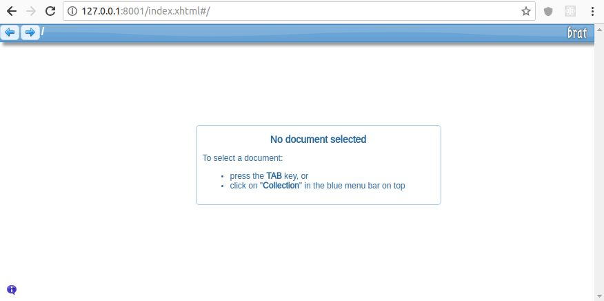
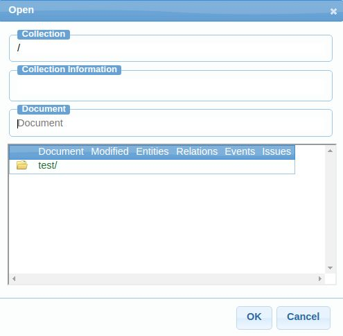
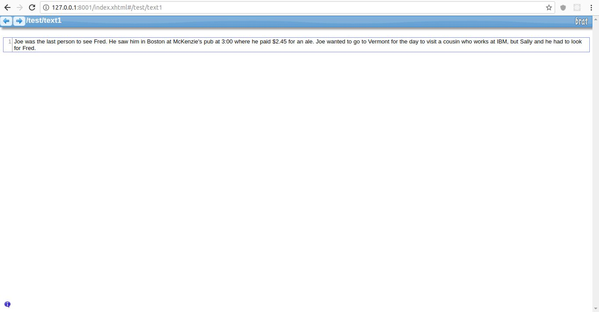
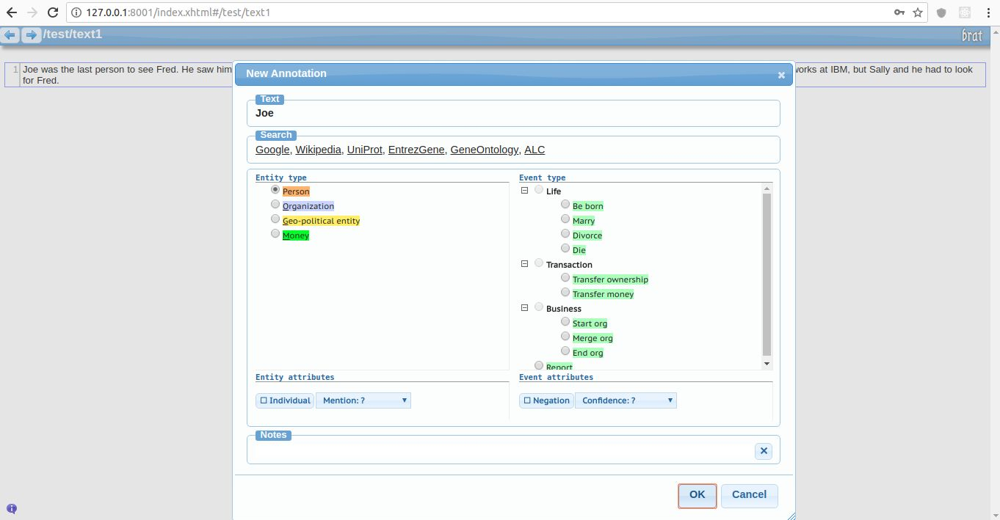
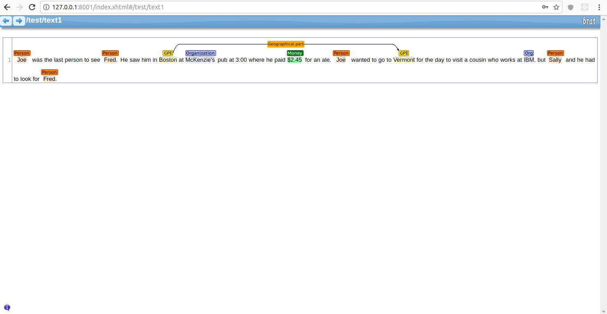
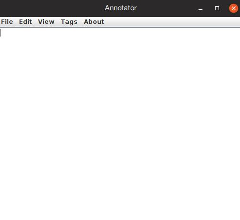
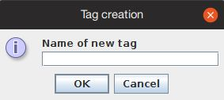
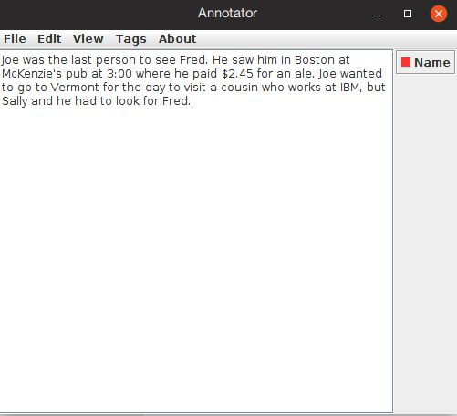
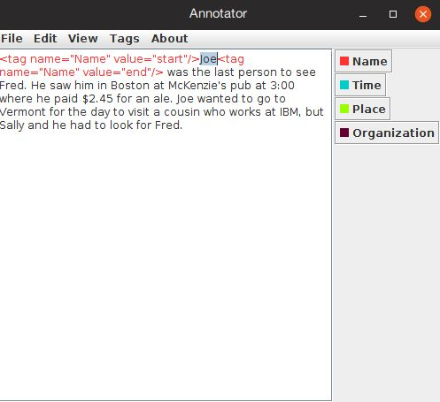

# 四、搜索人和事物

寻找人和事物的过程称为**命名实体识别**(**)。诸如人和地点之类的实体与具有名称的类别相关联，这些名称标识它们是什么。一个命名的类别可以简单到*人*。常见的实体类型包括以下几种:**

 ***   人
*   位置
*   组织
*   金钱
*   时间
*   资源定位符

在文档中查找名称、位置和各种东西是重要且有用的 NLP 任务。它们被用在许多地方，例如进行简单的搜索、处理查询、解析引用、消除文本的歧义以及寻找文本的含义。例如，NER 有时只对那些属于单一类别的实体感兴趣。使用类别，搜索可以被隔离到那些项目类型。其他 NLP 任务使用 NER，例如在**词性** ( **词性**)标签中以及在执行交叉引用任务中。

NER 进程涉及两项任务:

*   实体检测
*   实体分类

检测涉及找到文本中实体的位置。一旦找到它，确定发现了什么类型的实体是很重要的。在完成这两项任务后，结果可用于解决其他任务，如搜索和确定文本的含义。例如，任务可能包括从电影或书评中识别姓名，以及帮助查找可能感兴趣的其他电影或书籍。提取位置信息可以帮助提供对附近服务的参考。

我们将在本章中讨论以下主题:

*   为什么 NER 很难？
*   姓名识别技术
*   对 NER 使用正则表达式
*   使用 NLP APIs
*   使用 NER 注记工具构建新数据集
*   训练模型


# 为什么 NER 很难？

像许多 NLP 任务一样，NER 并不总是简单的。虽然文本的标记化将揭示其组成部分，但理解它们是什么可能是困难的。由于语言的模糊性，使用专有名词并不总是有效的。例如，Penny 和 Faith 虽然是有效的名称，但也可以分别用于度量货币和信仰。我们还可以找到像乔治亚这样的词，它们被用作一个国家、一个州和一个人的名字。我们也不能列出所有的人或地方或实体，因为它们不是预先定义的。考虑下面两个简单的句子:

*   现在工作更难找了
*   乔布斯说点总是会连接在一起的

在这两句话中，乔布斯似乎是一个实体，但他们并不相关，在第二句话中，它甚至不是一个实体。我们需要使用一些复杂的技术来检查实体在上下文中的出现。句子可能以不同的方式使用同一个实体的名称。比方说，IBM 和国际商业机器公司；这两个术语在文本中用来指同一个实体，但对 NER 来说，这是一个挑战。再举一个例子:铃木和日产可能被 NER 解释为人名，而不是公司名。

有些短语很有挑战性。考虑短语“*大都会会展大厅”*可能包含本身是有效实体的单词。因此，当领域众所周知时，可以很容易地识别实体列表，并且也很容易实现。

NER 通常应用于句子级别，否则短语很容易连接句子，导致实体的错误识别。举下面两句话为例:

鲍勃去了南方。达科塔去了西部。”

如果我们忽略了句子的边界，那么我们可能会无意中找到南达科他州的位置实体。

URL、电子邮件地址和专用号码等专用文本可能很难隔离。如果我们必须考虑实体形式的变化，这种识别就变得更加困难。例如，电话号码是否使用括号？是用破折号，句号，还是其他字符来分隔它的各个部分？我们需要考虑国际电话号码吗？

这些因素促成了对良好 NER 技术的需求。


# 姓名识别技术

有许多可用的 NER 技术。有些使用正则表达式，有些基于预定义的字典。正则表达式有很强的表达能力，可以隔离实体。实体名称的字典可以与文本的标记进行比较以找到匹配。

另一种常见的 NER 方法是使用经过训练的模型来检测它们的存在。这些模型依赖于我们正在寻找的实体类型和目标语言。适用于一个领域(如网页)的模型可能不适用于另一个领域(如医学期刊)。

当模型被训练时，它使用一个带注释的文本块，该文本块标识感兴趣的实体。要衡量模型的训练效果，可以使用以下几种方法:

*   **精度**:与评估数据中发现的跨度完全匹配的实体的百分比
*   **Recall** :这是语料库中定义的在相同位置找到的实体的百分比
*   **性能指标**:由 *F1 = 2 *精度*召回/(召回+精度)*给出的精度和召回的调和平均值

当我们讨论模型的评估时，我们将使用这些方法。

NER 也被称为实体识别和实体分块。**组块**是对文本的分析，以识别其部分，如名词、动词或其他成分。作为人类，我们倾向于把一个句子分成不同的部分。这些部分形成了一个结构，我们用它来确定它的意义。NER 进程将创建文本跨度，如*英国女王*。然而，在这些跨度内可能有其他实体，例如*英国*。

NER 系统使用不同的技术构建，可分为以下几类:

*   基于规则的方法使用领域专家制定的规则来识别实体。基于规则的系统解析文本并生成解析树或其他抽象格式。它可以是使用一组单词的基于列表的查找，也可以是需要深入了解实体识别的语言学方法。
*   机器学习方法使用带有统计模型的基于模式的学习，其中名词被识别和分类。机器学习又可以分为三种不同的类型:

    *   监督学习使用带标签的数据来建立模型
    *   半监督学习使用标记数据以及其他信息来建立模型
    *   无监督学习使用未标记的数据，并从输入中学习
*   NE 提取通常用于从网页中提取数据。它不仅学习，而且为 NER 形成或建立一个列表。


# 列表和正则表达式

一种技术是使用标准实体列表和正则表达式来标识命名实体。命名实体有时被称为专有名词。标准实体列表可以是州、常用名称、月份或经常引用的位置的列表。地名词典是包含与地图一起使用的地理信息的列表，提供了位置相关实体的来源。然而，维护这样的列表可能很耗时。它们也可以是特定于语言和地区的。对列表进行更改可能会很繁琐。我们将在本章后面的*部分使用 ExactDictionaryChunker 类*演示这种方法。

正则表达式在识别实体时很有用。它们强大的语法在许多情况下提供了足够的灵活性，可以准确地分离出感兴趣的实体。然而，这种灵活性也会使它们难以理解和维护。我们将在本章中演示几种正则表达式方法。


# 统计分类器

统计分类器确定一个单词是实体的开始，还是实体的继续，或者根本不是实体。样本文本被标记以隔离实体。一旦开发了分类器，就可以针对不同问题领域的不同数据集对其进行训练。这种方法的缺点是需要有人对样本文本进行注释，这是一个耗时的过程。此外，它还依赖于域。

我们将考察几种表演 NER 的方法。首先，我们将从解释如何使用正则表达式来标识实体开始。


# 对 NER 使用正则表达式

正则表达式可用于标识文档中的实体。我们将研究两种通用方法:

*   第一种使用 Java 支持的正则表达式。在实体相对简单且形式一致的情况下，这可能很有用。
*   第二种方法使用专门设计用于正则表达式的类。为了演示这一点，我们将使用 LingPipe 的`RegExChunker`类。

当使用正则表达式时，避免重新发明轮子是有利的。预定义和经过测试的表达式有很多来源。一个这样的图书馆可以在 http://regexlib.com/Default.aspx 找到。在我们的例子中，我们将使用这个库中的几个正则表达式。

为了测试这些方法的效果，我们将在大多数示例中使用以下文本:

```java
private static String regularExpressionText 
    = "He left his email address (rgb@colorworks.com) and his " 
    + "phone number,800-555-1234\. We believe his current address " 
    + "is 100 Washington Place, Seattle, CO 12345-1234\. I " 
    + "understand you can also call at 123-555-1234 between " 
    + "8:00 AM and 4:30 most days. His URL is http://example.com " 
    + "and he was born on February 25, 1954 or 2/25/1954.";
```


# 使用 Java 的正则表达式查找实体

为了演示如何使用这些表达式，我们将从几个简单的例子开始。最初的例子从下面的声明开始。这是一个简单的表达式，用于识别特定类型的电话号码:

```java
String phoneNumberRE = "\\d{3}-\\d{3}-\\d{4}"; 
```

我们将使用下面的代码来测试我们的简单表达式。`Pattern`类的`compile`方法获取一个正则表达式，并将其编译成一个`Pattern`对象。然后可以对目标文本执行它的`matcher`方法，返回一个`Matcher`对象。这个对象允许我们重复识别正则表达式匹配:

```java
Pattern pattern = Pattern.compile(phoneNumberRE); 
Matcher matcher = pattern.matcher(regularExpressionText); 
while (matcher.find()) { 
    System.out.println(matcher.group() + " [" + matcher.start() 
        + ":" + matcher.end() + "]"); 
} 
```

当匹配发生时，`find`方法将返回`true`。它的`group`方法返回匹配表达式的文本。它的`start`和`end`方法给我们匹配文本在目标文本中的位置。

执行时，我们将得到以下输出:

```java
    800-555-1234 [68:80]
    123-555-1234 [196:208]
```

许多其他正则表达式也可以以类似的方式使用。下表列出了这些选项。第三列是在前面的代码序列中使用相应的正则表达式时产生的输出:

| **实体类型** | **正则表达式** | **输出** |
| --- | --- | --- |
| 统一资源定位器 | `\\b(https?&#124;ftp&#124;file&#124;ldap)://[-A-Za-z0-9+&@#/%?
=~_&#124;!:,.;]*[-A-Za-z0-9+&@#/%=~_&#124;]` | `http://example.com [256:274]` |
| 邮政区码 | `[0-9]{5}(\\-?[0-9]{4})?` | `12345-1234 [150:160]` |
| 电子邮件 | `[a-zA-Z0-9'._%+-]+@(?:[a-zA-Z0-9-]+\\.)+[a-zA-Z]{2,4}` | `rgb@colorworks.com [27:45]` |
| 时间 | `(([0-1]?[0-9])&#124;([2][0-3])):([0-5]?[0-9])(:([0-5]?[0-9]))?` | `8:00 [217:221]``4:30 [229:233]` |
| 日期 | `((0?[13578]&#124;10&#124;12)(-&#124;\\/)
(([1-9])&#124;(0[1-9])&#124;([12])([0-9]?)&#124;(3[01]?))(-&#124;\\/)
((19)([2-9])(\\d{1})&#124;(20)([01])(\\d{1})&#124;([8901])
(\\d{1}))&#124;(0?[2469]&#124;11)(-&#124;\\/)(([1-9])
&#124;(0[1-9])&#124;([12])([0-9]?)&#124;(3[0]?))
(-&#124;\\/)((19)([2-9])(\\d{1})&#124;(20)([01])
(\\d{1})&#124;([8901])(\\d{1})))` | `2/25/1954 [315:324]` |

我们还可以使用许多其他的正则表达式。然而，这些例子说明了基本的技术。正如日期正则表达式所展示的，其中一些可能相当复杂。

正则表达式遗漏一些实体并将其他非实体误报为实体是很常见的。例如，我们可以用以下表达式替换文本:

```java
regularExpressionText =  
    "(888)555-1111 888-SEL-HIGH 888-555-2222-J88-W3S"; 
```

执行代码将返回以下内容:

```java
    888-555-2222 [27:39]

```

它漏掉了前两个电话号码，并将零件号误报为电话号码。

我们还可以使用`|`操作符一次搜索多个正则表达式。在下面的语句中，使用该运算符组合了三个正则表达式。它们是使用上表中的相应条目声明的:

```java
Pattern pattern = Pattern.compile(phoneNumberRE + "|"  
    + timeRE + "|" + emailRegEx); 
```

当使用前一节开始时定义的原始`regularExpressionText`文本执行时，我们得到以下输出:

```java
    rgb@colorworks.com [27:45]
    800-555-1234 [68:80]
    123-555-1234 [196:208]
    8:00 [217:221]
    4:30 [229:233]
```


# 使用 LingPipe 的 RegExChunker 类

`RegExChunker`类使用块来查找文本中的实体。该类使用正则表达式来表示实体。它的`chunk`方法返回一个`Chunking`对象，可以像我们在前面的例子中那样使用它。

`RegExChunker`类的构造函数有三个参数:

*   这是一个正则表达式
*   `String`:这是一种实体或类别
*   `double`:分数的值

在下面的例子中，我们将使用一个表示时间的正则表达式来演示这个类。正则表达式与本章前面的*使用 Java 的正则表达式查找实体*一节中使用的相同。然后创建了`Chunker`实例:

```java
String timeRE =  
   "(([0-1]?[0-9])|([2][0-3])):([0-5]?[0-9])(:([0-5]?[0-9]))?"; 
       Chunker chunker = new RegExChunker(timeRE,"time",1.0); 
```

使用了`Chunk`方法和`displayChunkSet`方法，如下所示:

```java
Chunking chunking = chunker.chunk(regularExpressionText); 
Set<Chunk> chunkSet = chunking.chunkSet(); 
displayChunkSet(chunker, regularExpressionText); 
```

下面的代码段显示了`displayChunkSet`方法。`chunkSet`方法返回一组`Chunk`实例的集合。我们可以使用各种方法来显示块的特定部分:

```java
public void displayChunkSet(Chunker chunker, String text) { 
    Chunking chunking = chunker.chunk(text); 
    Set<Chunk> set = chunking.chunkSet(); 
    for (Chunk chunk : set) { 
        System.out.println("Type: " + chunk.type() + " Entity: [" 
             + text.substring(chunk.start(), chunk.end()) 
             + "] Score: " + chunk.score()); 
    } 
} 
```

输出如下所示:

```java
    Type: time Entity: [8:00] Score: 1.0
    Type: time Entity: [4:30] Score: 1.0+95
```

或者，我们可以声明一个简单的类来封装正则表达式，这有助于在其他情况下重用。接下来，声明了`TimeRegexChunker`类，它支持时间实体的标识:

```java
public class TimeRegexChunker extends RegExChunker { 
    private final static String TIME_RE =  
      "(([0-1]?[0-9])|([2][0-3])):([0-5]?[0-9])(:([0-5]?[0-9]))?"; 
    private final static String CHUNK_TYPE = "time"; 
    private final static double CHUNK_SCORE = 1.0; 

    public TimeRegexChunker() { 
        super(TIME_RE,CHUNK_TYPE,CHUNK_SCORE); 
    } 
} 
```

要使用这个类，用下面的声明替换这个部分的初始声明`chunker`:

```java
Chunker chunker = new TimeRegexChunker(); 
```

输出将和以前一样。


# 使用 NLP APIs

我们将使用 OpenNLP、Stanford API 和 LingPipe 演示 NER 过程。每种方法都提供了替代技术，通常可以很好地识别文本中的实体。以下声明将作为演示 API 的示例文本:

```java
String sentences[] = {"Joe was the last person to see Fred. ", 
  "He saw him in Boston at McKenzie's pub at 3:00 where he " 
  + " paid $2.45 for an ale. ", 
  "Joe wanted to go to Vermont for the day to visit a cousin who " 
  + "works at IBM, but Sally and he had to look for Fred"}; 
```


# 为 NER 使用 OpenNLP

我们将使用 OpenNLP API 演示使用`TokenNameFinderModel`类来执行 NLP。此外，我们将演示如何确定被识别的实体是正确的概率。

一般的方法是将文本转换成一系列标记化的句子，使用适当的模型创建一个`TokenNameFinderModel`类的实例，然后使用`find`方法识别文本中的实体。

下面的例子演示了`TokenNameFinderModel`类的用法。我们一开始会用一个简单句，然后用多个句子。这句话是这样定义的:

```java
String sentence = "He was the last person to see Fred."; 
```

我们将使用在`en-token.bin`和`en-ner-person.bin`文件中找到的模型，分别用于标记器和名称查找器模型。这些文件的`InputStream`对象是使用 try-with-resources 块打开的，如下所示:

```java
try (InputStream tokenStream = new FileInputStream( 
        new File(getModelDir(), "en-token.bin")); 
        InputStream modelStream = new FileInputStream( 
            new File(getModelDir(), "en-ner-person.bin"));) { 
    ... 

} catch (Exception ex) { 
    // Handle exceptions 
} 
```

在`try`块中，创建了`TokenizerModel`和`Tokenizer`对象:

```java
    TokenizerModel tokenModel = new TokenizerModel(tokenStream); 
    Tokenizer tokenizer = new TokenizerME(tokenModel); 
```

接下来，使用`person`模型创建一个`NameFinderME`类的实例:

```java
TokenNameFinderModel entityModel =  
    new TokenNameFinderModel(modelStream); 
NameFinderME nameFinder = new NameFinderME(entityModel); 
```

我们现在可以使用`tokenize`方法来标记文本，使用`find`方法来识别文本中的人。`find`方法将使用标记化的`String`数组作为输入，并返回一个`Span`对象的数组，如下所示:

```java
String tokens[] = tokenizer.tokenize(sentence); 
Span nameSpans[] = nameFinder.find(tokens);
```

我们讨论了第三章、*找句子*中的`Span`类。您可能还记得，这个类保存了找到的实体的位置信息。实际的字符串实体仍然在`tokens`数组中:

下面的`for`语句显示在句子中找到的人。它的位置信息和人显示在不同的行上:

```java
for (int i = 0; i < nameSpans.length; i++) { 
    System.out.println("Span: " + nameSpans[i].toString()); 
    System.out.println("Entity: " 
        + tokens[nameSpans[i].getStart()]); 
} 
```

输出如下所示:

```java
    Span: [7..9) person
    Entity: Fred
```

我们经常会用到多个句子。为了演示这一点，我们将使用之前定义的`sentences`字符串数组。先前的`for`语句被替换为以下序列。对每个句子调用`tokenize`方法，然后显示实体信息，就像前面一样:

```java
for (String sentence : sentences) { 
    String tokens[] = tokenizer.tokenize(sentence); 
    Span nameSpans[] = nameFinder.find(tokens); 
    for (int i = 0; i < nameSpans.length; i++) { 
        System.out.println("Span: " + nameSpans[i].toString()); 
        System.out.println("Entity: "  
            + tokens[nameSpans[i].getStart()]); 
    } 
    System.out.println(); 
} 
```

输出如下。在检测到的两个人之间有一个额外的空白行，因为第二个句子不包含`person`:

```java
    Span: [0..1) person
    Entity: Joe
    Span: [7..9) person
    Entity: Fred

    Span: [0..1) person
    Entity: Joe
    Span: [19..20) person
    Entity: Sally
    Span: [26..27) person
    Entity: Fred
```


# 确定实体的准确性

当`TokenNameFinderModel`识别文本中的实体时，它计算该实体的概率。我们可以使用`probs`方法访问这些信息，如下面的代码行所示。这个方法返回一个 doubles 数组，它对应于`nameSpans`数组的元素:

```java
double[] spanProbs = nameFinder.probs(nameSpans); 
```

在使用`find`方法后，立即将该语句添加到前面的示例中。然后，在嵌套的`for`语句的末尾添加以下语句:

```java
System.out.println("Probability: " + spanProbs[i]); 
```

当执行这个示例时，您将获得以下输出。概率字段反映了实体分配的置信度。对于第一个实体，模型有 80.529%的把握认为`Joe`是一个`person`:

```java
    Span: [0..1) person
    Entity: Joe
    Probability: 0.8052914774025202
    Span: [7..9) person
    Entity: Fred
    Probability: 0.9042160889302772

    Span: [0..1) person
    Entity: Joe
    Probability: 0.9620970782763985
    Span: [19..20) person
    Entity: Sally
    Probability: 0.964568603518126
    Span: [26..27) person
    Entity: Fred
    Probability: 0.990383039618594

```


# 使用其他实体类型

OpenNLP 支持不同的库，如下表所列。这些模型可以从 http://opennlp.sourceforge.net/models-1.5/[的](http://opennlp.sourceforge.net/models-1.5/)[下载。](http://opennlp.sourceforge.net/models-1.5/) `en`前缀指定英语为语言，`ner`表示该型号适用于 NER:

| **英国发现者型号** | **文件名** |
| 位置名称查找器模型 | `en-ner-location.bin` |
| 货币名称查找器模型 | `en-ner-money.bin` |
| 组织名称查找器模型 | `en-ner-organization.bin` |
| 百分比名称查找器模型 | `en-ner-percentage.bin` |
| 人名搜索模型 | `en-ner-person.bin` |
| 时间名称查找器模型 | `en-ner-time.bin` |

如果我们将语句修改为使用不同的模型文件，我们可以看到它们是如何对照例句工作的:

```java
InputStream modelStream = new FileInputStream( 
    new File(getModelDir(), "en-ner-time.bin"));) { 
```

下表显示了各种输出:

| **型号** | **输出** |
| --- | --- |
| `en-ner-location.bin` | `Span: [4..5) location``Entity: Boston``Probability: 0.8656908776583051``Span: [5..6) location``Entity: Vermont``Probability: 0.9732488014011262` |
| `en-ner-money.bin` | `Span: [14..16) money``Entity: 2.45``Probability: 0.7200919701507937` |
| `en-ner-organization.bin` | `Span: [16..17) organization``Entity: IBM``Probability: 0.9256970736336729` |
| `en-ner-time.bin` | 模型无法检测此文本序列中的时间 |

当使用`en-ner-money.bin`模型时，早期代码序列中的令牌数组中的索引必须增加 1。否则，返回的都是美元符号。

模型在示例文本中找不到时间实体。这说明模型没有足够的信心在文本中找到任何时间实体。


# 处理多个实体类型

我们还可以同时处理多个实体类型。这包括基于循环中的每个模型创建`NameFinderME`类的实例，并将模型应用于每个句子，在发现实体时跟踪它们。

我们将用下面的例子来说明这个过程。它需要重写前面的`try`块，以在块中创建`InputStream`实例，如下所示:

```java
try { 
    InputStream tokenStream = new FileInputStream( 
        new File(getModelDir(), "en-token.bin")); 
    TokenizerModel tokenModel = new TokenizerModel(tokenStream); 
    Tokenizer tokenizer = new TokenizerME(tokenModel); 
    ... 
} catch (Exception ex) { 
    // Handle exceptions 
} 
```

在`try`块中，我们将定义一个`String`数组来保存模型文件的名称。如此处所示，我们将对人员、位置和组织使用模型:

```java
String modelNames[] = {"en-ner-person.bin",  
    "en-ner-location.bin", "en-ner-organization.bin"}; 
```

创建一个`ArrayList`实例来保存被发现的实体:

```java
ArrayList<String> list = new ArrayList(); 
```

一个`foreach`语句用于一次加载一个模型，然后创建一个`NameFinderME`类的实例:

```java
for(String name : modelNames) { 
    TokenNameFinderModel entityModel = new TokenNameFinderModel( 
        new FileInputStream(new File(getModelDir(), name))); 
    NameFinderME nameFinder = new NameFinderME(entityModel); 
    ... 
} 
```

以前，我们并不试图识别实体出现在哪个句子中。这并不难做到，但是我们需要使用一个简单的`for`语句而不是`foreach`语句来跟踪句子索引。下面的例子显示了这一点，前面的例子被修改为使用整数变量`index`来保存句子。否则，代码的工作方式与前面相同:

```java
for (int index = 0; index < sentences.length; index++) { 
    String tokens[] = tokenizer.tokenize(sentences[index]); 
    Span nameSpans[] = nameFinder.find(tokens); 
    for(Span span : nameSpans) { 
        list.add("Sentence: " + index 
            + " Span: " + span.toString() + " Entity: " 
            + tokens[span.getStart()]); 
    } 
} 
```

然后显示发现的实体:

```java
for(String element : list) { 
    System.out.println(element); 
} 
```

输出如下所示:

```java
Sentence: 0 Span: [0..1) person Entity: Joe
Sentence: 0 Span: [7..9) person Entity: Fred
Sentence: 2 Span: [0..1) person Entity: Joe
Sentence: 2 Span: [19..20) person Entity: Sally
Sentence: 2 Span: [26..27) person Entity: Fred
Sentence: 1 Span: [4..5) location Entity: Boston
Sentence: 2 Span: [5..6) location Entity: Vermont
Sentence: 2 Span: [16..17) organization Entity: IBM  
```


# 为 NER 使用 Stanford API

我们将演示`CRFClassifier`类，因为它将用于执行 NER。这个类实现了所谓的线性链**条件随机场** ( **CRF** )序列模型。

为了演示`CRFClassifier`类的使用，我们将从分类器文件字符串的声明开始，如下所示:

```java
String model = getModelDir() +  
    "\\english.conll.4class.distsim.crf.ser.gz"; 
```

然后使用模型创建分类器:

```java
CRFClassifier<CoreLabel> classifier = 
    CRFClassifier.getClassifierNoExceptions(model);
```

`classify`方法接受一个表示要处理的文本的字符串。要使用`sentences`文本，我们需要将其转换成一个简单的字符串:

```java
String sentence = ""; 
for (String element : sentences) { 
    sentence += element; 
} 
```

然后将`classify`方法应用于文本:

```java
List<List<CoreLabel>> entityList = classifier.classify(sentence); 
```

返回`CoreLabel`对象的`List`实例的`List`实例。返回的对象是一个包含另一个列表的列表。包含的列表是`CoreLabel`对象的一个`List`实例。`CoreLabel`类表示附加了附加信息的单词。列表包含这些单词的列表。在下面代码序列的外部 for-each 语句中，引用变量`internalList`代表文本中的一个句子。在内部 for-each 语句中，显示了内部列表中的每个单词。`word`方法返回单词，`get`方法返回单词的类型。

然后显示单词及其类型:

```java
for (List<CoreLabel> internalList: entityList) { 
    for (CoreLabel coreLabel : internalList) { 
        String word = coreLabel.word(); 
        String category = coreLabel.get( 
            CoreAnnotations.AnswerAnnotation.class); 
        System.out.println(word + ":" + category); 
    } 
} 
```

部分输出如下。它已被截断，因为显示了每个单词。`O`代表另一类:

```java
    Joe:PERSON
    was:O
    the:O
    last:O
    person:O
    to:O
    see:O
    Fred:PERSON
    .:O
```

```java
 He:O ... look:O for:O Fred:PERSON

```

要过滤掉不相关的单词，请用以下语句替换`println`语句。这将消除其他类别:

```java
if (!"O".equals(category)) { 
    System.out.println(word + ":" + category); 
} 
```

现在输出更简单了:

```java
Joe:PERSON
Fred:PERSON
Boston:LOCATION
McKenzie:PERSON
Joe:PERSON
Vermont:LOCATION
IBM:ORGANIZATION
Sally:PERSON
Fred:PERSON  
```


# 为 NER 使用 LingPipe

我们之前在本章前面的*为 NER* 使用正则表达式一节中演示了使用正则表达式来使用 LingPipe。在这里，我们将演示如何使用命名实体模型和`ExactDictionaryChunker`类来执行 NER 分析。


# 使用 LingPipe 的命名实体模型

LingPipe 有几个命名实体模型，我们可以使用它们进行分块。这些文件由一个序列化对象组成，可以从文件中读取该对象，然后将其应用于文本。这些对象实现了`Chunker`接口。分块过程产生一系列的`Chunking`对象，这些对象识别感兴趣的实体。

下表列出了 NER 的型号。这些模型可以从[`alias-i.com/lingpipe/web/models.html`](http://alias-i.com/lingpipe/web/models.html)下载:

| 型 | **文集** | **文件** |
| 英语新闻 | MUC-6 | 新新闻。查里斯克林春克 |
| 英语基因 | 基因标签 | 新生物基因标签。HmmChunker |
| 英语基因组学 | 妖怪 | 生物基因学。TokenShapeChunker |

我们将使用在`ne-en-news-muc6.AbstractCharLmRescoringChunker`文件中找到的模型来演示如何使用这个类。
我们将从一个`try...catch`块开始处理异常，如下例所示。该文件被打开并与`AbstractExternalizable`类的静态`readObject`方法一起使用，以创建一个`Chunker`类的实例。该方法
将读入序列化模型:

```java
try { 
    File modelFile = new File(getModelDir(),  
        "ne-en-news-muc6.AbstractCharLmRescoringChunker"); 
     Chunker chunker = (Chunker)  
        AbstractExternalizable.readObject(modelFile); 
    ... 
} catch (IOException | ClassNotFoundException ex) { 
    // Handle exception 
} 
```

`Chunker`和`Chunking`接口提供了处理一组文本块的方法。它的`chunk`方法返回一个实现`Chunking`实例的对象。以下序列显示了在文本的每个句子中找到的块，如下所示:

```java
for (int i = 0; i < sentences.length; ++i) { 
    Chunking chunking = chunker.chunk(sentences[i]); 
    System.out.println("Chunking=" + chunking); 
} 
```

该序列的输出如下:

```java
    Chunking=Joe was the last person to see Fred.  : [0-3:PERSON@-Infinity, 31-35:ORGANIZATION@-Infinity]
    Chunking=He saw him in Boston at McKenzie's pub at 3:00 where he paid $2.45 for an ale.  : [14-20:LOCATION@-Infinity, 24-32:PERSON@-Infinity]
    Chunking=Joe wanted to go to Vermont for the day to visit a cousin who works at IBM, but Sally and he had to look for Fred : [0-3:PERSON@-Infinity, 20-27:ORGANIZATION@-Infinity, 71-74:ORGANIZATION@-Infinity, 109-113:ORGANIZATION@-Infinity]
```

相反，我们可以使用`Chunk`类的方法来提取特定的信息，如下面的代码所示。我们将用下面的`foreach`语句替换前面的`for`语句。这调用了使用本章前面的 *LingPipe* 部分的 RegExChunker 类在*中开发的`displayChunkSet`方法:*

```java
for (String sentence : sentences) { 
    displayChunkSet(chunker, sentence); 
} 
```

下面的输出显示了结果。但是，它并不总是与实体类型正确匹配:

```java
Type: PERSON Entity: [Joe] Score: -Infinity
Type: ORGANIZATION Entity: [Fred] Score: -Infinity
Type: LOCATION Entity: [Boston] Score: -Infinity
Type: PERSON Entity: [McKenzie] Score: -Infinity
Type: PERSON Entity: [Joe] Score: -Infinity
Type: ORGANIZATION Entity: [Vermont] Score: -Infinity
Type: ORGANIZATION Entity: [IBM] Score: -Infinity
Type: ORGANIZATION Entity: [Fred] Score: -Infinity  
```


# 使用 ExactDictionaryChunker 类

`ExactDictionaryChunker`类提供了一种简单的方法来创建实体及其类型的字典，稍后可以用它在文本中找到它们。它使用一个`MapDictionary`对象存储条目，然后使用`ExactDictionaryChunker`类根据字典提取组块。

`AbstractDictionary`接口支持对实体、类别和分数的基本操作。该分数用于匹配过程。`MapDictionary`和`TrieDictionary`类实现了`AbstractDictionary`接口。`TrieDictionary`类使用字符 trie 结构存储信息。这种方法使用较少的内存，所以当内存有限时，这种方法工作得很好。在我们的例子中，我们将使用`MapDictionary`类。

为了说明这种方法，我们将从对`MapDictionary`类的声明开始:

```java
private MapDictionary<String> dictionary;
```

字典将包含我们有兴趣寻找的实体。我们需要初始化模型，如下面的`initializeDictionary`方法所示。这里使用的`DictionaryEntry`构造函数接受三个参数:

*   `String`:实体的名称
*   `String`:实体的类别
*   `Double`:表示该实体的分数

在确定匹配时使用分数。一些实体被声明并添加到字典中:

```java
private static void initializeDictionary() { 
    dictionary = new MapDictionary<String>(); 
    dictionary.addEntry( 
        new DictionaryEntry<String>("Joe","PERSON",1.0)); 
    dictionary.addEntry( 
        new DictionaryEntry<String>("Fred","PERSON",1.0)); 
    dictionary.addEntry( 
        new DictionaryEntry<String>("Boston","PLACE",1.0)); 
    dictionary.addEntry( 
        new DictionaryEntry<String>("pub","PLACE",1.0)); 
    dictionary.addEntry( 
        new DictionaryEntry<String>("Vermont","PLACE",1.0)); 
    dictionary.addEntry( 
        new DictionaryEntry<String>("IBM","ORGANIZATION",1.0)); 
    dictionary.addEntry( 
        new DictionaryEntry<String>("Sally","PERSON",1.0)); 
} 
```

一个`ExactDictionaryChunker`实例将使用这个字典。这里详细说明了`ExactDictionaryChunker`类的参数:

*   `Dictionary<String>`:包含实体的字典
*   这是分块器使用的标记器
*   `boolean`:如果是`true`，分块器应该返回所有匹配
*   `boolean`:如果是`true`，匹配区分大小写

匹配可以重叠。例如，在短语*第一国家银行*中，实体*银行*可以单独使用，也可以与短语的其余部分结合使用。第三个参数是，`boolean`决定是否返回所有的匹配。

在下面的序列中，字典被初始化。然后，我们使用印欧标记器创建了一个`ExactDictionaryChunker`类的实例，在这里我们返回所有匹配项，并忽略标记的大小写:

```java
initializeDictionary(); 
ExactDictionaryChunker dictionaryChunker 
    = new ExactDictionaryChunker(dictionary, 
        IndoEuropeanTokenizerFactory.INSTANCE, true, false); 
```

`dictionaryChunker`对象用于每个句子，如下面的代码序列所示。我们将使用`displayChunkSet`方法，正如在本章前面的*中使用* *的 RegExChunker 类所开发的:*

```java
for (String sentence : sentences) { 
    System.out.println("\nTEXT=" + sentence); 
    displayChunkSet(dictionaryChunker, sentence); 
} 
```

在执行时，我们得到以下输出:

```java
TEXT=Joe was the last person to see Fred. 
Type: PERSON Entity: [Joe] Score: 1.0
Type: PERSON Entity: [Fred] Score: 1.0

TEXT=He saw him in Boston at McKenzie's pub at 3:00 where he paid $2.45 for an ale. 
Type: PLACE Entity: [Boston] Score: 1.0
Type: PLACE Entity: [pub] Score: 1.0

TEXT=Joe wanted to go to Vermont for the day to visit a cousin who works at IBM, but Sally and he had to look for Fred
Type: PERSON Entity: [Joe] Score: 1.0
Type: PLACE Entity: [Vermont] Score: 1.0
Type: ORGANIZATION Entity: [IBM] Score: 1.0
Type: PERSON Entity: [Sally] Score: 1.0
Type: PERSON Entity: [Fred] Score: 1.0  
```

这做得很好，但是为大量词汇创建字典需要很大的努力。


# 使用 NER 注记工具构建新数据集

有许多不同形式的注释工具。有些是独立的，可以在本地机器上配置或安装，有些是基于云的，有些是免费的，有些是付费的。在这一节中，我们将关注免费的注释工具，了解如何使用它们，并看看我们可以通过注释实现什么。

为了了解如何使用注释来创建数据集，我们将看看这些工具:

*   顽童
*   斯坦福注释者

brat 代表 *brat 快速注释工具*，可以在【http://brat.nlplab.org/index.html】的[找到。可以在线使用，也可以离线使用。在你的本地机器上安装它很简单:按照](http://brat.nlplab.org/index.html)[`brat.nlplab.org/installation.html`](http://brat.nlplab.org/installation.html)中列出的步骤。安装并运行后，打开浏览器。您需要在`data/test`目录下创建一个`text1.txt`文件，内容如下:

```java
Joe was the last person to see Fred. He saw him in Boston at McKenzie's pub at 3:00 where he paid $2.45 for an ale. Joe wanted to go to Vermont for the day to visit a cousin who works at IBM, but Sally and he had to look for Fred.
```



由于显示没有选择文件，使用*标签*键可以选择文件。我们将创建一个名为`text1.txt`的文本文件，其内容与我们在前面的例子中处理的内容相同:



它将显示`text1.txt`文件的内容:



要注释文档，首先我们必须登录:


登录后，选择您希望注释的任何单词，这将打开新的注释窗口，其中列出/配置了实体类型和事件类型。所有这些信息都存储并预配置在`data/test`目录下的`annotation.conf`文件中。您可以根据需要修改文件:



当我们继续选择文本时，注释将显示在文本上:



一旦保存，注释文件可以被发现为`text1.ann` [ `Filename.ann` ]。

另一个工具是斯坦福标注工具，可以从[`NLP . Stanford . edu/software/Stanford-manual-Annotation-tool-2004-05-16 . tar . gz`](https://nlp.stanford.edu/software/stanford-manual-annotation-tool-2004-05-16.tar.gz)下载。下载完成后，提取并双击`annotator.jar`，或者执行以下命令:

```java
> java -jar annotator.jar
```

它将显示以下内容:



您可以打开任何文本文件，也可以编写内容并保存文件。我们在前面的注释示例中使用的文本将再次使用，只是为了展示如何使用斯坦福注释工具。

一旦内容可用，下一步就是创建标签。从“标记”菜单中，选择“添加标记”选项，这将打开“标记创建”窗口，如以下屏幕截图所示:



输入标签名称，然后单击确定。然后会要求您选择标签的颜色。它将在主窗口的右侧窗格中显示标记，如下面的屏幕截图所示:



同样，我们可以创建任意多的标签。一旦创建了标签，下一步就是注释文本。要注释文本，比如说，`Joe`，使用鼠标选择文本并点击右边的名称标签。它将向文本添加标记，如下所示:



同样，正如我们对 Joe 所做的那样，我们可以根据需要标记任何其他文本，并保存文件。还可以保存标签，以便在其他文本上重复使用。保存的文件是普通的文本文件，可以在任何文本编辑器中查看。


# 训练模型

我们将使用 OpenNLP 来演示如何训练一个模型。使用的培训文件必须:

*   包含标记来区分实体
*   每行一句话

我们将使用下面的模型文件，命名为`en-ner-person.train`:

```java
<START:person> Joe <END> was the last person to see <START:person> Fred <END>.  
He saw him in Boston at McKenzie's pub at 3:00 where he paid $2.45 for an ale.  
<START:person> Joe <END> wanted to go to Vermont for the day to visit a cousin who works at IBM, but <START:person> Sally <END> and he had to look for <START:person> Fred <END>. 
```

这个例子中的几个方法能够抛出异常。这些语句将放在 try-with-resource 块中，如下所示，在这里创建了模型的输出流:

```java
try (OutputStream modelOutputStream = new BufferedOutputStream( 
        new FileOutputStream(new File("modelFile")));) { 
    ... 
} catch (IOException ex) { 
    // Handle exception 
} 
```

在这个块中，我们使用`PlainTextByLineStream`类创建了一个`OutputStream<String>`对象。这个类的构造函数接受一个`FileInputStream`实例，并将每一行作为一个`String`对象返回。`en-ner-person.train`文件被用作输入文件，如下所示。`UTF-8`字符串是指所使用的编码序列:

```java
ObjectStream<String> lineStream = new PlainTextByLineStream( 
    new FileInputStream("en-ner-person.train"), "UTF-8"); 
```

`lineStream`对象包含用描述文本中实体的标签注释的流。这些需要被转换成`NameSample`对象，以便模型可以被训练。这个转换是由`NameSampleDataStream`类执行的，如下所示。一个`NameSample`对象保存文本中实体的名称:

```java
ObjectStream<NameSample> sampleStream =  
    new NameSampleDataStream(lineStream); 
```

`train`方法现在可以如下执行:

```java
TokenNameFinderModel model = NameFinderME.train( 
    "en", "person",  sampleStream,  
    Collections.<String, Object>emptyMap(), 100, 5);
```

下表详细列出了该方法的参数:

| **参数** | **意为** |
| `"en"` | 语言代码 |
| `"person"` | 实体类型 |
| `sampleStream` | 抽样资料 |
| `null` | 资源 |
| `100` | 迭代次数 |
| `5` | 近路 |

然后，模型被序列化为输出文件:

```java
model.serialize(modelOutputStream); 
```

这个序列的输出如下。为了节省空间，它被缩短了。提供了有关创建模型的基本信息:

```java
    Indexing events using cutoff of 5

      Computing event counts...  done. 53 events
      Indexing...  done.
    Sorting and merging events... done. Reduced 53 events to 46.
    Done indexing.
    Incorporating indexed data for training...  
    done.
      Number of Event Tokens: 46
          Number of Outcomes: 2
        Number of Predicates: 34
    ...done.
    Computing model parameters ...
    Performing 100 iterations.
      1:  ... loglikelihood=-36.73680056967707  0.05660377358490566
      2:  ... loglikelihood=-17.499660626361216  0.9433962264150944
      3:  ... loglikelihood=-13.216835449617108  0.9433962264150944
      4:  ... loglikelihood=-11.461783667999262  0.9433962264150944
      5:  ... loglikelihood=-10.380239416084963  0.9433962264150944
      6:  ... loglikelihood=-9.570622475692486  0.9433962264150944
      7:  ... loglikelihood=-8.919945779143012  0.9433962264150944
    ...
     99:  ... loglikelihood=-3.513810438211968  0.9622641509433962
    100:  ... loglikelihood=-3.507213816708068  0.9622641509433962

```


# 评估模型

可以使用`TokenNameFinderEvaluator`类来评估模型。评估过程使用标记的样本文本来执行评估。
在这个简单的例子中，创建了一个名为`en-ner-person.eval`的文件，其中包含以下文本:

```java
<START:person> Bill <END> went to the farm to see <START:person> Sally <END>.  
Unable to find <START:person> Sally <END> he went to town. 
There he saw <START:person> Fred <END> who had seen <START:person> Sally <END> at the book store with <START:person> Mary <END>. 
```

下面的代码用于执行评估。之前的模型被用作`TokenNameFinderEvaluator`构造函数的参数。基于评估文件创建一个`NameSampleDataStream`实例。`TokenNameFinderEvaluator`类的`evaluate`方法执行评估:

```java
TokenNameFinderEvaluator evaluator =  
    new TokenNameFinderEvaluator(new NameFinderME(model));     
lineStream = new PlainTextByLineStream( 
    new FileInputStream("en-ner-person.eval"), "UTF-8"); 
sampleStream = new NameSampleDataStream(lineStream); 
evaluator.evaluate(sampleStream); 
```

为了确定模型与评估数据的配合程度，需要执行`getFMeasure`方法。然后显示结果:

```java
FMeasure result = evaluator.getFMeasure(); 
System.out.println(result.toString()); 
```

以下输出显示了`Precision`、`Recall`和`F-Measure`。它表明找到的 50%的实体与评估数据完全匹配。`Recall`是在相同位置找到的语料库中定义的实体的百分比。性能度量是调和平均值，定义为 *F1 = 2 *精度*召回/(召回+精度)*:

```java
Precision: 0.5 Recall: 0.25 F-Measure: 0.3333333333333333  
```

为了创建更好的模型，数据集和评估集应该更大。这里的目的是展示用于训练和评估 POS 模型的基本方法。


# 摘要

NER 包括检测实体，然后对它们进行分类。常见的类别包括名称、位置和事物。这是许多应用程序用来支持搜索、解析引用和查找文本含义的一项重要任务。该流程经常用于下游任务。

我们研究了几种表演 NER 的技巧。正则表达式是核心 Java 类和 NLP APIs 都支持的一种方法。这种技术对许多应用程序都很有用，并且有大量的正则表达式库可用。

基于字典的方法也是可能的，并且对于某些应用程序来说效果很好。然而，它们有时需要相当大的努力来填充。我们使用 LingPipe 的`MapDictionary`类来说明这种方法。

经过训练的模型也可以用来执行 NER。我们检查了其中的几个，并演示了如何使用 OpenNLP `NameFinderME`类训练一个模型。这个过程与早期的培训过程非常相似。

在下一章，第五章，*检测词类*我们将学习如何检测名词、形容词、介词等词类。**