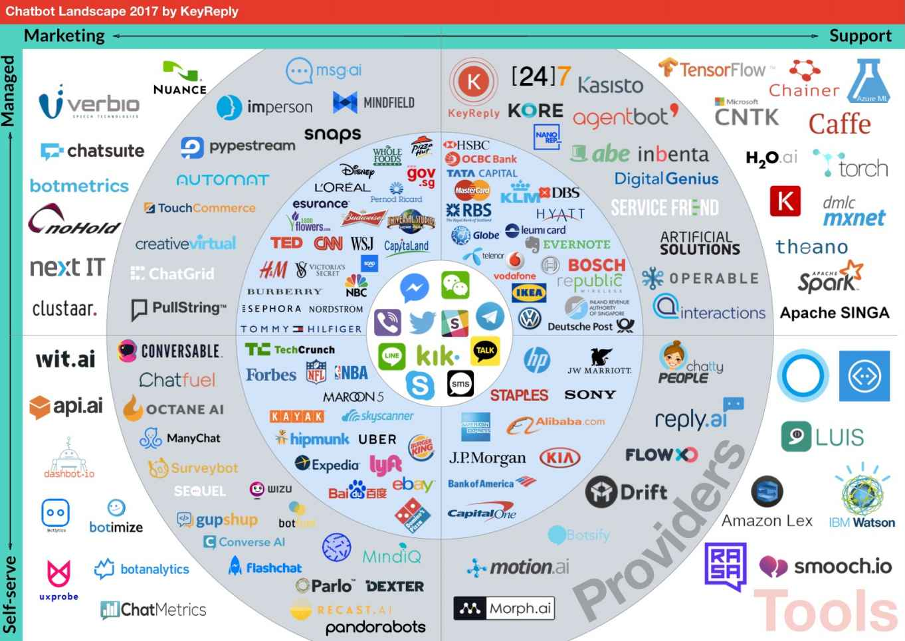
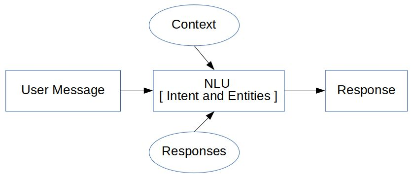
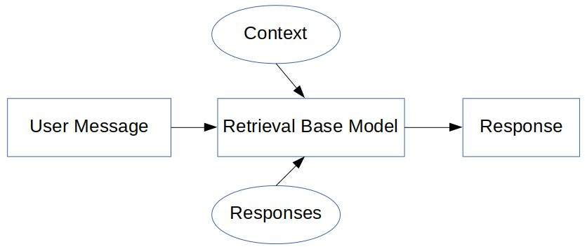
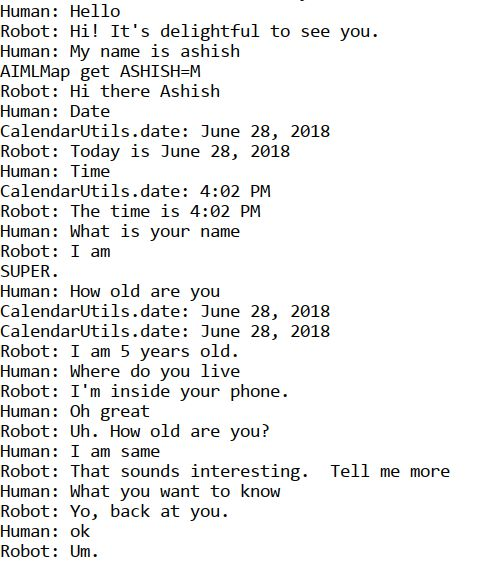
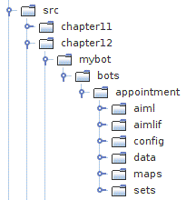

# 十二、创建聊天机器人

聊天机器人在过去几年中变得很流行，许多企业使用它来帮助客户通过网络执行日常任务。社交媒体和信使平台是聊天机器人发展的最大推动力。最近，脸书信使在其信使平台上攻击了 10 万个机器人。除了聊天机器人，语音机器人如今也获得了很大的吸引力，亚马逊的 Alexa 就是语音机器人的一个主要例子。聊天机器人现在已经深入到客户市场，这样客户可以得到及时的回复，而不必等待信息。随着时间的推移，机器学习的发展已经使聊天机器人从简单的对话发展到以行动为导向，现在它们可以帮助客户预约、获取产品细节，甚至接受用户的输入、预订和预定以及在线订单。医疗保健行业正在看到聊天机器人的使用可以帮助越来越多的患者。

你也可以理解聊天机器人的重要性和预期增长，因为许多大公司的负责人已经大量投资聊天机器人或购买基于聊天机器人的公司。你可以说出任何一个大型组织——比如谷歌、微软、脸书或 IBM——都在积极提供聊天机器人平台和 API。我们都用过 Siri，或者 Google Assistant，或者 Alexa，都不过是机器人。

下图是 2017 年聊天机器人的版图:



来源–https://blog . key reply . com/the-chatbot-landscape-2017-edition-ff 2 e 3d 2 a 0 BDB

同心圆从内圈开始，显示平台、品牌、提供商和工具。

在这一章中，我们将会看到不同类型的聊天机器人，我们也将会开发一个简单的预约聊天机器人。

本章将涵盖以下主题:

*   聊天机器人架构
*   人工语言互联网计算机实体


# 聊天机器人架构

聊天机器人只不过是一个可以与用户聊天并代表用户执行特定级别任务的计算机程序。聊天机器人似乎在用户的问题和解决方案之间有着直接的联系。聊天机器人的主要方面如下:

*   **简单聊天机器人** : 关于这种类型的聊天机器人，用户会键入一些文本，大多是以问题的形式，机器人会以文本的形式做出适当的回复。
*   对话聊天机器人:这种聊天机器人知道对话的上下文并保持状态。根据用户，对用户文本的响应是以对话的形式。
*   人工智能聊天机器人(AI chatbot):这种聊天机器人从提供给它的训练数据中学习，这些数据是从许多不同的场景或过去的一长串对话中准备的。

聊天机器人的主要方面是使用一些预定义的库或数据库，或使用机器学习模型来生成对用户文本的正确或适当的响应。机器学习算法允许用大量数据或对话的例子训练机器人选择模式。它使用意图分类和实体来生成响应。为了找到意图和实体，它使用了自然语言理解的概念**(**):****

****

为聊天机器人使用机器学习需要对机器学习算法有很好的理解，这超出了本书的范围。

我们将研究一个不涉及机器学习的选项，这样的模型被称为基于检索的模型，其中响应是从一些预定义的逻辑和上下文中生成的。它易于构建且可靠，但在响应生成方面并不是 100%准确。它被广泛使用，有几个 API 和算法可用于这样的模型。它基于`if...else`条件生成响应，这被称为基于模式的响应生成:



它依靠**人工智能标记语言** ( **AIML** )来记录模式和反应。这将在下一节讨论。


# 人工语言互联网计算机实体

人工语言互联网计算机实体 ( **爱丽丝**)是一个由 AIML 创建的免费聊天机器人软件。这是一个 NLP 聊天机器人，它可以使用一些启发式模式匹配规则与人类进行对话。它已经三次获得罗布纳奖，该奖授予有成就的会说话的机器人。它没有通过图灵测试，但仍然可以用于正常聊天，并且可以定制。


# 了解 AIML

在本节中，我们将使用 AIML。AIML 是一种基于 XML 的标记语言，用于开发人工智能应用程序，尤其是软件代理。它包含用户请求的规则或响应，供 NLU 单位内部使用。简单来说，我们在 AIML 中添加的规则越多，我们的聊天机器人就会越智能，越准确。

因为 AIML 是基于 XML 的标记语言；它以根标签`<aiml>`开始，所以一个典型的 AIML 文件看起来像这样:

```java
<?xml version="1.0" encoding="UTF-8"?>
<aiml>
</aiml>
```

为了添加问题和答案或对可能的查询的响应，使用了`<category>`标签。它是聊天机器人知识库的基本单元。简单地说，`<category>`接受输入并返回输出。所有 AIML 元素必须包含在`<category>`元素中。`<pattern>`标签用于匹配用户的输入，`<template>`标签是对用户输入的响应。将它添加到前面的代码中，代码现在应该如下所示:

```java
<?xml version="1.0" encoding="UTF-8"?>
<aiml>
    <category>
        <pattern>Hello</pattern>
        <template> Hello, How are you ? </template>
    </category>
</aiml>
```

所以，每当用户输入单词`Hello`，机器人就会用`Hello, How are you ?`来回应。

在`<pattern>`标签中使用一个`*`作为通配符来指定任何内容都可以代替星号，在`<template>`标签中使用一个`<star>`标签来形成响应，如下所示:

```java
<?xml version="1.0" encoding="UTF-8"?>
<aiml>
    <category>
        <pattern>I like *.</pattern>
        <template>Ok, so you like <star/></template>
    </category>
</aiml>
```

现在，当用户说“`I like Mangoes`”时，机器人的响应将是“`Ok so you like mangoes`”。我们也可以使用多个`*`，如下所示:

```java
<?xml version="1.0" encoding="UTF-8"?>
<aiml>
    <category>
    <pattern>I like * and *</pattern>
        <template> Ok, so you like <star index="1"/> and <star index="2"/></template>
    </category>
</aiml>
```

现在，当用户说“`I like Mangoes and Bananas`”时，机器人的响应将是“`Ok so you like mangoes and bananas`”。

接下来是`<srai>`标签，用于不同的模式以生成相同的模板，如下:

```java
<?xml version="1.0" encoding="UTF-8"?>
<aiml>
    <category>
        <pattern>I WANT TO BOOK AN APPOINTMENT</pattern>
        <template>Are you sure</template>
    </category>
    <category>
        <pattern>Can I *</pattern>
        <template><srai>I want to <star/></srai></template>
    </category>    
    <category>
        <pattern>May I * </pattern>
        <template>
            <srai>I want to <star/></srai>
        </template>
    </category>
</aiml>
```

第一个类别具有“`I WANT TO BOOK AN APPOINTMENT`”的模式，其响应为“`Are you sure`”。在下一个类别中，如果用户询问“`Can I book an appointment`或“【T3”)，得到的响应将是相同的:“`Are you sure`”。

正如我们在这里看到的,`<srai>`标签有许多用途，它也可以用于同义词和关键字解析。

更多标签请参考[`call mom . Pandora bots . com/static/reference/# aiml-2-0-reference`](http://callmom.pandorabots.com/static/reference/#aiml-2-0-reference)。


# 使用 ALICE 和 AIML 开发聊天机器人

要开发聊天机器人，我们需要一个 AIML 解释器或 AIML 的参考实现。一个这样的工具是 AB 程序，它可以在 https://code.google.com/archive/p/program-ab/找到。在下载部分，程序 AB 有这个 ZIP 文件。提取文件，该文件将包含以下目录:

*   `bots`:包含`super`文件夹以显示机器人的名称
*   `data`:包含样本文本
*   `lib`:包含`Ab.jar`
*   `out`:包含一个类文件

在`bots`目录的`super`子目录中，我们可以看到目录名`aiml`、`aimlf`、`config`、`data`、`maps`、`sets`。这些是使用 AIML 和 ALICE 创建聊天机器人所需的标准目录。让我们测试一下聊天机器人。打开一个新的终端，移动到我们提取的`program-ab`文件夹，并执行以下命令:

```java
program-ab-0.0.4.3$ java -cp lib/Ab.jar Main bot = test action=chat trace=false
```

它将加载所有文件，并向您显示一个提示，如下所示:

```java
Human :
```

试着用一些文本聊天，你很快就会意识到它是有效的，但并不总是有效，也不是对所有的查询都有效。以下是聊天演示:



现在，让我们创建自己的聊天机器人来安排约会。第一步是创建一个 AIML 文件。

在新的 NetBeans 项目中创建以下文件夹结构，并将`Ab.jar`添加到项目库中:



在`aiml`目录中，我们创建一个 AIML 文件，内容如下:

```java
<?xml version="1.0" encoding="UTF-8"?>
<aiml>
<!--  -->
<category><pattern>I WANT TO BOOK AN APPOINTMENT</pattern>
<template>Are you sure you want to book an appointment</template>
</category>
<category><pattern>YES</pattern><that>ARE YOU SURE YOU WANT TO BOOK AN APPOINTMENT</that>
<template>Can you tell me date and time</template>
</category>
<category><pattern>NO</pattern><that>ARE YOU SURE YOU WANT TO BOOK AN APPOINTMENT</that>
<template>No Worries.</template>
</category>
<category><pattern>DATE * TIME *</pattern><that>CAN YOU TELL ME DATE AND TIME</that>
<template>You want appointment on <set name="udate"><star index="1"/> </set> and time <set name="utime"><star index="2"/></set>. Should i confirm.</template>
</category>
<category><pattern>YES</pattern><that>SHOULD I CONFIRM</that>
<template><get name="username"/>, your appointment is confirmed for <get name="udate"/> : <get name="utime"/></template>
</category>
<category><pattern>I AM *</pattern>
<template>Hello <set name="username"> <star/>! </set></template>
</category>
<category><pattern>BYE</pattern>
<template>Bye <get name="username"/> Thanks for the conversation!</template>
</category>
</aiml>
```

让我们研究一下 AIML 文件。使用`set`和`get`标签，可以将上下文保存在变量中，并在需要时进行检索:

```java
<category><pattern>I AM *</pattern>
<template>Hello <set name="username"> <star/>! </set></template>
</category>
```

这展示了`set`属性的使用，所以当用户输入“`I am ashish`”时，它被保存在变量`name`中，响应为“`Hello Ashish !`”。现在，通过使用`get`打印用户名，这可以在 AIML 的任何地方使用。因此，这意味着可以保持使用`set`和`get`标签上下文。

下一步是创建一个约会。当用户要求预约时，响应将要求确认，如下所示:

```java
<category><pattern>I WANT TO BOOK AN APPOINTMENT</pattern>
<template>Are you sure you want to book an appointment</template>
</category>
```

现在，来自用户的预期请求将是 yes 或 no，根据它们生成下一个响应。为了在最后一个问题的上下文中继续对话，使用标签，如下所示:

```java
<category><pattern>YES</pattern><that>ARE YOU SURE YOU WANT TO BOOK AN APPOINTMENT</that>
<template>Can you tell me date and time</template>
</category>
<category><pattern>NO</pattern><that>ARE YOU SURE YOU WANT TO BOOK AN APPOINTMENT</that>
<template>No Worries.</template>
</category>
```

如果用户说“`YES`”，聊天机器人将询问日期和时间，该日期和时间再次被保存，并且询问确认用户是否想要在规定的日期和时间预约，如下所示:

```java
<category><pattern>DATE * TIME *</pattern><that>CAN YOU TELL ME DATE AND TIME</that>
<template>You want appointment on <set name="udate"><star index="1"/> </set> and time <set name="utime"><star index="2"/></set>. Should i confirm.</template>
</category>
<category><pattern>YES</pattern><that>SHOULD I CONFIRM</that>
<template><get name="username"/>, your appointment is confirmed for <get name="udate"/> : <get name="utime"/></template>
</category>
```

示例聊天输出如下:

```java
Robot : Hello, I am your appointment scheduler May i know your name
Human : 
I am ashish
Robot : Hello ashish!
Human : 
I want to book an appointment
Robot : Are you sure you want to book an appointment
Human : 
yes
Robot : Can you tell me date and time
Human : 
Date 24/06/2018 time 4 pm
Robot : You want appointment on 24/06/2018 and time 4 pm. Should i confirm.
Human : 
yes
Robot : ashish!, your appointment is confirmed for 24/06/2018 : 4 pm
```

将此 AIML 文件作为`myaiml.aiml`保存在`aiml`目录中。下一步是创建 AIML 中间格式 CSV 文件。创建一个名为`GenerateAIML.java`的 Java 文件，并添加以下代码:

```java
public class GenerateAIML {

        private static final boolean TRACE_MODE = false;
        static String botName = "appointment";

    public static void main(String[] args) {
        try {

            String resourcesPath = getResourcesPath();
            System.out.println(resourcesPath);
            MagicBooleans.trace_mode = TRACE_MODE;
            Bot bot = new Bot("appointment", resourcesPath);

            bot.writeAIMLFiles();

        } catch (Exception e) {
            e.printStackTrace();
        }
    }

    private static String getResourcesPath(){
        File currDir = new File(".");
        String path = currDir .getAbsolutePath();
        path = path.substring(0, path.length()-2);
        System.out.println(path);
        String resourcePath = path + File.separator  + "src/chapter12/mybot";
        return resourcePath;
    }
}
```

执行这个文件。它会在`aimlif`目录下生成`myaiml.aiml.csv`。

根据您在 NetBeans 中的软件包更改`ResourcePath`变量。在本例中，`chapter12`是包名，`mybot`是包内的目录。

创建另一个 Java 文件来测试 bot，如下所示:

```java
public class Mychatbotdemo {
    private static final boolean TRACE_MODE = false;
    static String botName = "appointment";
    private static String getResourcePath(){
        File currDir = new File(".");
        String path = currDir .getAbsolutePath();
        path = path.substring(0, path.length()-2);
        System.out.println(path);
            String resourcePath = path + File.separator  + "src/chapter12/mybot";
        return resourcePath;
    }
    public static void main(String args[]){
        try
        {
            String resourcePath = getResourcePath();
            System.out.println(resourcePath);
            MagicBooleans.trace_mode = TRACE_MODE;
            Bot bot = new Bot(botName, resourcePath);
            Chat chatSession = new Chat(bot);
            bot.brain.nodeStats();
            String textLine = "";
            System.out.println("Robot : Hello, I am your appointment scheduler May i know your name");
            while(true){

                System.out.println("Human : ");
                textLine = IOUtils.readInputTextLine();
                if ((textLine==null) || (textLine.length()<1)){
                    textLine = MagicStrings.null_input;
                }
                if(textLine.equals("q")){
                    System.exit(0);
                } else if (textLine.equals("wq")){
                    bot.writeQuit();
                } else {
                    String request = textLine;
                    if(MagicBooleans.trace_mode)
                        System.out.println("STATE=" + request + ":THAT" + ((History)chatSession.thatHistory.get(0)).get(0) + ": Topic" + chatSession.predicates.get("topic"));
                    String response = chatSession.multisentenceRespond(request);
                    while(response.contains("&lt;"))
                        response = response.replace("&lt;", "<");
                    while(response.contains("&gt;"))
                        response = response.replace("&gt;", ">");
                    System.out.println("Robot : " + response);
                }
            }
        }
        catch(Exception e){
            e.printStackTrace();
        }

    }
}
```

执行 Java 代码，您将看到提示说`Human:`，它将等待输入。按下 *Q* 将结束程序。根据我们的 AIML 文件，我们的对话是有限的，因为我们只要求基本信息。我们可以将它与`super`文件夹集成在一起，并将我们的 AIML 文件添加到`super`目录中，这样我们就可以使用默认的所有可用对话和我们的定制约会对话。


# 摘要

在这一章中，我们看到了聊天机器人的重要性以及它们的发展方向。我们还向您展示了不同的聊天机器人架构。我们从了解 ALICE 和 AIML 开始，使用 AIML，我们创建了一个用于约会安排的演示聊天机器人，以展示使用 ALICE 和 AIML 的聊天机器人的概念。****