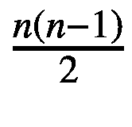

# 二、计算思维

到目前为止，我们一直在拟人化地谈论计算机，说它们学习，执行算法等。然而，计算机实际上唯一能做的事情是遵循一系列指令。在这一章中，我们将更多地讨论指令列表应该是什么样子。我们现在还不会进入编程，但是我们将会讨论“算法思维”，也就是说，如何为程序的执行制定解决方案的步骤。在此期间，我们还将触及一些计算方面的理论问题(包括强调一些问题是如何非常低效地解决的)，如何确定我们算法的复杂性(因此我们可以尝试更简单的解决方案)，以及一些算法/算法类别，它们可以提供替代方案，让人工智能解决您的潜在问题。这一章的很多内容会感觉高度理论化(因为它意味着理论化)并与人工智能分离，但确实为开始像计算机“思考”一样思考提供了基础(这对学习如何编写一般程序和编写人工智能算法至关重要)。抛开免责声明不谈，让我们来谈谈计算机实际上是如何工作的。

## 计算机如何“思考”

在最基本的层面上，计算机按照二进制数(即 0 和 1)运行。从一个日常程序员的角度来看，真的没有必要去想这些数字；然而，它确实说明了计算机是根据数值运算来思考的。CPU(中央处理器)支持的计算机操作的最小集合是加法、乘法、除法以及从/在存储器中加载/存储值的变体。然而，考虑到计算机运行的惊人速度，我们可以使用这些操作来获得更复杂的行为，如比较两个数字的能力，多次执行同一组指令的能力，甚至将信息发送到输出设备(如根据存储在计算机内存中一组特定位置(称为地址)的值来改变像素颜色的屏幕)。

现在，所有这些对初级程序员来说意味着什么？这意味着计算机是“哑的”你让他们做什么，他们就会做什么，而且做得很快；然而，如果你不指定具体的步骤，计算机就不能做你想让它做的任何事情。例如，在我们之前的身体质量指数计算器例子中，从概念的角度来看，我们的程序将做的事情(即，接受两个数字，计算一个身体质量指数，并说出某人属于哪个体重类别)的概要是很棒的；但是，它没有指定一些额外的行为。首先，我们是如何接受单个输入值的？此外，我们如何报告实际的体重类别？我们是否从文件中读取/写入这些值？从更高的层面来看，用户将如何利用这一功能？我们会希望他们通过网站与工具互动吗？如果是这样，我们是否希望存储以前的计算结果以便于参考？

所有前面的问题，以及更多的问题，都是你在定义要解决的问题时应该考虑的。在最基本的层面上，一个程序有某种形式的输入，一组处理输入的步骤，以及一个输出。具体描述每一步会发生什么取决于你。如果我们在计算思维中重新定义我们的身体质量指数问题，我会说程序的输入是可变的；然而，为了简单起见，我们将在网站上提供一个工具。从那里开始，该网站将在页面上有两个输入框:一个用于输入体重，另一个用于输入患者的身高。当用户按下网页上的一个单独的按钮时，将执行一个计算来计算患者的身体质量指数并报告体重类别。计算结果将显示在网站上，供用户查看。我漏掉的一个关键部分正是计算发生的地方。网站其实有两种选择。计算可以在向您发送您正在查看的网站页面的代码的 web 服务器上进行(然后，您的 web 浏览器会为您解释并显示该代码)，或者计算可以在网页本身上进行(即，在浏览器内)而无需联系服务器。不管这里提到的细节如何，很明显，为一个程序定义一个问题和解决方案是相当复杂的。

在更高的层面上，当我们谈论可以用 AI 解决的问题时，我们不得不考虑额外的问题。第一，我们如何为他们正在选择的 AI 算法获取足够的训练数据？那个 AI 算法的目标是什么？什么算法最适合这项任务？我们如何量化一个人工智能有多“错误”？我们如何在算法被训练后测试它的功效？

在旨在潜在地检测 MRI 扫描中的肿瘤的 AI 的情况下，我们将需要来自放射科医生的带注释的 MRI 图像，这些放射科医生手动标记图像并描绘肿瘤的精确体素位置(即，分割肿瘤本身)。这项任务产生的其他问题是:放射科医生将使用什么来注释成像序列，该程序如何输出分割，以及它是否容易被我们正在构建的任何程序读取？在只有几个放射科医生为几个 MRI 系列创建单独分割的情况下，我们如何增加训练集(即，对数据应用图像变换，如扭曲、缩放、裁剪、增亮等)。)为我们正在使用的算法提供更多数据？

一旦我们确定了如何为算法提供训练数据，我们必须问的另一个问题是如何评估算法？我们是否只是根据其检测图像中是否存在*肿瘤的能力来评估人工智能，或者是否需要更具体的结果？是否有必要对图像中的肿瘤类型进行分类，或者在成像研究中仅报告*可能是*肿瘤并对其进行标记以供进一步的人体分析是否足够？前面的问题将告知我们使用什么样的方法来评估人工智能，以及它在整个训练过程中有多“错误”(最终在评估程序本身时)。最后，我们需要确定人工智能程序的输入和输出将如何完成，以及它将在哪里可用(即，它将位于个人的计算机上还是服务器上？).*

一旦你实际上把你的问题或提议的过程格式化为从计算的角度可以想到的东西，下一个要问的问题是某个东西是否可以通过计算来解决。

## 什么“能”和“不能”被解决

虽然计算机在执行单个操作时速度惊人，但有些任务用传统的算法方法是不可行的。能够准确发现哪些问题是不可行的，这对于学习如何为医学领域的问题起草研究提案和潜在解决方案至关重要。

从形式的角度来看，计算不可行性被定义为一个确实是可计算的问题，但是难以置信的资源密集程度，以至于由于需要大量的资源，计算机执行一项任务是不实际的。被认为在计算上不可行的问题的一个例子是旅行推销员问题(TSP)。问题如下:给定一个城市列表和每对城市之间的距离，恰好访问每个城市一次并返回原城市的最短可能路线是什么？

解决这个问题的第一个尝试是选择一个城市。从那里，选择一个剩余的城市，并将其添加到累计行驶距离中。一旦你去过所有的城市至少一次，然后回到原来的城市。问题是我们需要找到最短的路线。我们的解决方案只提供了一种潜在的方法来做到这一点:尝试城市路径的每一种可能的组合，以找到一个尽可能最小的距离。然而，这个操作可能很快变得非常复杂。如果我们有四个彼此等距的城市(即，四个点排列在一个正方形中)，我们将有四个可能的选择作为我们的起始城市，三个选择作为下一个旅行的城市，两个在那之后，一个在那之后。这意味着我们需要检查 24 个(4*3*2*1)不同的路径组合，并找出哪一个是最短的。

检查这些相对较少的路径是非常小的。然而，如果我们改变我们需要访问的城市数量，会发生什么呢？作为一般规则，我们可以看到我们当前的算法要求我们检查 *n！*不同的路径，其中 *n* 是城市的数量。如果我们把城市的数量改为 100 个呢？嗯，100！是 9.3*10¹⁵⁷.这是一个不可思议的大数字，肯定超过了单个处理器的处理能力(很可能一秒钟执行一次 2*10⁹ 运算)。一些信封背面的计算意味着我们将需要(至少)10¹³⁸ 年来检查所有可能的解决方案。在某些情况下，宇宙的热寂预计将发生在 10¹⁰⁰ 年，到那时，我们的程序仍将运行。我们概述的方法通常被称为“强力”方法，因为我们正在检查每一个可能的解决方案。尽管算法本身相对容易理解，但我们需要做的运算量太大，不可行。

当然，我们可以放松围绕这个问题的一些约束，使我们能够解决一些稍微简单的问题。我们可以通过反复选择我们还没有去过的最近的城市来找到一条通常被认为“足够好”的路径，而不是找到最短的路径。因为我们没有检查所有可能的解决方案，所以我们无法真正保证这将是最短的路径，但是如果您想要在宇宙热寂之前找到 100 个城市的 TSP 问题的解决方案，您可能会愿意考虑使用该算法(也称为“贪婪算法”，因为它在每一步都会立即选择成本最低(即距离最短)的路径)。

让我们尝试另一个稍微简单一点的问题:尝试在电话簿中查找企业。最初的解决方案是通过手动翻页来费力地检查电话簿中的每一页。嗯，没人真的这么做。当我们考虑做这项任务时，我们通常会有某种启发性的想法(捷径):翻到电话簿中该名字所在位置附近的一页。如果它不在那一页上，确定它是在你翻到的那一页之前还是之后。从那里，重复该过程，重新设置您选择的页面的边界。具体来说，假设一本电话簿有 500 页，你需要找到一个以“j”开头的企业。假设字母“O”的企业在那一页上，那么我们知道“J”的企业会在那之前。然后让我们从 0 到 250 的范围内选择中间的一页，而不是 0 到 500，比如说 125 页。第 125 页包含名为“h”的企业，所以现在我们知道“J”企业将出现在第 125 页之后，肯定在第 250 页之前。因此，让我们选择该范围内的中间一页(约 313 页)，我们可能会在这一页上找到我们的业务！

实际上，这种方法(称为“递归”)专注于将一个较大的问题分解成较小的问题(称为“子问题”)，然后对每个子问题重复相同的操作，直到我们认为完成了某个点。我们的过程基本如下:给定一组我们知道已排序的要查找的东西(我们的例子中的电话簿是按字母顺序排序的)，选择中间的元素。如果该元素在我们要查找的项目之前，则在集合的后半部分重复第一步。如果该元素在我们要查找的项目之后，则在集合的前半部分重复前面的过程。一旦我们找到了想要的元素，就停下来报告结果。如果我们的电话簿只有八页，实际上可以证明，在最坏的情况下，我们只需要三次迭代就可以找到我们想要的业务所在的页面。在这里，最坏的情况是我们的业务在电话簿的第一页(或最后一页)(所以我们会打开到第 4 页，然后转到第 2 页，然后转到第 1 页，最后结束)。概括这个规则，如果我们有 *n* 个元素要搜索，我们将在算法的*日志*<sub>*2*</sub>*【n】*次迭代中找到想要的元素。事实上，这是一个对数规模的操作，因为如果我们的电话簿有 2048 页，我们只需要执行翻转(最多)11 次！

前面的算法说明了一个人在解决问题时可能面临的潜在问题的两个极端。一方面，您可能会遇到一个需要很长时间才能解决的解决方案，这导致您要么限制问题的规模(在我们的例子中，将城市的数量限制在比 100 小得多的数量)，要么放松约束，以便您可以获得一个在计算约束下工作的解决方案(即，追求“足够好”的贪婪方法)。另一方面，通过一点点直觉思维，你可能会得到一个几乎在所有规模下都能很好工作的问题(例如，我们的“递归”解决方案)。

现在，所有这些和人工智能有什么关系呢？回想一下我们的旅行推销员问题(TSP)。我们知道，如果我们有 *n* 个城市，我们将需要检查 *n！*不同的潜在解决方案，找出产生最短潜在路径的方案。我们将该算法指定为非多项式算法，其中“多项式”将表示该函数小于表达式 *n* <sup>*k*</sup> (其中 n 是输入的大小，k 是某个不是变量的常数；注意，我们也忽略任何常数，并假设我们只对“小于”表达式求值，只超过一些通用常数)。 *n！*只能由一个函数 *n* <sup>*n*</sup> 上界，由于指数 *n* 不是常数且随输入大小变化，所以不是多项式。这类问题属于被称为“NP-Hard”的一般类别，因为(非常，非常，非常粗略地)人们认为它们不能在多项式时间内解决(但陪审团仍然不知道)。深度学习算法属于 NP-Hard 问题的领域，并且共享在旅行推销员问题中看到的类似的求解时间(即，不是多项式时间)。

More on complexity classes

还存在其他复杂性类别。电话簿搜索问题(正式名称为二分搜索法)是一个可以在多项式时间内解决的问题(上限为 *n* )，属于复杂性类“p”。“NP”问题是指可以在多项式时间内验证其解决方案的问题。就 TSP 而言，如果我们将约束从“查找最短路径”更改为“查找长度小于 *X* 的路径”，那么就很容易检查解决方案是否正确(只需将城市之间的跳跃长度相加，而不是尝试所有可能的路径，以及所建议的路径是否与所有可能性中的最短路径相同)。“NP-困难”问题更准确地说是与 NP 中的问题一样困难的*至少*的问题(即，NP 中的问题可以被“重新表述”为 NP-困难问题)，而“NP-完全”问题是既“NP”又“NP-困难”的问题计算机科学中讨论的一个问题是 P 是否等于 NP。本质上是问一个问题，它有一个可以在多项式时间内验证的解，是否有办法在多项式时间内找到那个解。

当然，ML、DL 和 AI 算法有各种更宽松的约束和捷径，它们试图得出对大多数情况“足够好”的解决方案。例如，一些人工智能算法倾向于将“足够好”的判断留给用户，并要求预先指定训练网络所需时间的限制，而不是试图找到产生正确输出的最佳方式。因此，很难找到一种算法可以一直 100%准确地运行(如果有人声称找到一种 100%准确的算法，你应该怀疑)。但总的来说，人工智能问题具有更高的计算复杂性，因此需要更长的时间来解决。这意味着人工智能算法有时需要大量的计算来训练(例如，谷歌花费数千美元来训练其自然语言处理模型)，这些程序的创造者需要认识到人工智能的 NP-Hard 性质所导致的潜在资源限制。

既然我们已经讨论了什么可以解决，什么不能解决的计算观点，我就不能不提为什么不可能解决人工智能世界中的某些问题的其他原因。这些主要处理您可用工具的实际限制。例如，如果你想找到一种方法来跟踪患者使用手机的步数，你必须确保患者使用的手机有一个加速度计(测量手机的倾斜度)，你可以访问它的读数，或者手机本身有某种方法来访问一个人当天的步数(例如，苹果设备允许应用程序开发人员访问拥有 iPhone 或 Apple Watch 的用户的步数数据和心率信息)。如果你没有合适的工具，问题很容易变成不可行的，所以一定要确保你正在解决的问题是正确的。

## 算法选择

正如我们在上一节中所述，非人工智能算法可能会产生有效的解决方案，并且有几个已经在医疗保健领域这样做了。在这里，我们将涵盖一些类型的非人工智能为基础的算法的替代品存在。本节的标题有点用词不当，因为不一定有一个算法列表或一类算法可以解决您可能面临的问题。然而，我将尝试举例说明算法在医疗保健和生物学中的应用。这些例子并不意味着是全面的；相反，他们旨在表明，在一个特定的问题上投入人工智能可能不是医疗保健领域可能面临的所有既定问题的最佳解决方案。抛开这个免责声明，让我们来看看一个算法，一些读者可能很熟悉。

### 稳定匹配

如果你是美国的一名医生，你在培训期间可能接触过的一种算法是 Gale-Shapley 稳定匹配算法。这种算法(稍作修改)决定了申请人在未来几年追求住院医师资格时将选择的医院和专科。然而，该算法背后的想法源于一个更简单的问题:寻找最佳婚姻。

匹配算法的基础始于理论情况。假设有一些男人和一些女人(每组人数相等)，每个人都有他们最终想和谁结婚的偏好(男人起草一份排序的求婚清单，女人起草一份排序的接受清单)。这个算法的目标是创建一个*稳定的匹配*，它是所有男人和女人的配对，这样就不存在一个男人 *M* 和一个女人 *W* 的配对，其中 *M* 和 *W* 更喜欢彼此而不是他们最终匹配的人。实际上，这意味着这个算法的目标是防止私奔(即，如果一切顺利，我们将知道有人没有获得他们的第一偏好，因为第一偏好拒绝了那个人)。实现这种提供稳定匹配的保证是很重要的，因为(在现实世界中)我们希望确保所有的住院医生和医院都得到他们真正想要的住院医生(而不是出现更好的住院医生-医院对是可能的但没有发生的情况)。

那么我们如何解决这个问题呢？一种尝试是列出所有可能的男女配对，然后检查哪些是稳定的。这样做会给我们一个所有可能的稳定匹配列表；然而，这也将是非常计算昂贵的。为了探究它在计算上有多昂贵，假设我们有三个男人和三个女人。列举所有的可能性会产生六个不同的可能匹配(如果你愿意，你可以自己证明)，这还不算太坏。但更普遍的是，这种策略会要求你列出 *n* ！不同的匹配(如果我们有 *n* 个男人和 *n* 个女人)然后检查看哪一个实际上是稳定的。生成阶乘数量的匹配在计算上是非常昂贵的，即使在 n(例如，20！is 2.43e18)并且处理每年申请住院医师资格的数千名医学学生肯定是不可行的。

1962 年，大卫·盖尔和劳埃德·沙贝利提出了一种解决方案，可以解决稳定匹配问题，并且可以在大约 *n* <sup>2</sup> 的运算中解决。他们的解决方案如下。

如果有人尚未订婚，请执行以下操作:

*   每个没有订婚的男人都应该向他最喜欢的女人求婚，只要他以前没有向那个女人求婚。

*   每个不匹配的女人都会暂时“订婚”给她收到的求婚中排名最高的男人。如果她被匹配，但收到一个比她当前“订婚”级别高的男人的订婚邀请，她将离开那个男人，与新的男人订婚(即，她升级)。

这个过程一直重复，直到每个人都和某个人订婚(如果男女数量匹配的话)。该算法保证每个人都必须订婚，并且所有订婚(即将结婚)都是稳定的。为了证明后一点，想象一个男人迈克和一个女人温迪互相喜欢，但最终没有订婚(迈克最终和爱丽丝订婚，温迪和鲍勃订婚)。他们对这种可能性感到困惑。然而，根据算法，我们知道 Wendy 一定在某个时候拒绝了 Mike(当她有空的时候或者当她临时订婚的时候),而选择了 Bob。最后，我们知道匹配不可能有不稳定性，因为一方肯定在某个时候拒绝了另一方，而倾向于更高的偏好。

该算法明显比初始置换方法(即列出所有可能的匹配并检查稳定性)更快。但是这并不能保证我们得到最佳的匹配，因为“最佳”这个词取决于你从谁的角度出发。Gale-Shapley 算法可以被构造成有利于男人而不是女人，或者女人而不是男人(前面提到的算法为男人提供了第一选择，从而确保他们得到最好的可能结果)。无论如何，稳定匹配问题背后的想法在国家住院医师匹配计划中发挥了作用，并考虑到以下事实:申请的医学学生比医院多，医院的多个住院医师职位不同(一方可以有多个约定)，以及更愿意匹配到同一家医院或城市但具有不同专业的夫妇。在匹配算法中考虑夫妇实际上使问题 NP-完全。稳定匹配算法具有超越住院医师匹配的相关性，并且最显著地用于确定器官交换的动态过程，当近亲与需要移植的患者不相容时，为关键的肾脏手术分配供体-受体对。

值得注意的是，使用这种传统算法，我们不需要以任何方式使用人工智能技术。不需要根据稳定匹配的先前例子来训练神经网络，也没有办法训练算法来产生正确的匹配。我们只是列出了一套规定的指令，并证明这些指令会导致我们想要的结果。如果我们要对此做出基于人工智能的解决方案，我们将比 Gale-Shapeley 算法具有更高的时间复杂度，并且我们将无法保证产生最佳匹配(因为人工智能算法很少达到 100%的准确性)。在这里，非人工智能算法在所有指标上都击败了人工智能方法。

### 活动选择

另一个可以在医疗保健中派上用场的算法是活动选择算法。假设您负责一家诊所，并且必须安排医生，以便他们以最佳方式查看您已经在特定时间段预约的一组患者。这些时隙中的一些重叠。此外，就这个问题而言，这些患者对他们要看的医生没有偏好，但是他们的预约时间不同。因此，实际上，你有一个开始和结束时间的列表，并试图找出在给定的时间段内，你可以分配一个医生去看最大数量的病人的最佳方法。

在形式上，我们可以将患者的预约时间视为一组单独的项目。每个项目包含两个描述它的属性。在我们的例子中，这些属性是约会的开始时间和结束时间。实际上，我们的目标是找到最大的集合，使得集合中的所有单个项目在其开始和结束时间方面不重叠(因为违反该约束将意味着我们正在安排医生同时出现在两个地方，这是不可能的)。

那么我们如何解决这个问题呢？一个特别强力的解决方案是列出所有可能的集合，过滤掉不包含彼此兼容的预约的集合(即，它们重叠并导致医生被安排在一次两个地方)，然后在这些集合中找到最大的集合。

但是让我们想想构建这样一个集合需要多长时间。嗯，这实际上相当于 2 个 <sup>*n 个*</sup> ，其中 *n 个*表示约会集的大小。例如，如果我们的集合中只有三个约会(名为 a、b 和 c ),我们可以创建以下集合(其中{...}表示不同的集合):{}、{a}、{b}、{c}、{a，b}、{b，c}、{c，a}、{a，b，c} = 8 = 2 <sup>3</sup> 集合(注意，我们包括没有元素的集合，因为可以安排当天没有预约的医生)。这在形式上被称为动力集。

Side Note Proving a power set contains

2 <sup>*n*</sup> **元素**。我们可以通过一个被称为归纳法的过程正式证明一组 *n* 元素构成一个 2<sup>T9】nT11】元素的幂集。归纳法背后的直觉是建立逻辑，即如果关于问题子集的一些假设被认为是正确的，那么，如果我们对问题的稍大的子集继续这种逻辑，并表明我们得到了预期的结果，假设通常会成立。形式上，我们可以对我们的情况做出归纳假设如下:“假设如果我们在一个集合中有 *k* 个元素(其中 *k* ≥ 1)，那么在其幂集中将有 2 <sup>*k*</sup> 个元素。那么如果集合中有 *k* + 1 个元素，我们需要表明幂集合中会有 2 <sup>*k* + 1</sup> 个元素。我们可以这样来说明:在 *k+1* 的情况下，幂集的每个元素都有两个副本，一个包含*k+1*T30 第</sup>个元素，另一个是原始副本。这给了我们 2<sup>*k*</sup>+2<sup>*k*</sup>= 2∫2<sup>*k*</sup>= 2<sup>*k*+1</sup>个元素，表明当我们把问题做得稍微大一点时，我们的归纳假设成立(这正式称为归纳步骤)。当*k*=*n*-1 时，我们可以用我们的归纳假设说，包含 *k* + 1 = *n* 元素的集合将有 2<sup>*k*+1</sup>= 2<sup>(*n*-1)+1</sup>= 2<sup>*n*我还遗漏了一点归纳证明，称为“基本情况”，但这只是说明当 *k* = 0 时会发生什么，因为这些是特殊情况(我们必须确认定义适用于所谓的“空集”)。</sup>

因此，如果我们每次想要解决这个问题时都在构建一个幂集，那么我们实际上是在创建一个需要指数数量的运算(即，我们需要构建的集合的数量)才能开始解决的问题。正如我们之前所介绍的，对于少量的操作，这是可行的(例如，对于三个约会，我们只需要进行八组检查)。然而，对于一天大约 20 个病人，我们需要制作超过 100 万套(1，048，576)。最重要的是，我们需要检查每个集合，看看哪些元素是重叠的，哪些是不重叠的。

然而，我们可以对这个问题采取一种“贪婪”的心态，我们专注于做出许多局部最优的选择，以获得最终的全局最优解。我这么说是什么意思？嗯，在这种情况下，这意味着我们不必担心选择最佳的预约集，最大限度地增加医生看病人的数量。相反，我们只是在问题的各个阶段反复做出选择，而不考虑它们未来的后果。在我们的例子中，这个贪婪的解决方案会是什么样的呢？嗯，如果我们从一天的一组预约开始，一种方法可能是添加一天中预约最早结束的患者，并将其添加到我们要查看的不断增长的患者组中。要选择下一位患者，我们将只选择其预约时间段与第一位患者的预约时间段不重叠，但在其余患者中完成最早的下一位患者。如果我们继续这样做，我们可能最终构建我们的最优集合。

好吧，那么做这个需要多长时间？嗯，我们需要在所有的集合中搜索最早结束的约会。在最坏的情况下，该约会将位于列表的末尾，我们需要浏览 *n* 项来找到它。将该约会添加到我们的最终设置中，并检查它是否与其他约会冲突，只需要很少的时间。当我们选择新的潜在约会添加到我们的集合中时，我们然后搜索在我们刚刚安排的约会之后开始的下一个约会。这将需要我们查看不同的约会等等。总的来说，我们需要搜索大约的约会，这很好，但可以使用一些改进。然而，如果我们最初按照完成时间升序对这些约会进行排序，我们可以加快在主集合中找到最早兼容约会的过程。与对集合进行排序相关的初始操作量有些高(实际上这大约是*n*∫*log*(*n*))，但是每当 *n* 很大时，实际上需要的操作比以前少。这给了我们问题中的一点优化，但是我们如何证明我们的解决方案实际上是最优的，并得到我们真正想要的。毕竟，当我们想到“贪婪”的事情时，我们往往会想到许多最终导致糟糕结果的短视决策。在我们的案例中，我们可以证明贪婪有时候是好的。

我们可以通过证明我们的方法的两个性质来做到这一点:(1)贪婪选择性质，定义为通过进行局部最优贪婪选择可以找到全局最优解的事实，以及(2)最优子结构性质，定义为最优解由最优子部分组成的事实。让我们开始证明我们的方法满足这两个属性。

为了证明第一个性质，只要表明如果这个问题有一个最优解，它总是包含我们排序的预约集中的第一个病人(即，它从预约最早结束的病人开始)，称为 *p* 就足够了。为了解释为什么，假设存在一些最优的约会集合，它们不是以约会 *p* 开始的(称这个集合为 *B* )和另一个以约会开始的集合( *A* )。我们可以证明，任何最优集合都可以被构造为从第一个约会开始，如下所示:删除非 *p* 约会，并用 *p* 替换它。我们可以执行这个操作，因为我们知道 *p* 不会与现在存在的 *B* 中的任何内容重叠。 *A* 和 *B* 中的约会数是相同的，但是我们已经表明任何最优解都可以从贪婪选择开始。

很好，但是如果我们从贪婪的选择开始，那如何证明连续做出贪婪的选择会导致最优解呢？我们通过证明最优子结构来做到这一点。先来一个大概的猜想。如果集合 *A* 是整个约会集合的约会问题的解，那么从 *A* 中省略约会 *p* 的解(称这个集合*A’*)将是不包含 *p* 约会的约会问题的最优解。这个猜想基本上是说，如果我们有一个最优解，并且取一个问题的子集，这个子集的最优解将包含在全局最优解中。

我们如何证明这一点？我们可以使用一种叫做矛盾证明的技术。我们的目标将是证明一个陈述 *S* 是真的，通过某种方式显示 *S* 的对立面是不可能的，通过显示某个原理的内部矛盾(从而显示 *S* 为真是唯一的可能性)。在我们的例子中，我们的语句 *S* 是当我们的约会集合省略了 *p* 时的最优解。因此，与我们的陈述相反的是，有一些其他集合(称之为*B’*)包含比*A’*更多的元素。因此，如果我们将 *p* 添加回约会集合中进行选择，最佳解决方案应该包含该约会。如果我们将 *p* 加到*B’*上，并将这一组新的约会称为 *B* ，我们就构建了一组实际上比 *A* 更大的问题的最优解，我们之前假设这是最优解。我们得出了一个矛盾，它表明集合*B’*不可能存在，并且所构造的集合 *A* 确实是最优的，并且*A’*是不包含约定 *p* 的子问题的最优解。我们可以扩展这个逻辑，继续做出贪婪的选择来解决越来越小的子问题(这些子问题的解也是最优的)，最终表明我们可以构建全局最优解。

嗯，这是很难理解的，但它确实表明了一些重要的想法。算法被证明是正确的，它们以确定性的方式运行，并且它们可以比暴力方法产生巨大的好处。当我们从人工智能的角度来考虑这个问题时，我们必须再次找到一些方法来训练人工智能模型提出这种逻辑(这已经很难做到了)，即使这样，我们也不能特别保证它在所有情况下都有效(因为人工智能在很大程度上是一个黑箱:即，很难确定人工智能是如何提出它的解决方案的)。在我们的活动选择问题中，贪婪方法是最好的。

## 算法和其他算法的分析

早先的一些解释包括提到操作的次数，发生某事需要的时间等等。然而，计算机科学家很少关心与特定算法相关的单个运算的计数。相反，他们更感兴趣的是所执行操作的一般数量级(即 10 秒、100 秒、1000 秒、1000000 秒等。).但是并不是所有的操作都被认为是平等的。例如，赋值和跟踪 a 值的行为被认为几乎可以忽略不计。也没有考虑从系统中访问文件、下载信息、等待用户输入等需要多长时间。一个算法中唯一重要的部分(当进行算法分析时)是那些实际上会产生某种程度的成本的部分，也就是说，重复的操作，比如在一个数字列表中搜索值。此外，在算法分析中，我们不考虑一台计算机相对于另一台计算机的速度，而只是假设有一个“时间步长”的基本单位，它没有实际意义(但意味着允许算法之间的比较)。

因此，这个模型，正式称为 RAM(随机存取存储器)计算模型，基本上是假设你有一些理论上的计算机，并不真正关心现实生活中的约束。这种假设的优点是我们不必关心硬件的性能等。，在确定我们的算法有多好的时候。缺点是，我们分析我们的算法需要运行的时间步骤的数量并不等于现实世界的时间。

例如，我们正在查看用于确定某人是否肥胖的程序，该算法将使用一个时间步长来执行除法运算并将其设置为等于一个变量，一个时间步长用于评估每个比较运算，另一个时间步长用于输出结果。在最坏的情况下，这将导致我们进行五次比较(即，我们在进行最后一次比较之前评估所有先前的比较)。计算这个问题的所有时间步骤很容易，但是我们的活动选择问题呢？这就有点复杂了。但是我们可以做的是分析算法的伪代码(即，不是实际的代码，而是为了传达语义而编写的代码)，并找到每一步所需的时间。

```py
Activity Selection (set of appointments):
      S = Sort (set of appointments) by finish time

      Optimal Set = {First Element in S}

      For each element e in S after the 1st element
      do the following:
            If the start time of the eth appointment
            is after the most recently added element
            in Optimal Set:
                  Add the eth appointment to the
                  Optimal Set.
      Output the Optimal Set

```

有一点需要注意:伪代码的第一行是一个**函数头**。它指定了我们正在运行的函数的名称(在本例中为“activity selection”)和函数运行所需的一系列**参数**(在本例中为我们将要执行操作的约会集)。此外，这里的“=”符号并不意味着相等，而是意味着赋值(例如，如果我说“x = 5”，我将值“5”赋给变量“x”)。

让我们先来看看以“for”开头的部分。每个操作如下:比较检查和向集合中添加内容。这两个操作都需要一个时间步来完成。如果我们正在处理的活动的数量是 *n* ，那么最多需要 2 个 *n* 操作来遍历整个集合并构建最优集合(并且这是假设所有的约会都是间隔开的，使得没有一个约会彼此重叠，并且最优集合等同于原始的约会集合)。我们可以用“大 O”符号的形式来表达。我们将去掉这一项前面的常数，只是说程序的这一部分将花费 *O* ( *n* )时间来完成。形式上说 2*n*=*O*(*n*)是指存在一些常数 *c* 和 *k* 使得对于所有*n*≥*k*0≤2*n*≤*c*∫*n*。在这种情况下，c 将是 2，k 将是 0。大 O 符号的另一个例子是说*n*<sup>2</sup>+*n*+1 =*O*(*n*<sup>2</sup>)。本质上，我们只关心算法运算量表达式中的最大值项。在*n*<sup>2</sup>+*n*+1 的例子中，对于一个足够大的 *n* ，n + 1 部分会有多大并不重要。算法的 *n* <sup>2</sup> 项将始终是算法的**运行时间**(即，根据时间步长，算法运行大约需要多长时间)的最大贡献者。

所以我们的算法可以被认为是那部分的 *O* ( *n* )。但是另一个我们已经合并成一行的主要操作是什么呢?“排序”操作。它本身实际上包含了许多我已经折叠的其他不同的操作，但是这些操作在 *O* ( *n log n* )时间内运行。所以算法的总时间是*O*(*n log n*)+*O*(*n*)。但是该时间可以进一步简化为仅 *O* ( *n log n* );在 *n* 的大值下，与线性算法( *O* ( *n log n* ))部分相比，算法的线性部分的贡献不会花费很多时间。

可能对您有用的主题和算法类型如下:

*   排序算法:顾名思义，这些算法负责帮助你找到以特定顺序对信息进行排序的最快方法。对于排序算法，我们可以获得一个理论上的“最佳”时间，那就是 *O* ( *n log n* )，*但是*这个时间限制只适用于基于比较的排序方法(这意味着我们只能基于一次比较两个对象来排序)。然而，非基于比较的排序算法(在数字数据的情况下，考虑诸如数字之类的事物的属性)可以线性时间运行(即，比基于比较的排序算法更快)。

*   **图算法**:图算法关注的是试图找到在节点(把它们想象成项目)和边(把它们想象成项目之间的连接)上进行操作的方法。我们的稳定婚姻问题在某个方面是图算法问题的变体(更一般地，这被称为稳定匹配问题；节点=男女，婚姻=边连接)。在脸书上寻找共同的朋友是一个可以用图算法解决的问题。把自己想象成一个通过边与当前好友(即其他节点)相连的节点。共同的朋友也可以是通过边缘与你的朋友联系在一起的人。我们可以使用算法来尽可能高效地计算与寻找所有共同朋友相关的成本。

*   动态编程(Dynamic Programming):这是一个更高级的话题，但实际上可以归结为通过重用你以前做过的计算来帮助你找到最优解，从而减少计算时间。一个例子是寻找第 n 个斐波那契数。一个解决方案是计算直到 *n* 的所有斐波纳契数；然而，我们会浪费大量的计算时间，因为斐波那契数的定义依赖于你知道前面的两个斐波那契数(并且计算它们需要更多的时间等等)。相反，我们可以将斐波那契数列的结果存储在第 n 个*数列的下面，这样我们就不必重复计算了。对这个特殊的问题采用动态编程方法会产生一个 *O* ( *n* )运行时(比简单解决方案的*O*(2<sup>*n*</sup>)运行时好得多)。*

*   近似算法(Approximation Algorithms):虽然我们以前的算法一直致力于寻找我们遇到的所有问题的最佳解决方案，但这类算法试图找到“足够好”的解决方案放松对我们的解决方案的约束是有用的，特别是对于计算上难以处理的问题。重要的是，这类算法仍然试图给出解决方案在最坏情况下如何“偏离”的保证，这是有用的。

*   **字符串算法**:主要关注对字母序列(有时是数字)的字符串执行操作。比如“word”是字符串，“ACTGA”也是字符串。生物信息学领域尤其涉及字符串算法，该算法可以根据物种 DNA 的相似程度来帮助确定物种的系统发育。这类算法中的一些算法与其他类有很多关联(例如，一种称为“最长公共子序列”算法的算法可以帮助找到两个遗传样本之间相似的 DNA 子序列)。

*   **数据结构**:这个主题涉及在上述算法中构造和存储信息/数据，以优化搜索、插入、更新、编辑和删除时间等操作。例如，如果我们跟踪 1000 名患者，并希望能够搜索他们的各种特征，我们如何组织数据以实现快速搜索？我们可能希望按照特定的参数对我们的信息进行排序，但是排序后的数据结构如何工作，当我们添加新的患者时会发生什么(添加新信息后需要多长时间才能返回到排序后的状态)？通常提到的一些数据结构是树(其构造数据，使得树中的每个元素可以连接到某个“父”节点，并且具有一些“子”节点，类似于系统发育树)、散列表(其有助于将数据索引成查找时间是瞬时的形式，消除了在整个数据集中搜索特定值的需要)， 堆栈(以特定方式添加信息，以根据构造优化最近添加的最多或最少元素的访问时间)和队列(元素以类似于线的有序方式相互“连接”)。

当你考虑潜在的人工智能解决方案来解决你面临的任何医疗保健问题时，前面所有的信息可能对你有用，也可能没用。然而，这本书的目的是给你一个领域和足够的术语知识，让你走上自己的学习之路。如果你对现有的算法有足够的了解，算法和数据结构的知识可以帮助你把看似困难或计算复杂的问题变得简单和快速。在考虑一个潜在的解决方案是否真的需要人工智能之前，想想你的问题陈述中的关键信息。然后确定该操作是否可以归结为一个算法问题(可以用确定性的方式解决)，或者你是否需要一个人工智能来“学习”如何解决难以完全描述参数的特定问题。

## 结论

本章的主要目的是从计算的角度给你一些关于思考的角色的想法。提到的主题有些稀疏(可能很容易需要一整本书来完全覆盖)，但遗憾的是，我们必须继续讨论一些概念，这些概念可以让你开始对前面提到的算法进行编程。在下一章中，我们将超越编写理论上的伪代码，实际上用一种叫做 Python 的计算机编码语言编写你的第一个程序。这个练习会给你学习编程的机会，这是你创建 AI 程序所需要的。