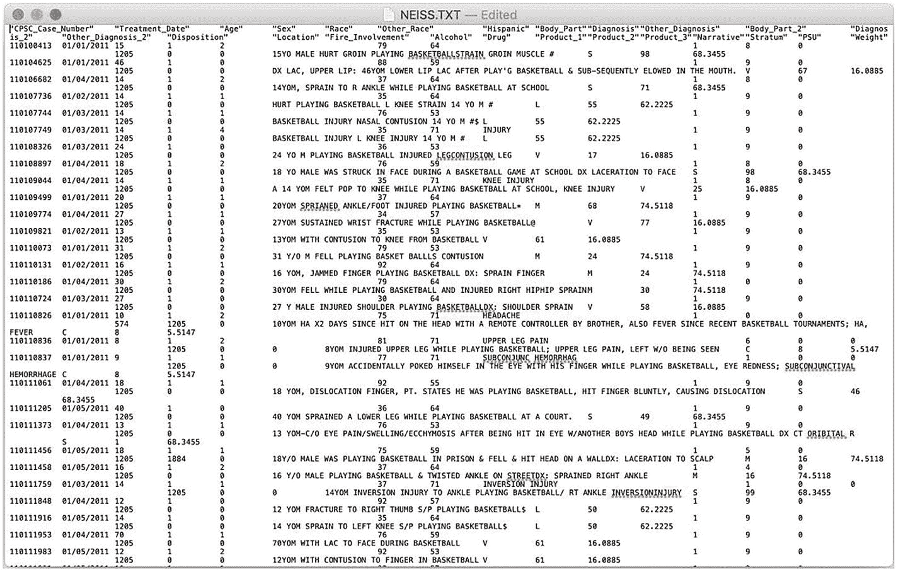
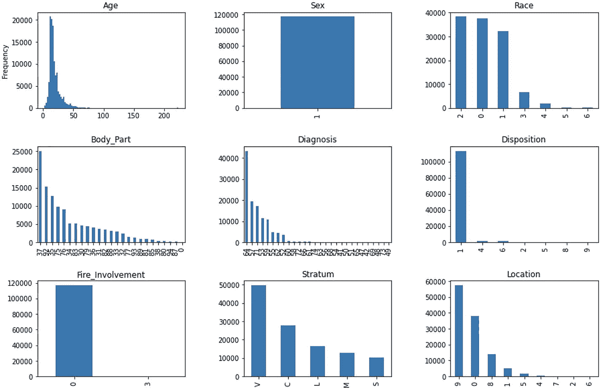
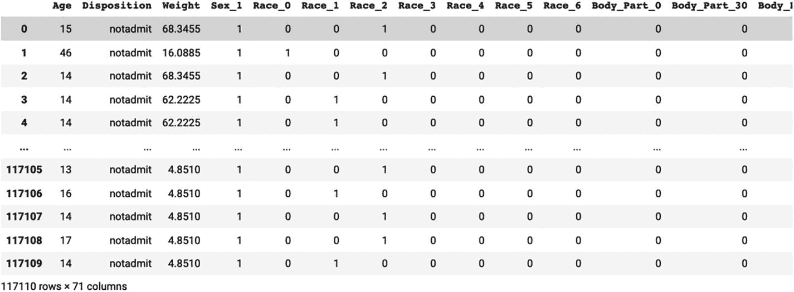
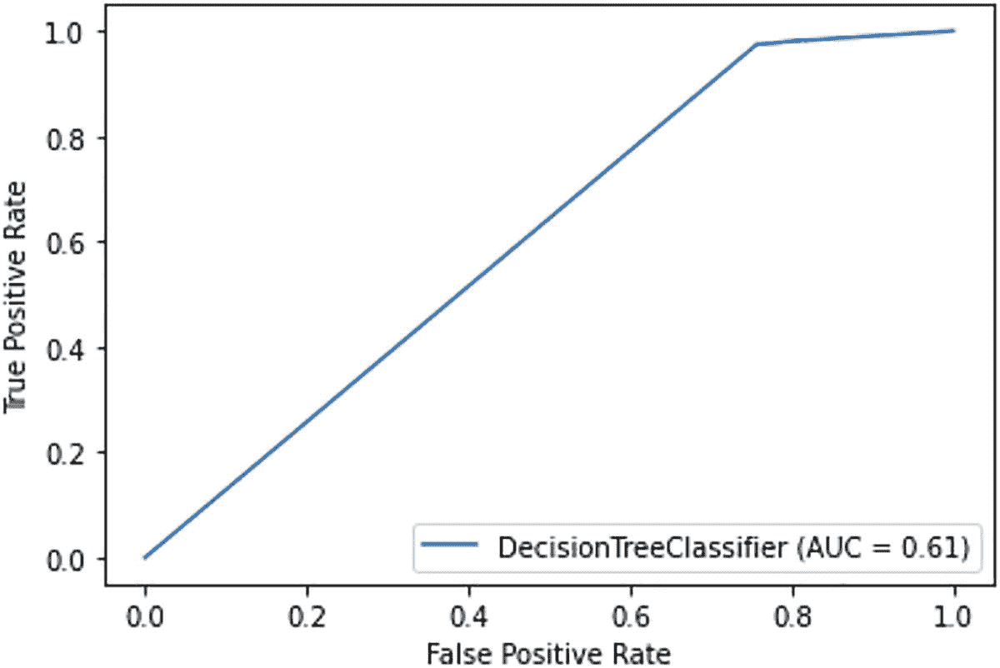
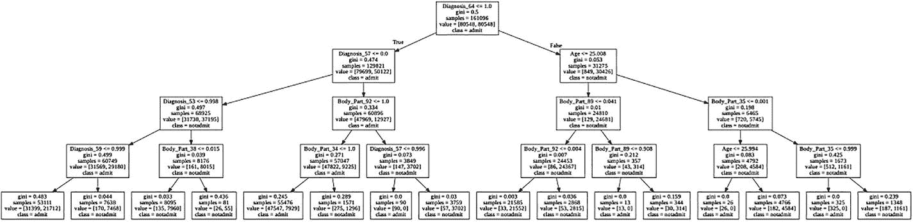
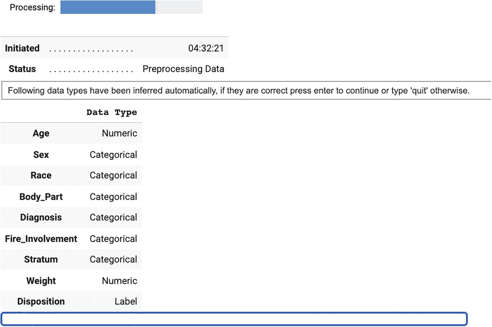
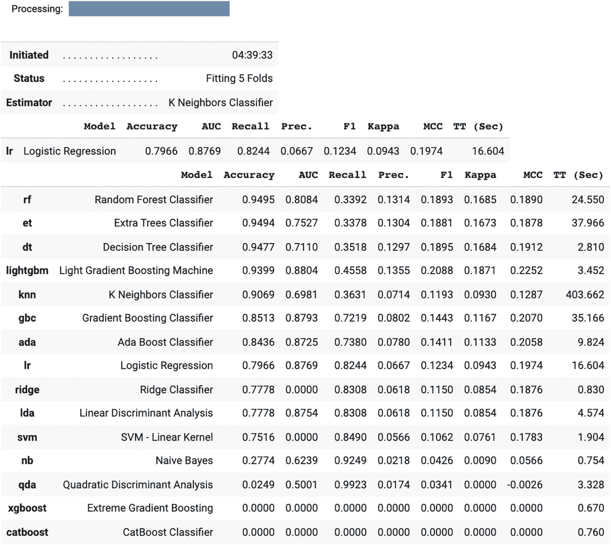
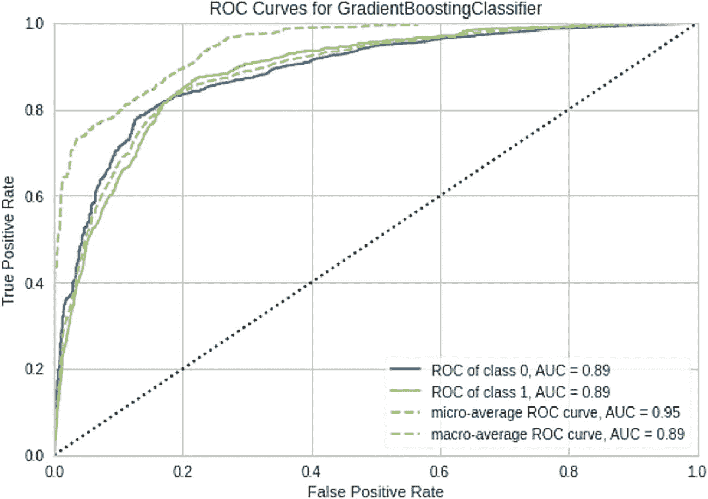
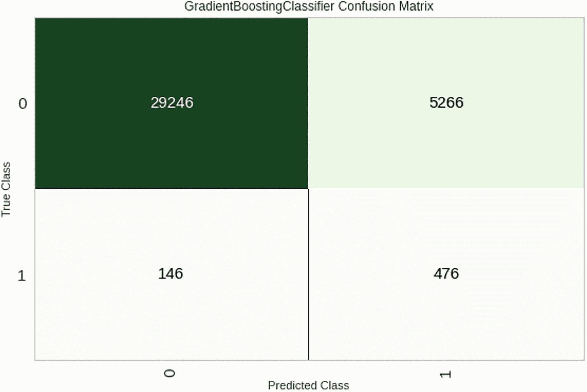

# 五、项目 1：预测入院的机器学习

欢迎首次深入了解机器学习及其背后的代码。在本章中，我们将使用来自国家电子伤害监测系统(NEISS)的数据集。该数据集包括 2011 年至 2019 年因篮球相关伤害而进行的急诊室访问，将用于预测一个人在给定其年龄、种族、性别、伤害发生地点、受影响的身体部位、初步诊断(来自分诊)和护理中心规模的情况下是否入院。在尝试预测录取状态的过程中，我们会遇到机器学习中的一些问题，包括如何处理不平衡数据，如何调整超参数，以及如何进行特征工程。

在本章的第一部分，我们将使用流行的机器学习库 scikit-learn 来创建一个决策树分类器。然后，为了让我们的生活变得简单一点，我们将切换到使用另一个名为 PyCaret 的库，它将帮助我们尝试一系列不同的算法，看看哪个效果最好。这两个库都可以在我们在第 3 章使用的 Google Colab 笔记本环境中使用。

记住这个路线图，让我们开始吧！

## 数据处理和清理

首先，从 [`https://github.com/Apress/Practical-AI-for-Healthcare-Professionals`](https://github.com/Apress/Practical-AI-for-Healthcare-Professionals) (NEISS.txt)下载 NEISS 数据集。如果你想看一眼，可以用 excel 打开这些数据。还有一个相关的代码本 [`https://github.com/Apress/Practical-AI-for-Healthcare-Professionals`](https://github.com/Apress/Practical-AI-for-Healthcare-Professionals) (NEISS_FMT.txt)，概述了特定变量类型的值的含义。

我们的总体任务是确定什么使某人有可能入院(这是文件中的“处置”栏)。考虑到我们可以使用的潜在预测因素，年龄、性别和种族可能会影响一个人的入学状况。也许受伤的身体部位、受伤发生的位置以及最初的诊断对结果的影响更大。此外，诸如是否涉及火灾以及医院的层级(小型、中型、大型、超大型)等因素可能会影响结果。

考虑到这些因素，让我们开始将我们的数据处理成可以在我们在第 [3](3.html) 章末尾使用的`pandas`库中使用的东西。

在一个新的 Colab 笔记本中，执行以下操作:(1)创建一个新的 Colab 笔记本。(2)在“运行时”菜单下，选择“更改运行时类型”，然后在弹出的“硬件加速器”选项下，选择 GPU 或 TPU(如果 TPU 选项可用)。在训练集上运行任务时，这两个处理器通常优于 CPU，从而更快地获得结果。(3)将之前链接的 NEISS.txt 文件上传到文件夹中(就像我们在第 [3](3.html) 章上传 input.csv 回来一样)。

### 安装+导入库

在 Colab 笔记本的第一个单元中，您需要安装以下内容:

**输入【单元格= 1】**

```py
!pip install --upgrade scikit-learn catboost xgboost pycaret

```

Note

对于本章的其余部分，任何实际进入代码库的内容都将被加上“INPUT[CELL = Numbered CELL]”；否则，它将被加上“输入”或者什么都不加。如果您看到输入符号，这也是实际运行单元的提示！

输出看起来像一串文本；然而，如果它在最后给你一个“重启运行时”的选项，那就去做。这一行基本安装了 scikit-learn 和 PyCaret 的升级版(都是免费提供的 Python 库)；然而，Colab 已经有了构建它的一些版本，这意味着它需要重新加载来注册它们的安装。(注意，在重新启动 Colab 笔记本的过程中，您将会丢失您所创建的任何变量。这类似于重新开始，只是有了一些新的依赖关系)。

接下来，我们需要导入一些库(就像我们在第 [3](3.html) 章中为熊猫做的那样)。Python 库通过以下粗略语法导入:

```py
import libraryX
import libraryX as foo
from libraryX import subFunctionY, Z
from libraryX import blah as bar
from libraryX import *

```

让我们来看一下这组 import 语句的例子。第一行将导入名为“libraryX”的库，并让您能够通过使用点运算符(例如，`libraryX.someFunction`)来访问任何子模块(将它视为库的一部分)。第二行只是让您能够将`libraryX`重命名为`foo`，以防键入库的全名变得令人厌烦。第三行让您能够只获得感兴趣的库的特定部分(在本例中是`subFunctionY`和`Z`)。第四行的作用与第二行和第三行的组合相同。它使您能够导入主库的一些子组件，并对其进行重命名。第四个函数使您能够将库的所有部分导入名称空间。在这种情况下，您将能够访问该库的所有功能，而不需要在它前面加上`libraryX.`(当您只使用一个库，但不太清楚您想要使用的特定部件/将使用库中的许多部件时，这很有用)。

首先，我们将导入 scikit-learn、pandas、numpy 和 matplotlib:

**输入【单元格= 2】**

```py
import sklearn
import pandas as pd
import numpy as np
import matplotlib.pyplot as plt

```

这些库处理以下内容。是 scikit-learn，它拥有许多与 Python 中的机器学习相关的函数。`pandas`(在我们的代码中我们称之为`pd`，因为我们在导入它时使用了`as`关键字)允许我们操作和导入数据。`numpy`允许我们处理基于列或基于数组的数据(并赋予我们做一些基本统计的能力)。`matplotlib`是 Python 中的一个绘图库。我们将导入名为`plt`的`pyplot`子模块来创建一些图形。

### 读入数据并隔离列

接下来，我们将实际读入我们的数据:

**输入【单元格= 3】**

```py
df = pd.read_csv('NEISS.TXT', delimiter='\t')

```

如果你要查看 NEISS.txt 文件(参见图 [5-1](#Fig1) ，你会看到它实际上有一堆列，都是由制表符分隔的。通常 pandas(这里是`pd` ) read_csv 函数假设列之间的默认分隔符(也称为分隔符)是一个`,`。然而，在这种情况下，我们需要指定它是制表符分隔的，这可以通过指定一个名为“delimiter”的命名参数来实现，该参数的值为`\t`(这是一个制表符)。



图 5-1

NEISS 数据截图。请注意数据列是如何被制表符分隔的

*   **附注**:命名参数(也称为“关键字参数”)允许你在调用一个方法时指定你想要给它赋值的参数的名称。当您调用一个包含许多参数的方法时，这尤其有用。例如，如果我们有一个如下定义的函数:

    ```py
    def calculate_bmi(height, weight):
    # insert logic for calculating bmi here

    ```

*   我们可以用`calculate_bmi(1.76,64)`来称呼它(代表得到一个身高 1.76 米，体重 64 公斤的人的身体质量指数)，或者我们可以说`calculate_bmi(height=1.76, weight=64)`或者`calculate_bmi(1.76, weight=64)`。注意，我们不能说`calculate_bmi(weight=64, 1.75)`，因为 Python 只允许命名关键字参数跟在非命名参数后面。在 pandas read_csv 方法中，有许多参数采用默认值(这些参数的值自动假定等于某个值，除非您另外指定)，因此使用命名参数可以节省时间，因为您不必手动指定调用该函数所需的所有参数，并且可以有选择地更改您为想要修改的参数传递的值。

接下来要担心的是如何实际隔离我们想要查看的列。我们可以使用下面的语句来实现:

**输入【单元格= 4】**

```py
df_smaller = df[['Age', 'Sex', 'Race',
'Body_Part', 'Diagnosis', 'Disposition',
'Fire_Involvement', 'Stratum', 'Location']]

# display the table so we can be sure it is what we want
print(df_smaller)

```

运行该单元格时，您应该会看到一个表，其中的列名与指定的列名相同。

这段代码的第一行涉及到我们希望在预测任务中使用的列的选择。假设我们已经将 NEISS 数据存储在一个名为`df`的变量中，我们可以通过执行`df[list of columns]`来选择我们想要的列。在这种情况下，列的列表是“年龄”、“性别”、“种族”等。然后，我们将这个结果存储到变量`df_smaller`中，并调用`display`(这是一个 Google Colab 特有的函数，帮助我们查看熊猫数据)。

### 数据可视化

接下来，我们应该尝试将一些数据可视化，以确定其中实际包含的内容。我们可以使用库`matplotlib`来帮助我们做到这一点。在我们的数据集中，年龄是一个连续变量。其余的数据是分类的(即使它们在这个数据集中使用的编码方案中可能被表示为数字)。

让我们为每个变量创建一个图表，以帮助直观显示数据的分布:

**输入【单元格= 5】**

```py
fig = plt.figure(figsize=(15,10))
fig.subplots_adjust(hspace=0.4, wspace=0.4)
for idx, d in enumerate(df_smaller.columns):
  fig.add_subplot(3,3,idx+1)
  if d  == 'Age':
    df[d].plot(kind='hist', bins=100, title=d)
  else:
    df[d].value_counts().plot(kind='bar', title=d)

```

**输出**

参见图 [5-2](#Fig2) 。



图 5-2

原始数据集中各种特征的数据可视化

我们可以看到我们的年龄分布主要偏向 20 多岁的年轻人。性别分布仅为男性(1 = NEISS 码本中的男性)。种族由类别 2(黑人/非裔美国人)领导。Body_Part(表示受伤的`Body_Part`)以“37”为首，即脚踝。诊断以“64”为首，这是一种劳损/扭伤(这是意料之中的)。处置(这是我们想要预测的变量)由类别“1”引导，该类别表示患者已接受治疗、检查和出院。我们试图预测患者是否入院/是否发生了代码为 4、5 和 8 的不良事件。fire _ incidence(编码是否有任何消防部门参与事故)对于大多数患者为 0(即没有消防部门参与)，但是对于极少数患者为 3(可能有消防部门参与)。病人就诊的医院阶层大多是非常大的医院(“V”)。年龄分布主要向较低端倾斜。

深入研究这里的代码，第一行告诉 matplotlib 开始创建一个图形(matplotlib 图形包含多个子图形)。注意，我们在导入代码块和解释中提到 matplotlib 的绘图部分，简称为`plt`。figsize 参数以英寸为单位指定宽度和高度(因为这些图形可以输出给出版物，所以 matplotlib 使用英寸而不是像素来表示图形的宽度和高度)。

在第二行，我们调整了支线剧情之间的间距。此方法更改沿图形宽度(wspace)和图形高度(hspace)的填充量。这基本上说明了子情节之间将有填充(值 0.4 意味着填充将相当于平均情节宽度或高度的 40%)。

接下来，我们进入一个 for 循环。我们正在遍历刚刚创建的包含年龄、性别等的数据框中的每一列。，列。回想一下，当我们在 for 循环语法中使用`enumerate`时，我们将获得存储在变量(这里，该变量是`d`)中的循环当前所在的值(在本例中是列名)，我们还将获得 for 循环在循环过程中的位置(存储在索引变量`idx`中，记住这只是一个数字)。

对于循环的每次迭代，我们将使用`fig.add_subplot`方法添加一个子情节。这将接受我们想要创建的子情节网格的大小(在本例中是一个 3×3 的网格，因为我们有 9 列)和我们想要放置一个情节的编号位置(它将是`idx`变量加 1，因为 matplotlib 从 1 而不是 0 开始编号子情节)。现在创建了一个支线剧情，并将由下一个剧情填充。

在`if else`语句中，我们希望处理不同的绘图，因为我们的数据对于所有列都不相同。年龄是一个连续的变量，最好用柱状图来表示。分类数据(我们所有的其他列)最好用条形图表示。在`if`语句中，我们检查列名(存储在`d`中)是否等于“年龄”。如果是，那么我们将使用数据框附带的绘图方法绘制直方图。我们首先将使用`df[d]`获取当前列(获取名为`d`的列)，然后调用`df[d].plot`并传入我们想要的绘图类型(`'hist'`因为它是一个直方图)，一个`bins`参数(指定我们希望直方图有多细粒度；在这里，我们将它设置为 100)和一个绘图标题(这只是我们可以分配给标题命名参数的列名`d`)。

当我们使`if`语句失败并进入`else`分支时，我们做同样的事情。这里，我们需要调用`df[d].value_counts()`来获取每个类别在数据集中出现的次数。然后，我们可以对结果调用`.plot`，并将种类指定为条形图(使用`kind='bar'`)，还可以显示图形的标题(与前面类似)。

最后，我们应该得到九个好看的图形。回过头来看，我们完全有可能消除“性别”类别，因为在我们的数据集中每个人都有相同的性别，它不可能为我们提供任何方式来区分该类别中的人。

### 清理数据

接下来，我们需要做一些数据清理，将我们的 Disposition 列更改为一个二元变量(即，允许与不允许)。首先，我们需要删除所有分配了数字 9 作为处置的条目，因为这些条目是未知的/没有数据值。接下来，我们必须将所有处置值 4、5 或 8 设置为“允许”,将其他任何值设置为“不允许”。让我们看看如何在这段代码中做到这一点:

**输入【单元格= 6】**

```py
df_smaller.loc[df_smaller.Disposition == 9, 'Disposition'] = np.nan
df_smaller['Disposition'] = df_smaller['Disposition'].dropna()

# recode individuals admitted as "admit" and those not admitted as "notadmit"
df_smaller.loc[~df_smaller.Disposition.isin([4,5,8]), 'Disposition'] = 'notadmit'
df_smaller.loc[df_smaller.Disposition.isin([4,5,8]), 'Disposition'] = 'admit'
df_smaller['Disposition'].value_counts()

```

**输出**

将会出现一串消息，说明“正在试图在数据帧的一个片的副本上设置一个值”，但是最后，您应该会看到以下内容:

```py
notadmit    115065
admit         2045
Name: Disposition, dtype: int64

```

看起来我们有了一堆新语法。让我们一行一行地深入研究代码。

我们的第一个任务是删除任何包含处置值 9(未知数据)的行。我们可以这样做，首先定位该列中任何具有 9 的行，将这些值设置为等于`NaN`(不是一个数字)，然后删除(即删除)任何具有`NaN`值的行。让我们看看这是如何通过代码实现的:

```py
df_smaller.loc[df_smaller.Disposition == 9, 'Disposition'] = np.nan
df_smaller['Disposition'] = df_smaller['Disposition'].dropna()

```

在第一行中，我们在数据框上调用`.loc`方法来“定位”符合我们指定的标准的任何行。`df_smaller.loc`方法接受由逗号分隔的两个输入:第一个输入是查找行时必须满足的条件，第二个值是满足条件时要编辑的列名。在等号的另一边，我们指定我们想要的行(满足`loc`条件)。这里，我们将我们的条件设置为`df_smaller.Disposition == 9`，这意味着我们想要数据帧的 Disposition 列中的值为 9 的任何行。我们还将把 Disposition 列(第二个参数)编辑成等号右边的值(`np.nan`，它不是一个数字，可以很容易地用来删除任何行)。

在第二行中，我们所做的就是在删除任何非数字值(即`np.nan`)后，将 Disposition 列设置为 Disposition 列。我们通过在列上调用`.dropna()`来实现。

接下来，如果处置值为 4、5 或 8，我们需要将处置值设置为‘admit ’,否则设置为‘not admint’。我们将首先处理“notadmit”的情况(考虑一下为什么必须先处理这个问题)。

```py
df_smaller.loc[~df_smaller.Disposition.isin([4,5,8]), 'Disposition'] = 'notadmit'

```

这个对`loc`的调用看起来与前面的代码片段相对相似，除了我们的条件中有一个`~`字符和新增的`isin`语句。`~`表示一个逻辑“非”(这意味着我们想要的是后面任何事情的反面)。`isin`函数测试指定列中的值是否在作为参数传递给`isin`的数组中(在本例中，我们寻找 4，5，8)。如果某行满足此条件，我们将在“Disposition”列中为该行设置值，使其等于“notadmit”。在下面的代码行中，我们做了完全相反的事情(只是省略了`~`)，并将其值设置为‘admit’。

代码块的最后一行只给出 Disposition 中每个值的计数。最后，你应该有 2045 个承认和 115065 个不承认。

### 处理分类数据/一次性编码

在我们的数据集中需要注意的一个问题是，有些数据看起来是数字，但实际上不是(因为列中的所有编码值都表示为数字)。相应地，我们的一些机器学习算法会“认为”数据是数值型的，除非我们另外指定。由于这些编码值之间没有数字关系，因此这一规定非常重要(如果我们知道编码值越高，表示成绩越高，即数据是有序的，那么将这些编码值保持为数字可能更合适)。

为了确保我们使用的机器学习库理解我们的列的分类性质，我们需要为我们的数据生成一个“一次性编码”。为了说明这个过程，考虑我们的“种族”专栏。该列的值为 0，1，2，3，4，5，6，每个值代表一个不同的种族。为了生成数据的一次性编码，我们将创建 7 个新列(标题为“Race_0、Race_1、Race_2、Race_3、…、Race_6”)，并在对应于原始数据的列中将每一行的值设置为 1，否则为 0。例如，如果我们有一个 Race 为“2”的行，我们会将该行中的 Race_0、Race_1、Race_3、Race_4、Race_5 和 Race_6 都设置为 0。我们将只设置 Race_2 等于 1。

为了使这个过程更容易，我们可以调用一个名为`get_dummies`的 pandas 方法来为我们生成所有分类列，如下所示:

**输入【单元格= 7】**

```py
categorical_cols = [
 'Sex', 'Race',
 'Body_Part', 'Diagnosis',
 'Fire_Involvement', 'Stratum']
# make dummy variables for them
df_dummy = pd.get_dummies(df_smaller, columns = categorical_cols)

# and display at the end. Should have 117110 rows and 71 columns
display(df_dummy)

```

**输出**

应该是类似图 [5-3](#Fig3) 的东西。



图 5-3

这是我们数据集的虚拟变量版本。请注意我们现在有了多少列

在这种情况下，我们需要做的就是调用`pd.get_dummies`并传入我们想要为其生成虚拟变量的数据帧(这里是`df_smaller`)和我们想要为其生成虚拟变量的列(这些列是存储在变量`categorical_cols`下的列表中的所有分类列)。然后，我们将 df_dummy 的值重新分配给这个新的数据帧，并在最后显示它。正如您在屏幕截图中看到的，我们从 9 列增加到 71 列，因为我们有许多列包含大量不同的分类值。

现在，我们准备开始对这个数据框架进行一些机器学习。

### 启动 ML 管道

首先，我们需要指定哪些列和值是我们的“X”(即预测变量)，哪些是我们的“Y”(即结果)变量。我们可以通过这两行代码做到这一点:

**输入【单元格= 8】**

```py
X = df_dummy.loc[:, df_dummy.columns != 'Disposition']
Y = df_dummy['Disposition']

```

第一行代码选择除 Disposition 列之外的所有列，并将其赋给变量`X`；第二行只是将 Disposition 列中的值分配给变量`Y`。很简单。

接下来，我们需要安装并导入一些特定于 ML 的库。我们需要安装的一个库是不平衡学习包，它可以帮助我们使用算法来增加训练过程中代表性不足的结果。我们可以用下面一行代码来实现:

**输入【单元格= 9】**

```py
!pip install imblearn

```

接下来，我们导入一些特定于 ML 的库和函数:

**输入【单元格= 10】**

```py
from sklearn.model_selection import train_test_split, GridSearchCV, cross_validate
from sklearn.utils import resample
from imblearn.over_sampling import SMOTE
from collections import Counter

```

从 sklearn.model_selection 模块中的`train_test_split`、`GridSearchCV`和`cross_validate`逐行开始，负责(1)将我们的数据集分成训练集和测试集，(2)进行带交叉验证的网格搜索，以及(3)进行不带网格搜索的交叉验证(分别)。`sklearn.utils`中的重采样功能有助于我们对数据进行重采样(当我们试图过多地代表我们未被充分代表的阶层时，这将派上用场)。接下来，我们将从`imblearn.over_sampling`库中导入`SMOTE`。SMOTE 是一种有选择地对数据集中的少数类进行过采样的算法。SMOTE 代表“合成少数民族过采样技术”，它基本上会在数据集中的少数民族类中选择两个数据点，在它们之间以更高维度绘制一条“线”，并沿着这条线选取一个随机点来创建一个属于少数民族类的新数据点。这导致在少数类中生成新数据，从而产生更平衡的数据集。“计数器”功能允许我们快速计算列中唯一数据点的频率。

*   **旁注**:为什么要在我们的训练集中进行过采样？在我们的数据集中，我们只有< 2%的病例构成入院。我们完全有可能最终得到一个只学会猜测每个人都不应该被接纳的分类器。这将导致高准确度(98%)但非常低的灵敏度(即，高#假阴性)。如果我们在训练集中进行过采样，我们可以在某种程度上保证 ML 算法必须处理过采样数量的训练数据点，而不是完全忽略它们。

现在，让我们拆分我们的训练和测试数据，并对我们的训练数据的少数类进行过采样:

**输入【单元格= 11】**

```py
X_train_imbalanced, X_test, y_train_imbalanced, y_test = train_test_split(X, Y, test_size=0.30, random_state=42)

oversample = SMOTE()
X_train, y_train = oversample.fit_resample(X_train_imbalanced, y_train_imbalanced)

print(Counter(y_train))
print(Counter(y_test))

```

**输出**

```py
Counter({'notadmit': 80548, 'admit': 80548})
Counter({'notadmit': 34517, 'admit': 616})

```

该函数的第一行调用了`train_test_split`方法，该方法接收我们之前创建的 X 和 Y 变量，并允许您使用`test_size`(一个比例)和`random_state`指定测试集的大小，这允许任何人重现您得到的相同结果(无论您将其设置为什么值都没有关系)。

这个方法调用产生了四个值，依次是训练和测试 X 数据以及训练和测试 Y 数据(我将其存储在变量`X_train_imbalanced`、`X_test`、`y_train_imbalanced`、`y_test`中)。

接下来，我们需要使用 SMOTE 过采样方法将我们的训练不平衡数据集转换为实际平衡的数据集。

在这段代码的第二行，我们使用`SMOTE()`创建了 SMOTE 采样器的一个新实例，并将其赋给变量`oversample`。然后我们调用`oversample`变量上的`fit_resample`方法(传入不平衡的 X 和 y 训练数据)来生成平衡的 X 和 y 训练数据(存储在`X_train`和`y_train`)。

最后，我们在训练 y 和测试 y 数据上打印出对`Counter`的调用，这给出了训练数据(第一行)和测试数据(第二行)中 notadmit 和 admit 值的数量。在我们的第一行中，我们看到 notadmit 和 admit 类具有相同数量的数据点，这正是我们想要的(即类平衡)。在测试集中，我们保留数据的原始分布(因为我们希望在评估它时保留真实世界的条件)。

### 训练决策树分类器

现在我们有了平衡的数据，我们终于可以训练一个分类器了。让我们使用决策树分类器(这是 scikit-learn 版本的分类和回归树):

**输入【单元格= 12】**

```py
from sklearn import tree

scoring = ['accuracy', 'balanced_accuracy', 'precision_macro', 'recall_macro', 'roc_auc']
clf = tree.DecisionTreeClassifier(random_state=42)
scores = cross_validate(clf, X_train, y_train, scoring=scoring, return_estimator=True)
clf = scores['estimator'][np.argmax(scores['test_recall_macro'])]

```

在第一行中，我们从 scikit-learn 导入树模块，它包含创建决策树的逻辑。在第二行中，我们将变量`scoring`设置为我们希望在交叉验证结果中看到的指标名称的列表(这里，我们获得了准确性、平衡准确性、精确度、召回和 AUC)。在第三行中，我们实例化了一个决策树分类器(用`tree.DecisionTreeClassifier`)并传入一个等于数字的`random_state`命名的参数以确保可再现性。我们将这个未经训练的决策树分类器分配给变量`clf`。

接下来，我们用以下参数调用`cross_validate`函数:

*   本例中的分类器将是`clf`

*   训练数据集预测值:`X_train`

*   训练数据集标签:`y_train`

*   我们想要得到的每个交叉验证的分数:我们的评分列表

*   我们是否想要为每个交叉验证折叠获得训练好的决策树(我们确实想要，所以我们将`return_estimator`设置为`True`)

调用这条线需要一两分钟的时间，因为它将根据我们的数据训练一个决策树。交叉验证的结果(和训练模型)将作为字典存储在变量`scores`中。

这个代码块的最后一行将把性能最好的分类器(定义为具有最高召回率的分类器)保存在一个变量`clf`中，以便我们稍后使用。为了访问性能最好的分类器，我们将从存储在`scores`变量(这是一个字典)的“estimator”键下的列表中选择一个元素。所选择的元素将取决于对应于最高召回分数的索引号(注意召回分数存储在`scores`变量的`'test_recall_macro'`键下的列表中)。我们使用 numpy(通过关键字`np`访问)argmax 方法获得最大元素的索引。例如，如果我们发现在召回分数列表的索引 3 处最大召回分数是 0.97，`np.argmax`将返回 3，这将设置`clf`等于`scores['estimator']`数组的第四个元素(召回我们从 0 开始计数)。

接下来，查看准确性等的平均分数。，从交叉验证中，我们可以打印出培训统计数据:

**输入【单元格= 13】**

```py
for k in scores.keys():
  if k != 'estimator':
    print(f"Train {k}: {np.mean(scores[k])}")

```

**输出**

```py
Train fit_time: 2.1358460426330566
Train score_time: 0.9156385898590088
Train test_accuracy: 0.9815949541399911
Train test_balanced_accuracy: 0.9815949560564651
Train test_precision_macro: 0.9821185121689133
Train test_recall_macro: 0.9815949560564651
Train test_roc_auc: 0.9838134464904644

```

前面的代码所做的就是遍历`scores`字典中的所有键，如果键不等于`estimator`(包含一个训练好的决策树分类器的列表)，就打印出“Train ”,后面是我们报告的统计数据，后面是我们在 for 循环迭代中当前使用的键下的`scores`数组中的值的平均值。

总的来说，我们可以看到该算法在训练数据集上做得相当好，但有一个主要的警告，我们将在稍后看到。

### 网格搜索

我们还可以尝试不同超参数的多个值，并进行交叉验证，以确定使用函数`GridSearchCV`的最佳值，如下所示:

**输入【单元格= 14】**

```py
tree_para = {'criterion':['gini','entropy'],
             'max_depth': [1,2,4]}

clf = GridSearchCV(tree.DecisionTreeClassifier(), tree_para, cv=5, verbose=1, n_jobs=-1)
clf.fit(X_train, y_train)
clf = clf.best_estimator_

```

我们只是创建了一个字典，它的列表键等于一个值列表，用于测试各种超参数。在这里，我们尝试使用基尼纯度函数或熵纯度函数，还尝试了“最大深度”的多个值，这些值告诉我们在沿着树向下时可以遇到的最大节点数。

然后我们创建一个`GridSearchCV`实例，它将接受以下参数:

*   要匹配的分类器(在这种情况下是决策树分类器)

*   要试验的参数(将试验在`tree_para`中指定的参数的所有组合)

*   `cv=`:要使用的交叉验证表单的数量

*   `verbose=`:是否输出正在发生的培训状态

*   `n_jobs=`:要运行的处理任务的数量(-1 表示我们应该使用所有可用的处理能力)

运行 clf.fit 将实际训练分类器，我们可以通过将`clf`设置为等于`clf.best_estimator`在最后存储性能最好的分类器，因为性能最好的分类器存储在那里。

注意，运行前一个块需要一段时间(当然你可以跳过这一步)。

接下来，让我们看看我们的决策树分类器实际表现如何。

### 估价

首先，让我们看看是否可以看一看一个基本的混淆矩阵。一个混淆矩阵描绘出由它们的真实标签组织的预测，这有助于我们计算灵敏度和特异性。

**输入【单元格= 15】**

```py
from sklearn.metrics import plot_confusion_matrix

plot_confusion_matrix(clf, X_test, y_test, values_format = '')

```

**输出**

参见图 [5-4](#Fig4) 。


图 5-4

这显示了决策树分类器的混淆矩阵

代码本身非常简单。我们首先从 scikit-learn 矩阵模块导入`plot_confusion_matrix`函数。然后我们调用这个函数，传入经过训练的分类器(存储在 clf 中)、测试预测器(`X_test`)、测试标签(`y_test`)和一个命名参数，该参数指示我们应该打印出完整的数字，而不是默认的科学记数法(只是使用空字符串`''`指定)。

我们可以在这里看到，我们的分类器没有我们想象的那么好。灵敏度为 133/(133+483) = 0.215。特异性是 33753/(33753 + 764) = 0.977(回头看看灵敏度和特异性公式，看看我们是如何从混淆矩阵中得到这些数字的)。由于灵敏度如此之低，我们不能相信这个分类器能够捕捉到我们数据集中发生的所有“阳性”事件(其中“阳性”表示入院状态)，因为如果患者确实需要入院，它只能获得大约 1/5 的入院决策正确。

但是，这里的问题是什么？我们之前不是看到，我们的训练交叉验证分数对于回忆来说非常接近 1(这与敏感度相同)吗？嗯，看起来我们的评分函数可能认为“notadmit”类是“阳性”类(如果我们使用该标准重新计算，我们会得到接近 0.98 的敏感度)。

让我们更深入地了解这些评估指标:

**输入【单元格= 16】**

```py
from sklearn.metrics import classification_report, plot_roc_curve

y_pred = clf.predict(X_test)

print(classification_report(y_test, y_pred))

plot_roc_curve(clf, X_test, y_test)

```

**输出**

```py
              precision    recall  f1-score   support

       admit       0.15      0.22      0.18       616
    notadmit       0.99      0.98      0.98     34517

    accuracy                           0.96     35133
   macro avg       0.57      0.60      0.58     35133
weighted avg       0.97      0.96      0.97     35133

```

ROC 曲线见图 [5-5](#Fig5) 。



图 5-5

决策树算法输出的 ROC 曲线

在第一行代码中，我们导入了一些方法，这些方法将帮助我们评估这个决策树分类器的分类准确性:`classification_report`将为我们的分类器提供一个重要度量的摘要。`roc_curve`将使我们能够对我们的预测进行 ROC 分析。`auc`将根据 ROC 结果计算 AUC。`plot_roc_curve`将绘制 ROC 曲线。

为了调用`classification_report`函数，我们需要传入真实分类和预测分类。我们通过对训练好的分类器调用`.predict`方法来获得预测的分类。在这种情况下，我们已经将最终训练好的分类器存储在`clf`中，所以我们可以调用`clf.predict`并传入我们的测试预测器(存储在`X_test`)。

接下来，我们打印出分类报告。生成该报告的方法(`classification_report`)采用真实分类和预测分类。从打印出来的结果可以看出，如果我们选择‘admit’作为正类，召回率是 0.22(我们之前计算过)。但是，如果真实的类是‘not admint’，那么召回率是 0.98(也和我们之前计算的一样)。

最后，我们可以通过调用`plot_roc_curve`来绘制 ROC 曲线。该方法接受训练好的分类器(`clf`)、`X_test`和`y_test`变量。在生成的图的右下角，我们得到 AUC 为 0.61。

### 可视化树

如果您运行了带有交叉验证的网格搜索，您还可以可视化该树(如果您没有，由于该树非常复杂，您不太可能可行地运行以下内容):

**输入【单元格= 17】**

```py
import graphviz
if (clf.tree_.node_count < 100):
  dot_data = tree.export_graphviz(clf, out_file=None,
                                  feature_names=X.columns,
                                  class_names=['admit','notadmit'])
  graph = graphviz.Source(dot_data)
  graph.render("neiss")

```

**输出**

最终采油树的输出如图 [5-6](#Fig6) 所示。



图 5-6

我们训练的决策树模型的最终树结构输出

我们导入了 graphviz 库，它允许我们可视化树。然后，我们检查树中是否有< 100 个节点(这在您运行网格搜索的情况下是正确的，因为我们将树的深度限制为最多 4)。下面几行代码是特定于 graphviz 的代码，除了为导出准备树之外，它们没有什么特别的意义。运行该块后，您将在 Colab 的文件夹菜单中看到一个名为“neiss.pdf”的文件(如果没有看到，请单击左侧的文件夹图标，然后单击带有刷新符号的文件夹图标)。

注意，在采油树底部，我们看到有几个接线盒(称为树叶)。每一片叶子都有一个值，叫做基尼系数。这个值越高，叶子的纯度越低(意味着决策树的这个分支不能对数据的类别做出好的决定)。

### 这似乎有很多事情要做

在整个过程中，我们已经编写了几十行代码，这还只是一个分类器的代码。如果我们想尝试一堆不同的分类器呢？我们必须重写这些行并自己处理调优/网格搜索吗？嗯，也许吧。然而，有几个库可以帮助这个过程。我们将探索 py Caret(R 的 Caret 机器学习包的 Python 端口)的用法。

## 移动到 PyCaret

PyCaret 通过自动尝试一系列不同的模型来处理模型选择过程，并使我们能够根据我们想要优化的任何统计数据(例如，准确性、AUC、精度、召回)轻松选择我们想要进一步优化的模型。

首先，让我们将 PyCaret 中的所有分类方法导入到`*`下，这样我们就可以调用它们，而无需在每个方法调用前添加 PyCaret 分类子模块名称。

我们还需要更改列的类型，并调整输出标签以使用 PyCaret:

**输入【单元格= 18】**

```py
from pycaret.classification import *

df_smaller['Body_Part'] = df_smaller['Body_Part'].astype('category')
df_smaller['Diagnosis'] = df_smaller['Diagnosis'].astype('category')
df_smaller['Sex'] = df_smaller['Sex'].astype('category')
df_smaller['Race'] = df_smaller['Race'].astype('category')
df_smaller['Fire_Involvement'] = df_smaller['Fire_Involvement'].astype('category')
df_smaller['Stratum'] = df_smaller['Stratum'].astype('category')

df_smaller.loc[df_smaller.Disposition == 'admit', 'Disposition'] = 1
df_smaller.loc[df_smaller.Disposition == 'notadmit', 'Disposition'] = 0

print(Counter(df_smaller['Disposition']))

```

**输出**

```py
Counter({'1': 2045, '0': 115065})

```

第一行将 PyCaret 中所有与分类相关的方法导入到主名称空间中(允许我们直接访问它们)。下面两行设置分类列的类型(`Body_Part`、`Diagnosis`等)。)对数据帧使用`.astype`修改器进行“分类”。我们将得到的转换赋回原始的列类型。

我们还需要将‘Disposition’列中的‘admit’和‘not admint’变量改为 1 或 0(其中 1 是正类)。我们以前使用过这种语法，但是如果不熟悉，就回到我们最初处理数据集的时候。

接下来，我们需要建立一个 PyCaret 实验:

**输入【单元格= 19】**

```py
grid=setup(data=df_smaller, target='Disposition', verbose=True, fix_imbalance=True,
           bin_numeric_features=['Age'], log_experiment=True,
           experiment_name='adv1', fold=5)

```

**输出**

将会有一个交互式组件要求您验证变量的类型。它应该如图 [5-7](#Fig7) 所示。



图 5-7

这是 PyCaret 在设置培训流程时的屏幕截图

按回车键，然后看看输出。将会有一个包含“描述”和“值”两列的表格确保以下情况属实:

*   目标=倾向

*   目标类型=二进制

*   标签编码= 0: 0，1: 1

*   转换后的训练集= (81976，101)

*   转换后的测试集= (35134，101)

*   折叠数= 5

*   修复不平衡方法= SMOTE

浏览代码，我们调用 PyCaret 的设置函数。我们传入数据`df_smaller`并指定目标变量来预测`Disposition`。我们还说，我们希望看到所有输出(使用`verbose=True`)，我们希望修复任何类别不平衡(`fix_imbalance=True`)，我们还希望“存储”数字特征年龄(即，将数据分配到单独的编号存储箱中，并在编号中的 b 上学习原始数字，这对于一些算法来说更好)。我们还想记录(即记录训练过程)我们命名为“adv 1”(`experiment_name='adv1'`)的实验。最后，我们指定我们只想做五次交叉验证(默认为 10)以节省一些时间(`fold=5`)。

现在我们已经完成了 PyCaret 实验的设置，让我们实际运行一些模型:

**输入【单元格= 20】**

```py
topmodels = compare_models(n_select = len(models()))

```

**输出**

参见图 [5-8](#Fig8) 。



图 5-8

PyCaret 培训流程的输出模型

许多最大似然算法的训练统计。**注意:**这一步需要很长时间(大概 30 分钟)。在你等待的时候，喝杯茶/咖啡。

`compare_models`方法将实际运行 PyCaret 库中所有可用的模型进行分类。所有可用的模型都可以通过调用`models()`方法来访问(总共有 18 个)。我们还传递一个`n_select`参数来选择前“N”个模型，其中“N”是我们指定的数字。因为最好保留所有训练过的模型，我们指定“N”为模型的数量(可以通过`len(models())`调用来访问)。我们把这个赋值给`topmodels`变量。

在完成运行之后，我们将得到一个所有已经被训练的模型的列表。请注意，这个列表会很长，但是由您来决定哪一个最适合这个任务。您应该尝试找到一个平衡准确性、AUC 和召回率的模型(召回率是最重要的评估项目)。

对我来说，最好的模型是梯度提升器(gbm)、AdaBoost (ada)和逻辑回归(lr)。它们被列为第六、第七和第八高精度模型。我可以通过索引 top models 变量来访问它们(这只是一个在每个索引处存储一个训练模型的列表)。

*   **边注**:我们之前已经介绍过其中一些算法，但不包括梯度提升机器和 AdaBoost。

    AdaBoost 是一种算法，它创建许多具有单个分裂的决策树，也就是说，它们只有两个叶节点和一个决策节点。这些被称为“决策难题”在确定预测的过程中，这些决策树桩中的每一个都会获得一次投票。这些树投票接收与其准确性成比例的投票。随着算法看到更多的训练样本，它将在算法遇到困难的训练数据点(即，不会导致强多数的数据)时添加新的决策树桩。AdaBoost 不断添加决策树桩，直到它能够处理这些困难的训练数据点，这些数据点在训练过程中获得更高的权重(即，正确学习的“更高优先级”)。梯度提升的操作类似于 AdaBoost 但是，它不会给难以学习的数据点分配较高的权重。相反，它将尝试并优化一些损失函数，并基于个体树投票是否最小化任何损失(通过梯度下降过程)来迭代地添加/加权个体树投票。

**输入【单元格= 21】**

```py
gbm = topmodels[5]
ada = topmodels[6]
lr = topmodels[7]

```

我们还可以使用`plot_model`函数从每个模型中绘制出不同的结果(它将训练好的模型作为第一个参数，将绘图类型作为第二个参数)。这是梯度提升器器的两个图表:

**输入【单元格= 22】**

```py
plot_model(gbm, 'auc')

```

**输出**

参见图 [5-9](#Fig9) 。



图 5-9

从 PyCaret 的定型 GBM 模型输出 AUC

我们可以看到 AUC 接近 0.89，这很好。让我们来看看混淆矩阵:

**输入【单元格= 23】**

```py
plot_model(gbm, 'confusion_matrix')

```

**输出**

参见图 [5-10](#Fig10) 。



图 5-10

从 PyCaret 训练的 GBM 模型输出混淆矩阵

这些结果似乎相当不错。敏感度(也称为召回率)是(476/(476+146) = 0.765)，这是对我们的决策树分类器产生的结果的巨大改进。

我们甚至可以将多种模型结合在一起。这种方法(称为混合)允许我们训练另一个模型，该模型从组件子模型获取输出并生成输出。这有效地将混合模型必须学习的总特征空间从九列减少到您正在混合的模型的数量，使得学习更有效。这也有助于将此形象化为允许每个模型对结果进行“投票”,并训练另一个模型来了解哪些投票更重要/更不重要。让我们来看看如何制作一个混合模型:

**输入【单元格= 24】**

```py
blender = blend_models(estimator_list=[gbm, lr, ada], method='auto')

```

这里，我们将梯度提升机器、逻辑回归和 AdaBoost 模型混合在一起，以制作一个混合模型，并将其存储在`blender`变量中。

然后，我们可以使用`predict_model`函数评估预测:

**输入【单元格= 25】**

```py
predict_model(blender, probability_threshold=0.43)

```

**输出**

```py
Model           Accuracy   AUC Recall  Prec.    F1 Kappa   MCC
Voting Classifier 0.8333 0.8916 0.8135 0.081 0.1474 0.119 0.2232

```

注意，我们可以改变概率阈值，在这个阈值上，我们将某个事物定义为一个案例。在这种情况下，将概率阈值从默认值(0.5)降低到 0.43 会导致更高的召回率(0.765 对 0.81)，但会稍微牺牲准确性(83.3%而不是 85%)。

### 额外:导出/加载模型

如果您想要保存最终模型，只需执行以下操作即可:

```py
save_model(insert_model_variable_here, 'modelfilename')

```

然后，您可以在 Colab 文件菜单中找到该模型(如果没有看到，请刷新它)。

此外，您可以通过调用以下命令将模型从文件加载回内存:

```py
model_variable = load_model('modelfilename')

```

(注意:如果您在单独的会话中运行此行，您必须将模型文件重新上传到 Colab 环境，因为 Colab 文件不会持久化)。

## 总结和下一步

在上一章中，我们已经介绍了如何在 scikit-learn 中从头开始训练一个模型。我们专门探讨了如何配置决策树分类器。在这个过程中，我们还做了一些初步的数据探索，清理了我们的数据并将其格式化以用于机器学习应用程序，并经历了为我们的最终树调整超参数并评估其功效的过程(并找出我们应该比其他人更重视哪些指标)。

然后，我们继续使用 PyCaret 来帮助自动化模型选择过程，并了解如何将多个模型组合在一起以创建混合模型。对于绝大多数表格数据(即通常只是电子表格的数据)，从探索机器学习算法开始要比试图从头开始编写这些算法容易得多。这一事实使得开始探索这些 ML 算法在医学研究甚至临床结果预测中的用途变得相当简单(就像我们对这个数据集所做的那样)。

然而，机器学习算法通常不适用于基于图像的数据，这主要是因为很难在图像本身中捕捉基于位置的信息。为了完成这项任务，我们需要研究一下卷积神经网络，我们将在下一章探讨它。

本章的所有支持代码可在 [`https://github.com/Apress/Practical-AI-for-Healthcare-Professionals/tree/main/ch5`](https://github.com/Apress/Practical-AI-for-Healthcare-Professionals/tree/main/ch5) 找到