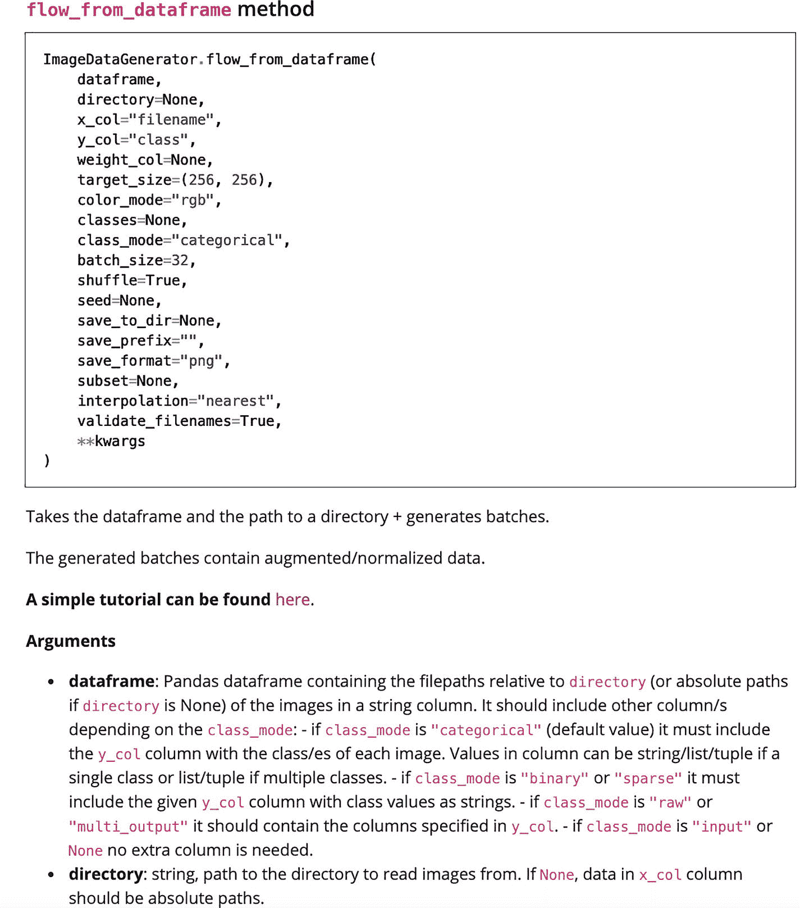
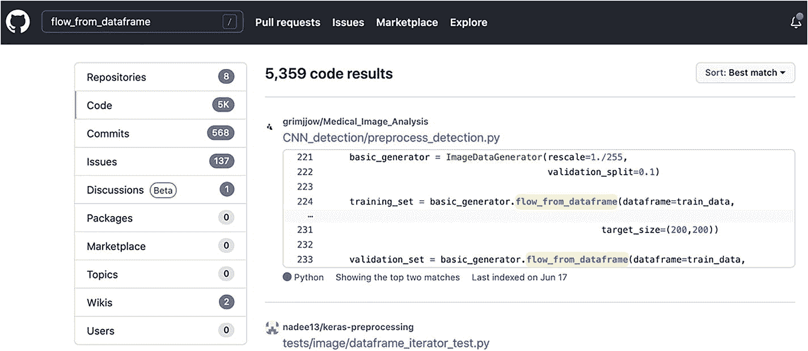

# 七、医疗保健和人工智能的未来

在过去的几个章节中，我们已经浏览了构成“人工智能”的代码，但是所有这些内容只是 ML/AI 世界的一个小样本。尽管您用来实现这些算法的许多工具是相同的(比如 scikit-learn、Keras 和 TensorFlow)，但是根据任务的不同，实现会有很大的不同。然而，我们为制作深度学习模型而设置的通用结构(即，让生成器➤定义模型➤定义回调➤训练)确实适用于许多不同的基于深度学习的任务。由于我们没有时间在这一章中谈论所有的事情，我们将讨论如何开始你自己的项目，如何理解错误，以及当你遇到这些错误时该怎么做。

跳出与编码直接相关的概念领域，我们将用三个与在现实世界中开发和部署这些算法时应该考虑的概念相关的部分来结束本章。如今，如何保护患者隐私等概念非常重要，尤其是在医学成像任务需要大量数据才能正确运行的情况下。相应地，我们需要确保人们的信息在这个过程中得到保护/他们同意他们的信息可以用于算法的训练。然后，我们将继续讨论医学领域中与 ML 相关的一些警告，包括如何识别“人工智能蛇油”和防止算法偏差(这是一个描述程序如何证明对一些个人有害的概念)的一般指南。最后，如果你选择从事人工智能研究并将训练好的模型部署到现实世界中，我们将讨论一些你应该报告的事情。

## 开始你自己的项目

这本书里的大部分内容不仅仅在书本身里有。我在这里列出的一切都来自代码文档、在线问答论坛、从事人工智能工作的公司编写的教程/指南以及我以前的一些课程。不用说，实际上创建真正“原创”的代码是非常困难的(也可以说是毫无意义的)。你打算做的大多数事情都会以某种形式存在于网上；然而，这取决于你是否能在网上找到什么样的工具，以及这些工具如何适应你要解决的问题。

就拿胸透分类问题来说。如果你在网上查找如何使用人工智能在胸部 x 光图像中检测肺炎，你很可能会被导向一些研究论文和数据集所在的 Kaggle 竞赛。你可以浏览一些比赛代码(在大多数 Kaggle 比赛的“代码”标签下可以找到)；然而，您可能会发现自己费力地阅读大量文档记录不良的代码，这些代码相当不透明且难以阅读。

相反，你可以试着概括你的问题。我们的输入图像是胸部 x 光片，这一事实可以说没有什么特别的，我们想知道这是不是肺炎。相反，我们可以概括地说:“我想要某种 ML/AI 算法，它可以接受一幅图像并输出一个分类。”如果你在谷歌上输入“ML/AI 图像分类教程 keras ”,你会得到很多有据可查的代码示例和教程，指导你如何制作一个分类器神经网络。如果您在搜索查询中添加“迁移学习”,您可能也会找到关于 VGG16 的内容。如何 a)选择你想学习的教程，b)修改教程代码以适应你的目的，这完全取决于你自己。不管怎样，关键的教训是概括你的问题可以让你找到适合你的用例的东西。

## 排除故障

好了，现在让我们假设你已经找到了一个向你展示如何使用 VGG16 对图像进行分类的教程，你开始编写代码。然而，当您开始运行时，您开始看到包含单词“error”的消息被打印出来。让我们看一个错误可能是什么样子的例子:

**in0 ut**

```py
def make_network(network_name):
    print("making model", networkname)

make_network('vgg')

```

**输出**

```py
---------------------------------------------------------------
NameError                                 Traceback (most recent call last)
<ipython-input-1-699ebc7cd358> in <module>()
      2     print("making model", networkname)
      3
----> 4 make_network('vgg')

<ipython-input-1-699ebc7cd358> in make_network(network_name)
      1 def make_network(network_name):
----> 2     print("making model", networkname)
      3
      4 make_network('vgg')

NameError: name 'networkname' is not defined

```

这条信息似乎相当神秘和令人困惑。然而，让我们来看看这个错误消息告诉我们什么。一般来说，从 Python 中读取错误的最佳方式是从底层开始。在这种情况下，“名称错误:未定义名称‘网络名称’。”好的，所以 Python 似乎认为变量“networkname”不存在(即，它没有被定义)。好的，但是我们不是通过向`make_network`方法传递一个值来定义它吗？好的，让我们看看“NameError”行上面的下一行。嗯，看起来我们的声明中提到了一个网络名称，但是等等，看起来`networkname`和`network_name`不一样。看来我们打错字了！如果我们进一步查看错误消息，我们将确切地看到是什么方法调用导致了错误的发生(在本例中，是对`make_network('vgg')`的调用)。但是，因为我们知道有一个错误是由于打字错误，我们可以找到我们的方法如下:

```py
def make_network(network_name):
    print("making model", network_name)

make_network('vgg')

```

一切都会按计划进行。

也有一些情况下，自己解释错误消息变得非常困难，甚至不可能。此时，你最好求助于谷歌，尤其是一个名为 StackOverflow 的网站。然而，确实需要一点点的实验来达到你可以在谷歌中输入你的错误，并得到一些有意义的东西。以下是一些关于如何格式化问题的通用指南:

1.  删除所有特定信息。如果我们在 Google 中键入“name error:name ' network name ' not defined ”,我们可能会从处理互联网网络而不是神经网络的堆栈溢出中获得许多“假阳性”结果。这是因为我们的查询太具体了。其他程序员想出完全相同的变量命名方案并弹出完全相同的名称错误的可能性非常低。相反，如果您键入“NameError: name is not defined”，您可能会得到更多的结果，因为所有的 NameError 消息都有相同的单词。

2.  如果您认为您正在使用的库是相关的，那么也在您的查询中键入它。在这种情况下，我们没有使用任何特殊的库或者在我们的库上调用任何方法，所以我们添加东西没有任何意义。但是，如果我们在运行 scikit-learn 函数后遇到任何其他错误，最好将您的查询格式化为“这里是一般错误消息，scikit learn”

3.  如果你不能更早地找到任何东西，你可以打开一个关于栈溢出的新问题，希望有人注意到并回答它。为此，您应该打开一个堆栈溢出帐户并提出一个问题。在问题正文中，您应该提供尽可能多的关于您正在运行的脚本的信息，您为调用该脚本/方法做了什么，以及您用来帮助其他人重现问题的任何其他数据。您还应该粘贴弹出的确切错误消息。这些论坛上的大多数人都想帮助别人，但是他们需要提问者做好他们份内的工作，提供足够的信息，这样就没有人会浪费时间来回寻找更多的信息。

在最糟糕的情况下，你可能会发现自己在找出问题所在时没有任何帮助。尽管这种情况很少发生(这更能说明一个事实，那就是你很难用一种能返回搜索结果的方式来表达你的问题)，但这仍然是你应该知道如何处理的事情。当我发现自己处于这种情况时，我总是发现重新编码方法或代码段，使用不同的变量名，并且一次只进行一段是非常有益的。它迫使你后退一步，一行一行地检查一切。

还可能出现一些更隐蔽的错误，例如在训练或评估 ML 算法时出现的错误。例如，当我编写代码来评估 SmallNet 和 VGG16 时，我不断获得精度和 AUC，它们与网络最后一个时期的验证 AUC/精度相差甚远(验证 AUC 为 0.97，最终 AUC 为 0.54)。我的堆栈溢出查询包括以下内容:

*   " AUC 计算 sklearn 与 Keras "

*   " Keras 验证 AUC 不同于 sklearn AUC "

*   “测试生成器 AUC Keras 远离验证”

是最后一个问题让我找到了问题的真正解决方案。但我的前两个查询是由最初的想法激发的，即 Keras 在回调指标中计算的 AUC 使用的算法与我们的评估方法中调用的 scikit-learn 计算的 AUC 不同。虽然这些搜索确实产生了一些信息，表明 Keras 和 scikit 实现 AUC 计算的方式不同，但我没有看到任何东西可以解释我所注意到的 AUC 的巨大差异。然后，我发现我使用的评估代码使用了测试生成器，并决定研究生成器是否会打乱数据。这可能导致我们的 AUC 下降到 0.54(相当于随机猜测)。运行的假设是，当我传入测试生成器并调用 model.predict 方法时，测试生成器可能已经打乱了值，然后，当我获得实际的类名时，我将获得新打乱的类名，而不是与我想要预测的图像相关联的原始类名。果然，我遇到了一个堆栈溢出答案，上面写着“确保在生成器上设置了 shuffle=False。”原来生成器默认启用了一个`shuffle=True`参数，我忘了在代码中的测试集上设置`shuffle=False`。一旦我这样做了，评估结果与验证结果相匹配！

这是一个逻辑错误的例子。这种错误可能不会产生任何实际的程序错误，但会产生意想不到的结果。处理这些错误的最好方法是从最可能的假设开始，并开始深入越来越具体的假设。同样，重新实现您的代码可能会有所帮助，但是浏览您调用的所有方法的文档也会非常有用。

说到浏览文档，这里有一个你可能会看到的例子(参见图 7-1 )。



图 7-1

文档来自 [`https://keras.io/api/preprocessing/image/#flowfromdataframe-method`](https://keras.io/api/preprocessing/image/%2523flowfromdataframe-method)

在这里，您可以看到一个如何调用该方法的示例和默认参数列表(列出了具有`keyword=value`对的任何参数)。如果您没有为这些默认参数手动指定一个新值，程序会认为您想要使用默认值。在代码之后，将会有一个对该方法的简短描述，后面是带有相关描述的参数列表。如果你幸运的话，你可能会发现一些库的作者甚至给出了使用该方法本身的示例代码。

在一个库的文档很少的情况下，其他人可能已经使用过这个库。您可以利用 GitHub(一个托管开源代码的网站)的力量来搜索人们以前对该代码的使用情况。只需在搜索栏中键入方法名称，然后单击结果的“代码”选项卡。任何包含该短语的公开代码都会出现在代码结果中，您可以看到他们实际上是如何使用它的。在这种情况下，我们看到在 GitHub 上查询`flow_from_dataframe`的结果是与名为`Medical_Image_Analysis`的存储库(也称为项目)相关联的代码，这可能会让我们更多地查看他们的代码以获得灵感。请参考图 7-2 中您可能会看到的一些示例搜索结果。



图 7-2

GitHub 代码搜索结果示例

如果你真的被卡住了，你也可以尝试复制代码，但是只有在你真正理解发生了什么的情况下才这样做。此外，如果您打算从 GitHub 获取一些代码，请先访问该库，并检查一个名为“LICENSE.txt”的文件，该文件将准确概述您可以使用该代码做什么，以及您有什么权利复制它(如果有的话)。

既然我们已经花了一些时间在杂草中弄清楚如何自己制作项目并学习如何调试，那么让我们开始考虑人工智能的含义以及在医学中制作基于人工智能的解决方案时必须考虑的主题。

## 考虑

这绝不是一个人在决定是否追求一个基于人工智能的项目时应该考虑的全面的清单；然而，它触及了目前人工智能领域一些最紧迫的话题。

### 患者隐私

当我们在医疗环境中谈论患者隐私时，首先想到的概念是 HIPAA。尽管 HIPAA 在安全性和数据匿名化方面倡导的准则可能不适用于所有用例，但仍然应该适用于任何人工智能医疗应用项目。最重要的是，患者隐私保护应该到位，不仅要确保人工智能开发者不会向外界泄露数据，还要确保算法不会学习私人患者数据，这将使其在现实世界中毫无用处。

应该采取哪些确切的保护措施来确保患者隐私？首先，应该从成像标题中去除任何识别成像信息。例如，默认情况下，DICOM 文件将记录有关患者识别号、患者年龄、出生日期和体重的信息，除非另行配置。用于训练神经网络的数据通常会驻留在某人的计算机或服务器上；非匿名的 DICOM 头对于任何想要访问数据的恶意行为者来说都是非常有用的。除了从 DICOM 头和其他相关临床文件中清除信息之外，存储这些数据的服务器和硬盘应该加密，并使用严格控制的访问列表进行密码保护。

就训练一个算法而言，完全有可能算法本身仅仅通过常规的使用，实际上就可以向外界“泄露”信息。一些机器学习算法，如自然语言处理算法(NLP)，生成“新”数据作为其输出。例如，可以使用 NLP 算法进行文本生成(例如，生成医疗记录)；然而，过度适应其训练数据的 NLP 算法可能只是[泄露了该训练数据](https://arxiv.org/pdf/2004.00053.pdf)的一些位，这些位可用于识别个人。仔细选择要训练的算法，并确保信息不被过度拟合，可以证明对解决这个问题是有用的。

说到 ML 算法产生违反直觉的结果的领域，我们来谈谈算法偏差。

### 算法偏差

算法偏差是指人工智能算法(和其他程序算法)可能产生有偏差的结果。尤其是在种族和社会不平等的背景下，算法偏见是当今训练医学相关机器学习算法时的一个主要问题。为了了解为什么这可能是一个问题，考虑我们可能正在训练一个分类器来检测皮肤上的黑色素瘤的情况。

为了训练我们的网络，我们可以求助于流行的在线鼹鼠图像库。我们下载这个图像库，创建一个分类器，就像我们对肺炎数据集所做的那样，然后评估它的准确性。结果证明准确率超过 90%,这太棒了。然后，我们将这种经过训练的算法带到我们的医院系统/皮肤科医生那里，并要求他们使用它，他们最终报告说，该算法对黑色素瘤状态的预测与皮肤科医生一致，但仅适用于肤色较浅的个人。当患者的皮肤较黑时，该算法完全不能产生有效的结果。我们可能会试图找到原因。也许灯光不好，但这似乎不太可能。然后我们转向原始数据集，发现绝大多数图像来自浅色皮肤的个体。我们可能无意中制造了一个有偏见的算法。这种偏差来自于这样一个事实，即训练数据并不代表真实的患者群体，因此，我们的网络在其训练过程中了解到了这种偏差。

为了帮助克服偏见，我们应该尝试在我们最终的患者群体中对各种人口统计数据的算法评估进行分层。在这种情况下，我们可以使用 Fitzpatrick 皮肤类型量表为每个患者指定一种肤色(I =最亮，VI =最暗),并评估每个类别的分类准确性。在此基础上，我们可以使用 Cochran-Armitage 趋势测试(或您选择的任何其他统计测试)来确定是否有显著的趋势(例如，随着类别数量的增加，准确性下降)。

这种情况不仅仅是理论上的；这是目前现实世界中正在上演的一个问题。谷歌在 2021 年 3 月推出了一款名为“皮肤辅助”的应用。其结果尚未见分晓；然而，研究人员已经开始担心它在肤色较暗的个人中的工作能力，因为用于训练数据集的图像只有(据我们所知)2.7%的 V 型肤色和< 1%的 VI 型肤色。虽然我们不知道这种预测应用程序的最终功效，但我们可以想出一些方法来防止算法偏差影响最终用户。

第一种方法是从一开始就防止我们的数据集中出现偏差。要做到这一点，我们需要注意哪些政策可能会导致有人对数据集做出贡献，而不是做出贡献。例如，如果用于训练算法的数据是自愿提供的，我们应该确保志愿者都能够无障碍地提供数据(例如，缺乏技术、缺乏时间等)。).我们还可以确保我们的数据来自几个不同的医院系统，而不是一家医院，因为一些医院可能位于社会经济或种族不多样化的地区。

防止偏倚的第二种方法是选择性地增加数据集中代表性不足的病例。虽然编程方式超出了本章的范围，但有几个图像增强库(如`imgaug`)允许您根据图像的特征指定图像增强的频率。如果我们发现一个特定的群体在我们的数据集中代表性不足，我们可以使用这种方法来增加它在整个数据集中的代表性。

防止偏差的最后一种方法是确保评估是在完全独立的维持集上进行的，而不是在属于您最初使用的相同数据的测试集上进行的。虽然这样做更费时间(因为你需要找到多个数据集)，但它应该可以在一组从未实际训练过的患者身上验证你的算法的性能，这可能会暴露出你的算法的总体缺点。如果您无法访问另一个数据集，您可以创建一个有限的算法展示，并在向公众发布之前监控人口统计子群的结果，以确定其运行情况。

既然我们已经讨论了算法偏差以及它如何产生意想不到的结果，那么让我们来谈谈基于人工智能的解决方案如何在现实世界中过度承诺而未充分交付。

### 蛇油+在现实世界中创造信任

人工智能的利弊之一是，有很多资金与采用人工智能的解决方案相关联，特别是在医疗领域。然而，邪恶的行为者已经开始声称他们的技术使用了“人工智能”，而实际上并没有，或者他们甚至走得更远，以人工智能来解决一个已经有着众所周知的算法解决方案的问题。不幸的是，一些医院管理者已经成为这些索赔的牺牲品，最终浪费了数百万美元。

总的来说，在过去的几年里，这些“蛇油”的说法是基于与人工智能相关的“炒作”。能够进行反向图像搜索和面部识别等操作的算法所占据的新闻周期很容易让公众认为人工智能已经在解决“棘手”的问题，并且可以很容易地扩展到医生级别的医疗诊断。虽然人工智能系统实际上超过了一些医生的准确性，但它们只倾向于在非常具体的子任务中这样做(如 x 射线图像上的肺炎检测)。

但是我们实际上如何预测蛇油索赔？我们可以回到本节前面的部分:概括问题。让我们来看一个普遍的人工智能问题，它被认为接近于蛇油(有一点医学上的扭曲):在医生被雇用之前预测医生的工作成功。我们训练算法的输入和输出是什么？输入可能是当前提供者在被雇用时的各种特征，输出可能是他们的工作成就(可能以一段时间后工资增长的百分比来衡量)。有可能已经训练了一种算法来高精度地预测这种情况，但是数据将来自哪里呢？它可能来自一些医疗保健系统，或者更有可能是开发公司本身。在这一点上，我们需要提出关于我们用例中算法有效性的问题(如算法偏差部分所述)。此外，我们需要认识到，该网络只能预测公司/医疗保健系统实际雇用的个人的“准确”结果，因此，它可能不会在其他医疗保健系统/公司中表现良好，这些系统/公司在提供者之间具有不同的宝贵技能。

为了在现实世界中产生信任，有必要尽可能多地尝试和解释人工智能过程。诸如用于任务的一般 ML 算法、用于训练该算法的数据及其评估统计数据等概念都是报告的必要内容。只要有可能，模型输出应该在某种程度上得到解释(就像我们在前一章的 Grad-CAM 结果中显示的那样)。最后一点在医学界尤其受到重视，因为人工智能仍然倾向于被视为“黑匣子”，没有任何程度的解释。

说到解释，让我们来谈谈当你在医疗保健系统中领导一个基于人工智能的项目时，如何从总体上谈论人工智能。

### 如何谈论人工智能

在某些情况下，你可能会发现自己处于这样的位置，要么直接实现一个人工智能算法，要么负责告诉别人项目的目标是什么。当与程序员一起工作时，尽可能明确是很重要的。让我们通过一个例子来说明如何指定一个问题:我们的胸部 x 光分类问题，从最后一章。如果我们向程序员解释我们想做什么，这些问题是我们需要回答的:

*   这个项目的目标是什么？

    从胸部 x 光图像预测肺炎状态。

*   这个人工智能的输入和输出是什么？你对潜在的架构有什么建议吗？

    输入将是胸部 x 射线图像，输出应该是一个单一的世界“正常”或“肺炎”，并附带一个置信度(范围从 0 到 1)。准确显示图像的哪些部分对最终的分类决策贡献最大也是很好的。由于这是一个图像分类问题，所以最好使用卷积神经网络或类似的擅长对图像进行分类的方法。

*   哪些数据将用于训练这个网络？怎么下载？它的一般格式是什么？这个数据已经被标注了吗？我能相信这些标签吗？

    我们将使用 Kaggle 胸部 x 光数据集。这些可以从 Kaggle 竞赛网站下载(发给他们一个链接)。这些图像是。jpg 文件，在它们可以用作神经网络的输入之前不需要任何额外的处理(如果它们是 DICOM 图像，您应该在这里指定)。它们已经被标记为正常与肺炎，并且图像已经在标记有适当类别的文件夹中。在大多数情况下，标签是可信的，但我们可能需要另一位医生来查看测试数据，并确保它是准确的。

*   我们想要优化什么指标？

    我们希望优化准确性，但也希望确保我们有非常少的假阴性(即，我们希望有非常高的灵敏度)，因为错过肺炎病例是有害的。

*   这个网络将在哪里运行？我可以联系谁来让它在这种环境下运行？那个平台的约束是什么？

    理想情况下，我们希望将这个网络集成到我们的 PACS 系统中，这样它就可以立即为我们提供预测，而无需我们执行单独的脚本。X 人可以告诉你需要做什么来把你的输出变成一种可以理解的格式。(注意这在上一章中没有涉及；然而，这也是开发人员的一个主要痛点，因为不是每个人都会运行 Colab 笔记本来从您的网络获得输出。在某些情况下，PACS 系统可能不允许执行单独的脚本，这使得程序员的工作变得困难。在这种情况下，最好妥协一下，说你愿意培训医生如何使用开发者制作的任何定制软件。)

*   你需要这个网络继续接受训练吗？您将如何确定要添加哪些新的训练样本？

    是的，我们希望这个网络继续得到训练。理想情况下，任何使用该模型的应用程序都应该标记出模型与医生不一致的结果，并使用该案例作为训练样本。(注意，我们在上一章中没有明确涉及这一点，但是您也可以继续在不同的数据集上训练网络；你只需要一个新的火车发电机就行了)。

一旦你回答了这些问题，你就应该能够指出你到底需要为你的项目工作的开发人员做些什么。编程过程中出现的许多开发难点通常是由于误解了预期，明确了解这些解决方案可以让您为开发人员提供足够的信息来完成他们的任务。

## 包裹

正如我们在本章和前面的章节中所看到的，人工智能并不是真正的魔法，我们可以理解这些程序是如何学习并产生它们所做的结果的。虽然这本书没有太多涉及人工智能的潜力，但编程/计算机科学主题中涵盖的概念、一些基本的 ML 算法类型以及 ML 和深度学习算法的实现细节将为你开始自己的探索提供足够的基础。即使这本书涵盖了两个主要项目，医学研究的整个世界还是向你敞开了。使用 scikit-learn 和 PyCaret，您可以评估不同的数据集并尝试优化分类任务。使用 TensorFlow 和 Keras，您可以使用迁移学习对医学成像文献中尚未涉及的疾病进行图像分类。有了上一章建立的技能，你也将领先于你的同龄人，知道在评估呈现给你的人工智能解决方案时要注意什么。当你自己承担一个基于人工智能的项目时，你甚至有一些准备什么答案的基本例子。

总的来说，这本书旨在作为进一步知识增长的种子，我希望你可以继续学习如何使用一些基于人工智能的算法来造福医疗环境中的患者。