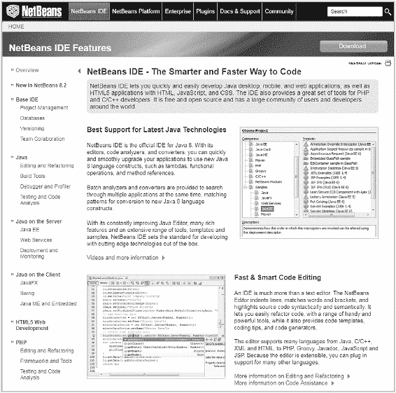

# 一、简介

第 1 章为这本书奠定了基础。

它描述了这本书将实现什么，这本书的目标读者是谁，为什么机器学习(ML)很重要，为什么 Java 有意义，以及如何部署 Java ML 解决方案。

The chapter includes the following:

*   回顾人工智能及其子领域的所有术语，包括机器学习

*   为什么 ML 很重要，为什么 Java 是实现的好选择

*   最流行的开发环境的设置说明

*   ML-Gates 介绍，一种 ML 开发方法

*   ML 和货币化策略的商业案例

*   为什么这本书没有涵盖深度学习，为什么这是一件好事

*   何时以及为什么你可能需要深度学习

*   探索 ML 解决方案时如何创造性地思考

*   重要的洗钱调查结果概述

## 1.1 术语

随着人工智能和机器学习越来越受欢迎，相关术语也出现了很多混乱。似乎每个人使用这些术语的方式都不同且不一致。

Some quick definitions for some of the abbreviations used in the book:

*   人工智能(AI):任何假装聪明的东西。

*   机器学习(ML):一个通用术语，包括深度学习(DL)和经典机器学习(CML)的子领域。

*   深度学习(DL):一类利用神经网络的机器学习算法。

*   强化学习(RL):一种接受反馈的监督学习方式，但不一定针对每个输入。

*   神经网络(NN):模仿人脑和神经系统的计算机系统。

*   经典机器学习(CML):一个更狭义地定义 ML 算法集的术语，不包括深度学习算法。

*   数据挖掘(DM):寻找数据中隐藏的模式，这是一项通常由人来完成的任务。

*   机器学习门(MLG):这本书将介绍一种叫做 ML-Gates 的开发方法。门号从 ML-Gate 5 开始，到 ML-Gate 0 结束。例如，MLG3 是该方法的 ML-Gate 3 的缩写。

*   随机森林(RF)算法:一种用于分类、回归和其他任务的学习方法，通过在训练时构建决策树来运行。

*   朴素贝叶斯(NB)算法:一个“概率分类器”家族，基于应用贝叶斯定理，在特征之间具有强(朴素)独立性假设。

*   k-最近邻(KNN)算法:一种用于分类和回归的非参数方法，其中输入由特征空间中 k 个最近的训练示例组成。

*   支持向量机(SVM)算法:一种带有相关学习算法的监督学习模型，用于分析用于分类和回归的数据。

大部分混乱源自使用这些术语的不同派别或“领域”。在许多情况下，他们创造了这些术语，并在其领域内使用了几十年。

Table [1-1](#Tab1) shows the domains that have historically claimed ownership to each of the terms. The terms are not new. Artificial intelligence is a general term. AI first appeared back in the 1970s.Table 1-1

人工智能定义和领域

<colgroup class="calibre12"><col class="tcol"> <col class="tcol"> <col class="tcol"></colgroup> 
| 

学期

 | 

定义

 | 

领域

 |
| --- | --- | --- |
| 统计数字 | 量化数据。DM，ML，DL 都是用统计学来做决策的。 | 数学系 |
| 人工智能 | 关于如何创造智能代理的研究。任何假装聪明的事情。我们给计算机编了一个程序，让它像智能代理一样工作。它不需要学习或归纳。 | 历史、营销、趋势。 |
| 数据挖掘 | 解释和识别有意义的模式。无人监管的方法。**发现你的数据中隐藏的模式**，这些模式可以被**的人**用来做决策。一个完整的商业流程，通常在大型数据集(大数据)上。 | 商业世界，商业智能 |
| 机器学习 | 人工智能的一个大分支，我们在其中建立模型来预测结果。使用算法并有明确的目标。我们把现有的知识归纳成新的数据。而是学习一个模型来对物体进行分类。 | 学术部门 |
| 深度学习 | 将**神经网络**应用于 ML。模式识别是一项重要的任务。 | 趋势 |

表 [1-1](#Tab1) 中的定义代表了我在阅读大量研究并与行业专家交谈后的综合理解。你可以在网上找到大量支持或反驳这些定义的哲学辩论。

Do not get hung up on the terminology. Usage of the terms often comes down to domain perspective of the entity involved. A mathematics major who is doing research on DL algorithms will describe things differently than a developer who is trying to solve a problem by writing application software. The following is a key distinction from the definitions:

> ***数据挖掘*** *都是关于* ***人类*** *发现数据中隐藏的模式，而* ***机器学习*** *自动化这个过程，并允许* ***计算机*** *通过使用算法来执行这项工作。*

It is helpful to think about each of these terms in context of “infrastructure” and “algorithms.” Figure [1-1](#Fig1) shows a graphical representation of these relationships. Notice that statistics are the underlying foundation, while “artificial intelligence” on the right-hand side includes everything within each of the additional subfields of DM, ML, and DL.

> *机器学习就是对* ***选择*** *和* ***将算法*** *应用于我们的数据的实践。*

I will discuss algorithms in detail in Chapter [3](3.html). The algorithms are the secret sauce that enables the machine to find the hidden patterns in our data.  Figure 1-1

人工智能子领域关系

## 1.2 历史

The term “artificial intelligence” is hardly new. It has actually been in use since the 1970s. A quick scan of reference books will provide a variety of definitions that have in fact changed over the decades. Figure [1-2](#Fig2) shows a representation of 1970s AI, a robot named Shakey, alongside a representation of what it might look like today. Figure 1-2

艾，过去和现在

Most historians agree that there have been a couple of “AI winters.” They represent periods of time when AI fell out of favor for various reasons, something akin to a technological “ice age.” They are characterized by a trend that begins with pessimism in the research community, followed by pessimisms in the media, and finally followed by severe cutbacks in funding. These periods, along with some historical context, are summarized in Table [1-2](#Tab2).Table 1-2

艾的历史与“冬天”时期

<colgroup class="calibre12"><col class="tcol"> <col class="tcol"></colgroup> 
| 

时期

 | 

语境

 |
| --- | --- |
| One thousand nine hundred and seventy-four | 英国议会发表研究称，人工智能算法将在“现实世界”问题上陷入停滞。这一挫折引发了包括 DARPA 在内的全球资金削减。这场危机被归咎于“不切实际的预测”和对技术的“日益夸大”。 |
| One thousand nine hundred and seventy-seven | AI WINTER 1 |
| 1984-1987 | 对人工智能的热情在 20 世纪 80 年代失去了控制，导致了价值数十亿美元的人工智能产业的又一次崩溃。 |
| One thousand nine hundred and ninety | 人工智能冬天 2 当人工智能再次到达一个低水位标志。 |
| Two thousand and two | 人工智能研究员罗德尼·布鲁克斯抱怨说，“有一个愚蠢的神话，人工智能已经失败了。” |
| Two thousand and five | 雷·库兹韦尔宣称，“许多观察家仍然认为人工智能冬天是故事的结尾...然而今天，成千上万的应用程序已经深深嵌入到每个行业的基础设施中。” |
| Two thousand and ten | 人工智能再次得到广泛应用和资金支持。机器学习越来越重要。 |

理解为什么会发生这些 AI 冬天是很重要的。如果我们打算投资学习和部署人工智能解决方案，我们希望确定另一个人工智能冬天不会迫在眉睫。

Is another AI winter on the horizon? Some people believe so, and they raise three possibilities:

*   归咎于统计数据:人工智能正走向错误的方向，因为它严重依赖统计技术。回想一下图 [1-1](#Fig1) 中，统计是人工智能和人工智能的基础。

*   机器疯狂运转:顶级研究人员认为另一个人工智能冬天可能会发生，因为滥用这项技术将导致它的灭亡。2015 年，埃隆·马斯克(Elon Musk)、史蒂文·霍金(Steven Hawking)、史蒂夫·沃兹尼亚克(Steve Wozniak)和 3000 名人工智能和机器人研究人员签署了一封禁止开发和使用自主武器的公开信。

*   **假数据**:数据是机器学习的燃料(在第 [2](2.html) 章中有更多关于这方面的内容)。这一论点的支持者认为，不断增加的熵将继续降低全球数据完整性，直到 ML 算法变得无效和无价值。这是 2018 年的一个相关论点。我将在第二章[中讨论多种类型的数据。](2.html)

看起来，另一个人工智能冬天不太可能在不久的将来到来，因为 ML 是如此有前途，因为我们可以利用高质量的数据来推动它。

今天，我们现有的大部分数据质量不高，但我们可以通过保持对模型所依赖的源数据的控制来降低这种风险。

政府资金的削减导致了之前的 AI 寒冬。今天，私营部门的资金是巨大的。只要看看人工智能初创公司正在筹集的一些风投资金就知道了。未来政府支持的类似削减将不再产生重大影响。对曼梯·里来说，这一次这匹马似乎永远离开了马厩。

## 1.3 机器学习商业案例

无论您是自由开发人员，还是为拥有大量可用资源的大型组织工作，在开始将有价值的资源应用于 ML 部署之前，您都必须考虑业务案例。

### 机器学习炒作

ML 当然也不能幸免于炒作。这本书的序言列举了媒体最近的一些炒作。这本书的目标是帮助你克服宣传和实现真正的问题解决方案。

ML and DL are not the only recent technology developments that suffer from excessive hype. Each of the following technologies has seen some recent degree of hype:

*   虚拟现实

*   增强现实

*   比特币

*   区块链

*   互联家庭

*   虚拟助手

*   物联网

*   3D 电影

*   4K 电视台

*   机器学习

*   深度学习

一些技术变得广泛和普遍使用，而另一些技术则逐渐消失。回想一下，就在短短几年前，3D 电影有望在影院上映时完全取代传统电影。这并没有发生。

对我们来说，继续密切关注 ML 和 DL 技术非常重要。事情将如何发展还有待观察，但最终，我们可以通过实验、构建和部署我们自己的应用程序来说服自己相信这些技术的可行性。

### 挑战和关切

表 [1-3](#Tab3) 列出了 IT 主管在考虑 ML 和 DL 计划时最担心什么时强调的一些主要挑战和顾虑。与任何 it 计划一样，实现 IT 计划都有机会成本，并且从计划中获得的收益必须大于机会成本，即通过进行 AI/ML 而放弃另一个潜在机会的成本。

Fortunately, there are mitigation strategies available for each of the concerns. These strategies, summarized below, are even available to small organization and individual freelance developers.Table 1-3

机器学习问题和缓解策略

<colgroup class="calibre12"><col class="tcol"> <col class="tcol"></colgroup> 
| 

ML 关注

 | 

缓解策略

 |
| --- | --- |
| IT 基础设施的成本 | 利用云服务提供商，如谷歌 GCP、亚马逊 AWS、微软 Azure |
| 没有足够的有经验的员工 | 即使我们不能雇佣数据科学家，ML 也要求开发人员开始像数据科学家一样思考。这并不意味着我们突然需要数学博士。组织可以从采用数据优先的方法开始，如本章后面介绍的 ML-Gates。 |
| 数据或分析平台的成本 | 有很多非常昂贵的数据科学平台；然而，我们可以从使用免费开源软件的经典 ML 开始，并取得令人印象深刻的结果。 |
| 数据质量不足 | 存在大量低质量的数据。我们可以通过减少对“社会”数据的依赖，转而关注我们自己创造的数据来减轻这种影响。我们还可以利用来自传感器的数据，这些数据应该没有这种偏差。 |
| 数据量不足 | 通过控制采样间隔，可以以更高的规模产生自生数据或传感器数据。在早期阶段将数据集成到项目中应该是 ML 方法的一部分。 |

使用上述缓解策略，开发人员可以用最小的学习曲线投资产生一些潜在的突破性 ML 软件解决方案。这是一个软件开发人员的大好时机。

接下来，我将进一步了解 ML 数据科学平台。这种平台可以帮助我们实现将我们的机器学习投资货币化的目标。货币化战略可以进一步缓解这些挑战和担忧。

### 数据科学平台

If you ask business leaders about their top ML objectives, you will hear variations of the following:

*   提高组织效率

*   对未来情景或结果做出预测

*   利用人工智能/人工智能获得竞争优势

*   将 AI/ML 货币化

Regardless of whether you are an individual or freelance developer, monetization is one of the most important objectives.

> *无论组织规模如何，货币化 ML 解决方案都需要两个构建模块:部署一个* ***数据科学平台*** *，并遵循一个* ***ML 开发方法论*** *。*

When it comes to the data science platforms, there are myriad options. It is helpful to think about them by considering a “build vs. buy” decision process. Table [1-4](#Tab4) shows some of the typical questions you should ask when making the decision. The decisions shown are merely guidelines.Table 1-4

数据科学平台:构建还是购买决策

<colgroup class="calibre12"><col class="tcol"> <col class="tcol"></colgroup> 
| 

构建与购买问题

 | 

决定

 |
| --- | --- |
| 有没有一个软件包可以完全解决你的问题？ | 是:购买 |
| 有没有解决你很多需求的包？这是常见的情况，没有简单的答案。 | 未确定的 |
| 有没有可以考虑的开源包？ | 是:构建 |
| 是不是套餐太难实现了？ | 是:购买 |
| 你定义好的问题需要深度学习吗？ | 不:也许建造 |
| 分析是您业务的关键优势吗？ | 是:也许建造 |
| 你的分析场景独特吗？ | 是:构建 |
| 有新的数据吗？ | 是:构建 |
| 你的领域需要你敏捷吗？ | 是:构建 |
| 您是否能够获得您的问题所需的数据科学人才？不要低估你自己或你的员工；许多开发人员很快掌握了数据科学技能。 | 否:购买 |

那么“购买”一个数据科学平台实际上意味着什么呢？让我们考虑一个例子。

You wish to create a recommendation engine for visitors to your website. You would like to use machine learning to build and train a model using historical product description data and customer purchase activity on your website. You would then like to use the model to make real-time recommendations for your site visitors. This is a common ML use case. You can find offerings from all of the major vendors to help you implement this solution. Even though you will be “building” your own model using the chosen vendor’s product, you are actually “buying” the solution from the provider. Table [1-5](#Tab5) shows how the pricing might break down for this project for several of the cloud ML providers.Table 1-5

示例 ML 云提供商定价[https://cloud.google.com/ml-engine/docs/pricing](https://cloud.google.com/ml-engine/docs/pricing)***、***[https://aws.amazon.com/aml/pricing/](https://aws.amazon.com/aml/pricing/)***、***[https://azure . Microsoft . com/en-us/Pricing/details/machine-learning-studio/](https://azure.microsoft.com/en-us/pricing/details/machine-learning-studio/)

<colgroup class="calibre12"><col class="tcol"> <col class="tcol"> <col class="tcol"></colgroup> 
| 

供应者

 | 

功能

 | 

定价

 |
| --- | --- | --- |
| 谷歌云 ML 引擎 | 建模费用批量预测实时预测 | 每小时 0.27 美元(标准机器)每节点小时 0.09 美元每节点小时 0.30 美元 |
| 亚马逊机器学习(AML) | 建模费用批量预测实时预测 | 每小时 0.42 美元，每 1000 次预测 0.10 美元，每次预测 0.0001 美元 |
| Microsoft Azure ML Studio | 建模费用批量预测实时预测 | 每月 10 美元，每小时 1 美元(标准)每月 100 美元包括 100，000 次交易(API) |

在本例中，由于构建模型需要计算时间，因此您应计成本。随着非常大的数据集和深度学习模型的构建，这些成本变得很大。

另一个“购买”ML 解决方案的常见例子是使用发布的 API 访问预先构建的模型。您可以将这种方法用于图像检测或自然语言处理，其中存在庞大的模型，您可以简单地通过使用您的输入细节调用 API(通常使用 JSON)来利用这些模型。在本书的后面，您将看到如何实现这个简单的例子。在这种情况下，大多数服务提供商按照给定时间段内的 API 调用次数收费。

那么“建立”一个数据科学平台意味着什么呢？在这种情况下，构建是指获得一个软件包，该软件包将提供实现您自己的 AI 或 ML 解决方案所需的构建块。

The following list shows some of the popular data science platforms:

*   MathWorks :传奇的 MATLAB 软件包的创造者，MathWorks 是业界的老玩家。

*   **SAP** :大型数据库玩家拥有完整的大数据服务和咨询业务。

*   IBM : IBM 提供 Watson Studio 和 IBM 数据科学平台产品。

*   **微软**:微软 Azure 提供全方位的数据和分析服务及资源。

*   KNIME analytics 是一个基于 Java 的、开放的、直观的、综合的数据科学平台。

*   RapidMiner:一个基于 Java 的商业解决方案。

*   **H2O.ai** :流行的开源数据科学和 ML 平台。

*   Dataku:一个协作数据科学平台，允许用户进行原型设计、部署和大规模运行。

*   Weka :基于 Java 的解决方案，您将在本书中深入探讨。

该列表包括许多流行的数据科学平台，其中大多数是商业数据科学平台。关键词是商业。由于 Rapidminer 是基于 Java 的，所以在本书的后面，您将会更仔细地了解它。其他商业解决方案功能齐全，有从基于许可到基于订阅的一系列定价选项。

好消息是，您不必为了构建数据科学平台而进行资本支出，因为有一些开源替代方案可用。你将在第 [3](3.html) 章仔细查看 Weka 包。无论您决定构建还是购买，像 Weka 这样的开源替代方案都是非常有用的入门方式，因为它们允许您在学习的同时构建自己的解决方案，而不会将您束缚在昂贵的技术解决方案中。

### ML 货币化

One of the best reasons to add ML into your projects is increased potential to monetize. You can monetize ML in two ways: directly and indirectly.

*   **间接货币化**:让 ML 成为你产品或服务的一部分。

*   **直接货币化**:向客户销售人工智能能力，客户反过来应用这些能力来解决特定问题或创造自己的产品或服务。

Table [1-6](#Tab6) highlights some of the ways you can monetize ML.Table 1-6

ML 货币化方法

<colgroup class="calibre12"><col class="tcol"> <col class="tcol"> <col class="tcol"></colgroup> 
| 

战略

 | 

类型

 | 

描述

 |
| --- | --- | --- |
| 架构 | 直接的 | AI 即服务，比如 Salesforce Einstein 或者 IBM Watson。 |
| MLaaS | 直接的 | ML 即服务，如表 [1-5](#Tab5) 中的 Google、Amazon 或 Microsoft 示例。 |
| 模型 API | 间接的 | 例如，您可以创建模型，然后发布一个 API，允许其他人使用您的模型进行自己的预测。 |
| 纳普拉斯 | 直接的 | NLP 即服务。苹果 Siri、微软 Cortana 或亚马逊 Echo/Alexa 等聊天机器人。Nuance Communications、Speechamatics 和 Vocapia 等公司。 |
| 集成 ML | 间接的 | 您可以创建一个模型来帮助解决您的问题，并将该模型集成到您的项目或应用程序中。 |

许多直接策略采用了 DL 方法。在本书中，重点主要放在间接 ML 策略上。在本书的后面，您将实现几个集成的 ML 应用程序。这种策略是间接的，因为 ML 功能对最终用户是不可见的。

客户不会因为你在申请中加入 ML 就多付钱。然而，如果你能解决一个新问题，或者为他们提供以前没有的能力，你就大大增加了赚钱的机会。

There is not much debate about the rapid growth of AI and ML. Table [1-7](#Tab7) shows estimates from Bank of America Merrill Lynch and Transparency Market Research. Both firms show a double-digit cumulative annual growth rate, or CAGR. This impressive CAGR is consistent with all the hype previously discussed.Table 1-7

AI 和 ML 爆发式增长

<colgroup class="calibre12"><col class="tcol"> <col class="tcol"> <col class="tcol"> <col class="tcol"></colgroup> 
| 

公司

 | 

领域

 | 

增长

 | 

CAGR

 |
| --- | --- | --- | --- |
| 美银美林 | 人工智能 | 2015 年 580 亿美元，2020 年 1530 亿美元 | 27% |
| 透明度市场研究 | 机器语言(Machine Language) | 2106 年 10.7 亿美元，2025 年 198.6 亿美元 | 38% |

这些复合年增长率代表了令人印象深刻的增长。一些增长归因于 DL；但是，您不应该忽视 CML 为您提供的可能机会，尤其是在移动设备方面。

### 手机上的经典机器学习案例

经典机器学习不是一个很常用的术语。我将使用该术语来表示我们正在排除深度学习。图 [1-3](#Fig3) 显示了这种关系。这两种方法使用不同的算法，我将在第四章[中讨论它们。](4.html)

This book is about implementing CML for widely available computing devices using Java. In a sense, we are going after the “low-hanging fruit.” CML is much easier to implement than DL, but many of the functions we can achieve are no less astounding. Figure 1-3

经典机器学习关系图

There is a case for mastering the tools of CML before attempting to create DL solutions. Table [1-8](#Tab8) highlights some of the key differences between development and deployment of CML and DL solutions.Table 1-8

经典机器学习和深度学习的比较

<colgroup class="calibre12"><col class="tcol"> <col class="tcol"></colgroup> 
| 

经典机器学习

 | 

深度学习

 |
| --- | --- |
| **算法** |
| 算法大都商品化了。你不需要花很多时间去选择最好的算法或者调整算法。算法更容易解读和理解。 | 神经网络算法背后有很多新的研究。这涉及到大量的理论，并且需要大量的调整来为您的应用找到最佳的算法。 |
| **数据要求** |
| 需要适量的数据。您可以在某些应用程序中生成自己的数据。 | 训练 DL 模型需要大量的数据。大多数实体缺乏足够的数据来创建自己的 DL 模型。 |
| **性能** |
| 为许多移动、web 应用或嵌入式设备环境提供足够的性能。 | 深度学习神经网络算法最近的增长很大程度上是因为它们的性能优于 CML 算法。 |
| **语言** |
| 许多 Java 工具都是可用的，既有开源的也有商业的。 | 大多数 DL 库和工具都是基于 Python 或 C++的，只有基于 Java 的 DL4J 例外。一些流行的 C++ DL 引擎通常有 Java 包装器。 |
| **模型创建** |
| 模型大小可以适中。可以在桌面环境下创建模型。易于嵌入移动设备或嵌入式设备。 | 模型尺寸可能很大。难以将模型嵌入到移动应用中。创建模型需要大量 CPU/GPU 资源。 |
| **典型用例** |
| 回归聚类分类数据的特定用例 | 图像分类语音计算机视觉玩游戏自动驾驶汽车模式识别声音合成艺术创作照片分类异常(欺诈)检测行为分析推荐引擎翻译自然语言处理面部识别 |
| **货币化** |
| 间接 ML | 模型 APIsMLaaS |

对于移动设备和嵌入式设备，CML 很有意义。对于较小的数据集，CML 优于 DL，如图 [1-7](#Fig7) 中图表的左侧所示。

用一个现代的 CPU 在合理的时间内创建 CML 模型是可能的。CML 在桌面上启动。它不需要大量的计算资源，例如多个 CPU/GPU，而这在构建 DL 解决方案时是常见的。

The interesting opportunity arises when you build your models on the desktop and then deploy them to the mobile device either directly or through API interface. Figure [1-4](#Fig4) shows a breakdown of funding by AI category according to Venture Scanning. Figure 1-4

按人工智能类别拨款

数据显示，移动应用的 ML 的资金大约是第二大领域 NLP 的三倍。所包含的类别表明，许多常见的 DL 领域，如计算机视觉、NLP、语音和视频识别，已经作为一个特定的类别包含在内。这让我们可以假设 ML 应用类别的很大一部分是经典的机器学习。

## 1.4 深度学习

I will not cover deep learning in this book because we can accomplish so much more easily with CML. However, in this short section I will cover a few key points of DL to help identify when CML might not be sufficient to solve an ML problem. Figure 1-5

机器学习红色药丸/蓝色药丸隐喻

Morpheus described the dilemma we face when pursuing ML in the motion picture “The Matrix” (see also Figure [1-5](#Fig5)):

> *“你服下蓝色药丸，故事结束；你在床上醒来，相信你想相信的一切。你吃了红色药丸，你就呆在仙境里，我让你看看兔子洞有多深。”*

深度学习是一种仙境。这是我们今天在这个领域大肆宣传的原因。然而，它有一个很好的理由来达到炒作的目的。

You will often hear it stated the DL operates at scale. What does this mean exactly? It is a performance argument, and performance is obviously very important. Figure [1-6](#Fig6) shows a relationship between performance and data set size for CML and DL. Figure 1-6

深度学习规模化运营

图表显示，对于较小的数据集，CML 的性能略优于 DL。问题是，多小才算小？当我们设计 ML 应用程序时，我们需要考虑数据集大小位于拐点的哪一边。没有简单的答案。如果有，我们会将实际数字放在 x 轴刻度上。这取决于您的具体情况，您需要在设计解决方案时决定使用哪种方法。

幸运的是，我们有工具来定义 CML 模型的性能。在第 [4](4.html) 和 [5](5.html) 章中，您将了解如何使用 Weka workbench 向您展示增加数据集大小是否真的会提高模型的性能。

### 识别 DL 应用程序

深度学习已经在许多特定领域展示了优于 CML 的结果，包括语音、自然语言处理、计算机视觉、玩游戏、自动驾驶汽车、模式识别、声音合成、艺术创作、照片分类、不规则(欺诈)检测、推荐引擎、行为分析、翻译等等。

随着你获得 ML 的经验，你开始对一个项目什么时候适合 DL 有一种感觉。

Deep networks work well when

*   更简单的 CML 模型达不到你想要的精度。

*   你有复杂的模式匹配需求。

*   你的数据(序列)中有时间维度。

If you do decide to pursue a DL solution, you can consider the following deep network architectures:

*   无监督预训练网络(UPN ),包括深度信念网络(DBN)和生成对抗网络(GAN)

*   卷积神经网络(CNN)

*   包括长短期记忆(LSTM)的循环神经网络(RNN)

*   循环神经网络

我会在第 [4](4.html) 章多讲算法。在设计 CML 解决方案的时候，可以从确定你所追求的 CML 的算法类开始，比如分类或者聚类。然后，您可以很容易地在类中试验算法，以找到最佳解决方案。在 DL 中，就没有这么简单了。您需要将您的数据与特定的网络架构相匹配，这个主题超出了本书的范围。

While building deep networks is more complicated and resource intensive, as described in Table [1-8](#Tab8), tuning deep networks is equally challenging. This is because, regardless of the DL architecture you choose, you define deep learning networks using neural networks that are comprised of a large number of parameters, layers, and weights. There are many methods used to tune these networks including the methods in Table [1-9](#Tab9).Table 1-9

DL 网络的调谐方法

<colgroup class="calibre12"><col class="tcol"> <col class="tcol"></colgroup> 
| 

DL 神经网络的调谐方法

 |
| --- |
| 反向传播 | 随机梯度下降 |
| 学习率衰减 | 拒绝传统社会的人 |
| 最大池化 | 批量标准化 |
| 长短期记忆 | Skipgram |
| 连续的单词袋 | 迁移学习 |

如表所示，DL 很复杂。可用于 DL 的 AI 引擎试图简化这个过程。表 [1-10](#Tab10) 显示了许多包含 DL 库的流行 AI 引擎。在本书中，您将关注面向 Java 开发人员的 CML 解决方案。

When you create DL solutions there are not as many Java tools and libraries available. DL4J and Spark ML are the two most common Java-based packages that can handle DL. DL4J is built from the ground up with DL in mind, whereas the popular Spark open source project has recently added some basic DL capabilities. Some of the excellent C++ libraries do provide Java wrappers, such as Apache MXNet and OpenCV.Table 1-10

具有深度学习库的人工智能引擎

<colgroup class="calibre12"><col class="tcol"> <col class="tcol"> <col class="tcol"></colgroup> 
| 

包裹

 | 

描述

 | 

语言

 |
| --- | --- | --- |
| 提亚诺 | 数学编程的强大通用工具。旨在促进深度学习。用于 GPU 的高级语言和编译器。 | 计算机编程语言 |
| 张量流 | 与深度学习相关的所有类型的数值计算的库。深受 Theano 的启发。数据流图表示多维数组(张量)的通信方式。(谷歌) | C++和 Python |
| CNT(消歧义) | 计算网络工具包。由微软研究院在许可许可下发布。 | C++ |
| 框架 | 简洁和可扩展的设计。基于赢得 2012 年 ImageNet 挑战赛的 AlexNet。(脸书支持) | C++和 Python |
| DL4J 系列 | 基于 Java 的开源深度学习库(Apache 2.0 许可证)。使用带有线性代数和矩阵操作的多维数组类。(Skymind) | 爪哇 |
| 火炬 | 开源的科学计算框架，优化用于 GPU。 | C |
| Spark MLlib(消歧义) | 大规模分布式数据处理的快速通用引擎。MLlib 是机器学习库。庞大的用户群。DL 支持正在增长。 | 爪哇 |
| Apache MXNet | 开源 Apache 项目。由 AWS 使用。美国有线电视新闻网和 LSTM。可扩展。由华盛顿大学和卡内基梅隆大学创办。 | C++Java 包装器 |
| 硬 | 用于开发和评估 DL 模型的功能强大、易于使用的库。最棒的张量流。 | 计算机编程语言 |
| 开放计算机视觉 | 可以为 Android 集成的开源计算机视觉库。 | C++Java 包装器 |

While it is entirely possibly that DL can solve your unique problem, this book wants to encourage you to think about solving your problem, at least initially, by using CML. The bottom line before we move onto ML methodology and some of the technical setup topics is the following:

> 深度学习令人惊叹，但在本书中，我们抵制诱惑，青睐经典的机器学习，只是因为它可以以少得多的麻烦完成如此多同样令人惊叹的事情。

在本书的其余部分，我们将选择蓝色药丸，并留在舒适的模拟现实的矩阵与 CML。

## 1.5 毫升-盖茨方法

Perhaps the biggest challenge of producing ML applications is training yourself to think differently about the design and architecture of the project. You need a new data-driven methodology. Figure [1-7](#Fig7) introduces the ML-Gates. The methodology uses these six gates to help organize CML and DL development projects. Each project begins with ML-Gate 6 and proceeds to completion at ML-Gate 0\. The ML-Gates proceed in a decreasing order. Think of them as leading to the eventual launch or deployment of the ML project. Figure 1-7

ML-Gates，一种机器学习开发方法

作为开发人员，我们编写大量代码。当我们接受新项目时，我们通常只是开始编码，直到我们得到可交付的产品。使用这种方法，我们通常会得到大量编码的应用程序。

对于 ML，我们想彻底改变这种方法。相反，我们试图用最少的代码实现数据密集型应用。最小编码的应用程序更容易支持。

### ML-Gate 6:识别明确定义的问题

这一切都始于一个定义明确的问题。在这个阶段，你需要比从事传统的非 ML 项目时考虑得更狭隘一些。这可能导致创建集成到更大系统中的 ML 模块。

为了说明这一点，让我们考虑一个具有客户需求的示例项目。

For the project, you map the client requirements to well-defined ML solutions. Table [1-11](#Tab11) shows the original client requirements mapped to the ML models.Table 1-11

将需求映射到 ML 解决方案

<colgroup class="calibre12"><col class="tcol"> <col class="tcol"></colgroup> 
| 

初始客户要求

 | 

定义明确的 ML 解决方案

 |
| --- | --- |
| R1:创建一个购物应用程序，这样实体店的顾客将会有更好的用户体验。 | 您发现需要一个基于位置的店内解决方案来让这款应用变得有用。您可以使用一种巧妙的 CML 方法来实现这一点。第 6 章的最后有更多关于实现的内容。 |
| R2:对使用该应用程序帮助增加销售额的购物者实现忠诚度计划。 | 忠诚度计划都是关于保存和召回客户数据。您可以使用产品库存数据和客户购买历史数据来构建 ML 模型，以便向客户推荐产品，从而增强用户体验。 |

在这个例子中，客户想要一个店内购物应用程序。这些是完全有效的需求，但是这些高层次的需求并不代表定义良好的 ML 问题。您的客户“表达了”提供“增强用户体验”的需求这到底意味着什么？要创建一个 ML 解决方案，你需要考虑客户未表达或潜在的需求。

右栏显示了如何将表达的需求映射到定义良好的 ML 解决方案。在这种情况下，您将构建两个独立的 ML 模型。您将需要这些模型的数据，这将引导您进入 ML-Gate 5。

### ML-Gate 5:获取足够的数据

Data is the key to any successful ML app. In MLG5, you need to acquire the data. Notice this is happening well before you write any code. There are several approaches for acquiring data. You have several options and I will discuss the following in detail in Chapter [2](2.html):

*   从第三方购买数据。

*   使用公开可用的数据集。

*   使用你自己的数据集。

*   自己生成新的静态数据。

*   来自实时源的流数据。

### ML-Gate 4:处理/清理/可视化数据

一旦有了明确的问题和足够的数据，就该设计解决方案了。接下来的三个门涵盖此活动。在 MLG4 中，您需要处理、清理并可视化您的数据。

MLG4 就是为模型构建准备数据。您需要考虑缺失值、规范化、相关性、格式、数据类型和数据量等技术。

可视化是一个重要的方面，因为你努力对你的数据负责。对数据应用 CML 或 DL 算法时，未正确预处理的数据可能会导致错误。正因如此，MLG4 非常重要。俗话说垃圾进，垃圾出，这是你必须避免的。

### ML-Gate 3:生成模型

准备好数据后，MLG3 就是您实际创建模型的地方。在 MLG3，您将初步决定使用哪种算法。

在第 4 章中，我将介绍可以生成模型的基于 Java 的 CML 环境。我将介绍如何创建模型以及如何测量模型的性能。

这是一种强大的设计模式，您将使用它来离线构建模型，以供以后在 Java 项目中使用。第 [5](5.html) 章将涵盖“预制”模型的进口和出口。

在 MLG3，您还必须考虑您的模型的版本控制和更新方法。管理模型的这一方面与管理非 ML 软件开发中的代码更新一样重要。

### ML-Gate 2:测试/改进模型

创建初始模型后，MLG2 允许您测试和优化模型。正是在这里，您要检查模型的性能，以确认它将满足您的预测要求。

推理是使用模型进行预测的过程。在此过程中，您可能会发现需要调整或优化所选的算法。你可能会发现你需要改变你最初选择的算法。您甚至可能发现 CML 没有提供想要的结果，您需要考虑 DL 方法。

通过 ML-Gate 2 表示模型已经准备好了，是时候进入 MLG1 来集成模型了。

### ML-Gate 1:整合模型

在 MLG1，是时候编写实际的生产代码了。请注意，在方法论中，您已经将实际的代码编写向前推进了多远。好消息是，您不必像平时那样编写大量代码，因为您创建的训练有素的模型将完成大部分繁重的工作。

您需要在 MLG1 编写的大部分代码处理模型的“打包”。在这一章的后面，我将讨论潜在的目标环境，这些环境也会影响模型需要如何被打包。

通常，使用训练数据在 MLG3/4 上创建 CML 模型，然后利用该模型进行预测。在 MLG1 中，您可能需要编写额外的代码来获取新的实时数据，并将其输入到模型中以输出预测。在第 [6](6.html) 章中，您将看到如何从设备中收集传感器数据并输入到模型中。

MLG1 是您认识到编码时间节省的地方。通常只需要几行代码就可以打开一个预构建模型并进行新的预测。

方法的这一阶段还包括解决方案的系统测试。

### ML-Gate 0:部署

At MLG0, it is time for deployment of the completed ML solution. You have several options to deploy your solution because of the cross-platform nature of Java, including

*   通过 Google Play 等应用商店发布移动应用。

*   向您的客户端发送独立软件包。

*   通过网络浏览器访问在线提供软件。

*   提供对您的解决方案的 API 访问。

> *无论您如何部署您的 ML 解决方案，在 MLG0 要记住的重要一点是,“发货后就忘了”是错误的。*

当我们创建模型时，我们必须认识到它们不应该成为永远不变的静态实体。我们需要一种机制来更新它们并保持它们的相关性。ML 模型帮助我们避免代码繁重的应用程序的缺点，但是我们必须有效地管理我们创建的模型，这样它们才不会过时。

### 方法总结

现在，您已经了解了 CML 的必要背景，并且有了可以用来创建 CML 应用程序的方法。

你可能听说过这样一句话:“当你是一把锤子时，一切看起来都像钉子。”在精通 CML 并采用数据驱动的方法后，您很快就会发现大多数问题至少在某个方面有一个优雅的 ML 解决方案。

接下来，您将看到书中 Java 项目所需的设置，以及 ML 成功的最后一个关键因素:创造性思维。

## 1.6 Java 的案例

关于哪种编程语言是最好的，你应该学习哪种语言，什么语言最适合孩子们开始编写代码，哪些语言正在消亡，哪些新语言代表了编程的未来，等等，总是有激烈的争论。

Java 无疑是这些争论的一个重要部分。有许多人质疑 Java 满足现代开发人员需求的能力。每种编程语言都有自己的优点和缺点。

Christina Videira Lopes 的 ***编程风格的练习*** 很有趣，因为作者解决了大量不同语言中的一个常见编程问题，同时强调了每种风格的优点和缺点。这本书阐明了我们可以使用任何语言来解决给定的问题。作为程序员，我们需要找到给定所选语言约束的最佳方法。Java 当然有它的优点和缺点，接下来我将回顾一下 Java 适合 CML 解决方案的一些原因。

### Java 市场

Java has been around since 1995 when it was first released by Sun Microsystems, which was later acquired by Oracle. One of the benefits of this longevity is the market penetration it has achieved. The Java market share (Figure [1-8](#Fig8)) is the single biggest reason to target the Java language for CML applications. Figure 1-8

Java 市场

Java 应用程序编译成字节码，可以在任何 Java 虚拟机(JVM)上运行，而不管计算机架构如何。它是拥有数百万开发人员的最受欢迎的语言之一，尤其是对于客户机-服务器 web 应用程序。

When you install Java, Oracle is quick to point out that three billion devices run Java. It is an impressive claim. If we drill down deeper into the numbers, they do seem to be justified. Table [1-12](#Tab12) shows some more granular detail of the device breakdown.Table 1-12

运行 Java 的设备

<colgroup class="calibre12"><col class="tcol"> <col class="tcol"></colgroup> 
| 

设备

 | 

数数

 |
| --- | --- |
| 运行 Java 的台式机 | 11 亿 |
| JRE 每年的下载量 | 9.3 亿 |
| 运行 Java 的手机 | 30 亿 |
| 蓝光播放器 | 100%运行 Java |
| Java 卡 | 每年生产 14 亿个 |
| 专有盒子 | 未知数量的设备，包括机顶盒、打印机、网络摄像头、游戏控制台、汽车导航系统、彩票终端、停车计时器、VOIP 电话、电表、工业控制等。 |

The explosion of Android development and the release of Java 8 helped Java to gain some of its market dominance.

> Java 的巨大规模是我选择它作为 CML 解决方案语言的主要原因。开发人员只需要掌握一种语言，就可以产生有效的 CML 解决方案，并将其部署到大量的目标受众中。

For your target environments, the focus will be on the following three areas that make up the majority of installed Java devices:

*   **运行 Java** 的台式机:这一类别包括可以运行独立 Java 程序的个人电脑，或者可以运行 Java 小程序的电脑上的浏览器。

*   **运行 Java 的手机** : Android 移动设备在这一类中占了很大一部分，其中也包括低价功能手机。ML 的一个关键发现是数据的重要性，手机可以说是有史以来最伟大的数据收集设备。

*   Java 卡:这个类别代表最小的 Java 平台。Java 卡允许 Java 小程序在嵌入式设备上运行。设备制造商负责集成嵌入式 Java，消费者不能下载或安装。

### Java 版本

Oracle supplies the Java programming language for end users and for developers:

*   JRE (Java 运行时环境)是为希望安装 Java 以便运行 Java 应用程序的最终用户准备的。

*   JDK (Java SE Developer Kit)包括 JRE 以及用于开发、调试和监控 Java 应用程序的附加工具。

There are four platforms of the Java programming language:

*   Java 平台，标准版(Java SE)

*   Java Platform，Enterprise Edition (Java EE)构建在 Java SE 之上，包括用于构建网络应用程序的工具，如 JSON、Java Servlet、JavaMail 和 WebSocket。Java EE 是在 Java 社区过程下开发和发布的。

*   Java Platform，Micro Edition (Java ME)是一个小型虚拟机，用于在小型设备上运行应用程序。

*   Java FX 用于使用轻量级 API 创建富互联网应用程序。

所有的 Java 平台都由一个 Java 虚拟机(JVM)和一个应用编程接口(API)组成。

Table [1-13](#Tab13) summarizes the current Java releases.Table 1-13

最新支持的 Java 版本

<colgroup class="calibre12"><col class="tcol"> <col class="tcol"></colgroup> 
| 

释放；排放；发布

 | 

描述

 |
| --- | --- |
| Java 8 SE 内部版本号 171 | 目前支持的长期支持(LTS)版本。引入 lambda 表达式 |
| Java 10 SE 10.0.1 | 当前支持的快速发布版本。2018 年 3 月 20 日发布。包括 12 项新的主要功能。最新更新是 171。 |
| Android SDK | 用于开发 Android 应用程序的替代 Java 软件平台。包括自己的 GUI 扩展系统和移动设备库。Android 不提供完整的 Java SE 标准库。Android SDK 支持 Java 6 和部分 Java 7 特性。 |

Java 的最新版本解决了该语言落后于一些更新、更流行的语言的一些领域。值得注意的是，Java 8 包括了一个意义深远的特性，称为***λ表达式*** ，以及一个新的运算符(- >)和一个新的语法元素。Lambda 表达式增加了函数式编程特性，有助于简化和减少创建某些结构所需的代码量。

在本书中，你不会用到 lambda 表达式，也不会用到 Java 10 语言中的任何新特性。尽管如此，最好运行 Java 8 长期支持版本或当前支持的 Java 10 快速版本的最新更新。

如果你正在寻找一本全面的 Java 书籍， ***Java，甲骨文*** 第十版完整参考，超过 1300 页，是一个极好的选择。它涵盖了 Java 的所有内容。谈到 Java 性能调优，Charlie Hunt 和 John Binu 的《Java 性能*是一本 720 页的权威指南，旨在最大限度地提高 Java 性能。*

### 安装 Java

在安装 Java 之前，您应该首先从系统中卸载所有旧版本的 Java。在您的系统上保留旧版本的 Java 存在安全风险。卸载旧版本可确保 Java 应用程序在最新的安全和性能环境下运行。

所有平台下载的主 Java 页面和链接可从以下 URL 获得:

[https://java.com/en/](https://java.com/en/)

[https://Java . com/en/download/manual . JSP](https://java.com/en/download/manual.jsp)

Java 可用于您需要的任何平台。一旦你决定了你需要哪一个加载，继续下载和安装。对于本书中的项目，建议安装 Java 8 SE 的最新稳定版。对于 Android 项目，允许 Android Studio 管理您的 Java 版本。Android Studio 通常会使用 Java 7 的最新稳定版本，直到 Android 团队添加了对 Java 8 的支持。

图 [1-9](#Fig9) 显示了主 Java 下载页面。

图 [1-10](#Fig10) 显示了 Java 的安装。

Figure [1-11](#Fig11) shows the completion of the installation.  Figure 1-9

下载 Java

 Figure 1-10

安装 Java

 Figure 1-11

成功安装 Java SE

### Java 性能

史蒂夫·乔布斯曾经说过一句关于 Java 的名言:“它是一个巨大的、重量级的球和链条。”当然，苹果从来都不喜欢这种语言。Java 经久不衰的原因之一是多年来对该语言的支持和改进。Java 的最新版本比早期版本提供了更多的功能和性能。

开发人员犹豫选择 Java 作为 ML 解决方案的原因之一是担心性能。

询问哪种语言“更快”或提供更好的性能并不是一个真正有用的问题。当然，这要视情况而定。语言的性能取决于它的运行时、操作系统和实际代码。当开发人员问，“哪种语言为机器学习提供了最好的性能？”我们真的应该问，“我应该使用哪个平台来最快速、最轻松地完成机器学习模型的训练和构建？”

使用算法创建 ML 模型是 CPU 密集型的，尤其是对于 DL 应用程序。这本书是关于 Java 的，但是如果你研究 ML，你会知道 Python 和 C++也是非常流行的 ML 语言。为 ML 创建三种语言的公平比较并不容易，但是许多研究人员已经尝试这样做了，你可以从他们的发现中学习。由于 ML 是基于算法的，所以他们经常试图选择一个标准算法，然后在其他变量相同的情况下进行比较，例如 CPU 和操作系统。

Java 性能是语言中最难衡量的，因为有几个因素，包括未优化的代码、Java 的 JIT 编译方法和著名的 Java 垃圾收集。此外，请记住，Java 和 Python 可能依赖 C++库的包装器来完成实际的繁重工作。

Table [1-14](#Tab14) shows a high-level summary of the performance for a mathematical algorithm implemented in three different languages on the same CPU and operating system. To learn more about the underlying research used in the summary, refer to these sources:

*   程序速度，维基百科，[https://en.wikipedia.org/wiki/Java_performance](https://en.wikipedia.org/wiki/Java_performance)

*   Google 的一篇研究论文比较了 C++、Java、Scala 和 Go 编程语言的性能:

    [https://days 2011 . Scala-lang . org/sites/days 2011/files/ws3-1-hundt . pdf](https://days2011.scala-lang.org/sites/days2011/files/ws3-1-Hundt.pdf)

*   六种程序设计语言的比较研究:

    [https://arxiv.org/ftp/arxiv/papers/1504/1504.00693.pdf](https://arxiv.org/ftp/arxiv/papers/1504/1504.00693.pdf)

*   伊万扎赫里耶夫的博客:

    [https://blog . fam zah . net/2016/02/09/CPP-vs-python-vs-perl-vs-PHP-performance-benchmark-2016/](https://blog.famzah.net/2016/02/09/cpp-vs-python-vs-perl-vs-php-performance-benchmark-2016/)

Table 1-14

语言表现比较-数学算法

<colgroup class="calibre12"><col class="tcol"> <col class="tcol"> <col class="tcol"></colgroup> 
| 

语言

 | 

比 C++慢%

 | 

注意

 |
| --- | --- | --- |
| C++ | - | C++编译成 native，所以是第一。 |
| Java 8 | 15% | Java 为平台独立性产生字节码。Java 的“软肋”是它的垃圾收集(GC)开销。这些年来，对 Java GC 算法进行了许多改进。 |
| 我的锅 | 15+% | Kotlin 还生产 Java 虚拟机(JVM)字节码。通常，Kotlin 和 Java 一样快。 |
| 计算机编程语言 | 55% | Python 有高级数据类型和动态类型，所以运行时要比 Java 辛苦。 |

表 [1-14](#Tab14) 当然不是详尽的性能指标评测，但确实提供了一些关于相对性能的见解，以及对差异的可能解释。

当您为 ML 解决方案创建预构建模型时，关注数据质量和算法选择比编程语言更重要。你应该使用最容易、最准确的编程语言来表达你试图解决的问题。

Java 怀疑论者经常问:“Java 是实现深度学习的合适编程语言吗？”简短的回答是:当然！它有足够的性能，所有需要的数学和统计库都可用。在本章的前面，我将 DL4J 列为完全用 Java 编写的主要 Java 包。DL4J 是一个神奇的软件包，它的能力可以与 DL 中的所有大型玩家相媲美。一句话:借助云中的多节点计算，我们可以轻松地为计算密集型操作添加更多资源。可伸缩性是基于云的平台提供的巨大优势之一，我将在第 [2](2.html) 章中讨论。

## 1.7 开发环境

There are many IDEs available to Java developers. Table [1-15](#Tab15) shows the most popular choices for running Java on the desktop or device. There are also some online browser-based cloud Java IDEs such as Codenvy, Eclipse Che, and Koding, which I will not cover.Table 1-15

Java IDE 摘要

<colgroup class="calibre12"><col class="tcol"> <col class="tcol"></colgroup> 
| 

IDE 名称

 | 

特征

 |
| --- | --- |
| Android Studio | 来自 Google 的 Android 专用开发环境。它已经成为 Android 事实上的 IDE。提供了大量有用的开发和调试工具。 |
| 智能理念 | 功能齐全的专业 IDE。年费。许多开发人员喜欢 IntelliJ。Android Studio 是基于 IntelliJ 的。 |
| 黯然失色 | 免费开源 IDE。Eclipse 公共许可证。支持 Git。大量可用的插件。 |
| BlueJ | 轻量级开发环境。附带树莓派。 |
| 开发工具 | 免费的开源 IDE，Eclipse 的替代品。开源项目正在转移到 Apache，这应该会增加它的受欢迎程度。 |

The book uses two development environments for the projects depending on the target platform:

*   谷歌的 ***Android Studio*** 帮助开发者为运行 Android 的移动设备创建应用。

*   不针对 Android 移动设备的 Java 项目的 ***Eclipse*** IDE。这包括面向桌面、浏览器或非 Android 设备(如 Raspberry Pi)的 Java 程序。

### Android Studio

谷歌让 Android Studio 轻松入门。最新的稳定发布版本是 2018 年 4 月发布的版本 3.1.2。下载页面是[https://developer.android.com/studio/](https://developer.android.com/studio/)。

Figure [1-12](#Fig12) shows the available platforms. Note that the files and disk requirements are large. The download for 64-bit Windows is over 700MB. Figure 1-12

Android Studio 下载

Android Studio has really been improving the last couple of years. The full featured development environment for Android includes

*   Kotlin 版本 1.2.30

*   绩效工具

*   实时网络分析器

*   可视化 GUI 布局编辑器

*   瞬间奔跑

*   快速仿真器

*   灵活的分级构建系统

*   智能代码编辑器

Figure [1-13](#Fig13) shows the show the Android Studio installation setup. Figure 1-13

Android Studio 安装

Figure [1-14](#Fig14) shows the shows the Android Studio opening banner including the current version 3.1.2. Figure 1-14

Android Studio 版本 3.1.2

Android Studio uses the ***SDK Manager*** to manage SDK packages. SDK packages are available for download. The SDK packages are required to compile and release your app for a specific Android version. The most recent SDK release is Android 8.1 (API level 27), also known as Oreo. Figure [1-15](#Fig15) shows the Android SDK Manager. Figure 1-15

Android Studio SDK 管理器

> 始终关注您使用的 Android Studio 和 SDK 平台的更新。Google 经常发布更新，您希望您的开发环境保持最新。

当终端用户不断购买最新设备时，这对于移动开发尤为重要。

### 黯然失色

Android 移动应用是我们 CML 战略的重要组成部分，但不是我们唯一的目标受众。对于非 Android 项目，我们需要一个更合适的开发环境。

Eclipse 是 Eclipse foundation 提供的多功能 IDE。下载页面是[https://eclipse.org/downloads](https://eclipse.org/downloads)。Eclipse 适用于所有平台。最新的版本是 Oxygen.3a，版本是 4.7.3a。与 Android 类似，Eclipse 通过字母表使用收益，并且与 Android 一样，目前也处于“o”

Similar to the options available for the Java distributions, developers can choose either

*   面向 Java EE 开发人员的 Eclipse IDE(包括用于 web 应用程序的额外工具)，或者

*   面向 Java 开发人员的 Eclipse IDE

The latter is sufficient for the projects in this book. Figure [1-16](#Fig16) shows the Eclipse IDE for Java Developers installation banner. Figure 1-16

Eclipse 安装

Eclipse makes it easy to get started with your Java projects. Once installed, you will have the option to

*   创建新项目。

*   从现有源代码导入项目。

*   从 Git 源代码控制系统中签出或克隆项目。

The Git checkout feature is very useful, and you can use that option to get started quickly with the book projects. Figure [1-17](#Fig17) shows the Eclipse IDE for Java Developers startup page with the various options. Figure 1-17

面向 Java 开发人员的 Eclipse IDE

One of the big advantages of Eclipse is the huge number of plugins available. There are plugins for almost every imaginable integration. Machine learning is no exception. Once you get a feel for the types of ML projects you are producing, you may find the Eclipse plugins in Table [1-16](#Tab16) to be useful. For the book projects, you will use a basic Eclipse installation without plugins.Table 1-16

Eclipse IDE 机器学习相关插件

<colgroup class="calibre12"><col class="tcol"> <col class="tcol"></colgroup> 
| 

Eclipse ML 插件

 | 

描述

 |
| --- | --- |
| AWS 工具包 | 帮助 Java 开发人员将 AWS 服务集成到他们的 Java 项目中。 |
| 谷歌云工具 | 谷歌赞助的开源插件，支持谷歌云平台。Cloud Tools for Eclipse 使您能够在 Google cloud 中创建、导入、编辑、构建、运行和调试。 |
| 微软 Azure 工具包 | Azure Toolkit for Eclipse 允许您创建、开发、配置、测试和部署轻量级、高可用性和可伸缩的 Java web 应用程序。 |
| r 代表数据科学 | Eclipse 有几个插件支持 R 统计语言。 |
| 物联网日食 | 80 个插件可用。 |
| Eclipse 智能家居 | 47 个插件可用。 |
| 定量组件 | 金融时间序列和算法交易的开源框架。 |

It is important to keep your Eclipse environment up to date. Figure [1-18](#Fig18) shows the Eclipse startup banner with the current version. Just as with your Java installation, Android Studio, and Android SDK platforms, always keep your Eclipse IDE up to date. Figure 1-18

面向 Java 开发人员的 Eclipse IDE

### 成开发环境

对于不想使用 Eclipse 的 Java 开发人员来说， ***Net Beans*** IDE 是一个替代选择。下载页面是 https://netbeans.org.downloads 的。

这些年来，Eclipse 获得了更多的用户，但是 NetBeans 仍然有它的支持者。最近，Oracle 宣布将 NetBeans 移交给 Apache 基金会以获得未来的支持。NetBeans 的粉丝认为这是一个积极的发展，因为现在 NetBeans 的长期支持者将能够继续其发展。

I will not be using NetBeans in the book, but you are free to do so. The projects should import easily. It is an IDE worth keeping an eye on in the future. Figure [1-19](#Fig19) shows the NetBeans main page. Figure 1-19

netbeans ide(netbeans ide)

## 1.8 竞争优势

在本章的前面，您开发了一个为基于 Java 的设备部署 CML 应用程序的策略。你还建立了一个方法论，数据驱动开发的 ML-Gates。目标是创造竞争优势，将您的 ML 解决方案货币化。实现这一目标需要的不仅仅是使用每个人都容易获得的开发工具。

This section will discuss two additional ingredients needed to help create a competitive advantage when designing ML solutions:

*   创造性思维

*   桥接域

尝试创建 ML 解决方案的关键成功因素之一是创造力。你需要跳出框框思考。这是老生常谈，但往往需要稍微不同的视角才能发现独特的 ML 解决方案。

### 站在巨人的肩膀上

如果你参观当地学院或大学的数学系、计算机系或物理系，你会发现走廊的墙上贴满了学术研究论文。细看之下，你会发现这些作品很多都是专注于机器学习的。如果你在网上搜索，你也会找到很多这样的论文。

PhD students in mathematics or statistics usually author these papers. They typically spend months or even years on the particular topic they are exploring. These papers are often difficult for developers to understand. Sometimes we may only grasp a fraction of the content. However, these papers are a very useful resource in our search for creative ideas.

> 学术研究论文可以为我们可以在机器学习应用中利用的内容和方法提供有价值的想法。

利用这些研究人员的发现可能会帮助您找到解决方案，或者为您节省大量时间。如果你找到一篇相关的研究论文，不要害怕联系作者。在大多数情况下，他们不是软件开发人员，你们可以建立有趣的合作关系。

### 桥接域

Everybody has access to the technologies in this book. How can we differentiate ourselves? Recall from Table [1-1](#Tab1) in the beginning of this chapter, ML terminology originates from different domains. Figure [1-20](#Fig20) shows a graphical view of the domains. As developers, we approach the problem from the technology domain. With our toolkits, we occupy a unique position, allowing us to produce Java ML solutions that lie at the intersection of the domains. Figure 1-20

域关系

企业有数据、要部署的资金(美元)和许多需要解决的问题。科学家有算法。作为 Java 开发人员，我们可以把自己定位在交叉点上，产生 ML 解决方案。最能理解业务问题，将问题与可用数据联系起来，并应用最合适的算法的开发人员将处于最有利的位置。

## 1.9 章节总结

在这一章中，我已经涉及了相当多的主题领域。以下是对主要发现的快速回顾。当你继续阅读这本书的其余部分时，请记住它们。

### 主要发现

1.  1.

    采用数据驱动的方法。

2.  2.

    “定了就算了”是不对的。您需要经常更新模型以反映基础数据的变化。

3.  3.

    采用数据驱动的方法，如 ML-Gates。

4.  4.

    总是从一个明确的问题开始。

5.  5.

    不要求 DL 产生惊人的解决方案。您可以使用 CML 技术，对于许多现实场景来说，这种技术更容易构建和实现。

6.  6.

    DL 可以规模化经营。您提供给模型的数据越多，它就变得越准确。

7.  7.

    CML 对于较小的数据集表现更好。

8.  8.

    创造性地思考以获得竞争优势。

9.  9.

    科学研究论文可以提供极好的思想来源。

10.  10.

    跨领域思考。弥合技术、商业和科学领域之间的差距。