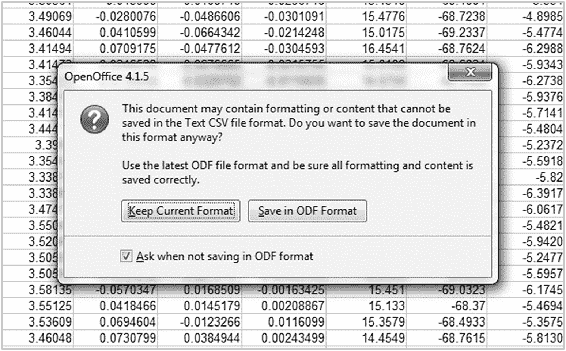

# 二、数据：机器学习的燃料

*   回顾一下数据爆炸和使这场机器学习革命成为可能的三大趋势。

*   介绍数据的重要性，重新编程自己，像数据科学家一样思考。

*   查看不同类别的数据。

*   回顾各种格式的非结构化数据，包括 CSV、ARFF 和 JSON。

*   使用 OpenOffice Calc 程序准备 CSV 数据。

*   查找和使用公开可用的数据。

*   介绍创建您自己的数据的技术。

*   引入预处理技术以提高数据质量。

*   用 JavaScript 可视化数据(项目)。

*   为 Android 实现数据可视化(项目)。

## 2.1 大趋势

Why is the ML revolution happening now? It is not the first time. In Chapter 1, I reviewed the previous AI booms and subsequent winter periods. How do we know if this time it is for real? Three transformational megatrends are responsible for the movement.

> *三个* *大趋势* *为我们现在正在经历的机器学习革命铺平了道路:*

> *1)数据爆炸*

> *2)访问高度可扩展的计算资源*

> *3)算法的进步*

值得对这些大趋势进行更深入的探究。

### 数据爆炸

您可能已经看到过那些关于每天创建的数据量的疯狂统计。IBM 有一个被广泛引用的统计数据，表明今天互联网上 90%的数据是自 2016 年以来创建的。在 2016 年之前，大量数据肯定已经存在，所以这项研究证实了我们已经知道的事情:今天的人和设备正在以前所未有的速度产生大量数据。IBM 表示，每天产生超过 2.5 艾字节(25 亿吉字节)的数据。

How much data is actually out there, and what are the sources of the data? It is hard to know with any degree of certainty. The data can be broken down into the following categories :

*   互联网社交媒体

*   互联网非社交媒体

*   移动设备数据

*   传感器数据

*   公开日期

*   政府数据

*   私人数据

*   综合数据

Table 2-1 attempts to provide some insight into each category.Table 2-1

数据类别

<colgroup class="calibre12"><col class="tcol"> <col class="tcol"></colgroup> 
| 

数据类别

 | 

观察

 |
| --- | --- |
| 互联网数据 | 全球有 38 亿桌面互联网用户。 |
| 2017 年，用户每分钟观看 400 万个 YouTube 视频。 |
| 2017 年每天有 50 亿次谷歌搜索。 |
| 社交媒体数据 | 每天有 6.55 亿条推文。 |
| 每天有 100 万个新的社交媒体账户。 |
| 有 20 亿活跃的脸书用户。 |
| Instagram 帖子每天增加 6700 万条 |
| 移动设备数据 | 2017 年每天发送 220 亿条短信。 |
| 有 35 亿移动设备互联网用户。 |
| 2017 年售出 4000 万台可穿戴设备。 |
| 91%的人拥有移动设备。 |
| 传感器数据 | 56%的人拥有智能设备。 |
| 到 2020 年，将有 250 亿个物联网。 |
| 到 2020 年，单个传感器的数量可能超过 1 万亿。 |
| 物联网(IoT)市场完全是关于传感器的。物联网市场预计将从 2014 年的 3 万亿美元增长到 2020 年的 9 万亿美元，CAGR 为 20%。 |
| 公开日期 | 研究机构提供大型数据集。比如加州大学尔湾分校(UCI)就有很多有用的数据集: |
| GitHub 上牛逼的公开数据集:[*【https://github.com/awesomedata/awesome-public-datasets】??*](https://github.com/awesomedata/awesome-public-datasets) |
| CIA World Factbook 提供了 267 个国家的历史、人口、经济、政府、基础设施、军事等信息:[*【www.cia.gov/library/publications/the-world-factbook/】??*](http://www.cia.gov/library/publications/the-world-factbook/) |
| AWS 公共数据集是一个庞大的公共数据资源，包括 1000 基因组计划和 NASA 的地球卫星图像数据库:[*【https://aws.amazon.com/datasets】*](https://aws.amazon.com/datasets) |
| 政府数据 | 人口普查数据。 |
| 债务和融资数据。 |
| 选举委员会数据。 |
| 美国政府承诺在网上免费提供所有政府公共数据:[*【https://data.gov】*](https://data.gov) |
| 私人数据 | 由于具有加速度计和 GPS 功能的低成本传感器设备和智能手机的可用性，个人越来越多地收集自己的数据。 |
| 综合数据 | 模拟真实数据的计算机生成的数据。 |

As Table 2-1 suggests, there are many types of data. If you require a specific type of data for your ML project, a quick Google search will probably identify a dataset that can at least get you started on a proof of concept.

> 今天，我们几乎可以数字化任何东西。一旦数字化，数据就有资格进行机器学习。

You have heard the term “big data.” Similar to the terminology used in ML, the usage of this term is also inconsistent. Table 2-2 shows some guidelines for relative data sizes and the related architectures.Table 2-2

相对数据大小

<colgroup class="calibre12"><col class="tcol"> <col class="tcol"> <col class="tcol"> <col class="tcol"></colgroup> 
| 

名字

 | 

大小

 | 

数据库ˌ资料库

 | 

体系结构

 |
| --- | --- | --- | --- |
| 正常数据 | < 1GB | 平面/SQL | 当地的 |
| 小数据 | 1GB - 100GB | NoSQL | 当地的 |
| 中等数据 | 100GB - 1TB | NoSQL | 分布式的 |
| 大数据 | 超过 1TB | hadoop spark | 分布式多集群 |

通常，大数据是指大于 1tb 的数据集。

您可能没有在项目中处理大数据规模的数据，但是在设计 ML 项目时考虑数据可伸缩性是很重要的。当今存在的大部分数据是非结构化的。这意味着它没有被标记或分类。它通常基于文本，并不真正遵循预定义的结构。我将在第三章讨论非结构化数据。

两章 2 和 3 都展示了帮助驯服数据爆炸的工具。

### 高度可扩展的计算资源

如果没有存储和处理数据的能力，数据爆炸是不可能的。第二个大趋势是我们今天拥有的高度可扩展的计算资源。

Cloud service providers have changed the game for practitioners of ML. They give us on-demand highly scalable access to storage and computing resources. These resources are useful for many ML functions, such as the following:

*   存储:我们可以使用云服务作为 ML 数据的存储库。

*   CPU 资源:通过配置具有大 CPU 容量的高可用性分布式计算集群，我们可以更快地创建 ML 模型。

*   托管:我们可以使用 API 或其他接口方法提供对数据或 ML 模型的托管访问。

*   工具:所有的云提供商都有一整套工具，我们可以用来创建 ML 解决方案。

第三章将详细介绍云提供商的潜在 ML 用例。

### 算法的进步

第三个大趋势是 ML 算法的进步。最大似然算法已经存在很长时间了。然而，一旦数据和 IaaS 提供商开始出现爆炸式增长，优化其性能的新努力就开始了。

DL 神经网络算法的进步是最重要的。然而，CML 算法也取得了进步。第四章将详细讲解算法。

## 2.2 像数据科学家一样思考

对于一个成功的 ML 项目来说，数据是唯一最重要的因素。你需要高质量的数据，而且你需要大量的数据。

数据挖掘就是处理你的数据，找出隐藏的模式。ML 采取了应用算法来处理数据的额外步骤。数据是每个学科的基本要素。在 DM 和 ML 中，您经常处理大型的、结构松散的数据集。

在构建能够有效处理数据的 ML 模型之前，您需要很好地理解您的数据。在 Nate Silver 的《信号与噪音》 中，作者鼓励我们对自己的数据拥有所有权。这真的是像数据科学家一样思考的本质。

作为软件工程师，我们习惯于思考代码。对我们来说，代码一直是最重要的。回想一下第一章，我颠倒了开发方法，将数据放在 ML-Gates 的前面，并将编码阶段保持到最后。

Mr. Silver summed it up perfectly:

> 数字本身无法说明问题。我们为他们说话。数据驱动的预测可以成功，也可以失败。当我们否认自己在这个过程中的角色时，失败的几率就会增加。在我们对数据提出更多要求之前，我们需要对自己提出更多要求。”

在今天的 ML 世界中，你必须从考虑数据如何影响你的解决方案开始，决定你有什么数据，你如何组织它，然后让数据驱动你的软件架构。

### 数据命名

A first step in taking ownership for your data is classifying the type of data itself. Before you can understand which algorithm is best suited for your well-defined ML problem, you need to understand the nature and type of the data you possess. Table 2-3 shows the two broad types of data.Table 2-3

常规数据类型摘要

<colgroup class="calibre12"><col class="tcol"> <col class="tcol"> <col class="tcol"></colgroup> 
| 

数据类型

 | 

描述

 | 

例子

 |
| --- | --- | --- |
| 质量数据 | 观察结果分为不同的类别。数据是离散的，因为每个观察值可能属于有限数量的类别。 | 最喜欢的颜色:蓝色、绿色、棕色 |
| 数据 | 当观察值是计数或测量值时，就会产生定量或数值数据。 | 人的身高 |

Qualitative data , classified as

*   如果类别之间没有自然顺序，则为名义上的(如眼睛颜色)。

*   如果存在排序，则为序数(如考试分数或班级排名)。

Quantitative data , classified as

*   离散，如果测量值是整数(如城市或国家的人口)。

*   连续的，如果测量值可以取任何值，通常在某个范围内(如一个人的身高或体重)。

### 定义数据

回想一下第一章，MLG5 要求您识别和定义您的数据。接下来，您将对一个数据集执行此任务，该数据集将用于本书后面的项目，即 Android Activity Tracker 应用程序。

表 2-4 中显示的数据来自 PAMAP2_Dataset，可从第一章中提到的加州大学欧文分校(UCI)机器学习库中获得。这是免费提供的数据，在用于研究目的时没有任何限制。您可以通过下面的链接下载数据集。由于数据集的大小，它不包括在图书资源中。这些文件很大，所以下载需要一些时间。

[***http://archive . ics . UCI . edu/ml/datasets/pamap 2+身体+活动+监控***](http://archive.ics.uci.edu/ml/datasets/pamap2+physical+activity+monitoring)

To collect this data, the researchers asked subjects to wear sensors while performing various activities. The table shows each of the fields together with a data type assigned.Table 2-4

定义您的数据

<colgroup class="calibre12"><col class="tcol"> <col class="tcol"> <col class="tcol"> <col class="tcol"></colgroup> 
| 

字段(列)

 | 

单位

 | 

例子

 | 

数据类型

 |
| --- | --- | --- | --- |
| 时间戳 | 秒 | Three point three eight | 定量连续 |
| 活动 ID | 1 躺 2 坐 3 站 4 走 5 跑 6 骑自行车 7 北欧 | Two | 定性名义 |
| 心率 | 每分钟的节拍数 | One hundred and four | 定量离散 |
| 传感器 1:温度 | 摄氏度 | Thirty | 定量离散 |
| 传感器 1: 3D 加速度 | ms -2 | 2.37223 | 定量连续 |
| 传感器 1: 3D 加速度 | ms -2 | 8.60074 | 定量连续 |
| 传感器 1: 3D 陀螺仪 | 我喜欢 | 3.51058 | 定量连续 |
| 传感器 1: 3D 磁力计 | 超声试验 | 2.43954 | 定量连续 |
| 传感器 1:方向 | 拉德 | 8.76165 | 定量连续 |

当涉及到您的数据时，识别您拥有的数据类型是对自己要求更高的第一步。当您为数据构建分类器时，您将仔细查看第 [7](https://doi.org/10.1007/978-1-4842-3951-3_7) 章中的 PAMAP2_Dataset。

## 2.3 数据格式

Data format is a key consideration when building ML models. Table 2-5 shows the important file formats and their common file extensions.Table 2-5

常见数据文件类型

<colgroup class="calibre12"><col class="tcol"> <col class="tcol"></colgroup> 
| 

文件格式

 | 

文件扩展名

 |
| --- | --- |
| 文本文件 | . txt.dat |
| 包括 MS Excel 和 OpenOffice Calc 在内的所有电子表格包都支持逗号分隔值(CSV) | 。战斗支援车 |
| Weka 支持的属性关系文件格式 | 。飞机救援消防 |
| 互联网上广泛使用的 JavaScript 对象符号(JSON)标准交换格式 | . json .txt 文件 |

当您为 ML 项目定位数据时，它可能是任何格式的。纯文本文件很常见。数据文件通常是。txt 或者。dat 文件，两者都是文本文件。表 2-1 中引用的加州大学欧文分校存储库中的许多数据文件是。dat 文本文件。

The first step in using text data files for ML is to open them and understand how they are structured. You can use any text editor. Figure 2-1 shows the ***subject101.dat*** file from the PAMAP2_Dataset. Figure 2-1

在文本编辑器中打开的 PAMAP2_Dataset 中的文件 subject101.dat

You can see that spaces separate the data fields. Each row contains 54 values or columns separated by a single space character. Note that Figure 2-1 does not show all of the columns. The easiest way to work with datasets for ML is to convert them to CSV. The first step is to make a copy of the .dat file and then rename it as .csv. Figure 2-2 shows the list of all files in the PAMAP2_Dataset, with the newly created .csv copy file. Figure 2-2

PAMAP2_Dataset。dat 文件到。战斗支援车

仅仅因为您将文件重命名为. csv 并不意味着它就是这样。你必须转换它。通过执行全局搜索并将空格替换为逗号，可以用您的文本编辑器执行转换，但是还有更好的方法。你将使用一个电子表格程序。

### CSV 文件和 Apache OpenOffice

电子表格程序的优点是允许你对我们的数据做一些基本的编辑。它们还允许您轻松导入或导出 CSV 文件。

Microsoft Excel 可以完成这项工作，但 Apache 开源程序 OpenOffice 是更好的选择。OpenOffice 包含一个电子表格、文字处理器、演示包、数据库、矢量图形编辑器和数学公式编辑器。你对电子表格程序 Calc 感兴趣。您需要下载整个套件。

Calc has several advantages over Excel, including

*   Calc 是免费的开源软件，在 Apache 2.0 软件许可下获得许可。它是 OpenOffice 套件的一部分。

*   Calc 更擅长导入导出 CSV 文件。还有更多的选项可用，比如对引号(" ")中的文本字段进行转义。

*   Calc 支持数据字段的 UTF-8 编码。这一点很重要，尤其是当您的项目使用国际字符集或多字节字符集时。

*   Calc 支持 BOM 处理。BOM 代表字节顺序标记。Windows 系统使用 BOM 作为每个文件的第一个字符来通知应用程序字节顺序。在 Windows 中创建的包含 BOM 的文件在其他平台(如 Unix)上可能会有问题。当你在 Calc 中保存文件时，Calc 让你指定你想要如何处理 BOM(非常周到；谢谢阿帕奇)。

Figure 2-3 shows the installation screen for Apache OpenOffice. The OpenOffice download link is [***www.openoffice.org/download/***](http://www.openoffice.org/download/) . Figure 2-3

安装 Apache OpenOffice

Once you have installed OpenOffice, launch Calc. If you are familiar with the Microsoft Office suite, you will notice that Calc looks similar. Open the ***subject101.csv*** file you copied earlier. Figure 2-4 shows that Calc recognizes it as a text file and give you some import options on the text import window. Figure 2-4

OpenOffice Calc 导入 CSV 文件

Calc 允许您为每个检测到的字段选择字符集、字段分隔符，甚至是列类型。该数据最重要的设置是选择空格作为分隔符。检查完空格后，您将看到文本导入窗口底部显示的字段中正确填充了数据。

After you click OK, Calc will import the data.

> 您将使用的 PAMAP2_Dataset 很大。仅单个文件***subject 101 . dat****就包含 54 列和 376417 行。这是一个很大的电子表格，所以给 Calc 一些时间来导入或导出文件。*

Figure 2-5 shows the file after importing into Calc. Figure 2-5

导入 OpenOffice Calc 的 subject101.dat 文件

The advantage of using Calc over a text editor is that once Calc completes the import, it is easy to view and manipulate the data. Some common operations for manipulating ML data in Calc are as follows:

*   您可以搜索缺少的值。这个文件中的数据相对干净。缩写“NaN”代表“不是数字”,代表缺失值。列 C 主要包含 NaN 值。

*   添加或删除列很容易。如果您希望删除某列，只需突出显示该列，右键单击并删除即可。移除不需要的列减小了大小，因此减少了导入、导出和训练 ML 模型所需的时间和存储空间。

*   宏可以根据条件(如单元格的值)删除行或列。例如，如果您想要删除数据中所有缺少的值行，这将非常有用。Calc 可以使用 Excel 宏。它还允许你记录击键。

*   您可以使用“，”作为分隔符，以真正的 CSV 格式导出文件。

Figure 2-6 shows the save dialog box for the CSV file export. Click the “Keep Current Format” box to save a CSV file. Figure 2-6

保存 CSV 文件

大多数 ML 环境都允许直接导入 CSV 文件，Apache OpenOffice Calc 是准备此类文件的最佳方式。CSV 是您可以用于 ML 的最简单的数据格式。接下来，您将看到更复杂的其他方法。

### ARFF 档案

ARFF is an abbreviation for Attribute-Relation File Format. It is an extension of the CSV file format. The Weka machine learning environment uses ARFF files to load data. Weka comes with many sample datasets. The iris flower dataset is one of the most famous in machine learning. The following code block shows a partial view of the iris.arff dataset included with the environment:001   @relation iris-weka.filters.unsupervised.attribute.Remove-R1-2 002   % Iris.arff file available with the Weka distribution (partial file) 003 004   @attribute petallength numeric 005   @attribute petalwidth numeric 006   @attribute class {Iris-setosa,Iris-versicolor,Iris-virginica} 007 008   @data 009   1.4,0.2,Iris-setosa 010   1.4,0.2,Iris-setosa 011   1.3,0.2,Iris-setosa 012   1.7,0.2,Iris-setosa 013   1.5,0.4,Iris-setosa 014   1,0.2,Iris-setosa 015   1.7,0.5,Iris-setosa 016   1.9,0.2,Iris-setosa 017   1.5,0.2,Iris-setosa 018   1.4,0.2,Iris-setosa 019   4.7,1.4,Iris-versicolor 020   4.5,1.5,Iris-versicolor 021   4.9,1.5,Iris-versicolor 022   4,1.3,Iris-versicolor 023   3.3,1,Iris-versicolor 024   4.2,1.3,Iris-versicolor 025   6.6,2.1,Iris-virginica 026   5.4,2.3,Iris-virginica 027   5.1,1.8,Iris-virginica Note that the familiar CSV data follows the ***@data*** directive at the bottom of the file. In ARFF files, an additional header at the top provides metadata about the data and labels. The following describes the differences between CSV and ARFF file formats:

*   注释从注释行前面的百分号%开始。

*   ***@relation*** 指令启动文件并允许您指定数据集的名称。

*   ***@attribute*** 指令定义了数据集中每个属性的名称和数据类型。

*   ARFF 文件的头段(在 ***@data*** 指令上面)可以包含空行。

*   名义数据，比如***@属性类*** ，后面是它们可以采用的一组值，用花括号括起来。

*   CSV 数据遵循 ***@data*** 指令。

*   数据集中未知或缺失的值用问号“？”表示。。

Weka 包括将 CSV 数据转换为 ARFF 格式的转换工具。一旦生成了初始的 ARFF 文件，就没有必要再进行转换了。

### 数据

CSV 和 ARFF 文件非常有用。然而，CSV 数据的平面结构没有提供太多的灵活性。您的工具箱中需要一个额外的工具来帮助您表示更复杂的数据结构。

作为 Java 或 Android 开发人员，您可能对 JSON 很熟悉。JSON 代表 JavaScript 对象符号。它是一种非常轻量级的、基于文本的、灵活的交换格式。JSON 是一种广泛用于服务器和客户端设备之间的数据交换格式。

你可以在[`json.org`](https://json.org)了解更多关于 JSON 如何工作的信息，并找到所有平台的下载。

JSON has several important properties that have helped to make it hugely popular across the Internet and especially for mobile app development:

*   JSON 对于我们来说很容易读写，对于机器来说也很容易解析和生成。

*   几乎每个平台和语言都有一个 JSON 库。

*   JSON 基于 JavaScript 编程语言的子集，因此得名。

*   JSON 是一种文本格式，与语言无关。

*   JSON 使用 C 语言系列的程序员熟悉的约定。

JSON 使用简单但功能强大的 ***数组*** 和 ***对象*** 集合来表示数据。名称/值对通常表示对象中的数据。这使得 JSON 在整个互联网上非常流行。JSON 的灵活结构使它能够表示非常复杂的数据关系。

In JSON, the placement of parenthesis and brackets to represent arrays and objects is very important. Figure 2-7 shows valid construction rules for JSON structures. Figure 2-7

JSON 结构定义

注意(左括号)和和{(左括号)和}(右括号)在 JSON 中作为标识符的用法。

JSON 由两个原语组成，对象和数组，以及可以是字符串、数字、对象、数组或布尔值的值。JSON 出奇的简单，如图 2-7 所示。

Using only the following two primitives, you can construct complex structures to represent almost any type of data relationship:

*   JSONObject:名称/值对的无序集合或集合

*   JSONArray:值的有序列表

Both JSON objects and JSON arrays contain values. A value can be any of the following:

*   双引号中的字符串

*   一个数字

*   真实的

*   错误的

*   空

*   另一个 JSON 对象

*   另一个 JSON 数组

Notice that values can also be JSON objects or JSON arrays. This feature of JSON provides the secret that makes it so powerful:

> JSON *是一种强大的表示结构的方式，因为它允许 JSON 对象和 JSON 数组结构的嵌套。*

Recall the ***iris.arff*** file discussed in the last section. You can also represent this data using JSON, as shown in part in Listing 2-1. Note that just like the ARFF file, the JSON representation also contains a header and a data section.001   { 002       "header" : { 003           "relation" : "iris", 004           "attributes" : [ 005               { 006                   "name" : "sepallength", 007                   "type" : "numeric", 008                   "class" : false, 009                   "weight" : 1.0 010               }, 011               { 012                   "name" : "sepalwidth", 013                   "type" : "numeric", 014                   "class" : false, 015                   "weight" : 1.0 016               }, 017               { 018                   "name" : "petallength", 019                   "type" : "numeric", 020                   "class" : false, 021                   "weight" : 1.0 022               }, 023               { 024                   "name" : "petalwidth", 025                   "type" : "numeric", 026                   "class" : false, 027                   "weight" : 1.0 028               }, 029               { 030                   "name" : "class", 031                   "type" : "nominal", 032                   "class" : true, 033                   "weight" : 1.0, 034                   "labels" : [ 035                       "Iris-setosa", 036                       "Iris-versicolor", 037                       "Iris-virginica" 038                   ] 039               } 040           ] 041       }, 042       "data" : [ 043           { 044               "sparse" : false, 045               "weight" : 1.0, 046               "values" : [ 047                   "5.1", 048                   "3.5", 049                   "1.4", 050                   "0.2", 051                   "Iris-setosa" 052               ] 053           }, 054           { 055               "sparse" : false, 056               "weight" : 1.0, 057               "values" : [ 058                   "4.9", 059                   "3", 060                   "1.4", 061                   "0.2", 062                   "Iris-setosa" 063               ] 064           }, 065           { 066               "sparse" : false, 067               "weight" : 1.0, 068               "values" : [ 069                   "5.9", 070                   "3", 071                   "5.1", 072                   "1.8", 073                   "Iris-virginica" 074               ] 075           } 076       ] 077   } Listing 2-1

iris.json，iris.arff 数据集的 json 表示

如果您想尝试 json 格式的 iris 数据集，可以在参考资料一书中找到文件 ***iris.json*** 。

You might be asking why we need JSON for data files when we already have CSV and ARFF that are perfectly capable of representing data for ML. There are two reasons you may want to consider using JSON:

*   JSON 是网络数据交换的理想选择。如果您需要将数据发送到联网设备，使用 JSON 和 HTTP 是一项简单的任务，但是使用 CSV 和 ARFF 就不那么简单了。

*   许多 NoSQL 数据库使用 JSON 文件作为数据的对象存储。我将在第三章进一步讨论这些数据库。这种数据库架构解决了大量数据带来的可伸缩性问题。

JSON 文件总是比 CSV 或 ARFF 版本大，因为它们包含缩进的结构和空间。文件大小的增加是对 JSON 提供的额外灵活性的公平权衡。

Weka 桌面环境使得 ARFF 和 JSON 之间的转换变得很容易。你将在第四章中探索 Weka。

## 2.4 JSON 集成

JSON 是 ML 解决方案的重要组成部分。JSON 的优势之一是几乎每个开发平台都有库。它是真正的跨平台。因为您关注的是 Java，所以接下来您将研究如何集成 JSON for Android 和 Java JDK。

### 带有 Android SDK 的 JSON

JSON has been included in Android since the earliest release of the SDK. Table 2-6 shows a list of the Android JSON classes including the exception handler.Table 2-6

Android SDK 中包含的 JSON 类

<colgroup class="calibre12"><col class="tcol"> <col class="tcol"></colgroup> 
| 

班级

 | 

描述

 |
| --- | --- |
| ***JSONArray*** | 密集的索引值序列 |
| ***【jsonobject】*** | 一组可修改的名称/值映射 |
| ***【jsconstraint inger】*** | 实现了***JSON object . tostring()***和***JSON array . tostring()*** |
| ***【jsontokener】*** | 将 JSON 编码的字符串解析为相应的对象 |
| **JSONException** | 抛出表示 JSON API 有问题 |

The ***JSONArray*** and ***JSONObject*** objects are all you need to manage your JSON encoding and decoding. The following code shows how to define JSON objects and JSON arrays in Android:001   // Define a new JSON Object 002   // Remember that JSON Objects start with { (left brace) and end with } (right brace) 003 004   JSONObject jsonObject = new JSONObject(myJsonDataString); 005 006   // Define a new JSON Array 007   // Remember that JSON Arrays start with [ (left bracket) and end with ] (right bracket) 008 009   JSONArray jsonArray = new JSONArray(myJsonDataString);

有效使用 JSON 的诀窍在于使用 JSON 对象和 JSON 数组原语定义 JSON 数据结构来表示您的数据。你将在本章的后面探索如何实现这一点。

### 带有 Java JDK 的 JSON

虽然 JSON 类从一开始就包含在 Android SDK 中，但 Java JDK 却不是这样。要在 Java 中使用 JSON，必须包含 JSON 库。

There are many JSON libraries available for Java. Table 2-7 shows two common sources for Java JDK JSON libraries.Table 2-7

Java JDK 的 JSON 库

<colgroup class="calibre12"><col class="tcol"> <col class="tcol"></colgroup> 
| 

JSON 源代码

 | 

环

 |
| --- | --- |
| 谷歌 JSON 简单 | [*【https://code.google.com/archive/p/json-simple/】*](https://code.google.com/archive/p/json-simple/) |
| Maven JSON 存储库 | [*【https://mvnrepository.com/artifact/org.json/json】*](https://mvnrepository.com/artifact/org.json/json) |

Maven 存储库很有用，因为它允许您下载 Eclipse 的 jar 文件。Maven 资源库中有许多版本的 JSON。20171018 版本运行良好，可从以下链接获得:

[*【https://mvnrepository.com/artifact/org.json/json/20171018】*](https://mvnrepository.com/artifact/org.json/json/20171018)

Figure 2-8 shows the download page for this version of Java JSON. The page contains instructions for many different types of build environments, including Maven, Gradle, SBT, Ivy, and others. The Java build environment you use will determine how you include the JSON library. Figure 2-8

Java JSON 的 Maven 仓库

如果您希望下载 Eclipse 的 jar 文件，请选择“JSON Libraries”并下载 jar zip 文件。然后，您可以直接将 jar 文件库添加到 Eclipse Java 构建路径中。

Figure 2-9 shows the ***json-20171018.jar*** file added to the Eclipse Java build path. Figure 2-9

JSON jar 库的 Eclipse IDE Java 构建路径

将 JSON 添加到 Java JDK 之后，您现在可以利用 JSON 的强大功能来满足您所有的 ML 数据结构需求。无论您是使用 Eclipse 的外部 Java JSON 库还是 Android Studio 中的内置 Android JSON 库，您编写的用于 JSON 对象和数组的 Java 应用程序代码都是相同的。

## 2.5 数据预处理

One of the key activities for ML-Gate 5 is data preprocessing . There are many potential actions you can take in this area to improve the quality of your data. This section does not include an exhaustive list. Nor does it provide a deep dive into the mathematical or statistical principles behind each technique.

> 了解您的数据是无可替代的。这是一项耗时的手工练习。提前投入时间分析数据以提高数据的质量和完整性，在 ML 项目的后期总是有回报的。

请将以下部分视为一个清单。在选择 ML 算法、构建 ML 模型或编写任何代码之前，您可以使用清单来探索数据的各个方面。随着时间的推移，数据清理会有回报。

### 实例、属性、标签和特征

At the top of the checklist is the identification of instances, attributes, labels, and features. ML-Gate 6 requires you to have a well-defined problem. This directly relates to understanding the structure of your data. Some important definitions:

*   **实例**:一行数据。实例是机器学习方案的输入。CSV 文件可以将实例表示为独立的列表，而 JSON 可以表示数据中的关系。

*   **属性**:一列数据。属性可以有不同的数据类型，如实数、整数、名义值或字符串。对于监督学习，存在属性、要素和标注的类型。

*   **特性**:描述性属性。

*   **标签**:你试图预测或预报的东西。

例如，如果您回顾表 2-3 中的数据，该表显示了 PAMAP2 数据集的属性(或列)。回想一下，在这个数据集中有 54 个属性(或列)。在这个数据集中， ***活动 Id*** 是标签，其余属性是特征。

Checklist questions to ask:

1.  1.

    所有实例的结构是否一致？

2.  2.

    有多少实例？

3.  3.

    有多少属性？

4.  4.

    数据集的格式和原始文件大小是什么？

5.  5.

    属性包含标签还是所有属性都是特征？

6.  6.

    是否所有标签都包含合规值？

7.  7.

    以后可以添加新属性吗？

8.  8.

    如果添加一个新属性，如何更新新属性的现有实例？

最后两个问题特别重要，因为数据集会随着时间的推移而增长和发展。当您添加新的属性时，实际上在更改之前的每个实例中都缺少该属性的值。在下一节关于缺失值和重复值的内容中，我将讨论一些处理这种情况的技术。

### 数据类型识别

Table 2-2 summarized the data types for ML datasets. Define the data type of each attribute in your dataset. The data types can be either

*   定性数据(名义数据或序数数据)

*   定量数据(离散或连续)

一些公司为他们所有的软件项目维护一个数据字典。数据字典表示所有数据资产的正式记录，包括每个属性的数据类型。这是最佳实践。维护数据字典会产生开销，但是正如数据清理随着时间的推移会有回报一样，数据组织知识也会有回报。

Checklist questions to ask:

1.  1.

    数据集中的每个属性都有定义的数据类型吗？

2.  2.

    在项目生命周期中，当做出影响数据设计的更改时，数据类型是否会更新？

### 缺失值和重复值

缺失值和重复值是数据预处理的一个重要方面。

缺失值可以采用空白、破折号或 NaN 的形式，如您在 PAMAP2_Dataset 中所见。

Missing values are not hard to find. The difficulty lies with what action you should take when you find them. Missing values tend to fall into two categories:

*   MCAR(完全随机失踪)

*   系统性缺失:价值缺失是有原因的。

值丢失并不能说明值丢失的原因。当您发现缺少值时，您必须仔细考虑解决方案。大多数最大似然算法不重视缺失值。用生成的值替换丢失的值有时可以提高整体数据的完整性。这完全取决于数据的上下文。

There are multiple approaches you can consider when handling missing values. When you have familiarity with the data and the collection methodology, you can make an informed judgement and select one of the following approaches:

*   不要采取行动。保留丢失的值。

*   将该值替换为“未测试”或“不适用”指示器。在这种情况下，您添加了细节并提高了数据完整性，因为您主动知道某个值不应该出现。

*   如果标签包含缺少的值，您应该考虑删除整个实例，因为它不会为您定型的模型增加值。

*   如果数据类型为定量和范围限制，则为缺失值分配范围下限或范围上限。有时，您有一个范围内的规范化值，分配一个最小值或最大值可以使算法更有效。

*   为缺失值估算一个值。估算是指在研究其他属性的基础上用新值替换该值。

重复并不总是容易找到的。一旦找到，它们就相对容易处理。它们可以被删除，或者如果可行的话，如果不是所有属性都重复，它们可以与其他实例组合。

Checklist questions to ask:

1.  1.

    数据集有重复的值吗？如何找到重复的值？存在重复项时，如果数据集完整性增强，请删除该实例。

2.  2.

    数据集是否有缺失值？如何解决缺失值以最大化数据集完整性？

### 错误值和异常值

发现数据中的错误和异常值比识别缺失值和重复值更困难。

Let’s start with an example. The dataset shown in Figure 2-10 is a time series containing 24 data points. The graph shows data released by the Belgium Ministry of Economy. It represents international phone calls made during a 23-year period. Figure 2-10

24 个点的时间序列数据集

很明显，在七年的时间里，这些数据包含了几个异常值。知道了这些数据的来龙去脉，有些事情就说不通了。我们可以想象这样一个场景，这样一个数据集是有意义的。例如，如果我们查看一家钢铁厂的生产量，并且我们知道有一个多年的时期，战争导致需求激增，会怎么样？这样的图表可能有意义。

然而，在这种情况下，数据没有意义。我们应该忽略异常值吗？

事实证明这个数据是错误的。在 1963 年至 1970 年期间，该部使用了不同的记录方法。受影响期间，数据代表**的总分钟数，而不是 ***的总通话数*** 。哎呀。**

 **即使我们不知道是什么导致了错误，我们仍然应该删除异常值，因为它们在数据的上下文中没有意义。我们可能不会注意到 1963 年和 1970 年的轻微影响，但保留它们不会产生剧烈的影响。

图表包括两条回归线。回归是一种简单的预测方法。在这种情况下，最小二乘法不是很准确，因为它很容易受到异常值的影响。最小中值平方回归方法在忽略异常值方面做得更好。

在这种情况下得到的教训是，我们需要评估异常值，然后选择一种 ML 方法，尽可能减少异常值的影响。

讽刺的是，机器学习可以检测异常值。一类学习是 ML 用于这个任务的特殊类。

Checklist questions to ask:

1.  1.

    数据的可视化会显示异常值吗？

2.  2.

    异常值在数据环境中有意义吗？如果是这样，考虑删除离群值。

3.  3.

    如果异常值持续存在，考虑一种可以合理容忍噪声数据的方法。

### 用 OpenOffice Calc 进行宏处理

在第三章，我会介绍 Weka ML 环境。Weka 使用其基于 Java 的工具具有许多预处理数据的能力。但是，您也可以使用 OpenOffice Calc 的宏处理功能来预处理您的数据。

学习使用 Calc 电子表格宏是一个非常强大的 ML 工具。宏允许您根据特定条件对数据文件进行批量更改。它们允许你自动化重复的任务。对于大型数据集，这可以节省您大量的时间和精力。Calc 就像 Microsoft Excel 一样，使用 Visual Basic 来处理宏。

与 Microsoft Excel 一样，Calc 对宏使用 Visual Basic 编程语言。不难掌握。Calc 宏可以自动执行您可以手动执行的任何电子表格操作。Calc 允许你记录击键来构建宏。Calc 还允许您手动输入宏代码。

OpenOffice 文档的第 [12](https://doi.org/10.1007/978-1-4842-3951-3_12) 章包含对 Calc 宏的精彩介绍:

[***www . open office . org/documentation/manuals/user guide 3/0312 cg3-calc macros . pdf***](http://www.openoffice.org/documentation/manuals/userguide3/0312CG3-CalcMacros.pdf)

OpenOffice wiki 页面上提供了 Calc 宏的其他文档:

[***https://wiki . open office . org/wiki/Documentation/ooo authors _ User _ Manual/Getting _ Started/Creating _ a _ simple _ macro***](https://wiki.openoffice.org/wiki/Documentation/OOoAuthors_User_Manual/Getting_Started/Creating_a_simple_macro)

The following code shows a useful macro for iterating through all rows in a Calc spreadsheet and displaying non-empty cells. Calc and the Visual Basic language contain a huge library of functions and the possibilities are endless.001   Sub TraverseRows 002      Dim oRange 'The primary range 003      Dim oSheet 'Sheet object 004      Dim oRows 'Rows object 005      Dim oRow 'A single row 006      Dim oRowEnum 'Enumerator for the rows 007      Dim s As String 'General String Variable 008 009      oSheet = ThisComponent.Sheets(3) 010      oRange = oSheet.getCellRangeByName("B6:C9") 011 012      oRows = oRange.getRows() 013 014      oRowEnum = oRows.createEnumeration() 015      Do While oRowEnum.hasMoreElements() 016         oRow = oRowEnum.nextElement() 017         s = s & NonEmptyCellsInRange(oRow, " ") & CHR$(10) 018      Loop 019      MsgBox s, 0, "Non-Empty Cells In Rows" 020   End Sub

如果您正在努力寻找对数据进行必要清理的方法，Calc 宏是一个很好的解决方案，尤其是对于 CSV 数据。

If you have huge spreadsheets, Calc macros might not offer the best performance for data cleaning and manipulation. The limitations of Apache OpenOffice Calc are

*   最大行数:1，048，576

*   最大列数:1，024

*   最大张数:256

### JSON 验证

如果使用 JSON 作为数据格式，需要在创建后验证 JSON。有许多在线工具可以执行 JSON 验证。它们中的许多都是开源的或者是用脚本语言创建的，所以如果您愿意，您可以在本地运行验证。

Figure 2-11 shows the JSON validation of the file you created earlier in the chapter by the online tool available at [***https://jsonlint.com***](https://jsonlint.com) . Figure 2-11

JSON 验证

运行您创建的任何 JSON 总是一个好主意，特别是如果您通过 JSON 验证手动创建它。

Checklist question to ask:

1.  1.

    用 JSON 表示数据吗？在建模之前验证所有 JSON 文件。

## 2.6 创建您自己的数据

在本章的前面，我将私有数据和合成数据列为潜在的数据源。我们生成这两类数据。合成数据代表由计算机创建的数据。我们都携带着有史以来最伟大的数据收集设备:智能手机。您可以利用其数据创建能力来解决第一章中提出的问题，即表 1-11 中所示的室内位置跟踪要求(R1)。接下来，您将探索这一需求的潜在解决方案。

### Wifi 聚集

我们的移动设备能够扫描 Wifi 和蓝牙网络。当你使用这些 Wifi 扫描应用程序时，你会注意到有许多 Wifi 信号分布在可用的频道上。当你在空间中移动时，这些信号代表数据。

Figure 2-12 shows a typical room that has three different Wifi access points (AP) visible to a device. The signal strength received by the device depends on many factors, such as proximity to the AP and obstructions within the space. The combined strength of these signals throughout the space can allow you to locate the device. Figure 2-12

使用 Wifi 信号强度进行室内定位

两种度量单位 dBm 和 RSSI 代表信号强度。RSSI 是一个相对指数，而 dBm 是一个绝对数字。对于 dBm，越接近 0 dBm，信号越好。Android 设备返回的相关 RSSI 在-100(最弱)到-55(最强)之间。

您将使用 Android***Wifi manager***从所有可见的 Wifi 接入点(AP)收集信号强度信息。移动电话用户熟悉设备状态栏中显示的四栏 Wifi 信号强度图标。Android 提供了一个名为***wifi manager . calculate signal level***的静态方法，在 0-4 的范围内计算信号电平。Android 使用这个值来生成信号强度图标。该方法还可以提供图 2-12 所示的 ***归一化*** 值。

As an example, let’s consider the simple code required to gather the Wifi signal strength data and save it in JSON format as the Android device moves around a room. Listing 2-2 shows the key Android code. This code is not a complete Android project, but the code excerpt file, ***WifiCollect.java*** is available in the book resources if you wish to leverage it when building your own project.001   private WifiManager wifi; 002   private JSONObject wifiResults = new JSONObject(); 003 004   @Override 005   public void onCreate() { 006       wifi = (WifiManager) this.getSystemService(Context.WIFI_SERVICE); 007 008       // register wifi intent filter 009       IntentFilter intentFilter = new IntentFilter(); 010       intentFilter.addAction(WifiManager.SCAN_RESULTS_AVAILABLE_ACTION); 011       registerReceiver(mWifiScanReceiver, intentFilter); 012 013       wifiResults = new JSONObject(); 014   } 015 016   private final BroadcastReceiver mWifiScanReceiver = new BroadcastReceiver() { 017       @Override 018       public void onReceive(Context c, Intent intent) { 019           if (intent.getAction().equals(WifiManager.SCAN_RESULTS_AVAILABLE_ACTION)) { 020               List<ScanResult> wifiScanList = wifi.getScanResults(); 021               for (int i = 0; i < wifiScanList.size(); i++) { 022                   String name = wifiScanList.get(i).BSSID.toLowerCase(); 023                   int rssi = wifiScanList.get(i).level; 024                   Log.v(TAG, "wifi-ssid: " + name + " => " + rssi + "dBm"); 025                   try { 026                       wifiResults.put(name, rssi); 027                   } catch (Exception e) { 028                       Log.e(TAG, e.toString()); 029                   } 030               } 031               saveData(); 032           } 033       } 034   }; Listing 2-2

WifiCollect.java-用于 Wifi 数据采集的示例 Android 代码

To summarize the key code in Listing 2-2:

*   您在 002 行定义了一个 ***JSONObject*** 。该对象将保存设备在扫描过程中识别的所有 Wifi 网络的名称(SSID)和信号强度。

*   在 ***onCreate()*** 方法中，使用 Android***wifi manager***创建一个 intent 并注册一个***broadcast receiver***。

*   因为你用的是 Wifi，记得在清单文件中包含***SCAN _ Wifi _ NETWORKS***和***ACCESS _ Wifi _ STATE***的权限。

*   你在 016 行定义了**。Android 在检测到新的 Wifi 网络时会通知 ***广播接收器*** 。**

***   第 022 行和第 023 行显示了从 Wifi 扫描中检索到的网络名称和信号水平。这些值存储在 JSON 对象的第 026 行。JSON 对象随着 ***广播接收器*** 接收新网络而增长。

    *   第 031 行显示了对 ***saveData()*** 函数的调用。这个函数将保存 JSON 对象以供处理。您可能希望通过网络将它发送到服务器，添加到 NoSQL 数据库，或者在内部使用它在设备上建立模型。** 

**This approach to determining indoor location is very accurate and can operate with very low latency. To achieve the result requires a two-step process:

1.  1.

    使用清单 2-2 中所示的代码绘制出您的空间并收集 Wifi 数据样本。对于您采集的每个样本，将其分配到一个标签上，以标识设备在空间中的位置。例如，您可能希望将目标空间划分为一个正方形网格，并为网格位置指定编号。

2.  2.

    一旦您收集了该空间的所有数据，就可以使用它来构建 ML 模型。然后，您可以使用该模型来预测您在房间中的位置。

使用 ML 进行室内定位是创建您自己的数据来解决 ML 问题的一个强大示例。为了使解决方案更加健壮，您可以对蓝牙信号实现相同的方法。

虽然这个例子说明了在设备附近收集和使用射频数据，但智能手机还擅长产生另一种类型的数据:传感器数据。我会在最后一章详细讨论传感器数据，包括 Java 设备和 Android 智能手机的 ML 传感器数据实现。

## 2.7 可视化

能够可视化您的数据非常重要。可视化使您能够轻松洞察数据。数据可视化是最好的工具之一，您可以将它添加到您的工具包中，以便对自己的数据提出更高的要求。

实现数据可视化的最佳方法之一是将第三方开源图形库与 web 浏览器或 Android WebView ***结合使用。应用这种方法，你可以用最少的代码生成惊人的可视化效果。***

### JavaScript 可视化库

Table 2-8 shows a partial list of visualization libraries available. JavaScript is the language of choice for most of these libraries because it provides the following benefits:

*   所有现代浏览器都支持 JavaScript，包括 Android 的 WebView 控件。这意味着您创建的任何可视化都可以跨平台广泛使用。

*   JavaScript 擅长交互式功能。这使得你的可视化比静态图像更引人注目。

Table 2-8

JavaScript 可视化库

<colgroup class="calibre12"><col class="tcol"> <col class="tcol"></colgroup> 
| 

库/链接

 | 

描述

 |
| --- | --- |
| D3 加 d3plus.org | D3 加 2.0 版本。惊人的例子和可视化设置。 |
| 传单 leafletjs.com | 一个面向移动友好的交互式地图的开源 JavaScript 库。 |
| 时间线 JS timeline.knightlab.com | 开源工具，使任何人都能构建视觉丰富的交互式时间线。 |
| highcharts.com 排行榜 | 广泛使用的库。简单而强大的制图 API。需要许可证。 |
| fusioncharts.com 融合 | 网络和移动 JavaScript 图表。包括 90 多张图表和 1000 多张地图。免费。 |
| dygraphs.com dygraphs | 快速、灵活、开源的 JavaScript 图表库。允许用户探索和解释密集的数据集。 |
| Plotly plot.ly | 通过 Web 撰写、编辑和共享交互式数据可视化。 |
| Raw rawgraphs.io | 电子表格和数据可视化之间缺失的环节。 |
| chartjs.org 图表 | 简单、灵活的 JavaScript 图表。开源。不错的过渡和动画。 |
| Datawrapper datawrapper.de | 从数据到漂亮的图表。被很多记者使用。包月模式。 |
| chartblocks chartblocks . com . cn 上的信息 | 在线图表制作工具。包月模式。 |
| 谷歌图表 developers.google.com/chart | 简单易用，丰富的交互式图表库。免费。 |
| tableau . com 表格 | 拥有许多大客户的大型商业解决方案。纽交所上市。 |
| Infogram infogr.am | 提供完整产品的大型企业供应商。 |

表 2-8 中的库都非常有能力帮助你可视化你的数据。当您探索它们时，您可能会发现其中一个最符合您的要求。Highcharts 和 D3 Plus 是两个最流行的库。

### D3 加

D3 代表数据驱动文档。D3 是一个 JavaScript 可视化包。它很轻。D3 Plus 是 D3 的扩展。D3 Plus 目前支持的版本是 2.0 版。

You will explore D3 Plus in more detail for the following reasons:

*   D3 是一个基于 JavaScript 的，提供流畅的交互用户体验。

*   所有的现代浏览器都可以呈现 JavaScript，所以这对于 Java 和 Android 应用程序来说都是一个很好的解决方案。

*   D3 Plus 使得创建和显示 CSV 和 JSON 可视化变得非常简单。

*   免费开源。

D3 库、D3 Plus 和综合图表库的下载链接位于

[*【https://d3js.org】*](https://d3js.org)

[***【https://D3 plus . org***](https://d3plus.org)

***github . com/D3/D3/wiki/gallery***

接下来，您将在 D3 可视化项目中使用树状图表类。树形图是一种显示层次结构的树形图。D3 图库页面链接到位于[`bl.ocks.org/mbostock/4063570`](https://bl.ocks.org/mbostock/4063570)的树突图示例。

## 2.8 项目:D3 可视化

你在本章前面已经看到 CSV 和 JSON 是 ML 的有用数据格式。在这个项目中，您将为桌面浏览器实现 D3 可视化。

树形图对显示层次结构很有用。该项目将探索各种树状结构来可视化 CSV 和 JSON 数据。

Table 2-9 shows the project file summary. The book resources contain the zip file, ***d3_visualization.zip***, which includes all the project files.Table 2-9

D3 可视化项目文件摘要

<colgroup class="calibre12"><col class="tcol"> <col class="tcol"></colgroup> 
| 

**项目名称:D3 可视化** **来源:***D3 _ Visualization . zip***类型:桌面浏览器**

 |
| --- |
| 

文件

 | 

描述

 |
| --- | --- |
| ***d3.min.js*** | D3 库 |
| ***flare . CSV*** | CSV 数据文件 |
| ***flare . JSON*** | JSON 数据文件 |
| **dendo-CSV . html**??] | 使用 csv 数据的树状图示例 |
| **树-dendo-CSV . html**??] | 使用 csv 数据的树形图示例 |
| **径向 dendo-CSV . html**??] | 使用 csv 数据的径向树树状图示例 |
| ***collapse-tree-json.html*** | 使用 JSON 数据的可折叠树形图示例 |
| **丛集 dendo-json.html** | 使用 json 数据的聚类树状图示例 |

可视化就是选择最好的图形样式来表示数据。树形图非常适合 JSON 可视化，因为它们显示了层次结构。

在这个项目中，你有两个数据文件源， ***flare.csv*** 和 ***flare.json*** 。它们代表相同数据的不同文件格式。D3 能够将每个版本渲染成几个有趣的树状结构。如果您希望呈现另一种图表类型，代码可能与示例非常相似；只需查看 D3 图库中您想要的图表的代码示例。

要在浏览器中查看可视化，您必须设置一个 web 服务器来托管表 2-9 中所示的文件。如果您希望在您的桌面上本地查看它们，您可以安装本地 web 服务器，这取决于您的桌面平台。

If you need to install a web server, refer to the following platform-specific instructions:

*   Windows: IIS 是 Windows 上最流行的 web 服务器，但默认情况下不启用。要启用它，请遵循以下说明:

    [***https://msdn . Microsoft . com/en-us/library/ms 181052(v = vs . 80)。aspx***](https://msdn.microsoft.com/en-us/library/ms181052(v=vs.80).aspx)

*   Windows:您也可以在 windows 上安装 WAMP 软件。WAMP 代表视窗，阿帕奇网络服务器，MySQL，PHP。要安装 WAMP Windows 版，请按照以下说明操作:

    [***【www . wamp server . com/en/***](http://www.wampserver.com/en/)

*   Mac:苹果电脑预装了 Apache web server。

一旦你设置好你的网络服务器，只需将你的浏览器指向五个 HTML 文件中的一个。对于所选的数据格式类型，每个文件呈现的树形图略有不同。

D3 可视化需要最少的 JavaScript 代码。JavaScript 代码包含在 HTML 文件中。清单 2-3 展示了一个从 CSV 数据中呈现树状结构的***【dendo-csv.html】***文件的例子。

There are two key parts in the structure of any D3 based visualizations:

*   需要包含对 D3 库文件的引用。您可以使用库的本地副本或在线存储库。将库引用包含在 ***<脚本>*** 标签内(第 014 行)。

*   使用 ***d3.csv*** 赋值语句(第 025 行)指定要为可视化加载的 CSV 文件。

Note that Listing 2-3 includes the JavaScript code (lines 016-053) and the CSS style code (lines 004-010) used to format the visualization.001   <!DOCTYPE html> 002   <meta charset="utf-8"> 003 004    011 012   <svg width="1200" height="800"></svg> 013 014    015 016    Listing 2-3

dendo-csv.html

A dendogram aligns each of the lower-level leaf nodes, so the visualization appears right justified. Figure 2-13 shows the dendogram visualization of the CSV file that D3 generates when you open the ***dendo-csv.html*** file in your browser. Figure 2-13

由 dendo-csv.html 生成的树突图可视化

树突可视化显然比原始 CSV 文件更容易阅读。

如果你想改变树形图的样式，你可以在 HTML 文件的 004-010 行修改 CSS 元素。CSS 代表级联样式表。它是网页布局设计和样式的通用语言。它可以控制布局的所有方面，如字体、字体大小、边距、填充、间距、对齐等。

如果您希望更改呈现的树状结构的布局结构，可以修改构造树状结构的 JavaScript 代码。例如，线 045-046 控制所画的代表每个节点的圆的半径。

还有许多其他相关的可视化工具可用于描述 ML 数据。树形可视化是树形图的一种变体。可以把它想象成一个左对齐的树形图，其中节点随着树深度的增加而向右延伸。

Figure 2-14 shows the ***f lare.csv*** data file visualized as a tree. The tree display differs from the dendogram because of the way the JavaScript code renders the nodes. The ***tree-dendo-csv.html*** file actually gives you the choice to select whether you want the CSV data rendered as a dendogram or a tree. Figure 2-14

树木可视化渲染，tree-dendo-csv.html

您将使用 D3 生成的最终 CSV 可视化是放射树突图。一张图片胜过千言万语，放射树图可能是最艺术和最有用的可视化。对于大型数据集，树状图和树可能会变得很长，需要滚动才能查看整个可视化。放射状的树突充满了一个圆，所以它往往更紧凑，更容易看到。

Figure 2-15 shows a radial dendogram produced by ***radial-dendo-csv.html***. Even though the font may be small and there are many labels in the dataset, the radial dendogram gives you a good feel for the structure of your data. With practice, you can take a quick glance at a radial dendogram of your data and identify problems or irregularities. Figure 2-15

放射树状可视化，radial-dendo-csv.html

项目中最后两个可视化将使用 JSON 数据作为它们的来源。文件 ***f lare.json*** 是前三个可视化中使用的 ***f lare.csv*** 文件的 json 版本。

The ***cluster-dendo-json.html*** file structure is similar to the approach used with CSV data. The following code block assigns the JSON file in D3 at line 008:001   <!DOCTYPE html> 002   <meta charset="utf-8"> 003   <body> 004    Note that when loading JSON into D3, there are some requirements for the JSON structure. The JSON needs to be compatible with D3’s hierarchy rules. If you examine the ***f lare.json*** file, you will see that it is comprised of “name” and “children” nodes.001   { 002    "name": "flare", 003    "children": [ 004     { 005      "name": "analytics", 006      "children": [ 007       { 008        "name": "cluster", 009        "children": [ 010 011         ...

如果您的 JSON 数据不符合这种结构，您可能需要转换它，以便 D3 可以正确地解析和显示它。有一些工具可以处理这种转换。D3 包括一个名为 ***d3.nest()*** 的函数，还有一个名为 ***下划线. nest()*** 的外部函数。这些函数的文档和下载链接可以在

***【https://github . com/D3/D3 集合】***[***【https://github . com/iros/undercore . nest】***](https://github.com/iros/underscore.nest)

一旦 JSON 数据格式正确，D3 就可以呈现它了。

Figure 2-16 shows the cluster dendogram visualization of the JSON file as rendered by ***cluster-dendo-json.html***. Figure 2-16

cluster-dendo-json.html 聚类树状可视化

***Flare.json*** is a large file with many nodes. D3 uses this file for many of its visualization examples. If you look inside the HTML file, you will see the following line of code:<svg width="1200" height="2200"></svg>

这会将渲染窗口的高度设置为 2200 像素。这可能比你的显示器大，这意味着你必须滚动才能看到整个可视化。如果您降低高度以匹配您的显示大小，例如 1200 像素，您将看到可视化变得如此压缩以至于不再可读。

A solution to this problem is the collapsible tree. Remember, JavaScript is interactive. The collapsible tree visualization allows you to click on nodes to expand or contract them. Figure 2-17 shows the much cleaner collapsible tree visualization as rendered by ***collapse-tree-json.html***. Figure 2-17

collapse-tree-json.html 可折叠树

The collapsible tree is useful because it allows you to click on individual node to expand them. It does not leave your entire screen cluttered with the whole visualization. It is a much easier way to explore the data interactively. The ***collapse-tree-json.html*** file is larger than the other versions because it contains JavaScript code, such as the following function, to manage the interactive node navigation:001   // Toggle children on click. 002   function click(d) { 003     if (d.children) { 004       d._children = d.children; 005       d.children = null; 006     } else { 007       d.children = d._children; 008       d._children = null; 009     } 010     update(d); 011   } In this project, you covered five different data visualizations from the dendogram family: three with CSV source data and two with JSON source data.

> JavaScript 能产生出色的可视化效果。如果您浏览 D3 图库，您会发现适合您的数据的可视化，以及帮助实现可视化的示例 JavaScript 代码。

拥有一个可视化数据的 JavaScript 解决方案可以让您看到数据的样子。这些可视化可以很美，可视化的力量显而易见。与原始数据文件相比，可视化可以让您更好地感受数据的结构。这是理解数据并能够识别数据中隐藏模式的第一步。

随着 CSV 和 JSON 可视化在您的工具箱中，您已经开始 ***对自己的*** 数据提出更多要求。

## 2.9 项目:Android 数据可视化

这个项目将把你在桌面上用 D3 可视化所做的工作扩展到 Android 移动设备上。显示可视化可能不是你的 Android 应用的核心功能，但有时它可能对你的用户很有帮助。

Table 2-10 shows the project file summary.Table 2-10

项目文件摘要- Android 数据可视化

<colgroup class="calibre12"><col class="tcol"> <col class="tcol"></colgroup> 
| 

**项目名称:Android Data visualization source:*****Android _ Data _ vis . zip*****类型:Android**

 |
| --- |
| 

文件

 | 

描述

 |
| --- | --- |
| ***【app】>【src】>【mainandorsanifest . XML】*** | 配置文件。 |
| ***【app】>【src】>【main】>【RES】>【layout activity _ main . XML】*** | 用于显示 WebView 的布局文件。 |
| **【应用】>【src】>【main】>【asset SD 3min . jsflare . csvradial-dendo-CSV . html** | 资产，如果您决定使用资产的本地副本构建应用程序。如果从 web 服务器加载资产，则不需要。 |
| ***app->src->main->javaMainActivity.java*** | 加载和显示 D3 可视化的主 Java 源代码。 |

您已经看到 D3 可视化在桌面浏览器上工作，所以为 Android 设置它很简单。

你不用把一个可视化或者图表库导入到你的应用程序中，你可以走捷径，使用 Android 的 ***WebView*** 类来显示 D3 可视化。 ***WebView*** 是一个由 Chrome 驱动的系统组件，允许 Android 应用程序直接在应用程序中显示来自网络的内容。该类为您的应用程序提供了干净、集成的用户体验。和任何好的网络浏览器一样， ***WebView*** 支持 JavaScript，所以对于 D3 内容很好用。

Figure 2-18 shows the Android Data Visualization project in Android Studio. Figure 2-18

Android Studio 中的项目 Android 数据可视化

There are two methods to handle the D3 integration with ***WebView*** , depending on how you decide to manage access to the required files:

*   内部:将所需文件放在 app assets 文件夹中。

*   外部:从远程 web 服务器加载资产。

The following code from ***MainActivity.java*** shows how to set up a full screen ***WebView*** layout. A ***progressDialog*** provides an indication to the user that network content is loading, which is especially useful if the resources are loaded from external server. Lines 067-068 show the ***radial-dendo-csv.html*** file reference, depending on whether you choose the internal or external approach.001   package android.wickham.com.datavis; 002 003   import android.annotation.SuppressLint; 004   import android.app.Activity; 005   import android.app.ProgressDialog; 006   import android.content.DialogInterface; 007   import android.graphics.Color; 008   import android.os.Bundle; 009   import android.webkit.WebChromeClient; 010   import android.webkit.WebView; 011 012   public class MainActivity extends Activity { 013 014       private WebView webView; 015 016       @SuppressLint("SetJavaScriptEnabled") 017       @Override 018       protected void onCreate(Bundle savedInstanceState) { 019           super.onCreate(savedInstanceState); 020           setContentView(R.layout.activity_main); 021 022           webView = (WebView) findViewById(R.id.wb_webview); 023 024           //Scroll bars should not be hidden 025           webView.setScrollbarFadingEnabled(false); 026           webView.setHorizontalScrollBarEnabled(true); 027           webView.setVerticalScrollBarEnabled(true); 028           webView.setFitsSystemWindows(true); 029 030           //Enable JavaScript 031           webView.getSettings().setJavaScriptEnabled(true); 032 033           //Set the user agent 034           webView.getSettings().setUserAgentString("AndroidWebView"); 035 036           //Clear the cache 037           webView.clearCache(true); 038           webView.setBackgroundColor(Color.parseColor("#FFFFFF")); 039           webView.setFadingEdgeLength(10); 040           webView.getSettings().setBuiltInZoomControls(true); 041           webView.getSettings().setDisplayZoomControls(false); 042 043           final Activity activity = this; 044           final ProgressDialog progressDialog = new ProgressDialog(activity); 045           progressDialog.setProgressStyle(ProgressDialog.STYLE_SPINNER); 046           progressDialog.setProgressStyle(ProgressDialog.THEME_HOLO_LIGHT); 047           progressDialog.setCancelable(true); 048 049           webView.setWebChromeClient(new WebChromeClient() { 050               public void onProgressChanged(WebView view, int progress) { 051                   progressDialog.setCanceledOnTouchOutside(true); 052                   progressDialog.setTitle("Loading visualization ..."); 053                   progressDialog.setButton("Cancel", new DialogInterface.OnClickListener() { 054                       public void onClick(DialogInterface dialog, int which) { 055                           webView.destroy(); 056                           finish(); 057                       } }); 058                   progressDialog.show(); 059                   progressDialog.setProgress(0); 060                   activity.setProgress(progress * 1000); 061                   progressDialog.incrementProgressBy(progress); 062                   if(progress == 100 && progressDialog.isShowing()) 063                       progressDialog.dismiss(); 064               } 065           }); 066           // Uncomment one of the following two lines based on Internal or External loading 067           //webView.loadUrl("file:///android_asset/radial-dendo-csv.html"); 068           webView.loadUrl("https://www.yourwebserver.com/radial-dendo-csv.html"); 069       } 070   } The following code shows the layout file, ***fullscreen.xml***. It includes the Android ***WebView*** control that is contained within a ***FrameLayout*** .001   <FrameLayout xmlns:android="http://schemas.android.com/apk/res/android" 002       xmlns:tools="http://schemas.android.com/tools" 001       android:layout_width="match_parent" 002       android:layout_height="match_parent" 003       tools:context="android.wickham.com.datavis.MainActivity"> 004 005       <WebView 006           android:id="@+id/wb_webview" 007           android:layout_width="fill_parent" 008           android:layout_height="fill_parent" /> 009 010   </FrameLayout> This Android app, when executed, downloads the HTML/JavaScript file and then displays the visualization on your device, as shown in Figure 2-19. Figure 2-19

安卓数据可视化 app 截图

***WebView*** 包含许多控制可视化如何出现的配置参数，例如缩放、滚动等。请记住，这种方法可以显示任何 D3 可视化，而不仅仅是您关注的树状结构，因为它们对 ML 数据文件(如 CSV 和 JSON 文件)很有用。

## 2.10 摘要

This chapter was all about data. It certainly is the fuel for machine learning. In the subsequent chapters, you will be selecting algorithms, building models, and finally integrating those models. Without careful attention to the data in this early phase, you will not be able to achieve the desired results. Figure 2-20 shows how the data topics you learned in this chapter fit into the overall ML-Gates methodology introduced in Chapter 1. Figure 2-20

ML-Gates 方法的前三个门是数据驱动的

你的方法论的最初三个关口都以数据为中心，这并不奇怪。

如果没有在 ML-Gates 6/5/4 投入足够的时间来处理数据，通常会导致 ML-Gates 3 和 2 的结果不佳。到那时，回头去解决数据问题将变得非常昂贵。

下一节在转到基于云的 ML 实现之前，快速回顾关键章节的发现。

### 关键数据结果

You are on the path to becoming data scientist when you follow these best practices:

*   要开发 ML 应用程序，您必须采用数据驱动的方法。

*   要开发成功的 ML 应用程序，您必须对自己的数据有更高的要求。

*   你的大部分代码都是关于数据的争论。80/20 法则适用于:对于你承担的任何给定项目，你 80%的时间将用于处理数据。

*   对于一个明确定义的问题，高质量的相关数据是起点。

*   了解你有什么类型的数据。当您对第四章中的数据应用算法时，这将是必要的。

*   定义您的数据类型，并考虑将它们保存在数据字典中。

*   有许多来源可以用于您的 ML 应用程序数据:公共的、私有的、政府的、合成的等等。

*   您可以生成自己的数据。在本章中，您看到了一个使用 Android 的 Wifi 功能实现室内位置跟踪的示例。

*   您可以使用许多工具来操作数据，包括 Open Office Calc 电子表格程序。在第四章中，您将探索 ML 环境中可用的其他数据过滤工具。

*   JSON、CSV 和 ARFF 格式是 ML 的流行数据格式。对它们都感到舒适。

*   大多数实体没有足够的高质量数据用于 DL，而 CML 应用只需要合理的数据量就能成功。

*   智能手机是有史以来发明的最好的数据收集设备。

*   可视化是 ML 和理解数据的一个关键方面。

*   为了帮助您可视化您的数据，您可以利用第三方包，使在浏览器和 Android 设备上可视化数据变得容易。****