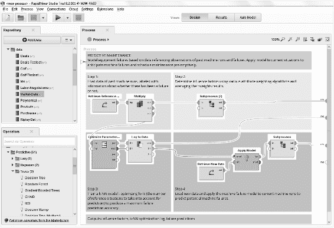

© Mark Wickham 2018 Mark WickhamPractical Java Machine Learning[https://doi.org/10.1007/978-1-4842-3951-3_5](https://doi.org/10.1007/978-1-4842-3951-3_5)

# 5.机器学习环境

Mark Wickham[1](#Aff2)  (1)Irving, TX, USA   You have learned about data and algorithms. Next, you will put the pieces together and build the CML model. ML environments perform a critical function. They act as an important piece of middleware, enabling you to create ML models from the data for later use by your application. This chapter will cover the following:

*   介绍模型创建阶段所需的步骤。

*   回顾基于 Java 的 ML 环境，包括 RapidMiner 和 KNIME Java ML 环境的高级概述。

*   提供详细的回顾，包括 Weka ML 环境的完整设置说明。

*   使用 Weka 实现七个最重要的 CML 模型。

*   使用三种聚类算法对旧忠实间歇泉数据集进行聚类。

*   使用四种分类算法对大型 PAMAP2_Dataset 进行分类。

*   回顾四种分类算法的精度性能。

*   使用 Weka KnowledgeFlow 创建代表四条多重 ROC 曲线的组合图。

*   演示如何导入和导出 Weka ML 模型。

## 5.1 概述

In Chapter [3](3.html), you saw how easy it is to create ML and DL solutions using cloud-based APIs. In this chapter, you will bring the solution to the desktop. Java-based ML environments allow you to create your own models using your own computing resources. This provides two huge advantages:

*   创建模型所需的计算资源不会产生增量成本。

*   您保留对自己创建的模型的控制。这可以带来竞争优势。

在这一章中，我将介绍几种基于 Java 的 ML 环境，但重点将主要放在 Weka 环境上。如果您决定使用其他 ML 环境之一，那么关于数据导入、支持的算法和模型创建/导入/导出的详细实现步骤应该是相似的。

### ML 门

在 ML-Gates 方法中，ML 环境最重要的任务是创建您将在应用程序中使用的 ML 模型。

创建最佳模型是一个迭代过程。你在第 [4](4.html) 章看到了如何选择最佳算法。在本章中，您将探索如何通过调整算法的可用参数来创建最佳模型。

Figure [5-1](#Fig1) shows the key steps involved with the model at ML-Gates 3 and ML-Gates 2. Figure 5-1

ML-Gates 3/2 模型活动

许多 ML 环境可以完成这些任务。Java 包的数量更少，我接下来会涉及到。

## 5.2 Java ML 环境

In Chapter [1](1.html), you saw how widespread Java has become. I also discussed the build vs. buy decision process for data science platforms.

> 你的主要目标之一是在边缘应用 ML 解决方案。这要求您生产轻量级的模型，可以部署到便携式设备中，比如移动电话。Java ML 环境满足这些要求。

Java ML environments check all the boxes:

*   它们是免费和开源的。

*   你可以很容易地生产出轻量级的模型。

*   如果需要更高的计算资源，可以在桌面或云中运行 Java ML 环境。

*   很容易导出该模型，以便在移动设备或小型计算机(如 Raspberry Pi)中使用。

实际上，Java ML 环境就像 ML 管道中的一个中间件。ML 环境创建的模型将输入数据与用户应用程序连接起来。

Table [5-1](#Tab1) shows a summary of the Java-based ML environments.Table 5-1

Java ML 环境

<colgroup class="calibre12"><col class="tcol"> <col class="tcol"> <col class="tcol"></colgroup> 
| 

名字

 | 

描述

 | 

笔记

 |
| --- | --- | --- |
| 新西兰黑秧鸡 | 怀卡托知识分析环境 | 新西兰怀卡托大学开发的 ML 平台。包括 GUI、命令行界面(CLI)和 Java API。Weka 可以说是最流行的 ML 环境。Weka 是一个很好的 ML 环境，你可以为 Android 导出模型。Weka 是免费和开源的。 |
| 克尼姆 | 康斯坦茨信息挖掘器 | 康斯坦茨大学(德国)开发了 KNIME。它专注于药学研究和商业智能。KNIME 的 GUI 基于 Eclipse。KNIME 还包含一个 API 接口。 |
| 快一点 | 快一点 | 德国多特蒙德技术大学开发了 RapidMiner。RapidMiner 包含一个 GUI 和一个 Java API。RapidMiner 支持数据处理、可视化、建模和算法。RapidMiner 有免费和商业发行版。 |
| 埃尔基 | 开发 KDD 应用程序的环境 | 慕尼黑 Ludwig Maximillion 大学开发的数据挖掘工作台。ELKI 专注于从数据(KDD)应用中发现数据和知识。ELKI 提供了一个迷你 GUI、CLI 和 Java API。ELKI 是研究软件。 |
| Java-ML | Java 机器学习库 | Java-ML 是 ML 算法的集合。Java-ML 不包含图形用户界面。 |
| DL4J 系列 | 深度学习 4 Java | DL4J 是 Skymind 的 Java 深度学习库。DL4J 不支持 CML 算法。更多详情请参见第 [1](1.html) 章。 |

The first five entries in Table [5-1](#Tab1) are mainly Java-based CML environments, and I will discuss them briefly next, before taking a deep dive into Weka. The last entry, DL4J, is a dedicated Java DL environment. Table [5-2](#Tab2) provides links for each of the Java ML environments.Table 5-2

Java ML 环境链接

<colgroup class="calibre12"><col class="tcol"> <col class="tcol"></colgroup> 
| 

名字

 | 

环

 |
| --- | --- |
| 新西兰黑秧鸡 | [***【www . cs . waikato . AC . NZ/ml/WEKA/***](http://www.cs.waikato.ac.nz/ml/weka/) |
| 克尼姆 | [*【www.knime.com/knime-analytics-platform】*](http://www.knime.com/knime-analytics-platform) |
| 快一点 | [*【https://rapidminer.com/】*](https://rapidminer.com/) |
| 埃尔基 | [*【https://elki-project.github.io/】*](https://elki-project.github.io/) |
| Java-ML | [*【http://java-ml.sourceforge.net/】*](http://java-ml.sourceforge.net/) |
| DL4J 系列 | [*【https://deeplearning4j.org/index.html】*](https://deeplearning4j.org/index.html) |

There are several factors to consider in choosing the best Java ML environment. The factors include

*   **许可和商业条款**:你应该喜欢免费的开源软件包，它允许你创建可用于商业应用的模型。

*   算法的可用性:你应该寻找支持第四章[中讨论的七个最重要算法的包。](4.html)

*   持续支持:你应该寻找一个用户社区或者创作者的长期承诺。

*   **模型的可移植性**:您应该寻找导出模型的能力，这样任何设备上的 Java 客户端都可以使用您创建的模型。这有助于你在边缘实现 ML。

*   灵活性:Java 随着每个主要版本的发布而不断发展。你需要一个基于 Java 的 ML 环境，它可以随着语言的发展而发展。也许在将来，我们会看到 ML 特性直接包含在 Java 中，就像 JSON 和其他特性现在是包含的候选者一样。

### 新西兰黑秧鸡

Weka 是怀卡托知识分析环境的缩写。新西兰的怀卡托大学创造了 Weka。有趣的是，Weka 也是新西兰一种不会飞的鸟(Gallirallus Australis)的名字，因此有了这个标志。新西兰似乎有许多可爱的不会飞的鸟。

ML 环境 Weka 已经存在一段时间了。它于 1997 年移植到 Java，已经成为数据挖掘行业的中流砥柱。2005 年，Weka 在 SIGKDD 会议上获得了 ACM 颁发的数据挖掘和知识发现服务奖。将 Weka 迁移到 Java 的决定让它保持了相关性。

最近，Weka 增加了一个包管理器。许多第三方软件包和算法都可以通过软件包管理器获得。所有重要的 CML 算法都适用于 Weka。你将在本章的后面探索 Weka 算法。

怀卡托大学维护了一个稳定版本(目前是 3.8.2)和一个开发版本(3.9.2)，支持 Weka。与 Android Studio 不同，Weka 的发布并不频繁。运行开发渠道版本是安全的，它包括一些有用的 GUI 改进和对 DL4J 的支持。随着 Weka 获得 ML 社区的支持，在流行的论坛上寻找问题的帮助变得越来越容易，例如 Stack Overflow 和 YouTube 视频。

Weka 有一个友好的许可证，GNU 通用公共许可证(GPL)。因此，有可能研究算法如何工作并修改它们。

Weka GUI 看起来过时了。Weka GUIs 和可视化工具远没有 RapidMiner 那么流畅。然而，在引擎盖下，它什么都不缺。Weka 是一个非常强大的 ML 环境，可以提供您的 ML 应用程序所需的模型。尽管相对于 RapidMiner，它的 GUI 较差，但 Weka 检查了所有的复选框。

为了解决 Weka 的一个弱点，在本章的后面，我将讨论一个 Weka 插件来改进 Weka 制图功能。

### 快一点

RapidMiner is an incredible ML environment. Recall according to Figure [1-4](1.html#Fig4), RapidMiner is a leader in data science platforms. Java-based RapidMiner excels at the following:

*   RapidMiner 快如闪电。

*   RapidMiner 有很多工具。

*   RapidMiner 在准备数据方面非常出色。

*   RapidMiner 允许您构建预测 ML 模型。

Figure [5-2](#Fig2) shows a screenshot of the RapidMiner main interface. Figure 5-2

RapidMiner 主界面

如图 [5-2](#Fig2) 所示，RapidMiner 有一个漂亮的现代 GUI。RapidMiner 的易用性使其越来越受欢迎。RapidMiner 拥有一个庞大的用户社区和所有与广泛流行相关的常见支持资源。

RapidMiner 的核心是开源的 Java 代码，可以在 GitHub 的[*【https://github.com/rapidminer/rapidminer-studio】T2*T5】下载。](https://github.com/rapidminer/rapidminer-studio)

正如你在第 4 章[中看到的 Weka，所有的 ML 算法 Java 代码都是 core RapidMiner 的一部分，可以在 GitHub 库获得。仔细观察就会发现算法的 Java 代码基础是不一样的，尽管你可以期望算法达到几乎相似的结果。在许多算法情况下，RapidMiner 算法实现依赖于较少的继承，并且更容易理解。](4.html)

除了 RapidMiner GUI 的优势之外，RapidMiner 和 Weka 之间的其他主要区别是许可和商业定价条款。RapidMiner 是根据 GNU AGPL 3.0 许可证授权的。它有免费和商业产品。

[*【https://opensource.org/licenses/AGPL-3.0】*](https://opensource.org/licenses/AGPL-3.0)

RapidMiner Studio is free to download. Table [5-3](#Tab3) shows a summary of the RapidMiner commercial pricing tiers, which vary depending on data rows and number of processors used.Table 5-3

快速最小定价

<colgroup class="calibre12"><col class="tcol"> <col class="tcol"> <col class="tcol"> <col class="tcol"></colgroup> 
| 

名字

 | 

数据行数

 | 

处理器数量

 | 

价格(每用户/年)

 |
| --- | --- | --- | --- |
| 自由的 | Ten thousand | one | 自由的 |
| 小的 | One hundred thousand | Two | $2,500 |
| 中等 | One million | four | $5,000 |
| 大的 | 无限的 | 无限的 | $10,000 |

RapidMiner 免费层还包括针对大数据行大小的 30 天免费试用。这使您有机会了解 RapidMiner 在大型数据 ML 项目中的表现。一万个数据行或实例看起来很多，但实际上，CML 项目超过这个数量是很常见的。在本章的稍后部分，您将会看到您的 PAMAP2_Dataset 分类需要中级许可才能使用 RapidMiner 完成。这是一笔不小的成本，尤其是对于没有大资源的独立开发者。RapidMiner 许可成本是您选择 Weka 的主要原因。

就灵活性而言，Weka 和 RapidMiner 都提供了 jar 文件库，您可以将它们集成到您的 Java 项目中。这允许您在 Java 应用程序中利用预构建的模型。

Weka 和 RapidMiner 都有自己的方法来实现模型生成。对于任何软件平台，都有学习如何使用它们的初始时间投资。幸运的是，ML-Gates 中此阶段涉及的高级步骤是相同的。

### 克尼姆

Like RapidMiner, KNIME was included a leader among the data science platforms shown in Figure [1-4](1.html#Fig4). Some key selling points for KNIME:

*   KNIME 是数据科学家的工具箱。

*   KNIME 包含 2000 多个模块。

*   KNIME 是一个开放的平台。

*   KNIME 可以在本地、服务器或云中运行，这正是您所寻求的灵活性。

The latest free-download version of KNIME is 3.6.0\. KNIME is licensed under GNU GPL Version 3\. KNIME has a very intuitive workbench that is similar to Weka. The GUI is very comprehensive, which make KNIME useful for people who wish to explore ML but do not want to code. Figure [5-3](#Fig3) shows the KNIME workbench. Figure 5-3

knime work bench(knime work bench)

KNIME 界面看起来非常类似于 RapidMiner，特别是在知识流区域，用户可以用图形连接模块以形成流程。

KNIME 使用 PMML(预测模型标记语言)来导出模型。PMML 是一个流行的标准。你看到它被引用为一些 Weka 分类算法的类别标题。PMML 在导出用于 Android 移动设备的预建模型方面没有那么灵活。因此，Weka 仍然是您首选的 ML 环境。

### 埃尔基

ELKI 是一个擅长集群和离群点检测的 Java 平台。Weka 和 RapidMiner 是通用框架，而 ELKI 只做一件事，而且做得很好:集群。它包含了大量的聚类算法。如果通用框架中包含的基本聚类算法不足以解决您的 ML 聚类问题，ELKI 可能是解决方案。

ELKI 专注于研究和教育。它有助于解决现实世界中的聚类问题，如聚类鲸鱼的位置和重新平衡公共自行车共享计划。

ELKI 的一个独特特性是使用 SVG 进行可伸缩图形输出，使用 Apache Batik 渲染用户界面。如果您需要无损、高质量、可伸缩的图形输出来解决集群问题，ELKI 是一个很好的选择。

通用框架在聚类方面做得很好，你将在本章后面看到，但是如果你需要高级的聚类算法，请记住 ELKI。

### Java-ML

Java-ML 是一组打包到 jar 库中的基于 Java 的 ML 算法。该库的最新版本是 2012 年发布的 0.1.7。该库包括一些基本的聚类和分类算法。Java-ML 带有 GNU GPL 2.0 许可证。Java-ML 不包括任何图形用户界面。Java-ML 库不会特别有用，除非您正在寻找不依赖于怀卡托大学或 RapidMiner 许可证的开源 Java ML 算法。

## 5.3 Weka 安装

要安装 Weka，请访问 Weka 下载页面并为您的平台选择一个软件包:

[*【www.cs.waikato.ac.nz/ml/weka/downloading.html】*](http://www.cs.waikato.ac.nz/ml/weka/downloading.html)

有没有 Java 都可以下载 Weka。如第 [1](1.html) 章所示，独立于 Java 安装管理 Weka，可以让你知道你运行的是哪个版本的 Java。

There are two current versions of Weka:

*   3.8.2 是 Weka 最新的稳定版本。

*   3.9.2 是 Weka 的最新开发版本。

Weka 遵循 Linux 版本编号模型。小数点后的偶数数字(如 3.8.2)表示稳定版本，奇数数字(如 3.9.2)表示开发版本。

Weka 团队维护着总结每个新版本中的错误修复和新特性的链接。要查看 3.9.2 中的新功能，请查看此处显示的文档部分:

[***https://wiki . Pentaho . com/display/Data Mining/Pentaho+数据+挖掘+社区+文档***](https://wiki.pentaho.com/display/DATAMINING/Pentaho+Data+Mining+Community+Documentation)

Weka 开发版通常非常安全。

After you decide on a version, the download page contains packages for the three major platforms: Windows, Mac O/S, and Linux. Choose your package and install Weka.

1.  1.

    在你的系统上安装 Java。

2.  2.

    下载你想要的 Weka 包。

3.  3.

    将 zip 文件解压到名为 ***weka-3-9-2*** 的新目录中。

4.  4.

    设置 Java CLASSPATH 环境变量。CLASSPATH 环境变量告诉 Java 在哪里寻找要包含的类。

5.  5.

    换到目录，用 ***java -jar weka.jar*** 运行 Weka。

The Weka logo, Figure [5-4](#Fig4), appears during the initialization. Figure 5-4

保留徽标

After the Weka initialization completes, the main Weka GUI chooser appears, as shown in Figure [5-5](#Fig5). Figure 5-5

Weka GUI 选择器

在启动主要的 Weka 应用程序之前，您需要配置 Weka。

### Weka 配置

Weka is mostly ready to go after the initial install. I will address a few configuration updates next. Figure [5-6](#Fig6) shows the contents of the main Weka directory after you unzip the install file. Figure 5-6

Weka.jar

The ***weka.jar*** file is of interest for two reasons:

*   ***weka.jar*** 文件包含 weka 中算法的所有 Java 源代码。你在第 4 章[中看到了如何在在线 Subversion 资源库中探索它们。通过解压 ***weka.jar*** 文件，您可以在本地浏览它们。](4.html)

*   Weka 为许多 GUI 配置属性使用一个名为 ***Visualize.props*** 的文件。为了修改配置，您必须制作此文件的本地副本。

In order to view and modify the contents of the ***weka.jar*** file, you need to unzip the jar file. The 7-Zip utility can unzip jar files. Figure [5-7](#Fig7) shows the 7-Zip utility download page. The download is available at [***www.7-zip.org/download.html***](http://www.7-zip.org/download.html) . Figure 5-7

7-Zip 解压缩工具

Install the 7-Zip utility on the platform of your choice and then unzip the ***weka.jar*** file. Figure [5-8](#Fig8) shows the contents of the unzipped ***weka.jar***. Figure 5-8

Weka.jar 内容

***Weka.jar*** 包括聚类算法、分类器算法的目录，以及 ***gui*** 目录，其中包含了你要修改的***visualize . props***文件。

### Java 参数设置

One of the issues with Java is high memory usage. Weka always displays a status box at the bottom of the Weka Explorer window. The status box displays messages about what is happening within Weka. Right-clicking inside the status box brings up a menu with two helpful options:

*   ***内存信息*** :显示 Weka 可用的内存量

*   ***运行垃圾收集器*** :强制 Java 垃圾收集器在后台执行垃圾收集任务

You can use these options to monitor the Weka memory usage. If you should get ***Out Of Memory*** errors, you should increase the heap size for your Java engine. The default setting of 64MB is usually too small. You can set the memory for Java using the ***–Xmx*** option in the Java command line. For example, increase the Java memory to 1024MB with the following:001   java -Xmx1024m -jar weka.jar If you are running Windows and wish to make the change globally, you can set the ***javaOpts*** parameter in the ***RunWeka.ini*** file like so:001   javaOpts= -Xmx1040m If you get ***Class Not Found*** errors, you will need to verify your CLASSPATH variable settings. The best way to confirm your CLASSPATH setting is to use the Weka ***Sysinfo*** display, shown in Figure [5-9](#Fig9). Figure 5-9

Weka 帮助➤系统信息显示

除了 ***java.class.path*** 设置外，Weka Sysinfo 页面还显示了 ***WEKA_HOME*** 和 ***memory.max*** 设置。

### 修改 Weka。道具文件

如果你不喜欢 Weka 的默认设置，你可以调整 ***。道具*** 文件修改 Weka 行为。*有很多**。prop*** 文件来配置 Weka。

The following steps show how to modify the ***Visualize.props*** file to change the default colors of the X-axis and Y-axis from green to black. The responsible ***.props*** file for charts and graphs in Weka is ***weka/gui/visualize/Visualize.props***.

1.  1.

    关闭 Weka。

2.  2.

    提取 ***。道具*** 文件来自 ***weka.jar*** ，使用可以处理 ZIP 文件的存档管理器，比如 Windows 下的 7-Zip。

3.  3.

    放置此 ***。道具*** 文件中的***$ WEKA _ HOME/道具*** 。

4.  4.

    打开本地 ***。道具*** 文件带文本编辑器，确保 CRLF 和 BOM 字符对于你的平台是正确的。

5.  5.

    修改您想要更改的参数。属性名在“=”的左边，属性值在右边。

6.  6.

    保存文件并重启 Weka。

Figure [5-10](#Fig10) shows the local copy of the ***Visualize.props*** file you are updating. Figure 5-10

Weka Visualize.props 本地文件副本

There are many customizable values inside the Weka ***.props*** files. The following listing shows line 009 with the updated axis color setting:001   # Properties for visualization 002   # 003   # Version: $Revision: 5015 $ 004 005   # Maximum precision for numeric values 006   weka.gui.visualize.precision=10 007 008   # Colour for the axis in the 2D plot (can use R,G,B format) 009   weka.gui.visualize.Plot2D.axisColour=black 010 011   # Colour for the background of the 2D plot (can use R,G,B format) 012   weka.gui.visualize.Plot2D.backgroundColour=white 013 014   # The JFrame (needs to implement the interface weka.gui.visualize.InstanceInfo) 015   # for displaying Instance information. 016   weka.gui.visualize.Plot2D.instanceInfoFrame=weka.gui.visualize.InstanceInfoFrame 017 018   # Defaults for margin curve plots 019   weka.gui.visualize.VisualizePanel.MarginCurve.XDimension=Margin 020   weka.gui.visualize.VisualizePanel.MarginCurve.YDimension=Cumulative 021   weka.gui.visualize.VisualizePanel.MarginCurve.ColourDimension=Margin

使用这种方法，大多数 Weka 配置都是可定制的。但是，有一些设置可以直接从 GUI 选择器中获得。

### Weka 设置

Figure [5-11](#Fig11) shows the Weka main settings available under the Program menu selection in the Weka GUI Chooser. Figure 5-11

Weka 主要设置

只有两种设置可用:GUI 的 ***LookAndFeel*** 和通信的 ***SocketTimeout*** 。对于 Windows 平台，首选 ***LookAndFeel*** 设置为***Windows look and feel***。没有必要改变这个默认的***socket time out***值。

### Weka 软件包管理器

Weka recently introduced a package manager. When you initially run Weka, there are many preinstalled algorithms for clustering and classification. There are also many uninstalled packages that are available for installation with the package manager. Figure [5-12](#Fig12) shows the Weka package manager available from the Weka GUI Chooser. Figure 5-12

Weka 软件包管理器选择器

当您启动软件包管理器时，Weka 会让您选择显示已安装的和可用的软件包。

For these projects, you must install the following two packages using the package manager:

*   jFreeChart:Weka 的图形化扩展

*   DBSCAN:一种基于密度的聚类算法

图 [5-13](#Fig13) 显示了 jFreeChart 的安装，它提供了比基本 Weka 渲染器更好的图表渲染。在本章的后面，您将使用 jFreeChart 来呈现多 ROC 曲线比较图。此加载项不是必需的；内置的 Weka 渲染器可以很好地工作，但是 jFreeChart 提供了一个更有吸引力的图表选项。

Figure [5-14](#Fig14) shows that package manager and highlights the recently installed DBSCAN algorithm. You will use the DBSCAN algorithm in a clustering example later in the chapter. Figure 5-13

weka 包管理器和 jfreechart 扩展

 Figure 5-14

Weka 软件包管理器和 DBSCAN 算法

## 5.4 Weka 概述

Weka is a comprehensive suite of Java class libraries. The Weka package implements many state-of-the-art machine learning and data mining algorithms. Table [5-4](#Tab4) shows a summary of the Weka modules available from the GUI Chooser, shown earlier in Figure [5-5](#Fig5).Table 5-4

Weka 模块

<colgroup class="calibre12"><col class="tcol"> <col class="tcol"></colgroup> 
| 

Weka 模块

 | 

描述

 |
| --- | --- |
| 探险家 | Explorer 是一个使用 Weka 探索数据的环境。Explorer 是 Weka 的主要图形用户界面。Weka Explorer 包括主要的 Weka 包和一个可视化工具。Weka 的主要特性包括过滤器、分类器、聚类器、关联和属性选择。 |
| 实验者 | Weka Experimenter 是一个用于执行实验和在学习方案之间进行统计测试的环境。 |
| 知识流 | Weka KnowledgeFlow 是一个支持与 Explorer 相同功能的环境，但包含一个拖放界面。 |
| 工作台 | Weka Workbench 是一个一体化的应用程序，它在用户可选的透视图中结合了其他应用程序。 |
| 简单 CLI | Weka 团队建议使用 CLI 来深入了解 Weka 的用法。大多数关键功能都可以从 GUI 界面获得，但是 CLI 的一个优点是它需要的内存少得多。如果您发现自己遇到了*内存不足*的错误，CLI 界面是一个可能的解决方案。 |

As shown in Table [5-4](#Tab4), there is some redundancy in the Weka modules. You are going to focus on the following three Weka modules because they are more than sufficient to create the models you need for your Java applications.

*   Weka Explorer

*   Weka 知识流

*   微卡简易 CLI

我已经排除了实验者和工作台。在本章的后面，您将使用知识流模块来比较不同算法的多条 ROC 曲线。实验者也可以这样做，但是即使 Weka 没有最好的图形界面，我还是更喜欢知识流模块的图形方式。如果您正在为 Weka 模块寻找一个定制的透视图，您可以使用工作台模块。

### Weka 文档

Weka 团队确实以随每个版本分发的 PDF 文件的形式提供了官方文档，并且怀卡托大学为想要学习 Weka 的开发人员提供了许多视频和支持资源。Weka 手册有 340 多页，如果你想认真了解 Weka，这是必不可少的读物。

The following represent the official Weka documentation from the Weka creators:

*   Weka manual:当前版本的 Weka manual(如***【WekaManual-3-8-2.pdf】*****【WekaManual-3-9-2.pdf】)**始终包含在发行版中。对于任何特定的 Weka 版本，手动文件名为***WekaManual.pdf***。

*   Weka book:Weka 团队已经出版了一本书， ***数据挖掘——实用的机器学习工具和技术*** ，作者是 Witten、Frank 和 Hall。这本书是一本非常好的 ML 参考书。虽然它没有详细介绍 Weka，但它确实涵盖了数据、算法和一般 ML 理论的许多方面。

*   YouTube:Weka YouTube 频道， ***WekaMOOC*** ，包含许多有用的 Weka 操作视频。

### Weka Explorer

The Explorer is the main Weka interface. Figure [5-15](#Fig15) shows the Weka Explorer upon initialization. Figure 5-15

Weka Explorer

Across the top of the Explorer, you will see tabs for each of the key steps you need to accomplish during the model creation phase:

*   ***预处理*** :“过滤器”是 Weka 对其一套数据预处理例程使用的词。您可以对数据应用过滤器，为分类或聚类做准备。

*   **分类: ***分类*** 选项卡允许您选择分类算法，调整参数，并训练可用于以后预测的分类器。**

***   ***聚类***:***聚类*** 选项卡允许您选择一个聚类算法，调整其参数，并对一个未标记的数据集进行聚类。

    *   ***属性***:***属性*** 选项卡允许您选择预测的最佳属性。

    *   ***可视化***:***可视化*** 选项卡提供数据集的可视化。2D 图形式的可视化矩阵代表每一对属性。** 

 **### Weka 过滤器

You load and prepare your data during ML-Gate 4, the preprocessing phase. Weka uses the term ***filters*** to describe the process of transforming your data. In Chapter [2](2.html), you explored data preprocessing in general. Within Weka, you have an additional set of internal filters you can use to prepare your data for model building. Table [5-5](#Tab5) shows a summary of the Weka filters grouped by filter type.Table 5-5

Weka 过滤器

<colgroup class="calibre12"><col class="tcol"> <col class="tcol"></colgroup> 
| 

过滤方式

 | 

过滤器名称

 |
| --- | --- |
| 一般 | 所有过滤器 |
| 一般 | 多重过滤器 |
| 一般 | 重命名 |
| 监督属性 | AddClassification，AttributeSelection，ClassConditionProbabilties，ClassOrder，Discretize，MergeNominalValues，NominalToBinary，PartitionMembership |
| 监督实例 | 类别平衡器、重新取样、展开子取样、分层移除折叠 |
| 无监督属性 | Add，AddCluster，AddExpression，AddID，AddNoise，AddUserFields，AddValues，CartesianProduct，Center，ChangeDateFormat，ClassAssigner，ClusterMembership，Copy，DateToNumeric，Discretize，FixedDictionaryStringToWordVector，InterquartileRange，KernelFilter，MakeIndicator，MathExpression，mergeinfrequentnominalvaluests，MergeManyValues，MergeTwoValues，NominalToBinary，NominalToString，Normalize，NumericCleaner，NumericToBinary，NumericToDate，Numeric |
| 无监督实例 | NonSparseToSparse，Randomize，RemoveDuplicates，RemoveFolds，RemoveFrequentValues，RemoveMisclassified，RemovePercentage，RemoveRange，RemoveWithValues，Resample，ReservoirSample，SparseToNonSparse，SubsetByExpression |

正如你所看到的，有大量的过滤器可用于 Weka 的数据预处理，特别是用于无监督学习的无标签数据。

You can apply filter to data in Weka by pressing the ***Choose*** button under the filter section at the top of the ***Preprocess*** tab, shown in Figure [5-15](#Fig15).

> 像所有好的 ML 环境一样，Weka 包含了大量用于数据预处理的 Java 类。如果没有找到您需要的过滤器，您可以修改现有的 Weka 过滤器 Java 代码来创建您自己的自定义过滤器。解压***weka-src . jar****文件，访问 Weka 过滤器 Java 代码。*

在本章后面的分类示例中，您将使用 Weka***numeric nominal***过滤器将属性的数据类型从数值型转换为名义型。

如果在构建模型之前需要一个 Java 类来修改数据，Weka 可能会为您提供一个 Java 类过滤器。如果没有，您可以通过修改现有的 Weka 过滤器轻松创建自己的过滤器。

### Weka Explorer 主要选项

Weka Explorer 是奇迹发生的地方。您可以使用资源管理器进行分类或聚类。请注意，在使用 ***预处理*** 选项卡打开数据集之前，Weka Explorer 中的 ***分类*** 和 ***聚类*** 选项卡处于禁用状态。

Within the ***Classify*** and ***Cluster*** tabs at the top of the Weka Explorer are three important configuration sections you will frequently use in Weka:

*   算法选项

*   测试选项

*   用于分类的属性预测值选择(标签)

Figure [5-16](#Fig16) shows these areas highlighted within the Weka ***Classify*** tab. Figure 5-16

Weka Explorer 分类选项

确认这三个设置后，按下 ***开始*** 按钮，Weka 将使用选定的算法进行分类或聚类。

### Weka 知识流

The Weka KnowledgeFlow is an alternative graphical front-end to core Weka. KnowledgeFlow implements a dataflow-inspired graphical interface for Weka. Figure [5-17](#Fig17) shows a predefined KnowledgeFlow template opened in Weka KnowledgeFlow. All of the Weka filters, classifiers, clusterers, and data tools are available in the KnowledgeFlow. KnowledgeFlow also includes some extra tools. Figure 5-17

Weka 知识流模板

使用 KnowledgeFlow，您可以从调色板中选择 Weka 步骤，并将其放置到布局画布上。Weka 构建模块可以连接在一起，形成一个知识流，可以处理和分析数据。

GUI 的左侧包含所有可用的 Weka 模块。您可以将这些模块作为节点放在画布上。您可以通过右键单击访问其配置参数来单独配置每个节点。您通过连接节点来创建流。执行一个流会产生结果，通常是一个模型生成，或者经常是可视化。

在本章的后面，你将会看到如何用不同的算法来比较多个模型。您将使用 Weka KnowledgeFlow 来比较多个聚类算法，然后使用 KnowledgeFlow 通过生成多个 ROC 曲线来评估多个分类器。

### 微卡简易 CLI

It is very easy to use graphical tools like KnowledgeFlow to build ML models. However, Java GUI applications often require a large amount of memory and system resources, resources you might prefer to reserve for your data, algorithms, and models. Figure [5-18](#Fig18) shows an alternative to KnowledgeFlow, the Weka Simple CLI Shell. Figure 5-18

微卡简易 CLI Shell

Weka Simple CLI Shell 提供对所有 Weka 类的访问，包括算法(分类器和聚类器)和过滤器。这是一个简单的 Weka shell，具有独立的输出和命令行。

在第 [3](3.html) 章中，当您在 AWS cloud 中运行 Weka 时，您看到了 Weka 命令行界面的示例。简单的 CLI Shell 在本地桌面 Weka 环境中提供了相同的功能。

The following commands are available in the Simple CLI:

*   ***java<class name>[<args>]***:用给定的参数调用 Java 类

*   ***中断*** :友好地停止当前线程，如运行分类器

*   ***杀死*** :以不友好的方式停止当前线程

*   **:清除屏幕**

***   ***能力<class name>[<args>]***:列出指定类的能力

    *   ***退出*** :退出简单的 CLI Shell

    *   ***帮助*** :提供可用命令的概述** 

**The Weka Simple CLI Shell is powerful because all of the filters and implementations of the algorithms have a uniform command-line interface. The following example shows how to train and test a random forest classifier with multiple filters from the command line. The ***MultiFilter*** operation handles the concatenation of filters.001   java -classpath weka.jar weka.classifiers.meta.FilteredClassifier -t data/ReutersCorn-train.arff -T data/ReutersCorn-test.arff -F "weka.filters.MultiFilter -F weka.filters.unsupervised.attribute.StringToWordVector -F weka.filters.unsupervised.attribute.Standardize" -W weka.classifiers.trees.RandomForest -- -I 100 It is also possible to train and save a model using the ***–t*** and ***–d*** options:001   java -classpath weka.jar weka.classifiers.meta.MultiClassClassifier -t data/iris.arff -d rf.model -W weka.classifiers.trees.RandomForest -- -I 100 A serialized model can also be loaded and used for predictions using the ***–serialized*** option to load the model and the ***–i*** option to load the input data:001   java -classpath weka.jar weka.filters.supervised.attribute.AddClassification -serialized rf.model -classification -i data/iris.arff -o predict-iris.arff

如果您试图在命令行中将太多的函数串在一起，事情会变得复杂。如果您希望加载模型、训练模型、应用过滤器和保存模型，使用 Weka KnowledgeFlow 界面连接各个节点会更容易。接下来您将看到如何做到这一点。

## 5.5 Weka 聚类算法

在第 4 章中，我讨论了聚类，即在无标签数据集中发现结构的过程。像大多数好的 ML 环境一样，Weka 有大量的聚类算法。

In this section, you will see how to implement clustering for the three most useful clustering ML algorithms as presented in Chapter [4](4.html):

*   k 均值聚类

*   期望最大化聚类

*   基于密度的聚类(DBSCAN)

如果您有兴趣探索其他聚类算法，只需替换您选择的算法。

### 使用 DBSCAN 进行聚类

DBSCAN 算法是 Weka 软件包管理器中的一个“可用”软件包。安装 DBSCAN 聚类算法后，它将作为 Weka 软件包中的一个聚类选项。

对于这个聚类示例，您将使用旧的 Faithful geyser 数据集。原始数据集可在[***www . stat . CMU . edu/~ Larry/all-of-statistics/= data/faithful . dat***](http://www.stat.cmu.edu/%257Elarry/all-of-statistics/=data/faithful.dat)获取。

Old Faithful is the famous geyser in Yellowstone National Park that erupts regularly approximately once per hour. The dataset, collected in 1990, includes 272 observations on two variables. The two variables are

*   喷发时间:以分钟为单位表示喷发时间的数值

*   等待时间:以分钟为单位，代表到下一次喷发的等待时间的数值

Table [5-6](#Tab6) shows the first ten instances of the dataset. The original data file name is ***old-faithful-data.dat***. It does not contain a header row and contains fields separated by spaces. The modified file used in this example is ***old-faithful-data.csv***. The file is contained in the book resources in the Chapter [5](5.html) folder. It does contain a header row and comma-separated values. The OpenCalc spreadsheet program created the CSV file.Table 5-6

老忠实喷泉数据集(前 10 个实例)，(阿扎利尼和鲍曼，1990 年)

<colgroup class="calibre12"><col class="tcol"> <col class="tcol"> <col class="tcol"></colgroup> 
| 

实例 ID

 | 

喷发时间

 | 

等待时间

 |
| --- | --- | --- |
| one | Three point six | Seventy-nine |
| Two | One point eight | Fifty-four |
| three | Three point three three three | Seventy-four |
| four | Two point two eight three | Sixty-two |
| five | Four point five three three | eighty-five |
| six | Two point eight eight three | Fifty-five |
| seven | Four point seven | Eighty-eight |
| eight | Three point six | eighty-five |
| nine | One point nine five | Fifty-one |
| Ten | Four point three five | eighty-five |

Using the Weka Explorer , it is straightforward to perform a DBSCAN cluster on the data, as shown in the steps below.

1.  1.

    从 Weka GUI 选择器启动 Weka Explorer 应用程序。

2.  2.

    在 ***预处理*** 页签中，点击 ***打开文件*** ，打开***old-faithful-data . CSV***文件。您可能需要告诉 Weka CSV 加载程序，这些值以“，”分隔，并且***NoHeaderRowPresent***为假。当数据加载时，您将看到实例的摘要，包括两个属性:爆发和等待。

3.  3.

    点击 ***集群*** 标签。

4.  4.

    在**下，点击 ***选择*** 按钮选择算法。**

***   5.

    从可用的聚类分析算法列表中选择 DBSCAN 算法。如果 DBSCAN 不可用，您将需要使用 Weka 软件包管理器安装它。

     *   6.

    单击 DBSCAN 算法框中的文本。您将能够输入 DBSCAN 算法参数。为 Epsilon 输入. 11，为 NumPts 输入 6。点击 ***确定*** 。

     *   7.

    点击 ***开始*** 对数据集执行 DBSCAN 聚类算法。处理完成后，将显示结果。

     **

**Figure [5-19](#Fig19) shows the completed DBSCAN clustering results. Figure 5-19

旧忠实数据集的 DBSCAN 聚类

结果显示，该算法为所有 272 个实例识别出两个聚类。集群 0 总共接收了 175 个实例，而集群 1 接收了 97 个实例。

Each time you run a cluster or classification in Weka, the ***Results list*** on the left panel updates with a new entry. Right-clicking a results entry provides the option to visualize the results. You can also click the ***Visualize*** tab at the top of the Weka Explorer. Figure [5-20](#Fig20) shows the visualization of the two DBSCAN clusters. When you first click the ***Visualize*** tab, you will see a matrix of visualizations. Weka prepares charts for all combinations of the attributes. In this case, the one you are interested in maps the waiting time and eruption time on the X and Y axes. You can select this specific chart from the matrix, or you can use the X and Y drop-down boxes to populate the desired attributes for the X and Y axes. Figure 5-20

DBSCAN 聚类的可视化

You can visualize any two of the attributes, one on the X-axis and another on the Y-axis. In this case, there are actually four attributes:

*   喷发时间间隔

*   等待时间间隔

*   实例 ID

*   一个新创建的属性，用于保存生成的分类 ID。实际上，您现在已经有了一个带标签的数据集，稍后您将利用它。

可视化数据时，选择将喷发和等待时间放在轴上的图。绘制其他属性并不特别有趣。选择正确的属性后，如图 [5-20](#Fig20) 所示，可视化提供了关键的洞察力。由该算法识别的两个聚类被颜色编码。

你可以从可视化中获得的关键见解是，这两个不同的集群代表了老忠实间歇泉运行的两种“模式”。

You can adjust the algorithm parameters if you wish to fine-tune the clusters. Notice that some of the data points in the middle area are borderline in determining to which cluster they belong. Figure [5-21](#Fig21) shows adjustments to the DBSCAN algorithm parameters. Some algorithms have many parameters; the DBSCAN algorithm only has two parameters. Figure 5-21

DBSCAN 算法参数调整

By changing the ***epsilon*** parameter and the ***numPoints*** parameter, you can tighten up the tolerance of the clusters. After changing the parameters, click ***OK*** and then press ***Start*** to commence another clustering. Figure [5-22](#Fig22) shows the new results. Figure 5-22

更新的 DBSCAN 聚类结果

In this case, the algorithm identified noise in the data. In total, 11 instances fell in the boundary area. Right-click the newest DBSCAN result in the results list to show the new visualization, shown in Figure [5-23](#Fig23). Figure 5-23

由 DBSCAN 识别的数据中的噪声

圈出的数据点没有聚类到两个聚类中的任何一个。在本例中，您有更紧密的集群。通过调整算法参数，您实际上使用了 DBSCAN 算法来识别异常值，这是该算法的优势之一，如果您还记得第 [4](4.html) 章的话。

### 知识流聚类

您已经看到了基于密度的聚类算法 DBSCAN 在对旧的忠实数据集进行聚类时的表现。现在让我们比较来自另外两种聚类算法 k-means 和 EM 的结果。您可以使用 Weka KnowledgeFlow 应用程序来简化比较过程，而不是像在 Weka Explorer 中使用 DBSCAN 那样运行独立的测试。

虽然知识流图形用户界面没有你在图 [5-2](#Fig2) 和图 [5-3](#Fig3) 中看到的 RapidMiner 和 KNIME 那么时尚，但知识流应用程序具有相同的功能。

The KnowledgeFlow application contains several very useful templates you can use to build layouts. KnowledgeFlow includes the following templates:

*   交叉验证

*   学习并保存模型

*   两个分类器的 ROC 曲线

*   增量学习和评估朴素贝叶斯

*   比较两个集群

*   两种属性选择方案

*   将各种图表保存到文件中

*   可视化预测边界

*   将作业参数化

可以加载、修改和保存布局。知识流布局使用。kf 分机。书籍资源包括两种布局，您可以加载这两种布局来比较我们讨论的所有三种聚类算法。

Figure [5-24](#Fig24) shows the two layouts available with the book resource download: ***cluster-3-csv-cross-fold.kf*** uses k-fold cross-validation while ***cluster-3-csv-split.kf*** uses a simple split of the data for training and testing. Both of the KnowledgeFlow examples load the CSV dataset ***old-faithful-data.csv***. Figure 5-24

知识流布局:比较三种聚类算法

构建知识流的过程很简单。您只需从左侧面板中选择节点，并将它们添加到画布中。知识流应用程序将节点组织成可扩展的类别，包括数据源、过滤器、分类器、聚类器、可视化等。

When nodes placed onto the canvas, there are two configuration operations:

*   双击节点将提供对节点配置参数的访问，包括算法参数。

*   右键单击一个节点将提供对节点选项的访问，包括将该节点连接到其他节点的重要任务。

图 [5-23](#Fig23) 显示了加载到 Weka KnowledgeFlow 应用程序中的***cluster-3-CSV-splt . KF***。

Descriptive notes can also be included on the canvas, as shown in Figure [5-25](#Fig25). Figure 5-25

知识流布局:三个集群比较

The following steps illustrate how to create the three-cluster comparison starting with a blank canvas:

1.  1.

    将以下节点添加到知识流画布，如图 [5-25](#Fig25) 所示进行排列:

    ***【csvloader】***，

    **，**

     *****在*** 集群中，

    ***-K-表示*** 集群者，

    ***DBSCAN*** Clusterer、

    3 x***clusterperformanceevaluator***，

    ***【文本查看器】*****
***   2.

    双击 ***CSVLoader*** ，将文件名设置为***old-faithful-data . CSV***文件。

     *   3.

    右键点击 ***CSVLoader*** ，选择 ***数据集*** 。将 ***数据集*** 连接器拖到***trainttestsplitmaker***上。

     *   4.

    双击***trainttestsplitmaker***，将训练百分比设置为 66%或您选择的数字。

     *   5.

    右键单击***trainttestsplitmaker***，选择 ***trainingSet*** ，拖动 ***trainingSet*** 连接器到 ***EM*** Clusterer 节点。对其他两个集群重复上述步骤。

     *   6.

    右键单击***TrainTestSplitMaker***，选择 ***testSet*** ，拖动 ***testSet*** 连接器到 ***EM*** Clusterer 节点，对另外两个 Clusterer 重复上述操作。

     *   7.

    右键单击 ***EM*** Clusterer 节点，选择 ***batchClusterer*** ，拖动 ***batchClusterer*** 连接器到第一个***clustererperperformanceevaluator***。对其他两个集群器节点重复上述操作。

     *   8.

    右键单击每个***clusterperformanceevaluator***，选择文本，将文本连接符拖动到 ***TextViewer*** 。

     **

 **知识流完全配置后，您可以通过单击布局顶部的右侧播放箭头来执行该流。在流程执行时，知识流会在底部面板中记录进度状态。

When all of the tasks successfully complete, KnowledgeFlow will mark status as ***OK***, as shown in Figure [5-25](#Fig25). At this point, you can right-click the ***TextViewer*** to show the results. Figure [5-26](#Fig26) shows the ***Result List***. Figure 5-26

*知识流文本查看器结果*

***结果列表*** 包括三种聚类算法的报告:DBSCAN、EM 和 k-means。

Weka KnowledgeFlow 接口为您提供了一种非常有用的方法来试验聚类算法。您可以轻松地双击一个聚类算法，更新其参数，然后重新运行流程。在决定哪种算法最适合您的 CML 聚类问题时，它是一个非常有用的工具。

## 5.6 Weka 分类算法

实现聚类算法来发现未标记数据中的隐藏模式，就像你在 Old Faithful 中看到的那样，非常有趣。然而，分类问题展示了 CML 算法更实际的应用。接下来，您将回顾四种常用分类算法，并了解它们对第 [2](2.html) 章中的 PAMAP2_Dataset 的分类效果。

在你开始之前，你必须确定你有一个明确的问题。

在这一部分中，您的目标是构建一个模型，该模型可以根据一个人携带的设备的传感器数据来预测他当前的活动。在第 [6](6.html) 章中，您将创建一个 Android 应用程序，它可以通过使用预构建的模型进行预测来准确地确定设备用户的当前活动状态。Android 移动设备具有与 PAMAP2_Dataset 集合中的参与者所使用的专用硬件类似的传感器功能。如果您构建了一个相当准确的模型，您应该能够预测移动设备用户的当前活动。这种活动监控应用可能会在医疗保健、健身或安全应用方面有潜在用途。

### 预处理(数据清理)

回想一下，PAMAP2_Dataset 是一个大型的带标签数据集，由佩戴传感器的受试者在执行 19 种不同活动时生成。

数据集包含来自多个主题的数据。并非所有的受试者都记录了所有的活动。为了训练您的模型，您将使用来自 ***主题 101*** 的数据。数据集提供了一个文档***【PerformedActivitiesSummary.pdf】***，用来汇总每个主体的活动。

You will clean the dataset to produce a subset that is appropriate for your well-defined problem. There are two reasons why you want to clean the dataset:

*   以减小数据集的大小。这些文件非常大，其中包含大量冗余信息。

*   您的目标 Android 设备没有原始数据收集中受试者使用的所有传感器。保留 Android 设备无法复制的传感器数据毫无意义。

表 [2-4](2.html#Tab4) 显示了原始数据集的结构。数据集附带的**文件记录了这个结构。原始数据集文件很大。它们每个都包含超过 300，000 个实例(行)和 54 个属性(列)。在继续创建模型之前，您需要清理数据。**

**Follow the steps below to produce the cleaned dataset, ***subject101-cleaned.csv***. Note that the column numbers shown are 1-relative values.

1.  1.

    在 Open Office Calc 中打开原来的 ***subject101.dat*** 文件，将 CSV 文件另存为 ***subject101.csv*** 。图 [2-5](2.html#Fig5) 显示了加载到打开的 Office Calc 电子表格中的数据集。Calc 将原来的***subject 101 . dat***文件转换为逗号分隔的版本，***subject 101 . CSV***。您将清理这个 CSV 文件。

2.  2.

    删除时间戳属性(列 1)。该数据集不打算作为时间序列数据。每个实例都可以独立作为当前活动的预测器。

3.  3.

    删除心率属性(第 2 列)缺少值(NaN)的任何实例。收集的传感器提供快速数据流，只有十分之一的样本包括心率。当缺少此属性时，对数据进行筛选会减小数据的大小，但不会降低数据的重要性。

4.  4.

    删除心率属性(第 2 列)。你无法在 Android 上使用这个属性。

5.  5.

    删除第 21-37 列，胸部传感器数据。Android 设备只有一个传感器，所以我们假设它是基于手的。基于手的传感器数据包括在列 4-20 中。

6.  6.

    删除列 38-54，脚传感器数据。Android 设备只有一个传感器，所以我们假设它是基于手的。基于手的传感器数据包括在列 4-20 中。

7.  7.

    在基于手的传感器数据中，您只需要保存加速度计、陀螺仪和磁力计数据。删除第 1、5-7 和 14-17 栏。

8.  8.

    添加一个标题行来描述剩余的 10 列。

The resulting cleaned file has only 10 attributes (columns) and 22,846 instances. It is much smaller at 1.8MB compared to the original file of 138MB. The first few records of the new structure of ***subject101-cleaned.csv*** are shown below, including the header row:001   activityID,accelX,accelY,accelZ,gyroX,gyroY,gyroZ,magnetX,magnetY,magnetZ 002   1,2.301,7.25857,6.09259,-0.0699614,-0.01875,0.004568,9.15626,-67.1825,-20.0857 003   1,2.24615,7.4818,5.55219,-0.431227,0.002686,-0.06237,9.14612,-67.3936,-20.5508 004   1,2.3,7.10681,6.09309,0.07569,-0.0307922,0.005245,9.69163,-67.0898,-21.2481 005   1,2.49455,7.52335,6.17157,-0.259058,-0.267895,-0.03858,9.58694,-67.0882,-20.8997 006   1,2.71654,8.30596,4.78671,0.377115,-0.0236877,-0.02095,8.59622,-67.1486,-20.1947 007   1,2.54954,7.63122,5.55623,-0.487667,-0.0199,-0.0894,9.00159,-66.0543,-22.5021 008   1,2.82407,6.1449,5.06502,-0.781563,0.198873,-0.213285,10.5845,-63.7955,-27.5879 009   1,2.73626,7.94195,6.52017,-0.472414,0.279868,0.03655,12.2658,-64.6618,-27.0379 010   1,2.38894,7.4883,6.40103,0.3579,1.04661,0.346204,12.1033,-62.2186,-30.1344 011   1,1.8132,6.85639,7.35672,0.360442,1.2873,0.1226,14.9204,-62.7273,-28.6676 012   1,0.0125249,5.2733,6.95022,0.440524,1.19843,0.1064,16.6466,-63.2981,-25.9161 013   1,-0.530751,7.62191,6.04895,0.179548,1.05112,0.23129,18.111,-64.9924,-19.2388 014   1,-1.65419,7.6992,5.22362,1.51583,0.83644,0.283502,18.1058,-65.8251,-13.6928 015   1,-1.09215,7.20128,5.19524,1.22541,0.65619,0.19038,17.0806,-68.1161,-8.61366

该文件在第一列包含重要的 ***ActivityID*** 。这个属性就是标签。列 2-10 包含加速度计(X，Y，Z)、陀螺仪(X，Y，Z)和磁力计(X，Y，Z)数据。

Table [5-7](#Tab7) shows a list of the ***ActivityIDs*** and their occurrences in the cleaned dataset. There are 22,846 total instances in the cleaned dataset, which should be a sufficient dataset size to produce a good model. The Android app will use the model to predict these ***ActivityIDs*** based on the device sensor input.Table 5-7

活动 ID 事件-主题 101

<colgroup class="calibre12"><col class="tcol"> <col class="tcol"> <col class="tcol"></colgroup> 
| 

ActivityID(活动 ID)

 | 

活动名称

 | 

实例数量

 |
| --- | --- | --- |
| one | 说谎的 | Two point four eight six |
| Two | 坐着的 | Two thousand one hundred and forty-six |
| three | 直立的 | One thousand nine hundred and eighty-four |
| four | 步行 | Two thousand and thirty-five |
| five | 运转 | One thousand nine hundred and forty-one |
| six | 自行车运动 | Two thousand one hundred and fifty-six |
| seven | 北欧式行走 | One thousand eight hundred and fifty-two |
| Twelve | 上升的楼梯 | One thousand four hundred and fifty-two |
| Thirteen | 下楼梯 | One thousand three hundred and sixty-two |
| Sixteen | 用真空吸尘器打扫 | Two thousand and ninety-seven |
| Seventeen | 熨烫 | Two thousand one hundred and fifty-five |
| Twenty-four | 跳绳 | One thousand one hundred and eighty |

有了一个更小、更相关的数据文件，现在就可以将***subject 101-cleaned . CSV***文件加载到 Weka 中了。

启动 Weka，从 GUI 选择器中选择 Weka Explorer，点击 ***预处理*** 标签下的 ***打开文件*** 。浏览到***subject 101-cleaned . CSV***的位置并选中。

因为您导入了 CSV 文件，所以您无法完全控制如何处理属性的数据类型。对于这个数据集，所有的属性都是数字，除了***activity id******，*** 是一个名义值。回想一下表 [5-7](#Tab7) ，每个值代表一项活动。要纠正这个问题，您需要使用 Weka ***过滤器*** 将数值 ***ActivityID*** 属性转换为名义数据类型。

Figure [5-27](#Fig27) shows the Weka Explorer after the data import and after the ***ActivityID*** attribute was converted to a nominal data type. Figure 5-27

已使用过滤器清理 PAMAP2_Dataset

Figure [5-26](#Fig26) shows the Weka ***NumericToNominal*** filter applied to ***Attribute1***. Note that in the filter option box, the filter only applies to the ***first*** attribute.

> *如果将 CSV 数据导入 Weka，然后应用预处理过滤器，将数据重新保存为 ARFF 格式会很有帮助。ARFF 文件格式可以将数据类型与数据一起存储，因此在该过程的后续阶段不需要数据转换过滤器。*

数据现在可以进行分类了。接下来，使用随机森林算法开始分类分析。

### 分类:随机森林算法

一旦数据准备好了，对数据进行分类就很容易了。在第 [4](4.html) 章中，轶事证据表明 RF 算法通常表现最佳。您将看到这是否适用于清理后的 PAMAP 数据集。

To classify data in the Weka Explorer, follow these steps:

1.  1.

    在 Weka 浏览器中选择 ***分类*** 标签。

2.  2.

    按下 ***选择*** 按钮选择分类算法。

3.  3.

    选择测试选项。您将尝试 2/3 分割和 10 倍交叉验证来评估所选的算法。

4.  4.

    选择 ***ActivityID*** 作为属性进行分类。

5.  5.

    如果需要，在选项框中单击以更改任何特定于算法的选项。

6.  6.

    按下 ***开始*** 按钮，等待分类完成。这可能很快，也可能需要很长时间，具体取决于数据大小、属性数量、算法复杂性或迭代等算法选项。

7.  7.

    点击 ***结果列表*** 查看结果，包括分类准确率和混淆矩阵。

Each algorithm has its own parameters with which you can experiment. For RF, one of the most important parameters is ***iterations***, which determines how many decision trees the algorithm will use. Figure [5-28](#Fig28) shows the RF algorithm option box. Figure 5-28

随机森林算法选项

***迭代*** 的默认值为 100。对于您的测试，您将运行四个测试，使用迭代的值 10 和 100，并使用两个测试选项，2/3 分割和 10 倍交叉验证。

Figure [5-29](#Fig29) shows the results of one RF classification with iterations=100 and using the 10-fold cross-validation test option. Figure 5-29

随机森林算法分类

Because your predictive attribute is a nominal data type, Weka provided a confusion matrix. The confusion matrix is included last. You can scroll back through the results window to see the classification accuracy. Right-click the Results List entry if you wish to save the results to a file. The following results show that the RF classification was very successful.001   === Run information === 002 003   Scheme: weka.classifiers.trees.RandomForest -P 100 -I 100 -K 0 -M 1.0 -V 0.001 -S 1 004   Relation:     subject101-cleaned-weka.filters.unsupervised.attribute.NumericToNominal-Rfirst 005   Instances:    22846 006   Attributes:   10: activityID, accelX, accelY, accelZ, gyroX, 007                     gyroY, gyroZ, magnetX, magnetY, magnetZ 008   Test mode:    10-fold cross-validation 009 010   === Classifier model (full training set) === 011 012   RandomForest 013   Bagging with 100 iterations and base learner 014   weka.classifiers.trees.RandomTree -K 0 -M 1.0 -V 0.001 -S 1 -do-not-check-capabilities 015   Time taken to build model: 16.45 seconds 016 017   === Stratified cross-validation === 018   === Summary === 019 020   Correctly Classified Instances       20678               90.5104 % 021   Incorrectly Classified Instances      2168                9.4896 % 022   Kappa statistic                          0.8961 023   Mean absolute error                      0.0405 024   Root mean squared error                  0.12 025   Relative absolute error                 26.6251 % 026   Root relative squared error             43.4728 % 027   Total Number of Instances            22846 028 029   === Confusion Matrix === 030 031       a    b    c    d    e    f    g    h    i    j    k    l   <-- classified as 032    2433   17   15    1    2    2    4    2    2    3    0    5 |    a = 1 033      27 2041   14    3    1    6    9   10    4   18    7    6 |    b = 2 034      14    6 1910    5    2    7   11    4    7    2   12    4 |    c = 3 035      56    2    2 1737    1    0   34   99   38   58    8    0 |    d = 4 036      20    2    0    2 1856    5    5    9    2    9   23    8 |    e = 5 037      10    0    2    2   10 2026   21    2   13   18   51    1 |    f = 6 038      14    8    1   55   11   24 1615   28   19   25   22   30 |    g = 7 039       0    3    2  137    6    5   31 1064   86  105    7    6 |    h = 12 040       1    2    3   53    1    7   42   61 1063  120    7    2 |    i = 13 041       0    3    9   33   14   42   37   22   23 1886   10   18 |    j = 16 042       3    6   10    6    8   22   24    4    3   12 2051    6 |    k = 17 043      29    3   11   11   36    7   41    2    8    5   31  996 |    l = 24

分类准确率为 90.5%。如果你向下看混淆矩阵的对角线，从相对较大的值可以明显看出，RF 算法做得非常好。

您可以在主对角线外看到一些相对较大的数字，例如 039 行上的 137 实例。这些实例表示 ActivityID 12(上楼梯)被错误地归类为 ActivityID 4(步行)。下一个最高的数字是 120 个实例(行 040 ),代表活动 13(下楼梯),被错误地分类为活动 ID 16(真空清洁)。

RF 算法达到的 90%的准确率很好地表明，你的 Android 应用程序将成功地对用户的活动进行分类。接下来，您将看到其他分类算法是否能与 RF 的性能相匹配。

### 分类:K-最近邻

回想一下，KNN 算法是一种懒惰学习算法。Weka 包含了 KNN 的一个优秀的修改版本，叫做 KStar，或 K*。你可以从怀卡托大学的研究论文中了解 K*的细节以及它是如何改善 KNN 的:

[***www . cs . waikato . AC . NZ/~ ml/publications/1995/cleary 95-kstar . pdf***T5】](http://www.cs.waikato.ac.nz/%257Eml/publications/1995/Cleary95-KStar.pdf)

KStar is available under the ***lazy*** folder when you select ***Choose*** under the classifier section of the Weka Explorer. Figure [5-30](#Fig30) shows the default KStar options. Figure 5-30

Weka KNN 算法(KStar)选项

Classifying the ***subject101-cleaned.arff*** data with the KStar algorithm achieves the following results:001   === Run information === 002 003   Scheme:       weka.classifiers.lazy.KStar -B 20 -M a 004   Relation:     subject101-cleaned-weka.filters.unsupervised.attribute.NumericToNominal-Rfirst 005   Instances:    22846 006   Attributes:   10 007   Test mode:    split 66.0% train, remainder test 008 009   === Classifier model (full training set) === 010 011   KStar options : -B 20 -M a 012   Time taken to build model: 0 seconds 013 014   === Evaluation on test split === 015 016   Time taken to test model on test split: 2512.94 seconds 017 018   === Summary === 019 020   Correctly Classified Instances        6434               82.827  % 021   Incorrectly Classified Instances      1334               17.173  % 022   Kappa statistic                          0.8119 023   Mean absolute error                      0.0339 024   Root mean squared error                  0.1435 025   Relative absolute error                 22.2521 % 026   Root relative squared error             51.9942 % 027   Total Number of Instances             7768 028 029   === Confusion Matrix === 030 031      a   b   c   d   e   f   g   h   i   j   k   l   <-- classified as 032    806  20   9   2   0   0   1   0   2   0   1   0 |   a = 1 033     11 689   8   4   0   3   4   0   1   1   0   1 |   b = 2 034      4   4 669   3   1   1   3   0   0   1   1   1 |   c = 3 035     17   7  25 566   2   2  10  35  11  11   3   2 |   d = 4 036      4   2   7   4 612   3   5   5   2   7   2   6 |   e = 5 037      7   4   2   2   6 677   4   1   7   6  20   0 |   f = 6 038      5  15   9  37   5  27 447  13  19  20  16  16 |   g = 7 039      0  11  22  74   0   6  11 305  35  28   3   4 |   h = 12 040      0   8  46  40   0   8   9  31 289  28   4   1 |   i = 13 041      0  10  24  53   3  30  13  22  46 512   3   3 |   j = 16 042      3  11  23   7  13  54  11   7   4  20 563  11 |   k = 17 043     12   5  19  10  13   4  14   4   6   7   0 299 |   l = 24

KStar 算法达到了令人印象深刻的 82.8%的准确率。混淆矩阵主对角线看起来很干净，包含的数字比主对角线上的错误分类多得多。

KNN 式算法的主要问题是大型数据集的测试时间。您有一个大型数据集，如果仔细观察，您会发现该模型需要 2500 多秒(41 分钟)来对数据进行分类(Windows 桌面中的英特尔 i7 CPU)。因此，使用 10 倍交叉验证测试选项是不可行的。相反，您指定了分割(2/3 训练，1/3 测试)测试选项。使用 10 重交叉验证将花费大约 10 倍的时间。

总的来说，KNN 的精确度与射频相当，但是对于这个数据集来说，预测所花费的时间是有问题的。

### 分类:朴素贝叶斯

NB 算法是基于概率的分类方法。要在 Weka 中使用 NB 进行分类，请从分类器 ***选择*** 部分选择算法。如果朴素贝叶斯不可用，请确保选择 ***活动 ID*** 作为要分类的属性。朴素贝叶斯要求属性是名义数据类型，只有 ***ActivityID*** 符合这个标准。

Recall from Chapter [4](4.html), NB is well suited for 2-class classification. In order to use NB for multi-class data, you need to use the kernel trick. Figure [5-31](#Fig31) shows the kernel setting in the NB options screen. You need to set ***useKernelEstimator*** to true. Failure to do this will result in random output from the classifier. Figure 5-31

朴素贝叶斯内核设置选项

Start the classification and you will see the following naive Bayes classification results :001   === Run information === 002 003   Scheme:       weka.classifiers.bayes.NaiveBayes -K 004   Relation:     subject101-cleaned-weka.filters.unsupervised.attribute.NumericToNominal-Rfirst 005   Instances:    22846 006   Attributes:   10 007   Test mode:    split 66.0% train, remainder test 008 009   === Classifier model (full training set) === 010 011   Naive Bayes Classifier 012   Time taken to build model: 0.09 seconds 013 014   === Evaluation on test split === 015 016   Time taken to test model on test split: 25.44 seconds 017 018   === Summary === 019 020   Correctly Classified Instances        5644               72.6571 % 021   Incorrectly Classified Instances      2124               27.3429 % 022   Kappa statistic                          0.7004 023   Mean absolute error                      0.0578 024   Root mean squared error                  0.1803 025   Relative absolute error                 37.9502 % 026   Root relative squared error             65.3628 % 027   Total Number of Instances             7768 028 029   === Confusion Matrix === 030 031      a   b   c   d   e   f   g   h   i   j   k   l   <-- classified as 032    762  21  15   0   7   3   5   1   2   6  16   3 |   a = 1 033      0 635  25   6   0   4   5   1   6   9  22   9 |   b = 2 034      1  15 603   7   7  12  16   0  16   5   6   0 |   c = 3 035     17  31  16 406  16   8  21  67  42  53  10   4 |   d = 4 036      6   8   5   3 540   4  12   5   6  22  22  26 |   e = 5 037      6  13   6   1   6 660   4   1   8   4  27   0 |   f = 6 038      6  23   5  67  38  34 292  29  30  29  42  34 |   g = 7 039      0  24  15  96   5  12  31 201  62  39  10   4 |   h = 12 040      0  27  15  60   6  19   8  38 234  38  18   1 |   i = 13 041      0  11   9  54  14  33  32  11  22 508  12  13 |   j = 16 042      2  23  13   3  24  84  13   0   5   4 542  14 |   k = 17 043      8   9  22   5  25   6  21   0  14  11  11 261 |   l = 243

该算法达到了 72.7%的准确率。还不错，但不如射频和 KNN。然而，NB 确实比 KNN 快得多，使用 2/3 分割测试模式仅用了 25 秒就完成了分类。

### 分类:支持向量机

相对于神经网络 DL 算法，SVM 算法越来越受欢迎。Weka 提供了 SMO(序列最小优化)算法来实现支持向量分类器。

If you run the SMO algorithm using default options , the results will be poor. Weka makes it easy to tune the algorithm options. Figure [5-32](#Fig32) shows the option panel for the SMO algorithm. In order to achieve better results, change the following options:

*   设置复杂度参数 c = 2.0。

*   将校准器设置为 SMO。

*   将公差参数更改为 0.1。

*   使用默认参数将内核设置为 PUK。

 Figure 5-32

Weka SMO 算法选项

The SMO classifier output :001   === Run information === 002 003   Scheme:       weka.classifiers.functions.SMO -C 2.0 -L 0.1 -P 1.0E-12 -N 0 -V -1 -W 1 -K "weka.classifiers.functions.supportVector.Puk -O 1.0 -S 1.0 -C 250007" -calibrator "weka.classifiers.functions.SMO -C 1.0 -L 0.001 -P 1.0E-12 -N 0 -V -1 -W 1 -K \"weka.classifiers.functions.supportVector.PolyKernel -E 1.0 -C 250007\" -calibrator \"weka.classifiers.functions.Logistic -R 1.0E-8 -M -1 -num-decimal-places 4\"" 004   Relation:     subject101-cleaned-weka.filters.unsupervised.attribute.NumericToNominal-Rfirst 005   Instances:    22846 006   Attributes:   10 007   Test mode:    split 66.0% train, remainder test 008 009   === Classifier model (full training set) === 010 011   SMO 012   Kernel used: 013     Puk kernel 014   Classifier for classes: 1, 2 015   BinarySMO 016   Time taken to build model: 108.91 seconds 017 018   === Evaluation on test split === 019 020   Time taken to test model on test split: 28.28 seconds 021 022   === Summary === 023 024   Correctly Classified Instances        6426               82.724  % 025   Incorrectly Classified Instances      1342               17.276  % 026   Kappa statistic                          0.8107 027   Mean absolute error                      0.1399 028   Root mean squared error                  0.2571 029   Relative absolute error                 91.8675 % 030   Root relative squared error             93.177  % 031   Total Number of Instances             7768 032 033   === Confusion Matrix === 034 035      a   b   c   d   e   f   g   h   i   j   k   l   <-- classified as 036    801   5  21   0   0   4   1   1   8   0   0   0 |   a = 1 037     19 665  14   3   0   6   3   5   1   3   1   2 |   b = 2 038      2  15 640   8   1   5   7   2   5   1   2   0 |   c = 3 039      2   4  14 493   8   1  22  45  20  70  12   0 |   d = 4 040      0   0   9   2 605  13   1   5   1   4  18   1 |   e = 5 041      3  12   6   2   2 658   4   0   4  14  30   1 |   f = 6 042      7  28   2  35   8  25 456  33  11   5   8  11 |   g = 7 043      1  11  20  68   0   2   7 297  29  60   3   1 |   h = 12 044      0   6  12  28   0   2  21  66 260  64   5   0 |   i = 13 045      0   5  14  15   6  23  16  10  10 618   1   1 |   j = 16 046      1  15  23   3   1  29   9   5   2   4 633   2 |   k = 17 047      2   6  28   7  10   5  12   2   6   9   6 300 |   l = 24

Weka SMO 算法在清理后的数据集上达到了 82.7%的准确率。结果与 KNN 算法大致相同，但是对于 22，000 多个实例，训练和测试所用的时间仅为 2 分钟。接下来，您将更详细地了解这些分类算法的结果。

## 5.7 Weka 模型评估

评估 ML 模型时，需要考虑许多因素。

You are trying to place ML models at the edge, so you need to think carefully about how your model affects the limited resources of the target device. While accuracy is the most visible performance measure, build time and test time also are important. Table [5-8](#Tab8) shows a summary of the classifier’s performance for the ***subject101-cleaned.arff*** dataset.Table 5-8

分类-算法性能摘要

<colgroup class="calibre12"><col class="tcol"> <col class="tcol"> <col class="tcol"> <col class="tcol"> <col class="tcol"></colgroup> 
| 

算法

 | 

训练方法

 | 

构建时间(秒。)

 | 

测试时间(秒。)

 | 

准确度(%)

 |
| --- | --- | --- | --- | --- |
| 射频 （i=10） | 十倍交叉值。 | One point seven | NR | 87.7% |
| 射频 （i=10） | 2/3 分割 | One point eight | Zero point two | 86.4% |
| 射频 （i=100） | 十倍交叉值。 | Sixteen point five | NR | 90.5% |
| 射频 （i=100） | 2/3 分割 | Sixteen point five | One point three | 90.0% |
| 近邻算法 | 十倍交叉值。 | 地下城与勇士 | 地下城与勇士 | 地下城与勇士 |
| 近邻算法 | 2/3 分割 | Zero point one | Two thousand five hundred and thirteen | 82.8% |
| 朴素贝叶斯 | 十倍交叉值。 | Zero point one | NR | 72.9% |
| 朴素贝叶斯 | 2/3 分割 | Zero point one | Twenty-five point four | 72.7% |
| SVM/SMO (c=2) | 十倍交叉值。 | One hundred and eleven | NR | 83.4% |
| SVM/SMO (c=2) | 2/3 分割 | One hundred and nine | Twenty-eight | 82.7% |

请注意 DNF(未完成)为 KNN 输入的 10 倍测试选项。这意味着它中止了操作，因为花费的时间太长。

注意具有 10 倍交叉验证的测试时间的 NR(未报告)条目。使用 k 倍交叉验证测试选项时，Weka 不报告总训练时间。然而，如果您回忆图 [4-10](4.html#Fig10) ，您可以将测试训练时间乘以 k 来确定测试时间的估计值，假设您使用 90/10 分割进行 10 倍交叉验证。

A summary of observations from the table of results:

*   RF 可获得最佳精度结果。

*   考虑到精度与训练/测试时间的权衡，RF 处于最佳状态。

*   在分割上使用 10 倍交叉验证测试选项将分类器的准确性提高了 1%。

*   KNN 测试时间很长。由于算法的惰性，该算法对每个预测执行大量的计算。

*   SVM/SMO 的培训时间很长。这是因为该算法创建了如此多的支持向量。

这些发现证实了图 [4-17](4.html#Fig17) 中所示算法的相对性能。尽管只有 RF 达到了 90%的准确度，但通过进一步调整算法选项，所有算法的结果都可能得到改善。

在选择最佳模型时，我还没有讨论的另一个非常重要的因素是模型大小。您需要一个可以存储在边缘设备中的模型。由于其尺寸，这种设备通常具有有限的存储器和 CPU 资源。我将在第 [6](6.html) 章中进一步讨论这个重要因素。

### 多重 ROC 曲线

除了算法准确性之外，让我们看看您的分类结果的 ROC 曲线。ROC 曲线绘制了真阳性率(TPR)对假阳性率(FPR)的曲线。ROC 曲线在两类情况下工作得最好，但是您可以通过挑出一类并与其他类进行比较来将类似于***subject 101-cleaned . ARFF***的多类问题转化为两类情况。

您将使用 Weka 知识流应用程序来生成 ROC 比较图。从 Weka GUI 选择器中打开知识流窗口，并从图书资源中打开 ***Classify-4.kf*** 文件。

***Classify-4.kf***  is a knowledge flow example that performs the following actions when executed:

*   从***subject 101-cleaned . ARFF***加载数据。

*   它准备对数据进行 10 重交叉验证，以发送给 RF 和 NB 分类器。

*   它准备将数据分成 2/3 份发送到 KNN 和 SVM/SMO 分类器。这些分类器需要更长的时间来测试实例，所以要避免 10 重交叉验证测试选项。

*   四个分类器执行它们的分类。

*   结果被发送到图表模块，该模块可以显示多个 ROC 曲线的图像。

*   结果也保存在文本文件中。

Figure [5-33](#Fig33) shows the ***Classify-4.kf***  layout including the status window after the flow executes. Figure 5-33

知识流聚类多 ROC 输出

Before executing the flow, click the following nodes to set or confirm their parameters:

1.  1.

    点击 ***ARFFLoader*** ，验证数据文件为***subject 101-cleaned . ARFF***。

2.  2.

    单击 ***类分配器*** 并验证 ***ActivityID*** 是类属性。

3.  3.

    单击 ***类别值选择器*** 并选择用于 ROC 曲线的类别。在示例中，您选择了第 3 类(站立)。这就是为 2 级 ROC 曲线绘制多级数据的方法。

4.  4.

    选择 ***FoldMaker*** 和 ***SplitMaker*** 节点，设置 10 折和 2/3 分割的测试分割。

5.  5.

    单击四个算法节点中的每一个，并按照前面的讨论设置参数。

6.  6.

    点击***ModelPerformanceChart***节点，将渲染器设置为 JFreeChart，如图 [5-34](#Fig34) 所示。

 Figure 5-34

将渲染器设置为 JFreeChart

Execute the flow and wait for the results to complete. The KNN algorithm will be last due to its long testing times. When everything completes, right-click the ***ImageViewer*** node and show results, as in Figure [5-35](#Fig35). Figure 5-35

Weka ROC 曲线比较(类别:3)

回想从第[章第 4](4.html) 节开始，要解读多条 ROC 曲线，直竖线是最好的。对于这个特殊的类=3，射频和 SVM/SMO 算法看起来很棒。NB 算法是滞后的，这是合理的，因为它具有最低的百分比准确性。

精确度和 ROC 曲线结果让您相信，这些模型在整合到您的最终应用中时能够发挥作用。

## 5.8 Weka 导入和导出

能够 ***加载***/*/**保存*** 模型是 Weka 最有用的功能之一。在下一章中，当您将预训练的 CML 模型部署到设备时，您将进一步探索这一点。

Models can be loaded and saved in the Weka Explorer by right-clicking a model in the Weka Explorer ***Results list***. Figure [5-36](#Fig36) shows the ***Save Model*** drop-down dialog box. Figure 5-36

Weka Explorer:保存模型

Weka saves models as serialized Java objects with the ***.model*** extension. You can import saved Weka models into your Java applications by using the Weka Java API. Once imported, the model enables you to make predictions. In Chapter [6](6.html), you will explore the size and structure of ***.model*** files further.

> 在设备上使用预构建的 CML 模型的一个关键问题是模型的大小。无论何时构建和导出模型，模型大小和模型精度都是您必须仔细考虑的权衡因素。我将在下一章详细讨论这一点。

In addition to saving models, Weka allows you to save data files with a variety of formats. When you click the ***Save*** button in the Weka Explorer ***Preprocess*** tab, the following file formats are available:

*   ARFF 文件导出

*   ARFF 数据文件(*。飞机救援消防)

*   ARFF 数据文件(*.arff.gz)

*   C4.5 文件格式(*。姓名)

*   CSV 文件(*。csv)

*   纯文本或二进制序列化字典文件(*。字典)

*   JSON 数据文件(*。json)

*   JSON 数据文件(*.json.gz)

*   libsvm data files （*.libsvm）

这是一个特别有用的功能，因为它允许您在格式之间转换文件。例如，在旧的忠实集群示例中，您从在 ***中导入数据集开始。csv*** 格式。完成聚类过程后，您可以在*T5 导出数据，包括聚类结果。arff* 格式。

The following excerpt shows the first 15 instances of the Old Faithful dataset after clustering, in ***.arff***  format. Notice that the dataset includes four attributes including a ***Cluster*** attribute as the last column of the comma-separated dataset.001   @relation old-faithful_clustered 002 003   @attribute Instance_number numeric 004   @attribute eruptions numeric 005   @attribute waiting numeric 006   @attribute Cluster {cluster0,cluster1} 007 008   @data 009   0,3.6,79,cluster0 010   1,1.8,54,cluster1 011   2,3.333,74,cluster0 012   3,2.283,62,cluster1 013   4,4.533,85,cluster0 014   5,2.883,55,cluster1 015   6,4.7,88,cluster0 016   7,3.6,85,cluster0 017   8,1.95,51,cluster1 018   9,4.35,85,cluster0 019   10,1.833,54,cluster1 020   11,3.917,84,cluster0 021   12,4.2,78,cluster0 022   13,1.75,47,cluster1 023   14,4.7,83,cluster0 024   15,2.167,52,cluster1 In the next chapter, you will explore how to use this saved ***.arff***  file to create the Old Faithful (Figure [5-37](#Fig37)) Classifier app for mobile. Figure 5-37

黄石国家公园的老忠实喷泉(portfolio.timdimacchia.com 蒂姆·迪马克提供)**********