© Mark Wickham 2018 Mark WickhamPractical Java Machine Learning[https://doi.org/10.1007/978-1-4842-3951-3_6](https://doi.org/10.1007/978-1-4842-3951-3_6)

# 6.集成模型

Mark Wickham[1](#Aff2)  (1)Irving, TX, USA   ML models only become useful when you integrate them seamlessly into your Java applications. This chapter covers the following objectives:

*   管理 ML 模型。

*   执行灵敏度分析，以在模型精度和模型大小之间做出最佳权衡。

*   回顾 Weka Java API 的关键方面。该 API 允许您打开预先训练的模型，并在 Java 中进行预测。

*   使用 Eclipse 项目创建一个 Weka API 库，可以用于 Java 和 Android 应用程序。

*   概述预训练 ML 模型与 Android 和 Raspberry Pi 的集成技术。

*   复习 Java 代码，在流行的设备平台上处理传感器数据。

*   实现树莓派的老忠实 ML app。

*   为 Android 实现活动跟踪器 ML 分类应用程序。

## 6.1 导言

令人惊讶的是，现在的应用商店里有这么多可用的应用。事实上，有这么多，它已经变得很难穿过噪音，并建立一个存在。如今，应用商店中只有一小部分应用使用 ML，但这种情况正在改变。

机器学习是 app 开发的未来。正如我们已经学会将网络性能设计到我们的应用程序中一样，我们现在必须学会将 ML 性能设计到应用程序中，包括考虑模型大小、模型准确性和预测延迟。

在这最后一章中，您将学习模型集成和部署。

Figure [6-1](#Fig1) shows the ML-Gates 1 and 0 steps for this critical phase.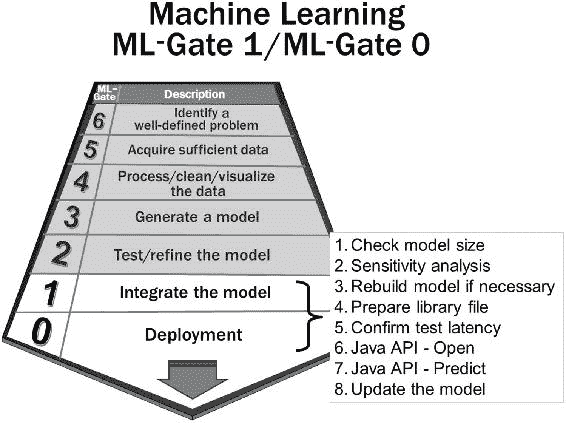 Figure 6-1

ML-Gate 1/0，模型集成/部署

这最后两个 ML-gate 代表 ML 开发管道的“业务端”。它们代表了管道中的最后步骤，在这些步骤中，您会意识到在处理数据、算法和模型的早期阶段所做的所有艰苦工作的好处。模型集成和部署是最明显的阶段，这些阶段使您能够将应用程序货币化。

## 6.2 管理模型

In ML application development, the model is one of your key assets. You must carefully consider how to handle the model, including

*   模型规模考虑因素

*   模型版本控制

*   更新模型

模型可能会变得非常大，您需要首先确保您创建的模型可以物理地驻留在您的目标设备上。

### 设备限制

When you use ML models from the cloud providers, you simply rely on network connectivity and a cloud provider API to access models and make predictions. Storing prebuilt models on devices is a different approach, requiring you to understand the limitations of the target device. Table [6-1](#Tab1) shows the typical hardware storage specifications for two Java devices, Android and Raspberry Pi.Table 6-1

设备处理/存储摘要

<colgroup class="calibre12"><col class="tcol"> <col class="tcol"> <col class="tcol"></colgroup> 
| 

规格

 | 

机器人

 | 

树莓派

 |
| --- | --- | --- |
| 设备种类 | 中端设备，如 Moto X4 (2018) | 皮 3B+ (2017) |
| 操作系统 | Android 8.1(奥利奥) | Linux 操作系统 |
| 中央处理器 | 八核 ARM Cortex-A53 2.2 GHz | 4x ARM Cortex-A53，1.2 GHz |
| 国家政治保卫局。参见 OGPU | 肾上腺素 508 | Broadcom 视频会议四 |
| 内部闪光灯 | 32GB | 不适用的 |
| 随机存取存储 | 3GB RAM | 1gb DDR 2(900 MHz) |
| 外部闪光灯 | microSD，最高 256GB | microSD，最高 256GB |

虽然这些设备的架构和 CPU 技术有些相似，但该表显示，典型的 Android 设备比 Pi 3B+具有更高的处理能力和存储容量。

The device specifications for Android vary widely. Table [6-1](#Tab1) shows a typical mid-tier device and the latest revision Raspberry Pi, the Pi 3B+. Both devices support external SD cards for storage. On the Pi, you must use this external storage for your application code and the ML model. On Android devices, there is also internal storage, typically 32GB, sometimes up to 64GB or higher on the flagship phones. There are several reasons to use Android internal storage for ML models:

*   对于读取操作，内部存储的性能是外部存储的 3 倍。对于写操作，这种差异通常并不明显。

*   很多安卓设备都不支持外置 SD 卡。

*   在最近的 Android 版本中，外部存储权限变得越来越严格。

在 Android 设备上看到大小超过 300MB 的应用程序是很常见的。这并不意味着您应该创建尺寸相匹配的模型。庞大的模型很难管理。大型模型的主要缺点是加载它们所花费的时间。你会看到，对于 Android，最好的方法是在后台线程上加载模型，你希望加载操作在几秒钟内完成。在“项目”一章中，您将在应用程序启动时加载 ML 模型，同时显示启动闪屏。

### 最佳模型尺寸

In Chapter [5](5.html), you saw model accuracy, model training, and model testing times varied for each of the classification algorithms discussed. There is an additional factor, model size, which is equally important to consider. Table [6-2](#Tab2) shows the relative priority of these factors.Table 6-2

模型创建因素

<colgroup class="calibre12"><col class="tcol"> <col class="tcol"> <col class="tcol"></colgroup> 
| 

因素

 | 

优先

 | 

理由

 |
| --- | --- | --- |
| 模型训练时间 | 低的 | 训练时间很重要；然而，当您在边缘的应用程序中部署静态模型时，优先级较低，因为您总是可以应用更多的资源(甚至可能在云中)来训练模型。 |
| 模型测试时间 | 中等 | 如果算法生成的复杂模型需要相对较长的测试时间，这可能会导致设备在进行预测时出现延迟或性能问题。 |
| 模型精度 | 高的 | 模型精度必须足以产生明确定义的问题所需的结果。 |
| 模型尺寸 | 高的 | 将预训练的 ML 模型部署到设备上时，模型的大小必须与目标设备的内存和处理资源一致。 |

Weka allows you to save models by right-clicking on a ***Result List*** item after a classification completes. Table [6-3](#Tab3) shows the size of several models created using the specified model options. There are two entries for RF algorithm, one representing ten iterations (i=10) and another representing one hundred iterations (i=100).Table 6-3

模型大小汇总，各种分类算法

<colgroup class="calibre12"><col class="tcol"> <col class="tcol"> <col class="tcol"> <col class="tcol"></colgroup> 
| 

算法

 | 

选择

 | 

模型尺寸

 | 

准确度(%)

 |
| --- | --- | --- | --- |
| 随机森林 | i=10 | 5.5 兆字节 | 87.7% |
| 随机森林 | i=100 | 55.2 兆字节 | 90.5% |
| KNN-kstars | 默认 | 3.6 兆字节 | 82.8% |
| 朴素贝叶斯 | 内核默认值 | 51 KB | 72.9% |
| SVM/SMO | c=2 | 51.9 兆字节 | 83.4% |

To understand how the factors interrelate, you can perform a sensitivity analysis. Consider the RF algorithm. You know the number of iterations, i, is a key variable for determining how deep or how many trees the algorithm produces. More iterations means more trees, which results in each of the following:

*   更高的精确度

*   更长的创建时间

*   更大的模型尺寸

You can use the Weka ML environment to run a series of model creations to see how these factors relate. Figure [6-2](#Fig2) shows a sensitivity analysis plotting model accuracy against model size for varying settings of the iteration (i) parameter.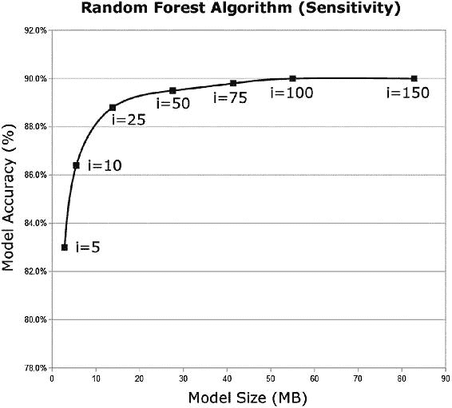 Figure 6-2

灵敏度分析、模型大小与模型精确度

使用 RF 算法时，您会立即注意到迭代次数(I)和模型大小之间的关系是线性的。例如，在所有其他参数相同的情况下，i=5 的模型的大小为 2.76 MB，i=50 的模型的大小为 27.6MB。如图 [6-2](#Fig2) 所示，准确性并不相同。在本例中，RF 模型达到了大约 90%的精度上限。就模型大小而言，90MB 模型(i=150)不会比 40MB 模型(i=75)产生更高的精度。

曲线上的最佳点是曲线拐点处的切线。你可以看到这个点位于 i=10 和 i=25 之间。i=10 的值在模型大小仅为 5.5MB 的情况下产生了相当好的精度，所以让我们继续这个配置。注意，这些精度值不包括 10 倍训练；采用这种测试方法可以进一步提高准确性。

影响模型大小的另一个因素是数据集大小。您使用的 ***PAMAP2_dataset*** 很大。***subject 101-cleaned . ARFF***包含 22846 个实例。当您删除无用的列(属性)时，您已经对数据集执行了 ***特征缩减*** (也称为维度缩减)。但是，请考虑是否要减少数据集中的实例数量。这可能会导致模型尺寸减小，但可能会牺牲准确性。

Figure [6-3](#Fig3) shows a second sensitivity analysis to help you explore this effect. This chart plots the number of training instances vs. the model size, using a constant value of ten iterations (i=10) and reducing the training instances by filtering the dataset input file.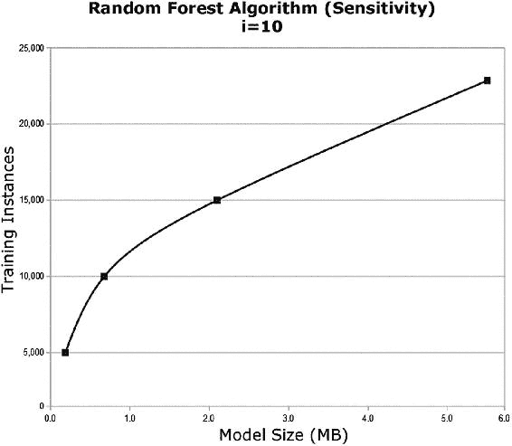 Figure 6-3

数据大小敏感性分析

图 [6-3](#Fig3) 显示了具有不同训练实例大小的四个模型。图左侧的三个点代表完整数据集的子集。与模型大小的关系不是线性的，因为您可以观察到曲线中的弯曲。曲线的斜率表示训练实例的效用。随着图右侧的斜率减小，每个训练实例的效用也降低。这也与精度上限有关。

问题是，您应该删除哪些实例？所有的 ML 环境，包括 Weka，都有过滤器来帮助减少实例，尽量减少数据集类的完整性。

Of course, reducing the training data will eventually reduce accuracy. Finding the right balance is a trade-off decision, and you can use the sensitivity analysis to help you choose the most efficient point along the curves.

> *优化设备的模型尺寸包括对所选算法的关键参数进行灵敏度分析。创建模型以观察它们的大小，然后沿着灵敏度曲线选择切点以进行最佳权衡。*

每种算法都有自己的缩放属性。对于这里显示的灵敏度分析，您只考虑了一个算法(RF)和一个参数(迭代)。像 Weka 这样的 ML 环境使得实验参数来优化你的模型变得很容易。

DL 算法的一个巨大优势是，一般来说，它们的大小不会像 RF 算法那样与数据集的大小成线性比例关系。诸如 CNN 和 RNN 算法之类的 DL 算法使用隐藏层。随着数据集的增大，隐藏图层的数量不会增加。DL 型号变得“更智能”,但尺寸却没有相应增加。

### 模型版本控制

一旦创建，您应该将您的 ML 模型视为有价值的资产。尽管您没有在创建过程中编写代码，但是在管理它们时，您应该将它们视为代码等价物。这意味着 ML 模型被置于版本控制之下，就像您的应用程序源代码一样。

Whether or not you store the actual model, a serialized Java object in the case of Weka’s model export, depends on if the model is reproducible deterministically. Ideally, you should be able to reproduce any of your models from the input components, including

*   资料组

*   输入配置，包括过滤器或预处理

*   算法选择

*   算法参数

对于可重现的确定性模型，没有必要存储模型本身。相反，您可以选择存储输入组件。当创建时间很长时，例如使用 KNN 算法处理大型数据集时，存储模型本身以及输入组件是有意义的。

The following tools are free and open source, and promise to allow you to seamlessly deploy and manage models in a scalable, reliable, and cost-optimized way:

*   [*【https://dataversioncontrol.com】*](https://dataversioncontrol.com)

*   [*【https://datmo.com】*](https://datmo.com)

这些工具支持与 AWS 和 GCP 等云提供商的集成。它们通过保证所有基于模型的资产的可再现性来解决版本控制问题。

### 更新模型

当您开始部署您的 ML 应用程序时，要考虑的一个关键方面是您将来如何更新模型。本章后面的示例项目将在应用程序启动时直接从项目的资产目录中加载 ML 模型。当开始 ML 应用程序开发时，这是最简单的方法，但是在将来升级应用程序-模型组合时，这是最不灵活的方法。

A more flexible architecture is to abstract the model from the app. This provides the opportunity to update the model in the future without the need to rebuild the application. Table [6-4](#Tab4) summarizes some of the approaches for model management.Table 6-4

模型管理方法

<colgroup class="calibre12"><col class="tcol"> <col class="tcol"> <col class="tcol"></colgroup> 
| 

方法

 | 

描述

 | 

赞成/反对

 |
| --- | --- | --- |
| 植入的 | 将模型包含在项目资产中。 | 简单，但最不灵活的方法。 |
| [计] 下载 | 不要将模型存储在设备上，而是在应用程序初始化时从云中下载。 | 需要网络连接。适合非常小的型号。 |
| 惰性装载 | 您可以将标准的图像加载方法应用于 ML 模型。这是前两种方法的混合组合。 | 有许多图书馆可供使用。灵活，但不适合大型模型。 |
| ***sync adapter**T3*和 **ContentManager**** | 可以使用内置的 Android 网络同步( ***SyncAdapter*** )和内容共享( ***ContentManager*** )类。 | 高灵活性。后台服务架构。 |
| 推送消息 | 使用推送服务交付模型更新，例如 Google 的 Firebase 云消息(FCM ),或者 MQTT 等开源替代服务。 | 低延迟。后台服务架构。 |
| 实时流 | 使用这种方法，模型会随着新数据的出现而不断更新。 | 与预建模型截然不同的架构。 |

如果您希望采用延迟加载或推送消息的方法，在作者的 Android 项目手册中有针对每种方法的示例项目，可以很容易地进行调整以支持 ML 模型:

[*【https://github.com/apress/practical-android】*](https://github.com/apress/practical-android)

在接下来的专题章节中，为了简单起见，你将使用嵌入式模型方法。对于生产应用，首选表 [6-4](#Tab4) 中更先进的方法。

### 管理模型:最佳实践

A summary of best practices for creating and handling prebuilt models for on-device ML applications:

*   最佳模型大小取决于输入数据集大小、属性复杂性和目标设备硬件能力。

*   准备模型灵敏度分析，绘制模型精度与模型尺寸的关系图。在算法上限左侧的曲线上选择一个点。

*   准备模型敏感性分析，绘制训练实例数量与模型大小的关系图。选择曲线上斜率较高的点。

*   对于 Android 和 Raspberry Pi 设备，一个好的模型大小指南是 5MB -50MB。如果您正在考虑更大的 CML 模型，请确保您获得了足够大的准确性，以证明更大的尺寸是合理的。

*   使用版本控制来管理所有的源数据、算法选择、算法参数和部署的模型。

*   决定您将使用哪种架构来更新您的应用程序所使用的模型。

在接下来的部分中，您将探索 Weka Java API，如何加载模型，以及如何在设备上进行预测。

## 6.3 Weka Java API

您已经看到了从简单的 CLI 和各种 Weka GUI 应用程序(包括 Explorer 和 KnowledgeFlow)访问 Weka 分类器和聚类器是多么容易。当您可以从 Java 代码中访问 Weka 类时，真正的力量就释放出来了。所有的 Weka 类都可以从 Java APIs 访问。

The Weka Java APIs allow you to do the following from Java code:

*   设置选项。

*   创建和管理数据集属性和实例。

*   加载和保存 ARFF 或 CSV 格式的数据。

*   加载并保存序列化模型。

*   将大量 Weka 过滤器中的任何一个应用于数据集。

*   使用任意 Weka 算法对数据集进行分类或聚类。

*   选择属性作为分类标签。

*   可视化数据集，尽管 Android 平台不提供该功能。

只需几行 Java 代码就可以复制您使用 Weka Explorer 执行的大多数任务。

接下来，我将回顾一些最重要的 Java API 操作，首先使用通用的 Java API，然后专门针对 Android 平台。

### 加载数据

您将 ML 模型放在边缘的方法意味着您通常将加载在更高性能的桌面或服务器机器上创建的预训练模型。但是，有时可能需要在边缘加载数据集。

The Weka API allows you to load CSV or ARFF data files, just as you did in the Weka desktop environment. The following code demonstrates loading CSV and ARFF files using the API:001   import weka.core.converters.ConverterUtils.DataSource; 002   import weka.core.Instances; 003   // 004   // Load ARFF file 005   // 006   DataSource sourceARFF = new DataSource("/your-directory/your-data.arff"); 007   Instances dataARFF = sourceARFF.getDataSet(); 008   // 009   // Load CSV file 010   // 011   DataSource sourceCSV = new DataSource("/your-directory/your-data.csv"); 012   Instances dataCSV = sourceCSV.getDataSet();

你使用 ***实例*** 对象来存储数据。您可以在运行分类或聚类分析算法之前对数据应用筛选器。Weka API 支持您在基于 GUI 的桌面环境中使用的相同过滤器和算法选项。

### 使用选项

The Weka API supports options using ***String Arrays*** with the following two approaches:001   // Manually create the String Array of options: 002   // 003   String[] options1 = new String[2]; 004   options1[0] = "-R"; 005   options1[1] = "1"; 006   // 007   // or, you can automatically create the options String Array using splitOptions: 008   // 009   String[] options2 = weka.core.Utils.splitOptions("-R 1");

一旦定义了选项 ***字符串数组*** ，就可以将它们应用到过滤器或算法中，如下例所示。

### 应用过滤器

You can apply filters to ***classes***, ***attributes***, or ***instances***. If you have an ***Instances*** object containing the dataset called ***data***, you can apply a filter as follows:001   import weka.core.Instances; 002   import weka.filters.Filter; 003   import weka.filters.unsupervised.attribute.Remove; 004   import weka.core.converters.ConverterUtils.DataSource; 005 006   // Load Data 007   DataSource source = new DataSource("/your-directory/your-data.arff"); 008   Instances data = source.getDataSet(); 009 010   // Set the options for "range" and "first attribute" 011   String[] options = new String[2]; 012   options[0] = "-R"; 013   options[1] = "1"; 014 015   // Create a new instance of the "remove" filter and set the options 016   Remove remove = new Remove(); 017   remove.setOptions(options); 018   remove.setInputFormat(data); 019 020   // Apply the filter to the data object 021   Instances newData = Filter.useFilter(data, remove);

在这个例子中，您正在从 ***数据*** 中删除第一个属性(列)，并且更新存储在 ***newData*** 对象中。

### 设置标签属性

As you saw in Chapter [2](2.html), the label attribute can be any of the attributes in the dataset. Often, it is the first attribute, while some datasets include it as the last. It is a best practice to specify the label attribute in your Java code. The Weka API provides the ***setClassIndex*** to set the label attribute for classification:001   // Set the class attribute (Label) as the first class 002   dataTest.setClassIndex(0);

始终仔细检查类索引的数据类型是否正确，尤其是在读入 CSV 数据时。回想一下前面的 PAMAP2_dataset，您需要使用 Weka 过滤器将标注属性(类索引)转换为正确的名义类型。ARFF 文件指定了数据类型，因此不需要转换过滤器。

### 构建分类器

Building a classifier with the Weka API is a simple process requiring only a few lines of code, first specifying the options and then passing the options and the data to the classifier’s ***buildClassifier*** method.001   import weka.classifiers.trees.J48; 002 003   // Set the option for "unpruned tree" 004   String[] options = new String[1]; 005   options[0] = "-U"; 006 007   // Specify the tree classifier 008   J48 tree = new J48(); 009   tree.setOptions(options); 010   tree.buildClassifier(data);

所有的 Weka 分类器都在 API 中可用，包括第 [4](4.html) 章中讨论的四个最重要的分类器。

### 培训和测试

The Weka API allows you to train and test classifiers. You can train a classifier by passing training data (***Instances*** object) to the ***buildClassifier*** method. The ***evaluateModel*** method allows you to test a trained classifier.001   import weka.core.Instances; 002   import weka.classifiers.Evaluation; 003   import weka.classifiers.trees.J48; 004   import weka.classifiers.Classifier; 005 006   Instances train = <your training data> 007   Instances test =  <your testing data> 008 009   // Train classifier 010   try { 011       Classifier cls = new J48(); 012       cls.buildClassifier(train); 013 014       // Evaluate the classifier 015       Evaluation eval = new Evaluation(train); 016       eval.evaluateModel(cls, test); 017       System.out.println(eval.toSummaryString("\nResults\n======\n", false)); 018   } catch (Exception e) { 019       // Handle Weka exception 020       e.printStackTrace(); 021   }

您通常不会在边缘设备上训练分类器，但是拥有这种能力是很好的。

### 构建集群

Building a clusterer with the Weka API is also straightforward. You can use the ***buildClusterer*** method of the ***clusterer*** object to train the clusterer.001   import weka.clusterers.EM; 002 003   // Set the options for max iterations 004   String[] options = new String[2]; 005   options[0] = "-I"; 006   options[1] = "10"; 007 008   // Instantiate the EM Clusterer instance 009   EM clusterer = new EM(); 010   clusterer.setOptions(options); 011   clusterer.buildClusterer(data);

您可以使用***evaluateClusterer***方法评估一个集群器。

### 加载模型

In Chapter [5](5.html), you saw how to save models created in the Weka ML environment. Now you can use the Weka API to load these pretrained models. Use the Java ***InputStream*** class to specify the model filename, and then provide the stream to the Weka API ***SerializationHelper*** class.001   // Define a Weka Classifier Object 002   Classifier mClassifier = null; 003 004   // Load the Classifier from local storage 005   try { 006       File wekaModelFileUnix = new File("/path/modelname.model"); 007       FileInputStream fis = new FileInputStream(wekaModelFileUnix); 008       mClassifier = weka.core.SerializationHelper.read(fis); 009   } catch (Exception e) { 010       // Handle Weka model failed to load 011       e.printStackTrace(); 012}

在本章的后面，您将利用这种方法为 Android 加载 Weka 库模型。

### 做预测

You can use the Weka API to make predictions, or to say it more formally, to classify a sample. The ***classifyInstance*** method is available for all of the classifiers.013   import weka.core.Instances; 014   import weka.core.converters.ConverterUtils.DataSource; 015   import weka.classifiers.Classifier; 016 017   // Load unlabeled data 018   DataSource source = new DataSource("/your-directory/your-unlabeled-data.arff"); 019   Instances unlabeled = source.getDataSet(); 020 021   Classifier mClassifier = null; 022 023   // set class attribute 024   unlabeled.setClassIndex(unlabeled.numAttributes() - 1); 025 026   // classify the instances 027   for (int i = 0; i < unlabeled.numInstances(); i++) { 028        double clsLabel = mClassifier.classifyInstance(unlabeled.instance(i)); 029 030   }

你将在本章的后面使用这个逻辑来实现活动跟踪器 Android 应用程序。

## 6.4 安卓版 Weka

在 Android 设备上使用 Weka ML 库最有用的方法是将库移植到 Android。这项任务并不琐碎，但一旦完成，Android 的一个 ***Weka.jar*** 文件就是一份持续赠送的礼物。

在整个 ML-Gates 管道中使用相同版本的 Weka 非常重要。如果在桌面上使用最新稳定版本的 Weka 创建 ML 模型，则必须在设备上使用相同版本的 Weka 以确保兼容性，尤其是在打开序列化的预训练模型时。Weka 是稳定的，所以这不会造成大问题。

The main issue with porting Weka to Android is Weka's integration with the following Java packages:

*   AWT:本机系统 GUI 代码的 Java 接口

*   Swing:一个纯 Java GUI，它使用 AWT 创建窗口，然后在窗口中操作对象

*   Net Beans:用于开发 Java 应用程序的模块化组件平台

Weka 依赖这些软件包来实现 GUI 相关的功能。Android 如此出色的原因之一是它不使用任何 GUI 包。当然，这也是 Weka 难以移植到 Android 的原因。

幸运的是，在 Android 上你不需要 Weka 的 GUI 功能。您只需要访问数据实用程序、过滤器、算法和序列化方法。然而，在您可以为 Android 构建 Weka 库之前，您需要解决由于使用这些包而导致的 Android 上的构建问题。

书籍资源包括您将用于 Android 项目的 Weka jar 文件:

**WEKA-Android-3-8-1 . jar**T3]

简单的方法是获取 Weka jar 文件，并简单地将其添加到您的 Android Weka 项目中。

为了演示如何为 Android 构建***Weka-Android-3-8-1 . jar***库，本书参考资料包括一个完整的 Eclipse 项目。该项目也可以在作者的 GitHub 页面上获得:

**WEKA-Android-3-8-1 . zip**T3]

[***【https://github . com/wick apps/WEKA-Android-3-8-1***](https://github.com/wickapps/Weka-Android-3-8-1)

在将 Weka 库移植到 Android 时，Eclipse 项目有助于探索解决许多与 GUI 相关的编译错误所需的代码更新。如果您需要为不同的 Weka 版本创建库文件，该项目也可以作为指南。

### 在 Eclipse 中创建 Android Weka 库

You have two approaches to port Weka to Android.

*   **自下而上的方法**:决定你到底需要哪些功能，比如七个最有用的 ML 算法。从底层开始，识别这些算法的特定类，并开始只包含那些类，逐步解决任何需要的依赖性问题。当所有的依赖关系都解决后，您的库将拥有最少的功能集。

*   **自顶向下的方法**:从顶部开始，包括 Android 构建的所有明显的 Weka 类(不包括知识流)。当您将项目作为 Android 项目导入 Eclipse 时，大量错误将需要手动解决。

本节将演示后一种方法。自顶向下的方法比自底向上的方法需要更多的努力，但是一旦你解决了所有的问题，你将拥有一个更灵活、更强大的 Android 项目库。该库将支持所有的 Weka 过滤器和算法，在新版本 Weka 发布之前，您不需要重新构建该库。

The following steps summarize the initial setup process for porting Weka to Android:

*   从支持 Java 7 的最新版本 Weka 开始(稍后会有更多内容)，版本 3.8.1。导航到 ***weka-src.jar*** 文件。用 ***7Zip*** 实用程序解压文件。导航到***src->main->Java->WEKA***。在做了一些修改后，您将把这个基本目录导入 Eclipse。

*   删除所有的 ***gui*** 目录，以下文件除外，因为这些文件与其中包含的对象高度相关，所以需要保留:

    ***genericpropertiesgreator . excludes***

    ***GenericPropertiesCreator.java***

    *****genericpropertiesgreator . props*****

    *****HierarchyPropertyParser.java*****

    *******装载机. java*******

    *******Logger.java*******

    *********TaskLogger.java*********

*******   删除整个 ***知识流*** 目录。Android 上不需要 ***知识流*** 应用。

    *   删除基础目录下的两个文件，***plugin manager . props***和【Run.java】**。**

    ***   打开 Eclipse。

    *   创建一个新的 Android 项目，命名为***Android-Weka-3-8-1***。

    *   将项目设置为 ***库项目。*** 的设置是在 ***Java 构建路径*** 中设置的。

    *   新项目高亮显示后，选择 ***【导入】- >通用- >文件系统**-*。导入前面创建的 ***weka*** 基础目录。******** 

 ****Android Weka 项目现在已经建立，但是在您成功地为 Android 构建 Weka 库之前，还有许多错误需要解决。

最新版本的 Weka 需要 Matrix Toolkit for Java(***【mtj】***)库。Matrix Toolkit for Java 是一个用于执行数值线性代数的开源 Java 软件库。以下是 for Matrix Toolkit for Java 资源库的链接:

***https://github . com/fommil/matrix-toolkit-Java***

从图书资源中复制 ***mtj-1.0.1.jar*** 库文件，或者从 Maven 资源库中下载库文件:

[***https://mvn repository . com/artifact/com . Google code . matrix-toolkits-Java/mtj/1 . 0 . 1***T5】](https://mvnrepository.com/artifact/com.googlecode.matrix-toolkits-java/mtj/1.0.1)

Maven 资源库还包括 Maven 或 Gradle 构建的说明。将 ***mtj-1.0.1.jar*** 作为外部库文件添加到 Eclipse 项目中。

You may notice that there are many errors related to the Java handing of ***Vectors*** and ***ArrayLists*** in the code. The latest versions of Weka rely heavily on ***ArrayLists***. Table [6-5](#Tab5) shows the Weka Java requirements. Java 7 (1.7) is the minimum Java version required for the Weka version 3.8.1\. The newest stable version of Weka is 3.8.2 which requires Java 8 (1.8).Table 6-5

Weka 版本 Java 要求

<colgroup class="calibre12"><col class="tcol"> <col class="tcol"> <col class="tcol"> <col class="tcol"> <col class="tcol"> <col class="tcol"> <col class="tcol"></colgroup> 
|   | 

Java 版本

 |
| --- | --- |
| 

One point four

 | 

One point five

 | 

one point six

 | 

One point seven

 | 

One point eight

 |
| --- | --- | --- | --- | --- |
| **Weka 版本** | <3.4 | X | X | X | X | X |
| 3.4.x | X | X | X | X | X |
| 3.5.x | 3.5.0-3.5.2 | >3.5.2 | X | X | X |
| 3.6.x |   | X | X | X | X |
| 3.7.x |   | 3.7.0 | >3.7.0 | >3.7.13 | X |
| 3.8.x |   |   |   | 3.8.1 | >3.8.1 |
| 3.9.x |   |   |   | 3.9.1 | >3.9.1 |

但是，请记住，Android 还不支持完整的 Java 8 (1.8)。Android 确实支持 Java 8 的一些特性。Android 对 Java 8 的最新支持可以在这里找到:

[*【https://developer.android.com/studio/write/java8-support】*](https://developer.android.com/studio/write/java8-support)

表格中突出显示的单元格显示了最佳设置:Weka 版本 3.8.1 运行在 Java 版本 1.7 上，Android 支持 Java 版本 1.7。

To minimize the compile errors for Weka on Android, set the Eclipse compiler compliance level to Java version 1.7 as shown in Figure [6-4](#Fig4). The default value is usually Java 6 (1.6).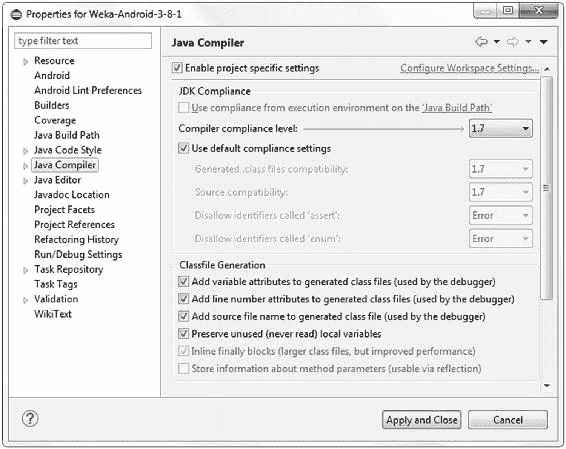 Figure 6-4

Eclipse Java 编译器设置

At this point, you have resolved many build errors, but there are still many build issues that you need to manually resolve. Most of the remaining errors are due to dependencies on the ***PackageManager*** or ***PluginManager*** classes. The errors can be resolved with the following resolution hierarchy:

*   删除有问题的文件。

*   删除类中的方法或函数。

*   通过修改有问题的方法或函数中的代码来解决错误。这是最后一招，当前面两种方法导致更多的依赖问题时，就需要使用这一招。

With all errors in the Android Eclipse project resolved, you are ready to export the Weka library for Android. Choose ***File➤Export➤Jar Library*** from the Eclipse main menu. Figure [6-5](#Fig5) shows the export.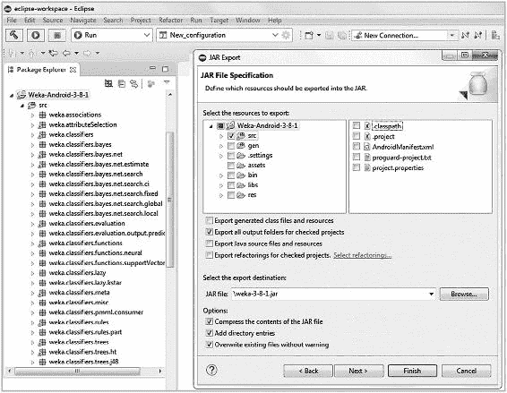 Figure 6-5

Eclipse 导出 Weka 库文件

库文件的大小只有 3.3MB，尽管它包含了 Android 所需的所有 Weka Java API 类。该库的内存占用量小，非常适合移动设备。该库在大小/性能平衡方面可以与任何移动 ML 库相媲美。

接下来，您将探索如何为设备 ML 应用程序使用该库。

### 在 Android Studio 中添加 Weka 库

Add the Weka ML library to Android Studio with these steps:

*   在你的 Android Studio 项目的 ***app*** 级别创建一个 ***libs*** 目录。

*   将***Android-Weka-3-8-1 . jar***文件复制/粘贴到 ***libs*** 目录中。

*   右键点击***Android-Weka-3-8-1 . jar***文件，然后点击 ***添加为库*** ，如图 [6-6](#Fig6) 所示。

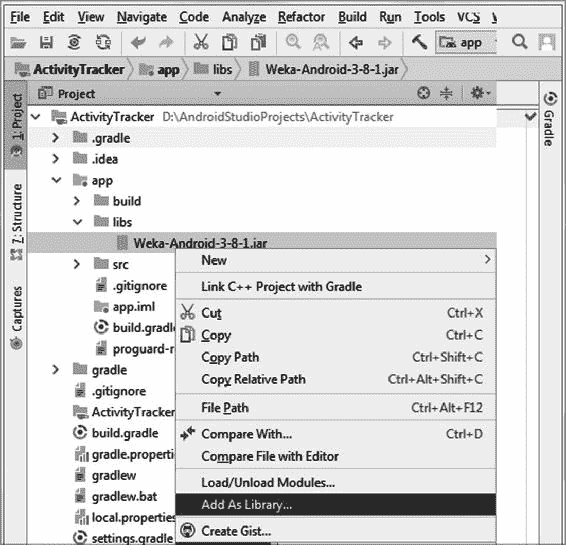 Figure 6-6

Android Studio 添加库

Weka API 将从 Android Java 应用程序中获得。

Figure [6-7](#Fig7) shows a project in Android Studio after the library has been imported. On the left side you can see the exploded Weka directory structure, and at the top of the right side panel you can see several library imports required by the application to handle the requested Weka API classes.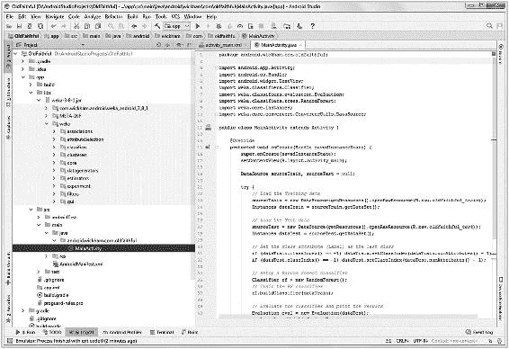 Figure 6-7

Android Studio 的 Weka 库

## 6.5 Android 集成

The Android Weka library makes it easy to integrate ML for Android. In this section, you will implement two simple Android apps to demonstrate the following basic ML integrations:

*   Weka Model Create :这个应用程序将演示在 Android 中直接从数据创建 ML 模型。

*   **Weka 模型加载**:这个应用程序将加载一个预训练的 ML 模型，并用批处理数据集实例测试该模型。

第一个项目是 Weka API 功能的有用演示。第二个项目是一个更实用的架构，原因在前面的章节中讨论过。

### 项目:Weka 模型创建

For this project, you will include the following two data files, derived from the Old Faithful geyser clustering example in Chapter [5](5.html), as part of the app’s assets. Although you are including the data files directly in the project, the app could just as easily download these text files from the cloud using a network operation.

*   ***old faithful _ train . arff***:章节 [5](5.html) 聚类示例中生成的 ARFF 数据文件的子集，包含前 201 个实例。

*   ***old faithful _ test . arff***:第五章[聚类示例中生成的 ARFF 数据文件的子集，它包含数据集的最后 71 个实例。](5.html)

这个 Weka 模型创建应用程序将使用第一个文件作为训练数据，从头开始构建一个模型。请注意，如果您想用单个数据文件实现应用程序，您可以使用过滤器来执行文件分割。使用过滤器也可以进行 k 倍交叉验证。

这个 app 技术上是一个分类 app。旧的忠实数据最初是一个聚类问题，但是回想一下当 DBSCAN 算法完成聚类操作时，您保存了结果，包括新分配的 ***clusterID*** 到新的 ARFF 文件。测试模型时，使用已知的分类分配来确定分类器的准确性。

Table [6-6](#Tab6) shows the project summary.Table 6-6

Weka 模型创建项目摘要

<colgroup class="calibre12"><col class="tcol"> <col class="tcol"></colgroup> 
| 

**项目名称:Weka 模型创建**

**来源:*****WEKA _ model _ create . zip***

**类型:Android**

**注意:创建一个随机森林模型，用训练数据集训练它，用测试数据集评估分类器，并在 TextView 中显示结果。**

 |
| --- |
| 

文件

 | 

描述

 |
| --- | --- |
| ***app->libs->**T3】***WEKA-Android-3-8-1 . jar**T3] | Eclipse 项目生成的用于 Android 的 Weka jar 文件。 |
| ***app->src->main->Java->******MainActivity.java*** | 主 Java 源代码文件。该项目只有一个活动。 |
| ***【应用】>【src】>【main】>【RES】>【layout】******activity _ main . XML*** | 单屏幕显示输出的布局文件。 |
| ***【应用】>【src】>【main】>【RES】>【raw】******old faithful _ train . ARFF**T3】* | 训练数据集，ARFF 格式的 201 个实例。 |
| ***【应用】>【src】>【main】>【RES】>【raw】******old faithful _ test . ARFF**T3】* | 测试数据集，ARFF 格式的 71 个实例。 |
| ***【应用】>【src】>【main】>【RES】******【雄激素固定。xml*** | 清单文件。 |

您可以使用简单的复制粘贴将三个外部文件(Weka jar 库和 ARFF 文件)导入到相应的 Android Studio 目录中。您将使用其中一个 ARFF 文件来训练模型，并使用第二个文件来测试模型。这与您在桌面 Weka Explorer 中选择 ***分割测试选项*** 的方法相同。

The key points of ***MainActivity.java*** are as follows:

*   Weka 在第 6-10 行导入，由 Android-Weka-3-8-1.jar 文件提供。

*   第 31 行和第 32 行使用的 ***setClassIndex*** 方法将属性标签设置为训练数据集和测试数据集的最后一个类。

*   在第 24 和 28 行，数据被加载到每个数据集文件的 ***实例*** 对象中。

*   RF 模型在第 40 行创建。

*   RF 模型在线 42 处被训练。

*   RF 模型采用默认选项，因为您没有指定任何附加选项，如本章前面所示。

Listing [6-1](#PC10) shows the complete ***MainActivity.java*** code.001   package android.wickham.com.WekaModelCreate; 002 003   import android.app.Activity; 004   import android.os.Bundle; 005   import android.widget.TextView; 006   import weka.classifiers.Classifier; 007   import weka.classifiers.evaluation.Evaluation; 008   import weka.classifiers.trees.RandomForest; 009   import weka.core.Instances; 010   import weka.core.converters.ConverterUtils.DataSource; 011 012   public class MainActivity extends Activity { 013 014       @Override 015       protected void onCreate(Bundle savedInstanceState) { 016           super.onCreate(savedInstanceState); 017           setContentView(R.layout.activity_main); 018 019           DataSource sourceTrain, sourceTest = null; 020 021           try { 022               // Load the Training data 023               sourceTrain = new DataSource(getResources().openRawResource(R.raw.oldfaithful_train)); 024               Instances dataTrain = sourceTrain.getDataSet(); 025 026               // Load the Test data 027               sourceTest = new DataSource(getResources().openRawResource(R.raw.oldfaithful_test)); 028               Instances dataTest = sourceTest.getDataSet(); 029 030               // Set the class attribute (Label) as the last class 031               if (dataTrain.classIndex() == -1) dataTrain.setClassIndex(dataTrain.numAttributes() - 1); 032               if (dataTest.classIndex() == -1) dataTest.setClassIndex(dataTest.numAttributes() - 1); 033 034               // Fill the summary information for the dataTrain set 035               int attrs = dataTrain.numAttributes(); 036               int classes = dataTrain.numClasses(); 037               int insts = dataTrain.numInstances(); 038 039               // Setup a Random Forest classifier 040               Classifier rf = new RandomForest(); 041               // Train the RF classifier 042               rf.buildClassifier(dataTrain); 043 044               // Evaluate the classifier and print the results 045               Evaluation eval = new Evaluation(dataTest); 046               eval.evaluateModel(rf, dataTest); 047 048               // Show the results 049               TextView tv_attrs = (TextView) findViewById(R.id.attrs); 050               tv_attrs.setText(String.valueOf(attrs)); 051               TextView tv_classes = (TextView) findViewById(R.id.classes); 052               tv_classes.setText(String.valueOf(classes)); 053               TextView tv_insts = (TextView) findViewById(R.id.insts); 054               tv_insts.setText(String.valueOf(insts)); 055               TextView results = (TextView) findViewById(R.id.results); 056               results.setText((CharSequence) eval.toSummaryString()); 057 058           } catch (Exception e) { 059               e.printStackTrace(); 060           } 061       } 062   } Listing 6-1

威卡模式创造 MainActivity.java

In this example, you create a RF classifier because of its generally superior performance, but you have a complete Weka jar file, so you could choose any of the classification or clustering algorithms. The following code excerpt shows how to use the Weka API to instantiate each of the seven most useful CML algorithms presented in Chapter [4](4.html):001   // Set up a Random Forest classifier 002   Classifier rf = new RandomForest(); 003 004   // Other classifiers or clusterers can be defined as follows 005   Classifier nb = new NaiveBayes(); 006   Classifier knn = new KStar(); 007   Classifier svm = new SMO(); 008   Clusterer EM = new EM(); 009   Clusterer KMeans = new SimpleKMeans(); 010   Clusterer DBSCAN = new MakeDensityBasedClusterer();

图 [6-8](#Fig8) 显示了该应用在 Android Studio 仿真器或设备上运行时的屏幕截图。

The ***numAttributes***, ***numClasses***, and ***numInstances*** methods of the ***dataTrain*** class provide a summary of the training data set. The ***evaluateModel*** method (line 46) of the classifier provides the classifier results.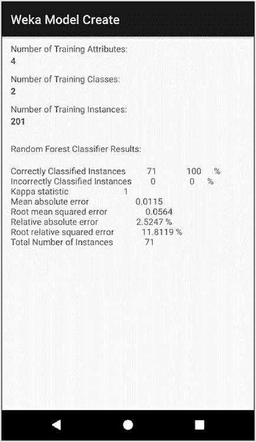 Figure 6-8

Android 应用程序:Weka 模型创建

分类器实现了 100%的分类结果——RF 算法在这个数据集上的表现令人印象深刻！

请注意，该应用程序只有 1.7MB，并且只包含 62 行 Java 代码(其中大部分代码只是显示结果所必需的)。这说明了 CML 对于边缘设备的效率。评估测试数据时，RF 模型在内存中。可以保存序列化的模型，甚至可以将从源数据创建的模型上传到云中。

在下一个示例中，您将进一步提高复杂性，处理更大的数据集，并加载预训练模型，而不是直接从数据源在设备上创建模型。

### 项目:Weka 模型加载

在这个项目中，您将把一个大得多的模型直接加载到应用程序中。您将在流程的每个阶段包含一些时间戳，以便检查性能。Android 有一些复杂的性能基准测试工具，但是您将只使用一个简单的时间戳。目标是确定 Android 上的库性能对于典型用例是否足够。

In Chapter [5](5.html), you created the following two models using the RF algorithm for ***subject101*** of the large ***PAMAP2_Dataset***:

*   ***RF _ i10 _ cross . model***:RF 迭代参数 i=10，模型大小约 5MB。使用 K-fold 交叉验证来训练模型。

*   ***RF _ i100 . model***:RF 迭代参数 i=100，模型大小约为 55MB。分割数据(2/3 训练和 1/3 测试)用于训练模型。

In this app, you will load these models directly into Android using the Weka API. Table [6-7](#Tab7) shows the project summary for the app.Table 6-7

Weka 模型加载项目摘要

<colgroup class="calibre12"><col class="tcol"> <col class="tcol"></colgroup> 
| 

**项目名称:Weka 模型加载**

**来源:*****WEKA _ model _ load . zip***

**类型:Android**

**注意:将预训练的模型加载到应用程序中，并对从文件中加载的 5000 个实例进行批量分类，以测试分类器。**

 |
| --- |
| 

文件

 | 

描述

 |
| --- | --- |
| ***app->libs->**T3】***WEKA-Android-3-8-1 . jar**T3] | Eclipse 项目生成的用于 Android 的 Weka jar 文件。 |
| ***app->src->main->assets->******RF _ i10 _ cross . model**T3】* | 射频预训练模型。 |
| ***app->src->main->Java->******MainActivity.java*** | 应用程序的主 Java 文件。该项目只有一个活动。 |
| ***【应用】>【src】>【main】>【RES】>【layout】******activity _ main . XML*** | 单屏幕显示输出的布局文件。 |
| ***【应用】>【src】>【main】>【RES】>【raw】>******RF _ i10 _ cross . model**T3】* | 预训练 RF 模型的第二个副本，用于演示从原始目录的访问。 |
| ***【应用】>【src】>【main】>【RES】>【raw】>******subject 101 _ cleaned _ 5k . ARFF**T3】* | 用 5，000 个实例测试分类模型的 ARFF 文件。 |
| ***【应用】>【src】>【main】>【RES】******【雄激素固定。xml*** | 清单文件。 |

在 Weka 桌面环境中创建模型之后，您可以直接将它们复制到 Android Studio 项目中。请记住，Weka 的桌面版本必须与 Android 库文件匹配，在这种情况下，Weka 发布版本为 3.8.1。

There are two methods to load pretrained models in Android:

*   **资产管理器**:使用 Android 资产管理器，从项目的 ***资产*** 目录中加载模型。

*   **原始文件**:从 app 的原始存储空间加载模型。

The following code excerpt shows how to load models using each approach. In each case, you use the Weka ***SerializationHelper*** class.001   // In Android, we have two ways we can load models directly from the file system 002 003   // The following code uses the AssetManager to load the model 004   // from the app->src->main->assets folder 005 006   AssetManager assetManager = getAssets(); 007   InputStream is = assetManager.open("rf_i10_cross.model"); 008   rf = (Classifier) weka.core.SerializationHelper.read(is); 009 010   // Alternatively, use the next line to load the model 011   // directly from the app->src->main->res->raw folder 012 013   rf = (Classifier) weka.core.SerializationHelper.read(getResources().openRawResource(R.raw.rf_i10_cross));

在命名保存的模型时，包含用作文件名一部分的算法是一个很好的做法。当您打开模型，并需要实例化一个匹配的算法分类器或聚类器时，这变得更加容易。可以使用 ***数组列表*** 操作从. model 文件中导出算法类型。

Because of the large model size, for this app, you wish to benchmark the following operations:

*   加载模型所用的时间

*   加载包含 5，000 个测试数据实例的文件所用的时间(ARFF 格式)

*   用 5，000 个测试实例评估模型所花费的时间(批量测试)

You will use the following function for time-stamping the operations performed by the app:001   public String getCurrentTimeStamp() { 002       return new SimpleDateFormat("HH:mm:ss.SSS").format(new Date()); 003   }

时间戳提供毫秒级的分辨率，因此您可以很好地了解分类器的执行速度。

Listing [6-2](#PC14) shows the ***MainActivity.java*** of the application. The key code highlights:

*   应用程序在第 26 行从本地存储中读取训练数据集。

*   标签属性在第 30 行设置。

*   应用程序在第 38 行将模型加载到一个 RF 对象中。

*   应用程序在第 49 行评估分类器。

*   StringBuilder 类构建应用程序输出。应用程序最终在第 56 行显示输出。 ***StringBuilder*** 类在第 55 行检索分类器功能。

001   package android.wickham.com.WekaModelLoad; 002 003   import ... 004 005   import weka.classifiers.Classifier; 006   import weka.classifiers.evaluation.Evaluation; 007   import weka.core.Instances; 008   import weka.core.converters.ConverterUtils; 009 010   public class MainActivity extends Activity { 011 012       @Override 013       protected void onCreate(Bundle savedInstanceState) { 014           super.onCreate(savedInstanceState); 015           setContentView(R.layout.activity_main); 016 017           ConverterUtils.DataSource sourceTrain, sourceTest = null; 018 019           StringBuilder builder = new StringBuilder(); 020           TextView results = (TextView) findViewById(R.id.results); 021 022           try { 023               // Load the Test data 024               builder.append("\n" + getCurrentTimeStamp() + ": Loading test data"); 025               sourceTest = new ConverterUtils.DataSource(getResources().openRawResource(R.raw.subject101_cleaned_5k)); 026               Instances dataTest = sourceTest.getDataSet(); 027               builder.append("\n" + getCurrentTimeStamp() + ": Test data load complete"); 028 029               // Set the class attribute (Label) as the first class 030               dataTest.setClassIndex(0); 031 032               Classifier rf; 033 034               builder.append("\n" + getCurrentTimeStamp() + ": Loading model"); 035               // The following code utilizes the AssetManager to load the model from the app->src->main->assets folder 036               AssetManager assetManager = getAssets(); 037               InputStream is = assetManager.open("rf_i10_cross.model"); 038               rf = (Classifier) weka.core.SerializationHelper.read(is); 039 040               // Alternatively, use the next line to load the model from the app->src->main->res->raw folder 041               // rf = (Classifier) weka.core.SerializationHelper.read(getResources().openRawResource(R.raw.rf_i10_cross)); 042 043               builder.append("\n" + getCurrentTimeStamp() + ": Model load complete"); 044               Toast.makeText(this, "Model loaded.", Toast.LENGTH_SHORT).show(); 045 046               // Evaluate the classifier 047               builder.append("\n" + getCurrentTimeStamp() + ": Starting classifier evaluation"); 048               Evaluation eval = new Evaluation(dataTest); 049               eval.evaluateModel(rf, dataTest); 050               builder.append("\n" + getCurrentTimeStamp() + ": Classifier evaluation complete"); 051 052               // Show the results 053               builder.append("\n\nModel summary: " +  eval.toSummaryString()); 054               // Add the classifier capabilities 055               builder.append("\nRF Model capabilities:\n" +  rf.getCapabilities().toString()); 056               results.setText((CharSequence) builder.toString()); 057 058           } catch (Exception e) { 059               e.printStackTrace(); 060           } 061       } 062 063       public String getCurrentTimeStamp() { 064           return new SimpleDateFormat("HH:mm:ss.SSS").format(new Date()); 065       } 066   } Listing 6-2

Weka 模型加载 MainActivity.java

该应用程序正在使用预训练模型对 5，000 个实例进行批量分类。如果您可以通过这个批处理操作获得不错的性能，那么您可以确信该架构足以对单个实例进行分类。

Figure [6-9](#Fig9) shows a screenshot of the app after it has finished its task.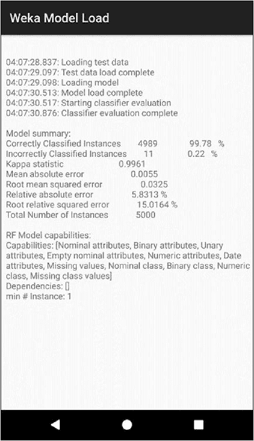 Figure 6-9

Weka 模型负载

所示的应用程序运行在 Android Studio 仿真器中。模型加载时间约为 1.5 秒，评估时间不到半秒。这些似乎是很好的结果。在下一节中，您将进一步探究性能。

批次分类的准确性非常高:在 5，000 个错误分类的实例中只有 11 个。这很可能是因为测试数据是最初用于建立模型的训练数据的子集。

Weka Model Load Android 应用程序证明，您可以在 Android 上加载大型、预训练的模型，并高效地进行批量分类。

## 6.6 Android Weka 型号性能

Several factors contribute to the overall performance of ML models on devices, including

*   模型尺寸

*   模型复杂性

*   设备的 CPU 和内存容量

*   模型的应用程序代码集成

The Weka Model Load app provides timestamps. You can run the app on different devices to benchmark the relative performance. Table [6-8](#Tab8) shows a calculated summary of the timestamps for three operations:

*   测试数据加载时间(加载 5000 个测试数据实例)

*   模型加载时间(加载 5MB RF PAMAP2 subject101 模型)

*   分类器评估

A special version of the app was created to run on the Amazon Fire Phone and Raspberry Pi. The app also ran in the Android studio Emulator and on a few devices, including the Moto X4, Sony Xperia, and an older Nexus tablet.Table 6-8

Android Weka ML 型号性能对比

<colgroup class="calibre12"><col class="tcol"> <col class="tcol"> <col class="tcol"> <col class="tcol"></colgroup> 
| 

设备

 | 

测试数据加载时间(5K)(秒。)

 | 

模型加载时间(5MB)(秒。)

 | 

分类器评估时间(秒。)

 |
| --- | --- | --- | --- |
| Android Studio 仿真器 | Zero point two eight | One point five six | Zero point three six |
| 摩托罗拉 X4 | Zero point two | One point two seven | Zero point six four |
| 索尼体验 | Zero point one six | One point one six | Zero point four five |
| Nexus 7 平板电脑 | One point five one | Three point five two | One point seven one |
| 亚马逊消防电话 | Zero point four seven | Two point seven six | Zero point nine three |
| 树莓 Pi 3b+ | Zero point six two | Three point four four | Zero point eight two |

Summary of the performance results:

*   对于 CPU 速度更快的新设备，分类时间不到 0.5 秒。

*   任何设备的内存都不是问题。5MB 型号很容易加载到内存中，尽管对于 CPU 速度较慢的设备来说没有那么快。

*   亚马逊 Fire 手机不再是一款相关的 Android 设备。它很旧，缺乏现代的 Android 版本，硬件规格也过时了。然而，你的代码在这个设备上运行良好的能力证明了重要的一点。

> 有时，您可能需要在不包含 Google Play 服务的 Android 设备上部署 CML 解决方案。您为 Android 部署的 CML 解决方案不需要任何 Google 服务，甚至不需要网络连接。

*   Android Studio 模拟器在对 5000 个实例进行分类时表现最佳。结果令人惊讶，因为通常你不会期望仿真器胜过实际的硬件。但是，请记住，分类器评估主要是 CPU 密集型操作(算法处理)，桌面的 CPU 比目标移动设备强大得多。

*   模型加载时间非常合理。典型的应用程序将对单个实例进行增量分类，正如您将在下一个示例中看到的，这将是一个比 5，000 个实例的批量分类快得多的操作。

那么，当您加载更大的模型时，性能会发生什么变化呢？您可能会发现这样的情况:您希望以牺牲更大的模型尺寸为代价来获得更高的精度。

When you built the RF model for i=10 iterations, you also built one for i=100 iterations. Recall it took much longer to create and the size was much larger, approximately 55MB. Table [6-9](#Tab9) shows a model load time comparison for the smaller and larger models.Table 6-9

Android Weka ML 型号性能对比

<colgroup class="calibre12"><col class="tcol"> <col class="tcol"> <col class="tcol"></colgroup> 
| 

设备

 | 

模型加载时间(5MB 模型 RF i=10)(秒。)

 | 

模型加载时间(50MB 模型 RF i=100)(秒。)

 |
| --- | --- | --- |
| Android Studio 仿真器 | One point five six | Twelve point six one |
| 摩托罗拉 X4 | One point two seven | Nine point nine eight |
| 索尼体验 | One point one six | Nine point four two |

There are several points to consider when creating and loading models of this increased order of magnitude:

*   虽然模型大了十倍，但是加载时间并不是线性的。在这种情况下，对于这些设备，加载时间大约要长八倍。

*   这种尺寸的模型大约需要 10 秒钟加载。这太长了，无法在应用程序初始化期间隐藏。大型模型将需要表 [6-4](#Tab4) 中讨论的模型管理策略之一。

*   整合这种规模数量级的模型是可行的，但您首先需要确定它们提供了足够高的精度优势。

现在，您对模型在 Android 移动设备上的性能有了一些信心，让我们将目标受众扩展到其他 Java 设备。

## 6.7 树莓 Pi 集成

回到第 [1](1.html) 章，你看到了 Java 设备的市场是巨大的；据甲骨文称，超过 30 亿台设备运行 Java。Raspberry Pi 是一个非常流行的可以运行 Java 的设备。在本节中，您将把 CML 模型部署到 Raspberry Pi。

熟悉 Pi 的开发人员也会熟悉 Arduino。Arduino 设备占用空间较小，因此不适合运行 Java。但是，如果您有 Arduino 应用程序，您可以使用开源 RXTX 库用 Java 控制这些设备。使用这个库，基于 Java 的主设备(如 Pi)可以处理 ML 操作，并与 Arduino 设备进行通信，以收集数据或输出模型结果。RXTX 库和其他信息可从以下网站获得:

[***【https://github . com/xtx/xtx】***](https://github.com/rxtx/rxtx)

[***【http://xtx . qbang . org/wiki/index . PHP/FAQ***](http://rxtx.qbang.org/wiki/index.php/FAQ)

Table [6-1](#Tab1) showed the basic hardware specifications of the Raspberry Pi 3 model b+. A quick glance at the table shows that the Pi has about one-half the processing and storage capability compared to a mid-tier Android device. Figure [6-10](#Fig10) shows the Raspberry Pi 3 model b+ and highlights some of the key interfaces.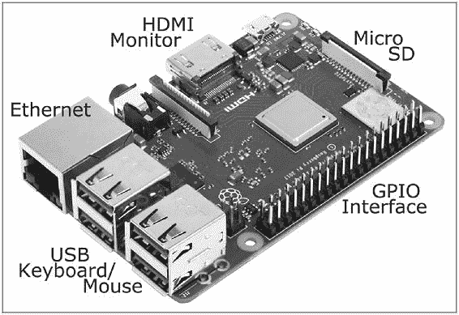 Figure 6-10

Raspberry Pi 3 模型 b+和接口摘要

Raspberry Pi 极具吸引力，因为它价格低廉，并且具有许多有用的功能和接口，包括 HDMI、4xUSB、USB 供电、Micro SD 卡、GPIO 引脚接口、Wifi、千兆以太网、蓝牙和 BLE。完整的规格列表可在此处找到:

[*【www.raspberrypi.org/products/raspberry-pi-3-model-b-plus/】*](http://www.raspberrypi.org/products/raspberry-pi-3-model-b-plus/)

All of these features make the Pi an interesting choice for many ML applications.

*   Pi 是 kiosk 应用程序的绝佳选择。您可以纵向或横向连接 HDMI 显示器，并直接从 Java 应用程序驱动它们。

*   您可以将小型显示器直接连接到 Pi。从双线液晶显示器到 7 英寸触摸屏，应有尽有。

*   你可以连接无数的按钮，传感器，发光二极管等。并从 Java 应用程序中控制它们。传感器可用于运动、加速度、温度、水、风等。

*   Raspberry Pi 通过 HDMI 端口旁边的头部连接支持外部摄像头。在您的 Pi 中添加相机模块，为 ML 应用程序使用的图片和视频数据收集打开了大门。

*   您可以将无线 USB 小键盘和键盘连接到 Raspberry Pi。这些设备可以控制软件应用程序，即使该应用程序没有监视器或显示器。

*   树莓派有无数的潜在用途。快速的互联网搜索揭示了开发人员正在用树莓 Pi 做的许多惊人的事情。

### ML 的 Raspberry Pi 设置

设置 Raspberry Pi 很容易，并且有许多在线支持资源可用。官方 Raspberry Pi 设置指南可从以下网址获得

[***https://projects . raspberry pi . org/en/projects/raspberry-pi-setting-up***](https://projects.raspberrypi.org/en/projects/raspberry-pi-setting-up)。

为 ML 集成设置 Raspberry Pi 3 model b+不需要任何特殊步骤。操作系统和所有应用软件都存储在微型 SD 卡上。Pi 支持很多操作系统，安装时你会选择官方的 ***Raspbian*** 操作系统。Raspbian 是 Debian 为 ARM CPUs 开发的一个非官方端口，它是当今最流行的 Raspberry Pi 操作系统。它非常类似于使用 Ubuntu，并且支持 Apache、Nginx、Java、Python 和 MySQL。

The steps below summarize the Raspberry Pi setup. Refer to the official link for the detailed setup steps.

1.  1.

    下载树莓派 NOOBS(新的开箱即用软件)安装管理器，并将其复制到微型 SD 卡。

2.  2.

    将 microSD 卡插入 Pi。

3.  3.

    连接显示器和键盘，并使用 USB 电源线打开 Pi 电源。

4.  4.

    遵循安装说明。选择***Raspbian*****作为操作系统。好消息是 Raspbian 包含了 Java。**

***   5.

    设置 Wifi 或互联网连接，以便您可以在 Raspbian 安装完成后更新所有软件包。

     *   6.

    如果您想从另一台联网设备连接到 Pi，请设置 IP 地址。这不是必需的，因为您只需插入一个闪存驱动器并使用文件管理器复制文件，就可以将文件复制到 Pi 上。

     *   7.

    登录 admin 用户并确认最新版本的 Java 可用。Raspbian 包含 Java，但是如果需要，下面的命令可以在 Raspberry Pi 上升级 Java。这些步骤包括删除 OpenJDK、获取密钥，然后安装最新的 Oracle Java 8。

     **

**001   // Install the latest Java version 002   // First remove OpenJDK 003   sudo apt-get purge openjdk* 004 005   // Add the digital key 006   sudo apt-key adv --recv-key --keyserver keyserver.ubuntu.com EEA14886 007   // Using an editor such as vi or vim, add the following lines to /etc/apt/sources.list 008   deb http://ppa.launchpad.net/webupd8team/java/ubuntu trusty main 009   deb-src http://ppa.launchpad.net/webupd8team/java/ubuntu trusty main 010 011   // install Java 8 012   sudo apt-get update 013   sudo apt-get install oracle-java8-installer 014   sudo apt-get install oracle-java8-set-default 015 016   // Remove the old Java(s) 017   sudo apt-get purge openjdk* 018   sudo apt-get purge java7* 019   sudo apt-get autoremove 020 021   // Check for success, we should only see Java 8 022   java -version

### Raspberry Pi GUI 注意事项

One of the main challenges when writing Java applications for the Raspberry Pi, especially for Android developers, is mastering the GUI limitation of pure Java. On the Raspberry Pi, you lack the following elements that make it so easy to implement GUI interfaces on Android:

*   Android 允许你用 XML 指定布局，并有许多图形工具来简化 GUI 设计。

*   Android 支持大量的小部件和类，比如布局、列表视图、约束布局以及无数的 GUI 元素和工具。

*   Android 平台可以自动支持各种屏幕尺寸，从小到非常大的设备。

*   它提供了对 9 补丁图像文件的支持，使图像(如按钮)易于缩放。

*   Android Studio 为所有 XML 布局文件提供了“所见即所得”(wysiwyg)的视图。您可以通过简单地拖放 GUI 小部件元素来轻松创建 GUI。

For Java ML applications on the Raspberry Pi, you will use the ***Swing*** and ***AWT*** GUI classes available in Java. The Java GUI classes have several layout managers available. For the project, you will implement the ***GroupLayout*** Manager.

> 将 ML 功能放在 Raspberry Pi 设备的边缘是一个令人兴奋的新领域，这是由 Raspberry 设备功能及其对 Java 和轻量级 Weka API 库的支持实现的。

### 树莓 PI 的 Weka API 库

In order to use Weka on the Raspberry Pi, you need a Weka API jar file for Raspberry Pi that you can include in your application. You have two options, as shown in Table [6-10](#Tab10).Table 6-10

Raspberry Pi Weka API 库比较

<colgroup class="calibre12"><col class="tcol"> <col class="tcol"> <col class="tcol"></colgroup> 
| 

图书馆

 | 

大小(MB)

 | 

描述

 |
| --- | --- | --- |
| ***WEKA-src . jar**T3】* | Ten point six | 随每个 Weka 稳定版本(如 Weka 3.8.1)分发的全功能 Weka API。 |
| **WEKA-Android-3-8-1 . jar**T3] | Three point three | 本章前面你在 Eclipse 中为 Android 构建的 Weka API 的精简版本。 |

您有两个选择，因为您为 Android 构建的精简版本也可以在 Raspberry Pi 上运行。这种选择的优点是它更小。完整版的一个优点是你可以在 Raspberry Pi 上使用 Weka 的图形功能，比如可视化。接下来，您将在 Raspberry Pi 上实现 ML，使用***Weka-Android-3-8-1 . jar***库。

### 项目:树莓皮老忠实喷泉分类器

Printing out a screen filled with ML classifier statistics, as you did earlier for Android, is not a very compelling app.

> 最好的人工智能应用程序是那些能给用户带来引人注目的体验的应用程序，而用户从来没有意识到人工智能技术是实现这一结果的原因。

这个项目的目标是为 Raspberry Pi 实现一个基于 GUI 的应用程序，它集成了一个预训练的 ML 模型来进行预测。

在第 [5](5.html) 章中，您回顾了老忠实间歇泉数据集，并看到了聚类如何帮助您识别数据中的隐藏模式。间歇泉有两种“模式”，我们称之为“热模式”和“暖模式”地质学家可能对这种现象有更好的术语。更长的等待时间与更长的喷发时间相关联，这是有道理的。有趣的是这是两种截然不同的模式。

如果你去过黄石公园，你可能会记得公园管理处有一个简单的手写信息板，提示下次火山爆发的时间，大约每小时一次。

对于这个项目，您将为 Raspberry Pi 创建一个应用程序，它可以根据等待时间和喷发时间通知我们当前的间歇泉模式。您可以轻松地将这个 Pi 应用程序部署为 kiosk 应用程序，以取代手写信息板。

In the app, you will implement some simple requirements:

*   用户将输入等待时间和爆发时间的值。

*   用户将按下预测按钮来获得间歇泉模式的预测。

*   该应用程序将在树莓派上运行。

*   该应用程序将加载一个预构建的模型来处理预测。

*   该应用程序将包括一些基本的图形用户界面元素。

该应用程序手动运行，但你可以用摄像机自动输入手动数据来检测火山爆发，或者可能添加按钮和计时器来帮助收集数据。

Table [6-11](#Tab11) shows the project summary.Table 6-11

Android 老忠实项目总结

<colgroup class="calibre12"><col class="tcol"> <col class="tcol"></colgroup> 
| 

**项目:老忠实**

**来源:*****old _ faithful . zip***

**类型:树莓 Pi ML 应用**

**注意:这个项目是一个 Eclipse Java 项目，用来构建和导出*****old faithful . jar*****类，一个可以在 Raspberry Pi 设备上运行的分类器。**

 |
| --- |
| 

文件

 | 

描述

 |
| --- | --- |
| ***【srcOldFaithful.java】>*** | 主 Java 类。包含了包括 GUI 代码在内的所有内容。从外部 Unix 文件系统目录加载模型和数据文件。 |
| ***old faithful->libsWeka-Android-3-8-1 . jar*** | Weka API 库文件。你可以用安卓版的树莓派。 |
| ***/home/pi/Java-proj/Weka/old _ faithful _ RF _ i10 . model**T3】* | RF 模型，外部文件 |
| ***/home/pi/Java-proj/Weka/old _ faithful _ single _ instance . ARFF**T3】* | 数据的单一实例。外存储器 |

除了主 Java 文件，项目还需要 Weka API 库，外部 Weka ***。model*** 文件，在这个例子中是一个 RF 分类器，还有一个 ARFF 文件，我将在后面讨论。

#### 应用概述

Before you review the project setup and Java code, you should launch the application to see how the app looks. You can launch the Java app on the desktop or on the Raspberry Pi with the following command:001   pi@raspberrypi:/Java-proj/Weka $ java -jar OldFaithful.jar You use the ***-jar*** option on the command line because this project build output is an executable jar file, ***OldFaithful.jar***. When the jar file executes, the app displays the GUI shown in Figure [6-11](#Fig11). In this example, you entered two values and pressed the Predict button and the application informs you the geyser is in warm mode.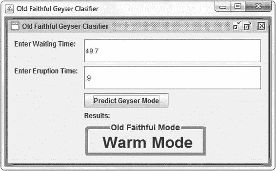 Figure 6-11

老忠实喷泉应用程序显示温暖模式

Entering some different data produces the hot mode result, as shown in Figure [6-12](#Fig12).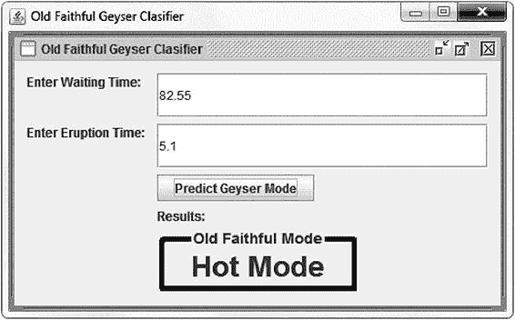 Figure 6-12

老忠实喷泉应用程序显示热模式

当您尝试不同的值时，您会注意到应用程序输出的模式与您在图 [5-20](5.html#Fig20) 中得出的聚类结果非常一致。在第 5 章[中，您使用了 DBSCAN 聚类算法来对旧的忠实数据集进行聚类。](5.html)

通常，分类器是将 ML 模型集成到设备应用程序中最有用的方法。在这种情况下，集群帮助您识别出间歇泉有两种模式，现在您希望用户能够知道间歇泉处于哪种模式。换句话说，应用程序需要对新的数据实例进行分类。对数据进行聚类是识别隐藏模式的第一步；现在你需要建立一个分类器。

#### 构建分类器模型

When you clustered the data using the DBSCAN algorithm, you also saved the output file, ***old_faithful.arff***. This file contained four attributes, including the ***cluster_ID*** for each instance. You can now use this file as the input to build a classifier for the Raspberry Pi app. Follow these steps to build a RF classifier in the Weka desktop:

1.  1.

    打开 Weka Explorer 应用程序。

2.  2.

    在 ***预处理*** 选项卡下，选择 ***打开文件*** 打开***old _ faithful . ARFF***文件。观察到加载了 272 个实例。

3.  3.

    不需要过滤器，所以点击 ***分类*** 标签。

4.  4.

    在 ***分类器*** 下，从**子菜单中选择 ***随机森林*** 算法。点击算法，改变 ***迭代次数= 10*** 。**

***   5.

    在 ***测试选项*** 下，选择 ***交叉验证折叠数= 10*** 。

     *   6.

    ***启动*** 这个量词。当它完成的时候，观察准确率很高，大概接近 99%。

     *   7.

    右键单击结果列表，用名称***old _ fiath ful _ RF _ i10 . model***保存模型。

     **

**To use this RF classification model with the application on Raspberry Pi, save the model on the Raspberry Pi in the same directory with the executable jar file and the external ARFF file (you will create these assets next) as shown:001   pi@raspberrypi:~/Java-proj/Weka $ pwd 002   /home/pi/Java-proj/Weka 003   pi@raspberrypi:~/Java-proj/Weka $ ls -lsart 004   total 3184 005     40 -rw------- 1 pi pi   38599 Jul 27 19:27 old_faithful_rf_i10.model 006      4 drwxr-xr-x 4 pi pi    4096 Jul 27 23:32 .. 007      4 -rw------- 1 pi pi     207 Jul 27 23:54 old_faithful_single_instance.arff 008   3132 -rw------- 1 pi pi 3205683 Jul 28 00:03 OldFaithful.jar 009      4 drwxr-xr-x 2 pi pi    4096 Jul 28 00:11 . 010   pi@raspberrypi:/Java-proj/Weka $ java -jar OldFaithful.jar

接下来，您将了解如何构建应用程序软件，包括 GUI、加载 Weka 模型以及用 Java 进行预测。

#### 项目设置

To get started with the Old Faithful project for Raspberry Pi, import the Eclipse Java project (***OldFaithful.zip***) from the book resources, or follow these steps to create an Eclipse Java project from scratch:

1.  1.

    通过选择 ***文件*** ➤ ***新建*** ➤ ***Java 项目*** 启动一个新的 Eclipse 项目

2.  2.

    输入项目名称为**。**

***   3.

    在新创建的项目中，在主项目文件夹下创建一个 ***libs*** 目录。

     *   4.

    将***Weka-Android-3-8-1 . jar***文件复制到 ***libs*** 目录下。

     *   5.

    在 ***项目属性*** 中，设置 Java 版本为 1.8。对于 Raspberry Pi，不像 Android 那样局限于 Java 7。

     *   6.

    在 ***项目属性*** 中，点击 ***构建路径******管理构建路径*** 。

     *   7.

    点击 ***库*** 选项卡。点击 ***添加 Jar*** 将***Weka-Android-3-8-1 . Jar***文件作为 Jar 文件包含进来。

     *   8.

    在 ***Src*** 目录下，创建【OldFaithful.java】**主类。所有的应用程序代码都驻留在这个类中，您将在下一节中查看它。**

    ***   9.

    编辑启动配置属性。将 ***主类*** 设置为 ***OldFaithful*** ，如图 [6-13](#Fig13) 所示。如果您未能设置启动配置 ***主类*** ，您将无法直接从命令行执行旧的忠实应用程序，因为主类将是未知的。

     ****

****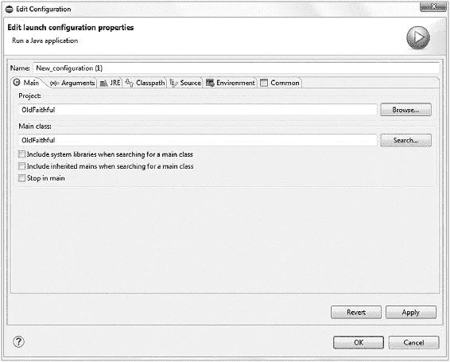 Figure 6-13

设置项目启动配置

#### Java 布局管理器

从 AWT 到 Swing，再到最近在 Java 8 中首次亮相的 JavaFX，Java 的 GUI 功能已经得到了逐步的改进。JavaFX 是一组图形和媒体包，帮助开发人员设计、创建、测试、调试和部署在不同平台上一致运行的应用程序。Java FX 与当今非常流行的 Web 和富媒体很好地集成在一起。

遗憾的是，Java FX 并不是一个轻量级的包，树莓 Pi 上的 Java 也没有包含它。可以添加，但是它不支持所有的库，并且实现起来有问题。正因如此，你会为老忠实 app 使用更成熟的 Swing GUI 库。Swing 完全支持所有设备平台。

Swing has several ***LayoutManagers***, including the following:

*   ***【边缘布置】***

*   ***【拳击版面】***

*   ***【cardlayout】***

*   ***【流动布局】***

*   ***【grid bag layout】***

*   ***网格布局***

*   ***【群布局】***

*   ***跳线布局***

这些名称为可能的用例提供了一些见解，但是理解这些不同布局的功能的最简单的方法是查看它们。Oracle 维护了一个有用的链接，网址为

[***https://docs . Oracle . com/javase/tutorial/ui swing/layout/visual . html***](https://docs.oracle.com/javase/tutorial/uiswing/layout/visual.html)。

如果你仔细观察图 [6-12](#Fig12) 所示的图形用户界面，你可以看到它由标签、文本输入框、按钮和显示分类结果的大字体边框文本框组成。这些 GUI 组件排列在一个 2 列 5 行的矩阵中。

您可以选择几个 Swing 布局管理器来基于期望的布局实现旧的忠实 GUI。如果您来自 Android 背景，您会发现 Swing 布局很难使用，主要是因为它们没有为使 GUI 看起来漂亮所需的间距、填充和一般样式提供太多控制。GroupLayout 管理器往往是最灵活的，因此您将实现它。

如果您发现无法实现 Java FX，并且 Swing 布局无法满足您的 GUI 需求，那么您可以考虑使用外部替代布局管理器。米格布局管理器**是一个极好的选择。这是一个轻量级的 Java 库，比内置的 Swing 布局管理器灵活得多。图书馆的详情载于**

 **[www.miglayout.com/](http://www.miglayout.com/)。

#### GUI 实现

应用程序的所有 Java 代码都包含在**中。文件名保留了 Android 惯例，尽管这是一个 Raspberry Pi 应用程序，并且从技术上讲不是一个活动。您将在两个部分回顾代码:首先是与 GUI 相关的代码，然后是 ML 逻辑。**

 **Java Swing GUI 类允许您创建 ***JFrame*** 对象。你可以在任何框架中添加组件，比如 ***JLabels*** ， ***JButtons*** 和 ***JTextFields*** ，这与 Android 的工作方式非常相似。为了控制组件的排列方式，Swing 允许您将前面显示的布局分配给 ***JFrames*** 。对于这个项目，您将使用 ***组布局*** 。

A summary of the key GUI code highlights:

*   通过扩展 ***JFrame*** (第 001 行)，在 Java Swing 中创建一个 GUI。

*   定义组件，包括 ***JFrame*** ， ***GroupLayout*** ， ***JButton*** ， ***JLabel*** ， ***TitledBorder*** ， ***JTextField*** (第 002-011 行)。

*   定义构造函数(第 013 行)。

*   ***组布局*** 构建 GUI(第 034-055 行)。

*   私有方法 ***setGeyserMode*** (第 066-100 行)用来自 ML 模型的新分类结果更新 GUI。您通过调用 ***替换*** 方法来更新 ***组布局*** (第 097 行)。

Listing [6-3](#PC18) shows all of the GUI-related code.001   public class OldFaithful extends JFrame { 002       static JFrame jf; 003       static GroupLayout layout; 004       static JTextField waitTime, eruptTime; 005       static JLabel priorLabel; 006       statis JButton classifyButton; 007       static TitledBorder tBorderWarm, tBorderHot, tBorderUnknown; 008       static Border borderOrange = BorderFactory.createLineBorder(Color.orange, 5, true); 009       static Border borderRed = BorderFactory.createLineBorder(Color.red, 5, true); 010       static Border borderGray = BorderFactory.createLineBorder(Color.gray, 5, true); 011       static String modeTitle = "Old Faithful Mode"; 012 013       public OldFaithful() { 014           super("OldFaithful"); 015           // Init Frame 016           JFrame.setDefaultLookAndFeelDecorated(true); 017           jf = new JFrame(); 018           jf.setTitle("Old Faithful Geyser Clasifier"); 019           jf.setResizable(true); 020           jf.setExtendedState(JFrame.MAXIMIZED_BOTH); 021           jf.setDefaultCloseOperation(EXIT_ON_CLOSE); 022           jf.setUndecorated(false);   // true for no title and menu 023           jf.setVisible(true); 024           layout = new GroupLayout(jf.getContentPane()); 025           jf.getContentPane().setLayout(layout); 026           layout.setAutoCreateGaps(true); 027           layout.setAutoCreateContainerGaps(true); 028 029           // Setup the labels 030           JLabel labelWait = new JLabel("Enter Waiting Time:"); 031           JLabel labelErupt = new JLabel("Enter Eruption Time:"); 032           JLabel labelResult = new JLabel("Results:"); 033 034           // Build the layout using the Swing GroupLayout 035           layout.setHorizontalGroup(layout.createSequentialGroup() 036               .addGroup(layout.createParallelGroup() 037                   .addComponent(labelWait) 038                   .addComponent(labelErupt)) 039               .addGroup(layout.createParallelGroup() 040                   .addComponent(waitTime) 041                   .addComponent(eruptTime) 042                   .addComponent(classifyButton) 043                   .addComponent(labelResult) 044                   .addComponent(priorLabel)) 045           ); 046           layout.setVerticalGroup(layout.createSequentialGroup() 047               .addGroup(layout.createParallelGroup() 048                   .addComponent(labelWait) 049                   .addComponent(waitTime)) 050               .addGroup(layout.createParallelGroup() 051                   .addComponent(labelErupt) 052                   .addComponent(eruptTime)) 053               .addComponent(classifyButton) 054               .addComponent(labelResult) 055               .addComponent(priorLabel) 056           ); 057 058           jf.pack(); 059           jf.validate(); 060           jf.repaint(); 061       } 062 063       // The main class includes the ML logic and is not shown in this listing 064       public static void main(String args[]){} 065 066       private static void setGeyserMode(int mode) { 067           // Udate the results depending on the mode the RF classifier has returned 068           JLabel label = null; 069           if (mode == 2) { 070               tBorderHot = BorderFactory.createTitledBorder(borderRed, 071                      modeTitle, 072                      TitledBorder.CENTER, 073                      TitledBorder.CENTER, 074                      Font.decode("Arial-bold-14")); 075               label  = new JLabel("   Hot Mode   "); 076               label.setFont(Font.decode("Arial-bold-28")); 077               label.setBorder(tBorderHot); 078           } else if (mode == 1) { 079               tBorderWarm = BorderFactory.createTitledBorder(borderOrange, 080                      modeTitle, 081                      TitledBorder.CENTER, 082                      TitledBorder.CENTER, 083                      Font.decode("Arial-bold-14")); 084               label  = new JLabel("   Warm Mode  "); 085               label.setFont(Font.decode("Arial-bold-28")); 086               label.setBorder(tBorderWarm); 087           } else { 088               tBorderUnknown = BorderFactory.createTitledBorder(borderGray, 089                      modeTitle, 090                      TitledBorder.CENTER, 091                      TitledBorder.CENTER, 092                      Font.decode("Arial-bold-14")); 093               label  = new JLabel(" Unknown Mode "); 094               label.setFont(Font.decode("Arial-bold-28")); 095               label.setBorder(tBorderUnknown); 096           } 097           layout.replace(priorLabel, label); 098           // reset the priorLabel so it can be updated next time 099           priorLabel = label; 100       } 101   } Listing 6-3

java:与 GUI 相关的代码

#### 单实例数据文件

在本章的前面，您已经了解了如何通过加载包含许多实例的数据文件来进行批量预测，对于 PAMAP2_Dataset 示例，有 5，000 个实例。对于旧的忠实应用程序，不是批量分类，而是每次按下按钮时对单个实例进行分类。

加载单个实例 ARFF 文件是让应用程序了解数据结构的一种简单方法。将单实例数据文件视为数据的一种数据字典，这是我在第 [2](2.html) 章中讨论的最佳实践。如果更新数据结构或更改任何数据类型，则应该更新单实例数据文件。

Using the single instance ARFF file has two advantages:

*   这种方法从应用程序代码中抽象出数据结构，使得代码更容易维护。

*   外部文件方法简化了 ML 代码，因为没有必要在 Java 中定义所有的属性和数据类型。

Listing [6-4](#PC19) shows the ***old_faithful_single_instance.arff*** file. You can easily create the file from the original ARFF file by simply deleting all of the instances except for one.001   @relation subject101-cleaned-weka.filters.unsupervised.attribute.NumericToNominal-Rfirst 002 003   @attribute activityID {1,2,3,4,5,6,7,12,13,16,17,24} 004   @attribute accelX numeric 005   @attribute accelY numeric 006   @attribute accelZ numeric 007   @attribute gyroX numeric 008   @attribute gyroY numeric 009   @attribute gyroZ numeric 010   @attribute magnetX numeric 011   @attribute magnetY numeric 012   @attribute magnetZ numeric 013 014   @data 015   1,2.30106,7.25857,6.09259,-0.069961,-0.018328,0.004582,9.15626,-67.1825,-20.0857 Listing 6-4

old _ faithful _ Single _ Instance . arff，单实例 ARFF 文件

从文件加载数据结构的另一种方法是使用 Weka API ***属性*** 和 ***实例*** 类在 Java 中手动定义该结构。

您需要部署与可执行 jar 文件和 ML 模型文件打包在一起的单实例 ARFF 文件。

#### ML 代码

清单 [6-5](#PC20) 显示了所有的 ML 代码。它出奇的简短。正如所承诺的，你只需要加载模型并开始进行预测，而不是编写大量的代码。

Highlights of the ML code:

*   主类运行构造函数(第 003 行)。本例中的构造函数执行大部分 GUI 设置。

*   它加载单实例 ARFF 文件(行 005-011)。

*   它加载分类器，一个在 Weka 中创建的 RF 模型(行 013-017)。

*   它设置一个按钮来执行分类(行 019)。

*   它实现了***predict button pressed***从两个 GUI 输入字段中读取值(第 031 行)

*   它创建一个新实例进行分类，指定 ***爆发*** 和 ***等待*** 值(第 037-043 行)。

*   它对实例进行分类(第 046 行)。

*   它根据分类结果设置间歇喷泉模式(第 048-050 行)。

The ML code resides in the public main class.001   public static void main(String args[]){ 002       // Run the constructor 003       new OldFaithful(); 004       try { 005           // Load a Test data instance so we can classify more easily 006           ConverterUtils.DataSource sourceTest = null; 007           String wekaDataStrUnix = "/home/pi/old_faithful_single_instance.arff"; 008           sourceTest = new ConverterUtils.DataSource(wekaDataStrUnix); 009           dataSet = sourceTest.getDataSet(); 010           // Set the class attribute (Label) as the last class, the ClusterID 011           dataSet.setClassIndex(3); 012 013           // Load the model, a RF model created from the ARFF data and saved in Weka Explorer 014           File wekaModelFileUnix = new File("/home/pi/old_faithful_rf_i10.model"); 015           FileInputStream fis = new FileInputStream(wekaModelFileUnix); 016           rf = (Classifier) weka.core.SerializationHelper.read(fis); 017           fis.close(); 018 019           // Classify button 020           JButton classifyButton = new JButton("Predict Geyser Mode"); 021           classifyButton.addActionListener(new ActionListener() { 022               public void actionPerformed(ActionEvent e) { 023                   predictButtonPressed(); 024               } 025           } ); 026       } catch (Exception e) { 027           e.printStackTrace(); 028       } 029   } 030 031   private static void predictButtonPressed() { 032       // Get a prediction from the classifer and update the Geyser Mode 033       try { 034           double wait = Double.valueOf(waitTime.getText()); 035           double erupt = Double.valueOf(eruptTime.getText()); 036 037           // Create a new instance to classify 038           Instance newInst = new DenseInstance(4); 039           newInst.setDataset(dataSet); 040           newInst.setValue(0, 0); 041           newInst.setValue(1, erupt); 042           newInst.setValue(2, wait); 043           newInst.setValue(3, 0); 044 045           // Classify the Instance 046           double result = rf.classifyInstance(newInst); 047 048           if (result == 1.0) setGeyserMode(1); 049           else if (result == 0.0) setGeyserMode(2); 050           else setGeyserMode(0); 051       } 052       catch (NumberFormatException e) { 053            //Not a double so set unknown mode 054           setGeyserMode(0); 055       } 056       catch (Exception e) { 057           e.printStackTrace(); 058       } 059   } Listing 6-5

MainActivity.java: ML 相关代码

#### ML 模型的异常处理

异常处理是应用程序开发中比较重要的方面之一。然而，大多数开发人员没有在这方面花费足够的时间。

在 ML 应用程序中，模型是应用程序的关键组件。模型的准确性非常重要，但是如果模型完全失败，产生一个异常怎么办？如果模型失败了，应用程序就失败了，你需要知道这些。在大多数例子中，包括上面的清单 [6-5](#PC20) ，您在模型异常的情况下打印出一个堆栈跟踪，但是没有采取任何其他的动作。对于驻留在 Raspberry Pi 设备或 Android 手机上的商业 ML 应用程序，您需要一种更健壮的方法。远程崩溃日志记录是一种解决方案。

远程崩溃日志背后的想法是收集帮助开发人员解决问题所需的必要信息，并在应用程序因崩溃而终止之前将其发送到远程服务器。

在 Android 设备上，有许多远程崩溃记录服务可用。最受欢迎的服务是谷歌的 Firebase Crashlytics。有关为 Android 设置 Crashlytics 的详细信息，请访问

[https://firebase.google.com/docs/crashlytics/](https://firebase.google.com/docs/crashlytics/)。

还有许多第三方服务、库和后端服务器可用于实现 Android 崩溃日志记录。有关所有服务的总结，请参考作者 Android 书籍中的崩溃日志章节，网址为

[https://github.com/apress/practical-android](https://github.com/apress/practical-android)。

在像 Raspberry Pi 这样的设备上，为日志和传感器数据收集设计的第三方服务可以很好地用于远程崩溃日志记录。其中最流行的是来自 Rapid 7 的 ***LogEntries*** ，它可以接受任何类型的 JSON 格式的数据作为有效负载:

[https://logfactors . com](https://logentries.com)

These services work by using the Java ***UncaughtExceptionHandler*** method. The following code shows how to use the handler to implement the ***DefaultExceptionHandler***:001   public class DefaultExceptionHandler implements UncaughtExceptionHandler{ 002       private UncaughtExceptionHandler mDefaultExceptionHandler; 003 004       //constructor 005       public DefaultExceptionHandler(UncaughtExceptionHandler pDefaultExceptionHandler) 006       { 007           mDefaultExceptionHandler= pDefaultExceptionHandler; 008       } 009       public void uncaughtException(Thread t, Throwable e) { 010           //do some action like writing to file or upload somewhere 011 012           //call original handler 013           mStandardEH.uncaughtException(t, e); 014       } 015   }

这种方法使您有机会在应用程序由于未捕获的异常而终止之前执行一些操作。为了帮助理解为什么一个模型会产生一个异常，通常在异常发生时发送实例属性数据值给服务就足够了。

幸运的是，只要数据和数据类型匹配，Weka 模型故障很少发生，但是当不可避免的崩溃确实发生时，您需要远程崩溃日志记录来查看和分析有问题的数据，以便您可以修复问题。在许多情况下，问题可以通过更正应用程序代码来解决，而在一些罕见的情况下，您必须重新构建模型来消除异常。

#### 为 Raspberry Pi 导出可运行的 jar 文件

Follow these steps to build the Old Faithful runnable jar file:

*   清理项目并确认没有生成错误。

*   确认启动配置中的 Java 主类设置如图 [6-13](#Fig13) 所示。

*   在 Eclipse 主菜单中，选择 ***文件*** ➤ ***导出*** ，如图 [6-14](#Fig14) 所示。

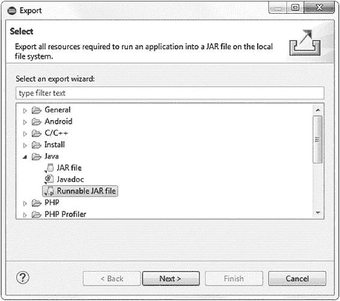 Figure 6-14

导出可运行的 jar 文件

*   点击 ***下一个*** ，会看到如图 [6-15](#Fig15) 所示的 ***Runnable JAR 文件导出*** 画面。

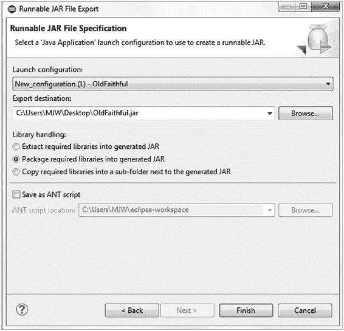 Figure 6-15

导出 OldFaithful.jar 文件

*   确保 ***库处理*** 单选按钮选择了 ***将所需库打包成生成的 JAR*** 选项。这是必要的，以便 Weka API 库包含在导出的应用程序中。

导出完成后，runnable jar 文件和其他所需的外部文件将足以在任何兼容 Java 的设备上运行旧的忠实应用程序。

#### 在 Raspberry Pi 上自动启动 ML 应用

One of the requirements for the Old Faithful project is to create a kiosk-mode app. Such apps typically have two characteristics:

*   Kiosk 应用程序通常支持显示器或某种类型的视觉输出，但通常没有键盘或鼠标等输入设备。

*   Kiosk 应用程序只有一个用途，在开机或复位时自动初始化。

On Raspberry Pi, there are several methods to achieve automatic start of the ***OldFaithful.jar*** file. You can use any of the following five Unix-based approaches to implement automatic start of any application:

*   ***rc.local*** :添加系统启动时启动的应用。

*   *T1。bashrc* :编辑 bash shell 启动文件，在启动时启动应用程序。

*   ***init.d tab*** :使用 ***init.d*** ，这个目录包含了很多系统服务的启动/停止脚本。

*   ***systemd*** :使用 ***systemd*** ，一个控制在 Unix 中启动的进程的标准进程。

*   ***crontab*** :当应用程序运行时，使用 ***cron*** 作业进行调度。

For running executable jar files, the first approach is the most simple and it works well. To configure automatic start on the Raspberry Pi for the ***OldFaithful.jar*** file, implement the following steps:

1.  1.

    放置所需的文件，

    ***old faithful . jar，***

     *****【old _ faithful _ single _ instance . ARFF】***和

    ***old _ faithful _ RF _ i10 . model***，

    进入 ***/home/pi/Weka*** 和你选择的另一个目录。**
***   2.

    进入 ***/etc*** 目录，用**编辑器编辑 ***rc.local*** 文件:**

     *****【sudo nano/etc/RC . local】***

    ***vi*** 编辑器是一种替代。*****   3.

    将下面一行添加到文件的末尾，在 ***之前，退出 0*** :

    ***Java-jar/home/pi/Weka/old faithful . jar&**T3】*

    ***退出 0；**T3】*

     *   4.

    保存文件。不要忘记行尾的 ***&*** 。 ***&*** 允许命令在单独的进程中运行。没有它，引导过程将无法完成。

     *   5.

    通过设置 ***/etc/dhcpcd.conf*** 文件中的***static _ IP _ address***为 Pi 添加一个专用 IP 地址。这允许通过以太网连接访问设备，以保持对信息亭设备的访问。

     *   6.

    要禁用 Raspberry Pi 屏幕保护程序，请编辑以下文件:

    ***sudo nano ~/。config/LX session/lxd-pi/auto start***

    该文件应与以下代码匹配:

    ***【lxppanel-profile lxd-pi】***

    ***# @ x screen saver-no-splash***

    ***@ point-rpi**T3】*

    ***@xset s off***

    ***@xset -dpms***

    ***@xset s noblank***

     *   7.

    使用 ***sudo reboot*** 重启 Pi 并测试更改。

     ****

 ****#### 项目总结

Raspberry Pi 上的老忠实项目是一个在设备上以 kiosk 模式运行的简单 ML 应用程序。然而，它展示了一个强大的设备 ML 架构，您可以为其他潜在的应用程序复制它。

Highlights of the Raspberry Pi ML architecture:

*   Pi 价格低廉，并且加载了连接选项。

*   Pi 运行 Java，库也很容易获得。

*   Weka API 在 PI 上运行良好。该设备的内存和处理能力使其能够处理高级 CML 问题。

## 6.8 传感器数据

传感器数据是 ML 应用的绝佳燃料。在第二章中，我介绍了手机可能是有史以来最伟大的数据收集设备。在本节中，您将研究设备功能，并探索如何使用传感器和第 [2](2.html) 章中介绍的 PAMAP2_Dataset 为 Android 实现 ML。

### 安卓传感器

You know that Android supports sensors, but a deep dive into the Android APIs reveals a surprising level of sensor coverage. Google divides the Android sensors into three categories: motion, environmental, and position. Table [6-12](#Tab12) shows a summary of the Android sensors. Most of the sensors have been in the platform since API level 14 (Android 4.0). Support for the proximity and humidity sensor is available beginning with API level 20 (Android 4.4).Table 6-12

Android 传感器支持

<colgroup class="calibre12"><col class="tcol"> <col class="tcol"> <col class="tcol"></colgroup> 
| 

种类

 | 

传感器

 | 

Android 传感器类型

 |
| --- | --- | --- |
| 移动 | 加速计 | 类型 _ 加速度计类型 _ 线性 _ 加速度 |
| 重力 | 类型 _ 重力 |
| 陀螺仪 | 类型 _ 陀螺仪 |
| 旋转矢量 | 类型 _ 旋转 _ 向量 |
| 环境的 | 气压计 | 类型 _ 压力 |
| 光度计 | 类型 _ 光 |
| 温度计 | 类型 _ 环境温度类型 _ 温度类型 _ 相对湿度 |
| 位置 | 方向 | 类型 _ 方向类型 _ 接近度 |
| 磁力计 | 类型 _ 磁场 |

The Sensor framework allows you to use any of the Android sensors. It includes the following classes:

*   ***SensorManager*** :使用此类创建传感器服务的实例。该类包含访问、列出、注册或注销传感器的各种方法。该类还提供了许多用于设置传感器精度和数据采集速率的常数。

*   ***传感器*** :使用这个类创建一个特定传感器的实例。该类还提供了确定传感器功能的方法。

*   ***SensorEvent*** :传感器事件对象允许您收集原始传感器数据。

*   ***SensorEventListener***:使用此接口方法创建回调方法，在传感器值更改时接收通知。

The Android sensors are hardware dependent, so sensor availability varies from device to device and between Android versions. Use the following code to determine sensor availability:001   private SensorManager mSensorManager; 002   ... 003   mSensorManager = (SensorManager) getSystemService(Context.SENSOR_SERVICE); 004   ... 005   List<Sensor> deviceSensors = mSensorManager.getSensorList(Sensor.TYPE_ALL);

如果您希望缩小搜索范围，可以用另一个常量替换常量***【TYPE _ ALL】***，例如 ***TYPE_GYROSCOPE*** 或 ***TYPE_GRAVITY*** 。

在 Android Activity Tracker 项目中，您将详细研究如何实现 Android 传感器。

### 带传感器的树莓派

Figure [6-10](#Fig10) shows a picture of the Raspberry Pi. The GPIO interface makes the Pi an excellent device for ML with sensor data collection. The sensors are inexpensive, and you can connect many different types of sensors to the Raspberry Pi. Table [6-13](#Tab13) shows some of the sensor devices that you can connect.Table 6-13

Raspberry Pi 传感器摘要

<colgroup class="calibre12"><col class="tcol"> <col class="tcol"> <col class="tcol"></colgroup> 
| 

种类

 | 

传感器

 | 

描述

 |
| --- | --- | --- |
| 环境 | DHT11/DHT22 | 测量温度和湿度。 |
| DS18B20/ DS18S20 | 室外使用温度和湿度。 |
| BMP180 | 气压、温度和高度的气压计。 |
| MQ-2 | 气体传感器。甲烷、丁烷和烟雾。 |
| 移动 | 促进 | 低成本的运动传感器只有在物体移动时才会发出信号。 |
| HC-SR04 战斗机 | 超声波运动传感器。也可以测量距离。 |
| MPU-6050 | 陀螺仪检测沿三个轴的旋转。 |
| HMC5883L/GY-271 战斗机 | 指南针。 |
| 水 | YL-69 土壤湿度计湿度传感器 | 地面湿度传感器。适用于灌溉系统。 |
| 森 0193 | DFrobot 电容式地面湿度传感器。更精确，不会随着时间的推移而侵蚀。 |
| FC-37 +MCP3008 | 雨滴传感器。根据水量，电容会增加。 |
| YF-S201C | 水流量计。 |
| 重力 | HX-711 | 重量传感器和负载秤。 |
| 其他的 | Pulsesensor.com | 心跳和脉搏传感器。 |

The Raspberry Pi has sensors for almost anything you can imagine. The pulse sensor shown at the bottom of Table [6-13](#Tab13) was the result of a recent Kickstarter campaign. The mobile phone is a great data collection device, but for specialized dedicated data collection systems, the Pi takes it to another level.

> 对于专门的传感器驱动的数据应用，Raspberry Pi 与 Java 和 Weka API 库相结合，构成了一个低成本、功能强大的机器学习平台。

To implement sensors on the Raspberry Pi, you need a Java library to interface with the sensors. There are two options available:

*   PI4J:一个基于 Java 的 API，仅用于树莓 PI

*   设备 I/O:一个基于 Java 的 API，可以支持许多设备

PI4J 项目是一个面向 Java 的开源库(3.0 版)，使得从 Java 与设备进行交互变得很容易。PI4J 的使用说明(包括下载)可在[http://pi4j.com/](http://pi4j.com/)获得。

Accessing the GPIO and other Raspberry Pi interfaces from Java is very simple, as shown by the following code:001   import com.pi4j.io.gpio.GpioController; 002   import com.pi4j.io.gpio.GpioFactory; 003   import com.pi4j.io.gpio.GpioPinDigitalOutput; 004   import com.pi4j.io.gpio.PinState; 005   import com.pi4j.io.gpio.RaspiPin; 006 007   // create gpio controller 008   final GpioController gpio = GpioFactory.getInstance(); 009 010   // provision gpio pin #01 as an output pin and turn on 011   final GpioPinDigitalOutput pin = gpio.provisionDigitalOutputPin(RaspiPin.GPIO_01, "MyLED", PinState.HIGH); 012 013   // set shutdown state for this pin 014   pin.setShutdownOptions(true, PinState.LOW); 015 016   // turn off gpio pin #01 017   pin.low(); 018 019   // toggle the current state of gpio pin #01 (should turn on) 020   pin.toggle();

PI4J 库和设备 I/O 之间有一些重叠。PI4J 的功能更加丰富。设备 I/O 库来自 Oracle，最初是 Java ME 嵌入式库的一部分。它也是一个开源的 Java 级 API，用于访问嵌入式设备上的通用设备外设。它位于 OpenJDK 项目下，文档位于

[https://docs . Oracle . com/javame/8.0/API/dio/API/index . html](https://docs.oracle.com/javame/8.0/api/dio/api/index.html)。

设备 I/O 库为每块板都提供了一个配置文件，因此您可以编写一次代码，并在任何 Java 设备上使用它，而不仅仅局限于 Raspberry Pi。PI4J 和设备 I/O 的主要区别在于 GPIO 映射。

The following is a Java code example using the Device I/O library:001   // 002   // Accessing the GPIO Pin number 12. 003   // 004 005   GPIOPin led = (GPIOPin)DeviceManager.open(12); 006 007   led.setValue(true) //Turns the LED on 008   led.setValue(false) //Turns the LED off 009   boolean status = led.getValue() //true if the LED is on To use Device I/O library you will need to download the Mercurial configuration management system and then clone the project. The name of the actual library is ***dio.jar***:001   sudo apt-get install mercurial 002   hg clone http://hg.openjdk.java.net/dio/dev To run an application using Device I/O, you will need the following:

*   任何带有 main 方法的标准 Java 类

*   ***java.policy*** ，一个包含权限配置的文件

*   ***dio.jar*** 库文件

*   ***libdio.so*** ，包含本机代码接口的链接库

*   ***dio.properties*** ，包含板特定配置的配置文件

### 传感器测量单位

When working with sensor data, it is important to keep close track of the unit of measure of the data. Sensor manufacturers can use a variety of different units of measure depending on many factors, including accuracy, local standards, country of origin, etc. Table [6-14](#Tab14) shows the unit of measure for some of the Android sensors.Table 6-14

Android 传感器测量单位

<colgroup class="calibre12"><col class="tcol"> <col class="tcol"> <col class="tcol"></colgroup> 
| 

Android 传感器名称

 | 

度量单位

 | 

数据描述

 |
| --- | --- | --- |
| 类型 _ 磁场 | 超声试验 | 沿三个轴的磁场强度，单位为微特斯拉 |
| 类型 _ 线性 _ 加速度 | 毫秒 2 | 三轴加速度 |
| 类型 _ 陀螺仪 | 车轮/秒 | 沿三轴的角速度 |
| 环境温度类型 | C | 周围空气温度 |
| 类型 _ 光 | lx | 照度，单位为勒克斯 |
| 类型 _ 压力 | 百帕或毫巴 | 环境空气压力 |
| 类型 _ 相对湿度 | % | 环境相对湿度 |
| 类型 _ 温度 | C | 设备温度 |

使用外部来源的数据时，在与您自己的设备数据混合之前，您需要确保单位一致。如果单位不同，您需要提供到基本数据格式的转换。

在 Android Activity Tracker 项目中，您将使用为 PAMAP2_Dataset 收集的数据。用于构建模型的干净数据包含加速度计、陀螺仪和磁场数据。原始收集设备使用的测量单位与 Android 传感器单位相匹配，因此无需转换。

### 项目:安卓活动跟踪器

In this project, you are creating an Android application that uses the RF model together with the Android sensors to provide a near real-time prediction of the current activity of the user. Table [6-15](#Tab15) shows the project summary.Table 6-15

Android 活动跟踪器项目总结

<colgroup class="calibre12"><col class="tcol"> <col class="tcol"></colgroup> 
| 

**项目:Activity tracker source:*****Activity _ tracker . zip*****类型:Android Studio 项目注意:该项目使用来自 PAMAP2_dataset 的训练模型，结合近乎实时的 Android 传感器数据来确定设备用户的当前活动。**

 |
| --- |
| 

文件

 | 

描述

 |
| --- | --- |
| ***【应用】>【libsweka-Android-3-8-1 . jar】*** | Android 的 Weka API 库文件。 |
| ***app->src->main->javaMainActivity.java**T3】* | 主应用程序源代码包含在这个文件中。 |
| ***【app】>【src】>【main】>【RES】>【layout activity _ main . XML】*** | 应用程序的主 GUI 布局文件。 |
| ***app->src->main->RES->rawrf _ i10 _ cross . model**T3】* | 应用程序用来进行预测的 RF 模型。 |
| ***【app】>【src】>【main】>【RES】>【rawsubject 101 _ single .【ARFF】*** | 应用程序用来设置数据属性特性的单实例 ARFF 文件。 |

In this project, you want to create an application that gives you a near real-time display of the current activity. Figure [6-16](#Fig16) shows the screenshot of the application.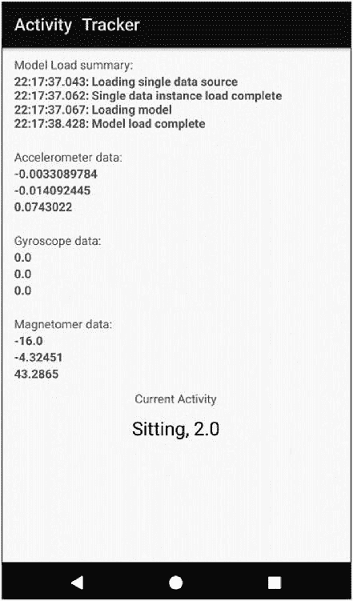 Figure 6-16

活动追踪器安卓应用截图

该应用程序显示加速度计、陀螺仪和磁力计的当前传感器值的实时读数。在屏幕底部，应用程序显示当前活动和当前活动 ID，一个介于 1 和 12 之间的整数。当您监控应用程序时，您将看到传感器值实时更新，而当前活动每秒更新两次。

#### 应用架构

Figure [6-17](#Fig17) shows the architecture of the app.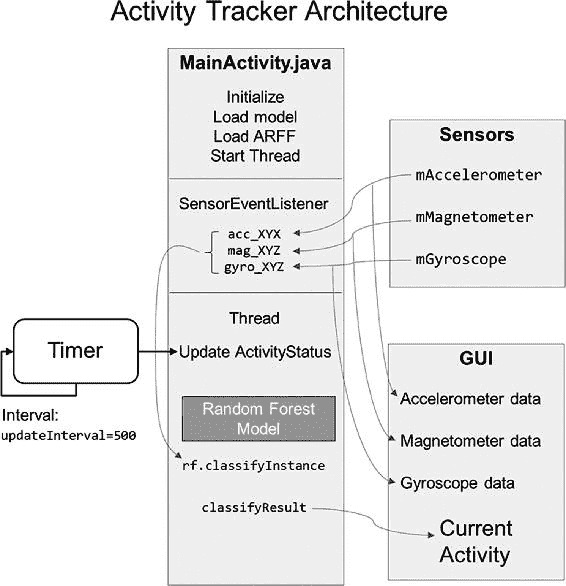 Figure 6-17

活动跟踪器架构

The structure of the app is similar to the previous examples in terms of loading the model and making the prediction, but contains two additional constructs:

*   实现***SensorEventListener***来处理来自加速度计、陀螺仪和磁力计的传入传感器数据。

*   实现了一个 ***线程*** 来处理分类处理的时序。

In this app, you will load the RF model you created in Chapter [5](5.html), ***rf_i10_cross.model***. You created the model from a cleaned version of the ***subject101*** dataset. As a result, the model allows you to track the following activities. You define these activities as the ***String[]***, named ***activityID***.001   activityID = new String[] { 002           "Other (transient)",    // 0 003           "Lying",                // 1 004           "Sitting",              // 2 005           "Standing",             // 3 006           "Walking",              // 4 007           "Running",              // 5 008           "Cycling",              // 6 009           "Nordic Walking",       // 7 010           "Ascending Stairs",     // 8 011           "Descending Stairs",    // 9 012           "Vacuum cleaning",      // 10 013           "Ironing",              // 11 014           "Rope jumping"          // 12 015   };

您使用这个 ***字符串[]*** 打印出结果活动。回想一下，原始数据集包含 24 个活动。期望您的模型对所有这些活动进行分类是不公平的，因为其中一半没有包含在训练数据集中。您排除了一些活动，因为所选主题没有执行这些活动，并且您在清理过程中排除了其他活动。

#### 实现 Android 传感器

A key function of the app is to collect current data from the Android sensors. This is a two-step process:

*   初始化

*   实现传感器监听器

The initialization process involves creating objects for each of the three required sensors in the application ***onCreate*** method. The following code shows how to create these objects in Android and how to register the ***SensorEventListener***. Keep in mind that you also need to register and unregister the ***SensorEventListener*** in the ***onPause*** and ***onResume*** methods (not shown).001   private SensorManager mSensorManager; 002   private Sensor mAccelerometer, mGyroscope, mMagnetometer; 003 004   mSensorManager = (SensorManager) getSystemService(SENSOR_SERVICE); 005 006   mAccelerometer = mSensorManager.getDefaultSensor(Sensor.TYPE_LINEAR_ACCELERATION); 007   mGyroscope = mSensorManager.getDefaultSensor(Sensor.TYPE_GYROSCOPE); 008   mMagnetometer = mSensorManager.getDefaultSensor(Sensor.TYPE_MAGNETIC_FIELD); 009 010   mSensorManager.registerListener(mSensorEventListener, mAccelerometer, SensorManager.SENSOR_DELAY_NORMAL); In line 006, you create the accelerator object. In Android, there are two choices:

*   ***传感器。**类型 _ 直线 _ 加速器*

*   ***传感器。**类型 _ 加速器*

两者的区别在于包含了重力分量。线性加速器消除了重力对读数的影响。对初始数据的分析表明，这种测量方法符合初始数据收集协议，因此您可以在应用中使用这种传感器。

In line 010, you use the ***SENSOR_DELAY_NORMAL*** constant in the ***registerListener*** method. This value specifies the rate at which you receive samples from the sensors. Table [6-16](#Tab16) shows the options. When using sensors, there is some internal latency, so the typical observed sample rate is higher than the Android-specified value. In the app, you want to update the user’s current activity every 500 milliseconds (1/2 second). You have seen that you can classify a single sample at this rate, so ***SENSOR_DELAY_NORMAL*** is sufficient for the app. Note that the Android also uses the ***SENSOR_DELAY_NORMAL*** for some system functions, such as determining when the user rotates the device from portrait to landscape.Table 6-16

Android 传感器延迟常数

<colgroup class="calibre12"><col class="tcol"> <col class="tcol"> <col class="tcol"></colgroup> 
| 

Constantname

 | 

默认常量值(微秒)

 | 

典型观察采样速率(毫秒)

 |
| --- | --- | --- |
| ***传感器 _ 延迟 _ 正常*** | Two hundred thousand | Two hundred and twenty-five |
| ***传感器 _ 延迟 _UI*** | Sixty thousand | seventy-eight |
| ***传感器 _ 延时 _ 游戏*** | Twenty thousand | Thirty-eight |
| ***传感器 _ 延迟 _ 最快*** | Zero | Twenty |

To receive sensor events, you need to implement the ***SensorEventListener***. Android calls this listener to report sensor events for all of the registered sensors. In this app, you have three sensors registered. Even though you are using the least frequent sampling rate, ***SENSOR_DELAY_NORMAL***, there will still be many events passed to this listener.001   private final SensorEventListener mSensorEventListener = new SensorEventListener() { 002       @Override 003       public void onSensorChanged(SensorEvent event) { 004           if (event.sensor.getType() == Sensor.TYPE_LINEAR_ACCELERATION) { 005               acc_X = event.values[0]; 006               acc_Y = event.values[1]; 007               acc_Z = event.values[2]; 008               tv_acc_X.setText(Float.toString(acc_X)); 009               tv_acc_Y.setText(Float.toString(acc_Y)); 010               tv_acc_Z.setText(Float.toString(acc_Z)); 011 012           } else if (event.sensor.getType() == Sensor.TYPE_GYROSCOPE) { 013               gyro_X = event.values[0]; 014               gyro_Y = event.values[1]; 015               gyro_Z = event.values[2]; 016               tv_gyro_X.setText(Float.toString(gyro_X)); 017               tv_gyro_Y.setText(Float.toString(gyro_Y)); 018               tv_gyro_Z.setText(Float.toString(gyro_Z)); 019 020           } else if (event.sensor.getType() == Sensor.TYPE_MAGNETIC_FIELD) { 021               mag_X = event.values[0]; 022               mag_Y = event.values[1]; 023               mag_Z = event.values[2]; 024               tv_mag_X.setText(Float.toString(mag_X)); 025               tv_mag_Y.setText(Float.toString(mag_Y)); 026               tv_mag_Z.setText(Float.toString(mag_Z)); 027           } 028       } 029 030       @Override 031       public void onAccuracyChanged(Sensor sensor, int i) { 032       } 033   }; Inside the listener, you decode the events by checking the ***event.sensors.getType()*** and then reading the values from the ***event.values[]*** array. Depending on the event type, the listener stores the X, Y, and Z sensor values into the following local variables:

*   **加速度计** : acc_X，acc_Y，acc_Z(行 005-007)

*   **陀螺仪** : gyro_X，gyro_Y，gyro _ Z(013-015 行)

*   **磁力计**:磁力 X，磁力 Y，磁力 Z(021-023 行)

除了更新您将用作分类实例的局部变量之外，监听器还更新主应用程序 GUI 布局上的***【TextView】***字段。当您运行应用程序时，可以立即看到传感器生成了多少事件，因为您可以看到这些值变化如此频繁。

侦听器还要求您实现***onAccuracyChanged***方法(第 031 行)。您可以将此方法留空。

#### 实现计时器

对于此应用程序，您希望显示从最近可用的传感器数据中得出的持续更新的活动预测。这要求您不断地将实例输入 ML 模型进行预测。您知道传感器数据更新间隔大约为 200 毫秒，因为您将传感器采样率设置为***SENSOR _ DELAY _ NORMAL***。您还知道可以使用 Weka API 和 RF 模型在大约 300-500 毫秒内对实例进行分类。

To accomplish the continuous classifications, you will implement a background thread and define the integer ***updateInterval*** = 500 milliseconds. The thread will run continuously until an error occurs. Each time through the main loop, a call is made to ***updateActivityStatus()***, which performs the classification and displays the result. The timing is controlled by a call to the ***Thread.sleep(updateInterval)*** method. You are not actually using Java or Android ***Timer*** objects in this code, but the implementation is a simple and efficient way to implement continuously updating classifications.001   Thread m_statusThread; 002   Boolean m_statusThreadStop; 003   private static Integer updateInterval = 500; 004 005   public void createAndRunStatusThread(final Activity act) { 006       m_StatusThreadStop=false; 007       m_statusThread = new Thread(new Runnable() { 008           public void run() { 009               while(!m_StatusThreadStop) { 010                   try { 011                       act.runOnUiThread(new Runnable() { 012                           public void run() { 013                               updateActivityStatus(); 014                           } 015                       }); 016                       Thread.sleep(updateInterval); 017                   } 018                   catch(InterruptedException e) { 019                       m_StatusThreadStop = true; 020                       messageBox(act, "Exception in status thread: " + 021                                       e.toString() + " - " + 022                                       e.getMessage(), "createAndRunStatusThread Error"); 023                   } 024               } 025           } 026       }); 027       m_statusThread.start(); 028   }

代码的最后一部分是模型集成。

#### 模型集成

As with the examples shown earlier in the chapter, the first step in model integration is to load the single instance data source, set the class attribute label, and load the prebuilt RF classifier model. The following code block shows the initialization steps performed on the Android ***onCreate*** method:001   // Load the Single Instance data source 002   sourceSingle = new ConverterUtils.DataSource(getResources().openRawResource(R.raw.subject101_single)); 003   dataSingle = sourceSingle.getDataSet(); 004 005   // Set the class attribute (Label) as the first class 006   dataSingle.setClassIndex(0); 007 008   // Load the pre-built Random Forest model 009   rf = (Classifier) weka.core.SerializationHelper.read(getResources().openRawResource(R.raw.rf_i10_cross)); With initialization complete, the only steps remaining are to build samples from the sensor data, classify them, and display the result. The actions are shown in ***updateActivityStatus()***, which runs on the UI thread so it can display the result:001   private void updateActivityStatus() { 002       //Toast.makeText(MainActivity.this, "Button pressed.", Toast.LENGTH_SHORT).show(); 003       // Grab the most recent values and classify them 004       // Create a new Instance to classify 005       Instance newInst = new DenseInstance(10); 006       newInst.setDataset(dataSingle); 007       newInst.setValue(0,0);   // ActivityID 008       newInst.setValue(1,acc_X);  // Accelerometer X 009       newInst.setValue(2,acc_Y);  // Accelerometer Y 010       newInst.setValue(3,acc_Z);  // Accelerometer Z 011       newInst.setValue(4,gyro_X); // Gyroscope X 012       newInst.setValue(5,gyro_Y); // Gyroscope Y 013       newInst.setValue(6,gyro_Z); // Gyroscope Z 014       newInst.setValue(7,mag_X);  // Magnetometer X 015       newInst.setValue(8,mag_Y);  // Magnetometer Y 016       newInst.setValue(9,mag_Z);  // Magnetometer Z 017 018       // Classify the instance and display the result 019       try { 020           double res = rf.classifyInstance(newInst); 021           classifyResult.setText(activityID[(int) res] + ", " + String.valueOf(res)); 022       } catch (Exception e) { 023           e.printStackTrace(); 024       } 025   }

您使用 ***setValue*** 方法将最近的传感器值加载到新实例中，然后使用 Weka API***classify instance***方法从模型中检索结果。

#### 改善结果

While running the app and monitoring the continuous classifier result, several things are apparent:

*   传感器数据每 200 毫秒快速更新一次。这就是***SensorEventListener***正在努力工作的证据。

*   有时,“活动结果”似乎不会更新。这是分类器返回与先前分类相同的结果的效果，例如当设备静止不动时。在这种状态下，传感器可能显示非常小的变化。

*   活动分类不是很准确。虽然分类器在训练和测试数据中显示了大约 90%的准确性，但是当您使用该设备移动时，真实世界的体验似乎不会表现出这种程度的准确性。

*   该应用程序非常灵敏，即使睡眠时间设置为 500 毫秒。如果需要更快的采样速率，可以缩短睡眠间隔。

这个应用程序演示了一个在 Android 上运行的高性能 CML 应用程序，它具有复杂的 RF 模型。的大小。apk 文件仅约为 3MB，说明该解决方案有多精益。

部署应用程序前的最后一步是看看是否可以改善分类结果。回想一下在第 [2](2.html) 章，我提到了利用学术研究论文的重要性。请参考以下文件:

Saez、Baldominos 和 Isazis 的跨个人身体活动识别的分类器算法的比较研究。T3】

[www.ncbi.nlm.nih.gov/pmc/articles/PMC5298639/](http://www.ncbi.nlm.nih.gov/pmc/articles/PMC5298639/)

这篇最近的论文是在国家卫生研究院网站上的知识共享许可下发布的开放存取作品。在本文中，作者介绍了如何为 PAMAP2_Dataset 构建分类器。虽然作者没有在 Android 上实现实时分类器，但他们对这个数据集的分类器做了一些很好的研究，可以帮助改善你的结果。

A summary of the potential improvements for the Activity Tracker Android app:

*   分类器不使用时序数据。也就是说，每个实例都是独立存在的。您可能会定义一个窗口，并在该窗口中实现时间序列学习。

*   如果目标 Android 设备包含心率传感器，您可以包含心率数据并提高准确性。您在分类器/应用程序中包含了磁力计数据，但不清楚这对准确性有多大帮助。

*   如果目标设备包括温度传感器，则可以包括体温数据。

*   对于应用程序，您使用来自 subject101 的训练数据构建了分类器。对于一个完整的模型，您可以潜在地包括来自所有主题的训练数据。

*   原始数据集包括位于身体不同位置的三个传感器。您在手部位置仅选择了一个传感器。根据您最感兴趣的活动，您可以包括多个传感器，或者选择来自另一个传感器的数据，例如脚。

机器学习的精神包括寻求持续改进，从最初的数据收集开始，一直到应用程序的部署。

## 6.9 Weka 许可说明

在第二章中，我讨论了 ML 帮助你的应用赚钱的潜力。在本章中，您使用 Weka Android 库在移动设备上开发了集成的 ML 应用程序。当您使用 Weka 或任何其他开源 ML 包来开发集成 ML 应用程序时，经常会出现关于许可和商业化问题的混淆。

首先，免责声明:本部分不构成法律意见。在决定您的 ML 应用许可和分发策略之前，请咨询专家。

You need to consider two important but separate issues:

*   版权

*   批准

关于版权，无论你是否正式注册，你创造的任何东西(即你的贡献)的版权都属于你。如果有人侵犯了你的版权，注册你的版权会让你更容易维权。

关于许可，由于开源许可的条件，情况更复杂。根据 GPL，一旦你生产了一个包含开源组件的商业应用程序，你必须将所有的“衍生”作品公之于众或者完全保密。通过遵守这些条款，当您与 Weka 合作时，在您的情况下，根据 GPL 许可，您为公共领域做出了贡献。例如，本书中的项目是衍生作品，有助于公共领域。

重要的问题是，什么是衍生作品？例如，当您导出旧的 Faithful runnable jar 文件时，您以 jar 格式包含了修改后的 Weka API 库。这个库当然是一个衍生作品，而应用程序本身通过 jar fie 包含成为一个衍生作品。

Derivative works:

*   衍生作品是依赖于 Weka 的东西。

*   衍生作品中实现的数据不必包含在 GPL 中。

*   Weka 制作的模型不是衍生作品。

*   如果模型的应用依赖于您提供的特殊类，这些类是 Weka 的衍生作品，那么这些类必须包含在 GPL 或兼容的许可证中。

Many individuals and companies are not comfortable releasing their classes into the public domain. If you do not wish to make your classes available under the GPL or a compatible open source license, there are two options:

1.  1.

    您可以获得 Weka 商业许可证。

2.  2.

    您可以在您的包和 Weka 衍生作品之间添加一个抽象层。

商业 Weka 许可证是可用的。它们不包括受外部贡献者版权保护的 Weka 部分，并且有许多这样的部分，例如简单的逻辑分类器。潜在的 Weka 商业许可证持有人可能只对 Weka 的子集感兴趣，例如特定的分类器，这应该是请求的相关部分。

如果您希望使用 Weka，但不希望软件受 GPL 约束或获得商业许可证，您可以使用远程机器接口(RMI)远程调用它。这个增加的抽象层可以满足 GPL 许可条款，因为它从主应用程序中移除了派生状态。

Weka 是一个了不起的包。如果你用它创造了一些令人惊奇的东西，考虑在 GPL 下发布并发展公共领域。您的贡献可以帮助我们所有人成为更好的开发人员。********************