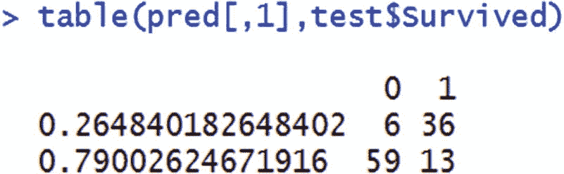

# 五、随机森林

在第 4 章中，我们看了构建决策树的过程。在某些情况下，决策树可能会过度拟合数据，例如，当因变量中存在异常值时。具有相关的独立变量也可能导致选择不正确的变量来分割根节点。

随机森林通过构建多个决策树来克服这些挑战，其中每个决策树处理一个数据样本。让我们来分解一下这个术语:随机指的是从原始数据集中随机抽取数据，而森林指的是构建多个决策树，每个决策树对应一个随机数据样本。(懂了吗？它是多棵树的组合，因此被称为森林。)

在本章中，您将学习以下内容:

*   随机森林的工作细节
*   随机森林优于决策树
*   各种超参数对决策树的影响
*   如何用 Python 和 R 实现随机森林

## 随机森林场景

为了说明为什么随机森林是对决策树的改进，我们来看一个场景，在这个场景中，我们尝试对你是否喜欢一部电影进行分类:

1.  你向一个人寻求建议。
    1.  a 问了一些问题来了解你的喜好。
        1.  我们假设只有 20 个详尽的问题。
        2.  我们将添加一个约束，任何人都可以从 20 个问题中随机选择 10 个问题来提问。
        3.  给定 10 个问题，这个人最好以这样的方式排列这些问题，以便他们能够从你那里获取最大的信息。 
    2.  根据你的回答，A 提出了一系列电影推荐。 
2.  你向另一个人寻求建议，b。
    1.  和之前一样，B 提问是为了了解你的喜好。
        1.  b 也只能从 20 个问题的详尽清单中提出 10 个问题。
        2.  基于 10 个随机选择的问题，B 再次对它们排序，以最大化从你的偏好中获得的信息。
        3.  请注意，A 和 B 之间的问题集可能不同，尽管有一些重叠。 
    2.  根据你的回答，B 提出了建议。 
3.  为了达到某种随机性，你可能会跟 A 说《教父》是你看过的最好的电影。但你只是告诉 B 你“非常”喜欢看《教父》
    1.  这样虽然原始信息没有变化，但是两个不同的人学习的方式是不一样的。 
4.  你和你的 n 个朋友做了同样的实验。
    1.  通过前面的内容，您基本上构建了一个决策树集合(这里的集合是指树或森林的组合)。 
5.  最后的推荐会是所有 n 个好友的平均推荐。

### 制袋材料

Bagging 是引导聚合的缩写。术语 bootstrap 指的是随机选择几行(原始数据集中的一个样本)，而 aggregating 指的是从基于数据集样本构建的所有决策树中获取预测的平均值。

这样，预测就不太可能因少数异常情况而出现偏差(因为可能会有一些使用样本数据构建的树，其中样本数据没有任何异常)。Random forest 在构建预测时采用了 bagging 方法。

### 随机目录林的工作细节

构建随机林的算法如下:

1.  对原始数据进行子集划分，以便决策树仅基于原始数据集的样本构建。
2.  在构建决策树时，也要对独立变量(特征)进行子集划分。
3.  基于子集数据构建决策树，其中行和列的子集用作数据集。
4.  根据测试或验证数据集进行预测。
5.  重复步骤 1 到 3 n 次，其中 n 是构建的树的数量。
6.  测试数据集上的最终预测是所有 n 棵树的预测的平均值。

R 中的以下代码构建了前面的算法(可作为“rf_code”。github 中的 r”)。

```py
t=read.csv("train_sample.csv")

```

所描述的数据集具有 140 列和 10，000 行。前 8，000 行用于训练模型，其余的用于测试:

```py
train=t[1:8000,]
test=t[8001:9999,]

```

假设我们使用决策树来构建我们的随机森林，让我们使用`rpart`包:

```py
library(rpart)

```

初始化测试数据集中名为`prediction`的新列:

```py
test$prediction=0

```

```py
for(i in 1:1000){ # we are running 1000 times - i.e., 1000 decision trees
  y=0.5
  x=sample(1:nrow(t),round(nrow(t)*y))  # Sample 50% of total rows, as y is 0.5
t2=t[x, c(1,sample(139,5)+1)]     # Sample 5 columns randomly, leaving the first column which is the dependent variable
dt=rpart(response~.,data=t2)   # Build a decision tree on the above subset of data (sample rows and columns)
 pred1=(predict(dt,test))  # Predict based on the tree just built
 test$prediction=(test$prediction+pred1)  # Add predictions of all the iterations of previously built decision trees
}
test$prediction = (test$prediction)/1000  # Final prediction of the value is the average of predictions of all the iterations

```

## 在 R 中实现随机森林

使用`randomForest`包可以在 R 中实现随机森林。在下面的代码片段中，我们尝试预测一个人是否会在泰坦尼克号数据集中幸存(代码为“rf_code2”。github 中的 r”)。

为简单起见，我们不处理缺失值，只考虑那些没有缺失值的行:


在这段代码中，我们构建了一个有 10 棵树的随机森林来提供预测。代码片段的输出如下所示:


请注意，上面的错误消息指定了两件事:

*   某些分类自变量中不同值的数量很大。
*   此外，它假设我们必须指定回归而不是分类。

让我们看看，当分类变量具有大量不同值时，随机森林为什么可能会给出错误。请注意，随机森林是多个决策树的实现。在决策树中，当有更多的不同值时，大多数不同值的频率计数非常低。当频率较低时，独特值的纯度可能较高(或杂质较低)。但是这是不可靠的，因为数据点的数量可能很少(在一个变量的不同值的数量很多的情况下)。因此，当分类变量中不同值的数量很大时，随机森林不会运行。

考虑输出中的警告消息:“响应只有五个或更少的唯一值。确定要做回归吗？”注意，名为`Survived`的列在类中是数值型的。因此，该算法默认假设这是一个需要执行的回归。

为了避免这种情况，您需要将因变量转换为分类变量或因子变量:


现在我们可以期待随机森林预测了。

如果我们将输出与决策树进行对比，一个主要缺点是决策树输出可以可视化为一棵树，但随机森林输出不能可视化为一棵树，因为它是多个决策树的组合。理解变量重要性的一种方法是通过观察总杂质减少的多少是由于不同变量的分裂。

变量重要性可以通过使用函数`importance`在 R 中计算:


考虑如何计算变量`Sex`的`MeanDecreaseGini`:


在前面的代码片段中，选择了原始数据集的一个样本。该样本被视为训练数据集，其余的被视为测试数据集。

基于训练数据集构建决策树。预测基于袋外数据，即测试数据集:



让我们计算前面输出的熵:


从表中，我们可以看到总熵从 0.9857 减少到 0.7755。

同样，让我们考虑另一个极端，最不重要的变量:`Embarked`:


从上表中，我们看到熵从 0.9857 减少到只有 0.9326。因此，与变量`Sex`相比，熵的减少要少得多。这意味着作为一个变量，`Sex`比`Embarked`更重要。

变量重要性图也可以通过图 [5-1](#Fig1) 所示的函数得到。


图 5-1

Variable importance plot

### 要在随机林中调整的参数

在刚才讨论的场景中，我们注意到随机森林是基于决策树的，但是基于多个树运行来产生平均预测。因此，我们在随机森林中调整的参数将与用于调整决策树的参数非常相似。

因此，主要参数如下:

*   树的数量
*   树的深度

为了查看树的数量对测试数据集 AUC 的影响，我们将浏览一些代码。使用以下代码片段计算 AUC:


在下面的代码片段中，我们以 10 为步长增加树的数量，并查看 AUC 值如何随着树的数量而变化:


在前两行中，我们已经初始化了空向量，我们将在不同数量的树的`for`循环中继续填充这些空向量。初始化之后，我们运行一个循环，其中每一步树的数量增加 10。运行随机森林后，我们计算测试数据集上预测的 AUC 值，并继续追加 AUC 值。

图 [5-2](#Fig2) 绘制了不同数量树木的最终 AUC 图。


图 5-2

AUC over different number of trees

从图 [5-2](#Fig2) 中我们可以看到，随着树数的增加，测试数据集的 AUC 值总体上是增加的。但是在更多的迭代之后，AUC 可能不会进一步增加。

### AUC 随树深的变化

在上一节中，我们注意到 AUC 的最大值出现在树的数量接近 200 时。

在本节中，我们将考虑树的深度对精确度量(AUC)的影响。在第 4 章中，我们看到节点的大小直接影响树的最大深度。例如，如果最小可能节点大小为高，则深度自动为低，反之亦然。让我们将节点大小作为一个参数来调整，看看 AUC 如何随节点大小而变化:


请注意，前面的代码与我们为树的数量变化编写的代码非常相似。唯一增加的是参数`nodesize`。

前面代码片段的输出如图 [5-3](#Fig3) 所示。


图 5-3

AUC over different node sizes

在图 [5-3](#Fig3) 中，请注意，随着节点大小大量增加，测试数据集的 AUC 减少。

## 用 Python 实现随机森林

随机森林是用 Python 和`scikit-learn`库实现的。随机森林的实现细节如下所示(github 中的“random forest.ipynb”):

```py
from sklearn.ensemble import RandomForestClassifier
rfc = RandomForestClassifier(n_estimators=100,max_depth=5,min_samples_leaf=100,random_state=10)
rfc.fit(X_train, y_train)

```

预测如下:

```py
rfc_pred=rfc.predict_proba(X_test)

```

一旦做出预测，AUC 可以如下计算:

```py
from sklearn.metrics import roc_auc_score
roc_auc_score(y_test, rfc_pred[:,1])

```

## 摘要

在这一章中，我们看到了随机森林是如何通过采用平均预测方法来改进决策树的。我们还看到了在随机森林中需要调整的主要参数:树的深度和树的数量。从本质上来说，随机森林是一种 bagging (bootstrap aggregating)算法，它结合了多个决策树的输出来进行预测。