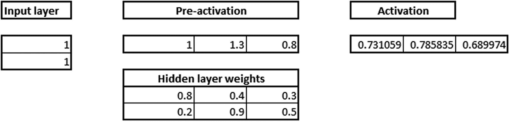
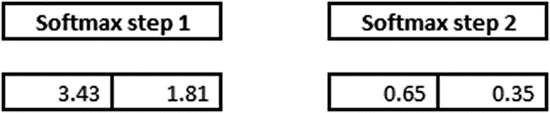
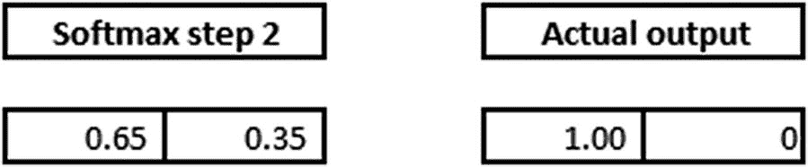

# 七、人工神经网络

人工神经网络是一种监督学习算法，它利用多个超参数的混合来帮助逼近输入和输出之间的复杂关系。人工神经网络中的一些超参数包括:

*   隐藏层数
*   隐藏单元的数量
*   激活功能
*   学习率

在本章中，您将学习以下内容:

*   神经网络的工作细节
*   各种超参数对神经网络的影响
*   前馈和反向传播
*   学习率对权重更新的影响
*   避免神经网络中过拟合的方法
*   如何在 Excel、Python 和 R 中实现神经网络

神经网络源于这样一个事实，即并非所有东西都可以用线性/逻辑回归来近似，数据中可能存在只能用复杂函数近似的潜在复杂形状。函数越复杂(以某种方式处理过拟合)，预测的准确性就越好。我们将从研究神经网络如何将数据拟合到模型中开始。

## 神经网络的结构

神经网络的典型结构如图 [7-1](#Fig1) 所示。


图 7-1

Neural network structure

图中的输入级别/层通常是用于预测输出(因变量)级别/层的独立变量。通常，在回归问题中，输出层只有一个节点，而在分类问题中，输出层包含的节点数量与因变量中存在的类(不同值)的数量一样多。隐藏级别/层用于将输入变量转换为高阶函数。隐藏层转换输出的方式如图 [7-2](#Fig2) 所示。


图 7-2

Transforming the output

在图 7.2 中，x1 和 x2 是独立变量，b0 是偏差项(类似于线性/逻辑回归中的偏差)。w1 和 w2 是赋予每个输入变量的权重。若 a 是隐藏层中的一个单元/神经元，则等于:


前面等式中的函数是我们在求和之上应用的激活函数，以便我们获得非线性(我们需要非线性，以便我们的模型现在可以学习复杂的模式)。不同的激活功能将在后面的章节中详细讨论。

此外，具有一个以上的隐藏层有助于实现高度非线性。我们希望实现高度非线性，因为没有它，神经网络将是一个巨大的线性函数。

当神经网络必须理解非常复杂、有上下文关系或不明显的东西(如图像识别)时，隐藏层是必要的。深度学习这个术语来源于拥有许多隐藏层。这些图层被称为隐藏图层，因为它们在网络输出中不可见。

## 训练神经网络的工作细节

训练一个神经网络基本上意味着通过重复两个关键步骤来校准所有的权重:前向传播和反向传播。

在前向传播中，我们将一组权重应用于输入数据并计算输出。对于第一次正向传播，随机初始化该组权重值。

在反向传播中，我们测量输出的误差幅度，并相应地调整权重以减小误差。

神经网络重复前向和反向传播，直到权重被校准以准确预测输出。

### 正向传播

让我们通过一个训练神经网络作为异或(XOR)运算的简单例子来说明训练过程中的每个步骤。XOR 函数可以通过输入和输出的映射来表示，如下表所示，我们将使用它作为训练数据。给定 XOR 函数可接受的任何输入，它应该提供正确的输出。

<colgroup><col align="left"> <col align="left"></colgroup> 
| 投入 | 输出 |
| :-- | :-- |
| (0,0) | Zero |
| (0,1) | one |
| (1,0) | one |
| (1,1) | Zero |

让我们使用上表的最后一行，(1，1) => 0 来演示正向传播，如图 [7-3](#Fig3) 所示。请注意，虽然这是一个分类问题，但我们仍然将它视为回归问题，只是为了理解向前和向后传播是如何工作的。


图 7-3

Applying a neural network

我们现在给所有的突触分配权重。请注意，这些权重是随机选择的(最常见的方式是基于高斯分布)，因为这是我们第一次正向传播。初始权重随机分配在 0 和 1 之间(但注意最终权重不需要在 0 和 1 之间)，如图 [7-4](#Fig4) 所示。


图 7-4

Weights on the synapses

我们将输入与其对应的一组权重的乘积相加，得出隐藏层的第一个值(图 [7-5](#Fig5) )。您可以将权重视为输入节点对输出的影响度量:


图 7-5

Values for the hidden layer

*   1 × 0.8 + 1 × 0.2 = 1
*   1 × 0.4 + 1 × 0.9 = 1.3
*   1 × 0.3 + 1 × 0.5 = 0.8

### 应用激活功能

激活函数应用于神经网络的隐藏层。激活功能的目的是将输入信号转换成输出信号。它们对于神经网络建模复杂的非线性模式是必要的，而简单的模型可能会遗漏这些模式。

一些主要的激活函数如下:


整流线性单位= x 如果 x > 0，否则 0

对于我们的例子，让我们使用 sigmoid 函数来激活。并将 Sigmoid(x)应用于三个隐藏层和，我们得到图 [7-6](#Fig6) :


图 7-6

Applying sigmoid to the hidden layer sums

*   Sigmoid(1.0) = 0.731
*   Sigmoid(1.3) = 0.785
*   Sigmoid(0.8) = 0.689

然后，我们将隐藏层结果与第二组权重(第一次也是随机确定的)的乘积求和，以确定输出和:

*   0.73 × 0.3 + 0.79 × 0.5 + 0.69 × 0.9 = 1.235


图 7-7

Applying the activation function

因为我们使用了一组随机的初始权重，所以输出神经元的值偏离了目标值—在本例中，偏离了 1.235(因为目标值是 0)。

在 excel 中，上述内容如下所示(在 github 中，Excel 的名称为“NN.xlsx”):



1.  输入层有两个输入(1，1)，因此输入层的维数为 1 × 2(因为每个输入有两个不同的值)。
2.  1 × 2 隐藏层乘以 2 × 3 维的随机初始化矩阵。
3.  隐藏层的输入输出是一个 1 × 3 矩阵:

上述输出的公式如下:


激活函数的输出乘以 3 × 1 维随机初始化矩阵，得到 1 × 1 维的输出:


获得前面输出的方法是按照下面的公式:


同样，虽然这是一个分类练习，其中我们使用交叉熵误差作为损失函数，但我们仍将使用平方误差损失函数，只是为了使反向传播计算更容易理解。我们将在后面的章节中了解分类在神经网络中是如何工作的。

一旦我们有了输出，我们计算平方误差(总误差)，即(1.233-0) <sup>2</sup> ，如下所示:


从输入层获得平方误差所涉及的各个步骤共同形成了前向传播。

### 反向传播

在前向传播中，我们从输入到隐藏到输出迈出了一步。在反向传播中，我们采用相反的方法:本质上，从最后一层开始少量改变每个权重，直到达到最小可能误差。当重量改变时，总误差要么减小，要么增大。根据误差是增加还是减少，决定权重更新的方向。此外，在一些情况下，对于重量的小变化，误差增加/减少相当多，并且在一些情况下，误差仅改变很小的量。

总而言之，通过少量更新权重并测量误差变化，我们能够做到以下几点:

1.  决定权重需要更新的方向
2.  决定权重需要更新的幅度

在继续在 Excel 中实现反向传播之前，让我们看看神经网络的另一个方面:学习速率。学习率有助于我们建立对权重更新决策的信任。例如，在决定权重更新的幅度时，我们可能不会一次改变所有的东西，而是采取更谨慎的方法来更慢地更新权重。这导致在我们的模型中获得稳定性。后面的部分将讨论学习速度如何有助于稳定性。

### 计算反向传播

为了了解反向传播是如何工作的，让我们来看看上一节中更新随机初始化的权重值。

具有随机初始化的权重值的网络的总误差是 1.52。让我们将隐藏层与输出层之间的权重从 0.3 更改为 0.29，并查看对整体误差的影响:


请注意，随着重量的小幅下降，总误差从 1.52 降至 1.50。因此，根据前面提到的两点，我们得出结论，0.3 需要降低到一个更低的数字。在决定了权重需要更新的方向之后，我们需要回答的问题是:“权重更新的幅度是多少？”

如果通过少量(0.01)改变权重，误差减少了很多，那么潜在地，权重可以更新更大的量。但是如果当权重被少量更新时，误差仅减少少量，那么权重需要被缓慢地更新。因此，隐藏层与输出层之间值为 0.3 的权重更新如下:

*   0.3–0.05×(因重量变化而减少误差)

0.05 是学习参数，由用户输入——下一节将详细介绍学习率。因此，权重值更新为 0.3–0.05×((1.52-1.50)/0.01)= 0.21。

类似地，其他权重更新为 0.403 和 0.815:


注意，通过改变连接隐藏层和输出层的权重，整体误差减少了很多。

既然我们已经更新了一个层中的权重，我们将更新网络早期部分中存在的权重，即输入层和隐藏层激活之间的权重。让我们改变重量值并计算误差的变化:

<colgroup><col align="left"> <col align="left"> <col align="left"></colgroup> 
| 原重 | 更新重量 | 误差减少 |
| :-- | :-- | :-- |
| Zero point eight | 0.7957 | 0.0009 |
| Zero point four | 0.3930 | 0.0014 |
| Zero point three | 0.2820 | 0.0036 |
| Zero point two | 0.1957 | 0.0009 |
| Zero point nine | 0.8930 | 0.0014 |
| Zero point five | 0.4820 | 0.0036 |

假设每次当权重减小一个小值时，误差都在减小，我们将把所有权重减小到上面计算的值。

现在权重已更新，请注意总误差从 1.52 降至 1.05。我们不断重复向前和向后传播，直到总误差尽可能最小。

### 随机梯度下降

梯度下降是在刚刚讨论的场景中误差最小化的方式。梯度代表差异(实际和预测之间的差异)，下降意味着减少。random 代表训练数据的子集，用于计算误差，从而更新权重(在后面的部分中会详细介绍数据子集)。

### 深入梯度下降

为了加深我们对梯度下降神经网络的理解，让我们从一个已知的函数开始，看看如何导出权重:现在，我们将已知的函数设为 y = 6 + 5x。

数据集如下所示(在 github 中以“gradient descent batch size.xlsx”的形式提供):

<colgroup><col align="left"> <col align="left"></colgroup> 
| x | y |
| :-- | :-- |
| one | Eleven |
| Two | Sixteen |
| three | Twenty-one |
| four | Twenty-six |
| five | Thirty-one |
| six | Thirty-six |
| seven | Forty-one |
| eight | Forty-six |
| nine | Fifty-one |
| Ten | fifty-six |

让我们将参数 a 和 b 随机初始化为值 2 和 3(其理想值为 5 和 6)。权重更新的计算如下:


注意，我们是从用 2 和 3(第 1 行，第 3 列和第 4 列)随机初始化`a_estimate`和`b_estimate`估计值开始的。

我们计算如下:

*   使用 a 和 b 的随机初始化值计算 y 的估计值:5。
*   计算对应于 a 和 b 的值的平方误差(第 1 行中的 36)。
*   稍微改变 a 的值(增加 0.01)，并计算与改变后的 a 值相对应的平方误差。这被存储为`error_change_a`列。
*   计算`delta_error_a`中的误差变化(误差变化/ 0.01)。注意，如果我们对 a 的损失函数进行微分，δ将非常相似。
*   根据:`new_a` = `a_estimate` + ( `delta_error_a` ) × `learning_rate`更新 a 的值。

在本分析中，我们认为学习率为 0.01。对 b 的更新估计值进行相同的分析。下面是与刚才描述的计算相对应的公式:


一旦更新了 a 和 b 的值(new_a 和 new_b 在第一行中计算)，对第 2 行执行相同的分析(注意，我们从第 2 行开始，使用从上一行获得的 a 和 b 的更新值。)我们不断更新 a 和 b 的值，直到覆盖了所有的数据点。最后，a 和 b 的更新值分别为 2.75 和 5.3。

既然我们已经运行了整个数据集，我们将用 2.75 和 5.3 重复整个过程，如下所示:


a 和 b 的值从 2.75 和 5.3 开始，到 2.87 和 5.29 结束，比上一次迭代精确一点。随着更多的迭代，a 和 b 的值将收敛到最优值。

我们已经研究了基本梯度下降的工作细节，但是其他优化器也执行类似的功能。其中一些如下:

*   RMSprop
*   阿达格拉德
*   阿达德尔塔
*   圣经》和《古兰经》传统中）亚当（人类第一人的名字
*   阿达玛斯
*   那达慕

### 为什么要有学习率？

在刚才讨论的场景中，由于学习率为 0.01，我们将权重从 2.3 移动到 2.75 和 5.3。让我们看看学习率为 0.05 时权重会如何变化:


请注意，在学习率从 0.01 变为 0.05 的时刻，在这种特定情况下，a 和 b 的值在后面的数据点上开始出现异常变化。因此，较低的学习率总是首选。但是，请注意，较低的学习速率会导致获得最佳结果的时间较长(迭代次数较多)。

## 批量训练

到目前为止，我们已经看到 a 和 b 的值在数据集的每一行都得到更新。然而，这可能不是一个好主意，因为变量值会显著影响 a 和 b 的值。因此，误差计算通常是对一批数据进行的，如下所示。假设批量大小为 2(在前面的例子中，批量大小为 1):

<colgroup><col align="right"> <col align="right"> <col align="right"> <col align="right"> <col align="right"> <col align="right"> <col align="right"> <col align="right"> <col align="right"> <col align="right"> <col align="right"> <col align="right"></colgroup> 
| x | y | 估计值 | b _ 估计 | y _ 估计值 | 平方误差 | 错误 _ 改变 _a | 增量 _ 误差 _a | 新 _a | 错误 _ 更改 _b | 增量 _ 误差 _b | 新 _b |
| --: | --: | --: | --: | --: | --: | --: | --: | --: | --: | --: | --: |
| one | Eleven | Two | three | five | Thirty-six | 35.8801 | Eleven point nine nine |   | 35.8801 | Eleven point nine nine |   |
| Two | Sixteen | Two | three | eight | Sixty-four | 63.8401 | Fifteen point nine nine |   | 63.6804 | Thirty-one point nine six |   |
|   |   |   |   | 全部的 | One hundred | 99.7202 | Twenty-seven point nine eight | 2.2798 | 99.5605 | Forty-three point nine five | 3.4395 |

现在对于下一批，a 和 b 的更新值是 2.28 和 3.44:

<colgroup><col align="left"> <col align="left"> <col align="left"> <col align="left"> <col align="left"> <col align="left"> <col align="left"> <col align="left"> <col align="left"> <col align="left"> <col align="left"> <col align="left"></colgroup> 
| x | y | 估计值 | b _ 估计 | y _ 估计值 | 平方误差 | 错误 _ 改变 _a | 增量 _ 误差 _a | 新 _a | 错误 _ 更改 _b | 增量 _ 误差 _b | 新 _b |
| :-- | :-- | :-- | :-- | :-- | :-- | :-- | :-- | :-- | :-- | :-- | :-- |
| three | Twenty-one | Two point two eight | Three point four four | Twelve point six | Seventy point five nine | Seventy point four two | Sixteen point seven nine |   | Seventy point zero nine | Fifty point three two |   |
| four | Twenty-six | Two point two eight | Three point four four | Sixteen point zero four | Ninety-nine point two five | Ninety-nine point zero five | Nineteen point nine one |   | Ninety-eight point four five | Seventy-nine point five four |   |
|   |   |   |   | 全部的 | One hundred and sixty-nine point eight three | One hundred and sixty-nine point four seven | Thirty-six point seven one | Two point six five | One hundred and sixty-eight point five four | One hundred and twenty-nine point eight six | Four point seven four |

a 和 b 的更新值现在是 2.65 和 4.74，并且迭代继续。请注意，在实践中，批量大小至少为 32。

### Softmax 的概念

到目前为止，在 Excel 实现中，我们已经执行了回归，而不是分类。当我们执行分类时要注意的关键区别是输出被限制在 0 和 1 之间。在二进制分类的情况下，输出图层将有两个结点，而不是一个。一个节点对应于输出 0，另一个对应于输出 1。

现在，我们来看看当输出层有两个节点时，我们的计算如何根据上一节的讨论而变化(其中输入为 1，1，预期输出为 0)。假设输出为 0，我们将对输出进行如下单热编码:[1，0]，其中第一个索引值对应于输出 0，第二个索引值对应于输出 1。

连接隐藏层和输出层的权重矩阵更改如下:它不是 3 × 1 矩阵，而是 3 × 2 矩阵，因为隐藏层现在连接到两个输出节点(与回归练习不同，它连接到 1 个节点):


请注意，因为输出节点是 to，所以我们的输出层也包含两个值，如下所示:


上述输出的一个问题是它的值大于 1(在其他情况下，这些值也可能小于 0)。

在输出超出 0 到 1 之间的期望值的情况下，Softmax 激活就派上了用场。上述输出的 Softmax 计算如下:

在下面的 Softmax 步骤 1 中，输出被提升到其指数值。请注意，3.43 是 1.233 的指数:


在下面的 Softmax 步骤 2 中，softmax 输出被归一化以获得概率，使得两个输出的概率之和为 1:



注意 0.65 的值是由 3.43 / (3.43 + 1.81)得到的。

现在我们有了概率值，而不是计算总平方误差，我们计算交叉熵误差，如下所示:

1.  The final softmax step is compared with actual output:

    

2.  The cross entropy error is calculated based on the actual values and the predicted values (which are obtained from softmax step 2):

    

请注意公式面板中的交叉熵误差公式。

现在我们有了最终的误差度量，我们再次部署梯度下降来最小化总交叉熵误差。

## 不同的损失优化函数

可以针对不同的度量进行优化，例如，回归中的平方误差和分类中的交叉熵误差。可以优化的其他损失函数包括:

*   均方误差
*   平均绝对百分比误差
*   均方对数误差
*   方形铰链
*   关键
*   分类铰链
*   对数曲线
*   范畴交叉熵
*   稀疏分类交叉熵
*   二元交叉熵
*   库尔贝克莱布勒散度
*   泊松
*   余弦接近度

### 缩放数据集

通常，当我们缩放输入数据集时，神经网络表现良好。在这一节中，我们将了解缩放的原因。为了了解缩放对输出的影响，我们将对比两个场景。

#### 不缩放输入的场景


在上表中，计算了各种方案，其中输入总是相同的 255，但是在每个方案中乘以输入的权重是不同的。请注意，即使重量变化很大，sigmoid 输出也不会改变。那是因为权重乘以一个大数，其输出也是一个大数。

#### 输入缩放的场景

在这种情况下，我们将不同的权重值乘以一个小的输入数，如下所示:


现在权重乘以一个较小的数，对于不同的权重值，sigmoid 输出会有很大的不同。

由于权重需要缓慢调整以达到最佳权重值，因此独立变量数量较大的问题非常严重。假设权重调整缓慢(按照梯度下降中的学习速率)，当输入是高数量级时，可能需要相当长的时间来达到最佳权重。因此，要获得最佳权重值，最好首先缩放数据集，这样我们就可以将输入作为一个小数字。

## 用 Python 实现神经网络

在 Python 中实现神经网络有几种方法。在这里，我们将看看使用`keras`框架实现神经网络。你必须安装`tensorflow` / `theano`，和`keras`才能实现神经网络。


1.  Download the dataset and extract the train and test dataset (code available as “NN.ipynb” in github)

    

    图 7-8

    The output

    ```py
    from keras.datasets import mnist
    import matplotlib.pyplot as plt
    %matplotlib inline
    # load (downloaded if needed) the MNIST dataset
    (X_train, y_train), (X_test, y_test) = mnist.load_data()
    # plot 4 images as gray scale
    plt.subplot(221)
    plt.imshow(X_train[0], cmap=plt.get_cmap('gray'))
    plt.subplot(222)
    plt.imshow(X_train[1], cmap=plt.get_cmap('gray'))
    plt.subplot(223)
    plt.imshow(X_train[2], cmap=plt.get_cmap('gray'))
    plt.subplot(224)
    plt.imshow(X_train[3], cmap=plt.get_cmap('gray'))
    # show the plot
    plt.show()

    ```

2.  导入相关包:

    ```py
    import numpy as np
    from keras.datasets import mnist
    from keras.models import Sequential
    from keras.layers import Dense
    from keras.layers import Dropout
    from keras.utils import np_utils

    ```

3.  预处理数据集:

    ```py
    num_pixels = X_train.shape[1] * X_train.shape[2]
    # reshape the inputs so that they can be passed to the vanilla NN
    X_train = X_train.reshape(X_train.shape[0],num_pixels ).astype('float32')
    X_test = X_test.reshape(X_test.shape[0],num_pixels).astype('float32')
    # scale inputs
    X_train = X_train / 255
    X_test = X_test / 255
    # one hot encode the output
    y_train = np_utils.to_categorical(y_train)
    y_test = np_utils.to_categorical(y_test)
    num_classes = y_test.shape[1]

    ```

4.  Build a model:

    

    ```py
    # building the model
    model = Sequential()
    # add 1000 units in the hidden layer
    # apply relu activation in hidden layer
    model.add(Dense(1000, input_dim=num_pixels,activation='relu'))
    # initialize the output layer
    model.add(Dense(num_classes, activation="softmax"))
    # compile the model
    model.compile(loss='categorical_crossentropy', optimizer="adam", metrics=['accuracy'])
    # extract the summary of model
    model.summary()

    ```

5.  运行模型:

    ```py
    model.fit(X_train, y_train, validation_data=(X_test, y_test), epochs=5, batch_size=1024, verbose=1)

    ```

请注意，随着历元数量的增加，测试数据集的准确性也会增加。此外，在`keras`中，我们只需要指定第一层的输入尺寸，它会自动计算其余层的尺寸。

## 使用正则化避免过拟合

即使我们已经缩放了数据集，神经网络也可能在训练数据集上过度拟合，因为损失函数(平方误差或交叉熵误差)确保损失随着时期数量的增加而最小化。

然而，在训练损失不断减少的同时，测试数据集上的损失并不一定也在减少。神经网络中的权重(参数)越多，在训练数据集上过度拟合从而无法在看不见的测试数据集上推广的可能性就越大。

让我们在 MNIST 数据集上对比使用相同神经网络架构的两个场景，其中在场景 A 中，我们考虑 5 个历元，因此过拟合的机会较少，而在场景 B 中，我们考虑 100 个历元，因此过拟合的机会较多(代码在 github 中可作为“neural network.ipynb 中的正则化需求”获得)。

我们应该注意到，在最初的几个时期，训练和测试数据集精度之间的差异较小，但是随着时期数量的增加，训练数据集的精度增加，而测试数据集的精度在一些时期之后可能不会增加。

在我们的运行中，我们看到了以下准确性指标:

<colgroup><col align="left"> <col align="left"> <col align="left"></colgroup> 
| 方案 | 训练数据集 | 测试数据集 |
| 5 个时代 | 97.57% | 97.27% |
| 100 个时代 | 100% | 98.28% |

一旦我们绘制了权重直方图(在本例中，权重将隐藏层连接到输出层)，我们将会注意到，与 5 个时段的权重相比，100 个时段的权重具有更高的分布(范围)，如下图所示:


100 个时期的方案具有更高的权重范围，因为它试图在后面的时期中针对训练数据集中的边缘情况进行调整，而 5 个时期的方案没有机会针对边缘情况进行调整。虽然训练数据集的边缘案例被权重更新覆盖，但是测试数据集的边缘案例没有必要表现类似，因此可能没有被权重更新覆盖。此外，请注意，训练数据集中的边缘情况可以通过给予特定像素非常高的权重来覆盖，从而快速移动到 sigmoid 曲线的饱和 1 或 0。

因此，具有高权重值对于一般化目的来说是不理想的。在这种情况下，正则化就派上了用场。

正则化对具有高数量级的权重不利。使用的主要正则化类型是 L1 & L2 正则化

L2 正则化将附加成本项添加到误差(损失函数)中，如

L1 正则化将附加成本项添加到误差(损失函数)中，如

这样，我们确保权重不能被调整为具有高值，以便它们仅在训练数据集中用于极端边缘情况。

## 给正则项分配权重

我们注意到，在 L2 正则化的情况下，我们修改的损失函数如下:

总损失= 

其中是与正则化项相关联的权重，并且是需要调整的超参数。类似地，L1 正则化情况下的总损耗如下:

总损失= 

L1/ L2 正则化在 Python 中实现如下:

```py
from keras import regularizers
model3 = Sequential()
model3.add(Dense(1000, input_dim=784, activation="relu", kernel_regularizer=regularizers.l2(0.001)))
model3.add(Dense(10, activation="softmax", kernel_regularizer=regularizers.l2(0.001)))
model3.compile(loss='categorical_crossentropy', optimizer="adam", metrics=['accuracy'])
model3.fit(X_train, y_train, validation_data=(X_test, y_test), epochs=100, batch_size=1024, verbose=2)

```

注意，上面涉及到调用一个额外的超参数——“kernel _ regulator”，然后指定它是否是 L1 / L2 正则化。此外，我们还指定了赋予正则化权重的值。

我们注意到，正则化后，训练和测试数据集的精度彼此相似，其中训练数据集的精度为 97.6%，而测试数据集的精度为 97.5%。L2 正则化后的权重直方图如下:


我们注意到，与前两种情况相比，大多数权重现在更接近于 0，从而避免了由于分配给边缘情况的高权重值而导致的过拟合问题。在 L1 正则化的情况下，我们会看到类似的趋势。

因此，L1 和 L2 正则化帮助我们避免了在训练数据集上过度拟合但在测试数据集上不泛化的问题。

## 用 R 语言实现神经网络

类似于我们在 Python 中实现神经网络的方式，我们将使用`keras`框架在 R 中实现神经网络。

为了构建神经网络模型，我们将在 R 中使用`kerasR`包。考虑到`kerasR`包对 Python 的所有依赖性，以及创建虚拟环境的需要，我们将在云中执行 R 实现，如下所示(代码可作为“NN。github 中的 r”)。

1.  安装`kerasR`包:

    ```py
    install.packages("kerasR")

    ```

2.  加载已安装的软件包:

    ```py
    library(kerasR)

    ```

3.  使用 MNIST 数据集进行分析:

    ```py
    mnist <- load_mnist()

    ```

4.  检查`mnist`对象的结构:

    ```py
    str(mnist)

    ```

    注意，默认情况下，MNIST 数据集将训练和测试数据集分开。
5.  提取训练和测试数据集:

    ```py
    mnist <- load_mnist()
    X_train <- mnist$X_train
    Y_train <- mnist$Y_train
    X_test <- mnist$X_test
    Y_test <- mnist$Y_test

    ```

6.  重塑数据集。假设我们正在执行一个正常的神经网络操作，我们的输入数据集的维数应该是(60000，784)，而`X_train`的维数是(60000，28，28):

    ```py
    X_train <- array(X_train, dim = c(dim(X_train)[1], 784))
    X_test <- array(X_test, dim = c(dim(X_test)[1], 784))

    ```

7.  缩放数据集:

    ```py
    X_train <- X_train/255
    X_test <- X_test/255

    ```

8.  将因变量(`Y_train`和`Y_test`)转换为分类变量:

    ```py
    Y_train <- to_categorical(mnist$Y_train, 10)
    Y_test <- to_categorical(mnist$Y_test, 10)

    ```

9.  建立模型:

    ```py
    model <- Sequential()
    model$add(Dense(units = 1000, input_shape = dim(X_train)[2],activation = "relu"))
    model$add(Dense(10,activation = "softmax"))
    model$summary()

    ```

10.  编译模型:

    ```py
    keras_compile(model,  loss = 'categorical_crossentropy', optimizer = Adam(),metrics='categorical_accuracy')

    ```

11.  拟合模型:

    ```py
    keras_fit(model, X_train, Y_train,batch_size = 1024, epochs = 5,verbose = 1, validation_data = list(X_test,Y_test))

    ```

我们刚刚经历的过程应该给我们一个大约 98%的测试数据集准确度。

## 摘要

在本章中，您学习了以下内容:

*   神经网络可以逼近复杂的函数(因为隐藏层中的激活)
*   前向和后向传播构成了神经网络功能的构建模块
*   正向传播有助于我们估计误差，而反向传播有助于减少误差
*   每当梯度下降涉及到达到最佳权重值时，缩放输入数据集总是一个更好的主意
*   L1/ L2 正则化通过惩罚高权重幅度来帮助避免过拟合