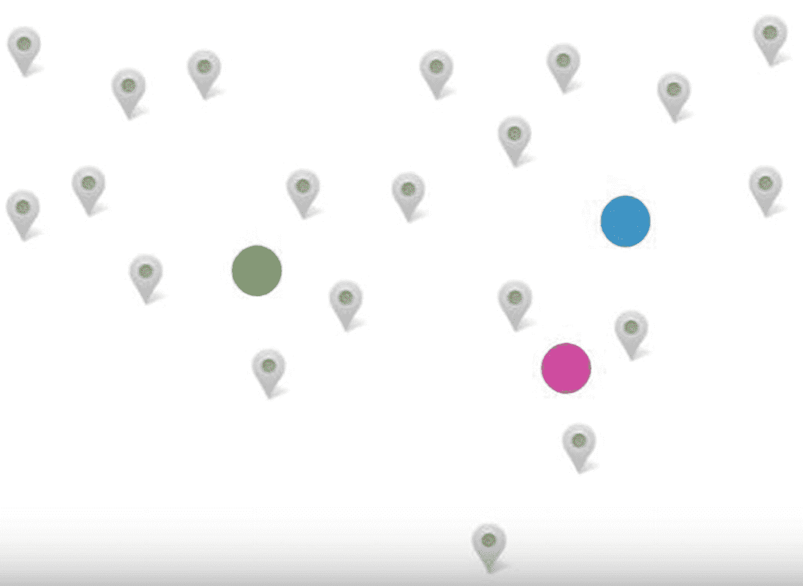
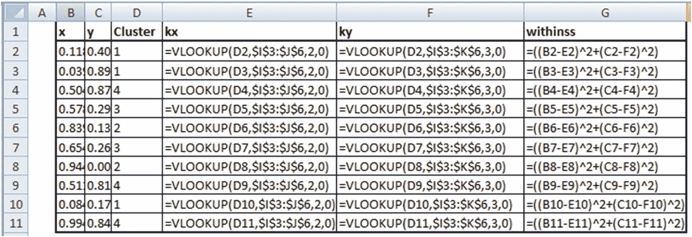
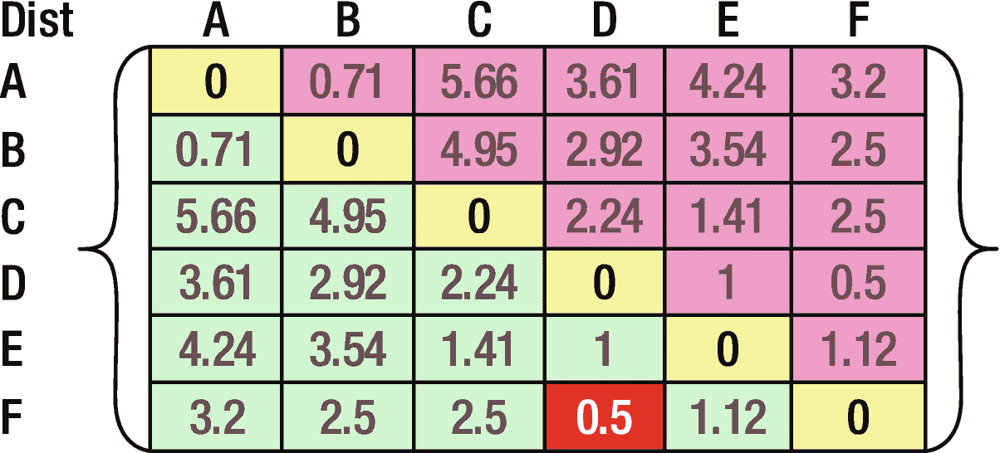

# 十一、聚类

聚类的字典含义是分组。在数据科学中，聚类也是一种无监督的学习技术，有助于对我们的数据点进行分组。

对数据点(行)进行分组的好处包括:

*   为了让企业用户了解客户中的各种类型的用户
*   在集群(集团)层面而非整体层面做出商业决策
*   有助于提高预测的准确性，因为不同的群体表现出不同的行为，因此可以为每个群体建立单独的模型

在本章中，您将学习以下内容:

*   不同类型的聚类
*   不同类型的集群如何工作
*   集群的使用案例

## 聚类直觉

让我们考虑一个有 4，000 个销售点的零售店的例子。中央规划团队必须对所有门店的店长进行年终评估。评估商店经理的主要指标是商店一年的总销售额。

*   场景 1:商店经理仅根据销售额进行评估。我们将根据商店的销售额对所有商店经理进行排名，销售额最高的商店经理将获得最高奖励。缺点:这种方法的主要缺点是，我们没有考虑到一些商店位于城市，与农村商店相比，城市的销售额通常很高。城市商店销售额高的最大原因可能是人口多和/或城市消费者的购买力更高。
*   场景 2:如果我们可以将商店分为城市和农村，或者高购买力客户经常光顾的商店，或者特定人群(比如年轻家庭)经常光顾的商店，并将每个商店称为一个集群，那么只有属于同一个集群的商店经理可以进行比较。例如，如果我们将所有商店分为城市商店和农村商店，那么城市商店的所有商店经理都可以相互比较，农村商店经理也是如此。缺点:虽然我们可以更好地比较不同商店经理的表现，但商店经理仍然会受到不公平的比较。例如，两个城市商店可能不同，一个商店位于上班族经常光顾的中央商务区，另一个位于城市的住宅区。很有可能中央商业区的商店在城市商店中有更高的销售额。

尽管场景 2 仍然有一个缺点，但它并不像场景 1 那样糟糕。因此，将商店分为两类有助于更准确地衡量商店经理的表现。

### 构建商店集群以进行性能比较

在场景 2 中，我们看到商店经理仍然可以质疑比较过程不公平——因为商店仍然可以在一个或多个参数上有所不同。

商店经理可能会列举出他们的商店与其他商店不同的多种原因:

*   不同商店出售的产品的差异
*   光顾商店的顾客年龄组的差异
*   光顾商店的顾客生活方式的差异

现在，为了简单起见，让我们定义我们所有的组:

*   城市商店对农村商店
*   高端产品商店与低端产品商店
*   高年龄组客户商店与低年龄组客户商店的对比
*   高端购物者商店与经济型购物者商店

我们可以仅基于列出的因素创建总共 16 个不同的聚类(组)(所有组合的详尽列表产生 16 个组)。

我们讨论了区分商店的四个重要因素，但仍然有许多其他因素可以区分商店。例如，位于该州多雨地区的商店与位于阳光充足地区的商店相比。

本质上，商店在多个维度/因素上彼此不同。但由于某些因素，商店经理的结果可能会有很大差异，而其他因素的影响可能很小。

### 理想聚类

到目前为止，我们看到每个商店都是独一无二的，可能会有这样一种情况，商店经理总能举出一个或另一个原因来说明为什么他们不能与同一个集群中的其他商店进行比较。例如，商店经理可以说，虽然属于该组的所有商店都是城市商店，大多数高端客户都在中年类别，但他们的商店表现不如其他商店，因为它靠近一直在大力促销的竞争对手商店，因此，与同一组的其他商店相比，该商店的销售额没有那么高。

因此，如果我们把所有的原因都考虑进去，我们最终可能会得到一个细粒度的分段，以至于每个集群中只有一个商店。这将产生一个很好的聚类输出，其中每个商店都是不同的，但是这个结果是没有用的，因为现在我们不能跨商店进行比较。

### 在没有聚类和太多聚类之间取得平衡:K-means 聚类

我们已经看到，有多少个商店就有多少个分类，这是一个区分每个商店的很好的分类，但这是一个无用的分类，因为我们无法从中得出任何有意义的结果。同时，没有集群也是不好的，因为商店经理可能会与完全不同的商店的商店经理进行不准确的比较。

因此，使用聚类过程，我们努力达到平衡。我们希望尽可能多地确定区分商店的几个因素，只考虑那些用于评估的因素，而忽略其他因素。使用 k-means 聚类可以尽可能多地识别商店之间的少数差异因素。

为了了解 k-means 聚类是如何工作的，让我们考虑一个场景:您是一家披萨连锁店的老板。你有预算在一个社区开三家新店。你如何想出开设三个分店的最佳地点？

现在，我们假设所有道路上的交通流量都是相同的。假设我们的邻居看起来像图 [11-1](#Fig1) 。


图 11-1

Each marker represents a household

理想情况下，我们会想出三个插座，它们彼此相距很远，但总的来说离大多数邻居最近。比如类似图 [11-2](#Fig2) 的东西。



图 11-2

The circles represent potential outlet locations

这看起来不错，但是我们能找到更好的出口位置吗？让我们做一个练习。我们将尝试执行以下操作:

1.  尽量缩短每家每户到最近的披萨店的距离
2.  最大化每个披萨店之间的距离

假设一家披萨店只能给两家外卖。如果两家的需求是一致的，那么比萨饼店是正好位于两家之间，还是靠近一家或另一家更好呢？如果送货到房屋 A 需要 15 分钟，送货到房屋 B 需要 45 分钟，凭直觉，我们似乎最好将配送中心设在送货时间为 30 分钟的地方，也就是说，正好在两个房屋之间。如果不是这样，经销店可能经常无法兑现其在 45 分钟内为 B 家送货的承诺，但却永远无法兑现其对 a 家的承诺。

## 聚类的过程

在目前的情况下，我们如何想出一个更科学的方法来确定正确的比萨饼外卖店？该过程或算法如下:

1.  Randomly come up with three places where we can start outlets, as shown in Figure [11-3](#Fig3).

    

    图 11-3

    Random locations  
2.  Measure the distance of each house to the three outlet locations. The outlet that is closest to the household delivers to the household. The scenario would look like Figure [11-4](#Fig4).

    

    图 11-4

    Better informed locations  
3.  As we saw earlier, we are better off if the delivery outlet is in the middle of households than far away from the majority of the households. Thus, let’s change our earlier planned outlet location to be in the middle of the households (Figure [11-5](#Fig5)).

    

    图 11-5

    Locations in the middle  
4.  We see that the delivery outlet locations have changed to be more in the middle of each group. But because of the change in location, there might be some households that are now closer to a different outlet. Let’s reassign households to stores based on their distance to different stores (Figure [11-6](#Fig6)).

    

    图 11-6

    Reassigning households  
5.  Now that some households (comparing Figures [11-5](#Fig5) and [11-6](#Fig6)) have a different outlet that serves them, let’s recompute the middle point of that group of households (Figure [11-7](#Fig7)).

    

    图 11-7

    Recomputing the middles  
6.  既然聚类中心已经改变，现在又有一个机会，家庭需要重新分配到一个不同的出路，而不是目前的出路。

这些步骤继续进行，直到不再将家庭重新分配到不同的群，或者达到最大的特定迭代次数。

正如你所看到的，事实上我们可以想出一个更科学的/分析性的方法来找到可以打开出口的最佳位置。

## K 均值聚类算法的工作细节

我们将开设三家分店，所以我们想出了三组家庭，每组由不同的分店提供服务。

k-means 聚类中的 k 代表我们将在现有数据集中创建的组的数量。在我们在上一节中经历的算法的一些步骤中，一旦一些家庭从一个组改变到另一个组，我们就不断更新中心。我们更新中心的方法是取所有数据点的平均值，因此是 k-means。

最后，在经历了所描述的步骤之后，我们从原始数据集中获得了三组三个数据点或三个聚类。

### 对数据集应用 K-means 算法

让我们看看如何在数据集上实现 k-means 聚类(在 github 中以“clustering process.xlsx”的形式提供)，如下所示:

<colgroup><col align="left"> <col align="left"> <col align="left"></colgroup> 
| X | Y | 串 |
| :-- | :-- | :-- |
| five | Zero | one |
| five | Two | Two |
| three | one | one |
| Zero | four | Two |
| Two | one | one |
| four | Two | Two |
| Two | Two | one |
| Two | three | Two |
| one | three | one |
| five | four | Two |

假设 X 和 Y 是我们希望聚类所基于的独立变量。假设我们想将这个数据集分成两个集群。

第一步，我们随机初始化聚类。因此，上表中的集群列是随机初始化的。

让我们计算每个集群的质心:

<colgroup><col align="left"> <col align="left"> <col align="left"></colgroup> 
| 图心 | one | Two |
| :-- | :-- | :-- |
| X | Two point six | Three point two |
| Y | One point four | three |

注意，值 2.6 是属于聚类 1 的所有 X 值的平均值。类似地，计算其他中心。

现在让我们计算每个点到两个聚类中心的距离。离数据点最近的聚类中心是数据点应该属于的聚类:


在 L & M 列中，我们计算了每个点到两个星团中心的距离。通过查看与数据点具有最小距离的聚类来更新列 O 中的聚类中心。

注意到一个数据点的聚类中有一个变化，我们再次继续前面的步骤，但是现在使用更新的中心。对于我们所做的两次迭代，总体计算如下所示:


我们不断重复这个过程，直到数据点所属的聚类不再发生变化。如果一个数据点簇持续变化，我们可能会在几次迭代后停止。

### K-均值聚类算法的性质

如前所述，聚类练习的目标是以满足以下条件的方式创建不同的组:

1.  属于同一组的所有点尽可能彼此靠近
2.  每个组的中心尽可能远离另一个组的中心

有一些方法可以帮助评估基于这些目标的聚类输出的质量。

让我们通过一个样本数据集(在 github 中以“clustering output interpretation . xlsx”的名称提供)来巩固我们对这些属性的理解。假设我们有一个数据集如下:两个独立变量(x 和 y)和它们所属的对应聚类(一共四个聚类，只是这个例子):


四个聚类中心如下:


我们计算每个点相对于其对应的聚类中心的距离如下:


注意 withinss 中的列计算每个点到其对应的聚类中心的距离。让我们来看看用来得出上述结果的公式:




#### 总平方和

在原始数据集本身被视为聚类的情况下，原始数据集的中点被视为中心。Totss 是所有点到数据集中心的距离的平方之和。

让我们看看公式:


总平方和是从单元格 B15 到单元格 C24 的所有值的总和。

#### 聚类中心

每个聚类的聚类中心将是落在同一聚类中的所有点的中点(平均值)。例如，在 Excel 工作表中，聚类中心是在列 I 和 j 中计算的，请注意，这只是属于同一聚类的所有点的平均值。

#### -再见-再见

Tot.withinss 是所有点到其相应聚类中心的距离平方的总和。

#### 在...之间

betwess 是 totss 和 tot.withinss 的区别。

## 在 R 中实现 K-means 聚类

R 中的 K-means 聚类是通过使用`kmeans`函数实现的，如下所示(作为“clustering_code”提供。github 中的 r”)。

```py
# Lets generate dataset randomly
x=runif(1000)
y=runif(1000)

data=cbind(x,y)
# One would have to specify the dataset along with the number of clusters in input
km=kmeans(data,2)

```

`km`的输出是前面讨论的主要指标:


## 在 Python 中实现 K-means 聚类

Python 中的 K-means 集群是通过`scikit-learn`库中可用的函数实现的，如下所示(在 github 中可用为“clustering.ipynb”):

```py
# import packages and dataset
import pandas as pd
import numpy as np
data2=pd.read_csv('D:/data.csv')
# fit k-means with 2 clusters
from sklearn.cluster import KMeans
kmeans = KMeans(n_clusters=2)
kmeans.fit(data2)

```

在这段代码中，我们从名为`data2`的原始数据集中提取了两个集群。可以通过指定`kmeans.labels_`来提取每个数据点所属聚类的结果标签。

## 主要指标的重要性

如前所述，执行聚类的目的是将所有彼此非常接近的数据点归入一个组，并使这些组彼此尽可能远离。

这是另一种说法:

1.  最小化簇内距离
2.  最大化集群间距离

让我们看看前面讨论的指标如何帮助实现目标。当没有聚类时(即所有数据集被视为一个聚类)，每个点到聚类中心(有一个聚类的地方)的总距离是 totss。当我们在数据集中引入聚类时，聚类内每个点到相应聚类中心的距离之和是 tot.withinss。注意，随着聚类数量的增加，tot.withinss 不断减少。

考虑一种情况，其中聚类的数量等于数据点的数量。在那种情况下 Tot.withinss 等于 0，因为每个点到聚类中心(也就是点本身)的距离是 0。

因此，tot.withinss 是一个衡量簇内距离的指标。tot . withinss/tots 的比率越低，聚类过程的质量越高。

但是我们也需要注意，tot.withinss = 0 的场景就是聚类变得无用的场景，因为每个点本身就是一个聚类。

在下一节中，我们将以稍微不同的方式使用指标 tot.withinss / totss。

## 确定最佳 K

我们尚未回答的一个主要问题是如何获得最佳 k 值？换句话说，数据集内聚类的最佳数量是多少？

为了回答这个问题，我们将使用上一节中使用的度量标准:tot.withinss / totss 的比率。要查看当我们改变集群数量(k)时度量如何变化，请参见以下代码:


我们正在用 10，000 个随机初始化的 x 和 y 值创建一个数据集`data`。

现在，当我们改变 k 值时，我们将探究度量的值。该图如图 [11-8](#Fig8) 所示。


图 11-8

Variation in tot.withinss/totss over different values of k

注意，随着 k 值从 k = 1 增加到 k = 2，度量急剧减小，类似地，当 k 从 2 减少到 4 时，度量减小。

然而，随着 k 的进一步降低，度量的值不会降低很多。因此，谨慎的做法是将 k 值保持在接近 7 的水平，因为在这一点上获得了最大的下降，度量(tot.withinss / totss)的任何进一步下降都与 k 的增加没有很好的相关性。

鉴于曲线看起来像一个肘部，它有时被称为肘部曲线。

## 自顶向下与自底向上聚类

到目前为止，在 k-means 聚类的过程中，我们不知道最佳的聚类数目，所以我们不断尝试具有多个 k 值的各种场景。这是自底向上方法的相对较小的问题之一，其中我们从假设没有聚类开始，慢慢地不断建立多个聚类，一次一个，直到我们根据肘形曲线找到最佳 k。

自顶向下聚类从另一个角度看待同一过程。它假设每个点本身就是一个聚类，并尝试根据点与其他点的距离来组合点。

### 分层聚类

分层聚类是自顶向下聚类的经典形式。在此过程中，计算每个点到其余点的距离。一旦计算出距离，最接近所考虑的点的点被组合以形成聚类。这个过程在所有点上重复，从而获得最终的聚类。

层次部分来源于我们从一个点开始，与另一个点结合，然后将这个点的结合与第三个点结合，不断重复这个过程。

让我们通过一个例子来看看如何实现层次聚类。假设我们有六个不同的数据点——A、B、C、D、E、f。不同数据点相对于其他点的欧几里德距离如图 [11-9](#Fig9) 所示。



图 11-9

Distance of data points

我们看到最小距离在 D 和 f 之间。因此，我们将 D 和 f 组合在一起。得到的矩阵现在看起来如图 [11-10](#Fig10) 所示。


图 11-10

The resulting matrix

我们如何填充图 [11-10](#Fig10) 中缺失的值？参见下面的等式:


注意，基于前面的计算，我们用 d A 和 FA 之间的最小距离替换{D，F}和 A 之间的距离中的缺失值。同样，我们会用其他缺失值进行估算。我们继续这样进行，直到剩下图 [11-11](#Fig11) 。


图 11-11

The final matrix

产生的集群现在可以表示为图 [11-12](#Fig12) 。


图 11-12

Representing the cluster

### 分层聚类的主要缺点

层次聚类的主要缺点之一是需要执行大量的计算。

比方说，如果数据集中有 100 个点，那么第一步是确定最接近点 1 的点，以此类推，进行 99 次计算。第二步，我们需要比较第二个点与其余 98 个点的距离。当有 n 个数据点时，总共需要进行 99 × 100 / 2 或 n×(n–1)/2 次计算，以便识别所有数据点组合中距离最小的数据点组合。

随着数据点的数量从 100 增加到 1，000，000，整个计算变得极其复杂。因此，层次聚类仅适用于小型数据集。

## K 均值聚类的行业用例

我们已经使用 tot.withinss / totss 指标的肘形曲线计算了 k 的最佳值。让我们用一个类似的计算来建立一个模型。

假设我们正在使用逻辑回归拟合一个模型来预测交易是否是欺诈性的。假设我们将一起处理所有的数据点，这将转化为一个聚类练习，其中 k = 1 在整个数据集上。假设它有 90%的准确率。现在，让我们使用 k = 2 来拟合相同的逻辑回归，其中我们对每个聚类都有不同的模型。我们将测量在测试数据集上使用两个模型的准确性。

我们通过增加 k 值——也就是说，通过增加聚类的数量——来不断重复这个练习。最佳 k 是指我们有 k 个不同的模型，每个聚类一个，并且在测试数据集上达到最高精度的模型。类似地，我们将使用聚类来理解数据集中出现的各种片段。

## 摘要

在本章中，您学习了以下内容:

*   K-means 聚类有助于对彼此更相似的数据点进行分组，并以彼此更不相似的方式形成组。
*   聚类可以成为细分、运筹学和数学建模的重要输入。
*   层次聚类采用与 k-means 聚类相反的方法来形成聚类。
*   当数据点的数量很大时，生成分层聚类的计算量更大。